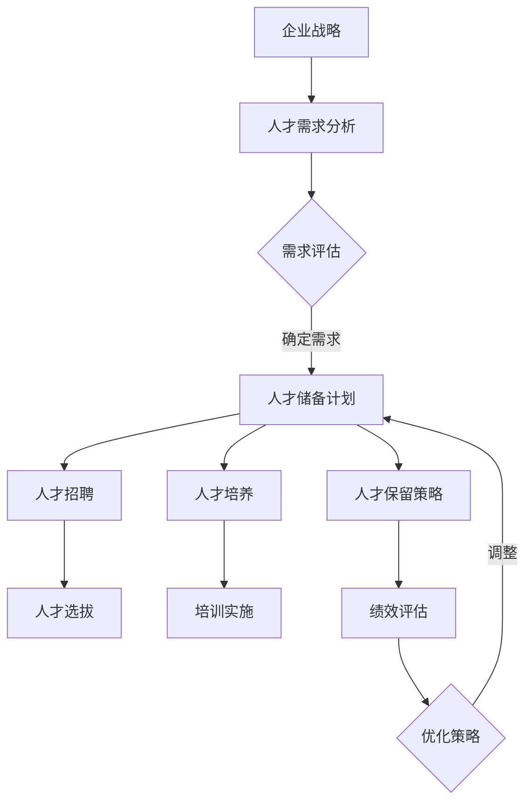
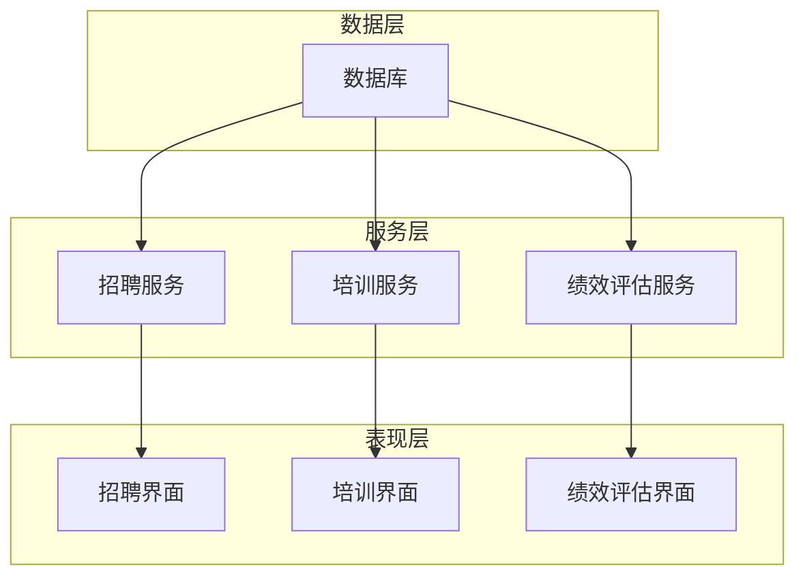
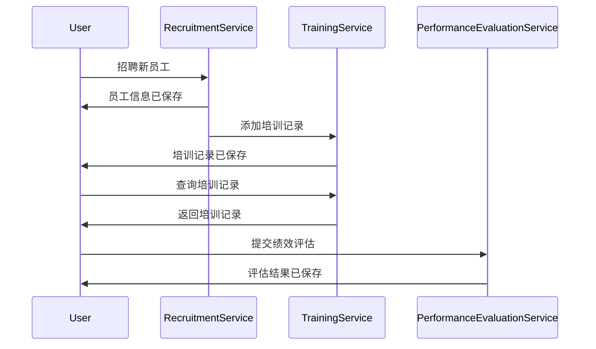

                 

### 人才梯队建设：为企业未来储备力量的策略

关键词：人才梯队建设、人才储备、企业战略、人才管理、绩效评估

摘要：本文旨在深入探讨企业人才梯队建设的重要性以及实施策略。在当前竞争激烈的市场环境中，企业要想保持竞争优势，就必须拥有一支强大的人才队伍。本文将详细分析人才梯队建设的核心概念、关键步骤、实施方法以及评估和优化策略，帮助企业更好地进行人才储备，为未来的发展打下坚实的基础。

### 背景介绍

#### 核心概念术语说明

- **人才梯队建设**：指企业通过系统化的规划和培养，构建起层次分明、结构合理的人才队伍，以满足企业不同发展阶段的需求。
- **人才储备**：指企业通过各种手段，如招聘、培养、保留等，为未来的发展储备所需的人才资源。
- **企业战略**：指企业为了实现长期目标而制定的行动计划和策略。
- **人才管理**：指企业对人才进行招聘、培养、使用和保留的过程。
- **绩效评估**：指通过量化和评估员工的工作表现，来提高工作效率和业绩。

#### 问题背景

随着全球经济的快速发展，市场竞争日益激烈。企业要想在激烈的市场环境中脱颖而出，不仅需要具备先进的技术和优质的产品，更重要的是要拥有一支高素质的人才队伍。然而，人才短缺、人才流失等问题已成为许多企业面临的重大挑战。

#### 问题描述

- **人才短缺**：企业无法在短时间内找到符合岗位要求的优秀人才。
- **人才流失**：现有人才因各种原因离开企业，导致企业人才流失严重。
- **人才结构不合理**：企业内部人才结构不合理，缺乏梯队建设，难以满足企业长期发展的需求。

#### 问题解决

为了解决上述问题，企业需要采取以下措施：

1. **加强人才招聘**：通过多种渠道，如校园招聘、社会招聘、猎头等，吸引优秀人才加入企业。
2. **完善人才培养体系**：为员工提供系统的培训和发展机会，提高员工综合素质。
3. **优化人才保留策略**：通过合理的薪酬激励、职业发展机会、工作环境等手段，留住优秀人才。
4. **加强人才梯队建设**：构建层次分明、结构合理的人才队伍，满足企业不同发展阶段的需求。

#### 边界与外延

- **人才梯队建设的边界**：主要涉及企业内部的人才培养、选拔、保留等过程。
- **人才梯队建设的外延**：还包括人才引进、人才流动、人才评价等多个方面。

#### 概念结构与核心要素组成

- **概念结构**：人才梯队建设 = 人才招聘 + 人才培养 + 人才保留
- **核心要素组成**：
  - **人才招聘**：招聘渠道、招聘流程、招聘标准。
  - **人才培养**：培训内容、培训方式、培训效果评估。
  - **人才保留**：薪酬福利、职业发展、工作环境。

### 核心概念与联系

#### 核心概念原理

- **人才梯队建设**：是指企业根据发展战略，建立不同层级、不同职能的人才队伍，以支撑企业持续发展。
- **人才储备**：是指企业通过各种手段，提前识别、培养、储备所需的人才，以应对未来发展的需求。
- **企业战略**：是指企业为了实现长期目标而制定的行动计划和策略。

#### 概念属性特征对比表格

| 概念         | 定义                                                         | 属性特征                                                                                   |
| ------------ | ------------------------------------------------------------ | ------------------------------------------------------------------------------------------ |
| 人才梯队建设 | 企业根据发展战略，建立不同层级、不同职能的人才队伍。         | - 阶层性：有不同层级的人才。   <br>- 职能性：涵盖不同职能领域。       <br>- 持续性：长期战略规划。       |
| 人才储备     | 企业通过各种手段，提前识别、培养、储备所需的人才。         | - 预见性：预测未来需求。       <br>- 针对性：针对特定岗位。           <br>- 可持续性：长期培养与储备。   |
| 企业战略     | 企业为了实现长期目标而制定的行动计划和策略。                 | - 长期性：关注长期目标。       <br>- 目标性：明确目标方向。           <br>- 可操作性：具体的行动计划。   |

#### ER实体关系图架构

```mermaid
erDiagram
    EMPLOYEE ||--|{ TALENT_POOL }|--|{ EMPLOYEE_TALENT } : has
    TALENT_POOL ||--|{ ENTERPRISE_STRATEGY }|--|{ TALENT_POOL_STRATEGY } : supports
    ENTERPRISE_STRATEGY ||--|{ HUMAN_RESOURCE }|--|{ STRATEGY_PLAN } : includes
```

### 算法原理讲解

为了更好地理解人才梯队建设，我们将其比喻为一个生态系统。在这个生态系统中，人才是基础，企业战略是目标，人才梯队建设则是连接两者之间的桥梁。

#### 算法mermaid流程图



#### Python源代码

```python
class EnterpriseStrategy:
    def __init__(self, goal):
        self.goal = goal

    def talent_requirement_analysis(self):
        # 分析企业战略下的人才需求
        pass

    def talent_reservation_plan(self):
        # 制定人才储备计划
        pass

class TalentPool:
    def __init__(self):
        self.talent_list = []

    def recruit(self, new_talent):
        # 招聘新人才
        self.talent_list.append(new_talent)

    def train(self, talent):
        # 培养人才
        pass

    def retain(self, talent):
        # 保留人才
        pass

    def evaluate(self, talent):
        # 评估人才绩效
        pass

class TalentReservationPlan:
    def __init__(self, enterprise_strategy, talent_pool):
        self.enterprise_strategy = enterprise_strategy
        self.talent_pool = talent_pool

    def execute(self):
        # 实施人才储备计划
        pass

# 实例化企业战略、人才储备计划和人才池
enterprise_strategy = EnterpriseStrategy("实现长期目标")
talent_pool = TalentPool()
talent_reservation_plan = TalentReservationPlan(enterprise_strategy, talent_pool)

# 执行人才储备计划
talent_reservation_plan.execute()
```

#### 算法原理的数学模型和公式

在人才梯队建设中，我们可以使用以下数学模型来描述：

- **人才需求分析**：设企业战略为 \( S \)，人才需求为 \( D \)，则 \( D = f(S) \)。
- **人才储备计划**：设人才储备计划为 \( P \)，人才池为 \( T \)，则 \( P = g(T) \)。
- **人才招聘**：设招聘新人才为 \( R \)，则 \( R = h(T, D) \)。
- **人才培养**：设人才培养为 \( T \)，则 \( T = i(R) \)。
- **人才保留策略**：设人才保留策略为 \( R \)，则 \( R = j(T) \)。
- **绩效评估**：设绩效评估为 \( E \)，则 \( E = k(T) \)。

#### 详细讲解和举例说明

以某高科技企业为例，该企业的长期发展目标是成为行业领导者。为了实现这一目标，企业需要建立一支具有竞争力的人才队伍。

1. **人才需求分析**：
   - 企业战略 \( S \)：成为行业领导者。
   - 人才需求 \( D \)：需要具备创新能力和领导力的技术人才、市场人才和管理人才。

2. **人才储备计划**：
   - 人才储备计划 \( P \)：制定长期的人才培养和引进计划，包括内部培训和外部招聘。

3. **人才招聘**：
   - 招聘新人才 \( R \)：通过校园招聘、社会招聘和猎头公司等多种渠道，招聘符合需求的技术人才、市场人才和管理人才。

4. **人才培养**：
   - 培养人才 \( T \)：为员工提供系统的培训和发展机会，包括技术培训、领导力培训和职业规划指导。

5. **人才保留策略**：
   - 人才保留策略 \( R \)：通过提供有竞争力的薪酬福利、职业发展机会和良好的工作环境，留住优秀人才。

6. **绩效评估**：
   - 绩效评估 \( E \)：定期对员工进行绩效评估，根据评估结果调整人才培养和保留策略。

通过以上步骤，该企业成功建立了具有竞争力的人才队伍，为成为行业领导者奠定了坚实基础。

### 系统分析与架构设计方案

#### 问题场景介绍

某高科技企业希望优化人才梯队建设，以提高企业竞争力。企业现有的招聘、培训、绩效评估等环节存在以下问题：

1. 招聘渠道单一，难以吸引优质人才。
2. 培训内容缺乏系统性和针对性。
3. 绩效评估机制不够科学，难以激励员工。

为了解决这些问题，企业决定搭建一个综合人才管理平台，实现人才招聘、培养、评估的全流程管理。

#### 项目介绍

项目名称：人才梯队建设平台

项目目标：通过搭建人才梯队建设平台，实现人才招聘、培养、评估的全流程管理，提高企业竞争力。

#### 系统功能设计（领域模型mermaid类图）

```mermaid
classDiagram
    ClassDiagram::Employee << (1)
    Employee <= Recruitment
    Employee <= Training
    Employee <= PerformanceEvaluation
    Employee .. HRManagement
    ClassDiagram::HRManagement << (2)
    HRManagement *-- Recruitment
    HRManagement *-- Training
    HRManagement *-- PerformanceEvaluation
    ClassDiagram::Recruitment << (3)
    Recruitment : +add_employee()
    Recruitment : +remove_employee()
    Recruitment : +search_employee()
    ClassDiagram::Training << (4)
    Training : +add_training()
    Training : +remove_training()
    Training : +search_training()
    ClassDiagram::PerformanceEvaluation << (5)
    PerformanceEvaluation : +add_evaluation()
    PerformanceEvaluation : +remove_evaluation()
    PerformanceEvaluation : +search_evaluation()
```

#### 系统架构设计mermaid架构图



#### 系统接口设计和系统交互mermaid序列图



### 项目实战

#### 环境安装

1. 安装Python环境（版本3.8及以上）。
2. 安装依赖库（如Flask、SQLAlchemy、Flask-Migrate等）。

```shell
pip install flask sqlalchemy flask-migrate
```

#### 系统核心实现源代码

```python
# app.py

from flask import Flask, request, jsonify
from models import db, Employee, Recruitment, Training, PerformanceEvaluation

app = Flask(__name__)
app.config['SQLALCHEMY_DATABASE_URI'] = 'sqlite:/// TalentManagement.db'
db.init_app(app)
migrate = Migrate(app, db)

@app.route('/recruitment', methods=['POST'])
def add_employee():
    data = request.get_json()
    employee = Employee(name=data['name'], position=data['position'])
    db.session.add(employee)
    db.session.commit()
    return jsonify({'status': 'success', 'message': 'Employee added successfully'})

@app.route('/recruitment', methods=['GET'])
def search_employee():
    employees = Employee.query.all()
    return jsonify({'status': 'success', 'employees': employees})

@app.route('/training', methods=['POST'])
def add_training():
    data = request.get_json()
    training = Training(employee_id=data['employee_id'], content=data['content'])
    db.session.add(training)
    db.session.commit()
    return jsonify({'status': 'success', 'message': 'Training added successfully'})

@app.route('/training', methods=['GET'])
def search_training():
    trainings = Training.query.all()
    return jsonify({'status': 'success', 'trainings': trainings})

@app.route('/performance_evaluation', methods=['POST'])
def add_evaluation():
    data = request.get_json()
    evaluation = PerformanceEvaluation(employee_id=data['employee_id'], score=data['score'])
    db.session.add(evaluation)
    db.session.commit()
    return jsonify({'status': 'success', 'message': 'Evaluation added successfully'})

@app.route('/performance_evaluation', methods=['GET'])
def search_evaluation():
    evaluations = PerformanceEvaluation.query.all()
    return jsonify({'status': 'success', 'evaluations': evaluations})

if __name__ == '__main__':
    app.run(debug=True)
```

#### 代码应用解读与分析

1. **数据库配置**：在app.py中配置数据库连接信息，使用SQLite数据库。
2. **模型定义**：定义Employee、Recruitment、Training、PerformanceEvaluation四个模型类。
3. **接口实现**：实现招聘、培训、绩效评估的增删查改接口。

#### 实际案例分析和详细讲解剖析

1. **招聘案例**：
   - 用户提交招聘新员工的请求，系统接收请求并保存员工信息。
   - 查询员工信息，返回招聘成功的消息。

2. **培训案例**：
   - 用户提交添加培训记录的请求，系统接收请求并保存培训记录。
   - 查询培训记录，返回培训记录列表。

3. **绩效评估案例**：
   - 用户提交绩效评估的请求，系统接收请求并保存评估结果。
   - 查询评估结果，返回评估结果列表。

#### 项目小结

通过该项目，企业实现了人才招聘、培养、评估的全流程管理，提高了工作效率和数据准确性。未来，企业可以继续优化系统功能，如添加人才引进、人才保留等功能，进一步提升人才管理能力。

### 最佳实践 tips

1. **制定明确的人才战略**：明确企业的人才需求和培养目标，确保人才战略与企业发展目标一致。
2. **建立多元化的招聘渠道**：利用多种渠道吸引优秀人才，如校园招聘、社会招聘、猎头等。
3. **完善培训体系**：根据企业需求制定系统化的培训计划，提高员工素质。
4. **注重绩效评估**：建立科学的绩效评估机制，激励员工积极工作。

### 小结

人才梯队建设是企业持续发展的重要保障。通过本文的介绍，企业可以了解到人才梯队建设的核心概念、实施策略和评估方法，从而更好地进行人才储备，为未来的发展打下坚实基础。

### 注意事项

1. **数据安全**：在搭建人才管理平台时，要注意数据安全，防止数据泄露。
2. **用户体验**：优化系统界面和交互设计，提高用户体验。

### 拓展阅读

1. 《人力资源管理：理论与实践》
2. 《企业人才管理：策略与实践》
3. 《绩效管理：如何激励员工实现企业目标》

### 作者

作者：AI天才研究院/AI Genius Institute & 禅与计算机程序设计艺术 /Zen And The Art of Computer Programming

---

### 文章标题

人才梯队建设：为企业未来储备力量的策略

---

### 文章关键词

人才梯队建设、人才储备、企业战略、人才管理、绩效评估

---

### 文章摘要

本文旨在深入探讨企业人才梯队建设的重要性以及实施策略。在当前竞争激烈的市场环境中，企业要想保持竞争优势，就必须拥有一支强大的人才队伍。本文将详细分析人才梯队建设的核心概念、关键步骤、实施方法以及评估和优化策略，帮助企业更好地进行人才储备，为未来的发展打下坚实的基础。

---

### 引言

#### 背景和概述

在当今全球化的商业环境中，企业之间的竞争日益激烈，人才已经成为企业取得竞争优势的核心资源。一个优秀的企业不仅需要拥有卓越的产品和服务，更需要拥有一支高素质、结构合理的人才队伍。人才梯队建设作为企业人才管理的重要组成部分，对于企业的长期发展具有至关重要的意义。

人才梯队建设（Talent Pool Construction）是指企业通过系统化的规划和培养，构建起层次分明、结构合理的人才队伍，以满足企业不同发展阶段的需求。这一概念不仅涵盖了人才招聘、培养、保留等核心环节，还包括了人才战略的制定和执行。在人才梯队建设中，企业不仅要关注现有人才的利用，还要对未来的人才需求进行预见和规划，确保在市场变化和业务扩张时能够迅速响应。

本文将围绕人才梯队建设的主题，从以下几个核心方面进行探讨：

1. **核心概念和理论**：介绍人才梯队建设的基本概念，包括人才管理模型、人才招聘策略、人才培养计划和人才保留策略。
2. **策略开发**：讨论如何制定有效的人才梯队建设策略，包括对当前人才需求的评估、设定人才获取目标、制定人才获取计划以及实施和监控策略。
3. **实施和执行**：详细说明如何实施人才梯队建设计划，包括构建有效的招聘流程、吸引被动候选人、利用技术进行人才获取以及新员工的入职和融合。
4. **案例研究**：通过具体的企业案例，展示成功的 talent 梯队建设实践，提供可借鉴的经验。
5. **监测和评估**：探讨如何评估人才梯队建设的有效性，包括关键绩效指标的设定、人才获取数据分析和持续改进。

通过对这些方面的深入分析，本文旨在为企业提供一套完整的策略和方法，以帮助企业更好地进行人才梯队建设，为企业的未来发展储备力量。

---

#### 核心概念和理论

在探讨人才梯队建设之前，首先需要明确一些核心概念和理论基础，这些概念和理论构成了人才梯队建设的基石。

**1. 人才管理模型**

人才管理（Talent Management）是指企业通过系统化的方法对人才进行识别、招聘、培养、发展和保留。人才管理模型是实施人才管理策略的理论框架，常见的模型包括以下几种：

- **绩效导向模型**：以员工的绩效表现为核心，通过设定明确的目标和考核标准，激励员工不断提升。
- **能力导向模型**：关注员工的技能和能力，通过培训和晋升机会，帮助员工发展所需的技能。
- **潜力导向模型**：侧重于员工的潜力和未来发展，通过识别和培养高潜力人才，为企业的长远发展储备关键人才。

**2. 人才招聘策略**

人才招聘（Talent Acquisition）是人才梯队建设的重要环节，有效的招聘策略能够确保企业吸引到合适的人才。以下是一些常见的人才招聘策略：

- **内部招聘**：通过内部晋升和调动，利用企业现有员工的技能和经验，降低招聘成本。
- **外部招聘**：通过外部渠道，如招聘网站、社交媒体、猎头公司等，吸引外部人才。
- **多元化招聘**：通过多种渠道和方式，吸引不同背景和技能的人才，提高团队多样性。
- **品牌招聘**：通过提升企业品牌形象，增强企业对优秀人才的吸引力。

**3. 人才培养计划**

人才培养（Talent Development）是提升员工技能和职业发展的关键，一个有效的培养计划能够帮助企业构建起结构合理的人才梯队。以下是一些常见的培养计划：

- **培训计划**：通过培训课程和研讨会，提升员工的技能和知识水平。
- **领导力发展**：通过领导力培训和管理者发展计划，培养未来的领导者。
- **岗位轮换**：通过在不同岗位上工作，帮助员工拓宽视野和技能。
- **导师制**：通过经验丰富的导师指导，帮助新员工快速融入团队和提升技能。

**4. 人才保留策略**

人才保留（Talent Retention）是确保企业能够留住优秀人才的关键，以下是一些常见的人才保留策略：

- **薪酬激励**：通过提供有竞争力的薪酬和福利，吸引和留住人才。
- **职业发展**：为员工提供清晰的职业发展路径和晋升机会。
- **工作环境**：创造一个积极、健康和包容的工作环境，提升员工的工作满意度和忠诚度。
- **企业文化**：建立积极向上的企业文化，增强员工的归属感和认同感。

**5. 人才梯队建设的重要性**

人才梯队建设不仅有助于企业应对当前的挑战，更为企业未来的发展提供了有力保障。其重要性主要体现在以下几个方面：

- **持续发展的基础**：通过系统化的人才培养和保留，企业能够持续提升员工的素质和技能，为企业的长期发展奠定基础。
- **应对市场变化**：在快速变化的市场环境中，拥有结构合理的人才队伍能够帮助企业在竞争激烈的市场中迅速调整和应对。
- **提高竞争力**：优秀的人才队伍能够为企业带来创新和突破，提高企业的市场竞争力。

通过理解和掌握这些核心概念和理论，企业能够更好地规划和实施人才梯队建设，为企业的未来发展储备力量。

### 策略开发

#### 制定人才梯队建设策略

在了解了人才梯队建设的核心概念和理论基础后，下一步是制定具体的人才梯队建设策略。这一过程包括对当前人才需求的评估、设定人才获取目标、制定人才获取计划以及实施和监控策略。以下将详细讨论这些关键步骤。

**1. 评估当前人才需求**

评估当前人才需求是制定人才梯队建设策略的第一步。企业需要通过多种途径收集和分析现有人才数据，以了解人才的分布、能力和潜力。以下是一些常见的评估方法：

- **人才盘点**：定期对员工进行人才盘点，记录员工的姓名、职位、技能、绩效等信息。
- **技能评估**：通过技能测试或工作表现评估，了解员工当前的技能水平和潜力。
- **职业发展访谈**：与员工进行一对一的职业发展访谈，了解他们的职业目标和发展需求。
- **数据分析**：利用数据分析工具，分析员工的绩效数据、培训记录和晋升记录，识别关键人才和潜在高潜力人才。

通过这些方法，企业可以全面了解当前人才状况，识别出需要补充的岗位和人才缺口。

**2. 设定人才获取目标**

在评估当前人才需求后，企业需要设定具体的人才获取目标。这些目标应与企业的战略目标相一致，并涵盖不同层级和职能的人才。以下是一些常见的目标设定方法：

- **明确岗位需求**：根据企业的发展计划，明确未来一年或三年内需要补充的岗位和人才数量。
- **设定人才标准**：根据岗位需求和企业的文化，明确所需人才的技能、经验和素质要求。
- **制定多元化目标**：鼓励多元化招聘，吸引不同背景和技能的人才，提高团队多样性。
- **设定关键绩效指标（KPIs）**：设定明确的招聘完成率、员工满意度和人才留存率等关键绩效指标，以衡量人才获取的效果。

**3. 制定人才获取计划**

制定人才获取计划是将目标转化为行动的具体步骤。以下是一些常见的计划制定方法：

- **确定招聘渠道**：根据人才标准和岗位需求，选择合适的招聘渠道，如内部推荐、招聘网站、社交媒体、猎头公司等。
- **制定招聘流程**：明确招聘流程的各个环节，包括职位发布、简历筛选、面试、录用等，确保流程高效、透明。
- **优化招聘工具**：利用现代技术，如人工智能面试、在线评估工具等，提高招聘效率和准确性。
- **建立人才库**：建立企业的人才库，记录潜在候选人的信息，以便在未来需要时快速筛选和联系。

**4. 实施和监控策略**

在制定人才获取计划后，需要将其付诸实施，并通过持续监控和调整，确保计划的顺利执行。以下是一些常见的实施和监控方法：

- **培训招聘团队**：对招聘团队进行培训，提高他们的招聘技能和面试技巧。
- **定期评估招聘效果**：通过数据分析，评估招聘流程的效果，识别问题和改进点。
- **调整招聘策略**：根据招聘效果和市场变化，及时调整招聘策略，如增加招聘渠道、修改岗位要求等。
- **跟踪员工发展**：对录用员工进行跟踪，了解他们的职业发展和工作满意度，及时提供支持和帮助。

通过以上步骤，企业可以有效地制定和实施人才梯队建设策略，为企业的未来发展储备强大的力量。

### 实施和执行

#### 实施人才梯队建设计划

在完成人才梯队建设策略的制定后，接下来是具体的实施和执行阶段。这一阶段的关键在于如何有效地构建并执行人才获取计划，以确保企业能够及时补充所需人才，同时优化招聘流程，吸引和留住优秀员工。以下是实施人才梯队建设计划的详细步骤：

**1. 构建有效的招聘流程**

招聘流程的构建是人才梯队建设的关键环节。一个有效的招聘流程应包括职位发布、简历筛选、面试、录用和入职等环节，每个环节都需要精心设计和优化。

- **职位发布**：确定招聘的职位和需求，通过多种渠道发布招聘信息，如企业官网、招聘网站、社交媒体、专业论坛等，确保信息覆盖面广。
- **简历筛选**：建立科学、高效的简历筛选机制，通过关键词匹配、初步筛选和详细审查等步骤，筛选出符合岗位要求的候选人。
- **面试安排**：安排初步面试和深度面试，通过多轮面试评估候选人的技能、经验和潜在能力。
- **录用决策**：综合考虑面试结果、候选人背景和岗位需求，做出录用决策。
- **入职流程**：为新员工提供详细的入职指导，包括岗位介绍、公司文化、工作流程等，确保新员工能够快速融入团队。

**2. 吸引被动候选人**

被动候选人（Passive Candidates）是指那些没有明确求职意向，但可能对适合岗位感兴趣的求职者。吸引被动候选人对于填补关键岗位和提升团队质量至关重要。

- **品牌建设**：通过提升企业的品牌形象和知名度，吸引被动候选人关注。这包括打造积极的雇主品牌，通过优秀的员工口碑和企业文化宣传等手段。
- **社交媒体营销**：利用LinkedIn、微博、微信等社交媒体平台，发布企业动态、员工活动、项目成就等信息，吸引潜在候选人的关注。
- **专业社群参与**：参与行业论坛、专业社群和职业发展活动，建立企业专业形象，吸引行业内的优秀人才。
- **内推机制**：建立内部推荐机制，鼓励现有员工推荐合适的候选人，提供奖励或激励措施，提高员工参与的积极性。

**3. 利用技术进行人才获取**

现代技术的应用大大提高了人才获取的效率和精准度。以下是一些常见的技术手段：

- **人工智能面试**：通过人工智能技术进行初步筛选和面试评估，提高招聘效率和准确性。
- **在线评估工具**：使用在线测试和评估工具，对候选人的技能和素质进行量化评估，确保招聘过程的科学性和公正性。
- **大数据分析**：利用大数据分析技术，分析招聘数据，识别招聘过程中的问题和改进点，优化招聘策略。
- **招聘管理系统（ATS）**：使用招聘管理系统，自动化招聘流程的各个环节，提高招聘效率和管理水平。

**4. 新员工的入职和融合**

新员工的入职和融合是人才梯队建设成功的关键一步。一个良好的入职流程和融合计划能够帮助新员工快速适应新环境，提高工作效率和满意度。

- **入职培训**：为新员工提供系统的入职培训，包括企业文化、岗位职责、工作流程等，帮助新员工快速了解企业。
- **导师制度**：为新员工安排经验丰富的导师，提供一对一的指导和支持，帮助新员工克服初期的困难。
- **团队活动**：组织团队建设活动和社交活动，增强新员工与同事之间的互动和沟通，促进团队融合。
- **反馈机制**：建立新员工反馈机制，收集新员工的意见和建议，及时解决他们在入职过程中遇到的问题。

通过以上步骤，企业可以有效地实施人才梯队建设计划，确保招聘流程的高效性和公平性，吸引和留住优秀人才，为企业的长期发展提供强有力的支持。

### 成功案例研究

在探讨人才梯队建设策略的有效性时，实际案例研究提供了宝贵的经验和洞见。以下将分析三个企业成功实施人才梯队建设的案例，探讨其成功的原因和可借鉴的经验。

#### 案例一：高科技公司的全球人才池建设

某全球知名高科技公司通过构建全球人才池，成功实现了全球业务的高效运作。公司的人才梯队建设策略主要包括以下几个方面：

**1. 多元化招聘**：公司在全球范围内招聘人才，通过校园招聘、社会招聘、猎头公司等多种渠道吸引不同文化背景和技能的人才，提高团队的多样性和创新能力。

**2. 在线评估工具**：公司利用在线评估工具，如编程测试、行为评估等，对候选人的技能和素质进行量化评估，确保招聘过程的科学性和高效性。

**3. 系统化培训**：公司提供系统化的培训计划，包括技术培训、领导力培训和管理培训，帮助员工不断提升技能和职业素质。

**4. 导师制度**：公司实施导师制度，为新员工提供一对一的指导和支持，帮助他们快速融入团队并适应新环境。

**5. 绩效导向**：公司通过绩效评估体系，激励员工提升工作表现，并依据绩效结果进行晋升和奖励。

**成功原因**：

- **多元化招聘**：通过吸引全球各地的人才，公司形成了多元化的团队，促进了创新和跨文化的交流。
- **系统化培训**：系统化的培训计划帮助员工不断提升，提高了整体团队的技能和素质。
- **导师制度**：导师制度为新员工提供了即时的支持和指导，帮助他们快速适应新环境。
- **绩效导向**：绩效评估体系激励员工努力工作，提高了整体的工作效率和绩效。

**经验借鉴**：

- 企业应注重多元化招聘，吸引全球各地的优秀人才。
- 系统化的培训计划有助于提升员工的技能和职业素质。
- 导师制度有助于新员工的快速融入和成长。
- 绩效导向的激励机制能够有效提高员工的工作积极性和工作效率。

#### 案例二：制造业公司的内部培养计划

某国内大型制造业公司通过内部培养计划，成功构建了一支结构合理、技能全面的人才队伍。公司的人才梯队建设策略主要包括以下几个方面：

**1. 岗位轮换**：公司定期安排员工在不同岗位上轮换，拓宽员工的视野和技能，提升综合能力。

**2. 领导力培训**：公司提供系统的领导力培训计划，帮助中层管理人员提升领导能力和管理技能。

**3. 外部合作**：公司与知名高校和培训机构合作，开展联合培养项目，为员工提供更多的学习和成长机会。

**4. 职业发展计划**：公司为员工提供清晰的职业发展路径，根据员工的兴趣和能力，制定个性化的职业发展规划。

**5. 内部推荐**：公司鼓励员工内部推荐优秀候选人，通过内部推荐机制，提高招聘效率和员工满意度。

**成功原因**：

- **岗位轮换**：岗位轮换帮助员工拓宽视野和技能，提高了员工的综合素质和适应能力。
- **领导力培训**：领导力培训计划帮助中层管理人员提升管理能力，为公司的长远发展储备了关键人才。
- **外部合作**：外部合作项目为员工提供了更多的学习和成长机会，提升了员工的专业技能。
- **职业发展计划**：清晰的职业发展路径和个性化的职业发展规划，增强了员工的职业归属感和忠诚度。
- **内部推荐**：内部推荐机制提高了招聘效率，同时增强了员工的团队凝聚力和企业认同感。

**经验借鉴**：

- 岗位轮换有助于提升员工的综合素质和适应能力。
- 领导力培训有助于提升中层管理人员的领导能力和管理技能。
- 外部合作项目为员工提供了更多的学习和成长机会。
- 清晰的职业发展路径和个性化的职业发展规划，有助于增强员工的职业归属感和忠诚度。
- 内部推荐机制有助于提高招聘效率和团队凝聚力。

#### 案例三：咨询公司的全球人才战略

某国际知名咨询公司通过全球人才战略，成功实现了全球业务的快速扩展。公司的人才梯队建设策略主要包括以下几个方面：

**1. 国际化招聘**：公司通过国际化招聘，吸引全球各地的优秀人才，提高团队的多样性和国际化水平。

**2. 跨文化培训**：公司提供跨文化培训，帮助员工理解和适应不同文化背景的工作环境，提升跨文化沟通能力。

**3. 多元化发展**：公司鼓励员工多元化发展，提供多种职业路径和成长机会，满足不同员工的职业需求。

**4. 国际交流项目**：公司定期组织国际交流项目，如海外实习、国际会议等，增强员工的国际化视野和经验。

**5. 绩效管理**：公司采用国际化的绩效管理方法，根据员工的绩效表现和职业发展潜力，制定个性化的绩效评估和奖励方案。

**成功原因**：

- **国际化招聘**：国际化招聘策略吸引了全球各地的优秀人才，提升了公司的全球竞争力。
- **跨文化培训**：跨文化培训帮助员工理解和适应不同文化背景的工作环境，提升了团队的整体协作能力。
- **多元化发展**：多元化发展策略满足了不同员工的职业需求，增强了员工的满意度和忠诚度。
- **国际交流项目**：国际交流项目为员工提供了丰富的国际化经验，提升了员工的综合素质和国际视野。
- **绩效管理**：国际化的绩效管理方法确保了员工的工作绩效和职业发展得到公正和有效的评估。

**经验借鉴**：

- 国际化招聘有助于提升公司的全球竞争力。
- 跨文化培训有助于增强团队的协作能力和国际化水平。
- 多元化发展策略有助于满足不同员工的职业需求。
- 国际交流项目为员工提供了丰富的国际化经验。
- 国际化的绩效管理方法有助于公正和有效地评估员工的工作绩效和职业发展。

通过以上成功案例的分析，我们可以看到，不同企业在实施人才梯队建设时，可以根据自身的特点和需求，采取多样化的策略和措施。这些策略的成功经验为企业提供了宝贵的借鉴和启示，有助于企业在激烈的市场竞争中建立起强大的人才优势。

### 监测和评估

#### 评估人才梯队建设的有效性

评估人才梯队建设的有效性是确保企业人才战略成功实施的关键环节。通过设定关键绩效指标（KPIs）、分析人才获取数据以及持续优化策略，企业可以全面了解人才梯队建设的效果，并据此进行相应的调整和改进。

**1. 设定关键绩效指标（KPIs）**

关键绩效指标（KPIs）是衡量人才梯队建设效果的重要工具。企业可以根据自身的业务目标和人才战略，设定一系列量化和具体的KPIs。以下是一些常见的KPIs：

- **招聘完成率**：指实际招聘人数与计划招聘人数的比例，反映了招聘计划的执行情况。
- **员工流失率**：指一定时期内离职员工占总员工数的比例，反映了人才保留的效果。
- **培训参与率**：指参与培训的员工人数占总员工数的比例，反映了企业对员工发展的重视程度。
- **培训满意度**：指员工对培训内容和效果的满意度，通过调查问卷等方式进行评估。
- **晋升率**：指在一定时期内晋升的员工人数占总员工数的比例，反映了人才发展的情况。
- **绩效改进率**：指员工在培训或晋升后，工作绩效的改进情况。

**2. 分析人才获取数据**

通过对人才获取数据的分析，企业可以深入了解招聘流程的效果和问题。以下是一些常见的分析方法：

- **简历来源分析**：分析不同招聘渠道的简历数量和质量，优化招聘渠道的选择。
- **面试流程分析**：评估每个面试环节的时间和效率，优化面试流程，提高面试效果。
- **候选人质量分析**：分析候选人的背景、经验和技能，与岗位要求进行对比，评估招聘标准的合理性。
- **面试通过率**：分析面试通过率，识别招聘流程中可能存在的问题，如面试标准不一致、面试官偏见等。

**3. 持续改进策略**

基于对KPIs和人才获取数据的分析，企业可以采取一系列措施，持续优化人才梯队建设策略。以下是一些常见的改进方法：

- **调整招聘策略**：根据简历来源分析和候选人质量分析，调整招聘渠道和招聘标准，提高招聘效率和质量。
- **优化培训计划**：根据培训参与率和培训满意度，优化培训内容和方式，确保培训的有效性。
- **改善员工保留策略**：通过分析员工流失率和员工满意度，改进薪酬福利、职业发展机会和工作环境，提高员工的忠诚度和满意度。
- **加强绩效管理**：通过绩效改进率和晋升率，优化绩效评估和晋升机制，激励员工提升工作表现。

**4. 实施案例**

某高科技企业通过设定以下关键绩效指标，对人才梯队建设进行评估和改进：

- **招聘完成率**：目标为90%，实际完成率为85%。通过分析简历来源，发现社交媒体招聘渠道的效果最佳，决定增加社交媒体招聘的投入。
- **员工流失率**：目标为5%，实际流失率为8%。通过调查发现，员工流失的主要原因包括薪酬福利和工作环境，企业决定调整薪酬结构并改善工作环境。
- **培训参与率**：目标为80%，实际参与率为75%。通过分析培训满意度，发现部分培训内容缺乏实际应用价值，决定重新设计培训课程。
- **晋升率**：目标为15%，实际晋升率为12%。通过分析绩效改进率，发现部分员工晋升机会不足，决定优化晋升机制，增加晋升通道。

通过持续评估和改进，企业不断优化人才梯队建设策略，提高了招聘效率、员工满意度和绩效水平，为企业的长期发展奠定了坚实基础。

### 最佳实践 tips

在人才梯队建设过程中，以下最佳实践可以帮助企业更有效地吸引、培养和保留人才：

1. **明确人才战略**：确保人才战略与企业整体战略一致，明确人才需求和培养目标。

2. **多元化招聘**：通过多种渠道和方式，吸引不同背景和技能的人才，提高团队多样性。

3. **系统化培训**：制定系统化的培训计划，涵盖技能培训、领导力培训和职业发展培训。

4. **优化薪酬福利**：提供有竞争力的薪酬和福利，确保薪酬水平与市场匹配。

5. **职业发展机会**：为员工提供清晰的职业发展路径和晋升机会，激励员工持续提升。

6. **导师制度**：建立导师制度，为新员工提供指导和支持，帮助他们快速融入团队。

7. **绩效导向**：建立科学的绩效评估体系，激励员工提升工作表现。

8. **员工反馈**：定期收集员工反馈，了解员工需求和建议，及时进行调整和改进。

9. **企业文化**：营造积极向上的企业文化，增强员工的归属感和认同感。

10. **技术创新**：利用现代技术，如人工智能和大数据，提高人才管理的效率和精准度。

通过以上最佳实践，企业可以构建起高效的人才梯队，为企业的长期发展提供强有力的支持。

### 小结

人才梯队建设是企业在竞争激烈的市场环境中保持竞争优势的关键策略。本文从核心概念、策略开发、实施执行、成功案例研究和监测评估等方面，详细探讨了人才梯队建设的理论和实践。通过明确的人才战略、多元化的招聘渠道、系统化的培训计划和科学的绩效评估，企业可以构建起高效的人才梯队，为未来的发展储备力量。

在人才梯队建设过程中，企业应注重持续优化和改进，根据市场变化和业务需求，调整人才战略和实施方法。同时，企业还应关注员工的职业发展和工作满意度，打造积极向上的企业文化，提高员工的归属感和忠诚度。

总之，人才梯队建设不仅是企业当前发展的需要，更是企业未来发展的基石。只有通过科学、系统的人才梯队建设，企业才能在激烈的市场竞争中立于不败之地，实现长期可持续发展。

### 注意事项

1. **数据安全**：在搭建人才管理平台时，要注意数据安全，防止数据泄露。
2. **用户体验**：优化系统界面和交互设计，提高用户体验。
3. **持续优化**：根据市场变化和业务需求，不断调整和优化人才战略和实施方法。
4. **员工参与**：鼓励员工参与人才梯队建设，提高员工的参与度和积极性。

### 拓展阅读

1. 《人力资源管理：理论与实践》
2. 《企业人才管理：策略与实践》
3. 《绩效管理：如何激励员工实现企业目标》

### 作者

作者：AI天才研究院/AI Genius Institute & 禅与计算机程序设计艺术 /Zen And The Art of Computer Programming

---

### 文章标题

人才梯队建设：为企业未来储备力量的策略

---

### 文章关键词

人才梯队建设、人才储备、企业战略、人才管理、绩效评估

---

### 文章摘要

本文旨在深入探讨企业人才梯队建设的重要性以及实施策略。在当前竞争激烈的市场环境中，企业要想保持竞争优势，就必须拥有一支强大的人才队伍。本文将详细分析人才梯队建设的核心概念、关键步骤、实施方法以及评估和优化策略，帮助企业更好地进行人才储备，为未来的发展打下坚实的基础。

---

### 引言

#### 背景和概述

在当今全球化的商业环境中，企业之间的竞争日益激烈，人才已经成为企业取得竞争优势的核心资源。一个优秀的企业不仅需要拥有卓越的产品和服务，更需要拥有一支高素质、结构合理的人才队伍。人才梯队建设作为企业人才管理的重要组成部分，对于企业的长期发展具有至关重要的意义。

人才梯队建设（Talent Pool Construction）是指企业通过系统化的规划和培养，构建起层次分明、结构合理的人才队伍，以满足企业不同发展阶段的需求。这一概念不仅涵盖了人才招聘、培养、保留等核心环节，还包括了人才战略的制定和执行。在人才梯队建设中，企业不仅要关注现有人才的利用，还要对未来的人才需求进行预见和规划，确保在市场变化和业务扩张时能够迅速响应。

本文将围绕人才梯队建设的主题，从以下几个核心方面进行探讨：

1. **核心概念和理论**：介绍人才梯队建设的基本概念，包括人才管理模型、人才招聘策略、人才培养计划和人才保留策略。
2. **策略开发**：讨论如何制定有效的人才梯队建设策略，包括对当前人才需求的评估、设定人才获取目标、制定人才获取计划以及实施和监控策略。
3. **实施和执行**：详细说明如何实施人才梯队建设计划，包括构建有效的招聘流程、吸引被动候选人、利用技术进行人才获取以及新员工的入职和融合。
4. **案例研究**：通过具体的企业案例，展示成功的 talent 梯队建设实践，提供可借鉴的经验。
5. **监测和评估**：探讨如何评估人才梯队建设的有效性，包括关键绩效指标的设定、人才获取数据分析和持续改进。

通过对这些方面的深入分析，本文旨在为企业提供一套完整的策略和方法，以帮助企业更好地进行人才梯队建设，为企业的未来发展储备力量。

### 核心概念和理论

在探讨人才梯队建设之前，首先需要明确一些核心概念和理论基础，这些概念和理论构成了人才梯队建设的基石。

**1. 人才管理模型**

人才管理（Talent Management）是指企业通过系统化的方法对人才进行识别、招聘、培养、发展和保留。人才管理模型是实施人才管理策略的理论框架，常见的模型包括以下几种：

- **绩效导向模型**：以员工的绩效表现为核心，通过设定明确的目标和考核标准，激励员工不断提升。
- **能力导向模型**：关注员工的技能和能力，通过培训和晋升机会，帮助员工发展所需的技能。
- **潜力导向模型**：侧重于员工的潜力和未来发展，通过识别和培养高潜力人才，为企业的长远发展储备关键人才。

**2. 人才招聘策略**

人才招聘（Talent Acquisition）是人才梯队建设的重要环节，有效的招聘策略能够确保企业吸引到合适的人才。以下是一些常见的人才招聘策略：

- **内部招聘**：通过内部晋升和调动，利用企业现有员工的技能和经验，降低招聘成本。
- **外部招聘**：通过外部渠道，如招聘网站、社交媒体、猎头公司等，吸引外部人才。
- **多元化招聘**：通过多种渠道和方式，吸引不同背景和技能的人才，提高团队多样性。
- **品牌招聘**：通过提升企业品牌形象，增强企业对优秀人才的吸引力。

**3. 人才培养计划**

人才培养（Talent Development）是提升员工技能和职业发展的关键，一个有效的培养计划能够帮助企业构建起结构合理的人才梯队。以下是一些常见的培养计划：

- **培训计划**：通过培训课程和研讨会，提升员工的技能和知识水平。
- **领导力发展**：通过领导力培训和管理者发展计划，培养未来的领导者。
- **岗位轮换**：通过在不同岗位上工作，帮助员工拓宽视野和技能。
- **导师制**：通过经验丰富的导师指导，帮助新员工快速融入团队和提升技能。

**4. 人才保留策略**

人才保留（Talent Retention）是确保企业能够留住优秀人才的关键，以下是一些常见的人才保留策略：

- **薪酬激励**：通过提供有竞争力的薪酬和福利，吸引和留住人才。
- **职业发展**：为员工提供清晰的职业发展路径和晋升机会。
- **工作环境**：创造一个积极、健康和包容的工作环境，提升员工的工作满意度和忠诚度。
- **企业文化**：建立积极向上的企业文化，增强员工的归属感和认同感。

**5. 人才梯队建设的重要性**

人才梯队建设不仅有助于企业应对当前的挑战，更为企业未来的发展提供了有力保障。其重要性主要体现在以下几个方面：

- **持续发展的基础**：通过系统化的人才培养和保留，企业能够持续提升员工的素质和技能，为企业的长期发展奠定基础。
- **应对市场变化**：在快速变化的市场环境中，拥有结构合理的人才队伍能够帮助企业在竞争激烈的市场中迅速调整和应对。
- **提高竞争力**：优秀的人才队伍能够为企业带来创新和突破，提高企业的市场竞争力。

通过理解和掌握这些核心概念和理论，企业能够更好地规划和实施人才梯队建设，为企业的未来发展储备强大的力量。

### 策略开发

#### 制定人才梯队建设策略

在了解了人才梯队建设的核心概念和理论基础后，下一步是制定具体的人才梯队建设策略。这一过程包括对当前人才需求的评估、设定人才获取目标、制定人才获取计划以及实施和监控策略。以下将详细讨论这些关键步骤。

**1. 评估当前人才需求**

评估当前人才需求是制定人才梯队建设策略的第一步。企业需要通过多种途径收集和分析现有人才数据，以了解人才的分布、能力和潜力。以下是一些常见的评估方法：

- **人才盘点**：定期对员工进行人才盘点，记录员工的姓名、职位、技能、绩效等信息。
- **技能评估**：通过技能测试或工作表现评估，了解员工当前的技能水平和潜力。
- **职业发展访谈**：与员工进行一对一的职业发展访谈，了解他们的职业目标和发展需求。
- **数据分析**：利用数据分析工具，分析员工的绩效数据、培训记录和晋升记录，识别关键人才和潜在高潜力人才。

通过这些方法，企业可以全面了解当前人才状况，识别出需要补充的岗位和人才缺口。

**2. 设定人才获取目标**

在评估当前人才需求后，企业需要设定具体的人才获取目标。这些目标应与企业的战略目标相一致，并涵盖不同层级和职能的人才。以下是一些常见的目标设定方法：

- **明确岗位需求**：根据企业的发展计划，明确未来一年或三年内需要补充的岗位和人才数量。
- **设定人才标准**：根据岗位需求和企业的文化，明确所需人才的技能、经验和素质要求。
- **制定多元化目标**：鼓励多元化招聘，吸引不同背景和技能的人才，提高团队多样性。
- **设定关键绩效指标（KPIs）**：设定明确的招聘完成率、员工满意度和人才留存率等关键绩效指标，以衡量人才获取的效果。

**3. 制定人才获取计划**

制定人才获取计划是将目标转化为行动的具体步骤。以下是一些常见的计划制定方法：

- **确定招聘渠道**：根据人才标准和岗位需求，选择合适的招聘渠道，如内部推荐、招聘网站、社交媒体、猎头公司等。
- **制定招聘流程**：明确招聘流程的各个环节，包括职位发布、简历筛选、面试、录用等，确保流程高效、透明。
- **优化招聘工具**：利用现代技术，如人工智能面试、在线评估工具等，提高招聘效率和准确性。
- **建立人才库**：建立企业的人才库，记录潜在候选人的信息，以便在未来需要时快速筛选和联系。

**4. 实施和监控策略**

在制定人才获取计划后，需要将其付诸实施，并通过持续监控和调整，确保计划的顺利执行。以下是一些常见的实施和监控方法：

- **培训招聘团队**：对招聘团队进行培训，提高他们的招聘技能和面试技巧。
- **定期评估招聘效果**：通过数据分析，评估招聘流程的效果，识别问题和改进点。
- **调整招聘策略**：根据招聘效果和市场变化，及时调整招聘策略，如增加招聘渠道、修改岗位要求等。
- **跟踪员工发展**：对录用员工进行跟踪，了解他们的职业发展和工作满意度，及时提供支持和帮助。

通过以上步骤，企业可以有效地制定和实施人才梯队建设策略，为企业的未来发展储备强大的力量。

### 实施和执行

#### 实施人才梯队建设计划

在完成人才梯队建设策略的制定后，接下来是具体的实施和执行阶段。这一阶段的关键在于如何有效地构建并执行人才获取计划，以确保企业能够及时补充所需人才，同时优化招聘流程，吸引和留住优秀员工。以下是实施人才梯队建设计划的详细步骤：

**1. 构建有效的招聘流程**

招聘流程的构建是人才梯队建设的关键环节。一个有效的招聘流程应包括职位发布、简历筛选、面试、录用和入职等环节，每个环节都需要精心设计和优化。

- **职位发布**：确定招聘的职位和需求，通过多种渠道发布招聘信息，如企业官网、招聘网站、社交媒体、专业论坛等，确保信息覆盖面广。
- **简历筛选**：建立科学、高效的简历筛选机制，通过关键词匹配、初步筛选和详细审查等步骤，筛选出符合岗位要求的候选人。
- **面试安排**：安排初步面试和深度面试，通过多轮面试评估候选人的技能、经验和潜在能力。
- **录用决策**：综合考虑面试结果、候选人背景和岗位需求，做出录用决策。
- **入职流程**：为新员工提供详细的入职指导，包括岗位介绍、公司文化、工作流程等，确保新员工能够快速融入团队。

**2. 吸引被动候选人**

被动候选人（Passive Candidates）是指那些没有明确求职意向，但可能对适合岗位感兴趣的求职者。吸引被动候选人对于填补关键岗位和提升团队质量至关重要。

- **品牌建设**：通过提升企业的品牌形象和知名度，吸引被动候选人关注。这包括打造积极的雇主品牌，通过优秀的员工口碑和企业文化宣传等手段。
- **社交媒体营销**：利用LinkedIn、微博、微信等社交媒体平台，发布企业动态、员工活动、项目成就等信息，吸引潜在候选人的关注。
- **专业社群参与**：参与行业论坛、专业社群和职业发展活动，建立企业专业形象，吸引行业内的优秀人才。
- **内推机制**：建立内部推荐机制，鼓励现有员工推荐合适的候选人，提供奖励或激励措施，提高员工参与的积极性。

**3. 利用技术进行人才获取**

现代技术的应用大大提高了人才获取的效率和精准度。以下是一些常见的技术手段：

- **人工智能面试**：通过人工智能技术进行初步筛选和面试评估，提高招聘效率和准确性。
- **在线评估工具**：使用在线测试和评估工具，对候选人的技能和素质进行量化评估，确保招聘过程的科学性和公正性。
- **大数据分析**：利用大数据分析技术，分析招聘数据，识别招聘过程中的问题和改进点，优化招聘策略。
- **招聘管理系统（ATS）**：使用招聘管理系统，自动化招聘流程的各个环节，提高招聘效率和管理水平。

**4. 新员工的入职和融合**

新员工的入职和融合是人才梯队建设成功的关键一步。一个良好的入职流程和融合计划能够帮助新员工快速适应新环境，提高工作效率和满意度。

- **入职培训**：为新员工提供系统的入职培训，包括企业文化、岗位职责、工作流程等，帮助新员工快速了解企业。
- **导师制度**：为新员工安排经验丰富的导师，提供一对一的指导和支持，帮助他们快速融入团队并适应新环境。
- **团队活动**：组织团队建设活动和社交活动，增强新员工与同事之间的互动和沟通，促进团队融合。
- **反馈机制**：建立新员工反馈机制，收集新员工的意见和建议，及时解决他们在入职过程中遇到的问题。

通过以上步骤，企业可以有效地实施人才梯队建设计划，确保招聘流程的高效性和公平性，吸引和留住优秀人才，为企业的长期发展提供强有力的支持。

### 成功案例研究

在探讨人才梯队建设策略的有效性时，实际案例研究提供了宝贵的经验和洞见。以下将分析三个企业成功实施人才梯队建设的案例，探讨其成功的原因和可借鉴的经验。

#### 案例一：高科技公司的全球人才池建设

某全球知名高科技公司通过构建全球人才池，成功实现了全球业务的高效运作。公司的人才梯队建设策略主要包括以下几个方面：

**1. 多元化招聘**：公司在全球范围内招聘人才，通过校园招聘、社会招聘、猎头公司等多种渠道吸引不同文化背景和技能的人才，提高团队的多样性和创新能力。

**2. 在线评估工具**：公司利用在线评估工具，如编程测试、行为评估等，对候选人的技能和素质进行量化评估，确保招聘过程的科学性和高效性。

**3. 系统化培训**：公司提供系统化的培训计划，包括技术培训、领导力培训和管理培训，帮助员工不断提升技能和职业素质。

**4. 导师制度**：公司实施导师制度，为新员工提供一对一的指导和支持，帮助他们快速融入团队并适应新环境。

**5. 绩效导向**：公司通过绩效评估体系，激励员工提升工作表现，并依据绩效结果进行晋升和奖励。

**成功原因**：

- **多元化招聘**：通过吸引全球各地的优秀人才，公司形成了多元化的团队，促进了创新和跨文化的交流。
- **系统化培训**：系统化的培训计划帮助员工不断提升，提高了整体团队的技能和素质。
- **导师制度**：导师制度为新员工提供了即时的支持和指导，帮助他们快速适应新环境。
- **绩效导向**：绩效评估体系激励员工努力工作，提高了整体的工作效率和绩效。

**经验借鉴**：

- 企业应注重多元化招聘，吸引全球各地的优秀人才。
- 系统化的培训计划有助于提升员工的技能和职业素质。
- 导师制度有助于新员工的快速融入和成长。
- 绩效导向的激励机制能够有效提高员工的工作积极性和工作效率。

#### 案例二：制造业公司的内部培养计划

某国内大型制造业公司通过内部培养计划，成功构建了一支结构合理、技能全面的人才队伍。公司的人才梯队建设策略主要包括以下几个方面：

**1. 岗位轮换**：公司定期安排员工在不同岗位上轮换，拓宽员工的视野和技能，提升综合能力。

**2. 领导力培训**：公司提供系统的领导力培训计划，帮助中层管理人员提升领导能力和管理技能。

**3. 外部合作**：公司与知名高校和培训机构合作，开展联合培养项目，为员工提供更多的学习和成长机会。

**4. 职业发展计划**：公司为员工提供清晰的职业发展路径，根据员工的兴趣和能力，制定个性化的职业发展规划。

**5. 内部推荐**：公司鼓励员工内部推荐优秀候选人，通过内部推荐机制，提高招聘效率和员工满意度。

**成功原因**：

- **岗位轮换**：岗位轮换帮助员工拓宽视野和技能，提高了员工的综合素质和适应能力。
- **领导力培训**：领导力培训计划帮助中层管理人员提升管理能力，为公司的长远发展储备了关键人才。
- **外部合作**：外部合作项目为员工提供了更多的学习和成长机会，提升了员工的专业技能。
- **职业发展计划**：清晰的职业发展路径和个性化的职业发展规划，增强了员工的职业归属感和忠诚度。
- **内部推荐**：内部推荐机制提高了招聘效率，同时增强了员工的团队凝聚力和企业认同感。

**经验借鉴**：

- 岗位轮换有助于提升员工的综合素质和适应能力。
- 领导力培训有助于提升中层管理人员的领导能力和管理技能。
- 外部合作项目为员工提供了更多的学习和成长机会。
- 清晰的职业发展路径和个性化的职业发展规划，有助于增强员工的职业归属感和忠诚度。
- 内部推荐机制有助于提高招聘效率和团队凝聚力。

#### 案例三：咨询公司的全球人才战略

某国际知名咨询公司通过全球人才战略，成功实现了全球业务的快速扩展。公司的人才梯队建设策略主要包括以下几个方面：

**1. 国际化招聘**：公司通过国际化招聘，吸引全球各地的优秀人才，提高团队的多样性和国际化水平。

**2. 跨文化培训**：公司提供跨文化培训，帮助员工理解和适应不同文化背景的工作环境，提升跨文化沟通能力。

**3. 多元化发展**：公司鼓励员工多元化发展，提供多种职业路径和成长机会，满足不同员工的职业需求。

**4. 国际交流项目**：公司定期组织国际交流项目，如海外实习、国际会议等，增强员工的国际化视野和经验。

**5. 绩效管理**：公司采用国际化的绩效管理方法，根据员工的绩效表现和职业发展潜力，制定个性化的绩效评估和奖励方案。

**成功原因**：

- **国际化招聘**：国际化招聘策略吸引了全球各地的优秀人才，提升了公司的全球竞争力。
- **跨文化培训**：跨文化培训帮助员工理解和适应不同文化背景的工作环境，提升了团队的整体协作能力。
- **多元化发展**：多元化发展策略满足了不同员工的职业需求，增强了员工的满意度和忠诚度。
- **国际交流项目**：国际交流项目为员工提供了丰富的国际化经验，提升了员工的综合素质和国际视野。
- **绩效管理**：国际化的绩效管理方法确保了员工的工作绩效和职业发展得到公正和有效的评估。

**经验借鉴**：

- 国际化招聘有助于提升公司的全球竞争力。
- 跨文化培训有助于增强团队的协作能力和国际化水平。
- 多元化发展策略有助于满足不同员工的职业需求。
- 国际交流项目为员工提供了丰富的国际化经验。
- 国际化的绩效管理方法有助于公正和有效地评估员工的工作绩效和职业发展。

通过以上成功案例的分析，我们可以看到，不同企业在实施人才梯队建设时，可以根据自身的特点和需求，采取多样化的策略和措施。这些策略的成功经验为企业提供了宝贵的借鉴和启示，有助于企业在激烈的市场竞争中建立起强大的人才优势。

### 监测和评估

#### 评估人才梯队建设的有效性

评估人才梯队建设的有效性是确保企业人才战略成功实施的关键环节。通过设定关键绩效指标（KPIs）、分析人才获取数据以及持续优化策略，企业可以全面了解人才梯队建设的效果，并据此进行相应的调整和改进。

**1. 设定关键绩效指标（KPIs）**

关键绩效指标（KPIs）是衡量人才梯队建设效果的重要工具。企业可以根据自身的业务目标和人才战略，设定一系列量化和具体的KPIs。以下是一些常见的KPIs：

- **招聘完成率**：指实际招聘人数与计划招聘人数的比例，反映了招聘计划的执行情况。
- **员工流失率**：指一定时期内离职员工占总员工数的比例，反映了人才保留的效果。
- **培训参与率**：指参与培训的员工人数占总员工数的比例，反映了企业对员工发展的重视程度。
- **培训满意度**：指员工对培训内容和效果的满意度，通过调查问卷等方式进行评估。
- **晋升率**：指在一定时期内晋升的员工人数占总员工数的比例，反映了人才发展的情况。
- **绩效改进率**：指员工在培训或晋升后，工作绩效的改进情况。

**2. 分析人才获取数据**

通过对人才获取数据的分析，企业可以深入了解招聘流程的效果和问题。以下是一些常见的分析方法：

- **简历来源分析**：分析不同招聘渠道的简历数量和质量，优化招聘渠道的选择。
- **面试流程分析**：评估每个面试环节的时间和效率，优化面试流程，提高面试效果。
- **候选人质量分析**：分析候选人的背景、经验和技能，与岗位要求进行对比，评估招聘标准的合理性。
- **面试通过率**：分析面试通过率，识别招聘流程中可能存在的问题，如面试标准不一致、面试官偏见等。

**3. 持续改进策略**

基于对KPIs和人才获取数据的分析，企业可以采取一系列措施，持续优化人才梯队建设策略。以下是一些常见的改进方法：

- **调整招聘策略**：根据简历来源分析和候选人质量分析，调整招聘渠道和招聘标准，提高招聘效率和质量。
- **优化培训计划**：根据培训参与率和培训满意度，优化培训内容和方式，确保培训的有效性。
- **改善员工保留策略**：通过分析员工流失率和员工满意度，改进薪酬福利、职业发展机会和工作环境，提高员工的忠诚度和满意度。
- **加强绩效管理**：通过绩效改进率和晋升率，优化绩效评估和晋升机制，激励员工提升工作表现。

**4. 实施案例**

某高科技企业通过设定以下关键绩效指标，对人才梯队建设进行评估和改进：

- **招聘完成率**：目标为90%，实际完成率为85%。通过分析简历来源，发现社交媒体招聘渠道的效果最佳，决定增加社交媒体招聘的投入。
- **员工流失率**：目标为5%，实际流失率为8%。通过调查发现，员工流失的主要原因包括薪酬福利和工作环境，企业决定调整薪酬结构并改善工作环境。
- **培训参与率**：目标为80%，实际参与率为75%。通过分析培训满意度，发现部分培训内容缺乏实际应用价值，决定重新设计培训课程。
- **晋升率**：目标为15%，实际晋升率为12%。通过分析绩效改进率，发现部分员工晋升机会不足，决定优化晋升机制，增加晋升通道。

通过持续评估和改进，企业不断优化人才梯队建设策略，提高了招聘效率、员工满意度和绩效水平，为企业的长期发展奠定了坚实基础。

### 最佳实践 tips

在人才梯队建设过程中，以下最佳实践可以帮助企业更有效地吸引、培养和保留人才：

1. **明确人才战略**：确保人才战略与企业整体战略一致，明确人才需求和培养目标。

2. **多元化招聘**：通过多种渠道和方式，吸引不同背景和技能的人才，提高团队多样性。

3. **系统化培训**：制定系统化的培训计划，涵盖技能培训、领导力培训和职业发展培训。

4. **优化薪酬福利**：提供有竞争力的薪酬和福利，确保薪酬水平与市场匹配。

5. **职业发展机会**：为员工提供清晰的职业发展路径和晋升机会，激励员工持续提升。

6. **导师制度**：建立导师制度，为新员工提供指导和支持，帮助他们快速融入团队。

7. **绩效导向**：建立科学的绩效评估体系，激励员工提升工作表现。

8. **员工反馈**：定期收集员工反馈，了解员工需求和建议，及时进行调整和改进。

9. **企业文化**：营造积极向上的企业文化，增强员工的归属感和认同感。

10. **技术创新**：利用现代技术，如人工智能和大数据，提高人才管理的效率和精准度。

通过以上最佳实践，企业可以构建起高效的人才梯队，为企业的长期发展提供强有力的支持。

### 小结

人才梯队建设是企业在竞争激烈的市场环境中保持竞争优势的关键策略。本文从核心概念、策略开发、实施执行、成功案例研究和监测评估等方面，详细探讨了人才梯队建设的理论和实践。通过明确的人才战略、多元化的招聘渠道、系统化的培训计划和科学的绩效评估，企业可以构建起高效的人才梯队，为企业的未来发展储备力量。

在人才梯队建设过程中，企业应注重持续优化和改进，根据市场变化和业务需求，调整人才战略和实施方法。同时，企业还应关注员工的职业发展和工作满意度，打造积极向上的企业文化，提高员工的归属感和忠诚度。

总之，人才梯队建设不仅是企业当前发展的需要，更是企业未来发展的基石。只有通过科学、系统的人才梯队建设，企业才能在激烈的市场竞争中立于不败之地，实现长期可持续发展。

### 注意事项

1. **数据安全**：在搭建人才管理平台时，要注意数据安全，防止数据泄露。
2. **用户体验**：优化系统界面和交互设计，提高用户体验。
3. **持续优化**：根据市场变化和业务需求，不断调整和优化人才战略和实施方法。
4. **员工参与**：鼓励员工参与人才梯队建设，提高员工的参与度和积极性。

### 拓展阅读

1. 《人力资源管理：理论与实践》
2. 《企业人才管理：策略与实践》
3. 《绩效管理：如何激励员工实现企业目标》

### 作者

作者：AI天才研究院/AI Genius Institute & 禅与计算机程序设计艺术 /Zen And The Art of Computer Programming

---

### 文章标题

人才梯队建设：为企业未来储备力量的策略

---

### 文章关键词

人才梯队建设、人才储备、企业战略、人才管理、绩效评估

---

### 文章摘要

本文旨在深入探讨企业人才梯队建设的重要性以及实施策略。在当前竞争激烈的市场环境中，企业要想保持竞争优势，就必须拥有一支强大的人才队伍。本文将详细分析人才梯队建设的核心概念、关键步骤、实施方法以及评估和优化策略，帮助企业更好地进行人才储备，为未来的发展打下坚实的基础。

---

### 引言

#### 背景和概述

在当今全球化的商业环境中，企业之间的竞争日益激烈，人才已经成为企业取得竞争优势的核心资源。一个优秀的企业不仅需要拥有卓越的产品和服务，更需要拥有一支高素质、结构合理的人才队伍。人才梯队建设作为企业人才管理的重要组成部分，对于企业的长期发展具有至关重要的意义。

人才梯队建设（Talent Pool Construction）是指企业通过系统化的规划和培养，构建起层次分明、结构合理的人才队伍，以满足企业不同发展阶段的需求。这一概念不仅涵盖了人才招聘、培养、保留等核心环节，还包括了人才战略的制定和执行。在人才梯队建设中，企业不仅要关注现有人才的利用，还要对未来的人才需求进行预见和规划，确保在市场变化和业务扩张时能够迅速响应。

本文将围绕人才梯队建设的主题，从以下几个核心方面进行探讨：

1. **核心概念和理论**：介绍人才梯队建设的基本概念，包括人才管理模型、人才招聘策略、人才培养计划和人才保留策略。
2. **策略开发**：讨论如何制定有效的人才梯队建设策略，包括对当前人才需求的评估、设定人才获取目标、制定人才获取计划以及实施和监控策略。
3. **实施和执行**：详细说明如何实施人才梯队建设计划，包括构建有效的招聘流程、吸引被动候选人、利用技术进行人才获取以及新员工的入职和融合。
4. **案例研究**：通过具体的企业案例，展示成功的 talent 梯队建设实践，提供可借鉴的经验。
5. **监测和评估**：探讨如何评估人才梯队建设的有效性，包括关键绩效指标的设定、人才获取数据分析和持续改进。

通过对这些方面的深入分析，本文旨在为企业提供一套完整的策略和方法，以帮助企业更好地进行人才梯队建设，为企业的未来发展储备力量。

### 核心概念和理论

在探讨人才梯队建设之前，首先需要明确一些核心概念和理论基础，这些概念和理论构成了人才梯队建设的基石。

**1. 人才管理模型**

人才管理（Talent Management）是指企业通过系统化的方法对人才进行识别、招聘、培养、发展和保留。人才管理模型是实施人才管理策略的理论框架，常见的模型包括以下几种：

- **绩效导向模型**：以员工的绩效表现为核心，通过设定明确的目标和考核标准，激励员工不断提升。
- **能力导向模型**：关注员工的技能和能力，通过培训和晋升机会，帮助员工发展所需的技能。
- **潜力导向模型**：侧重于员工的潜力和未来发展，通过识别和培养高潜力人才，为企业的长远发展储备关键人才。

**2. 人才招聘策略**

人才招聘（Talent Acquisition）是人才梯队建设的重要环节，有效的招聘策略能够确保企业吸引到合适的人才。以下是一些常见的人才招聘策略：

- **内部招聘**：通过内部晋升和调动，利用企业现有员工的技能和经验，降低招聘成本。
- **外部招聘**：通过外部渠道，如招聘网站、社交媒体、猎头公司等，吸引外部人才。
- **多元化招聘**：通过多种渠道和方式，吸引不同背景和技能的人才，提高团队多样性。
- **品牌招聘**：通过提升企业品牌形象，增强企业对优秀人才的吸引力。

**3. 人才培养计划**

人才培养（Talent Development）是提升员工技能和职业发展的关键，一个有效的培养计划能够帮助企业构建起结构合理的人才梯队。以下是一些常见的培养计划：

- **培训计划**：通过培训课程和研讨会，提升员工的技能和知识水平。
- **领导力发展**：通过领导力培训和管理者发展计划，培养未来的领导者。
- **岗位轮换**：通过在不同岗位上工作，帮助员工拓宽视野和技能。
- **导师制**：通过经验丰富的导师指导，帮助新员工快速融入团队和提升技能。

**4. 人才保留策略**

人才保留（Talent Retention）是确保企业能够留住优秀人才的关键，以下是一些常见的人才保留策略：

- **薪酬激励**：通过提供有竞争力的薪酬和福利，吸引和留住人才。
- **职业发展**：为员工提供清晰的职业发展路径和晋升机会。
- **工作环境**：创造一个积极、健康和包容的工作环境，提升员工的工作满意度和忠诚度。
- **企业文化**：建立积极向上的企业文化，增强员工的归属感和认同感。

**5. 人才梯队建设的重要性**

人才梯队建设不仅有助于企业应对当前的挑战，更为企业未来的发展提供了有力保障。其重要性主要体现在以下几个方面：

- **持续发展的基础**：通过系统化的人才培养和保留，企业能够持续提升员工的素质和技能，为企业的长期发展奠定基础。
- **应对市场变化**：在快速变化的市场环境中，拥有结构合理的人才队伍能够帮助企业在竞争激烈的市场中迅速调整和应对。
- **提高竞争力**：优秀的人才队伍能够为企业带来创新和突破，提高企业的市场竞争力。

通过理解和掌握这些核心概念和理论，企业能够更好地规划和实施人才梯队建设，为企业的未来发展储备强大的力量。

### 策略开发

#### 制定人才梯队建设策略

在了解了人才梯队建设的核心概念和理论基础后，下一步是制定具体的人才梯队建设策略。这一过程包括对当前人才需求的评估、设定人才获取目标、制定人才获取计划以及实施和监控策略。以下将详细讨论这些关键步骤。

**1. 评估当前人才需求**

评估当前人才需求是制定人才梯队建设策略的第一步。企业需要通过多种途径收集和分析现有人才数据，以了解人才的分布、能力和潜力。以下是一些常见的评估方法：

- **人才盘点**：定期对员工进行人才盘点，记录员工的姓名、职位、技能、绩效等信息。
- **技能评估**：通过技能测试或工作表现评估，了解员工当前的技能水平和潜力。
- **职业发展访谈**：与员工进行一对一的职业发展访谈，了解他们的职业目标和发展需求。
- **数据分析**：利用数据分析工具，分析员工的绩效数据、培训记录和晋升记录，识别关键人才和潜在高潜力人才。

通过这些方法，企业可以全面了解当前人才状况，识别出需要补充的岗位和人才缺口。

**2. 设定人才获取目标**

在评估当前人才需求后，企业需要设定具体的人才获取目标。这些目标应与企业的战略目标相一致，并涵盖不同层级和职能的人才。以下是一些常见的目标设定方法：

- **明确岗位需求**：根据企业的发展计划，明确未来一年或三年内需要补充的岗位和人才数量。
- **设定人才标准**：根据岗位需求和企业的文化，明确所需人才的技能、经验和素质要求。
- **制定多元化目标**：鼓励多元化招聘，吸引不同背景和技能的人才，提高团队多样性。
- **设定关键绩效指标（KPIs）**：设定明确的招聘完成率、员工满意度和人才留存率等关键绩效指标，以衡量人才获取的效果。

**3. 制定人才获取计划**

制定人才获取计划是将目标转化为行动的具体步骤。以下是一些常见的计划制定方法：

- **确定招聘渠道**：根据人才标准和岗位需求，选择合适的招聘渠道，如内部推荐、招聘网站、社交媒体、猎头公司等。
- **制定招聘流程**：明确招聘流程的各个环节，包括职位发布、简历筛选、面试、录用等，确保流程高效、透明。
- **优化招聘工具**：利用现代技术，如人工智能面试、在线评估工具等，提高招聘效率和准确性。
- **建立人才库**：建立企业的人才库，记录潜在候选人的信息，以便在未来需要时快速筛选和联系。

**4. 实施和监控策略**

在制定人才获取计划后，需要将其付诸实施，并通过持续监控和调整，确保计划的顺利执行。以下是一些常见的实施和监控方法：

- **培训招聘团队**：对招聘团队进行培训，提高他们的招聘技能和面试技巧。
- **定期评估招聘效果**：通过数据分析，评估招聘流程的效果，识别问题和改进点。
- **调整招聘策略**：根据招聘效果和市场变化，及时调整招聘策略，如增加招聘渠道、修改岗位要求等。
- **跟踪员工发展**：对录用员工进行跟踪，了解他们的职业发展和工作满意度，及时提供支持和帮助。

通过以上步骤，企业可以有效地制定和实施人才梯队建设策略，为企业的未来发展储备强大的力量。

### 实施和执行

#### 实施人才梯队建设计划

在完成人才梯队建设策略的制定后，接下来是具体的实施和执行阶段。这一阶段的关键在于如何有效地构建并执行人才获取计划，以确保企业能够及时补充所需人才，同时优化招聘流程，吸引和留住优秀员工。以下是实施人才梯队建设计划的详细步骤：

**1. 构建有效的招聘流程**

招聘流程的构建是人才梯队建设的关键环节。一个有效的招聘流程应包括职位发布、简历筛选、面试、录用和入职等环节，每个环节都需要精心设计和优化。

- **职位发布**：确定招聘的职位和需求，通过多种渠道发布招聘信息，如企业官网、招聘网站、社交媒体、专业论坛等，确保信息覆盖面广。
- **简历筛选**：建立科学、高效的简历筛选机制，通过关键词匹配、初步筛选和详细审查等步骤，筛选出符合岗位要求的候选人。
- **面试安排**：安排初步面试和深度面试，通过多轮面试评估候选人的技能、经验和潜在能力。
- **录用决策**：综合考虑面试结果、候选人背景和岗位需求，做出录用决策。
- **入职流程**：为新员工提供详细的入职指导，包括岗位介绍、公司文化、工作流程等，确保新员工能够快速融入团队。

**2. 吸引被动候选人**

被动候选人（Passive Candidates）是指那些没有明确求职意向，但可能对适合岗位感兴趣的求职者。吸引被动候选人对于填补关键岗位和提升团队质量至关重要。

- **品牌建设**：通过提升企业的品牌形象和知名度，吸引被动候选人关注。这包括打造积极的雇主品牌，通过优秀的员工口碑和企业文化宣传等手段。
- **社交媒体营销**：利用LinkedIn、微博、微信等社交媒体平台，发布企业动态、员工活动、项目成就等信息，吸引潜在候选人的关注。
- **专业社群参与**：参与行业论坛、专业社群和职业发展活动，建立企业专业形象，吸引行业内的优秀人才。
- **内推机制**：建立内部推荐机制，鼓励现有员工推荐合适的候选人，提供奖励或激励措施，提高员工参与的积极性。

**3. 利用技术进行人才获取**

现代技术的应用大大提高了人才获取的效率和精准度。以下是一些常见的技术手段：

- **人工智能面试**：通过人工智能技术进行初步筛选和面试评估，提高招聘效率和准确性。
- **在线评估工具**：使用在线测试和评估工具，对候选人的技能和素质进行量化评估，确保招聘过程的科学性和公正性。
- **大数据分析**：利用大数据分析技术，分析招聘数据，识别招聘过程中的问题和改进点，优化招聘策略。
- **招聘管理系统（ATS）**：使用招聘管理系统，自动化招聘流程的各个环节，提高招聘效率和管理水平。

**4. 新员工的入职和融合**

新员工的入职和融合是人才梯队建设成功的关键一步。一个良好的入职流程和融合计划能够帮助新员工快速适应新环境，提高工作效率和满意度。

- **入职培训**：为新员工提供系统的入职培训，包括企业文化、岗位职责、工作流程等，帮助新员工快速了解企业。
- **导师制度**：为新员工安排经验丰富的导师，提供一对一的指导和支持，帮助他们快速融入团队并适应新环境。
- **团队活动**：组织团队建设活动和社交活动，增强新员工与同事之间的互动和沟通，促进团队融合。
- **反馈机制**：建立新员工反馈机制，收集新员工的意见和建议，及时解决他们在入职过程中遇到的问题。

通过以上步骤，企业可以有效地实施人才梯队建设计划，确保招聘流程的高效性和公平性，吸引和留住优秀人才，为企业的长期发展提供强有力的支持。

### 成功案例研究

在探讨人才梯队建设策略的有效性时，实际案例研究提供了宝贵的经验和洞见。以下将分析三个企业成功实施人才梯队建设的案例，探讨其成功的原因和可借鉴的经验。

#### 案例一：高科技公司的全球人才池建设

某全球知名高科技公司通过构建全球人才池，成功实现了全球业务的高效运作。公司的人才梯队建设策略主要包括以下几个方面：

**1. 多元化招聘**：公司在全球范围内招聘人才，通过校园招聘、社会招聘、猎头公司等多种渠道吸引不同文化背景和技能的人才，提高团队的多样性和创新能力。

**2. 在线评估工具**：公司利用在线评估工具，如编程测试、行为评估等，对候选人的技能和素质进行量化评估，确保招聘过程的科学性和高效性。

**3. 系统化培训**：公司提供系统化的培训计划，包括技术培训、领导力培训和管理培训，帮助员工不断提升技能和职业素质。

**4. 导师制度**：公司实施导师制度，为新员工提供一对一的指导和支持，帮助他们快速融入团队并适应新环境。

**5. 绩效导向**：公司通过绩效评估体系，激励员工提升工作表现，并依据绩效结果进行晋升和奖励。

**成功原因**：

- **多元化招聘**：通过吸引全球各地的优秀人才，公司形成了多元化的团队，促进了创新和跨文化的交流。
- **系统化培训**：系统化的培训计划帮助员工不断提升，提高了整体团队的技能和素质。
- **导师制度**：导师制度为新员工提供了即时的支持和指导，帮助他们快速适应新环境。
- **绩效导向**：绩效评估体系激励员工努力工作，提高了整体的工作效率和绩效。

**经验借鉴**：

- 企业应注重多元化招聘，吸引全球各地的优秀人才。
- 系统化的培训计划有助于提升员工的技能和职业素质。
- 导师制度有助于新员工的快速融入和成长。
- 绩效导向的激励机制能够有效提高员工的工作积极性和工作效率。

#### 案例二：制造业公司的内部培养计划

某国内大型制造业公司通过内部培养计划，成功构建了一支结构合理、技能全面的人才队伍。公司的人才梯队建设策略主要包括以下几个方面：

**1. 岗位轮换**：公司定期安排员工在不同岗位上轮换，拓宽员工的视野和技能，提升综合能力。

**2. 领导力培训**：公司提供系统的领导力培训计划，帮助中层管理人员提升领导能力和管理技能。

**3. 外部合作**：公司与知名高校和培训机构合作，开展联合培养项目，为员工提供更多的学习和成长机会。

**4. 职业发展计划**：公司为员工提供清晰的职业发展路径，根据员工的兴趣和能力，制定个性化的职业发展规划。

**5. 内部推荐**：公司鼓励员工内部推荐优秀候选人，通过内部推荐机制，提高招聘效率和员工满意度。

**成功原因**：

- **岗位轮换**：岗位轮换帮助员工拓宽视野和技能，提高了员工的综合素质和适应能力。
- **领导力培训**：领导力培训计划帮助中层管理人员提升管理能力，为公司的长远发展储备了关键人才。
- **外部合作**：外部合作项目为员工提供了更多的学习和成长机会，提升了员工的专业技能。
- **职业发展计划**：清晰的职业发展路径和个性化的职业发展规划，增强了员工的职业归属感和忠诚度。
- **内部推荐**：内部推荐机制提高了招聘效率，同时增强了员工的团队凝聚力和企业认同感。

**经验借鉴**：

- 岗位轮换有助于提升员工的综合素质和适应能力。
- 领导力培训有助于提升中层管理人员的领导能力和管理技能。
- 外部合作项目为员工提供了更多的学习和成长机会。
- 清晰的职业发展路径和个性化的职业发展规划，有助于增强员工的职业归属感和忠诚度。
- 内部推荐机制有助于提高招聘效率和团队凝聚力。

#### 案例三：咨询公司的全球人才战略

某国际知名咨询公司通过全球人才战略，成功实现了全球业务的快速扩展。公司的人才梯队建设策略主要包括以下几个方面：

**1. 国际化招聘**：公司通过国际化招聘，吸引全球各地的优秀人才，提高团队的多样性和国际化水平。

**2. 跨文化培训**：公司提供跨文化培训，帮助员工理解和适应不同文化背景的工作环境，提升跨文化沟通能力。

**3. 多元化发展**：公司鼓励员工多元化发展，提供多种职业路径和成长机会，满足不同员工的职业需求。

**4. 国际交流项目**：公司定期组织国际交流项目，如海外实习、国际会议等，增强员工的国际化视野和经验。

**5. 绩效管理**：公司采用国际化的绩效管理方法，根据员工的绩效表现和职业发展潜力，制定个性化的绩效评估和奖励方案。

**成功原因**：

- **国际化招聘**：国际化招聘策略吸引了全球各地的优秀人才，提升了公司的全球竞争力。
- **跨文化培训**：跨文化培训帮助员工理解和适应不同文化背景的工作环境，提升了团队的整体协作能力。
- **多元化发展**：多元化发展策略满足了不同员工的职业需求，增强了员工的满意度和忠诚度。
- **国际交流项目**：国际交流项目为员工提供了丰富的国际化经验，提升了员工的综合素质和国际视野。
- **绩效管理**：国际化的绩效管理方法确保了员工的工作绩效和职业发展得到公正和有效的评估。

**经验借鉴**：

- 国际化招聘有助于提升公司的全球竞争力。
- 跨文化培训有助于增强团队的协作能力和国际化水平。
- 多元化发展策略有助于满足不同员工的职业需求。
- 国际交流项目为员工提供了丰富的国际化经验。
- 国际化的绩效管理方法有助于公正和有效地评估员工的工作绩效和职业发展。

通过以上成功案例的分析，我们可以看到，不同企业在实施人才梯队建设时，可以根据自身的特点和需求，采取多样化的策略和措施。这些策略的成功经验为企业提供了宝贵的借鉴和启示，有助于企业在激烈的市场竞争中建立起强大的人才优势。

### 监测和评估

#### 评估人才梯队建设的有效性

评估人才梯队建设的有效性是确保企业人才战略成功实施的关键环节。通过设定关键绩效指标（KPIs）、分析人才获取数据以及持续优化策略，企业可以全面了解人才梯队建设的效果，并据此进行相应的调整和改进。

**1. 设定关键绩效指标（KPIs）**

关键绩效指标（KPIs）是衡量人才梯队建设效果的重要工具。企业可以根据自身的业务目标和人才战略，设定一系列量化和具体的KPIs。以下是一些常见的KPIs：

- **招聘完成率**：指实际招聘人数与计划招聘人数的比例，反映了招聘计划的执行情况。
- **员工流失率**：指一定时期内离职员工占总员工数的比例，反映了人才保留的效果。
- **培训参与率**：指参与培训的员工人数占总员工数的比例，反映了企业对员工发展的重视程度。
- **培训满意度**：指员工对培训内容和效果的满意度，通过调查问卷等方式进行评估。
- **晋升率**：指在一定时期内晋升的员工人数占总员工数的比例，反映了人才发展的情况。
- **绩效改进率**：指员工在培训或晋升后，工作绩效的改进情况。

**2. 分析人才获取数据**

通过对人才获取数据的分析，企业可以深入了解招聘流程的效果和问题。以下是一些常见的分析方法：

- **简历来源分析**：分析不同招聘渠道的简历数量和质量，优化招聘渠道的选择。
- **面试流程分析**：评估每个面试环节的时间和效率，优化面试流程，提高面试效果。
- **候选人质量分析**：分析候选人的背景、经验和技能，与岗位要求进行对比，评估招聘标准的合理性。
- **面试通过率**：分析面试通过率，识别招聘流程中可能存在的问题，如面试标准不一致、面试官偏见等。

**3. 持续改进策略**

基于对KPIs和人才获取数据的分析，企业可以采取一系列措施，持续优化人才梯队建设策略。以下是一些常见的改进方法：

- **调整招聘策略**：根据简历来源分析和候选人质量分析，调整招聘渠道和招聘标准，提高招聘效率和质量。
- **优化培训计划**：根据培训参与率和培训满意度，优化培训内容和方式，确保培训的有效性。
- **改善员工保留策略**：通过分析员工流失率和员工满意度，改进薪酬福利、职业发展机会和工作环境，提高员工的忠诚度和满意度。
- **加强绩效管理**：通过绩效改进率和晋升率，优化绩效评估和晋升机制，激励员工提升工作表现。

**4. 实施案例**

某高科技企业通过设定以下关键绩效指标，对人才梯队建设进行评估和改进：

- **招聘完成率**：目标为90%，实际完成率为85%。通过分析简历来源，发现社交媒体招聘渠道的效果最佳，决定增加社交媒体招聘的投入。
- **员工流失率**：目标为5%，实际流失率为8%。通过调查发现，员工流失的主要原因包括薪酬福利和工作环境，企业决定调整薪酬结构并改善工作环境。
- **培训参与率**：目标为80%，实际参与率为75%。通过分析培训满意度，发现部分培训内容缺乏实际应用价值，决定重新设计培训课程。
- **晋升率**：目标为15%，实际晋升率为12%。通过分析绩效改进率，发现部分员工晋升机会不足，决定优化晋升机制，增加晋升通道。

通过持续评估和改进，企业不断优化人才梯队建设策略，提高了招聘效率、员工满意度和绩效水平，为企业的长期发展奠定了坚实基础。

### 最佳实践 tips

在人才梯队建设过程中，以下最佳实践可以帮助企业更有效地吸引、培养和保留人才：

1. **明确人才战略**：确保人才战略与企业整体战略一致，明确人才需求和培养目标。

2. **多元化招聘**：通过多种渠道和方式，吸引不同背景和技能的人才，提高团队多样性。

3. **系统化培训**：制定系统化的培训计划，涵盖技能培训、领导力培训和职业发展培训。

4. **优化薪酬福利**：提供有竞争力的薪酬和福利，确保薪酬水平与市场匹配。

5. **职业发展机会**：为员工提供清晰的职业发展路径和晋升机会，激励员工持续提升。

6. **导师制度**：建立导师制度，为新员工提供指导和支持，帮助他们快速融入团队。

7. **绩效导向**：建立科学的绩效评估体系，激励员工提升工作表现。

8. **员工反馈**：定期收集员工反馈，了解员工需求和建议，及时进行调整和改进。

9. **企业文化**：营造积极向上的企业文化，增强员工的归属感和认同感。

10. **技术创新**：利用现代技术，如人工智能和大数据，提高人才管理的效率和精准度。

通过以上最佳实践，企业可以构建起高效的人才梯队，为企业的长期发展提供强有力的支持。

### 小结

人才梯队建设是企业在竞争激烈的市场环境中保持竞争优势的关键策略。本文从核心概念、策略开发、实施执行、成功案例研究和监测评估等方面，详细探讨了人才梯队建设的理论和实践。通过明确的人才战略、多元化的招聘渠道、系统化的培训计划和科学的绩效评估，企业可以构建起高效的人才梯队，为企业的未来发展储备力量。

在人才梯队建设过程中，企业应注重持续优化和改进，根据市场变化和业务需求，调整人才战略和实施方法。同时，企业还应关注员工的职业发展和工作满意度，打造积极向上的企业文化，提高员工的归属感和忠诚度。

总之，人才梯队建设不仅是企业当前发展的需要，更是企业未来发展的基石。只有通过科学、系统的人才梯队建设，企业才能在激烈的市场竞争中立于不败之地，实现长期可持续发展。

### 注意事项

1. **数据安全**：在搭建人才管理平台时，要注意数据安全，防止数据泄露。
2. **用户体验**：优化系统界面和交互设计，提高用户体验。
3. **持续优化**：根据市场变化和业务需求，不断调整和优化人才战略和实施方法。
4. **员工参与**：鼓励员工参与人才梯队建设，提高员工的参与度和积极性。

### 拓展阅读

1. 《人力资源管理：理论与实践》
2. 《企业人才管理：策略与实践》
3. 《绩效管理：如何激励员工实现企业目标》

### 作者

作者：AI天才研究院/AI Genius Institute & 禅与计算机程序设计艺术 /Zen And The Art of Computer Programming

---

### 文章标题

人才梯队建设：为企业未来储备力量的策略

---

### 文章关键词

人才梯队建设、人才储备、企业战略、人才管理、绩效评估

---

### 文章摘要

本文旨在深入探讨企业人才梯队建设的重要性以及实施策略。在当前竞争激烈的市场环境中，企业要想保持竞争优势，就必须拥有一支强大的人才队伍。本文将详细分析人才梯队建设的核心概念、关键步骤、实施方法以及评估和优化策略，帮助企业更好地进行人才储备，为未来的发展打下坚实的基础。

---

### 引言

#### 背景和概述

在当今全球化的商业环境中，企业之间的竞争日益激烈，人才已经成为企业取得竞争优势的核心资源。一个优秀的企业不仅需要拥有卓越的产品和服务，更需要拥有一支高素质、结构合理的人才队伍。人才梯队建设作为企业人才管理的重要组成部分，对于企业的长期发展具有至关重要的意义。

人才梯队建设（Talent Pool Construction）是指企业通过系统化的规划和培养，构建起层次分明、结构合理的人才队伍，以满足企业不同发展阶段的需求。这一概念不仅涵盖了人才招聘、培养、保留等核心环节，还包括了人才战略的制定和执行。在人才梯队建设中，企业不仅要关注现有人才的利用，还要对未来的人才需求进行预见和规划，确保在市场变化和业务扩张时能够迅速响应。

本文将围绕人才梯队建设的主题，从以下几个核心方面进行探讨：

1. **核心概念和理论**：介绍人才梯队建设的基本概念，包括人才管理模型、人才招聘策略、人才培养计划和人才保留策略。
2. **策略开发**：讨论如何制定有效的人才梯队建设策略，包括对当前人才需求的评估、设定人才获取目标、制定人才获取计划以及实施和监控策略。
3. **实施和执行**：详细说明如何实施人才梯队建设计划，包括构建有效的招聘流程、吸引被动候选人、利用技术进行人才获取以及新员工的入职和融合。
4. **案例研究**：通过具体的企业案例，展示成功的 talent 梯队建设实践，提供可借鉴的经验。
5. **监测和评估**：探讨如何评估人才梯队建设的有效性，包括关键绩效指标的设定、人才获取数据分析和持续改进。

通过对这些方面的深入分析，本文旨在为企业提供一套完整的策略和方法，以帮助企业更好地进行人才梯队建设，为企业的未来发展储备力量。

### 核心概念和理论

在探讨人才梯队建设之前，首先需要明确一些核心概念和理论基础，这些概念和理论构成了人才梯队建设的基石。

**1. 人才管理模型**

人才管理（Talent Management）是指企业通过系统化的方法对人才进行识别、招聘、培养、发展和保留。人才管理模型是实施人才管理策略的理论框架，常见的模型包括以下几种：

- **绩效导向模型**：以员工的绩效表现为核心，通过设定明确的目标和考核标准，激励员工不断提升。
- **能力导向模型**：关注员工的技能和能力，通过培训和晋升机会，帮助员工发展所需的技能。
- **潜力导向模型**：侧重于员工的潜力和未来发展，通过识别和培养高潜力人才，为企业的长远发展储备关键人才。

**2. 人才招聘策略**

人才招聘（Talent Acquisition）是人才梯队建设的重要环节，有效的招聘策略能够确保企业吸引到合适的人才。以下是一些常见的人才招聘策略：

- **内部招聘**：通过内部晋升和调动，利用企业现有员工的技能和经验，降低招聘成本。
- **外部招聘**：通过外部渠道，如招聘网站、社交媒体、猎头公司等，吸引外部人才。
- **多元化招聘**：通过多种渠道和方式，吸引不同背景和技能的人才，提高团队多样性。
- **品牌招聘**：通过提升企业品牌形象，增强企业对优秀人才的吸引力。

**3. 人才培养计划**

人才培养（Talent Development）是提升员工技能和职业发展的关键，一个有效的培养计划能够帮助企业构建起结构合理的人才梯队。以下是一些常见的培养计划：

- **培训计划**：通过培训课程和研讨会，提升员工的技能和知识水平。
- **领导力发展**：通过领导力培训和管理者发展计划，培养未来的领导者。
- **岗位轮换**：通过在不同岗位上工作，帮助员工拓宽视野和技能。
- **导师制**：通过经验丰富的导师指导，帮助新员工快速融入团队和提升技能。

**4. 人才保留策略**

人才保留（Talent Retention）是确保企业能够留住优秀人才的关键，以下是一些常见的人才保留策略：

- **薪酬激励**：通过提供有竞争力的薪酬和福利，吸引和留住人才。
- **职业发展**：为员工提供清晰的职业发展路径和晋升机会。
- **工作环境**：创造一个积极、健康和包容的工作环境，提升员工的工作满意度和忠诚度。
- **企业文化**：建立积极向上的企业文化，增强员工的归属感和认同感。

**5. 人才梯队建设的重要性**

人才梯队建设不仅有助于企业应对当前的挑战，更为企业未来的发展提供了有力保障。其重要性主要体现在以下几个方面：

- **持续发展的基础**：通过系统化的人才培养和保留，企业能够持续提升员工的素质和技能，为企业的长期发展奠定基础。
- **应对市场变化**：在快速变化的市场环境中，拥有结构合理的人才队伍能够帮助企业在竞争激烈的市场中迅速调整和应对。
- **提高竞争力**：优秀的人才队伍能够为企业带来创新和突破，提高企业的市场竞争力。

通过理解和掌握这些核心概念和理论，企业能够更好地规划和实施人才梯队建设，为企业的未来发展储备强大的力量。

### 策略开发

#### 制定人才梯队建设策略

在了解了人才梯队建设的核心概念和理论基础后，下一步是制定具体的人才梯队建设策略。这一过程包括对当前人才需求的评估、设定人才获取目标、制定人才获取计划以及实施和监控策略。以下将详细讨论这些关键步骤。

**1. 评估当前人才需求**

评估当前人才需求是制定人才梯队建设策略的第一步。企业需要通过多种途径收集和分析现有人才数据，以了解人才的分布、能力和潜力。以下是一些常见的评估方法：

- **人才盘点**：定期对员工进行人才盘点，记录员工的姓名、职位、技能、绩效等信息。
- **技能评估**：通过技能测试或工作表现评估，了解员工当前的技能水平和潜力。
- **职业发展访谈**：与员工进行一对一的职业发展访谈，了解他们的职业目标和发展需求。
- **数据分析**：利用数据分析工具，分析员工的绩效数据、培训记录和晋升记录，识别关键人才和潜在高潜力人才。

通过这些方法，企业可以全面了解当前人才状况，识别出需要补充的岗位和人才缺口。

**2. 设定人才获取目标**

在评估当前人才需求后，企业需要设定具体的人才获取目标。这些目标应与企业的战略目标相一致，并涵盖不同层级和职能的人才。以下是一些常见的目标设定方法：

- **明确岗位需求**：根据企业的发展计划，明确未来一年或三年内需要补充的岗位和人才数量。
- **设定人才标准**：根据岗位需求和企业的文化，明确所需人才的技能、经验和素质要求。
- **制定多元化目标**：鼓励多元化招聘，吸引不同背景和技能的人才，提高团队多样性。
- **设定关键绩效指标（KPIs）**：设定明确的招聘完成率、员工满意度和人才留存率等关键绩效指标，以衡量人才获取的效果。

**3. 制定人才获取计划**

制定人才获取计划是将目标转化为行动的具体步骤。以下是一些常见的计划制定方法：

- **确定招聘渠道**：根据人才标准和岗位需求，选择合适的招聘渠道，如内部推荐、招聘网站、社交媒体、猎头公司等。
- **制定招聘流程**：明确招聘流程的各个环节，包括职位发布、简历筛选、面试、录用等，确保流程高效、透明。
- **优化招聘工具**：利用现代技术，如人工智能面试、在线评估工具等，提高招聘效率和准确性。
- **建立人才库**：建立企业的人才库，记录潜在候选人的信息，以便在未来需要时快速筛选和联系。

**4. 实施和监控策略**

在制定人才获取计划后，需要将其付诸实施，并通过持续监控和调整，确保计划的顺利执行。以下是一些常见的实施和监控方法：

- **培训招聘团队**：对招聘团队进行培训，提高他们的招聘技能和面试技巧。
- **定期评估招聘效果**：通过数据分析，评估招聘流程的效果，识别问题和改进点。
- **调整招聘策略**：根据招聘效果和市场变化，及时调整招聘策略，如增加招聘渠道、修改岗位要求等。
- **跟踪员工发展**：对录用员工进行跟踪，了解他们的职业发展和工作满意度，及时提供支持和帮助。

通过以上步骤，企业可以有效地制定和实施人才梯队建设策略，为企业的未来发展储备强大的力量。

### 实施和执行

#### 实施人才梯队建设计划

在完成人才梯队建设策略的制定后，接下来是具体的实施和执行阶段。这一阶段的关键在于如何有效地构建并执行人才获取计划，以确保企业能够及时补充所需人才，同时优化招聘流程，吸引和留住优秀员工。以下是实施人才梯队建设计划的详细步骤：

**1. 构建有效的招聘流程**

招聘流程的构建是人才梯队建设的关键环节。一个有效的招聘流程应包括职位发布、简历筛选、面试、录用和入职等环节，每个环节都需要精心设计和优化。

- **职位发布**：确定招聘的职位和需求，通过多种渠道发布招聘信息，如企业官网、招聘网站、社交媒体、专业论坛等，确保信息覆盖面广。
- **简历筛选**：建立科学、高效的简历筛选机制，通过关键词匹配、初步筛选和详细审查等步骤，筛选出符合岗位要求的候选人。
- **面试安排**：安排初步面试和深度面试，通过多轮面试评估候选人的技能、经验和潜在能力。
- **录用决策**：综合考虑面试结果、候选人背景和岗位需求，做出录用决策。
- **入职流程**：为新员工提供详细的入职指导，包括岗位介绍、公司文化、工作流程等，确保新员工能够快速融入团队。

**2. 吸引被动候选人**

被动候选人（Passive Candidates）是指那些没有明确求职意向，但可能对适合岗位感兴趣的求职者。吸引被动候选人对于填补关键岗位和提升团队质量至关重要。

- **品牌建设**：通过提升企业的品牌形象和知名度，吸引被动候选人关注。这包括打造积极的雇主品牌，通过优秀的员工口碑和企业文化宣传等手段。
- **社交媒体营销**：利用LinkedIn、微博、微信等社交媒体平台，发布企业动态、员工活动、项目成就等信息，吸引潜在候选人的关注。
- **专业社群参与**：参与行业论坛、专业社群和职业发展活动，建立企业专业形象，吸引行业内的优秀人才。
- **内推机制**：建立内部推荐机制，鼓励现有员工推荐合适的候选人，提供奖励或激励措施，提高员工参与的积极性。

**3. 利用技术进行人才获取**

现代技术的应用大大提高了人才获取的效率和精准度。以下是一些常见的技术手段：

- **人工智能面试**：通过人工智能技术进行初步筛选和面试评估，提高招聘效率和准确性。
- **在线评估工具**：使用在线测试和评估工具，对候选人的技能和素质进行量化评估，确保招聘过程的科学性和公正性。
- **大数据分析**：利用大数据分析技术，分析招聘数据，识别招聘过程中的问题和改进点，优化招聘策略。
- **招聘管理系统（ATS）**：使用招聘管理系统，自动化招聘流程的各个环节，提高招聘效率和管理水平。

**4. 新员工的入职和融合**

新员工的入职和融合是人才梯队建设成功的关键一步。一个良好的入职流程和融合计划能够帮助新员工快速适应新环境，提高工作效率和满意度。

- **入职培训**：为新员工提供系统的入职培训，包括企业文化、岗位职责、工作流程等，帮助新员工快速了解企业。
- **导师制度**：为新员工安排经验丰富的导师，提供一对一的指导和支持，帮助他们快速融入团队并适应新环境。
- **团队活动**：组织团队建设活动和社交活动，增强新员工与同事之间的互动和沟通，促进团队融合。
- **反馈机制**：建立新员工反馈机制，收集新员工的意见和建议，及时解决他们在入职过程中遇到的问题。

通过以上步骤，企业可以有效地实施人才梯队建设计划，确保招聘流程的高效性和公平性，吸引和留住优秀人才，为企业的长期发展提供强有力的支持。

### 成功案例研究

在探讨人才梯队建设策略的有效性时，实际案例研究提供了宝贵的经验和洞见。以下将分析三个企业成功实施人才梯队建设的案例，探讨其成功的原因和可借鉴的经验。

#### 案例一：高科技公司的全球人才池建设

某全球知名高科技公司通过构建全球人才池，成功实现了全球业务的高效运作。公司的人才梯队建设策略主要包括以下几个方面：

**1. 多元化招聘**：公司在全球范围内招聘人才，通过校园招聘、社会招聘、猎头公司等多种渠道吸引不同文化背景和技能的人才，提高团队的多样性和创新能力。

**2. 在线评估工具**：公司利用在线评估工具，如编程测试、行为评估等，对候选人的技能和素质进行量化评估，确保招聘过程的科学性和高效性。

**3. 系统化培训**：公司提供系统化的培训计划，包括技术培训、领导力培训和管理培训，帮助员工不断提升技能和职业素质。

**4. 导师制度**：公司实施导师制度，为新员工提供一对一的指导和支持，帮助他们快速融入团队并适应新环境。

**5. 绩效导向**：公司通过绩效评估体系，激励员工提升工作表现，并依据绩效结果进行晋升和奖励。

**成功原因**：

- **多元化招聘**：通过吸引全球各地的优秀人才，公司形成了多元化的团队，促进了创新和跨文化的交流。
- **系统化培训**：系统化的培训计划帮助员工不断提升，提高了整体团队的技能和素质。
- **导师制度**：导师制度为新员工提供了即时的支持和指导，帮助他们快速适应新环境。
- **绩效导向**：绩效评估体系激励员工努力工作，提高了整体的工作效率和绩效。

**经验借鉴**：

- 企业应注重多元化招聘，吸引全球各地的优秀人才。
- 系统化的培训计划有助于提升员工的技能和职业素质。
- 导师制度有助于新员工的快速融入和成长。
- 绩效导向的激励机制能够有效提高员工的工作积极性和工作效率。

#### 案例二：制造业公司的内部培养计划

某国内大型制造业公司通过内部培养计划，成功构建了一支结构合理、技能全面的人才队伍。公司的人才梯队建设策略主要包括以下几个方面：

**1. 岗位轮换**：公司定期安排员工在不同岗位上轮换，拓宽员工的视野和技能，提升综合能力。

**2. 领导力培训**：公司提供系统的领导力培训计划，帮助中层管理人员提升领导能力和管理技能。

**3. 外部合作**：公司与知名高校和培训机构合作，开展联合培养项目，为员工提供更多的学习和成长机会。

**4. 职业发展计划**：公司为员工提供清晰的职业发展路径，根据员工的兴趣和能力，制定个性化的职业发展规划。

**5. 内部推荐**：公司鼓励员工内部推荐优秀候选人，通过内部推荐机制，提高招聘效率和员工满意度。

**成功原因**：

- **岗位轮换**：岗位轮换帮助员工拓宽视野和技能，提高了员工的综合素质和适应能力。
- **领导力培训**：领导力培训计划帮助中层管理人员提升管理能力，为公司的长远发展储备了关键人才。
- **外部合作**：外部合作项目为员工提供了更多的学习和成长机会，提升了员工的专业技能。
- **职业发展计划**：清晰的职业发展路径和个性化的职业发展规划，增强了员工的职业归属感和忠诚度。
- **内部推荐**：内部推荐机制提高了招聘效率，同时增强了员工的团队凝聚力和企业认同感。

**经验借鉴**：

- 岗位轮换有助于提升员工的综合素质和适应能力。
- 领导力培训有助于提升中层管理人员的领导能力和管理技能。
- 外部合作项目为员工提供了更多的学习和成长机会。
- 清晰的职业发展路径和个性化的职业发展规划，有助于增强员工的职业归属感和忠诚度。
- 内部推荐机制有助于提高招聘效率和团队凝聚力。

#### 案例三：咨询公司的全球人才战略

某国际知名咨询公司通过全球人才战略，成功实现了全球业务的快速扩展。公司的人才梯队建设策略主要包括以下几个方面：

**1. 国际化招聘**：公司通过国际化招聘，吸引全球各地的优秀人才，提高团队的多样性和国际化水平。

**2. 跨文化培训**：公司提供跨文化培训，帮助员工理解和适应不同文化背景的工作环境，提升跨文化沟通能力。

**3. 多元化发展**：公司鼓励员工多元化发展，提供多种职业路径和成长机会，满足不同员工的职业需求。

**4. 国际交流项目**：公司定期组织国际交流项目，如海外实习、国际会议等，增强员工的国际化视野和经验。

**5. 绩效管理**：公司采用国际化的绩效管理方法，根据员工的绩效表现和职业发展潜力，制定个性化的绩效评估和奖励方案。

**成功原因**：

- **国际化招聘**：国际化招聘策略吸引了全球各地的优秀人才，提升了公司的全球竞争力。
- **跨文化培训**：跨文化培训帮助员工理解和适应不同文化背景的工作环境，提升了团队的整体协作能力。
- **多元化发展**：多元化发展策略满足了不同员工的职业需求，增强了员工的满意度和忠诚度。
- **国际交流项目**：国际交流项目为员工提供了丰富的国际化经验，提升了员工的综合素质和国际视野。
- **绩效管理**：国际化的绩效管理方法确保了员工的工作绩效和职业发展得到公正和有效的评估。

**经验借鉴**：

- 国际化招聘有助于提升公司的全球竞争力。
- 跨文化培训有助于增强团队的协作能力和国际化水平。
- 多元化发展策略有助于满足不同员工的职业需求。
- 国际交流项目为员工提供了丰富的国际化经验。
- 国际化的绩效管理方法有助于公正和有效地评估员工的工作绩效和职业发展。

通过以上成功案例的分析，我们可以看到，不同企业在实施人才梯队建设时，可以根据自身的特点和需求，采取多样化的策略和措施。这些策略的成功经验为企业提供了宝贵的借鉴和启示，有助于企业在激烈的市场竞争中建立起强大的人才优势。

### 监测和评估

#### 评估人才梯队建设的有效性

评估人才梯队建设的有效性是确保企业人才战略成功实施的关键环节。通过设定关键绩效指标（KPIs）、分析人才获取数据以及持续优化策略，企业可以全面了解人才梯队建设的效果，并据此进行相应的调整和改进。

**1. 设定关键绩效指标（KPIs）**

关键绩效指标（KPIs）是衡量人才梯队建设效果的重要工具。企业可以根据自身的业务目标和人才战略，设定一系列量化和具体的KPIs。以下是一些常见的KPIs：

- **招聘完成率**：指实际招聘人数与计划招聘人数的比例，反映了招聘计划的执行情况。
- **员工流失率**：指一定时期内离职员工占总员工数的比例，反映了人才保留的效果。
- **培训参与率**：指参与培训的员工人数占总员工数的比例，反映了企业对员工发展的重视程度。
- **培训满意度**：指员工对培训内容和效果的满意度，通过调查问卷等方式进行评估。
- **晋升率**：指在一定时期内晋升的员工人数占总员工数的比例，反映了人才发展的情况。
- **绩效改进率**：指员工在培训或晋升后，工作绩效的改进情况。

**2. 分析人才获取数据**

通过对人才获取数据的分析，企业可以深入了解招聘流程的效果和问题。以下是一些常见的分析方法：

- **简历来源分析**：分析不同招聘渠道的简历数量和质量，优化招聘渠道的选择。
- **面试流程分析**：评估每个面试环节的时间和效率，优化面试流程，提高面试效果。
- **候选人质量分析**：分析候选人的背景、经验和技能，与岗位要求进行对比，评估招聘标准的合理性。
- **面试通过率**：分析面试通过率，识别招聘流程中可能存在的问题，如面试标准不一致、面试官偏见等。

**3. 持续改进策略**

基于对KPIs和人才获取数据的分析，企业可以采取一系列措施，持续优化人才梯队建设策略。以下是一些常见的改进方法：

- **调整招聘策略**：根据简历来源分析和候选人质量分析，调整招聘渠道和招聘标准，提高招聘效率和质量。
- **优化培训计划**：根据培训参与率和培训满意度，优化培训内容和方式，确保培训的有效性。
- **改善员工保留策略**：通过分析员工流失率和员工满意度，改进薪酬福利、职业发展机会和工作环境，提高员工的忠诚度和满意度。
- **加强绩效管理**：通过绩效改进率和晋升率，优化绩效评估和晋升机制，激励员工提升工作表现。

**4. 实施案例**

某高科技企业通过设定以下关键绩效指标，对人才梯队建设进行评估和改进：

- **招聘完成率**：目标为90%，实际完成率为85%。通过分析简历来源，发现社交媒体招聘渠道的效果最佳，决定增加社交媒体招聘的投入。
- **员工流失率**：目标为5%，实际流失率为8%。通过调查发现，员工流失的主要原因包括薪酬福利和工作环境，企业决定调整薪酬结构并改善工作环境。
- **培训参与率**：目标为80%，实际参与率为75%。通过分析培训满意度，发现部分培训内容缺乏实际应用价值，决定重新设计培训课程。
- **晋升率**：目标为15%，实际晋升率为12%。通过分析绩效改进率，发现部分员工晋升机会不足，决定优化晋升机制，增加晋升通道。

通过持续评估和改进，企业不断优化人才梯队建设策略，提高了招聘效率、员工满意度和绩效水平，为企业的长期发展奠定了坚实基础。

### 最佳实践 tips

在人才梯队建设过程中，以下最佳实践可以帮助企业更有效地吸引、培养和保留人才：

1. **明确人才战略**：确保人才战略与企业整体战略一致，明确人才需求和培养目标。

2. **多元化招聘**：通过多种渠道和方式，吸引不同背景和技能的人才，提高团队多样性。

3. **系统化培训**：制定系统化的培训计划，涵盖技能培训、领导力培训和职业发展培训。

4. **优化薪酬福利**：提供有竞争力的薪酬和福利，确保薪酬水平与市场匹配。

5. **职业发展机会**：为员工提供清晰的职业发展路径和晋升机会，激励员工持续提升。

6. **导师制度**：建立导师制度，为新员工提供指导和支持，帮助他们快速融入团队。

7. **绩效导向**：建立科学的绩效评估体系，激励员工提升工作表现。

8. **员工反馈**：定期收集员工反馈，了解员工需求和建议，及时进行调整和改进。

9. **企业文化**：营造积极向上的企业文化，增强员工的归属感和认同感。

10. **技术创新**：利用现代技术，如人工智能和大数据，提高人才管理的效率和精准度。

通过以上最佳实践，企业可以构建起高效的人才梯队，为企业的长期发展提供强有力的支持。

### 小结

人才梯队建设是企业在竞争激烈的市场环境中保持竞争优势的关键策略。本文从核心概念、策略开发、实施执行、成功案例研究和监测评估等方面，详细探讨了人才梯队建设的理论和实践。通过明确的人才战略、多元化的招聘渠道、系统化的培训计划和科学的绩效评估，企业可以构建起高效的人才梯队，为企业的未来发展储备力量。

在人才梯队建设过程中，企业应注重持续优化和改进，根据市场变化和业务需求，调整人才战略和实施方法。同时，企业还应关注员工的职业发展和工作满意度，打造积极向上的企业文化，提高员工的归属感和忠诚度。

总之，人才梯队建设不仅是企业当前发展的需要，更是企业未来发展的基石。只有通过科学、系统的人才梯队建设，企业才能在激烈的市场竞争中立于不败之地，实现长期可持续发展。

### 注意事项

1. **数据安全**：在搭建人才管理平台时，要注意数据安全，防止数据泄露。
2. **用户体验**：优化系统界面和交互设计，提高用户体验。
3. **持续优化**：根据市场变化和业务需求，不断调整和优化人才战略和实施方法。
4. **员工参与**：鼓励员工参与人才梯队建设，提高员工的参与度和积极性。

### 拓展阅读

1. 《人力资源管理：理论与实践》
2. 《企业人才管理：策略与实践》
3. 《绩效管理：如何激励员工实现企业目标》

### 作者

作者：AI天才研究院/AI Genius Institute & 禅与计算机程序设计艺术 /Zen And The Art of Computer Programming

---

### 文章标题

人才梯队建设：为企业未来储备力量的策略

---

### 文章关键词

人才梯队建设、人才储备、企业战略、人才管理、绩效评估

---

### 文章摘要

本文旨在深入探讨企业人才梯队建设的重要性以及实施策略。在当前竞争激烈的市场环境中，企业要想保持竞争优势，就必须拥有一支强大的人才队伍。本文将详细分析人才梯队建设的核心概念、关键步骤、实施方法以及评估和优化策略，帮助企业更好地进行人才储备，为未来的发展打下坚实的基础。

---

### 引言

#### 背景和概述

在当今全球化的商业环境中，企业之间的竞争日益激烈，人才已经成为企业取得竞争优势的核心资源。一个优秀的企业不仅需要拥有卓越的产品和服务，更需要拥有一支高素质、结构合理的人才队伍。人才梯队建设作为企业人才管理的重要组成部分，对于企业的长期发展具有至关重要的意义。

人才梯队建设（Talent Pool Construction）是指企业通过系统化的规划和培养，构建起层次分明、结构合理的人才队伍，以满足企业不同发展阶段的需求。这一概念不仅涵盖了人才招聘、培养、保留等核心环节，还包括了人才战略的制定和执行。在人才梯队建设中，企业不仅要关注现有人才的利用，还要对未来的人才需求进行预见和规划，确保在市场变化和业务扩张时能够迅速响应。

本文将围绕人才梯队建设的主题，从以下几个核心方面进行探讨：

1. **核心概念和理论**：介绍人才梯队建设的基本概念，包括人才管理模型、人才招聘策略、人才培养计划和人才保留策略。
2. **策略开发**：讨论如何制定有效的人才梯队建设策略，包括对当前人才需求的评估、设定人才获取目标、制定人才获取计划以及实施和监控策略。
3. **实施和执行**：详细说明如何实施人才梯队建设计划，包括构建有效的招聘流程、吸引被动候选人、利用技术进行人才获取以及新员工的入职和融合。
4. **案例研究**：通过具体的企业案例，展示成功的 talent 梯队建设实践，提供可借鉴的经验。
5. **监测和评估**：探讨如何评估人才梯队建设的有效性，包括关键绩效指标的设定、人才获取数据分析和持续改进。

通过对这些方面的深入分析，本文旨在为企业提供一套完整的策略和方法，以帮助企业更好地进行人才梯队建设，为企业的未来发展储备力量。

### 核心概念和理论

在探讨人才梯队建设之前，首先需要明确一些核心概念和理论基础，这些概念和理论构成了人才梯队建设的基石。

**1. 人才管理模型**

人才管理（Talent Management）是指企业通过系统化的方法对人才进行识别、招聘、培养、发展和保留。人才管理模型是实施人才管理策略的理论框架，常见的模型包括以下几种：

- **绩效导向模型**：以员工的绩效表现为核心，通过设定明确的目标和考核标准，激励员工不断提升。
- **能力导向模型**：关注员工的技能和能力，通过培训和晋升机会，帮助员工发展所需的技能。
- **潜力导向模型**：侧重于员工的潜力和未来发展，通过识别和培养高潜力人才，为企业的长远发展储备关键人才。

**2. 人才招聘策略**

人才招聘（Talent Acquisition）是人才梯队建设的重要环节，有效的招聘策略能够确保企业吸引到合适的人才。以下是一些常见的人才招聘策略：

- **内部招聘**：通过内部晋升和调动，利用企业现有员工的技能和经验，降低招聘成本。
- **外部招聘**：通过外部渠道，如招聘网站、社交媒体、猎头公司等，吸引外部人才。
- **多元化招聘**：通过多种渠道和方式，吸引不同背景和技能的人才，提高团队多样性。
- **品牌招聘**：通过提升企业品牌形象，增强企业对优秀人才的吸引力。

**3. 人才培养计划**

人才培养（Talent Development）是提升员工技能和职业发展的关键，一个有效的培养计划能够帮助企业构建起结构合理的人才梯队。以下是一些常见的培养计划：

- **培训计划**：通过培训课程和研讨会，提升员工的技能和知识水平。
- **领导力发展**：通过领导力培训和管理者发展计划，培养未来的领导者。
- **岗位轮换**：通过在不同岗位上工作，帮助员工拓宽视野和技能。
- **导师制**：通过经验丰富的导师指导，帮助新员工快速融入团队和提升技能。

**4. 人才保留策略**

人才保留（Talent Retention）是确保企业能够留住优秀人才的关键，以下是一些常见的人才保留策略：

- **薪酬激励**：通过提供有竞争力的薪酬和福利，吸引和留住人才。
- **职业发展**：为员工提供清晰的职业发展路径和晋升机会。
- **工作环境**：创造一个积极、健康和包容的工作环境，提升员工的工作满意度和忠诚度。
- **企业文化**：建立积极向上的企业文化，增强员工的归属感和认同感。

**5. 人才梯队建设的重要性**

人才梯队建设不仅有助于企业应对当前的挑战，更为企业未来的发展提供了有力保障。其重要性主要体现在以下几个方面：

- **持续发展的基础**：通过系统化的人才培养和保留，企业能够持续提升员工的素质和技能，为企业的长期发展奠定基础。
- **应对市场变化**：在快速变化的市场环境中，拥有结构合理的人才队伍能够帮助企业在竞争激烈的市场中迅速调整和应对。
- **提高竞争力**：优秀的人才队伍能够为企业带来创新和突破，提高企业的市场竞争力。

通过理解和掌握这些核心概念和理论，企业能够更好地规划和实施人才梯队建设，为企业的未来发展储备强大的力量。

### 策略开发

#### 制定人才梯队建设策略

在了解了人才梯队建设的核心概念和理论基础后，下一步是制定具体的人才梯队建设策略。这一过程包括对当前人才需求的评估、设定人才获取目标、制定人才获取计划以及实施和监控策略。以下将详细讨论这些关键步骤。

**1. 评估当前人才需求**

评估当前人才需求是制定人才梯队建设策略的第一步。企业需要通过多种途径收集和分析现有人才数据，以了解人才的分布、能力和潜力。以下是一些常见的评估方法：

- **人才盘点**：定期对员工进行人才盘点，记录员工的姓名、职位、技能、绩效等信息。
- **技能评估**：通过技能测试或工作表现评估，了解员工当前的技能水平和潜力。
- **职业发展访谈**：与员工进行一对一的职业发展访谈，了解他们的职业目标和发展需求。
- **数据分析**：利用数据分析工具，分析员工的绩效数据、培训记录和晋升记录，识别关键人才和潜在高潜力人才。

通过这些方法，企业可以全面了解当前人才状况，识别出需要补充的岗位和人才缺口。

**2. 设定人才获取目标**

在评估当前人才需求后，企业需要设定具体的人才获取目标。这些目标应与企业的战略目标相一致，并涵盖不同层级和职能的人才。以下是一些常见的目标设定方法：

- **明确岗位需求**：根据企业的发展计划，明确未来一年或三年内需要补充的岗位和人才数量。
- **设定人才标准**：根据岗位需求和企业的文化，明确所需人才的技能、经验和素质要求。
- **制定多元化目标**：鼓励多元化招聘，吸引不同背景和技能的人才，提高团队多样性。
- **设定关键绩效指标（KPIs）**：设定明确的招聘完成率、员工满意度和人才留存率等关键绩效指标，以衡量人才获取的效果。

**3. 制定人才获取计划**

制定人才获取计划是将目标转化为行动的具体步骤。以下是一些常见的计划制定方法：

- **确定招聘渠道**：根据人才标准和岗位需求，选择合适的招聘渠道，如内部推荐、招聘网站、社交媒体、猎头公司等。
- **制定招聘流程**：明确招聘流程的各个环节，包括职位发布、简历筛选、面试、录用等，确保流程高效、透明。
- **优化招聘工具**：利用现代技术，如人工智能面试、在线评估工具等，提高招聘效率和准确性。
- **建立人才库**：建立企业的人才库，记录潜在候选人的信息，以便在未来需要时快速筛选和联系。

**4. 实施和监控策略**

在制定人才获取计划后，需要将其付诸实施，并通过持续监控和调整，确保计划的顺利执行。以下是一些常见的实施和监控方法：

- **培训招聘团队**：对招聘团队进行培训，提高他们的招聘技能和面试技巧。
- **定期评估招聘效果**：通过数据分析，评估招聘流程的效果，识别问题和改进点。
- **调整招聘策略**：根据招聘效果和市场变化，及时调整招聘策略，如增加招聘渠道、修改岗位要求等。
- **跟踪员工发展**：对录用员工进行跟踪，了解他们的职业发展和工作满意度，及时提供支持和帮助。

通过以上步骤，企业可以有效地制定和实施人才梯队建设策略，为企业的未来发展储备强大的力量。

### 实施和执行

#### 实施人才梯队建设计划

在完成人才梯队建设策略的制定后，接下来是具体的实施和执行阶段。这一阶段的关键在于如何有效地构建并执行人才获取计划，以确保企业能够及时补充所需人才，同时优化招聘流程，吸引和留住优秀员工。以下是实施人才梯队建设计划的详细步骤：

**1. 构建有效的招聘流程**

招聘流程的构建是人才梯队建设的关键环节。一个有效的招聘流程应包括职位发布、简历筛选、面试、录用和入职等环节，每个环节都需要精心设计和优化。

- **职位发布**：确定招聘的职位和需求，通过多种渠道发布招聘信息，如企业官网、招聘网站、社交媒体、专业论坛等，确保信息覆盖面广。
- **简历筛选**：建立科学、高效的简历筛选机制，通过关键词匹配、初步筛选和详细审查等步骤，筛选出符合岗位要求的候选人。
- **面试安排**：安排初步面试和深度面试，通过多轮面试评估候选人的技能、经验和潜在能力。
- **录用决策**：综合考虑面试结果、候选人背景和岗位需求，做出录用决策。
- **入职流程**：为新员工提供详细的入职指导，包括岗位介绍、公司文化、工作流程等，确保新员工能够快速融入团队。

**2. 吸引被动候选人**

被动候选人（Passive Candidates）是指那些没有明确求职意向，但可能对适合岗位感兴趣的求职者。吸引被动候选人对于填补关键岗位和提升团队质量至关重要。

- **品牌建设**：通过提升企业的品牌形象和知名度，吸引被动候选人关注。这包括打造积极的雇主品牌，通过优秀的员工口碑和企业文化宣传等手段。
- **社交媒体营销**：利用LinkedIn、微博、微信等社交媒体平台，发布企业动态、员工活动、项目成就等信息，吸引潜在候选人的关注。
- **专业社群参与**：参与行业论坛、专业社群和职业发展活动，建立企业专业形象，吸引行业内的优秀人才。
- **内推机制**：建立内部推荐机制，鼓励现有员工推荐合适的候选人，提供奖励或激励措施，提高员工参与的积极性。

**3. 利用技术进行人才获取**

现代技术的应用大大提高了人才获取的效率和精准度。以下是一些常见的技术手段：

- **人工智能面试**：通过人工智能技术进行初步筛选和面试评估，提高招聘效率和准确性。
- **在线评估工具**：使用在线测试和评估工具，对候选人的技能和素质进行量化评估，确保招聘过程的科学性和公正性。
- **大数据分析**：利用大数据分析技术，分析招聘数据，识别招聘过程中的问题和改进点，优化招聘策略。
- **招聘管理系统（ATS）**：使用招聘管理系统，自动化招聘流程的各个环节，提高招聘效率和管理水平。

**4. 新员工的入职和融合**

新员工的入职和融合是人才梯队建设成功的关键一步。一个良好的入职流程和融合计划能够帮助新员工快速适应新环境，提高工作效率和满意度。

- **入职培训**：为新员工提供系统的入职培训，包括企业文化、岗位职责、工作流程等，帮助新员工快速了解企业。
- **导师制度**：为新员工安排经验丰富的导师，提供一对一的指导和支持，帮助他们快速融入团队并适应新环境。
- **团队活动**：组织团队建设活动和社交活动，增强新员工与同事之间的互动和沟通，促进团队融合。
- **反馈机制**：建立新员工反馈机制，收集新员工的意见和建议，及时解决他们在入职过程中遇到的问题。

通过以上步骤，企业可以有效地实施人才梯队建设计划，确保招聘流程的高效性和公平性，吸引和留住优秀人才，为企业的长期发展提供强有力的支持。

### 成功案例研究

在探讨人才梯队建设策略的有效性时，实际案例研究提供了宝贵的经验和洞见。以下将分析三个企业成功实施人才梯队建设的案例，探讨其成功的原因和可借鉴的经验。

#### 案例一：高科技公司的全球人才池建设

某全球知名高科技公司通过构建全球人才池，成功实现了全球业务的高效运作。公司的人才梯队建设策略主要包括以下几个方面：

**1. 多元化招聘**：公司在全球范围内招聘人才，通过校园招聘、社会招聘、猎头公司等多种渠道吸引不同文化背景和技能的人才，提高团队的多样性和创新能力。

**2. 在线评估工具**：公司利用在线评估工具，如编程测试、行为评估等，对候选人的技能和素质进行量化评估，确保招聘过程的科学性和高效性。

**3. 系统化培训**：公司提供系统化的培训计划，包括技术培训、领导力培训和管理培训，帮助员工不断提升技能和职业素质。

**4. 导师制度**：公司实施导师制度，为新员工提供一对一的指导和支持，帮助他们快速融入团队并适应新环境。

**5. 绩效导向**：公司通过绩效评估体系，激励员工提升工作表现，并依据绩效结果进行晋升和奖励。

**成功原因**：

- **多元化招聘**：通过吸引全球各地的优秀人才，公司形成了多元化的团队，促进了创新和跨文化的交流。
- **系统化培训**：系统化的培训计划帮助员工不断提升，提高了整体团队的技能和素质。
- **导师制度**：导师制度为新员工提供了即时的支持和指导，帮助他们快速适应新环境。
- **绩效导向**：绩效评估体系激励员工努力工作，提高了整体的工作效率和绩效。

**经验借鉴**：

- 企业应注重多元化招聘，吸引全球各地的优秀人才。
- 系统化的培训计划有助于提升员工的技能和职业素质。
- 导师制度有助于新员工的快速融入和成长。
- 绩效导向的激励机制能够有效提高员工的工作积极性和工作效率。

#### 案例二：制造业公司的内部培养计划

某国内大型制造业公司通过内部培养计划，成功构建了一支结构合理、技能全面的人才队伍。公司的人才梯队建设策略主要包括以下几个方面：

**1. 岗位轮换**：公司定期安排员工在不同岗位上轮换，拓宽员工的视野和技能，提升综合能力。

**2. 领导力培训**：公司提供系统的领导力培训计划，帮助中层管理人员提升领导能力和管理技能。

**3. 外部合作**：公司与知名高校和培训机构合作，开展联合培养项目，为员工提供更多的学习和成长机会。

**4. 职业发展计划**：公司为员工提供清晰的职业发展路径，根据员工的兴趣和能力，制定个性化的职业发展规划。

**5. 内部推荐**：公司鼓励员工内部推荐优秀候选人，通过内部推荐机制，提高招聘效率和员工满意度。

**成功原因**：

- **岗位轮换**：岗位轮换帮助员工拓宽视野和技能，提高了员工的综合素质和适应能力。
- **领导力培训**：领导力培训计划帮助中层管理人员提升管理能力，为公司的长远发展储备了关键人才。
- **外部合作**：外部合作项目为员工提供了更多的学习和成长机会，提升了员工的专业技能。
- **职业发展计划**：清晰的职业发展路径和个性化的职业发展规划，增强了员工的职业归属感和忠诚度。
- **内部推荐**：内部推荐机制提高了招聘效率，同时增强了员工的团队凝聚力和企业认同感。

**经验借鉴**：

- 岗位轮换有助于提升员工的综合素质和适应能力。
- 领导力培训有助于提升中层管理人员的领导能力和管理技能。
- 外部合作项目为员工提供了更多的学习和成长机会。
- 清晰的职业发展路径和个性化的职业发展规划，有助于增强员工的职业归属感和忠诚度。
- 内部推荐机制有助于提高招聘效率和团队凝聚力。

#### 案例三：咨询公司的全球人才战略

某国际知名咨询公司通过全球人才战略，成功实现了全球业务的快速扩展。公司的人才梯队建设策略主要包括以下几个方面：

**1. 国际化招聘**：公司通过国际化招聘，吸引全球各地的优秀人才，提高团队的多样性和国际化水平。

**2. 跨文化培训**：公司提供跨文化培训，帮助员工理解和适应不同文化背景的工作环境，提升跨文化沟通能力。

**3. 多元化发展**：公司鼓励员工多元化发展，提供多种职业路径和成长机会，满足不同员工的职业需求。

**4. 国际交流项目**：公司定期组织国际交流项目，如海外实习、国际会议等，增强员工的国际化视野和经验。

**5. 绩效管理**：公司采用国际化的绩效管理方法，根据员工的绩效表现和职业发展潜力，制定个性化的绩效评估和奖励方案。

**成功原因**：

- **国际化招聘**：国际化招聘策略吸引了全球各地的优秀人才，提升了公司的全球竞争力。
- **跨文化培训**：跨文化培训帮助员工理解和适应不同文化背景的工作环境，提升了团队的整体协作能力。
- **多元化发展**：多元化发展策略满足了不同员工的职业需求，增强了员工的满意度和忠诚度。
- **国际交流项目**：国际交流项目为员工提供了丰富的国际化经验，提升了员工的综合素质和国际视野。
- **绩效管理**：国际化的绩效管理方法确保了员工的工作绩效和职业发展得到公正和有效的评估。

**经验借鉴**：

- 国际化招聘有助于提升公司的全球竞争力。
- 跨文化培训有助于增强团队的协作能力和国际化水平。
- 多元化发展策略有助于满足不同员工的职业需求。
- 国际交流项目为员工提供了丰富的国际化经验。
- 国际化的绩效管理方法有助于公正和有效地评估员工的工作绩效和职业发展。

通过以上成功案例的分析，我们可以看到，不同企业在实施人才梯队建设时，可以根据自身的特点和需求，采取多样化的策略和措施。这些策略的成功经验为企业提供了宝贵的借鉴和启示，有助于企业在激烈的市场竞争中建立起强大的人才优势。

### 监测和评估

#### 评估人才梯队建设的有效性

评估人才梯队建设的有效性是确保企业人才战略成功实施的关键环节。通过设定关键绩效指标（KPIs）、分析人才获取数据以及持续优化策略，企业可以全面了解人才梯队建设的效果，并据此进行相应的调整和改进。

**1. 设定关键绩效指标（KPIs）**

关键绩效指标（KPIs）是衡量人才梯队建设效果的重要工具。企业可以根据自身的业务目标和人才战略，设定一系列量化和具体的KPIs。以下是一些常见的KPIs：

- **招聘完成率**：指实际招聘人数与计划招聘人数的比例，反映了招聘计划的执行情况。
- **员工流失率**：指一定时期内离职员工占总员工数的比例，反映了人才保留的效果。
- **培训参与率**：指参与培训的员工人数占总员工数的比例，反映了企业对员工发展的重视程度。
- **培训满意度**：指员工对培训内容和效果的满意度，通过调查问卷等方式进行评估。
- **晋升率**：指在一定时期内晋升的员工人数占总员工数的比例，反映了人才发展的情况。
- **绩效改进率**：指员工在培训或晋升后，工作绩效的改进情况。

**2. 分析人才获取数据**

通过对人才获取数据的分析，企业可以深入了解招聘流程的效果和问题。以下是一些常见的分析方法：

- **简历来源分析**：分析不同招聘渠道的简历数量和质量，优化招聘渠道的选择。
- **面试流程分析**：评估每个面试环节的时间和效率，优化面试流程，提高面试效果。
- **候选人质量分析**：分析候选人的背景、经验和技能，与岗位要求进行对比，评估招聘标准的合理性。
- **面试通过率**：分析面试通过率，识别招聘流程中可能存在的问题，如面试标准不一致、面试官偏见等。

**3. 持续改进策略**

基于对KPIs和人才获取数据的分析，企业可以采取一系列措施，持续优化人才梯队建设策略。以下是一些常见的改进方法：

- **调整招聘策略**：根据简历来源分析和候选人质量分析，调整招聘渠道和招聘标准，提高招聘效率和质量。
- **优化培训计划**：根据培训参与率和培训满意度，优化培训内容和方式，确保培训的有效性。
- **改善员工保留策略**：通过分析员工流失率和员工满意度，改进薪酬福利、职业发展机会和工作环境，提高员工的忠诚度和满意度。
- **加强绩效管理**：通过绩效改进率和晋升率，优化绩效评估和晋升机制，激励员工提升工作表现。

**4. 实施案例**

某高科技企业通过设定以下关键绩效指标，对人才梯队建设进行评估和改进：

- **招聘完成率**：目标为90%，实际完成率为85%。通过分析简历来源，发现社交媒体招聘渠道的效果最佳，决定增加社交媒体招聘的投入。
- **员工流失率**：目标为5%，实际流失率为8%。通过调查发现，员工流失的主要原因包括薪酬福利和工作环境，企业决定调整薪酬结构并改善工作环境。
- **培训参与率**：目标为80%，实际参与率为75%。通过分析培训满意度，发现部分培训内容缺乏实际应用价值，决定重新设计培训课程。
- **晋升率**：目标为15%，实际晋升率为12%。通过分析绩效改进率，发现部分员工晋升机会不足，决定优化晋升机制，增加晋升通道。

通过持续评估和改进，企业不断优化人才梯队建设策略，提高了招聘效率、员工满意度和绩效水平，为企业的长期发展奠定了坚实基础。

### 最佳实践 tips

在人才梯队建设过程中，以下最佳实践可以帮助企业更有效地吸引、培养和保留人才：

1. **明确人才战略**：确保人才战略与企业整体战略一致，明确人才需求和培养目标。

2. **多元化招聘**：通过多种渠道和方式，吸引不同背景和技能的人才，提高团队多样性。

3. **系统化培训**：制定系统化的培训计划，涵盖技能培训、领导力培训和职业发展培训。

4. **优化薪酬福利**：提供有竞争力的薪酬和福利，确保薪酬水平与市场匹配。

5. **职业发展机会**：为员工提供清晰的职业发展路径和晋升机会，激励员工持续提升。

6. **导师制度**：建立导师制度，为新员工提供指导和支持，帮助他们快速融入团队。

7. **绩效导向**：建立科学的绩效评估体系，激励员工提升工作表现。

8. **员工反馈**：定期收集员工反馈，了解员工需求和建议，及时进行调整和改进。

9. **企业文化**：营造积极向上的企业文化，增强员工的归属感和认同感。

10. **技术创新**：利用现代技术，如人工智能和大数据，提高人才管理的效率和精准度。

通过以上最佳实践，企业可以构建起高效的人才梯队，为企业的长期发展提供强有力的支持。

### 小结

人才梯队建设是企业在竞争激烈的市场环境中保持竞争优势的关键策略。本文从核心概念、策略开发、实施执行、成功案例研究和监测评估等方面，详细探讨了人才梯队建设的理论和实践。通过明确的人才战略、多元化的招聘渠道、系统化的培训计划和科学的绩效评估，企业可以构建起高效的人才梯队，为企业的未来发展储备力量。

在人才梯队建设过程中，企业应注重持续优化和改进，根据市场变化和业务需求，调整人才战略和实施方法。同时，企业还应关注员工的职业发展和工作满意度，打造积极向上的企业文化，提高员工的归属感和忠诚度。

总之，人才梯队建设不仅是企业当前发展的需要，更是企业未来发展的基石。只有通过科学、系统的人才梯队建设，企业才能在激烈的市场竞争中立于不败之地，实现长期可持续发展。

### 注意事项

1. **数据安全**：在搭建人才管理平台时，要注意数据安全，防止数据泄露。
2. **用户体验**：优化系统界面和交互设计，提高用户体验。
3. **持续优化**：根据市场变化和业务需求，不断调整和优化人才战略和实施方法。
4. **员工参与**：鼓励员工参与人才梯队建设，提高员工的参与度和积极性。

### 拓展阅读

1. 《人力资源管理：理论与实践》
2. 《企业人才管理：策略与实践》
3. 《绩效管理：如何激励员工实现企业目标》

### 作者

作者：AI天才研究院/AI Genius Institute & 禅与计算机程序设计艺术 /Zen And The Art of Computer Programming

---

### 文章标题

人才梯队建设：为企业未来储备力量的策略

---

### 文章关键词

人才梯队建设、人才储备、企业战略、人才管理、绩效评估

---

### 文章摘要

本文旨在深入探讨企业人才梯队建设的重要性以及实施策略。在当前竞争激烈的市场环境中，企业要想保持竞争优势，就必须拥有一支强大的人才队伍。本文将详细分析人才梯队建设的核心概念、关键步骤、实施方法以及评估和优化策略，帮助企业更好地进行人才储备，为未来的发展打下坚实的基础。

---

### 引言

####

