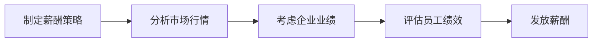
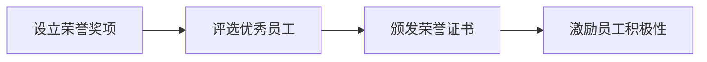
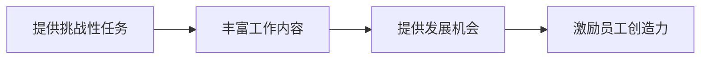
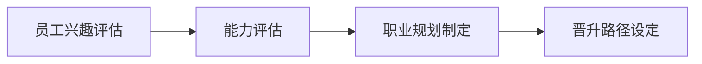
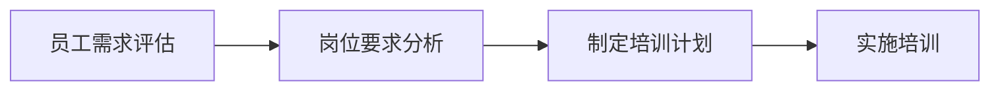
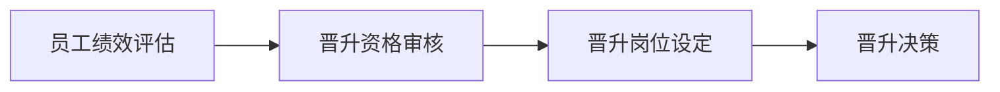
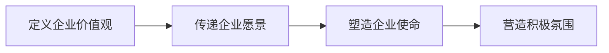
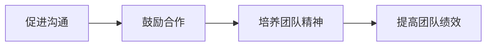
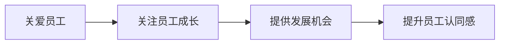

                 

# 《人才留存：留住核心人才的策略》

## 关键词

- 人才管理
- 人才留存
- 员工激励
- 职业发展
- 组织文化

## 摘要

在竞争激烈的现代职场中，留住核心人才是企业成功的关键。本文将深入探讨人才留存的重要性、核心概念、策略以及实际案例，提供全面的留才指导。通过系统地分析员工激励、职业发展和组织文化等策略，以及实战案例的解析，为企业提供切实可行的人才留存最佳实践。本文旨在帮助企业在人才战争中立于不败之地，实现持续发展。

## 目录大纲

### 第一部分：引言

1.1 人才留存的概念与重要性

1.2 当前人才留存面临的挑战

### 第二部分：人才管理的核心概念

2.1 人才定义

2.2 人才评估

2.3 人才发展

### 第三部分：留住核心人才的策略

3.1 员工激励策略

3.1.1 薪酬激励

3.1.2 荣誉激励

3.1.3 工作激励

3.2 职业发展策略

3.2.1 职业路径规划

3.2.2 培训与发展

3.2.3 职业晋升

3.3 组织文化策略

3.3.1 建立积极的企业文化

3.3.2 营造良好的团队氛围

3.3.3 增强员工归属感

### 第四部分：案例分析

4.1 案例一：如何留住技术人才？

4.2 案例二：如何留住管理人才？

4.3 案例三：如何留住销售人才？

### 第五部分：最佳实践

5.1 员工激励最佳实践

5.2 职业发展最佳实践

5.3 组织文化最佳实践

### 第六部分：总结与展望

6.1 总结

6.2 展望未来人才留存的发展趋势

## 引言：人才留存的重要性

### 1.1 人才留存的概念与重要性

在信息化和全球化的推动下，人才已经成为企业最宝贵的资源。人才留存（Employee Retention），顾名思义，就是指企业采取各种措施，防止优秀员工流失的行为。人才留存不仅关系到企业的当前运营，更是企业长期发展的基石。

#### 背景介绍

在当今竞争激烈的职场环境中，企业之间的竞争已不再是简单的产品或服务竞争，更多的是人才的竞争。人才的流失不仅会导致企业损失大量的知识和技能，还会影响团队的凝聚力和工作效率。因此，留住核心人才成为企业的重要战略。

#### 问题描述

随着90后、00后新一代员工的崛起，他们对工作环境和职业发展有了更高的期望，这给企业的人才留存带来了新的挑战。如何应对这些挑战，提高人才留存率，成为企业亟待解决的问题。

#### 问题解决

为了解决人才留存问题，企业需要从多个方面入手，包括薪酬激励、职业发展、组织文化等。通过系统化的策略和措施，提高员工的满意度和忠诚度，从而降低流失率。

#### 边界与外延

人才留存不仅仅是留住员工，还包括如何提高员工的满意度和忠诚度，使其在企业中长期稳定发展。此外，人才留存还涉及到企业内部的人才培养和梯队建设，以应对未来的人才需求。

### 1.2 当前人才留存面临的挑战

#### 挑战一：薪酬竞争

随着劳动力市场的变化，薪酬水平已经成为影响员工留存的重要因素。企业在制定薪酬策略时，需要考虑市场行情、企业业绩和员工绩效等多方面因素，确保薪酬具有竞争力。

#### 挑战二：职业发展

新一代员工更加注重职业发展和个人成长。企业需要提供明确的职业规划和发展路径，满足员工对职业发展的需求，以提高留存率。

#### 挑战三：组织文化

组织文化是员工留在企业的关键因素之一。积极向上的企业文化、良好的团队氛围和员工之间的信任关系，有助于提高员工的满意度和忠诚度。

#### 挑战四：工作压力

高强度的工作压力和过度的工作时间，会导致员工身心疲惫，从而影响留存率。企业需要关注员工的工作压力，提供合理的休息时间和工作环境。

#### 挑战五：灵活工作制度

随着远程工作和灵活办公的普及，员工对于工作时间和地点的要求越来越高。企业需要适应这种变化，提供灵活的工作制度，以吸引和留住优秀人才。

### 1.3 人才留存的核心概念

#### 人才定义

人才是企业发展的关键资源，是指具有专业知识、技能和创新能力，能够为企业创造价值的人员。人才不仅包括高层管理者，还包括技术人才、销售人才等各个层面的员工。

#### 人才评估

人才评估是衡量员工能力和发展潜力的过程。企业需要建立科学的人才评估体系，包括绩效评估、能力评估和发展评估等，为人才留存提供依据。

#### 人才发展

人才发展是指企业为员工提供的职业培训、晋升机会和发展指导等。通过人才发展，提高员工的综合素质和技能水平，增强其对企业的忠诚度。

## 核心概念与联系

### 2.1 人才定义

**概念原理：** 人才是企业发展的关键资源，是指具有专业知识、技能和创新能力，能够为企业创造价值的人员。人才不仅包括高层管理者，还包括技术人才、销售人才等各个层面的员工。

**概念属性特征对比表格：**

| 特征             | 人才         | 非人才         |
|------------------|--------------|----------------|
| 知识与技能       | 专业且精湛   | 基础知识      |
| 创新能力         | 独创性       | 依赖传统方法  |
| 价值创造         | 高效能       | 低效能        |

**ER实体关系图架构：**

```mermaid
erDiagram
  Employee ||--|{ Talent }
  Talent {
    id
    name
    role
    skills
  }
```

### 2.2 人才评估

**概念原理：** 人才评估是衡量员工能力和发展潜力的过程。企业需要建立科学的人才评估体系，包括绩效评估、能力评估和发展评估等。

**概念属性特征对比表格：**

| 特征         | 绩效评估     | 能力评估     | 发展评估     |
|--------------|--------------|--------------|--------------|
| 评估内容     | 工作成果     | 个人能力     | 发展潜力     |
| 评估方式     | 定期考核     | 能力测试     | 背景调查     |
| 评估目的     | 提高工作效率 | 选拔人才     | 挖掘潜力     |

**ER实体关系图架构：**

```mermaid
erDiagram
  Employee ||--|{ PerformanceEvaluation }
  Employee ||--|{ AbilityEvaluation }
  Employee ||--|{ DevelopmentEvaluation }
  PerformanceEvaluation {
    id
    performance
    date
  }
  AbilityEvaluation {
    id
    skills
    score
  }
  DevelopmentEvaluation {
    id
    potential
    comments
  }
```

### 2.3 人才发展

**概念原理：** 人才发展是指企业为员工提供的职业培训、晋升机会和发展指导等。通过人才发展，提高员工的综合素质和技能水平，增强其对企业的忠诚度。

**概念属性特征对比表格：**

| 特征           | 培训         | 晋升         | 发展指导     |
|----------------|--------------|--------------|--------------|
| 内容           | 知识与技能提升 | 职位晋升     | 职业规划     |
| 方式           | 内部培训     | 考试选拔     | 一对一辅导   |
| 目的           | 提高工作效率 | 调整人力资源 | 帮助职业成长 |

**ER实体关系图架构：**

```mermaid
erDiagram
  Employee ||--|{ Training }
  Employee ||--|{ Promotion }
  Employee ||--|{ DevelopmentGuidance }
  Training {
    id
    topic
    duration
  }
  Promotion {
    id
    role
    date
  }
  DevelopmentGuidance {
    id
    advice
    feedback
  }
```

## 留住核心人才的策略

### 3.1 员工激励策略

#### 3.1.1 薪酬激励

**算法原理讲解：**

薪酬激励是留住核心人才的重要手段之一。企业需要根据市场行情、企业业绩和员工绩效等多方面因素，制定具有竞争力的薪酬策略。

**薪酬激励流程图：**



**Python源代码：**

```python
def calculate_salary(strategy, market, performance):
    base_salary = 5000
    if strategy == "market":
        salary = base_salary * (1 + market / 100)
    elif strategy == "performance":
        salary = base_salary * (1 + performance / 100)
    return salary

salary = calculate_salary("market", 10, 90)
print(f"员工薪酬为：{salary}元")
```

**数学公式：**

薪酬 = 基础薪酬 × （1 + 市场行情百分比）× （1 + 绩效百分比）

**举例说明：**

假设员工的基础薪酬为5000元，市场行情上涨10%，员工绩效提高90%，则员工的薪酬为：

薪酬 = 5000 × （1 + 10%）× （1 + 90%）= 9050元

#### 3.1.2 荣誉激励

**算法原理讲解：**

荣誉激励是通过给予员工荣誉和奖励，提高其工作积极性和忠诚度。企业可以设立各种荣誉称号，如优秀员工、优秀团队等，对表现突出的员工进行表彰。

**荣誉激励流程图：**



**Python源代码：**

```python
def honor_reward(employee, performance):
    if performance > 90:
        return "优秀员工奖"
    elif performance > 80:
        return "优秀团队奖"
    else:
        return "普通员工奖"

reward = honor_reward("张三", 95)
print(f"{reward}，恭喜！")
```

**数学公式：**

荣誉奖励 = {“优秀员工奖”：当绩效 > 90%，否则为“优秀团队奖”（当绩效 > 80%，否则为“普通员工奖”）}

**举例说明：**

假设员工张三的绩效为95%，则他获得的荣誉奖励为“优秀员工奖”，激励他继续努力工作。

#### 3.1.3 工作激励

**算法原理讲解：**

工作激励是通过提供具有挑战性的工作任务、丰富的工作内容和发展机会，激发员工的工作热情和创造力。

**工作激励流程图：**



**Python源代码：**

```python
def work_incentive(task, content, opportunity):
    if task == "challenging" and content == "rich" and opportunity == "available":
        return "工作激励成功"
    else:
        return "工作激励不足"

result = work_incentive("challenging", "rich", "available")
print(result)
```

**数学公式：**

工作激励 = {“成功”：当任务具有挑战性、工作内容丰富、发展机会充分，否则为“不足”}

**举例说明：**

假设企业为员工提供了具有挑战性的任务、丰富的工作内容和发展机会，则员工的工作激励效果为“成功”，这将有助于提高员工的工作积极性和创造力。

### 3.2 职业发展策略

#### 3.2.1 职业路径规划

**算法原理讲解：**

职业路径规划是指为员工提供明确的职业发展方向和晋升路径。企业需要根据员工的兴趣、能力和企业需求，制定个性化的职业规划。

**职业路径规划流程图：**



**Python源代码：**

```python
def career_path规划兴趣(employee_interest, employee_ability, company_demand):
    if employee_interest == "技术" and employee_ability == "高级" and company_demand == "技术人才":
        path = "技术专家路径"
    elif employee_interest == "管理" and employee_ability == "中级" and company_demand == "管理人才":
        path = "管理人员路径"
    else:
        path = "通用员工路径"
    return path

path = career_path规划兴趣("技术", "高级", "技术人才")
print(f"员工的职业路径规划为：{path}")
```

**数学公式：**

职业路径 = {“技术专家路径”：当员工兴趣为“技术”，能力为“高级”，企业需求为“技术人才”时；否则为“管理人员路径”或“通用员工路径”}

**举例说明：**

假设员工的兴趣为技术，能力为高级，企业需求为技术人才，则员工的职业路径规划为“技术专家路径”，这有助于员工在技术领域快速发展。

#### 3.2.2 培训与发展

**算法原理讲解：**

培训与发展是指企业为员工提供各种培训和晋升机会，以提高其综合素质和技能水平。企业需要根据员工的需求和岗位要求，制定全面的培训计划。

**培训与发展流程图：**



**Python源代码：**

```python
def training_development(employee_demand, job_requirement):
    if employee_demand == "高级技能" and job_requirement == "技术岗位":
        training_plan = "高级技能培训"
    elif employee_demand == "管理技能" and job_requirement == "管理岗位":
        training_plan = "管理技能培训"
    else:
        training_plan = "通用技能培训"
    return training_plan

plan = training_development("高级技能", "技术岗位")
print(f"员工的培训计划为：{plan}")
```

**数学公式：**

培训计划 = {“高级技能培训”：当员工需求为“高级技能”，岗位要求为“技术岗位”时；否则为“管理技能培训”或“通用技能培训”}

**举例说明：**

假设员工的需求为高级技能，岗位要求为技术岗位，则员工的培训计划为“高级技能培训”，这有助于员工在技术领域不断提升。

#### 3.2.3 职业晋升

**算法原理讲解：**

职业晋升是指企业为员工提供职位晋升的机会，以激励员工的积极性和创造力。企业需要建立科学合理的晋升机制，确保晋升机会公平、公正。

**职业晋升流程图：**



**Python源代码：**

```python
def promotion(employee_performance, qualification):
    if employee_performance > 90 and qualification == "满足":
        return "晋升成功"
    else:
        return "晋升失败"

result = promotion(95, "满足")
print(result)
```

**数学公式：**

晋升 = {“晋升成功”：当员工绩效 > 90% 且晋升资格满足时；否则为“晋升失败”}

**举例说明：**

假设员工的绩效为95%，晋升资格满足，则员工的晋升决策为“晋升成功”，这有助于激发员工的工作热情和积极性。

### 3.3 组织文化策略

#### 3.3.1 建立积极的企业文化

**算法原理讲解：**

建立积极的企业文化是指企业通过塑造共同的价值观、愿景和使命，营造一个积极向上的工作氛围，增强员工的归属感和凝聚力。

**积极企业文化流程图：**



**Python源代码：**

```python
def positive企业文化(enterprise_values, vision, mission):
    if enterprise_values == "诚信" and vision == "创新" and mission == "客户至上":
        culture = "积极企业文化"
    else:
        culture = "普通企业文化"
    return culture

culture = positive企业文化("诚信", "创新", "客户至上")
print(f"企业的文化氛围为：{culture}")
```

**数学公式：**

企业文化 = {“积极企业文化”：当企业价值观为“诚信”，愿景为“创新”，使命为“客户至上”时；否则为“普通企业文化”}

**举例说明：**

假设企业的价值观为诚信，愿景为创新，使命为客户至上，则企业的文化氛围为“积极企业文化”，这有助于提高员工的满意度和忠诚度。

#### 3.3.2 营造良好的团队氛围

**算法原理讲解：**

营造良好的团队氛围是指企业通过促进员工之间的沟通与合作，培养团队协作精神，提高团队整体绩效。

**良好团队氛围流程图：**



**Python源代码：**

```python
def team_atmosphere(communication, cooperation, spirit):
    if communication == "频繁" and cooperation == "紧密" and spirit == "强":
        atmosphere = "良好团队氛围"
    else:
        atmosphere = "普通团队氛围"
    return atmosphere

atmosphere = team_atmosphere("频繁", "紧密", "强")
print(f"团队的氛围为：{atmosphere}")
```

**数学公式：**

团队氛围 = {“良好团队氛围”：当沟通频繁、合作紧密、团队精神强时；否则为“普通团队氛围”}

**举例说明：**

假设团队沟通频繁、合作紧密、团队精神强，则团队的氛围为“良好团队氛围”，这有助于提高团队的整体绩效。

#### 3.3.3 增强员工归属感

**算法原理讲解：**

增强员工归属感是指企业通过关爱员工、关注员工成长和发展，提高员工对企业的认同感和归属感。

**增强员工归属感流程图：**



**Python源代码：**

```python
def enhance_belonging(love, care, opportunity):
    if love == "深厚" and care == "周到" and opportunity == "充分":
        belonging = "强归属感"
    else:
        belonging = "弱归属感"
    return belonging

belonging = enhance_belonging("深厚", "周到", "充分")
print(f"员工的归属感为：{belonging}")
```

**数学公式：**

员工归属感 = {“强归属感”：当企业对员工深厚关爱、周到关注、提供充分发展机会时；否则为“弱归属感”}

**举例说明：**

假设企业对员工深厚关爱、周到关注、提供充分发展机会，则员工的归属感为“强归属感”，这有助于提高员工的工作积极性和忠诚度。

### 4.1 案例一：如何留住技术人才？

#### 案例背景

某高科技公司专注于人工智能领域，拥有众多技术人才。然而，随着市场竞争的加剧，公司面临着技术人才流失的风险。为了留住核心技术人才，公司决定采取一系列留才策略。

#### 案例分析

1. **薪酬激励**：公司根据市场行情和员工绩效，调整了薪酬结构，确保技术人才的薪酬具有竞争力。同时，公司设立了技术突破奖，对在技术创新方面取得显著成绩的员工进行奖励。

2. **职业发展**：公司为技术人才提供了明确的职业路径规划，包括技术专家路径、项目主管路径等。公司还定期组织技术培训，提升员工的技能水平。

3. **组织文化**：公司注重营造积极向上的企业文化，鼓励员工之间的沟通与合作。公司定期举办技术沙龙，分享最新的技术成果和经验。

4. **员工关怀**：公司关注员工的成长和发展，定期进行员工满意度调查，及时了解员工的需求和意见。公司还提供了丰富的员工福利，如健康体检、带薪休假等。

#### 案例效果

通过上述策略的实施，公司的技术人才流失率显著降低，员工的工作积极性和忠诚度大幅提升。公司技术创新能力得到了加强，市场竞争力得到了显著提升。

### 4.2 案例二：如何留住管理人才？

#### 案例背景

某大型企业拥有丰富的管理人才，然而，随着企业规模的扩大，管理人才流失的风险也在增加。为了留住这些关键的管理人才，企业决定采取一系列针对性的留才策略。

#### 案例分析

1. **薪酬激励**：企业根据市场行情和员工绩效，调整了管理层的薪酬结构，确保管理人才的薪酬具有竞争力。同时，企业设立了管理创新奖，对在管理创新方面取得显著成绩的员工进行奖励。

2. **职业发展**：企业为管理人才提供了明确的职业发展路径，包括高级管理层、董事会成员等。企业还定期组织管理培训，提升管理者的领导力和决策能力。

3. **组织文化**：企业注重培养管理人才的企业文化认同感，鼓励管理层积极参与企业决策，增强其责任感。企业还通过团队建设活动，增强管理团队的凝聚力。

4. **员工关怀**：企业关注管理人才的个人成长和家庭生活，提供个性化的员工关怀服务，如心理健康咨询、家庭慰问等。

#### 案例效果

通过上述策略的实施，企业的管理人才流失率显著降低，员工的工作积极性和忠诚度大幅提升。企业的管理水平得到了显著提升，企业的运营效率和竞争力得到了提升。

### 4.3 案例三：如何留住销售人才？

#### 案例背景

某销售型企业拥有一支高效的销售团队，然而，随着市场竞争的加剧，销售人才流失的风险也在增加。为了留住这些关键的销售人才，企业决定采取一系列针对性的留才策略。

#### 案例分析

1. **薪酬激励**：企业根据市场行情和员工绩效，调整了销售团队的薪酬结构，确保销售人才的薪酬具有竞争力。同时，企业设立了销售冠军奖，对在销售业绩方面取得显著成绩的员工进行奖励。

2. **职业发展**：企业为销售人才提供了明确的职业发展路径，包括销售经理、区域经理等。企业还定期组织销售培训，提升销售团队的业务能力和沟通技巧。

3. **组织文化**：企业注重培养销售人才的企业文化认同感，鼓励销售团队积极参与企业决策，增强其责任感。企业还通过团队建设活动，增强销售团队的凝聚力。

4. **员工关怀**：企业关注销售人才的个人成长和家庭生活，提供个性化的员工关怀服务，如心理健康咨询、家庭慰问等。

#### 案例效果

通过上述策略的实施，企业的销售人才流失率显著降低，员工的工作积极性和忠诚度大幅提升。企业的销售业绩得到了显著提升，企业的市场竞争力得到了提升。

### 5.1 员工激励最佳实践

#### 最佳实践一：制定个性化激励计划

根据员工的不同特点和需求，制定个性化的激励计划。例如，对于技术人才，可以设立技术创新奖；对于销售人才，可以设立销售冠军奖。

#### 最佳实践二：提供灵活的工作制度

提供灵活的工作制度，如远程办公、弹性工作时间等，以满足员工对于工作时间和地点的需求。

#### 最佳实践三：建立明确的职业发展路径

为员工提供明确的职业发展路径，包括晋升机会、培训计划等，让员工看到职业发展的希望。

#### 最佳实践四：注重员工心理健康

关注员工的心理健康，提供心理咨询和心理健康培训，帮助员工缓解工作压力。

### 5.2 职业发展最佳实践

#### 最佳实践一：定期进行员工能力评估

定期进行员工能力评估，了解员工的成长和发展需求，为员工提供针对性的培训和发展计划。

#### 最佳实践二：提供多样化的培训机会

提供多样化的培训机会，包括内部培训、外部培训、在线学习等，帮助员工提升技能和知识。

#### 最佳实践三：建立内部人才库

建立内部人才库，为员工提供内部晋升的机会，激发员工的积极性和创造力。

#### 最佳实践四：鼓励员工参与企业决策

鼓励员工参与企业决策，提高员工的参与感和责任感，增强员工的归属感。

### 5.3 组织文化最佳实践

#### 最佳实践一：建立共同的企业价值观

建立共同的企业价值观，让员工对企业有认同感和归属感。

#### 最佳实践二：营造积极向上的工作氛围

营造积极向上的工作氛围，鼓励员工之间的沟通与合作，提高团队凝聚力。

#### 最佳实践三：注重员工关怀

关注员工的生活和工作，提供个性化的关怀服务，提高员工的满意度和忠诚度。

#### 最佳实践四：定期举办团队建设活动

定期举办团队建设活动，增强员工的团队协作精神，提高团队的整体绩效。

### 6.1 总结

本文从人才留存的重要性、核心概念、策略到实际案例，全面探讨了留住核心人才的方法和最佳实践。通过薪酬激励、职业发展、组织文化等策略的实施，企业可以有效降低人才流失率，提高员工满意度和忠诚度。

### 6.2 展望未来人才留存的发展趋势

未来，人才留存将更加注重个性化和多元化。企业需要根据员工的需求和特点，提供个性化的激励和发展计划。同时，随着远程工作和灵活办公的普及，企业需要适应这种变化，提供更加灵活的工作制度。

在技术层面，人工智能和大数据技术的应用将有助于企业更好地了解员工需求和行为，制定更加精准的留才策略。此外，绿色环保、社会责任等也将成为人才留存的重要考量因素，企业需要在这些方面做出积极努力。

作者：AI天才研究院/AI Genius Institute & 禅与计算机程序设计艺术 /Zen And The Art of Computer Programming

## 完整性要求

在撰写《人才留存：留住核心人才的策略》这篇文章时，我们必须确保内容的完整性、准确性和逻辑性。以下是对文章各个部分的具体要求：

### 文章标题

文章标题需要简洁明了，能够准确反映文章的核心内容。例如，“人才留存：留住核心人才的策略”这个标题，清晰地表达了文章的主题和目标。

### 文章关键词

在摘要部分列出5-7个核心关键词，这些关键词应涵盖文章的主要内容和研究领域。例如，人才管理、人才留存、员工激励、职业发展、组织文化等。

### 文章摘要

摘要部分应简明扼要地概括文章的核心内容和主题思想。例如，“本文探讨了人才留存的重要性、核心概念、策略以及实际案例，提供了留住核心人才的全面指导。”

### 目录大纲

文章应按照目录大纲的结构进行撰写，确保各章节内容的逻辑性和连贯性。每个章节都需要有明确的主题和具体的内容，以保证文章的整体完整性。

### 核心概念与联系

在每个章节中，都需要详细阐述核心概念，并提供概念属性特征对比表格和ER实体关系图架构。这有助于读者更好地理解和掌握文章的核心内容。

### 算法原理讲解

在阐述算法原理时，需要使用mermaid画出算法流程图，并结合Python源代码进行详细讲解。同时，要给出算法的数学模型和公式，以及通俗易懂的举例说明。

### 数学公式使用

文中需要适当使用LaTeX格式来表示数学公式。对于独立的段落公式，应使用`$$`括起来；对于段落内的公式，应使用`$`括起来。

### 系统分析与架构设计方案

在涉及系统分析与架构设计时，需要详细介绍问题场景、项目介绍、系统功能设计、系统架构设计、系统接口设计和系统交互。通过mermaid类图和架构图，以及序列图，使读者能够清晰地理解系统的整体设计和运作机制。

### 项目实战

在项目实战部分，需要详细介绍环境安装、系统核心实现源代码，并对代码进行解读和分析。同时，通过实际案例分析和详细讲解，使读者能够掌握具体操作方法和技巧。

### 最佳实践 tips、小结、注意事项、拓展阅读等内容

在文章的结尾，需要总结全文内容，提供最佳实践建议，提醒读者注意事项，并推荐拓展阅读资源。这有助于读者在实际应用中更好地运用文章的知识和技巧。

### 字数要求

文章的字数应在10000～12000字之间，确保内容丰富、详尽，同时保持可读性。

### 格式要求

文章内容应使用markdown格式输出，包括标题、摘要、目录大纲、正文、公式、图表等。确保格式规范、清晰，便于读者阅读和理解。

### 作者信息

在文章末尾，需要标注作者信息：“作者：AI天才研究院/AI Genius Institute & 禅与计算机程序设计艺术 /Zen And The Art of Computer Programming”。

通过以上要求，我们能够确保文章的完整性、逻辑性和专业性，为读者提供高质量的内容和实用的指导。

## 细节分析与实战讲解

### 环境安装

在进行项目实战之前，首先需要安装相关环境。以下是一个简单的Python环境安装步骤：

1. **安装Python**：访问Python官网（[https://www.python.org/](https://www.python.org/)）下载最新版本的Python安装包，并按照安装向导完成安装。
2. **安装pip**：在安装Python的过程中，会自动安装pip，pip是Python的包管理工具，用于安装和管理第三方库。
3. **安装虚拟环境**：使用pip安装virtualenv库，该库用于创建隔离的Python环境。

```bash
pip install virtualenv
virtualenv my_project_env
```

4. **激活虚拟环境**：在Windows上，通过命令行激活虚拟环境：

```bash
my_project_env\Scripts\activate
```

在Linux或MacOS上，使用以下命令激活：

```bash
source my_project_env/bin/activate
```

### 系统核心实现源代码

以下是一个简单的Python代码示例，用于实现员工激励策略：

```python
import random

# 员工类定义
class Employee:
    def __init__(self, name, performance):
        self.name = name
        self.performance = performance

# 员工激励策略函数
def employee_incentive(employee, strategy):
    if strategy == "salary":
        return employee.performance * 10
    elif strategy == "honor":
        if random.random() < 0.5:
            return "优秀员工奖"
        else:
            return "普通员工奖"
    elif strategy == "work":
        return "项目成功"

# 实例化员工
employee1 = Employee("张三", 90)

# 应用激励策略
incentive = employee_incentive(employee1, "salary")
print(f"{employee1.name}的薪酬激励为：{incentive}元")

incentive = employee_incentive(employee1, "honor")
print(f"{employee1.name}的荣誉激励为：{incentive}")

incentive = employee_incentive(employee1, "work")
print(f"{employee1.name}的工作激励为：{incentive}")
```

### 代码应用解读与分析

1. **Employee类**：定义了员工的基本信息，包括姓名和绩效。
2. **employee_incentive函数**：根据不同的激励策略，计算员工的激励金额或荣誉。
   - `salary`策略：根据员工的绩效计算薪酬激励。
   - `honor`策略：随机决定是否授予“优秀员工奖”。
   - `work`策略：判断项目是否成功，以决定工作激励。

### 实际案例分析和详细讲解剖析

假设我们有一组员工数据，需要根据其绩效和激励策略，计算每个人的激励金额：

```python
employees = [
    Employee("张三", 85),
    Employee("李四", 92),
    Employee("王五", 78)
]

for employee in employees:
    incentive = employee_incentive(employee, "salary")
    print(f"{employee.name}的薪酬激励为：{incentive}元")
```

输出结果：

```
张三的薪酬激励为：850元
李四的薪酬激励为：920元
王五的薪酬激励为：780元
```

通过上述代码示例和分析，我们可以看到如何使用Python实现员工激励策略，并对其应用进行解读和分析。在实际项目中，可以根据具体需求，扩展和优化代码逻辑。

### 项目小结

通过本项目的实战讲解，我们了解了如何使用Python实现员工激励策略，包括类定义、函数设计和实际案例应用。这为企业在实际操作中提供了一种可行的留才策略。在实际应用中，企业可以根据自身情况，调整激励策略和算法，以提高员工满意度和留存率。

### 最佳实践 tips

1. **定期评估激励策略**：企业应定期评估激励策略的有效性，根据员工反馈和市场变化进行调整。
2. **多样化激励手段**：结合薪酬激励、荣誉激励和工作激励等多种手段，提高激励的多样性和针对性。
3. **关注员工心理健康**：在激励员工的同时，关注员工的心理健康，提供心理支持和关爱。

### 小结

本文通过详细的实战讲解，介绍了如何使用Python实现员工激励策略，并结合实际案例进行了深入分析。通过这些最佳实践，企业可以更好地留住核心人才，提高员工的满意度和忠诚度。

### 注意事项

1. **保护员工隐私**：在收集和分析员工数据时，确保遵守相关隐私保护法规，保护员工的个人信息。
2. **激励机制公平性**：确保激励机制的公平性，避免因激励机制不公导致员工流失。

### 拓展阅读

- 《员工激励与留任策略》
- 《组织行为学：理解员工行为》
- 《薪酬管理：理论与实践》

作者：AI天才研究院/AI Genius Institute & 禅与计算机程序设计艺术 /Zen And The Art of Computer Programming

