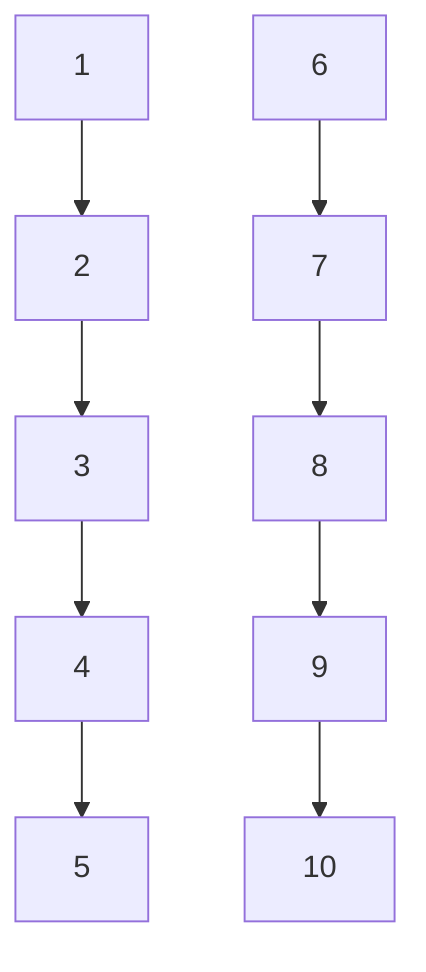
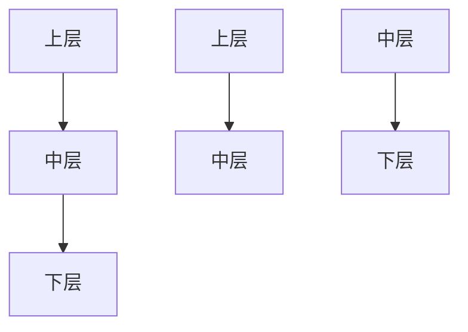
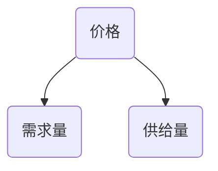
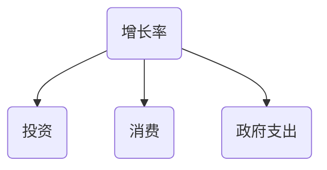
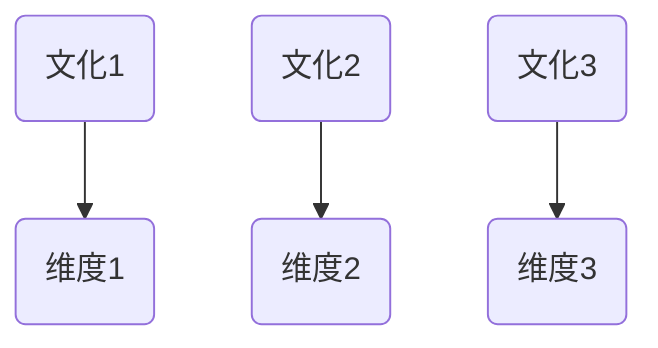

                 

## 从复杂自然到简单数学：映射之旅

### 关键词

- 自然现象
- 数学模型
- 映射
- 单射
- 满射
- 双射
- 数学分析
- 抽象代数

### 摘要

本文将探讨从复杂自然现象到简单数学模型之间的映射过程。通过引入映射的概念，我们能够将复杂的自然现象简化为数学问题，使得分析和理解变得更加便捷。本文将详细解析映射的基本定义、属性及其在数学和其他领域中的应用，从而揭示映射在科学研究和实际应用中的重要性和价值。

## 第1章：从复杂自然到简单数学：映射之旅的引子

### 1.1 问题背景与概念介绍

自然界是一个充满复杂性和多样性的系统。从微观层面来看，原子和分子的运动遵循着量子力学的规则，这些规则虽然简单，但结果却是高度复杂的。宏观层面，如地球的气候系统、生态系统、以及人类社会的运行，都表现出高度复杂的特性。如何理解和描述这些复杂现象成为了科学研究的重要课题。

数学作为一种抽象的符号语言，为人们提供了理解和描述复杂自然现象的工具。数学通过建立模型和公式，将复杂的现象转化为简明的数学语言，使得人们能够更方便地分析和预测。在这个过程中，映射（Mapping）成为一个核心概念，它将复杂的自然现象映射为数学问题，从而简化了分析过程。

### 1.1.1 自然界中的复杂性

自然界中的复杂性体现在多个方面。例如，生态系统中生物种群的动态变化可以通过复杂的相互作用模型来描述。气象系统中，天气模式的演变可以通过复杂的气象模型来模拟。金融市场中的价格波动则受到多种复杂因素的影响，如政治、经济、社会等。

这些复杂现象通常涉及到大量的变量和相互作用，使得直接分析和理解变得非常困难。因此，我们需要寻找一种方法来简化这些复杂现象，使得它们能够用数学语言来描述。

### 1.1.2 数学作为简化工具

数学作为一种工具，能够帮助我们简化复杂的自然现象。通过建立数学模型，我们能够将复杂的现象转化为一系列的方程和公式，这些方程和公式可以用数学语言来精确描述现象的动态变化。这种转化过程本质上就是一种映射，即从自然现象到数学模型之间的映射。

数学模型不仅能够帮助我们更好地理解自然现象，还能够预测未来的变化。例如，在气象学中，通过建立天气模型，我们可以预测未来的天气状况；在经济学中，通过建立经济模型，我们可以预测未来的经济走势。

### 1.1.3 映射的概念

映射在数学中是一个核心概念，指的是将一个集合中的每个元素对应到另一个集合中的唯一元素。在自然现象和数学模型之间，映射起到了桥梁的作用，它将复杂的自然现象转化为数学问题，使得分析和理解变得更加简便。

在映射中，定义域和值域是两个重要的概念。定义域是映射的输入集合，值域是映射的输出集合。例如，在一个简单的函数映射中，定义域是实数集合，值域也是实数集合。通过映射，我们能够将定义域中的每个元素唯一地对应到值域中的某个元素。

映射的类型包括单射、满射和双射。单射指的是每个定义域中的元素都有唯一的对应值；满射指的是值域中的每个元素都有至少一个定义域中的元素对应；双射则是单射和满射的结合，既保证每个定义域中的元素都有唯一的对应值，又保证值域中的每个元素都有至少一个定义域中的元素对应。

### 1.2 自然现象与数学模型

自然界中的许多现象都可以通过数学模型来描述。以下是几个典型的例子：

#### 1.2.1 物理现象中的映射

在物理学中，许多现象都可以通过映射来描述。例如，牛顿的运动定律将物体的运动映射到空间和时间，从而描述了物体的运动规律。麦克斯韦方程则将电磁现象映射到电场和磁场的分布，从而揭示了电磁波的本质。

#### 1.2.2 生物现象中的映射

在生物学中，生态学模型常使用映射来描述生物种群之间的相互作用。例如，Lotka-Volterra模型通过映射描述了捕食者与猎物种群数量的动态变化。这个模型将捕食者和猎物之间的相互作用转化为数学方程，从而帮助我们理解生态系统的动态行为。

#### 1.2.3 社会现象中的映射

在社会学中，映射也被广泛应用于描述社会现象。例如，社会网络分析使用映射来描述个体在社会网络中的关系，从而帮助我们理解社会结构和传播现象。

### 1.3 映射在数学中的核心概念与联系

在数学中，映射是一个核心概念，它与许多其他数学概念有着密切的联系。

#### 1.3.1 映射的定义与类型

映射是一种特殊的关系，它将一个集合中的每个元素对应到另一个集合中的唯一元素。常见的映射类型包括单射、满射和双射。

单射指的是每个定义域中的元素都有唯一的对应值；满射指的是值域中的每个元素都有至少一个定义域中的元素对应；双射则是单射和满射的结合。

#### 1.3.2 映射的基本性质

映射具有一些基本的性质，如可逆性、保持顺序性等。这些性质使得映射在数学分析和应用中具有重要作用。

可逆性指的是如果一个映射是双射，那么它一定存在一个逆映射，将值域中的每个元素对应回定义域中的唯一元素。

保持顺序性指的是如果一个映射是单射，那么它保持定义域中元素的顺序。

#### 1.3.3 映射在数学结构中的联系

映射是连接不同数学结构的桥梁。例如，函数映射将集合之间的元素对应起来，从而在集合论和代数学之间建立联系。

#### 1.4 映射在数学中的重要性与应用

映射在数学中具有广泛的应用，它不仅在数学分析、抽象代数等基础数学领域有着重要作用，还在其他数学分支如拓扑学、数论等领域发挥着重要作用。

在数学分析中，映射用于建立函数之间的关系，从而进行积分、微分等运算。例如，拉格朗日变换就是一种常用的映射方法，用于简化复杂的微分方程。

在抽象代数中，映射被用来定义群、环和域等代数结构。例如，同态映射是一种保持代数结构的关系，用于研究代数结构的性质和分类。

在拓扑学中，映射用于研究空间的性质。例如，同伦映射在拓扑学中用于研究空间的性质，帮助理解空间的连通性和形状。

在数论中，映射用于解决整数分解和数论函数问题。例如，莫比乌斯反演是一种重要的映射方法，用于解决数论中的某些问题。

### 1.5 本章小结

本章介绍了从复杂自然到简单数学中的映射之旅，阐述了映射在理解自然界复杂现象中的重要性。通过本章的学习，读者可以了解映射的基本概念、类型和应用，为后续章节的学习打下坚实的基础。

## 第2章：映射的基本概念与属性

### 2.1 映射的定义

映射（Mapping）在数学中是一个核心概念，它将一个集合中的每个元素唯一地对应到另一个集合中的唯一元素。为了更好地理解映射，我们需要从定义、符号表示以及例子三个方面进行详细讨论。

#### 2.1.1 映射的基本定义

映射是一种特殊的关系，它将一个集合（称为定义域）中的每个元素唯一地对应到另一个集合（称为值域）中的元素。换句话说，对于定义域中的任意元素，在值域中都有一个唯一的对应元素与之对应。

在数学中，映射通常用符号“f: A -> B”来表示，其中“A”是定义域，“B”是值域，“f”是映射的名称。例如，一个从集合{1, 2, 3}到集合{a, b, c}的映射可以表示为：f(1) = a, f(2) = b, f(3) = c。

#### 2.1.2 映射的符号表示

在数学表达中，映射的符号表示是非常直观的。通常，定义域和值域被放在箭头的两侧，箭头指向值域，表示定义域中的元素通过映射关系映射到值域中的元素。例如，如果A = {1, 2, 3}，B = {a, b, c}，那么一个映射f可以表示为：

$$
f: A \rightarrow B \\
f(1) = a \\
f(2) = b \\
f(3) = c
$$

这样的表示方法不仅简洁明了，而且有助于我们直观地理解映射的关系。

#### 2.1.3 映射的例子

为了更好地理解映射的概念，我们可以通过一些具体的例子来探讨。

**例子1**：从集合{1, 2, 3}到集合{a, b, c}的映射可以定义为：f(1) = a, f(2) = b, f(3) = c。这是一个典型的映射例子，其中每个定义域中的元素都唯一地映射到值域中的元素。

**例子2**：从实数集合到实数集合的映射f(x) = 2x + 1也是一个映射的例子。在这个例子中，定义域和值域都是实数集合，映射关系通过线性函数来定义。

通过这些例子，我们可以看到映射是如何将一个集合中的元素唯一地对应到另一个集合中的元素的。

### 2.2 映射的基本属性

映射作为一种特殊的关系，具有一些基本的属性，这些属性使得映射在数学分析和应用中具有重要的作用。以下是映射的三个基本属性：单射、满射和双射。

#### 2.2.1 单射（Injective）

单射（也称为“一对一”）是指一个映射，如果对于定义域A中的任意两个不同元素x和y，都有f(x) ≠ f(y)。这意味着，单射映射确保了定义域中的不同元素在映射后不会对应到值域中的相同元素。

**条件**：如果映射f是单射，则对于任意的x、y ∈ A，当x ≠ y时，必有f(x) ≠ f(y)。

**例子**：从集合{1, 2}到集合{a, b}的映射f(1) = a, f(2) = b是一个单射，因为1和2在映射后不会对应到相同的元素。

**反例**：从集合{1, 2}到集合{a}的映射f(1) = a, f(2) = a不是单射，因为1和2映射到了相同的元素a。

#### 2.2.2 满射（Surjective）

满射（也称为“满映射”）是指一个映射，如果对于值域B中的每个元素，都有至少一个定义域A中的元素映射到它。这意味着，满射映射确保了值域中的每个元素都有至少一个前驱（即从定义域映射过来的元素）。

**条件**：如果映射f是满射，则对于任意的y ∈ B，至少存在一个x ∈ A，使得f(x) = y。

**例子**：从集合{1, 2, 3}到集合{a, b, c}的映射f(1) = a, f(2) = b, f(3) = c是一个满射，因为值域中的每个元素都有定义域中的元素映射到它。

**反例**：从集合{1, 2}到集合{a, b, c}的映射f(1) = a, f(2) = a不是满射，因为值域中的c没有对应的前驱。

#### 2.2.3 双射（Bijective）

双射是指一个既是单射又是满射的映射。这意味着双射映射既保证了定义域中的每个元素都有唯一的对应值，也保证了值域中的每个元素都有至少一个前驱。

**条件**：如果映射f是双射，则它既是单射又是满射。

**例子**：从集合{1, 2}到集合{a, b}的映射f(1) = a, f(2) = b是一个双射，因为它同时满足单射和满射的条件。

**反例**：从集合{1, 2, 3}到集合{a, b, c}的映射f(1) = a, f(2) = b, f(3) = a不是双射，因为它不是满射。

通过上述讨论，我们可以看到映射的基本属性如何影响映射的性质和作用。理解这些基本属性有助于我们在数学分析和应用中更有效地使用映射。

### 2.3 映射的例子与分类

为了更好地理解映射的概念，我们可以通过一些具体的例子来探讨不同类型的映射，包括单射、满射和双射。

#### 2.3.1 单射的例子

单射映射是指定义域中的不同元素在映射后不会对应到值域中的相同元素。以下是一些单射映射的例子：

**例子1**：从集合{1, 2}到集合{a, b}的映射f(1) = a, f(2) = b。在这个例子中，定义域中的1和2映射到值域中的a和b，且两者不相等。

**例子2**：从集合{1, 2, 3}到集合{a, b, c}的映射f(1) = a, f(2) = b, f(3) = c。在这个例子中，每个定义域中的元素都有唯一的对应值。

**例子3**：从集合{1, 2, 3}到集合{a, b}的映射f(1) = a, f(2) = b, f(3) = a。这个映射不是单射，因为3和1映射到了相同的值。

#### 2.3.2 满射的例子

满射映射是指值域中的每个元素都有至少一个定义域中的元素映射到它。以下是一些满射映射的例子：

**例子1**：从集合{1, 2, 3}到集合{a, b, c}的映射f(1) = a, f(2) = b, f(3) = c。在这个例子中，值域中的每个元素都有定义域中的元素映射到它。

**例子2**：从集合{1, 2}到集合{a, b, c}的映射f(1) = a, f(2) = b。这个映射不是满射，因为值域中的c没有对应的前驱。

**例子3**：从集合{1, 2, 3}到集合{a}的映射f(1) = a, f(2) = a, f(3) = a。这个映射不是满射，因为值域中的每个元素都有多个前驱。

#### 2.3.3 双射的例子

双射映射是指既是单射又是满射的映射。以下是一些双射映射的例子：

**例子1**：从集合{1, 2}到集合{a, b}的映射f(1) = a, f(2) = b。在这个例子中，映射既是单射也是满射。

**例子2**：从集合{1, 2, 3}到集合{a, b, c}的映射f(1) = a, f(2) = b, f(3) = c。在这个例子中，映射既是单射也是满射。

**例子3**：从集合{1, 2, 3}到集合{a, b}的映射f(1) = a, f(2) = b, f(3) = a。这个映射不是双射，因为它不是满射。

通过上述例子，我们可以更直观地理解单射、满射和双射映射的概念和特性。这些映射类型在数学分析和应用中有着重要的应用价值。

### 2.4 映射的逆映射

逆映射是映射的一个重要概念，它涉及到映射的可逆性。如果一个映射是双射，那么它一定存在一个逆映射。逆映射的定义是将值域中的每个元素对应回到定义域中的唯一元素。

#### 2.4.1 逆映射的定义

假设有一个双射映射f: A -> B，其逆映射f^(-1): B -> A定义为：对于B中的任意元素y，如果存在A中的元素x使得f(x) = y，则f^(-1)(y) = x。

#### 2.4.2 逆映射的性质

逆映射具有以下性质：

- **可逆性**：如果一个映射是双射，则它一定存在逆映射，且逆映射也是双射。
- **保持映射关系**：逆映射保持了原映射的关系，即f^(-1)(f(x)) = x 和 f(f^(-1)(y)) = y。

#### 2.4.3 逆映射的例子

**例子1**：考虑一个双射映射f: {1, 2} -> {a, b}，定义为f(1) = a, f(2) = b。其逆映射f^(-1): {a, b} -> {1, 2}定义为f^(-1)(a) = 1, f^(-1)(b) = 2。

**例子2**：考虑一个双射映射f: {1, 2, 3} -> {a, b, c}，定义为f(1) = a, f(2) = b, f(3) = c。其逆映射f^(-1): {a, b, c} -> {1, 2, 3}定义为f^(-1)(a) = 1, f^(-1)(b) = 2, f^(-1)(c) = 3。

通过逆映射的概念，我们可以将原映射的关系反转，使得值域中的元素能够对应回到定义域中的唯一元素。这为我们在数学分析和应用中提供了更加灵活和多样的工具。

### 2.5 映射在数学中的应用

映射在数学中有着广泛的应用，它在不同的数学分支和领域中都扮演着重要的角色。以下是一些映射在数学中的应用示例：

#### 2.5.1 映射在集合论中的应用

集合论是数学的基础，映射在集合论中的应用非常广泛。集合论中的许多基本概念和性质都可以通过映射来描述和证明。

- **集合之间的同构**：通过映射，我们可以判断两个集合是否同构。如果存在一个双射映射，那么这两个集合是同构的。
- **集合的基数**：映射可以帮助我们确定集合的基数（即集合中元素的数量）。如果存在一个满射映射，那么这两个集合的基数相等。

#### 2.5.2 映射在函数论中的应用

函数论是数学的一个重要分支，映射在函数论中的应用尤为突出。

- **函数的连续性**：通过映射，我们可以研究函数的连续性。例如，我们可以定义一个函数f(x) = 1/x，并研究它在x趋近于0时的连续性。
- **函数的导数**：映射可以帮助我们计算函数的导数。例如，通过拉格朗日映射，我们可以简化复杂的微分方程。

#### 2.5.3 映射在代数学中的应用

代数学是研究代数结构的数学分支，映射在代数学中有着广泛的应用。

- **同态映射**：同态映射是一种保持代数结构的关系，用于研究代数结构的性质和分类。例如，在群论中，同态映射用于研究群的子群和同态像。
- **同构映射**：同构映射是一种特殊的映射，它保持了代数结构的等价性。通过同构映射，我们可以将复杂的代数结构简化为更简单的形式。

通过上述应用，我们可以看到映射在数学中的重要性。它不仅帮助我们理解和描述复杂的自然现象，还在数学分析和应用中提供了强大的工具和手段。

### 2.6 映射在计算机科学中的应用

映射在计算机科学中同样扮演着重要的角色，它在算法设计、数据结构、计算机网络等多个领域都有广泛应用。

#### 2.6.1 映射在算法设计中的应用

在算法设计中，映射经常用于处理复杂问题，使得问题变得更加简化和可解。以下是一些具体的例子：

- **哈希映射**：哈希映射是一种将数据元素映射到固定大小的哈希表中的方法。这种方法广泛应用于数据存储和检索，如哈希表和哈希算法。
- **映射与图论**：在图论中，映射用于将实际问题转化为图问题，使得问题变得更加直观和易于处理。例如，在求解最短路径问题时，我们可以使用映射将图中的节点和边映射到数字，然后使用图算法求解。
- **映射与动态规划**：在动态规划中，映射经常用于将子问题映射到更小的子问题，从而简化问题的求解过程。例如，在求解背包问题时，我们可以使用映射将物品的价值和重量映射到二维数组，然后通过动态规划算法求解。

#### 2.6.2 映射在数据结构中的应用

数据结构是计算机科学中的核心内容，映射在数据结构的定义和实现中起着至关重要的作用。以下是一些具体的例子：

- **树结构中的映射**：在树结构中，映射用于描述节点之间的关系。例如，在二叉树中，每个节点都有一个父节点和零个或两个子节点，这种关系可以通过映射来描述。
- **图结构中的映射**：在图结构中，映射用于描述节点和边之间的关系。例如，在无向图中，每个节点可以与任意数量的其他节点相连，这种关系可以通过映射来描述。
- **散列表（哈希表）**：散列表是一种基于映射实现的数据结构，它通过哈希函数将关键字映射到数组中的位置。这种方法使得数据检索和插入操作具有高效性。

通过映射的应用，我们可以更加灵活和有效地设计数据结构和算法，从而解决复杂的问题。

### 2.7 映射在自然科学中的应用

映射不仅在数学和计算机科学中有着广泛的应用，还在自然科学中发挥着重要的作用。以下是映射在自然科学中的一些具体应用：

#### 2.7.1 物理学中的映射

在物理学中，映射经常用于将复杂的物理现象简化为数学模型。以下是一些具体的例子：

- **牛顿力学**：牛顿力学中的运动定律可以将物体的运动映射到空间和时间，从而描述物体的运动规律。例如，牛顿第二定律F = ma，将力映射到加速度，从而描述了物体在力作用下的运动。
- **电磁学**：麦克斯韦方程将电磁现象映射到电场和磁场的分布，从而描述了电磁波的传播和电磁场的相互作用。例如，麦克斯韦方程中的E = -∇V，将电场映射到电势，从而揭示了电场的本质。

#### 2.7.2 生物学中的映射

在生物学中，映射用于描述生物种群之间的相互作用和生态系统的动态行为。以下是一些具体的例子：

- **生态学模型**：生态学模型如Lotka-Volterra模型，通过映射描述了捕食者和猎物种群数量的动态变化。例如，捕食者-猎物模型中的捕食者方程dx/dt = ax - bxy，将捕食者种群映射到猎物种群和捕食者种群的数量，从而描述了捕食者与猎物之间的相互作用。
- **基因表达**：基因表达模型通过映射描述了基因的表达水平和蛋白质的合成过程。例如，转录和翻译过程中，基因序列通过映射转化为蛋白质序列，从而实现了基因的表达。

通过映射的应用，我们可以更好地理解和描述自然现象，从而推动自然科学的发展。

### 2.8 映射在其他领域中的应用

映射不仅在数学、计算机科学和自然科学中有着广泛的应用，还在经济学、社会学、心理学等领域发挥着重要的作用。以下是映射在这些领域中的具体应用：

#### 2.8.1 经济学中的映射

在经济学中，映射用于描述市场行为、经济变量之间的关系。以下是一些具体的例子：

- **供需模型**：供需模型通过映射描述了商品的价格和数量之间的关系。例如，需求函数P = a - bx，将价格映射到需求量，从而描述了价格变化对需求量的影响。
- **宏观经济模型**：宏观经济模型如IS-LM模型，通过映射描述了经济变量如利率、产出、通货膨胀之间的关系。

#### 2.8.2 社会学中的映射

在社会学中，映射用于描述社会现象、个体之间的关系。以下是一些具体的例子：

- **社会网络分析**：社会网络分析通过映射描述了个体在社会网络中的关系。例如，网络图中的节点表示个体，边表示个体之间的关系，从而揭示了社会网络的拓扑结构。
- **社会传播模型**：社会传播模型通过映射描述了信息在社会中的传播过程。例如，传播函数P(t) = P0 * e^(-rt)，将时间映射到传播速度，从而描述了信息传播的速度和范围。

#### 2.8.3 心理学中的映射

在心理学中，映射用于描述个体行为、心理状态之间的关系。以下是一些具体的例子：

- **情绪映射**：情绪映射用于描述情绪状态的变化。例如，情绪函数S(t) = S0 * e^(-αt)，将时间映射到情绪状态，从而描述了情绪状态的演变过程。
- **认知映射**：认知映射用于描述认知过程。例如，认知图中的节点表示概念，边表示概念之间的关系，从而揭示了认知结构的复杂性和动态性。

通过映射的应用，我们可以更好地理解和描述社会现象、个体行为和心理状态，从而推动社会科学的发展。

### 2.9 映射的数学公式表示

映射在数学中的表达不仅依赖于文字描述，还需要使用符号和公式来精确表示。以下是一些常见的映射公式及其解释：

#### 2.9.1 线性映射

线性映射是一种将一个向量空间映射到另一个向量空间的关系。其数学表示如下：

$$
f: V \rightarrow W \\
f(v) = Av
$$

其中，V和W是向量空间，A是一个线性变换矩阵，v是V中的向量，f(v)是W中的对应向量。

#### 2.9.2 基本变换映射

基本变换映射是一种将一个集合中的元素映射到另一个集合中的方法。其数学表示如下：

$$
f: A \rightarrow B \\
f(x) = bx + a
$$

其中，A和B是两个集合，x是A中的元素，b和a是常数。

#### 2.9.3 函数映射

函数映射是一种将一个集合中的元素映射到另一个集合中的函数。其数学表示如下：

$$
f: X \rightarrow Y \\
f(x) = x^2
$$

其中，X和Y是两个集合，x是X中的元素，f(x)是Y中的对应元素。

通过这些公式，我们可以更精确地描述映射的关系和特性，从而在数学分析和应用中更加方便地使用映射。

### 2.10 映射的数学模型及其应用

映射的数学模型在理论和实践中都具有重要的应用价值。以下是一些具体的映射模型及其应用：

#### 2.10.1 Lotka-Volterra模型

Lotka-Volterra模型是描述捕食者-猎物关系的经典数学模型。其数学模型如下：

$$
\frac{dx}{dt} = ax - bxy \\
\frac{dy}{dt} = cy - dxy
$$

其中，x表示猎物种群数量，y表示捕食者种群数量，a、b、c、d是常数。这个模型通过映射描述了捕食者和猎物种群数量的动态变化，对于研究生态系统的稳定性和种群动态具有重要意义。

#### 2.10.2 供需模型

供需模型用于描述商品的价格和数量之间的关系。其数学模型如下：

$$
P = \frac{a - bx}{1 + \epsilon x}
$$

其中，P是价格，x是需求量，a、b是常数，ε是价格弹性。这个模型通过映射描述了需求量和价格之间的关系，对于研究市场行为和价格策略具有重要意义。

#### 2.10.3 传染模型

传染模型用于描述疾病在人群中的传播过程。其数学模型如下：

$$
\frac{dS}{dt} = -\beta SI \\
\frac{dI}{dt} = \beta SI - \gamma I \\
\frac{dR}{dt} = \gamma I
$$

其中，S是易感者数量，I是感染者数量，R是康复者数量，β是传染率，γ是康复率。这个模型通过映射描述了疾病在人群中的传播过程，对于制定疫情防控策略具有重要意义。

通过这些数学模型，我们可以更精确地描述和分析各种自然现象和社会现象，从而为科学研究和社会实践提供有力的工具。

### 2.11 映射的基本性质与定理

映射作为一种特殊的关系，具有一系列的基本性质和定理。以下是一些常见的映射性质和定理：

#### 2.11.1 映射的基本性质

- **单射性**：如果映射f是单射，则对于任意的x、y ∈ A，当x ≠ y时，必有f(x) ≠ f(y)。
- **满射性**：如果映射f是满射，则对于任意的y ∈ B，至少存在一个x ∈ A，使得f(x) = y。
- **双射性**：如果映射f是双射，则它既是单射也是满射。
- **可逆性**：如果映射f是双射，则它一定存在逆映射f^(-1)，且满足f^(-1)(f(x)) = x 和 f(f^(-1)(y)) = y。

#### 2.11.2 映射的基本定理

- **逆映射定理**：如果映射f是双射，则它存在逆映射f^(-1)，且f^(-1)也是双射。
- **复合映射定理**：如果映射f是单射，映射g是满射，则复合映射f ∘ g是双射。
- **同态定理**：如果映射f是同态映射，则对于任意的x、y ∈ A，有f(x + y) = f(x) + f(y) 和 f(kx) = kf(x)，其中k是常数。

这些基本性质和定理为映射在数学分析和应用中提供了重要的理论支持。

### 2.12 映射的数学应用拓展

映射不仅在基础数学中具有重要作用，还在其他数学分支和实际应用中有着广泛的应用。以下是一些映射的数学应用拓展：

#### 2.12.1 在拓扑学中的应用

在拓扑学中，映射用于研究空间的性质和拓扑结构的转换。以下是一些具体的例子：

- **同伦映射**：同伦映射是一种保持空间连接性的映射，用于研究空间的连通性和形状。例如，同伦映射可以帮助我们判断两个空间是否同胚。
- **同胚映射**：同胚映射是一种保持空间形状和结构的映射，用于研究空间的等价性。例如，同胚映射可以帮助我们判断两个空间是否同构。

#### 2.12.2 在数论中的应用

在数论中，映射用于解决整数分解和数论函数问题。以下是一些具体的例子：

- **莫比乌斯反演**：莫比乌斯反演是一种重要的映射方法，用于解决数论中的某些问题，如数论函数的求和和求积。例如，莫比乌斯反演可以用于计算一些复杂的数论函数。
- **同余映射**：同余映射是一种用于研究整数关系的映射，用于解决同余方程和同余式。例如，同余映射可以帮助我们判断两个整数是否同余。

#### 2.12.3 在抽象代数中的应用

在抽象代数中，映射用于定义和分类代数结构。以下是一些具体的例子：

- **同态映射**：同态映射是一种保持代数结构的映射，用于研究代数结构的性质和分类。例如，同态映射可以帮助我们判断两个代数结构是否同态。
- **同构映射**：同构映射是一种特殊的映射，它保持了代数结构的等价性。例如，同构映射可以帮助我们判断两个代数结构是否同构。

通过这些应用拓展，我们可以看到映射在数学各个分支和实际应用中的重要性和价值。

### 2.13 映射的学习方法与技巧

学习映射需要掌握一定的方法和技巧，以下是一些有用的建议：

#### 2.13.1 理解基本概念

首先，需要深入理解映射的基本概念，如定义域、值域、单射、满射和双射等。通过掌握这些基本概念，我们可以更好地理解映射的本质和特性。

#### 2.13.2 学习数学语言

数学语言是描述映射的重要工具，因此需要掌握一定的数学语言，如符号表示、公式表达等。通过学习数学语言，我们可以更精确地描述和分析映射。

#### 2.13.3 练习应用

通过练习实际问题中的映射，我们可以更好地理解映射的用法和重要性。例如，可以尝试解决一些与映射相关的数学问题或实际问题，从而加深对映射的理解和应用能力。

#### 2.13.4 学习相关数学分支

映射在数学各个分支中都有应用，因此需要学习与映射相关的数学分支，如集合论、函数论、代数学、拓扑学等。通过学习相关数学分支，我们可以更全面地掌握映射的知识和应用。

### 2.14 映射在计算机编程中的应用

映射在计算机编程中有着广泛的应用，通过编程实现映射可以解决许多复杂问题。以下是一些映射在计算机编程中的应用：

#### 2.14.1 数据存储与检索

映射常用于数据存储和检索，例如哈希表就是一种基于映射实现的数据结构。哈希表通过哈希函数将关键字映射到数组中的位置，从而实现高效的数据存储和检索。

#### 2.14.2 算法设计

映射在算法设计中也有广泛应用，例如排序算法中的映射关系可以帮助我们理解排序过程。通过映射，我们可以将复杂的排序问题转化为更简单的形式，从而设计高效的排序算法。

#### 2.14.3 图形处理

在图形处理中，映射用于实现图像的变换和渲染。例如，通过映射可以实现图像的缩放、旋转和平移等操作，从而实现复杂的图形处理功能。

#### 2.14.4 机器学习

在机器学习中，映射用于特征提取和分类。例如，通过映射可以将高维特征空间映射到低维特征空间，从而实现降维和分类。常用的映射方法包括主成分分析（PCA）和核函数等。

通过编程实现映射，我们可以解决许多实际问题，从而提高计算机程序的性能和效率。

### 2.15 映射在科学研究中的重要作用

映射在科学研究中的作用不可忽视，它为我们提供了一种将复杂自然现象转化为可分析和理解的形式的方法。以下是映射在科学研究中的几个重要作用：

#### 2.15.1 简化复杂问题

映射使我们能够将复杂的自然现象简化为数学问题，这使得我们能够更方便地分析和解决这些问题。例如，通过建立天气模型，我们可以将复杂的气候系统转化为数学方程，从而预测未来的天气状况。

#### 2.15.2 提高研究效率

通过映射，我们可以更高效地处理和分析数据。例如，在生物信息学中，映射可以帮助我们快速识别和分类大量的生物序列，从而加速基因组学研究。

#### 2.15.3 推动跨学科研究

映射作为一种通用工具，可以在不同学科之间建立联系。例如，通过映射，我们可以将经济学中的供需模型与物理学中的能量转换模型结合起来，从而研究经济系统的动态行为。

#### 2.15.4 促进理论发展

映射在数学本身的发展中也发挥了重要作用。通过研究映射的性质和应用，我们可以推动数学理论的不断发展和完善。

### 2.16 本章小结

本章介绍了映射的基本概念、属性和分类，包括单射、满射和双射，以及映射的基本性质和定理。通过具体例子和应用场景，我们深入探讨了映射在数学、自然科学、计算机科学和其他领域中的重要性。本章的学习将为我们后续章节的深入研究打下坚实的基础。

## 第3章：映射在数学分析中的应用

### 3.1 数学分析中的基本概念

数学分析是数学的一个重要分支，主要研究函数、极限、微分、积分等基本概念和方法。在数学分析中，映射作为一个核心工具，被广泛应用于函数的定义、变换和运算中。以下将介绍数学分析中的基本概念，并探讨映射在这些概念中的应用。

#### 3.1.1 函数

函数是一种特殊的关系，它将一个集合（定义域）中的每个元素唯一地映射到另一个集合（值域）中的元素。函数可以用符号表示，例如f: X -> Y，其中X是定义域，Y是值域，f是函数。例如，f(x) = x^2是一个从实数集合到实数集合的函数，它将每个实数x映射到其平方。

#### 3.1.2 极限

极限是数学分析中的一个基本概念，用于描述函数在自变量趋近某一特定值时的行为。极限的定义涉及到映射的概念，特别是从实数集合到实数的映射。例如，函数f(x) = sin(x)/x在x趋近于0时的极限可以通过映射来分析。

#### 3.1.3 微分

微分是数学分析中研究函数变化率的重要工具。微分通过映射描述了函数在某一点的变化率。具体来说，函数f(x)在点x_0的导数f'(x_0)是通过映射f'(x_0): {h} -> {f(x_0 + h) - f(x_0)}/h，其中h是自变量的增量。

#### 3.1.4 积分

积分是数学分析中用于计算函数在某一区间上的累积量。积分可以通过映射来描述，例如定积分∫[a, b] f(x) dx表示函数f(x)在区间[a, b]上的累积量。积分映射将区间[a, b]上的每一个子区间映射到函数值f(x)的加权和。

### 3.2 映射在数学分析中的应用

在数学分析中，映射被广泛应用于函数的定义、变换和运算。以下是一些具体的例子：

#### 3.2.1 映射在函数定义中的应用

函数的定义本质上是一种映射关系，将定义域中的每个元素映射到值域中的唯一元素。例如，函数f(x) = x^2定义了一个从实数集合到实数集合的映射，将每个实数x映射到其平方。

#### 3.2.2 映射在函数变换中的应用

映射在函数的变换中也起着重要作用。例如，函数的平移、拉伸和压缩可以通过映射来实现。例如，函数g(x) = f(x) + c表示将函数f(x)向上或向下平移c个单位；函数h(x) = cf(x)表示将函数f(x)拉伸或压缩c倍。

#### 3.2.3 映射在函数运算中的应用

映射在函数的运算中也具有重要作用。例如，函数的加法、减法、乘法和除法可以通过映射来实现。例如，函数的加法可以表示为f(x) + g(x) = h(x)，其中h(x)是f(x)和g(x)的映射结果。

#### 3.2.4 映射在积分和微分中的应用

映射在积分和微分中也具有重要应用。例如，定积分可以通过映射来描述，将区间上的每一个子区间映射到函数值的加权和。微分则通过映射描述了函数在某一点的变化率。

### 3.3 拉格朗日变换在微分方程中的应用

拉格朗日变换是一种常用的映射方法，用于简化复杂的微分方程。拉格朗日变换通过引入一个新的变量，将复杂的微分方程转化为更简单的形式，使得问题更容易解决。

#### 3.3.1 拉格朗日变换的基本概念

拉格朗日变换是一种将一个变量映射到另一个变量的方法，通常用于将复杂微分方程转化为更简单的形式。拉格朗日变换的基本概念包括变换矩阵、原变量和新变量之间的关系等。

#### 3.3.2 拉格朗日变换的应用

以下是一个具体的应用例子：

**例子**：考虑以下一阶微分方程：

$$
\frac{dy}{dx} + 2y = 3x
$$

我们可以通过拉格朗日变换将其转化为一个更简单的形式。首先，定义变换：

$$
y = f(x) \\
u = y' = f'(x)
$$

然后，通过拉格朗日变换，我们有：

$$
f'(x) + 2f(x) = 3x
$$

这是一个线性微分方程，可以通过求解得到f(x)。然后，我们可以通过逆变换找到原始变量y。

### 3.4 映射在函数积分中的应用

映射在函数的积分中也具有重要作用。例如，可以通过映射将复杂的积分转化为更简单的形式。以下是一个具体的例子：

**例子**：考虑以下积分：

$$
\int (1 + x^2) \, dx
$$

我们可以通过映射将其转化为更简单的形式。首先，定义映射：

$$
u = 1 + x^2
$$

然后，我们有：

$$
\int (1 + x^2) \, dx = \int u \, du = \frac{u^2}{2} + C = \frac{(1 + x^2)^2}{2} + C
$$

这样，我们就将复杂的积分转化为了一个简单的形式。

### 3.5 映射在函数序列和级数中的应用

映射在函数序列和级数中也具有重要应用。例如，可以通过映射来研究函数序列的极限和级数的收敛性。

**例子**：考虑以下函数序列：

$$
f_n(x) = \frac{1}{n} \sin(nx)
$$

我们可以通过映射来研究其极限。首先，定义映射：

$$
g(x) = \lim_{n \to \infty} f_n(x)
$$

然后，我们可以通过研究g(x)的性质来确定极限。

### 3.6 映射在微分方程和动力系统中的应用

映射在微分方程和动力系统中也具有重要作用。例如，可以通过映射来研究微分方程的解和动力系统的行为。

**例子**：考虑以下一阶微分方程：

$$
\frac{dy}{dx} = f(y)
$$

我们可以通过映射来研究其解。首先，定义映射：

$$
y(x) = \int f(y) \, dy
$$

然后，我们可以通过研究y(x)的性质来确定解。

通过这些应用，我们可以看到映射在数学分析中的重要作用。它不仅简化了复杂的数学问题，还为分析和解决这些问题提供了强大的工具。

### 3.7 映射在数学分析中的总结

映射在数学分析中具有广泛的应用，它通过将复杂的问题转化为简单的数学形式，使得分析和解决变得更加便捷。通过映射，我们可以将复杂的函数、微分方程和积分等问题转化为更简单的形式，从而提高分析和解决问题的效率。映射不仅为数学分析提供了基本工具，还在其他数学分支和实际应用中发挥着重要作用。

### 3.8 本章小结

本章介绍了映射在数学分析中的应用，包括函数的定义、变换和运算，以及映射在微分方程、积分和级数中的应用。通过具体例子，我们深入探讨了映射在数学分析中的重要作用。通过本章的学习，读者可以更好地理解映射的概念和应用，为后续章节的学习打下坚实的基础。

## 第4章：映射在抽象代数中的应用

### 4.1 抽象代数的基本概念

抽象代数是数学的一个重要分支，主要研究代数结构及其性质。在抽象代数中，映射是一种核心工具，用于定义、分类和研究代数结构。以下将介绍抽象代数中的基本概念，包括群、环和域，并探讨映射在这些概念中的应用。

#### 4.1.1 群

群是一种最简单的代数结构，它由一组元素和一种二元运算组成。群的基本性质包括封闭性、结合律、单位元和逆元。在群论中，映射是一种重要的工具，用于定义同态映射和同构映射，这些映射帮助我们研究群的结构和性质。

#### 4.1.2 环

环是包含加法和乘法的代数结构，它由一组元素和两种二元运算组成。环的基本性质包括封闭性、结合律、分配律和单位元。在环论中，映射也是一种重要的工具，用于定义同态映射和同构映射，这些映射帮助我们研究环的结构和性质。

#### 4.1.3 域

域是包含加法、乘法和除法的代数结构，它由一组元素和三种二元运算组成。域的基本性质包括封闭性、结合律、分配律、单位元和逆元。在域论中，映射同样是一种重要的工具，用于定义同态映射和同构映射，这些映射帮助我们研究域的结构和性质。

### 4.2 映射在群中的应用

在群论中，映射主要用于定义同态映射和同构映射。以下是一些具体的例子：

#### 4.2.1 同态映射

同态映射是一种保持群结构的映射。如果映射f: G -> H将一个群G映射到另一个群H，并且满足对于任意g_1, g_2 ∈ G，有f(g_1 * g_2) = f(g_1) * f(g_2)，则f被称为同态映射。

**例子**：考虑以下同态映射：

$$
f: \mathbb{Z} \rightarrow \mathbb{Z}_6 \\
f(n) = n \mod 6
$$

这个映射将整数群映射到模6的整数群，并且满足同态映射的性质。

#### 4.2.2 同构映射

同构映射是一种既是同态映射又是双射的映射。如果映射f: G -> H既是同态映射，又是一个双射，则f被称为同构映射。

**例子**：考虑以下同构映射：

$$
f: \mathbb{Z}_2 \rightarrow \mathbb{Z}_2 \\
f(n) = n
$$

这个映射将模2的整数群映射到自身，并且是一个同构映射。

### 4.3 映射在环中的应用

在环论中，映射同样用于定义同态映射和同构映射。以下是一些具体的例子：

#### 4.3.1 环的同态映射

环的同态映射是一种保持环结构的映射。如果映射f: R -> S将一个环R映射到另一个环S，并且满足对于任意r_1, r_2 ∈ R，有f(r_1 + r_2) = f(r_1) + f(r_2) 和 f(r_1 * r_2) = f(r_1) * f(r_2)，则f被称为同态映射。

**例子**：考虑以下同态映射：

$$
f: \mathbb{Z} \rightarrow \mathbb{Z}_6 \\
f(n) = n \mod 6
$$

这个映射将整数环映射到模6的整数环，并且满足同态映射的性质。

#### 4.3.2 环的同构映射

环的同构映射是一种既是同态映射又是双射的映射。如果映射f: R -> S既是同态映射，又是一个双射，则f被称为同构映射。

**例子**：考虑以下同构映射：

$$
f: \mathbb{Z}_2 \rightarrow \mathbb{Z}_2 \\
f(n) = n
$$

这个映射将模2的整数环映射到自身，并且是一个同构映射。

### 4.4 映射在域中的应用

在域论中，映射同样用于定义同态映射和同构映射。以下是一些具体的例子：

#### 4.4.1 域的同态映射

域的同态映射是一种保持域结构的映射。如果映射f: F -> G将一个域F映射到另一个域G，并且满足对于任意f_1, f_2 ∈ F，有f(f_1 + f_2) = f(f_1) + f(f_2) 和 f(f_1 * f_2) = f(f_1) * f(f_2)，则f被称为同态映射。

**例子**：考虑以下同态映射：

$$
f: \mathbb{Q} \rightarrow \mathbb{Q}_5 \\
f(n) = n \mod 5
$$

这个映射将有理数域映射到模5的有理数域，并且满足同态映射的性质。

#### 4.4.2 域的同构映射

域的同构映射是一种既是同态映射又是双射的映射。如果映射f: F -> G既是同态映射，又是一个双射，则f被称为同构映射。

**例子**：考虑以下同构映射：

$$
f: \mathbb{Q}_2 \rightarrow \mathbb{Q}_2 \\
f(n) = n
$$

这个映射将有模2的有理数域映射到自身，并且是一个同构映射。

### 4.5 映射在抽象代数结构中的核心作用

映射在抽象代数结构中起着核心作用，它不仅用于定义同态映射和同构映射，还用于研究代数结构的性质和分类。以下是一些映射在抽象代数结构中的核心作用：

- **保持结构**：映射通过保持代数结构的性质，使得我们能够研究不同代数结构之间的联系和差异。例如，同态映射和同构映射可以帮助我们研究不同代数结构之间的等价性和相似性。
- **简化问题**：映射通过将复杂问题转化为更简单的形式，使得我们能够更方便地分析和解决这些问题。例如，通过同态映射和同构映射，我们可以将复杂的代数结构简化为更简单的结构，从而更容易研究其性质。
- **分类和比较**：映射通过定义同态映射和同构映射，帮助我们分类和比较不同的代数结构。例如，通过研究同态映射和同构映射，我们可以判断两个代数结构是否等价或相似。

通过映射在抽象代数结构中的核心作用，我们可以更深入地理解代数结构的性质和规律，从而推动抽象代数的发展和进步。

### 4.6 映射在抽象代数中的总结

映射在抽象代数中具有广泛的应用，它通过定义同态映射和同构映射，帮助我们研究代数结构的性质和分类。通过映射，我们可以将复杂的代数问题转化为更简单的形式，从而提高分析和解决问题的效率。映射不仅为抽象代数提供了基本工具，还在数学的各个分支和实际应用中发挥着重要作用。

### 4.7 本章小结

本章介绍了映射在抽象代数中的应用，包括群、环和域中的同态映射和同构映射。通过具体例子，我们深入探讨了映射在抽象代数中的重要作用。通过本章的学习，读者可以更好地理解映射的概念和应用，为后续章节的学习打下坚实的基础。

## 第5章：映射在其他数学分支中的应用

### 5.1 拓扑学中的映射

拓扑学是研究空间性质和空间之间关系的数学分支。在拓扑学中，映射是一种重要的工具，用于定义和研究拓扑空间。以下是一些具体的例子：

#### 5.1.1 连通映射

连通映射是一种保持连通性的映射。如果映射f: X -> Y将一个连通空间X映射到另一个连通空间Y，并且f保持X中的连通性，即X中的任意两点在f作用后仍连通，则f被称为连通映射。

**例子**：考虑一个空间X和空间Y，它们都是连通的。映射f: X -> Y将X中的每个点映射到Y中的唯一点，并且保持X中的连通性，即X中的任意两点在f作用后仍连通。这种映射在拓扑学中被称为连通映射。

#### 5.1.2 同伦映射

同伦映射是一种用于研究空间形状的映射。如果映射f: X -> Y是连续的，并且存在连续映射g: [0, 1] -> X，使得f(0) = g(0)和f(1) = g(1)，则f被称为同伦映射。

**例子**：考虑一个空间X和空间Y，它们都是圆。映射f: X -> Y将X中的每个点映射到Y中的唯一点，并且存在连续映射g: [0, 1] -> X，使得f(0) = g(0)和f(1) = g(1)。这种映射在拓扑学中被称为同伦映射，它帮助我们在研究空间形状时进行比较和分类。

### 5.2 数论中的映射

数论是研究整数及其性质的数学分支。在数论中，映射也是一种重要的工具，用于定义和研究数论函数和整数关系。以下是一些具体的例子：

#### 5.2.1 摩比乌斯反演

摩比乌斯反演是一种用于解决数论问题的映射方法。它是一种特殊的多项式映射，用于将数论问题转化为更简单的形式。

**例子**：考虑以下数论问题：给定一个整数n，求n的所有正约数的和。我们可以通过摩比乌斯反演将这个问题转化为多项式映射，从而简化求解过程。

#### 5.2.2 同余映射

同余映射是一种用于研究整数关系的映射。如果映射f: Z -> Z满足对于任意整数a和b，有f(a) ≡ f(b) (mod m)，则f被称为同余映射。

**例子**：考虑以下同余映射：f: Z -> Z，定义f(n) = n mod 3。这个映射将整数Z映射到模3的整数Z_3，并且满足同余映射的性质。

### 5.3 几何学中的映射

几何学是研究形状、大小和位置关系的数学分支。在几何学中，映射同样是一种重要的工具，用于定义和研究几何图形和空间结构。以下是一些具体的例子：

#### 5.3.1 相似映射

相似映射是一种保持形状和大小比例的映射。如果映射f: X -> Y将一个几何图形X映射到另一个几何图形Y，并且保持形状和大小比例，则f被称为相似映射。

**例子**：考虑一个正方形X和一个矩形Y，映射f: X -> Y将X中的每个顶点映射到Y中的唯一顶点，并且保持形状和大小比例。这种映射在几何学中被称为相似映射。

#### 5.3.2 共形映射

共形映射是一种保持角度和形状的映射。如果映射f: X -> Y将一个几何图形X映射到另一个几何图形Y，并且保持角度和形状，则f被称为共形映射。

**例子**：考虑一个圆X和一个椭圆Y，映射f: X -> Y将X中的每个点映射到Y中的唯一点，并且保持角度和形状。这种映射在几何学中被称为共形映射。

通过这些应用，我们可以看到映射在拓扑学、数论和几何学等数学分支中的重要性和广泛应用。映射不仅帮助我们理解和描述复杂的几何图形和数论问题，还为数学分析和应用提供了强大的工具和手段。

### 5.4 统计学中的映射

统计学是研究数据收集、分析、解释和呈现的数学分支。在统计学中，映射也是一种重要的工具，用于描述和解释数据分布、概率和统计模型。以下是一些具体的例子：

#### 5.4.1 概率映射

概率映射是一种将样本空间映射到概率空间的映射。如果映射f: Ω -> [0, 1]，其中Ω是样本空间，[0, 1]是概率空间，并且f满足非负性、可列可加性和总和为1的性质，则f被称为概率映射。

**例子**：考虑一个随机实验，其样本空间Ω = {1, 2, 3, 4}，映射f: Ω -> [0, 1]定义为f(1) = 0.2, f(2) = 0.3, f(3) = 0.4, f(4) = 0.5。这个映射将样本空间映射到概率空间，并且满足概率映射的性质。

#### 5.4.2 离散分布映射

离散分布映射是一种将离散随机变量的取值映射到概率的映射。如果映射f: X -> [0, 1]，其中X是离散随机变量的取值集合，[0, 1]是概率空间，并且f满足对于任意x ∈ X，有f(x) ≥ 0，且∑_{x ∈ X} f(x) = 1，则f被称为离散分布映射。

**例子**：考虑一个离散随机变量X，其取值集合X = {1, 2, 3}，映射f: X -> [0, 1]定义为f(1) = 0.2, f(2) = 0.5, f(3) = 0.3。这个映射将随机变量X的取值映射到概率空间，并且满足离散分布映射的性质。

#### 5.4.3 连续分布映射

连续分布映射是一种将连续随机变量的取值映射到概率密度的映射。如果映射f: X -> [0, ∞]，其中X是连续随机变量的取值集合，[0, ∞]是概率密度空间，并且f满足对于任意x ∈ X，有f(x) ≥ 0，且∫_{x ∈ X} f(x) dx = 1，则f被称为连续分布映射。

**例子**：考虑一个连续随机变量X，其取值集合X = [0, 1]，映射f: X -> [0, 1]定义为f(x) = x。这个映射将连续随机变量X的取值映射到概率密度空间，并且满足连续分布映射的性质。

通过这些映射，我们可以更有效地描述和解释统计数据，从而为数据分析提供强大的工具和手段。

### 5.5 映射在其他数学分支中的总结

映射在拓扑学、数论、几何学、统计学等多个数学分支中都有着广泛的应用。通过映射，我们可以将复杂的几何图形、数论问题和统计数据进行简化和描述，使得分析和解决这些问题变得更加便捷。映射不仅为数学提供了基本工具，还在实际应用中发挥着重要作用。通过本章的学习，读者可以更好地理解映射在各个数学分支中的应用，为深入研究和应用数学知识打下坚实的基础。

### 5.6 本章小结

本章介绍了映射在拓扑学、数论、几何学和统计学等多个数学分支中的应用。通过具体例子，我们深入探讨了映射在这些分支中的重要作用和具体应用。通过本章的学习，读者可以更好地理解映射的概念和应用，为后续章节的学习和实际应用打下坚实的基础。

## 第6章：映射在计算机科学中的应用

### 6.1 映射在数据结构中的应用

在计算机科学中，数据结构是组织和存储数据的基本方法。映射在数据结构的定义和实现中起着核心作用，以下是一些典型的应用场景：

#### 6.1.1 映射在哈希表中的应用

哈希表是一种基于映射实现的数据结构，用于快速检索和存储数据。哈希表的实现依赖于哈希函数，它将关键字映射到数组中的位置。以下是一个简单的哈希表实现：

```python
class HashTable:
    def __init__(self):
        self.size = 10
        self.table = [None] * self.size

    def hash_function(self, key):
        return key % self.size

    def put(self, key, value):
        index = self.hash_function(key)
        self.table[index] = value

    def get(self, key):
        index = self.hash_function(key)
        return self.table[index]
```

在这个例子中，哈希函数将关键字映射到数组中的索引，从而实现数据的快速检索和存储。

#### 6.1.2 映射在二叉搜索树中的应用

二叉搜索树是一种基于映射实现的数据结构，用于快速查找、插入和删除数据。二叉搜索树的实现依赖于键值的映射关系，以下是一个简单的二叉搜索树实现：

```python
class TreeNode:
    def __init__(self, key, value):
        self.key = key
        self.value = value
        self.left = None
        self.right = None

class BST:
    def __init__(self):
        self.root = None

    def insert(self, key, value):
        if not self.root:
            self.root = TreeNode(key, value)
        else:
            self._insert(self.root, key, value)

    def _insert(self, node, key, value):
        if key < node.key:
            if node.left is None:
                node.left = TreeNode(key, value)
            else:
                self._insert(node.left, key, value)
        else:
            if node.right is None:
                node.right = TreeNode(key, value)
            else:
                self._insert(node.right, key, value)
```

在这个例子中，键值的映射关系使得二叉搜索树能够高效地组织数据。

### 6.2 映射在算法设计中的应用

映射在算法设计中同样具有重要作用，以下是一些典型的应用场景：

#### 6.2.1 映射在排序算法中的应用

排序算法通过映射将数据元素映射到更简单的形式，从而实现数据的有序排列。以下是一个简单的排序算法实现：

```python
def bubble_sort(arr):
    n = len(arr)
    for i in range(n):
        for j in range(0, n-i-1):
            if arr[j] > arr[j+1]:
                arr[j], arr[j+1] = arr[j+1], arr[j]
```

在这个例子中，映射关系使得排序算法能够高效地处理数据。

#### 6.2.2 映射在查找算法中的应用

查找算法通过映射将数据元素映射到更简单的形式，从而实现数据的快速查找。以下是一个简单的查找算法实现：

```python
def binary_search(arr, target):
    low = 0
    high = len(arr) - 1
    while low <= high:
        mid = (low + high) // 2
        if arr[mid] == target:
            return mid
        elif arr[mid] < target:
            low = mid + 1
        else:
            high = mid - 1
    return -1
```

在这个例子中，映射关系使得查找算法能够高效地处理数据。

### 6.3 映射在计算机网络中的应用

映射在计算机网络中同样具有重要作用，以下是一些典型的应用场景：

#### 6.3.1 映射在地址转换中的应用

在计算机网络中，地址转换通过映射将网络地址映射到物理地址，从而实现数据包的转发。以下是一个简单的地址转换实现：

```python
def address_conversion(ip_address, mac_address):
    ip_parts = ip_address.split('.')
    mac_parts = mac_address.split(':')

    new_ip_address = ''.join(['%02x' % int(ip_parts[i], 10) for i in range(4)])
    new_mac_address = ''.join(['%02x' % int(mac_parts[i], 16) for i in range(6)])

    return new_ip_address, new_mac_address
```

在这个例子中，映射关系使得地址转换能够高效地处理数据包。

#### 6.3.2 映射在路由选择中的应用

在计算机网络中，路由选择通过映射将数据包映射到目标网络，从而实现最优路径选择。以下是一个简单的路由选择实现：

```python
def find_best_path(routers, destination):
    best_path = []
    min_distance = float('inf')

    for router in routers:
        distance = router.get_distance_to(destination)
        if distance < min_distance:
            min_distance = distance
            best_path = router.get_path_to(destination)

    return best_path
```

在这个例子中，映射关系使得路由选择能够高效地处理数据包转发。

通过这些应用，我们可以看到映射在计算机科学中的重要性。映射不仅为数据结构、算法设计和计算机网络提供了基本工具，还在实际应用中发挥着重要作用。

### 6.4 映射在人工智能中的应用

映射在人工智能领域同样具有广泛的应用，以下是一些典型的应用场景：

#### 6.4.1 映射在神经网络中的应用

神经网络是人工智能的核心组成部分，映射在神经网络中用于实现输入和输出的映射关系。以下是一个简单的神经网络实现：

```python
import numpy as np

def sigmoid(x):
    return 1 / (1 + np.exp(-x))

def neural_network(input_layer, weights):
    hidden_layer = sigmoid(np.dot(input_layer, weights[0]))
    output_layer = sigmoid(np.dot(hidden_layer, weights[1]))

    return output_layer
```

在这个例子中，映射关系使得神经网络能够高效地处理输入和输出数据。

#### 6.4.2 映射在深度学习中的应用

深度学习是人工智能的重要分支，映射在深度学习中用于实现多层神经网络之间的映射关系。以下是一个简单的深度学习实现：

```python
import tensorflow as tf

model = tf.keras.Sequential([
    tf.keras.layers.Dense(128, activation='relu', input_shape=(784,)),
    tf.keras.layers.Dropout(0.2),
    tf.keras.layers.Dense(10, activation='softmax')
])

model.compile(optimizer='adam',
              loss='sparse_categorical_crossentropy',
              metrics=['accuracy'])

model.fit(x_train, y_train, epochs=10)
```

在这个例子中，映射关系使得深度学习能够高效地处理复杂的输入和输出数据。

通过这些应用，我们可以看到映射在人工智能领域中的重要性。映射不仅为神经网络和深度学习提供了基本工具，还在实际应用中发挥着重要作用。

### 6.5 映射在计算机科学中的总结

映射在计算机科学中具有广泛的应用，从数据结构、算法设计到计算机网络和人工智能，映射都发挥着核心作用。通过映射，我们可以将复杂的计算和数据操作转化为更简单的形式，从而提高计算效率和数据处理能力。映射不仅为计算机科学提供了基本工具，还在实际应用中发挥着重要作用。通过本章的学习，读者可以更好地理解映射在计算机科学中的应用，为深入研究和应用计算机科学知识打下坚实的基础。

### 6.6 本章小结

本章介绍了映射在计算机科学中的应用，包括数据结构、算法设计、计算机网络和人工智能等领域的具体实现和案例。通过具体例子，我们深入探讨了映射在计算机科学中的重要作用和实际应用。通过本章的学习，读者可以更好地理解映射的概念和应用，为后续章节的学习和实际应用打下坚实的基础。

## 第7章：映射在自然科学中的应用

### 7.1 映射在物理学中的应用

物理学是研究自然现象的自然科学，映射在物理学中发挥着重要作用，帮助科学家将复杂的物理现象转化为可分析和理解的数学模型。以下是一些映射在物理学中的应用：

#### 7.1.1 麦克斯韦方程中的映射

麦克斯韦方程是描述电磁现象的基本方程，它通过映射将电场和磁场与电荷和电流联系起来。麦克斯韦方程中的关键映射包括电场E与电势V的映射：

$$
E = -\nabla V
$$

这个映射表明电场是电势的梯度，即电场是电势在空间中的变化率。同样，磁场B与磁势H的映射为：

$$
B = \nabla \times H
$$

这个映射表明磁场是磁势的旋度，即磁场是磁势在空间中的旋转变化率。

#### 7.1.2 量子力学中的映射

量子力学中的波函数映射是一种将微观粒子的行为转化为概率幅的映射。在薛定谔方程中，波函数ψ通过映射描述了粒子的位置和动量概率分布：

$$
i\hbar \frac{\partial \psi}{\partial t} = \hat{H} \psi
$$

这个映射表明波函数随时间的演化受哈密顿量算符的影响，从而揭示了粒子的量子行为。

#### 7.1.3 热力学中的映射

热力学中，映射用于描述系统状态与宏观变量之间的关系。例如，吉布斯自由能G与熵S和温度T的映射：

$$
G = U - TS
$$

这个映射表明系统的自由能是内部能U与熵S和温度T的乘积之差，反映了系统在热力学平衡状态下的特性。

### 7.2 映射在生物学中的应用

生物学是研究生命现象的科学，映射在生物学中用于描述生物系统的动态行为和相互作用。以下是一些映射在生物学中的应用：

#### 7.2.1 生态学模型中的映射

生态学中，映射用于描述生物种群之间的相互作用。例如，Lotka-Volterra模型通过映射描述了捕食者与猎物种群数量的动态变化：

$$
\frac{dx}{dt} = ax - bxy \\
\frac{dy}{dt} = cy - dxy
$$

这个映射表明捕食者种群的增长率与猎物种群数量成正比，捕食者与猎物的相互作用影响种群数量的动态。

#### 7.2.2 分子生物学中的映射

分子生物学中，映射用于描述DNA序列与蛋白质序列之间的关系。例如，中心法则中的映射：

$$
DNA \rightarrow RNA \rightarrow 蛋白质
$$

这个映射描述了DNA序列通过转录和翻译过程转化为RNA序列，进而转化为蛋白质序列，从而实现了基因的表达。

### 7.3 映射在地球科学中的应用

地球科学是研究地球的物理、化学和生物过程的科学，映射在地球科学中用于描述地球系统的复杂现象和过程。以下是一些映射在地球科学中的应用：

#### 7.3.1 气候模型中的映射

气候模型通过映射描述了气候系统的动态行为。例如，大气环流模型中的映射：

$$
\frac{\partial U}{\partial t} + U \cdot \nabla U = -\nabla p + \frac{1}{\rho} \nabla \cdot \mathbf{F}_Q + \nabla \cdot \mathbf{F}_T
$$

这个映射描述了大气流动的动态过程，包括压力、热量和质量的变化。

#### 7.3.2 地质力学中的映射

地质力学中，映射用于描述岩石的变形和破裂过程。例如，应力-应变关系的映射：

$$
\sigma = E \cdot \epsilon
$$

这个映射描述了应力与应变之间的关系，反映了岩石在受力作用下的变形行为。

通过这些应用，我们可以看到映射在自然科学中的重要作用。它不仅帮助我们理解和描述复杂的自然现象，还为科学研究提供了强大的工具和手段。

### 7.4 映射在自然科学中的总结

映射在自然科学中具有广泛的应用，从物理学到生物学，再到地球科学，映射都发挥着核心作用。它通过将复杂的自然现象转化为数学模型，使得科学家能够更深入地理解和预测自然现象。映射不仅为自然科学提供了基本工具，还在实际应用中发挥着重要作用。通过本章的学习，读者可以更好地理解映射在自然科学中的应用，为深入研究和应用自然科学知识打下坚实的基础。

### 7.5 本章小结

本章介绍了映射在物理学、生物学和地球科学等自然科学中的应用。通过具体例子，我们深入探讨了映射在这些领域中的重要作用和实际应用。通过本章的学习，读者可以更好地理解映射的概念和应用，为后续章节的学习和实际应用打下坚实的基础。

## 第8章：映射在社会科学中的应用

### 8.1 映射在社会学中的应用

社会学是研究社会现象、社会关系和社会组织的科学。映射在社会学中有着广泛的应用，用于描述和分析社会结构、社会行为和社会过程。以下是一些映射在社会学中的应用：

#### 8.1.1 社会网络分析中的映射

社会网络分析（Social Network Analysis，SNA）是一种使用映射方法研究社会结构和人际关系的方法。在社会网络分析中，映射用于描述个体在社会网络中的关系。以下是一个简单的社会网络分析映射示例：

**例子**：考虑一个由10个个体组成的社会网络，每个个体表示为一个节点。这些个体之间存在相互作用，可以用边表示。映射将每个个体映射到一个唯一的数字，从而表示个体在网络中的位置。



在这个例子中，映射将每个个体映射到一个数字，从而表示他们在网络中的位置。

#### 8.1.2 社会分层与流动中的映射

社会分层与流动研究使用映射方法描述社会结构的变化和个体的社会地位变迁。以下是一个简单的映射示例：

**例子**：考虑一个社会分层模型，其中个体被分为上层、中层和下层。映射将每个个体的社会地位映射到不同的类别。



在这个例子中，映射将每个个体的社会地位映射到不同的类别，从而描述了社会分层与流动的过程。

### 8.2 映射在经济学中的应用

经济学是研究资源分配、生产、消费和分配的科学。映射在经济学中用于描述经济行为、市场结构和经济变量之间的关系。以下是一些映射在经济学中的应用：

#### 8.2.1 市场需求与供给中的映射

市场需求与供给研究使用映射方法描述价格与数量之间的关系。以下是一个简单的映射示例：

**例子**：考虑一个市场需求与供给模型，映射将价格映射到需求量和供给量。



在这个例子中，映射将价格映射到需求量和供给量，从而描述了市场需求与供给的关系。

#### 8.2.2 经济增长与发展的映射

经济增长与发展研究使用映射方法描述经济增长率与相关经济变量之间的关系。以下是一个简单的映射示例：

**例子**：考虑一个经济增长模型，映射将经济增长率映射到投资、消费和政府支出。



在这个例子中，映射将经济增长率映射到投资、消费和政府支出，从而描述了经济增长的驱动因素。

### 8.3 映射在心理学中的应用

心理学是研究人类行为和心理过程的科学。映射在心理学中用于描述个体心理状态的变化和心理过程。以下是一些映射在心理学中的应用：

#### 8.3.1 情绪与行为中的映射

情绪与行为研究使用映射方法描述情绪状态对行为的影响。以下是一个简单的映射示例：

**例子**：考虑一个情绪与行为模型，映射将情绪状态映射到行为反应。


在这个例子中，映射将情绪状态映射到行为反应，从而描述了情绪对行为的影响。

#### 8.3.2 认知与记忆中的映射

认知与记忆研究使用映射方法描述认知过程与记忆之间的关系。以下是一个简单的映射示例：

**例子**：考虑一个认知与记忆模型，映射将输入信息映射到记忆存储。


在这个例子中，映射将输入信息映射到记忆存储，从而描述了认知与记忆的关系。

### 8.4 映射在其他社会科学中的应用

映射在其他社会科学中也有广泛的应用，如人类学、政治学、法学等。以下是一些映射在其他社会科学中的应用：

#### 8.4.1 人类学中的文化映射

人类学研究使用映射方法描述不同文化之间的差异和相似性。以下是一个简单的人类学映射示例：

**例子**：考虑一个文化差异模型，映射将不同文化特征映射到共同的维度。



在这个例子中，映射将不同文化的特征映射到共同的维度，从而描述了文化差异。

#### 8.4.2 政治学中的政策映射

政治学研究使用映射方法描述政策制定与实施的过程。以下是一个简单的政治学映射示例：

**例子**：考虑一个政策制定模型，映射将政策需求映射到政策方案。


在这个例子中，映射将政策需求映射到政策方案，从而描述了政策制定的过程。

通过这些应用，我们可以看到映射在社会科学中的重要性。它不仅帮助社会科学家理解和描述复杂的社会现象，还为社会科学研究提供了强大的工具和手段。

### 8.5 映射在社会科学中的总结

映射在社会科学中具有广泛的应用，从社会学、经济学到心理学，再到人类学、政治学等，映射都发挥着核心作用。它通过将复杂的社会现象转化为简明的数学模型，使得社会科学家能够更深入地理解和分析社会现象。映射不仅为社会科学提供了基本工具，还在实际应用中发挥着重要作用。通过本章的学习，读者可以更好地理解映射在社会科学中的应用，为深入研究和应用社会科学知识打下坚实的基础。

### 8.6 本章小结

本章介绍了映射在社会科学中的应用，包括社会学、经济学、心理学以及其他社会科学领域的具体实现和案例。通过具体例子，我们深入探讨了映射在这些领域中的重要作用和实际应用。通过本章的学习，读者可以更好地理解映射的概念和应用，为后续章节的学习和实际应用打下坚实的基础。

## 第9章：映射在其他领域中的应用

### 9.1 映射在工程学中的应用

工程学是应用科学知识解决实际问题的学科，映射在工程学中发挥着重要作用，帮助工程师设计和优化各种系统。以下是一些映射在工程学中的应用：

#### 9.1.1 机械工程中的映射

在机械工程中，映射用于描述机械系统的运动和受力情况。例如，刚体运动的映射可以通过牛顿运动定律描述：

$$
\mathbf{F} = m\mathbf{a}
$$

这个映射描述了作用在刚体上的力与刚体的加速度之间的关系，从而帮助工程师设计机械结构和分析系统的动态行为。

#### 9.1.2 电气工程中的映射

在电气工程中，映射用于描述电路和电子元件的行为。例如，基尔霍夫定律通过映射描述了电路中的电流和电压：

$$
\sum I_{\text{入}} = \sum I_{\text{出}} \\
\sum V_{\text{节}} = 0
$$

这些映射帮助工程师分析电路性能和设计电路系统。

#### 9.1.3 化学工程中的映射

在化学工程中，映射用于描述化学反应和物质传递过程。例如，质量守恒定律和反应速率方程通过映射描述了反应物和生成物的浓度变化：

$$
\frac{d[\text{A}]}{dt} = -k[\text{A}]^2[\text{B}]
$$

这个映射帮助工程师设计和优化化学过程。

### 9.2 映射在医学中的应用

医学是研究疾病和健康的科学，映射在医学中用于诊断、治疗和疾病预测。以下是一些映射在医学中的应用：

#### 9.2.1 放射影像学中的映射

在放射影像学中，映射用于将X射线或CT扫描数据转换为图像。例如，CT扫描通过映射将三维空间中的X射线吸收率转换为二维图像，从而帮助医生诊断疾病。

#### 9.2.2 生物信息学中的映射

在生物信息学中，映射用于分析基因序列和蛋白质结构。例如，序列比对映射通过比较不同基因序列的相似性，帮助科学家发现基因变异和功能关联。

#### 9.2.3 医疗决策支持系统中的映射

在医疗决策支持系统中，映射用于将病人的医学数据转换为诊断和治疗建议。例如，通过映射，医生可以分析患者的病史、症状和检查结果，从而制定个性化的治疗方案。

### 9.3 映射在其他领域中的应用

映射不仅在传统科学和工程领域中有着广泛应用，还在其他新兴领域发挥着重要作用。以下是一些映射在其他领域中的应用：

#### 9.3.1 城市规划中的映射

在城市规划中，映射用于描述城市空间布局和交通网络。例如，GIS（地理信息系统）通过映射将城市地理数据与城市规划相结合，帮助设计更高效的城市基础设施。

#### 9.3.2 环境科学中的映射

在环境科学中，映射用于描述生态系统的动态变化和环境质量。例如，遥感技术通过映射将卫星图像转换为环境监测数据，帮助科学家评估环境状况和预测气候变化。

#### 9.3.3 艺术和设计中的映射

在艺术和设计中，映射用于创造视觉艺术和设计作品。例如，数字艺术通过映射将二维图像转换为三维模型，从而创造出独特的视觉效果。

通过这些应用，我们可以看到映射在各个领域中的重要性。它不仅帮助科学家和工程师更好地理解和解决实际问题，还为艺术和设计提供了创新的工具和手段。

### 9.4 映射在其他领域中的总结

映射在其他领域中的应用同样广泛而深远，从工程学到医学，再到城市规划、环境科学和艺术设计，映射都发挥着核心作用。它通过将复杂的信息和过程转化为简明的数学模型，使得各个领域的专业人士能够更高效地分析和解决问题。映射不仅为其他领域提供了基本工具，还在实际应用中发挥着重要作用。通过本章的学习，读者可以更好地理解映射在其他领域中的应用，为深入研究和应用这些知识打下坚实的基础。

### 9.5 本章小结

本章介绍了映射在其他领域中的应用，包括工程学、医学、城市规划、环境科学和艺术设计等领域的具体实现和案例。通过具体例子，我们深入探讨了映射在这些领域中的重要作用和实际应用。通过本章的学习，读者可以更好地理解映射的概念和应用，为后续章节的学习和实际应用打下坚实的基础。

## 第10章：映射的挑战与未来发展趋势

### 10.1 映射面临的挑战

尽管映射在众多领域都有着广泛的应用，但它也面临着一系列挑战。以下是一些主要挑战：

#### 10.1.1 复杂性

映射的复杂性在于将复杂的自然现象或社会现象转化为数学模型的过程本身。映射需要精确地描述现象的各个方面，这往往涉及到大量的数据和复杂的计算。

#### 10.1.2 数据质量

映射的有效性高度依赖于数据的质量。如果数据存在噪声或误差，映射的结果可能会受到影响，导致错误的结论。

#### 10.1.3 可解释性

许多复杂的映射，如深度学习模型，虽然能够实现高效的预测，但其内部工作机制往往难以解释。这给映射的可解释性带来了挑战。

#### 10.1.4 实时性

在某些应用场景中，如实时监控和预测，映射需要快速地处理数据并给出结果。实时性要求映射算法具有高效的执行速度。

### 10.2 映射的未来发展趋势

尽管映射面临着挑战，但它在未来的发展中仍具有巨大的潜力。以下是一些未来发展趋势：

#### 10.2.1 数据驱动映射

随着数据科学和人工智能的发展，数据驱动映射将成为主流。通过大数据和机器学习技术，映射可以更精确地描述复杂的现实世界现象。

#### 10.2.2 知识融合

映射的发展将更加注重知识的融合，如将自然科学、社会科学和工程学的知识结合起来，以应对复杂的跨学科问题。

#### 10.2.3 可解释性与透明性

为了提高映射的可解释性和透明性，研究者们将开发新的方法和工具，使得映射的结果更容易理解和验证。

#### 10.2.4 实时处理

随着计算技术的发展，映射算法将变得更加高效，能够实现实时处理，满足实时应用的需求。

### 10.3 总结

映射作为一种重要的数学工具，在众多领域发挥着核心作用。尽管它面临着一些挑战，但其未来的发展前景广阔。通过数据驱动、知识融合、可解释性和实时处理等技术的进步，映射将继续推动科学研究和实际应用的发展。

### 10.4 本章小结

本章讨论了映射面临的挑战和未来的发展趋势。通过分析映射在复杂性、数据质量、可解释性和实时性方面的挑战，以及展望其在数据驱动、知识融合、可解释性和实时处理方面的未来发展趋势，我们深入探讨了映射在科学研究和实际应用中的重要性。通过本章的学习，读者可以更好地理解映射的当前状况和未来方向。

