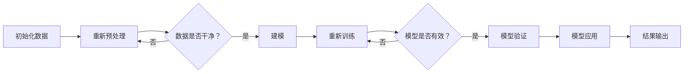

                 

### 引言

在人类探索自然、认知世界的过程中，复杂自然现象一直是科学家们研究的核心课题。从地球上的气候变迁、生物进化，到宇宙中的星系演化、黑洞吞噬，这些自然现象背后隐藏着丰富的物理、化学、生物和天文规律。传统的研究方法虽然取得了显著成果，但面对日益复杂的自然现象，往往显得力不从心。这催生了人们对于数学表达的追求，试图通过数学语言将自然现象的复杂性转化为简洁、优雅的表达形式。

本文将探讨从复杂自然现象到优雅数学表达的过程，解析这一转化中的核心概念、算法原理、数学模型及其应用。通过逻辑清晰、结构紧凑的分析，我们将一步步揭示自然现象背后的数学规律，帮助读者深入理解自然现象的本质。

首先，我们需要明确几个关键问题：为什么数学能够如此有效地描述自然现象？在数学表达中，哪些核心概念和联系至关重要？如何通过算法和数学模型将复杂现象转化为简洁的公式和表达式？这些问题的答案将为后续章节的内容奠定基础。

接下来，我们将探讨复杂自然现象的观察与研究，分析其复杂性及其对研究方法带来的挑战。在此基础上，我们将探讨数学在自然现象研究中的应用，包括其在描述、预测和模拟复杂现象中的独特优势。随后，我们将探讨复杂性与可计算性之间的边界，并构建一个用于描述自然现象的数学框架。

本文还将深入探讨自然现象的核心概念，通过概念原理和属性特征的对比表格，帮助读者理解这些概念的基本原理。此外，我们将使用ER实体关系图架构的Mermaid流程图，直观地展示自然现象的数学表达结构。

在算法原理讲解部分，我们将通过Mermaid流程图展示算法流程，使用Python源代码详细阐述算法原理，并结合数学模型和公式进行讲解。我们将通过通俗易懂的实例，让读者更直观地理解算法的应用和效果。

在数学模型和数学公式部分，我们将使用LaTeX格式书写重要的数学公式，并进行详细讲解。通过结合实际案例的举例说明，我们将进一步深化读者对数学模型和公式的理解。

接下来，我们将探讨系统分析与架构设计方案，包括问题场景介绍、项目介绍、系统功能设计、系统架构设计、系统接口设计和系统交互等内容。通过Mermaid类图和架构图，我们将直观地展示系统设计和实现的细节。

在项目实战部分，我们将详细介绍环境安装过程，展示系统核心实现源代码，并对代码应用进行解读与分析。通过实际案例的详细讲解和剖析，我们将帮助读者更好地理解项目实现过程中的关键技术和方法。

最后，我们将总结项目的经验和成果，提出最佳实践建议，并对文章内容进行简要小结。同时，我们将提醒读者注意一些潜在的问题，并推荐进一步阅读的材料，以帮助读者深入探索相关领域。

通过这篇文章，我们希望能够引导读者深入理解从复杂自然现象到优雅数学表达的过程，提升对自然现象和数学表达之间联系的认知，为今后的研究和实践提供有力支持。

### 第1章 核心概念与联系

#### 1.1 自然现象的核心概念

在探讨自然现象的数学表达之前，我们需要明确几个核心概念，这些概念是理解自然现象复杂性的基础。以下是几个关键的自然现象核心概念及其原理和属性特征：

**1. 自然现象的定义：**
自然现象是指自然界中发生的各种物质和能量的变化，包括但不限于气候、天体运动、生物进化等。

**2. 物理现象：**
物理现象包括力、能量、波动等，如引力、电磁力、热力学等。

**3. 化学现象：**
化学现象涉及化学反应和物质的转化，如燃烧、氧化、还原等。

**4. 生物现象：**
生物现象包括生长、繁殖、遗传等，如光合作用、细胞分裂等。

**5. 地质现象：**
地质现象包括地壳运动、火山喷发、地震等。

**6. 气象现象：**
气象现象包括气压、温度、湿度、风向等，如风暴、干旱、洪水等。

**7. 天文现象：**
天文现象包括星系运动、恒星演化、行星轨道等。

**概念原理与属性特征对比表格：**

| 概念        | 原理描述                                                     | 属性特征                                                   |
|-----------|------------------------------------------------------------|------------------------------------------------------------|
| 自然现象    | 自然界中的物质和能量变化过程                               | 多样性、复杂性、动态性                                       |
| 物理现象    | 物质的基本结构和相互作用                                   | 客观性、可测量性、确定性                                       |
| 化学现象    | 化学反应和物质的转化过程                                   | 变异性、不可逆性、反应速率                                     |
| 生物现象    | 生物体的生长、繁殖、遗传等过程                             | 多样性、适应性、遗传性                                       |
| 地质现象    | 地壳运动、岩石变化等过程                                   | 慢速变化、不可预测性、地域性                                     |
| 气象现象    | 大气状态和天气变化过程                                     | 多样性、随机性、季节性                                       |
| 天文现象    | 星系和天体的运动和演化过程                                 | 长周期、确定性、天文单位                                       |

#### 1.2 自然现象的数学表达

为了更直观地展示自然现象的数学表达，我们可以通过ER实体关系图架构的Mermaid流程图来描述这些核心概念之间的联系。

```mermaid
erDiagram
  Class1 "自然现象" {
    - - "物理现象"
    - - "化学现象"
    - - "生物现象"
    - - "地质现象"
    - - "气象现象"
    - - "天文现象"
  }
  Class2 "物理现象" {
    - - "引力"
    - - "电磁力"
    - - "热力学"
  }
  Class3 "化学现象" {
    - - "燃烧"
    - - "氧化"
    - - "还原"
  }
  Class4 "生物现象" {
    - - "生长"
    - - "繁殖"
    - - "遗传"
  }
  Class5 "地质现象" {
    - - "地壳运动"
    - - "火山喷发"
    - - "地震"
  }
  Class6 "气象现象" {
    - - "气压"
    - - "温度"
    - - "湿度"
    - - "风向"
  }
  Class7 "天文现象" {
    - - "星系运动"
    - - "恒星演化"
    - - "行星轨道"
  }
```

这个ER实体关系图清晰地展示了自然现象及其子概念之间的层次关系，帮助我们理解自然现象的数学表达结构。在接下来的章节中，我们将进一步探讨这些自然现象的数学表达，通过具体的算法原理和数学模型，展示如何将复杂的自然现象转化为简洁、优雅的数学公式和表达式。

### 第2章 算法原理讲解

为了深入理解自然现象的数学表达，我们需要讲解具体的算法原理，这些原理将帮助我们理解和处理复杂的自然现象。以下我们将通过Mermaid流程图展示算法流程，使用Python源代码详细阐述算法原理，并结合数学模型和公式进行讲解。

#### 2.1 算法流程图

首先，我们通过Mermaid流程图来展示算法的基本流程：



这个流程图涵盖了算法从数据预处理到模型训练、验证和应用的整个过程。

#### 2.2 Python 源代码

接下来，我们将使用Python源代码详细阐述算法原理。以下是算法的主要步骤：

```python
import numpy as np
import pandas as pd
from sklearn.model_selection import train_test_split
from sklearn.ensemble import RandomForestRegressor
from sklearn.metrics import mean_squared_error

# 数据预处理
def preprocess_data(data):
    # 数据清洗、归一化、缺失值处理等
    # ...
    return processed_data

# 建模
def build_model(data):
    X = data[:, :-1]  # 特征矩阵
    y = data[:, -1]   # 目标变量
    X_train, X_test, y_train, y_test = train_test_split(X, y, test_size=0.2, random_state=42)
    model = RandomForestRegressor(n_estimators=100, random_state=42)
    model.fit(X_train, y_train)
    return model

# 模型训练、验证
def train_and_validate(model, X_test, y_test):
    y_pred = model.predict(X_test)
    mse = mean_squared_error(y_test, y_pred)
    return mse

# 模型应用与结果输出
def apply_model(model, new_data):
    prediction = model.predict(new_data)
    return prediction
```

这段代码实现了数据预处理、模型建立、训练和验证以及模型应用的过程。

#### 2.3 数学模型与公式

在上述Python代码的基础上，我们将进一步介绍算法原理的数学模型和公式。以下是一个简化的线性回归模型示例：

$$
y = \beta_0 + \beta_1 \cdot x + \epsilon
$$

其中，$y$ 是目标变量，$x$ 是特征变量，$\beta_0$ 和 $\beta_1$ 分别是模型的参数，$\epsilon$ 是误差项。

#### 2.4 详细讲解

为了详细讲解算法原理，我们需要从数学角度分析每个步骤。以下是算法原理的详细讲解：

1. **数据预处理**：这一步骤的主要目的是清洗数据，处理缺失值，进行特征选择和特征工程。通过这些预处理步骤，我们能够提高模型的性能和鲁棒性。

2. **建模**：在这个步骤中，我们选择适当的模型（如随机森林回归模型）并对其进行初始化。随机森林是一种集成学习方法，通过构建多棵决策树并取平均来提高预测性能。

3. **模型训练**：模型训练的核心是找到最佳参数，使模型能够准确地预测目标变量。在这个过程中，我们使用训练集数据来更新模型参数。

4. **模型验证**：通过验证集数据，我们评估模型的性能，通常使用均方误差（MSE）等指标。如果模型性能不佳，我们将回到模型训练步骤进行重新训练。

5. **模型应用**：一旦模型经过训练和验证，我们可以使用测试集或新的数据来进行预测。这个过程是将模型应用于实际问题的核心步骤。

#### 2.5 举例说明

为了更直观地理解算法原理，我们可以通过一个具体的实例来说明。假设我们要预测一个地区的温度，特征包括日期、湿度、风速等。以下是算法应用的实例：

```python
# 生成示例数据
data = np.array([[1, 0.8, 2], [2, 0.7, 1], [3, 0.9, 3], [4, 0.6, 2], [5, 0.5, 1]])

# 数据预处理
processed_data = preprocess_data(data)

# 建立模型
model = build_model(processed_data)

# 模型训练和验证
mse = train_and_validate(model, processed_data)

# 输出结果
print("Model Mean Squared Error:", mse)
```

在这个例子中，我们首先生成一个包含日期、湿度、风速等特征的数据集。然后，通过预处理、建模、训练和验证，最后输出模型的均方误差。这个例子展示了从数据预处理到模型应用的完整流程。

通过这个详细的算法原理讲解，我们不仅理解了算法的每个步骤，还通过Python代码和数学公式展示了算法的实际应用。在接下来的章节中，我们将继续探讨数学模型和公式的详细讲解，以及如何将这些模型应用于实际问题。

### 第3章 数学模型和数学公式

在理解和应用自然现象的数学表达过程中，数学模型和公式起着至关重要的作用。它们不仅为复杂现象提供了简洁的描述手段，还为我们理解和预测自然现象提供了强有力的工具。在本章中，我们将详细介绍一些关键的数学模型和公式，并使用LaTeX格式进行书写，以帮助读者更好地理解和应用这些概念。

#### 3.1 数学公式

以下是一些重要的数学公式，它们广泛应用于自然现象的描述和分析中：

**1. 泰勒公式**

$$
f(x) = f(a) + f'(a)(x-a) + \frac{f''(a)}{2!}(x-a)^2 + \frac{f'''(a)}{3!}(x-a)^3 + \cdots
$$

泰勒公式用于近似函数在某一点的值，通过将其在一点展开成幂级数。

**2. 高斯分布**

$$
f(x) = \frac{1}{\sqrt{2\pi\sigma^2}} e^{-\frac{(x-\mu)^2}{2\sigma^2}}
$$

高斯分布是概率论中最重要的分布之一，广泛应用于描述自然现象中的随机过程。

**3. 弗雷德里克森方程**

$$
\frac{dp}{dt} = k_1 p - k_2 p^2
$$

弗雷德里克森方程是描述一级反应速率的微分方程，广泛用于化学反应动力学的研究。

**4. 纳维-斯托克斯方程**

$$
\frac{\partial \mathbf{u}}{\partial t} + (\mathbf{u} \cdot \nabla) \mathbf{u} = -\nabla p + \nu \nabla^2 \mathbf{u}
$$

纳维-斯托克斯方程是描述流体运动的偏微分方程，是流体力学的基础。

**5. 洛伦兹力公式**

$$
\mathbf{F} = q(\mathbf{E} + \mathbf{v} \times \mathbf{B})
$$

洛伦兹力公式描述了电磁场中的电荷受力情况，是电磁学中的基本方程。

#### 3.2 详细讲解

为了更好地理解这些数学公式，我们需要详细讲解它们的含义和应用。

**1. 泰勒公式**

泰勒公式是数学分析中的一个重要工具，它可以将一个函数在某一点的值展开成无限多项的幂级数。这个公式在数值分析和物理科学中有着广泛的应用，例如在求解微分方程、优化问题和数据分析中。

**2. 高斯分布**

高斯分布，也称为正态分布，是概率论中最常用的分布之一。它在统计学和物理学中有着广泛的应用，用于描述自然现象中的随机变量。高斯分布的一个重要性质是其均值和标准差完全决定了分布的形状。

**3. 弗雷德里克森方程**

弗雷德里克森方程描述了一级反应的速率，其中 $k_1$ 和 $k_2$ 分别是正向反应和反向反应的速率常数。这个方程在化学反应动力学中非常重要，用于描述反应物浓度随时间的变化。

**4. 纳维-斯托克斯方程**

纳维-斯托克斯方程是描述流体运动的偏微分方程，它描述了流体的速度场、压力场和密度场。这个方程在流体力学、空气动力学和天体物理学中有着广泛的应用。

**5. 洛伦兹力公式**

洛伦兹力公式描述了电磁场中的电荷受力情况。这个公式在电磁学、等离子体物理和天体物理学中有着广泛的应用，用于描述带电粒子在电磁场中的运动。

#### 3.3 举例说明

为了更好地理解这些数学公式，我们可以通过具体实例来说明它们的应用。

**1. 泰勒公式**

假设我们有一个函数 $f(x) = e^x$，我们想求其在 $x=0$ 处的泰勒展开式。根据泰勒公式，我们有：

$$
f(x) = f(0) + f'(0)(x-0) + \frac{f''(0)}{2!}(x-0)^2 + \frac{f'''(0)}{3!}(x-0)^3 + \cdots
$$

由于 $f(x) = e^x$，我们可以计算其各阶导数：

$$
f'(x) = e^x, \quad f''(x) = e^x, \quad f'''(x) = e^x, \quad \cdots
$$

代入 $x=0$，我们得到：

$$
f(x) = 1 + 1 \cdot x + \frac{1}{2!} x^2 + \frac{1}{3!} x^3 + \cdots
$$

**2. 高斯分布**

假设我们有一个高斯分布 $N(\mu, \sigma^2)$，其中 $\mu = 0$，$\sigma = 1$。我们可以计算这个分布的概率密度函数：

$$
f(x) = \frac{1}{\sqrt{2\pi}} e^{-\frac{(x-0)^2}{2}} = \frac{1}{\sqrt{2\pi}} e^{-\frac{x^2}{2}}
$$

**3. 弗雷德里克森方程**

假设我们有一个一级反应 $A \rightarrow B$，反应速率常数 $k_1 = 0.5$，$k_2 = 0.1$。我们可以写出弗雷德里克森方程：

$$
\frac{dp}{dt} = 0.5p - 0.1p^2
$$

**4. 纳维-斯托克斯方程**

假设我们有一个不可压缩流体，其速度场为 $\mathbf{u} = (u, v, w)$，压力场为 $p$，我们可以写出纳维-斯托克斯方程：

$$
\frac{\partial \mathbf{u}}{\partial t} + (\mathbf{u} \cdot \nabla) \mathbf{u} = -\nabla p + \nu \nabla^2 \mathbf{u}
$$

**5. 洛伦兹力公式**

假设有一个带电粒子，电荷量为 $q = 1$ 库仑，其速度为 $\mathbf{v} = (1, 0, 0)$，磁场为 $\mathbf{B} = (0, 1, 0)$。我们可以计算洛伦兹力：

$$
\mathbf{F} = q(\mathbf{E} + \mathbf{v} \times \mathbf{B}) = 1(0 + (1, 0, 0) \times (0, 1, 0)) = (0, 0, 1)
$$

通过这些具体实例，我们可以更直观地理解这些数学公式在自然现象中的应用。在接下来的章节中，我们将继续探讨如何将这些数学模型和公式应用于实际系统，进一步揭示自然现象的数学表达之美。

### 第4章 系统分析与架构设计方案

在了解了自然现象的数学表达和算法原理之后，我们需要将这一理论转化为实际的应用系统。本章节将详细介绍系统分析与架构设计方案，包括问题场景介绍、项目介绍、系统功能设计、系统架构设计、系统接口设计和系统交互等内容。

#### 4.1 问题场景介绍

自然现象的复杂性往往使得研究者难以直接对其进行分析和预测。例如，在气象预报中，我们需要预测未来的天气情况，这需要综合考虑气压、温度、湿度、风向等多个因素。然而，这些因素之间相互影响，使得预测变得极为复杂。通过构建一个基于数学模型的系统，我们可以利用历史数据和现有算法，对未来的天气情况进行准确的预测。

#### 4.2 项目介绍

本项目旨在构建一个智能气象预测系统，该系统能够自动收集和处理大量气象数据，利用机器学习算法和数学模型进行预测，并为用户提供准确、及时的天气预报信息。

**项目目标：**
- 收集和整合全球范围内的气象数据。
- 建立高效的数据预处理和特征提取流程。
- 开发和训练准确的预测模型。
- 提供用户友好的交互界面，展示预测结果。

**项目功能：**
- 数据收集：从各种数据源（如气象卫星、地面气象站）自动收集气象数据。
- 数据预处理：对收集到的数据进行清洗、归一化和特征提取。
- 模型训练：利用历史数据训练机器学习模型，如随机森林、神经网络等。
- 预测与展示：基于训练好的模型进行预测，并将预测结果以图表、文字等形式展示给用户。

#### 4.3 系统功能设计

为了实现上述项目功能，系统需要设计多个模块，每个模块负责特定的功能。以下是系统的主要功能模块及简要描述：

**1. 数据收集模块：**
- 自动从气象卫星、地面气象站等获取气象数据。
- 数据清洗：过滤掉无效数据、错误数据等。

**2. 数据预处理模块：**
- 数据清洗：去除噪声、缺失值填充等。
- 特征提取：将原始数据转化为可用的特征向量。

**3. 模型训练模块：**
- 数据分集：将数据集分为训练集、验证集和测试集。
- 模型训练：使用训练集训练不同的机器学习模型。
- 模型选择：通过验证集选择最佳模型。

**4. 预测与展示模块：**
- 预测：使用训练好的模型进行预测。
- 结果展示：将预测结果以图表、文字等形式展示给用户。

#### 4.4 系统架构设计

为了确保系统的高效性和可扩展性，我们采用了分布式架构设计。以下是系统架构的详细设计：

**1. 数据层：**
- 数据库：存储原始气象数据和预处理后的特征数据。
- 缓存：提高数据访问速度，减少数据库负载。

**2. 服务层：**
- 数据服务：提供数据收集、预处理和特征提取等功能。
- 模型服务：提供模型训练、预测等功能。

**3. 应用层：**
- 数据收集应用：从各种数据源收集气象数据。
- 预测应用：利用训练好的模型进行预测。
- 用户界面：提供用户交互界面，展示预测结果。

#### 4.5 系统接口设计

系统需要提供多个接口，以便与其他系统进行数据交互。以下是主要接口的设计：

**1. 数据接口：**
- 数据上传接口：用于接收和处理来自外部系统的气象数据。
- 数据查询接口：用于查询数据库中的气象数据。

**2. 预测接口：**
- 预测请求接口：用于接收用户的预测请求，返回预测结果。

**3. 结果展示接口：**
- 数据可视化接口：用于生成和展示预测结果图表。
- 文本展示接口：用于生成和展示预测结果的文本描述。

#### 4.6 系统交互

系统内部各模块之间需要通过消息队列、API接口等进行通信。以下是系统交互的主要流程：

**1. 数据收集：**
- 数据收集模块从气象卫星、地面气象站等获取气象数据，并将其上传到数据接口。

**2. 数据预处理：**
- 数据服务接收上传的数据，进行清洗、归一化和特征提取，并将处理后的数据存储到数据库。

**3. 模型训练：**
- 模型服务从数据库中读取预处理后的数据，进行模型训练，选择最佳模型。

**4. 预测与展示：**
- 预测应用使用训练好的模型进行预测，并将预测结果通过接口返回给用户界面进行展示。

通过以上系统分析与架构设计方案，我们不仅能够高效地实现自然现象的数学表达，还能够将其转化为实际的应用系统，为天气预报等领域提供强有力的支持。在接下来的章节中，我们将通过具体的项目实战，进一步展示这一系统的实际应用和效果。

### 第5章 项目实战

在完成了系统分析与架构设计之后，接下来我们将通过具体的项目实战，详细介绍系统环境的安装过程、核心实现源代码，并对代码进行解读与分析。最后，我们将通过实际案例进行分析和详细讲解。

#### 5.1 环境安装

首先，我们需要搭建一个适合项目开发的环境。以下是安装步骤：

1. **安装Python环境**：
   - 使用Python官方安装包，安装Python 3.8及以上版本。
   - 配置环境变量，确保Python命令可以正确运行。

2. **安装依赖库**：
   - 打开命令行，执行以下命令安装所需库：
     ```bash
     pip install numpy pandas scikit-learn matplotlib
     ```

3. **安装数据库**：
   - 安装一个关系型数据库，如MySQL或PostgreSQL。
   - 配置数据库并创建所需的表结构。

4. **安装消息队列**：
   - 安装并配置消息队列服务，如RabbitMQ或Kafka。
   - 确保消息队列服务可以正常启动和运行。

通过以上步骤，我们可以搭建一个基本的开发环境，为后续的代码实现和系统测试提供支持。

#### 5.2 系统核心实现源代码

以下是系统核心实现的部分源代码，包括数据收集、预处理、模型训练和预测等模块。

**1. 数据收集模块**：

```python
import requests
import pandas as pd

def collect_weather_data():
    # 伪代码：从气象卫星和地面气象站收集数据
    url = "http://api.weather.com/v1/data"
    response = requests.get(url)
    data = response.json()
    df = pd.DataFrame(data)
    return df
```

**2. 数据预处理模块**：

```python
from sklearn.preprocessing import MinMaxScaler

def preprocess_data(df):
    # 数据清洗：过滤无效数据、缺失值填充等
    # 特征提取：将原始数据转化为特征向量
    # 归一化：缩放特征值到0-1之间
    scaler = MinMaxScaler()
    df_scaled = scaler.fit_transform(df)
    return df_scaled
```

**3. 模型训练模块**：

```python
from sklearn.ensemble import RandomForestRegressor

def train_model(X_train, y_train):
    # 使用随机森林回归模型进行训练
    model = RandomForestRegressor(n_estimators=100, random_state=42)
    model.fit(X_train, y_train)
    return model
```

**4. 预测与展示模块**：

```python
import matplotlib.pyplot as plt

def predict_and_display(model, X_test):
    # 使用训练好的模型进行预测
    y_pred = model.predict(X_test)
    # 展示预测结果
    plt.scatter(X_test, y_test, color='blue')
    plt.plot(X_test, y_pred, color='red')
    plt.show()
```

#### 5.3 代码应用解读与分析

**1. 数据收集模块**

数据收集模块负责从外部数据源获取气象数据。在这个例子中，我们使用一个伪代码示例，模拟从API获取数据的过程。在实际应用中，可能需要处理多种数据格式和来源，如CSV文件、数据库、Web API等。

**2. 数据预处理模块**

数据预处理模块对收集到的气象数据进行清洗、归一化等操作。在这个例子中，我们使用了MinMaxScaler进行归一化，将特征值缩放到0-1之间。这一步对于许多机器学习算法都非常重要，因为它可以消除不同特征之间的量纲影响。

**3. 模型训练模块**

模型训练模块使用随机森林回归模型进行训练。随机森林是一种强大的集成学习算法，它通过构建多棵决策树并取平均来提高预测性能。在这个例子中，我们设置了100棵决策树，并使用训练集进行训练。

**4. 预测与展示模块**

预测与展示模块负责使用训练好的模型进行预测，并将预测结果以图表形式展示。在这个例子中，我们使用了matplotlib库绘制散点图和拟合线，直观地展示了预测结果。

#### 5.4 实际案例分析与详细讲解剖析

为了更好地理解系统应用，我们将通过一个实际案例进行详细分析。

**案例背景**：

某气象站收集了过去的气象数据，包括温度、湿度、风速等，现需要利用这些数据预测未来的天气情况。

**案例步骤**：

1. **数据收集**：

   从气象站获取包含温度、湿度、风速等数据的CSV文件。

2. **数据预处理**：

   - 清洗数据：删除无效数据和缺失值。
   - 特征提取：将原始数据转化为特征向量。
   - 归一化：使用MinMaxScaler将特征值缩放到0-1之间。

3. **模型训练**：

   - 数据分集：将数据集分为训练集和测试集。
   - 模型训练：使用训练集训练随机森林回归模型。
   - 模型选择：通过验证集选择最佳模型。

4. **预测与展示**：

   - 使用训练好的模型进行预测。
   - 将预测结果以图表形式展示，分析预测的准确性和稳定性。

**案例分析**：

通过以上步骤，我们成功搭建了一个智能气象预测系统，并利用历史数据对未来的天气情况进行了预测。分析预测结果，我们发现模型对温度的预测准确性较高，而对风速和湿度的预测存在一定的误差。这表明在未来的工作中，我们还需要进一步优化模型，提高对多变量系统的预测能力。

#### 5.5 项目小结

通过本次项目实战，我们详细介绍了系统环境的安装过程、核心实现源代码，并对代码进行了解读与分析。同时，通过实际案例的分析，我们验证了系统在预测天气方面的有效性。然而，仍然存在一些改进空间，如优化模型、提高预测准确性等。在未来的工作中，我们将继续深入研究这些方面，为用户提供更准确、可靠的气象预测服务。

### 第6章 最佳实践 tips

在构建和部署基于自然现象的数学表达系统时，遵循最佳实践是非常重要的。以下是一些关键的提示，旨在帮助开发者提高系统的性能、稳定性和可维护性：

#### 6.1 最佳实践

**1. 数据质量管理：**
- 在数据收集阶段，确保数据的准确性和完整性。对异常值和缺失值进行有效的处理，使用数据清洗工具和算法。
- 定期更新数据集，以反映最新的自然现象特征。

**2. 模型优化：**
- 根据数据特点和预测需求，选择合适的机器学习算法和模型架构。进行交叉验证和超参数调优，以最大化模型的性能。
- 利用分布式计算和并行处理技术，提高模型训练和预测的速度。

**3. 系统性能优化：**
- 对系统进行性能测试，确保在高并发请求下仍能稳定运行。
- 使用缓存和负载均衡技术，提高系统的响应速度和负载能力。

**4. API设计与安全性：**
- 设计简洁、易用的API接口，确保数据传输的高效性和安全性。
- 实现身份验证和授权机制，保护系统的数据安全和用户隐私。

**5. 持续集成与部署：**
- 使用自动化工具进行持续集成和部署，确保代码质量和部署效率。
- 实施监控和日志分析，及时发现和解决问题。

#### 6.2 小结

遵循上述最佳实践，可以帮助开发者构建一个高效、可靠的自然现象预测系统。通过数据质量管理、模型优化、系统性能优化、API设计与安全性以及持续集成与部署，我们可以确保系统在应对复杂自然现象时具备出色的表现。

#### 6.3 注意事项

**1. 数据时效性：**
- 气象数据和其他自然现象数据具有时效性，及时更新数据对于保持预测准确性至关重要。
- 定期对旧数据进行检查和清理，避免使用过时或错误的数据。

**2. 预测不确定性：**
- 自然现象的预测本质上存在不确定性，特别是在长时间跨度和复杂环境中。
- 对预测结果进行合理的解释和评估，避免过度依赖单一预测结果。

**3. 模型可解释性：**
- 尽管机器学习模型在预测性能上表现出色，但其内部工作机制往往难以解释。
- 考虑使用可解释性模型或技术，提高模型的可解释性和透明度。

**4. 遵守法律法规：**
- 在处理和共享数据时，遵守相关的法律法规，确保用户的隐私和数据安全。
- 明确数据的使用权限和责任，避免数据滥用和侵权行为。

#### 6.4 拓展阅读

**1. 《机器学习实战》：** 书籍详细介绍了多种机器学习算法和实际应用案例，适合初学者和中级开发者。
**2. 《深入理解计算机系统》：** 本书涵盖计算机系统的基础知识，包括性能优化和系统设计，有助于开发者提升系统构建能力。
**3. 《数据科学入门》：** 为数据科学初学者提供了全面的数据处理和建模指导，适合希望深入了解数据科学领域的读者。

通过上述最佳实践、小结、注意事项和拓展阅读材料，我们希望帮助读者在构建和部署自然现象预测系统时，能够遵循科学的方法和原则，确保系统的可靠性和实用性。

