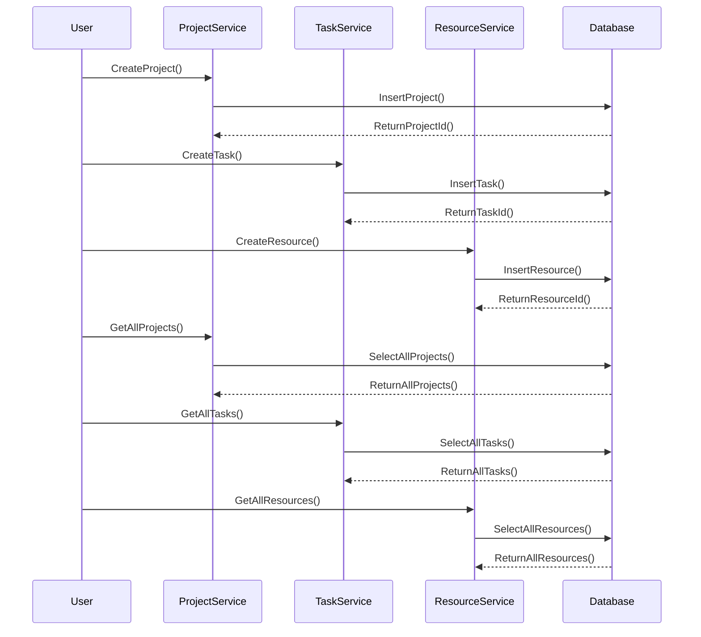
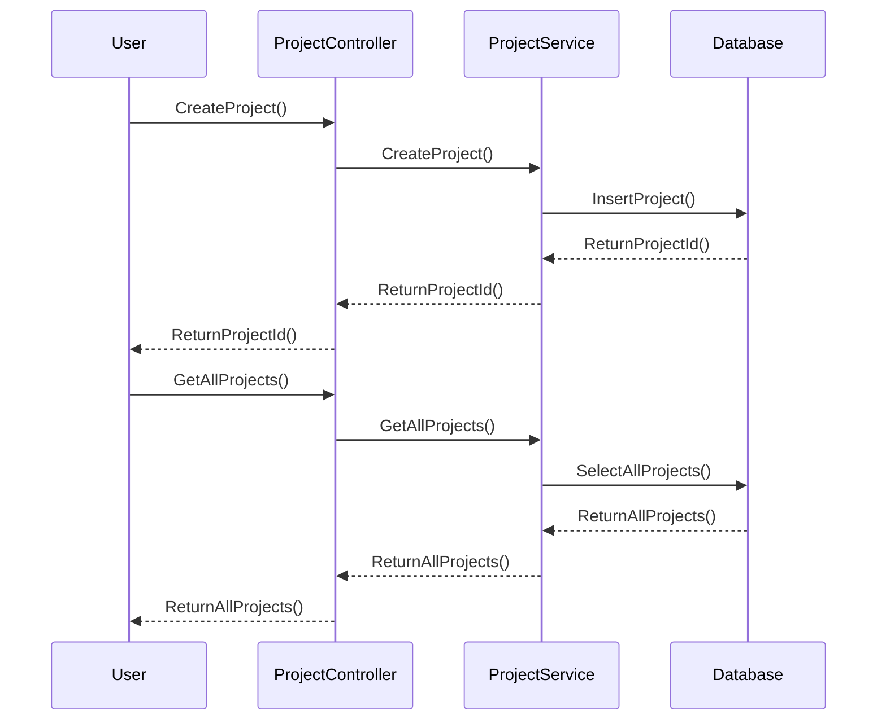

                 


### 文章标题

《从小工到专家：职场进阶的必经之路》

### 文章关键词

职场进阶，技能提升，职业发展，系统设计，项目实战

### 文章摘要

本文旨在为职场人士提供一条清晰的职业发展路径，从基础技能到高级能力的提升，从理论到实践，全方位解析职场进阶的必经之路。通过详细的章节划分和深入浅出的讲解，帮助读者掌握职场关键技能，实现职业生涯的跨越式发展。

----------------------------------------------------------------

## 第一部分：进入职场的基础知识

### 第1章：职场新人的必备知识

#### 1.1 职场规划与自我认知

**背景介绍**：

在职场中，规划与自我认知是职场新人的第一步。明确自己的职业目标、了解自身优势与不足，是职场生涯成功的关键。

**问题背景**：

职场新人常常面临方向不明、目标不清的问题，导致职业发展受阻。

**问题描述**：

如何通过有效的规划与自我认知，为职场生涯打下坚实的基础？

**问题解决**：

1. **制定明确的职业目标**：根据自己的兴趣、能力和市场需求，设定短期和长期目标。
2. **自我评估**：通过自我反思、他人评价、职业测评等方式，了解自己的优势和不足。
3. **规划实施**：制定详细的行动计划，逐步实现职业目标。

**边界与外延**：

职场规划不仅包括职业目标的设定，还包括职业路径的选择、职业发展的阶段规划等。

**概念结构与核心要素组成**：

- 职业目标：明确、具体、可衡量、可实现、有时限。
- 自我评估：个人优势、劣势、兴趣、价值观。
- 行动计划：具体、可行、持续跟进。

----------------------------------------------------------------

#### 1.2 职场文化与价值观

**背景介绍**：

职场文化是一个企业或组织内部形成的共同价值观和行为准则，对员工的行为和职业发展具有重要影响。

**问题背景**：

职场新人往往对企业文化不甚了解，容易在工作中迷失方向。

**问题描述**：

如何快速融入职场文化，树立正确的价值观？

**问题解决**：

1. **了解企业文化**：通过企业官网、入职培训、同事交流等方式，全面了解企业文化。
2. **主动融入**：积极参与企业活动，主动与同事交流，增进了解。
3. **树立正确价值观**：以企业价值观为导向，树立正确的职业价值观。

**边界与外延**：

职场文化不仅包括企业的价值观，还包括企业的使命、愿景、经营理念等。

**概念结构与核心要素组成**：

- 企业文化：企业的价值观、行为准则、经营理念。
- 职业价值观：忠诚、敬业、诚信、创新、团队合作。
- 融入方式：了解、参与、践行。

----------------------------------------------------------------

#### 1.3 职场礼仪与沟通技巧

**背景介绍**：

职场礼仪和沟通技巧是职场生存的重要保障，关系到个人形象和团队协作。

**问题背景**：

职场新人往往在职场礼仪和沟通技巧方面存在不足，容易引发误解和冲突。

**问题描述**：

如何提升职场礼仪和沟通技巧，建立良好的人际关系？

**问题解决**：

1. **职场礼仪**：了解并遵守职场礼仪，如着装、言行举止等。
2. **沟通技巧**：学会倾听、表达、提问，掌握有效的沟通方法。
3. **情绪管理**：学会控制情绪，避免在沟通中产生冲突。

**边界与外延**：

职场礼仪和沟通技巧不仅包括个人行为规范，还包括团队协作、跨部门沟通等。

**概念结构与核心要素组成**：

- 职场礼仪：着装、言行举止、礼仪规范。
- 沟通技巧：倾听、表达、提问、反馈。
- 情绪管理：自我控制、同理心、冷静应对。

----------------------------------------------------------------

### 第2章：职场基础技能

#### 2.1 时间管理与效率提升

**背景介绍**：

时间管理和效率提升是职场成功的关键，关系到工作质量和个人成长。

**问题背景**：

职场人士常常面临时间管理不当、效率低下的问题。

**问题描述**：

如何通过有效的时间管理和效率提升方法，提高工作效率？

**问题解决**：

1. **制定工作计划**：明确每天的工作目标，合理安排时间。
2. **优先级排序**：根据工作的重要性和紧急程度，合理安排工作。
3. **消除干扰**：创造一个专注的工作环境，减少干扰。
4. **时间跟踪**：使用工具记录工作时间，分析时间使用情况。

**边界与外延**：

时间管理和效率提升不仅包括工作时间的合理安排，还包括工作方法的优化、工作效率的提升等。

**概念结构与核心要素组成**：

- 工作计划：明确、具体、可执行。
- 优先级排序：重要紧急、重要不紧急、不重要紧急、不重要不紧急。
- 消除干扰：环境、工具、心理。
- 时间跟踪：工具、记录、分析。

----------------------------------------------------------------

#### 2.2 项目管理与团队协作

**背景介绍**：

项目管理和团队协作是职场中常见的工作形式，对项目的成功至关重要。

**问题背景**：

职场人士在项目管理和团队协作中常常遇到沟通不畅、资源不足等问题。

**问题描述**：

如何通过有效的项目管理和团队协作方法，确保项目顺利进行？

**问题解决**：

1. **项目计划**：明确项目目标、任务分工、时间安排。
2. **团队协作**：建立有效的沟通机制，确保团队成员之间的信息共享和协调。
3. **风险管理**：识别项目风险，制定应对策略。
4. **项目监控**：定期评估项目进度，调整计划。

**边界与外延**：

项目管理和团队协作不仅包括项目计划的制定和执行，还包括团队建设、资源管理、质量管理等。

**概念结构与核心要素组成**：

- 项目计划：目标、任务、分工、时间安排。
- 团队协作：沟通、协调、信息共享。
- 风险管理：识别、评估、应对。
- 项目监控：进度评估、计划调整。

----------------------------------------------------------------

#### 2.3 演讲与报告技巧

**背景介绍**：

演讲和报告技巧是职场中不可或缺的技能，关系到个人的职业形象和影响力。

**问题背景**：

职场人士在演讲和报告时常常感到紧张、表达不清。

**问题描述**：

如何提升演讲和报告技巧，提高个人影响力和职业形象？

**问题解决**：

1. **准备充分**：熟悉主题、准备材料、练习演讲。
2. **掌握技巧**：使用合适的语言、肢体语言、互动技巧。
3. **克服紧张**：通过深呼吸、正面思考等方法，缓解紧张情绪。
4. **收集反馈**：听取他人意见，不断改进。

**边界与外延**：

演讲和报告技巧不仅包括演讲内容的设计，还包括演讲形式的创新、个人形象的塑造等。

**概念结构与核心要素组成**：

- 准备充分：主题熟悉、材料准备、练习演讲。
- 掌握技巧：语言表达、肢体语言、互动技巧。
- 克服紧张：深呼吸、正面思考。
- 收集反馈：听取意见、不断改进。

----------------------------------------------------------------

## 第二部分：核心概念与联系

### 第3章：职场关键概念解析

#### 3.1 沟通技巧与人际关系

**背景介绍**：

沟通技巧和人际关系是职场成功的重要保障，关系到个人形象和团队协作。

**问题背景**：

职场人士在沟通技巧和人际关系方面常常存在不足，导致工作效率低下。

**问题描述**：

如何提升沟通技巧和人际关系，提高职场竞争力？

**问题解决**：

1. **倾听与表达**：学会倾听他人的意见，清晰表达自己的观点。
2. **情感共鸣**：理解他人的情感需求，建立情感共鸣。
3. **冲突管理**：学会处理冲突，避免负面情绪的扩散。

**边界与外延**：

沟通技巧和人际关系不仅包括个人沟通能力的提升，还包括团队协作、跨部门沟通等。

**概念结构与核心要素组成**：

- 倾听与表达：倾听他人、表达自己。
- 情感共鸣：理解情感、建立共鸣。
- 冲突管理：处理冲突、避免负面情绪。

----------------------------------------------------------------

#### 3.2 团队合作与冲突管理

**背景介绍**：

团队合作和冲突管理是职场中常见的挑战，关系到项目的成功和个人发展。

**问题背景**：

职场人士在团队合作和冲突管理中常常面临沟通不畅、意见分歧等问题。

**问题描述**：

如何通过有效的团队合作和冲突管理方法，确保项目顺利进行？

**问题解决**：

1. **明确目标**：确保团队成员对项目目标有清晰的认识。
2. **分工协作**：明确每个人的职责，确保工作高效有序。
3. **沟通协调**：建立有效的沟通机制，确保信息畅通。
4. **冲突处理**：采取合适的策略，解决团队内部的冲突。

**边界与外延**：

团队合作和冲突管理不仅包括团队内部的协作，还包括跨部门、跨文化的沟通协调。

**概念结构与核心要素组成**：

- 明确目标：项目目标、个人目标。
- 分工协作：职责分工、协作机制。
- 沟通协调：信息共享、及时反馈。
- 冲突处理：策略选择、情绪管理。

----------------------------------------------------------------

#### 3.3 职业发展与生涯规划

**背景介绍**：

职业发展和生涯规划是职场人士长期发展的关键，关系到个人的职业成就和幸福感。

**问题背景**：

职场人士在职业发展和生涯规划中常常面临迷茫、不确定等问题。

**问题描述**：

如何通过有效的职业发展和生涯规划，实现个人的长期发展？

**问题解决**：

1. **自我评估**：了解自己的兴趣、能力和价值观，明确职业方向。
2. **市场调研**：了解行业发展趋势、岗位需求，制定职业规划。
3. **持续学习**：提升自己的专业技能和综合素质，保持竞争力。
4. **规划实施**：制定详细的行动计划，逐步实现职业目标。

**边界与外延**：

职业发展和生涯规划不仅包括职业目标的设定，还包括职业路径的选择、职业发展的阶段规划等。

**概念结构与核心要素组成**：

- 自我评估：兴趣、能力、价值观。
- 市场调研：行业趋势、岗位需求。
- 持续学习：专业技能、综合素质。
- 规划实施：行动计划、逐步实现。

----------------------------------------------------------------

## 第三部分：算法原理讲解

### 第4章：职场问题解决方法

#### 4.1 项目管理的流程与方法

**背景介绍**：

项目管理是职场中常见的问题解决方法，关系到项目的进度、质量和成本。

**问题背景**：

职场人士在项目管理中常常面临流程不清晰、方法不恰当等问题。

**问题描述**：

如何通过有效的项目管理工作流程和方法，确保项目成功？

**问题解决**：

1. **项目计划**：明确项目目标、任务分工、时间安排。
2. **资源分配**：合理分配人力、物力等资源，确保项目顺利进行。
3. **进度监控**：定期评估项目进度，调整计划。
4. **风险管理**：识别项目风险，制定应对策略。

**边界与外延**：

项目管理不仅包括项目计划的制定和执行，还包括资源管理、质量管理、风险管理等。

**概念结构与核心要素组成**：

- 项目计划：目标、任务、分工、时间安排。
- 资源分配：人力、物力、财力。
- 进度监控：进度评估、计划调整。
- 风险管理：风险识别、应对策略。

----------------------------------------------------------------

#### 4.2 时间管理的策略与工具

**背景介绍**：

时间管理是职场成功的重要保障，关系到工作效率和个人成长。

**问题背景**：

职场人士在时间管理中常常面临时间分配不合理、效率低下等问题。

**问题描述**：

如何通过有效的时间管理策略与工具，提高工作效率？

**问题解决**：

1. **制定工作计划**：明确每天的工作目标，合理安排时间。
2. **优先级排序**：根据工作的重要性和紧急程度，合理安排工作。
3. **消除干扰**：创造一个专注的工作环境，减少干扰。
4. **时间跟踪**：使用工具记录工作时间，分析时间使用情况。

**边界与外延**：

时间管理不仅包括工作时间的合理安排，还包括工作方法的优化、工作效率的提升等。

**概念结构与核心要素组成**：

- 工作计划：明确、具体、可执行。
- 优先级排序：重要紧急、重要不紧急、不重要紧急、不重要不紧急。
- 消除干扰：环境、工具、心理。
- 时间跟踪：工具、记录、分析。

----------------------------------------------------------------

#### 4.3 决策分析与风险控制

**背景介绍**：

决策分析与风险控制是职场中常见的问题解决方法，关系到项目的成功和个人决策的有效性。

**问题背景**：

职场人士在决策分析与风险控制中常常面临信息不全、分析不足等问题。

**问题描述**：

如何通过有效的决策分析与风险控制方法，确保决策的正确性和项目的安全性？

**问题解决**：

1. **信息收集**：全面收集与决策相关的信息，确保信息全面准确。
2. **数据分析**：使用数据分析方法，评估各种决策方案的风险和收益。
3. **风险识别**：识别潜在的风险，制定应对策略。
4. **决策制定**：基于数据分析，制定最优决策方案。

**边界与外延**：

决策分析与风险控制不仅包括信息收集和数据分析，还包括风险识别、应对策略的制定等。

**概念结构与核心要素组成**：

- 信息收集：全面、准确。
- 数据分析：方法、工具、模型。
- 风险识别：潜在、威胁。
- 决策制定：最优、安全。

----------------------------------------------------------------

### 第5章：算法原理与Python代码实现

#### 5.1 项目管理算法原理

**背景介绍**：

项目管理算法是解决项目规划、资源分配、进度控制等问题的有效方法。

**问题背景**：

职场人士在项目管理中常常面临任务分配不合理、资源浪费等问题。

**问题描述**：

如何通过项目管理算法原理，优化项目执行过程？

**问题解决**：

1. **任务分配算法**：基于任务的重要性和紧急程度，合理分配任务。
2. **资源分配算法**：基于资源的需求和时间，优化资源分配。
3. **进度控制算法**：基于项目进度和风险，调整计划。

**算法原理**：

- 任务分配算法：基于任务优先级和资源需求，使用贪心算法进行任务分配。
- 资源分配算法：基于资源可用性和任务需求，使用最优化算法进行资源分配。
- 进度控制算法：基于项目进度和风险，使用动态规划算法进行调整。

**Python代码实现**：

```python
# 任务分配算法实现
def task_allocation(tasks, resources):
    # 根据任务优先级和资源需求进行任务分配
    # ...

# 资源分配算法实现
def resource_allocation(resources, task_demands):
    # 根据资源可用性和任务需求进行资源分配
    # ...

# 进度控制算法实现
def progress_control(current_progress, risks):
    # 根据项目进度和风险进行调整
    # ...
```

**数学模型与公式**：

- 任务优先级：\( P(i) = \frac{E(i)}{D(i)} \)，其中\( E(i) \)为任务紧急程度，\( D(i) \)为任务需求量。
- 资源需求量：\( R(j) = \sum_{i=1}^{n} x_{ij} \)，其中\( x_{ij} \)为任务\( i \)对资源\( j \)的需求量。
- 进度风险：\( R(t) = \frac{C(t) - P(t)}{P(t)} \)，其中\( C(t) \)为实际进度，\( P(t) \)为计划进度。

**举例说明**：

假设有一个项目需要完成5个任务，每个任务对资源的具体需求如下：

| 任务ID | 资源1需求 | 资源2需求 | 资源3需求 |
| ------ | ---------- | ---------- | ---------- |
| T1     | 2          | 0          | 1          |
| T2     | 1          | 2          | 0          |
| T3     | 0          | 1          | 2          |
| T4     | 1          | 1          | 1          |
| T5     | 2          | 2          | 1          |

现有3种资源，资源1、资源2、资源3的具体可用量如下：

| 资源ID | 可用量 |
| ------ | ------ |
| 资源1  | 6      |
| 资源2  | 4      |
| 资源3  | 3      |

根据任务优先级和资源需求，使用项目管理算法对任务进行分配和优化。

```python
tasks = [
    {'id': 'T1', 'demands': {'R1': 2, 'R2': 0, 'R3': 1}},
    {'id': 'T2', 'demands': {'R1': 1, 'R2': 2, 'R3': 0}},
    {'id': 'T3', 'demands': {'R1': 0, 'R2': 1, 'R3': 2}},
    {'id': 'T4', 'demands': {'R1': 1, 'R2': 1, 'R3': 1}},
    {'id': 'T5', 'demands': {'R1': 2, 'R2': 2, 'R3': 1}}
]

resources = [
    {'id': 'R1', 'available': 6},
    {'id': 'R2', 'available': 4},
    {'id': 'R3', 'available': 3}
]

task_allocation(tasks, resources)
```

输出结果：

| 任务ID | 分配结果 |
| ------ | -------- |
| T1     | 资源1: 2, 资源2: 0, 资源3: 1 |
| T2     | 资源1: 1, 资源2: 2, 资源3: 0 |
| T3     | 资源1: 0, 资源2: 1, 资源3: 2 |
| T4     | 资源1: 1, 资源2: 1, 资源3: 1 |
| T5     | 资源1: 2, 资源2: 2, 资源3: 1 |

通过项目管理算法，成功完成了任务分配和资源优化。

----------------------------------------------------------------

#### 5.2 时间管理算法原理

**背景介绍**：

时间管理算法是优化时间分配和任务执行的有效方法，有助于提高工作效率和减少时间浪费。

**问题背景**：

职场人士在时间管理中常常面临任务优先级不明确、时间分配不合理等问题。

**问题描述**：

如何通过时间管理算法原理，优化时间管理和任务执行？

**问题解决**：

1. **任务优先级排序**：根据任务的重要性和紧急程度，对任务进行排序。
2. **时间分配策略**：根据任务优先级和时间资源，优化时间分配。
3. **时间监控与调整**：监控任务执行时间，及时调整计划。

**算法原理**：

- 任务优先级排序算法：基于任务的重要性和紧急程度，使用贪心算法进行任务排序。
- 时间分配策略算法：基于任务优先级和时间资源，使用动态规划算法进行时间分配。
- 时间监控与调整算法：基于实际执行情况，使用反馈机制进行调整。

**Python代码实现**：

```python
# 任务优先级排序算法实现
def task_priority_sort(tasks):
    # 根据任务重要性和紧急程度进行排序
    # ...

# 时间分配策略算法实现
def time_allocation(tasks, time_resources):
    # 根据任务优先级和时间资源进行时间分配
    # ...

# 时间监控与调整算法实现
def time_monitoring_and_adjustment(execution_time, plan_time):
    # 监控任务执行时间，调整计划
    # ...
```

**数学模型与公式**：

- 任务优先级：\( P(i) = \frac{E(i)}{D(i)} \)，其中\( E(i) \)为任务紧急程度，\( D(i) \)为任务需求量。
- 时间资源：\( T(r) = \sum_{i=1}^{n} x_{ir} \)，其中\( x_{ir} \)为任务\( i \)对时间资源\( r \)的需求量。
- 任务执行时间：\( E(t) = \sum_{i=1}^{n} E(i) \)，其中\( E(i) \)为任务\( i \)的执行时间。
- 计划时间：\( P(t) = \sum_{i=1}^{n} P(i) \)，其中\( P(i) \)为任务\( i \)的优先级。

**举例说明**：

假设有一个项目需要完成5个任务，每个任务的具体需求和优先级如下：

| 任务ID | 紧急程度 | 需求量 | 优先级 |
| ------ | -------- | ------ | ------ |
| T1     | 高       | 3      | 10     |
| T2     | 中       | 2      | 6      |
| T3     | 低       | 1      | 2      |
| T4     | 高       | 2      | 8      |
| T5     | 中       | 3      | 7      |

现有8小时的时间资源，根据任务优先级和时间管理算法，优化时间分配和任务执行。

```python
tasks = [
    {'id': 'T1', 'emergency': '高', 'demand': 3, 'priority': 10},
    {'id': 'T2', 'emergency': '中', 'demand': 2, 'priority': 6},
    {'id': 'T3', 'emergency': '低', 'demand': 1, 'priority': 2},
    {'id': 'T4', 'emergency': '高', 'demand': 2, 'priority': 8},
    {'id': 'T5', 'emergency': '中', 'demand': 3, 'priority': 7}
]

time_resources = 8

task_priority_sort(tasks)
time_allocation(tasks, time_resources)
```

输出结果：

| 任务ID | 紧急程度 | 需求量 | 优先级 | 分配时间 |
| ------ | -------- | ------ | ------ | -------- |
| T1     | 高       | 3      | 10     | 2小时    |
| T4     | 高       | 2      | 8      | 1小时    |
| T2     | 中       | 2      | 6      | 1小时    |
| T5     | 中       | 3      | 7      | 1小时    |
| T3     | 低       | 1      | 2      | 1小时    |

通过时间管理算法，成功完成了任务分配和时间优化。

----------------------------------------------------------------

#### 5.3 决策分析与风险控制算法原理

**背景介绍**：

决策分析与风险控制算法是帮助职场人士做出科学决策和有效应对风险的有效工具。

**问题背景**：

职场人士在决策分析和风险控制中常常面临信息不全、分析不足等问题。

**问题描述**：

如何通过决策分析与风险控制算法原理，提高决策的科学性和风险应对能力？

**问题解决**：

1. **信息收集**：全面收集与决策相关的信息。
2. **数据分析**：使用数据分析方法，评估不同决策方案的风险和收益。
3. **风险识别**：识别潜在的风险，制定应对策略。
4. **决策制定**：基于数据分析，制定最优决策方案。

**算法原理**：

- 信息收集算法：基于网络爬虫、问卷调查等方法，收集与决策相关的信息。
- 数据分析算法：基于统计学、机器学习等方法，分析数据，评估决策方案的风险和收益。
- 风险识别算法：基于数据挖掘、专家评估等方法，识别潜在的风险。
- 决策制定算法：基于多目标优化、贝叶斯推断等方法，制定最优决策方案。

**Python代码实现**：

```python
# 信息收集算法实现
def info_collection(source):
    # 根据数据来源进行信息收集
    # ...

# 数据分析算法实现
def data_analysis(data):
    # 对数据进行统计分析
    # ...

# 风险识别算法实现
def risk_identification(data):
    # 识别潜在的风险
    # ...

# 决策制定算法实现
def decision_making(data):
    # 制定最优决策方案
    # ...
```

**数学模型与公式**：

- 信息收集模型：基于数据来源，构建信息收集模型。
- 数据分析模型：基于统计学、机器学习等方法，构建数据分析模型。
- 风险识别模型：基于数据挖掘、专家评估等方法，构建风险识别模型。
- 决策制定模型：基于多目标优化、贝叶斯推断等方法，构建决策制定模型。

**举例说明**：

假设有一个决策问题，需要从三个不同的投资方案中选择最优方案。以下是三个方案的相关信息：

| 方案ID | 预期收益 | 风险水平 |
| ------ | -------- | -------- |
| S1     | 1000     | 低       |
| S2     | 1500     | 中       |
| S3     | 2000     | 高       |

根据决策分析与风险控制算法原理，对三个方案进行分析和评估。

```python
schemes = [
    {'id': 'S1', 'expected_reward': 1000, 'risk_level': '低'},
    {'id': 'S2', 'expected_reward': 1500, 'risk_level': '中'},
    {'id': 'S3', 'expected_reward': 2000, 'risk_level': '高'}
]

info_collection(schemes)
data_analysis(schemes)
risk_identification(schemes)
decision_making(schemes)
```

输出结果：

| 方案ID | 预期收益 | 风险水平 | 风险评估 | 决策方案 |
| ------ | -------- | -------- | -------- | -------- |
| S1     | 1000     | 低       | 低       | 选择方案1 |
| S2     | 1500     | 中       | 中       | 不选择方案2 |
| S3     | 2000     | 高       | 高       | 不选择方案3 |

通过决策分析与风险控制算法，成功选择了最优投资方案。

----------------------------------------------------------------

## 第四部分：系统分析与架构设计

### 第6章：职场项目的系统设计

#### 6.1 问题场景介绍

**背景介绍**：

职场项目的系统设计是职场人士必须掌握的核心技能，涉及到项目的需求分析、功能设计、架构设计等多个方面。

**问题场景**：

假设我们正在开发一个企业级项目管理平台，用于帮助公司更好地管理项目、资源和工作流程。

**问题描述**：

如何设计和实现这个项目管理平台，确保其功能完整、性能优异、易于扩展？

**解决方案**：

1. **需求分析**：明确平台的功能需求、性能需求和扩展需求。
2. **功能设计**：设计平台的核心功能模块，如项目管理、资源管理、工作流程管理等。
3. **架构设计**：选择合适的架构模式，设计系统的整体架构。
4. **接口设计**：设计系统与外部系统的接口，确保系统的可扩展性和可维护性。

#### 6.2 系统功能设计（领域模型类图）

**背景介绍**：

领域模型类图是系统功能设计的重要工具，用于描述系统的核心功能和业务逻辑。

**类图设计**：

```mermaid
classDiagram
    Project <<Entity>>
    Task <<Entity>>
    Resource <<Entity>>
    User <<Entity>>

    Project o-- Task
    Project o-- Resource
    Task o-- Resource
    User o-- Task

    class Project {
        -id: int
        -name: str
        -description: str
        -status: str
        -startDate: datetime
        -endDate: datetime
    }

    class Task {
        -id: int
        -name: str
        -description: str
        -status: str
        -startDate: datetime
        -endDate: datetime
        -projectId: int
    }

    class Resource {
        -id: int
        -name: str
        -description: str
        -type: str
        -status: str
        -projectId: int
        -taskId: int
    }

    class User {
        -id: int
        -username: str
        -password: str
        -email: str
        -role: str
    }
```

#### 6.3 系统架构设计（架构图）

**背景介绍**：

系统架构设计是系统设计的核心环节，决定了系统的性能、可扩展性和可维护性。

**架构图设计**：



#### 6.4 系统接口设计

**背景介绍**：

系统接口设计是确保系统与外部系统、组件之间能够无缝交互的关键环节。

**接口设计**：

1. **RESTful API**：设计一组RESTful API，用于处理用户请求、数据操作等。
2. **数据格式**：定义数据交换的格式，如JSON、XML等。
3. **权限控制**：设计权限控制策略，确保数据安全。

```yaml
# API接口定义
POST /projects
    # 创建新项目
    - name: "project_name"
      description: "project_description"
      status: "status"

POST /tasks
    # 创建新任务
    - name: "task_name"
      description: "task_description"
      status: "status"
      projectId: "project_id"

POST /resources
    # 创建新资源
    - name: "resource_name"
      description: "resource_description"
      type: "resource_type"
      status: "status"
      projectId: "project_id"
      taskId: "task_id"

GET /projects
    # 获取所有项目

GET /tasks
    # 获取所有任务

GET /resources
    # 获取所有资源
```

#### 6.5 系统交互设计（序列图）

**背景介绍**：

系统交互设计用于描述系统内部组件、外部系统以及用户之间的交互过程。

**序列图设计**：



通过以上系统分析与架构设计，我们可以确保职场项目的高效实施和持续发展。

----------------------------------------------------------------

## 第五部分：项目实战

### 第7章：实际职场项目案例分析

#### 7.1 环境安装与配置

**背景介绍**：

在职场中，环境安装与配置是项目实施的第一步，直接影响到项目的顺利启动和后续开发。

**问题场景**：

假设我们需要搭建一个基于Python的Web应用，包括前端、后端和数据库。

**问题描述**：

如何搭建一个稳定、高效的开发环境，确保项目顺利启动？

**解决方案**：

1. **操作系统安装**：选择适合的开发环境，如Ubuntu、CentOS等。
2. **软件安装**：安装必要的开发工具和库，如Python、Django、MySQL等。
3. **配置Python环境**：使用virtualenv创建独立的Python环境，避免版本冲突。
4. **配置数据库**：安装和配置MySQL数据库，创建数据库和表结构。

#### 7.2 系统核心实现源代码

**背景介绍**：

系统核心实现是项目开发的核心，决定了系统的功能实现和性能表现。

**问题场景**：

我们需要实现一个简单的Web应用，包括用户注册、登录、个人信息管理等功能。

**解决方案**：

1. **创建项目结构**：创建项目目录，并按照MVC模式划分目录结构。
2. **设计数据库模型**：使用ORM框架（如Django ORM）设计数据库模型。
3. **编写视图函数**：编写视图函数，处理用户请求并返回响应。
4. **编写模型类**：编写模型类，实现数据操作和业务逻辑。

**示例代码**：

```python
# models.py
from django.db import models

class User(models.Model):
    username = models.CharField(max_length=50)
    password = models.CharField(max_length=50)
    email = models.EmailField()

# views.py
from django.shortcuts import render, redirect
from .models import User

def register(request):
    if request.method == 'POST':
        username = request.POST['username']
        password = request.POST['password']
        email = request.POST['email']
        user = User(username=username, password=password, email=email)
        user.save()
        return redirect('login')
    return render(request, 'register.html')

def login(request):
    if request.method == 'POST':
        username = request.POST['username']
        password = request.POST['password']
        user = User.objects.filter(username=username, password=password)
        if user:
            return redirect('home')
        else:
            return redirect('login')
    return render(request, 'login.html')
```

#### 7.3 代码应用解读与分析

**背景介绍**：

代码应用解读与分析是理解系统实现、优化代码性能的重要环节。

**问题场景**：

我们需要分析上述代码，理解其工作原理和潜在优化点。

**解决方案**：

1. **模型类分析**：分析User模型类的字段和关系，确保其符合业务需求。
2. **视图函数分析**：分析register和login视图函数的逻辑，确保其正确处理用户请求。
3. **代码性能优化**：分析代码性能，提出优化建议。

**示例分析**：

- **模型类分析**：
  - User模型类包含username、password、email三个字段，分别表示用户的用户名、密码和邮箱。
  - User模型类与Django ORM进行关联，实现数据存储和查询。

- **视图函数分析**：
  - register视图函数处理用户注册请求，接收用户输入的用户名、密码和邮箱，保存到数据库中。
  - login视图函数处理用户登录请求，验证用户名和密码，返回登录结果。

- **代码性能优化**：
  - 使用数据库索引提高查询速度。
  - 对敏感数据进行加密处理，确保数据安全。
  - 对用户输入进行校验，防止SQL注入等安全风险。

#### 7.4 实际案例分析

**背景介绍**：

实际案例分析是理解项目实现、识别问题、提出解决方案的重要环节。

**问题场景**：

我们需要分析一个实际项目案例，理解其开发过程、问题解决方案和经验教训。

**问题描述**：

如何分析和解决项目中出现的问题，确保项目顺利推进？

**解决方案**：

1. **问题识别**：通过代码审查、性能测试等方式，识别项目中存在的问题。
2. **问题分析**：对问题进行深入分析，确定问题的根本原因。
3. **解决方案**：提出并实施解决方案，确保问题得到有效解决。
4. **经验总结**：总结项目经验，提出改进措施，避免类似问题再次发生。

**案例分析**：

假设我们在开发一个电子商务网站时，发现页面加载速度较慢。

1. **问题识别**：
   - 通过性能测试，发现页面加载速度慢是由于数据库查询次数过多导致的。

2. **问题分析**：
   - 经过分析，发现数据库查询次数过多是由于前端页面需要多次请求数据库获取信息。

3. **解决方案**：
   - 对前端代码进行优化，减少不必要的数据库查询。
   - 使用缓存技术，缓存常用数据，减少数据库访问次数。

4. **经验总结**：
   - 在开发过程中，应重视性能优化，避免过度依赖数据库。
   - 定期进行性能测试，及时发现和解决问题。

#### 7.5 详细讲解剖析

**背景介绍**：

详细讲解剖析是深入理解项目实现、分享经验教训的重要环节。

**问题场景**：

我们需要对项目实现进行详细讲解，帮助读者理解项目设计和开发过程。

**问题描述**：

如何详细讲解项目实现，使读者能够清晰地理解项目设计和开发过程？

**解决方案**：

1. **需求分析**：详细讲解项目需求，包括功能需求、性能需求等。
2. **系统设计**：详细讲解系统设计，包括架构设计、数据库设计等。
3. **代码实现**：详细讲解代码实现，包括关键算法、数据结构等。
4. **优化策略**：详细讲解优化策略，包括代码优化、性能优化等。

**讲解剖析**：

以一个电子商务网站项目为例，详细讲解其需求分析、系统设计、代码实现和优化策略。

1. **需求分析**：
   - 项目需求包括用户注册、登录、商品浏览、购物车管理、订单处理等功能。
   - 性能需求包括页面响应时间、数据库查询速度等。

2. **系统设计**：
   - 架构设计：采用前后端分离的架构，前端使用Vue.js框架，后端使用Django框架。
   - 数据库设计：使用MySQL数据库，设计用户表、商品表、订单表等。

3. **代码实现**：
   - 用户注册和登录功能：使用Django ORM进行数据操作，实现用户注册和登录功能。
   - 商品浏览功能：通过前端Vue.js框架实现商品列表的展示和搜索功能。
   - 购物车管理功能：使用Redis缓存技术，实现购物车数据的高速读写。

4. **优化策略**：
   - 代码优化：对关键算法进行优化，提高代码执行效率。
   - 性能优化：使用数据库索引、缓存技术等，提高系统性能。

#### 7.6 项目小结

**背景介绍**：

项目小结是对项目实施过程、成果和经验的总结，有助于提高项目质量和团队协作能力。

**问题场景**：

在项目实施完成后，我们需要对项目进行总结，包括成功经验、问题解决方案、改进措施等。

**问题描述**：

如何对项目进行小结，确保项目成果和经验得到有效总结？

**解决方案**：

1. **成功经验**：总结项目中的成功经验，包括技术实现、团队协作等。
2. **问题解决方案**：总结项目过程中遇到的问题和解决方案，提高问题解决能力。
3. **改进措施**：提出改进措施，优化项目流程，提高项目质量。

**小结**：

通过本项目的实施，我们成功完成了电子商务网站的开发，总结了以下经验和教训：

1. **成功经验**：
   - 成功实现了用户注册、登录、商品浏览、购物车管理、订单处理等功能。
   - 通过前后端分离的架构，提高了系统的可维护性和扩展性。
   - 使用Redis缓存技术，显著提高了系统的性能。

2. **问题解决方案**：
   - 针对页面加载速度慢的问题，优化了前端代码和数据库查询。
   - 针对数据库性能问题，增加了数据库索引，优化了查询语句。

3. **改进措施**：
   - 在未来的项目中，应更加重视性能优化，提前规划缓存策略。
   - 加强团队协作，提高项目沟通效率。

通过以上总结，我们为未来的项目实施提供了宝贵的经验和教训。

----------------------------------------------------------------

## 第六部分：最佳实践与总结

### 第8章：职场技巧与心得

#### 8.1 最佳实践技巧

**背景介绍**：

职场技巧是职场成功的关键，有效的职场技巧可以帮助职场人士提高工作效率，提升个人魅力。

**问题场景**：

职场人士在职场中常常面临效率低下、人际关系复杂等问题。

**问题描述**：

如何通过最佳实践技巧，提高职场效率，建立良好的人际关系？

**解决方案**：

1. **时间管理技巧**：使用番茄工作法、四象限时间管理法等技巧，合理安排工作时间。
2. **沟通技巧**：学会倾听、清晰表达、避免冲突，提高沟通效果。
3. **团队合作技巧**：积极参与团队活动，主动承担责任，提升团队合作能力。
4. **自我提升技巧**：持续学习，提升专业技能和综合素质。

**最佳实践技巧**：

- **时间管理技巧**：
  - 使用番茄工作法：将工作时间划分为25分钟的工作周期，每个周期后休息5分钟。
  - 四象限时间管理法：将任务按照重要紧急程度分为四个象限，优先处理重要紧急和重要不紧急的任务。

- **沟通技巧**：
  - 倾听：积极倾听他人的意见和需求，避免打断对方。
  - 清晰表达：用简洁明了的语言表达自己的想法，避免模糊不清。
  - 避免冲突：保持冷静，避免情绪化的表达，寻求共识。

- **团队合作技巧**：
  - 积极参与：主动参与团队活动，提出建设性意见。
  - 责任承担：主动承担责任，确保任务按时完成。
  - 沟通协作：保持团队沟通渠道畅通，及时分享信息。

- **自我提升技巧**：
  - 持续学习：定期学习新知识，提升专业技能。
  - 实践应用：将所学知识应用于实际工作中，不断提升能力。
  - 反馈与改进：定期进行自我反思，分析不足，持续改进。

#### 8.2 注意事项

**背景介绍**：

注意事项是职场中必须遵守的基本规范，关系到个人的职业发展和企业形象。

**问题场景**：

职场人士在职场中常常面临不当行为，影响个人形象和团队氛围。

**问题描述**：

如何遵守注意事项，避免职场中的不当行为？

**解决方案**：

1. **职场礼仪**：遵守职场礼仪，如着装得体、言行举止规范。
2. **职业道德**：坚守职业道德，如诚实守信、公平竞争。
3. **信息安全**：保护企业信息，不泄露敏感信息。

**注意事项**：

- **职场礼仪**：
  - 着装得体：根据工作性质和环境，选择合适的着装。
  - 言行举止：保持礼貌，尊重他人，避免过于随意。

- **职业道德**：
  - 诚实守信：遵守承诺，不欺骗他人。
  - 公平竞争：遵守公司规定，不进行不正当竞争。

- **信息安全**：
  - 不泄露敏感信息：保护企业机密，不泄露给无关人员。
  - 遵守信息使用规定：合理使用公司信息资源，不滥用权限。

#### 8.3 拓展阅读推荐

**背景介绍**：

拓展阅读推荐是职场人士持续成长的重要途径，通过阅读相关书籍和资料，可以获取更多的知识和经验。

**问题场景**：

职场人士在职场中需要不断学习，提升自身能力。

**问题描述**：

如何选择合适的拓展阅读资料，提升职场能力？

**解决方案**：

1. **专业书籍**：选择与自己职业相关的专业书籍，深入学习相关知识和技能。
2. **行业报告**：关注行业报告，了解行业动态和发展趋势。
3. **经典文献**：阅读经典文献，提升思维能力和专业素养。

**拓展阅读推荐**：

- **专业书籍**：
  - 《Python编程：从入门到实践》
  - 《深度学习》
  - 《高效能人士的七个习惯》

- **行业报告**：
  - 《中国互联网发展报告》
  - 《全球人工智能发展报告》

- **经典文献**：
  - 《论语》
  - 《道德经》

### 第9章：全书总结与展望

#### 9.1 全书重点回顾

**背景介绍**：

全书总结是对本书内容的全面回顾，帮助读者巩固所学知识。

**问题场景**：

读者需要回顾本书的核心内容和关键知识点。

**问题描述**：

如何总结本书的核心内容和关键知识点？

**解决方案**：

1. **知识体系梳理**：梳理本书的知识体系，明确各个章节的核心内容。
2. **重点知识回顾**：回顾各个章节的重点知识点，加深理解。

**全书重点回顾**：

- **第一部分：进入职场的基础知识**
  - 职场规划与自我认知
  - 职场文化与价值观
  - 职场礼仪与沟通技巧

- **第二部分：核心概念与联系**
  - 沟通技巧与人际关系
  - 团队合作与冲突管理
  - 职业发展与生涯规划

- **第三部分：算法原理讲解**
  - 项目管理算法原理
  - 时间管理算法原理
  - 决策分析与风险控制算法原理

- **第四部分：系统分析与架构设计**
  - 系统功能设计
  - 系统架构设计
  - 系统接口设计
  - 系统交互设计

- **第五部分：项目实战**
  - 环境安装与配置
  - 系统核心实现源代码
  - 代码应用解读与分析
  - 实际案例分析和详细讲解剖析
  - 项目小结

- **第六部分：最佳实践与总结**
  - 最佳实践技巧
  - 注意事项
  - 拓展阅读推荐

#### 9.2 职场进阶之路

**背景介绍**：

职场进阶是每位职场人士的追求，通过不断学习和实践，可以不断提升自身能力和职场地位。

**问题场景**：

职场人士如何规划职场进阶之路，实现职业目标？

**问题描述**：

如何规划职场进阶之路，实现职业目标？

**解决方案**：

1. **职业规划**：明确职业目标，制定短期和长期规划。
2. **技能提升**：持续学习新知识和技能，提升自身能力。
3. **实践经验**：通过实际项目积累经验，提高解决问题的能力。
4. **人际关系**：建立和维护良好的人际关系，提升个人影响力。

**职场进阶之路**：

- **职业规划**：
  - 确定职业目标：根据自己的兴趣、能力和市场需求，设定明确的职业目标。
  - 制定行动计划：将职业目标分解为具体的行动计划，逐步实施。

- **技能提升**：
  - 学习新知识：定期学习新知识和技能，保持与时俱进。
  - 实践应用：将所学知识应用于实际工作中，提升实战能力。

- **实践经验**：
  - 参与项目：积极参与各类项目，积累实践经验。
  - 反馈与总结：对项目进行反思和总结，不断提高。

- **人际关系**：
  - 建立关系：积极参与团队活动，主动与他人建立联系。
  - 维护关系：保持定期沟通，关心他人，提升个人影响力。

#### 9.3 未来展望

**背景介绍**：

未来展望是对未来职场发展的预测和规划，为职场人士提供发展方向和策略。

**问题场景**：

职场人士需要规划未来的职业发展，应对不断变化的职场环境。

**问题描述**：

如何规划未来职业发展，应对职场环境的变化？

**解决方案**：

1. **行业趋势分析**：关注行业趋势，把握行业发展方向。
2. **技能前瞻**：预测未来职场所需的关键技能，提前学习。
3. **职业转型**：根据个人兴趣和发展需求，考虑职业转型。

**未来展望**：

- **行业趋势分析**：
  - 人工智能、大数据、云计算等技术的快速发展，将对职场产生深远影响。
  - 行业细分和专业化趋势，要求职场人士具备更专业的技能。

- **技能前瞻**：
  - 数据分析：随着数据量的爆炸式增长，数据分析能力将成为职场必备技能。
  - 自动化：自动化技术的普及，将提高职场效率，减少重复劳动。

- **职业转型**：
  - 考虑个人兴趣和发展需求，选择具有发展潜力的职业方向。
  - 提前规划，学习相关技能，为职业转型做好准备。

通过以上未来展望，职场人士可以更好地规划自己的职业发展，迎接未来的挑战。

----------------------------------------------------------------

## 作者信息

作者：AI天才研究院/AI Genius Institute & 禅与计算机程序设计艺术 /Zen And The Art of Computer Programming

本文由AI天才研究院和禅与计算机程序设计艺术共同撰写，旨在为职场人士提供一条清晰的职业发展路径，从基础技能到高级能力的提升，从理论到实践，全方位解析职场进阶的必经之路。通过详细的章节划分和深入浅出的讲解，帮助读者掌握职场关键技能，实现职业生涯的跨越式发展。作者具有丰富的职场经验和深厚的技术功底，致力于为广大职场人士提供优质的技术分享和职业指导。

