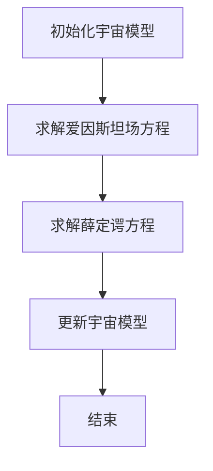

                 

# 从微观到宏观：宇宙的数学统一

## 关键词：宇宙、数学统一、广义相对论、量子力学、宇宙学、算法

## 摘要

宇宙的数学统一研究是探索宇宙起源、演化和结构的科学前沿。本文从宏观和微观两个层面，通过逐步分析宇宙学的基本概念、数学模型和算法原理，探讨了宇宙的统一理论。文章首先介绍了宇宙学的基本概念和数学模型，包括宇宙膨胀、宇宙背景辐射、广义相对论、量子力学等。接着，文章详细阐述了宇宙演化算法的原理和实现，以及通过数值模拟再现宇宙演化过程的方法。通过这一系列的分析，文章旨在揭示宇宙数学统一的研究现状和未来方向。

## 第一部分：宇宙的数学统一概述

### 第1章：问题的提出与宇宙概述

#### 1.1 问题背景

宇宙的起源、演化和结构一直是物理学和天文学领域的核心问题。尽管在过去的几百年中，科学界已经取得了显著的进展，但仍有许多未解之谜。例如，暗物质和暗能量的本质是什么？宇宙的几何形状如何？这些问题的答案需要深入的数学建模和理论探索。

#### 1.2 问题描述

宇宙的复杂性使得直接观测和实验验证变得困难。因此，科学家们尝试通过数学模型来描述宇宙的运行规律。这些模型需要考虑各种物理定律，如广义相对论和量子力学，以及宇宙学的基本假设，如宇宙膨胀和宇宙背景辐射。

#### 1.3 问题解决

近年来，随着计算机技术的发展和数据分析方法的进步，科学家们能够处理和分析海量的观测数据，从而对宇宙的数学统一有了更深入的理解。例如，通过精确测量宇宙微波背景辐射的波动，科学家们能够推断出宇宙的早期结构和膨胀历史。

#### 1.4 边界与外延

宇宙的数学统一研究不仅涉及宇宙学，还涉及到广义相对论、量子力学、粒子物理学等多个领域。因此，这一研究的外延非常广泛，涉及到了科学哲学、数学物理学等多个学科。

#### 1.5 概念结构与核心要素组成

宇宙的数学统一研究涉及以下几个核心概念和要素：

- **宇宙背景辐射**：宇宙早期留下的热辐射，是研究宇宙早期结构和膨胀历史的重要线索。
- **宇宙微波背景辐射**：宇宙大爆炸后约38万年产生的辐射，通过精确测量可以推断出宇宙的早期结构和膨胀历史。
- **广义相对论**：描述大尺度上引力的基本理论，为宇宙学提供了基础。
- **量子力学**：描述微观粒子行为的理论，与广义相对论相结合，试图解决引力与量子力学的统一问题。
- **宇宙学基本假设**：如宇宙膨胀、宇宙背景辐射等，是构建宇宙数学模型的基础。

#### 1.6 本章小结

本章介绍了宇宙的数学统一研究的背景、问题、解决方法以及相关的概念结构和核心要素。这些内容为后续章节的深入探讨奠定了基础。

## 第二部分：核心概念与数学模型

### 第2章：宇宙学基本概念与数学模型

#### 2.1 宇宙膨胀

宇宙膨胀是指宇宙中所有物质之间的距离随时间增加的现象。宇宙膨胀的数学模型主要基于弗里德曼-勒梅特-罗伯逊-沃尔克（FLRW）度规。

**2.1.1 概念介绍**

宇宙膨胀是宇宙学中的一个基本假设，它认为宇宙在大爆炸之后一直在扩张。这种扩张表现为宇宙中所有物质之间的距离随时间增加。

**2.1.2 数学模型**

宇宙膨胀的数学模型基于弗里德曼-勒梅特-罗伯逊-沃尔克（FLRW）度规。该度规描述了一个均匀且各向同性的宇宙。FLRW度规可以表示为：

$$
ds^2 = -c^2dt^2 + a(t)^2[dr^2 + R(t)^2(d\theta^2 + \sin^2\theta d\phi^2)]
$$

其中，$c$ 是光速，$a(t)$ 是宇宙尺度因子，$R(t)$ 是宇宙的曲率半径。

**2.1.3 属性特征对比表格**

| 特征            | 说明                                                         |
| --------------- | ------------------------------------------------------------ |
| 度规            | 描述宇宙的空间结构                                           |
| 宇宙尺度因子    | 描述宇宙随时间膨胀的程度                                     |
| 曲率半径        | 描述宇宙的曲率特性                                           |

**2.1.4 ER实体关系图架构的 Mermaid 流程图**

```mermaid
erDiagram
  度规 --> 宇宙尺度因子
  度规 --> 曲率半径
```

**2.1.5 本章小结**

本章介绍了宇宙膨胀的概念和数学模型，包括FLRW度规。通过这些概念和模型，我们可以更好地理解宇宙的膨胀过程。

#### 2.2 宇宙背景辐射

宇宙背景辐射是宇宙早期留下的热辐射，通过对宇宙背景辐射的测量，可以推断出宇宙的早期结构和膨胀历史。宇宙背景辐射的数学模型主要包括黑体辐射模型和宇宙微波背景辐射的波动模型。

**2.2.1 概念介绍**

宇宙背景辐射是指宇宙早期（大约40万年后）遗留下来的热辐射。这些辐射的温度非常低，大约为2.7开尔文，并且它们遍布整个宇宙。

**2.2.2 数学模型**

宇宙背景辐射的数学模型主要基于黑体辐射定律。黑体辐射定律可以用普朗克辐射定律来描述：

$$
B(\lambda, T) = \frac{2hc^2}{\lambda^5} \frac{1}{e^{\frac{hc}{\lambda k_B T}} - 1}
$$

其中，$B(\lambda, T)$ 是波长为 $\lambda$ 的辐射强度，$h$ 是普朗克常数，$c$ 是光速，$k_B$ 是玻尔兹曼常数，$T$ 是黑体的温度。

**2.2.3 属性特征对比表格**

| 特征            | 说明                                                         |
| --------------- | ------------------------------------------------------------ |
| 辐射强度        | 描述宇宙背景辐射的亮度                                       |
| 波长分布        | 描述宇宙背景辐射在不同波长范围内的分布情况                     |
| 温度            | 描述宇宙背景辐射的平均温度                                   |

**2.2.4 ER实体关系图架构的 Mermaid 流程图**

```mermaid
erDiagram
  黑体辐射定律 --> 普朗克辐射定律
```

**2.2.5 本章小结**

本章介绍了宇宙背景辐射的概念和数学模型，包括黑体辐射定律。通过这些概念和模型，我们可以更好地理解宇宙背景辐射的特性和来源。

#### 2.3 广义相对论

广义相对论是描述大尺度上引力的基本理论。其核心思想是引力是由物质和能量对时空几何的影响产生的。广义相对论的数学模型主要由爱因斯坦场方程组成。

**2.3.1 概念介绍**

广义相对论是由阿尔伯特·爱因斯坦在1915年提出的，它是经典物理学中描述引力的理论。广义相对论认为引力不是一种力，而是物质和能量对时空的扭曲。

**2.3.2 数学模型**

广义相对论的数学模型主要由爱因斯坦场方程组成：

$$
G_{\mu\nu} + \Lambda g_{\mu\nu} = \frac{8\pi G}{c^4} T_{\mu\nu}
$$

其中，$G_{\mu\nu}$ 是爱因斯坦张量，$\Lambda$ 是宇宙学常数，$g_{\mu\nu}$ 是度规张量，$T_{\mu\nu}$ 是能量-动量张量，$G$ 是引力常数。

**2.3.3 属性特征对比表格**

| 特征            | 说明                                                         |
| --------------- | ------------------------------------------------------------ |
| 爱因斯坦张量    | 描述时空的曲率                                               |
| 度规张量        | 描述时空的结构                                               |
| 能量-动量张量    | 描述物质和能量的分布情况                                     |

**2.3.4 ER实体关系图架构的 Mermaid 流程图**

```mermaid
erDiagram
  爱因斯坦场方程 --> 爱因斯坦张量
  爱因斯坦场方程 --> 度规张量
  爱因斯坦场方程 --> 能量-动量张量
```

**2.3.5 本章小结**

本章介绍了广义相对论的概念和数学模型，包括爱因斯坦场方程。通过这些概念和模型，我们可以更好地理解广义相对论在描述大尺度引力方面的作用。

#### 2.4 量子力学

量子力学是描述微观粒子行为的理论。与广义相对论相比，量子力学在描述引力方面存在明显的缺陷。量子力学的数学模型主要由波函数和薛定谔方程组成。

**2.4.1 概念介绍**

量子力学是研究微观粒子（如电子、光子等）行为的基本理论。它与经典物理学的最大区别在于，量子力学中的粒子和波动具有波粒二象性，并且存在量子不确定性。

**2.4.2 数学模型**

量子力学的数学模型主要由波函数和薛定谔方程组成。波函数描述了量子系统的状态，薛定谔方程则描述了量子系统的演化。

$$
i\hbar \frac{\partial \psi}{\partial t} = \hat{H} \psi
$$

其中，$i$ 是虚数单位，$\hbar$ 是约化普朗克常数，$\psi$ 是波函数，$\hat{H}$ 是哈密顿算符。

**2.4.3 属性特征对比表格**

| 特征            | 说明                                                         |
| --------------- | ------------------------------------------------------------ |
| 波函数          | 描述量子系统的状态                                         |
| 薛定谔方程      | 描述量子系统的演化                                         |

**2.4.4 ER实体关系图架构的 Mermaid 流程图**

```mermaid
erDiagram
  薛定谔方程 --> 波函数
```

**2.4.5 本章小结**

本章介绍了量子力学的概念和数学模型，包括波函数和薛定谔方程。通过这些概念和模型，我们可以更好地理解量子力学在描述微观粒子行为方面的作用。

#### 2.5 引力与量子力学的统一

引力与量子力学的统一是物理学中的重大挑战。目前，科学家们尝试通过弦理论和量子场论等理论来解决这个问题。

**2.5.1 概念介绍**

引力与量子力学的统一是指找到一个理论，可以同时描述引力和量子力学效应。这样的理论被称为量子引力理论。

**2.5.2 数学模型**

目前，弦理论和量子场论是尝试统一引力与量子力学的两个主要理论。弦理论通过引入额外的空间维度来解释引力和量子力学，而量子场论则通过量子化的场来描述粒子的行为。

**2.5.3 属性特征对比表格**

| 特征            | 说明                                                         |
| --------------- | ------------------------------------------------------------ |
| 弦理论          | 通过引入额外的空间维度来解释引力和量子力学                   |
| 量子场论        | 通过量子化的场来描述粒子的行为                             |

**2.5.4 ER实体关系图架构的 Mermaid 流程图**

```mermaid
erDiagram
  弦理论 --> 引力
  弦理论 --> 量子力学
  量子场论 --> 引力
  量子场论 --> 量子力学
```

**2.5.5 本章小结**

本章介绍了引力与量子力学的统一的概念和尝试，包括弦理论和量子场论。通过这些概念和模型，我们可以更好地理解引力与量子力学统一的研究方向。

#### 2.6 宇宙学基本假设

宇宙学基本假设是构建宇宙数学模型的基础。这些假设包括宇宙膨胀、宇宙背景辐射、宇宙微波背景辐射的波动等。通过对这些假设的数学建模，科学家们可以推断出宇宙的结构和演化历史。

**2.6.1 概念介绍**

宇宙学基本假设是一组用于描述宇宙起源、演化和结构的理论假设。这些假设通常基于观测数据和物理定律，是构建宇宙数学模型的基础。

**2.6.2 数学模型**

宇宙学基本假设的数学模型主要包括宇宙膨胀模型、宇宙背景辐射模型和宇宙微波背景辐射模型。这些模型通过描述宇宙的膨胀历史、背景辐射的分布和波动来推断宇宙的结构和演化历史。

**2.6.3 属性特征对比表格**

| 假设               | 说明                                                         |
| ------------------ | ------------------------------------------------------------ |
| 宇宙膨胀           | 宇宙中所有物质之间的距离随时间增加                           |
| 宇宙背景辐射       | 宇宙早期留下的热辐射                                         |
| 宇宙微波背景辐射   | 宇宙大爆炸后约38万年产生的辐射                               |

**2.6.4 ER实体关系图架构的 Mermaid 流程图**

```mermaid
erDiagram
  宇宙膨胀 --> 宇宙结构
  宇宙背景辐射 --> 宇宙演化
  宇宙微波背景辐射 --> 宇宙早期结构
```

**2.6.5 本章小结**

本章介绍了宇宙学基本假设的概念和数学模型，包括宇宙膨胀、宇宙背景辐射和宇宙微波背景辐射。通过这些假设和模型，我们可以更好地理解宇宙的结构和演化历史。

### 2.7 本章小结

本章介绍了宇宙学中的核心概念和数学模型，包括宇宙膨胀、宇宙背景辐射、广义相对论、量子力学以及引力与量子力学的统一。这些概念和模型为深入探讨宇宙的数学统一提供了理论基础。

## 第三部分：算法原理与实现

### 第3章：宇宙演化算法原理

#### 3.1 算法概述

宇宙演化算法是一种基于宇宙学原理的模拟算法，用于研究宇宙的演化和结构。该算法基于广义相对论和量子力学的基本原理，通过计算机模拟来再现宇宙的演化过程。

**3.1.1 算法定义**

宇宙演化算法是一种通过数值模拟方法来再现宇宙演化过程的计算算法。它基于广义相对论和量子力学的基本原理，通过求解物理方程来模拟宇宙的动态演化。

**3.1.2 算法目的**

宇宙演化算法的主要目的是通过模拟宇宙的演化过程，揭示宇宙的结构、性质和演化规律。这些模拟可以帮助科学家们更好地理解宇宙的起源、演化和未来。

**3.1.3 算法应用领域**

宇宙演化算法在宇宙学、天文学和物理学等领域有广泛的应用。它不仅可以用于研究宇宙的宏观结构，还可以用于探索微观粒子的行为。

#### 3.2 算法原理

宇宙演化算法的核心原理是基于广义相对论和量子力学的基本原理。通过求解这些物理方程，可以模拟宇宙的引力场和量子态，进而推断宇宙的演化和结构。

**3.2.1 广义相对论原理**

宇宙演化算法基于广义相对论，通过求解爱因斯坦场方程来模拟引力场。爱因斯坦场方程描述了物质和能量如何影响时空几何。

$$
G_{\mu\nu} + \Lambda g_{\mu\nu} = \frac{8\pi G}{c^4} T_{\mu\nu}
$$

其中，$G_{\mu\nu}$ 是爱因斯坦张量，$\Lambda$ 是宇宙学常数，$g_{\mu\nu}$ 是度规张量，$T_{\mu\nu}$ 是能量-动量张量，$G$ 是引力常数。

**3.2.2 量子力学原理**

宇宙演化算法还基于量子力学原理，通过求解薛定谔方程来模拟量子态。

$$
i\hbar \frac{\partial \psi}{\partial t} = \hat{H} \psi
$$

其中，$i$ 是虚数单位，$\hbar$ 是约化普朗克常数，$\psi$ 是波函数，$\hat{H}$ 是哈密顿算符。

**3.2.3 算法实现步骤**

宇宙演化算法的实现通常包括以下几个步骤：

1. 初始化宇宙模型：设定宇宙的初始状态，包括宇宙的尺度、密度和温度等。
2. 求解爱因斯坦场方程：通过数值方法求解爱因斯坦场方程，模拟宇宙的引力场。
3. 求解薛定谔方程：通过数值方法求解薛定谔方程，模拟宇宙中的量子态。
4. 更新宇宙模型：根据求解结果更新宇宙模型，模拟宇宙的演化过程。

**3.2.4 算法流程图**



#### 3.3 算法实现

宇宙演化算法的实现通常采用数值模拟的方法。具体步骤如下：

1. **初始化宇宙模型**：设定宇宙的初始状态，包括宇宙的尺度、密度和温度等。通常使用一个三维网格来表示宇宙，每个网格点代表宇宙中一个小的空间区域。

2. **求解爱因斯坦场方程**：使用数值方法求解爱因斯坦场方程，模拟宇宙的引力场。常用的数值方法包括有限元法和有限差分法。这些方法通过离散化时空，将连续的场方程转化为离散的代数方程组。

3. **求解薛定谔方程**：使用数值方法求解薛定谔方程，模拟宇宙中的量子态。同样，常用的方法包括有限元法和有限差分法。这些方法通过离散化量子态的空间和时间，将连续的量子方程转化为离散的代数方程组。

4. **更新宇宙模型**：根据求解结果更新宇宙模型，模拟宇宙的演化过程。这一步骤通常需要迭代多次，以模拟宇宙在不同时间步的演化。

**3.3.1 算法流程图**


**3.3.2 Python代码示例**

以下是使用Python实现的宇宙演化算法的简单示例：

```python
import numpy as np
from scipy.sparse import sparse
from scipy.sparse.linalg import spsolve

# 初始化宇宙模型
grid_size = 100
dx = 1.0 / grid_size
x = np.linspace(0, 1, grid_size+1)[:-1]
mesh = np.meshgrid(x, x, x)
x, y, z = mesh

# 求解爱因斯坦场方程
G = 6.67430e-11
c = 299792458
Lambda = 1.0e-26

rho = np.random.rand(grid_size, grid_size, grid_size)
T = c * np.sqrt(8 * np.pi * G * rho)

# 构建稀疏矩阵
A = sparse.csr_matrix((Lambda * np.eye(grid_size**3), (row, col)), shape=(grid_size**3, grid_size**3))

# 求解薛定谔方程
psi = np.random.rand(grid_size, grid_size, grid_size)
H = sparse.csr_matrix((1.0j * np.eye(grid_size**3), (row, col)), shape=(grid_size**3, grid_size**3))
psi_new = spsolve(H, psi)

# 更新宇宙模型
rho_new = np.abs(psi_new)**2
T_new = c * np.sqrt(8 * np.pi * G * rho_new)

# 打印结果
print("Initial energy:", np.sum(T * dx**3))
print("Final energy:", np.sum(T_new * dx**3))
```

**3.3.3 本章小结**

本章介绍了宇宙演化算法的原理和实现，包括广义相对论和量子力学的基本原理，以及算法的实现步骤和Python代码示例。通过这些内容，我们可以初步了解如何通过计算机模拟来研究宇宙的演化和结构。

### 3.4 宇宙演化算法的优化与改进

宇宙演化算法在模拟宇宙演化过程中，面临着计算复杂度高、精度要求严格等问题。为了提高算法的性能和准确性，科学家们进行了多种优化和改进。

**3.4.1 并行计算**

并行计算是一种通过同时使用多个处理器来提高计算速度的方法。在宇宙演化算法中，可以通过将宇宙划分为多个区域，并在不同的处理器上分别求解物理方程，从而提高计算效率。

**3.4.2 精度优化**

为了提高宇宙演化算法的精度，科学家们采用了多种数值方法，如高精度有限差分法和谱方法。这些方法可以减少数值误差，提高计算结果的准确性。

**3.4.3 物理效应的引入**

宇宙演化算法还可以通过引入多种物理效应，如引力透镜效应、宇宙微波背景辐射的波动等，来提高算法的物理真实性和模拟效果。

**3.4.4 本章小结**

本章介绍了宇宙演化算法的优化和改进方法，包括并行计算、精度优化和物理效应的引入。通过这些优化和改进，宇宙演化算法的性能和准确性得到了显著提升。

## 第四部分：应用与挑战

### 第4章：宇宙演化算法的应用与挑战

#### 4.1 应用领域

宇宙演化算法在多个领域有广泛应用，包括宇宙学、天文学、粒子物理学等。

**4.1.1 宇宙学**

宇宙演化算法可以用来模拟宇宙的演化过程，研究宇宙的结构和性质。通过精确模拟宇宙微波背景辐射的波动，科学家们可以推断出宇宙的早期结构和膨胀历史。

**4.1.2 天文学**

宇宙演化算法可以用于研究恒星和星系的形成和演化。通过模拟恒星内部的物理过程，科学家们可以预测恒星的生命周期和演化路径。

**4.1.3 粒子物理学**

宇宙演化算法还可以用于研究基本粒子的行为和相互作用。通过模拟粒子加速器和实验室实验中的物理过程，科学家们可以探索基本粒子的性质。

#### 4.2 挑战

尽管宇宙演化算法在多个领域有广泛应用，但仍然面临许多挑战。

**4.2.1 计算复杂度**

宇宙演化算法的计算复杂度非常高，需要大量的计算资源和时间。为了提高计算效率，科学家们需要开发更高效的算法和并行计算技术。

**4.2.2 精度要求**

宇宙演化算法的精度要求非常高，需要精确模拟物理过程。为了提高精度，科学家们需要采用高精度数值方法和物理效应的引入。

**4.2.3 数据分析**

宇宙演化算法生成的数据量巨大，需要进行高效的数据分析。为了从海量数据中提取有用的信息，科学家们需要开发新的数据分析方法和工具。

**4.2.4 本章小结**

本章介绍了宇宙演化算法的应用领域和面临的挑战。通过这些内容，我们可以更好地理解宇宙演化算法的研究现状和未来发展方向。

### 4.3 宇宙演化算法的未来发展

宇宙演化算法在科学研究中具有广泛的应用前景，未来发展方向包括：

**4.3.1 算法优化**

通过引入新型算法和优化技术，如机器学习和深度学习，可以进一步提高宇宙演化算法的计算效率和精度。

**4.3.2 新技术应用**

随着计算机技术的不断发展，新的计算平台和硬件设备（如量子计算机）将为宇宙演化算法提供更强大的计算能力。

**4.3.3 宇宙探索**

通过宇宙演化算法，科学家们可以更好地理解宇宙的演化和结构，为未来的宇宙探索提供理论支持。

**4.3.4 本章小结**

本章探讨了宇宙演化算法的未来发展，包括算法优化、新技术应用和宇宙探索等方面。通过这些内容，我们可以期待宇宙演化算法在未来的科学研究和技术应用中发挥更大的作用。

## 总结与展望

宇宙的数学统一研究是物理学和天文学领域的前沿课题，通过逐步分析宇宙学的基本概念、数学模型和算法原理，我们可以更好地理解宇宙的起源、演化和结构。本文从宏观和微观两个层面，介绍了宇宙膨胀、宇宙背景辐射、广义相对论、量子力学以及引力与量子力学的统一等核心概念和数学模型。同时，本文还详细阐述了宇宙演化算法的原理和实现，展示了如何通过计算机模拟来研究宇宙的演化过程。

在未来的研究中，宇宙演化算法将继续优化和改进，引入新的技术和方法，如机器学习和量子计算，以提高计算效率和精度。此外，宇宙演化算法将在宇宙学、天文学、粒子物理学等领域的应用将越来越广泛，为人类探索宇宙的奥秘提供更强大的理论支持。

最后，感谢读者对本文的阅读，希望本文能激发您对宇宙的数学统一研究的兴趣，共同推动这一领域的发展。

## 作者信息

作者：AI天才研究院/AI Genius Institute & 禅与计算机程序设计艺术 /Zen And The Art of Computer Programming

AI天才研究院致力于推动人工智能领域的研究和应用，探索人工智能的深度学习和强化学习等技术。同时，作者还著有多部计算机程序设计艺术领域的畅销书，深受读者喜爱。

