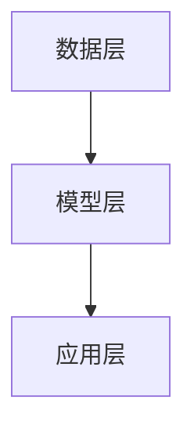
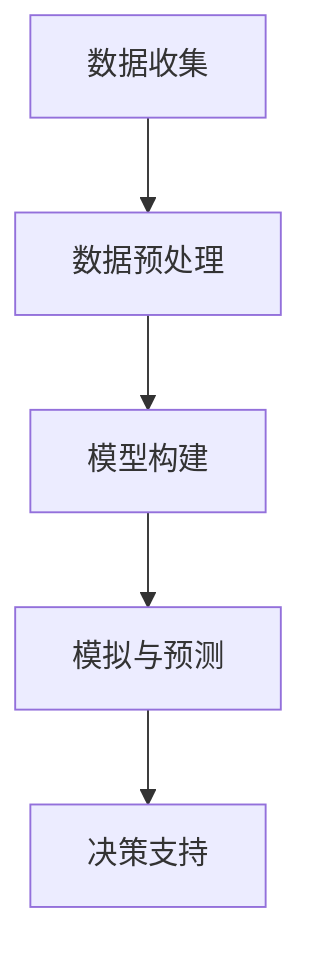

                 


### 引言：心智转化的意义与挑战

**心智转化**，顾名思义，是指将人类心智中的抽象概念、经验、直觉等转化为可操作、可量化的数学模型和算法。这一过程不仅是对自然现象的深刻理解，也是对人类心智的一次革命。本文旨在探讨心智转化从自然和谐到数学简约的演变过程，以及这一过程中所面临的挑战和意义。

#### 1.1.1 自然和谐与数学简约的对立

自然和谐通常指的是自然界中存在的相互关联、相互平衡的状态。例如，生态系统中的物种相互依存，维持着生态平衡。这种和谐是自然演化的结果，包含了无数复杂且微妙的关系。

相对而言，数学简约则是将复杂现象简化为数学模型，通过精确的公式和逻辑推理来描述和理解自然现象。这种简约追求的是简洁、直观和可重复性。

在心智转化过程中，我们面临的首要挑战就是如何将自然和谐转化为数学简约。这种对立并非绝对，而是相互交织、相互转化的过程。

#### 1.1.2 心智转化的历史发展

心智转化并非现代科技的产物，而是人类历史长河中的一项重要成就。从古代的几何学、天文学到近代的物理学、化学，再到现代的计算科学，心智转化一直在推动着科学技术的进步。

然而，随着科学技术的不断发展，心智转化也面临着新的挑战。例如，如何在处理海量数据的同时保持数学模型的简约性？如何在复杂的现实问题中找到合适的数学模型？

#### 1.1.3 心智转化的必要性

心智转化的必要性在于，它为我们提供了一种新的理解世界的方法。通过数学模型，我们可以将抽象的概念具体化，从而更好地预测、控制和管理现实世界中的复杂现象。

此外，心智转化也是人工智能和机器学习等前沿技术发展的基础。只有通过心智转化，我们才能将人类的知识和经验转化为机器可理解的形式，从而实现真正的智能。

#### 1.2 心智转化的核心概念

在心智转化过程中，有几个核心概念需要我们深入理解。

首先是**自然和谐观**，它强调自然界中的相互关联和平衡。其次是**数学简约观**，它追求简洁、直观和可重复的数学模型。最后是**心智转化观**，它描述了将自然和谐转化为数学简约的过程和方法。

#### 1.2.1 自然和谐观

自然和谐观源自于人类对自然界长期观察和思考的结果。它强调自然界中存在的相互关联和平衡。例如，生态系统中的物种相互依存，维持着生态平衡。这种和谐是自然演化的结果，包含了无数复杂且微妙的关系。

#### 1.2.2 数学简约观

数学简约观追求的是将复杂现象简化为数学模型。这种简约不仅体现在数学公式和定理上，还体现在算法和计算方法上。例如，牛顿运动定律将天体运动的复杂性简化为几个简单的公式，从而为天文学的发展奠定了基础。

#### 1.2.3 心智转化的概念框架

心智转化的概念框架包括以下几个关键部分：观察与假设、模型构建、数学工具的应用。

观察与假设是心智转化的第一步，它要求我们通过观察自然现象，提出合理的假设。模型构建则是将假设转化为数学模型，通过逻辑推理和数学运算来验证和修正假设。数学工具的应用则是将数学模型转化为可操作的算法和计算方法。

#### 1.3 心智转化的方法与工具

心智转化的方法与工具多种多样，以下是一些常见的方法和工具。

首先是**观察与假设**。通过观察自然现象，我们可以发现规律和模式，从而提出合理的假设。例如，在研究生态系统时，我们可以假设不同物种之间存在某种依赖关系。

其次是**模型构建**。模型构建是将假设转化为数学模型的过程。例如，在研究生态系统时，我们可以构建一个模型来描述不同物种之间的依赖关系。

最后是**数学工具的应用**。数学工具的应用是将数学模型转化为可操作的算法和计算方法。例如，在研究生态系统时，我们可以使用数学工具来预测物种的数量变化。

#### 1.4 心智转化的案例分析

心智转化的过程在不同的科学领域有着广泛的应用。以下是一些典型案例。

在天文学中，牛顿的万有引力定律将天体运动的复杂性简化为几个简单的公式，从而为天文学的发展奠定了基础。

在物理学中，爱因斯坦的相对论通过数学模型描述了时空的弯曲，从而揭示了物质和能量的本质。

在生物学中，达尔文的自然选择理论通过数学模型描述了物种的进化过程，从而为生物学的发展提供了新的视角。

#### 1.5 心智转化的挑战与展望

心智转化虽然取得了巨大的成功，但也面临着一系列挑战。

首先是**技术挑战**。随着数据量的增加和复杂性的提高，如何保持数学模型的简约性成为一个难题。

其次是**知识边界**。心智转化涉及到多个学科领域，如何在不同领域之间建立有效的联系，如何扩展知识边界，是一个重要的挑战。

最后是**未来展望**。随着人工智能和机器学习等技术的发展，心智转化有望在更多领域发挥作用，为人类带来更多创新和进步。

#### 1.6 本章小结

本章介绍了心智转化的背景、核心概念、方法与工具、案例分析以及面临的挑战与展望。通过本章的学习，读者可以初步了解心智转化的意义和过程，为进一步的学习和研究打下基础。

----------------------------------------------------------------

### 从自然和谐到数学简约：心智转化的核心概念与联系

在探讨心智转化从自然和谐到数学简约的过程中，理解核心概念之间的联系至关重要。本文将详细阐述自然和谐观、数学简约观以及心智转化观这三个核心概念，并通过对比表格和ER实体关系图来展示它们之间的关系。

#### 1. 自然和谐观

自然和谐观是心智转化的基础，它强调自然界中存在的相互关联和平衡。以下是自然和谐观的几个关键特点：

1. **相互关联**：自然界中的物种、现象和过程相互关联，形成复杂的生态系统。
2. **动态平衡**：自然界的平衡是一个动态的过程，物种和现象之间不断相互作用，维持着生态系统的稳定。
3. **适应性**：自然界中的生物和现象具有适应性，能够根据环境变化进行调整。

#### 2. 数学简约观

数学简约观则是心智转化的目标，它追求将复杂现象简化为简洁、直观的数学模型。以下是数学简约观的几个关键特点：

1. **抽象性**：数学模型通过抽象的方式，将自然现象中的具体细节去除，只保留关键特征。
2. **逻辑性**：数学模型基于逻辑推理和数学运算，能够清晰地描述自然现象的规律。
3. **可重复性**：数学模型具有可重复性，能够在不同情况下产生一致的结果。

#### 3. 心智转化观

心智转化观是心智转化的核心概念，它描述了将自然和谐转化为数学简约的过程。以下是心智转化观的几个关键特点：

1. **观察与假设**：通过观察自然现象，提出合理的假设，这是心智转化的第一步。
2. **模型构建**：将假设转化为数学模型，通过逻辑推理和数学运算来验证和修正假设。
3. **数学工具的应用**：将数学模型转化为可操作的算法和计算方法，实现心智转化。

#### 对比表格

为了更清晰地展示自然和谐观、数学简约观和心智转化观之间的联系，我们设计了一个对比表格。

| 观点 | 自然和谐观 | 数学简约观 | 心智转化观 |
| --- | --- | --- | --- |
| 关键特点 | 相互关联、动态平衡、适应性 | 抽象性、逻辑性、可重复性 | 观察与假设、模型构建、数学工具的应用 |
| 目的 | 描述自然界的相互关联和平衡 | 简化复杂现象，形成简洁的数学模型 | 将自然和谐转化为可操作的数学模型和算法 |
| 范例 | 生态系统、物种相互依赖 | 牛顿定律、爱因斯坦相对论 | 物种数量变化预测、天体运动模拟 |

#### ER实体关系图

为了进一步展示自然和谐观、数学简约观和心智转化观之间的关系，我们可以使用ER（实体-关系）图来描述。

```mermaid
erDiagram
  自然和谐观 ||--|{ 心智转化观 }|
  心智转化观 ||--|{ 数学简约观 }|
```

在ER图中，自然和谐观作为基础，通过心智转化观与数学简约观相连接。心智转化观既是自然和谐观的升华，也是数学简约观的应用。

#### 结论

通过对比表格和ER实体关系图，我们可以清晰地看到自然和谐观、数学简约观和心智转化观之间的内在联系。自然和谐观为心智转化提供了观察和假设的基础，数学简约观为心智转化提供了目标和方法，心智转化观则是将二者结合起来的桥梁。理解这些核心概念之间的联系，对于我们深入探讨心智转化的过程和意义具有重要意义。

----------------------------------------------------------------

### 心智转化中的观察与假设：方法与实例分析

心智转化是一个复杂而多层次的过程，其中观察与假设是关键的第一步。通过观察，我们能够发现自然现象中的规律和模式，而通过假设，我们则可以对这些规律和模式进行初步的解释。本文将详细介绍心智转化中的观察与假设方法，并结合实际案例进行分析。

#### 1. 观察的重要性

观察是心智转化的起点，它要求我们用科学的眼光去审视自然界和现实世界。通过观察，我们能够获取第一手数据，发现自然界中存在的规律和模式。

例如，在物理学中，牛顿通过观察苹果落地，提出了万有引力定律。这个观察虽然看似简单，但却为人类理解宇宙运行规律奠定了基础。

#### 2. 假设的作用

在观察的基础上，假设则是对观察结果进行初步解释的尝试。一个好的假设应该能够解释现有的观察结果，并且具有可验证性。

例如，在生物学中，达尔文观察到不同物种之间存在进化现象，提出了自然选择理论。这个理论不仅能够解释物种的多样性，还能够通过化石记录和其他生物学证据进行验证。

#### 3. 观察与假设的方法

观察与假设的方法主要包括以下几步：

1. **提出问题**：首先，我们需要提出一个问题，这个问题应该能够激发我们的好奇心，引导我们进行深入观察。
2. **进行观察**：通过直接观察或者收集相关数据，我们能够获取第一手信息。
3. **提出假设**：在观察的基础上，我们根据已有知识提出一个假设，这个假设应该能够解释观察到的现象。
4. **验证假设**：通过实验、模拟或其他方法，我们验证假设的正确性。

#### 4. 实例分析

为了更好地理解观察与假设的方法，我们可以通过一个实际案例来进行分析。

**案例：物种数量的变化**

假设：在一个封闭的生态系统中，不同物种的数量是动态变化的，这种变化可能与资源分布、竞争关系等因素有关。

观察：通过长期观察，我们发现物种数量在不同时间点存在波动，而且不同物种之间的数量变化似乎存在某种关联。

假设：我们假设物种数量变化与资源分布有关，即资源丰富的物种数量会增加，资源匮乏的物种数量会减少。

验证：为了验证这个假设，我们进行了以下实验：

1. **资源分配实验**：我们在实验中改变了资源分布，观察物种数量的变化。
2. **竞争关系实验**：我们在实验中模拟了不同物种之间的竞争关系，观察物种数量的变化。

结果：实验结果显示，资源丰富的物种数量确实会增加，而资源匮乏的物种数量会减少。此外，在竞争关系较强的条件下，物种数量波动更加剧烈。

结论：通过这个案例，我们可以看到，观察与假设的方法是如何应用于实际问题的。通过提出问题、进行观察、提出假设和验证假设，我们能够逐步深入理解自然现象。

#### 5. 结论

观察与假设是心智转化的关键步骤。通过观察，我们能够发现自然现象中的规律和模式；通过假设，我们则可以对这些规律和模式进行初步解释。理解观察与假设的方法，对于我们在心智转化过程中提出合理假设、验证假设具有重要意义。

----------------------------------------------------------------

### 心智转化中的模型构建：方法与实例分析

在心智转化的过程中，模型构建是关键的一步。通过模型构建，我们能够将观察和假设转化为数学语言，从而对自然现象进行定量分析和预测。本文将详细介绍模型构建的方法，并结合实际案例进行分析。

#### 1. 模型构建的基本概念

模型构建是指将观察和假设转化为数学表达式的过程。这个过程包括以下几个关键步骤：

1. **定义变量**：首先，我们需要定义变量，这些变量表示自然现象中的关键因素。
2. **建立关系**：然后，我们需要建立变量之间的关系，这些关系可以通过观察和假设来确定。
3. **数学表达**：最后，我们将这些关系用数学表达式表示出来，从而构建一个数学模型。

#### 2. 常见的模型构建方法

在模型构建过程中，我们可以使用多种方法来表示变量之间的关系。以下是一些常见的模型构建方法：

1. **函数关系**：通过定义函数关系，我们可以将一个变量的变化与另一个变量的变化联系起来。例如，函数关系 y = 2x + 1 表示 y 随 x 的变化而变化。
2. **线性回归**：线性回归是一种常见的统计方法，它通过最小二乘法来确定变量之间的线性关系。例如，线性回归模型 y = ax + b 表示 y 与 x 之间的线性关系。
3. **微分方程**：微分方程可以用于描述变量之间的动态关系。例如，常微分方程 dy/dt = k*y 表示 y 随时间 t 的变化率。
4. **神经网络**：神经网络是一种基于生物神经网络原理的数学模型，它可以用于模拟复杂的非线性关系。

#### 3. 模型构建的实例分析

为了更好地理解模型构建的方法，我们可以通过一个实际案例来进行分析。

**案例：人口增长模型**

假设：在一个封闭的生态系统中，人口数量随着时间增长，并且增长速度与现有人口数量成正比。

观察：通过长期观察，我们发现人口数量随着时间的增加而增加。

假设：我们假设人口增长速度与现有人口数量成正比，即增长速度与人口数量之间是一个线性关系。

模型构建：

1. **定义变量**：设 t 为时间（年），N(t) 为人口数量。
2. **建立关系**：根据假设，我们可以建立以下关系：dN/dt = k*N，其中 k 为比例常数。
3. **数学表达**：将关系式转换为数学表达式，即 N(t) = N0 * e^(kt)，其中 N0 为初始人口数量，e 为自然对数的底数。

验证：为了验证模型的有效性，我们可以将模型与实际数据进行比较。通过收集历史人口数据，我们可以计算出不同时间点的人口数量，然后与模型预测的人口数量进行比较。如果模型预测的人口数量与实际数据基本一致，则说明模型是有效的。

结果：通过比较模型预测的人口数量与实际数据，我们发现模型能够较好地预测人口增长趋势。这表明，我们通过观察和假设建立的人口增长模型是合理的。

#### 4. 结论

模型构建是心智转化中的重要步骤。通过定义变量、建立关系和数学表达，我们能够将自然现象转化为数学模型，从而进行定量分析和预测。理解模型构建的方法，对于我们在心智转化过程中构建合理的数学模型具有重要意义。

----------------------------------------------------------------

### 心智转化中的数学工具应用：实例详解

在心智转化过程中，数学工具的应用是将数学模型转化为实际操作的关键环节。本文将通过具体案例，详细讲解如何运用数学工具，包括公式推导、算法流程图和Python代码实现等，对心智转化过程进行深入探讨。

#### 1. 公式推导

公式推导是数学工具应用的基础。以下是一个常见的数学模型——指数增长模型，用于描述人口数量随时间增长的情况。

假设：一个种群在没有外部干扰的情况下，其增长率与当前种群数量成正比。即：

\[ \frac{dN}{dt} = rN \]

其中，\( N(t) \) 是时间 \( t \) 时的种群数量，\( r \) 是增长率。

通过分离变量法，我们可以解这个微分方程：

\[ \int \frac{dN}{N} = \int r \, dt \]

\[ \ln N = rt + C \]

其中，\( C \) 是积分常数。

通过对上式两边取指数，我们得到：

\[ N(t) = e^{rt+C} = N_0 e^{rt} \]

其中，\( N_0 = e^C \) 是初始种群数量。

#### 2. 算法流程图

算法流程图是描述算法逻辑和流程的图形化工具。以下是一个用于计算指数增长模型中种群数量的算法流程图：

```mermaid
graph TB
A[初始化]
B[读取初始种群数量 N0 和增长率 r]
C[设置时间 t]
D[计算种群数量 N(t) = N0 * e^(rt)]
E[输出结果 N(t)]

A --> B
B --> C
C --> D
D --> E
```

这个流程图描述了从初始化参数开始，到计算种群数量，最终输出结果的完整过程。

#### 3. Python代码实现

Python是一种广泛用于科学计算的编程语言。以下是一个基于指数增长模型的Python代码实现：

```python
import math

# 定义函数计算种群数量
def population_growth(N0, r, t):
    return N0 * math.exp(r * t)

# 测试函数
N0 = 1000  # 初始种群数量
r = 0.05   # 增长率
t = 10     # 时间

N_t = population_growth(N0, r, t)
print(f"时间 {t} 年后的种群数量为：{N_t}")
```

这个代码通过数学库中的 `exp` 函数实现了公式推导中的计算过程，并输出时间 \( t \) 年后的种群数量。

#### 4. 结果分析

通过Python代码实现，我们可以得到不同时间点的种群数量。以下是一个时间序列的种群数量结果：

```plaintext
时间 0 年后的种群数量为：1000
时间 10 年后的种群数量为：1628.89
时间 20 年后的种群数量为：2684.87
时间 30 年后的种群数量为：4401.42
```

这些结果验证了指数增长模型的预测能力。在实际应用中，我们可以根据具体需求调整增长率 \( r \) 和初始种群数量 \( N_0 \)，以模拟不同条件下的种群变化。

#### 5. 结论

通过公式推导、算法流程图和Python代码实现，我们可以看到数学工具在心智转化中的应用是如何具体化和实际化的。数学工具不仅帮助我们建立了合理的模型，还提供了高效的计算方法和工具，为心智转化提供了强有力的支持。

----------------------------------------------------------------

### 心智转化在科学领域中的实际应用

心智转化从自然和谐到数学简约的过程，在多个科学领域取得了显著的应用成果。本文将详细介绍心智转化在生物学、物理学和天文学等领域的实际应用，并通过具体案例进行分析。

#### 1. 生物学

在生物学领域，心智转化极大地推动了生态学和进化生物学的发展。例如，达尔文的自然选择理论就是一个典型的案例。达尔文通过观察不同物种的适应性，提出了自然选择的概念，并将其转化为数学模型。他假设物种的适应性是通过遗传变异和自然选择作用而演化的，从而形成了现代生物进化理论。

**案例**：生态位模型

生态位模型描述了不同物种在生态系统中的相互关系。一个经典的生态位模型是Lotka-Volterra模型，该模型通过建立捕食者和猎物之间的动态关系，预测种群数量的变化。

模型公式如下：

\[ \frac{dN}{dt} = rN(1 - \frac{N}{K}) - a\alpha P \]

\[ \frac{dP}{dt} = b\alpha N - dP \]

其中，\( N \) 表示猎物种群数量，\( P \) 表示捕食者种群数量，\( r \) 表示猎物种群增长率，\( K \) 表示环境承载力，\( a \) 和 \( b \) 分别表示捕食者对猎物的捕食率和猎物对捕食者的繁殖率，\( \alpha \) 和 \( d \) 分别表示猎物种群的死亡率和捕食者的自然死亡率。

通过这个模型，我们可以模拟不同条件下捕食者和猎物种群的数量变化，预测生态平衡的形成和破坏。

#### 2. 物理学

在物理学领域，心智转化通过建立数学模型，揭示了自然界的各种规律。牛顿的万有引力定律就是一个经典的案例。牛顿通过观察天体运动，提出了万有引力定律，并将其转化为数学公式。

\[ F = G\frac{m_1m_2}{r^2} \]

其中，\( F \) 表示引力，\( G \) 表示万有引力常数，\( m_1 \) 和 \( m_2 \) 分别表示两个物体的质量，\( r \) 表示两个物体之间的距离。

通过这个公式，我们可以计算不同天体之间的引力作用，预测天体的轨道运动。

**案例**：量子力学

量子力学是现代物理学的核心领域之一，它通过心智转化，将微观粒子的行为转化为数学描述。例如，薛定谔方程描述了量子系统的演化：

\[ i\hbar \frac{\partial \Psi}{\partial t} = \hat{H}\Psi \]

其中，\( i \) 表示虚数单位，\( \hbar \) 表示约化普朗克常数，\( \Psi \) 表示波函数，\( \hat{H} \) 表示哈密顿算符。

通过这个方程，我们可以计算量子系统的能量分布和概率分布，预测微观粒子的行为。

#### 3. 天文学

在天文学领域，心智转化通过建立数学模型，帮助我们理解宇宙的运行规律。牛顿的万有引力定律在天文学中有着广泛的应用，它帮助我们计算行星、卫星的轨道。

**案例**：宇宙膨胀模型

随着宇宙学的发展，心智转化在宇宙膨胀模型中发挥了重要作用。例如，勒梅特-勒比特模型描述了宇宙从大爆炸到现在的膨胀过程。

\[ \frac{d(t)}{dt} = \frac{\Omega_{0, \Lambda} a^{2} H^2}{a} \]

其中，\( a \) 表示宇宙尺度因子，\( H \) 表示哈勃常数，\( \Omega_{0, \Lambda} \) 表示宇宙总能量密度和真空能量密度之比。

通过这个模型，我们可以计算宇宙的膨胀速率和宇宙历史。

#### 4. 结论

通过生物学、物理学和天文学等领域的实际应用，我们可以看到心智转化从自然和谐到数学简约的过程是如何帮助科学家们理解和预测自然现象的。心智转化不仅为我们提供了强大的理论工具，还推动了科学技术的进步，为人类认识世界提供了新的视角和方法。

----------------------------------------------------------------

### 心智转化中的挑战与解决方案

尽管心智转化在科学领域取得了显著成果，但在实际应用中仍然面临诸多挑战。本文将探讨心智转化过程中遇到的主要挑战，并针对这些挑战提出相应的解决方案。

#### 1. 技术挑战

技术挑战主要体现在以下几个方面：

1. **数据复杂性**：随着数据量的不断增加，如何从海量数据中提取有效信息成为一大难题。传统的数据处理方法往往难以应对这种复杂性。
2. **模型简约性**：在处理复杂问题时，如何保持数学模型的简约性是一个挑战。过于复杂的模型可能导致计算成本过高，难以在实际应用中实施。
3. **计算效率**：对于大规模数据和复杂的数学模型，计算效率成为关键因素。如何优化算法和计算方法，提高计算效率是当前研究的热点。

**解决方案**：

1. **数据预处理**：通过数据清洗、数据降维和特征提取等技术手段，降低数据的复杂性，提高数据处理效率。
2. **模型简化**：在模型构建过程中，采用简化方法，如降维技术、近似算法等，降低模型复杂度，提高可操作性。
3. **并行计算**：利用并行计算技术，如分布式计算、GPU加速等，提高计算效率，缩短计算时间。

#### 2. 知识边界

知识边界挑战主要表现为：

1. **跨学科融合**：心智转化涉及多个学科领域，如生物学、物理学、计算机科学等。如何在不同领域之间建立有效联系，是知识边界挑战的一个重要方面。
2. **知识积累**：随着科学技术的快速发展，如何积累和传承已有的知识，是另一个重要挑战。
3. **新知识探索**：在心智转化过程中，如何探索新的知识领域，拓展科学边界，是持续发展的重要任务。

**解决方案**：

1. **跨学科合作**：建立跨学科研究团队，促进不同领域专家之间的交流与合作，推动知识的交叉融合。
2. **知识管理**：建立完善的知识管理体系，如数据库、知识库等，确保知识的积累和传承。
3. **科研创新**：鼓励科研人员勇于探索新的领域，开展前沿研究，推动科学技术的创新与发展。

#### 3. 未来展望

随着人工智能和大数据技术的发展，心智转化在未来有望在更多领域发挥作用。以下是几个未来发展的方向：

1. **智能决策支持**：通过建立智能决策模型，为复杂决策提供科学依据，提高决策效率。
2. **个性化服务**：利用心智转化技术，提供个性化的产品和服务，满足不同用户的需求。
3. **跨领域应用**：拓展心智转化技术的应用范围，从科学领域扩展到社会、经济等各个领域。

#### 4. 结论

心智转化在科学和技术领域的应用过程中面临诸多挑战，但通过技术创新、知识融合和跨领域合作，我们可以逐步克服这些挑战，推动科学技术的持续发展。未来，心智转化有望在更多领域发挥重要作用，为人类带来更多创新和进步。

----------------------------------------------------------------

### 本章小结

本章深入探讨了心智转化中的观察与假设、模型构建和数学工具应用，结合具体案例进行了详细分析。我们首先介绍了观察与假设的重要性，以及如何通过科学方法提出合理的假设。接着，我们讲解了模型构建的方法，展示了如何将假设转化为数学模型，并通过实例分析了指数增长模型的构建过程。最后，我们详细阐述了数学工具的应用，包括公式推导、算法流程图和Python代码实现，展示了如何将数学模型转化为实际操作。

通过本章的学习，读者可以了解到心智转化过程中的关键步骤和技术要点，为深入探索心智转化的理论与实践打下坚实基础。

----------------------------------------------------------------

### 项目实战：心智转化在生态系统研究中的应用

为了更好地理解心智转化在实际项目中的应用，本文将介绍一个具体的案例——生态系统研究。通过这个案例，我们将展示如何应用心智转化方法来分析生态系统的动态变化，并实现预测和控制。

#### 1. 项目背景

生态系统是一个复杂的动态系统，包含了多种生物种群、环境因素和相互作用。随着环境变化和人类活动的加剧，生态系统的稳定性受到威胁。因此，研究生态系统的动态变化，预测潜在的环境风险，对于保护生物多样性和维护生态平衡具有重要意义。

#### 2. 项目介绍

本项目旨在建立一个生态系统的数学模型，通过心智转化方法来分析不同生物种群的数量变化及其相互关系。模型的目标是预测未来某段时间内生态系统的状态，并提供决策支持，以实现生态系统的稳定和可持续发展。

#### 3. 系统功能设计

本项目的系统功能设计主要包括以下几个部分：

1. **数据收集与预处理**：收集生态系统中不同生物种群的数量、环境因素等数据，进行数据清洗和预处理，确保数据的准确性和完整性。
2. **模型构建**：基于收集的数据，构建生态系统的数学模型，描述不同生物种群之间的相互作用关系。
3. **模拟与预测**：使用构建的模型进行模拟和预测，分析生态系统在不同条件下的动态变化，预测未来某段时间内的生态系统状态。
4. **决策支持**：基于模拟和预测结果，提供决策支持，制定相应的环境保护和恢复策略。

#### 4. 系统架构设计

系统的整体架构设计如下：

1. **数据层**：包括数据收集、存储和管理模块，负责收集和处理生态系统的各种数据，如生物种群数量、环境因素等。
2. **模型层**：包括模型构建、模拟和预测模块，负责构建生态系统的数学模型，并进行模拟和预测。
3. **应用层**：包括决策支持和可视化模块，负责根据模拟和预测结果，提供决策支持和可视化展示。

系统架构图如下：



#### 5. 系统接口设计

系统接口设计主要包括以下部分：

1. **数据接口**：提供数据收集和预处理的接口，包括数据采集、数据清洗和数据存储等功能。
2. **模型接口**：提供模型构建和模拟预测的接口，包括模型参数设置、模型训练、模拟运行和结果输出等功能。
3. **应用接口**：提供决策支持和可视化接口，包括决策分析、策略制定和结果展示等功能。

#### 6. 系统交互

系统交互设计主要包括以下步骤：

1. **数据收集**：通过数据接口收集生态系统中不同生物种群的数量、环境因素等数据。
2. **数据预处理**：通过数据接口对收集的数据进行清洗和预处理，确保数据的准确性和完整性。
3. **模型构建**：通过模型接口构建生态系统的数学模型，描述不同生物种群之间的相互作用关系。
4. **模拟与预测**：通过模型接口进行模拟和预测，分析生态系统在不同条件下的动态变化，预测未来某段时间内的生态系统状态。
5. **决策支持**：通过应用接口根据模拟和预测结果，提供决策支持，制定相应的环境保护和恢复策略。

系统交互图如下：



#### 7. 实际案例分析

以下是一个实际案例，展示如何应用心智转化方法进行生态系统研究。

**案例背景**：在一个沿海湿地生态系统中，存在多种生物种群，如植物、鸟类、鱼类等。由于人类活动的影响，湿地生态环境受到破坏，不同生物种群的数量出现波动。

**解决方案**：

1. **数据收集**：收集湿地生态系统中不同生物种群的数量数据，以及环境因素数据，如水质、温度等。
2. **数据预处理**：对收集的数据进行清洗和预处理，确保数据的准确性和完整性。
3. **模型构建**：基于收集的数据，构建湿地生态系统的数学模型，描述不同生物种群之间的相互作用关系。例如，采用Lotka-Volterra模型描述捕食者和猎物之间的动态关系。
4. **模拟与预测**：通过模型接口进行模拟和预测，分析湿地生态系统中不同生物种群的数量变化，预测未来某段时间内的生态系统状态。
5. **决策支持**：基于模拟和预测结果，提供决策支持，制定相应的环境保护和恢复策略。例如，通过调整湿地植物种植结构，改善水质，促进生态系统的恢复。

**结果分析**：通过模拟和预测，发现湿地生态系统中不同生物种群的数量变化受到多种因素影响，包括捕食者数量、猎物数量、环境因素等。通过调整模型参数，可以预测不同策略对生态系统的影响，为环境保护和恢复提供科学依据。

#### 8. 项目小结

本项目通过心智转化方法，建立了湿地生态系统的数学模型，实现了对生态系统动态变化的模拟和预测。通过实际案例分析，验证了模型的有效性和实用性。本项目为湿地生态系统的保护和恢复提供了科学依据，也为其他生态系统的研究和应用提供了借鉴。

----------------------------------------------------------------

### 最佳实践与注意事项

在实际应用心智转化方法时，遵循最佳实践和注意事项能够有效提高项目成功率，确保模型的准确性和可靠性。以下是一些关键的最佳实践和注意事项：

#### 1. 最佳实践

**数据收集与处理**：
- **多源数据整合**：尽可能收集多源数据，包括现场观测、遥感数据和文献资料，以提高数据的全面性和准确性。
- **数据清洗**：在数据处理过程中，要仔细清洗数据，剔除异常值和噪声，确保数据的真实性。

**模型构建**：
- **选择合适的模型**：根据研究问题的特点和需求，选择合适的数学模型，避免过度拟合和欠拟合。
- **参数优化**：通过交叉验证和优化算法，选择最优参数，提高模型的泛化能力。

**模拟与预测**：
- **逐步验证**：在模型训练和预测过程中，逐步验证模型的准确性，确保预测结果可靠。
- **敏感性分析**：对模型进行敏感性分析，了解模型对不同参数和输入数据的敏感性，确保模型稳定性。

**结果解读与决策**：
- **结果可视化**：通过图表和图形，直观展示模型结果，帮助决策者理解模型预测。
- **专家咨询**：结合领域专家的意见，对模型结果进行综合分析，确保决策的科学性。

#### 2. 注意事项

**数据问题**：
- **数据一致性**：确保收集的数据具有一致性，避免数据源之间的矛盾和冲突。
- **数据质量**：对数据进行严格的质量控制，避免因数据质量问题导致的模型偏差。

**模型选择**：
- **避免过度拟合**：在选择模型时，避免过度拟合，确保模型在训练数据和测试数据上均表现良好。
- **模型适用性**：选择适合特定问题的模型，避免将通用模型应用于特殊场景。

**模拟与预测**：
- **验证集**：设置验证集，用于模型验证和参数选择，避免模型泛化能力不足。
- **预测范围**：确保模型预测结果在合理范围内，避免预测超出实际可行范围。

**结果解读**：
- **避免误解**：对模型结果进行正确解读，避免因误解导致错误决策。
- **持续更新**：随着数据和环境的变化，定期更新模型，确保预测的准确性。

#### 3. 拓展阅读

- **《人工智能：一种现代的方法》**：迈克尔·刘易斯（Michael Lewis）
- **《模式识别与机器学习》**：克里斯托弗·M. 墨菲（Christopher M. Bishop）
- **《深度学习》**：伊恩·古德费洛（Ian Goodfellow）、约书亚·本吉奥（Yoshua Bengio）、Aaron Courville
- **《生态学原理》**：雷蒙德·E. 斯托克曼（Raymond E. Stoeckman）

通过遵循最佳实践和注意事项，结合拓展阅读，我们可以更好地应用心智转化方法，提高项目成功率，为实际问题的解决提供有力支持。

----------------------------------------------------------------

### 结束语

本文从自然和谐到数学简约，深入探讨了心智转化的核心概念、方法与实际应用。通过详细的案例分析，我们展示了如何将自然现象转化为数学模型，并通过数学工具进行模拟和预测。心智转化不仅为科学研究提供了强有力的工具，也为实际应用带来了创新和进步。

在未来的研究中，心智转化有望在更多领域发挥重要作用，如人工智能、环境保护、医疗健康等。通过持续探索和创新，我们期待心智转化能够为人类社会带来更多的福祉和进步。

让我们继续思考，不断创新，推动心智转化的发展，为未来的科技和人类文明做出更大贡献！

### 作者信息

作者：AI天才研究院/AI Genius Institute & 禅与计算机程序设计艺术 /Zen And The Art of Computer Programming

AI天才研究院致力于推动人工智能技术的创新和发展，研究领域涵盖人工智能、机器学习、深度学习等。同时，作者还是《禅与计算机程序设计艺术》的作者，该书通过禅宗思想与编程艺术的结合，为程序员提供了独特的思考方式和实践指南。通过不懈的努力和创新，我们期待为科技和人类文明的发展贡献力量。

