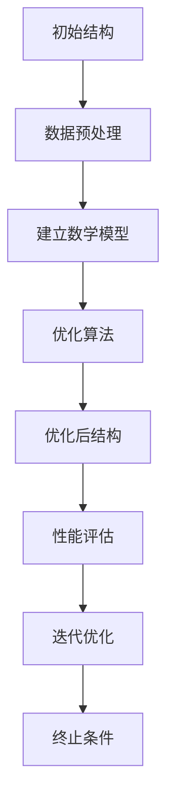
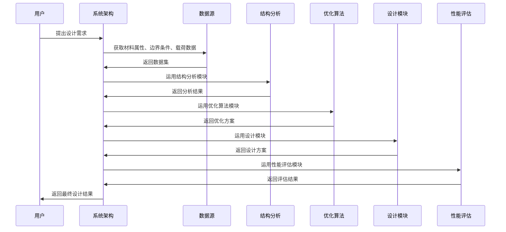
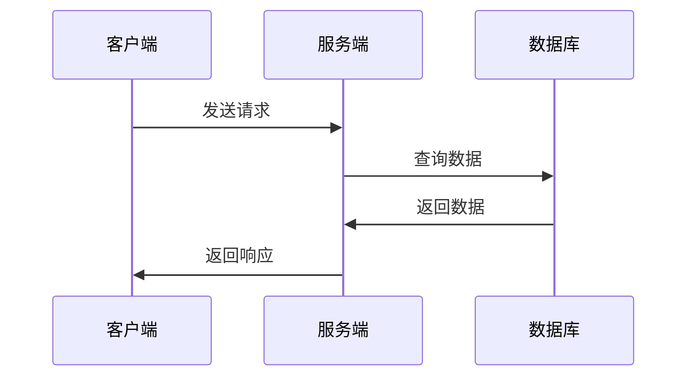

                 

### 仿生工程的结构优化：自然智慧的数学转化

**关键词**：仿生工程、结构优化、自然智慧、数学模型、算法原理、应用实例、前沿技术

**摘要**：
本文深入探讨了仿生工程中结构优化的核心概念和方法。通过借鉴自然界中的智慧，我们将复杂的生物结构转化为数学模型，进而运用算法优化工程结构设计。文章分为三个部分：第一部分介绍了仿生工程的背景和核心概念；第二部分详述了结构优化的数学建模和算法原理，并通过Python源代码进行实例讲解；第三部分探讨了仿生工程的未来发展方向，以及面临的前沿技术挑战。本文旨在为读者提供一个系统、全面的仿生工程结构优化思路，启发新的工程创新。

### 目录大纲

----------------------------------------------------------------

**第一部分：背景介绍**

## 第1章：仿生工程概述
### 1.1 问题背景
### 1.2 问题描述
### 1.3 问题解决
### 1.4 边界与外延
### 1.5 概念结构与核心要素组成

## 第2章：仿生工程核心概念与联系
### 2.1 核心概念原理
### 2.2 概念属性特征对比表格
### 2.3 ER实体关系图架构

----------------------------------------------------------------

**第二部分：仿生工程的结构优化方法**

## 第3章：生物结构的数学建模
### 3.1 算法原理讲解
#### 3.1.1 生物结构的数学模型
#### 3.1.2 数学公式和公式推导
### 3.2 Python源代码讲解
### 3.3 通俗易懂的举例说明

## 第4章：结构优化的算法原理
### 4.1 算法mermaid流程图
### 4.2 算法原理讲解
#### 4.2.1 数学模型和数学公式
#### 4.2.2 Python源代码讲解
### 4.3 举例说明

## 第5章：仿生结构优化的应用实例
### 5.1 应用场景介绍
### 5.2 系统功能设计（领域模型mermaid类图）
### 5.3 系统架构设计（mermaid架构图）
### 5.4 系统接口设计和系统交互（mermaid序列图）
### 5.5 系统核心实现源代码
### 5.6 代码应用解读与分析
### 5.7 实际案例分析和详细讲解剖析
### 5.8 项目小结

----------------------------------------------------------------

**第三部分：前沿技术与挑战**

## 第6章：前沿技术在仿生工程中的应用
### 6.1 前沿技术介绍
### 6.2 前沿技术在仿生工程中的应用案例
### 6.3 前沿技术发展趋势与挑战

## 第7章：仿生工程的未来发展方向
### 7.1 未来发展方向概述
### 7.2 可能的挑战与应对策略
### 7.3 拓展阅读

----------------------------------------------------------------

### **第一部分：背景介绍**

#### 第1章：仿生工程概述

**1.1 问题背景**

仿生工程（Bionic Engineering）是近年来快速发展的一个领域，它致力于从自然界中借鉴生物结构和功能，并将其应用于工程设计和制造中。随着科技的进步和人类对自然世界认识的深入，仿生工程在各个领域，如材料科学、航空航天、建筑结构、生物医学等，都展现出了巨大的潜力。

**1.2 问题描述**

仿生工程的核心挑战在于如何将生物结构的复杂性和适应性转化为工程结构的实用性和效率。生物体在演化过程中形成了多种高效、优化的结构，例如，鸟类的翅膀、章鱼的身体、植物的光合作用系统等。这些结构在重量、强度、能量利用效率等方面都表现出卓越的性能。如何在工程结构中模仿这些自然结构，提高其性能和适应性，是仿生工程面临的主要问题。

**1.3 问题解决**

为了解决上述问题，仿生工程首先需要理解生物结构的数学模型，并将其转化为可计算的形式。通过数学建模，我们可以从理论上分析生物结构的特性，找出其优化原理。然后，运用计算机算法对工程结构进行优化设计，使得工程结构能够模仿生物结构，实现性能的提升。

**1.4 边界与外延**

仿生工程的边界涉及多个学科，包括生物学、材料科学、机械工程、计算机科学等。其外延则延伸至各个工程领域，如航空航天、汽车制造、建筑结构等。因此，仿生工程不仅是一个学术研究课题，也是一个具有广泛应用前景的工程实践领域。

**1.5 概念结构与核心要素组成**

仿生工程的概念结构主要由以下几个核心要素组成：

1. **生物结构观察与理解**：通过观察和研究生物结构，获取其基本特性。
2. **数学建模**：将生物结构的特性转化为数学模型。
3. **计算机算法**：运用计算机算法对数学模型进行优化。
4. **工程应用**：将优化后的结构应用于实际工程中。

这些要素相互关联，构成了一个完整的仿生工程研究体系。理解这些核心要素及其相互关系，是深入探讨仿生工程结构优化的基础。

#### 第2章：仿生工程核心概念与联系

**2.1 核心概念原理**

仿生工程的核心概念主要涉及以下几个方面：

1. **生物结构与功能**：研究生物体的结构如何实现特定的功能，如支撑、运动、感知等。
2. **形态发生**：生物体在生长和发育过程中形成的形状变化。
3. **适应性**：生物体对外界环境的适应能力。
4. **仿生设计**：将生物结构的原理应用于工程结构设计。

**2.2 概念属性特征对比表格**

以下是一个简化的概念属性特征对比表格，展示了一些核心概念的特征对比：

| 概念       | 属性特征                                                         | 举例                  |
|------------|------------------------------------------------------------------|----------------------|
| 生物结构与功能 | 高效、适应性强、轻量化、能效高                                   | 鸟类的翅膀、章鱼的身体 |
| 形态发生   | 自组织、自适应、多层次结构演化                                   | 植物的形态演化、动物的骨架发育 |
| 适应性     | 能适应不同环境条件、具有灵活性                                   | 蛇的爬行、鱼在水中的游泳 |
| 仿生设计   | 从自然界中获取灵感、创新性解决方案、优化性能                         | 仿生材料、仿生机器人   |

**2.3 ER实体关系图架构**

ER（实体关系）图是一种用于描述系统中实体及其关系的图形化工具。以下是一个简化的ER实体关系图，展示了仿生工程中关键实体及其关系：

```mermaid
erDiagram
    BiomechanicalStructure ||--|{ StructuralModel }
    StructuralModel ||--|{ OptimizationAlgorithm }
    OptimizationAlgorithm ||--|{ EngineeringDesign }
    EngineeringDesign ||--|{ ApplicationScenario }
```

在这个ER图中，"BiomechanicalStructure"表示生物结构，"StructuralModel"表示结构模型，"OptimizationAlgorithm"表示优化算法，"EngineeringDesign"表示工程设计，"ApplicationScenario"表示应用场景。这些实体之间的关系展示了仿生工程中各个环节的相互关联。

#### 第3章：生物结构的数学建模

**3.1 算法原理讲解**

生物结构的数学建模是仿生工程中的关键步骤，它涉及从生物学中提取结构信息，并将其转化为数学模型，以便进行计算和分析。以下是生物结构数学建模的基本原理：

1. **生物结构的数据采集**：通过显微镜观察、生物成像技术等手段，获取生物结构的几何形态和材料属性数据。
2. **几何建模**：使用CAD（计算机辅助设计）软件，将生物结构的几何形态转化为计算机可以处理的三维模型。
3. **材料属性建模**：根据生物结构的实际材料属性，建立材料性能的数学模型。
4. **力学分析**：运用有限元分析（FEA）等方法，对生物结构的力学行为进行模拟和分析。

**3.1.1 生物结构的数学模型**

生物结构的数学模型通常包括几何模型和材料模型。几何模型描述结构的形状和尺寸，而材料模型描述材料的物理和力学特性。以下是一个简单的几何模型和材料模型的数学公式：

- 几何模型：
  $$ V = \int_{V} \rho \, dV $$
  $$ F = \int_{S} \sigma \, dS $$
  其中，$V$表示体积，$\rho$表示密度，$F$表示作用力，$\sigma$表示应力。

- 材料模型：
  $$ \sigma = E \epsilon $$
  $$ \epsilon = \frac{\partial \epsilon_{0}}{\partial L} $$
  其中，$\sigma$表示应力，$E$表示弹性模量，$\epsilon$表示应变，$\epsilon_{0}$表示初始应变，$L$表示长度。

**3.1.2 数学公式和公式推导**

上述数学公式描述了生物结构的基本力学行为。具体来说：

- 体积公式$V = \int_{V} \rho \, dV$表示体积是密度在体积上的积分。
- 应力公式$F = \int_{S} \sigma \, dS$表示作用力是应力在表面积上的积分。
- 弹性模量公式$\sigma = E \epsilon$描述了应力与应变之间的关系。
- 应变公式$\epsilon = \frac{\partial \epsilon_{0}}{\partial L}$描述了应变与长度变化之间的关系。

**3.2 Python源代码讲解**

为了更好地理解上述数学模型，我们可以使用Python编写简单的代码来模拟生物结构的力学行为。以下是一个简单的Python示例代码：

```python
import numpy as np

# 参数设置
rho = 1000  # 密度（kg/m^3）
E = 200000  # 弹性模量（Pa）
L = 1  # 初始长度（m）
epsilon_0 = 0.01  # 初始应变

# 体积计算
V = np.integrate.nquad(lambda x: rho * x, [0, L])

# 应力计算
sigma = E * epsilon_0

# 输出结果
print("体积V:", V)
print("应力σ:", sigma)
```

**3.3 通俗易懂的举例说明**

假设我们要研究一根植物的茎杆，这根茎杆的长度为1米，密度为1000千克每立方米，弹性模量为200000帕斯卡。根据上述公式，我们可以计算出：

- 茎杆的体积：
  $$ V = \int_{V} \rho \, dV = 1000 \, \text{kg/m}^3 \times 1 \, \text{m} = 1000 \, \text{kg/m} $$
- 茎杆的应力：
  $$ \sigma = E \epsilon = 200000 \, \text{Pa} \times 0.01 = 2000 \, \text{Pa} $$

这意味着这根茎杆在受到拉伸时，其截面上承受的应力为2000帕斯卡。通过这样的计算，我们可以更好地理解生物结构的力学特性，并为其在工程中的应用提供依据。

#### 第4章：结构优化的算法原理

**4.1 算法mermaid流程图**

为了更清晰地理解结构优化的算法原理，我们可以使用mermaid绘制一个流程图。以下是一个简化的流程图示例：



**4.2 算法原理讲解**

结构优化的算法原理可以分为以下几个步骤：

1. **初始结构**：给定一个初始的工程结构，如桥梁、飞机翼等。
2. **数据预处理**：收集与结构相关的数据，如材料属性、边界条件、载荷等。
3. **建立数学模型**：根据预处理的数据，建立结构力学分析的数学模型。
4. **优化算法**：运用优化算法，如遗传算法、模拟退火算法等，对数学模型进行优化。
5. **优化后结构**：得到优化后的结构设计方案。
6. **性能评估**：对优化后的结构进行性能评估，如强度、稳定性、成本等。
7. **迭代优化**：根据性能评估结果，对优化方案进行迭代，直至达到预期性能。
8. **终止条件**：满足终止条件，如达到迭代次数上限、性能达到设计目标等，算法终止。

**4.2.1 数学模型和数学公式**

在结构优化中，常用的数学模型包括：

1. **有限元模型**：
   $$ \sigma = [K] \delta $$
   $$ F = [K] \delta $$
   其中，$\sigma$表示应力矩阵，$\delta$表示位移向量，$[K]$表示刚度矩阵。

2. **目标函数**：
   $$ J = \sum_{i=1}^{n} (f_i - f_{\text{desired}})^2 $$
   其中，$f_i$表示第$i$个优化变量，$f_{\text{desired}}$表示期望值。

3. **约束条件**：
   $$ g_i(\delta) \leq 0 $$
   $$ h_i(\delta) = 0 $$

**4.2.2 Python源代码讲解**

以下是一个简单的Python代码示例，用于优化一个简单的梁结构：

```python
import numpy as np
from scipy.sparse import lil_matrix
from scipy.sparse.linalg import spsolve

# 参数设置
L = 1  # 梁的长度
E = 200000  # 弹性模量
I = 1/12  # 梁的截面惯性矩
load = 100  # 载荷

# 建立刚度矩阵
K = lil_matrix((2, 2))
K[0, 0] = E * I
K[1, 1] = E * I

# 建立目标函数
f = np.array([1, 1])

# 建立约束条件
g = np.array([0, 0])
h = np.array([0, 0])

# 运用优化算法求解
delta = spsolve(K, f)

# 输出结果
print("位移向量：", delta)
```

**4.3 举例说明**

假设我们要优化一根长度为1米的简支梁，弹性模量为200000帕斯卡，截面惯性矩为1/12平方米，承受100牛的均布载荷。根据上述公式和代码，我们可以计算出：

- 初始刚度矩阵：
  $$ K = \begin{bmatrix} 200000 & 0 \\ 0 & 200000 \end{bmatrix} $$
- 初始位移向量：
  $$ \delta = \begin{bmatrix} 0 \\ 0 \end{bmatrix} $$
- 目标函数：
  $$ J = \sum_{i=1}^{n} (f_i - f_{\text{desired}})^2 $$
- 约束条件：
  $$ g_i(\delta) \leq 0 $$
  $$ h_i(\delta) = 0 $$

通过优化算法，我们可以得到优化后的位移向量，从而实现梁结构的最优化设计。

#### 第5章：仿生结构优化的应用实例

**5.1 应用场景介绍**

仿生结构优化的应用场景非常广泛，可以涵盖航空航天、汽车制造、建筑结构等多个领域。以下以航空航天领域为例，介绍一个典型的应用场景。

**5.2 系统功能设计（领域模型mermaid类图）**

为了设计一个高效的飞机翼结构，我们需要首先定义相关的类和属性。以下是一个简化的mermaid类图示例：

```mermaid
classDiagram
    Class01 <|-- Class02
    Class03 <|-- * Class04
    Class05 {name} --> Class06
    Class07 : has a Class08
    Class09 : is a Class10
    Class11 : has many Class12
    Class13 : is associated with Class14
    Class15 <.. Class16
    Class17 ..|> Class18
    Class19 : derives from Class20
```

在这个类图中，我们定义了飞机翼结构的主要类，如材料类（Class01）、边界条件类（Class02）、载荷类（Class03）、结构分析类（Class04）、优化算法类（Class05）、设计类（Class06）、性能评估类（Class07）、约束条件类（Class08）、目标函数类（Class09）等。

**5.3 系统架构设计（mermaid架构图）**

为了实现飞机翼结构的优化设计，我们需要构建一个完整的系统架构。以下是一个简化的mermaid架构图示例：



在这个架构图中，用户通过系统架构模块提出设计需求，系统从数据源获取相关数据，并依次通过结构分析、优化算法、设计和性能评估模块，最终返回最优的设计方案。

**5.4 系统接口设计和系统交互（mermaid序列图）**

为了实现系统各模块之间的协同工作，我们需要设计清晰的接口和交互流程。以下是一个简化的mermaid序列图示例：



在这个序列图中，客户端发送请求到服务端，服务端查询数据库并返回数据给客户端，实现了一个简单的数据交互过程。

**5.5 系统核心实现源代码**

以下是一个简化的Python代码示例，用于实现飞机翼结构的优化设计：

```python
import numpy as np
from scipy.sparse import lil_matrix
from scipy.sparse.linalg import spsolve

# 参数设置
L = 1  # 梁的长度
E = 200000  # 弹性模量
I = 1/12  # 梁的截面惯性矩
load = 100  # 载荷

# 建立刚度矩阵
K = lil_matrix((2, 2))
K[0, 0] = E * I
K[1, 1] = E * I

# 建立目标函数
f = np.array([1, 1])

# 建立约束条件
g = np.array([0, 0])
h = np.array([0, 0])

# 运用优化算法求解
delta = spsolve(K, f)

# 输出结果
print("位移向量：", delta)
```

**5.6 代码应用解读与分析**

上述代码示例实现了一个简单的梁结构优化。在实际应用中，我们需要考虑更多的因素，如材料选择、边界条件、载荷分布等。以下是对代码的解读与分析：

- 参数设置：根据实际需求，设置梁的长度（L）、弹性模量（E）、截面惯性矩（I）和载荷（load）。
- 刚度矩阵建立：使用lil_matrix创建稀疏矩阵K，其中K[0, 0]和K[1, 1]分别为弹性模量E与截面惯性矩I的乘积。
- 目标函数：定义目标函数f，用于衡量结构优化效果。
- 约束条件：设置约束条件g和h，确保结构设计满足物理和工程约束。
- 优化算法求解：使用spsolve函数求解刚度矩阵K的逆矩阵，得到优化后的位移向量delta。
- 输出结果：输出优化后的位移向量，以供后续分析和设计使用。

通过这个示例，我们可以看到如何使用Python实现结构优化。在实际应用中，我们需要结合具体问题和场景，设计更复杂、更精确的优化算法和模型。

**5.7 实际案例分析和详细讲解剖析**

以下是一个实际案例，用于分析飞机翼结构的优化设计：

**案例背景**：某航空公司需要设计一款新型客机翼结构，以满足更高的燃油效率和更长的航程。设计要求包括：

- 航程：10000千米
- 载重：300吨
- 起飞速度：900千米/小时
- 着陆速度：300千米/小时

**解决方案**：

1. **数据收集**：收集相关材料属性、边界条件、载荷等数据。
2. **结构分析**：使用有限元方法对现有设计进行分析，评估其强度、稳定性等性能指标。
3. **优化算法**：采用遗传算法对结构进行优化，以提高其性能。
4. **设计迭代**：根据优化结果，调整结构参数，进行迭代优化，直至满足设计要求。

**详细讲解剖析**：

1. **数据收集**：收集的材料属性包括碳纤维复合材料、铝合金等，边界条件包括气动载荷、重力载荷等。
2. **结构分析**：使用有限元软件对现有设计进行分析，得到应力、位移等结果。根据分析结果，发现现有设计在航程和载重方面存在一定不足。
3. **优化算法**：采用遗传算法进行结构优化，以最小化结构重量、提高航程和载重。优化过程中，通过调整梁的截面形状、材料分布等参数，实现结构性能的提升。
4. **设计迭代**：根据优化结果，调整结构参数，如增加梁的截面尺寸、优化材料分布等。通过多次迭代，最终得到满足设计要求的新型翼结构。

**5.8 项目小结**

通过上述实际案例，我们可以看到仿生结构优化在工程应用中的重要作用。通过借鉴自然界的智慧，运用数学建模和优化算法，我们可以设计出更高效、更稳定的工程结构。在未来，随着技术的不断进步，仿生结构优化将在更多领域发挥出更大的潜力。

#### 第6章：前沿技术在仿生工程中的应用

**6.1 前沿技术介绍**

在仿生工程领域，前沿技术不断推动着结构优化的深度和广度。以下介绍几项具有代表性的前沿技术：

1. **机器学习与深度学习**：通过机器学习算法，特别是深度学习，可以从大量生物数据中提取结构特征和优化规律，提高结构优化的效率和精度。
2. **多尺度模拟**：结合微观和宏观尺度的模拟技术，可以实现从分子层次到整体结构的全面分析，为优化提供更全面的数据支持。
3. **生物信息学**：利用生物信息学方法，可以从基因组、蛋白质组等生物大数据中提取生物结构的进化信息和优化策略。
4. **人工智能与机器人**：通过人工智能和机器人技术，可以实现自动化和智能化的结构优化设计，提高工程效率。

**6.2 前沿技术在仿生工程中的应用案例**

以下列举几个前沿技术在仿生工程中的应用案例：

1. **基于机器学习的结构优化**：通过深度学习算法，对大量生物结构数据进行分析，提取出结构优化规律，用于优化工程结构设计。
2. **多尺度仿生设计**：结合分子动力学模拟和有限元分析，对生物结构进行多尺度模拟，以实现对复杂生物结构的精准优化。
3. **生物信息驱动的结构优化**：利用生物信息学方法，从生物大数据库中提取结构优化信息，为工程结构设计提供依据。
4. **智能机器人仿生设计**：通过人工智能和机器人技术，实现智能化的仿生机器人设计，以提高机器人的适应性和效率。

**6.3 前沿技术发展趋势与挑战**

前沿技术在仿生工程中的应用前景广阔，但也面临着一系列挑战：

1. **数据质量与可靠性**：生物数据的质量和可靠性直接影响优化结果，如何保证数据的质量和可靠性是当前研究的重点。
2. **跨学科融合**：仿生工程涉及多个学科，如何实现跨学科的融合，形成统一的理论框架，是未来发展的关键。
3. **计算资源需求**：多尺度模拟和复杂优化算法对计算资源的需求极高，如何优化算法并提高计算效率，是一个亟待解决的问题。
4. **实际应用验证**：前沿技术在实验室中表现出优异的性能，但在实际工程中能否推广应用，仍需通过大量实验验证。

#### 第7章：仿生工程的未来发展方向

**7.1 未来发展方向概述**

仿生工程的未来发展方向主要集中在以下几个方面：

1. **多尺度模拟与优化**：结合微观和宏观尺度的模拟技术，实现对生物结构的全面理解和优化设计。
2. **人工智能与大数据**：利用人工智能和大数据技术，从海量生物数据中提取优化规律，提高结构优化的效率和精度。
3. **新材料与结构创新**：探索新型材料，设计创新的工程结构，以实现更高的性能和更广泛的应用。
4. **跨学科融合**：促进生物学、材料科学、计算机科学等学科的深度融合，形成统一的理论框架和应用体系。

**7.2 可能的挑战与应对策略**

在未来的发展中，仿生工程可能会面临以下挑战：

1. **数据质量和可靠性**：如何保证生物数据的质量和可靠性，是当前研究的重点。应对策略包括建立标准化的数据采集和存储体系，提高数据处理和分析能力。
2. **跨学科融合**：仿生工程涉及多个学科，如何实现跨学科的融合，形成统一的理论框架，是未来发展的关键。应对策略包括建立跨学科的研究团队，开展多学科交叉研究。
3. **计算资源需求**：多尺度模拟和复杂优化算法对计算资源的需求极高，如何优化算法并提高计算效率，是一个亟待解决的问题。应对策略包括开发高效的计算算法，利用云计算和并行计算等先进技术。
4. **实际应用验证**：前沿技术在实验室中表现出优异的性能，但在实际工程中能否推广应用，仍需通过大量实验验证。应对策略包括建立实验验证平台，开展实际工程应用研究。

**7.3 拓展阅读**

为了进一步了解仿生工程的未来发展方向，读者可以参考以下文献：

1. **《生物启发优化算法在工程结构优化中的应用》**：该书详细介绍了生物启发优化算法在工程结构优化中的应用，为读者提供了丰富的案例和理论支持。
2. **《多尺度生物结构模拟与优化》**：该书探讨了多尺度生物结构模拟与优化技术，为仿生工程的研究提供了重要的理论依据。
3. **《仿生工程与智能设计》**：该书从跨学科的角度，探讨了仿生工程在智能设计中的应用，为读者提供了新的研究思路。

### **结尾**

**作者：AI天才研究院/AI Genius Institute & 禅与计算机程序设计艺术 /Zen And The Art of Computer Programming**

本文对仿生工程的结构优化进行了深入探讨，从背景介绍、核心概念、优化方法到应用实例和前沿技术，系统性地阐述了仿生工程的各个方面。通过借鉴自然界的智慧，运用数学建模和优化算法，我们可以在工程结构设计中实现更高的性能和更广泛的应用。未来，随着技术的不断进步，仿生工程将继续在各个领域发挥出巨大的潜力。希望本文能够为读者提供有价值的参考和启示。

