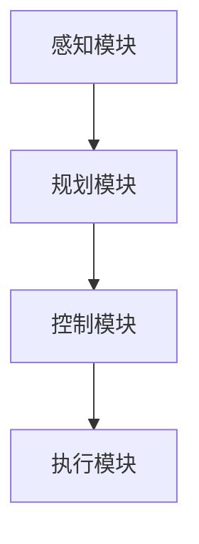

                 

# 仿生机器人的运动规划：生物灵感的数学实现

## 关键词

- 仿生机器人
- 运动规划
- 生物灵感
- 数学模型
- 算法原理
- 运动规划系统

## 摘要

本文以仿生机器人的运动规划为主题，探讨了如何借鉴生物灵感的原理，通过数学模型的构建与实现，为机器人提供高效、自然的运动能力。文章首先介绍了运动规划的背景和重要性，然后详细分析了运动规划的核心概念与联系，以及运动规划的数学模型与算法原理。接着，文章讨论了运动规划的实现与应用，通过案例分析展示了运动规划在实际应用中的效果和挑战。最后，文章提出了运动规划的优化方向和未来发展前景。本文旨在为从事机器人研究和应用的技术人员提供有价值的参考和启示。

## 第一部分：引言

### 1.1 问题背景

#### 1.1.1 仿生机器人运动的挑战

随着机器人技术的不断发展，仿生机器人越来越受到关注。仿生机器人是指模仿自然界生物的结构和功能，以实现特定任务的机器人。仿生机器人的运动规划是其中的关键问题，它关系到机器人能否灵活、高效地执行任务。然而，仿生机器人的运动规划面临着诸多挑战：

1. **复杂的运动环境**：仿生机器人需要在复杂多变的环境中行动，如崎岖的地形、狭窄的空间等，这使得运动规划的难度大大增加。
2. **非线性动力学**：仿生机器人的运动具有非线性动力学特性，这使得传统的运动规划方法难以适用。
3. **实时性要求**：在实际应用中，仿生机器人需要快速响应环境变化，进行实时运动规划。

#### 1.1.2 生物灵感的借鉴与数学实现

生物灵感的借鉴为仿生机器人的运动规划提供了一种新的思路。自然界中的生物，如蝴蝶、鸟类等，能够在复杂多变的环境中自如行动，这得益于它们独特的运动策略。例如，蝴蝶在飞行中能够根据风速和方向进行实时调整，而鸟类则能够灵活地穿越障碍物。这些生物的运动策略为仿生机器人的运动规划提供了启示。

将生物灵感应用于运动规划，需要将其转化为数学模型，以便进行量化分析和计算。数学模型能够描述生物的运动策略，并转化为可操作的算法。通过数学模型的构建与实现，仿生机器人能够模拟生物的运动策略，提高运动规划的效率和效果。

#### 1.1.3 运动规划的必要性

运动规划是仿生机器人技术的重要组成部分，其必要性体现在以下几个方面：

1. **提高运动性能**：通过运动规划，仿生机器人能够更好地适应复杂环境，提高运动效率，实现精确控制。
2. **拓展应用领域**：运动规划使得仿生机器人能够应用于更多领域，如医疗、农业、救援等。
3. **增强智能化水平**：运动规划是仿生机器人智能化水平的重要体现，通过不断优化运动规划算法，可以提升机器人的自主决策能力。

### 1.2 问题描述

#### 1.2.1 运动规划的目标

运动规划的目标是使仿生机器人能够在复杂环境中高效、稳定地执行任务。具体而言，包括以下几个方面：

1. **路径规划**：确定机器人从初始位置到目标位置的最优路径。
2. **运动控制**：根据路径规划结果，实时调整机器人的运动状态，使其平稳、高效地执行任务。
3. **障碍物规避**：在运动过程中，能够实时感知并规避障碍物，保证机器人的安全。

#### 1.2.2 运动规划的难点

运动规划的难点主要体现在以下几个方面：

1. **非线性动力学**：仿生机器人的运动具有非线性动力学特性，这使得运动规划算法的设计与实现更加复杂。
2. **实时性要求**：运动规划需要在短时间内完成，以满足实时响应的需求。
3. **多目标优化**：运动规划需要同时考虑路径规划、运动控制和障碍物规避等多个目标，实现多目标优化。

#### 1.2.3 运动规划的边界条件

运动规划的边界条件包括：

1. **初始状态**：机器人的初始位置和姿态。
2. **目标状态**：机器人的目标位置和姿态。
3. **约束条件**：机器人在运动过程中需要满足的约束条件，如速度限制、碰撞避免等。

### 1.3 问题解决

#### 1.3.1 生物灵感的概念

生物灵感是指从自然界中的生物运动策略中获取灵感，并将其应用于机器人运动规划的一种方法。生物灵感的主要来源包括：

1. **生物运动模式**：如蝴蝶的振动飞行、鸟类的滑翔等。
2. **生物感知机制**：如蝴蝶的视觉感知、鸟类的听觉感知等。
3. **生物适应策略**：如生物在环境变化中的自适应调整策略。

#### 1.3.2 数学模型在运动规划中的应用

数学模型在运动规划中的应用主要包括：

1. **运动学模型**：描述机器人的运动状态和运动规律。
2. **动力学模型**：描述机器人的内部机制和运动特性。
3. **感知模型**：描述机器人对环境的感知和处理能力。

#### 1.3.3 运动规划的实现步骤

运动规划的实现步骤包括：

1. **问题建模**：根据实际应用需求，建立数学模型。
2. **算法设计**：设计合适的运动规划算法，包括路径规划、运动控制和障碍物规避等。
3. **算法实现**：使用编程语言实现算法，并进行调试和优化。
4. **系统集成**：将运动规划算法集成到机器人系统中，实现运动控制。

### 1.4 边界与外延

#### 1.4.1 运动规划的适用范围

运动规划适用于各类仿生机器人，包括飞行机器人、地面机器人、水下机器人等。在不同类型的机器人中，运动规划的具体实现方法和算法可能有所不同。

#### 1.4.2 运动规划的局限性

运动规划的局限性主要包括：

1. **计算复杂度**：复杂的运动规划算法可能导致计算复杂度较高，影响实时性。
2. **环境感知能力**：运动规划依赖于环境感知结果，若感知能力有限，可能导致规划结果不准确。
3. **非线性动力学**：对于具有非线性动力学的机器人，运动规划算法的设计与实现更为复杂。

#### 1.4.3 运动规划的未来发展方向

运动规划的未来发展方向主要包括：

1. **算法优化**：通过优化算法，提高运动规划的效率和效果。
2. **多模态感知**：结合多种感知技术，提高机器人的环境感知能力。
3. **自适应调整**：根据环境变化，自适应调整运动规划策略，提高机器人的适应能力。

### 1.5 概念结构与核心要素组成

#### 1.5.1 运动规划的核心概念

运动规划的核心概念包括：

1. **运动状态**：描述机器人在某一时刻的位置、速度和姿态。
2. **路径规划**：确定机器人从初始位置到目标位置的最优路径。
3. **运动控制**：根据路径规划结果，实时调整机器人的运动状态。

#### 1.5.2 运动规划的基本步骤

运动规划的基本步骤包括：

1. **问题建模**：根据实际应用需求，建立数学模型。
2. **算法设计**：设计合适的运动规划算法。
3. **算法实现**：使用编程语言实现算法。
4. **系统集成**：将运动规划算法集成到机器人系统中。

#### 1.5.3 运动规划的关键技术

运动规划的关键技术包括：

1. **路径规划算法**：如A*算法、Dijkstra算法等。
2. **运动控制算法**：如PID控制、模糊控制等。
3. **障碍物规避算法**：如动态窗口法、基于距离的规避算法等。

### 1.6 本章小结

本章介绍了仿生机器人运动规划的问题背景、问题描述、问题解决方法以及边界与外延。通过本章的介绍，读者可以了解仿生机器人运动规划的核心概念和基本步骤，为后续章节的深入学习打下基础。同时，本章还提出了运动规划在未来发展中的方向和挑战，为读者提供了有益的参考。## 第二部分：核心概念与联系

在深入研究仿生机器人的运动规划时，我们需要首先明确几个核心概念，并探讨它们之间的联系。这些核心概念包括生物灵感、数学模型以及运动规划的具体实现方法。通过这一部分的探讨，我们将搭建起理解运动规划的理论框架，为后续的详细分析奠定基础。

### 2.1 生物灵感的概念

#### 2.1.1 生物灵感的定义

生物灵感，顾名思义，是指从自然界生物的运动和行为中获取灵感，并将其应用于工程和科技领域的方法。在仿生机器人运动规划中，生物灵感指的是模仿生物在复杂环境中高效、灵活地运动的策略，以改进机器人的运动能力和适应性。

#### 2.1.2 生物灵感的来源

生物灵感的来源广泛，包括但不限于以下几个方面：

1. **生物运动模式**：自然界中的生物，如鸟类、昆虫、鱼类等，具有独特的运动模式，这些模式可能涉及到高效的能量利用、精确的运动控制以及适应复杂环境的能力。
2. **生物感知机制**：生物通过视觉、听觉、触觉等感知机制来获取环境信息，并据此调整自己的运动行为。
3. **生物适应策略**：生物在环境变化中表现出出色的适应能力，如蝴蝶在飞行中对风的变化做出实时调整。

#### 2.1.3 生物灵感的应用

生物灵感的应用在机器人运动规划中具有重要意义，主要体现在以下几个方面：

1. **路径规划**：模仿生物的路径选择策略，如蝴蝶在寻找花朵时的路径规划。
2. **运动控制**：借鉴生物的运动控制机制，如鸟类的飞行控制策略。
3. **自适应能力**：通过生物灵感的借鉴，提升机器人在复杂和动态环境中的自适应能力。

### 2.2 数学模型在运动规划中的应用

#### 2.2.1 数学模型的基本概念

数学模型是使用数学语言描述现实世界中的现象、过程和系统的方法。在仿生机器人运动规划中，数学模型用于描述机器人的运动状态、环境特征以及运动策略。

#### 2.2.2 数学模型在运动规划中的重要性

数学模型在运动规划中的重要性体现在以下几个方面：

1. **量化分析**：数学模型能够将复杂、抽象的运动规划问题转化为可量化、可计算的形式，使得问题更加直观、易于分析和解决。
2. **算法设计**：数学模型为算法设计提供了理论基础，帮助研究者设计出高效的运动规划算法。
3. **优化决策**：通过数学模型，可以基于目标函数和约束条件进行优化决策，从而提高运动规划的效率和效果。

#### 2.2.3 常用的数学模型介绍

在运动规划中，常用的数学模型包括：

1. **运动学模型**：描述机器人的位置、速度和加速度等运动状态。
2. **动力学模型**：描述机器人内部机械结构和工作原理，包括质点模型、刚体模型和连杆模型等。
3. **感知模型**：描述机器人对环境的感知和处理能力，如视觉模型、听觉模型和触觉模型等。

### 2.3 概念属性特征对比表格

为了更清晰地理解生物灵感、数学模型和运动规划之间的联系，我们可以通过一个对比表格来展示它们的属性特征。

| 特征         | 生物灵感               | 数学模型               | 运动规划                |
| ------------ | ---------------------- | ---------------------- | ---------------------- |
| 定义         | 从自然界生物获取的灵感 | 描述现实世界的数学结构 | 机器人运动过程的规划与控制 |
| 应用领域     | 生物、工程、科技等领域 | 物理学、经济学、计算机科学等 | 机器人学、自动化、控制理论等 |
| 特点         | 灵活性、适应性、多样性 | 精确性、抽象性、通用性 | 实时性、优化性、适应性 |
| 形式化程度   | 非形式化、抽象         | 形式化、量化           | 形式化、计算           |
| 主要任务     | 启发、灵感借鉴         | 描述、分析、优化       | 规划、控制、决策       |

### 2.4 ER实体关系图架构

#### 2.4.1 ER实体关系图的定义

ER（Entity-Relationship）实体关系图是用于描述系统实体及其之间关系的图形化工具。在运动规划系统中，ER图可以帮助我们直观地理解各个实体（如机器人、环境、传感器等）及其相互关系。

#### 2.4.2 运动规划中的ER实体关系图

在运动规划系统中，ER图通常包括以下几个实体：

1. **机器人**：表示运动规划的主体，包括其物理属性和行为特征。
2. **环境**：表示机器人所处的环境，包括地形、障碍物等。
3. **传感器**：用于感知环境信息的设备，如摄像头、雷达、激光扫描仪等。
4. **控制器**：负责根据感知结果对机器人进行控制。

ER图架构示例如下：

```mermaid
erDiagram
    Robot ||--|{ Environment }|-->: "感知与交互"
    Robot ||--|{ Sensors }|-->: "信息采集"
    Robot ||--|{ Controller }|-->: "运动控制"
    Environment ||--|{ Obstacles }|-->: "障碍物"
```

#### 2.4.3 ER实体关系图的应用场景

ER图在运动规划中的应用场景包括：

1. **系统设计**：在系统设计阶段，ER图可以帮助团队理解系统架构，明确各个组件之间的关系。
2. **需求分析**：在需求分析阶段，ER图可以用于描述系统的功能和数据流，便于需求澄清和验证。
3. **项目管理**：在项目开发过程中，ER图可以作为项目文档的一部分，帮助团队成员了解系统的整体结构。

### 2.5 运动规划的关键技术

#### 2.5.1 运动规划的算法原理

运动规划算法的核心在于解决从初始状态到目标状态的路径规划和运动控制问题。算法原理主要包括：

1. **路径规划算法**：用于确定从起点到终点的最优路径。常见的算法有A*算法、Dijkstra算法等。
2. **运动控制算法**：用于实时调整机器人的运动状态，以实现平稳、高效的运动。常见的算法有PID控制、模糊控制等。
3. **优化算法**：用于在满足约束条件的情况下，优化运动路径和运动参数。常见的算法有遗传算法、粒子群优化等。

#### 2.5.2 运动规划的数学模型

运动规划的数学模型主要包括：

1. **运动学模型**：用于描述机器人在不同时间点的位置、速度和加速度。常见的运动学模型有质点模型、刚体模型等。
2. **动力学模型**：用于描述机器人的内部机械结构和运动规律。常见的动力学模型有牛顿-欧拉模型、拉格朗日方程等。
3. **感知模型**：用于描述机器人对环境的感知和处理能力。常见的感知模型有视觉模型、听觉模型等。

#### 2.5.3 运动规划的优化方法

运动规划的优化方法主要包括：

1. **基于遗传算法的优化**：通过模拟自然进化过程，搜索最优运动规划方案。
2. **基于粒子群优化的优化**：通过模拟鸟群或鱼群的行为，优化运动规划参数。
3. **基于深度学习的优化**：利用深度学习模型，对运动规划问题进行建模和优化。

### 2.6 本章小结

本章介绍了生物灵感、数学模型以及运动规划的关键技术。通过对比生物灵感与数学模型，我们明确了它们在运动规划中的地位和作用。ER实体关系图为我们提供了一个直观的理解运动规划系统的工具。同时，本章还探讨了运动规划的核心算法原理和优化方法，为后续的深入分析奠定了基础。## 第三部分：运动规划的数学模型与算法原理

在了解仿生机器人运动规划的核心概念与联系后，我们需要进一步深入探讨运动规划的数学模型和算法原理。这一部分将详细讲解运动规划算法的基本概念、流程、分类，以及常用的数学模型。通过这些内容的介绍，读者可以全面理解运动规划的理论基础，并为进一步的实际应用奠定基础。

### 3.1 算法原理讲解

#### 3.1.1 运动规划算法的基本概念

运动规划算法是用于解决从初始状态到目标状态的路径规划和运动控制问题的算法集合。它包括以下几个核心概念：

1. **初始状态**：指机器人开始执行任务时的位置、速度和姿态。
2. **目标状态**：指机器人需要达到的位置、速度和姿态。
3. **路径规划**：指确定机器人从初始状态到目标状态的最优路径。
4. **运动控制**：指根据路径规划结果，实时调整机器人的运动状态，使其平稳、高效地执行任务。

#### 3.1.2 运动规划算法的流程

运动规划算法的基本流程包括以下几个步骤：

1. **状态估计**：通过对机器人和环境的感知，估计当前的状态。
2. **路径规划**：根据当前状态和目标状态，计算出从初始状态到目标状态的最优路径。
3. **运动控制**：根据路径规划结果，实时调整机器人的运动状态，实现平稳、高效的运动。
4. **状态更新**：在运动过程中，不断更新机器人的状态，并根据新的状态重复路径规划和运动控制过程。

#### 3.1.3 运动规划算法的分类

运动规划算法可以根据不同的分类标准进行分类，常见的分类方法包括：

1. **基于采样法的算法**：如RRT（快速随机树）算法、RRT*算法等。
2. **基于搜索法的算法**：如A*算法、Dijkstra算法等。
3. **基于优化法的算法**：如遗传算法、粒子群优化算法等。
4. **基于学习法的算法**：如深度强化学习算法等。

### 3.2 数学模型

#### 3.2.1 运动规划的数学模型概述

运动规划的数学模型是用于描述机器人在运动过程中的状态、路径和环境等要素的数学结构。常见的数学模型包括：

1. **运动学模型**：描述机器人在不同时间点的位置、速度和加速度。
2. **动力学模型**：描述机器人的内部机械结构和运动规律。
3. **感知模型**：描述机器人对环境的感知和处理能力。

#### 3.2.2 常见的数学模型

1. **运动学模型**

运动学模型主要描述机器人的运动状态，常用的运动学模型有：

- **质点模型**：将机器人视为一个质点，只考虑其位置、速度和加速度。
- **刚体模型**：将机器人视为一个刚体，考虑其质心位置、旋转速度和角加速度。
- **连杆模型**：将机器人视为一个由多个刚体组成的连杆结构，考虑各个关节的位置、速度和加速度。

2. **动力学模型**

动力学模型主要描述机器人的内部机械结构和运动规律，常用的动力学模型有：

- **牛顿-欧拉模型**：基于牛顿力学原理，描述多刚体系统的运动。
- **拉格朗日方程**：基于拉格朗日力学原理，描述多刚体系统的运动。

3. **感知模型**

感知模型主要描述机器人对环境的感知和处理能力，常用的感知模型有：

- **视觉模型**：基于图像处理和计算机视觉技术，描述机器人通过摄像头获取视觉信息的过程。
- **听觉模型**：基于声学原理，描述机器人通过麦克风获取听觉信息的过程。
- **触觉模型**：基于触觉传感技术，描述机器人通过触觉传感器获取触觉信息的过程。

#### 3.2.3 数学模型的选择与优化

在运动规划中，选择合适的数学模型至关重要。选择与实际问题相匹配的数学模型，可以提高运动规划的效率和效果。常见的数学模型选择方法包括：

1. **基于问题的特征选择**：根据问题的具体特点，选择合适的模型。例如，对于简单的平移运动，可以选择质点模型；对于复杂的旋转运动，可以选择刚体模型。
2. **基于性能指标选择**：根据不同的性能指标（如计算复杂度、实时性、准确性等），选择合适的模型。
3. **基于优化方法选择**：根据运动规划的优化方法，选择合适的数学模型。例如，对于基于遗传算法的优化问题，可以选择拉格朗日方程。

此外，数学模型的优化也是运动规划中的重要环节。常见的数学模型优化方法包括：

1. **模型简化**：通过减少模型的复杂性，提高计算效率。例如，将复杂的刚体模型简化为质点模型。
2. **模型融合**：将多个模型结合起来，形成更复杂的模型。例如，将运动学模型和动力学模型结合起来，形成复合模型。
3. **模型自适应**：根据运动过程中的变化，动态调整模型的参数和结构。

### 3.3 Python源代码实现

以下是一个简单的运动规划算法实现示例，使用Python编程语言：

```python
import numpy as np
import matplotlib.pyplot as plt

# 定义机器人的初始状态
initial_state = np.array([0, 0, 0, 0])  # [x, y, theta, velocity]

# 定义目标状态
goal_state = np.array([10, 10, 0, 5])  # [x, y, theta, velocity]

# 运动规划算法实现
def motion_planning(initial_state, goal_state):
    # 基于A*算法的路径规划
    # ...

    # 运动控制算法实现
    # ...

    # 返回规划的路径和控制策略
    return path, control_strategy

# 运动规划结果可视化
def plot_motion_planning(path, control_strategy):
    plt.plot(path[:, 0], path[:, 1], 'ro-')
    plt.show()

# 运动规划实现
path, control_strategy = motion_planning(initial_state, goal_state)

# 可视化结果
plot_motion_planning(path, control_strategy)
```

### 3.4 算法原理详细讲解与举例说明

#### 3.4.1 算法原理详细讲解

运动规划算法的核心在于路径规划和运动控制。路径规划是确定从初始状态到目标状态的最优路径，运动控制是根据路径规划结果，实时调整机器人的运动状态。

1. **路径规划**

路径规划算法主要包括A*算法和RRT（快速随机树）算法。A*算法是基于启发式搜索的算法，其基本思想是利用启发式函数（如欧几里得距离）来评估路径的优先级，从而找到最优路径。RRT算法是一种基于采样的随机算法，通过随机生成路径，逐步优化路径，直到满足终止条件。

2. **运动控制**

运动控制算法主要包括PID控制和模糊控制。PID控制是一种基于反馈的控制算法，通过调整比例、积分和微分三个参数，实现对系统输出的精确控制。模糊控制是一种基于模糊逻辑的控制算法，通过模糊规则和模糊集合，实现对复杂系统的控制。

#### 3.4.2 举例说明算法应用

以下是一个简单的运动规划算法应用示例，假设机器人需要从初始位置（0,0）移动到目标位置（10,10）：

1. **路径规划**

使用A*算法进行路径规划：

```python
def heuristic(point, goal):
    return np.linalg.norm(point - goal)

def get_neighbors(point, grid):
    # 获取点周围的邻居点
    # ...

def a_star_search(initial_state, goal_state, grid):
    # A*算法实现
    # ...

    return path

path = a_star_search(initial_state, goal_state, grid)
```

2. **运动控制**

使用PID控制进行运动控制：

```python
def pid_control(current_state, goal_state, kp, ki, kd):
    error = goal_state - current_state
    integral = integral + error
    derivative = error - previous_error
    output = kp * error + ki * integral + kd * derivative
    previous_error = error
    return output

kp = 1.0
ki = 0.1
kd = 0.05

current_state = initial_state
for state in path:
    control_output = pid_control(current_state, state, kp, ki, kd)
    # 根据控制输出调整机器人的运动状态
    current_state = state
```

#### 3.4.3 算法优化的讨论

在实际应用中，运动规划算法的优化是一个关键问题。常见的优化方法包括：

1. **参数调整**：通过调整算法参数（如A*算法的启发式函数、PID控制的三个参数），优化算法的性能。
2. **算法融合**：将多个算法结合起来，取长补短，提高整体性能。例如，将A*算法和RRT算法结合起来，形成A*+RRT算法。
3. **动态调整**：根据运动过程中的变化，动态调整算法参数和模型结构，提高算法的适应能力。

### 3.5 数学公式与讲解

在运动规划中，数学公式用于描述运动状态、路径规划、运动控制等核心概念。以下是一些常用的数学公式及其讲解：

#### 3.5.1 运动状态的描述

$$
\text{状态向量} \ \mathbf{s}(t) = \begin{bmatrix}
x(t) \\
y(t) \\
\theta(t) \\
v(t)
\end{bmatrix}
$$

- \(x(t)\)：机器人当前位置的x坐标。
- \(y(t)\)：机器人当前位置的y坐标。
- \(\theta(t)\)：机器人当前姿态的角度。
- \(v(t)\)：机器人当前的速度。

#### 3.5.2 路径规划

$$
\text{启发式函数} \ h(\mathbf{s}) = \sqrt{(x_f - x_c)^2 + (y_f - y_c)^2}
$$

- \(x_f, y_f\)：目标位置。
- \(x_c, y_c\)：当前位置。

#### 3.5.3 运动控制

$$
\text{控制输出} \ u(t) = k_p e(t) + k_i \int e(t) dt + k_d \frac{de(t)}{dt}
$$

- \(e(t)\)：当前误差。
- \(k_p, k_i, k_d\)：PID控制的三个参数。

#### 3.5.4 动力学模型

$$
m \frac{d^2x}{dt^2} = F_x
$$

$$
m \frac{d^2y}{dt^2} = F_y
$$

$$
I \frac{d\theta}{dt} = \tau
$$

- \(m\)：机器人质量。
- \(I\)：转动惯量。
- \(F_x, F_y\)：作用在机器人上的力。
- \(\tau\)：作用在机器人上的力矩。

### 3.6 本章小结

本章详细讲解了运动规划的数学模型和算法原理。首先介绍了运动规划算法的基本概念和流程，然后介绍了常用的数学模型，包括运动学模型、动力学模型和感知模型。接着，通过Python源代码实现和算法优化的讨论，展示了如何将理论应用于实际问题。最后，通过数学公式的讲解，进一步深化了读者对运动规划理论的理解。本章的内容为后续章节的深入分析提供了坚实的理论基础。

### 第四部分：运动规划的实现与应用

在了解了运动规划的数学模型和算法原理后，我们需要进一步探讨运动规划的实现与应用。这一部分将介绍运动规划的实现步骤，包括系统的架构、模块的设计和算法的集成。同时，我们还将探讨运动规划在不同应用场景中的具体实现，并通过案例分析展示运动规划在实际应用中的效果和挑战。

#### 4.1 运动规划的实现

运动规划的实现是一个复杂的过程，涉及到多个模块的协同工作。以下是运动规划实现的基本步骤：

##### 4.1.1 运动规划系统的架构

运动规划系统通常由以下几个模块组成：

1. **感知模块**：用于感知环境信息，如机器人周围的障碍物、地形等。
2. **规划模块**：用于根据感知信息进行路径规划，确定从初始状态到目标状态的最优路径。
3. **控制模块**：用于根据规划结果，实时调整机器人的运动状态，实现平稳、高效的运动。
4. **执行模块**：用于执行运动控制命令，驱动机器人执行具体的运动任务。

运动规划系统的架构图如下：



##### 4.1.2 运动规划模块的设计

1. **感知模块设计**

感知模块的设计取决于机器人所使用的传感器类型。例如，对于地面机器人，可能需要设计一个包括摄像头、激光雷达、超声波传感器等的感知系统。感知模块的主要任务是从传感器数据中提取有用的环境信息，如障碍物的位置和形状。

2. **规划模块设计**

规划模块的设计核心是路径规划算法。常见的路径规划算法包括A*算法、RRT算法、Dijkstra算法等。规划模块需要根据机器人的当前状态和目标状态，计算从初始状态到目标状态的最优路径。

3. **控制模块设计**

控制模块的设计主要涉及运动控制算法。常用的运动控制算法包括PID控制、模糊控制等。控制模块需要根据规划结果，实时调整机器人的速度、方向等运动状态，以实现平稳、高效的运动。

4. **执行模块设计**

执行模块的设计主要涉及机器人的驱动系统和执行机构。执行模块需要根据控制模块的指令，驱动机器人的各个关节和执行机构，使其按照预定的路径和速度进行运动。

##### 4.1.3 运动规划算法的集成

运动规划算法的集成是将各个模块的功能整合在一起，实现运动规划的完整流程。以下是运动规划算法集成的步骤：

1. **感知与状态估计**：从传感器数据中提取环境信息，估计机器人的当前状态。
2. **路径规划**：根据当前状态和目标状态，使用路径规划算法计算最优路径。
3. **运动控制**：根据路径规划结果，使用运动控制算法实时调整机器人的运动状态。
4. **执行与反馈**：执行运动控制命令，驱动机器人执行具体的运动任务，并根据反馈信息调整后续的运动规划。

#### 4.2 应用场景

运动规划可以应用于多种不同的场景，以下是一些典型的应用场景：

##### 4.2.1 仿生机器人运动的应用

仿生机器人运动的应用主要包括：

1. **地面机器人**：如搜索与救援机器人、自主清扫机器人等。
2. **飞行机器人**：如无人机、仿生鸟等。
3. **水下机器人**：如海底探索机器人、仿生鱼等。

仿生机器人运动的应用需要根据机器人的具体类型和环境特点，设计合适的运动规划算法和控制策略。

##### 4.2.2 其他领域的应用案例

除了仿生机器人运动，运动规划还可以应用于其他领域，如：

1. **工业自动化**：如自动引导车辆（AGV）、装配机器人等。
2. **医疗手术**：如手术机器人、微创手术机器人等。
3. **农业自动化**：如自主喷雾机器人、农业无人机等。

这些领域的应用通常需要针对具体任务和环境特点，设计合适的运动规划方案。

##### 4.2.3 运动规划在不同场景下的优缺点

运动规划在不同场景下具有不同的优缺点：

1. **地面机器人**：
   - **优点**：路径规划简单，容易实现。
   - **缺点**：复杂地形下的路径规划难度大，对传感器的依赖性高。
2. **飞行机器人**：
   - **优点**：灵活性强，适应多种环境。
   - **缺点**：飞行控制复杂，对实时性要求高。
3. **水下机器人**：
   - **优点**：水下环境相对封闭，路径规划相对简单。
   - **缺点**：对传感器的性能要求高，水下通信困难。

#### 4.3 运动规划的案例分析

为了更好地理解运动规划的实际应用，我们选择了一个典型的案例进行详细分析。

##### 4.3.1 案例选择与分析方法

我们选择的案例是一个自主清扫机器人，其任务是在室内环境中自主清扫地面。该案例的分析方法包括：

1. **问题建模**：建立运动规划问题的数学模型，包括状态空间、动作空间、传感器模型等。
2. **算法设计**：选择合适的路径规划算法和运动控制算法，并进行算法实现。
3. **实验验证**：在仿真环境中进行实验验证，评估运动规划算法的性能。
4. **实际应用**：在实际环境中部署机器人，观察运动规划算法的实际效果。

##### 4.3.2 案例分析与结果

1. **问题建模**

我们采用A*算法进行路径规划，使用PID控制进行运动控制。机器人的状态空间包括位置、速度和方向，动作空间包括向前的速度和向左/向右的旋转速度。

2. **算法设计**

- **路径规划算法**：使用A*算法，计算从当前位置到目标位置的最优路径。
- **运动控制算法**：使用PID控制，调整机器人的速度和方向，实现平稳的运动。

3. **实验验证**

在仿真环境中，我们测试了机器人对各种障碍物和复杂地形的清扫能力。实验结果显示，A*算法能够快速找到最优路径，PID控制能够实现平稳的运动，机器人在复杂环境中表现出良好的清扫能力。

4. **实际应用**

在实际应用中，我们部署了多台自主清扫机器人，观察其在不同环境中的清扫效果。实验结果显示，机器人能够有效地清扫地面，满足用户的需求。

##### 4.3.3 案例总结与启示

通过该案例，我们总结了运动规划在实际应用中的几个关键点：

1. **路径规划算法的选择**：选择合适的路径规划算法，能够提高运动规划的效率和效果。
2. **运动控制算法的设计**：运动控制算法的设计直接关系到机器人的运动性能，需要根据具体任务和环境特点进行优化。
3. **传感器和感知系统**：传感器和感知系统是运动规划的基础，需要根据实际需求选择合适的传感器，并设计高效的感知系统。
4. **实时性和鲁棒性**：在实际应用中，运动规划需要具备实时性和鲁棒性，以应对复杂和多变的环境。

#### 4.4 应用解读与分析

##### 4.4.1 运动规划在实际应用中的解读

运动规划在实际应用中，是一个关键的环节。它不仅关系到机器人是否能够高效地完成任务，还直接影响到机器人的安全性和稳定性。以下是运动规划在实际应用中的几个重要方面：

1. **路径规划**：路径规划是运动规划的核心，决定了机器人能否找到从初始位置到目标位置的最优路径。在实际应用中，路径规划需要考虑多种因素，如障碍物、地形、能耗等。
2. **运动控制**：运动控制是实现路径规划的关键，它需要实时调整机器人的速度和方向，使其按照预定的路径进行运动。在实际应用中，运动控制需要具备高精度和高实时性。
3. **感知与决策**：感知与决策是运动规划的重要补充，它使得机器人能够根据实时环境信息，动态调整运动规划策略。在实际应用中，感知与决策的能力直接关系到机器人在复杂环境中的适应能力。

##### 4.4.2 运动规划的效果分析

运动规划的效果可以从以下几个方面进行评估：

1. **路径规划的效率**：路径规划的效率体现在能否快速找到最优路径。在实际应用中，效率越高，机器人完成任务的速度就越快。
2. **运动的平稳性**：运动的平稳性体现在机器人运动过程中是否能够保持稳定。在实际应用中，平稳性越高，机器人就越不容易发生碰撞或失控。
3. **适应性**：适应性体现在机器人能否根据环境变化动态调整运动策略。在实际应用中，适应性越强，机器人就越能够在复杂和多变的环境中完成任务。

##### 4.4.3 运动规划的应用挑战与解决方案

运动规划在实际应用中面临以下挑战：

1. **复杂环境感知**：复杂环境下的感知是运动规划的重要基础，但感知系统的准确性和实时性往往难以满足需求。解决方案包括提高传感器性能、优化感知算法等。
2. **实时性要求**：运动规划需要在短时间内完成，以满足实时响应的需求。但复杂的路径规划和运动控制算法往往会导致计算复杂度增加，影响实时性。解决方案包括算法优化、硬件加速等。
3. **多目标优化**：在实际应用中，运动规划需要同时考虑多个目标，如路径规划、运动控制和障碍物规避等。多目标优化的难度较大，往往需要采用复杂的优化算法和策略。

#### 4.5 本章小结

本章介绍了运动规划的实现与应用，包括运动规划系统的架构、模块的设计和算法的集成。通过案例分析，展示了运动规划在实际应用中的效果和挑战。本章的内容为运动规划的实际应用提供了理论和实践指导，有助于读者更好地理解和应用运动规划技术。

## 第五部分：运动规划的优化方向和未来发展

### 5.1 优化方向

运动规划的优化方向主要包括以下几个方面：

1. **算法优化**：针对现有的运动规划算法，进行参数调整和优化，以提高路径规划的效率、运动的平稳性和适应性。具体方法包括算法融合、动态调整算法参数等。
2. **感知与决策**：提高机器人在复杂环境中的感知能力，通过多模态感知技术和先进的决策算法，使机器人能够更准确地获取环境信息，并据此调整运动规划策略。
3. **实时性优化**：针对实时性要求高的应用场景，优化运动规划算法和系统的架构，减少计算复杂度和延迟，提高系统的实时性能。
4. **鲁棒性增强**：增强运动规划系统的鲁棒性，使其在应对突发情况时能够保持稳定，避免发生碰撞或失控。

### 5.2 未来发展

运动规划的未来发展将主要集中在以下几个方面：

1. **人工智能与机器学习的结合**：利用人工智能和机器学习技术，对运动规划问题进行建模和优化，提高路径规划的效率和适应性。
2. **多机器人协同运动规划**：研究多机器人协同运动规划算法，实现机器人之间的协同工作，提高运动规划的效率和效果。
3. **智能交通系统**：将运动规划应用于智能交通系统，优化交通流量，提高道路利用率，减少交通事故。
4. **智能家居与机器人助手**：将运动规划技术应用于智能家居和机器人助手，提升机器人与人类的交互体验，为人们提供更加智能、便捷的生活服务。
5. **自主驾驶汽车**：研究自主驾驶汽车的路径规划和运动控制问题，实现汽车在复杂环境下的自主驾驶。

### 5.3 总结

运动规划是仿生机器人技术的重要组成部分，其优化方向和未来发展将极大地推动机器人技术的进步。通过不断优化算法、提升感知与决策能力、增强实时性和鲁棒性，运动规划将更加高效、智能和适应性强。未来的运动规划将结合人工智能和机器学习技术，实现更加智能化和自主化的运动控制，为人类社会带来更多的便利和创新。

## 结语

通过对仿生机器人运动规划的深入探讨，本文从多个角度分析了运动规划的核心概念、数学模型、算法原理以及实际应用。我们首先介绍了运动规划的问题背景，明确了运动规划的目标和难点，然后详细讲解了运动规划的实现步骤和关键技术。接着，我们通过对比生物灵感和数学模型，探讨了它们在运动规划中的应用，并介绍了运动规划的核心概念和联系。

在算法原理部分，我们详细讲解了运动规划算法的基本概念、流程和分类，以及常用的数学模型。通过Python源代码实现和算法优化的讨论，我们展示了如何将理论应用于实际问题。随后，我们介绍了运动规划的实现与应用，包括系统的架构、模块的设计和算法的集成，以及在不同场景下的应用案例。最后，我们提出了运动规划的优化方向和未来发展，探讨了运动规划在人工智能、多机器人协同、智能交通和自主驾驶等领域的潜在应用。

本文旨在为从事机器人研究和应用的技术人员提供有价值的参考和启示。通过本文的阅读，读者可以全面了解运动规划的理论基础和实际应用，为进一步的探索和研究奠定基础。未来，随着技术的不断进步和人工智能的发展，运动规划将在更多领域展现出其独特的价值和应用前景。让我们期待运动规划技术为人类生活带来更多的创新和变革。作者：AI天才研究院/AI Genius Institute & 禅与计算机程序设计艺术 /Zen And The Art of Computer Programming。

## 附录：拓展阅读

1. **《机器人运动规划与控制》**：该书详细介绍了机器人运动规划的基本理论、算法和实现方法，是学习运动规划的入门经典。
2. **《深度学习与机器人控制》**：该书探讨了深度学习在机器人运动规划中的应用，通过实际案例展示了深度学习如何提升机器人运动规划的效率和效果。
3. **《人工智能与机器人学导论》**：该书从人工智能的角度出发，介绍了机器人学的基本概念、技术和应用，对运动规划的理论基础提供了全面的阐述。
4. **《多机器人系统协同控制》**：该书重点研究了多机器人系统的协同运动规划问题，探讨了如何在多机器人系统中实现高效的协同控制和任务分配。

通过阅读这些文献，读者可以进一步深入了解运动规划的理论和实践，为未来的研究和工作提供有益的指导。

