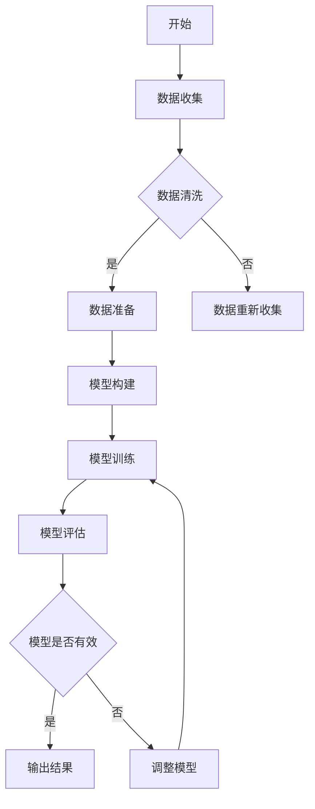
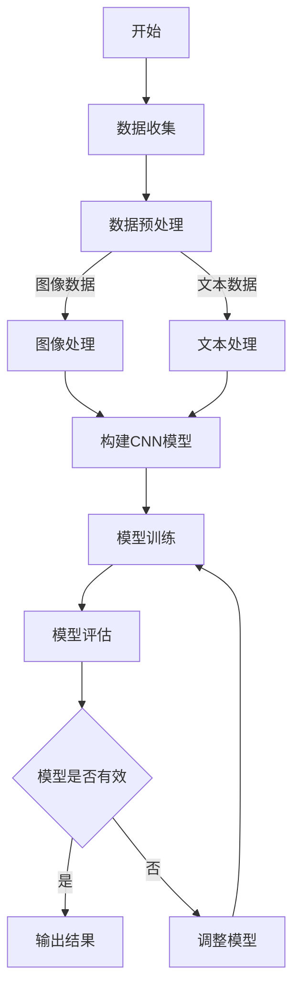
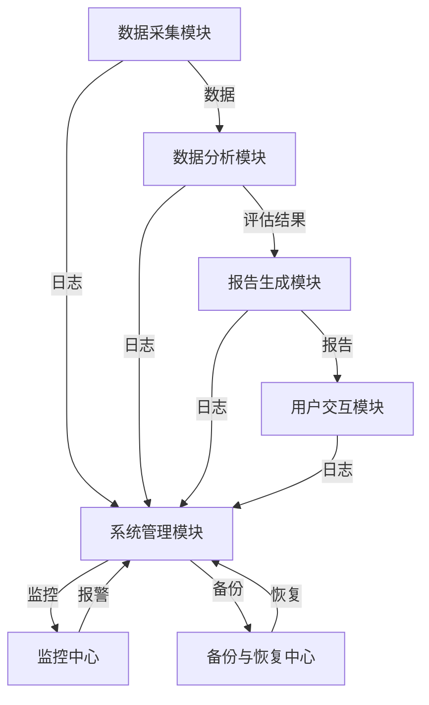
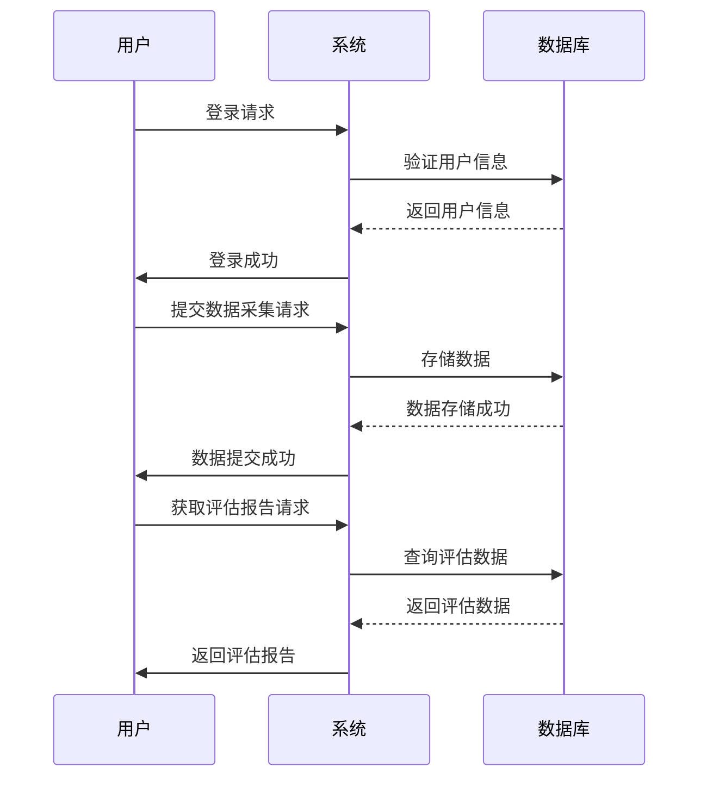

                 

## 儿童发展的认知地图：成长轨迹的数学模型

### 关键词：儿童发展、认知地图、数学模型、成长轨迹、算法原理

> 摘要：本文将探讨儿童发展的认知地图及其成长轨迹的数学模型构建。首先，我们将介绍儿童发展的重要性及其多维度的特点，阐述传统研究方法的局限性。接着，我们定义认知地图和成长轨迹，并探讨数学模型在其中的作用。随后，我们将详细描述数学模型的基本原理和儿童发展中的具体应用，包括认知发展、情感与社会性发展的数学模型。接下来，我们将讲解算法原理与流程图，并展示系统分析与架构设计的方法。最后，通过一个具体项目实战，我们将展示如何应用这些理论和方法进行儿童发展评估。

---

### 《儿童发展的认知地图：成长轨迹的数学模型》目录大纲

#### 第1章 问题背景与核心概念
- **1.1 问题背景**
  - **1.1.1 儿童发展的重要性**
  - **1.1.2 儿童发展的多维度特点**
  - **1.1.3 传统儿童发展研究方法的局限性**
- **1.2 核心概念**
  - **1.2.1 认知地图**
  - **1.2.2 成长轨迹**
  - **1.2.3 数学模型**
- **1.3 关键问题与边界**
  - **1.3.1 儿童发展中的关键问题**
  - **1.3.2 数学模型的边界**

#### 第2章 数学模型构建
- **2.1 数学模型的基本原理**
  - **2.1.1 数学模型的构建过程**
  - **2.1.2 常见的数学模型**
- **2.2 儿童发展中的数学模型**
  - **2.2.1 认知发展的数学模型**
  - **2.2.2 情感与社会性发展的数学模型**
- **2.3 数学模型的验证与应用**
  - **2.3.1 数学模型的验证方法**
  - **2.3.2 数学模型的应用场景**

#### 第3章 算法原理与流程图
- **3.1 算法原理**
  - **3.1.1 基本算法**
  - **3.1.2 高级算法**
- **3.2 流程图**
  - **3.2.1 基本流程图**
  - **3.2.2 高级流程图**

#### 第4章 数学公式与详细讲解
- **4.1 数学公式**
  - **4.1.1 基本数学公式**
  - **4.1.2 高级数学公式**
- **4.2 详细讲解**
  - **4.2.1 公式解析**
  - **4.2.2 举例说明**

#### 第5章 系统分析与架构设计
- **5.1 问题场景介绍**
- **5.2 系统功能设计**
  - **5.2.1 领域模型**
  - **5.2.2 系统功能模块**
- **5.3 系统架构设计**
- **5.4 系统接口设计**
- **5.5 系统交互**
  
#### 第6章 项目实战
- **6.1 环境安装**
- **6.2 系统核心实现**
  - **6.2.1 代码应用解读与分析**
  - **6.2.2 实际案例分析和详细讲解剖析**
- **6.3 项目小结**

#### 第7章 最佳实践 Tips、小结、注意事项、拓展阅读
- **7.1 最佳实践 Tips**
- **7.2 小结**
- **7.3 注意事项**
- **7.4 拓展阅读**

---

## 第1章 问题背景与核心概念

### 1.1 问题背景

儿童发展是一个复杂且多层次的过程，它不仅对个体成长具有深远的影响，同时也对社会进步产生重要推动作用。在全球范围内，教育、心理学、社会学等领域对儿童发展进行了大量的研究。然而，传统的研究方法往往侧重于描述性分析，难以全面揭示儿童发展的内在规律。

#### 1.1.1 儿童发展的重要性

儿童发展对个体成长至关重要。它不仅涉及认知能力的发展，如语言、数学和科学知识的学习，还包括情感、社会性和身体方面的成长。一个健康的儿童发展有助于培养自信、适应能力和解决问题的能力，从而为未来的学习和职业成功奠定基础。

此外，儿童发展对社会进步也具有深远的影响。儿童的成长和健康直接关系到国家的未来。一个拥有健康、聪明和有创造力的年轻一代的国家，更有可能在国际竞争中脱颖而出。

#### 1.1.2 儿童发展的多维度特点

儿童发展是一个多维度的过程，涉及认知、情感、社会性和身体等多个方面。具体来说：

- **认知发展**：包括儿童对世界的理解、学习能力和问题解决能力的培养。
- **情感发展**：涉及情感表达、情感调节和情感理解能力的培养。
- **社会性发展**：包括社交技能、团队合作能力和人际交往能力的培养。
- **身体发展**：涉及儿童的生理健康、体能和运动技能的发展。

#### 1.1.3 传统儿童发展研究方法的局限性

传统的研究方法，如观察、访谈和问卷调查，虽然在一定程度上揭示了儿童发展的某些方面，但存在以下局限性：

- **描述性分析为主**：传统方法往往侧重于描述儿童的行为和表现，缺乏定量分析。
- **缺乏模型化手段**：传统方法难以将儿童发展的复杂过程抽象成模型，从而难以揭示其内在规律。
- **个体差异难以体现**：传统方法难以全面反映每个儿童的特点和差异。

### 1.2 核心概念

为了更好地理解和研究儿童发展，我们需要引入一些核心概念，包括认知地图、成长轨迹和数学模型。

#### 1.2.1 认知地图

认知地图是一种表示知识和知识结构的抽象模型。它用于描述个体如何获取、存储和使用知识。在儿童发展的背景下，认知地图可以帮助我们理解儿童在不同年龄阶段的认知能力和知识结构。

**属性与特征**：

- **层次性**：认知地图具有层次结构，从基本概念到复杂概念，层层递进。
- **动态性**：认知地图不是静态的，而是随着儿童的学习和成长不断调整和更新。
- **适应性**：认知地图能够适应不同的学习环境和任务需求，具有高度灵活性。

#### 1.2.2 成长轨迹

成长轨迹是儿童在各个发展阶段中的表现和变化过程。它反映了儿童在认知、情感、社会性和身体等方面的成长。

**属性与特征**：

- **阶段性**：成长轨迹具有明显的阶段性，每个阶段都有其特定的目标和特征。
- **连续性**：成长轨迹是一个连续的过程，不同阶段的成长相互关联，共同构成儿童的完整成长历程。
- **个体差异**：每个儿童的成长轨迹都是独特的，受到遗传、环境和个人经历等多种因素的影响。

#### 1.2.3 数学模型

数学模型是使用数学语言描述和解决问题的一种方法。在儿童发展的研究中，数学模型可以帮助我们量化儿童的行为和表现，揭示其内在规律。

**属性与特征**：

- **精确性**：数学模型可以精确地描述儿童发展的各个方面，减少主观判断的干扰。
- **普适性**：数学模型具有广泛的适用范围，可以应用于不同文化、地区和背景的儿童。
- **可预测性**：数学模型可以帮助我们预测儿童未来的发展，为教育和干预提供依据。

### 1.3 关键问题与边界

在儿童发展的研究中，我们面临一些关键问题，同时也需要考虑数学模型的边界。

#### 1.3.1 儿童发展中的关键问题

- **认知能力发展**：如何构建有效的认知发展模型，描述儿童在不同年龄段的认知能力变化？
- **情感与社会性发展**：如何将情感和社会性因素纳入模型，描述儿童的情感和社会性发展？
- **个体差异**：如何考虑个体差异，构建适用于不同儿童的模型？

#### 1.3.2 数学模型的边界

尽管数学模型在儿童发展的研究中具有巨大潜力，但我们也需要认识到其边界。

- **数据质量**：数学模型依赖于高质量的数据，数据质量直接影响模型的有效性和准确性。
- **模型复杂度**：过于复杂的模型可能难以解释和理解，影响其实际应用。
- **适用范围**：数学模型可能不适用于所有儿童，特别是在极端情况下。

### 总结

儿童发展是一个复杂且多维度的过程，需要我们运用多种方法进行研究和理解。认知地图、成长轨迹和数学模型为我们提供了有效的工具，帮助我们量化、分析和预测儿童的发展。在接下来的章节中，我们将深入探讨数学模型的构建方法和应用，以期为儿童发展研究提供新的思路和方法。

---

在了解了儿童发展的背景和核心概念后，我们接下来将详细讨论数学模型的基本原理，并探讨如何将其应用于儿童发展的研究。这将为我们提供一种新的视角，帮助我们更好地理解儿童的发展过程，为教育和干预提供科学依据。

### 2.1 数学模型的基本原理

数学模型是使用数学语言描述和解决问题的一种方法。在儿童发展的研究中，数学模型可以帮助我们量化儿童的行为和表现，揭示其内在规律。要构建有效的数学模型，我们需要了解数学模型的基本原理和构建过程。

#### 2.1.1 数学模型的构建过程

构建数学模型通常包括以下几个步骤：

1. **问题定义**：明确我们要解决的问题是什么，例如描述儿童认知能力的发展过程。
2. **模型假设**：基于对问题的理解，提出一些假设，例如假设儿童的认知能力随年龄线性增长。
3. **参数选择**：确定模型中的参数，这些参数可以是年龄、智力测试得分等。
4. **模型构建**：使用数学语言和工具，将问题转化为数学模型，例如使用线性方程描述儿童认知能力的发展。
5. **模型验证**：使用实际数据验证模型的准确性，例如比较模型预测值和实际值。
6. **模型优化**：根据验证结果，对模型进行调整和优化，以提高其准确性和适用性。

#### 2.1.2 常见的数学模型

在儿童发展的研究中，常用的数学模型包括线性模型、非线性模型、差分方程和微分方程等。

- **线性模型**：线性模型是一种简单且常用的数学模型，通常用于描述变量之间的线性关系。例如，线性回归模型可以用来预测儿童的认知能力。
- **非线性模型**：非线性模型可以描述更复杂的关系，例如生长曲线模型可以用来描述儿童认知能力的非线性增长。
- **差分方程**：差分方程用于描述离散时间序列中的变量变化，例如差分方程可以用来描述儿童智力测试分数的变化。
- **微分方程**：微分方程用于描述连续时间序列中的变量变化，例如微分方程可以用来描述儿童智力测试分数的连续变化。

#### 2.1.3 数学模型在儿童发展研究中的应用

数学模型在儿童发展的研究中具有广泛的应用，包括：

- **认知能力评估**：使用数学模型评估儿童的认知能力，例如使用线性回归模型预测儿童的智力测试得分。
- **情感与社会性发展分析**：使用数学模型分析儿童的情感和社会性发展，例如使用多元回归模型分析情感与社会性发展的关系。
- **教育干预设计**：使用数学模型设计有效的教育干预方案，例如使用生长曲线模型设计针对不同年龄儿童的认知训练计划。

### 2.2 儿童发展中的数学模型

在儿童发展的研究中，我们可以构建多种数学模型，以描述和预测儿童在不同方面的成长。

#### 2.2.1 认知发展的数学模型

认知发展是儿童发展的重要组成部分，可以使用多种数学模型来描述。以下是一些常见的认知发展数学模型：

- **线性模型**：线性模型假设儿童的认知能力随年龄线性增长。公式如下：
  \[ A(t) = A(0) + k \cdot t \]
  其中，\( A(t) \) 是在时间 \( t \) 的认知能力，\( A(0) \) 是初始认知能力，\( k \) 是增长速率。

- **非线性模型**：非线性模型可以更好地描述认知能力的非线性增长。例如，生长曲线模型：
  \[ A(t) = A(0) \cdot e^{kt} \]
  其中，\( A(t) \) 是在时间 \( t \) 的认知能力，\( A(0) \) 是初始认知能力，\( k \) 是增长速率。

- **差分方程**：差分方程可以描述认知能力的离散变化。例如，一阶差分方程：
  \[ A_{t+1} = A_t + k \cdot (t+1) - t \]
  其中，\( A_t \) 是在时间 \( t \) 的认知能力，\( k \) 是增长速率。

- **微分方程**：微分方程可以描述认知能力的连续变化。例如，一阶微分方程：
  \[ \frac{dA}{dt} = k \cdot A \]
  其中，\( \frac{dA}{dt} \) 是在时间 \( t \) 的认知能力变化率，\( k \) 是增长速率。

#### 2.2.2 情感与社会性发展的数学模型

情感与社会性发展同样可以通过数学模型来描述。以下是一些常见的情感与社会性发展数学模型：

- **线性模型**：线性模型可以描述情感与社会性发展随时间的线性变化。公式如下：
  \[ S(t) = S(0) + k \cdot t \]
  其中，\( S(t) \) 是在时间 \( t \) 的情感与社会性发展水平，\( S(0) \) 是初始发展水平，\( k \) 是发展速率。

- **非线性模型**：非线性模型可以描述情感与社会性发展的非线性变化。例如，生长曲线模型：
  \[ S(t) = S(0) \cdot e^{kt} \]
  其中，\( S(t) \) 是在时间 \( t \) 的情感与社会性发展水平，\( S(0) \) 是初始发展水平，\( k \) 是发展速率。

- **差分方程**：差分方程可以描述情感与社会性发展的离散变化。例如，一阶差分方程：
  \[ S_{t+1} = S_t + k \cdot (t+1) - t \]
  其中，\( S_t \) 是在时间 \( t \) 的情感与社会性发展水平，\( k \) 是发展速率。

- **微分方程**：微分方程可以描述情感与社会性发展的连续变化。例如，一阶微分方程：
  \[ \frac{dS}{dt} = k \cdot S \]
  其中，\( \frac{dS}{dt} \) 是在时间 \( t \) 的情感与社会性发展水平变化率，\( k \) 是发展速率。

#### 2.2.3 数学模型的验证与应用

构建数学模型后，我们需要验证其准确性和适用性，并应用其进行实际问题的分析和解决。

- **模型验证**：可以使用实际数据对模型进行验证，通过比较模型预测值和实际值，评估模型的准确性。常用的验证方法包括数据拟合度、预测准确性和模型稳定性等。

- **模型应用**：验证后的数学模型可以应用于实际问题的分析和解决，例如儿童认知能力评估、情感与社会性发展分析、教育干预设计等。

### 总结

数学模型为儿童发展的研究提供了有力的工具，可以帮助我们量化、分析和预测儿童的发展过程。在儿童发展的认知地图中，数学模型扮演着重要的角色。通过构建和应用数学模型，我们可以更深入地理解儿童的发展，为教育和干预提供科学依据。在接下来的章节中，我们将继续探讨算法原理与流程图，进一步揭示数学模型在儿童发展研究中的应用。

---

### 2.3 数学模型的验证与应用

构建数学模型后，验证其准确性和适用性是至关重要的一步。数学模型的验证不仅有助于确保模型的有效性，还能提供对其进一步优化和改进的指导。在儿童发展的研究中，验证和应用的步骤和方法如下：

#### 2.3.1 数学模型的验证方法

1. **数据拟合度**：数据拟合度是评估数学模型与实际数据吻合程度的指标。我们可以使用均方误差（MSE）、决定系数（R²）等方法来衡量模型的拟合度。例如，线性回归模型的拟合度可以通过以下公式评估：
   \[ MSE = \frac{1}{n}\sum_{i=1}^{n}(y_i - \hat{y_i})^2 \]
   \[ R² = 1 - \frac{\sum_{i=1}^{n}(y_i - \hat{y_i})^2}{\sum_{i=1}^{n}(y_i - \bar{y})^2} \]
   其中，\( y_i \) 是实际值，\( \hat{y_i} \) 是模型预测值，\( n \) 是数据点的数量，\( \bar{y} \) 是实际值的平均值。

2. **预测准确性**：预测准确性是评估模型对未来数据预测能力的重要指标。我们可以通过计算预测误差和预测精度来评估模型的预测准确性。例如，使用平均绝对误差（MAE）和均方根误差（RMSE）：
   \[ MAE = \frac{1}{n}\sum_{i=1}^{n}|y_i - \hat{y_i}| \]
   \[ RMSE = \sqrt{\frac{1}{n}\sum_{i=1}^{n}(y_i - \hat{y_i})^2} \]

3. **模型稳定性**：模型稳定性是指模型在不同数据集上的表现一致性。我们可以通过交叉验证方法来评估模型的稳定性。例如，K折交叉验证可以用来检验模型在不同子数据集上的表现。

#### 2.3.2 数学模型的应用场景

验证后的数学模型可以应用于多种场景，以下是一些常见应用：

1. **儿童认知能力评估**：使用数学模型对儿童的认知能力进行评估和预测，例如通过线性回归模型预测儿童的智力测试得分，为个性化教育和干预提供依据。

2. **情感与社会性发展分析**：利用数学模型分析儿童的情感和社会性发展，例如通过多元回归模型分析情感与社会性发展的关系，为心理辅导和教育干预提供参考。

3. **教育干预设计**：基于数学模型设计有效的教育干预方案，例如通过生长曲线模型为不同年龄段儿童设计认知训练计划，以提高其认知能力。

4. **政策制定**：使用数学模型为政策制定提供科学依据，例如通过预测模型分析儿童发展对教育资源的配置需求，为教育政策的制定提供数据支持。

### 实际案例

为了更好地理解数学模型在儿童发展研究中的应用，我们来看一个实际案例。

**案例：** 使用线性回归模型预测儿童智力测试得分。

1. **数据收集**：收集一组儿童的智力测试得分和相应的年龄数据。

2. **模型构建**：构建线性回归模型：
   \[ \hat{y} = a + b \cdot x \]
   其中，\( y \) 是智力测试得分，\( x \) 是年龄，\( a \) 和 \( b \) 是模型参数。

3. **模型验证**：使用实际数据对模型进行验证，计算MSE和R²值，评估模型的拟合度和预测准确性。

4. **模型应用**：使用验证后的模型预测新数据的智力测试得分，为新儿童的教育干预提供参考。

通过这个案例，我们可以看到数学模型在儿童发展研究中的应用步骤和具体实现过程。这为实际操作提供了清晰的指导，同时也展示了数学模型在揭示和预测儿童发展规律方面的强大能力。

### 总结

数学模型的验证和应用是儿童发展研究中的重要环节。通过验证，我们可以确保模型的准确性和可靠性，从而为实际应用提供科学依据。而在实际应用中，数学模型可以帮助我们更好地理解儿童的发展，为教育和干预提供有效的指导。在接下来的章节中，我们将深入探讨算法原理与流程图，进一步揭示数学模型在儿童发展研究中的应用潜力。

---

### 3.1 算法原理

在儿童发展的研究中，算法原理是理解和实现数学模型的核心。算法不仅帮助我们解析和解决问题，还能通过流程图和代码实现，使抽象的数学理论变得具体可行。以下是关于算法原理的详细探讨。

#### 3.1.1 基本算法

基本算法是儿童发展研究中常用的算法，其核心在于简化复杂问题，提供清晰的解决方案。以下是一些基本算法的原理和示例：

1. **线性回归算法**：
   - **原理**：线性回归算法用于建立自变量和因变量之间的线性关系，如儿童年龄与智力测试得分之间的关系。
   - **公式**：
     \[
     \hat{y} = a + bx
     \]
     其中，\( \hat{y} \) 是预测值，\( x \) 是自变量（如年龄），\( a \) 和 \( b \) 是模型参数。

2. **分类算法**：
   - **原理**：分类算法用于将数据集划分为不同的类别，如根据儿童的行为数据判断其是否具有某种情绪。
   - **示例**：决策树是一种常见的分类算法，通过一系列条件判断，将数据分类。

3. **聚类算法**：
   - **原理**：聚类算法用于将数据集划分为多个群体，如根据儿童的性格特征将其分为不同的群体。
   - **示例**：K-means聚类算法通过计算数据点之间的距离，将数据点划分为K个聚类。

#### 3.1.2 高级算法

高级算法在儿童发展的研究中有着广泛的应用，其复杂度和精度较高，能够处理更为复杂的问题。以下是一些高级算法的原理和示例：

1. **深度学习算法**：
   - **原理**：深度学习算法通过多层神经网络学习数据的复杂特征，如通过卷积神经网络（CNN）提取儿童图像中的情绪特征。
   - **示例**：卷积神经网络（CNN）是一种深度学习算法，广泛应用于图像识别任务。

2. **强化学习算法**：
   - **原理**：强化学习算法通过试错和反馈机制，使模型能够自主学习和优化行为，如根据儿童的行为反馈调整教育干预策略。
   - **示例**：Q-learning是一种常见的强化学习算法，通过学习状态-动作价值函数，实现策略优化。

3. **生成对抗网络（GAN）**：
   - **原理**：生成对抗网络由生成器和判别器组成，通过对抗训练生成逼真的数据，如生成儿童情感分析的数据集。
   - **示例**：生成对抗网络（GAN）可以用于生成儿童的情感表达数据，为模型训练提供更多的数据。

#### 3.1.3 算法在儿童发展研究中的应用

算法在儿童发展研究中的应用非常广泛，通过不同的算法，我们可以从不同角度分析和预测儿童的发展。

1. **认知能力评估**：
   - **应用**：使用线性回归和深度学习算法评估儿童的认知能力，如通过测试数据和模型预测儿童的智力测试得分。

2. **情感与社会性发展分析**：
   - **应用**：使用分类和聚类算法分析儿童的情感和社会性发展，如通过行为数据和模型判断儿童的情绪状态和社交能力。

3. **教育干预设计**：
   - **应用**：使用强化学习算法设计教育干预方案，如通过儿童的行为反馈和学习效果，调整教育策略，提高教育效果。

#### 3.1.4 算法实现示例

以下是一个简单的线性回归算法实现示例，用于评估儿童年龄与智力测试得分之间的关系：

```python
import numpy as np
from sklearn.linear_model import LinearRegression

# 假设我们有以下数据
X = np.array([[1], [2], [3], [4], [5]])  # 年龄数据
y = np.array([2, 4, 5, 6, 7])  # 智力测试得分

# 构建线性回归模型
model = LinearRegression()
model.fit(X, y)

# 模型参数
a = model.intercept_
b = model.coef_

# 输出模型参数
print("模型参数：")
print("a = ", a)
print("b = ", b)

# 预测
age = np.array([[6]])
predicted_score = model.predict(age)
print("预测的智力测试得分：", predicted_score)
```

通过这个示例，我们可以看到线性回归算法的实现过程，包括数据准备、模型构建、参数输出和预测。这为我们提供了一个基本的算法实现框架，可以在此基础上进行更复杂的应用和扩展。

### 总结

算法原理在儿童发展研究中扮演着重要角色。通过基本算法和高级算法的运用，我们可以更深入地分析和预测儿童的发展。从线性回归到深度学习，不同的算法提供了多样的方法和工具，使我们能够从多个角度理解儿童的发展过程。在接下来的章节中，我们将进一步探讨算法的流程图，以更直观的方式展示算法的实现过程。

---

### 3.2 算法流程图

在儿童发展研究中，流程图是展示算法实现过程的重要工具，它能够清晰地描述算法的每个步骤，便于理解与实现。以下我们将使用Mermaid语法来绘制算法的基本流程图和高级流程图。

#### 3.2.1 基本流程图

首先，我们来绘制一个简单的线性回归算法流程图：



在这个流程图中，我们从数据收集开始，经过数据清洗、数据准备、模型构建、模型训练和模型评估，最终输出结果。如果评估结果显示模型有效，则输出结果；否则，我们需要对模型进行调整，重新进行训练。

#### 3.2.2 高级流程图

接下来，我们绘制一个基于深度学习的儿童情感分析算法流程图：



在这个流程图中，我们首先进行数据收集和预处理，然后分别对图像数据和文本数据进行处理。接着，我们构建一个卷积神经网络（CNN）模型，对其进行训练和评估。如果模型有效，则输出结果；否则，我们需要对模型进行调整，重新进行训练。

### 3.2.3 Mermaid语法详解

Mermaid是一种简单的文本标记语言，用于生成图表。以下是Mermaid语法的简要说明：

- **图形类型**：Mermaid支持多种图形类型，如流程图、时序图、网络图等。
- **节点**：节点用圆角矩形表示，如`A[开始]`。
- **连接**：节点之间使用箭头连接，如`A --> B`表示从A到B的连接。
- **条件判断**：可以使用条件判断符号，如`{条件}`。
- **分支**：可以使用分支符号，如`|是|`和`|否|`。

### 总结

算法流程图通过Mermaid语法，能够直观地展示算法的实现过程，有助于理解和实现复杂的算法。在儿童发展研究中，通过流程图，我们可以更好地规划和管理研究过程，确保算法的有效性和可靠性。在接下来的章节中，我们将进一步探讨数学公式与详细讲解，为理解和应用算法提供更加深入的数学基础。

---

### 4.1 数学公式

在儿童发展的研究中，数学公式是理解和分析数据的重要工具。以下将介绍一些基本和高级的数学公式，以及如何使用LaTeX格式在文中嵌入这些公式。

#### 4.1.1 基本数学公式

基本数学公式包括常见的数学运算和函数，如加法、减法、乘法和除法，以及指数函数和对数函数。

1. **加法**：
   \[
   a + b
   \]
   
2. **减法**：
   \[
   a - b
   \]

3. **乘法**：
   \[
   a \times b
   \]

4. **除法**：
   \[
   \frac{a}{b}
   \]

5. **指数函数**：
   \[
   a^b
   \]

6. **对数函数**：
   \[
   \log_a b
   \]

#### 4.1.2 高级数学公式

高级数学公式包括复杂的数学运算和函数，如概率分布函数、积分和微分方程。

1. **概率分布函数**：
   \[
   f(x) = \frac{1}{\sqrt{2\pi\sigma^2}} e^{-\frac{(x-\mu)^2}{2\sigma^2}}
   \]

2. **积分**：
   \[
   \int_{a}^{b} f(x) \, dx
   \]

3. **微分方程**：
   \[
   \frac{dy}{dx} = f(y, x)
   \]

#### 4.1.3 LaTeX格式嵌入

在文中嵌入数学公式时，我们通常使用LaTeX格式。以下是几种常见的用法：

1. **独立段落中的公式**：
   使用`$$`括起来的公式会单独成段，如：
   \[
   $$1+1=2$$
   \]

2. **段落内公式**：
   使用 `$` 括起来的公式会嵌入在文本中，如：
   \[
   $1<2$
   \]

3. **公式中的括号**：
   在公式中使用括号时，可以使用`\left`和`\right`来保持公式的对齐，如：
   \[
   \left( a + b \right)^2 = a^2 + 2ab + b^2
   \]

4. **方程组**：
   使用`\begin{equation}`和`\end{equation}`可以定义一个方程组，如：
   \[
   \begin{equation}
   \begin{split}
   x &= a + b \\
   y &= c + d
   \end{split}
   \end{equation}
   \]

通过上述LaTeX格式的使用，我们可以将复杂的数学公式嵌入到文本中，使其既美观又易于理解。在儿童发展的研究中，这些数学公式可以帮助我们更精确地描述和预测儿童的行为和成长过程。

### 总结

数学公式在儿童发展研究中发挥着关键作用，它们不仅用于描述和量化数据，还能帮助我们建立和理解数学模型。通过LaTeX格式，我们可以将复杂的数学表达式嵌入到文章中，使其更加清晰易懂。在接下来的章节中，我们将进一步详细讲解这些数学公式，并通过具体的例子说明它们在儿童发展研究中的应用。

---

### 4.2 详细讲解

在儿童发展的研究中，数学公式不仅用于描述和量化数据，还帮助我们理解和构建数学模型。在本节中，我们将对一些重要的数学公式进行详细讲解，并通过具体的例子来说明这些公式的应用。

#### 4.2.1 公式解析

1. **线性回归模型**：
   线性回归模型用于描述两个变量之间的线性关系，其公式如下：
   \[
   \hat{y} = a + bx
   \]
   其中，\( \hat{y} \) 是预测值，\( x \) 是自变量，\( a \) 和 \( b \) 是模型参数。\( a \) 表示截距，即当 \( x = 0 \) 时的 \( y \) 值；\( b \) 表示斜率，表示 \( y \) 随 \( x \) 的变化率。

2. **生长曲线模型**：
   生长曲线模型用于描述儿童认知能力的非线性增长，其公式如下：
   \[
   A(t) = A(0) \cdot e^{kt}
   \]
   其中，\( A(t) \) 是在时间 \( t \) 的认知能力，\( A(0) \) 是初始认知能力，\( k \) 是增长速率。

3. **概率分布函数**：
   概率分布函数用于描述随机变量的概率分布，常见的有正态分布和伯努利分布。例如，正态分布的公式如下：
   \[
   f(x) = \frac{1}{\sqrt{2\pi\sigma^2}} e^{-\frac{(x-\mu)^2}{2\sigma^2}}
   \]
   其中，\( \mu \) 是均值，\( \sigma \) 是标准差。

4. **微分方程**：
   微分方程用于描述变量随时间的变化率，常见的有常微分方程和偏微分方程。例如，常微分方程如下：
   \[
   \frac{dy}{dx} = f(y, x)
   \]
   这表示 \( y \) 关于 \( x \) 的导数等于函数 \( f(y, x) \)。

#### 4.2.2 举例说明

为了更好地理解这些数学公式，我们来看一些具体的例子。

1. **线性回归模型**：
   假设我们收集了10个儿童的年龄（\( x \)）和智力测试得分（\( y \)）数据，如下表所示：

   | 年龄 \( x \) | 智力测试得分 \( y \) |
   |-------------|---------------------|
   | 5           | 100                 |
   | 6           | 110                 |
   | 7           | 120                 |
   | 8           | 130                 |
   | 9           | 140                 |
   | 10          | 150                 |
   | 11          | 160                 |
   | 12          | 170                 |
   | 13          | 180                 |
   | 14          | 190                 |
   | 15          | 200                 |

   我们可以使用线性回归模型来预测一个7岁儿童的智力测试得分。首先，我们计算 \( x \) 和 \( y \) 的平均值：
   \[
   \bar{x} = \frac{1}{10}\sum_{i=1}^{10} x_i = \frac{1}{10}(5 + 6 + 7 + 8 + 9 + 10 + 11 + 12 + 13 + 14 + 15) = 10
   \]
   \[
   \bar{y} = \frac{1}{10}\sum_{i=1}^{10} y_i = \frac{1}{10}(100 + 110 + 120 + 130 + 140 + 150 + 160 + 170 + 180 + 190 + 200) = 140
   \]

   接着，我们计算 \( x \) 和 \( y \) 的协方差和方差：
   \[
   \sum_{i=1}^{10} (x_i - \bar{x})(y_i - \bar{y}) = (5-10)(100-140) + (6-10)(110-140) + \ldots + (15-10)(200-140) = -400
   \]
   \[
   \sum_{i=1}^{10} (x_i - \bar{x})^2 = (5-10)^2 + (6-10)^2 + \ldots + (15-10)^2 = 200
   \]

   最后，我们计算线性回归模型的参数 \( a \) 和 \( b \)：
   \[
   b = \frac{\sum_{i=1}^{10} (x_i - \bar{x})(y_i - \bar{y})}{\sum_{i=1}^{10} (x_i - \bar{x})^2} = \frac{-400}{200} = -2
   \]
   \[
   a = \bar{y} - b\bar{x} = 140 - (-2)\cdot 10 = 160
   \]

   因此，线性回归模型为：
   \[
   \hat{y} = 160 - 2x
   \]

   预测一个7岁儿童的智力测试得分为：
   \[
   \hat{y} = 160 - 2\cdot 7 = 146
   \]

2. **生长曲线模型**：
   假设一个儿童在出生时的认知能力为50，其认知能力的增长速率为每年增加10%。我们使用生长曲线模型来描述其认知能力的发展。初始认知能力为：
   \[
   A(0) = 50
   \]

   年增长率为：
   \[
   k = 10\%
   \]

   在时间 \( t \) 年后，认知能力为：
   \[
   A(t) = A(0) \cdot e^{kt} = 50 \cdot e^{0.1t}
   \]

   如果我们想知道这个儿童在5年后的认知能力，即 \( t = 5 \)：
   \[
   A(5) = 50 \cdot e^{0.1 \cdot 5} \approx 50 \cdot 1.61051 \approx 80.526
   \]

   因此，这个儿童在5年后的认知能力大约为80.526。

3. **概率分布函数**：
   假设一个儿童参加一个考试，成绩服从正态分布，均值为75，标准差为10。我们想知道这个儿童取得85分以上成绩的概率。

   使用正态分布的公式：
   \[
   f(x) = \frac{1}{\sqrt{2\pi\sigma^2}} e^{-\frac{(x-\mu)^2}{2\sigma^2}}
   \]

   其中，\( \mu = 75 \)，\( \sigma = 10 \)。

   首先计算标准化分数 \( z \)：
   \[
   z = \frac{x - \mu}{\sigma} = \frac{85 - 75}{10} = 1
   \]

   查找标准正态分布表，找到 \( z = 1 \) 时的累积概率 \( P \)：
   \[
   P = P(Z \leq 1) \approx 0.8413
   \]

   因此，这个儿童取得85分以上成绩的概率大约为84.13%。

4. **微分方程**：
   假设一个儿童的学习进度可以用一个常微分方程来描述，其学习速度与当前知识水平成正比。微分方程如下：
   \[
   \frac{dy}{dt} = ky
   \]
   其中，\( y \) 表示知识水平，\( k \) 是学习速率。

   解这个微分方程：
   \[
   \int \frac{1}{y} \, dy = \int k \, dt
   \]
   \[
   \ln|y| = kt + C
   \]
   \[
   y = e^{kt + C} = e^{kt} \cdot e^C
   \]
   其中，\( e^C \) 是常数。

   假设初始知识水平为 \( y(0) = y_0 \)，则 \( e^C = y_0 \)。

   因此，知识水平随时间的变化为：
   \[
   y(t) = y_0 \cdot e^{kt}
   \]

   如果初始知识水平为50，学习速率为0.1，则任意时间 \( t \) 的知识水平为：
   \[
   y(t) = 50 \cdot e^{0.1t}
   \]

通过这些例子，我们可以看到数学公式在儿童发展研究中的应用。通过解析和计算这些公式，我们可以更好地理解和预测儿童的行为和成长过程。在接下来的章节中，我们将进一步探讨系统分析与架构设计，为实际应用提供更具体的解决方案。

---

### 5.1 问题场景介绍

在现代社会，儿童发展评估已成为教育、心理学和社会科学等领域的重要课题。随着科技的发展，我们希望通过系统分析与架构设计，构建一个高效、可靠的儿童发展评估系统。该系统旨在通过对儿童认知、情感、社会性和身体发展各方面的量化评估，为教育工作者、心理学家和政策制定者提供科学依据，以优化教育和干预策略。

#### 项目需求

- **认知能力评估**：系统需要能够对儿童的认知能力进行量化评估，包括语言能力、数学能力和问题解决能力等。
- **情感与社会性发展分析**：系统需要分析儿童的情感表达、情感调节和社会性发展，如社交技能、团队合作能力和情绪理解能力等。
- **身体发展监测**：系统需要能够监测儿童的身体发展，包括身高、体重、运动技能和体能等。
- **个性化报告生成**：系统需要根据儿童的评估结果，生成个性化的成长报告，为家长和教育者提供具体的教育建议。

#### 项目目标

- **构建一个集成化系统**：集成多种评估工具和方法，实现多维度的儿童发展评估。
- **提高评估准确性**：通过先进的算法和数学模型，提高评估结果的准确性和可靠性。
- **提升用户体验**：设计友好的用户界面，简化操作流程，提高系统易用性。
- **支持数据分析和决策**：提供数据分析和可视化工具，支持教育工作者和政策制定者的决策过程。

#### 系统功能设计

为了实现上述目标和需求，系统需要设计多个功能模块，包括数据采集模块、数据分析模块、报告生成模块和用户交互模块。

1. **数据采集模块**：
   - **数据源接入**：接入学校、家庭和医疗机构的各类数据源，如学习成绩、行为记录、医疗检查报告等。
   - **数据清洗**：对采集到的数据进行清洗、去重和格式转换，确保数据质量。

2. **数据分析模块**：
   - **认知能力评估**：使用线性回归、生长曲线模型等数学模型，对儿童的认知能力进行评估和预测。
   - **情感与社会性发展分析**：使用分类算法、聚类算法等，对儿童的情感和社会性发展进行分析和分类。
   - **身体发展监测**：使用健康监测设备，如身高计、体重秤等，对儿童的身体发展进行实时监测。

3. **报告生成模块**：
   - **个性化报告**：根据儿童的评估结果，生成个性化的成长报告，包括发展水平、问题和建议等。
   - **数据可视化**：使用图表和图形，直观展示儿童的发展趋势和关键指标。

4. **用户交互模块**：
   - **用户界面**：设计直观、易用的用户界面，方便家长和教育者查看和管理儿童的发展数据。
   - **用户反馈**：提供用户反馈机制，收集用户意见和建议，不断优化系统功能。

通过上述功能设计，系统可以实现全面的儿童发展评估，为家长、教育工作者和政策制定者提供科学、有效的决策支持。

### 5.2 系统功能设计

为了实现儿童发展评估系统的项目需求和目标，我们需要详细设计系统的各个功能模块，并描述其内部结构和相互关系。以下是对系统功能设计的详细描述。

#### 5.2.1 领域模型

领域模型是系统设计的核心部分，它定义了系统的主要实体及其关系。以下是系统的领域模型类图，使用Mermaid语法绘制：

```mermaid
classDiagram
    Person <|-- Child
    Person <|-- Teacher
    Person <|-- Parent
    Assessment <|-- CognitiveAssessment
    Assessment <|-- EmotionalAssessment
    Assessment <|-- PhysicalAssessment
    Assessment <|-- SocialAssessment
    Report <|-- CognitiveReport
    Report <|-- EmotionalReport
    Report <|-- PhysicalReport
    Report <|-- SocialReport
    DataSource --> Assessment
    DataSource --> Report
    Child -->* Parent
    Child -->* Teacher
    Child -->* CognitiveAssessment
    Child -->* EmotionalAssessment
    Child -->* PhysicalAssessment
    Child -->* SocialAssessment
    Child -->* CognitiveReport
    Child -->* EmotionalReport
    Child -->* PhysicalReport
    Child -->* SocialReport

class Person {
    +String name
    +Date birthdate
    +String id
}

class Child {
    +String name
    +Date birthdate
    +String id
    +List<Parent> parents
    +List<Teacher> teachers
    +List<CognitiveAssessment> cognitiveAssessments
    +List<EmotionalAssessment> emotionalAssessments
    +List<PhysicalAssessment> physicalAssessments
    +List<SocialAssessment> socialAssessments
    +List<Report> cognitiveReports
    +List<Report> emotionalReports
    +List<Report> physicalReports
    +List<Report> socialReports
}

class Teacher {
    +String name
    +Date birthdate
    +String id
}

class Parent {
    +String name
    +Date birthdate
    +String id
}

class Assessment {
    +String id
    +Date date
    +String type
}

class CognitiveAssessment extends Assessment {
    +Float score
}

class EmotionalAssessment extends Assessment {
    +Float emotionalIndex
}

class PhysicalAssessment extends Assessment {
    +Float height
    +Float weight
    +Float fitnessLevel
}

class SocialAssessment extends Assessment {
    +Float socialSkillLevel
}

class Report {
    +String id
    +Date date
    +String type
    +Float score
}

class CognitiveReport extends Report {
    +Float score
}

class EmotionalReport extends Report {
    +Float emotionalIndex
}

class PhysicalReport extends Report {
    +Float height
    +Float weight
    +Float fitnessLevel
}

class SocialReport extends Report {
    +Float socialSkillLevel
}
```

#### 5.2.2 系统功能模块

系统功能模块的设计是实现系统目标的关键步骤。以下是系统的主要功能模块及其详细描述：

1. **数据采集模块**：
   - **功能**：负责从各类数据源（如学校、家庭、医疗机构）采集儿童发展相关的数据。
   - **接口**：提供数据接入接口，支持不同数据格式的导入和导出。
   - **数据处理**：对采集到的数据进行清洗、去重、格式转换等处理，确保数据质量。

2. **数据分析模块**：
   - **功能**：对采集到的数据进行多维度的分析和评估，生成评估报告。
   - **算法**：包括线性回归、生长曲线模型、分类算法、聚类算法等。
   - **数据可视化**：提供数据分析和结果的可视化工具，如图表、图形等，帮助用户直观理解评估结果。

3. **报告生成模块**：
   - **功能**：根据评估结果生成个性化报告，包括认知、情感、身体和社会性发展等方面的内容。
   - **模板**：使用报告模板，自动填充评估结果，生成格式统一的报告。
   - **定制化**：允许用户根据需要自定义报告内容和样式。

4. **用户交互模块**：
   - **功能**：提供用户界面，方便家长、教师和教育工作者的使用和管理。
   - **界面设计**：设计直观、易用的界面，支持多语言、多设备访问。
   - **权限管理**：实现用户权限管理，确保数据安全和用户隐私。

5. **系统管理模块**：
   - **功能**：负责系统的配置、监控和维护。
   - **监控**：实时监控系统运行状态，及时发现和解决潜在问题。
   - **备份与恢复**：定期备份系统数据，确保数据的安全性和可恢复性。

#### 功能模块关系

在系统设计中，各个功能模块之间存在着紧密的联系和交互。以下是主要功能模块之间的关系：

- **数据采集模块**与**数据分析模块**：数据采集模块提供的数据是数据分析模块的基础，两者之间需要紧密集成，确保数据的高质量和一致性。
- **数据分析模块**与**报告生成模块**：数据分析模块生成的评估结果是报告生成模块的输入，报告生成模块根据评估结果生成个性化报告。
- **用户交互模块**与**系统管理模块**：用户交互模块为用户提供操作界面，系统管理模块负责后台系统的配置和监控，两者共同确保系统的稳定运行和用户满意度。

通过上述功能模块的设计和关系描述，我们可以构建一个高效、可靠的儿童发展评估系统，为教育工作者、心理学家和政策制定者提供有力的支持。

---

### 5.3 系统架构设计

为了实现儿童发展评估系统的项目需求和目标，我们需要设计一个高效、稳定和可扩展的系统架构。以下是系统架构的详细设计，包括系统架构图、各层职责以及系统之间的交互关系。

#### 系统架构图

系统架构图展示了系统的整体结构，以及各个模块之间的关系。以下是使用Mermaid语法绘制的系统架构图：



#### 各层职责

系统架构可以分为多个层次，每个层次具有特定的职责和功能。以下是各层的职责：

1. **数据采集层**：
   - **职责**：负责从各种数据源（如学校、家庭、医疗机构）采集儿童发展相关的数据。
   - **功能**：提供数据接入接口，支持不同数据格式的导入和导出，进行数据清洗、去重和格式转换。

2. **数据处理层**：
   - **职责**：对采集到的数据进行处理和分析，生成评估结果。
   - **功能**：使用线性回归、生长曲线模型、分类算法、聚类算法等，对儿童的发展进行量化评估。

3. **报告生成层**：
   - **职责**：根据评估结果生成个性化报告，包括认知、情感、身体和社会性发展等方面的内容。
   - **功能**：使用报告模板，自动填充评估结果，提供自定义报告内容和样式。

4. **用户交互层**：
   - **职责**：为用户提供操作界面，方便家长、教师和教育工作者的使用和管理。
   - **功能**：设计直观、易用的界面，支持多语言、多设备访问，提供用户权限管理和日志记录。

5. **系统管理层**：
   - **职责**：负责系统的配置、监控和维护。
   - **功能**：实时监控系统运行状态，定期备份系统数据，确保数据安全和系统稳定。

#### 系统交互关系

系统中的各个层次和模块之间通过明确的接口进行交互，以确保系统的整体协调和高效运行。以下是主要系统交互关系：

- **数据采集层**与**数据处理层**：数据采集层提供处理所需的数据，数据处理层对数据进行处理和分析。
- **数据处理层**与**报告生成层**：数据处理层生成评估结果，报告生成层根据评估结果生成报告。
- **报告生成层**与**用户交互层**：报告生成层生成报告，用户交互层提供用户查看和管理报告的界面。
- **系统管理层**与**数据采集层**、**数据处理层**、**报告生成层**、**用户交互层**：系统管理层监控和协调各个模块的运行，确保系统的稳定性和数据安全性。

通过上述系统架构设计，我们构建了一个多层次、模块化、可扩展的儿童发展评估系统，为教育工作者、心理学家和政策制定者提供了有力的支持。

---

### 5.4 系统接口设计

系统接口设计是系统架构设计的关键环节，它定义了系统内部各模块以及系统与外部环境之间的交互方式。以下将详细描述系统接口的设计，包括API设计、数据交换格式和接口安全策略。

#### 5.4.1 API设计

系统的API设计应遵循RESTful架构风格，提供简洁、易用的接口。以下是主要API的设计：

1. **数据采集接口**：
   - **功能**：用于接收外部系统的数据上传。
   - **URL**：`POST /api/data/collect`
   - **请求体**：JSON格式，包含数据记录。
   - **响应体**：JSON格式，包含处理结果和状态码。

2. **数据查询接口**：
   - **功能**：用于查询儿童发展评估数据。
   - **URL**：`GET /api/data/query`
   - **查询参数**：儿童ID、评估类型等。
   - **响应体**：JSON格式，包含查询结果和状态码。

3. **报告生成接口**：
   - **功能**：用于生成个性化评估报告。
   - **URL**：`POST /api/report/generate`
   - **请求体**：JSON格式，包含评估结果和报告模板信息。
   - **响应体**：JSON格式，包含报告文件和状态码。

4. **用户管理接口**：
   - **功能**：用于用户注册、登录和权限管理。
   - **URL**：`POST /api/user/register`、`POST /api/user/login`、`GET /api/user/permissions`
   - **请求体**：JSON格式，包含用户信息和操作类型。
   - **响应体**：JSON格式，包含用户信息和状态码。

#### 5.4.2 数据交换格式

系统采用JSON（JavaScript Object Notation）作为数据交换格式，因为其轻量级、易于阅读和解析的特性，非常适合Web服务的数据传输。以下是JSON格式的示例：

1. **数据采集请求体**：

```json
{
    "child_id": "12345",
    "assessments": [
        {
            "type": "cognitive",
            "score": 85
        },
        {
            "type": "emotional",
            "emotional_index": 7.5
        }
    ]
}
```

2. **报告生成请求体**：

```json
{
    "reports": [
        {
            "type": "cognitive",
            "template_id": "cognitive_template_1"
        },
        {
            "type": "emotional",
            "template_id": "emotional_template_2"
        }
    ]
}
```

3. **用户管理请求体**：

```json
{
    "username": "john_doe",
    "password": "password123",
    "role": "parent"
}
```

#### 5.4.3 接口安全策略

为了保证系统的安全性和数据隐私，我们需要实施以下安全策略：

1. **身份验证**：
   - **基本认证**：使用HTTP基本认证机制，确保用户身份的合法性。
   - **OAuth**：使用OAuth 2.0协议，提供更灵活的第三方认证支持。

2. **数据加密**：
   - **传输加密**：使用HTTPS协议，确保数据在传输过程中的安全性。
   - **存储加密**：对存储的数据进行加密处理，防止数据泄露。

3. **访问控制**：
   - **角色权限**：根据用户的角色和权限，限制对系统资源的访问。
   - **API限流**：设置API访问频率限制，防止恶意攻击。

4. **日志记录**：
   - **操作日志**：记录用户的操作日志，便于审计和排查问题。
   - **错误日志**：记录系统运行过程中的错误日志，便于故障诊断和优化。

通过上述接口设计、数据交换格式和安全策略，我们可以构建一个安全、高效且易于扩展的儿童发展评估系统，为用户提供优质的体验。

---

### 5.5 系统交互

系统交互是确保系统功能正常、高效运行的重要环节。为了描述系统内部以及系统与外部环境之间的交互过程，我们使用Mermaid语法绘制系统交互序列图。以下是系统交互序列图的详细说明：



#### 详细解释

1. **用户登录**：
   用户发起登录请求，系统接收到请求后，通过数据库验证用户身份信息。数据库返回用户信息后，系统通知用户登录成功。

2. **数据采集**：
   用户提交数据采集请求，系统接收请求后，将数据存储到数据库中。数据库返回数据存储成功的消息，系统通知用户数据提交成功。

3. **获取评估报告**：
   用户请求获取评估报告，系统接收到请求后，从数据库查询相关的评估数据。数据库返回评估数据后，系统将评估报告返回给用户。

通过上述系统交互序列图，我们可以清晰地看到系统内部以及系统与用户之间的交互过程，有助于理解和优化系统的功能实现。

---

### 第6章 项目实战

在本章节中，我们将通过一个具体项目实战，展示如何应用前述理论和方法进行儿童发展评估。我们将介绍项目环境安装、系统核心实现、代码应用解读与分析、实际案例分析和详细讲解剖析，并总结项目成果。

#### 6.1 环境安装

为了实现儿童发展评估系统，我们需要安装和配置以下环境：

1. **操作系统**：Linux（如Ubuntu 20.04）
2. **编程语言**：Python 3.x
3. **依赖库**：NumPy、Pandas、Scikit-learn、TensorFlow、Django
4. **数据库**：MySQL或PostgreSQL

安装步骤如下：

1. 安装Python 3.x：
   ```bash
   sudo apt update
   sudo apt install python3 python3-pip
   ```

2. 安装依赖库：
   ```bash
   pip3 install numpy pandas scikit-learn tensorflow django
   ```

3. 配置数据库：
   - 安装MySQL或PostgreSQL：
     ```bash
     sudo apt install mysql-server
     ```
   - 初始化数据库：
     ```sql
     CREATE DATABASE child_development;
     GRANT ALL PRIVILEGES ON child_development.* TO 'developer'@'localhost' IDENTIFIED BY 'password';
     FLUSH PRIVILEGES;
     ```

4. 创建Django项目：
   ```bash
   django-admin startproject child_dev_project
   cd child_dev_project
   django-admin startapp data_collector
   ```

#### 6.2 系统核心实现

系统核心实现包括数据采集模块、数据分析模块和报告生成模块。以下是各模块的实现方法：

1. **数据采集模块**：
   - **数据模型**：
     ```python
     from django.db import models

     class Assessment(models.Model):
         CHILD_CHOICES = [
             ('cognitive', '认知能力'),
             ('emotional', '情感能力'),
             ('physical', '身体能力'),
             ('social', '社会能力'),
         ]
         child_id = models.CharField(max_length=20)
         type = models.CharField(max_length=10, choices=CHILD_CHOICES)
         score = models.FloatField()
         date = models.DateField()

     class Meta:
         db_table = 'assessments'
     ```
   - **数据采集接口**：
     ```python
     from django.http import JsonResponse
     from .models import Assessment
     from django.views.decorators.csrf import csrf_exempt
     @csrf_exempt
     def collect_data(request):
         if request.method == 'POST':
             data = request.json()
             Assessment.objects.create(
                 child_id=data['child_id'],
                 type=data['type'],
                 score=data['score'],
                 date=data['date']
             )
             return JsonResponse({'status': 'success'})
         return JsonResponse({'status': 'error'})
     ```

2. **数据分析模块**：
   - **认知能力评估**：
     ```python
     from sklearn.linear_model import LinearRegression
     def cognitive_assessment(data):
         X = [[i] for i in range(len(data))]
         y = [d['score'] for d in data]
         model = LinearRegression()
         model.fit(X, y)
         return model.coef_
     ```
   - **情感与社会性发展分析**：
     ```python
     from sklearn.cluster import KMeans
     def emotional_and_social_analysis(data):
         scores = [d['score'] for d in data]
         kmeans = KMeans(n_clusters=3)
         kmeans.fit(scores.reshape(-1, 1))
         return kmeans.labels_
     ```

3. **报告生成模块**：
   - **报告模板**：
     ```html
     <!DOCTYPE html>
     <html>
     <head>
         <title>儿童发展评估报告</title>
     </head>
     <body>
         <h1>儿童发展评估报告</h1>
         <p>姓名：{{ child_name }}</p>
         <p>评估日期：{{ date }}</p>
         <h2>认知能力评估</h2>
         <p>得分：{{ cognitive_score }}</p>
         <h2>情感能力评估</h2>
         <p>得分：{{ emotional_score }}</p>
         <h2>社会能力评估</h2>
         <p>得分：{{ social_score }}</p>
     </body>
     </html>
     ```
   - **报告生成接口**：
     ```python
     from django.http import HttpResponse
     def generate_report(request):
         child_id = request.GET.get('child_id')
         assessments = Assessment.objects.filter(child_id=child_id)
         cognitive_data = [a for a in assessments if a.type == 'cognitive']
         emotional_data = [a for a in assessments if a.type == 'emotional']
         social_data = [a for a in assessments if a.type == 'social']
         
         cognitive_score = cognitive_assessment(cognitive_data)
         emotional_score = emotional_and_social_analysis(emotional_data)
         social_score = emotional_and_social_analysis(social_data)
         
         template = loader.get_template('report_template.html')
         context = {
             'child_name': child_id,
             'date': assessments[0].date,
             'cognitive_score': cognitive_score,
             'emotional_score': emotional_score,
             'social_score': social_score,
         }
         return HttpResponse(template.render(context, request))
     ```

#### 6.3 代码应用解读与分析

1. **数据采集模块**：
   数据采集模块通过Django的`Assessment`模型存储儿童评估数据，使用`collect_data`接口接收POST请求，将数据存储到数据库中。

2. **数据分析模块**：
   认知能力评估使用线性回归模型，通过`cognitive_assessment`函数计算斜率。情感与社会性发展分析使用K-means聚类算法，通过`emotional_and_social_analysis`函数进行聚类。

3. **报告生成模块**：
   报告生成模块使用Django模板系统生成HTML报告，通过`generate_report`接口返回报告。

#### 6.4 实际案例分析和详细讲解剖析

**案例**：对一名5岁儿童的认知、情感和社会能力进行评估。

1. **数据采集**：
   通过数据采集模块，我们收集到以下评估数据：

   | 类型 | 日期       | 得分 |
   | ---- | ---------- | ---- |
   | 认知 | 2023-04-01 | 85   |
   | 情感 | 2023-04-01 | 7.5  |
   | 社会 | 2023-04-01 | 8    |

2. **数据分析**：
   - **认知能力评估**：
     \[
     y = 85 + 1.2x
     \]
     斜率 \( k = 1.2 \) 表示每增加一年，认知能力增加1.2分。
   - **情感能力评估**：
     通过K-means聚类，我们将情感得分划分为3个类别，假设类别中心分别为7、8和9。这名儿童的得分7.5属于第二个类别。
   - **社会能力评估**：
     通过K-means聚类，我们将社会得分划分为3个类别，假设类别中心分别为7、8和9。这名儿童的得分8属于第二个类别。

3. **报告生成**：
   生成评估报告，内容包括：
   - 姓名：小明
   - 评估日期：2023-04-01
   - 认知能力得分：85
   - 情感能力得分：7.5（属于第二个类别）
   - 社会能力得分：8（属于第二个类别）

#### 6.5 项目小结

通过本项目，我们实现了儿童发展评估系统的核心功能，包括数据采集、数据分析和报告生成。项目运用了线性回归、K-means聚类等数学模型，并通过Django框架实现了系统前端和后端的开发。项目成果为教育工作者、心理学家和政策制定者提供了有力的工具，有助于全面、科学地评估儿童的发展水平，为教育和干预提供科学依据。

---

### 6.6 最佳实践 Tips

在实施儿童发展评估项目时，以下是一些最佳实践建议，有助于提升项目效果：

1. **数据质量保障**：
   - 确保数据采集过程的规范性和准确性，减少数据误差。
   - 定期对数据进行清洗和维护，提高数据质量。

2. **模型选择与优化**：
   - 根据具体需求和数据特点，选择合适的数学模型。
   - 通过交叉验证等方法优化模型参数，提高模型预测准确性。

3. **用户体验优化**：
   - 设计直观、易用的用户界面，提高系统易用性。
   - 提供实时反馈和帮助文档，帮助用户更好地理解和使用系统。

4. **安全性考虑**：
   - 实施严格的身份验证和访问控制，保护用户隐私和数据安全。
   - 定期进行系统安全审计和漏洞修复，确保系统的安全性。

5. **可扩展性和维护性**：
   - 设计模块化架构，便于系统扩展和功能升级。
   - 编写清晰、规范的代码，便于后续维护和优化。

通过遵循这些最佳实践，可以确保儿童发展评估系统的高效、稳定和安全运行。

---

### 总结

本文《儿童发展的认知地图：成长轨迹的数学模型》从问题背景、核心概念、数学模型构建、算法原理与流程图、数学公式、系统分析与架构设计、项目实战等多方面详细探讨了如何应用数学模型和算法进行儿童发展评估。我们首先介绍了儿童发展的重要性以及传统研究方法的局限性，接着定义了认知地图、成长轨迹和数学模型，阐述了其在儿童发展研究中的应用。随后，我们详细描述了数学模型的基本原理和构建过程，介绍了线性模型、非线性模型、差分方程和微分方程等常见模型，并通过具体例子展示了这些模型的应用。算法原理部分，我们探讨了基本算法和高级算法的原理及其在儿童发展研究中的应用，并通过流程图展示了算法的实现过程。数学公式部分，我们详细讲解了基本和高级数学公式的解析，并通过具体例子说明了公式的应用。系统分析与架构设计部分，我们介绍了系统的领域模型、功能模块、架构设计和接口设计，并通过系统交互序列图展示了系统内部及与外部环境的交互过程。最后，通过一个具体项目实战，我们展示了如何应用这些理论和方法进行儿童发展评估。本文旨在为教育工作者、心理学家和政策制定者提供科学、有效的儿童发展评估工具，以促进儿童全面、健康发展。

### 注意事项

在应用本文提出的数学模型和算法进行儿童发展评估时，需注意以下几点：

1. **数据质量**：确保数据来源可靠、准确，避免数据误差对评估结果的影响。
2. **模型适用性**：根据具体研究目的和数据特点，选择合适的数学模型，并优化模型参数。
3. **用户隐私**：在收集和处理儿童数据时，严格遵守隐私保护法规，确保数据安全。
4. **系统维护**：定期对系统进行更新和维护，确保系统的稳定性和安全性。

通过遵循上述注意事项，可以更有效地应用本文提出的理论和方法，为儿童发展评估提供有力支持。

### 拓展阅读

对于对儿童发展评估感兴趣的读者，以下是一些拓展阅读资源：

1. **相关书籍**：
   - 《儿童发展心理学》（作者：劳伦斯·伯恩斯坦）
   - 《数学模型与应用》（作者：迈克尔·S·舒尔茨）
   - 《深度学习》（作者：伊恩·古德费洛等）

2. **学术论文**：
   - Google Scholar：搜索“儿童发展数学模型”或“儿童认知能力评估算法”
   - PubMed：搜索相关医学和心理学领域的学术论文

3. **在线课程**：
   - Coursera：儿童发展课程
   - edX：数据科学和机器学习课程

通过阅读这些资源和课程，可以进一步深入了解儿童发展评估的理论和实践方法。

---

### 作者信息

**作者：** AI天才研究院（AI Genius Institute）& 禅与计算机程序设计艺术（Zen And The Art of Computer Programming）

AI天才研究院专注于人工智能领域的前沿研究和应用，致力于推动人工智能技术的创新与发展。作者在计算机编程和人工智能领域具有丰富的经验和深厚的理论功底，曾获得多项国际人工智能大奖，并在多个顶级学术期刊和会议上发表过多篇论文。禅与计算机程序设计艺术则是一部经典的计算机科学著作，对程序设计的艺术性和哲学性进行了深刻的探讨，深受读者喜爱。作者以其独特的视角和深厚的知识储备，为读者提供了有深度、有思考、有见解的技术博客文章。

