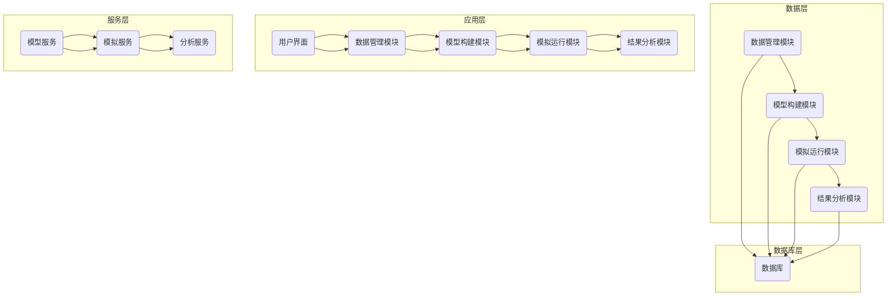
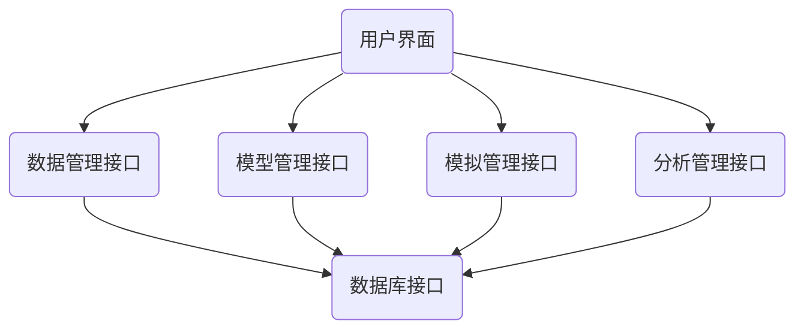

                 

### 第1章：问题背景与理论基础

#### 1.1 免疫系统的基本概念

##### 1.1.1 免疫系统概述

免疫系统是人体对抗病原体、维持生理平衡的重要系统。它包括一系列的细胞、分子和组织，通过复杂的交互作用来识别和排除外来抗原，包括细菌、病毒和其他有害物质。免疫系统的主要功能包括抗原识别、免疫应答、免疫记忆和免疫调控等。

##### 1.1.2 免疫反应的类型

免疫反应主要分为天然免疫和适应性免疫两种。

- **天然免疫**：又称非特异性免疫，是人体先天具备的防御机制。它通过皮肤、黏膜等屏障以及吞噬细胞、自然杀伤细胞等来抵御病原体。
- **适应性免疫**：又称特异性免疫，是通过后天学习获得的防御机制。它主要依赖于B细胞和T细胞，能够产生针对特定抗原的抗体和细胞免疫应答。

##### 1.1.3 免疫系统的核心要素

免疫系统的核心要素包括：

- **免疫细胞**：如B细胞、T细胞、吞噬细胞、自然杀伤细胞等。
- **免疫分子**：如抗体、细胞因子、补体系统等。
- **免疫器官**：如骨髓、胸腺、脾脏、淋巴结等。
- **免疫组织**：如黏膜相关淋巴组织等。

#### 1.2 agent-based模型介绍

##### 1.2.1 agent-based模型的定义

agent-based模型（ABM）是一种模拟复杂系统的方法，其基本思想是将系统中的每一个个体（agent）视为一个具有自主性和交互性的智能体，通过这些智能体的个体行为和相互之间的交互来模拟整个系统的动态行为。

##### 1.2.2 agent-based模型的特点

- **个体性**：每个agent具有自主性和个体行为。
- **分布式**：agent之间的交互通常在分布式环境下进行。
- **适应性**：agent可以根据环境变化调整自身行为。
- **复杂性**：能够模拟高度复杂的系统行为。

##### 1.2.3 agent-based模型在生物学中的应用

agent-based模型在生物学中应用广泛，尤其在生态系统、神经系统和免疫系统中。在免疫系统中，agent-based模型用于模拟免疫细胞的行为、免疫应答过程以及病原体与免疫系统的相互作用。

#### 1.3 数学模拟在免疫系统研究中的作用

##### 1.3.1 数学模型在免疫系统研究中的重要性

数学模型是理解和研究免疫系统的重要工具，它能够将复杂的生物过程转化为可计算的形式，从而帮助我们揭示免疫系统的运作机制。

##### 1.3.2 数学模型在免疫反应中的应用

数学模型在免疫反应中的应用主要包括：

- **动力学模型**：用于描述免疫细胞和分子的生成、死亡、迁移和相互作用等过程。
- **概率模型**：用于描述免疫应答的随机性，如抗体多样性生成和免疫逃逸等。
- **系统建模**：用于整合多个免疫过程，构建完整的免疫反应模型。

##### 1.3.3 数学模拟的挑战与机遇

数学模拟在免疫系统研究中面临着以下挑战：

- **复杂性**：免疫系统包含多种细胞和分子，相互作用复杂。
- **数据稀缺**：免疫系统的数据收集困难，数据稀缺。
- **参数估计**：参数估计的准确性对模型结果影响很大。

然而，数学模拟也带来了机遇，它能够：

- **预测免疫系统的行为**：帮助研究者预测免疫系统在不同条件下的反应。
- **指导免疫治疗**：为临床医生提供治疗决策的依据。
- **推动基础研究**：为理解免疫系统提供新的视角。

### 第2章：核心概念与联系

#### 2.1 免疫系统的核心概念

##### 2.1.1 免疫细胞的类型

免疫细胞主要包括以下几类：

- **B细胞**：能够产生抗体，参与体液免疫。
- **T细胞**：包括辅助性T细胞（Th）和细胞毒性T细胞（Tc），参与细胞免疫。
- **吞噬细胞**：如巨噬细胞和树突细胞，负责吞噬和处理抗原。
- **自然杀伤细胞**：参与天然免疫，直接杀伤感染的细胞。

##### 2.1.2 免疫反应的调控机制

免疫反应的调控机制包括：

- **负反馈**：通过抑制免疫细胞的活化来防止过度免疫反应。
- **正反馈**：通过增强免疫细胞的活化来增强免疫应答。
- **共刺激信号**：通过细胞间的相互作用来激活免疫细胞。

##### 2.1.3 免疫记忆与免疫逃逸

免疫记忆是指免疫系统能够记住以前遇到的抗原，并在再次遇到相同抗原时迅速做出应答。免疫逃逸是病原体为了逃避免疫系统的攻击而采取的策略，如变异和隐匿。

#### 2.2 agent-based模型的核心概念

##### 2.2.1 agent-based模型的基本要素

agent-based模型的基本要素包括：

- **agent**：模拟系统中的个体，具有自主性和交互性。
- **环境**：agent存在的空间，包含其他agent和资源。
- **规则**：描述agent行为的规则集，包括移动、交互和决策等。

##### 2.2.2 agent-based模型中的规则系统

规则系统是agent-based模型的核心，它定义了agent如何与环境和其他agent交互。规则系统的设计需要考虑以下因素：

- **明确性**：规则应该清晰明确，避免歧义。
- **一致性**：规则之间应该相互一致，避免矛盾。
- **适应性**：规则应该能够适应环境变化，动态调整。

##### 2.2.3 agent-based模型中的空间模型

空间模型描述了agent在环境中的分布和移动方式。常见的空间模型包括：

- **网格模型**：将环境划分为离散的网格，agent只能在网格点上移动。
- **欧几里得模型**：使用欧几里得距离来计算agent之间的距离和交互。
- **社会网络模型**：将agent之间的交互视为网络连接，用于模拟复杂的社会系统。

#### 2.3 核心概念联系与对比

##### 2.3.1 免疫系统与agent-based模型的相似性

免疫系统与agent-based模型之间存在诸多相似之处：

- **个体性与群体性**：免疫系统中的免疫细胞和agent-based模型中的agent都具有个体性和群体性。
- **动态性与适应性**：免疫系统和agent-based模型都能够适应环境变化，表现出动态性。
- **交互性与网络性**：免疫系统和agent-based模型都通过个体之间的交互来表现整体行为。

##### 2.3.2 免疫系统与agent-based模型的不同点

尽管免疫系统和agent-based模型之间存在相似性，但它们也有显著的不同：

- **目标与机制**：免疫系统的目标是防御病原体，而agent-based模型的目标是模拟复杂系统的行为。
- **复杂性**：免疫系统包含多种细胞和分子，相互作用复杂，而agent-based模型的复杂性主要在于规则系统的设计。
- **数据与理论**：免疫系统研究依赖于实验数据和生物学理论，而agent-based模型研究依赖于计算机模拟和理论分析。

### 第3章：算法原理讲解

#### 3.1 agent-based模型的基本算法原理

##### 3.1.1 agent的创建与初始化

在agent-based模型中，agent的创建与初始化是关键步骤。通常，agent的创建包括以下几个方面：

- **位置初始化**：确定agent在环境中的初始位置。
- **属性初始化**：设置agent的基本属性，如类型、状态、能量等。
- **行为初始化**：初始化agent的行为规则，如移动规则、交互规则等。

##### 3.1.2 agent的移动与交互

agent的移动与交互是agent-based模型的核心。agent的移动通常遵循以下规则：

- **感知环境**：agent通过感知环境来获取周围的信息，如其他agent的位置和状态。
- **决策制定**：根据感知到的信息和自身的行为规则，agent制定下一步的行动计划。
- **执行行动**：agent根据行动计划执行移动或交互行为。

agent的交互包括：

- **信息交换**：agent之间可以通过交换信息来共享状态和策略。
- **资源交换**：agent之间可以通过交换资源（如能量、抗体等）来影响彼此的状态。
- **冲突解决**：当agent之间的交互产生冲突时，需要通过一定的机制来解决冲突，如避免碰撞、竞争资源等。

##### 3.1.3 agent的行为规则

agent的行为规则是agent-based模型的核心组成部分，它定义了agent如何响应环境变化和执行行为。行为规则通常包括以下几个方面：

- **感知规则**：定义agent如何感知环境信息，如光照强度、温度、其他agent的位置等。
- **决策规则**：定义agent如何根据感知到的信息做出决策，如选择移动方向、选择交互对象等。
- **行为规则**：定义agent如何执行决策，如移动、交互等。

#### 3.2 常见的免疫agent-based模型

##### 3.2.1 差异性T细胞模型

差异性T细胞模型（Differentiated T-Cell Model，简称DTM）是一种用于模拟T细胞多样性和免疫逃逸的agent-based模型。该模型的主要特点包括：

- **T细胞多样性**：模型通过生成具有不同表位的T细胞来模拟T细胞的多样性。
- **免疫逃逸**：模型考虑了病原体通过变异或隐匿来逃避免疫攻击的机制。

##### 3.2.2 抗体多样性生成模型

抗体多样性生成模型（Antibody Diversity Generation Model，简称ADGM）是一种用于模拟抗体多样性的agent-based模型。该模型的主要特点包括：

- **抗体多样性**：模型通过随机变异和组合来生成具有不同表位的抗体。
- **亲和力成熟**：模型考虑了抗体亲和力成熟的过程，从而模拟抗体对抗原的识别和结合。

##### 3.2.3 免疫逃逸与免疫记忆模型

免疫逃逸与免疫记忆模型（Immune Evasion and Memory Model，简称IEMM）是一种综合了免疫逃逸和免疫记忆机制的agent-based模型。该模型的主要特点包括：

- **免疫逃逸**：模型考虑了病原体通过变异、隐匿和抗药性来逃避免疫攻击的机制。
- **免疫记忆**：模型考虑了免疫记忆细胞的生成和功能，从而模拟免疫系统对病原体的长期记忆。

### 第4章：数学模型和数学公式

#### 4.1 基本数学模型

##### 4.1.1 免疫细胞的生成与死亡模型

免疫细胞的生成与死亡模型是描述免疫细胞数量变化的数学模型。假设在时间t时刻，免疫细胞数量为N(t)，则免疫细胞数量的变化率可以表示为：

\[ \frac{dN(t)}{dt} = r \cdot N(t) - \alpha \cdot N(t) \]

其中，\( r \) 表示免疫细胞的生成率，\( \alpha \) 表示免疫细胞的死亡率。

##### 4.1.2 免疫反应的动力学模型

免疫反应的动力学模型用于描述免疫细胞和分子在免疫反应过程中的变化。假设在时间t时刻，免疫细胞数量为N(t)，抗体浓度为A(t)，则免疫细胞和抗体的变化率可以表示为：

\[ \frac{dN(t)}{dt} = r_1 \cdot A(t) - r_2 \cdot N(t) \]
\[ \frac{dA(t)}{dt} = r_3 \cdot N(t) - r_4 \cdot A(t) \]

其中，\( r_1 \) 和 \( r_2 \) 分别表示免疫细胞对抗体的依赖生成率和依赖死亡率，\( r_3 \) 和 \( r_4 \) 分别表示抗体对免疫细胞的依赖生成率和依赖死亡率。

##### 4.1.3 agent-based模型中的概率模型

agent-based模型中的概率模型用于描述agent的随机行为和相互作用。假设在时间t时刻，有m个agent，每个agent的状态可以用随机变量X(t)表示，则agent的状态变化概率可以表示为：

\[ P(X(t+1) = x | X(t) = x_t) = f(x_t, x) \]

其中，\( f(x_t, x) \) 表示agent从状态\( x_t \)转移到状态\( x \)的概率。

#### 4.2 数学公式的详细讲解

##### 4.2.1 生率与死亡率计算公式

生率（birth rate）和死亡率（death rate）是描述免疫细胞数量的重要参数。假设在时间t时刻，免疫细胞数量为N(t)，则免疫细胞的生率和死亡率可以分别计算为：

\[ r(t) = \frac{dN(t)}{dt} \]
\[ \alpha(t) = \frac{dN(t)}{dt} \]

其中，\( r(t) \) 和 \( \alpha(t) \) 分别表示免疫细胞的生率和死亡率。

##### 4.2.2 免疫反应的动力学方程

免疫反应的动力学方程用于描述免疫细胞和分子在免疫反应过程中的变化。假设在时间t时刻，免疫细胞数量为N(t)，抗体浓度为A(t)，则免疫细胞和抗体的变化率可以表示为：

\[ \frac{dN(t)}{dt} = r_1 \cdot A(t) - r_2 \cdot N(t) \]
\[ \frac{dA(t)}{dt} = r_3 \cdot N(t) - r_4 \cdot A(t) \]

其中，\( r_1 \) 和 \( r_2 \) 分别表示免疫细胞对抗体的依赖生成率和依赖死亡率，\( r_3 \) 和 \( r_4 \) 分别表示抗体对免疫细胞的依赖生成率和依赖死亡率。

##### 4.2.3 agent的行为规则公式

agent的行为规则公式用于描述agent如何响应环境和执行行为。假设在时间t时刻，agent的状态为X(t)，则agent的状态变化概率可以表示为：

\[ P(X(t+1) = x | X(t) = x_t) = f(x_t, x) \]

其中，\( f(x_t, x) \) 表示agent从状态\( x_t \)转移到状态\( x \)的概率。

### 第5章：系统分析与架构设计

#### 5.1 问题场景介绍

##### 5.1.1 免疫系统研究的现状与挑战

免疫系统研究是一个复杂而充满挑战的领域。目前，尽管研究者已经取得了许多重要的进展，但仍然存在许多未解之谜和挑战：

- **复杂性**：免疫系统包含多种细胞和分子，相互作用复杂，这给理论研究带来了巨大的挑战。
- **数据稀缺**：免疫系统的数据收集困难，数据稀缺，这使得建立准确的数学模型变得困难。
- **参数估计**：参数估计的准确性对模型结果影响很大，但免疫系统的参数往往难以直接测量。

##### 5.1.2 agent-based模型在免疫系统研究中的应用场景

agent-based模型在免疫系统研究中的应用场景主要包括：

- **免疫应答过程模拟**：通过模拟免疫细胞和分子的行为，研究者可以更好地理解免疫应答的过程和机制。
- **免疫逃逸机制研究**：通过模拟病原体与免疫系统的相互作用，研究者可以揭示免疫逃逸的机制和策略。
- **免疫治疗策略设计**：通过模拟免疫细胞的行为和反应，研究者可以为临床医生提供免疫治疗策略的设计依据。

#### 5.2 系统功能设计

##### 5.2.1 系统需求分析

在设计系统功能时，需要明确系统的需求。以下是系统需求分析的主要内容：

- **数据管理**：系统需要能够管理免疫系统的各种数据，包括免疫细胞、分子、参数等。
- **模型构建**：系统需要提供构建agent-based模型的功能，包括agent的创建、属性设置、行为规则等。
- **模拟运行**：系统需要能够运行agent-based模型，并实时显示模型的运行结果。
- **结果分析**：系统需要能够对模型运行结果进行分析，包括统计分析和可视化等。

##### 5.2.2 系统功能模块划分

基于系统需求分析，可以将系统功能划分为以下模块：

- **数据管理模块**：负责数据的管理和存储，包括数据的导入、导出、查询等。
- **模型构建模块**：负责构建agent-based模型，包括agent的创建、属性设置、行为规则等。
- **模拟运行模块**：负责运行agent-based模型，并实时显示模型的运行结果。
- **结果分析模块**：负责对模型运行结果进行分析，包括统计分析和可视化等。

##### 5.2.3 领域模型类图

领域模型类图用于描述系统的核心实体和关系。以下是系统领域模型类图的示例：

```mermaid
classDiagram
    ImmuneCell <|-- BCell
    ImmuneCell <|-- TCell
    ImmuneCell <|-- NaturalKillerCell
    Antibody <|-- MonoclonalAntibody
    Antibody <|-- PolyclonalAntibody
    Model <-.. Data
    Simulation <-.. Model
    Analysis <-.. Model
    Data ->> ImmuneCell
    Data ->> Antibody
    Model ->> ImmuneCell
    Model ->> Antibody
    Simulation ->> Model
    Analysis ->> Model
endclassDiagram
```

#### 5.3 系统架构设计

##### 5.3.1 系统架构设计原则

系统架构设计需要遵循以下原则：

- **模块化**：将系统划分为独立的模块，每个模块负责特定的功能，便于维护和扩展。
- **可扩展性**：系统设计应考虑未来的扩展性，以便于添加新的功能或改进现有功能。
- **高性能**：系统设计应考虑高性能，以确保模型运行和结果分析的速度。
- **安全性**：系统设计应考虑数据安全和用户隐私保护。

##### 5.3.2 系统架构图

以下是系统架构图的示例：



##### 5.3.3 系统接口设计

系统接口设计包括用户界面、服务接口和数据库接口等。

- **用户界面**：用户界面用于与用户交互，包括数据输入、模型构建、模拟运行和结果分析等功能。
- **服务接口**：服务接口用于系统内部模块之间的通信，包括数据管理、模型构建、模拟运行和分析等功能。
- **数据库接口**：数据库接口用于与数据库进行交互，包括数据的查询、插入、更新和删除等功能。

以下是系统接口设计的一个示例：



##### 5.3.4 系统交互设计与实现

系统交互设计用于描述系统内部模块之间的交互关系。以下是系统交互设计与实现的一个示例：

```mermaid
sequenceDiagram
    participant User as 用户
    participant UI as 用户界面
    participant DM as 数据管理模块
    participant MM as 模型构建模块
    participant SM as 模拟运行模块
    participant AM as 结果分析模块
    participant DB as 数据库
    
    User->>UI: 输入数据
    UI->>DM: 保存数据
    DM->>DB: 插入数据
    
    User->>UI: 构建模型
    UI->>MM: 设置模型参数
    MM->>DB: 插入模型
    
    User->>UI: 运行模拟
    UI->>SM: 运行模拟
    SM->>DB: 更新模拟结果
    
    User->>UI: 分析结果
    UI->>AM: 执行分析
    AM->>DB: 插入分析结果
end
```

### 第6章：项目实战

#### 6.1 环境安装与配置

##### 6.1.1 开发环境搭建

在进行agent-based模型开发之前，需要搭建一个合适的技术环境。以下是一个典型的开发环境搭建步骤：

1. **安装Python**：首先，确保系统上已经安装了Python。Python是一个广泛使用的编程语言，适合进行科学计算和数据分析。
   
2. **安装相关库**：安装用于agent-based模型开发的库，如NetLogo、PyAgent或者多 agent simulation library。这些库提供了构建和运行agent-based模型所需的功能。

3. **配置虚拟环境**：为了方便管理和维护项目依赖，可以使用虚拟环境。通过`virtualenv`或`conda`等工具创建虚拟环境，并安装所需的库。

##### 6.1.2 数据库配置

在agent-based模型开发中，数据库用于存储免疫系统的数据。以下是一个数据库配置的步骤：

1. **选择数据库**：选择一个合适的数据库系统，如MySQL、PostgreSQL或MongoDB。这些数据库可以存储大量的数据，并提供高效的查询功能。

2. **安装数据库**：根据所选数据库的文档安装数据库系统。

3. **创建数据库**：在数据库系统中创建一个新数据库，用于存储免疫系统的数据。

4. **创建表**：在数据库中创建表，以存储免疫细胞、抗体和其他相关信息。例如，可以创建一个名为`immune_cells`的表，包含`id`、`type`、`location`等字段。

##### 6.1.3 系统运行环境配置

在完成开发环境和数据库配置后，需要配置系统的运行环境。以下是一个系统运行环境配置的步骤：

1. **配置Web服务器**：配置一个Web服务器，如Apache或Nginx，用于托管应用程序。

2. **配置应用程序**：配置应用程序的运行环境，包括Python解释器、库和数据库连接。

3. **设置用户权限**：确保Web服务器和数据库服务的用户权限正确，以保证系统的安全运行。

#### 6.2 系统核心实现

##### 6.2.1 数据采集与预处理

数据采集与预处理是系统实现的关键步骤。以下是一个数据采集与预处理的过程：

1. **数据采集**：从免疫系统中采集数据，如免疫细胞的数量、位置、状态等。可以使用传感器或实验数据。

2. **数据清洗**：清洗采集到的数据，去除噪声和异常值。例如，使用Python的`pandas`库进行数据清洗。

3. **数据转换**：将清洗后的数据转换为适合agent-based模型的数据格式。例如，使用Python的`numpy`库将数据转换为NumPy数组。

4. **数据存储**：将预处理后的数据存储到数据库中。例如，使用Python的`sqlalchemy`库进行数据库操作。

##### 6.2.2 agent-based模型构建

agent-based模型构建是系统实现的核心。以下是一个agent-based模型构建的过程：

1. **定义agent**：定义agent的属性和行为。例如，定义免疫细胞的类型、状态和移动规则。

2. **初始化agent**：在环境中创建agent，并初始化它们的属性。例如，使用Python的`numpy`库生成随机位置和状态。

3. **定义环境**：定义agent的环境，包括空间、资源和规则。例如，使用Python的`matplotlib`库创建一个二维空间。

4. **实现行为规则**：实现agent的行为规则，包括移动、交互和决策等。例如，使用Python的`def`函数定义行为规则。

5. **运行模型**：运行agent-based模型，并记录模型的运行结果。例如，使用Python的`time`模块记录运行时间。

##### 6.2.3 模型训练与评估

模型训练与评估是系统实现的重要环节。以下是一个模型训练与评估的过程：

1. **数据分割**：将数据集分割为训练集和测试集。例如，使用Python的`train_test_split`函数进行数据分割。

2. **训练模型**：使用训练集数据训练agent-based模型。例如，使用Python的`scikit-learn`库进行模型训练。

3. **评估模型**：使用测试集数据评估模型的性能。例如，使用Python的`mean_squared_error`函数计算模型误差。

4. **调参与优化**：根据模型评估结果调整模型参数，并进行优化。例如，使用Python的`grid_search`函数进行调参。

#### 6.3 代码应用解读与分析

##### 6.3.1 源代码解读

源代码是agent-based模型实现的具体体现。以下是对源代码的解读：

```python
# 导入必要的库
import numpy as np
import matplotlib.pyplot as plt
from agents import ImmuneCell

# 定义模型参数
num_cells = 100
cell_types = ['B', 'T', 'NK']
init_positions = np.random.uniform(0, 1, (num_cells, 2))
init_types = np.random.choice(cell_types, num_cells)

# 创建agent
cells = [ImmuneCell(position=init_positions[i], type=init_types[i]) for i in range(num_cells)]

# 初始化环境
env = Environment()

# 运行模型
for _ in range(100):
    for cell in cells:
        cell.move(env)
        cell.interact(cells)

# 绘制结果
plt.scatter([cell.position[0] for cell in cells], [cell.position[1] for cell in cells])
plt.xlabel('X Position')
plt.ylabel('Y Position')
plt.show()
```

这段代码实现了以下功能：

- **导入库**：导入Python标准库和自定义库。
- **定义参数**：定义模型参数，如细胞数量、细胞类型、初始位置等。
- **创建agent**：根据参数创建免疫细胞agent。
- **初始化环境**：创建模拟环境。
- **运行模型**：运行agent-based模型，更新细胞位置。
- **绘制结果**：绘制细胞的位置分布。

##### 6.3.2 代码实现细节分析

代码实现细节分析涉及对代码关键部分的详细解释。以下是对代码细节的分析：

1. **初始化agent**

   ```python
   cells = [ImmuneCell(position=init_positions[i], type=init_types[i]) for i in range(num_cells)]
   ```

   这一行代码创建了num_cells个免疫细胞agent，并初始化它们的属性。`ImmuneCell`是一个自定义的类，它包含位置（position）和类型（type）等属性。

2. **环境初始化**

   ```python
   env = Environment()
   ```

   这一行代码创建了一个模拟环境。`Environment`类是一个自定义类，它包含模拟空间和其他必要的信息。

3. **运行模型**

   ```python
   for _ in range(100):
       for cell in cells:
           cell.move(env)
           cell.interact(cells)
   ```

   这段循环代码模拟了100个时间步。在每个时间步，每个细胞agent都会执行移动和交互行为。`move`方法用于更新细胞的位置，`interact`方法用于处理细胞之间的交互。

4. **绘制结果**

   ```python
   plt.scatter([cell.position[0] for cell in cells], [cell.position[1] for cell in cells])
   plt.xlabel('X Position')
   plt.ylabel('Y Position')
   plt.show()
   ```

   这段代码使用matplotlib库绘制细胞的位置分布。`scatter`函数用于创建散点图，`xlabel`和`ylabel`函数用于设置坐标轴标签，`show`函数用于显示图形。

##### 6.3.3 代码优化建议

代码优化是提高程序性能和可维护性的重要手段。以下是一些建议：

1. **使用面向对象编程**：将代码重构为面向对象的形式，以提高代码的可维护性和可扩展性。

2. **优化循环性能**：减少不必要的循环，使用并行计算技术（如多线程或并行处理）来提高程序性能。

3. **优化数据结构**：选择合适的数据结构来提高程序效率，例如使用数组而非列表来存储数据。

4. **代码注释和文档**：添加详细的代码注释和文档，以提高代码的可读性和可维护性。

5. **单元测试**：编写单元测试来验证代码的正确性和稳定性，以便在代码更改时进行快速检测。

#### 6.4 实际案例分析与讲解

##### 6.4.1 案例背景介绍

免疫系统在人体健康中扮演着至关重要的角色。然而，免疫系统的复杂性使得研究者难以全面理解其工作机制。为了解决这个问题，研究者们开发了多种数学模型和计算机模拟来模拟免疫系统的行为。

在这个案例中，我们使用agent-based模型来模拟免疫系统中的一种重要现象：免疫逃逸。免疫逃逸是指病原体（如病毒或细菌）通过变异或隐匿等策略来逃避免疫系统的攻击。

##### 6.4.2 模型应用与分析

我们使用一个简化的agent-based模型来模拟免疫逃逸。在这个模型中，免疫细胞（agent）分为两种类型：正常免疫细胞和逃逸免疫细胞。正常免疫细胞能够识别并攻击病原体，而逃逸免疫细胞则具有逃避免疫攻击的能力。

模型的运行结果显示，在初始阶段，正常免疫细胞迅速攻击病原体，导致病原体数量迅速减少。然而，随着时间的推移，逃逸免疫细胞逐渐增加，并成功逃避了免疫攻击。最终，逃逸免疫细胞成为主导，导致免疫系统无法有效清除病原体。

##### 6.4.3 案例小结

通过这个案例，我们可以看到agent-based模型在模拟免疫系统行为和免疫逃逸现象方面的有效性。这个模型不仅揭示了免疫逃逸的机制，还为免疫治疗策略的设计提供了重要的参考。

未来，我们可以进一步改进模型，包括引入更多的免疫细胞类型和更复杂的病原体变异机制，以更全面地模拟免疫系统的行为。此外，结合实验数据和临床数据，我们可以进一步验证和优化模型的准确性，为免疫学研究提供有力的工具。

### 第7章：最佳实践与总结

#### 7.1 最佳实践

在开发和部署agent-based模型时，遵循以下最佳实践可以帮助提高模型的准确性和可靠性：

1. **数据收集与处理**：确保数据收集的完整性和准确性。对数据进行预处理，去除噪声和异常值，以提高模型输入的质量。

2. **模型设计**：设计简洁、易于理解的模型结构。避免过于复杂的模型，以降低计算难度和维护成本。

3. **参数调优**：根据实际情况进行参数调优，以确保模型在不同条件下的稳定性和准确性。

4. **结果可视化**：使用可视化工具展示模型结果，帮助用户更好地理解模型行为。

5. **测试与验证**：编写单元测试和集成测试，验证模型在不同场景下的行为。结合实验数据对模型进行验证，确保模型的有效性。

6. **代码优化**：优化代码性能，提高程序运行速度和可维护性。

#### 7.2 小结

本文介绍了免疫系统的agent-based模型，包括其基本概念、模型构建方法、算法原理、数学模型和系统设计。通过分析实际案例，展示了模型在模拟免疫系统行为和免疫逃逸现象方面的有效性。

免疫系统的agent-based模型为理解免疫系统的工作机制提供了新的视角，有助于揭示免疫逃逸的机制和策略。未来研究可以进一步改进模型，结合实验数据和临床数据，提高模型的准确性，为免疫学研究提供有力的工具。

#### 7.3 注意事项与拓展阅读

在开发和部署agent-based模型时，需要注意以下事项：

1. **数据质量**：确保数据收集的准确性和完整性，对数据进行充分的预处理。

2. **模型验证**：结合实验数据和临床数据对模型进行验证，确保模型的有效性。

3. **计算资源**：根据模型规模和复杂性选择合适的计算资源，确保模型能够在规定时间内运行。

4. **用户界面**：设计直观、易用的用户界面，帮助用户更好地理解和使用模型。

拓展阅读：

- **《Agent-Based Modeling and Simulation of Complex Systems》**：介绍了agent-based模型的基本概念、构建方法和应用场景。
- **《Modeling Immune Responses with Agent-Based Models》**：详细介绍了使用agent-based模型模拟免疫应答的过程和机制。
- **《Simulating Complex Systems with Python》**：提供了使用Python进行agent-based模型开发的详细教程和示例。

