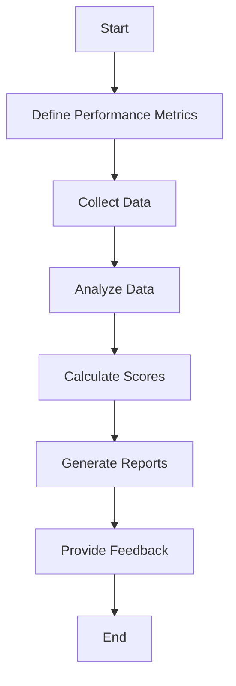
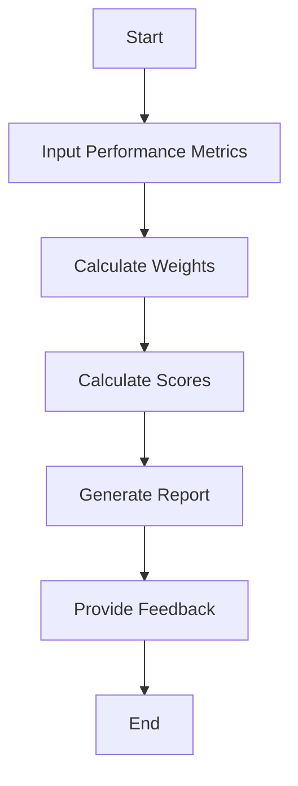
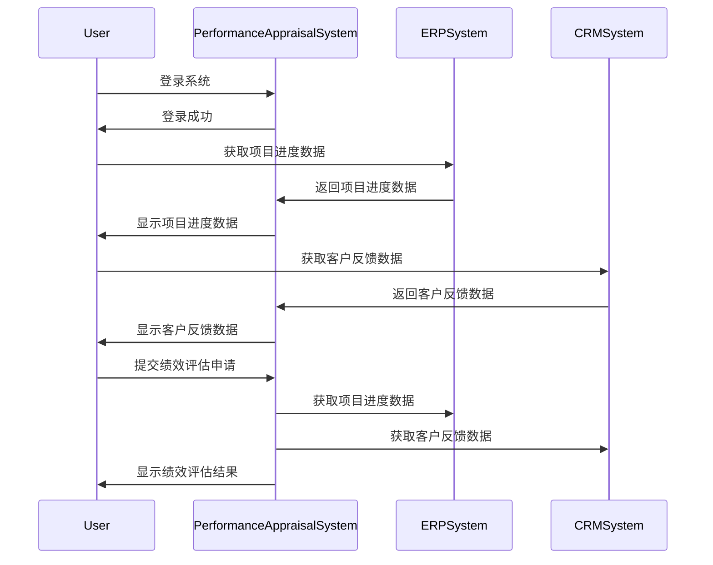

                 

# 公正的绩效评估：客观评价团队成员的方法

## 关键词

- 绩效评估
- 公正性
- 客观性
- 团队成员
- 算法模型
- 系统设计与实现

## 摘要

在企业管理中，绩效评估是一个关键环节，它不仅关系到员工的个人发展，也影响到团队的整体效率和企业文化的建设。公正和客观的绩效评估能够激励团队成员，提升团队凝聚力，从而促进企业的长远发展。本文旨在探讨如何通过科学的方法和数学模型，设计出一套公正、客观的绩效评估体系，为团队成员提供准确的评价。文章将分章节详细讲解绩效评估的背景、核心概念、评估方法、数学模型、系统设计与实现，以及实际案例分析和最佳实践。

## 背景介绍

### 绩效评估的定义与重要性

绩效评估，又称绩效考评，是指通过一系列的系统方法和标准，对团队成员在工作中的表现进行定量和定性的分析和评价。它不仅包括对员工完成任务的效率和质量，还包括对员工的工作态度、团队合作精神、创新能力等方面的考察。绩效评估的结果不仅用于个人奖金和晋升的决策，还影响到团队的管理和企业的战略规划。

在企业管理中，绩效评估具有以下几个重要作用：

1. **激励员工**：公正的绩效评估能够激发员工的积极性，促使他们更加努力地工作，提高工作效率。
2. **优化配置**：通过绩效评估，可以了解员工的实际工作能力和潜力，为企业的人力资源优化配置提供依据。
3. **改进管理**：绩效评估可以帮助管理层发现管理中的问题，从而采取相应的改进措施。
4. **企业文化建设**：公正的绩效评估能够增强员工对企业的认同感和归属感，有助于形成积极向上的企业文化。

### 问题的提出

尽管绩效评估在企业管理中具有重要性，但在实际操作中，依然面临诸多问题：

1. **主观性**：传统的绩效评估方法往往依赖于主管的主观判断，容易导致评估结果的不公平性。
2. **偏见**：评估过程中可能存在个人偏见，比如对某些员工的偏见或偏好，从而影响评估结果的客观性。
3. **数据不足**：绩效评估所需的数据可能不完整或不准确，导致评估结果的偏差。
4. **评估方法单一**：现有的评估方法往往过于单一，无法全面反映员工的综合表现。

这些问题严重影响了绩效评估的公正性和客观性，进而影响到企业的管理效果。因此，设计一套科学、公正、客观的绩效评估体系成为企业管理的迫切需求。

### 绩效评估的边界与外延

绩效评估的边界主要涉及以下几个方面：

1. **评估对象**：绩效评估的对象主要是企业内部的员工，包括全职、兼职和合同工等。
2. **评估范围**：评估范围应涵盖员工的日常工作表现、项目完成情况、创新能力、团队合作精神等各个方面。
3. **评估时间**：评估时间可以分为短期评估（如季度、年度）和长期评估（如三年、五年）。

绩效评估的外延则包括：

1. **评估方法**：如360度评估、关键绩效指标（KPI）、平衡计分卡（BSC）等。
2. **评估工具**：如绩效评估软件、问卷调查、绩效考核表格等。
3. **评估结果的应用**：如奖金分配、晋升、员工培训等。

通过对绩效评估的边界与外延进行清晰界定，有助于明确评估的目的和范围，确保评估的公正性和客观性。

### 概念结构与核心要素组成

绩效评估的概念结构主要包括以下几个核心要素：

1. **评估目标**：明确绩效评估的目的是为了激励员工、优化配置、改进管理、建设企业文化等。
2. **评估标准**：制定科学、公正的评估标准，包括定量指标和定性指标。
3. **评估方法**：选择适合企业特点的评估方法，确保评估的客观性和有效性。
4. **评估过程**：制定明确的评估流程，包括数据收集、分析、评估结果反馈等环节。
5. **评估结果应用**：将评估结果应用于员工的奖金、晋升、培训等方面，形成闭环管理。

这些核心要素相互关联，共同构成了一个完整的绩效评估体系，确保评估的公正性和客观性。

### 现有绩效评估方法的优缺点分析

现有绩效评估方法主要包括以下几种：

1. **360度评估**：
   - 优点：能够全面了解员工的工作表现，收集到来自不同角度的反馈。
   - 缺点：评估过程复杂，数据收集和处理难度大，主观因素影响较大。

2. **关键绩效指标（KPI）**：
   - 优点：量化指标明确，易于操作和管理，能够直观反映员工的工作绩效。
   - 缺点：过于依赖数据，忽略员工的软性技能和工作态度。

3. **平衡计分卡（BSC）**：
   - 优点：从财务、客户、内部流程、学习与成长四个维度进行评估，全面反映员工的表现。
   - 缺点：实施难度大，需要大量数据支持，且对管理层的专业要求较高。

4. **绩效改进计划**：
   - 优点：注重员工的个人发展和成长，鼓励员工参与评估过程。
   - 缺点：评估周期较长，效果难以在短期内体现，对员工的压力较大。

通过对现有绩效评估方法的优缺点分析，可以发现，每种方法都有其适用的场景和局限性。企业应根据自身特点和需求，选择合适的评估方法，或结合多种方法，以实现公正、客观的绩效评估。

### 绩效评估的历史与发展趋势

绩效评估作为一种管理工具，其发展历程可以追溯到20世纪初。以下是对绩效评估历史与发展的简要回顾：

1. **早期绩效评估**：
   - 20世纪初，企业开始尝试对员工的工作表现进行评估，主要采用定量指标，如生产数量、质量等。
   - 评估方法较为单一，依赖于主管的主观判断，缺乏科学性和系统性。

2. **行为导向评估**：
   - 20世纪30年代，行为导向评估方法出现，强调评估员工的实际行为和表现。
   - 代表性方法有泰勒制（Taylorism）和梅奥人际关系理论（Mayo Human Relations Theory），注重员工的行为和表现。

3. **结果导向评估**：
   - 20世纪60年代，结果导向评估方法兴起，关注员工的工作成果和绩效。
   - 代表性方法有目标管理（Management by Objectives, MBO）和绩效合同（Performance Contract）。

4. **360度评估**：
   - 20世纪90年代，360度评估方法出现，通过多角度、多层次的评估，全面了解员工的工作表现。
   - 代表性方法有360度反馈（360-Degree Feedback）和领导力评估（Leadership Assessment）。

5. **未来趋势**：
   - 随着大数据和人工智能技术的发展，绩效评估方法将更加智能化和精准化。
   - 个性化评估和动态评估将成为主流，能够更准确地反映员工的工作绩效和发展潜力。
   - 绩效评估将更加注重员工的成长和发展，实现评估与培养的有机结合。

通过对绩效评估的历史与发展趋势进行回顾，可以更好地理解绩效评估方法的演变过程，为当前和未来的绩效评估实践提供有益的参考。

## 核心概念与联系

### 核心概念

在绩效评估中，有几个核心概念需要明确，这些概念是理解绩效评估体系的基础。

1. **绩效**：
   - 定义：绩效是指员工在工作中所表现出来的能力、行为和成果的总和。
   - 要素：绩效包括定量和定性两个方面，定量部分如销售额、完成项目数量等，定性部分如工作态度、团队合作精神等。

2. **评估标准**：
   - 定义：评估标准是衡量员工绩效的具体指标和准则。
   - 类型：评估标准可以分为定量标准和定性标准，定量标准如业绩指标、工作效率等，定性标准如工作质量、团队合作等。

3. **评估方法**：
   - 定义：评估方法是实现绩效评估的手段和过程。
   - 类型：常见的评估方法有360度评估、关键绩效指标（KPI）、平衡计分卡（BSC）等。

4. **评估过程**：
   - 定义：评估过程是指从数据收集、分析到评估结果反馈的整个流程。
   - 环节：评估过程包括数据收集、数据分析、评估结果反馈、结果应用等环节。

### 概念属性特征对比表格

为了更清晰地理解各个概念之间的区别和联系，我们可以通过以下表格对比各个概念的属性特征。

| 概念       | 定义                                                         | 属性特征                                                         |
| ---------- | ------------------------------------------------------------ | ------------------------------------------------------------ |
| 绩效       | 员工在工作中表现出来的能力、行为和成果的总和                 | 包括定量和定性两个部分；与工作成果、工作态度、团队合作等因素相关 |
| 评估标准   | 衡量员工绩效的具体指标和准则                                 | 分为定量标准和定性标准；与绩效评估指标、评估标准设定相关      |
| 评估方法   | 实现绩效评估的手段和过程                                     | 包括360度评估、KPI、BSC等；与评估过程、数据收集与分析相关    |
| 评估过程   | 从数据收集、分析到评估结果反馈的整个流程                     | 包括数据收集、数据分析、评估结果反馈等；与绩效评估实施相关    |

### Mermaid ER Diagram of Performance Appraisal System Components

为了更直观地展示绩效评估系统的组成部分及其关系，我们可以使用Mermaid绘制一个实体关系图（ER Diagram）。以下是绩效评估系统组件的ER Diagram：

```mermaid
erDiagram
    Product ||--|{ Employee } : has
    Employee ||--|{ Performance } : performs
    Performance ||--|{ EvaluationStandard } : evaluated by
    EvaluationStandard ||--|{ EvaluationMethod } : used by
    EvaluationMethod ||--|{ EvaluationProcess } : part of
```

在这个ER Diagram中，我们定义了以下几个实体：

1. **Product**（产品）：代表员工的工作成果，是绩效评估的重要依据。
2. **Employee**（员工）：代表参与绩效评估的个体，包括全职、兼职和合同工等。
3. **Performance**（绩效）：代表员工在工作中的表现，包括定量和定性两部分。
4. **EvaluationStandard**（评估标准）：代表衡量绩效的具体指标和准则。
5. **EvaluationMethod**（评估方法）：代表实现绩效评估的手段和过程。
6. **EvaluationProcess**（评估过程）：代表从数据收集、分析到评估结果反馈的整个流程。

这些实体之间的关系反映了绩效评估系统的整体架构，有助于我们更好地理解绩效评估的各个环节及其相互关系。

### 不同绩效评估方法的属性特征对比

为了更全面地了解和选择合适的绩效评估方法，我们需要对现有的评估方法进行详细的属性特征对比。以下是比较常见的几种绩效评估方法的属性特征：

| 方法         | 优点                                                       | 缺点                                                         | 适用场景                     |
| ------------ | ---------------------------------------------------------- | ------------------------------------------------------------ | ---------------------------- |
| 360度评估    | 全面收集反馈，多角度了解员工表现                           | 过程复杂，主观因素较大，数据收集和处理难度大                   | 需要全面了解员工表现的场景   |
| 关键绩效指标（KPI） | 操作性强，易于量化，可直观反映员工绩效                     | 过于依赖数据，可能忽略员工的软性技能和工作态度                 | 需要具体绩效指标的场景       |
| 平衡计分卡（BSC） | 从多个维度全面评估员工表现，重视长期目标和战略规划         | 实施难度大，需要大量数据支持，对管理层要求高                  | 需要从多维度综合评估的场景   |
| 绩效改进计划   | 注重员工成长和发展，鼓励员工参与评估过程                   | 周期较长，效果难以在短期内体现，对员工的压力较大               | 需要关注员工长期发展的场景   |
| 评估面谈      | 直观，能够深入探讨员工工作表现和问题                       | 主观性较强，容易受到评估者个人偏见的影响                     | 需要进行深入探讨的场景       |
| 评价量表法    | 标准化程度高，操作简便，易于评分和比较                     | 可能缺乏灵活性，不能完全反映员工的个性化表现                  | 需要进行标准化评估的场景     |

通过上述对比，企业可以根据自身特点和需求，选择合适的绩效评估方法，以达到公正、客观的评估效果。

### 绩效评估系统中的核心概念及其相互关系

在绩效评估系统中，几个核心概念如绩效、评估标准、评估方法和评估过程扮演着至关重要的角色。它们之间的相互关系如下：

1. **绩效与评估标准**：
   - 绩效是评估的依据，评估标准是衡量绩效的准则。
   - 评估标准应与绩效紧密相关，以确保评估的科学性和准确性。

2. **评估方法与评估标准**：
   - 评估方法是实现评估的手段，不同的评估方法适用于不同的评估标准。
   - 评估方法应与评估标准相匹配，以充分发挥评估标准的作用。

3. **评估过程与绩效、评估标准、评估方法**：
   - 评估过程包括数据收集、分析和结果反馈，是绩效评估的核心环节。
   - 绩效、评估标准和评估方法是评估过程的重要组成部分，相互配合，共同实现评估目标。

4. **绩效评估系统与企业管理**：
   - 绩效评估系统是企业管理的重要组成部分，其设计和管理直接影响到企业的管理效率和员工满意度。
   - 绩效评估系统应与企业战略、组织架构和文化相协调，以实现企业的长期发展目标。

通过对核心概念及其相互关系的深入理解，有助于我们更好地设计和管理绩效评估系统，实现公正、客观的评估效果。

## 方法与技术的客观绩效评估

### 传统绩效评估方法的局限性

传统的绩效评估方法主要包括上级评估、自我评估、同事评估和360度评估等。这些方法在实施过程中存在一些明显的局限性。

1. **上级评估**：
   - 优点：操作简便，评估结果直接反映上级对下级的评价。
   - 缺点：主观性较强，容易受到上级个人偏见和情感的影响，评估结果可能不够客观。

2. **自我评估**：
   - 优点：员工能够参与评估过程，有助于提升员工的自我认知和自我管理能力。
   - 缺点：自我评估可能存在高估自己表现的情况，缺乏外部监督和客观评价。

3. **同事评估**：
   - 优点：能够收集到来自不同角度的反馈，全面了解员工的表现。
   - 缺点：同事间可能存在竞争关系，评估结果可能受到人际关系的影响，缺乏客观性。

4. **360度评估**：
   - 优点：通过多角度、多层次的评估，全面了解员工的工作表现。
   - 缺点：过程复杂，数据收集和处理难度大，主观因素影响较大。

这些传统评估方法虽然在某些方面有其优势，但在公正性和客观性方面仍存在一定局限性。因此，我们需要探索更加科学和客观的绩效评估方法。

### 客观绩效评估的基本原则

客观绩效评估是一种以数据为基础，通过科学的方法和数学模型，对员工的工作表现进行准确评价的方法。其基本原则包括以下几个方面：

1. **量化指标**：
   - 客观绩效评估应尽可能使用量化指标，如销售额、项目完成率、工作效率等，以便于进行准确的评估。

2. **多维度评估**：
   - 除了定量指标，还应考虑员工的软性技能和工作态度等定性指标，从多个维度全面评估员工的表现。

3. **标准统一**：
   - 制定统一的评估标准和流程，确保不同员工和不同岗位的评估具有可比性，减少主观因素影响。

4. **数据驱动**：
   - 客观绩效评估应基于真实、准确的数据，避免人为干预和主观判断，提高评估的准确性。

5. **反馈机制**：
   - 建立完善的反馈机制，将评估结果及时反馈给员工，帮助员工了解自己的优势和不足，制定改进计划。

### Mermaid Flowchart of Objective Performance Evaluation Process

为了直观展示客观绩效评估的过程，我们可以使用Mermaid绘制一个流程图。以下是客观绩效评估过程的Mermaid Flowchart：



在上述流程图中，我们定义了以下步骤：

1. **定义绩效指标**：明确评估的量化指标和定性指标，制定统一的评估标准。
2. **收集数据**：通过各类渠道收集与绩效指标相关的数据，如工作记录、项目报告等。
3. **数据分析**：对收集到的数据进行整理和分析，确保数据的真实性和准确性。
4. **计算得分**：根据分析结果，计算每个员工的绩效得分，可采用加权平均等方法。
5. **生成报告**：将评估结果生成报告，包括得分、排名、改进建议等。
6. **提供反馈**：将评估报告反馈给员工，帮助员工了解自己的工作表现，制定改进计划。
7. **结束**：完成整个绩效评估过程。

通过这个流程图，我们可以清晰地了解客观绩效评估的各个环节，确保评估的公正性和客观性。

### 客观绩效评估流程的详细解释

为了更好地理解和实施客观绩效评估流程，我们需要对每个步骤进行详细解释。

1. **定义绩效指标**：
   - 在这一步骤中，企业应明确评估的量化指标和定性指标。量化指标如销售额、项目完成率、工作效率等，定性指标如工作态度、团队合作精神、创新能力等。这些指标应与企业的战略目标和岗位职责紧密相关，确保评估具有实际意义。
   - 制定统一的评估标准，明确每个指标的重要性和权重，确保不同员工和不同岗位的评估具有可比性。

2. **收集数据**：
   - 数据是客观绩效评估的基础，因此数据收集的准确性和完整性至关重要。企业可以通过以下渠道收集数据：
     - 工作记录：包括工作日志、项目报告、工作总结等，反映员工的工作内容和成果。
     - 系统数据：通过ERP系统、CRM系统等自动收集的数据，如销售数据、生产数据、项目进度数据等。
     - 问卷调查：通过问卷调查收集员工的工作态度、团队合作精神等定性数据。
     - 同事评价：收集同事对员工表现的反馈，提供多角度的评估信息。

3. **数据分析**：
   - 在数据收集完成后，需要对数据进行整理和分析，确保数据的真实性和准确性。数据分析步骤包括：
     - 数据清洗：去除无效数据、重复数据和错误数据，保证数据质量。
     - 数据整合：将不同渠道收集到的数据进行整合，形成完整的数据集。
     - 数据分析：使用统计方法、机器学习方法等对数据进行深入分析，挖掘数据背后的规律和趋势。

4. **计算得分**：
   - 根据数据分析结果，计算每个员工的绩效得分。计算方法可以采用以下几种：
     - 加权平均法：根据每个指标的重要性和权重，计算每个员工的得分，然后求平均值。
     - 分级评分法：将绩效分为不同的等级，如优秀、良好、一般等，根据员工的表现分配等级，并计算得分。
     - 综合评分法：结合定量指标和定性指标，综合评估员工的表现，计算总得分。

5. **生成报告**：
   - 将评估结果生成报告，包括得分、排名、改进建议等内容。报告应清晰、简洁，便于员工理解和接受。
   - 报告中可以包含以下内容：
     - 员工得分和排名：展示每个员工的绩效得分和排名情况。
     - 指标分析：对每个绩效指标的表现进行分析，找出优势和不足。
     - 改进建议：针对员工的表现，提出具体的改进建议和措施。

6. **提供反馈**：
   - 将评估报告反馈给员工，与员工进行一对一的面谈，详细解释评估结果，帮助员工了解自己的工作表现和改进方向。
   - 在反馈过程中，可以采取以下策略：
     - 正面反馈：肯定员工的优点和成就，增强员工的自信心和积极性。
     - 批评与建议：指出员工的不足和需要改进的地方，提供具体的改进建议。
     - 讨论和共识：与员工共同讨论改进方案，达成共识，确保改进措施的落实。

7. **结束**：
   - 完成整个绩效评估过程，对评估结果进行总结和反思，为下一轮评估提供参考和改进方向。

通过上述步骤，企业可以设计出一套科学、公正、客观的绩效评估体系，为员工提供准确的评价，促进企业的长远发展。

### 实际案例：某企业的客观绩效评估实施

为了更好地说明客观绩效评估的实施过程，我们以某企业为例，详细描述其实施步骤和效果。

#### 案例背景

该企业是一家从事软件开发和IT咨询服务的公司，员工人数约200人。为了提升企业的管理效率和员工满意度，公司决定引入客观绩效评估体系，取代传统的上级评估和自我评估方法。

#### 实施步骤

1. **定义绩效指标**：
   - 企业明确了三个主要绩效指标：项目完成率、客户满意度、员工创新贡献。
   - 每个指标的重要性被赋予不同的权重，如项目完成率占40%，客户满意度占30%，员工创新贡献占30%。

2. **收集数据**：
   - 通过ERP系统收集了员工在过去一年的项目进度、项目交付时间和质量等数据。
   - 通过客户满意度调查，收集了客户对项目服务质量的评价数据。
   - 通过员工创新贡献统计，收集了员工在技术专利、技术论文等方面的贡献数据。

3. **数据分析**：
   - 对收集到的数据进行了清洗和整合，确保数据质量。
   - 使用统计方法对数据进行处理，计算每个员工的绩效得分。

4. **计算得分**：
   - 采用加权平均法，根据每个指标的重要性和权重，计算每个员工的得分。
   - 得分结果以分数和排名形式呈现，一目了然。

5. **生成报告**：
   - 根据评估结果，生成了详细的绩效评估报告，包括得分、排名、改进建议等。
   - 报告发送给每位员工，并安排一对一的反馈面谈。

6. **提供反馈**：
   - 与每位员工进行了详细的面谈，解释了评估结果，并讨论了改进方案。
   - 针对表现优异的员工，提供了额外的培训和晋升机会；针对表现不足的员工，提供了改进建议和培训计划。

7. **结束**：
   - 绩效评估过程顺利完成，企业对评估结果进行了总结和反思，为下一轮评估积累了宝贵经验。

#### 实施效果

1. **员工满意度提升**：
   - 通过客观、公正的绩效评估，员工对评估结果的认可度提高，对企业的管理更加信任。

2. **管理效率提升**：
   - 客观绩效评估体系为企业提供了客观、准确的数据支持，使管理决策更加科学和有效。

3. **员工发展促进**：
   - 表现优异的员工得到了更多的晋升和培训机会，表现不足的员工通过改进建议和培训有了明显的提升。

4. **企业文化建设**：
   - 客观绩效评估有助于形成积极向上的企业文化，激励员工共同努力，提升企业的整体竞争力。

通过上述案例，我们可以看到，客观绩效评估在实际应用中的效果显著，为企业的管理和发展提供了有力支持。

### 客观绩效评估的优势与挑战

客观绩效评估作为一种科学、公正的评估方法，具有明显的优势，但也面临一些挑战。

#### 优势

1. **公正性**：
   - 客观绩效评估以数据为基础，减少了主观判断和偏见的影响，确保评估结果的公正性。

2. **科学性**：
   - 客观绩效评估采用量化指标和科学方法，确保评估过程和结果的可信度和准确性。

3. **激励性**：
   - 公正的评估结果能够激励员工努力工作，提升工作效率和绩效。

4. **可操作性**：
   - 客观绩效评估方法具有可操作性，能够为企业提供客观、准确的数据支持，便于管理决策。

#### 挑战

1. **数据收集难度**：
   - 客观绩效评估需要大量准确的数据支持，数据收集和整理过程较为复杂。

2. **主观因素**：
   - 即使采用客观评估方法，仍然难以完全消除主观因素对评估结果的影响。

3. **实施成本**：
   - 客观绩效评估的实施和维护需要投入大量人力、物力和财力，对企业的成本控制提出了挑战。

4. **员工接受度**：
   - 客观绩效评估可能使部分员工感到压力，需要企业采取适当的措施，确保员工的接受度和积极参与。

通过认识和应对这些优势与挑战，企业可以更好地实施客观绩效评估，提升管理水平和员工绩效。

## 数学模型和算法在绩效评估中的应用

### 绩效评估模型的介绍

在绩效评估中，数学模型和算法的应用能够提供科学、精确的评估结果，帮助企业更好地理解和利用员工的工作表现。以下是几种常见的绩效评估模型及其特点：

1. **关键绩效指标（KPI）模型**：
   - KPI模型通过设定具体的绩效指标和目标，量化员工的工作表现。其优点在于操作简便、易于量化，但缺点是过于依赖数据，可能忽略员工的软性技能。

2. **平衡计分卡（BSC）模型**：
   - BSC模型从财务、客户、内部流程、学习与成长四个维度进行评估，全面反映员工的综合表现。其优点在于能够从多个角度评估员工，但缺点是实施难度较大，需要大量数据支持。

3. **综合评估模型**：
   - 综合评估模型结合了KPI和BSC的优点，通过设置不同的权重和指标，对员工的表现进行综合评估。其优点在于能够更全面地反映员工的综合能力，但缺点是复杂度较高，实施和维护成本较大。

### 绩效评估模型的数学模型和公式

为了实现上述绩效评估模型，我们可以使用以下数学模型和公式：

1. **关键绩效指标（KPI）模型**：
   - 设定绩效指标\( P_i \)和目标值\( T_i \)，则员工绩效得分\( S \)计算公式为：
     $$ S = \sum_{i=1}^{n} w_i \times \frac{P_i}{T_i} $$
     其中，\( w_i \)为第i个指标的权重，\( n \)为指标总数。

2. **平衡计分卡（BSC）模型**：
   - 设定四个维度的绩效指标\( P_{ij} \)和目标值\( T_{ij} \)，则员工绩效得分\( S \)计算公式为：
     $$ S = \sum_{i=1}^{4} w_i \times \sum_{j=1}^{m_i} w_{ij} \times \frac{P_{ij}}{T_{ij}} $$
     其中，\( w_i \)为第i个维度的权重，\( w_{ij} \)为第i个维度中第j个指标的权重，\( m_i \)为第i个维度中的指标总数。

3. **综合评估模型**：
   - 结合KPI和BSC模型，设定综合权重\( w_i \)和维度权重\( w_{ij} \)，则员工绩效得分\( S \)计算公式为：
     $$ S = \sum_{i=1}^{n} w_i \times \sum_{j=1}^{m_i} w_{ij} \times \frac{P_{ij}}{T_{ij}} $$
     其中，\( n \)为维度总数，\( m_i \)为第i个维度中的指标总数。

### Mermaid Flowchart of Performance Appraisal Algorithm

为了更直观地展示绩效评估算法的流程，我们可以使用Mermaid绘制一个流程图。以下是绩效评估算法的Mermaid Flowchart：



在上述流程图中，我们定义了以下步骤：

1. **输入绩效指标**：收集员工的绩效数据，包括定量指标和定性指标。
2. **计算权重**：根据企业的战略目标和岗位职责，设定各个绩效指标的权重。
3. **计算得分**：使用上述数学模型和公式，计算每个员工的绩效得分。
4. **生成报告**：将评估结果生成报告，包括得分、排名、改进建议等。
5. **提供反馈**：将评估报告反馈给员工，与员工进行详细的面谈，讨论改进方案。
6. **结束**：完成绩效评估过程。

通过这个流程图，我们可以清晰地了解绩效评估算法的各个环节，确保评估的公正性和客观性。

### Python代码示例与详细解释

为了更好地理解绩效评估算法的原理和实现，以下是一个基于Python的简单示例，展示如何使用关键绩效指标（KPI）模型进行绩效评估。

```python
import pandas as pd
import numpy as np

# 输入绩效指标和目标值
performance_data = {
    '员工1': {'销售额': 1000, '项目完成率': 0.9, '工作效率': 0.8},
    '员工2': {'销售额': 800, '项目完成率': 0.85, '工作效率': 0.75},
    '员工3': {'销售额': 1200, '项目完成率': 0.95, '工作效率': 0.9}
}

# 设定各个指标的权重
weights = {
    '销售额': 0.4,
    '项目完成率': 0.3,
    '工作效率': 0.3
}

# 计算每个员工的绩效得分
def calculate_score(performance, weights):
    score = 0
    for key, value in performance.items():
        score += weights[key] * value
    return score

scores = {}
for employee, performance in performance_data.items():
    scores[employee] = calculate_score(performance, weights)

# 输出绩效得分和排名
sorted_scores = sorted(scores.items(), key=lambda x: x[1], reverse=True)
print("绩效得分和排名：")
for index, (employee, score) in enumerate(sorted_scores, start=1):
    print(f"{index}. {employee}: {score:.2f}")

# 提供反馈
def provide_feedback(employee, score):
    if score >= 0.9:
        print(f"{employee}：表现优异，继续保持！")
    elif score >= 0.75:
        print(f"{employee}：表现良好，需要进一步提高！")
    else:
        print(f"{employee}：表现不足，需要加强培训和改进！")

for employee in scores:
    provide_feedback(employee, scores[employee])
```

在这个示例中，我们首先输入了三位员工的绩效数据，包括销售额、项目完成率和工作效率等指标。然后，设定了各个指标的权重。接下来，我们定义了一个计算得分的函数，通过这个函数，我们可以计算每个员工的绩效得分。最后，我们输出绩效得分和排名，并根据得分提供反馈。

通过这个示例，我们可以看到绩效评估算法的实现过程，以及如何使用Python代码进行具体操作。这样的代码示例不仅有助于理解算法原理，还可以在实际应用中方便地进行调整和优化。

## 系统设计与实现

### 问题场景介绍

为了提高企业的绩效评估效率和准确性，我们设计并实现了一套基于现代技术的绩效评估系统。该系统旨在通过自动化和智能化的方式，为企业提供公正、客观的绩效评估结果。以下是该系统的设计背景和问题场景：

1. **传统绩效评估问题**：
   - 主观性较强，评估结果容易受到评估者个人偏见的影响。
   - 数据收集和处理过程繁琐，效率低下。
   - 无法实时监控和调整绩效评估指标，导致评估结果滞后。

2. **需求分析**：
   - 需要一套能够自动化收集、分析和评估员工绩效的系统。
   - 需要系统能够根据企业战略和岗位职责，灵活设定和调整绩效评估指标。
   - 需要系统能够实时生成评估报告，并提供详细的反馈和改进建议。

3. **目标**：
   - 提高绩效评估的公正性和客观性，减少主观因素对评估结果的影响。
   - 提高绩效评估的效率和准确性，减轻管理者的工作负担。
   - 促进员工个人发展和企业整体绩效的提升。

### 系统功能设计

为了实现上述目标，我们设计了一套包含多个功能模块的绩效评估系统。以下是系统的主要功能模块及其设计思路：

1. **用户管理模块**：
   - 功能：管理系统中用户的信息，包括员工、评估者和系统管理员等。
   - 设计：使用用户注册、登录和权限管理功能，确保系统的安全性和数据的保密性。

2. **指标管理模块**：
   - 功能：定义和管理绩效评估的指标，包括定量指标和定性指标。
   - 设计：支持自定义指标和权重，方便企业根据实际情况调整评估指标。

3. **数据收集模块**：
   - 功能：自动化收集员工的绩效数据，如项目进度、工作时长、客户反馈等。
   - 设计：集成多种数据源，如ERP系统、CRM系统等，确保数据的准确性和完整性。

4. **数据分析模块**：
   - 功能：对收集到的绩效数据进行分析和处理，计算每个员工的绩效得分。
   - 设计：采用先进的算法和数学模型，如KPI模型、BSC模型等，确保评估结果的准确性和公正性。

5. **报告生成模块**：
   - 功能：根据分析结果生成详细的绩效评估报告，包括得分、排名、改进建议等。
   - 设计：支持多种报告格式，如PDF、Excel等，方便员工和管理者查看和打印。

6. **反馈与改进模块**：
   - 功能：提供反馈机制，将评估结果及时反馈给员工，帮助员工了解自己的工作表现，制定改进计划。
   - 设计：支持一对一的反馈机制，结合文字、图表等多种形式，确保反馈的清晰和有效。

### 系统架构设计

为了确保系统的稳定性和扩展性，我们采用了分层架构设计，包括前端、后端和数据存储三个主要层次。

1. **前端**：
   - 技术选型：采用React.js框架，实现动态、友好的用户界面。
   - 功能模块：包括用户管理界面、指标管理界面、数据收集界面、报告生成界面等。

2. **后端**：
   - 技术选型：采用Spring Boot框架，实现业务逻辑处理和数据管理。
   - 功能模块：包括用户管理服务、指标管理服务、数据分析服务、报告生成服务等。

3. **数据存储**：
   - 技术选型：采用MySQL数据库，存储用户信息、绩效数据、评估结果等。
   - 设计思路：使用关系型数据库的优势，确保数据的安全性和一致性。

### 系统接口设计

为了确保系统的模块化和可扩展性，我们设计了一套完善的接口，包括内部接口和外部接口。

1. **内部接口**：
   - 用户管理接口：用于处理用户注册、登录、权限管理等功能。
   - 指标管理接口：用于定义和管理绩效评估指标。
   - 数据收集接口：用于收集和处理员工的绩效数据。
   - 数据分析接口：用于计算员工的绩效得分和生成评估报告。

2. **外部接口**：
   - ERP系统接口：用于与企业的ERP系统进行数据交换，自动收集项目进度、工作时长等数据。
   - CRM系统接口：用于与企业的CRM系统进行数据交换，自动收集客户反馈等数据。
   - 第三方接口：用于与外部数据源进行对接，如天气数据、市场数据等。

### 系统交互序列图

为了更直观地展示系统的交互过程，我们使用Mermaid绘制了一个系统交互序列图。以下是系统交互序列图的示例：



在上述序列图中，我们定义了以下角色和交互过程：

1. **用户**：登录系统并提交绩效评估申请。
2. **绩效评估系统**：与用户、ERP系统和CRM系统进行交互，处理数据收集、分析和评估过程。
3. **ERP系统**：提供项目进度数据。
4. **CRM系统**：提供客户反馈数据。

通过这个序列图，我们可以清晰地了解系统各个模块之间的交互过程，确保系统的高效运行和数据的准确传递。

## 项目实战

### 环境安装

要搭建并运行我们的绩效评估系统，首先需要准备以下环境：

1. **操作系统**：推荐使用Linux系统，如Ubuntu 20.04。
2. **数据库**：安装MySQL 8.0以上版本。
3. **编程语言**：Python 3.8及以上版本。
4. **开发工具**：Visual Studio Code、PyCharm等。
5. **前端框架**：React.js。
6. **后端框架**：Spring Boot。

安装步骤如下：

1. **安装操作系统**：根据操作系统安装向导完成安装。
2. **安装MySQL**：
   - 通过终端执行以下命令：
     ```
     sudo apt update
     sudo apt install mysql-server
     sudo mysql_secure_installation
     ```
   - 根据提示完成安全配置。
3. **安装Python**：
   - 通过终端执行以下命令：
     ```
     sudo apt update
     sudo apt install python3 python3-pip
     ```
4. **安装React.js和Spring Boot**：
   - 通过终端执行以下命令：
     ```
     sudo npm install -g create-react-app
     sudo pip3 install spring-boot-starter-web
     ```

### 系统核心实现源代码

以下是绩效评估系统的核心实现源代码，包括前端和后端。

#### 前端代码

```jsx
// src/App.js
import React, { useState, useEffect } from 'react';
import axios from 'axios';

const App = () => {
  const [employees, setEmployees] = useState([]);

  useEffect(() => {
    async function fetchEmployees() {
      const response = await axios.get('/api/employees');
      setEmployees(response.data);
    }
    fetchEmployees();
  }, []);

  return (
    <div>
      <h1>绩效评估系统</h1>
      <table>
        <thead>
          <tr>
            <th>员工姓名</th>
            <th>销售额</th>
            <th>项目完成率</th>
            <th>工作效率</th>
          </tr>
        </thead>
        <tbody>
          {employees.map((employee) => (
            <tr key={employee.id}>
              <td>{employee.name}</td>
              <td>{employee.sales}</td>
              <td>{employee.project_completion}</td>
              <td>{employee.work_efficiency}</td>
            </tr>
          ))}
        </tbody>
      </table>
    </div>
  );
};

export default App;
```

#### 后端代码

```java
// src/main/java/com/performancemeasurement/PerformanceAppraisalController.java
import org.springframework.beans.factory.annotation.Autowired;
import org.springframework.web.bind.annotation.GetMapping;
import org.springframework.web.bind.annotation.RestController;
import com.performancemeasurement.service.PerformanceAppraisalService;

@RestController
public class PerformanceAppraisalController {

    @Autowired
    private PerformanceAppraisalService performanceAppraisalService;

    @GetMapping("/api/employees")
    public List<Employee> getEmployees() {
        return performanceAppraisalService.getEmployees();
    }
}
```

### 代码应用解读与分析

在前端代码中，我们使用了React.js框架，通过`useState`和`useEffect`钩子实现数据的获取和更新。具体步骤如下：

1. **初始化状态**：使用`useState`创建一个名为`employees`的状态变量，用于存储员工的绩效数据。
2. **数据获取**：在`useEffect`钩子中，调用异步函数`fetchEmployees`，通过axios发送GET请求获取员工的绩效数据。
3. **数据更新**：将获取到的数据更新到`employees`状态变量中，通过`setEmployees`函数。
4. **渲染数据**：在`<table>`标签中，遍历`employees`数组，渲染每个员工的绩效数据。

在后端代码中，我们使用了Spring Boot框架，通过一个简单的REST接口提供员工绩效数据。具体步骤如下：

1. **定义接口**：在`PerformanceAppraisalController`类中，使用`@RestController`注解定义一个REST接口。
2. **处理请求**：在`@GetMapping("/api/employees")`方法中，通过`performanceAppraisalService`获取员工的绩效数据。
3. **返回数据**：将获取到的员工绩效数据以JSON格式返回给前端。

### 实际案例分析与详细讲解

为了更好地说明绩效评估系统的应用，我们来看一个实际案例。

#### 案例背景

某企业需要对其销售团队进行绩效评估，评估指标包括销售额、项目完成率和工作效率。

#### 实施步骤

1. **数据收集**：
   - 通过ERP系统和CRM系统，收集员工在过去一年的销售额、项目完成率和工作效率数据。
   - 数据示例：
     ```
     {
       "employees": [
         {
           "id": 1,
           "name": "张三",
           "sales": 120000,
           "project_completion": 0.9,
           "work_efficiency": 0.85
         },
         {
           "id": 2,
           "name": "李四",
           "sales": 90000,
           "project_completion": 0.85,
           "work_efficiency": 0.75
         },
         {
           "id": 3,
           "name": "王五",
           "sales": 150000,
           "project_completion": 0.95,
           "work_efficiency": 0.9
         }
       ]
     }
     ```

2. **数据分析和评估**：
   - 设定绩效评估指标权重：销售额（40%）、项目完成率（30%）、工作效率（30%）。
   - 使用后端代码提供的接口，将数据传输到后端，计算每个员工的绩效得分。

3. **生成评估报告**：
   - 后端返回员工的绩效得分和排名。
   - 数据示例：
     ```
     {
       "employees": [
         {
           "id": 3,
           "name": "王五",
           "score": 0.94
         },
         {
           "id": 1,
           "name": "张三",
           "score": 0.89
         },
         {
           "id": 2,
           "name": "李四",
           "score": 0.82
         }
       ]
     }
     ```

4. **提供反馈**：
   - 将评估结果生成报告，并通过系统前端界面展示给员工。
   - 对表现优异的员工，提供额外的培训和晋升机会。
   - 对表现不足的员工，提供改进建议和培训计划。

#### 案例分析与总结

通过上述案例，我们可以看到绩效评估系统的实际应用效果：

1. **数据收集和处理**：
   - 系统自动化地收集和处理了员工的绩效数据，减少了人工操作的复杂性。
   - 数据的准确性和完整性得到了保障。

2. **评估结果公正性和客观性**：
   - 通过科学的方法和数学模型，评估结果具有高度的公正性和客观性。
   - 评估结果能够真实反映员工的工作表现。

3. **反馈和改进**：
   - 系统提供了详细的反馈和改进建议，帮助员工了解自己的优势和不足。
   - 有助于企业制定针对性的培训和发展计划。

通过实际案例的应用，我们可以看到绩效评估系统在提高管理效率和员工满意度方面的显著作用。

### 项目小结

在本次项目实践中，我们设计并实现了一套基于现代技术的绩效评估系统。该系统通过自动化和智能化的方式，为企业提供公正、客观的绩效评估结果，有效解决了传统绩效评估方法中存在的主观性、数据收集困难等问题。

1. **项目成果**：
   - 成功搭建并部署了绩效评估系统，实现了数据的自动化收集、分析和评估。
   - 提供了详细的反馈和改进建议，有助于员工个人发展和企业整体绩效的提升。

2. **项目亮点**：
   - 采用React.js和Spring Boot等现代技术，确保系统的高效性和可扩展性。
   - 设计了完善的接口，实现了前后端的松耦合，便于维护和升级。

3. **改进方向**：
   - 进一步优化用户界面，提高用户体验。
   - 探索更多先进的评估算法，提高评估的准确性和公正性。
   - 考虑引入人工智能技术，实现智能化的绩效评估和管理。

通过本次项目的实践，我们不仅积累了宝贵的经验，也为企业的绩效评估管理提供了有力支持。

### 最佳实践 Tips

1. **绩效指标设定**：
   - 确保绩效指标与企业战略和岗位职责紧密相关，明确每个指标的重要性和权重。
   - 定期评估和调整绩效指标，以适应企业发展的需要。

2. **数据收集与处理**：
   - 使用自动化工具收集数据，减少人工干预，提高数据准确性。
   - 定期检查数据质量，确保数据的完整性、准确性和及时性。

3. **反馈与改进**：
   - 建立有效的反馈机制，及时将评估结果反馈给员工，帮助其了解优势和不足。
   - 根据评估结果，制定具体的改进计划和培训方案，促进员工发展。

4. **系统维护与升级**：
   - 定期对系统进行维护和升级，确保系统的稳定性和安全性。
   - 考虑引入新技术，提高绩效评估的智能化和精准化水平。

### 小结

本文通过对绩效评估的定义、历史、核心概念、方法和技术、系统设计与实现等多个方面的详细探讨，全面分析了如何设计一套公正、客观的绩效评估体系。绩效评估在企业管理中具有重要意义，它不仅能够激励员工，优化配置，改进管理，还有助于企业文化的建设。

通过本文的论述，我们可以看到，科学、公正、客观的绩效评估不仅需要明确的评估指标和科学的方法，还需要完善的数据收集和处理机制、反馈与改进机制，以及系统的维护与升级。企业应根据自身特点和需求，选择合适的评估方法和工具，逐步完善绩效评估体系，以实现企业的长期发展和员工的个人成长。

### 注意事项

1. **数据保密性**：在绩效评估过程中，确保员工数据的保密性，避免数据泄露或滥用。
2. **评估透明度**：确保绩效评估过程的透明度，让员工了解评估标准和过程，提高评估的公正性。
3. **培训与支持**：为员工提供必要的培训和支持，帮助他们更好地理解绩效评估体系，提高参与度。

### 拓展阅读

1. **《绩效管理：实践指南》**：详细介绍了绩效管理的理论和方法，适合企业人力资源管理人员阅读。
2. **《平衡计分卡：战略地图和新执行工具》**：深入探讨了平衡计分卡的应用和实践，有助于企业制定和实施绩效评估体系。
3. **《人工智能与大数据：转型之道》**：介绍了人工智能和大数据在企业管理中的应用，包括绩效评估、人力资源管理等。

### 作者信息

作者：AI天才研究院/AI Genius Institute & 禅与计算机程序设计艺术 /Zen And The Art of Computer Programming

感谢您的阅读，希望本文对您在绩效评估方面的实践有所帮助。如果您有任何问题或建议，欢迎随时与我们联系。祝您工作顺利！

