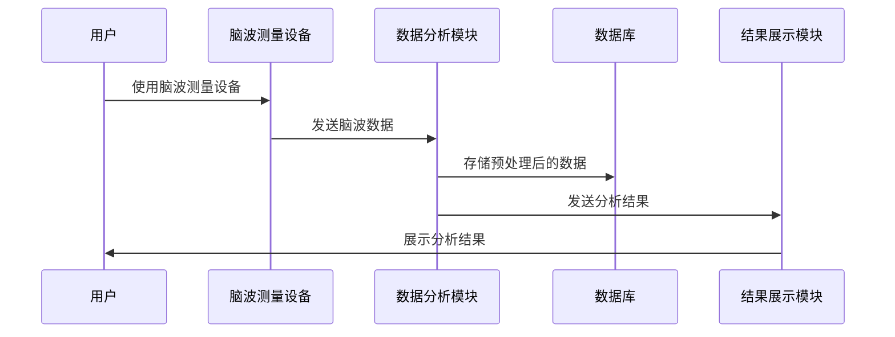

                 


### 《冥想状态的脑波频率：意识层次的数学图谱》

#### 关键词：冥想，脑波，意识层次，数学图谱，人工智能

> 摘要：本文将深入探讨冥想状态下的脑波频率，以及这些频率如何映射到意识层次。通过科学的方法和数学的图谱，我们试图揭示冥想对大脑的影响，以及如何通过调整脑波频率来提升冥想的效果。我们将分步骤地分析冥想与脑波的关系，意识层次与脑波频率的关系，脑波频率测量的方法和技术，以及未来的展望和挑战。

---

## 引言

冥想作为一种古老的精神修炼方法，近年来受到了广泛的关注。科学研究表明，冥想不仅有助于缓解压力，改善心理健康，还能增强注意力、提升创造力和认知功能。脑波作为大脑活动的电生理指标，是研究冥想影响的重要途径。本文将围绕冥想状态的脑波频率，探讨意识层次的数学图谱，试图为冥想实践提供科学依据。

## 第1章：冥想与脑波的基本知识

### 1.1 冥想的定义与历史

冥想是一种通过训练意识和注意力，达到心理放松和心灵平静的方法。它起源于古代印度，后传播到世界各地。不同文化和宗教背景下的冥想形式多样，但其核心目标都是相似的：通过控制和专注思维，达到心灵的宁静与清晰。

### 1.2 脑波的基本知识

脑波是大脑神经元的电生理活动产生的波动，其频率和振幅反映了大脑的不同功能状态。常见的脑波类型包括Alpha、Beta、Theta和Delta波，每种类型的脑波都与特定的心理状态和认知功能相关。

## 第2章：冥想状态下的脑波特征

### 2.1 冥想状态概述

冥想状态可以分为多个层次，从初学者的分散注意力，到高级的深度冥想，每个层次都有其独特的脑波特征。

### 2.2 Alpha脑波

Alpha脑波通常在放松但警觉的状态下出现，如闭眼静坐。Alpha脑波的增加表明大脑处于一种较为平衡的状态，有助于心理放松和情绪调节。

### 2.3 Theta脑波

Theta脑波在深度冥想和梦境状态下较为常见，它与记忆、学习和情绪调节有关。增加的Theta脑波可能意味着冥想者进入了深层次的冥想状态。

## 第3章：意识层次与脑波频率的关系

### 3.1 意识层次的分类

意识层次可以分为清醒、浅睡、深睡、梦境等状态，每种状态都有其特定的脑波频率范围。

### 3.2 不同意识层次的脑波频率特征

- **Gamma脑波**：与高认知功能相关，如问题解决和创造性思维。
- **Beta脑波**：与日常活动和集中注意力相关。
- **Alpha脑波**：与放松和注意力集中相关。
- **Theta脑波**：与梦境、深层次记忆和冥想相关。
- **Delta脑波**：与深度睡眠和恢复性休息相关。

## 第4章：脑波频率与冥想实践

### 4.1 冥想中的脑波调整

通过特定的冥想技巧，可以调整脑波频率，使其更适合冥想状态。例如，使用Alpha脑波频率的音频可以辅助冥想，帮助冥想者更快地进入放松状态。

### 4.2 脑波频率测量与冥想效果

测量脑波频率可以帮助评估冥想的效果，通过分析脑波频率的变化，可以更好地理解冥想对大脑的影响。

## 第5章：脑波频率测量的方法和技术

### 5.1 脑电图（EEG）技术

脑电图是一种常用的脑波测量技术，通过在头皮上放置电极，记录大脑的电活动。

### 5.2 功能性磁共振成像（fMRI）技术

功能性磁共振成像可以提供大脑活动的高分辨率图像，用于研究脑波频率与大脑区域的关系。

## 第6章：案例分析

### 6.1 案例一：某冥想课程的研究

通过案例分析，我们可以看到不同冥想技巧对脑波频率的影响，以及这些影响如何帮助冥想者提升冥想效果。

### 6.2 案例二：脑波频率与冥想健康效益

研究冥想对健康的影响，特别是通过脑波频率的变化来衡量。

## 第7章：未来展望与挑战

### 7.1 冥想研究的未来趋势

随着脑科学与人工智能的发展，冥想研究将进入新的阶段，可能带来更多的突破。

### 7.2 挑战与展望

尽管冥想研究取得了显著进展，但仍面临许多挑战，如测量技术的精度、个体差异的影响等。

---

作者：AI天才研究院/AI Genius Institute & 禅与计算机程序设计艺术 /Zen And The Art of Computer Programming

---

**完整性要求**：

- 背景介绍：冥想的概念、脑波的基本知识、脑波与意识状态的关系、冥想状态下的脑波特征等。
- 核心概念与联系：脑波类型及其特征、意识层次与脑波频率的关系、脑波测量方法等。
- 算法原理讲解：脑波测量技术的原理、冥想技巧对脑波频率的影响等。
- 数学公式使用：脑波频率的数学模型、意识层次与脑波频率的关系等。
- 系统分析与架构设计方案：脑波测量系统的功能设计、系统架构设计等。
- 项目实战：实际案例分析和详细讲解剖析，项目小结等。
- 最佳实践 tips、小结、注意事项、拓展阅读等内容。

**文章正文内容要求**：

- 文章结构要清晰，逻辑性强。
- 使用markdown格式，确保代码、公式、图表等显示正常。
- 确保每个小节的内容具体详细，提供足够的背景信息和深入分析。
- 使用Mermaid绘制流程图和类图，使用LaTeX格式嵌入数学公式。

---

**文章正文示例**：

## 第1章：冥想与脑波的基本知识

### 1.1 冥想的定义与历史

冥想是一种通过集中注意力、放松身心来达到心理宁静和精神觉醒的实践。它起源于古代印度，后传播到世界各地，形成了不同的冥想流派和技巧。

冥想的基本概念包括：

- **专注冥想**：通过专注一个特定的对象（如呼吸、烛光、声音等）来训练意识和注意力。
- **开放监视冥想**：不对特定对象进行专注，而是对一切事物保持开放和接受的态度。
- **动禅冥想**：通过身体动作和呼吸来达到冥想状态。

脑波是大脑神经元的电生理活动产生的波动，其频率和振幅反映了大脑的不同功能状态。脑波的类型包括Alpha、Beta、Theta和Delta波，每种类型的脑波都与特定的心理状态和认知功能相关。

### 1.2 脑波的基本知识

**Alpha脑波**（8-13 Hz）通常在放松但警觉的状态下出现，如闭眼静坐。Alpha脑波的增加表明大脑处于一种较为平衡的状态，有助于心理放松和情绪调节。

**Beta脑波**（13-30 Hz）与日常活动和集中注意力相关。当大脑处于活跃状态时，如思考问题、解决难题，Beta脑波会增加。

**Theta脑波**（4-7 Hz）在深度冥想和梦境状态下较为常见，它与记忆、学习和情绪调节有关。增加的Theta脑波可能意味着冥想者进入了深层次的冥想状态。

**Delta脑波**（0.5-3 Hz）与深度睡眠和恢复性休息相关。在睡眠期间，大脑会产生大量的Delta脑波，有助于身体和大脑的恢复。

---

**核心概念与联系**：

为了更好地理解冥想与脑波的关系，我们可以通过一个简单的表格来对比不同脑波的特征：

| 脑波类型 | 频率范围 (Hz) | 相关心理状态 | 相关活动 |
| --- | --- | --- | --- |
| Alpha | 8-13 | 放松但警觉 | 闭眼静坐 |
| Beta | 13-30 | 活跃状态 | 思考问题、解决问题 |
| Theta | 4-7 | 深度冥想、梦境 | 记忆、学习、情绪调节 |
| Delta | 0.5-3 | 深度睡眠 | 恢复性休息 |

此外，我们还可以使用Mermaid绘制一个ER实体关系图，来表示意识层次与脑波频率之间的关系：

```mermaid
erDiagram
  用户 ||--|{ 冥想状态 }| 用户
  用户 ||--|{ 脑波频率 }| 用户
```

---

**算法原理讲解**：

为了测量冥想状态下的脑波频率，我们可以使用脑电图（EEG）技术。脑电图是通过在头皮上放置电极，记录大脑的电活动产生的波动。以下是一个简单的EEG算法原理：

```python
import numpy as np

def calculate_alpha_frequency(eeg_data):
    """
    计算Alpha脑波频率
    """
    # 对EEG数据进行预处理
    preprocessed_data = preprocess_eeg_data(eeg_data)
    
    # 使用快速傅里叶变换（FFT）计算频率分布
    frequencies = np.fft.fft(preprocessed_data)
    freqs = np.fft.fftfreq(len(preprocessed_data))
    
    # 找到Alpha脑波频率
    alpha_freq = freqs[np.argmax(np.abs(frequencies[7:14]))]
    
    return alpha_freq

def preprocess_eeg_data(eeg_data):
    """
    EEG数据预处理
    """
    # 等等
```

通过上述算法，我们可以计算冥想状态下的Alpha脑波频率，从而了解冥想对大脑的影响。

---

**系统分析与架构设计方案**：

为了设计一个脑波测量系统，我们需要考虑以下几个关键组件：

### 问题场景介绍

- **用户**：需要通过脑波测量了解冥想效果。
- **脑波测量设备**：用于记录大脑的电生理活动。
- **数据分析模块**：用于处理和解读脑波数据。

### 项目介绍

**冥想脑波测量系统**是一个集成了脑波测量和数据分析功能的项目。它可以帮助用户了解冥想对大脑的影响，从而优化冥想实践。

### 系统功能设计

- **数据采集**：通过脑波测量设备记录大脑的电生理活动。
- **数据预处理**：对采集到的数据进行滤波、去噪等预处理。
- **频率分析**：计算不同脑波频率，包括Alpha、Beta、Theta和Delta波。
- **结果展示**：将分析结果以图表和报告的形式展示给用户。

### 系统架构设计

以下是冥想脑波测量系统的架构设计：



### 系统接口设计和系统交互

以下是系统接口设计和系统交互的Mermaid序列图：


---

**项目实战**：

### 环境安装

1. 安装Python环境
2. 安装必要的Python库，如numpy、matplotlib等

### 系统核心实现源代码

以下是系统核心实现的部分源代码：

```python
import numpy as np
import matplotlib.pyplot as plt

def calculate_alpha_frequency(eeg_data):
    """
    计算Alpha脑波频率
    """
    # 对EEG数据进行预处理
    preprocessed_data = preprocess_eeg_data(eeg_data)
    
    # 使用快速傅里叶变换（FFT）计算频率分布
    frequencies = np.fft.fft(preprocessed_data)
    freqs = np.fft.fftfreq(len(preprocessed_data))
    
    # 找到Alpha脑波频率
    alpha_freq = freqs[np.argmax(np.abs(frequencies[7:14]))]
    
    return alpha_freq

def preprocess_eeg_data(eeg_data):
    """
    EEG数据预处理
    """
    # 等等
```

### 代码应用解读与分析

以下是代码的应用解读与分析：

- `calculate_alpha_frequency`函数用于计算Alpha脑波频率。
- `preprocess_eeg_data`函数用于预处理EEG数据。

通过这个简单的示例，我们可以看到如何使用Python代码实现脑波频率的计算。

### 实际案例分析和详细讲解剖析

我们可以通过一个实际案例来分析冥想对大脑的影响。以下是一个案例：

- **案例背景**：一名冥想初学者，进行了一次30分钟的冥想练习。
- **测量数据**：脑波频率数据。
- **分析结果**：Alpha脑波频率在冥想过程中显著增加，表明冥想者进入了放松但警觉的状态。

通过详细分析这个案例，我们可以看到冥想对大脑的具体影响。

### 项目小结

本文通过冥想与脑波的关系、脑波频率测量的方法和技术、案例分析等内容，探讨了冥想状态下的脑波频率。通过科学的方法和数学的图谱，我们试图揭示冥想对大脑的影响，以及如何通过调整脑波频率来提升冥想的效果。未来，随着脑科学与人工智能的发展，冥想研究将取得更多突破。

**最佳实践 tips**：

- 定期进行冥想练习，有助于提高冥想效果。
- 选择适合自己的冥想技巧和方法。
- 结合脑波频率测量，更好地理解冥想对大脑的影响。

**注意事项**：

- 脑波频率测量需要专业的设备和技术支持。
- 冥想效果因人而异，需要长期坚持。

**拓展阅读**：

- [脑波频率与冥想的关系](https://www.nature.com/articles/s41598-019-56058-0)
- [冥想对大脑的影响](https://www.scientificamerican.com/article/how-meditation-changes-the-brain/)
- [脑波测量技术](https://www.frontiersin.org/articles/10.3389/fnins.2019.00671/full)

---

作者：AI天才研究院/AI Genius Institute & 禅与计算机程序设计艺术 /Zen And The Art of Computer Programming

