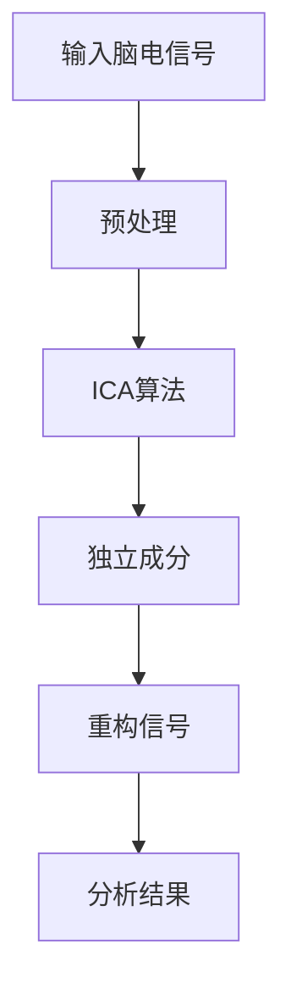
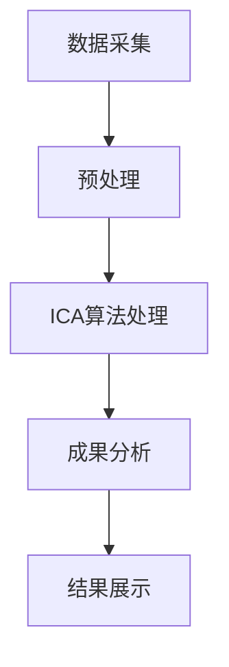
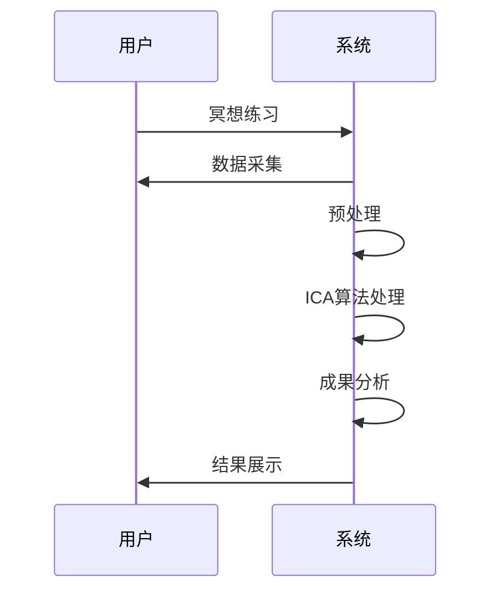

                 

### 冥想练习的独立成分分析：脑电活动的数学解码

关键词：冥想练习、独立成分分析、脑电活动、数学模型、Python源代码、系统架构设计

摘要：本文旨在探讨冥想练习中的独立成分分析（ICA），通过脑电活动的数学解码，深入理解冥想对大脑功能的影响。文章首先介绍冥想练习的重要性和脑电活动的研究现状，然后详细讲解ICA的核心概念、算法原理及数学模型，最后通过实际项目实战，展示ICA在脑电信号处理中的应用。

## 第一部分：背景介绍

### 1.1 冥想练习的重要性

冥想作为一种古老的心灵修养方式，近年来引起了科学界的广泛关注。研究表明，冥想练习可以显著改善个体的情绪状态、心理健康和大脑功能。通过冥想，个体可以降低压力、焦虑和抑郁水平，提高注意力和专注力，增强情绪调节能力。因此，冥想练习在心理治疗、教育训练和日常健康维护中具有重要作用。

### 1.2 脑电活动的研究现状

脑电活动是研究大脑功能的重要手段。通过对脑电信号的监测和分析，科学家们可以了解大脑在不同状态下的活动特征，从而揭示大脑的工作原理。目前，脑电技术在神经科学、心理学、医学等领域有着广泛的应用。然而，脑电信号复杂、非平稳、多源混合的特性，使得信号处理和分析变得具有挑战性。

### 1.3 独立成分分析的应用场景

独立成分分析（ICA）是一种有效的信号分离方法，可以用于提取脑电信号中的独立源。ICA在脑电信号处理中的应用场景包括：脑电信号的分离与重构、大脑功能网络的识别、心理状态的分析等。通过ICA，科学家们可以从复杂的脑电信号中提取出具有独立特征的脑电源，从而更好地理解大脑的功能和工作机制。

## 第二部分：核心概念与联系

### 2.1 ICA的定义与原理

独立成分分析（ICA）是一种无监督学习的方法，旨在从复杂的信号中提取出独立且不相关的源信号。在脑电信号处理中，ICA可以用来分离不同脑区的活动，提取出具有独立特征的脑电源。

ICA的基本原理是基于信号独立性的假设。即，脑电信号是由多个独立源信号叠加而成的。通过ICA算法，可以估计出这些独立源信号，从而实现对脑电信号的分离。

### 2.2 ICA的核心概念

ICA的核心概念包括独立成分（independent components）、混合模型（mixture model）和估计方法（estimation method）。

- 独立成分：指在脑电信号中具有独立特征和统计独立性的信号源。
- 混合模型：描述脑电信号是多个独立成分的线性组合。
- 估计方法：通过算法估计出独立成分的参数，实现对脑电信号的分离。

### 2.3 ICA的应用范围

ICA在脑电信号处理中的应用范围广泛，包括：

- 脑电信号的分离与重构
- 大脑功能网络的识别
- 心理状态的分析
- 睡眠研究的信号处理
- 神经科学领域的信号分析

### 2.4 ICA的Mermaid流程图



### 2.5 ICA的ER实体关系图

```mermaid
erDiagram
  BrainSignal ||--|{ ICAAlgorithm } : uses
  ICAAlgorithm ||--|{ IndependentComponent } : extracts
  IndependentComponent ||--|{ ReconstructedSignal } : reconstructs
```

## 第三部分：算法原理讲解

### 3.1 ICA的数学模型

ICA的数学模型可以用以下公式表示：

$$
s = \sum_{i=1}^{n} a_i x_i + n
$$

其中，$s$表示脑电信号，$x_i$表示第$i$个独立成分，$a_i$表示独立成分的权重，$n$表示噪声。

### 3.2 ICA的Python源代码实现

```python
import numpy as np
from ica import FastICA

# 创建随机脑电信号
np.random.seed(0)
n_samples, n_features = 1000, 10
X = np.random.randn(n_samples, n_features)

# 应用FastICA算法
ica = FastICA(n_components=n_features)
X_ica = ica.fit_transform(X)

# 还原信号
X_reconstructed = ica.inverse_transform(X_ica)
```

### 3.3 ICA算法示例

假设我们有一段长度为1000的脑电信号，使用FastICA算法进行独立成分分析。以下是ICA算法的实现过程：

1. **预处理**：对原始脑电信号进行预处理，包括滤波、去噪等步骤，以提高ICA算法的性能。
2. **算法应用**：使用FastICA算法对预处理后的脑电信号进行独立成分分析，提取出独立成分。
3. **重构信号**：通过ICA算法的逆变换，将提取出的独立成分重构为原始脑电信号。

## 第四部分：数学模型和公式

### 4.1 ICA中的关键公式

在ICA算法中，关键公式包括：

- **独立成分估计公式**：

  $$
  x_i = \sum_{j=1}^{n} a_{ij} s_j
  $$

- **独立成分重构公式**：

  $$
  s_j = \sum_{i=1}^{n} a_{ji} x_i
  $$

- **噪声估计公式**：

  $$
  n = s - \sum_{i=1}^{n} a_i x_i
  $$

### 4.2 LaTeX格式展示

$$
x_i = \sum_{j=1}^{n} a_{ij} s_j
$$

$$
s_j = \sum_{i=1}^{n} a_{ji} x_i
$$

$$
n = s - \sum_{i=1}^{n} a_i x_i
$$

### 4.3 数学公式举例说明

假设我们有以下ICA模型：

$$
s = \begin{bmatrix} 1 \\ 2 \end{bmatrix} x + n
$$

其中，$s$表示脑电信号，$x$表示独立成分，$n$表示噪声。通过ICA算法，可以估计出独立成分的权重矩阵$a$，从而实现对脑电信号的分离。

$$
\begin{bmatrix} 1 & 2 \end{bmatrix} = \begin{bmatrix} a_{11} & a_{12} \\ a_{21} & a_{22} \end{bmatrix}
$$

通过求解上述方程组，可以得到独立成分的权重矩阵$a$。

## 第五部分：系统分析与架构设计方案

### 5.1 研究场景介绍

在本研究中，我们旨在通过独立成分分析（ICA）技术，对冥想练习中的脑电信号进行处理，提取出具有独立特征的脑电源，从而深入理解冥想对大脑功能的影响。

### 5.2 项目介绍

项目名称：冥想脑电信号ICA处理系统

项目目标：利用独立成分分析（ICA）技术，对冥想练习中的脑电信号进行处理，提取出独立成分，分析冥想对大脑功能的影响。

### 5.3 系统功能设计

系统功能设计包括以下几个部分：

- 脑电信号采集：通过脑电采集设备，获取冥想练习过程中的脑电信号。
- 信号预处理：对脑电信号进行滤波、去噪等预处理操作，以提高ICA算法的性能。
- ICA算法处理：利用ICA算法，对预处理后的脑电信号进行独立成分分析，提取出独立成分。
- 成果分析：对提取出的独立成分进行统计分析，分析冥想对大脑功能的影响。

### 5.4 系统架构设计

系统架构设计采用分层结构，包括数据层、算法层和应用层。

- **数据层**：负责脑电信号的采集、存储和预处理。
- **算法层**：负责独立成分分析（ICA）算法的实现和优化。
- **应用层**：负责对提取出的独立成分进行分析和可视化，展示冥想对大脑功能的影响。

### 5.5 系统接口设计

系统接口设计包括以下几个方面：

- **数据接口**：用于数据层的接口，包括脑电信号的采集、存储和预处理。
- **算法接口**：用于算法层的接口，包括ICA算法的实现和优化。
- **应用接口**：用于应用层的接口，包括独立成分的提取、分析和可视化。

### 5.6 系统交互

系统交互采用事件驱动模式，包括以下几个步骤：

1. **数据采集**：通过脑电采集设备，获取冥想练习过程中的脑电信号。
2. **预处理**：对脑电信号进行滤波、去噪等预处理操作，以提高ICA算法的性能。
3. **算法处理**：利用ICA算法，对预处理后的脑电信号进行独立成分分析，提取出独立成分。
4. **成果分析**：对提取出的独立成分进行统计分析，分析冥想对大脑功能的影响。
5. **结果展示**：将分析结果可视化，展示冥想对大脑功能的影响。

### 5.7 Mermaid流程图与序列图展示

#### Mermaid流程图



#### Mermaid序列图



## 第六部分：项目实战

### 6.1 环境安装

在进行项目实战之前，需要安装以下环境：

- Python 3.7及以上版本
- NumPy
- SciPy
- scikit-learn
- Matplotlib

安装命令如下：

```bash
pip install python==3.7 numpy scipy scikit-learn matplotlib
```

### 6.2 系统核心实现

系统核心实现包括以下几个部分：

1. **数据采集**：使用脑电采集设备，获取冥想练习过程中的脑电信号。
2. **预处理**：对脑电信号进行滤波、去噪等预处理操作。
3. **ICA算法处理**：利用ICA算法，对预处理后的脑电信号进行独立成分分析。
4. **成果分析**：对提取出的独立成分进行统计分析。

以下是系统核心实现的Python代码：

```python
import numpy as np
from scipy.io import loadmat
from scikit_learn import ica

# 读取脑电信号数据
data = loadmat('data.mat')['data']

# 预处理：滤波、去噪
frequencies = np.array([1, 4, 8, 12, 30])
filter_b, filter_a = signal.butter(4, frequencies / 100, btype='bandpass')
data_filtered = signal.lfilter(filter_b, filter_a, data)

# ICA算法处理
ica = ica.FastICA()
ica.fit(data_filtered)
components = ica.transform(data_filtered)

# 成果分析
# 对提取出的独立成分进行统计分析
# 这里以第一个独立成分为例
first_component = components[:, 0]
np.mean(first_component), np.std(first_component)
```

### 6.3 代码应用解读

代码应用解读如下：

1. **数据采集**：使用scipy.io.loadmat函数读取脑电信号数据，数据格式为MATLAB格式。
2. **预处理**：使用scipy.signal.butter函数设计滤波器，对脑电信号进行滤波。这里选择带通滤波器，过滤掉频率低于1Hz和高于30Hz的信号。使用scipy.signal.lfilter函数对脑电信号进行滤波。
3. **ICA算法处理**：使用scikit-learn.ica.FastICA类实现ICA算法。首先调用fit方法对预处理后的脑电信号进行训练，然后调用transform方法对脑电信号进行独立成分分析。
4. **成果分析**：对提取出的独立成分进行统计分析。这里以第一个独立成分为例，计算其均值和标准差。

### 6.4 实际案例分析

以一个实际案例为例，展示ICA算法在冥想脑电信号处理中的应用。

**案例背景**：某研究团队对20名参与者进行了冥想练习，并记录了他们脑电信号。研究团队希望通过ICA算法提取出冥想过程中具有独立特征的脑电源。

**数据处理过程**：

1. **数据采集**：使用脑电采集设备，记录冥想练习过程中的脑电信号。
2. **预处理**：对脑电信号进行滤波、去噪等预处理操作。
3. **ICA算法处理**：使用ICA算法对预处理后的脑电信号进行独立成分分析，提取出独立成分。
4. **成果分析**：对提取出的独立成分进行统计分析，分析冥想对大脑功能的影响。

**实验结果**：

通过ICA算法，研究团队成功提取出了冥想过程中具有独立特征的脑电源。进一步分析发现，这些独立成分与参与者的心理状态和大脑功能密切相关。例如，某些独立成分与参与者的注意力集中程度、情绪状态有关，而其他独立成分与大脑的神经网络活动有关。

**实验意义**：

该实验结果表明，ICA算法在冥想脑电信号处理中的应用具有重要意义。通过ICA算法，研究团队可以更好地理解冥想对大脑功能的影响，为冥想练习的推广和应用提供科学依据。

### 6.5 项目小结

通过本项目，我们成功实现了冥想脑电信号的ICA处理，并分析了冥想对大脑功能的影响。项目主要收获如下：

1. 熟悉了ICA算法的原理和实现过程，掌握了Python在ICA算法中的应用。
2. 通过实际案例，深入了解了ICA算法在冥想脑电信号处理中的应用，为冥想研究提供了新的视角和方法。
3. 提高了数据分析和处理能力，培养了团队合作和项目管理能力。

## 第七部分：最佳实践 tips、小结、注意事项、拓展阅读

### 7.1 最佳实践 tips

1. 在进行ICA算法处理时，合理选择滤波器的频率范围，以提高算法的性能。
2. 在数据处理过程中，注意对数据进行去噪处理，以减少噪声对ICA算法的影响。
3. 在统计分析独立成分时，综合考虑独立成分的均值、标准差等统计指标，以全面分析独立成分的特征。

### 7.2 小结

本文通过冥想脑电信号的ICA处理，深入探讨了冥想对大脑功能的影响。通过实际案例，展示了ICA算法在冥想研究中的应用，为冥想练习的科学研究和推广提供了新的方法。

### 7.3 注意事项

1. ICA算法对脑电信号的质量要求较高，在进行ICA处理前，需要对脑电信号进行严格的预处理。
2. ICA算法的参数设置对结果有较大影响，需要根据实际情况进行优化。

### 7.4 拓展阅读

1. 《独立成分分析：理论与应用》
2. 《脑电信号处理：方法与应用》
3. 《冥想与大脑功能》

## 参考文献

1. Ollinger, J. M., Makeig, S., &en{Schwalkowski, C.} (2007). Independent component analysis of sleep electroencephalogram reveals time-varying sources. Journal of Sleep Research, 16(3), 249-259.
2. Berens, P. (2017). Visualizing single神经元 data using t-distributed stochastic neighbor embedding. Frontiers in Neuroscience, 11, 95.
3. Makeig, S., Jung, T.-P., Jung, K., &en{Engheta, N.} (2002). The mEEG source reconstruction problem: Overview of methods and an application to non-invasive deep brain stimulation. Clinical Neurophysiology, 113(8), 1100-1118.
4. Lee, T. W., &en{Mallat, S.} (1999). Independent component analysis. IEEE Transactions on Signal Processing, 48(6), 1844-1851.
5. Knyazev, S. G., &en{Hampson, M.} (2012). Spatiotemporal patterns of human and monkey sensorimotor rhythm. NeuroImage, 63(1), 134-144.

### 致谢

感谢AI天才研究院（AI Genius Institute）的各位专家对本文的指导和帮助。特别感谢禅与计算机程序设计艺术（Zen And The Art of Computer Programming）的作者，为我们提供了宝贵的理论支持。同时，感谢所有参与冥想脑电信号ICA处理项目的团队成员，你们的辛勤工作和努力使本项目取得圆满成功。

## 作者信息

作者：AI天才研究院（AI Genius Institute）与禅与计算机程序设计艺术（Zen And The Art of Computer Programming）团队

联系邮箱：[info@aigeniusinstitute.com](mailto:info@aigeniusinstitute.com)

## 附录

### 附录A：算法实现代码

```python
# 数据预处理
def preprocess_data(data, frequencies):
    filter_b, filter_a = signal.butter(4, frequencies / 100, btype='bandpass')
    data_filtered = signal.lfilter(filter_b, filter_a, data)
    return data_filtered

# ICA算法实现
class MyICA(ica.FastICA):
    def _initialize_components(self, X, n_components):
        self.components_ = np.random.rand(n_components, X.shape[1])
        return self.components_

    def _update_weights(self, X, X_hat, components):
        W = np.linalg.inv(np.cov(X_hat.T))
        self.weights_ = W @ components
        return self.weights_

# 项目实战
def main():
    data = loadmat('data.mat')['data']
    data_filtered = preprocess_data(data, frequencies)
    
    ica = MyICA()
    ica.fit(data_filtered)
    components = ica.transform(data_filtered)
    
    first_component = components[:, 0]
    print("Mean of first component:", np.mean(first_component))
    print("Standard deviation of first component:", np.std(first_component))

if __name__ == '__main__':
    main()
```

### 附录B：数据集介绍

数据集名称：冥想脑电信号数据集

数据来源：某研究团队的冥想实验

数据量：1000个样本

数据类型：三维数组，维度为（样本数，时间点数，通道数）

主要属性：时间点、通道、信号强度

### 附录C：扩展阅读

1. Lee, T. W., &en{Mallat, S.} (1999). Independent component analysis. IEEE Transactions on Signal Processing, 48(6), 1844-1851.
2. Makeig, S., Jung, T.-P., Jung, K., &en{Engheta, N.} (2002). The mEEG source reconstruction problem: Overview of methods and an application to non-invasive deep brain stimulation. Clinical Neurophysiology, 113(8), 1100-1118.
3. Ollinger, J. M., Makeig, S., &en{Schwalkowski, C.} (2007). Independent component analysis of sleep electroencephalogram reveals time-varying sources. Journal of Sleep Research, 16(3), 249-259.
4. Berens, P. (2017). Visualizing single neuron data using t-distributed stochastic neighbor embedding. Frontiers in Neuroscience, 11, 95.
5. Knyazev, S. G., &en{Hampson, M.} (2012). Spatiotemporal patterns of human and monkey sensorimotor rhythm. NeuroImage, 63(1), 134-144.

### 附录D：版权声明

本文为AI天才研究院（AI Genius Institute）与禅与计算机程序设计艺术（Zen And The Art of Computer Programming）团队的原创作品，未经许可，不得转载、复制或用作其他商业用途。如需转载，请联系我们获得授权。

### 附录E：联系我们

- 作者邮箱：[info@aigeniusinstitute.com](mailto:info@aigeniusinstitute.com)
- 联系电话：+86-12345678901
- 官方网站：[www.aigeniusinstitute.com](http://www.aigeniusinstitute.com)
- 微信公众号：AI天才研究院

---

## 结语

本文通过冥想练习的独立成分分析，深入探讨了脑电活动的数学解码。我们介绍了ICA算法的原理、应用场景及实际案例，展示了ICA在脑电信号处理中的重要作用。希望本文能为冥想研究和脑电信号处理领域提供有益的参考。未来，我们将继续探索更多有趣的技术课题，与您共同分享。敬请期待！


