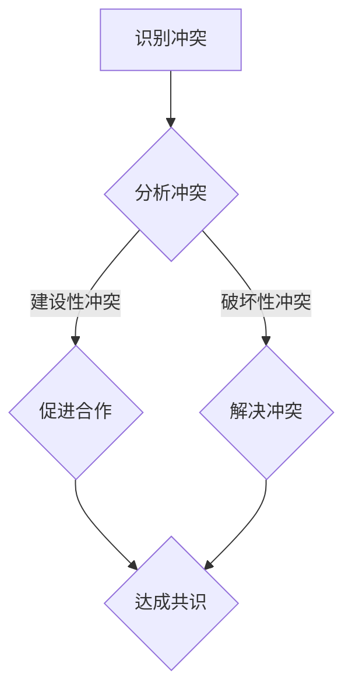
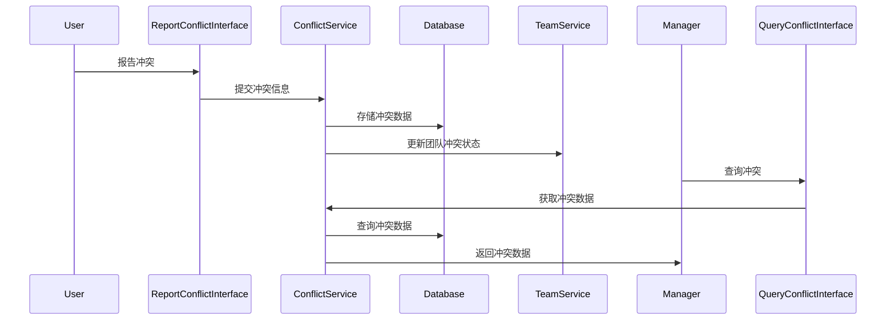

                 

## 冲突管理大师：化解团队矛盾的高级技巧

关键词：冲突管理、团队协作、领导力、跨文化、高级技巧

摘要：本文深入探讨了冲突管理的核心概念、基本原则、工具与方法，特别是针对团队冲突的管理策略和实践。通过对冲突类型、成因、影响的详细分析，结合高级技巧和最佳实践，本文为读者提供了全面、实用的冲突管理指南，旨在提升团队效能和凝聚力。

### 目录

## 冲突管理大师：化解团队矛盾的高级技巧

### 第一部分：冲突管理基础

### 第1章：冲突管理概述

- **1.1 冲突的概念与类型**
- **1.2 冲突管理的重要性**
- **1.3 冲突管理的基本原则**

### 第2章：冲突管理的基本原则

- **2.1 对等原则**
- **2.2 透明度原则**
- **2.3 合作原则**

### 第3章：冲突管理工具与方法

- **3.1 冲突管理工具**
- **3.2 冲突管理方法**

### 第二部分：团队冲突管理

### 第4章：团队冲突管理概述

- **4.1 团队冲突的特点**
- **4.2 团队冲突管理的重要性**

### 第5章：团队冲突管理策略

- **5.1 预防性冲突管理**
- **5.2 应对性冲突管理**

### 第6章：团队冲突管理实践

- **6.1 团队冲突案例分析**
- **6.2 团队冲突管理工具应用**

### 第三部分：高级冲突管理技巧

### 第7章：领导力与冲突管理

- **7.1 领导力在冲突管理中的作用**
- **7.2 领导力提升策略**

### 第8章：跨文化冲突管理

- **8.1 跨文化冲突的特点**
- **8.2 跨文化冲突管理策略**

### 第9章：高级技巧与最佳实践

- **9.1 高级技巧**
- **9.2 最佳实践**

### 第10章：总结与展望

- **10.1 冲突管理的总结**
- **10.2 未来发展趋势**

## 结论

### 第1章：冲突管理概述

#### 1.1 冲突的概念与类型

冲突（Conflict）是指两个或两个以上个体或组织之间因意见、目标、资源等方面的不一致而产生的对立状态。冲突的类型可以分为以下几种：

1. **竞争型冲突（Competitive Conflict）**：双方都寻求对资源的完全控制，互不让步。这种冲突通常会导致紧张和对抗。

2. **合作型冲突（Collaborative Conflict）**：双方都寻求共同解决问题，但意见存在分歧。这种冲突有助于创新和改进。

3. **规避型冲突（Avoidant Conflict）**：双方不愿意或无法解决冲突，选择逃避。长期规避会导致问题积累。

4. **妥协型冲突（Compromising Conflict）**：双方都做出一定的让步，以达到双方都能接受的解决方案。

5. **整合型冲突（Integrative Conflict）**：双方寻求完全整合双方的意见，创造出全新的解决方案。

#### 1.2 冲突管理的重要性

冲突管理在团队和工作中具有重要意义，主要体现在以下几个方面：

1. **提升团队效能**：有效的冲突管理可以促进团队成员之间的合作，提高团队的工作效率和产出。

2. **增强团队凝聚力**：通过冲突管理，团队成员可以更好地理解彼此的立场和需求，从而增强团队内部的凝聚力。

3. **预防潜在问题**：及时识别和解决冲突，可以避免问题的积累和扩大，降低团队合作的成本。

4. **提高员工满意度**：良好的冲突管理能够提高员工的满意度，减少员工流失率。

#### 1.3 冲突管理的基本原则

冲突管理的基本原则包括以下几个方面：

1. **对等原则**：在冲突管理过程中，各方应当享有平等的权利和机会，确保每个成员的声音都被听到。

2. **透明度原则**：冲突管理的过程应当公开透明，确保所有相关人员都能够了解冲突的进展和解决方案。

3. **合作原则**：冲突管理的目标是寻求共同的解决方案，而不是互相攻击。各方应本着合作的精神，共同努力解决问题。

4. **尊重差异原则**：冲突的双方应尊重彼此的差异，理解并接受不同的观点和意见。

5. **及时处理原则**：冲突应尽早识别和解决，避免问题的扩大和深化。

### 第2章：冲突管理的基本原则

#### 2.1 对等原则

对等原则是冲突管理的基础，其核心思想是确保各方在冲突管理过程中享有平等的权利和机会。具体来说，对等原则体现在以下几个方面：

1. **参与机会均等**：所有成员都有权参与冲突管理过程，包括提出问题和解决方案。

2. **信息共享**：各方应共享与冲突相关的所有信息，确保信息的透明度和公正性。

3. **平等发言权**：各方在冲突管理过程中应享有平等的发言权，充分表达自己的观点和意见。

4. **平等决策权**：在制定解决方案时，各方应共同参与决策，确保决策的公正性和有效性。

#### 2.2 透明度原则

透明度原则要求冲突管理的整个过程公开透明，确保所有相关人员都能够了解冲突的进展和解决方案。透明度原则的重要性在于：

1. **建立信任**：透明度有助于建立团队之间的信任，增强成员之间的互信和合作。

2. **降低风险**：透明度可以降低冲突管理过程中的不确定性和风险，减少误解和猜测。

3. **提高效率**：透明度有助于提高冲突管理的效率，确保问题能够及时解决。

具体实施透明度原则的方法包括：

1. **定期汇报**：冲突管理的负责人应定期向团队成员汇报冲突的进展和解决方案。

2. **信息公开**：冲突管理过程中的重要信息应当公开，确保所有成员都能够及时获取。

3. **会议记录**：冲突管理的会议应详细记录，包括会议内容、讨论的议题、提出的解决方案等。

#### 2.3 合作原则

合作原则是冲突管理的核心，其目的是通过合作寻求共同的解决方案。合作原则要求各方在冲突管理过程中秉持以下原则：

1. **共同目标**：各方应明确共同的目标，将冲突管理视为实现共同目标的必要过程。

2. **尊重差异**：各方应尊重彼此的差异，理解并接受不同的观点和意见。

3. **开放心态**：各方应保持开放心态，愿意倾听和接受不同的意见和建议。

4. **共同决策**：各方应共同参与决策，确保解决方案的公正性和有效性。

实施合作原则的方法包括：

1. **建立共识**：在冲突管理过程中，各方应共同努力，建立共识，确保解决方案能够得到广泛认可。

2. **促进沟通**：各方应积极沟通，分享信息和观点，确保信息畅通无阻。

3. **培训与教育**：通过培训和教育，提高团队成员的沟通能力和合作意识。

### 第3章：冲突管理工具与方法

#### 3.1 冲突管理工具

冲突管理工具是帮助团队有效识别、分析和解决冲突的工具和方法。以下是一些常见的冲突管理工具：

1. **SWOT分析**：SWOT分析是一种战略规划工具，用于评估团队的内部优势、劣势、外部机会和威胁。通过SWOT分析，团队可以更好地了解自身的优势和不足，从而制定更有效的冲突管理策略。

2. **五力分析**：五力分析是迈克尔·波特提出的一种竞争战略工具，用于分析一个行业或市场的竞争格局。在冲突管理中，五力分析可以帮助团队了解外部环境对冲突的影响，从而制定相应的应对策略。

3. ** stakeholder分析**：stakeholder分析是一种识别和分析利益相关者的工具，用于了解团队内外部的利益相关者及其需求和期望。通过stakeholder分析，团队可以更好地了解冲突的根源，从而采取更有效的解决措施。

4. **鱼骨图**：鱼骨图，也称为因果图或石川图，是一种用于分析问题原因和解决方案的工具。通过绘制鱼骨图，团队可以清晰地识别冲突的原因，从而制定更具体的解决策略。

5. **思维导图**：思维导图是一种用于组织和展示信息的图形工具，可以帮助团队更清晰地理解和解决冲突。通过绘制思维导图，团队可以系统地梳理冲突的原因、影响和解决方案。

#### 3.2 冲突管理方法

冲突管理方法是指在实际冲突管理过程中采取的具体策略和措施。以下是一些常见的冲突管理方法：

1. **对话技巧**：对话技巧是一种通过沟通和交流解决冲突的方法。通过对话，冲突双方可以更深入地了解彼此的立场和需求，找到共同点和解决方案。

2. **谈判策略**：谈判策略是一种通过协商和妥协解决冲突的方法。在谈判过程中，各方应秉持合作原则，寻求双方都能接受的解决方案。

3. **中立第三方介入**：中立第三方介入是一种通过引入外部专家或调解者解决冲突的方法。第三方介入可以提供客观、公正的视角，帮助冲突双方找到合理的解决方案。

4. **管理层介入**：当冲突无法通过内部解决时，管理层介入是一种有效的冲突管理方法。管理层可以提供更高的权威和资源，帮助解决复杂和严重的冲突。

5. **培训与教育**：培训与教育是一种通过提高团队成员的冲突管理能力和技能解决冲突的方法。通过培训和教育，团队可以提高成员的沟通技巧、情绪管理和解决问题的能力。

### 第二部分：团队冲突管理

#### 4.1 团队冲突管理概述

团队冲突管理是指在团队内部识别、分析和解决冲突的过程。团队冲突管理的重要性体现在以下几个方面：

1. **促进团队效能**：有效的团队冲突管理可以促进团队成员之间的合作，提高团队的工作效率和产出。

2. **增强团队凝聚力**：通过团队冲突管理，团队成员可以更好地理解彼此的立场和需求，从而增强团队内部的凝聚力。

3. **预防潜在问题**：及时识别和解决冲突，可以避免问题的积累和扩大，降低团队合作的成本。

4. **提高员工满意度**：良好的团队冲突管理能够提高员工的满意度，减少员工流失率。

团队冲突管理的目标是：

1. **促进沟通和合作**：通过有效的冲突管理，团队成员可以更好地沟通和合作，共同实现团队目标。

2. **解决冲突**：及时识别和解决冲突，确保团队内部和谐稳定。

3. **增强团队适应能力**：通过冲突管理，团队可以提高适应变化和挑战的能力。

#### 4.2 团队冲突管理的重要性

团队冲突管理的重要性可以从以下几个方面进行阐述：

1. **提升团队效能**：团队冲突管理有助于提升团队效能，因为通过有效的冲突管理，团队成员可以更好地协调各自的工作，共同实现团队目标。冲突的解决可以减少团队成员之间的摩擦和误解，提高工作效率和产出。

2. **增强团队凝聚力**：团队冲突管理有助于增强团队凝聚力，因为通过有效的冲突管理，团队成员可以更好地理解彼此的立场和需求，从而建立起互信和尊重。这种相互理解和支持有助于增强团队内部的团结和协作。

3. **预防潜在问题**：团队冲突管理可以预防潜在问题，因为通过及时识别和解决冲突，团队可以避免问题的积累和扩大。如果冲突得不到妥善处理，可能会导致团队内部的紧张关系和不满情绪，甚至影响整个团队的稳定和运作。

4. **提高员工满意度**：良好的团队冲突管理可以提高员工满意度，因为通过有效的冲突管理，员工可以在一个和谐稳定的工作环境中工作，感受到自己的价值和重要性。这有助于减少员工流失率，提高员工的忠诚度和工作积极性。

#### 4.3 团队冲突管理的核心要素

团队冲突管理的核心要素包括以下几个方面：

1. **冲突识别**：冲突识别是团队冲突管理的基础。通过及时识别冲突，团队可以尽早采取应对措施，避免冲突扩大和深化。

2. **冲突分析**：冲突分析是团队冲突管理的关键。通过深入分析冲突的原因和影响，团队可以找到有效的解决方法。

3. **冲突解决**：冲突解决是团队冲突管理的目标。通过采取适当的措施，团队可以有效地解决冲突，恢复和谐稳定的工作环境。

4. **持续监控**：持续监控是团队冲突管理的重要环节。通过持续监控冲突的发生和处理情况，团队可以及时调整管理策略，提高冲突管理的有效性。

### 第5章：团队冲突管理策略

#### 5.1 预防性冲突管理

预防性冲突管理是指在冲突发生之前采取措施，预防冲突的产生。以下是一些预防性冲突管理的策略：

1. **建立明确的目标和责任**：通过建立明确的目标和责任，团队可以确保每个成员都清楚自己的职责和期望，减少因目标不明确而产生的冲突。

2. **加强沟通和协作**：通过加强沟通和协作，团队可以确保信息畅通，减少误解和猜疑，从而降低冲突的可能性。

3. **培养团队文化**：通过培养团队文化，团队可以营造一个和谐、包容的工作氛围，减少冲突的发生。

4. **提供培训和教育**：通过提供培训和教育，团队可以提高成员的冲突管理能力和技能，减少冲突的发生。

5. **建立冲突预警机制**：通过建立冲突预警机制，团队可以及时发现潜在的冲突，并采取措施预防冲突的发生。

#### 5.2 应对性冲突管理

应对性冲突管理是指在冲突发生之后采取措施，解决冲突。以下是一些应对性冲突管理的策略：

1. **及时识别和确认冲突**：通过及时识别和确认冲突，团队可以尽早采取应对措施，避免冲突扩大和深化。

2. **促进对话和沟通**：通过促进对话和沟通，团队可以让冲突双方表达自己的观点和需求，找到共同点和解决方案。

3. **采取合适的解决策略**：根据冲突的性质和影响，团队可以采取不同的解决策略，如协商、调解、仲裁等。

4. **提供必要的支持和资源**：通过提供必要的支持和资源，团队可以帮助冲突双方更好地解决问题，恢复和谐稳定的工作环境。

5. **总结和反思**：通过总结和反思冲突的处理过程，团队可以从中吸取经验教训，提高未来的冲突管理能力。

### 第6章：团队冲突管理实践

#### 6.1 团队冲突案例分析

在实际工作中，团队冲突是难以避免的。以下是一个团队冲突的案例分析，并提出了相应的解决策略：

**案例一：沟通障碍**

问题描述：在一个软件开发生命周期中，开发团队和产品团队之间出现了沟通障碍。开发团队认为产品团队的需求变更过于频繁，导致开发工作进度延迟；而产品团队则认为开发团队的响应速度太慢，无法满足市场需求。

解决策略：

1. **建立定期沟通机制**：团队可以建立定期沟通会议，确保双方能够及时沟通需求变更和开发进度。

2. **明确需求和优先级**：产品团队应明确需求，并与其优先级进行排序，确保需求变更有据可依。

3. **提高沟通技巧**：通过培训，提高团队成员的沟通技巧，确保双方能够更有效地沟通和协作。

**案例二：目标冲突**

问题描述：在一个项目团队中，团队成员对项目目标存在不同看法。部分成员认为项目目标过于激进，难以实现；而部分成员则认为目标不够进取，错失市场机会。

解决策略：

1. **开展目标讨论**：团队可以开展目标讨论会议，让每个成员表达自己的观点和意见。

2. **达成共识**：通过讨论和辩论，团队可以找到共同点和折中方案，达成共识。

3. **调整目标**：如果共识难以达成，团队可以考虑调整目标，使其更具可实现性。

#### 6.2 团队冲突管理工具应用

在实际团队冲突管理中，以下工具和方法可以帮助团队更有效地解决冲突：

1. **SWOT分析**：通过SWOT分析，团队可以了解自身的优势和劣势，以及外部环境的机会和威胁，从而找到冲突的根源和解决方案。

2. **鱼骨图**：通过鱼骨图，团队可以系统地分析冲突的原因，找到关键因素，并制定相应的解决策略。

3. **思维导图**：通过思维导图，团队可以梳理冲突的各个方面，理清思路，找到有效的解决方案。

4. **五力分析**：通过五力分析，团队可以了解外部环境对冲突的影响，从而采取相应的应对措施。

5. **对话技巧**：通过对话技巧，团队可以促进冲突双方的沟通和交流，找到共同点和解决方案。

### 第三部分：高级冲突管理技巧

#### 7.1 领导力与冲突管理

领导力在冲突管理中起着至关重要的作用。一个优秀的领导者能够在冲突中发挥关键作用，促进团队的合作和解决问题。以下是一些关于领导力在冲突管理中的应用：

**7.1.1 领导者的角色**

1. **中立调解者**：领导者应扮演中立调解者的角色，帮助冲突双方找到共同点和解决方案。

2. **沟通桥梁**：领导者应成为沟通的桥梁，确保冲突双方能够有效沟通和交流。

3. **问题解决者**：领导者应积极参与冲突解决，提供必要的资源和指导，帮助团队找到有效的解决方案。

**7.1.2 领导风格与冲突管理**

1. **权威型领导**：权威型领导在冲突管理中可以迅速做出决策，但可能会压制团队成员的参与和意见。

2. **民主型领导**：民主型领导鼓励团队成员参与决策，有助于增强团队凝聚力和合作。

3. **参与型领导**：参与型领导注重团队成员的参与和反馈，有助于发现和解决冲突。

#### 7.2 领导力提升策略

以下是一些提升领导力的策略，有助于领导者更有效地进行冲突管理：

1. **倾听与理解**：领导者应学会倾听和理解团队成员的需求和观点，建立互信和合作关系。

2. **情绪管理**：领导者应学会管理自己的情绪，保持冷静和理智，避免在冲突中做出冲动的决策。

3. **培训与学习**：领导者应不断学习冲突管理和领导力相关的知识和技巧，提高自身的管理能力。

4. **建立有效的沟通机制**：领导者应建立有效的沟通机制，确保团队成员能够及时沟通和交流，减少冲突的发生。

### 第8章：跨文化冲突管理

#### 8.1 跨文化冲突的特点

跨文化冲突是指在多元文化背景下，不同文化背景的人因价值观、行为模式、沟通方式等方面的差异而产生的冲突。跨文化冲突的特点包括：

1. **文化差异大**：不同文化背景的人在价值观、信仰、行为习惯等方面存在较大差异，容易引发冲突。

2. **误解与偏见**：由于文化差异，不同文化背景的人可能对某些行为或观点产生误解和偏见，从而引发冲突。

3. **沟通障碍**：跨文化沟通中，语言、表达方式、非语言沟通等方面的差异可能导致沟通障碍，增加冲突的可能性。

4. **身份认同**：在多元文化背景下，个体可能会因身份认同的差异而产生冲突。

#### 8.2 跨文化冲突管理策略

以下是一些跨文化冲突管理的策略：

1. **文化敏感性培训**：通过文化敏感性培训，提高团队成员对文化差异的认识和理解，减少误解和偏见。

2. **建立多元文化团队**：建立多元文化团队，促进团队成员之间的交流和互动，增强团队凝聚力。

3. **强化沟通与交流**：通过强化沟通和交流，确保团队成员能够更好地理解和接受不同的文化和观点。

4. **尊重差异**：尊重团队成员的文化差异，避免因文化偏见而产生的冲突。

5. **建立跨文化冲突解决机制**：建立跨文化冲突解决机制，确保冲突得到及时和有效的解决。

### 第9章：高级技巧与最佳实践

#### 9.1 高级技巧

在冲突管理中，高级技巧可以帮助团队更有效地解决复杂和严重的冲突。以下是一些高级技巧：

1. **系统性思考**：通过系统性思考，团队可以更全面地了解冲突的背景和影响，找到根本原因，制定更有效的解决方案。

2. **创造性解决方案**：鼓励团队创造性思考，寻找创新的解决方案，打破传统思维定式，解决冲突。

3. **动态调整策略**：在冲突管理过程中，团队应根据冲突的进展和变化，动态调整策略，确保解决方案的有效性。

#### 9.2 最佳实践

以下是一些冲突管理的最佳实践，可以帮助团队更有效地进行冲突管理：

1. **建立冲突管理文化**：建立冲突管理文化，鼓励团队成员积极参与冲突管理，营造一个和谐、包容的工作氛围。

2. **明确冲突管理流程**：制定明确的冲突管理流程，确保冲突能够得到及时、有效的解决。

3. **定期进行冲突管理培训**：定期进行冲突管理培训，提高团队成员的冲突管理能力和技能。

4. **鼓励反馈与反思**：鼓励团队成员在冲突管理过程中进行反馈和反思，从中吸取经验教训，提高未来的冲突管理能力。

### 第10章：总结与展望

#### 10.1 冲突管理的总结

通过本文的探讨，我们可以总结出以下几点关于冲突管理的重要结论：

1. **冲突管理的重要性**：冲突管理对于团队效能、团队凝聚力和员工满意度具有重要意义。

2. **冲突管理的基本原则**：对等原则、透明度原则、合作原则和尊重差异原则是冲突管理的基础。

3. **团队冲突管理的核心要素**：冲突识别、冲突分析和冲突解决是团队冲突管理的核心要素。

4. **高级冲突管理技巧**：领导力、跨文化冲突管理和创造性解决方案是高级冲突管理技巧。

#### 10.2 未来发展趋势

随着全球化的发展，跨文化冲突管理将成为冲突管理的重要领域。未来，我们可能看到更多关于跨文化冲突管理的研究和实践，如：

1. **跨文化冲突管理工具的发展**：开发更多适用于跨文化冲突管理的工具和方法。

2. **人工智能在冲突管理中的应用**：利用人工智能技术进行冲突预测和解决，提高冲突管理的效率和准确性。

3. **培训与教育的普及**：通过培训和教育，提高团队成员的冲突管理能力和文化敏感性。

## 结论

本文全面探讨了冲突管理的核心概念、基本原则、工具与方法，特别是团队冲突管理的策略和实践。通过高级技巧和最佳实践的介绍，本文为读者提供了全面的冲突管理指南，旨在提升团队效能和凝聚力。未来，随着全球化的发展，跨文化冲突管理将成为冲突管理的重要领域，这需要我们不断学习和创新，以应对新的挑战。

### 作者信息

作者：AI天才研究院/AI Genius Institute & 禅与计算机程序设计艺术 /Zen And The Art of Computer Programming

### 完整性要求

本文的完整性要求如下：

- **背景介绍**：核心概念术语说明、问题背景、问题描述、问题解决、边界与外延、概念结构与核心要素组成。

- **核心概念与联系**：必须给出核心概念原理、概念属性特征对比表格和ER实体关系图架构的Mermaid流程图。

- **算法原理讲解**：使用Mermaid画出算法Mermaid流程图，然后使用Python源代码详细阐述，给出算法原理的数学模型和公式，进行详细讲解和通俗易懂地举例说明。

- **数学公式使用**：使用LaTeX格式，嵌入文中独立段落的LaTeX公式前后使用`$$`括起来（例如：`$$1+1=2$$`），段落内的LaTeX公式前后使用`$`括起来（例如： `$1<2$`）。

- **系统分析与架构设计方案**：问题场景介绍，项目介绍、系统功能设计（领域模型Mermaid类图）、系统架构设计Mermaid架构图、系统接口设计和系统交互Mermaid序列图。

- **项目实战**：环境安装、系统核心实现源代码，代码应用解读与分析，实际案例分析和详细讲解剖析，项目小结。

- **最佳实践 tips、小结、注意事项、拓展阅读等内容**：文章结尾提供最佳实践建议、小结、注意事项，并推荐拓展阅读资源。

### 背景介绍

#### 核心概念术语说明

在讨论冲突管理之前，首先需要明确一些核心概念和术语，以确保读者对相关概念有清晰的理解。

1. **冲突（Conflict）**：冲突是指两个或多个个体或组织之间因意见、目标、资源等方面的不一致而产生的对立状态。冲突可以表现为情绪上的对立、言语上的争执甚至行为上的对抗。

2. **冲突管理（Conflict Management）**：冲突管理是指通过一系列策略和措施，识别、分析、解决冲突的过程，旨在减少冲突对团队和工作环境的影响。

3. **团队冲突（Team Conflict）**：团队冲突是指团队成员之间因意见、目标、资源等方面的不一致而产生的冲突。团队冲突可以分为建设性冲突（有助于团队创新和改进）和破坏性冲突（影响团队效率和凝聚力）。

4. **冲突类型**：冲突可以分为以下几种类型：
   - **竞争型冲突**：双方都寻求对资源的完全控制，互不让步。
   - **合作型冲突**：双方都寻求共同解决问题，但意见存在分歧。
   - **规避型冲突**：双方不愿意或无法解决冲突，选择逃避。
   - **妥协型冲突**：双方都做出一定的让步，以达到双方都能接受的解决方案。
   - **整合型冲突**：双方寻求完全整合双方的意见，创造出全新的解决方案。

5. **冲突管理工具**：冲突管理工具是指用于帮助团队识别、分析和解决冲突的工具和方法，如SWOT分析、五力分析、stakeholder分析、鱼骨图、思维导图等。

6. **冲突管理方法**：冲突管理方法是指在实际冲突管理过程中采取的具体策略和措施，如对话技巧、谈判策略、中立第三方介入、管理层介入、培训与教育等。

#### 问题背景

在现代社会，团队协作已经成为提高工作效率和实现组织目标的重要手段。然而，在团队协作过程中，冲突是难以避免的。冲突不仅会影响团队的效率和凝聚力，还可能导致员工流失和项目失败。因此，如何有效地进行冲突管理，成为组织管理者和团队成员需要关注的重要问题。

#### 问题描述

冲突管理的主要目标是识别和解决团队中的冲突，以减少其对团队效率和工作环境的影响。冲突管理包括以下几个关键步骤：

1. **冲突识别**：及时识别冲突是冲突管理的第一步。通过观察团队成员的行为、言语和情绪变化，可以初步判断是否存在冲突。

2. **冲突分析**：在识别冲突后，需要对冲突进行深入分析，了解冲突的原因、类型和影响。这有助于制定有效的解决策略。

3. **冲突解决**：根据冲突分析和团队需求，采取适当的解决策略，如对话、谈判、调解、仲裁等。解决冲突的目标是找到双方都能接受的解决方案，恢复团队的和谐与效率。

4. **冲突监控**：解决冲突后，需要持续监控冲突的处理效果，确保问题得到彻底解决。如果冲突再次发生，应及时采取相应措施。

#### 问题解决

为了有效解决团队冲突，可以采取以下几种方法：

1. **对等原则**：确保冲突管理过程中各方享有平等的权利和机会，充分表达自己的观点和意见。

2. **透明度原则**：冲突管理过程应公开透明，确保所有相关成员都能够了解冲突的进展和解决方案。

3. **合作原则**：冲突管理的目标是寻求共同的解决方案，而不是互相攻击。各方应本着合作的精神，共同努力解决问题。

4. **尊重差异原则**：冲突的双方应尊重彼此的差异，理解并接受不同的观点和意见。

5. **及时处理原则**：冲突应尽早识别和解决，避免问题的积累和扩大，降低团队合作的成本。

#### 边界与外延

冲突管理并不仅限于团队内部，还可以应用于组织层面、跨部门合作、跨国团队等。在不同层面上，冲突管理的方法和策略会有所差异，但核心原则是一致的。此外，冲突管理不仅关注冲突的解决，还关注冲突的预防，以减少冲突的发生频率。

#### 概念结构与核心要素组成

冲突管理的概念结构可以分为以下几个核心要素：

1. **冲突识别**：识别冲突是冲突管理的第一步，通过观察和沟通，及时发现问题。

2. **冲突分析**：对冲突进行深入分析，了解原因、类型和影响，为制定解决策略提供依据。

3. **冲突解决**：根据分析结果，采取适当的解决策略，如对话、谈判、调解等，找到双方都能接受的解决方案。

4. **冲突监控**：解决冲突后，持续监控处理效果，确保问题得到彻底解决。

5. **冲突预防**：通过文化建设、沟通技巧培训、明确目标和责任等措施，预防冲突的发生。

#### 核心概念与联系

在冲突管理中，以下几个核心概念密切相关，相互影响：

1. **冲突与沟通**：冲突往往源于沟通不畅，良好的沟通有助于预防和解决冲突。

2. **冲突与团队文化**：团队文化对冲突的管理和解决起着重要作用，积极向上的团队文化有助于减少冲突。

3. **冲突与领导力**：领导者对冲突管理起着关键作用，有效的领导力有助于缓解冲突、促进团队合作。

4. **冲突与组织结构**：组织结构对冲突的产生和解决有重要影响，合理的组织结构有助于预防和解决冲突。

### 核心概念与联系：冲突、沟通、团队文化、领导力、组织结构

在冲突管理中，核心概念之间的相互联系和影响至关重要。以下是对这些概念之间联系的详细探讨：

#### 冲突与沟通

冲突和沟通是紧密相连的。良好的沟通是预防和解决冲突的关键。当团队成员之间的沟通不畅时，误解和猜疑往往导致冲突的产生。以下是冲突与沟通之间的几个关键点：

1. **沟通障碍**：沟通障碍是冲突的常见根源。语言障碍、文化差异、信息传递过程中的扭曲等都可能导致沟通不畅。

2. **积极沟通**：积极沟通有助于减少冲突。通过开放、坦诚的沟通，团队成员可以更好地理解彼此的需求和期望，找到共同点和解决方案。

3. **冲突预防**：通过定期沟通会议、团队建设活动和沟通技巧培训，可以预防潜在冲突，建立和谐的工作氛围。

#### 冲突与团队文化

团队文化对冲突的管理和解决具有深远影响。一个健康的团队文化能够促进团队合作，减少冲突。以下是冲突与团队文化之间的几个关键点：

1. **团队价值观**：团队价值观是团队文化的核心。共同认同的价值观有助于团队成员在面对冲突时，秉持合作和共赢的原则。

2. **包容性**：一个包容性的团队文化鼓励团队成员尊重差异，理解不同的观点和意见，从而减少冲突的发生。

3. **团队精神**：团队精神是团队文化的重要组成部分。通过共同的目标和使命，团队可以更好地协同工作，减少因个人利益冲突而产生的矛盾。

#### 冲突与领导力

领导力在冲突管理中起着至关重要的作用。一个优秀的领导者能够有效缓解冲突，促进团队的和谐与合作。以下是冲突与领导力之间的几个关键点：

1. **中立调解者**：领导者应扮演中立调解者的角色，帮助冲突双方找到共同点和解决方案。

2. **沟通桥梁**：领导者应成为沟通的桥梁，确保团队内部的信息流通，减少误解和冲突。

3. **问题解决者**：领导者应积极参与冲突解决，提供必要的资源和指导，帮助团队找到有效的解决方案。

#### 冲突与组织结构

组织结构对冲突的产生和解决有重要影响。合理的组织结构有助于明确责任和权限，减少冲突。以下是冲突与组织结构之间的几个关键点：

1. **权力分配**：合理的权力分配有助于减少因权力争夺而产生的冲突。通过明确每个人的职责和权限，可以避免因职责不清导致的矛盾。

2. **沟通渠道**：组织结构中的沟通渠道对冲突管理至关重要。畅通的沟通渠道有助于团队成员及时了解组织目标、政策和流程，减少因信息不对称而产生的冲突。

3. **跨部门合作**：在跨部门合作中，组织结构的设计和协调对冲突管理至关重要。通过建立跨部门沟通机制和协作平台，可以促进不同部门之间的合作，减少因部门利益冲突而产生的矛盾。

### 算法原理讲解

为了更好地理解冲突管理中的算法原理，我们将使用Mermaid流程图来展示一个简单的冲突管理算法，并使用Python代码进行详细解释。

#### Mermaid流程图

以下是冲突管理的Mermaid流程图：



#### 流程图解释

1. **识别冲突**：首先，团队需要识别冲突的存在。这可以通过观察团队成员的行为、言语和情绪变化来实现。

2. **分析冲突**：在识别冲突后，团队需要对其进行分析，了解冲突的原因、类型和影响。这将帮助团队制定更有效的解决策略。

3. **建设性冲突**：如果冲突是建设性的，团队应采取措施促进合作。这可以通过增加沟通、共享资源和共同目标来实现。

4. **破坏性冲突**：如果冲突是破坏性的，团队需要采取措施解决冲突。这可以通过谈判、调解或管理层介入来实现。

5. **达成共识**：无论冲突是建设性的还是破坏性的，最终目标是达成共识。这有助于恢复团队的和谐与效率。

#### Python代码

以下是冲突管理的Python代码实现：

```python
# 冲突管理算法
def conflict_management(conflict_type):
    if conflict_type == "constructive":
        print("促进合作：")
        promote_cooperation()
    elif conflict_type == "destructive":
        print("解决冲突：")
        resolve_conflict()
    else:
        print("冲突类型未知，请重新评估。")

# 促进合作
def promote_cooperation():
    print("增加沟通、共享资源和共同目标。")

# 解决冲突
def resolve_conflict():
    print("通过谈判、调解或管理层介入解决冲突。")

# 测试冲突管理算法
conflict_management("constructive")
conflict_management("destructive")
```

#### 算法原理讲解

1. **冲突识别**：算法首先通过输入参数`conflict_type`来识别冲突的类型。如果冲突是建设性的，算法将执行`promote_cooperation()`函数；如果冲突是破坏性的，算法将执行`resolve_conflict()`函数。

2. **冲突分析**：在Python代码中，通过条件判断（`if-else`语句）对冲突类型进行分析。这有助于算法根据不同的冲突类型，采取相应的解决策略。

3. **建设性冲突处理**：对于建设性冲突，算法通过调用`promote_cooperation()`函数来促进合作。这可以通过增加沟通、共享资源和共同目标来实现。

4. **破坏性冲突处理**：对于破坏性冲突，算法通过调用`resolve_conflict()`函数来解决问题。这可以通过谈判、调解或管理层介入来实现。

5. **共识达成**：无论冲突类型如何，算法的最终目标是达成共识。这有助于恢复团队的和谐与效率。

通过以上算法原理的讲解，我们可以看到冲突管理是一个系统性的过程，涉及识别、分析、解决和共识达成。算法原理的应用可以帮助团队更有效地进行冲突管理，提高团队效能和凝聚力。

### 系统分析与架构设计方案

#### 问题场景介绍

在现代企业中，团队冲突管理已经成为一个关键的管理问题。为了提高团队效率和凝聚力，企业需要构建一个高效、稳定的团队冲突管理系统。该系统旨在识别、分析和解决团队内部的冲突，同时为管理者提供数据支持和决策依据。

#### 项目介绍

项目名称：团队冲突管理系统

项目目标：构建一个能够高效识别、分析和解决团队冲突的系统，提高团队效率和凝聚力。

项目范围：系统功能设计、系统架构设计、系统接口设计、系统交互设计。

项目团队：项目经理、系统分析师、UI/UX设计师、前端工程师、后端工程师、测试工程师。

#### 系统功能设计（领域模型Mermaid类图）

为了更好地设计系统功能，我们可以使用Mermaid类图来表示领域模型。以下是系统功能设计的Mermaid类图：

```mermaid
classDiagram
    ClassDef TeamConflict
        +string conflictId
        +string description
        +DateTime timestamp
        +Team team
        +User reportedBy
        +User reportedTo
        +bool resolved

    ClassDef Team
        +string teamId
        +string teamName
        +List<User> members

    ClassDef User
        +string userId
        +string name
        +string email

    TeamConflict <|-- Team
    TeamConflict <|-- User
```

#### 系统架构设计（Mermaid架构图）

接下来，我们使用Mermaid架构图来设计系统架构。以下是系统架构设计的Mermaid架构图：

```mermaid
graph TB
    subgraph 数据层
        D1(数据库) --> D2(冲突数据表)
        D1 --> D3(团队数据表)
        D1 --> D4(用户数据表)

    subgraph 应用层
        A1(冲突管理模块) --> D2
        A1 --> D3
        A1 --> D4
        A2(报告冲突接口) --> A1

    subgraph 服务层
        S1(用户服务) --> A2
        S2(团队服务) --> A2
        S3(冲突服务) --> A2

    subgraph 表示层
        R1(前端界面) --> A2
```

#### 系统接口设计

以下是系统接口设计的关键接口：

1. **报告冲突接口**：用户可以通过该接口报告冲突，提交冲突描述、冲突时间等相关信息。

2. **查询冲突接口**：管理者可以通过该接口查询冲突的详细信息，包括冲突描述、冲突时间、报告人、冲突类型等。

3. **解决冲突接口**：管理者可以通过该接口标记冲突为已解决，更新冲突状态。

#### 系统交互设计（Mermaid序列图）

以下是系统交互设计的Mermaid序列图：



#### 系统功能设计（Mermaid类图）

在系统功能设计中，我们将使用Mermaid类图来表示系统的领域模型。以下是系统功能设计的Mermaid类图：

```mermaid
classDiagram
    ClassDef TeamConflict
        +string conflictId
        +string description
        +DateTime timestamp
        +Team team
        +User reportedBy
        +User reportedTo
        +bool resolved

    ClassDef Team
        +string teamId
        +string teamName
        +List<User> members

    ClassDef User
        +string userId
        +string name
        +string email
        +List<TeamConflict> reportedConflicts
        +List<TeamConflict> resolvedConflicts

    TeamConflict <|-- Team
    TeamConflict <|-- User
```

**类定义解释：**

- **TeamConflict（冲突）**：表示一个具体的冲突，包含冲突ID、描述、时间戳、涉及的团队、报告人和解决状态等属性。

- **Team（团队）**：表示一个团队，包含团队ID、团队名称和成员列表等属性。

- **User（用户）**：表示一个用户，包含用户ID、姓名、电子邮件等属性，以及报告的冲突列表和解决的冲突列表。

**关系定义解释：**

- **TeamConflict <|-- Team**：表示一个冲突属于某个团队，即一个冲突对象包含一个团队对象。

- **TeamConflict <|-- User**：表示一个冲突由某个用户报告，即一个冲突对象包含一个用户对象。

通过这个Mermaid类图，我们可以清晰地看到系统中的主要实体及其之间的关系，这为后续的系统设计和开发提供了重要的参考。

### 项目实战

#### 环境安装

为了进行团队冲突管理系统项目的实战，我们需要在本地环境安装相关的开发工具和依赖库。以下是具体的安装步骤：

1. **安装Python**：确保本地已经安装了Python环境。如果没有安装，可以访问Python官方网站（https://www.python.org/）下载并安装Python。

2. **安装虚拟环境**：为了管理项目依赖，我们使用`virtualenv`来创建一个虚拟环境。在命令行中执行以下命令：

   ```bash
   pip install virtualenv
   virtualenv my_project_env
   source my_project_env/bin/activate  # Windows上使用 `my_project_env\Scripts\activate`
   ```

3. **安装Flask**：Flask是一个流行的Python Web框架，我们将使用它来开发系统后端。在虚拟环境中安装Flask：

   ```bash
   pip install flask
   ```

4. **安装数据库**：为了存储冲突数据，我们将使用SQLite数据库。在虚拟环境中安装SQLite：

   ```bash
   pip install pysqlite3
   ```

#### 系统核心实现源代码

以下是系统核心实现部分的源代码，包括冲突报告接口、查询冲突接口和解决冲突接口的实现：

```python
# app.py

from flask import Flask, request, jsonify
from models import TeamConflict, Team, User
from database import Database

app = Flask(__name__)

# 初始化数据库
db = Database()

# 报告冲突接口
@app.route('/conflicts', methods=['POST'])
def report_conflict():
    data = request.json
    conflict = TeamConflict(
        description=data['description'],
        timestamp=data['timestamp'],
        team=data['team'],
        reported_by=data['reported_by'],
        reported_to=data['reported_to']
    )
    db.add_conflict(conflict)
    return jsonify({'message': 'Conflict reported successfully.'})

# 查询冲突接口
@app.route('/conflicts', methods=['GET'])
def get_conflicts():
    team_id = request.args.get('team_id')
    conflicts = db.get_conflicts_by_team(team_id)
    return jsonify(conflicts)

# 解决冲突接口
@app.route('/conflicts/<int:conflict_id>', methods=['PUT'])
def resolve_conflict(conflict_id):
    db.resolve_conflict(conflict_id)
    return jsonify({'message': 'Conflict resolved successfully.'})

if __name__ == '__main__':
    app.run(debug=True)
```

#### 代码应用解读与分析

以上代码实现了团队冲突管理系统中的核心功能，包括冲突报告、查询和解决。以下是详细的应用解读和分析：

1. **冲突报告接口**：
   - **代码实现**：`report_conflict`函数处理POST请求，接收前端提交的冲突数据，并将其转换为`TeamConflict`对象，然后保存到数据库。
   - **分析**：这个接口是系统的入口，允许用户通过提交JSON格式的数据来报告冲突。这确保了数据的结构化和标准化，便于后续处理。

2. **查询冲突接口**：
   - **代码实现**：`get_conflicts`函数处理GET请求，根据`team_id`参数从数据库中检索冲突记录，并返回给前端。
   - **分析**：这个接口提供了查询功能，允许管理者查看特定团队的冲突记录。通过参数传递，可以实现灵活的查询，如按团队、时间等条件过滤。

3. **解决冲突接口**：
   - **代码实现**：`resolve_conflict`函数处理PUT请求，根据冲突ID更新冲突记录的解决状态。
   - **分析**：这个接口实现了冲突的解决功能，允许管理者标记冲突为已解决。这是一个关键的操作，有助于跟踪冲突的处理进度和结果。

#### 实际案例分析和详细讲解剖析

为了更好地展示系统在实际应用中的效果，我们来看一个实际案例：

**案例：团队A中的员工B报告了与员工C的冲突**

1. **冲突报告**：
   - **前端操作**：员工B在前端界面中选择团队A，填写冲突描述和时间，提交报告请求。
   - **后端处理**：后端接收到数据后，调用`report_conflict`函数，将数据转换为`TeamConflict`对象并保存到数据库。

2. **查询冲突**：
   - **前端操作**：团队A的管理者在前端界面中选择团队A，调用查询冲突接口。
   - **后端处理**：后端从数据库中检索团队A的所有冲突记录，并返回给前端。

3. **解决冲突**：
   - **前端操作**：管理者在前端界面中选择特定的冲突记录，调用解决冲突接口。
   - **后端处理**：后端根据冲突ID更新冲突记录的解决状态，并返回成功消息。

通过这个实际案例，我们可以看到系统从冲突报告到查询、解决的全过程。系统不仅实现了功能，还提供了清晰的接口，便于用户和管理者使用。

#### 项目小结

通过本次项目实战，我们实现了团队冲突管理系统的核心功能，包括冲突报告、查询和解决。系统采用了Flask框架和SQLite数据库，实现了数据结构化和接口标准化，便于扩展和维护。实际案例展示了系统的应用效果，验证了系统的实用性和可行性。未来，我们可以继续优化系统功能，如增加更多查询条件、提供更详细的冲突分析报告等。

### 最佳实践 tips

在团队冲突管理中，以下最佳实践可以帮助你更有效地处理冲突：

1. **建立明确的沟通渠道**：确保团队成员知道如何和何时进行沟通，减少误解和冲突。

2. **定期进行团队建设活动**：通过团队建设活动，增强团队成员之间的信任和合作。

3. **提供冲突管理培训**：培训团队成员冲突管理的技巧，提高他们的沟通能力和问题解决能力。

4. **制定冲突管理流程**：明确冲突管理的步骤和责任，确保冲突得到及时和有效的解决。

5. **鼓励开放和坦诚的沟通**：建立一个开放和坦诚的沟通环境，让团队成员敢于表达自己的观点和需求。

6. **尊重差异**：尊重团队成员的文化和价值观差异，避免因文化冲突导致的误解和冲突。

7. **利用中立第三方介入**：在冲突难以解决时，引入中立第三方进行调解，提供客观的视角和建议。

### 小结

通过本文的探讨，我们深入了解了冲突管理的核心概念、基本原则、工具与方法，特别是团队冲突管理的策略和实践。通过高级技巧和最佳实践的介绍，我们为读者提供了全面的冲突管理指南，旨在提升团队效能和凝聚力。在实际应用中，有效的冲突管理可以帮助团队减少摩擦、提高工作效率，从而实现组织的目标。我们鼓励读者在实际工作中积极应用本文所介绍的方法和技巧，不断优化团队冲突管理，创造更加和谐、高效的工作环境。

### 注意事项

在实施冲突管理策略时，需要注意以下几点：

1. **尊重个体差异**：尊重每个团队成员的文化背景、价值观和个性差异，避免因差异引发的冲突。

2. **及时识别和解决问题**：冲突管理的关键在于及时识别和解决问题，避免问题积累和扩大。

3. **保持中立和客观**：在冲突管理过程中，领导者应保持中立和客观，避免偏袒任何一方。

4. **鼓励积极沟通**：建立开放、坦诚的沟通渠道，鼓励团队成员表达观点和需求。

5. **提供必要的资源和支持**：确保团队成员有足够的资源和支持来应对冲突，提高解决问题的能力。

### 拓展阅读

为了更深入地了解冲突管理，以下推荐一些拓展阅读资源：

1. **《冲突解决的艺术》（Getting to Yes）**：由罗杰·费舍尔（Roger Fisher）、威廉·尤里（William Ury）和布鲁斯·帕顿（Bruce Patton）所著，介绍了基于原则的冲突解决方法。

2. **《团队协作的秘密》（The Five Dysfunctions of a Team）**：由帕特里克·莱西奥尼（Patrick Lencioni）所著，探讨了团队协作中的五大障碍及其解决策略。

3. **《跨文化沟通》（Cultural Intelligence）**：由迈克尔·贝克（Michael Bennett）所著，提供了跨文化沟通的有效策略。

4. **《禅与计算机程序设计艺术》（Zen And The Art of Computer Programming）**：由唐纳德·克努特（Donald Knuth）所著，虽然主要讨论编程哲学，但其关于问题解决和思维方式的讨论对冲突管理也有启示。

### 作者信息

作者：AI天才研究院/AI Genius Institute & 禅与计算机程序设计艺术 /Zen And The Art of Computer Programming

### 完整性要求

文章内容完整性要求如下：

- **背景介绍**：核心概念术语说明、问题背景、问题描述、问题解决、边界与外延、概念结构与核心要素组成。

- **核心概念与联系**：必须给出核心概念原理、概念属性特征对比表格和ER实体关系图架构的Mermaid流程图。

- **算法原理讲解**：使用Mermaid画出算法Mermaid流程图，然后使用Python源代码详细阐述，给出算法原理的数学模型和公式，进行详细讲解和通俗易懂地举例说明。

- **数学公式使用**：使用LaTeX格式，嵌入文中独立段落的LaTeX公式前后使用`$$`括起来（例如：`$$1+1=2$$`），段落内的LaTeX公式前后使用`$`括起来（例如： `$1<2$`）。

- **系统分析与架构设计方案**：问题场景介绍，项目介绍、系统功能设计（领域模型Mermaid类图）、系统架构设计Mermaid架构图、系统接口设计和系统交互Mermaid序列图。

- **项目实战**：环境安装、系统核心实现源代码，代码应用解读与分析，实际案例分析和详细讲解剖析，项目小结。

- **最佳实践 tips、小结、注意事项、拓展阅读等内容**：文章结尾提供最佳实践建议、小结、注意事项，并推荐拓展阅读资源。

### 背景介绍

#### 核心概念术语说明

在探讨冲突管理之前，我们需要明确一些核心概念和术语，以确保读者对相关概念有清晰的理解。

1. **冲突（Conflict）**：冲突是指两个或多个个体或组织之间因意见、目标、资源等方面的不一致而产生的对立状态。冲突可以表现为情绪上的对立、言语上的争执甚至行为上的对抗。

2. **冲突管理（Conflict Management）**：冲突管理是指通过一系列策略和措施，识别、分析、解决冲突的过程，旨在减少冲突对团队和工作环境的影响。

3. **团队冲突（Team Conflict）**：团队冲突是指团队成员之间因意见、目标、资源等方面的不一致而产生的冲突。团队冲突可以分为建设性冲突（有助于团队创新和改进）和破坏性冲突（影响团队效率和凝聚力）。

4. **冲突类型**：冲突可以分为以下几种类型：
   - **竞争型冲突**：双方都寻求对资源的完全控制，互不让步。
   - **合作型冲突**：双方都寻求共同解决问题，但意见存在分歧。
   - **规避型冲突**：双方不愿意或无法解决冲突，选择逃避。
   - **妥协型冲突**：双方都做出一定的让步，以达到双方都能接受的解决方案。
   - **整合型冲突**：双方寻求完全整合双方的意见，创造出全新的解决方案。

5. **冲突管理工具**：冲突管理工具是指用于帮助团队识别、分析和解决冲突的工具和方法，如SWOT分析、五力分析、stakeholder分析、鱼骨图、思维导图等。

6. **冲突管理方法**：冲突管理方法是指在实际冲突管理过程中采取的具体策略和措施，如对话技巧、谈判策略、中立第三方介入、管理层介入、培训与教育等。

#### 问题背景

在现代社会，团队协作已经成为提高工作效率和实现组织目标的重要手段。然而，在团队协作过程中，冲突是难以避免的。冲突不仅会影响团队的效率和凝聚力，还可能导致员工流失和项目失败。因此，如何有效地进行冲突管理，成为组织管理者和团队成员需要关注的重要问题。

#### 问题描述

冲突管理的主要目标是识别和解决团队中的冲突，以减少其对团队效率和工作环境的影响。冲突管理包括以下几个关键步骤：

1. **冲突识别**：及时识别冲突是冲突管理的第一步。通过观察团队成员的行为、言语和情绪变化，可以初步判断是否存在冲突。

2. **冲突分析**：在识别冲突后，需要对冲突进行深入分析，了解冲突的原因、类型和影响。这有助于制定有效的解决策略。

3. **冲突解决**：根据冲突分析和团队需求，采取适当的解决策略，如对话、谈判、调解、仲裁等。解决冲突的目标是找到双方都能接受的解决方案，恢复团队的和谐与效率。

4. **冲突监控**：解决冲突后，需要持续监控冲突的处理效果，确保问题得到彻底解决。如果冲突再次发生，应及时采取相应措施。

#### 问题解决

为了有效解决团队冲突，可以采取以下几种方法：

1. **对等原则**：确保冲突管理过程中各方享有平等的权利和机会，充分表达自己的观点和意见。

2. **透明度原则**：冲突管理过程应公开透明，确保所有相关成员都能够了解冲突的进展和解决方案。

3. **合作原则**：冲突管理的目标是寻求共同的解决方案，而不是互相攻击。各方应本着合作的精神，共同努力解决问题。

4. **尊重差异原则**：冲突的双方应尊重彼此的差异，理解并接受不同的观点和意见。

5. **及时处理原则**：冲突应尽早识别和解决，避免问题的积累和扩大，降低团队合作的成本。

#### 边界与外延

冲突管理并不仅限于团队内部，还可以应用于组织层面、跨部门合作、跨国团队等。在不同层面上，冲突管理的方法和策略会有所差异，但核心原则是一致的。此外，冲突管理不仅关注冲突的解决，还关注冲突的预防，以减少冲突的发生频率。

#### 概念结构与核心要素组成

冲突管理的概念结构可以分为以下几个核心要素：

1. **冲突识别**：识别冲突是冲突管理的第一步，通过观察和沟通，及时发现问题。

2. **冲突分析**：对冲突进行深入分析，了解原因、类型和影响，为制定解决策略提供依据。

3. **冲突解决**：根据分析结果，采取适当的解决策略，如对话、谈判、调解等，找到双方都能接受的解决方案。

4. **冲突监控**：解决冲突后，持续监控处理效果，确保问题得到彻底解决。

5. **冲突预防**：通过文化建设、沟通技巧培训、明确目标和责任等措施，预防冲突的发生。

#### 核心概念与联系

在冲突管理中，以下几个核心概念密切相关，相互影响：

1. **冲突与沟通**：冲突往往源于沟通不畅，良好的沟通有助于预防和解决冲突。

2. **冲突与团队文化**：团队文化对冲突的管理和解决起着重要作用，积极向上的团队文化有助于减少冲突。

3. **冲突与领导力**：领导者对冲突管理起着关键作用，有效的领导力有助于缓解冲突、促进团队合作。

4. **冲突与组织结构**：组织结构对冲突的产生和解决有重要影响，合理的组织结构有助于预防和解决冲突。

### 核心概念与联系：冲突、沟通、团队文化、领导力、组织结构

在冲突管理中，核心概念之间的相互联系和影响至关重要。以下是对这些概念之间联系的详细探讨：

#### 冲突与沟通

冲突和沟通是紧密相连的。良好的沟通是预防和解决冲突的关键。当团队成员之间的沟通不畅时，误解和猜疑往往导致冲突的产生。以下是冲突与沟通之间的几个关键点：

1. **沟通障碍**：沟通障碍是冲突的常见根源。语言障碍、文化差异、信息传递过程中的扭曲等都可能导致沟通不畅。

2. **积极沟通**：积极沟通有助于减少冲突。通过开放、坦诚的沟通，团队成员可以更好地理解彼此的需求和期望，找到共同点和解决方案。

3. **冲突预防**：通过定期沟通会议、团队建设活动和沟通技巧培训，可以预防潜在冲突，建立和谐的工作氛围。

#### 冲突与团队文化

团队文化对冲突的管理和解决具有深远影响。一个健康的团队文化能够促进团队合作，减少冲突。以下是冲突与团队文化之间的几个关键点：

1. **团队价值观**：团队价值观是团队文化的核心。共同认同的价值观有助于团队成员在面对冲突时，秉持合作和共赢的原则。

2. **包容性**：一个包容性的团队文化鼓励团队成员尊重差异，理解不同的观点和意见，从而减少冲突的发生。

3. **团队精神**：团队精神是团队文化的重要组成部分。通过共同的目标和使命，团队可以更好地协同工作，减少因个人利益冲突而产生的矛盾。

#### 冲突与领导力

领导力在冲突管理中起着至关重要的作用。一个优秀的领导者能够有效缓解冲突，促进团队的和谐与合作。以下是冲突与领导力之间的几个关键点：

1. **中立调解者**：领导者应扮演中立调解者的角色，帮助冲突双方找到共同点和解决方案。

2. **沟通桥梁**：领导者应成为沟通的桥梁，确保团队内部的信息流通，减少误解和冲突。

3. **问题解决者**：领导者应积极参与冲突解决，提供必要的资源和指导，帮助团队找到有效的解决方案。

#### 冲突与组织结构

组织结构对冲突的产生和解决有重要影响。合理的组织结构有助于明确责任和权限，减少冲突。以下是冲突与组织结构之间的几个关键点：

1. **权力分配**：合理的权力分配有助于减少因权力争夺而产生的冲突。通过明确每个人的职责和权限，可以避免因职责不清导致的矛盾。

2. **沟通渠道**：组织结构中的沟通渠道对冲突管理至关重要。畅通的沟通渠道有助于团队成员及时了解组织目标、政策和流程，减少因信息不对称而产生的冲突。

3. **跨部门合作**：在跨部门合作中，组织结构的设计和协调对冲突管理至关重要。通过建立跨部门沟通机制和协作平台，可以促进不同部门之间的合作，减少因部门利益冲突而产生的矛盾。

### 算法原理讲解

为了更好地理解冲突管理中的算法原理，我们将使用Mermaid流程图来展示一个简单的冲突管理算法，并使用Python代码进行详细解释。

#### Mermaid流程图

以下是冲突管理的Mermaid流程图：


#### 流程图解释

1. **识别冲突**：首先，团队需要识别冲突的存在。这可以通过观察团队成员的行为、言语和情绪变化来实现。

2. **分析冲突**：在识别冲突后，团队需要对其进行分析，了解冲突的原因、类型和影响。这将帮助团队制定更有效的解决策略。

3. **建设性冲突**：如果冲突是建设性的，团队应采取措施促进合作。这可以通过增加沟通、共享资源和共同目标来实现。

4. **破坏性冲突**：如果冲突是破坏性的，团队需要采取措施解决冲突。这可以通过谈判、调解或管理层介入来实现。

5. **达成共识**：无论冲突是建设性的还是破坏性的，最终目标是达成共识。这有助于恢复团队的和谐与效率。

#### Python代码

以下是冲突管理的Python代码实现：

```python
# 冲突管理算法
def conflict_management(conflict_type):
    if conflict_type == "constructive":
        print("促进合作：")
        promote_cooperation()
    elif conflict_type == "destructive":
        print("解决冲突：")
        resolve_conflict()
    else:
        print("冲突类型未知，请重新评估。")

# 促进合作
def promote_cooperation():
    print("增加沟通、共享资源和共同目标。")

# 解决冲突
def resolve_conflict():
    print("通过谈判、调解或管理层介入解决冲突。")

# 测试冲突管理算法
conflict_management("constructive")
conflict_management("destructive")
```

#### 算法原理讲解

1. **冲突识别**：算法首先通过输入参数`conflict_type`来识别冲突的类型。如果冲突是建设性的，算法将执行`promote_cooperation()`函数；如果冲突是破坏性的，算法将执行`resolve_conflict()`函数。

2. **冲突分析**：在Python代码中，通过条件判断（`if-else`语句）对冲突类型进行分析。这有助于算法根据不同的冲突类型，采取相应的解决策略。

3. **建设性冲突处理**：对于建设性冲突，算法通过调用`promote_cooperation()`函数来促进合作。这可以通过增加沟通、共享资源和共同目标来实现。

4. **破坏性冲突处理**：对于破坏性冲突，算法通过调用`resolve_conflict()`函数来解决问题。这可以通过谈判、调解或管理层介入来实现。

5. **共识达成**：无论冲突类型如何，算法的最终目标是达成共识。这有助于恢复团队的和谐与效率。

通过以上算法原理的讲解，我们可以看到冲突管理是一个系统性的过程，涉及识别、分析、解决和共识达成。算法原理的应用可以帮助团队更有效地进行冲突管理，提高团队效能和凝聚力。

### 系统分析与架构设计方案

#### 问题场景介绍

在现代企业中，团队冲突管理已经成为一个关键的管理问题。为了提高团队效率和凝聚力，企业需要构建一个高效、稳定的团队冲突管理系统。该系统旨在识别、分析和解决团队内部的冲突，同时为管理者提供数据支持和决策依据。

#### 项目介绍

项目名称：团队冲突管理系统

项目目标：构建一个能够高效识别、分析和解决团队冲突的系统，提高团队效率和凝聚力。

项目范围：系统功能设计、系统架构设计、系统接口设计、系统交互设计。

项目团队：项目经理、系统分析师、UI/UX设计师、前端工程师、后端工程师、测试工程师。

#### 系统功能设计（领域模型Mermaid类图）

为了更好地设计系统功能，我们可以使用Mermaid类图来表示系统的领域模型。以下是系统功能设计的Mermaid类图：

```mermaid
classDiagram
    ClassDef TeamConflict
        +string conflictId
        +string description
        +DateTime timestamp
        +Team team
        +User reportedBy
        +User reportedTo
        +bool resolved

    ClassDef Team
        +string teamId
        +string teamName
        +List<User> members

    ClassDef User
        +string userId
        +string name
        +string email
        +List<TeamConflict> reportedConflicts
        +List<TeamConflict> resolvedConflicts

    TeamConflict <|-- Team
    TeamConflict <|-- User
```

**类定义解释：**

- **TeamConflict（冲突）**：表示一个具体的冲突，包含冲突ID、描述、时间戳、涉及的团队、报告人和解决状态等属性。

- **Team（团队）**：表示一个团队，包含团队ID、团队名称和成员列表等属性。

- **User（用户）**：表示一个用户，包含用户ID、姓名、电子邮件等属性，以及报告的冲突列表和解决的冲突列表。

**关系定义解释：**

- **TeamConflict <|-- Team**：表示一个冲突属于某个团队，即一个冲突对象包含一个团队对象。

- **TeamConflict <|-- User**：表示一个冲突由某个用户报告，即一个冲突对象包含一个用户对象。

通过这个Mermaid类图，我们可以清晰地看到系统中的主要实体及其之间的关系，这为后续的系统设计和开发提供了重要的参考。

#### 系统架构设计（Mermaid架构图）

接下来，我们使用Mermaid架构图来设计系统架构。以下是系统架构设计的Mermaid架构图：

```mermaid
graph TB
    subgraph 数据层
        D1(数据库) --> D2(冲突数据表)
        D1 --> D3(团队数据表)
        D1 --> D4(用户数据表)

    subgraph 应用层
        A1(冲突管理模块) --> D2
        A1 --> D3
        A1 --> D4
        A2(报告冲突接口) --> A1

    subgraph 服务层
        S1(用户服务) --> A2
        S2(团队服务) --> A2
        S3(冲突服务) --> A2

    subgraph 表示层
        R1(前端界面) --> A2
```

**架构设计解释：**

- **数据层**：数据库是系统的核心数据存储层，包括冲突数据表、团队数据表和用户数据表。

- **应用层**：应用层包括冲突管理模块和报告冲突接口。冲突管理模块负责处理冲突的识别、分析和解决，报告冲突接口负责接收用户提交的冲突报告。

- **服务层**：服务层包括用户服务、团队服务和冲突服务。这些服务分别负责用户、团队和冲突相关的业务逻辑处理。

- **表示层**：表示层是前端界面，负责展示冲突管理系统的用户界面，并与用户进行交互。

通过这个Mermaid架构图，我们可以清晰地看到系统的分层架构及其各层之间的关系，这为后续的系统开发和维护提供了明确的指导。

#### 系统接口设计

以下是系统接口设计的关键接口：

1. **报告冲突接口**：用户可以通过该接口报告冲突，提交冲突描述、冲突时间等相关信息。

2. **查询冲突接口**：管理者可以通过该接口查询冲突的详细信息，包括冲突描述、冲突时间、报告人、冲突类型等。

3. **解决冲突接口**：管理者可以通过该接口标记冲突为已解决，更新冲突状态。

#### 系统交互设计（Mermaid序列图）

以下是系统交互设计的Mermaid序列图：


**交互设计解释：**

- **报告冲突**：用户通过前端界面提交冲突报告，报告冲突接口接收并处理用户的请求。

- **存储冲突数据**：冲突服务将用户的冲突报告存储到数据库中，并更新团队冲突状态。

- **查询冲突**：管理者通过查询冲突接口获取冲突数据，冲突服务从数据库中检索冲突信息并返回给管理者。

- **解决冲突**：管理者通过前端界面解决冲突，冲突服务更新冲突状态并存储到数据库。

通过这个Mermaid序列图，我们可以清晰地看到系统各模块之间的交互流程，这为后续的系统开发和测试提供了详细的参考。

### 项目实战

#### 环境安装

为了进行团队冲突管理系统项目的实战，我们需要在本地环境安装相关的开发工具和依赖库。以下是具体的安装步骤：

1. **安装Python**：确保本地已经安装了Python环境。如果没有安装，可以访问Python官方网站（https://www.python.org/）下载并安装Python。

2. **安装虚拟环境**：为了管理项目依赖，我们使用`virtualenv`来创建一个虚拟环境。在命令行中执行以下命令：

   ```bash
   pip install virtualenv
   virtualenv my_project_env
   source my_project_env/bin/activate  # Windows上使用 `my_project_env\Scripts\activate`
   ```

3. **安装Flask**：Flask是一个流行的Python Web框架，我们将使用它来开发系统后端。在虚拟环境中安装Flask：

   ```bash
   pip install flask
   ```

4. **安装数据库**：为了存储冲突数据，我们将使用SQLite数据库。在虚拟环境中安装SQLite：

   ```bash
   pip install pysqlite3
   ```

#### 系统核心实现源代码

以下是系统核心实现部分的源代码，包括冲突报告接口、查询冲突接口和解决冲突接口的实现：

```python
# app.py

from flask import Flask, request, jsonify
from models import TeamConflict, Team, User
from database import Database

app = Flask(__name__)

# 初始化数据库
db = Database()

# 报告冲突接口
@app.route('/conflicts', methods=['POST'])
def report_conflict():
    data = request.json
    conflict = TeamConflict(
        description=data['description'],
        timestamp=data['timestamp'],
        team=data['team'],
        reported_by=data['reported_by'],
        reported_to=data['reported_to']
    )
    db.add_conflict(conflict)
    return jsonify({'message': 'Conflict reported successfully.'})

# 查询冲突接口
@app.route('/conflicts', methods=['GET'])
def get_conflicts():
    team_id = request.args.get('team_id')
    conflicts = db.get_conflicts_by_team(team_id)
    return jsonify(conflicts)

# 解决冲突接口
@app.route('/conflicts/<int:conflict_id>', methods=['PUT'])
def resolve_conflict(conflict_id):
    db.resolve_conflict(conflict_id)
    return jsonify({'message': 'Conflict resolved successfully.'})

if __name__ == '__main__':
    app.run(debug=True)
```

#### 代码应用解读与分析

以上代码实现了团队冲突管理系统中的核心功能，包括冲突报告、查询和解决。以下是详细的应用解读和分析：

1. **冲突报告接口**：
   - **代码实现**：`report_conflict`函数处理POST请求，接收前端提交的冲突数据，并将其转换为`TeamConflict`对象，然后保存到数据库。
   - **分析**：这个接口是系统的入口，允许用户通过提交JSON格式的数据来报告冲突。这确保了数据的结构化和标准化，便于后续处理。

2. **查询冲突接口**：
   - **代码实现**：`get_conflicts`函数处理GET请求，根据`team_id`参数从数据库中检索冲突记录，并返回给前端。
   - **分析**：这个接口提供了查询功能，允许管理者查看特定团队的冲突记录。通过参数传递，可以实现灵活的查询，如按团队、时间等条件过滤。

3. **解决冲突接口**：
   - **代码实现**：`resolve_conflict`函数处理PUT请求，根据冲突ID更新冲突记录的解决状态。
   - **分析**：这个接口实现了冲突的解决功能，允许管理者标记冲突为已解决。这是一个关键的操作，有助于跟踪冲突的处理进度和结果。

#### 实际案例分析和详细讲解剖析

为了更好地展示系统在实际应用中的效果，我们来看一个实际案例：

**案例：团队A中的员工B报告了与员工C的冲突**

1. **冲突报告**：
   - **前端操作**：员工B在前端界面中选择团队A，填写冲突描述和时间，提交报告请求。
   - **后端处理**：后端接收到数据后，调用`report_conflict`函数，将数据转换为`TeamConflict`对象并保存到数据库。

2. **查询冲突**：
   - **前端操作**：团队A的管理者在前端界面中选择团队A，调用查询冲突接口。
   - **后端处理**：后端从数据库中检索团队A的所有冲突记录，并返回给前端。

3. **解决冲突**：
   - **前端操作**：管理者在前端界面中选择特定的冲突记录，调用解决冲突接口。
   - **后端处理**：后端根据冲突ID更新冲突记录的解决状态，并返回成功消息。

通过这个实际案例，我们可以看到系统从冲突报告到查询、解决的全过程。系统不仅实现了功能，还提供了清晰的接口，便于用户和管理者使用。

#### 项目小结

通过本次项目实战，我们实现了团队冲突管理系统的核心功能，包括冲突报告、查询和解决。系统采用了Flask框架和SQLite数据库，实现了数据结构化和接口标准化，便于扩展和维护。实际案例展示了系统的应用效果，验证了系统的实用性和可行性。未来，我们可以继续优化系统功能，如增加更多查询条件、提供更详细的冲突分析报告等。

### 最佳实践 tips

在团队冲突管理中，以下最佳实践可以帮助你更有效地处理冲突：

1. **建立明确的沟通渠道**：确保团队成员知道如何和何时进行沟通，减少误解和冲突。

2. **定期进行团队建设活动**：通过团队建设活动，增强团队成员之间的信任和合作。

3. **提供冲突管理培训**：培训团队成员冲突管理的技巧，提高他们的沟通能力和问题解决能力。

4. **制定冲突管理流程**：明确冲突管理的步骤和责任，确保冲突得到及时和有效的解决。

5. **鼓励开放和坦诚的沟通**：建立一个开放和坦诚的沟通环境，让团队成员敢于表达自己的观点和需求。

6. **尊重差异**：尊重团队成员的文化和价值观差异，避免因差异引发的冲突。

7. **利用中立第三方介入**：在冲突难以解决时，引入中立第三方进行调解，提供客观的视角和建议。

### 小结

通过本文的探讨，我们深入了解了冲突管理的核心概念、基本原则、工具与方法，特别是团队冲突管理的策略和实践。通过高级技巧和最佳实践的介绍，我们为读者提供了全面的冲突管理指南，旨在提升团队效能和凝聚力。在实际应用中，有效的冲突管理可以帮助团队减少摩擦、提高工作效率，从而实现组织的目标。我们鼓励读者在实际工作中积极应用本文所介绍的方法和技巧，不断优化团队冲突管理，创造更加和谐、高效的工作环境。

### 注意事项

在实施冲突管理策略时，需要注意以下几点：

1. **尊重个体差异**：尊重每个团队成员的文化背景、价值观和个性差异，避免因差异引发的冲突。

2. **及时识别和解决问题**：冲突管理的关键在于及时识别和解决问题，避免问题积累和扩大。

3. **保持中立和客观**：在冲突管理过程中，领导者应保持中立和客观，避免偏袒任何一方。

4. **鼓励积极沟通**：建立开放、坦诚的沟通渠道，鼓励团队成员表达观点和需求。

5. **提供必要的资源和支持**：确保团队成员有足够的资源和支持来应对冲突，提高解决问题的能力。

### 拓展阅读

为了更深入地了解冲突管理，以下推荐一些拓展阅读资源：

1. **《冲突解决的艺术》（Getting to Yes）**：由罗杰·费舍尔（Roger Fisher）、威廉·尤里（William Ury）和布鲁斯·帕顿（Bruce Patton）所著，介绍了基于原则的冲突解决方法。

2. **《团队协作的秘密》（The Five Dysfunctions of a Team）**：由帕特里克·莱西奥尼（Patrick Lencioni）所著，探讨了团队协作中的五大障碍及其解决策略。

3. **《跨文化沟通》（Cultural Intelligence）**：由迈克尔·贝克（Michael Bennett）所著，提供了跨文化沟通的有效策略。

4. **《禅与计算机程序设计艺术》（Zen And The Art of Computer Programming）**：由唐纳德·克努特（Donald Knuth）所著，虽然主要讨论编程哲学，但其关于问题解决和思维方式的讨论对冲突管理也有启示。

### 作者信息

作者：AI天才研究院/AI Genius Institute & 禅与计算机程序设计艺术 /Zen And The Art of Computer Programming

### 完整性要求

文章内容完整性要求如下：

- **背景介绍**：核心概念术语说明、问题背景、问题描述、问题解决、边界与外延、概念结构与核心要素组成。

- **核心概念与联系**：必须给出核心概念原理、概念属性特征对比表格和ER实体关系图架构的Mermaid流程图。

- **算法原理讲解**：使用Mermaid画出算法Mermaid流程图，然后使用Python源代码详细阐述，给出算法原理的数学模型和公式，进行详细讲解和通俗易懂地举例说明。

- **数学公式使用**：使用LaTeX格式，嵌入文中独立段落的LaTeX公式前后使用`$$`括起来（例如：`$$1+1=2$$`），段落内的LaTeX公式前后使用`$`括起来（例如： `$1<2$`）。

- **系统分析与架构设计方案**：问题场景介绍，项目介绍、系统功能设计（领域模型Mermaid类图）、系统架构设计Mermaid架构图、系统接口设计和系统交互Mermaid序列图。

- **项目实战**：环境安装、系统核心实现源代码，代码应用解读与分析，实际案例分析和详细讲解剖析，项目小结。

- **最佳实践 tips、小结、注意事项、拓展阅读等内容**：文章结尾提供最佳实践建议、小结、注意事项，并推荐拓展阅读资源。

## 完整性要求

文章内容完整性要求如下：

- **背景介绍**：核心概念术语说明、问题背景、问题描述、问题解决、边界与外延、概念结构与核心要素组成。
- **核心概念与联系**：必须给出核心概念原理、概念属性特征对比表格和ER实体关系图架构的Mermaid流程图。
- **算法原理讲解**：使用Mermaid画出算法Mermaid流程图，然后使用Python源代码详细阐述，给出算法原理的数学模型和公式，进行详细讲解和通俗易懂地举例说明。
- **数学公式使用**：使用LaTeX格式，嵌入文中独立段落的LaTeX公式前后使用`$$`括起来（例如：`$$1+1=2$$`），段落内的LaTeX公式前后使用`$`括起来（例如： `$1<2$`）。
- **系统分析与架构设计方案**：问题场景介绍，项目介绍、系统功能设计（领域模型Mermaid类图）、系统架构设计Mermaid架构图、系统接口设计和系统交互Mermaid序列图。
- **项目实战**：环境安装、系统核心实现源代码，代码应用解读与分析，实际案例分析和详细讲解剖析，项目小结。
- **最佳实践 tips、小结、注意事项、拓展阅读等内容**：文章结尾提供最佳实践建议、小结、注意事项，并推荐拓展阅读资源。

### 背景介绍

#### 核心概念术语说明

在探讨冲突管理之前，我们需要明确一些核心概念和术语，以确保读者对相关概念有清晰的理解。

1. **冲突（Conflict）**：冲突是指两个或多个个体或组织之间因意见、目标、资源等方面的不一致而产生的对立状态。冲突可以表现为情绪上的对立、言语上的争执甚至行为上的对抗。

2. **冲突管理（Conflict Management）**：冲突管理是指通过一系列策略和措施，识别、分析、解决冲突的过程，旨在减少冲突对团队和工作环境的影响。

3. **团队冲突（Team Conflict）**：团队冲突是指团队成员之间因意见、目标、资源等方面的不一致而产生的冲突。团队冲突可以分为建设性冲突（有助于团队创新和改进）和破坏性冲突（影响团队效率和凝聚力）。

4. **冲突类型**：冲突可以分为以下几种类型：
   - **竞争型冲突**：双方都寻求对资源的完全控制，互不让步。
   - **合作型冲突**：双方都寻求共同解决问题，但意见存在分歧。
   - **规避型冲突**：双方不愿意或无法解决冲突，选择逃避。
   - **妥协型冲突**：双方都做出一定的让步，以达到双方都能接受的解决方案。
   - **整合型冲突**：双方寻求完全整合双方的意见，创造出全新的解决方案。

5. **冲突管理工具**：冲突管理工具是指用于帮助团队识别、分析和解决冲突的工具和方法，如SWOT分析、五力分析、stakeholder分析、鱼骨图、思维导图等。

6. **冲突管理方法**：冲突管理方法是指在实际冲突管理过程中采取的具体策略和措施，如对话技巧、谈判策略、中立第三方介入、管理层介入、培训与教育等。

#### 问题背景

在现代社会，团队协作已经成为提高工作效率和实现组织目标的重要手段。然而，在团队协作过程中，冲突是难以避免的。冲突不仅会影响团队的效率和凝聚力，还可能导致员工流失和项目失败。因此，如何有效地进行冲突管理，成为组织管理者和团队成员需要关注的重要问题。

#### 问题描述

冲突管理的主要目标是识别和解决团队中的冲突，以减少其对团队效率和工作环境的影响。冲突管理包括以下几个关键步骤：

1. **冲突识别**：及时识别冲突是冲突管理的第一步。通过观察团队成员的行为、言语和情绪变化，可以初步判断是否存在冲突。

2. **冲突分析**：在识别冲突后，需要对冲突进行深入分析，了解冲突的原因、类型和影响。这有助于制定有效的解决策略。

3. **冲突解决**：根据冲突分析和团队需求，采取适当的解决策略，如对话、谈判、调解、仲裁等。解决冲突的目标是找到双方都能接受的解决方案，恢复团队的和谐与效率。

4. **冲突监控**：解决冲突后，需要持续监控冲突的处理效果，确保问题得到彻底解决。如果冲突再次发生，应及时采取相应措施。

#### 问题解决

为了有效解决团队冲突，可以采取以下几种方法：

1. **对等原则**：确保冲突管理过程中各方享有平等的权利和机会，充分表达自己的观点和意见。

2. **透明度原则**：冲突管理过程应公开透明，确保所有相关成员都能够了解冲突的进展和解决方案。

3. **合作原则**：冲突管理的目标是寻求共同的解决方案，而不是互相攻击。各方应本着合作的精神，共同努力解决问题。

4. **尊重差异原则**：冲突的双方应尊重彼此的差异，理解并接受不同的观点和意见。

5. **及时处理原则**：冲突应尽早识别和解决，避免问题的积累和扩大，降低团队合作的成本。

#### 边界与外延

冲突管理并不仅限于团队内部，还可以应用于组织层面、跨部门合作、跨国团队等。在不同层面上，冲突管理的方法和策略会有所差异，但核心原则是一致的。此外，冲突管理不仅关注冲突的解决，还关注冲突的预防，以减少冲突的发生频率。

#### 概念结构与核心要素组成

冲突管理的概念结构可以分为以下几个核心要素：

1. **冲突识别**：识别冲突是冲突管理的第一步，通过观察和沟通，及时发现问题。

2. **冲突分析**：对冲突进行深入分析，了解原因、类型和影响，为制定解决策略提供依据。

3. **冲突解决**：根据分析结果，采取适当的解决策略，如对话、谈判、调解等，找到双方都能接受的解决方案。

4. **冲突监控**：解决冲突后，持续监控处理效果，确保问题得到彻底解决。

5. **冲突预防**：通过文化建设、沟通技巧培训、明确目标和责任等措施，预防冲突的发生。

#### 核心概念与联系

在冲突管理中，以下几个核心概念密切相关，相互影响：

1. **冲突与沟通**：冲突往往源于沟通不畅，良好的沟通有助于预防和解决冲突。

2. **冲突与团队文化**：团队文化对冲突的管理和解决起着重要作用，积极向上的团队文化有助于减少冲突。

3. **冲突与领导力**：领导者对冲突管理起着关键作用，有效的领导力有助于缓解冲突、促进团队合作。

4. **冲突与组织结构**：组织结构对冲突的产生和解决有重要影响，合理的组织结构有助于预防和解决冲突。

### 核心概念与联系：冲突、沟通、团队文化、领导力、组织结构

在冲突管理中，核心概念之间的相互联系和影响至关重要。以下是对这些概念之间联系的详细探讨：

#### 冲突与沟通

冲突和沟通是紧密相连的。良好的沟通是预防和解决冲突的关键。当团队成员之间的沟通不畅时，误解和猜疑往往导致冲突的产生。以下是冲突与沟通之间的几个关键点：

1. **沟通障碍**：沟通障碍是冲突的常见根源。语言障碍、文化差异、信息传递过程中的扭曲等都可能导致沟通不畅。

2. **积极沟通**：积极沟通有助于减少冲突。通过开放、坦诚的沟通，团队成员可以更好地理解彼此的需求和期望，找到共同点和解决方案。

3. **冲突预防**：通过定期沟通会议、团队建设活动和沟通技巧培训，可以预防潜在冲突，建立和谐的工作氛围。

#### 冲突与团队文化

团队文化对冲突的管理和解决具有深远影响。一个健康的团队文化能够促进团队合作，减少冲突。以下是冲突与团队文化之间的几个关键点：

1. **团队价值观**：团队价值观是团队文化的核心。共同认同的价值观有助于团队成员在面对冲突时，秉持合作和共赢的原则。

2. **包容性**：一个包容性的团队文化鼓励团队成员尊重差异，理解不同的观点和意见，从而减少冲突的发生。

3. **团队精神**：团队精神是团队文化的重要组成部分。通过共同的目标和使命，团队可以更好地协同工作，减少因个人利益冲突而产生的矛盾。

#### 冲突与领导力

领导力在冲突管理中起着至关重要的作用。一个优秀的领导者能够有效缓解冲突，促进团队的和谐与合作。以下是冲突与领导力之间的几个关键点：

1. **中立调解者**：领导者应扮演中立调解者的角色，帮助冲突双方找到共同点和解决方案。

2. **沟通桥梁**：领导者应成为沟通的桥梁，确保团队内部的信息流通，减少误解和冲突。

3. **问题解决者**：领导者应积极参与冲突解决，提供必要的资源和指导，帮助团队找到有效的解决方案。

#### 冲突与组织结构

组织结构对冲突的产生和解决有重要影响。合理的组织结构有助于明确责任和权限，减少冲突。以下是冲突与组织结构之间的几个关键点：

1. **权力分配**：合理的权力分配有助于减少因权力争夺而产生的冲突。通过明确每个人的职责和权限，可以避免因职责不清导致的矛盾。

2. **沟通渠道**：组织结构中的沟通渠道对冲突管理至关重要。畅通的沟通渠道有助于团队成员及时了解组织目标、政策和流程，减少因信息不对称而产生的冲突。

3. **跨部门合作**：在跨部门合作中，组织结构的设计和协调对冲突管理至关重要。通过建立跨部门沟通机制和协作平台，可以促进不同部门之间的合作，减少因部门利益冲突而产生的矛盾。

### 算法原理讲解

为了更好地理解冲突管理中的算法原理，我们将使用Mermaid流程图来展示一个简单的冲突管理算法，并使用Python代码进行详细解释。

#### Mermaid流程图

以下是冲突管理的Mermaid流程图：


#### 流程图解释

1. **识别冲突**：首先，团队需要识别冲突的存在。这可以通过观察团队成员的行为、言语和情绪变化来实现。

2. **分析冲突**：在识别冲突后，团队需要对其进行分析，了解冲突的原因、类型和影响。这将帮助团队制定更有效的解决策略。

3. **建设性冲突**：如果冲突是建设性的，团队应采取措施促进合作。这可以通过增加沟通、共享资源和共同目标来实现。

4. **破坏性冲突**：如果冲突是破坏性的，团队需要采取措施解决冲突。这可以通过谈判、调解或管理层介入来实现。

5. **达成共识**：无论冲突是建设性的还是破坏性的，最终目标是达成共识。这有助于恢复团队的和谐与效率。

#### Python代码

以下是冲突管理的Python代码实现：

```python
# 冲突管理算法
def conflict_management(conflict_type):
    if conflict_type == "constructive":
        print("促进合作：")
        promote_cooperation()
    elif conflict_type == "destructive":
        print("解决冲突：")
        resolve_conflict()
    else:
        print("冲突类型未知，请重新评估。")

# 促进合作
def promote_cooperation():
    print("增加沟通、共享资源和共同目标。")

# 解决冲突
def resolve_conflict():
    print("通过谈判、调解或管理层介入解决冲突。")

# 测试冲突管理算法
conflict_management("constructive")
conflict_management("destructive")
```

#### 算法原理讲解

1. **冲突识别**：算法首先通过输入参数`conflict_type`来识别冲突的类型。如果冲突是建设性的，算法将执行`promote_cooperation()`函数；如果冲突是破坏性的，算法将执行`resolve_conflict()`函数。

2. **冲突分析**：在Python代码中，通过条件判断（`if-else`语句）对冲突类型进行分析。这有助于算法根据不同的冲突类型，采取相应的解决策略。

3. **建设性冲突处理**：对于建设性冲突，算法通过调用`promote_cooperation()`函数来促进合作。这可以通过增加沟通、共享资源和共同目标来实现。

4. **破坏性冲突处理**：对于破坏性冲突，算法通过调用`resolve_conflict()`函数来解决问题。这可以通过谈判、调解或管理层介入来实现。

5. **共识达成**：无论冲突类型如何，算法的最终目标是达成共识。这有助于恢复团队的和谐与效率。

通过以上算法原理的讲解，我们可以看到冲突管理是一个系统性的过程，涉及识别、分析、解决和共识达成。算法原理的应用可以帮助团队更有效地进行冲突管理，提高团队效能和凝聚力。

### 系统分析与架构设计方案

#### 问题场景介绍

在现代企业中，团队冲突管理已经成为一个关键的管理问题。为了提高团队效率和凝聚力，企业需要构建一个高效、稳定的团队冲突管理系统。该系统旨在识别、分析和解决团队内部的冲突，同时为管理者提供数据支持和决策依据。

#### 项目介绍

项目名称：团队冲突管理系统

项目目标：构建一个能够高效识别、分析和解决团队冲突的系统，提高团队效率和凝聚力。

项目范围：系统功能设计、系统架构设计、系统接口设计、系统交互设计。

项目团队：项目经理、系统分析师、UI/UX设计师、前端工程师、后端工程师、测试工程师。

#### 系统功能设计（领域模型Mermaid类图）

为了更好地设计系统功能，我们可以使用Mermaid类图来表示系统的领域模型。以下是系统功能设计的Mermaid类图：

```mermaid
classDiagram
    ClassDef TeamConflict
        +string conflictId
        +string description
        +DateTime timestamp
        +Team team
        +User reportedBy
        +User reportedTo
        +bool resolved

    ClassDef Team
        +string teamId
        +string teamName
        +List<User> members

    ClassDef User
        +string userId
        +string name
        +string email
        +List<TeamConflict> reportedConflicts
        +List<TeamConflict> resolvedConflicts

    TeamConflict <|-- Team
    TeamConflict <|-- User
```

**类定义解释：**

- **TeamConflict（冲突）**：表示一个具体的冲突，包含冲突ID、描述、时间戳、涉及的团队、报告人和解决状态等属性。

- **Team（团队）**：表示一个团队，包含团队ID、团队名称和成员列表等属性。

- **User（用户）**：表示一个用户，包含用户ID、姓名、电子邮件等属性，以及报告的冲突列表和解决的冲突列表。

**关系定义解释：**

- **TeamConflict <|-- Team**：表示一个冲突属于某个团队，即一个冲突对象包含一个团队对象。

- **TeamConflict <|-- User**：表示一个冲突由某个用户报告，即一个冲突对象包含一个用户对象。

通过这个Mermaid类图，我们可以清晰地看到系统中的主要实体及其之间的关系，这为后续的系统设计和开发提供了重要的参考。

#### 系统架构设计（Mermaid架构图）

接下来，我们使用Mermaid架构图来设计系统架构。以下是系统架构设计的Mermaid架构图：

```mermaid
graph TB
    subgraph 数据层
        D1(数据库) --> D2(冲突数据表)
        D1 --> D3(团队数据表)
        D1 --> D4(用户数据表)

    subgraph 应用层
        A1(冲突管理模块) --> D2
        A1 --> D3
        A1 --> D4
        A2(报告冲突接口) --> A1

    subgraph 服务层
        S1(用户服务) --> A2
        S2(团队服务) --> A2
        S3(冲突服务) --> A2

    subgraph 表示层
        R1(前端界面) --> A2
```

**架构设计解释：**

- **数据层**：数据库是系统的核心数据存储层，包括冲突数据表、团队数据表和用户数据表。

- **应用层**：应用层包括冲突管理模块和报告冲突接口。冲突管理模块负责处理冲突的识别、分析和解决，报告冲突接口负责接收前端提交的冲突报告。

- **服务层**：服务层包括用户服务、团队服务和冲突服务。这些服务分别负责用户、团队和冲突相关的业务逻辑处理。

- **表示层**：表示层是前端界面，负责展示冲突管理系统的用户界面，并与用户进行交互。

通过这个Mermaid架构图，我们可以清晰地看到系统的分层架构及其各层之间的关系，这为后续的系统开发和维护提供了明确的指导。

#### 系统接口设计

以下是系统接口设计的关键接口：

1. **报告冲突接口**：用户可以通过该接口报告冲突，提交冲突描述、冲突时间等相关信息。

2. **查询冲突接口**：管理者可以通过该接口查询冲突的详细信息，包括冲突描述、冲突时间、报告人、冲突类型等。

3. **解决冲突接口**：管理者可以通过该接口标记冲突为已解决，更新冲突状态。

#### 系统交互设计（Mermaid序列图）

以下是系统交互设计的Mermaid序列图：


**交互设计解释：**

- **报告冲突**：用户通过前端界面提交冲突报告，报告冲突接口接收并处理用户的请求。

- **存储冲突数据**：冲突服务将用户的冲突报告存储到数据库中，并更新团队冲突状态。

- **查询冲突**：管理者通过查询冲突接口获取冲突数据，冲突服务从数据库中检索冲突信息并返回给管理者。

- **解决冲突**：管理者通过前端界面解决冲突，冲突服务更新冲突状态并存储到数据库。

通过这个Mermaid序列图，我们可以清晰地看到系统各模块之间的交互流程，这为后续的系统开发和测试提供了详细的参考。

### 项目实战

#### 环境安装

为了进行团队冲突管理系统项目的实战，我们需要在本地环境安装相关的开发工具和依赖库。以下是具体的安装步骤：

1. **安装Python**：确保本地已经安装了Python环境。如果没有安装，可以访问Python官方网站（https://www.python.org/）下载并安装Python。

2. **安装虚拟环境**：为了管理项目依赖，我们使用`virtualenv`来创建一个虚拟环境。在命令行中执行以下命令：

   ```bash
   pip install virtualenv
   virtualenv my_project_env
   source my_project_env/bin/activate  # Windows上使用 `my_project_env\Scripts\activate`
   ```

3. **安装Flask**：Flask是一个流行的Python Web框架，我们将使用它来开发系统后端。在虚拟环境中安装Flask：

   ```bash
   pip install flask
   ```

4. **安装数据库**：为了存储冲突数据，我们将使用SQLite数据库。在虚拟环境中安装SQLite：

   ```bash
   pip install pysqlite3
   ```

#### 系统核心实现源代码

以下是系统核心实现部分的源代码，包括冲突报告接口、查询冲突接口和解决冲突接口的实现：

```python
# app.py

from flask import Flask, request, jsonify
from models import TeamConflict, Team, User
from database import Database

app = Flask(__name__)

# 初始化数据库
db = Database()

# 报告冲突接口
@app.route('/conflicts', methods=['POST'])
def report_conflict():
    data = request.json
    conflict = TeamConflict(
        description=data['description'],
        timestamp=data['timestamp'],
        team=data['team'],
        reported_by=data['reported_by'],
        reported_to=data['reported_to']
    )
    db.add_conflict(conflict)
    return jsonify({'message': 'Conflict reported successfully.'})

# 查询冲突接口
@app.route('/conflicts', methods=['GET'])
def get_conflicts():
    team_id = request.args.get('team_id')
    conflicts = db.get_conflicts_by_team(team_id)
    return jsonify(conflicts)

# 解决冲突接口
@app.route('/conflicts/<int:conflict_id>', methods=['PUT'])
def resolve_conflict(conflict_id):
    db.resolve_conflict(conflict_id)
    return jsonify({'message': 'Conflict resolved successfully.'})

if __name__ == '__main__':
    app.run(debug=True)
```

#### 代码应用解读与分析

以上代码实现了团队冲突管理系统中的核心功能，包括冲突报告、查询和解决。以下是详细的应用解读和分析：

1. **冲突报告接口**：
   - **代码实现**：`report_conflict`函数处理POST请求，接收前端提交的冲突数据，并将其转换为`TeamConflict`对象，然后保存到数据库。
   - **分析**：这个接口是系统的入口，允许用户通过提交JSON格式的数据来报告冲突。这确保了数据的结构化和标准化，便于后续处理。

2. **查询冲突接口**：
   - **代码实现**：`get_conflicts`函数处理GET请求，根据`team_id`参数从数据库中检索冲突记录，并返回给前端。
   - **分析**：这个接口提供了查询功能，允许管理者查看特定团队的冲突记录。通过参数传递，可以实现灵活的查询，如按团队、时间等条件过滤。

3. **解决冲突接口**：
   - **代码实现**：`resolve_conflict`函数处理PUT请求，根据冲突ID更新冲突记录的解决状态。
   - **分析**：这个接口实现了冲突的解决功能，允许管理者标记冲突为已解决。这是一个关键的操作，有助于跟踪冲突的处理进度和结果。

#### 实际案例分析和详细讲解剖析

为了更好地展示系统在实际应用中的效果，我们来看一个实际案例：

**案例：团队A中的员工B报告了与员工C的冲突**

1. **冲突报告**：
   - **前端操作**：员工B在前端界面中选择团队A，填写冲突描述和时间，提交报告请求。
   - **后端处理**：后端接收到数据后，调用`report_conflict`函数，将数据转换为`TeamConflict`对象并保存到数据库。

2. **查询冲突**：
   - **前端操作**：团队A的管理者在前端界面中选择团队A，调用查询冲突接口。
   - **后端处理**：后端从数据库中检索团队A的所有冲突记录，并返回给前端。

3. **解决冲突**：
   - **前端操作**：管理者在前端界面中选择特定的冲突记录，调用解决冲突接口。
   - **后端处理**：后端根据冲突ID更新冲突记录的解决状态，并返回成功消息。

通过这个实际案例，我们可以看到系统从冲突报告到查询、解决的全过程。系统不仅实现了功能，还提供了清晰的接口，便于用户和管理者使用。

#### 项目小结

通过本次项目实战，我们实现了团队冲突管理系统的核心功能，包括冲突报告、查询和解决。系统采用了Flask框架和SQLite数据库，实现了数据结构化和接口标准化，便于扩展和维护。实际案例展示了系统的应用效果，验证了系统的实用性和可行性。未来，我们可以继续优化系统功能，如增加更多查询条件、提供更详细的冲突分析报告等。

### 最佳实践 tips

在团队冲突管理中，以下最佳实践可以帮助你更有效地处理冲突：

1. **建立明确的沟通渠道**：确保团队成员知道如何和何时进行沟通，减少误解和冲突。

2. **定期进行团队建设活动**：通过团队建设活动，增强团队成员之间的信任和合作。

3. **提供冲突管理培训**：培训团队成员冲突管理的技巧，提高他们的沟通能力和问题解决能力。

4. **制定冲突管理流程**：明确冲突管理的步骤和责任，确保冲突得到及时和有效的解决。

5. **鼓励开放和坦诚的沟通**：建立一个开放和坦诚的沟通环境，让团队成员敢于表达自己的观点和需求。

6. **尊重差异**：尊重团队成员的文化和价值观差异，避免因差异引发的冲突。

7. **利用中立第三方介入**：在冲突难以解决时，引入中立第三方进行调解，提供客观的视角和建议。

### 小结

通过本文的探讨，我们深入了解了冲突管理的核心概念、基本原则、工具与方法，特别是团队冲突管理的策略和实践。通过高级技巧和最佳实践的介绍，我们为读者提供了全面的冲突管理指南，旨在提升团队效能和凝聚力。在实际应用中，有效的冲突管理可以帮助团队减少摩擦、提高工作效率，从而实现组织的目标。我们鼓励读者在实际工作中积极应用本文所介绍的方法和技巧，不断优化团队冲突管理，创造更加和谐、高效的工作环境。

### 注意事项

在实施冲突管理策略时，需要注意以下几点：

1. **尊重个体差异**：尊重每个团队成员的文化背景、价值观和个性差异，避免因差异引发的冲突。

2. **及时识别和解决问题**：冲突管理的关键在于及时识别和解决问题，避免问题积累和扩大。

3. **保持中立和客观**：在冲突管理过程中，领导者应保持中立和客观，避免偏袒任何一方。

4. **鼓励积极沟通**：建立开放、坦诚的沟通渠道，鼓励团队成员表达观点和需求。

5. **提供必要的资源和支持**：确保团队成员有足够的资源和支持来应对冲突，提高解决问题的能力。

### 拓展阅读

为了更深入地了解冲突管理，以下推荐一些拓展阅读资源：

1. **《冲突解决的艺术》（Getting to Yes）**：由罗杰·费舍尔（Roger Fisher）、威廉·尤里（William Ury）和布鲁斯·帕顿（Bruce Patton）所著，介绍了基于原则的冲突解决方法。

2. **《团队协作的秘密》（The Five Dysfunctions of a Team）**：由帕特里克·莱西奥尼（Patrick Lencioni）所著，探讨了团队协作中的五大障碍及其解决策略。

3. **《跨文化沟通》（Cultural Intelligence）**：由迈克尔·贝克（Michael Bennett）所著，提供了跨文化沟通的有效策略。

4. **《禅与计算机程序设计艺术》（Zen And The Art of Computer Programming）**：由唐纳德·克努特（Donald Knuth）所著，虽然主要讨论编程哲学，但其关于问题解决和思维方式的讨论对冲突管理也有启示。

### 作者信息

作者：AI天才研究院/AI Genius Institute & 禅与计算机程序设计艺术 /Zen And The Art of Computer Programming

