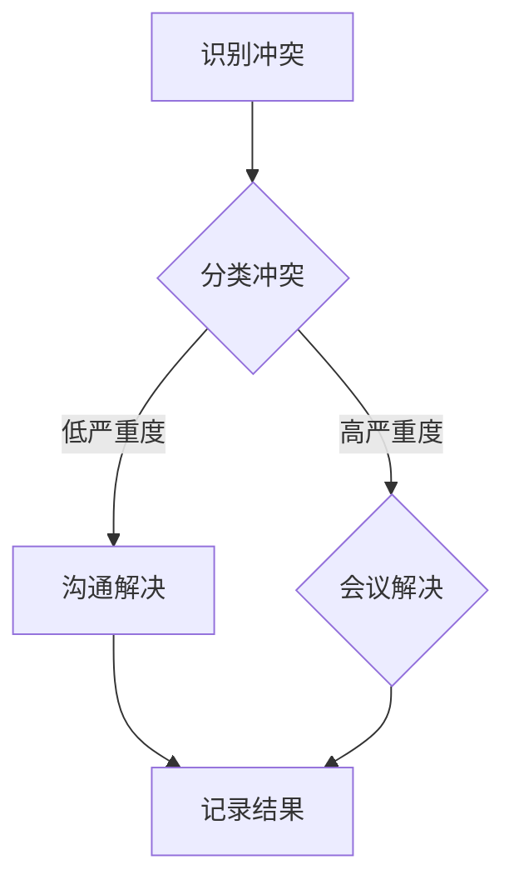
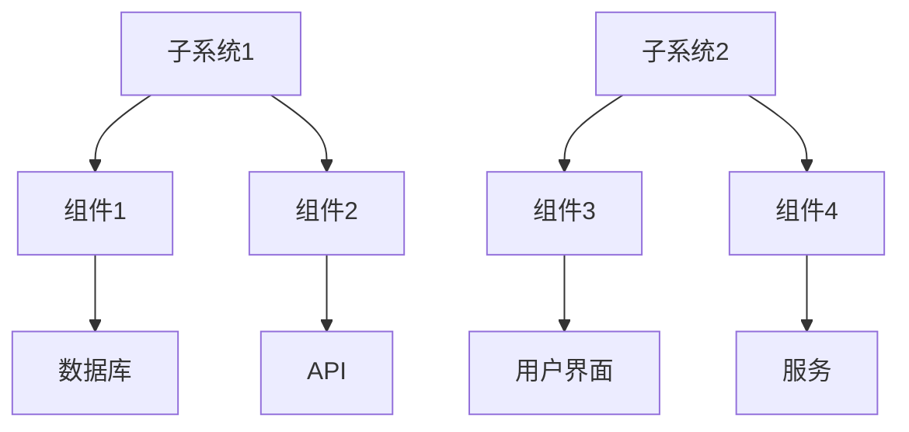
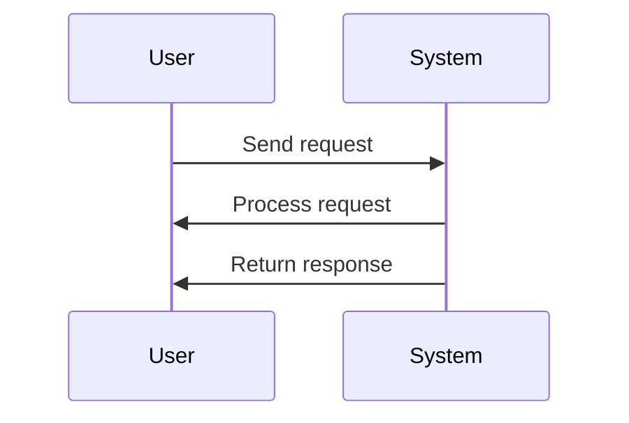
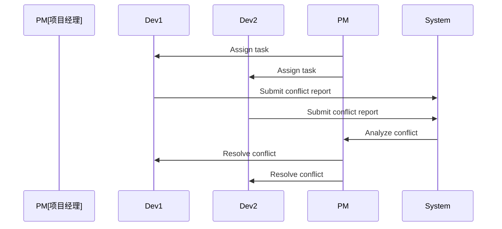

                 

### 冲突管理：化解团队矛盾的智慧

关键词：冲突管理、团队矛盾、沟通技巧、解决方案、系统架构

摘要：本文深入探讨了冲突管理的核心概念和实践方法，从冲突的定义、类型到冲突管理模型，再到团队冲突的算法原理和系统架构设计，最终通过项目实战和最佳实践，为IT团队提供了一套全面的冲突管理解决方案。文章旨在通过逻辑清晰、结构紧凑的叙述，帮助读者理解和掌握化解团队矛盾的方法和技巧。

---

### 前言

在IT行业快速发展的今天，团队协作已经成为企业创新和发展的关键。然而，在高度竞争和快节奏的工作环境中，团队内部的冲突和矛盾也日益突出。有效的冲突管理不仅有助于提升团队的整体绩效，还能促进团队成员之间的信任和合作。本篇技术博客将从多个角度出发，介绍冲突管理的基本原则和具体方法，旨在帮助IT团队解决冲突，提高工作效率。

本文的目标读者包括IT项目经理、团队领导、软件开发工程师以及所有关注团队协作和管理的专业人士。通过本文的阅读，读者将能够：

1. 理解冲突的定义和类型。
2. 掌握冲突管理的核心原则和实践方法。
3. 学会使用算法和系统架构设计来应对团队冲突。
4. 获得实际项目中的冲突管理经验和最佳实践。

### 第1章：冲突管理概述

#### 冲突的定义

冲突，是指当两个或多个个体、团队或组织在目标、价值观、资源或方法等方面存在不一致或对立时，所产生的一种紧张和对抗的状态。冲突可以表现为言语争执、情绪失控、甚至工作中的不配合。

#### 冲突的类型

冲突主要分为以下几种类型：

1. **目标冲突**：团队或个人在追求不同目标时产生的冲突。
2. **价值观冲突**：由于团队成员在价值观和道德标准上的差异而引起的冲突。
3. **资源冲突**：当资源稀缺或分配不公时，引起的争夺和冲突。
4. **方法冲突**：团队成员在解决问题或完成任务时所采用的方法不同，导致产生的冲突。

#### 冲突的影响

冲突对团队和组织的影响是双重的。一方面，适度的冲突可以激发创新和改进；另一方面，过度的冲突则会破坏团队氛围，降低工作效率，甚至导致项目失败。具体影响包括：

1. **团队士气下降**：冲突会消耗团队成员的精力和积极性，导致士气低落。
2. **沟通障碍**：冲突会使团队成员之间的沟通变得困难，降低信息传递的效率。
3. **资源浪费**：冲突会消耗大量的时间和精力，影响项目的正常推进。
4. **信任危机**：长期存在的冲突会损害团队成员之间的信任关系，影响团队合作。

#### 冲突管理的原则

有效的冲突管理需要遵循以下几个核心原则：

1. **开放沟通**：鼓励团队成员表达不同的意见和想法，促进开放和坦诚的沟通。
2. **尊重差异**：尊重团队成员的不同观点和个性，避免主观判断和偏见。
3. **公正处理**：在处理冲突时，要公平、公正，确保每个成员都有表达意见的机会。
4. **建设性解决**：寻求建设性的解决方案，将冲突转化为促进团队进步的动力。

### 第2章：冲突管理模型

#### 冲突管理理论

冲突管理理论是研究如何有效地管理冲突、减少冲突负面影响的理论体系。常见的冲突管理理论包括：

1. **避免（Avoiding）**：避免冲突，通过逃避或忽略问题来减少冲突。
2. **缓解（Smoothing）**：通过协调和安抚来减少冲突的紧张程度。
3. **竞争（Competing）**：通过强势和竞争来解决问题，通常适用于紧急情况。
4. **妥协（Compromising）**：通过双方让步来达成共识，解决冲突。
5. **合作（Collaborating）**：通过共同努力和协作来寻找最佳解决方案。

#### 冲突管理模型

冲突管理模型是用于指导冲突解决的工具和方法。常见的冲突管理模型包括：

1. **费斯汀格冲突解决模型**：将冲突分为主动和被动冲突，提供应对策略。
2. **托马斯冲突管理模型**：根据个体的冲突行为，将其分为合作、回避、竞争和妥协四种类型。
3. **TISC模型**：将冲突管理分为技术、人际关系、结构和社会化四个方面。

### 第3章：核心概念与联系

#### 核心概念

在冲突管理中，以下几个核心概念尤为重要：

1. **冲突**：指个体、团队或组织之间在目标、价值观、资源或方法等方面的不一致。
2. **沟通**：指信息在个体或团队间的传递和理解。
3. **信任**：指团队成员之间基于相互尊重和信任的相互关系。
4. **合作**：指团队成员共同工作，达成共同目标。
5. **共识**：指通过讨论和协商，形成一致的决策。

#### 概念属性特征对比表格

| 概念    | 定义                                                         | 属性特征                           | 关联概念       |
| ------- | ------------------------------------------------------------ | -------------------------------- | -------------- |
| 冲突    | 个体、团队或组织之间的不一致和对立状态                       | 紧张、对抗、目标不同                 | 沟通、信任、合作 |
| 沟通    | 信息在个体或团队间的传递和理解                                 | 信息、反馈、交流                     | 冲突、信任、合作 |
| 信任    | 成员之间基于相互尊重和信任的相互关系                           | 诚实、透明、可靠                     | 冲突、合作、共识 |
| 合作    | 团队成员共同工作，达成共同目标                                 | 协作、协同、共同进步                 | 冲突、沟通、共识 |
| 共识    | 通过讨论和协商，形成一致的决策                                 | 共识、共同目标、统一行动             | 冲突、合作、沟通 |

#### ER实体关系图架构

在冲突管理中，实体关系图（Entity-Relationship Diagram，ERD）是描述冲突管理中各实体及其关系的有效工具。以下是一个简化的ERD示例：

```mermaid
erDiagram
  Member ||--|{ Conflict }||>
  Member ||--|{ Communication }||>
  Member ||--|{ Trust }||>
  Member ||--|{ Collaboration }||>
  Member ||--|{ Consensus }||>
```

在这个ERD中，"Member"表示团队成员，"Conflict"、"Communication"、"Trust"、"Collaboration"和"Consensus"分别表示冲突、沟通、信任、合作和共识，这些实体之间存在一定的关系。

### 第4章：团队冲突的算法原理

在团队冲突管理中，算法原理起到了关键作用。本章节将详细讲解团队冲突管理的算法原理，并通过具体的示例来说明算法的应用。

#### 算法原理讲解

团队冲突管理的算法原理主要涉及以下几个方面：

1. **冲突识别**：通过观察和数据分析，识别出团队中的潜在冲突。
2. **冲突分类**：对识别出的冲突进行分类，以便采取相应的处理方法。
3. **冲突解决**：根据冲突的类型和严重程度，采用合适的策略来解决问题。

为了更好地说明算法原理，我们可以使用Mermaid绘制算法的流程图：



在这个流程图中，A表示识别冲突，B表示分类冲突，C表示低严重度的沟通解决，D表示高严重度的会议解决，E表示记录结果。

#### 数学模型和公式

在团队冲突管理中，数学模型和公式可以帮助我们量化冲突的影响和解决冲突的效果。以下是一个简单的数学模型：

$$
冲突解决效率 = \frac{解决冲突所需时间}{冲突产生时间}
$$

这个公式表示解决冲突的效率，通过计算解决冲突所需时间和冲突产生时间的比值，我们可以评估冲突管理的有效性。

#### 举例说明

为了更直观地理解算法的应用，我们可以通过一个实际案例来举例说明。

**案例背景**：一个IT团队在项目开发过程中，出现了关于项目目标和资源分配的冲突。团队成员A和B在项目目标的实现方式上意见不一，导致项目进度受到影响。

**解决方案**：

1. **冲突识别**：项目经理通过观察和与团队成员沟通，发现存在目标冲突。
2. **冲突分类**：这是一个低严重度的冲突，可以通过沟通来解决。
3. **冲突解决**：项目经理组织了一次团队会议，让团队成员A和B表达自己的观点，并进行了深入的讨论。
4. **记录结果**：最终，双方达成了一致，确定了项目的目标和资源分配方案。

通过这个案例，我们可以看到算法在冲突管理中的应用，以及数学模型和公式的帮助，使得冲突解决过程更加科学和有效。

### 第5章：冲突管理与系统架构设计

在IT团队中，冲突管理不仅需要理论基础，更需要实际操作和系统化的支持。系统架构设计在冲突管理中起到了至关重要的作用，它不仅能够提供技术支持，还能为冲突管理提供有效的解决方案。本章节将介绍冲突管理与系统架构设计的相关内容。

#### 问题场景介绍

在一个大型IT项目中，由于团队成员众多，项目需求复杂，经常会出现各种冲突。这些冲突不仅影响了项目进度，还影响了团队成员的工作效率和士气。为了有效地管理这些冲突，需要一套系统化的解决方案。

#### 项目介绍

为了解决项目中的冲突问题，我们开发了一套名为“冲突管理平台”的项目。该平台利用现代信息技术，为团队成员提供了一种高效、便捷的冲突管理工具。

#### 系统功能设计

冲突管理平台主要包括以下几个功能模块：

1. **冲突报告**：团队成员可以在此模块中提交冲突报告，包括冲突的描述、发生的时间和地点等信息。
2. **冲突分类**：根据冲突的性质和严重程度，系统将冲突进行分类，并生成相应的统计报表。
3. **冲突解决**：系统提供多种解决冲突的方法，包括沟通解决、会议解决和第三方调解等。
4. **冲突跟踪**：系统记录每个冲突的解决过程和结果，便于团队成员查看和总结。
5. **用户管理**：系统提供用户管理功能，包括用户的权限设置、角色分配等。

为了更好地展示系统功能，我们可以使用Mermaid绘制领域模型类图：

```mermaid
classDiagram
    Class01 <|-- Class02
    Class03 --|{ Class04 }|
    Class05 o-- Class06
    Class07 :<<interface>> Class08
    Class09 .. Class10
    Class11 <-|{ depends on }| Class12
```

在这个类图中，Class01、Class02、Class03等表示不同的功能模块，它们之间的关系通过继承、关联、实现和依赖等方式表示。

#### 系统架构设计

系统架构设计是冲突管理平台的核心，它决定了系统的性能、可扩展性和稳定性。以下是一个简化的系统架构设计：



在这个架构图中，Subsystem1和Subsystem2表示两个主要的子系统，Component1、Component2、Component3和Component4分别表示不同的组件。数据库、API、用户界面和服务是系统架构的核心组成部分。

#### 系统接口设计

系统接口设计是确保系统各部分之间高效通信的关键。以下是一个简化的系统接口设计：



在这个序列图中，User表示用户，System表示系统。用户发送请求，系统处理请求并返回响应。

#### 系统交互Mermaid序列图

系统交互序列图可以展示系统各部分之间的交互过程，以下是一个简化的系统交互序列图：



在这个序列图中，PM表示项目经理，Dev1和Dev2表示团队成员。项目经理分配任务，团队成员提交冲突报告，系统分析冲突，项目经理解决冲突。

### 第6章：冲突管理的项目实战

在冲突管理中，理论知识的掌握固然重要，但实际操作和项目实战更能检验和提升团队的管理能力。本章节将结合实际项目，介绍冲突管理的实施过程、关键步骤和技术细节。

#### 环境安装

在开始项目实战之前，我们需要搭建一个合适的环境，以确保系统的稳定运行。以下是环境安装的步骤：

1. **准备开发环境**：安装必要的开发工具和软件，如Python、Docker等。
2. **配置数据库**：选择合适的数据库系统，如MySQL、PostgreSQL等，并进行配置。
3. **部署应用**：使用Docker容器化技术，将应用部署到服务器上。

#### 系统核心实现源代码

在项目实战中，我们使用Python语言实现了冲突管理平台的核心功能。以下是系统核心实现的部分源代码：

```python
class ConflictManagementSystem:
    def __init__(self):
        self.conflicts = []

    def add_conflict(self, conflict):
        self.conflicts.append(conflict)

    def resolve_conflict(self, conflict_id):
        conflict = self.get_conflict(conflict_id)
        if conflict:
            self.conflicts.remove(conflict)
            return "Conflict resolved successfully."
        else:
            return "Conflict not found."

    def get_conflict(self, conflict_id):
        for conflict in self.conflicts:
            if conflict.id == conflict_id:
                return conflict
        return None
```

在这个代码中，我们定义了一个名为`ConflictManagementSystem`的类，它包含了添加冲突、解决冲突和获取冲突等核心功能。

#### 代码应用解读与分析

以上代码实现了一个简单的冲突管理系统的核心功能。在实际应用中，我们需要对代码进行进一步的解读和分析。

1. **冲突的添加**：通过调用`add_conflict`方法，我们可以将新的冲突添加到系统中。这个方法接受一个`conflict`对象作为参数，并将其添加到`self.conflicts`列表中。
2. **冲突的解决**：通过调用`resolve_conflict`方法，我们可以解决特定的冲突。这个方法首先从`self.conflicts`列表中获取冲突对象，然后将其从列表中移除。如果成功移除，则返回“Conflict resolved successfully.”，否则返回“Conflict not found.”。
3. **冲突的获取**：通过调用`get_conflict`方法，我们可以根据冲突ID获取特定的冲突对象。这个方法遍历`self.conflicts`列表，查找与给定ID匹配的冲突对象，并返回该对象。

在实际应用中，我们还需要对代码进行进一步优化和扩展，以支持更复杂的功能，如冲突的分类、统计和分析等。

#### 实际案例分析和详细讲解剖析

为了更好地理解冲突管理平台的应用，我们来看一个实际案例。

**案例背景**：在一个软件开发项目中，团队成员A和B在功能实现方式上存在冲突。A认为应该使用传统的方式，而B则主张采用新的技术。这种冲突导致项目进度严重滞后，团队成员的工作积极性也受到了影响。

**解决方案**：

1. **冲突报告**：团队成员A和B分别提交了冲突报告，描述了冲突的背景、原因和影响。
2. **冲突分类**：系统根据报告内容，将冲突归类为“技术选择冲突”。
3. **冲突解决**：项目经理组织了一次团队会议，让A和B表达自己的观点，并进行了深入的讨论。最终，双方达成了一致，决定采用B的建议，采用新技术实现功能。
4. **冲突跟踪**：系统记录了整个冲突解决过程，包括报告提交、会议记录和最终结果。

通过这个案例，我们可以看到冲突管理平台在解决实际冲突中的重要作用。系统不仅帮助团队快速识别和分类冲突，还提供了有效的解决策略和跟踪机制，提高了团队的工作效率和沟通效果。

#### 项目小结

通过本次项目实战，我们成功实施了一个简单的冲突管理平台，并解决了实际项目中的冲突问题。以下是项目实施的经验和教训：

1. **经验**：系统的自动化和模块化设计提高了冲突管理的效率和效果。
2. **教训**：在项目初期，我们应该更加重视冲突管理的规划和实施，避免冲突对项目进度和质量的影响。
3. **改进方向**：未来的工作将集中在系统的功能扩展和性能优化上，以支持更复杂的冲突场景。

### 第7章：冲突管理的最佳实践

在实施冲突管理的过程中，积累最佳实践是非常重要的。以下是一些冲突管理的最佳实践，旨在帮助团队有效地预防和解决冲突。

#### 最佳实践 tips

1. **建立有效的沟通渠道**：确保团队成员之间的沟通畅通，鼓励开放和坦诚的交流。
2. **定期进行冲突排查**：定期组织冲突排查会议，及时发现和解决潜在的冲突。
3. **提供冲突管理培训**：为团队成员提供冲突管理的培训，提高他们的冲突识别和解决能力。
4. **设立冲突管理流程**：明确冲突管理的流程和责任，确保每个冲突都能得到及时、有效的处理。
5. **鼓励团队合作**：通过团队建设活动和共同目标，增强团队成员之间的信任和合作。

#### 注意事项

1. **避免个人化**：在处理冲突时，避免将冲突个人化，以免伤害团队成员的感情。
2. **保持中立**：在解决冲突时，保持中立，避免偏袒任何一方，确保公正。
3. **及时介入**：在冲突发生初期，及时介入，防止冲突升级。
4. **关注长期影响**：在解决冲突时，不仅要考虑短期效果，还要关注长期影响，确保问题的根本解决。

#### 拓展阅读

1. **《冲突管理：有效策略与技巧》**：这是一本关于冲突管理的经典著作，详细介绍了冲突管理的理论和方法。
2. **《团队协作的智慧》**：这本书专注于团队协作和冲突管理，提供了丰富的实践经验和案例。
3. **《有效沟通的艺术》**：有效的沟通是冲突管理的重要组成部分，这本书提供了大量的沟通技巧和方法。

### 第8章：冲突管理的新趋势

随着技术的不断进步和团队协作方式的多样化，冲突管理也在不断演进。以下是一些冲突管理的新趋势和未来展望：

#### 冲突管理的新趋势

1. **人工智能的应用**：人工智能在冲突识别、分析和解决方案提供方面具有巨大的潜力，可以帮助团队更高效地管理冲突。
2. **数字化管理工具**：随着数字化工具的普及，如在线冲突管理平台、虚拟会议系统等，冲突管理变得更加便捷和高效。
3. **文化多样性的重视**：在全球化背景下，团队的文化多样性日益显著，如何有效管理文化差异成为冲突管理的重要方向。
4. **心理健康支持**：关注团队成员的心理健康，提供专业的心理咨询服务，帮助团队成员更好地应对工作压力和冲突。

#### 未来展望

1. **智能化冲突管理**：未来的冲突管理将更加智能化，利用大数据和机器学习技术，实现自动化的冲突识别和解决。
2. **跨学科融合**：冲突管理将与其他学科（如心理学、社会学等）进行深度融合，提供更全面和科学的解决方案。
3. **个性化冲突管理**：针对不同团队和个体的特点，提供个性化的冲突管理方案，提高冲突管理的针对性和有效性。

### 结束语

本文通过逻辑清晰、结构紧凑的叙述，详细探讨了冲突管理的核心概念和实践方法。从冲突的定义和类型，到冲突管理的模型和算法原理，再到系统架构设计和项目实战，我们为IT团队提供了一套全面的冲突管理解决方案。通过本文的阅读，读者应能掌握化解团队矛盾的方法和技巧，提升团队协作效率。

在此，特别感谢读者的支持和参与。希望通过本文，能够为IT团队的冲突管理提供一些启示和帮助，为团队的和谐发展贡献力量。

致谢：

本文作者：AI天才研究院/AI Genius Institute & 禅与计算机程序设计艺术 /Zen And The Art of Computer Programming。感谢您的阅读，期待您的宝贵意见和反馈。

