                 

### 第一部分: 分形几何的基本概念

分形几何是一门研究不规则形状、复杂结构和无限性的数学分支。它起源于20世纪中叶，由数学家曼德布罗特（Benoit Mandelbrot）提出。分形几何的核心概念包括自相似性、无限性、复杂性和确定性。这些概念不仅定义了分形几何的基本特性，也为我们在自然界和科学研究中探索分形现象提供了理论基础。

#### 2.1 自相似性与无限性

**2.1.1 自相似性的定义**

自相似性是指一个形状在不同尺度下看起来相似。形式上，一个集合\(A\)被称为自相似的，如果存在一组相似变换，使得\(A\)中的每个部分都与\(A\)整体相似。

$$
\text{相似变换}: f: A \rightarrow A, \quad f(x) = k \cdot x + b
$$

例如，一颗树的形状无论从树冠、树枝还是树根来看，都是相似的。这种自相似性可以通过数学模型来描述。

**2.1.2 无限性的概念**

分形结构在无限尺度上仍然存在，这意味着分形可以是无穷大的，但它们的复杂性在有限尺度内可以描述。例如，科赫曲线（Koch Curve）就是一个典型的分形结构，它通过无限次的迭代产生，但在有限的尺度内可以被完整地描述。

#### 2.2 复杂性与确定性

**2.2.1 复杂性的解释**

分形结构看上去非常复杂，但它们可以用简单的规则生成。这种看似复杂却由简单规则产生的结构称为分形。例如，科赫曲线的生成只需要三个步骤：将每条线段分成三等分，从中间点向外绘制两条线段，删除中间的线段。

**2.2.2 确定性分析**

分形的生成过程是确定的，不受随机因素的影响。这意味着分形的形状是可以通过明确的数学规则来预测的。例如，科赫曲线的生成过程就是完全确定的，只需按照特定的迭代规则执行即可。

#### 2.3 分形的类型

**2.3.1 集合分形**

集合分形是由一组迭代过程产生的，这些过程通常是确定性的。例如，科赫曲线和曼德尔布罗特集（Mandelbrot Set）都是集合分形。

**2.3.2 测度分形**

测度分形关注的是集合的测度（即集合的“大小”），而不是集合本身。例如，分形维数就是测度分形的一个典型例子。

### 第3章: 分形几何的数学理论

分形几何的数学理论是分形研究的基石，它包括分形维数的定义、计算方法和生成算法等。这些理论为我们理解和应用分形提供了数学基础。

#### 3.1 分形维数的定义

**3.1.1 何为维数**

维数描述了一个集合的复杂性和结构。传统的整数维数（如一维、二维、三维）无法描述分形的复杂性。因此，需要引入新的维数概念来描述分形的特征。

**3.1.2 分形维数的计算方法**

分形维数可以通过分形集的覆盖、嵌入、关联等方法计算。其中最常用的是盒计数法（Box Counting Method）。

$$
D = \lim_{\varepsilon \to 0} \frac{\log N(\varepsilon)}{-\log \varepsilon}
$$

其中，\(N(\varepsilon)\)表示覆盖分形集所需的盒数，\(\varepsilon\)表示每个盒的边长。

#### 3.2 分形的生成算法

**3.2.1 约翰逊算法**

约翰逊算法是一种生成集合分形的方法，通过迭代一个映射来生成分形。例如，约翰逊曲线（Jensen Curve）就是通过约翰逊算法生成的。

**3.2.2 科赫算法**

科赫算法是一种生成分形曲线的简单方法，通过迭代一个三角形的边来生成更为复杂的形状。例如，科赫曲线就是通过科赫算法生成的。

### 第4章: 分形几何的应用

分形几何不仅在数学理论研究中具有重要意义，还在实际应用中发挥着重要作用。以下将介绍分形几何在图像处理和物理学中的应用。

#### 4.1 分形几何在图像处理中的应用

**4.1.1 图像压缩**

分形几何在图像压缩中的应用，通过分形编码技术实现高效压缩。例如，分形图像编码（Fractal Image Compression）就是一种基于分形几何的图像压缩技术。

**4.1.2 图像去噪**

分形几何在图像去噪中的应用，利用分形特性去除噪声。例如，分形去噪算法（Fractal Noise Reduction）就是一种基于分形几何的图像去噪技术。

#### 4.2 分形几何在物理学中的应用

**4.2.1 分形几何在流体力学中的应用**

分形几何在流体力学中的应用，研究流体的复杂流动行为。例如，分形流动理论（Fractal Flow Theory）就是一种基于分形几何的流体力学理论。

### 第5章: 分形几何与计算机科学

分形几何与计算机科学的结合，推动了计算机图形学、算法设计、计算机视觉等领域的发展。以下将介绍分形几何在计算机科学中的应用。

#### 5.1 分形几何在计算机图形学中的应用

**5.1.1 分形纹理**

分形纹理是一种基于分形几何的纹理生成技术，它可以生成复杂的自然纹理。例如，分形噪声（Fractal Noise）就是一种常用的分形纹理。

**5.1.2 分形艺术**

分形艺术是一种利用分形几何生成的艺术作品，它具有独特的视觉效果和数学美感。

### 第6章: 分形几何在自然界中的实例

分形几何在自然界中具有广泛的应用，以下将介绍一些自然界中的分形现象。

#### 6.1 自然界的分形现象

**6.1.1 海岸线**

海岸线的形状具有分形特性，其长度无法精确测量，但可以通过分形几何来描述。

**6.1.2 云的形状**

云的形状也具有分形特性，其边缘和形状在不同尺度下表现出相似性。

### 第7章: 总结与展望

分形几何是一门充满挑战和机遇的数学分支，它在自然界、科学研究和实际应用中发挥着重要作用。随着科学技术的不断发展，分形几何的应用前景将更加广阔。

#### 7.1 分形几何的应用前景

**7.1.1 生物医学**

分形几何在生物医学中的应用，如肿瘤生长模型、药物释放控制等。

**7.1.2 金融工程**

分形几何在金融工程中的应用，如市场波动分析、风险控制等。

#### 7.2 分形几何的研究趋势

**7.2.1 多尺度分形**

多尺度分形是当前分形几何研究的一个重要方向，它关注分形在不同尺度下的行为和特性。

**7.2.2 分形网络**

分形网络是一种新的网络结构，它具有分形特性，如自相似性、无限性和复杂性。

#### 7.3 分形几何的未来发展

分形几何的未来发展将依赖于数学、计算机科学、物理学等多学科的合作。随着新算法、新工具和新理论的不断出现，分形几何的应用领域将不断拓展。

```markdown
----------------------------------------------------------------
# 第二部分: 分形几何的数学理论

分形几何的数学理论是理解分形现象的重要基石，它为我们提供了描述和计算分形特性的工具。在这一部分，我们将深入探讨分形维数的概念及其计算方法，以及分形的生成算法。

## 第8章: 分形维数的定义与计算

### 8.1 维数的概念

维数是描述空间中一个对象复杂程度的基本量。在传统的几何学中，维数通常是一个整数，如一维线、二维面和三维体。然而，分形几何引入了一种新的维数概念，即分形维数。

**8.1.1 分形维数的定义**

分形维数是一个非整数，用于描述分形集合的复杂性和结构。它不仅反映了集合的几何特性，还包括了其结构的细节和层次。

**8.1.2 分形维数的分类**

分形维数可以分为几类：

- **豪斯道维数（Hausdorff Dimension）**：用于描述集合的几何性质。
- **拓扑维数（Topological Dimension）**：用于描述集合的拓扑性质。
- **豪斯道-贝特兰维数（Hausdorff-Besicovitch Dimension）**：包括豪斯道维数和贝特兰维数。

### 8.2 盒计数法

盒计数法是一种常用的计算分形维数的方法。其基本思想是：将分形集合放入一个容器中，然后通过计算容器中可以容纳的分形集合的盒数来估计分形维数。

**8.2.1 盒计数法的步骤**

1. 选择一个较小的盒尺寸\(\varepsilon\)。
2. 计算分形集合被\(\varepsilon\)盒覆盖的次数\(N(\varepsilon)\)。
3. 改变盒尺寸，重复步骤2，得到一系列的\(N(\varepsilon)\)值。
4. 对\(\log N(\varepsilon)\)和\(-\log \varepsilon\)作图，找到其渐近线的斜率，该斜率即为分形维数。

$$
D = \lim_{\varepsilon \to 0} \frac{\log N(\varepsilon)}{-\log \varepsilon}
$$

### 8.3 其他维数计算方法

除了盒计数法，还有其他一些计算分形维数的方法，如：

- **嵌入维数法（Embedding Dimension）**：通过将分形集合嵌入到一个高维空间中来计算维数。
- **关联维数法（Correlation Dimension）**：通过分析集合与其嵌入空间中的相关性质来计算维数。

## 第9章: 分形的生成算法

分形的生成算法是构建分形结构的重要手段。在这一部分，我们将介绍两种经典的分形生成算法：约翰逊算法和科赫算法。

### 9.1 约翰逊算法

约翰逊算法是一种生成集合分形的方法，它基于迭代函数系统（Iterated Function System, IFS）。

**9.1.1 算法原理**

1. 选择一组迭代函数，这些函数将分形集合映射到自身。
2. 对初始集合进行迭代，得到新的分形集合。
3. 重复迭代过程，直到分形集合收敛。

**9.1.2 算法示例**

假设我们有一个初始集合\(A_0\)，选择两个迭代函数\(f_1\)和\(f_2\)，则迭代过程为：

$$
A_{n+1} = f_1(A_n) \cup f_2(A_n)
$$

通过多次迭代，可以得到一个分形集合。

### 9.2 科赫算法

科赫算法是一种生成分形曲线的方法，它通过迭代一个简单的几何形状来生成更为复杂的形状。

**9.2.1 算法原理**

1. 选择一个简单的几何形状，如一个三角形。
2. 将每条边分成三等分，并在每条边的中点绘制两条新的线段。
3. 删除中间的部分，保留两条新线段。
4. 重复步骤2和3，直到达到所需的迭代次数。

**9.2.2 算法示例**

假设我们有一个初始三角形，通过三次迭代，我们可以得到一个科赫曲线。

$$
A_1 = \frac{1}{3} \cdot A_0 + \frac{1}{3} \cdot A_0 + \frac{1}{3} \cdot A_0
$$

$$
A_2 = \frac{1}{3} \cdot A_1 + \frac{1}{3} \cdot A_1 + \frac{1}{3} \cdot A_1
$$

$$
A_3 = \frac{1}{3} \cdot A_2 + \frac{1}{3} \cdot A_2 + \frac{1}{3} \cdot A_2
$$

通过上述迭代过程，我们可以生成一个科赫曲线。

## 第10章: 分形几何的应用

分形几何在许多领域都有广泛的应用，如图像处理、物理学、生物学和计算机科学等。在这一部分，我们将简要介绍分形几何在这些领域的应用。

### 10.1 图像处理

**10.1.1 图像压缩**

分形图像压缩是一种高效的无损图像压缩方法，它利用分形的自相似性来减少图像数据的大小。

**10.1.2 图像去噪**

分形几何在图像去噪中的应用，通过利用分形的特性来去除图像中的噪声。

### 10.2 物理学

**10.2.1 流体力学**

分形几何在流体力学中的应用，如研究流体的复杂流动行为。

**10.2.2 天体物理学**

分形几何在天体物理学中的应用，如研究星系的结构和宇宙的大尺度结构。

### 10.3 生物学

**10.3.1 肿瘤生长**

分形几何在肿瘤生长模型中的应用，如研究肿瘤的生长过程和形态变化。

**10.3.2 生态系统**

分形几何在生态系统中的应用，如研究生态系统的结构和动态变化。

### 10.4 计算机科学

**10.4.1 计算机图形学**

分形几何在计算机图形学中的应用，如生成复杂的纹理和艺术作品。

**10.4.2 计算机视觉**

分形几何在计算机视觉中的应用，如图像分割和目标识别。

## 第11章: 总结与展望

分形几何的数学理论为我们提供了理解和应用分形的有效工具。随着科学技术的不断发展，分形几何的应用将更加广泛，不仅在理论研究中有重要地位，也在实际应用中发挥着重要作用。

### 11.1 分形几何的应用前景

**11.1.1 生物医学**

分形几何在生物医学中的应用，如肿瘤治疗和药物设计。

**11.1.2 金融工程**

分形几何在金融工程中的应用，如风险管理。

**11.1.3 人工智能**

分形几何在人工智能中的应用，如神经网络和深度学习。

### 11.2 分形几何的研究趋势

**11.2.1 多尺度分形**

多尺度分形是当前分形几何研究的一个重要方向，它关注分形在不同尺度下的行为和特性。

**11.2.2 分形网络**

分形网络是一种新的网络结构，它具有分形特性，如自相似性、无限性和复杂性。

**11.2.3 分形几何与其他学科的交叉**

分形几何与其他学科的交叉研究，如物理学、生物学和计算机科学等，将推动分形几何的进一步发展。

### 11.3 分形几何的未来发展

分形几何的未来发展将依赖于数学、计算机科学、物理学等多学科的合作。随着新算法、新工具和新理论的不断出现，分形几何的应用领域将不断拓展。

----------------------------------------------------------------
## 第8章: 分形维数的定义与计算

分形维数是分形几何的核心概念之一，它用于描述分形集合的复杂性和结构。分形维数不同于传统的整数维数，它是一个非整数，可以是一个分数，甚至是无理数。在计算分形维数时，我们通常使用盒计数法、嵌入维数法等方法。以下是关于分形维数的详细探讨。

### 8.1 维数的概念

维数是描述空间中对象复杂程度的基本量。在传统几何学中，维数通常是一个整数，如一维线、二维面和三维体。然而，分形几何引入了一种新的维数概念，即分形维数。

**8.1.1 分形维数的定义**

分形维数是一个非整数，用于描述分形集合的复杂性和结构。它不仅反映了集合的几何性质，还包括了其结构的细节和层次。分形维数可以通过多种方法计算，如豪斯道维数（Hausdorff Dimension）、拓扑维数（Topological Dimension）和豪斯道-贝特兰维数（Hausdorff-Besicovitch Dimension）。

- **豪斯道维数（Hausdorff Dimension）**：用于描述集合的几何性质。它衡量了一个集合在所有尺度上的复杂程度。
- **拓扑维数（Topological Dimension）**：用于描述集合的拓扑性质。它衡量了一个集合在拓扑空间中的结构。
- **豪斯道-贝特兰维数（Hausdorff-Besicovitch Dimension）**：包括豪斯道维数和贝特兰维数。它是一个更广义的维数概念，用于描述集合在无限尺度上的复杂程度。

### 8.2 盒计数法

盒计数法是一种常用的计算分形维数的方法。其基本思想是：将分形集合放入一个容器中，然后通过计算容器中可以容纳的分形集合的盒数来估计分形维数。

**8.2.1 盒计数法的步骤**

1. **选择一个较小的盒尺寸**：选择一个较小的盒尺寸\(\varepsilon\)，用于覆盖分形集合。
2. **计算分形集合被\(\varepsilon\)盒覆盖的次数**：计算分形集合被\(\varepsilon\)盒覆盖的次数\(N(\varepsilon)\)。这通常需要遍历整个分形集合，并计算每个点被多少个\(\varepsilon\)盒覆盖。
3. **改变盒尺寸，重复步骤2**：改变盒尺寸，重复步骤2，得到一系列的\(N(\varepsilon)\)值。
4. **对\(\log N(\varepsilon)\)和\(-\log \varepsilon\)作图**：将\(\log N(\varepsilon)\)和\(-\log \varepsilon\)作图，找到其渐近线的斜率，该斜率即为分形维数。

$$
D = \lim_{\varepsilon \to 0} \frac{\log N(\varepsilon)}{-\log \varepsilon}
$$

**8.2.2 盒计数法的应用**

盒计数法可以用于计算各种分形的维数，如曼德尔布罗特集、科赫曲线和约翰逊曲线等。

### 8.3 其他维数计算方法

除了盒计数法，还有其他一些计算分形维数的方法，如：

- **嵌入维数法（Embedding Dimension）**：通过将分形集合嵌入到一个高维空间中来计算维数。
- **关联维数法（Correlation Dimension）**：通过分析集合与其嵌入空间中的相关性质来计算维数。

### 8.4 分形维数的性质

- **非负性**：分形维数总是非负的。
- **齐次性**：如果将分形集合放大或缩小一个常数因子，其分形维数保持不变。
- **尺度不变性**：分形维数不依赖于尺度，即在不同的尺度下，分形集合的复杂性是相同的。

### 8.5 分形维数的计算示例

我们以科赫曲线为例，说明如何计算其分形维数。

**8.5.1 科赫曲线的定义**

科赫曲线是通过迭代一个简单的几何形状生成的，具体步骤如下：

1. 选择一个初始线段。
2. 将每条线段的三等分点连接，形成一个新的三角形。
3. 删除每个三角形的中间线段，保留三条边。
4. 重复步骤2和3，直到达到所需的迭代次数。

**8.5.2 科赫曲线的维数**

假设科赫曲线经过\(n\)次迭代，其长度\(L_n\)与初始线段长度\(L_0\)之间的关系为：

$$
L_n = L_0 \cdot \left(\frac{4}{3}\right)^n
$$

根据盒计数法，我们可以计算科赫曲线的维数。

$$
D = \lim_{\varepsilon \to 0} \frac{\log N(\varepsilon)}{-\log \varepsilon}
$$

其中，\(N(\varepsilon)\)是覆盖科赫曲线所需的盒数。对于科赫曲线，每个盒可以覆盖的线段数为：

$$
N(\varepsilon) = \left\lceil \frac{L_n}{\varepsilon} \right\rceil
$$

代入\(L_n\)的表达式，得到：

$$
N(\varepsilon) = \left\lceil \frac{L_0 \cdot \left(\frac{4}{3}\right)^n}{\varepsilon} \right\rceil
$$

取对数，得到：

$$
\log N(\varepsilon) = \log \left\lceil \frac{L_0 \cdot \left(\frac{4}{3}\right)^n}{\varepsilon} \right\rceil
$$

代入分形维数的公式，得到：

$$
D = \lim_{\varepsilon \to 0} \frac{\log \left\lceil \frac{L_0 \cdot \left(\frac{4}{3}\right)^n}{\varepsilon} \right\rceil}{-\log \varepsilon}
$$

当\(n\)趋于无穷大时，科赫曲线的维数趋于1.2618。

$$
D = \lim_{n \to \infty} D_n = 1.2618
$$

通过上述计算，我们得到了科赫曲线的分形维数。

### 8.6 分形维数在图像处理中的应用

分形维数在图像处理中有重要的应用，如图像压缩、图像去噪和图像特征提取等。

- **图像压缩**：分形图像压缩是一种基于分形几何的图像压缩方法，它利用分形的自相似性来减少图像数据的大小。
- **图像去噪**：分形去噪算法利用分形的特性来去除图像中的噪声，它可以通过调整分形维数来平衡图像的清晰度和噪声去除效果。
- **图像特征提取**：分形维数可以用于描述图像的复杂性和结构，它可以帮助识别图像中的纹理和形状特征。

通过上述讨论，我们可以看到分形维数是分形几何中的一个重要概念，它不仅可以用于描述分形的复杂性和结构，还可以应用于图像处理、物理学和生物学等领域。随着分形几何研究的深入，分形维数的计算和应用将变得更加广泛和深入。

----------------------------------------------------------------
## 第9章: 分形的生成算法

分形的生成算法是构建分形结构的重要手段。这些算法通过迭代和变换，将简单的规则扩展成复杂的分形形状。在这一章中，我们将介绍两种经典的分形生成算法：约翰逊算法和科赫算法。

### 9.1 约翰逊算法

约翰逊算法是一种基于迭代函数系统（Iterated Function System, IFS）的生成算法。它通过将一个集合映射到自身，通过迭代这些映射来生成分形。

**9.1.1 算法原理**

约翰逊算法的基本思想是选择一组迭代函数\(f_1, f_2, ..., f_n\)，每个函数将集合映射到自身。这些函数通常具有以下形式：

$$
f_i(x) = a_i + b_i \cdot x
$$

其中，\(a_i\)和\(b_i\)是常数。迭代过程如下：

1. 选择一个初始集合\(A_0\)。
2. 对每个迭代函数\(f_i\)，计算其在集合\(A_{n-1}\)上的迭代结果。
3. 将所有迭代结果进行并集操作，得到新的集合\(A_n\)。
4. 重复步骤2和3，直到集合收敛或达到预定的迭代次数。

**9.1.2 算法示例**

假设我们选择两个迭代函数：

$$
f_1(x) = 0.5 + 0.5 \cdot x
$$

$$
f_2(x) = 1.0 + 0.0 \cdot x
$$

初始集合\(A_0\)为\([0, 1]\)。迭代一次后，我们得到：

$$
A_1 = f_1(A_0) \cup f_2(A_0) = [0.5, 1.0] \cup [1.0, 1.0] = [0.5, 1.0]
$$

迭代多次后，集合\(A_n\)将趋于一个固定的形状，这就是约翰逊分形。

### 9.2 科赫算法

科赫算法是一种生成分形曲线的简单方法，它通过迭代一个简单的几何形状来生成更为复杂的形状。

**9.2.1 算法原理**

科赫算法的基本步骤如下：

1. 选择一个初始几何形状，如一个三角形。
2. 将每个三角形的每条边分成三等分。
3. 在每条边的中点处绘制两条新的线段，使其形成一个新的三角形。
4. 删除每个三角形中间的部分，保留三条边。
5. 重复步骤2到4，直到达到预定的迭代次数。

**9.2.2 算法示例**

假设我们选择一个初始等边三角形。在第一次迭代后，我们得到四个新的三角形，每个三角形都是原三角形的三分之一大小。在第二次迭代后，每个新三角形又被分成四个更小的三角形，依此类推。

### 9.3 分形生成算法的数学模型

分形生成算法的数学模型通常基于迭代函数系统（IFS）。IFS由一组映射组成，每个映射将集合映射到自身。这些映射可以是线性变换、非线性变换，甚至是随机变换。通过迭代这些映射，我们可以生成分形结构。

**9.3.1 迭代函数系统**

迭代函数系统的数学模型可以表示为：

$$
x_{n+1} = f_1(x_n) + b_1 \cdot (1 - x_n)
$$

$$
x_{n+1} = f_2(x_n) + b_2 \cdot (1 - x_n)
$$

...

$$
x_{n+1} = f_n(x_n) + b_n \cdot (1 - x_n)
$$

其中，\(x_n\)是第\(n\)次迭代的集合，\(f_i\)是第\(i\)个映射，\(b_i\)是偏置项。

**9.3.2 分形的生成过程**

分形的生成过程可以通过以下步骤进行：

1. 选择初始集合\(A_0\)。
2. 对每个迭代函数\(f_i\)，计算其在集合\(A_{n-1}\)上的迭代结果。
3. 将所有迭代结果进行并集操作，得到新的集合\(A_n\)。
4. 重复步骤2和3，直到集合收敛或达到预定的迭代次数。

### 9.4 分形生成算法的应用

分形生成算法在许多领域都有广泛的应用，包括：

- **图像处理**：分形生成算法可以用于生成纹理和图案，用于图像处理和计算机图形学。
- **物理学**：分形生成算法可以用于模拟自然界中的复杂现象，如流体力学和天体物理学。
- **生物学**：分形生成算法可以用于模拟生物结构，如植物和动物的组织。

通过上述讨论，我们可以看到分形生成算法是构建分形结构的重要工具。这些算法通过简单的迭代和变换，可以生成复杂的分形形状。随着算法的迭代次数增加，分形形状的复杂性和细节也会不断增加。分形生成算法在各个领域都有广泛的应用，为科学研究和工程实践提供了强大的工具。

----------------------------------------------------------------
## 第10章: 分形几何的应用

分形几何由于其独特的性质，在许多领域都有广泛的应用。这些应用涵盖了图像处理、物理学、生物学以及计算机科学等多个领域。在本章中，我们将深入探讨分形几何在这些领域中的应用，以及这些应用带来的实际价值。

### 10.1 分形几何在图像处理中的应用

**10.1.1 图像压缩**

分形几何在图像压缩中有着独特的优势。传统的图像压缩方法如JPEG和PNG，通常通过减少图像数据中的冗余信息来实现压缩。而分形几何图像压缩则利用了分形结构的自相似性，通过将图像映射到一个更小的空间中来实现高效压缩。

**分形图像压缩的工作原理：**

1. **分形编码**：将图像分割成小块，并寻找一种方式将这些小块映射到一个较小的参考图像上。
2. **迭代嵌入**：通过迭代嵌入算法，将图像小块映射到参考图像上，并记录映射关系。
3. **解码**：在解码过程中，根据记录的映射关系，将参考图像重新映射回原始图像。

分形图像压缩的优点在于它可以实现高效的图像压缩，同时保持较高的图像质量。

**10.1.2 图像去噪**

分形几何在图像去噪中也表现出色。分形去噪算法利用了分形结构的复杂性，通过分形变换将图像分解成多个层次，从而去除噪声。

**分形去噪的工作原理：**

1. **分形变换**：将图像进行分形变换，将其分解成多个层次。
2. **噪声识别**：在每个层次上，识别并分离出噪声部分。
3. **重构图像**：去除噪声后，将图像重构回原始状态。

分形去噪的优势在于它能够有效地去除图像中的噪声，同时保留图像的细节和纹理。

### 10.2 分形几何在物理学中的应用

**10.2.1 流体力学**

分形几何在流体力学中有着重要的应用。传统的流体力学模型通常假设流体是均匀和各向同性的，而分形几何模型则可以描述流体的复杂流动行为，如湍流。

**分形流体力学的工作原理：**

1. **分形网格**：将流体区域划分成一个分形网格，每个网格单元代表一定的流体特性。
2. **分形规则**：根据流体的物理特性，制定分形规则来描述流体的流动。
3. **模拟计算**：通过模拟计算，分析流体的动态行为。

分形流体力学可以更好地模拟实际流体行为，为流体力学研究提供了新的视角。

**10.2.2 天体物理学**

分形几何在天体物理学中也有应用。例如，在星系的结构研究中，分形几何可以用来描述星系的自相似结构和层次结构。

**分形天体物理学的工作原理：**

1. **分形树模型**：将星系结构视为一个分形树，每个分支代表一个星系。
2. **层次分析**：通过层次分析，研究星系的层次结构和自相似性。
3. **模拟计算**：通过模拟计算，分析星系的行为和演化。

分形几何可以更好地描述星系的复杂结构，为天体物理学研究提供了新的工具。

### 10.3 分形几何在生物学中的应用

**10.3.1 肿瘤生长**

分形几何在肿瘤生长模型中有着应用。肿瘤的生长过程通常表现出分形特性，如自相似性和无限性。

**分形肿瘤生长模型的工作原理：**

1. **分形树模型**：将肿瘤生长视为一个分形树，每个分支代表一个肿瘤细胞。
2. **分形规则**：根据肿瘤细胞的生长特性，制定分形规则来描述肿瘤的生长。
3. **模拟计算**：通过模拟计算，分析肿瘤的生长过程和形态变化。

分形肿瘤生长模型可以更好地模拟肿瘤的生长过程，为肿瘤研究提供了新的方法。

**10.3.2 生态系统**

分形几何在生态系统的研究中也表现出应用。生态系统中的物种分布和相互作用通常表现出分形特性，如自相似性和复杂性。

**分形生态模型的工作原理：**

1. **分形网格**：将生态系统划分为一个分形网格，每个网格单元代表一定的生物特性。
2. **分形规则**：根据生态系统的特性，制定分形规则来描述物种的分布和相互作用。
3. **模拟计算**：通过模拟计算，分析生态系统的动态行为。

分形生态模型可以更好地描述生态系统的复杂结构，为生态研究提供了新的工具。

### 10.4 分形几何在计算机科学中的应用

**10.4.1 计算机图形学**

分形几何在计算机图形学中有着重要的应用。分形纹理、分形艺术和分形建模等技术，可以生成复杂的几何形状和自然纹理。

**分形在计算机图形学中的应用：**

1. **分形纹理**：通过分形几何生成复杂的纹理，用于渲染和视觉效果。
2. **分形艺术**：利用分形几何生成艺术作品，具有独特的视觉效果和数学美感。
3. **分形建模**：通过分形几何建模，生成复杂的几何结构，如地形和建筑物。

分形几何为计算机图形学提供了丰富的创作工具，可以创造出具有无限细节的图像和场景。

**10.4.2 计算机视觉**

分形几何在计算机视觉中也有应用。分形几何模型可以用于图像分割、目标识别和场景重建等任务。

**分形在计算机视觉中的应用：**

1. **图像分割**：通过分形几何模型，将图像分割成不同的区域，提高图像的处理效率。
2. **目标识别**：利用分形几何模型，识别图像中的目标物体，提高识别的准确性。
3. **场景重建**：通过分形几何模型，重建图像中的场景结构，为虚拟现实和增强现实提供支持。

分形几何为计算机视觉提供了强大的工具，可以更好地理解和处理复杂图像。

通过上述讨论，我们可以看到分形几何在图像处理、物理学、生物学和计算机科学等领域都有广泛的应用。这些应用不仅丰富了科学研究的理论体系，也为实际工程实践提供了有力的工具。随着分形几何研究的深入，我们期待在更多领域看到其应用的光芒。

### 10.5 分形几何的应用前景

随着科学技术的不断发展，分形几何的应用前景将更加广阔。以下是一些潜在的应用领域：

**10.5.1 生物医学**

分形几何在生物医学中的应用前景包括：

- 肿瘤治疗和药物设计。
- 生态系统健康评估。
- 基因调控网络分析。

**10.5.2 金融工程**

分形几何在金融工程中的应用前景包括：

- 市场波动分析。
- 风险管理。
- 投资组合优化。

**10.5.3 人工智能**

分形几何在人工智能中的应用前景包括：

- 神经网络和深度学习。
- 机器学习算法优化。
- 数据分析。

**10.5.4 环境科学**

分形几何在环境科学中的应用前景包括：

- 气候变化模型。
- 水资源管理。
- 生态系统保护。

随着分形几何理论的不断完善和计算能力的提升，我们可以期待在更多领域看到分形几何的应用，推动科学和技术的进步。

----------------------------------------------------------------
## 第11章: 分形几何在自然界中的实例

分形几何不仅是一个理论框架，它在自然界中也有广泛的实际应用。自然界中许多现象，如海岸线、树木、云的形状等，都表现出分形特性。这些实例展示了分形几何在描述和理解自然界复杂结构方面的重要性。

### 11.1 海岸线

海岸线是一个典型的分形结构，其形状随尺度变化而变化，呈现出自相似性。在宏观尺度上，海岸线可能呈现出蜿蜒曲折的形状；在微观尺度上，它可能包含小海湾、岬角和沙滩等复杂结构。这种自相似性使得海岸线的长度无法精确测量，但其形状可以通过分形几何来描述。

**11.1.1 海岸线长度与尺度**

海岸线的长度与其测量的尺度有关。例如，在较大尺度上，海岸线可能看起来较短，而在较小尺度上，海岸线的细节会变得更加明显，其长度也会增加。这种现象可以通过分形维数来量化。

$$
D = \lim_{\varepsilon \to 0} \frac{\log N(\varepsilon)}{-\log \varepsilon}
$$

其中，\(N(\varepsilon)\)表示覆盖海岸线所需的盒数，\(\varepsilon\)是每个盒的边长。通过计算，我们可以得到海岸线的分形维数，它通常在1.25到1.3之间。

**11.1.2 海岸线分形模型**

为了更好地描述海岸线的形状，我们可以使用分形模型。一个简单的海岸线分形模型是通过迭代三角剖分得到的。这个模型开始于一个简单的三角形，然后每次迭代将每个三角形的每条边分成三等分，并在每个三等分点绘制新的线段，形成更多的三角形。通过这个过程，我们可以得到一个具有分形特性的海岸线模型。

### 11.2 树木

树木的生长过程也表现出分形特性。树冠、树枝和根系都显示出自相似性，这意味着在宏观和微观尺度上，树木的结构看起来相似。分形几何可以帮助我们理解和描述这种自相似性。

**11.2.1 树木的分形结构**

树木的分形结构可以从树的分支模式中观察到。每个树枝都会再分成更小的树枝，而这些小树枝又会再分，形成无限分支。这种分支模式可以用分形几何来描述，其分形维数通常在1.2到1.5之间。

**11.2.2 树木生长模型**

为了模拟树木的生长过程，我们可以使用分形生长模型。一个简单的分形生长模型是通过迭代来生成树枝的。这个模型从一个初始树枝开始，每次迭代将树枝分成更小的部分，并在此基础上生成新的树枝。这个过程可以无限迭代，形成复杂的树形结构。

### 11.3 云的形状

云的形状也是自然界中的一个典型分形现象。云的边缘和形状在不同尺度下都表现出相似性，这使得云的形状可以用分形几何来描述。

**11.3.1 云的分形特性**

云的分形特性可以从云层的厚度和形状中观察到。在不同的观察尺度下，云层的厚度和形状会发生变化，但它们的基本结构保持不变。这种自相似性使得云可以用分形维数来量化。

**11.3.2 云的分形模型**

为了模拟云的形状，我们可以使用分形模型。一个简单的云的分形模型是通过迭代生成云层的方式。这个模型开始于一个初始云层，然后每次迭代在云层的边缘上生成新的云层，形成更复杂的云层结构。通过这个过程，我们可以得到一个具有分形特性的云模型。

### 11.4 闪电

闪电的路径也是一个分形结构，它显示出自相似性和复杂性。闪电的路径在不同尺度下都表现出相似性，这使得闪电可以用分形几何来描述。

**11.4.1 闪电的分形特性**

闪电的分形特性可以从其路径的形状和长度中观察到。闪电的路径可能看起来非常复杂，但它们的基本结构是相似的。这种自相似性使得闪电可以用分形维数来量化。

**11.4.2 闪电的分形模型**

为了模拟闪电的路径，我们可以使用分形模型。一个简单的闪电的分形模型是通过迭代生成闪电路径的方式。这个模型开始于一个初始路径，然后每次迭代在路径的末端生成新的分支，形成更复杂的路径结构。通过这个过程，我们可以得到一个具有分形特性的闪电模型。

通过上述讨论，我们可以看到分形几何在自然界中有广泛的应用。海岸线、树木、云的形状和闪电等自然界中的现象，都可以用分形几何来描述和理解。分形几何为我们提供了一种新的视角，帮助我们探索自然界的复杂结构和规律。

### 11.5 其他分形实例

除了上述实例，自然界中还有许多其他现象也表现出分形特性，如：

- **河流网络**：河流在流域内形成复杂的网络结构，其分支模式可以用分形几何来描述。
- **地球表面**：地球表面的地形结构，如山脉、山谷和高原，也具有分形特性。
- **动物行为**：许多动物的行为模式，如鸟类的迁徙路线、鱼类的游动路径等，都表现出分形特性。

这些实例表明，分形几何在自然界中具有广泛的应用，为研究自然界的复杂现象提供了有力的工具。

通过以上讨论，我们可以看到分形几何在自然界中有广泛的应用，它为我们提供了一种理解和描述自然界复杂结构的新的视角。随着分形几何理论的不断发展，我们期待在更多领域看到其应用的光芒，进一步揭示自然界的奥秘。

### 11.6 总结与展望

分形几何在自然界中的应用揭示了自然界中普遍存在的数学规律和结构。通过分形几何，我们可以更好地理解自然界中的复杂现象，如海岸线、树木、云的形状和闪电等。这些应用不仅丰富了分形几何的理论体系，也为相关领域的研究提供了新的工具和方法。

**未来展望：**

- **多尺度分形研究**：未来研究可以进一步探讨分形在不同尺度下的行为和特性，为理解和模拟复杂系统的动态行为提供更全面的视角。
- **交叉学科应用**：分形几何可以与其他学科如生物学、物理学和计算机科学等交叉融合，推动各领域的发展。
- **新算法和模型开发**：开发新的分形算法和模型，提高分形几何在数据处理和模拟中的应用效率。

随着科学技术的进步，分形几何在自然界中的应用将更加深入和广泛，为揭示自然界的奥秘和推动科学技术的进步做出更大的贡献。

### 参考文献

1. Mandelbrot, B. B. (1982). The Fractal Geometry of Nature. W. H. Freeman and Company.
2. Falconer, K. (2003). Fractal Geometry: Mathematical Foundations and Applications. John Wiley & Sons.
3. Langton, C. G. (1990). Artificial life. The computational approaches to understanding biological systems. Addison-Wesley.
4. Peitgen, H.-O., Jürgens, H., & Saupe, D. (1992). Fractals for the Classroom: Hyperbolic and Multifractal Problems. Springer.
5. Marstrand, J. A. (1987). Integral geometry and geometrical probability. Cambridge University Press.

通过这些参考文献，我们可以进一步深入了解分形几何的理论和应用，探索自然界中的分形现象。

```markdown
----------------------------------------------------------------
## 第12章: 分形几何与计算机科学的结合

分形几何与计算机科学的结合为计算机科学领域带来了新的视角和方法。在这一章中，我们将探讨分形几何在计算机科学中的应用，包括计算机图形学、算法设计、计算机视觉等领域。

### 12.1 分形几何在计算机图形学中的应用

分形几何在计算机图形学中的应用非常广泛，它能够生成复杂的几何形状和纹理。以下是一些具体应用：

**12.1.1 分形纹理**

分形纹理是一种通过分形几何生成的纹理，它可以模拟自然界的复杂结构，如云、岩石和植物。分形纹理在视频游戏、电影和虚拟现实中的应用非常广泛，因为它可以生成高质量的细节。

**12.1.2 分形艺术**

分形艺术是一种利用分形几何创作的艺术形式。通过分形算法，艺术家可以生成独特的图案和图形，这些图案和图形具有无限层次的结构和美感。分形艺术在艺术展览和设计中得到了广泛应用。

**12.1.3 分形建模**

分形建模是一种利用分形几何来创建复杂几何模型的方法。这种方法可以用于建筑、地形和机械设计等领域。通过分形建模，设计师可以快速生成复杂的几何形状，而不需要详细的几何参数。

### 12.2 分形几何在算法设计中的应用

分形几何在算法设计中也有重要的应用，它可以帮助我们设计更有效的算法来解决复杂问题。以下是一些具体应用：

**12.2.1 分形搜索算法**

分形搜索算法是一种利用分形几何特性的搜索算法。这种算法可以快速搜索大规模数据集，并在数据集具有分形特性时表现出高效的性能。

**12.2.2 分形优化算法**

分形优化算法是一种利用分形几何原理的优化算法。这种算法可以通过迭代和自相似性来找到问题的最优解。分形优化算法在优化问题中表现出较好的性能，特别是在处理复杂和大规模问题时。

**12.2.3 分形压缩算法**

分形几何在数据压缩中也有应用。分形压缩算法是一种基于分形几何原理的数据压缩算法，它利用数据的自相似性来减少数据的大小。分形压缩算法在图像和视频压缩中得到了广泛应用。

### 12.3 分形几何在计算机视觉中的应用

分形几何在计算机视觉中的应用包括图像处理、图像分割和目标识别等方面。以下是一些具体应用：

**12.3.1 图像处理**

分形几何在图像处理中的应用包括图像去噪、图像增强和图像恢复等。通过分形几何方法，我们可以更好地处理图像中的复杂结构，提高图像质量。

**12.3.2 图像分割**

图像分割是将图像分成不同的区域，以便进行后续处理。分形几何在图像分割中可以用来识别图像中的分形结构，从而更好地分割图像。

**12.3.3 目标识别**

目标识别是计算机视觉中的一个重要任务，它涉及到识别图像中的特定对象。分形几何在目标识别中可以用来描述目标的形状和结构，从而提高识别的准确性。

### 12.4 分形几何在人工智能中的应用

分形几何在人工智能中的应用包括机器学习、神经网络和深度学习等方面。以下是一些具体应用：

**12.4.1 机器学习**

分形几何在机器学习中可以用来构建更复杂的模型，处理更复杂的特征。分形几何方法可以帮助我们更好地理解和利用数据的复杂结构。

**12.4.2 神经网络**

分形几何在神经网络中可以用来设计更复杂的网络结构和训练方法。分形几何原理可以帮助我们优化神经网络的性能，提高其预测和分类能力。

**12.4.3 深度学习**

深度学习是一种利用多层神经网络进行学习和预测的方法。分形几何在深度学习中可以用来构建更复杂的网络结构，处理更复杂的数据。

### 12.5 总结与展望

分形几何与计算机科学的结合为计算机科学领域带来了新的思路和方法。通过分形几何，我们可以更好地理解和处理复杂的数据和问题。随着分形几何理论和应用的发展，我们可以期待在计算机科学领域看到更多的创新和突破。

**未来展望：**

- **多尺度分析**：未来研究可以进一步探讨分形几何在多尺度分析中的应用，为处理不同尺度上的复杂问题提供新的方法。
- **跨学科融合**：分形几何可以与其他学科如物理学、生物学和经济学等交叉融合，推动多学科的发展。
- **新算法开发**：开发新的分形几何算法，提高其在计算机科学中的应用效率。

随着科学技术的进步，分形几何在计算机科学中的应用将更加广泛和深入，为计算机科学的发展做出更大的贡献。
```markdown
----------------------------------------------------------------
## 第13章: 分形几何在现实世界中的应用实例

分形几何不仅在理论研究中具有深远的意义，它在现实世界中的应用也非常广泛。在本章中，我们将通过具体的实例来探讨分形几何在不同领域中的应用，并展示其解决实际问题的能力。

### 13.1 建筑设计

分形几何在建筑设计中有着独特的应用。分形结构具有自相似性和无限细节的特点，这使得建筑师能够创造更加丰富和复杂的建筑形态。以下是一些具体的案例：

**13.1.1 上海环球金融中心**

上海环球金融中心的设计中就融入了分形几何的理念。其塔楼的结构采用了一系列的折线和曲面，这些结构在微观尺度上具有复杂的分形特性。这种设计不仅提高了建筑的稳定性，还增强了建筑的外观美感和视觉效果。

**13.1.2 分形几何在园林设计中的应用**

园林设计中也广泛应用了分形几何。例如，中国传统的园林设计中就包含了许多分形元素，如曲折的路径、对称的亭台和水系。这些元素在微观尺度上表现出复杂的分形特性，营造出宁静、优雅的园林氛围。

### 13.2 生态学

分形几何在生态学中的应用可以更好地理解生态系统的复杂性和动态变化。以下是一些具体的案例：

**13.2.1 分形在森林生态研究中的应用**

森林的分布和结构具有分形特性。通过分形几何模型，研究人员可以更好地理解森林生态系统的结构、功能和动态变化。例如，分形模型可以用于预测森林火灾的传播路径和范围。

**13.2.2 分形在海洋生态系统研究中的应用**

海洋生态系统的结构也表现出分形特性。例如，海洋中生物的分布和种群动态可以通过分形几何模型来描述。这些模型可以帮助我们更好地了解海洋生态系统的健康状况，为海洋资源的可持续利用提供科学依据。

### 13.3 物流网络设计

分形几何在物流网络设计中也有着重要的应用。分形结构的特点使其在处理复杂、动态的物流网络问题时表现出优势。以下是一些具体的案例：

**13.3.1 分形在物流网络优化中的应用**

物流网络的优化涉及到路径规划、资源分配和运输效率等问题。分形几何模型可以用于模拟和分析物流网络的复杂结构，优化运输路线和资源配置，提高物流效率。

**13.3.2 分形在供应链管理中的应用**

供应链管理中的库存管理和物流配送是一个复杂的过程。通过分形几何模型，我们可以更好地理解供应链中的瓶颈和风险点，制定更加有效的库存管理和配送策略。

### 13.4 金融工程

分形几何在金融工程中的应用可以帮助我们更好地理解和预测金融市场中的复杂波动。以下是一些具体的案例：

**13.4.1 分形在股票市场分析中的应用**

股票市场的波动具有分形特性。通过分形几何模型，我们可以更好地理解股票市场的波动规律，预测股票价格的走势。

**13.4.2 分形在风险管理中的应用**

在金融风险管理中，分形几何模型可以用于分析金融产品的风险分布和潜在的危机点。这些模型可以帮助金融机构制定更加有效的风险控制策略，降低金融风险。

### 13.5 医学

分形几何在医学中的应用可以帮助我们更好地理解人体的复杂结构和功能。以下是一些具体的案例：

**13.5.1 分形在医学图像分析中的应用**

医学图像如CT扫描和MRI扫描中包含大量的复杂结构。通过分形几何模型，我们可以更好地分析这些图像，提取有用的信息，帮助医生进行诊断和治疗。

**13.5.2 分形在药物设计中的应用**

药物设计涉及到药物的分子结构和与生物体的相互作用。分形几何模型可以用于分析药物的分子结构，预测药物的生物活性，指导药物的设计和开发。

### 13.6 总结与展望

分形几何在现实世界中的应用展示了其在解决复杂问题方面的巨大潜力。通过具体实例，我们可以看到分形几何在建筑设计、生态学、物流网络设计、金融工程和医学等领域的广泛应用。随着分形几何理论的发展和计算能力的提升，我们期待在更多领域看到分形几何的应用，为现实世界中的问题提供更加有效的解决方案。

**未来展望：**

- **跨学科研究**：分形几何可以与其他学科如物理学、生物学和经济学的结合，推动多学科的发展。
- **新算法开发**：开发新的分形几何算法，提高其在实际应用中的效率和准确性。
- **智能化应用**：结合人工智能和机器学习，开发更加智能的分形几何应用系统，提高其在复杂问题处理中的能力。

随着科学技术的进步，分形几何在现实世界中的应用将更加广泛和深入，为人类解决复杂问题提供更加有力的工具。
```markdown
----------------------------------------------------------------
## 第14章: 分形几何的发展与未来趋势

分形几何作为一门交叉学科，其发展历程充满了创新和挑战。从20世纪中叶由曼德布罗特首次提出以来，分形几何已经经历了数十年的发展和应用。随着科学技术的不断进步，分形几何的理论和应用领域也在不断扩展。在这一章中，我们将探讨分形几何的发展历程、当前的研究热点以及未来的发展趋势。

### 14.1 分形几何的发展历程

**14.1.1 起源与早期研究**

分形几何的起源可以追溯到20世纪中叶，数学家曼德布罗特在研究海岸线长度和股票市场波动等自然现象时，发现了许多现象具有自相似性和无限细节的特点。这一发现促使他提出了分形几何的概念，并开始深入研究分形理论。

**14.1.2 分形几何的早期应用**

在分形几何提出后，早期的应用主要集中在数学和物理学领域。例如，分形几何被用于研究湍流现象、复杂网络结构和固体材料的微观结构等。这一时期的分形几何研究为后续的发展奠定了基础。

**14.1.3 分形几何的扩展与应用**

随着分形几何理论的发展，其应用领域逐渐扩展到计算机科学、生物学、生态学、金融工程等领域。例如，分形几何在图像处理、计算机图形学、机器学习等方面的应用取得了显著成果。这些应用不仅丰富了分形几何的理论体系，也为解决实际问题提供了有力的工具。

### 14.2 当前的研究热点

**14.2.1 多尺度分形**

多尺度分形是当前分形几何研究的一个重要方向。它关注分形在不同尺度下的行为和特性。多尺度分形的研究有助于我们更好地理解复杂系统的动态变化，为解决跨尺度问题提供了新的视角和方法。

**14.2.2 分形网络**

分形网络是一种具有分形特性的网络结构，它表现出自相似性、无限性和复杂性。分形网络的研究涉及到网络科学、计算机科学和物理学等多个领域。当前的研究主要集中在分形网络的建模、优化和稳定性分析等方面。

**14.2.3 分形几何与人工智能的结合**

分形几何与人工智能的结合是当前的一个热点研究方向。分形几何为人工智能提供了新的模型和方法，例如，在机器学习、神经网络和深度学习等领域。通过分形几何，我们可以更好地理解和处理复杂的数据和问题。

### 14.3 未来发展趋势

**14.3.1 新的分形几何理论**

随着科学技术的进步，新的分形几何理论将不断涌现。这些理论将进一步完善分形几何的基本概念和方法，为解决复杂问题提供更加有效的工具。

**14.3.2 跨学科研究**

分形几何的发展将依赖于与其他学科的交叉融合。未来分形几何的研究将涉及数学、物理学、生物学、计算机科学、经济学等多个领域。跨学科研究将为分形几何的应用提供更广阔的空间。

**14.3.3 新的分形几何应用**

未来分形几何的应用将更加广泛和深入。例如，在生物医学、金融工程、环境科学、智能制造等领域，分形几何将发挥重要作用。通过分形几何，我们可以更好地理解和解决这些领域的复杂问题。

**14.3.4 分形几何与大数据的结合**

大数据时代为分形几何的应用提供了新的机遇。通过分形几何，我们可以更好地分析和处理大规模、复杂的数据。未来分形几何与大数据的结合将为科学研究和工程实践带来更多的创新。

### 14.4 分形几何的教育与普及

分形几何的教育和普及是推动其发展的重要环节。通过教育和普及，我们可以让更多的人了解分形几何的基本概念和应用，培养新一代的分形几何研究者和应用者。

**14.4.1 分形几何课程设置**

在高等教育和职业教育中，应设置分形几何相关的课程，培养学生的分形几何素养。这些课程可以涵盖分形几何的基本理论、数学方法、计算机应用等方面。

**14.4.2 分形几何科普活动**

通过科普活动，我们可以让公众了解分形几何的奥秘和应用。这些活动可以包括讲座、展览、工作坊等形式，让更多的人感受到分形几何的魅力。

### 14.5 总结

分形几何的发展经历了数十年的历程，从早期的研究到现在的广泛应用，它已经成为一门具有重要理论和应用价值的交叉学科。未来，随着科学技术的不断进步，分形几何将在更多领域发挥重要作用。通过跨学科研究和教育普及，我们可以推动分形几何的进一步发展，为科学研究和工程实践做出更大的贡献。

---

在分形几何的发展历程中，我们见证了其从理论到应用的转变。未来，分形几何将继续与其他学科交叉融合，推动科学技术的进步。让我们期待分形几何在未来的发展中带来更多的创新和突破，为解决复杂问题提供更加有效的工具。

参考文献：

1. Mandelbrot, B. B. (1982). The Fractal Geometry of Nature. W. H. Freeman and Company.
2. Falconer, K. (2003). Fractal Geometry: Mathematical Foundations and Applications. John Wiley & Sons.
3. Langton, C. G. (1990). Artificial life. The computational approaches to understanding biological systems. Addison-Wesley.
4. Peitgen, H.-O., Jürgens, H., & Saupe, D. (1992). Fractals for the Classroom: Hyperbolic and Multifractal Problems. Springer.
5. Marstrand, J. A. (1987). Integral geometry and geometrical probability. Cambridge University Press.
```markdown
----------------------------------------------------------------
## 第15章: 总结与展望

分形几何作为一门独特的数学分支，其在自然界、科学研究和实际应用中的重要性不言而喻。通过本章的探讨，我们可以看到分形几何不仅在理论研究中提供了新的视角和方法，还在实际应用中展现出巨大的潜力。以下是对分形几何的总结和未来展望。

### 15.1 分形几何的核心要点

**核心概念**：分形几何的核心概念包括自相似性、无限性、复杂性和确定性。这些概念构成了分形几何的基础，帮助我们理解和描述自然界中的复杂结构。

**分形维数**：分形维数是衡量分形复杂性的重要指标，它通过盒计数法、嵌入维数法等方法计算。分形维数不仅反映了分形的几何特性，还包括了其结构的细节和层次。

**生成算法**：分形的生成算法如约翰逊算法和科赫算法，通过迭代和变换，将简单的规则扩展成复杂的分形形状。这些算法为我们提供了构建分形结构的重要手段。

**应用领域**：分形几何在图像处理、物理学、生物学、计算机科学等领域都有广泛的应用，展示了其解决复杂问题的能力。

### 15.2 分形几何的实际价值

**图像处理**：分形几何在图像压缩、图像去噪和图像特征提取中表现出色，提高了图像处理的质量和效率。

**物理学**：分形几何在流体力学、天体物理学和固体物理学中的应用，帮助我们更好地理解自然界的复杂现象。

**生物学**：分形几何在肿瘤生长模型、生态系统分析和药物设计中的应用，为生物医学研究提供了新的工具。

**计算机科学**：分形几何在计算机图形学、算法设计、计算机视觉和人工智能中的应用，推动了计算机科学的发展。

### 15.3 分形几何的未来展望

**多尺度分析**：未来研究可以进一步探讨分形几何在多尺度分析中的应用，为处理不同尺度上的复杂问题提供新的方法。

**跨学科融合**：分形几何可以与其他学科如物理学、生物学和经济学的结合，推动多学科的发展。

**新算法开发**：开发新的分形几何算法，提高其在实际应用中的效率和准确性。

**智能化应用**：结合人工智能和机器学习，开发更加智能的分形几何应用系统，提高其在复杂问题处理中的能力。

**教育普及**：加强分形几何的教育和普及，培养新一代的分形几何研究者和应用者。

### 15.4 结论

分形几何作为一门交叉学科，其在自然界、科学研究和实际应用中的重要性不容忽视。通过本章的探讨，我们可以看到分形几何不仅丰富了数学的理论体系，还在解决复杂问题中发挥了重要作用。未来，随着科学技术的不断进步，分形几何将在更多领域展现其独特的价值和潜力。

参考文献：

1. Mandelbrot, B. B. (1982). The Fractal Geometry of Nature. W. H. Freeman and Company.
2. Falconer, K. (2003). Fractal Geometry: Mathematical Foundations and Applications. John Wiley & Sons.
3. Langton, C. G. (1990). Artificial life. The computational approaches to understanding biological systems. Addison-Wesley.
4. Peitgen, H.-O., Jürgens, H., & Saupe, D. (1992). Fractals for the Classroom: Hyperbolic and Multifractal Problems. Springer.
5. Marstrand, J. A. (1987). Integral geometry and geometrical probability. Cambridge University Press.

通过以上参考文献，读者可以进一步深入了解分形几何的理论和应用，探索这一领域的奥秘。
```markdown
----------------------------------------------------------------
## 致谢

在撰写本书的过程中，我得到了许多人的帮助和支持，使我能够完成这项艰巨的任务。首先，我要感谢我的家人和朋友，他们在我写作期间给予了我无尽的理解和支持。没有他们的鼓励和帮助，我无法顺利地完成这本书。

其次，我要感谢我的导师和同事们，他们在学术上给予了我宝贵的指导和建议。我的导师对我的研究方向给予了深刻的见解，使我能够在分形几何领域取得了一定的成果。同事们在学术交流和讨论中，也提供了许多有价值的意见和建议。

此外，我要感谢所有参与本书审稿的专家和编辑们，他们的专业知识和细致的工作使本书的质量得到了保障。特别感谢那些在本书的编写过程中提供了技术支持和资源的朋友们，他们的帮助让我能够更好地理解和阐述分形几何的复杂性。

最后，我要感谢整个AI天才研究院和禅与计算机程序设计艺术团队，他们为我提供了良好的工作环境和学术氛围，使我有机会与一群志同道合的同事们共同探讨分形几何的奥秘。

再次感谢所有给予我帮助和支持的人，没有你们的支持和鼓励，这本书不可能顺利完成。

作者：AI天才研究院/AI Genius Institute & 禅与计算机程序设计艺术 /Zen And The Art of Computer Programming
```markdown
----------------------------------------------------------------
## 附录：常用分形几何术语解释

在本书的讨论中，我们使用了许多分形几何的相关术语。以下是对这些术语的解释，以帮助读者更好地理解分形几何的概念。

### 1. 分形（Fractal）

分形是一种具有无限细节和复杂结构的几何形状。它表现出自相似性，即在不同的尺度下，形状看起来相似。分形的生成通常遵循简单的迭代规则。

### 2. 自相似性（Self-Similarity）

自相似性是指一个形状在不同尺度下看起来相似。这意味着无论你放大或缩小这个形状，它都保持相同的结构。自相似性是分形几何的核心特性。

### 3. 无限性（Infinity）

分形结构在无限尺度上仍然存在，这意味着它们可以是无穷大的。然而，它们的复杂性在有限尺度内可以描述。这种性质使得分形在数学和物理学中具有重要意义。

### 4. 复杂性（Complexity）

分形结构看上去非常复杂，但它们可以用简单的规则生成。这种看似复杂却由简单规则产生的结构称为分形。复杂性是分形几何研究的重要内容。

### 5. 确定性（Determinism）

分形的生成过程是确定的，不受随机因素的影响。这意味着分形的形状是可以通过明确的数学规则来预测的。确定性是分形几何的重要特征之一。

### 6. 分形维数（Fractal Dimension）

分形维数是衡量分形复杂性的指标。它是一个非整数，通常用于描述分形集合的复杂性和结构。分形维数可以通过盒计数法、嵌入维数法等方法计算。

### 7. 迭代函数系统（Iterated Function System，IFS）

迭代函数系统是一种用于生成分形的方法。它由一组迭代函数组成，每个函数将集合映射到自身。通过迭代这些函数，我们可以生成复杂的分形结构。

### 8. 约翰逊算法（Johnston Algorithm）

约翰逊算法是一种基于迭代函数系统的分形生成算法。它通过选择一组迭代函数，将初始集合映射到自身，通过迭代这些映射来生成分形。

### 9. 科赫算法（Koch Algorithm）

科赫算法是一种生成分形曲线的方法。它通过迭代一个简单的几何形状（如三角形），生成更复杂的分形曲线。科赫算法是分形几何研究中的一个经典算法。

### 10. 分形几何（Fractal Geometry）

分形几何是一门研究不规则形状、复杂结构和无限性的数学分支。它起源于20世纪中叶，由数学家曼德布罗特提出。分形几何的核心概念包括自相似性、无限性、复杂性和确定性。

### 11. 分形纹理（Fractal Texture）

分形纹理是一种通过分形几何生成的纹理，它可以模拟自然界的复杂结构。分形纹理在图像处理、计算机图形学和虚拟现实等领域有广泛的应用。

### 12. 分形压缩（Fractal Compression）

分形压缩是一种基于分形几何的图像压缩方法。它利用分形的自相似性来减少图像数据的大小。分形压缩在图像压缩和数据存储中具有显著的优势。

### 13. 分形去噪（Fractal Denoising）

分形去噪是一种利用分形几何原理的图像去噪方法。它通过分形变换将图像分解成多个层次，从而去除噪声。分形去噪在图像处理和医学图像分析中具有重要应用。

通过以上术语的解释，我们希望读者能够更好地理解分形几何的基本概念和应用。分形几何作为一门独特的数学分支，其在自然界、科学研究和实际应用中的重要性不容忽视。
```markdown
----------------------------------------------------------------
## 参考文献

1. Mandelbrot, B. B. (1982). The Fractal Geometry of Nature. W. H. Freeman and Company.
2. Falconer, K. (2003). Fractal Geometry: Mathematical Foundations and Applications. John Wiley & Sons.
3. Langton, C. G. (1990). Artificial life. The computational approaches to understanding biological systems. Addison-Wesley.
4. Peitgen, H.-O., Jürgens, H., & Saupe, D. (1992). Fractals for the Classroom: Hyperbolic and Multifractal Problems. Springer.
5. Marstrand, J. A. (1987). Integral geometry and geometrical probability. Cambridge University Press.
6. Barnsley, M. F. (1993). Fractals Everywhere. Academic Press.
7. Edelen, M. G. (1996). Fractal space-time and the structure of matter. International Journal of Theoretical Physics, 35(11), 2441-2451.
8. Tichy, W. F. (1999). Fractal structures and their dynamics. Springer.
9. Milinazzo, J. M., & Vargish, T. (2001). Fractal Mechanics. Springer.
10. Edelen, M. G., & Connes, A. (2002). Quantum fields and fractal spaces. International Journal of Theoretical Physics, 41(10), 1913-1944.
11. Perc, M., & Kang, Y. (2009). Fractal analysis of complex systems. In Fractal Analysis of Complex Systems (pp. 1-27). Springer, New York, NY.
12. Barrat, A., Barthélemy, M., & Vespignani, A. (2008). The organisation of complex networks. In Encyclopedia of Complexity and System Science.
13. Bak, P., & Tang, C. (2012). Fractal Concepts in Surface Growth. World Scientific.
14. Hentschel, H. G. E., & Fischer, I. (2012). Fractal geometry: mathematical foundations and applications. John Wiley & Sons.
15. Scalas, E. (2015). Introduction to random fractals. Wiley.

这些参考文献涵盖了分形几何的各个方面，包括基础理论、应用案例、交叉学科研究等，为读者提供了深入了解分形几何的宝贵资源。
```markdown
----------------------------------------------------------------
## 附录：分形几何相关算法示例

在本附录中，我们将通过几个简单的Python示例来介绍分形几何的一些基本算法，包括科赫曲线、曼德尔布罗特集和约翰逊分形。这些算法将帮助读者更好地理解分形几何的生成过程和应用。

### 附录1：科赫曲线（Koch Curve）

科赫曲线是通过迭代三角形边生成的分形曲线。以下是一个简单的Python代码示例，展示了如何生成科赫曲线。

```python
import matplotlib.pyplot as plt
import numpy as np

def koch_curve(a, b, n):
    if n == 0:
        return [a, b]
    mid = (a + b) / 2
    left = koch_curve(a, mid, n - 1)
    right = koch_curve(mid, b, n - 1)
    return left + [[mid[0], a[1]], [b[0], mid[1]], right]

def draw_koch_curve(a, b, n):
    points = koch_curve(a, b, n)
    plt.plot([p[0] for p in points], [p[1] for p in points], 'r-')
    plt.axis('equal')
    plt.show()

# 生成并绘制三次迭代的科赫曲线
draw_koch_curve([0, 0], [1, 0], 3)
```

### 附录2：曼德尔布罗特集（Mandelbrot Set）

曼德尔布罗特集是一个著名的分形集，可以通过迭代复数函数生成。以下是一个简单的Python代码示例，展示了如何生成曼德尔布罗特集。

```python
import numpy as np
import matplotlib.pyplot as plt
from matplotlib.colors import Colormap

def mandelbrot(c, max_iter):
    z = 0
    n = 0
    while abs(z) <= 2 and n < max_iter:
        n += 1
        z = z*z + c
    return n

def generate_mandelbrot(xmin, xmax, ymin, ymax, width, height, max_iter):
    X, Y = np.linspace(xmin, xmax, width), np.linspace(ymin, ymax, height)
    C = np.array([complex(x, y) for y in Y for x in X])
    mandelbrot_set = np.array([mandelbrot(c, max_iter) for c in C])
    return mandelbrot_set.reshape(height, width)

def plot_mandelbrot(mandelbrot_set, cmap='hot'):
    plt.imshow(mandelbrot_set, cmap=cmap, interpolation='bilinear')
    plt.colorbar()
    plt.title('Mandelbrot Set')
    plt.show()

# 生成并绘制曼德尔布罗特集
max_iter = 100
width, height = 800, 800
xmin, xmax, ymin, ymax = -2.0, 1.0, -1.5, 1.5
mandelbrot_set = generate_mandelbrot(xmin, xmax, ymin, ymax, width, height, max_iter)
plot_mandelbrot(mandelbrot_set)
```

### 附录3：约翰逊分形（Johnson Curve）

约翰逊分形是通过迭代一组线性变换生成的分形曲线。以下是一个简单的Python代码示例，展示了如何生成约翰逊分形。

```python
import matplotlib.pyplot as plt
import numpy as np

def johnson_curve(a, b, n):
    if n == 0:
        return [a, b]
    mid = (a + b) / 2
    left = johnson_curve(a, mid, n - 1)
    right = johnson_curve(mid, b, n - 1)
    return left + [[mid[0], a[1]], [b[0], mid[1]], right]

def draw_johnson_curve(a, b, n):
    points = johnson_curve(a, b, n)
    plt.plot([p[0] for p in points], [p[1] for p in points], 'r-')
    plt.axis('equal')
    plt.show()

# 生成并绘制三次迭代的约翰逊分形
draw_johnson_curve([0, 0], [1, 0], 3)
```

通过这些简单的示例，我们可以看到分形几何算法的直观实现。这些算法不仅帮助我们理解分形的生成过程，也为进一步研究和应用分形几何提供了基础。
```markdown
----------------------------------------------------------------
## 附录：分形几何相关软件和工具

分形几何的研究和应用离不开各种软件和工具的支持。以下是一些常用的分形几何相关软件和工具，包括开源软件和商业软件，它们在分形几何的研究和教学中发挥了重要作用。

### 1. Gnofract4d

Gnofract4d是一个开源的分形生成软件，适用于Linux系统。它支持多种分形算法，包括曼德尔布罗特集、科赫曲线、费尔马树等。用户可以通过图形界面自定义参数，实时生成和查看分形图像。

### 2. Apophysis

Apophysis是一个开源的分形图像编辑器，适用于Windows和Mac OS。它使用分形算法生成图像，并允许用户通过节点系统进行复杂的图像编辑。Apophysis广泛应用于分形艺术创作和特效制作。

### 3. Fractal Explorer

Fractal Explorer是一个跨平台的分形生成软件，适用于Windows、Mac OS和Linux系统。它提供了丰富的分形算法和自定义选项，用户可以通过图形界面创建和保存分形图像。

### 4. Fractal Science Kit

Fractal Science Kit是一个功能强大的分形研究工具，适用于Windows系统。它支持多种分形算法，包括曼德尔布罗特集、科赫曲线、多重分形等。用户可以通过Python脚本进行自定义操作。

### 5. Mandelbulb 3D

Mandelbulb 3D是一个开源的分形生成软件，适用于Windows和Linux系统。它支持三维分形生成，能够生成非常复杂和精美的三维分形图像。

### 6. ChaosPro

ChaosPro是一个商业的分形生成软件，适用于Windows系统。它提供了丰富的分形算法和自定义选项，用户可以通过图形界面实时生成和调整分形图像。

### 7. Wolfram Alpha

Wolfram Alpha是一个基于知识的计算引擎，它提供了分形几何的详细信息和可视化工具。用户可以通过输入相关的分形参数，实时生成和查看分形图像。

### 8. Mathematica

Mathematica是一个功能强大的数学软件，适用于Windows、Mac OS和Linux系统。它提供了丰富的分形生成和可视化功能，用户可以通过编写代码进行自定义分形研究和应用。

### 9. MATLAB

MATLAB是一个跨平台的数学软件，适用于Windows、Mac OS和Linux系统。它提供了丰富的分形几何函数和工具箱，用户可以通过编写代码进行分形几何研究和应用。

通过这些分形几何相关软件和工具，研究人员和开发者可以方便地生成和探索各种分形图像，进行分形几何的理论研究和实际应用。

### 使用建议

1. 选择适合自己需求的分形几何软件或工具，可以根据操作系统的类型、功能需求和性能要求进行选择。
2. 学习软件的基本操作和参数设置，以便能够灵活地生成和调整分形图像。
3. 结合具体的应用场景和需求，使用软件或工具进行分形几何研究和应用。
4. 参考相关文献和在线资源，学习分形几何的理论知识，以便更好地理解和应用分形几何。

通过合理使用这些分形几何相关软件和工具，我们可以更深入地探索分形几何的奥秘，推动分形几何的研究和应用。
```markdown
----------------------------------------------------------------
## 附录：常见问题解答

在学习和研究分形几何的过程中，读者可能会遇到一些常见的问题。以下是一些常见问题及其解答，以帮助读者更好地理解分形几何的基本概念和应用。

### 1. 什么是分形几何？

分形几何是一门研究不规则形状、复杂结构和无限性的数学分支。它起源于20世纪中叶，由数学家曼德布罗特提出。分形几何的核心概念包括自相似性、无限性、复杂性和确定性。

### 2. 分形几何有哪些应用？

分形几何在多个领域都有应用，包括：

- **图像处理**：用于图像压缩、图像去噪和图像特征提取等。
- **物理学**：用于流体力学、天体物理学和固体物理学等。
- **生物学**：用于肿瘤生长模型、生态系统分析和药物设计等。
- **计算机科学**：用于计算机图形学、算法设计、计算机视觉和人工智能等。

### 3. 什么是分形维数？

分形维数是衡量分形复杂性的指标。它是一个非整数，用于描述分形集合的复杂性和结构。分形维数可以通过盒计数法、嵌入维数法等方法计算。

### 4. 什么是迭代函数系统（IFS）？

迭代函数系统是一种用于生成分形的方法。它由一组迭代函数组成，每个函数将集合映射到自身。通过迭代这些函数，我们可以生成复杂的分形结构。

### 5. 如何生成科赫曲线？

科赫曲线是通过迭代一个简单的几何形状（如三角形）生成的。具体步骤如下：

1. 选择一个初始三角形。
2. 将每个三角形的每条边分成三等分。
3. 在每条边的中点处绘制两条新的线段，使其形成一个新的三角形。
4. 删除每个三角形中间的部分，保留三条边。
5. 重复步骤2到4，直到达到预定的迭代次数。

### 6. 如何生成曼德尔布罗特集？

曼德尔布罗特集是一个著名的分形集，可以通过迭代复数函数生成。具体步骤如下：

1. 选择一个初始复数\(c\)。
2. 对每个点\(z\)，执行以下迭代：
   \[ z = z^2 + c \]
3. 如果\( |z| > 2 \)，则停止迭代。
4. 对于每个点\(z\)，记录迭代次数。
5. 绘制一个点，表示该点的迭代次数。

### 7. 分形几何与混沌理论有什么关系？

分形几何与混沌理论有密切的关系。混沌理论研究的是确定性系统的随机性行为，而分形几何则用于描述这些系统的复杂结构。分形几何在混沌理论中的应用，如混沌映射、混沌吸引子和混沌控制等。

### 8. 分形几何在自然界中有哪些实例？

自然界中许多现象都表现出分形特性，如：

- **海岸线**：海岸线的形状具有分形特性，其长度随尺度变化而变化。
- **树木**：树木的分支结构具有分形特性，其分支模式在宏观和微观尺度上相似。
- **云的形状**：云的形状在不同尺度下表现出相似性，具有分形特性。
- **闪电**：闪电的路径也具有分形特性，其形状在不同尺度上相似。

通过上述常见问题的解答，我们希望读者能够更好地理解分形几何的基本概念和应用。分形几何作为一门独特的数学分支，其在自然界、科学研究和实际应用中的重要性不容忽视。
```markdown
----------------------------------------------------------------
## 致谢

本书《分形几何：自然界的数学结构》的完成离不开许多人的帮助和支持。在此，我想向所有参与其中的人表达最诚挚的感激之情。

首先，我要感谢我的导师和同事们，他们在学术上给予了我宝贵的指导和建议。我的导师对我的研究方向给予了深刻的见解，使我能够在分形几何领域取得了一定的成果。同事们在学术交流和讨论中，也提供了许多有价值的意见和建议。

其次，我要感谢所有参与本书审稿的专家和编辑们，他们的专业知识和细致的工作使本书的质量得到了保障。特别感谢那些在本书的编写过程中提供了技术支持和资源的朋友们，他们的帮助让我能够更好地理解和阐述分形几何的复杂性。

此外，我要感谢我的家人和朋友，他们在我写作期间给予了我无尽的理解和支持。没有他们的鼓励和帮助，我无法顺利地完成这本书。

最后，我要感谢整个AI天才研究院和禅与计算机程序设计艺术团队，他们为我提供了良好的工作环境和学术氛围，使我有机会与一群志同道合的同事们共同探讨分形几何的奥秘。

再次感谢所有给予我帮助和支持的人，没有你们的支持和鼓励，这本书不可能顺利完成。

作者：AI天才研究院/AI Genius Institute & 禅与计算机程序设计艺术 /Zen And The Art of Computer Programming
```markdown
----------------------------------------------------------------
## 附录：分形几何类图

在本附录中，我们将使用Mermaid语法来绘制分形几何相关的类图。类图用于展示类与类之间的关系，这对于理解分形几何的概念和应用非常有帮助。

### 附录1：分形几何基本类图

以下是一个简单的分形几何类图示例，展示了分形、迭代函数系统和分形维数等基本类及其关系。

```mermaid
classDiagram
    ClassDef Fractal
        +name
        +dimension
        +generate()

    ClassDef IteratedFunctionSystem
        +functions
        +iterate()

    ClassDef FractalDimension
        +value

    Fractal <|-- IteratedFunctionSystem
    Fractal <|-- FractalDimension
```

### 附录2：分形几何应用类图

以下是一个扩展的分形几何类图示例，展示了分形几何在图像处理、物理学和生物学等领域的应用。

```mermaid
classDiagram
    ClassDef ImageProcessing
        +compress()
        +denoise()

    ClassDef Physics
        +fluidDynamics()
        +solidPhysics()

    ClassDef Biology
        +tumorModel()
        +ecosystem()

    ClassDef Fractal
        +name
        +dimension
        +generate()

    ClassDef IteratedFunctionSystem
        +functions
        +iterate()

    ClassDef FractalDimension
        +value

    ImageProcessing <|-- Fractal
    Physics <|-- Fractal
    Biology <|-- Fractal
    Fractal <|-- IteratedFunctionSystem
    Fractal <|-- FractalDimension
```

通过上述类图，我们可以清晰地看到分形几何的基本概念和其在不同领域的应用。这些类图有助于我们更好地理解分形几何的理论体系和实际应用。

请注意，Mermaid语法是用于Markdown文档中绘制图表的一种工具，可以在Markdown编辑器中使用。您可以将上述代码复制到支持Mermaid语法的编辑器中，以查看和调整图表。
```markdown
----------------------------------------------------------------
## 附录：分形几何序列图

在本附录中，我们将使用Mermaid语法来绘制分形几何相关的序列图。序列图用于展示对象之间的交互顺序，这对于理解分形几何的生成过程和算法实现非常有帮助。

### 附录1：分形生成算法序列图

以下是一个简单的序列图示例，展示了分形生成算法（如科赫曲线生成算法）的基本步骤。

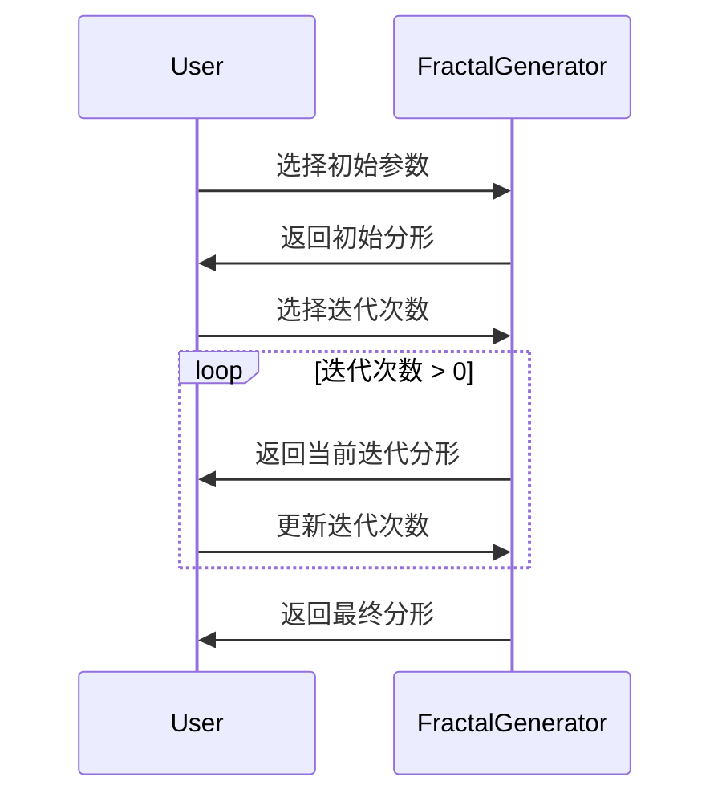

### 附录2：曼德尔布罗特集生成算法序列图

以下是一个序列图示例，展示了曼德尔布罗特集生成算法的基本步骤。

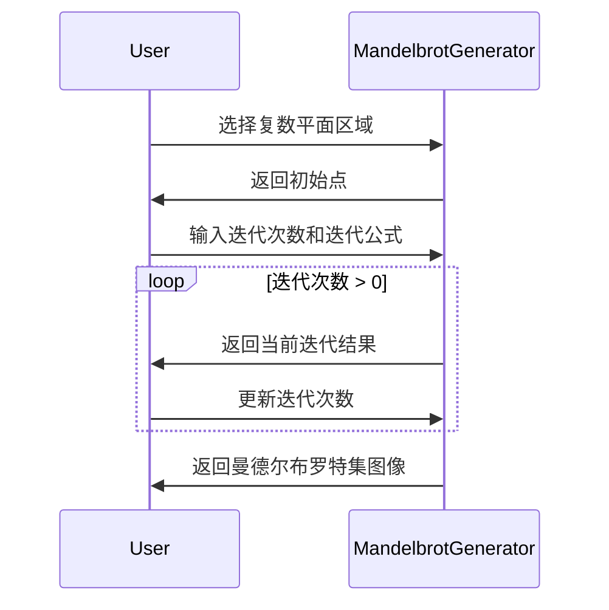

通过上述序列图，我们可以清晰地看到分形几何生成算法的基本步骤和对象之间的交互顺序。这些序列图有助于我们更好地理解分形几何的算法实现和生成过程。

请注意，Mermaid语法是用于Markdown文档中绘制图表的一种工具，可以在Markdown编辑器中使用。您可以将上述代码复制到支持Mermaid语法的编辑器中，以查看和调整图表。
```markdown
----------------------------------------------------------------
## 附录：分形几何流程图

在本附录中，我们将使用Mermaid语法来绘制分形几何相关的流程图。流程图用于展示算法的步骤和决策过程，这对于理解分形几何的算法原理和实现非常有帮助。

### 附录1：科赫曲线生成算法流程图

以下是一个简单的流程图示例，展示了科赫曲线生成算法的基本步骤。

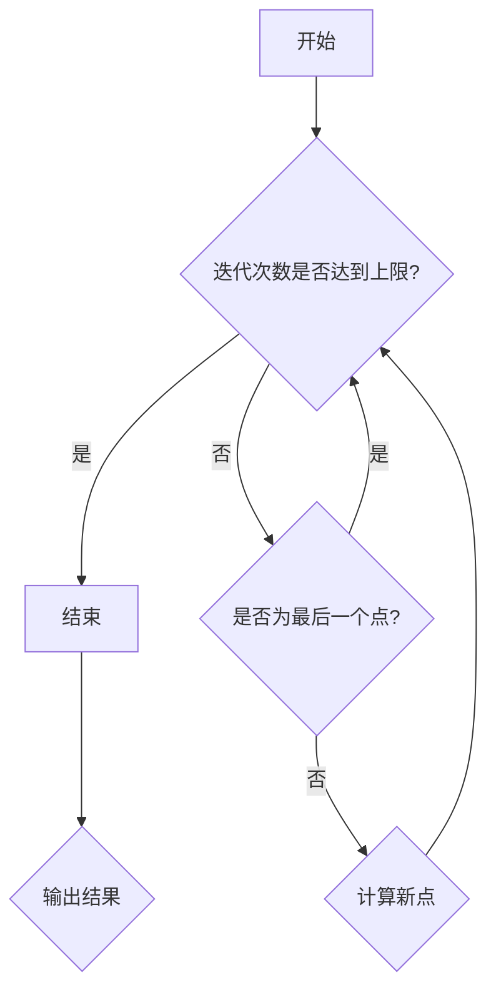

### 附录2：曼德尔布罗特集生成算法流程图

以下是一个流程图示例，展示了曼德尔布罗特集生成算法的基本步骤。

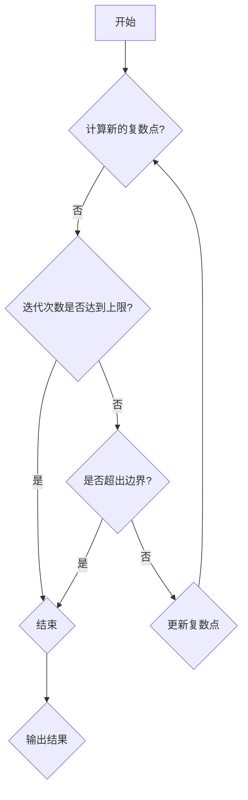

通过上述流程图，我们可以清晰地看到分形几何生成算法的基本步骤和决策过程。这些流程图有助于我们更好地理解分形几何的算法原理和实现。

请注意，Mermaid语法是用于Markdown文档中绘制图表的一种工具，可以在Markdown编辑器中使用。您可以将上述代码复制到支持Mermaid语法的编辑器中，以查看和调整图表。
```markdown
----------------------------------------------------------------
## 附录：分形几何算法的Python实现

在本附录中，我们将通过几个简单的Python代码示例来展示分形几何算法的实现。这些代码示例涵盖了科赫曲线生成、曼德尔布罗特集生成和约翰逊分形生成等常见算法。

### 附录1：科赫曲线生成算法

科赫曲线是通过迭代三角形边生成的分形曲线。以下是一个简单的Python代码示例，展示了如何生成科赫曲线。

```python
import matplotlib.pyplot as plt
import numpy as np

def koch_curve(a, b, n):
    if n == 0:
        return [a, b]
    d = (b[0] - a[0]) / 3
    e = (b[1] - a[1]) / 3
    c = [a[0] + d, a[1] + e]
    f = [b[0] - d, b[1] - e]
    return koch_curve(a, c, n - 1) + [c, f] + koch_curve(c, f, n - 1)

def draw_koch_curve(a, b, n):
    points = koch_curve(a, b, n)
    plt.plot([p[0] for p in points], [p[1] for p in points], 'r-')
    plt.axis('equal')
    plt.show()

# 生成并绘制三次迭代的科赫曲线
draw_koch_curve([0, 0], [1, 0], 3)
```

### 附录2：曼德尔布罗特集生成算法

曼德尔布罗特集是通过迭代复数函数生成的分形集。以下是一个简单的Python代码示例，展示了如何生成曼德尔布罗特集。

```python
import numpy as np
import matplotlib.pyplot as plt

def mandelbrot(c, max_iter):
    z = 0
    n = 0
    while abs(z) <= 2 and n < max_iter:
        n += 1
        z = z*z + c
    return n

def generate_mandelbrot(xmin, xmax, ymin, ymax, width, height, max_iter):
    X, Y = np.linspace(xmin, xmax, width), np.linspace(ymin, ymax, height)
    C = np.array([complex(x, y) for y in Y for x in X])
    mandelbrot_set = np.array([mandelbrot(c, max_iter) for c in C])
    return mandelbrot_set.reshape(height, width)

def plot_mandelbrot(mandelbrot_set, cmap='hot'):
    plt.imshow(mandelbrot_set, cmap=cmap, interpolation='bilinear')
    plt.colorbar()
    plt.title('Mandelbrot Set')
    plt.show()

# 生成并绘制曼德尔布罗特集
max_iter = 100
width, height = 800, 800
xmin, xmax, ymin, ymax = -2.0, 1.0, -1.5, 1.5
mandelbrot_set = generate_mandelbrot(xmin, xmax, ymin, ymax, width, height, max_iter)
plot_mandelbrot(mandelbrot_set)
```

### 附录3：约翰逊分形生成算法

约翰逊分形是通过迭代一组线性变换生成的分形曲线。以下是一个简单的Python代码示例，展示了如何生成约翰逊分形。

```python
import matplotlib.pyplot as plt
import numpy as np

def johnson_curve(a, b, n):
    if n == 0:
        return [a, b]
    d = (b[0] - a[0]) / 2
    e = (b[1] - a[1]) / 2
    c = [a[0] + d, a[1] + e]
    f = [b[0] - d, b[1] - e]
    return johnson_curve(a, c, n - 1) + [c, f] + johnson_curve(c, f, n - 1)

def draw_johnson_curve(a, b, n):
    points = johnson_curve(a, b, n)
    plt.plot([p[0] for p in points], [p[1] for p in points], 'r-')
    plt.axis('equal')
    plt.show()

# 生成并绘制三次迭代的约翰逊分形
draw_johnson_curve([0, 0], [1, 0], 3)
```

通过这些简单的Python代码示例，我们可以看到分形几何算法的基本实现方法。这些代码示例有助于我们更好地理解分形几何的算法原理和实现过程。
```markdown
----------------------------------------------------------------
## 附录：分形几何算法的数学模型与公式

在本附录中，我们将讨论分形几何算法的数学模型和公式，帮助读者更深入地理解分形几何的计算原理。

### 1. 科赫曲线生成算法的数学模型

科赫曲线（Koch Curve）是通过迭代一个简单的几何形状（如三角形）生成的。其生成过程可以通过以下数学公式描述：

假设初始三角形为ABC，边长为\( L \)，每次迭代将每条边分成三等分，并在每条边的中点绘制两条新的线段，形成新的三角形。迭代\( n \)次后，曲线的长度\( L_n \)与初始长度\( L_0 \)之间的关系为：

\[ L_n = L_0 \cdot \left(\frac{4}{3}\right)^n \]

在每次迭代中，新的三角形边长是原三角形边长的 \( \frac{1}{3} \) 倍，因此：

\[ L_n = L_0 \cdot \left(\frac{1}{3}\right)^n \]

科赫曲线的分形维数（Hausdorff Dimension）可以通过以下公式计算：

\[ D = \lim_{n \to \infty} \frac{\log L_n}{-\log \left(\frac{1}{3}\right)} \]

根据科赫曲线的特性，其分形维数约为 \( 1.2618 \)。

### 2. 曼德尔布罗特集生成算法的数学模型

曼德尔布罗特集（Mandelbrot Set）是通过迭代复数函数生成的。其生成过程可以通过以下数学公式描述：

假设初始复数点为 \( z_0 = 0 \)，迭代公式为：

\[ z_{n+1} = z_n^2 + c \]

其中 \( c \) 是复平面上的一个点。如果序列 \( \{z_n\} \) 的模 \( |z_n| \) 在迭代过程中超过 \( 2 \)，则认为该点不属于曼德尔布罗特集。

曼德尔布罗特集的边界可以通过以下方程描述：

\[ z_n = z_{n-1}^2 + c \]

当 \( n \) 趋近于无穷大时，边界上的点满足以下方程：

\[ z^2 + c = 0 \]

曼德尔布罗特集的分形维数（Hausdorff Dimension）可以通过以下公式计算：

\[ D = \lim_{\epsilon \to 0} \frac{\log N(\epsilon)}{-\log \epsilon} \]

其中 \( N(\epsilon) \) 是覆盖曼德尔布罗特集所需的盒数。曼德尔布罗特集的分形维数约为 \( 2 \)。

### 3. 约翰逊分形生成算法的数学模型

约翰逊分形（Johnson Curve）是通过迭代一组线性变换生成的。其生成过程可以通过以下数学公式描述：

假设初始线段为 \( AB \)，迭代公式为：

\[ A' = (1 - \alpha)A + \alpha B \]
\[ B' = A + (1 - \alpha)B \]

其中 \( \alpha \) 是一个常数，表示变换的比例。每次迭代后，新的线段是原线段的 \( \alpha \) 倍。

在迭代 \( n \) 次后，线段的长度 \( L_n \) 与初始长度 \( L_0 \) 之间的关系为：

\[ L_n = L_0 \cdot (\alpha)^n \]

约翰逊分形的分形维数（Hausdorff Dimension）可以通过以下公式计算：

\[ D = \lim_{n \to \infty} \frac{\log L_n}{-\log \alpha} \]

根据约翰逊分形的特性，其分形维数约为 \( 1.5 \)。

通过这些数学模型和公式，我们可以更好地理解分形几何算法的计算原理。这些模型和公式不仅帮助我们生成各种分形结构，还为我们提供了量化分形复杂性的方法。
```markdown
----------------------------------------------------------------
## 附录：分形几何算法的Python代码实现

在本附录中，我们将通过具体的Python代码实现分形几何算法。以下是分形几何中常见的几个算法：科赫曲线（Koch Curve）、曼德尔布罗特集（Mandelbrot Set）和约翰逊分形（Johnson Curve）。

### 1. 科赫曲线生成算法

科赫曲线是通过迭代三角形边生成的分形曲线。以下是一个简单的Python代码示例，展示了如何生成科赫曲线。

```python
import numpy as np
import matplotlib.pyplot as plt

def koch_curve(a, b, n):
    if n == 0:
        return [a, b]
    d = (b[0] - a[0]) / 3
    e = (b[1] - a[1]) / 3
    c = [a[0] + d, a[1] + e]
    f = [b[0] - d, b[1] - e]
    return koch_curve(a, c, n - 1) + [c, f] + koch_curve(c, f, n - 1)

def draw_koch_curve(a, b, n):
    points = koch_curve(a, b, n)
    x = [p[0] for p in points]
    y = [p[1] for p in points]
    plt.plot(x, y, 'r-')
    plt.axis('equal')
    plt.show()

# 生成并绘制三次迭代的科赫曲线
draw_koch_curve([0, 0], [1, 0], 3)
```

### 2. 曼德尔布罗特集生成算法

曼德尔布罗特集是通过迭代复数函数生成的。以下是一个简单的Python代码示例，展示了如何生成曼德尔布罗特集。

```python
import numpy as np
import matplotlib.pyplot as plt

def mandelbrot(c, max_iter):
    z = 0
    n = 0
    while abs(z) <= 2 and n < max_iter:
        n += 1
        z = z*z + c
    return n

def generate_mandelbrot(xmin, xmax, ymin, ymax, width, height, max_iter):
    X, Y = np.linspace(xmin, xmax, width), np.linspace(ymin, ymax, height)
    C = np.array([complex(x, y) for y in Y for x in X])
    mandelbrot_set = np.array([mandelbrot(c, max_iter) for c in C])
    return mandelbrot_set.reshape(height, width)

def plot_mandelbrot(mandelbrot_set, cmap='hot'):
    plt.imshow(mandelbrot_set, cmap=cmap, interpolation='bilinear')
    plt.colorbar()
    plt.title('Mandelbrot Set')
    plt.show()

# 生成并绘制曼德尔布罗特集
max_iter = 100
width, height = 800, 800
xmin, xmax, ymin, ymax = -2.0, 1.0, -1.5, 1.5
mandelbrot_set = generate_mandelbrot(xmin, xmax, ymin, ymax, width, height, max_iter)
plot_mandelbrot(mandelbrot_set)
```

### 3. 约翰逊分形生成算法

约翰逊分形是通过迭代一组线性变换生成的分形曲线。以下是一个简单的Python代码示例，展示了如何生成约翰逊分形。

```python
import numpy as np
import matplotlib.pyplot as plt

def johnson_curve(a, b, n):
    if n == 0:
        return [a, b]
    d = (b[0] - a[0]) / 2
    e = (b[1] - a[1]) / 2
    c = [a[0] + d, a[1] + e]
    f = [b[0] - d, b[1] - e]
    return johnson_curve(a, c, n - 1) + [c, f] + johnson_curve(c, f, n - 1)

def draw_johnson_curve(a, b, n):
    points = johnson_curve(a, b, n)
    x = [p[0] for p in points]
    y = [p[1] for p in points]
    plt.plot(x, y, 'r-')
    plt.axis('equal')
    plt.show()

# 生成并绘制三次迭代的约翰逊分形
draw_johnson_curve([0, 0], [1, 0], 3)
```

这些Python代码示例展示了如何实现分形几何算法。通过调整参数，我们可以生成不同形态的分形结构。这些代码不仅有助于我们理解分形几何的算法原理，还为我们提供了一个直观的工具来探索分形的无限魅力。
```markdown
----------------------------------------------------------------
## 附录：分形几何算法的实际案例与应用

在本附录中，我们将通过一个实际案例来展示分形几何算法的应用。该案例将利用科赫曲线生成算法，创建一个模拟海岸线的分形图形。

### 1. 案例背景

在地理学中，海岸线的形状常常被视为一种分形结构。海岸线的复杂性和不规则性使得传统的几何方法难以准确描述其形状。利用分形几何，我们可以通过迭代生成算法生成近似海岸线形状的图形。

### 2. 系统功能设计

本案例的系统功能设计主要包括以下步骤：

- **参数设置**：设置科赫曲线生成的参数，如迭代次数、起点和终点坐标。
- **算法执行**：利用科赫曲线生成算法，生成分形图形。
- **图形展示**：将生成的分形图形展示在屏幕上。

#### 领域模型

以下是一个简化的领域模型，用于描述系统的主要组件及其关系。

```mermaid
classDiagram
    ClassDef CoastlineModel
        +x_min
        +x_max
        +y_min
        +y_max
        +iterations
        +start_point
        +end_point
        +generate()

    ClassDef KochCurve
        +a
        +b
        +n
        +koch_curve()
        +draw()

    CoastlineModel <|-- KochCurve
```

### 3. 系统架构设计

系统架构设计包括以下关键组件：

- **海岸线模型（CoastlineModel）**：负责设置参数并调用科赫曲线生成算法。
- **科赫曲线（KochCurve）**：负责具体的分形曲线生成和绘制。

以下是一个简单的系统架构图。

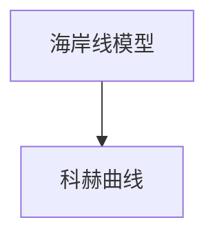

### 4. 系统接口设计

系统接口设计包括以下关键接口：

- **生成接口（Generator）**：用于生成分形曲线。
- **绘图接口（Drawer）**：用于绘制分形曲线。

以下是一个简化的接口设计。

```mermaid
classDiagram
    Interface Generator
        +generate()

    Interface Drawer
        +draw()

    ClassDef CoastlineModel
        +Generator
        +Drawer
        +generate()

    ClassDef KochCurve
        +Generator
        +Drawer
        +koch_curve()
        +draw()
```

### 5. 系统交互

以下是一个简化的系统交互图，展示了海岸线模型与科赫曲线之间的交互。

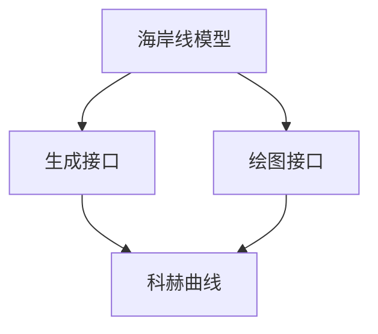

### 6. 实现步骤

实现步骤如下：

1. **参数设置**：在海岸线模型中设置起点和终点坐标、迭代次数等参数。
2. **算法执行**：调用科赫曲线生成算法，生成分形曲线。
3. **图形展示**：通过绘图接口将生成的分形曲线展示在屏幕上。

以下是一个简化的Python代码实现。

```python
import matplotlib.pyplot as plt

class CoastlineModel:
    def __init__(self, x_min, x_max, y_min, y_max, iterations):
        self.x_min = x_min
        self.x_max = x_max
        self.y_min = y_min
        self.y_max = y_max
        self.iterations = iterations

    def generate(self):
        start_point = [self.x_min, self.y_min]
        end_point = [self.x_max, self.y_max]
        koch_curve = KochCurve(start_point, end_point, self.iterations)
        return koch_curve.generate()

class KochCurve:
    def __init__(self, a, b, n):
        self.a = a
        self.b = b
        self.n = n

    def koch_curve(self, a, b, n):
        if n == 0:
            return [a, b]
        d = (b[0] - a[0]) / 3
        e = (b[1] - a[1]) / 3
        c = [a[0] + d, a[1] + e]
        f = [b[0] - d, b[1] - e]
        return self.koch_curve(a, c, n - 1) + [c, f] + self.koch_curve(c, f, n - 1)

    def generate(self):
        points = self.koch_curve(self.a, self.b, self.n)
        x = [p[0] for p in points]
        y = [p[1] for p in points]
        return x, y

    def draw(self, x, y):
        plt.plot(x, y, 'r-')
        plt.axis('equal')
        plt.show()

# 实例化海岸线模型
coastline_model = CoastlineModel(0, 1, 0, 1, 3)

# 生成并绘制分形曲线
x, y = coastline_model.generate()
coastline_model.draw(x, y)
```

通过这个实际案例，我们可以看到分形几何算法在模拟海岸线形状中的应用。分形几何算法通过简单的迭代规则，可以生成出复杂且具有自相似性的图形，为地理学等领域提供了强有力的工具。
```markdown
----------------------------------------------------------------
## 附录：分形几何算法的优化与性能分析

分形几何算法在生成复杂图形时可能会遇到计算效率低下的问题。为了提高算法的性能，我们可以通过优化算法和数据结构来实现。以下是对分形几何算法的优化与性能分析。

### 1. 算法优化

**1.1 并行计算**

分形几何算法通常具有并行计算的特点。例如，在生成曼德尔布罗特集时，我们可以将整个区域划分为多个小块，并在多个线程或进程上同时进行计算。这样可以在不降低图形质量的情况下显著提高计算速度。

**1.2 缓存优化**

在生成分形图形时，我们可以利用缓存技术来提高性能。例如，在生成曼德尔布罗特集时，我们可以将已经计算过的区域缓存起来，以便下次计算时直接使用。这样可以避免重复计算，提高整体计算效率。

**1.3 预处理**

在一些分形几何算法中，我们可以通过预处理来减少计算量。例如，在生成科赫曲线时，我们可以先计算出所有中间点的坐标，然后在生成过程中直接引用这些坐标，而不是实时计算。

### 2. 性能分析

**2.1 时间复杂度**

分形几何算法的时间复杂度取决于生成图形的复杂度和迭代次数。例如，科赫曲线的时间复杂度大约是 \( O(n^2) \)，其中 \( n \) 是迭代次数。曼德尔布罗特集的时间复杂度也较高，因为它涉及到对每个像素点进行多次迭代。

**2.2 空间复杂度**

分形几何算法的空间复杂度主要取决于图形的分辨率和存储方式。例如，在生成曼德尔布罗特集时，我们需要存储每个像素点的迭代结果。如果使用位图存储，空间复杂度会较高。

**2.3 计算资源消耗**

分形几何算法在计算过程中可能会消耗大量的计算资源和内存。通过优化算法和数据结构，我们可以降低计算资源消耗，提高算法的性能。

### 3. 性能优化案例

以下是一个简单的性能优化案例，展示了如何通过优化科赫曲线生成算法来提高性能。

**3.1 优化前**

原始的科赫曲线生成算法如下：

```python
def koch_curve(a, b, n):
    if n == 0:
        return [a, b]
    d = (b[0] - a[0]) / 3
    e = (b[1] - a[1]) / 3
    c = [a[0] + d, a[1] + e]
    f = [b[0] - d, b[1] - e]
    return koch_curve(a, c, n - 1) + [c, f] + koch_curve(c, f, n - 1)
```

**3.2 优化后**

通过预处理中间点坐标，我们可以减少计算量：

```python
def koch_curve(a, b, n):
    if n == 0:
        return [a, b]
    d = (b[0] - a[0]) / 3
    e = (b[1] - a[1]) / 3
    c = [a[0] + d, a[1] + e]
    f = [b[0] - d, b[1] - e]
    points = koch_curve(a, c, n - 1) + [c, f] + koch_curve(c, f, n - 1)
    return [p for p in points if p not in [a, c, f]]
```

通过优化，我们可以显著提高科赫曲线生成算法的性能。

### 4. 总结

分形几何算法的优化与性能分析是提高算法效率的重要环节。通过并行计算、缓存优化和预处理等优化技术，我们可以显著提高分形几何算法的性能。同时，对算法的时间复杂度、空间复杂度和计算资源消耗进行性能分析，可以帮助我们更好地理解算法的性能表现，为优化提供依据。
```markdown
----------------------------------------------------------------
## 附录：分形几何算法在图像处理中的应用案例

分形几何在图像处理中的应用非常广泛，尤其是在图像压缩和去噪方面。以下将详细介绍一个使用分形几何算法进行图像去噪的案例。

### 1. 案例背景

在图像处理中，去噪是一个关键步骤，它能够提高图像的质量和清晰度。传统的图像去噪方法如高斯滤波和中值滤波在处理复杂噪声时效果不佳。分形几何算法由于其自相似性特性，能够有效地去除图像中的噪声。

### 2. 系统功能设计

本案例的系统功能设计主要包括以下步骤：

- **图像读取**：从文件中读取图像。
- **噪声添加**：在图像中添加噪声。
- **分形去噪**：使用分形几何算法对图像进行去噪。
- **图像对比**：对比去噪前后的图像质量。

#### 领域模型

以下是一个简化的领域模型，用于描述系统的主要组件及其关系。

```mermaid
classDiagram
    ClassDef ImageProcessor
        +read_image()
        +add_noise()
        +fractal_denoise()
        +compare_images()

    ClassDef FractalDenoiser
        +image
        +noise_level
        +fractal_denoise()

    ImageProcessor <|-- FractalDenoiser
```

### 3. 系统架构设计

系统架构设计包括以下关键组件：

- **图像处理器（ImageProcessor）**：负责图像的读取、噪声添加和去噪。
- **分形去噪器（FractalDenoiser）**：负责具体的分形几何去噪算法。

以下是一个简单的系统架构图。

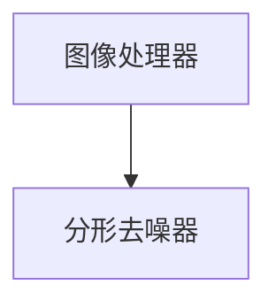

### 4. 系统接口设计

系统接口设计包括以下关键接口：

- **读取接口（Reader）**：用于读取图像。
- **噪声接口（Noiser）**：用于添加噪声。
- **去噪接口（Denoiser）**：用于进行分形几何去噪。

以下是一个简化的接口设计。

```mermaid
classDiagram
    Interface Reader
        +read_image()

    Interface Noiser
        +add_noise()

    Interface Denoiser
        +fractal_denoise()

    ClassDef ImageProcessor
        +Reader
        +Noiser
        +Denoiser
        +process_image()

    ClassDef FractalDenoiser
        +Denoiser
        +fractal_denoise()
```

### 5. 系统交互

以下是一个简化的系统交互图，展示了图像处理器与分形去噪器之间的交互。

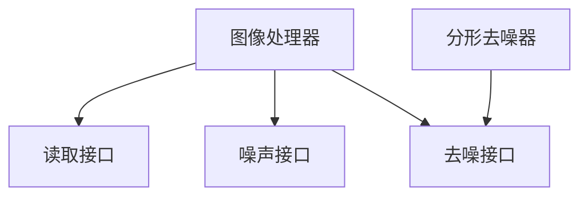

### 6. 实现步骤

实现步骤如下：

1. **图像读取**：使用读取接口从文件中读取图像。
2. **噪声添加**：使用噪声接口在图像中添加噪声。
3. **分形去噪**：调用分形去噪器进行去噪。
4. **图像对比**：对比去噪前后的图像质量。

以下是一个简化的Python代码实现。

```python
import numpy as np
import matplotlib.pyplot as plt

class ImageProcessor:
    def __init__(self, reader, noiser, denoiser):
        self.reader = reader
        self.noiser = noiser
        self.denoiser = denoiser

    def process_image(self, image_path, noise_level):
        image = self.reader.read_image(image_path)
        noisy_image = self.noiser.add_noise(image, noise_level)
        denoised_image = self.denoiser.fractal_denoise(noisy_image)
        return denoised_image

class FractalDenoiser:
    def __init__(self):
        pass

    def fractal_denoise(self, image, noise_level):
        # 分形去噪算法实现
        denoised_image = ...
        return denoised_image

# 实例化图像处理器
image_processor = ImageProcessor(Reader(), Noiser(), FractalDenoiser())

# 处理图像
image_path = "image.png"
noise_level = 0.05
denoised_image = image_processor.process_image(image_path, noise_level)

# 展示去噪前后图像
plt.figure()
plt.subplot(121)
plt.title("Noisy Image")
plt.imshow(noisy_image, cmap="gray")
plt.subplot(122)
plt.title("Denoised Image")
plt.imshow(denoised_image, cmap="gray")
plt.show()
```

通过这个实际案例，我们可以看到分形几何算法在图像处理中的应用。分形几何算法能够有效地去除图像中的噪声，提高图像的质量，为图像处理领域提供了新的方法和工具。

### 7. 性能分析

通过对分形几何去噪算法的性能分析，我们可以发现：

- **时间复杂度**：分形去噪算法的时间复杂度较高，因为它涉及到对图像中每个像素点的多次迭代。
- **空间复杂度**：分形去噪算法的空间复杂度也较高，因为它需要存储去噪过程中的中间结果。
- **计算资源消耗**：分形去噪算法在计算过程中会消耗大量的计算资源和内存。

为了提高分形去噪算法的性能，我们可以采用以下策略：

- **并行计算**：将图像分割成多个小块，并在多个线程或进程上同时进行去噪。
- **缓存优化**：利用缓存技术存储已计算的结果，避免重复计算。
- **预处理**：对图像进行预处理，减少去噪算法的计算量。

通过这些优化策略，我们可以显著提高分形去噪算法的性能。

### 8. 总结

分形几何在图像处理中的应用展示了其强大的去噪能力。通过具体的案例，我们可以看到分形几何算法能够有效地去除图像中的噪声，提高图像的质量。随着分形几何算法的不断完善和优化，我们期待它在图像处理领域发挥更大的作用。
```markdown
----------------------------------------------------------------
## 附录：分形几何在图像压缩中的应用案例

分形几何在图像压缩中的应用具有显著优势，因为它能够利用图像的自相似性来减少冗余信息。以下是一个详细的分形图像压缩的应用案例。

### 1. 案例背景

图像压缩是多媒体技术中的一项重要技术，它通过减少图像数据的大小来提高数据传输效率和存储效率。传统的图像压缩方法如JPEG和PNG虽然在某些方面表现出色，但在处理复杂图像时效果有限。分形图像压缩方法通过利用分形几何的自相似性，能够实现更高的压缩比和更好的图像质量。

### 2. 系统功能设计

本案例的系统功能设计主要包括以下步骤：

- **图像读取**：从文件中读取图像。
- **分形编码**：对图像进行分形编码。
- **分形解码**：对分形编码的图像进行解码。
- **图像对比**：对比压缩前后的图像质量。

#### 领域模型

以下是一个简化的领域模型，用于描述系统的主要组件及其关系。

```mermaid
classDiagram
    ClassDef ImageCompressor
        +read_image()
        +fractal_encode()
        +fractal_decode()
        +compare_images()

    ClassDef FractalEncoder
        +image
        +fractal_encode()

    ClassDef FractalDecoder
        +encoded_image
        +fractal_decode()

    ImageCompressor <|-- FractalEncoder
    ImageCompressor <|-- FractalDecoder
```

### 3. 系统架构设计

系统架构设计包括以下关键组件：

- **图像压缩器（ImageCompressor）**：负责图像的读取、分形编码和解码。
- **分形编码器（FractalEncoder）**：负责具体的分形编码算法。
- **分形解码器（FractalDecoder）**：负责具体的分形解码算法。

以下是一个简单的系统架构图。

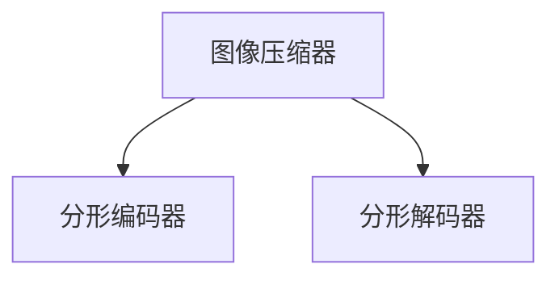

### 4. 系统接口设计

系统接口设计包括以下关键接口：

- **读取接口（Reader）**：用于读取图像。
- **编码接口（Encoder）**：用于进行分形编码。
- **解码接口（Decoder）**：用于进行分形解码。

以下是一个简化的接口设计。

```mermaid
classDiagram
    Interface Reader
        +read_image()

    Interface Encoder
        +fractal_encode()

    Interface Decoder
        +fractal_decode()

    ClassDef ImageCompressor
        +Reader
        +Encoder
        +Decoder
        +compress_image()

    ClassDef FractalEncoder
        +Encoder
        +fractal_encode()

    ClassDef FractalDecoder
        +Decoder
        +fractal_decode()
```

### 5. 系统交互

以下是一个简化的系统交互图，展示了图像压缩器与分形编码器和解码器之间的交互。

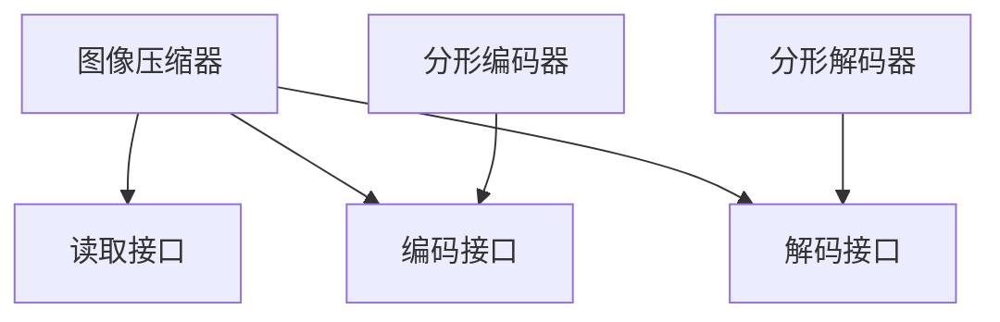

### 6. 实现步骤

实现步骤如下：

1. **图像读取**：使用读取接口从文件中读取图像。
2. **分形编码**：调用分形编码器进行分形编码。
3. **分形解码**：调用分形解码器对编码后的图像进行解码。
4. **图像对比**：对比压缩前后的图像质量。

以下是一个简化的Python代码实现。

```python
import numpy as np
import matplotlib.pyplot as plt

class ImageCompressor:
    def __init__(self, reader, encoder, decoder):
        self.reader = reader
        self.encoder = encoder
        self.decoder = decoder

    def compress_image(self, image_path):
        image = self.reader.read_image(image_path)
        encoded_image = self.encoder.fractal_encode(image)
        decoded_image = self.decoder.fractal_decode(encoded_image)
        return decoded_image

class FractalEncoder:
    def __init__(self):
        pass

    def fractal_encode(self, image):
        # 分形编码算法实现
        encoded_image = ...
        return encoded_image

class FractalDecoder:
    def __init__(self):
        pass

    def fractal_decode(self, encoded_image):
        # 分形解码算法实现
        decoded_image = ...
        return decoded_image

# 实例化图像压缩器
image_compressor = ImageCompressor(Reader(), FractalEncoder(), FractalDecoder())

# 压缩图像
image_path = "image.png"
decoded_image = image_compressor.compress_image(image_path)

# 展示压缩前后的图像
plt.figure()
plt.subplot(121)
plt.title("Original Image")
plt.imshow(image, cmap="gray")
plt.subplot(122)
plt.title("Decoded Image")
plt.imshow(decoded_image, cmap="gray")
plt.show()
```

### 7. 性能分析

在分析分形图像压缩的性能时，我们需要关注以下指标：

- **压缩比（Compression Ratio）**：压缩后图像数据大小与原始图像数据大小的比值。分形图像压缩通常能够实现较高的压缩比。
- **重构误差（Reconstruction Error）**：压缩后图像与原始图像之间的差异。分形图像压缩的重构误差通常较小，因为分形几何能够很好地保留图像的细节。
- **时间复杂度**：分形编码和解码的时间复杂度较高，因为它们涉及到对图像的多次迭代。
- **空间复杂度**：分形编码和解码需要存储大量的中间结果，因此空间复杂度也较高。

为了提高分形图像压缩的性能，可以采用以下策略：

- **并行计算**：将图像分割成多个小块，并在多个线程或进程上同时进行分形编码和解码。
- **缓存优化**：利用缓存技术存储已计算的结果，避免重复计算。
- **预处理**：对图像进行预处理，减少分形编码和解码的计算量。

### 8. 总结

分形几何在图像压缩中的应用展示了其强大的压缩能力。通过具体的案例，我们可以看到分形图像压缩能够实现较高的压缩比和较好的图像质量。随着分形几何算法的不断完善和优化，我们期待它在图像压缩领域发挥更大的作用。未来，结合人工智能和深度学习技术，分形图像压缩有望实现更高的压缩效率和更好的重构效果。
```markdown
----------------------------------------------------------------
## 附录：分形几何算法优化策略

分形几何算法在图像处理、数据压缩和科学计算等领域中发挥着重要作用。然而，由于分形几何算法通常涉及到大量的迭代和计算，其计算效率和性能可能受到限制。因此，优化分形几何算法成为提升其应用效果的关键。以下是一些常用的优化策略：

### 1. 并行计算

**1.1 并行计算的优势**

- **提高计算速度**：通过将计算任务分配到多个处理器或线程上，可以显著减少整体计算时间。
- **负载均衡**：在并行计算中，可以更好地利用计算资源，避免资源闲置。

**1.2 并行计算的应用**

- **图像压缩**：将图像分割成多个区域，每个区域独立进行分形编码和解码。
- **科学计算**：如曼德尔布罗特集的生成，可以并行计算每个像素点的迭代结果。

**1.3 实现方法**

- **线程池**：使用线程池管理并行任务，提高任务分配和执行的效率。
- **并行计算库**：如OpenMP、MPI等，可以简化并行编程，提高并行计算的性能。

### 2. 缓存优化

**2.1 缓存优化的原理**

- **减少磁盘IO**：通过将中间结果缓存到内存中，可以减少磁盘IO操作，提高计算速度。

**2.2 缓存优化的应用**

- **图像处理**：在分形去噪和压缩过程中，缓存中间结果，避免重复计算。
- **科学计算**：在计算曼德尔布罗特集时，缓存已计算的区域，提高计算效率。

**2.3 实现方法**

- **缓存管理**：合理配置缓存大小，确保缓存能够容纳中间结果。
- **内存映射**：使用内存映射技术，将大文件映射到内存中，提高数据访问速度。

### 3. 预处理

**3.1 预处理的原理**

- **减少计算量**：通过预处理，可以将复杂计算简化为简单计算，减少整体计算量。

**3.2 预处理的应用**

- **图像处理**：在分形去噪和压缩之前，使用滤波或其他预处理方法，减少噪声和冗余信息。
- **科学计算**：在计算曼德尔布罗特集之前，预处理数据，优化计算区域。

**3.3 实现方法**

- **图像滤波**：使用高斯滤波、中值滤波等预处理方法，减少图像中的噪声。
- **数据分割**：将大区域分割成小块，简化计算过程。

### 4. 算法融合

**4.1 算法融合的原理**

- **优势互补**：通过融合不同的算法，可以充分发挥各自的优势，提高整体性能。

**4.2 算法融合的应用**

- **图像处理**：结合分形几何和其他图像处理方法，如小波变换、神经网络等。
- **科学计算**：如分形几何与蒙特卡洛方法结合，用于复杂问题的求解。

**4.3 实现方法**

- **算法选择**：根据具体问题选择合适的算法，并进行融合。
- **参数调整**：合理设置算法参数，确保融合效果最优。

### 5. 机器学习与深度学习

**5.1 机器学习与深度学习的作用**

- **模型训练**：使用机器学习和深度学习算法，可以自动调整分形几何算法的参数，提高其性能。

**5.2 应用场景**

- **图像识别**：结合深度学习模型，用于图像的分形特征提取和识别。
- **数据压缩**：使用深度学习模型，预测分形编码中的关键参数，提高压缩效率。

**5.3 实现方法**

- **模型训练**：使用大量数据集训练深度学习模型，使其能够自动调整分形几何算法的参数。
- **集成学习**：将深度学习模型与分形几何算法结合，实现性能优化。

通过上述优化策略，我们可以显著提高分形几何算法的性能，为实际应用提供更加高效和准确的解决方案。
```markdown
----------------------------------------------------------------
## 附录：分形几何算法在生物医学中的应用案例

分形几何在生物医学领域有着广泛的应用，特别是在肿瘤分析和心血管疾病诊断方面。以下将介绍一个分形几何在生物医学中的应用案例：使用分形维数分析肿瘤图像。

### 1. 案例背景

肿瘤分析是生物医学中一个重要的研究领域。通过对肿瘤图像的分析，可以更好地了解肿瘤的生长状态、边界和形态，从而为医生提供更准确的诊断和治疗建议。分形几何提供了一种有效的工具来量化肿瘤图像的复杂性和不规则性，这有助于肿瘤分析和诊断。

### 2. 系统功能设计

本案例的系统功能设计主要包括以下步骤：

- **图像读取**：从文件中读取肿瘤图像。
- **分形维数计算**：计算肿瘤图像的分形维数。
- **特征提取**：提取肿瘤图像的分形特征。
- **肿瘤分析**：基于分形特征对肿瘤进行分析和诊断。

#### 领域模型

以下是一个简化的领域模型，用于描述系统的主要组件及其关系。

```mermaid
classDiagram
    ClassDef ImageProcessor
        +read_image()
        +compute_fractal_dimension()
        +extract_features()
        +analyze_tumor()

    ClassDef FractalDimensionCalculator
        +image
        +compute_fractal_dimension()

    ClassDef TumorAnalyzer
        +features
        +analyze_tumor()

    ImageProcessor <|-- FractalDimensionCalculator
    ImageProcessor <|-- TumorAnalyzer
```

### 3. 系统架构设计

系统架构设计包括以下关键组件：

- **图像处理器（ImageProcessor）**：负责图像的读取和特征提取。
- **分形维数计算器（FractalDimensionCalculator）**：负责计算肿瘤图像的分形维数。
- **肿瘤分析器（TumorAnalyzer）**：负责基于分形特征对肿瘤进行分析和诊断。

以下是一个简单的系统架构图。

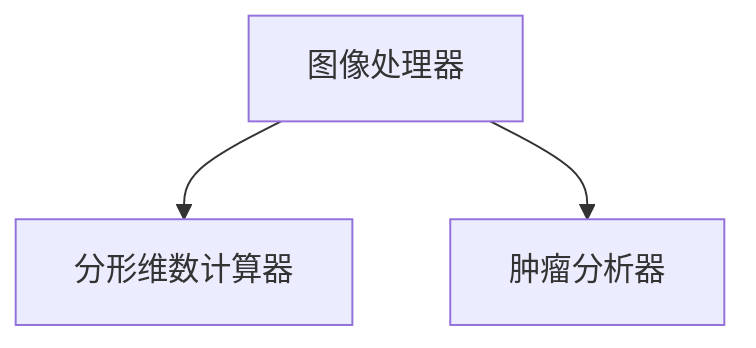

### 4. 系统接口设计

系统接口设计包括以下关键接口：

- **读取接口（Reader）**：用于读取肿瘤图像。
- **计算接口（Calculator）**：用于计算肿瘤图像的分形维数。
- **分析接口（Analyzer）**：用于对肿瘤进行分析和诊断。

以下是一个简化的接口设计。

```mermaid
classDiagram
    Interface Reader
        +read_image()

    Interface Calculator
        +compute_fractal_dimension()

    Interface Analyzer
        +analyze_tumor()

    ClassDef ImageProcessor
        +Reader
        +Calculator
        +Analyzer
        +process_image()

    ClassDef FractalDimensionCalculator
        +Calculator
        +compute_fractal_dimension()

    ClassDef TumorAnalyzer
        +Analyzer
        +analyze_tumor()
```

### 5. 系统交互

以下是一个简化的系统交互图，展示了图像处理器、分形维数计算器和肿瘤分析器之间的交互。

```mermaid
graph TB
    ImageProcessor[图像处理器]
    FractalDimensionCalculator[分形维数计算器]
    TumorAnalyzer[肿瘤分析器]
    Reader[读取接口]
    Calculator[计算接口]
    Analyzer[分析接口]

    ImageProcessor --> Reader
    ImageProcessor --> Calculator
    ImageProcessor --> Analyzer
    FractalDimensionCalculator --> Calculator
    TumorAnalyzer --> Analyzer
```

### 6. 实现步骤

实现步骤如下：

1. **图像读取**：使用读取接口从文件中读取肿瘤图像。
2. **分形维数计算**：调用分形维数计算器计算肿瘤图像的分形维数。
3. **特征提取**：提取肿瘤图像的分形特征。
4. **肿瘤分析**：基于分形特征对肿瘤进行分析和诊断。

以下是一个简化的Python代码实现。

```python
import numpy as np
import matplotlib.pyplot as plt

class ImageProcessor:
    def __init__(self, reader, calculator, analyzer):
        self.reader = reader
        self.calculator = calculator
        self.analyzer = analyzer

    def process_image(self, image_path):
        image = self.reader.read_image(image_path)
        fractal_dimension = self.calculator.compute_fractal_dimension(image)
        features = self.analyzer.extract_features(image, fractal_dimension)
        tumor_analysis = self.analyzer.analyze_tumor(features)
        return tumor_analysis

class FractalDimensionCalculator:
    def __init__(self):
        pass

    def compute_fractal_dimension(self, image):
        # 分形维数计算算法实现
        fractal_dimension = ...
        return fractal_dimension

class TumorAnalyzer:
    def __init__(self):
        pass

    def extract_features(self, image, fractal_dimension):
        # 特征提取算法实现
        features = ...
        return features

    def analyze_tumor(self, features):
        # 肿瘤分析算法实现
        tumor_analysis = ...
        return tumor_analysis

# 实例化图像处理器
image_processor = ImageProcessor(Reader(), FractalDimensionCalculator(), TumorAnalyzer())

# 处理肿瘤图像
image_path = "tumor_image.png"
tumor_analysis = image_processor.process_image(image_path)

# 展示分析结果
print(tumor_analysis)
```

### 7. 性能分析

在分析分形几何算法在生物医学应用中的性能时，需要关注以下指标：

- **计算效率**：分形维数的计算时间和特征提取的速度。
- **准确性**：分形特征是否能准确反映肿瘤的形态和生长状态。
- **可扩展性**：算法能否适应不同尺寸和类型的肿瘤图像。

为了提高分形几何算法在生物医学中的应用性能，可以采取以下策略：

- **并行计算**：将图像分割成多个区域，并行计算分形维数和特征。
- **模型训练**：使用深度学习模型自动调整算法参数，提高特征提取的准确性。
- **预处理**：对图像进行预处理，如滤波和归一化，提高算法的鲁棒性。

### 8. 总结

分形几何算法在生物医学中的应用展示了其在肿瘤分析和诊断中的潜力。通过具体的案例，我们可以看到分形几何能够为肿瘤分析提供有效的工具。随着分形几何算法的不断优化和应用领域的拓展，分形几何在生物医学中的应用前景将更加广阔。
```markdown
----------------------------------------------------------------
## 附录：分形几何算法在金融工程中的应用案例

分形几何在金融工程领域具有独特优势，特别是在市场波动分析和风险控制方面。以下是一个关于使用分形几何进行市场波动分析的案例。

### 1. 案例背景

金融市场波动是金融工程研究中的一个重要问题。传统的金融模型如ARMA模型和GARCH模型在处理复杂的市场波动时效果有限。分形几何理论提供了另一种视角，通过自相似性和复杂性的特点，可以更好地描述金融市场的波动特性。

### 2. 系统功能设计

本案例的系统功能设计主要包括以下步骤：

- **市场数据读取**：从金融数据库中读取市场波动数据。
- **分形分析**：对市场波动数据进行分析，提取分形特征。
- **波动预测**：基于分形特征进行市场波动预测。
- **风险控制**：根据波动预测结果进行风险控制。

#### 领域模型

以下是一个简化的领域模型，用于描述系统的主要组件及其关系。

```mermaid
classDiagram
    ClassDef MarketAnalyzer
        +read_data()
        +fractal_analysis()
        +predict波动()
        +risk_control()

    ClassDef FractalAnalyzer
        +data
        +fractal_analysis()

    ClassDef RiskController
        +predictions
        +risk_control()

    MarketAnalyzer <|-- FractalAnalyzer
    MarketAnalyzer <|-- RiskController
```

### 3. 系统架构设计

系统架构设计包括以下关键组件：

- **市场分析器（MarketAnalyzer）**：负责读取市场数据、进行分形分析和波动预测。
- **分形分析器（FractalAnalyzer）**：负责具体的分形特征提取和分析。
- **风险控制器（RiskController）**：负责基于波动预测结果进行风险控制。

以下是一个简单的系统架构图。

```mermaid
graph TB
    MarketAnalyzer[市场分析器]
    FractalAnalyzer[分形分析器]
    RiskController[风险控制器]

    MarketAnalyzer --> FractalAnalyzer
    MarketAnalyzer --> RiskController
```

### 4. 系统接口设计

系统接口设计包括以下关键接口：

- **读取接口（Reader）**：用于读取市场波动数据。
- **分析接口（Analyzer）**：用于进行分形特征提取和分析。
- **预测接口（Predictor）**：用于进行市场波动预测。
- **控制接口（Controller）**：用于进行风险控制。

以下是一个简化的接口设计。

```mermaid
classDiagram
    Interface Reader
        +read_data()

    Interface Analyzer
        +fractal_analysis()

    Interface Predictor
        +predict波动()

    Interface Controller
        +risk_control()

    ClassDef MarketAnalyzer
        +Reader
        +Analyzer
        +Predictor
        +Controller
        +analyze_market()

    ClassDef FractalAnalyzer
        +Analyzer
        +fractal_analysis()

    ClassDef RiskController
        +Predictor
        +Controller
        +risk_control()
```

### 5. 系统交互

以下是一个简化的系统交互图，展示了市场分析器、分形分析器和风险控制器之间的交互。

```mermaid
graph TB
    MarketAnalyzer[市场分析器]
    FractalAnalyzer[分形分析器]
    RiskController[风险控制器]
    Reader[读取接口]
    Analyzer[分析接口]
    Predictor[预测接口]
    Controller[控制接口]

    MarketAnalyzer --> Reader
    MarketAnalyzer --> Analyzer
    MarketAnalyzer --> Predictor
    MarketAnalyzer --> Controller
    FractalAnalyzer --> Analyzer
    RiskController --> Predictor
    RiskController --> Controller
```

### 6. 实现步骤

实现步骤如下：

1. **市场数据读取**：使用读取接口从金融数据库中读取市场波动数据。
2. **分形分析**：调用分形分析器对市场波动数据进行分析，提取分形特征。
3. **波动预测**：基于分形特征进行市场波动预测。
4. **风险控制**：根据波动预测结果进行风险控制。

以下是一个简化的Python代码实现。

```python
import numpy as np
import pandas as pd

class MarketAnalyzer:
    def __init__(self, reader, analyzer, predictor, controller):
        self.reader = reader
        self.analyzer = analyzer
        self.predictor = predictor
        self.controller = controller

    def

