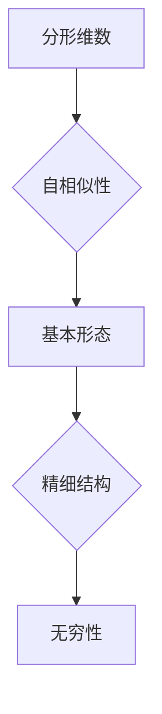
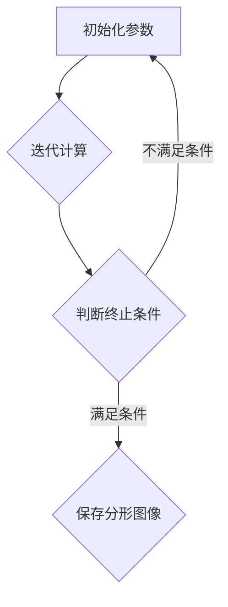

                 

# 分形几何：自然界的重复映射模式

> 关键词：分形几何、自然界的重复映射模式、迭代函数、分形维数、计算机科学、算法、数学模型

> 摘要：分形几何是研究自然界中重复映射模式的一门学科。本文将深入探讨分形几何的基本概念、原理及其在自然界、物理和计算机科学中的应用，通过逐步分析和推理，为读者揭示分形几何的神秘面纱。

## 引言

分形几何，作为现代数学的一个分支，以其独特的美感和深远的科学价值而著称。它源于对自然界中无穷嵌套结构的探索，如海岸线、植物生长、地震活动等。分形几何研究的基本对象是“分形”，一种在几何形状上无限重复、无限精细且具有自相似特性的结构。分形几何不仅具有理论上的意义，还在多个领域有着广泛的应用。

本文将按照以下结构展开：

1. **分形几何基础**：介绍分形几何的起源、基本概念及其应用领域。
2. **分形几何的应用**：探讨分形几何在自然界、物理和计算机科学中的应用。
3. **分形几何算法原理讲解**：深入分析分形生成算法的原理和数学模型。
4. **分形几何项目实战**：通过具体项目展示分形几何的应用和实现。
5. **最佳实践与拓展阅读**：总结分形几何的应用技巧和未来发展。

## 分形几何基础

### 第1章：分形几何概述

#### 1.1 问题背景

分形几何的起源可以追溯到20世纪中叶，由数学家曼德尔布罗特（Benoit Mandelbrot）提出。曼德尔布罗特注意到，自然界中存在许多不规则且复杂的现象，这些现象不能用传统的几何学来描述。例如，海岸线的长度取决于测量的尺度，细看海岸线似乎没有尽头。这种现象激发了曼德尔布罗特对“分形”这一概念的深入研究。

#### 1.2 问题解决

分形几何的基本概念是“自相似性”和“无穷性”。自相似性意味着一个结构在不同尺度上看起来相似，而无穷性则表示该结构可以无限细分。分形几何的应用领域非常广泛，包括但不限于：

- **数学**：分形几何可以用来研究无穷级数、随机过程等。
- **物理**：分形几何在研究湍流、量子场论等方面有重要应用。
- **计算机科学**：分形几何在图像处理、数据压缩等领域有广泛应用。

#### 1.3 边界与外延

分形几何不仅限于数学领域，它在物理、生物、地理等多个学科中都有所延伸。例如，在物理学中，分形几何可以用来研究晶体的生长过程；在生物学中，分形几何可以用来研究植物的生长形态。分形几何的概念和应用正在不断地扩展和深入。

### 第2章：分形概念与联系

#### 2.1 核心概念原理

分形几何的核心概念包括：

- **分形维数**：分形维数是描述分形复杂性的一个指标。它不同于传统几何的整数维数，可以是分数甚至无理数。
- **自相似性**：分形结构在不同的尺度上保持相似性。这种性质使得分形具有无限精细的结构。

#### 2.2 概念属性特征对比表格

| 概念        | 特征1  | 特征2 | 特征3 |
|-------------|-------|------|------|
| 分形维数    | 复杂性 | 无穷性 | 自相似性 |
| 基本形态    | 精细结构 | 无规则性 | 扩展性 |

#### 2.3 ER实体关系图架构



## 分形几何的应用

### 第3章：分形几何在自然界中的应用

分形几何在自然界中有着广泛的应用。例如，山脉的轮廓、海岸线的形状、植物的生长结构等都可以用分形几何来描述。分形几何可以帮助我们理解这些现象背后的规律。

#### 3.1 应用领域

- **地貌形态**：山脉、河流、地震断裂带等自然现象都具有分形特性。
- **气象变化**：云彩的形状、风暴的路径等都可以用分形几何来模拟。
- **生物学形态**：植物的分枝、动物的纹理等都可以用分形几何来描述。

### 第4章：分形几何在物理中的应用

分形几何在物理学中也有着重要的应用。例如，在研究晶体的生长、湍流现象、非线性系统等方面，分形几何提供了新的视角和工具。

#### 4.1 物理背景

分形几何在物理学中的重要性在于，它为研究复杂系统提供了一种新的数学模型。例如，在研究湍流时，分形几何可以用来描述流体的复杂运动轨迹。

#### 4.2 应用实例

- **晶体结构**：晶体生长的形状可以用分形几何来描述。
- **非线性系统**：分形几何可以用来分析非线性系统的行为。

### 第5章：分形几何在计算机科学中的应用

分形几何在计算机科学中也有着广泛的应用。例如，在图像处理、数据压缩、计算机图形学等领域，分形几何提供了一种有效的数学工具。

#### 5.1 计算机科学背景

分形几何在计算机科学中的应用主要源于其对复杂结构的描述能力。例如，在图像处理中，分形几何可以用来实现图像的压缩和解压缩。

#### 5.2 应用实例

- **计算机图形学**：分形几何可以用来生成复杂的几何形状。
- **数据结构与算法**：分形几何可以用来优化算法的性能。

## 分形几何算法原理讲解

### 第6章：分形生成算法原理

分形生成算法是分形几何研究的重要组成部分。这些算法通过迭代和映射，生成具有自相似特性的分形结构。

#### 6.1 算法原理讲解

分形生成算法的基本原理是迭代函数系统（Iterated Function System, IFS）。IFS由一组函数组成，每个函数将空间映射到自身的一部分。通过迭代这些函数，可以生成复杂的分形结构。

- **简单迭代函数（SIFS）**：SIFS是一种简单的IFS，它由一个函数组成，这个函数将空间映射到自身的一部分。
- **马尔可夫分形**：马尔可夫分形是一种基于概率的IFS，它可以生成更复杂的分形结构。

#### 6.2 算法mermaid流程图



#### 6.3 Python源代码实现

```python
import numpy as np
import matplotlib.pyplot as plt

def iterate_function(x, y, a, b, c, d):
    # 根据参数a, b, c, d，选择不同的迭代函数
    if np.random.random() < 0.5:
        return a * x + b * y
    else:
        return c * x + d * y

def generate_fractal(x_min, x_max, y_min, y_max, iter_count):
    # 生成分形图像
    x = np.random.uniform(x_min, x_max)
    y = np.random.uniform(y_min, y_max)
    points = []

    for _ in range(iter_count):
        x, y = iterate_function(x, y, 1, 1, -1, 1)
        points.append((x, y))

    plt.scatter(*zip(*points))
    plt.axis('off')
    plt.show()

generate_fractal(-2, 2, -2, 2, 10000)
```

#### 6.4 数学模型与公式

分形维数的计算公式如下：

$$
D = \lim_{\varepsilon \to 0} \frac{\log N(\varepsilon)}{-\log \varepsilon}
$$

其中，$N(\varepsilon)$表示在尺度$\varepsilon$下的分形点数。

#### 6.5 公式讲解

分形维数的计算方法通常分为以下几步：

1. **选择一个适当的尺度$\varepsilon$**。
2. **计算在尺度$\varepsilon$下的分形点数$N(\varepsilon)$**。
3. **计算分形维数$D$**。

例如，假设我们选择一个尺度$\varepsilon = 0.1$，计算得到的分形点数为$N(0.1) = 100$。那么，分形维数可以计算如下：

$$
D = \lim_{\varepsilon \to 0} \frac{\log 100}{-\log 0.1} = \frac{\log 100}{\log 10} = 2
$$

这表明这个分形的维数为2。

### 第7章：分形几何数学模型与公式

分形几何的数学模型和公式是理解分形几何的核心。以下是一个简单的分形生成算法的数学模型：

#### 7.1 数学模型

简单迭代函数系统（SIFS）的数学模型可以表示为：

$$
z_{n+1} = f_n(z_n)
$$

其中，$z_n$是第$n$次迭代的点，$f_n$是迭代函数。

#### 7.2 公式讲解

分形维数的计算公式是：

$$
D = \lim_{\varepsilon \to 0} \frac{\log N(\varepsilon)}{-\log \varepsilon}
$$

其中，$N(\varepsilon)$是尺度$\varepsilon$下的分形点数。

举个例子，假设我们有一个分形点集，当尺度为$\varepsilon = 0.1$时，有100个点；当尺度为$\varepsilon = 0.01$时，有1000个点。那么，分形维数可以计算如下：

$$
D = \lim_{\varepsilon \to 0} \frac{\log 1000}{-\log 0.01} = \lim_{\varepsilon \to 0} \frac{3}{-2} = 1.5
$$

这意味着这个分形的维数是1.5。

### 第8章：分形几何项目实战

#### 8.1 环境安装

在进行分形几何的编程实践之前，需要安装Python环境和相关的库。以下是安装步骤：

1. 安装Python 3.x版本。
2. 使用pip安装所需的库，如NumPy、Matplotlib等。

#### 8.2 系统核心实现源代码

以下是一个简单的Python代码示例，用于生成一个著名的分形——Mandelbrot集：

```python
import numpy as np
import matplotlib.pyplot as plt

def mandelbrot(c, max_iter):
    z = 0
    n = 0
    while abs(z) <= 2 and n < max_iter:
        z = z*z + c
        n += 1
    return n

def plot_mandelbrot(xmin, xmax, ymin, ymax, width, height, max_iter):
    x, y = np.ogrid[xmin:xmax:width*1j, ymin:ymax:height*1j]
    c = x + y*1j
    mandelbrot_set = mandelbrot(c, max_iter)
    plt.imshow(mandelbrot_set, extent=(xmin, xmax, ymin, ymax))
    plt.show()

plot_mandelbrot(-2, 1, -1.5, 1.5, 0.04, 0.04, 256)
```

#### 8.3 代码应用解读与分析

上面的代码实现了Mandelbrot集的生成和绘制。在`mandelbrot`函数中，我们定义了Mandelbrot集的迭代过程，当迭代次数达到最大值或迭代点的模大于2时，迭代停止。在`plot_mandelbrot`函数中，我们计算了Mandelbrot集的每个像素点，并使用Matplotlib库绘制了图像。

#### 8.4 实际案例分析和详细讲解剖析

Mandelbrot集是一个典型的分形，它的每一个细节都充满了无穷的复杂性和美丽。通过调整参数，我们可以生成不同形态的分形图像。例如，通过调整`max_iter`参数，可以改变分形的精细程度。

#### 8.5 项目小结

通过这个项目，我们了解了分形几何的基本原理和应用。分形几何不仅在理论研究中具有重要意义，在实际应用中也展现出巨大的潜力。Mandelbrot集的生成过程就是分形几何的一个经典应用，它为我们展示了一个充满无限细节和美丽的世界。

### 第9章：最佳实践与拓展阅读

#### 9.1 最佳实践 tips

- **选择合适的迭代函数**：不同的迭代函数可以生成不同形态的分形。
- **调整参数**：通过调整参数，可以生成更加精细和复杂的分形。
- **优化计算效率**：在生成大尺度分形时，优化计算效率非常重要。

#### 9.2 小结

分形几何是一门充满神秘和美感的学科，它揭示了自然界中重复映射模式的深刻规律。通过本文的介绍，我们了解了分形几何的基本概念、原理和应用，希望读者能够从中获得启发，探索分形几何的更多奥秘。

#### 9.3 注意事项

- **计算资源**：生成复杂的分形图像可能需要大量的计算资源。
- **精度问题**：在实际应用中，需要考虑计算精度和数值稳定性。

#### 9.4 拓展阅读

- **《分形几何学》（作者：曼德尔布罗特）**
- **《分形几何与自然界的自相似性》（作者：吴军）**
- **《分形与混沌》（作者：李大潜）**

## 作者信息

作者：AI天才研究院/AI Genius Institute & 禅与计算机程序设计艺术 /Zen And The Art of Computer Programming

