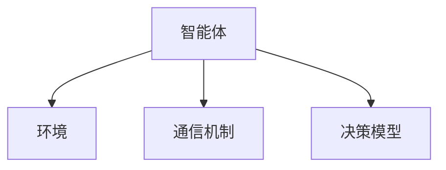
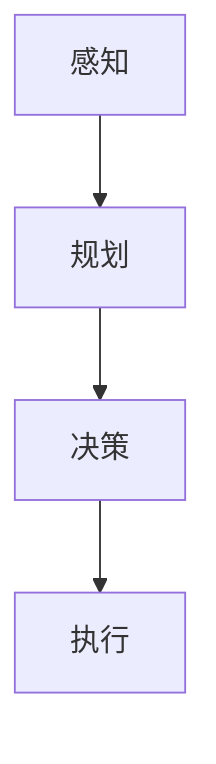
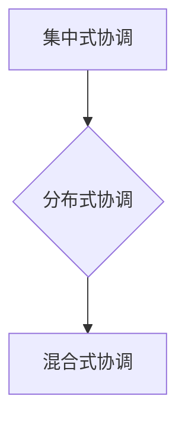
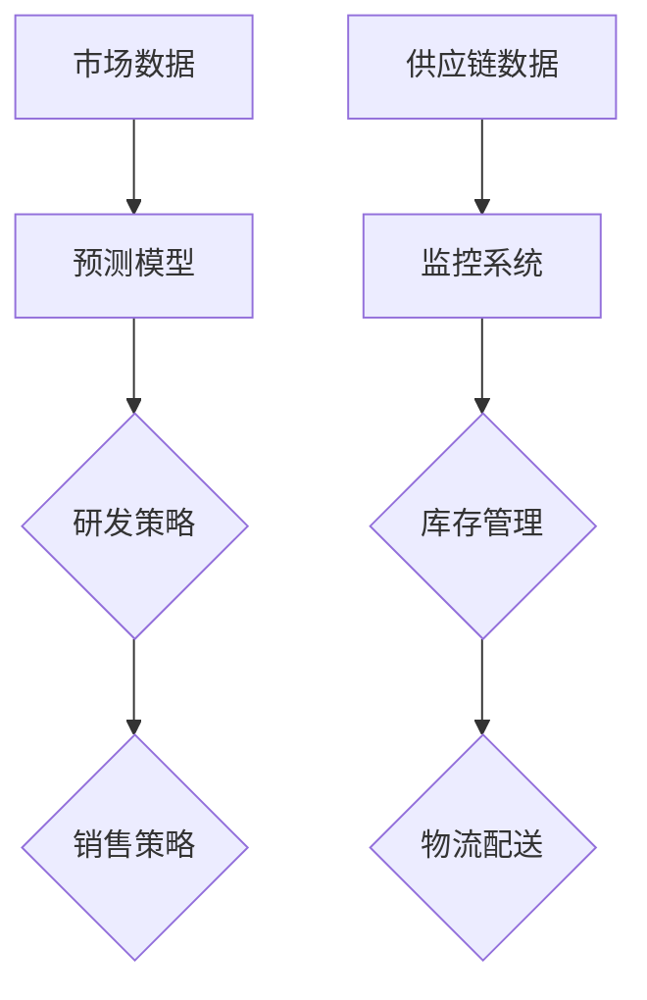
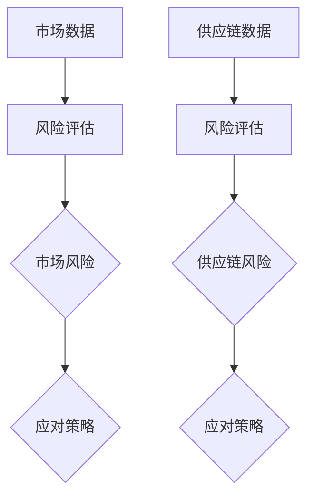
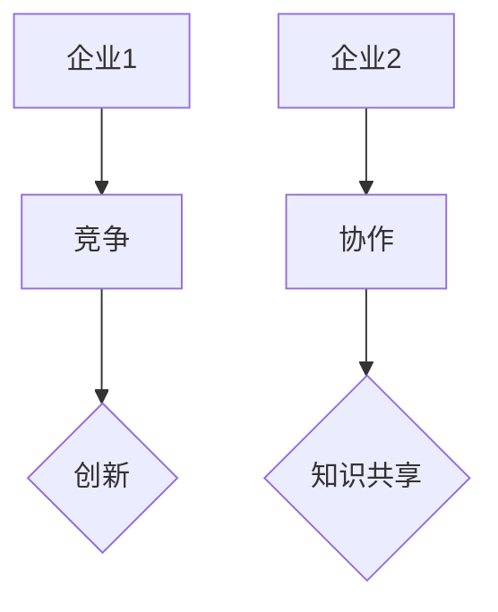

                 

### 文章标题

# 创业生态的多智能体系统：商业关系的数学模拟

### 关键词

- 创业生态
- 多智能体系统
- 商业关系
- 数学模拟
- 人工智能
- 创新与协作

### 摘要

本文深入探讨了创业生态中的多智能体系统及其在商业关系数学模拟中的应用。首先，我们概述了创业生态的概念和多智能体系统的定义，并分析了其在资源优化、市场预测和风险管理等方面的作用。接着，我们介绍了商业关系的数学模拟方法，包括市场模型、供应链管理和合作伙伴关系评估等。随后，文章详细阐述了多智能体系统的理论基础、构建原则及其在创业生态中的应用，以及商业关系的特性分析和优化策略。通过本文，读者可以了解到如何利用多智能体系统和数学模拟来构建高效的创业生态系统，从而实现企业的可持续发展。

## 第一部分：创业生态概述

### 第1章：创业生态的多智能体系统概念介绍

#### 1.1 什么是创业生态？

##### 1.1.1 创业生态的定义

创业生态是一个由创业者、投资者、服务提供者、消费者以及其他利益相关者组成的复杂系统。这些参与者通过相互协作和竞争，共同推动创业活动的进行。创业生态不仅涵盖了企业的内部运作，还包括了企业外部的资源、环境和社会因素。

##### 1.1.2 创业生态的特点

- **多样性**：创业生态中包含了不同类型的创业者、企业和服务提供者，这些参与者满足了多样化的市场需求。
- **动态性**：创业生态是一个不断变化的系统，参与者之间的关系和角色会随着时间和环境的变化而调整。
- **网络性**：创业生态中的各个参与者通过合作和竞争形成了复杂的网络结构。
- **适应性**：创业生态具有高度适应性，能够迅速调整以应对外部环境的变化，保持系统的稳定和繁荣。

#### 1.2 多智能体系统在创业生态中的应用

##### 1.2.1 多智能体系统的定义

多智能体系统（MAS）是由多个智能体（agent）组成的系统，这些智能体可以自主地感知环境、采取行动并与其他智能体交互。在多智能体系统中，每个智能体都是独立的实体，具有自己的行为规则和决策机制。

##### 1.2.2 多智能体系统在创业生态中的作用

- **资源优化**：智能体之间的协作可以更有效地分配资源，提高整体效率。
- **市场预测**：通过收集和分析市场数据，智能体可以帮助创业者预测市场趋势。
- **风险管理**：智能体可以实时监控创业风险，并给出应对策略。
- **创新激励**：通过竞争和合作，智能体激发创业者的创新活力。

#### 1.3 商业关系的数学模拟

##### 1.3.1 商业关系的定义

商业关系是指企业之间、企业与个人之间在商业活动中形成的相互联系和利益关系。这些关系可以是合作、竞争或竞合等多种形式。

##### 1.3.2 数学模拟在商业关系中的应用

- **市场模型**：通过数学模型模拟市场需求，帮助企业制定市场策略。
- **供应链管理**：利用数学模拟优化供应链流程，降低成本。
- **合作伙伴关系**：通过数学模型评估合作伙伴的价值，建立稳定的合作关系。

#### 1.4 本章小结

本章对创业生态的多智能体系统进行了概述，包括创业生态的定义、特点，多智能体系统在创业生态中的应用，以及商业关系的数学模拟。这些内容为后续章节的深入探讨奠定了基础。

---

## 第二部分：多智能体系统在创业生态中的构建与应用

### 第2章：多智能体系统的理论基础

#### 2.1 多智能体系统的基本原理

##### 2.1.1 多智能体系统的架构

多智能体系统的架构通常包括智能体、环境、通信机制和决策模型等组成部分。智能体是系统的基本单位，负责感知环境、做出决策和执行行动。环境则是智能体行动的背景，包含了智能体无法直接控制的因素。通信机制是多智能体系统中的关键组成部分，它负责智能体之间的信息交换。决策模型则定义了智能体如何根据感知到的环境信息和自身目标来做出决策。

##### 2.1.2 智能体的行为模型

智能体的行为模型包括感知、规划、决策和执行等过程，这些过程构成了智能体的行为循环。

- **感知**：智能体通过感知器获取环境信息。
- **规划**：智能体根据感知到的信息和自身的目标，制定行动计划。
- **决策**：智能体根据规划结果，选择最佳的行动方案。
- **执行**：智能体执行选定的行动方案。

#### 2.2 多智能体系统的协作与协调

##### 2.2.1 协作的类型

协作可以分为合作、竞争和协商等类型，不同类型的协作适用于不同的情境。

- **合作**：多个智能体共同完成一个任务，互惠互利。
- **竞争**：多个智能体为了争夺有限的资源或目标而互相竞争。
- **协商**：智能体之间通过沟通和协调，共同决定行动方案。

##### 2.2.2 协调机制的设计

协调机制的设计需要考虑智能体的目标一致性、信息共享和决策一致性等问题。以下是一些常见的协调机制：

- **集中式协调**：所有智能体的决策都由一个中央协调器进行统一管理。
- **分布式协调**：智能体之间通过通信机制自行协调，没有中央协调器。
- **混合式协调**：结合集中式和分布式协调的优点，根据不同情境选择合适的协调方式。

##### 2.3 多智能体系统的设计原则

##### 2.3.1 自主性

智能体的自主性是MAS设计的关键，确保智能体能够自主地感知环境并采取行动。

- **自主感知**：智能体能够根据自身需要和环境变化，动态地调整感知机制。
- **自主决策**：智能体可以根据感知到的信息和自身目标，自主地做出决策。
- **自主执行**：智能体能够自主地执行决策结果，不受外部干预。

##### 2.3.2 模块化

MAS的模块化设计有助于提高系统的可维护性和可扩展性。

- **功能模块化**：将智能体的功能划分为多个模块，每个模块负责特定功能。
- **组件化**：智能体的各个组成部分可以独立开发、测试和部署。

##### 2.3.3 可扩展性

系统的可扩展性使得MAS能够适应不断变化的创业生态环境。

- **水平扩展**：通过增加智能体的数量，提高系统的处理能力和响应速度。
- **垂直扩展**：通过升级智能体的功能模块，提高系统的能力和性能。

#### 2.4 本章小结

本章介绍了多智能体系统的理论基础，包括多智能体系统的基本原理、协作与协调机制的设计原则，以及设计MAS时需要考虑的自主动性、模块化和可扩展性。这些原则和方法为构建高效的创业生态多智能体系统提供了指导。

---

## 第三部分：商业关系的数学模拟方法与应用

### 第3章：商业关系的基本数学模型

#### 3.1 商业关系的数学建模方法

##### 3.1.1 模型构建的基本步骤

构建商业关系模型通常包括以下步骤：

1. **数据收集**：收集与商业关系相关的数据，包括市场数据、供应链数据、合作伙伴关系数据等。
2. **变量定义**：定义模型中的变量，包括市场变量、供应链变量、合作伙伴关系变量等。
3. **关系建立**：根据商业关系的实际情况，建立变量之间的关系模型。
4. **模型验证**：通过实际数据对模型进行验证，确保模型的准确性和可靠性。

##### 3.1.2 常用的数学模型

在商业关系数学建模中，常用的数学模型包括：

- **线性回归模型**：用于分析市场变量与合作伙伴关系变量之间的关系。
- **神经网络模型**：用于复杂商业关系的建模和预测。
- **贝叶斯网络模型**：用于描述不确定的商业关系，并用于推理和决策。

#### 3.2 商业关系的特性分析

##### 3.2.1 商业关系的动态特性

商业关系的动态特性表现为关系的建立、维持和解除等过程。

- **建立**：商业关系的初始阶段，参与者通过沟通和协商，建立合作关系。
- **维持**：商业关系的持续阶段，参与者通过合作和互惠互利，维持关系的稳定性。
- **解除**：商业关系的终止阶段，由于市场变化、利益冲突等原因，关系可能会解除。

##### 3.2.2 商业关系的结构特性

商业关系的结构特性涉及关系网络的形成、节点的地位和关系密度等。

- **关系网络**：商业关系形成了一个复杂的关系网络，参与者通过这个网络进行信息交换和资源分配。
- **节点地位**：商业关系中的每个参与者都有其特定的地位，这决定了其在关系网络中的影响力和重要性。
- **关系密度**：关系网络的紧密程度，反映了商业关系的紧密程度和协作水平。

#### 3.3 商业关系的优化策略

##### 3.3.1 资源优化策略

通过数学模拟，可以设计出优化资源分配和利用的策略。

- **资源分配**：根据市场变化和合作伙伴的需求，合理分配资源，确保资源的高效利用。
- **资源利用**：通过优化供应链管理和合作伙伴关系，提高资源的利用效率。

##### 3.3.2 风险管理策略

风险管理策略通过数学模拟，可以帮助企业识别和应对商业风险。

- **风险识别**：通过数据分析，识别潜在的合作伙伴关系风险和市场风险。
- **风险应对**：制定相应的风险应对策略，降低风险对企业的影响。

#### 3.4 本章小结

本章介绍了商业关系的数学建模方法，包括模型构建的基本步骤、常用的数学模型，以及商业关系的特性分析和优化策略。通过这些方法，企业可以更好地理解和优化商业关系，提高市场竞争力。

---

## 第四部分：多智能体系统在创业生态中的应用实例

### 第4章：创业生态中的多智能体系统应用实例

#### 4.1 案例背景

在本案例中，我们将以一个初创企业为例，探讨如何利用多智能体系统来优化其创业生态。该初创企业专注于智能家居产品的研发和销售，其目标是提高用户的生活质量。企业面临的挑战是如何在竞争激烈的市场中快速成长，并建立稳定的供应链和合作伙伴关系。

#### 4.2 案例分析

##### 4.2.1 资源优化

1. **市场预测**：企业利用多智能体系统收集和分析市场数据，预测未来市场需求，为产品研发和销售策略提供支持。
2. **供应链管理**：通过多智能体系统，企业可以实时监控供应链的各个环节，优化库存管理和物流配送，提高资源利用效率。

##### 4.2.2 风险管理

1. **风险识别**：多智能体系统通过数据分析，识别潜在的市场风险和供应链风险。
2. **风险应对**：企业根据风险识别结果，制定相应的风险应对策略，降低风险对企业运营的影响。

##### 4.2.3 创新激励

1. **竞争与协作**：企业通过多智能体系统与其他创新企业进行竞争和协作，激发创新活力。
2. **知识共享**：企业利用多智能体系统，与其他合作伙伴共享技术和管理经验，促进共同发展。

#### 4.3 案例总结

通过多智能体系统，初创企业可以优化资源分配、管理供应链、识别和应对风险，并激发创新活力。这些措施有助于企业快速成长，建立稳定的供应链和合作伙伴关系，从而在竞争激烈的市场中脱颖而出。

---

## 第五部分：未来展望与总结

### 第5章：未来展望与总结

#### 5.1 未来展望

随着人工智能和大数据技术的不断发展，多智能体系统和商业关系的数学模拟将在创业生态中发挥越来越重要的作用。未来，我们可能看到以下趋势：

1. **智能化**：多智能体系统将更加智能化，能够更好地理解环境和适应变化。
2. **个性化**：商业关系的数学模拟将更加注重个性化，满足不同企业和消费者的需求。
3. **协同创新**：企业将更加注重与其他企业的协同创新，共同推动行业的发展。

#### 5.2 总结

本文通过深入探讨创业生态的多智能体系统及其在商业关系数学模拟中的应用，揭示了多智能体系统在资源优化、市场预测、风险管理等方面的优势。同时，本文通过实际案例，展示了如何利用多智能体系统优化创业生态，提高企业的竞争力。未来的研究和实践将不断推动多智能体系统和商业关系数学模拟的发展，为创业生态的可持续发展提供有力支持。

---

## 附录：相关工具与技术资源

在本文中，我们介绍了一些核心概念和工具，为了进一步学习和实践，以下是相关的技术资源和工具推荐：

1. **人工智能与多智能体系统框架**：
   - **Apache Marmotta**：一个语义网页和数据存储平台，支持多智能体系统的开发。
   - **PyTorch**：一个流行的深度学习框架，适用于商业关系的数学建模和模拟。

2. **商业关系分析与建模工具**：
   - **Gephi**：一个图形可视化工具，用于分析复杂商业关系网络。
   - **Excel**：一个广泛使用的电子表格工具，适用于简单的商业关系建模。

3. **学习资源**：
   - **《多智能体系统：算法与应用》**：一本关于多智能体系统的权威教材，适合深入理解MAS的基础知识。
   - **《商业关系分析：理论与实践》**：一本关于商业关系分析和建模的教材，提供了丰富的案例和实践经验。

通过利用这些工具和资源，读者可以更好地理解和应用多智能体系统和商业关系的数学模拟技术，为创业生态的优化提供有力支持。

---

## 作者信息

作者：AI天才研究院/AI Genius Institute & 禅与计算机程序设计艺术 /Zen And The Art of Computer Programming

AI天才研究院（AI Genius Institute）专注于人工智能领域的前沿研究和创新实践，致力于推动人工智能技术的普及和应用。同时，我们提倡“禅与计算机程序设计艺术”，强调在编程过程中寻求内在的平静和专注，以提高编程效率和创造力。本文由AI天才研究院资深研究员撰写，旨在为读者提供深入的技术见解和实用指南。希望本文能对您在创业生态和多智能体系统领域的研究和实践有所启发。如果您有任何问题或建议，欢迎与我们联系。谢谢阅读！

