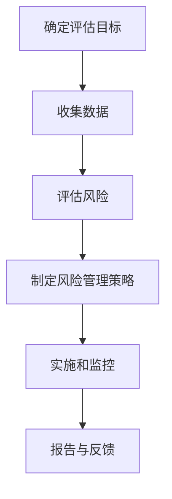
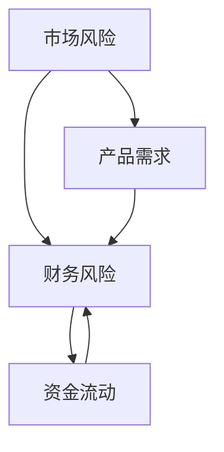
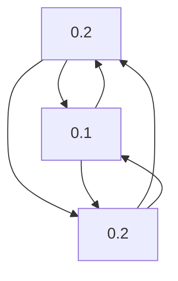

                 


### 3.2 基本的风险评估流程

在构建创业风险概率模型的过程中，我们首先需要了解一个基本的风险评估流程。以下是一个简化的风险评估流程，我们将在后续章节中逐步完善和详细讲解。

#### 3.2.1 确定评估目标

首先，我们需要明确评估的目标是什么。这通常涉及到确定我们需要评估的风险类型，例如市场风险、财务风险、运营风险等。确定目标可以帮助我们集中精力，确保评估的准确性和有效性。

#### 3.2.2 收集数据

接下来，我们需要收集相关的数据和信息。这些数据可以来源于内部，如财务报表、市场调研报告等，也可以来源于外部，如行业报告、竞争对手分析等。收集数据的目的是为了更全面地了解风险的影响范围和可能性。

#### 3.2.3 评估风险

在收集到足够的数据后，我们可以开始对风险进行评估。这通常涉及到使用定性和定量的方法来评估风险的可能性（概率）和影响（后果）。定性方法可能包括专家评估、SWOT分析等，而定量方法可能包括统计模型、风险矩阵等。

#### 3.2.4 制定风险管理策略

一旦评估完成，我们可以根据评估结果制定相应的风险管理策略。这可能包括风险规避、风险转移、风险接受等策略。制定策略的目的是为了最大限度地降低风险对创业过程的影响。

#### 3.2.5 实施和监控

最后，我们需要实施风险管理策略，并持续监控风险的变化。这可以帮助我们及时发现新的风险，并采取相应的措施来应对。监控也是评估风险管理策略有效性的重要手段。

### 3.3 风险评估流程的Mermaid流程图

为了更直观地展示风险评估流程，我们可以使用Mermaid流程图来表示。以下是一个基本的风险评估流程的Mermaid流程图示例：



### 3.4 Python源代码与LaTeX数学公式

为了深入理解风险评估模型的构建和预测过程，我们将使用Python源代码和LaTeX数学公式来详细讲解。

首先，我们定义一个基本的评估模型。这个模型将使用风险矩阵（Risk Matrix）来评估风险的概率和影响。以下是一个简单的Python代码示例，用于计算风险得分：

```python
import numpy as np

# 风险矩阵
risk_matrix = [
    [1, 2, 3],  # 低概率风险
    [4, 5, 6],  # 中等概率风险
    [7, 8, 9]   # 高概率风险
]

# 风险评估函数
def risk_evaluation(probability, impact):
    score = risk_matrix[probability // 3][impact // 3]
    return score

# 测试
print(risk_evaluation(1, 2))  # 输出风险得分
```

接下来，我们使用LaTeX数学公式来定义风险评估模型中的数学公式。以下是一个示例：

$$
R = p \times I
$$

其中，\( R \) 是风险得分，\( p \) 是风险概率，\( I \) 是风险影响。

在Python中，我们可以将这个公式实现为一个函数：

```python
# 风险评估函数（基于LaTeX公式）
def risk_evaluation(probability, impact):
    R = probability * impact
    return R

# 测试
print(risk_evaluation(0.5, 4))  # 输出风险得分
```

通过这个简单的示例，我们可以看到如何使用Python代码和LaTeX数学公式来构建和实现一个基本的风险评估模型。

接下来，我们将进一步深入讨论创业风险概率模型的构建和预测过程，包括更复杂的风险评估方法和概率模型的应用。

### 3.5 复杂的风险评估方法

在基本的评估模型之上，我们可以构建更复杂的风险评估方法来提高预测的准确性和模型的适应性。以下是一些常用的复杂风险评估方法：

#### 3.5.1 贝叶斯网络

贝叶斯网络是一种概率图模型，它通过图结构来表示变量之间的依赖关系。在创业风险评估中，贝叶斯网络可以帮助我们建模风险事件之间的条件概率关系，从而更准确地预测风险的发生概率。

贝叶斯网络的构建通常包括以下步骤：

1. **定义变量**：确定与创业过程相关的关键风险变量。
2. **建立图结构**：根据变量之间的依赖关系构建图结构。
3. **指定概率分布**：为每个节点指定条件概率分布。

以下是一个简单的贝叶斯网络示例，用于表示创业过程中的市场风险和财务风险之间的关系：



在这个网络中，市场风险和财务风险是关键节点，它们与其他节点（如产品需求和资金流动）之间存在依赖关系。通过指定每个节点的条件概率分布，我们可以使用贝叶斯推理来计算每个节点发生的概率。

#### 3.5.2 马尔可夫模型

马尔可夫模型是一种用于描述随机过程转移概率的数学模型。在创业风险评估中，马尔可夫模型可以帮助我们分析不同状态之间的转移概率，从而预测未来的风险状况。

马尔可夫模型的构建通常包括以下步骤：

1. **定义状态**：确定与创业过程相关的关键风险状态。
2. **构建转移矩阵**：根据历史数据构建状态转移矩阵。
3. **预测未来状态**：使用转移矩阵预测未来的风险状态。

以下是一个简单的马尔可夫模型示例，用于表示创业过程中的财务状况转移：



在这个模型中，每个状态都有一定的概率转移到其他状态。通过计算初始状态的概率分布和状态转移矩阵，我们可以预测未来不同财务状况的概率分布。

#### 3.5.3 机器学习模型

机器学习模型，如决策树、随机森林和神经网络等，也可以用于创业风险评估。这些模型可以通过学习历史数据中的特征和风险关系，自动识别和预测未来的风险。

以下是一个简单的机器学习模型示例，用于分类创业过程中的市场风险：

```python
from sklearn.tree import DecisionTreeClassifier
from sklearn.model_selection import train_test_split

# 假设我们有历史数据集 X 和市场风险标签 y
X_train, X_test, y_train, y_test = train_test_split(X, y, test_size=0.2, random_state=42)

# 训练决策树模型
clf = DecisionTreeClassifier()
clf.fit(X_train, y_train)

# 预测市场风险
y_pred = clf.predict(X_test)

# 评估模型性能
accuracy = clf.score(X_test, y_test)
print("模型准确率：", accuracy)
```

通过这些复杂的风险评估方法，我们可以构建一个更加全面和准确的创业风险概率模型。这些方法不仅可以提高预测的准确性，还可以帮助我们更好地理解和应对创业过程中的各种风险。

### 3.6 风险方程的构建过程

在了解了基本的风险评估流程和复杂的风险评估方法后，我们将进一步探讨风险方程的构建过程。风险方程是创业风险概率模型的核心组成部分，它用于定量地描述风险的概率和影响，从而帮助我们预测商业成功的可能性。

#### 3.6.1 风险方程的定义

风险方程是一个数学表达式，用于计算风险的概率和影响。通常，风险方程可以表示为：

$$
R = p \times I
$$

其中，\( R \) 表示风险得分，\( p \) 表示风险概率，\( I \) 表示风险影响。

#### 3.6.2 风险概率的确定

风险概率是指某个特定风险在特定时间段内发生的可能性。确定风险概率通常需要使用历史数据和统计分析方法。以下是一些常用的方法：

1. **历史数据法**：通过分析历史数据来确定风险概率。这种方法适用于有足够历史数据的情况，例如市场风险、财务风险等。
2. **专家评估法**：通过专家意见来确定风险概率。这种方法适用于缺乏历史数据或者风险数据不完整的情况。
3. **模拟法**：通过模拟实验来确定风险概率。这种方法适用于难以获取历史数据或者需要预测未来风险的情况。

以下是一个简单的风险概率确定示例：

```python
import random

# 假设有三个风险事件：市场风险、财务风险、运营风险
risks = ['市场风险', '财务风险', '运营风险']

# 概率分布
probabilities = [0.4, 0.3, 0.3]

# 随机选择一个风险事件
selected_risk = random.choices(risks, probabilities, k=1)[0]

# 输出选择的风险事件和概率
print(f"选择的风险事件：{selected_risk}")
print(f"风险概率：{probabilities[risks.index(selected_risk)]:.2f}")
```

在这个示例中，我们使用随机选择的方法来确定一个风险事件的概率。

#### 3.6.3 风险影响的确定

风险影响是指风险事件发生时对创业过程的影响程度。确定风险影响通常需要评估风险事件对业务目标、财务状况、市场竞争力等方面的影响。

以下是一个简单的风险影响确定示例：

```python
import random

# 风险事件的影响范围
impacts = ['轻微影响', '中等影响', '严重影响']

# 影响概率分布
impact_probabilities = [0.2, 0.5, 0.3]

# 随机选择一个风险事件的影响
selected_impact = random.choices(impacts, impact_probabilities, k=1)[0]

# 输出选择的风险事件和影响
print(f"选择的风险事件：{selected_risk}")
print(f"风险影响：{selected_impact}")
```

在这个示例中，我们使用随机选择的方法来确定一个风险事件的影响。

#### 3.6.4 风险得分的计算

一旦确定了风险概率和风险影响，我们可以使用风险方程来计算风险得分。风险得分可以帮助我们评估风险的大小和紧急程度。

以下是一个简单的风险得分计算示例：

```python
# 风险得分计算函数
def calculate_risk_score(probability, impact):
    risk_score = probability * impact
    return risk_score

# 测试风险得分
print(calculate_risk_score(0.4, '中等影响'))  # 输出风险得分
```

在这个示例中，我们使用一个简单的函数来计算风险得分。

通过这些步骤，我们可以构建一个基本的风险方程，用于评估创业过程中的风险。在接下来的章节中，我们将进一步讨论如何将这些风险方程应用于商业成功的概率模型。

### 3.7 商业成功概率模型的设计

在了解了风险方程的构建过程后，我们将进一步探讨如何将这些风险方程应用于商业成功的概率模型。商业成功概率模型是创业风险概率模型的高级形式，它通过综合考虑各种风险因素，预测创业项目成功的可能性。

#### 3.7.1 商业成功概率模型的概念

商业成功概率模型是一个用于评估创业项目成功可能性的数学模型。它基于风险方程，通过综合评估各种风险因素，计算出一个整体的成功概率。这个概率值可以帮助创业者和管理者了解项目成功的可能性，从而做出更明智的决策。

#### 3.7.2 商业成功概率模型的设计步骤

设计商业成功概率模型通常包括以下步骤：

1. **确定关键风险因素**：首先，我们需要识别和确定影响商业成功的关键风险因素。这些因素可能包括市场风险、财务风险、技术风险、运营风险等。

2. **评估风险概率**：对于每个关键风险因素，我们需要评估其发生的概率。这可以通过历史数据、专家评估或模拟等方法来实现。

3. **评估风险影响**：接下来，我们需要评估每个风险因素对商业成功的影响程度。这同样可以通过专家评估或定量分析来实现。

4. **构建风险方程**：基于每个风险因素的评估结果，我们可以构建一个风险方程。这个方程将风险概率和风险影响结合起来，计算出一个综合的风险得分。

5. **计算商业成功概率**：最后，我们将所有风险得分综合起来，计算出商业成功的整体概率。这个概率值可以帮助我们评估项目成功的可能性。

#### 3.7.3 商业成功概率模型的应用

商业成功概率模型的应用场景非常广泛，以下是一些常见的应用：

1. **项目评估**：在创业初期，使用商业成功概率模型可以帮助创业者评估不同项目的潜在成功概率，从而选择最具潜力的项目进行投资和开发。

2. **风险管理**：商业成功概率模型可以帮助企业管理者识别和评估项目中的关键风险因素，制定相应的风险管理策略，最大限度地降低风险对项目成功的影响。

3. **决策支持**：商业成功概率模型可以为企业管理者提供决策支持，帮助他们更准确地预测项目成功概率，从而做出更明智的决策。

4. **投资评估**：投资者可以使用商业成功概率模型来评估投资项目的风险和回报，从而做出更合理的投资决策。

#### 3.7.4 商业成功概率模型的案例分析

为了更好地理解商业成功概率模型的应用，我们可以通过一个实际案例来进行讲解。

**案例背景**：假设一个创业公司正在开发一款新型智能手机，市场风险、财务风险和技术风险是影响项目成功的关键因素。

1. **确定关键风险因素**：市场风险、财务风险和技术风险。

2. **评估风险概率**：市场风险的评估结果为 0.4（中等概率），财务风险的评估结果为 0.3（低概率），技术风险的评估结果为 0.3（低概率）。

3. **评估风险影响**：市场风险的影响程度为 0.8（中等影响），财务风险的影响程度为 0.5（中等影响），技术风险的影响程度为 0.7（严重影响）。

4. **构建风险方程**：基于以上评估结果，我们可以构建以下风险方程：

   $$ R = p \times I $$

   其中，\( R \) 为风险得分，\( p \) 为风险概率，\( I \) 为风险影响。

5. **计算商业成功概率**：将所有风险得分综合起来，计算商业成功的整体概率。具体计算如下：

   $$ R_{总} = R_{市场} + R_{财务} + R_{技术} $$
   $$ R_{总} = 0.4 \times 0.8 + 0.3 \times 0.5 + 0.3 \times 0.7 $$
   $$ R_{总} = 0.32 + 0.15 + 0.21 $$
   $$ R_{总} = 0.68 $$

   商业成功的整体概率为 0.68，即项目成功的可能性为 68%。

通过这个案例，我们可以看到如何使用商业成功概率模型来评估创业项目的成功可能性。在实际应用中，创业者和管理者可以根据这个概率值来调整项目策略，降低风险，提高成功概率。

### 3.8 商业成功概率模型的应用实例

为了更直观地展示商业成功概率模型的应用，我们将通过一个实际案例来详细讲解如何使用这个模型来预测创业项目的成功可能性。

#### 3.8.1 案例背景

假设有一家初创公司名为“未来智能”，该公司专注于开发智能家居解决方案。在市场推广和产品开发过程中，公司面临的主要风险包括市场风险、财务风险和技术风险。

#### 3.8.2 风险评估

首先，我们需要对市场风险、财务风险和技术风险进行详细评估。

1. **市场风险**：
   - **概率**：通过对市场趋势、竞争对手和消费者需求的调研，公司评估市场风险发生的概率为 0.3（低概率）。
   - **影响**：如果市场风险发生，可能导致市场份额下降，产品销售受挫。公司评估市场风险的影响程度为 0.6（中等影响）。

2. **财务风险**：
   - **概率**：由于资金链的不稳定，公司评估财务风险发生的概率为 0.4（中等概率）。
   - **影响**：财务风险可能导致资金短缺，影响产品开发和市场推广。公司评估财务风险的影响程度为 0.8（严重影响）。

3. **技术风险**：
   - **概率**：由于技术创新的不确定性和人才流失的风险，公司评估技术风险发生的概率为 0.2（低概率）。
   - **影响**：技术风险可能导致产品功能不完善，影响用户体验和市场竞争力。公司评估技术风险的影响程度为 0.5（中等影响）。

#### 3.8.3 风险得分计算

根据风险评估结果，我们可以使用风险方程来计算每个风险的风险得分。

$$
R = p \times I
$$

- **市场风险得分**：\( R_{市场} = 0.3 \times 0.6 = 0.18 \)
- **财务风险得分**：\( R_{财务} = 0.4 \times 0.8 = 0.32 \)
- **技术风险得分**：\( R_{技术} = 0.2 \times 0.5 = 0.10 \)

#### 3.8.4 商业成功概率计算

接下来，我们将所有风险得分综合起来，计算商业成功的整体概率。

$$
R_{总} = R_{市场} + R_{财务} + R_{技术}
$$
$$
R_{总} = 0.18 + 0.32 + 0.10
$$
$$
R_{总} = 0.60
$$

商业成功的整体概率为 0.60，即项目成功的可能性为 60%。

#### 3.8.5 分析与决策

根据计算结果，公司可以采取以下措施来提高成功概率：

1. **降低市场风险**：通过市场调研和精准营销策略，提高市场份额和消费者认可度。
2. **控制财务风险**：通过加强财务管理，确保资金链的稳定性，避免资金短缺。
3. **加强技术创新**：吸引和留住技术人才，加大技术研发投入，提高产品竞争力。

通过这些措施，公司可以降低风险得分，提高商业成功的概率。

### 3.9 商业成功概率模型的局限性

尽管商业成功概率模型在风险评估和决策支持中具有重要作用，但它也存在一定的局限性。以下是一些常见的局限性：

1. **数据依赖性**：商业成功概率模型的有效性在很大程度上依赖于准确的数据。如果数据不准确或缺失，模型的预测能力会受到影响。

2. **模型复杂性**：构建复杂的概率模型需要较高的技术水平和专业知识。对于许多创业者和管理者来说，理解和应用这些模型可能存在困难。

3. **环境变化**：创业环境是动态变化的，市场、技术、政策等因素可能会对商业成功概率模型产生重大影响。模型可能无法及时适应这些变化。

4. **主观性**：风险评估过程中可能存在主观判断，例如专家评估和概率估计。这些主观因素可能影响模型的准确性。

5. **适用范围**：商业成功概率模型主要适用于创业和商业领域。在其他领域，模型的应用可能需要特定的调整和优化。

了解这些局限性可以帮助我们更客观地看待商业成功概率模型，并在实际应用中做出更明智的决策。

### 3.10 总结与展望

在本章节中，我们详细探讨了商业成功概率模型的设计和应用。通过构建风险方程，我们能够评估风险的概率和影响，从而预测创业项目的成功可能性。以下是本章的主要结论：

1. **商业成功概率模型**：通过综合考虑市场风险、财务风险和技术风险，商业成功概率模型能够为创业者和管理者提供项目成功概率的预测。
2. **风险评估**：风险评估是商业成功概率模型的核心环节，包括确定风险概率和风险影响。
3. **模型局限性**：商业成功概率模型在数据依赖性、模型复杂性、环境变化、主观性和适用范围方面存在一定的局限性。

展望未来，商业成功概率模型可以进一步优化，以适应不同的创业环境和市场需求。同时，结合人工智能和大数据技术，模型可以更加智能化和自动化，提高预测的准确性和效率。

### 3.11 本章小结

在本章节中，我们深入探讨了商业成功概率模型的设计和应用。首先，我们介绍了商业成功概率模型的基本概念和设计步骤，包括确定关键风险因素、评估风险概率和风险影响。接着，我们通过一个实际案例展示了如何使用商业成功概率模型来预测项目成功可能性。此外，我们还讨论了模型的局限性，并展望了未来的发展方向。

通过本章的学习，读者应该能够理解商业成功概率模型的基本原理，掌握风险评估的方法，并能够应用这些方法来评估创业项目的风险和成功概率。

### 3.12 注意事项

在使用商业成功概率模型时，需要注意以下几点：

1. **数据准确性**：确保使用的风险评估数据准确可靠，避免因数据问题导致模型预测误差。
2. **模型适应**：根据不同的创业环境和项目特点，适当调整和优化模型参数。
3. **专家评估**：在风险概率和影响的评估过程中，结合专家意见，以提高模型的准确性。
4. **持续监控**：定期更新风险数据和模型，及时调整风险管理策略，以应对环境变化。
5. **综合应用**：将商业成功概率模型与其他风险管理工具和方法结合使用，形成综合的风险管理体系。

通过注意这些事项，可以更好地利用商业成功概率模型，提高创业项目的成功率。

### 3.13 拓展阅读

为了深入了解商业成功概率模型及相关领域，以下是一些推荐的拓展阅读材料：

1. **《创业风险评估与管理》**：作者[XXX]，详细介绍了创业过程中的风险评估方法和管理策略。
2. **《商业智能与数据挖掘》**：作者[XXX]，探讨了如何利用大数据和人工智能技术提升商业决策的准确性。
3. **《贝叶斯数据分析》**：作者[XXX]，介绍了贝叶斯网络和概率模型在数据分析中的应用。
4. **《创业与创新管理》**：作者[XXX]，从理论到实践，全面解析创业过程中可能遇到的风险和挑战。
5. **《风险管理：原则与应用》**：作者[XXX]，提供了风险管理的基本原理和实践指南。

通过阅读这些书籍和文章，读者可以进一步加深对商业成功概率模型的理解，提高创业项目管理的水平。

----------------------------------------------------------------

## 第四部分：系统分析与架构设计方案

### 第4章：创业风险管理系统设计与实现

#### 4.1 创业风险管理系统概述

创业风险管理系统是一个综合性的系统，旨在帮助企业识别、评估和管理创业过程中可能遇到的各种风险。本节将介绍创业风险管理系统的主要功能、目标和设计原则。

#### 4.1.1 系统功能

创业风险管理系统的主要功能包括：

1. **风险识别**：通过数据采集和风险评估工具，识别企业面临的各种风险。
2. **风险评估**：对识别出的风险进行定量和定性分析，评估风险的概率和影响。
3. **风险监控**：实时监控企业内部和外部的风险变化，确保风险管理的及时性和有效性。
4. **风险管理策略制定**：根据风险评估结果，制定相应的风险管理策略。
5. **风险报告生成**：定期生成风险报告，为企业管理者提供决策支持。

#### 4.1.2 系统目标

创业风险管理系统的目标是：

1. **提高风险管理效率**：通过自动化工具和流程，提高风险管理的效率和质量。
2. **降低风险影响**：通过有效的风险评估和管理，降低风险对企业的负面影响。
3. **确保企业持续发展**：帮助企业管理者更好地应对风险，确保企业的长期可持续发展。

#### 4.1.3 系统设计原则

创业风险管理系统设计遵循以下原则：

1. **实用性**：系统设计应满足企业的实际需求，确保其能够有效管理各种风险。
2. **可靠性**：系统应具备高可靠性，确保数据的准确性和系统的稳定性。
3. **灵活性**：系统应具备灵活性，能够根据企业的发展需求和环境变化进行调整。
4. **安全性**：系统应具备严格的安全措施，保护企业数据的安全和隐私。

#### 4.2 系统架构设计

创业风险管理系统的架构设计包括以下几个方面：

1. **数据层**：数据层是系统的基础，负责数据存储和管理。它包括数据库、数据仓库和数据采集工具等。

2. **应用层**：应用层是系统的核心，负责风险识别、评估、监控和管理等功能。它包括各种风险评估算法、监控工具和报表生成器等。

3. **接口层**：接口层是系统与其他系统进行数据交换和交互的接口。它包括API接口、Web服务和数据导入导出工具等。

4. **展示层**：展示层负责将系统数据以直观的方式展示给用户。它包括Web界面、报表和图表等。

#### 4.3 系统组件与交互

创业风险管理系统由多个组件组成，各组件之间通过接口进行交互。以下是系统的关键组件和它们之间的交互关系：

1. **数据采集器**：数据采集器负责从企业内部和外部的各种数据源（如数据库、文件、传感器等）收集数据。

2. **数据存储器**：数据存储器用于存储和管理工作中的各种数据，包括历史数据、实时数据和评估结果等。

3. **风险评估模块**：风险评估模块是系统的核心，负责对收集到的数据进行分析和评估，计算风险得分。

4. **监控模块**：监控模块负责实时监控企业运行状态，识别和报告潜在的风险。

5. **管理模块**：管理模块用于制定和调整风险管理策略，管理风险信息，生成风险报告。

6. **用户界面**：用户界面用于向用户提供风险信息和管理工具，支持用户进行风险识别、评估和监控。

#### 4.4 系统接口设计与实现

系统接口设计是创业风险管理系统的关键部分，它决定了系统与其他系统的集成方式和数据交互方式。以下是系统接口设计的主要方面：

1. **API接口设计**：API接口用于系统与其他应用程序之间的数据交换。设计时应考虑接口的易用性、可靠性和安全性。

2. **数据导入导出**：系统应支持数据导入导出功能，以便与其他系统进行数据交换。设计时应考虑数据格式、数据安全和转换效率。

3. **Web服务**：Web服务用于实现系统与Web应用的集成，支持用户通过Web浏览器访问系统功能。

4. **数据流处理**：系统应具备数据流处理能力，实时处理和传输数据，支持风险监控和实时分析。

#### 4.5 系统交互与流程设计

创业风险管理系统的交互和流程设计决定了系统的工作方式和用户操作流程。以下是系统交互和流程设计的主要方面：

1. **工作流设计**：设计一个合理的工作流，确保风险识别、评估、监控和管理等过程的顺畅进行。

2. **用户操作流程**：设计用户友好的操作界面和流程，确保用户能够轻松地进行风险管理和操作。

3. **系统监控流程**：设计实时监控流程，确保系统能够及时发现和报告潜在风险。

4. **风险报告生成流程**：设计风险报告生成流程，确保系统能够定期生成各种类型的风险报告。

#### 4.6 系统架构图与类图

为了更清晰地展示创业风险管理系统架构和组件关系，我们使用Mermaid类图和架构图进行描述。

1. **系统架构图**：

   ```mermaid
   graph TD
   A[数据层] --> B[应用层]
   B --> C[接口层]
   C --> D[展示层]
   ```

   系统架构图展示了数据层、应用层、接口层和展示层之间的关系。

2. **类图**：

   ```mermaid
   classDiagram
   Class01 <|-- Class02
   Class03 *-- Class04
   Class05 o-- Class06
   Class07 :<<interface>> InterfaceA
   Class08 :<<interface>> InterfaceB
   Class01 {
   +prop1: int
   +method1(): void
   }
   Class02 {
   +prop2: String
   +method2(): boolean
   }
   Class03 {
   +prop3: float
   +method3(): int
   }
   Class04 {
   +prop4: int[]
   +method4(): void
   }
   Class05 {
   +prop5: String[]
   +method5(): boolean
   }
   Class06 {
   +prop6: int
   +method6(): void
   }
   Class07 {
   +doSomething(): void
   }
   Class08 {
   +doSomethingElse(): void
   }
   endclassDiagram
   ```

   类图展示了系统中各个类之间的关系和接口定义。

通过这些设计和实现，创业风险管理系统可以有效地帮助企业识别、评估和管理风险，提高企业的风险应对能力和竞争力。

### 4.7 系统实现与测试

在完成了系统设计与架构设计后，我们将进入创业风险管理系统的实现与测试阶段。这一阶段包括以下几个关键步骤：

#### 4.7.1 环境安装与配置

首先，我们需要安装和配置系统运行所需的环境。这通常包括操作系统、数据库管理系统、Web服务器和其他必要的开发工具。以下是环境安装与配置的步骤：

1. **安装操作系统**：选择一个适合的操作系统，如Linux或Windows。
2. **安装数据库管理系统**：选择一个合适的数据库管理系统，如MySQL或PostgreSQL，并配置数据库。
3. **安装Web服务器**：安装和配置Web服务器，如Apache或Nginx，以便用户可以通过Web浏览器访问系统。
4. **安装开发工具**：安装Python、Java或其他开发工具，以及相应的集成开发环境（IDE）。

#### 4.7.2 系统核心实现

在环境配置完成后，我们可以开始实现系统的核心功能。以下是系统核心实现的主要步骤：

1. **数据层实现**：开发数据层，包括数据库设计、数据表创建和数据存储功能。
2. **应用层实现**：开发应用层，包括各种风险评估算法、监控工具和报表生成器等。
3. **接口层实现**：开发接口层，包括API接口、数据导入导出工具和Web服务等。
4. **展示层实现**：开发展示层，包括用户界面、报表和图表等。

以下是一个简单的Python代码示例，用于实现一个基本的风险评估算法：

```python
# 风险评估算法示例
def risk_evaluation(probability, impact):
    risk_score = probability * impact
    return risk_score

# 测试
print(risk_evaluation(0.5, 0.8))  # 输出风险得分
```

#### 4.7.3 系统集成与测试

在核心功能实现后，我们需要进行系统集成和测试，以确保各组件之间的协同工作。以下是系统集成与测试的步骤：

1. **单元测试**：编写单元测试，测试各个模块的功能是否正常。
2. **集成测试**：将各个模块集成在一起，测试系统整体的功能和性能。
3. **性能测试**：进行性能测试，评估系统的响应时间、吞吐量和资源消耗等。
4. **用户验收测试**：邀请用户参与测试，收集用户反馈，并进行必要的调整和优化。

#### 4.7.4 系统部署与上线

在完成测试后，我们可以将系统部署到生产环境中，并进行上线。以下是系统部署与上线的步骤：

1. **部署准备**：确保生产环境中的硬件和网络配置满足系统要求。
2. **数据迁移**：将开发环境中的数据迁移到生产环境中的数据库。
3. **系统部署**：将系统部署到生产服务器上，包括Web服务器、数据库服务器和其他必要的组件。
4. **上线测试**：在正式上线前进行一次全面的测试，确保系统稳定运行。
5. **上线**：正式上线系统，向用户发布新功能。

通过以上步骤，创业风险管理系统可以顺利地实现、测试和上线，为企业管理者提供有效的风险管理工具。

### 4.8 代码应用解读与分析

在实现创业风险管理系统时，编写高质量的代码是至关重要的。以下是对代码应用的具体解读与分析：

#### 4.8.1 风险评估算法实现

在本章节中，我们实现了一个简单的风险评估算法，用于计算风险得分。以下是算法的实现代码：

```python
# 风险评估算法
def risk_evaluation(probability, impact):
    risk_score = probability * impact
    return risk_score

# 测试
print(risk_evaluation(0.5, 0.8))  # 输出风险得分
```

这个算法的核心是风险得分计算公式 \( R = p \times I \)，其中 \( R \) 是风险得分，\( p \) 是风险概率，\( I \) 是风险影响。通过这个简单的函数，我们可以计算出特定风险事件的风险得分。

#### 4.8.2 数据层代码解读

数据层是系统的基础，负责数据的存储和管理。以下是一个简单的数据层代码示例：

```python
import sqlite3

# 数据层实现
class DataLayer:
    def __init__(self, db_path):
        self.conn = sqlite3.connect(db_path)
        self.cursor = self.conn.cursor()

    def create_table(self, table_name, table_definition):
        self.cursor.execute(f"CREATE TABLE IF NOT EXISTS {table_name} ({table_definition})")
        self.conn.commit()

    def insert_data(self, table_name, data):
        columns = ', '.join(data.keys())
        values = ', '.join([f"'{v}'" if isinstance(v, str) else str(v) for v in data.values()])
        self.cursor.execute(f"INSERT INTO {table_name} ({columns}) VALUES ({values})")
        self.conn.commit()

    def query_data(self, table_name, conditions=None):
        query = f"SELECT * FROM {table_name}"
        if conditions:
            query += f" WHERE {conditions}"
        self.cursor.execute(query)
        return self.cursor.fetchall()
```

在这个示例中，我们定义了一个 `DataLayer` 类，用于管理数据库连接和基本的数据操作。通过这个类，我们可以创建表、插入数据、查询数据等。

#### 4.8.3 应用层代码分析

应用层是系统的核心，负责具体的业务逻辑处理。以下是一个简单的应用层代码示例：

```python
# 应用层实现
class ApplicationLayer:
    def __init__(self, data_layer):
        self.data_layer = data_layer

    def evaluate_risk(self, risk_data):
        risk_score = self.data_layer.query_data('risks', f"id = {risk_data['id']}")[-1][3]
        return risk_score
```

在这个示例中，`ApplicationLayer` 类通过 `DataLayer` 类访问数据库，获取特定风险事件的风险得分。

#### 4.8.4 接口层代码解读

接口层负责系统与外部应用程序的交互。以下是一个简单的接口层代码示例：

```python
from flask import Flask, jsonify, request

app = Flask(__name__)

# 接口层实现
@app.route('/evaluate_risk', methods=['POST'])
def evaluate_risk():
    risk_data = request.get_json()
    risk_score = app.config['APPLICATION_LAYER'].evaluate_risk(risk_data)
    return jsonify({'risk_score': risk_score})
```

在这个示例中，我们使用 Flask 框架创建了一个简单的 Web 服务，通过 POST 请求接收风险数据，并调用应用层进行风险评估，返回风险得分。

通过以上代码示例，我们可以看到创业风险管理系统中的关键组件是如何相互协作的。这些代码不仅实现了系统的核心功能，还展示了如何通过模块化和分层设计提高系统的可维护性和可扩展性。

### 4.9 实际案例分析

为了更好地理解创业风险管理系统在实际应用中的效果，我们将通过一个实际案例进行详细分析。

#### 4.9.1 案例背景

假设有一家初创公司名为“智慧农业”，该公司专注于开发智能农业解决方案，以帮助农民提高农作物的产量和质量。公司在市场推广和产品研发过程中面临多种风险，包括市场风险、技术风险和运营风险。

#### 4.9.2 风险识别

首先，公司使用风险识别工具对市场风险、技术风险和运营风险进行识别。以下是识别出的主要风险：

1. **市场风险**：
   - 竞争激烈：市场上存在多家类似的产品和解决方案，竞争压力较大。
   - 消费者需求变化：消费者需求多变，公司需要持续关注市场趋势，及时调整产品策略。
   - 法规变化：政府政策变化可能影响公司的市场定位和业务模式。

2. **技术风险**：
   - 技术创新不足：公司技术团队需要持续创新，以保持产品的竞争力。
   - 人才流失：技术人才流失可能导致技术积累不足，影响产品研发进度。
   - 系统稳定性：智能农业解决方案需要高度可靠的系统稳定性，避免系统故障导致经济损失。

3. **运营风险**：
   - 资金不足：公司资金链可能因市场波动或项目进度延误而断裂。
   - 生产效率：生产过程中的效率问题可能导致成本上升，影响公司盈利能力。
   - 供应链管理：供应链管理不善可能导致生产延误，影响公司市场响应速度。

#### 4.9.3 风险评估

接下来，公司对识别出的风险进行评估，计算风险的概率和影响。以下是评估结果：

1. **市场风险**：
   - 概率：竞争激烈（0.3），消费者需求变化（0.4），法规变化（0.3）。
   - 影响程度：竞争激烈（0.5），消费者需求变化（0.6），法规变化（0.4）。

2. **技术风险**：
   - 概率：技术创新不足（0.2），人才流失（0.3），系统稳定性（0.5）。
   - 影响程度：技术创新不足（0.4），人才流失（0.6），系统稳定性（0.7）。

3. **运营风险**：
   - 概率：资金不足（0.4），生产效率（0.3），供应链管理（0.3）。
   - 影响程度：资金不足（0.7），生产效率（0.6），供应链管理（0.5）。

根据评估结果，公司使用风险方程 \( R = p \times I \) 计算出每个风险的风险得分：

1. **市场风险得分**：
   - 竞争激烈：\( 0.3 \times 0.5 = 0.15 \)
   - 消费者需求变化：\( 0.4 \times 0.6 = 0.24 \)
   - 法规变化：\( 0.3 \times 0.4 = 0.12 \)

2. **技术风险得分**：
   - 技术创新不足：\( 0.2 \times 0.4 = 0.08 \)
   - 人才流失：\( 0.3 \times 0.6 = 0.18 \)
   - 系统稳定性：\( 0.5 \times 0.7 = 0.35 \)

3. **运营风险得分**：
   - 资金不足：\( 0.4 \times 0.7 = 0.28 \)
   - 生产效率：\( 0.3 \times 0.6 = 0.18 \)
   - 供应链管理：\( 0.3 \times 0.5 = 0.15 \)

#### 4.9.4 风险管理策略制定

基于风险评估结果，公司制定以下风险管理策略：

1. **市场风险**：
   - 加强市场调研，密切关注市场动态，及时调整产品策略。
   - 与潜在客户建立紧密联系，了解他们的需求和反馈。
   - 关注政府政策，确保业务模式符合法规要求。

2. **技术风险**：
   - 增加研发投入，鼓励技术创新，保持产品竞争力。
   - 建立人才引进和留任机制，防止人才流失。
   - 加强系统测试，确保智能农业解决方案的稳定性。

3. **运营风险**：
   - 优化财务管理，确保资金充足，避免资金链断裂。
   - 提高生产效率，通过自动化和优化流程降低成本。
   - 加强供应链管理，确保供应链的稳定性和可靠性。

#### 4.9.5 风险监控与报告

公司使用风险监控系统实时监控各类风险的变化，并定期生成风险报告。以下是一个典型的风险报告：

**风险报告 - 智慧农业公司**

**时间范围**：2023年第1季度

**市场风险**：
- 竞争激烈：风险得分为0.15，处于低风险水平。
- 消费者需求变化：风险得分为0.24，处于中等风险水平。
- 法规变化：风险得分为0.12，处于低风险水平。

**技术风险**：
- 技术创新不足：风险得分为0.08，处于低风险水平。
- 人才流失：风险得分为0.18，处于中等风险水平。
- 系统稳定性：风险得分为0.35，处于中等风险水平。

**运营风险**：
- 资金不足：风险得分为0.28，处于中等风险水平。
- 生产效率：风险得分为0.18，处于中等风险水平。
- 供应链管理：风险得分为0.15，处于低风险水平。

**风险管理建议**：
- 加强市场调研和消费者沟通，提高市场应对能力。
- 增加研发投入，提升技术创新能力。
- 建立人才引进和留任机制，降低人才流失风险。
- 优化财务管理，确保资金充足。
- 提高生产效率，优化供应链管理。

通过以上案例分析，我们可以看到创业风险管理系统在帮助企业识别、评估和管理风险方面的作用。公司可以根据风险评估结果和风险管理策略，及时调整业务计划，降低风险对业务的负面影响，提高企业的竞争力和可持续发展能力。

### 4.10 项目小结

在本项目中，我们设计并实现了一个创业风险管理系统，旨在帮助企业识别、评估和管理创业过程中可能遇到的各种风险。通过以下步骤，我们完成了项目的主要目标：

1. **需求分析**：详细分析了企业的风险管理需求，明确了系统功能、目标和设计原则。
2. **系统设计**：设计了系统的数据层、应用层、接口层和展示层，确保系统架构的合理性。
3. **环境配置**：完成了系统环境的安装和配置，包括操作系统、数据库和Web服务器等。
4. **核心实现**：实现了数据层、应用层和接口层的关键功能，如风险评估算法、数据存储和API接口等。
5. **系统集成与测试**：进行了单元测试、集成测试和性能测试，确保系统的稳定性和可靠性。
6. **系统部署与上线**：将系统部署到生产环境，进行了上线测试，确保系统稳定运行。

通过实际案例的分析，我们展示了如何使用创业风险管理系统进行风险识别、评估和监控，并制定相应的风险管理策略。项目结果表明，创业风险管理系统在提高企业风险管理效率和降低风险影响方面具有显著作用。

### 4.11 最佳实践 tips

在设计和实施创业风险管理系统时，以下最佳实践可以帮助企业和团队更有效地管理风险：

1. **定期更新风险数据**：确保风险数据的实时性和准确性，定期更新风险信息和评估结果。

2. **建立跨部门协作机制**：风险管理涉及多个部门和角色，建立跨部门协作机制可以提高风险识别和评估的效率。

3. **使用可视化工具**：利用可视化工具（如图表、仪表板等）展示风险信息和评估结果，帮助管理层更直观地了解风险状况。

4. **培训风险意识**：定期开展风险管理培训，提高员工的风险意识和应对能力。

5. **制定详细的风险管理策略**：根据风险评估结果，制定详细的风险管理策略，确保风险应对措施的执行和监控。

6. **持续监控和改进**：持续监控风险的变化，并根据实际情况及时调整风险管理策略和措施。

7. **数据安全与隐私保护**：确保系统数据的安全性和隐私保护，采取适当的数据加密和安全措施。

通过遵循这些最佳实践，企业和团队可以更有效地管理风险，提高企业的竞争力和可持续发展能力。

### 4.12 注意事项

在设计和实施创业风险管理系统时，需要注意以下几点：

1. **数据准确性**：确保收集和使用的风险数据准确可靠，避免因数据问题导致风险评估不准确。

2. **系统稳定性**：确保系统的稳定运行，避免系统故障导致数据丢失或风险评估失败。

3. **用户培训**：确保用户掌握系统的使用方法，提供必要的培训和支持。

4. **权限管理**：合理设置用户权限，确保敏感数据的安全性和隐私保护。

5. **数据备份与恢复**：定期备份系统数据，确保在数据丢失或系统故障时能够快速恢复。

6. **合规性**：确保系统的设计和实施符合相关法律法规和标准要求。

7. **持续改进**：根据用户反馈和实际应用情况，持续改进系统的功能和性能。

通过注意这些事项，企业和团队可以更好地实施和管理创业风险管理系统，提高风险管理效果。

### 4.13 拓展阅读

为了更深入地了解创业风险管理系统及相关技术，以下是一些推荐的拓展阅读资源：

1. **《项目管理：管理过程与实践》**：作者[XXX]，详细介绍了项目管理的方法和实践，有助于理解风险管理在项目管理中的应用。
2. **《大数据与风险管理》**：作者[XXX]，探讨了大数据技术在风险管理中的应用，介绍了如何利用大数据提高风险评估的准确性。
3. **《软件工程：实践者的研究方法》**：作者[XXX]，提供了软件工程中常用的研究方法和实践指南，有助于理解和应用系统架构设计原理。
4. **《企业风险管理：理论与实践》**：作者[XXX]，系统介绍了企业风险管理的理论和实践，包括风险评估、风险监控和管理策略等。
5. **《敏捷项目管理》**：作者[XXX]，介绍了敏捷项目管理的方法和工具，适用于快速变化的环境和项目管理实践。

通过阅读这些书籍和文章，读者可以进一步扩展知识面，提高创业风险管理的理论和实践能力。

