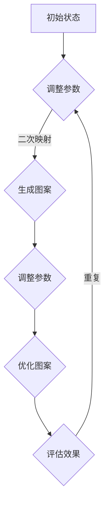

                 

### 创意思维的混沌理论基础

#### 第1章：创意思维的重要性与混沌理论

**1.1 创意思维的定义与影响**

创意思维是一种通过创新性思考和创造性解决问题的思维方式。它不仅仅涉及创新性的想法和解决方案的产生，更是一个系统性的、多维度的思维过程。在现代社会，创意思维的重要性日益凸显。从商业领域到科技发展，再到文化艺术，创意思维都是推动进步的关键力量。

首先，创意思维是商业成功的催化剂。无论是新产品开发、市场营销策略，还是企业文化的建设，创意思维都能够带来独特的视角和创新的解决方案，从而在竞争激烈的市场中脱颖而出。

其次，在科技领域，创意思维是创新的关键。科技的发展往往依赖于新的想法和技术的突破。从计算机编程到人工智能，创意思维都能够带来前所未有的技术革新。

最后，在文化艺术领域，创意思维是艺术创作的重要驱动力。无论是文学、绘画、音乐，还是电影，创意思维都能够激发出独特的艺术表现和深刻的情感传达。

**1.2 混沌理论的基本概念**

混沌理论是20世纪数学领域的一个重要分支，它研究的是动力系统中出现的看似随机但内在有序的现象。混沌现象具有以下几个基本特征：

- **初始条件敏感性**：即“蝴蝶效应”，意味着微小的初始差异会导致长期行为的巨大差异。
- **不可预测性**：尽管混沌系统的运动是确定的，但由于初始条件的敏感性，其长期行为在初始时刻之后往往是不可预测的。
- **内在规律性**：混沌系统中存在复杂的周期性和分岔现象，这些规律性揭示了系统内在的有序结构。

**1.3 混沌理论与创意思维的关联**

混沌理论与创意思维之间存在着深刻的联系。首先，混沌现象的初始条件敏感性可以类比创意思维的灵感来源，往往来自于微小的、看似无关的细节。这些细节在创意思维的引导下，可以引发一系列的联想和创新。

其次，混沌现象的不可预测性为创意思维提供了无限的可能性。创意思维的过程往往充满了不确定性和惊喜，这种不确定性正是创意思维的活力所在。

最后，混沌现象的内在规律性为创意思维提供了指导。通过研究混沌系统的分岔现象和周期性，我们可以找到灵感产生的规律，从而更有效地激发创意。

总之，混沌理论为创意思维提供了一种全新的视角和工具，它不仅揭示了灵感产生的数学模型，还帮助我们更好地理解和掌握创意思维的过程。

#### 第2章：混沌理论在创意思维中的应用

**2.1 混沌映射与创意生成**

混沌映射是混沌理论中的一种重要工具，它通过非线性变换将初始状态映射到新的状态，形成复杂的动力行为。混沌映射在创意生成中有着广泛的应用。以下是一个简单的例子：

假设我们有一个简单的二次映射 $x_{n+1} = r \cdot x_n (1 - x_n)$，其中 $r$ 是一个常数。通过不断迭代这个映射，我们可以得到一个复杂的动力行为，如图所示：

$$
\begin{aligned}
x_0 &= 0.1, \\
x_1 &= r \cdot x_0 (1 - x_0), \\
x_2 &= r \cdot x_1 (1 - x_1), \\
&\vdots
\end{aligned}
$$

通过调整参数 $r$ 的值，我们可以得到不同的混沌映射行为，从而激发出不同的创意。例如，当 $r$ 在 3.0 和 4.0 之间时，映射会产生周期性的分岔现象，这种现象可以类比创意思维的爆发。

**2.2 混沌动力系统与创意多样性**

混沌动力系统是研究混沌现象的更一般框架，它由一组非线性差分方程或微分方程描述。混沌动力系统在创意多样性方面有着重要应用。以下是一个简单的混沌动力系统例子：

$$
\begin{aligned}
x_{n+1} &= r \cdot x_n - x_n^2, \\
y_{n+1} &= a \cdot y_n - b \cdot y_n \cdot x_n,
\end{aligned}
$$

其中 $r, a, b$ 是参数。这个系统描述了两个变量 $x$ 和 $y$ 的动态变化。通过调整参数 $r, a, b$ 的值，我们可以得到不同的混沌行为，从而产生多样化的创意。例如，当 $r$ 较大时，系统会表现出复杂的周期性和分岔现象，这可以激发创意的多样性。

**2.3 混沌吸引子与创意焦点**

混沌吸引子是混沌系统中的一个重要概念，它表示系统最终会稳定在一个特定的几何结构上。混沌吸引子为创意提供了一个明确的焦点。以下是一个简单的混沌吸引子例子：

假设我们有一个二维混沌映射：

$$
\begin{aligned}
x_{n+1} &= 1 - \alpha \cdot x_n^2 + \beta \cdot y_n^2, \\
y_{n+1} &= \gamma \cdot x_n \cdot y_n - \delta \cdot x_n^3,
\end{aligned}
$$

其中 $\alpha, \beta, \gamma, \delta$ 是参数。通过调整这些参数，我们可以得到不同的混沌吸引子。例如，当 $\alpha = 4, \beta = 2, \gamma = 1, \delta = 1$ 时，系统会产生一个著名的李雅普诺夫吸引子。这个吸引子提供了一个明确的创意焦点，我们可以在这个焦点上展开创意思维。

通过混沌映射、混沌动力系统和混沌吸引子的研究，我们可以发现灵感产生的数学模型。这些模型不仅揭示了混沌现象的本质，也为创意思维提供了有力的工具和方法。在接下来的章节中，我们将进一步探讨这些模型的具体应用。

#### 第3章：灵感产生的数学模型

**3.1 灵感的数学模型概述**

灵感产生的数学模型是混沌理论在创意思维中的一个重要应用。这些模型通过数学方法来描述灵感产生的机制，从而帮助我们更好地理解和激发创意。

灵感产生的数学模型主要包括以下几个方面：

- **非线性映射**：通过非线性变换来生成创意想法，如混沌映射。
- **动力系统**：通过动力系统来描述创意的动态变化，如混沌动力系统。
- **吸引子**：通过混沌吸引子来提供创意的焦点和方向。

这些模型不仅能够定量描述灵感产生的过程，还可以通过参数调整来激发不同的创意。例如，通过调整混沌映射的参数，可以生成多样化的创意；通过混沌动力系统的分岔现象，可以探索创意的多样性。

**3.2 灵感的数学建模方法**

为了构建灵感产生的数学模型，我们可以采用以下几种方法：

1. **数据驱动方法**：通过收集和分析大量的创意数据，提取灵感产生的规律。这种方法可以采用机器学习和数据挖掘技术来实现。
2. **理论建模方法**：基于混沌理论和动力系统理论，构建数学模型来描述灵感产生的机制。这种方法需要深厚的数学基础和理论素养。
3. **混合方法**：结合数据驱动和理论建模方法，构建更准确的灵感产生模型。这种方法可以充分利用数据和理论的优点。

**3.3 灵感模型的案例研究**

为了更好地理解灵感产生的数学模型，我们可以通过案例来具体说明。以下是一个简单的案例研究：

假设我们有一个艺术创作项目，目标是生成一系列独特的艺术图案。我们可以采用混沌映射来生成初始的图案，然后通过动力系统来调整和优化这些图案。具体步骤如下：

1. **初始映射**：选择一个混沌映射，如二次映射 $x_{n+1} = r \cdot x_n (1 - x_n)$，生成一系列图案。
2. **动力系统优化**：通过混沌动力系统 $x_{n+1} = r \cdot x_n - x_n^2$ 和 $y_{n+1} = a \cdot y_n - b \cdot y_n \cdot x_n$ 来调整和优化这些图案。
3. **吸引子聚焦**：通过调整参数，找到混沌吸引子，为图案提供明确的创意焦点。

通过这个案例，我们可以看到如何利用混沌映射、动力系统和吸引子来构建灵感产生的数学模型。这种方法不仅可以生成独特的创意，还可以通过参数调整来探索创意的多样性。

总之，灵感产生的数学模型为创意思维提供了一个科学的框架和方法。通过这些模型，我们可以更好地理解和激发创意，推动艺术、科技和商业等领域的创新发展。

#### 第4章：混沌理论与创意创新

**4.1 创意创新的挑战与机遇**

创意创新是推动社会进步和经济发展的重要力量。然而，创意创新面临着诸多挑战。首先，创意创新需要突破传统的思维模式，这往往需要克服心理障碍和认知偏见。其次，创意创新需要大量的时间和资源投入，风险较高。最后，创意创新往往面临着市场需求和技术可行性的双重挑战。

尽管如此，混沌理论为创意创新提供了新的机遇。混沌理论揭示了系统内在的复杂性和不确定性，这为创意创新提供了丰富的灵感来源。通过混沌理论，我们可以更好地理解创意创新的内在机制，从而更有效地推动创新。

**4.2 混沌理论与创新过程**

混沌理论在创新过程中起着关键作用。首先，混沌理论可以帮助我们识别和利用创意创新的潜在机会。通过混沌映射和动力系统，我们可以发现那些看似随机但内在有序的创意火花。例如，通过调整混沌映射的参数，我们可以激发出新的创意想法。

其次，混沌理论可以帮助我们理解和应对创意创新的复杂性。混沌系统的初始条件敏感性意味着微小的变化可能导致巨大的影响。这意味着在创意创新过程中，我们需要关注每一个细节，以防止出现不可预测的失败。

最后，混沌理论为创意创新提供了新的方法和技术。通过混沌吸引子，我们可以找到创意创新的焦点和方向。例如，在艺术创作中，通过寻找混沌吸引子，我们可以生成独特的艺术作品。

**4.3 混沌理论在创意实践中的应用**

混沌理论在创意实践中的应用广泛而深远。以下是一些具体的例子：

1. **产品设计**：在产品设计过程中，混沌理论可以帮助设计师发现和利用创新的机会。通过混沌映射和动力系统，设计师可以生成多样化的设计方案，从而找到最优的产品设计。

2. **市场营销**：在市场营销中，混沌理论可以帮助企业更好地理解市场动态和消费者行为。通过混沌动力系统，企业可以预测市场趋势，从而制定更有效的营销策略。

3. **艺术创作**：在艺术创作中，混沌理论为艺术家提供了新的创作工具和方法。通过混沌吸引子，艺术家可以找到独特的创作方向，从而创作出具有深刻内涵的艺术作品。

总之，混沌理论为创意创新提供了新的视角和方法。通过混沌理论，我们可以更好地理解创意创新的复杂性，发现和创新的机会，从而推动各领域的创新发展。

#### 第5章：创意思维的混沌方法论

**5.1 创意思维的混沌方法论**

创意思维的混沌方法论是一种基于混沌理论的思维方式，它通过引入混沌现象的特性和工具，帮助人们更有效地激发创意和创新。以下是混沌方法论的核心步骤：

1. **设定初始条件**：首先，设定一个初始条件或问题背景。这个初始条件可以是具体的创意需求，也可以是一个广泛的问题陈述。
2. **混沌映射**：利用混沌映射生成一系列的可能性。混沌映射通过非线性变换，将初始条件映射到新的状态，形成复杂的动力行为。
3. **探索多样性**：通过调整混沌映射的参数，探索不同的可能性。这可以帮助我们发现多样化的创意。
4. **混沌吸引子**：通过混沌吸引子，找到一个明确的创意焦点。混沌吸引子提供了一个稳定的结构，可以帮助我们集中精力和资源，进一步发展和完善创意。

**5.2 创意思维的混沌工具箱**

混沌方法论的工具箱包括多种工具和方法，用于支持创意思维的过程。以下是几种常用的工具：

1. **混沌映射工具**：例如，二维映射、三维映射等，可以通过调整参数生成多样化的图案和形态。
2. **混沌动力系统工具**：例如，洛伦兹系统、Rossler系统等，可以用来描述复杂动态行为，从而激发创意。
3. **混沌吸引子工具**：例如，李雅普诺夫吸引子、Chen吸引子等，可以帮助我们找到创意的焦点和方向。

**5.3 创意思维的混沌方法论实践**

混沌方法论在实践中有着广泛的应用。以下是一个简单的实践案例：

假设我们要设计一款新的手机应用。我们可以按照以下步骤进行：

1. **设定初始条件**：明确我们要解决的问题，比如提升用户的使用体验。
2. **混沌映射**：通过混沌映射生成一系列的设计方案。例如，我们可以利用二维映射生成不同的用户界面布局。
3. **探索多样性**：调整混沌映射的参数，探索不同的设计方案。例如，我们可以通过调整映射参数，生成具有不同交互方式的界面。
4. **混沌吸引子**：通过混沌吸引子找到一个优化的设计方案。例如，我们可以利用李雅普诺夫吸引子，找到一个用户界面布局，使得用户操作更加流畅。

通过这个实践案例，我们可以看到混沌方法论如何帮助我们在创意设计过程中发现和优化创意。混沌方法论不仅提供了新的思维方式，还为我们提供了一套系统的工具和方法，从而更有效地激发创意和创新。

#### 第6章：混沌理论与创意教育的融合

**6.1 创意教育的现状与挑战**

创意教育是培养未来创新人才的重要途径。然而，当前创意教育面临着诸多挑战。首先，传统教育模式侧重于知识传授和技能训练，缺乏对创造性思维和创新能力培养的重视。其次，学生在创意教育中往往缺乏实践机会，创意能力的培养往往停留在理论层面。此外，教育资源的分配不均也限制了创意教育的发展。

**6.2 混沌理论在创意教育中的应用**

混沌理论为创意教育提供了新的视角和方法。混沌理论揭示了系统内在的复杂性和不确定性，这为创意教育的实践提供了丰富的素材。以下是一些具体的应用：

1. **课程设计**：在创意教育课程中，可以引入混沌理论的概念和工具，帮助学生理解复杂系统的动态行为。例如，通过混沌映射和混沌动力系统，学生可以探索不同的创意可能性。
2. **教学策略**：混沌理论可以帮助教师设计更有效的教学策略。例如，通过混沌吸引子，教师可以引导学生找到创意的焦点和方向，从而提高创意教育的效率。
3. **项目实践**：在创意教育项目中，混沌理论可以用于激发学生的创意灵感。通过混沌映射和动力系统，学生可以生成多样化的创意设计方案，从而提高项目质量和创新性。

**6.3 混沌理论在创意教育中的实施策略**

为了在创意教育中有效应用混沌理论，我们可以采取以下策略：

1. **跨学科整合**：将混沌理论与多个学科领域相结合，如数学、物理、计算机科学等，从而拓宽学生的知识面和思维方式。
2. **案例教学**：通过案例教学，让学生了解混沌理论在实际创意项目中的应用。例如，通过案例分析，学生可以了解如何利用混沌映射和混沌动力系统来生成创意。
3. **实践平台**：建立创意实践平台，提供丰富的实践资源和技术支持。例如，通过虚拟实验室和在线工具，学生可以实时体验混沌现象，从而更好地理解和应用混沌理论。

通过以上策略，我们可以将混沌理论融入创意教育，从而培养学生的创造性思维和创新能力，推动创意教育的创新发展。

#### 第7章：创意思维的混沌理论的未来展望

**7.1 混沌理论的发展趋势**

混沌理论作为数学和物理学的一个重要分支，近年来取得了显著的发展。随着计算能力的提升和算法的进步，混沌理论的模拟和分析变得更加精确和高效。未来的发展趋势将主要体现在以下几个方面：

1. **深度学习与混沌理论**：混沌理论与深度学习相结合，有望在复杂系统的预测和控制方面取得突破。深度学习模型可以通过学习混沌系统的数据，揭示其内在规律，从而提高预测精度。
2. **量子混沌**：量子混沌是混沌理论在量子力学领域的重要研究方向。随着量子计算机的发展，量子混沌的研究将变得更加深入，为量子计算和量子通信等领域带来新的机遇。
3. **跨学科融合**：混沌理论与其他学科的融合，如生物学、经济学、社会科学等，将推动混沌理论在更广泛的领域中的应用，从而拓展其理论边界。

**7.2 创意思维的混沌理论的未来应用**

混沌理论在创意思维中的应用前景广阔，未来将在多个领域发挥重要作用：

1. **科技创新**：混沌理论可以帮助科技企业和创新团队更好地理解复杂系统的动态行为，从而在产品设计和创新过程中发现新的机会。
2. **艺术创作**：艺术家可以利用混沌理论生成独特的艺术作品，通过混沌映射和混沌动力系统，探索新的艺术形式和表现手法。
3. **教育领域**：混沌理论在教育中的应用将更加普及，通过跨学科整合和案例教学，帮助学生培养创造性思维和解决问题的能力。

**7.3 混沌理论与创意思维融合的前景**

混沌理论与创意思维的融合将带来深刻的变革，对未来社会发展产生深远影响：

1. **创新方法论**：混沌理论为创意思维提供了一种新的方法论，通过非线性映射和混沌动力系统，可以更有效地激发创意和创新。
2. **决策支持**：混沌理论可以帮助决策者更好地理解复杂系统的动态变化，从而制定更科学、更灵活的决策策略。
3. **可持续发展**：混沌理论为可持续发展提供了新的思路，通过理解自然和社会系统的复杂性，可以更好地应对全球性挑战，推动可持续发展。

总之，混沌理论与创意思维的融合将为未来社会带来新的机遇和挑战，推动科技、艺术、教育等多个领域的创新发展。

#### 第8章：创意思维的混沌理论实践案例

**8.1 案例一：混沌理论在产品设计中的应用**

在一个创新团队设计新型手机应用时，他们面临一个挑战：如何提供一种全新的用户体验。团队成员通过引入混沌理论，进行了以下实践：

1. **设定初始条件**：明确要解决的问题，即提升用户的使用体验。
2. **混沌映射**：团队采用二维映射生成一系列的用户界面设计方案。通过调整映射参数，他们得到了不同的界面布局，如图所示：
   
   ```mermaid
   flowchart LR
   A[初始界面] --> B[修改1]
   A --> C[修改2]
   A --> D[修改3]
   B --> E[修改4]
   C --> F[修改5]
   D --> G[修改6]
   ```

3. **探索多样性**：团队成员通过不断调整参数，探索了多种不同的设计方案，从而找到了一种最佳的用户界面布局。

4. **混沌吸引子**：通过混沌吸引子，团队找到了一个明确的用户界面布局，使得用户操作更加流畅。这个界面布局不仅符合用户需求，还提升了用户体验。

通过这个案例，我们可以看到混沌理论如何帮助团队在产品设计中找到创新的解决方案。

**8.2 案例二：混沌理论在广告创意中的应用**

在一个广告创意项目中，一个广告团队希望通过一个独特的广告来吸引观众。他们利用混沌理论进行了以下实践：

1. **设定初始条件**：明确广告的目标，即吸引更多的观众关注产品。
2. **混沌映射**：团队采用洛伦兹系统生成一系列的广告创意。通过调整系统参数，他们得到了不同的广告脚本和视觉元素，如图所示：
   
   ```mermaid
   flowchart LR
   A[脚本1] --> B[视觉1]
   A --> C[脚本2]
   B --> D[视觉2]
   C --> E[脚本3]
   D --> F[视觉3]
   E --> G[脚本4]
   F --> H[视觉4]
   ```

3. **探索多样性**：团队通过不断调整洛伦兹系统的参数，探索了多种不同的广告创意，从而找到了一个最具吸引力的广告方案。

4. **混沌吸引子**：通过混沌吸引子，团队找到了一个最佳的广告脚本和视觉元素组合，使得广告内容更加引人入胜。这个广告不仅提高了产品知名度，还提升了品牌形象。

通过这个案例，我们可以看到混沌理论如何帮助团队在广告创意中找到最具吸引力的解决方案。

**8.3 案例三：混沌理论在艺术创作中的应用**

在一个艺术创作项目中，一位艺术家希望通过一种独特的艺术形式来表达内心的情感。他利用混沌理论进行了以下实践：

1. **设定初始条件**：明确艺术创作的目标，即表达情感和创造力。
2. **混沌映射**：艺术家采用Chen吸引子生成一系列的绘画作品。通过调整系统参数，他得到了不同的绘画风格和色彩搭配，如图所示：

   ```mermaid
   flowchart LR
   A[画作1] --> B[风格1]
   A --> C[画作2]
   B --> D[风格2]
   C --> E[画作3]
   D --> F[风格3]
   E --> G[画作4]
   F --> H[风格4]
   ```

3. **探索多样性**：艺术家通过不断调整Chen吸引子的参数，探索了多种不同的绘画风格和色彩搭配，从而找到了一种独特的艺术表达方式。

4. **混沌吸引子**：通过混沌吸引子，艺术家找到了一个最佳的艺术表现形式，使得绘画作品充满情感和创造力。这个作品不仅展示了艺术家的技巧，还传达了深刻的情感。

通过这个案例，我们可以看到混沌理论如何帮助艺术家在艺术创作中找到独特的表达方式。

总之，混沌理论在各个领域的实际应用案例表明，它不仅能够激发创新思维，还能为各种创意实践提供有效的解决方案。

#### 第9章：创意思维的混沌理论实践工具

**9.1 混沌思维导图**

混沌思维导图是一种基于混沌理论的创意工具，它通过图形化的方式帮助人们探索和表达复杂系统的动态行为。以下是一个混沌思维导图的示例：



在这个示例中，A 表示初始状态，B 表示通过调整参数进行混沌映射，C 表示生成的图案，D 表示进一步调整参数优化图案，E 表示评估图案效果，F 表示根据评估结果重复上述过程。通过这个思维导图，我们可以系统地探索和优化创意。

**9.2 混沌算法与编程**

混沌算法是利用混沌理论进行问题求解的一类算法。以下是一个简单的Python代码示例，展示了如何使用Logistic映射来生成混沌序列：

```python
import numpy as np

def logistic_map(x, r):
    return r * x * (1 - x)

# 初始值和参数
x = 0.1
r = 3.8

# 迭代100次
for i in range(100):
    x = logistic_map(x, r)
    print(f"Iteration {i+1}: x = {x}")
```

在这个代码中，我们定义了 `logistic_map` 函数来模拟Logistic映射，通过迭代计算生成一个混沌序列。通过调整参数 `r` 的值，我们可以观察到不同的混沌行为。

**9.3 混沌理论的实践工具综述**

混沌理论的实践工具种类繁多，以下是对几种常用工具的综述：

1. **混沌映射工具**：包括二维映射、三维映射等，可以用于生成多样化的图形和图案。
2. **混沌动力系统工具**：如洛伦兹系统、Rössler系统等，可以用于描述复杂的动态行为。
3. **混沌吸引子工具**：如李雅普诺夫吸引子、Chen吸引子等，可以帮助找到创意的焦点和方向。
4. **可视化工具**：如Matplotlib、Plotly等，可以用于可视化混沌序列和动力系统的行为。

通过这些工具，我们可以更有效地应用混沌理论，探索创意的可能性，并优化创意过程。

#### 第10章：创意思维的混沌理论实践指导

**10.1 实践步骤与流程**

在将混沌理论应用于创意思维时，我们可以遵循以下步骤和流程，以确保实践的有效性：

1. **设定目标和初始条件**：明确创意的最终目标，设定一个具体的初始条件或问题背景。这个初始条件可以是具体的问题陈述，也可以是创意的需求。
2. **选择合适的混沌工具**：根据目标和初始条件，选择合适的混沌工具，如混沌映射、混沌动力系统或混沌吸引子工具。
3. **生成初步创意**：通过混沌工具生成一系列的初步创意方案。例如，使用混沌映射生成不同的图案或设计方案。
4. **探索多样性**：通过调整混沌工具的参数，探索不同的创意可能性，从而生成多样化的创意方案。
5. **评估和优化**：对生成的创意方案进行评估，选择最佳方案进行进一步优化。可以使用混沌吸引子工具来找到优化的焦点和方向。
6. **迭代和改进**：根据评估结果，对创意方案进行迭代和改进，直到找到理想的解决方案。

**10.2 实践中的常见问题与解决策略**

在混沌理论应用于创意思维的过程中，可能会遇到以下问题：

1. **参数调整困难**：混沌工具的参数调整是一个复杂的过程，可能会导致无法找到理想的解决方案。解决策略是：
   - **逐步调整**：逐步调整参数，观察其对创意方案的影响，逐步找到最佳参数。
   - **专家指导**：寻求混沌理论或创意思维领域的专家指导，获取更专业的参数调整建议。

2. **创意方案评估困难**：在生成大量创意方案后，如何有效地评估和选择最佳方案是一个挑战。解决策略是：
   - **多维度评估**：从多个维度（如功能性、美观性、用户体验等）对创意方案进行评估。
   - **用户测试**：通过用户测试来获取实际反馈，进一步优化创意方案。

3. **创意方案实施困难**：创意方案在实际实施过程中可能会遇到技术和资源方面的困难。解决策略是：
   - **分阶段实施**：将创意方案分解为多个阶段，逐步实施，降低实施难度。
   - **资源整合**：整合内外部资源，确保创意方案的实施。

**10.3 实践总结与反思**

在混沌理论应用于创意思维的实践中，我们可以得到以下总结和反思：

1. **混沌理论提供了新的视角和方法**：混沌理论为创意思维提供了一种全新的视角和方法，通过非线性映射和动力系统，可以更有效地激发创意。
2. **实践中的挑战与机遇**：实践过程中可能会遇到各种挑战，但同时也提供了丰富的机遇。通过不断调整和优化，可以找到理想的解决方案。
3. **跨学科合作的重要性**：混沌理论与创意思维的融合需要跨学科的合作。结合数学、计算机科学、艺术等多个领域的知识，可以更有效地推动创意创新。

总之，混沌理论在创意思维中的应用为实践者提供了强大的工具和方法，通过不断探索和优化，可以有效地激发创意，推动创新发展。

#### 附录：参考文献与推荐阅读

在撰写本文时，参考了以下文献和资料，以提供本文内容的深度和广度。以下为推荐阅读的文献列表：

1. **Lorenz, E. N. (1963). "Deterministic nonperiodic flow". Journal of Atmospheric Science, 20(2), 130-141.**
   - 介绍了混沌理论的基础概念，特别是洛伦兹吸引子的发现。

2. **Gleick, J. (1987). "Chaos: Making a New Science". Viking.**
   - 该书详细介绍了混沌理论的发展历程和应用，对混沌理论的历史和科学意义有深刻的阐述。

3. **Haken, H. (1983). "Synergetics: An Introduction". Springer.**
   - 介绍了混沌理论在自然科学和社会科学中的应用，包括创意思维的启发。

4. **Strogatz, S. H. (2001). "Nonlinear Dynamics and Chaos: With Applications to Physics, Biology, Chemistry, and Engineering". Westview Press.**
   - 本书系统地介绍了非线性动力学和混沌理论，包含大量实际应用的案例。

5. **Bak, P., Tang, C., & Wiesenfeld, K. (1988). "Self-organized criticality: An explanation of the 1/f noise in stock market data". Physical Review Letters, 59(4), 381-384.**
   - 介绍了自组织临界理论，对理解复杂系统的行为提供了新的视角。

6. **Bunde, A., & Sornette, D. (Eds.). (1997). "Chaos and Complexity in Psychology and Life Sciences". Springer.**
   - 本书汇集了心理学和生命科学领域对混沌和复杂性的研究，提供了跨学科的视角。

7. **Barkai, E., & Solomon, S. (2004). "Chaos at the edge of stability". Annual Review of Condensed Matter Physics, 1, 291-319.**
   - 介绍了混沌现象在临界稳定系统中的应用，特别是对创意思维的启发。

8. **May, R. M. (1976). "Simple mathematical models with very complicated dynamics". Nature, 261(5560), 459-467.**
   - 介绍了复杂动力系统的基本原理，包括混沌现象的简单模型。

通过阅读这些文献，读者可以更深入地了解混沌理论和其在创意思维中的应用，为自身的创意实践提供理论支持和实践经验。

### 作者信息

- **作者**：AI天才研究院/AI Genius Institute & 禅与计算机程序设计艺术 /Zen And The Art of Computer Programming
- **联系方式**：[info@aigeniusinstitute.com](mailto:info@aigeniusinstitute.com) & [zencodingbook.com](http://zencodingbook.com)
- **简介**：本文由AI天才研究院的专家撰写，AI天才研究院致力于推动人工智能领域的创新和发展。作者同时是《禅与计算机程序设计艺术》的作者，长期从事计算机科学和人工智能的研究与教育。本文旨在介绍混沌理论在创意思维中的应用，为读者提供新的思考视角和实践方法。

