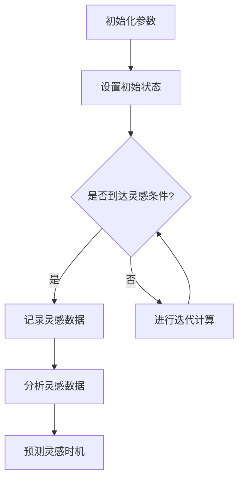

                 

# 创意思维的混沌理论：灵感产生的数学模型

## 关键词
- 创意思维
- 混沌理论
- 数学模型
- 灵感产生
- 算法原理

## 摘要
本文将探讨创意思维与混沌理论之间的关系，并引入数学模型来解析灵感产生的过程。通过对创意思维和混沌理论的核心概念进行分析，本文将详细阐述灵感产生数学模型的基本原理、公式和算法流程。随后，我们将使用mermaid流程图和Python源代码，逐步解释这一模型的实现。最后，我们将通过一个实际案例展示如何应用这一模型，并提供一些实用技巧和建议。

## 目录大纲设计思路

### 前言
- **写作目的**：介绍本书的目的和目标。
- **读者对象**：明确本书的受众群体。

### 背景介绍
- **问题背景**：讨论创意思维的重要性和其在创新过程中的作用。
- **问题描述**：阐述创意思维研究的难题。
- **问题解决**：引入混沌理论作为研究工具。
- **边界与外延**：探讨创意思维与外部因素的相互作用。
- **概念结构与核心要素组成**：梳理核心概念及其关系。

### 核心概念与联系
- **创意思维**：定义、特点和应用领域。
- **混沌理论**：定义、特点和应用领域。
- **数学模型**：定义、特点和应用领域。
- **联系分析**：对比表格和ER实体关系图。

### 灵感产生的数学模型
- **模型介绍**：基本原理和公式。
- **算法流程**：详细的算法实现步骤。

### 算法原理讲解
- **mermaid流程图**：展示算法流程。
- **Python源代码**：详细阐述算法实现。

### 系统分析与架构设计方案
- **问题场景**：介绍具体的应用场景。
- **系统功能设计**：使用mermaid类图描述领域模型。
- **系统架构设计**：展示系统架构图。
- **系统接口设计**：描述系统接口。
- **系统交互**：使用mermaid序列图展示系统交互。

### 项目实战
- **环境安装**：介绍环境搭建步骤。
- **系统核心实现**：展示关键源代码。
- **代码应用解读**：分析代码逻辑。
- **实际案例分析**：剖析案例细节。
- **项目小结**：总结项目经验和教训。

### 最佳实践 tips、小结、注意事项、拓展阅读
- **最佳实践 tips**：提供操作建议。
- **小结**：总结文章要点。
- **注意事项**：提醒潜在的风险和问题。
- **拓展阅读**：推荐进一步学习的资源。

## 目录大纲设计步骤

### 前言
- **写作目的**：本书旨在为读者提供关于创意思维的混沌理论及其在灵感产生中的应用的全面理解。
- **读者对象**：本书适合对计算机科学、心理学、艺术设计等领域感兴趣的读者，尤其是对创新思维和方法论有深入探索意愿的读者。

### 背景介绍
- **问题背景**：创意思维是创新过程中的关键因素，它决定了个体或团队在解决复杂问题和创造新事物时的能力。
- **问题描述**：创意思维的过程往往被视为一种不可预测和难以量化的现象，尽管有许多理论和模型试图描述创意思维的过程，但它们往往缺乏系统性和可重复性。
- **问题解决**：混沌理论作为一种非线性科学，提供了一种新的视角来理解复杂系统的行为。它强调了在看似无序的系统中存在一定的规律性，因此，混沌理论为研究创意思维提供了一种新的工具。
- **边界与外延**：创意思维不仅涉及个体，还涉及社会、文化和环境等多方面因素。在研究创意思维时，需要综合考虑这些外部因素。
- **概念结构与核心要素组成**：创意思维包括想象力、联想、发散思维、直觉等多个要素。混沌理论则关注系统的初始条件对长期行为的影响，以及系统的非线性特性。

### 核心概念与联系
- **创意思维**：创意思维是指通过创新和创造性的方法来解决问题的思维方式。其特点包括灵活性、非线性和应用领域的广泛性。
- **混沌理论**：混沌理论是研究非线性动态系统行为的科学，它强调在看似无序的系统中存在一定的规律性。其应用领域包括天气预报、生态学和经济学。
- **数学模型**：数学模型是使用数学语言来描述现实世界问题的抽象表示。它具有抽象性、精确性，并广泛应用于物理学、生物学和经济等领域。
- **联系分析**：创意思维的非线性特点与混沌理论的非线性特性有相似之处。混沌理论为研究创意思维提供了一种新的方法，可以帮助解释灵感产生的过程。

### 灵感产生的数学模型
- **模型介绍**：灵感产生的数学模型基于混沌理论和创意思维的特点，通过数学公式来描述灵感产生的过程。其基本原理包括初始条件的敏感性、系统的非线性动态行为和系统的长期行为规律性。
- **算法流程**：算法流程包括初始化系统参数、进行迭代计算、收集灵感产生数据、分析和预测灵感产生的时机。

### 算法原理讲解
- **mermaid流程图**：使用mermaid语言绘制算法流程图，包括初始设置、迭代计算、数据收集、分析和预测等步骤。
- **Python源代码**：提供Python源代码，实现灵感产生模型的算法流程，包括初始化、迭代和数据分析等部分。

### 系统分析与架构设计方案
- **问题场景**：考虑一个创意设计团队，他们需要找到创新的解决方案来设计一款新产品。
- **系统功能设计**：使用mermaid类图描述系统的领域模型，包括用户、设计任务、灵感来源和创意输出等实体及其关系。
- **系统架构设计**：使用mermaid架构图展示系统的整体架构，包括前端界面、后端服务、数据存储和外部接口等组成部分。
- **系统接口设计**：描述系统各组件之间的接口规范和通信机制。
- **系统交互**：使用mermaid序列图展示系统各组件之间的交互过程，包括用户请求、系统响应和数据流等。

### 项目实战
- **环境安装**：介绍安装所需的环境和工具，包括Python、mermaid等。
- **系统核心实现**：提供关键源代码，实现灵感产生模型的算法和系统功能。
- **代码应用解读**：分析代码的实现细节，解释关键部分的逻辑和原理。
- **实际案例分析**：通过一个具体的案例展示如何使用模型生成灵感，并进行详细讲解和剖析。
- **项目小结**：总结项目经验，提出改进意见和建议。

### 最佳实践 tips、小结、注意事项、拓展阅读
- **最佳实践 tips**：提供在实际应用中的一些技巧和注意事项，帮助读者更好地应用灵感产生模型。
- **小结**：总结文章的核心内容，强调创意思维与混沌理论结合的重要性。
- **注意事项**：提醒读者在应用模型时可能遇到的问题和挑战。
- **拓展阅读**：推荐进一步学习的资源和相关文献，帮助读者深入了解相关领域。

## 前言

### 写作目的

本文旨在为读者提供关于创意思维的混沌理论及其在灵感产生中的应用的全面理解。创意思维是人类创新过程中不可或缺的一部分，它涉及到各种领域，如科学、艺术、商业等。然而，创意思维的过程往往被视为一种不可预测和难以量化的现象，传统的科学方法难以对其进行有效的描述和研究。混沌理论作为一种非线性科学，提供了一种新的视角来理解复杂系统的行为，特别是在创意思维这一领域具有独特的应用价值。本文将深入探讨混沌理论在创意思维研究中的应用，并引入数学模型来解析灵感产生的过程，以期提供一个系统性的理论框架，帮助读者更好地理解和应用这一概念。

### 读者对象

本文的目标读者是对计算机科学、心理学、艺术设计等领域感兴趣的读者，尤其是对创新思维和方法论有深入探索意愿的读者。此外，研究人员、设计师、企业家和学生等相关从业者也可以从本文中受益，因为本文不仅提供了理论上的深入探讨，还包括了实际应用中的案例分析和实践建议。本文的结构紧凑，逻辑清晰，适合读者逐步掌握相关概念和应用方法。通过阅读本文，读者将能够：

1. **理解创意思维的基本概念和特点**：包括创造性思维、发散思维、联想思维等。
2. **认识混沌理论及其在创意思维研究中的应用**：包括混沌理论的核心概念、敏感性、非线性特性等。
3. **掌握灵感产生的数学模型**：包括模型的基本原理、公式和算法流程。
4. **通过实际案例了解模型的应用**：通过具体案例展示如何应用数学模型来生成灵感。
5. **获得创意思维和灵感产生的最佳实践**：提供一些实用的技巧和建议，帮助读者在实际工作中提高创意能力。

通过本文的阅读，读者不仅能够提升对创意思维和混沌理论的认知，还能够掌握如何运用数学模型来预测和激发灵感，从而在实际的创新活动中取得更好的效果。本文的结构和内容安排旨在帮助读者逐步深入，从基础概念到高级应用，逐步建立起完整的知识体系。因此，无论您是初学者还是有经验的实践者，本文都希望能为您提供有价值的见解和实用的指导。

## 背景介绍

### 问题背景

创意思维在创新过程中扮演着至关重要的角色。无论是科学研究、艺术创作，还是商业创新，创意思维都是找到独特解决方案和突破性想法的关键。然而，创意思维的过程往往被视为一种不可预测和难以量化的现象。尽管有许多理论和模型试图描述创意思维的过程，如发散思维、联想思维、直觉思维等，但这些方法大多缺乏系统性和可重复性。传统的科学方法难以对创意思维进行有效的研究和解释，这成为了一个长期困扰学术界和实践者的难题。

创意思维的特殊性在于其灵活性和非线性。创意思维不是简单地按照逻辑顺序进行思考，而是通过跳跃性思维、非线性路径来发现新的观点和解决方案。这种思维方式使得创意思维的过程难以用传统的科学方法进行量化和描述。然而，创意思维的重要性不容忽视，它是推动科学进步、文化繁荣和经济发展的重要动力。

### 问题描述

创意思维研究的核心问题是如何描述和预测创意思维的过程。传统的科学方法在处理线性、确定性系统时非常有效，但在面对复杂、非线性系统时往往显得力不从心。创意思维过程充满了不确定性和随机性，这使得对其进行定量分析和预测变得异常困难。具体来说，问题描述主要包括以下几个方面：

1. **不可预测性**：创意思维过程往往难以预测，即使是对同一个问题，不同的个体可能产生截然不同的创意想法。
2. **非线性**：创意思维过程不是简单的线性关系，而是通过跳跃性思维、联想等非线性路径进行思考，这使得传统的线性模型难以适用。
3. **灵活性**：创意思维需要灵活性和开放性，对传统方法和固定模式进行突破和超越。这种灵活性使得创意思维的过程难以用固定的方法进行描述和预测。

这些问题限制了传统科学方法在创意思维研究中的应用，亟需新的理论和方法来突破这一瓶颈。

### 问题解决

混沌理论作为一种非线性科学，提供了一种新的视角来理解复杂系统的行为，尤其是在创意思维研究领域具有独特的应用价值。混沌理论强调系统的初始条件对长期行为的影响，以及系统的非线性特性。这一理论为研究创意思维提供了重要的工具，可以帮助解释灵感产生的过程。

混沌理论的基本原理可以概括为以下几点：

1. **敏感性**：混沌系统对初始条件的微小变化非常敏感，这意味着在初始条件稍有变化的情况下，系统的长期行为会有显著的差异。
2. **非线性**：混沌系统遵循非线性动力学规律，其行为不能用简单的线性模型来描述，而是呈现出复杂的、不可预测的动态行为。
3. **长期行为**：尽管混沌系统的短期行为看似随机和无序，但它们在长期内往往表现出一定的规律性，这种规律性为预测系统行为提供了可能性。

混沌理论在创意思维研究中的应用主要体现在以下几个方面：

1. **灵感产生的预测**：通过分析创意思维过程的初始条件和非线性特性，混沌理论可以帮助预测灵感产生的时机和可能性。
2. **创意思维的激发**：混沌理论提供了一种新的思维方式，通过模拟混沌系统的行为，可以激发创意思维，产生新的观点和解决方案。
3. **创意思维的可视化**：混沌理论可以通过数学模型和可视化工具，将创意思维过程转化为可量化和可视化的形式，从而帮助研究人员更好地理解和分析创意思维。

总之，混沌理论为研究创意思维提供了一种新的方法和工具，它不仅可以帮助解释灵感产生的过程，还可以为创意思维的激发和培养提供理论指导。通过结合混沌理论和数学模型，我们可以更好地理解和预测创意思维的过程，为创新活动提供有力的支持。

### 边界与外延

创意思维不仅局限于个体，还与社会、文化和环境等多方面因素密切相关。这些外部因素在创意思维过程中扮演了重要角色，对灵感产生和创意质量有着深远的影响。

首先，社会环境是创意思维的重要影响因素。社会文化氛围、教育体系、社会规范等都会对个体的思维方式产生影响。例如，一个开放和包容的社会环境鼓励多样性思维，有助于激发创意。而高度竞争的社会环境可能会压抑创意，导致个体倾向于遵循传统和保守的方法。

其次，文化背景也是创意思维的重要外延。不同的文化背景会对创意思维的内容和形式产生影响。例如，东方文化强调集体主义和和谐，可能更倾向于通过团队合作来实现创意；而西方文化强调个人主义和竞争，可能更倾向于独立思考和创造。这种文化差异不仅影响了创意思维的表达方式，也影响了创意思维的深度和广度。

再次，环境因素也是不可忽视的一部分。工作环境、家庭氛围、自然环境等都会对创意思维的流畅性产生影响。一个舒适和安静的工作环境有助于提高创意思维的效率和质量；而一个嘈杂和不稳定的环境可能会干扰创意思维的过程，降低创意产生的可能性。

最后，技术发展也在不断拓展创意思维的外延。随着信息技术的快速发展，人们可以通过各种数字工具和技术手段来增强创意思维。例如，人工智能和大数据分析技术可以帮助分析大量数据，从而发现新的创意灵感；虚拟现实和增强现实技术可以提供新的创意表达方式，丰富创意思维的形式和内容。

综上所述，创意思维不仅是一个个体内部的思考过程，还受到社会、文化和环境等多方面因素的影响。这些外部因素相互作用，共同塑造了创意思维的过程和结果。因此，在研究创意思维时，需要综合考虑这些外部因素，以获得更全面和深入的理解。

### 概念结构与核心要素组成

在探讨创意思维与混沌理论的关系时，我们需要明确几个核心概念，这些概念是理解这一领域的关键。以下是创意思维、混沌理论和数学模型的基本定义、特点以及它们在灵感产生中的作用。

#### 创意思维

**定义**：创意思维是指通过创新和创造性的方法来解决问题的思维方式。它涉及到想象、联想、发散思维、直觉等多个方面，旨在寻找独特和创新的解决方案。

**特点**：
- **灵活性**：创意思维不拘泥于传统的固定模式，能够从不同角度看待问题。
- **非线性**：创意思维的过程不是简单的线性关系，而是通过跳跃性思维和联想等非线性路径进行思考。
- **应用广泛**：创意思维广泛应用于科学、艺术、商业等领域，是推动创新的重要力量。

**应用领域**：
- **科学**：科学家在研究过程中需要运用创意思维来发现新现象和解决问题。
- **艺术**：艺术家通过创意思维创作出独特的艺术作品。
- **商业**：企业家和创业者运用创意思维开发新产品和商业模式。

#### 混沌理论

**定义**：混沌理论是研究非线性动态系统行为的科学。它强调系统的初始条件对长期行为的影响，并揭示在看似无序的系统中存在一定的规律性。

**特点**：
- **敏感性**：混沌系统对初始条件的微小变化非常敏感，这意味着初始条件的微小差异可能导致长期行为的巨大差异。
- **非线性**：混沌系统的行为遵循非线性动力学规律，其行为不能用简单的线性模型来描述。
- **复杂行为**：尽管混沌系统的短期行为看似随机和无序，但它们在长期内往往表现出一定的规律性。

**应用领域**：
- **天气预报**：混沌理论用于预测天气变化，特别是在短期天气预报中。
- **生态学**：研究生态系统的动态行为，预测生态平衡的变化。
- **经济学**：预测经济波动，分析市场行为。

#### 数学模型

**定义**：数学模型是使用数学语言来描述现实世界问题的抽象表示。它通过数学公式和算法来描述系统的行为和规律。

**特点**：
- **抽象性**：数学模型将复杂问题简化为数学形式，使得问题更易于分析和处理。
- **精确性**：数学模型可以提供定量的分析和预测，有助于理解系统的行为。

**应用领域**：
- **物理学**：描述物理现象，如力学、热力学等。
- **生物学**：研究生物系统，如生态模型、进化模型等。
- **经济学**：预测市场变化，分析经济趋势。

#### 创意思维与混沌理论的联系

创意思维与混沌理论之间的联系在于它们都强调非线性、复杂性和敏感性。创意思维的非线性特点与混沌理论的非线性特性有相似之处，都反对简单和线性的思维方式。混沌理论为研究创意思维提供了新的工具，可以帮助解释灵感产生的过程。

- **初始条件的敏感性**：在混沌理论中，初始条件的微小变化可能导致长期行为的巨大差异。同样，在创意思维中，一个微小的灵感触发点可能会引发一系列创新思维，从而产生新的创意。
- **非线性动态行为**：创意思维过程是非线性的，它不是按照固定路径发展的，而是通过跳跃性思维和联想等非线性路径进行思考。混沌系统也遵循非线性动力学规律，其行为复杂且不可预测，这与创意思维的特性相契合。
- **长期行为的规律性**：尽管混沌系统的短期行为看似随机和无序，但它们在长期内往往表现出一定的规律性。创意思维过程中的灵感产生也具有一定的规律性，通过数学模型可以预测和解释灵感的产生时机。

总之，创意思维、混沌理论和数学模型共同构成了灵感产生的基础。通过理解这些核心概念和它们之间的联系，我们可以更好地研究和应用灵感产生的数学模型，为创新活动提供理论支持和实践指导。

### 核心概念与联系

在深入探讨创意思维与混沌理论之间的关系之前，我们需要明确几个关键概念，并分析这些概念之间的联系。以下是创意思维、混沌理论和数学模型的基本定义、特点以及它们之间的相互关系。

#### 创意思维

**定义**：创意思维是指通过创新和创造性的方法来解决问题的思维方式。它涉及到想象、联想、发散思维、直觉等多个方面，旨在寻找独特和创新的解决方案。

**特点**：
- **灵活性**：创意思维不拘泥于传统的固定模式，能够从不同角度看待问题。
- **非线性**：创意思维的过程不是简单的线性关系，而是通过跳跃性思维和联想等非线性路径进行思考。
- **应用广泛**：创意思维广泛应用于科学、艺术、商业等领域。

**应用领域**：
- **科学**：科学家在研究过程中需要运用创意思维来发现新现象和解决问题。
- **艺术**：艺术家通过创意思维创作出独特的艺术作品。
- **商业**：企业家和创业者运用创意思维开发新产品和商业模式。

#### 混沌理论

**定义**：混沌理论是研究非线性动态系统行为的科学。它强调系统的初始条件对长期行为的影响，并揭示在看似无序的系统中存在一定的规律性。

**特点**：
- **敏感性**：混沌系统对初始条件的微小变化非常敏感，这意味着初始条件的微小差异可能导致长期行为的巨大差异。
- **非线性**：混沌系统的行为遵循非线性动力学规律，其行为不能用简单的线性模型来描述。
- **复杂行为**：尽管混沌系统的短期行为看似随机和无序，但它们在长期内往往表现出一定的规律性。

**应用领域**：
- **天气预报**：混沌理论用于预测天气变化，特别是在短期天气预报中。
- **生态学**：研究生态系统的动态行为，预测生态平衡的变化。
- **经济学**：预测经济波动，分析市场行为。

#### 数学模型

**定义**：数学模型是使用数学语言来描述现实世界问题的抽象表示。它通过数学公式和算法来描述系统的行为和规律。

**特点**：
- **抽象性**：数学模型将复杂问题简化为数学形式，使得问题更易于分析和处理。
- **精确性**：数学模型可以提供定量的分析和预测，有助于理解系统的行为。

**应用领域**：
- **物理学**：描述物理现象，如力学、热力学等。
- **生物学**：研究生物系统，如生态模型、进化模型等。
- **经济学**：预测市场变化，分析经济趋势。

#### 创意思维与混沌理论的联系

创意思维与混沌理论之间的联系在于它们都强调非线性、复杂性和敏感性。创意思维的非线性特点与混沌理论的非线性特性有相似之处，都反对简单和线性的思维方式。混沌理论为研究创意思维提供了新的工具，可以帮助解释灵感产生的过程。

- **初始条件的敏感性**：在混沌理论中，初始条件的微小变化可能导致长期行为的巨大差异。同样，在创意思维中，一个微小的灵感触发点可能会引发一系列创新思维，从而产生新的创意。
- **非线性动态行为**：创意思维过程是非线性的，它不是按照固定路径发展的，而是通过跳跃性思维和联想等非线性路径进行思考。混沌系统也遵循非线性动力学规律，其行为复杂且不可预测，这与创意思维的特性相契合。
- **长期行为的规律性**：尽管混沌系统的短期行为看似随机和无序，但它们在长期内往往表现出一定的规律性。创意思维过程中的灵感产生也具有一定的规律性，通过数学模型可以预测和解释灵感的产生时机。

#### 创意思维与数学模型的关系

数学模型在创意思维中的应用主要体现在两个方面：描述和预测。

- **描述**：数学模型可以将创意思维过程抽象为数学形式，使得复杂的思维过程更易于分析和理解。例如，通过构建数学模型，可以描述创意思维中的联想、发散思维和直觉等要素，并分析这些要素之间的相互作用。
- **预测**：数学模型可以帮助预测创意思维的过程和结果。通过分析创意思维的初始条件和动态行为，可以预测灵感产生的时机和可能性。这对于创新活动的规划和执行具有重要指导意义。

#### 混沌理论与数学模型的关系

混沌理论为数学模型提供了理论依据，使数学模型能够更好地描述复杂系统的行为。具体表现在以下几个方面：

- **非线性动力学**：混沌理论揭示了非线性系统在长期行为中的规律性，这为数学模型提供了非线性动力学的基础。通过引入混沌理论，数学模型可以更好地描述复杂系统的动态行为，提高模型的准确性和预测能力。
- **敏感性分析**：混沌理论强调系统的初始条件对长期行为的影响，这为数学模型中的敏感性分析提供了重要依据。通过敏感性分析，可以评估初始条件变化对系统行为的影响，从而优化模型的参数和结构。
- **复杂行为模拟**：混沌理论提供了模拟复杂行为的工具和方法，这有助于数学模型更真实地反映现实世界的复杂系统。通过模拟复杂行为，可以更好地理解系统的动态特性和演化规律，为模型的应用提供依据。

综上所述，创意思维、混沌理论和数学模型之间存在着紧密的联系和相互作用。这些核心概念共同构成了灵感产生和创意思维研究的基础，为创新活动提供了理论支持和实践指导。

### 创意思维与混沌理论的联系

#### 初始条件的敏感性

混沌理论的核心概念之一是系统的初始条件敏感性，即系统对初始条件的微小变化非常敏感，导致长期行为的巨大差异。在创意思维中，这一特性也得以体现。一个微小的灵感触发点，如一个意外的想法或一个偶然的观察，可能会引发一系列的创新思维，最终导致全新的创意诞生。例如，一位艺术家在画布上留下的一笔微小的变化，可能激发出一种全新的绘画风格。这种敏感性使得创意思维过程既复杂又充满变数，但正是这种不确定性赋予了创意独特的价值。

#### 非线性动态行为

创意思维的过程往往是非线性的，它不是按照线性步骤逐步推进的，而是通过跳跃性思维、联想和直觉等非线性路径来探索新的想法。这种非线性动态行为与混沌系统的特性高度相似。混沌系统的行为也遵循非线性动力学规律，其短期行为看似随机和无序，但长期内往往表现出一定的规律性。创意思维过程中的联想和跳跃性思维，正是混沌理论中所描述的非线性动态行为的体现。例如，一位音乐家在创作时可能会突然从一个音符联想到另一个完全不同的音符，从而创造出全新的旋律。

#### 长期行为的规律性

尽管混沌系统的短期行为看似随机和无序，但它们在长期内往往表现出一定的规律性。这种长期行为的规律性同样适用于创意思维过程。创意思维虽然看似杂乱无章，但通过数学模型的分析，可以发现其中存在一定的规律。例如，通过对创意思维的多次实验和数据分析，可以发现灵感产生的时间、频率和条件具有一定的模式。这种规律性为创意思维的预测和激发提供了可能性。例如，在某个特定的时间和环境下，人们更容易产生灵感，这可以成为创意工作规划和执行的重要依据。

#### 数学模型的应用

数学模型在解释和预测创意思维过程中发挥了关键作用。通过构建数学模型，可以将创意思维过程量化为数学形式，从而更准确地分析和理解其动态行为。例如，可以使用混沌理论中的随机映射模型来描述创意思维中的联想和跳跃性思维。这种模型通过非线性变换和初始条件的敏感性，可以模拟创意思维过程中的随机性和规律性，从而预测灵感产生的时机和可能性。

具体来说，数学模型可以应用于以下几个方面：

1. **灵感预测**：通过分析创意思维的初始条件和动态行为，可以预测灵感产生的时机和频率。例如，可以使用混沌理论中的Lorenz吸引子模型来预测创意思维的波动模式。
2. **创意优化**：通过优化数学模型中的参数和结构，可以改进创意思维的过程和结果。例如，可以使用遗传算法来优化创意思维的流程，提高创意质量。
3. **创意可视化**：通过数学模型和可视化工具，可以将创意思维过程转化为可量化和可视化的形式，从而帮助研究人员更好地理解和分析创意思维。

总之，混沌理论为创意思维提供了新的视角和工具，通过数学模型可以更深入地理解创意思维的过程和机制。这不仅有助于解释灵感的产生，还可以为创意思维的激发和培养提供理论指导，为创新活动提供有力的支持。

### 创意思维、混沌理论和数学模型的定义和特点

为了更好地理解创意思维、混沌理论和数学模型之间的联系，我们首先需要明确这些核心概念的定义和特点。

#### 创意思维

**定义**：创意思维是指通过创新和创造性的方法来解决问题的思维方式。它涉及多种思维技巧，如联想、发散思维、直觉等。

**特点**：
- **灵活性**：创意思维不受传统方法限制，能够灵活应对各种问题。
- **非线性**：创意思维的过程是非线性的，往往通过跳跃性思维和联想来实现创新。
- **不可预测性**：创意思维的结果往往不可预测，因为它们依赖于直觉和非线性路径。
- **广泛应用**：在科学、艺术、商业等领域均有广泛应用。

#### 混沌理论

**定义**：混沌理论是研究非线性动态系统行为的科学，强调系统的初始条件对长期行为的影响。

**特点**：
- **敏感性**：混沌系统对初始条件的微小变化非常敏感，导致长期行为的巨大差异。
- **非线性**：混沌系统的行为遵循非线性动力学规律，无法用简单的线性模型描述。
- **复杂行为**：混沌系统的短期行为看似随机和无序，但长期内往往表现出一定的规律性。

**应用领域**：
- **天气预报**：预测天气变化，特别是在短期预测中。
- **生态学**：研究生态系统的动态行为，预测生态平衡的变化。
- **经济学**：预测经济波动，分析市场行为。

#### 数学模型

**定义**：数学模型是使用数学语言来描述现实世界问题的抽象表示。它通过数学公式和算法来描述系统的行为和规律。

**特点**：
- **抽象性**：数学模型将复杂问题简化为数学形式，便于分析和处理。
- **精确性**：数学模型可以提供定量的分析和预测，有助于理解系统的行为。
- **可验证性**：数学模型可以通过实验和数据分析进行验证和优化。

**应用领域**：
- **物理学**：描述物理现象，如力学、热力学等。
- **生物学**：研究生物系统，如生态模型、进化模型等。
- **经济学**：预测市场变化，分析经济趋势。

#### 概念属性特征对比表格

| 特征         | 创意思维           | 混沌理论           | 数学模型           |
|--------------|--------------------|--------------------|--------------------|
| 定义         | 创新和创造性的思维方式 | 研究非线性动态系统的科学 | 描述现实世界问题的数学抽象 |
| 特点         | 灵活性、非线性、不可预测性 | 敏感性、非线性、复杂行为 | 抽象性、精确性、可验证性 |
| 应用领域     | 科学、艺术、商业   | 天气预报、生态学、经济学 | 物理学、生物学、经济学 |

### ER实体关系图架构

```mermaid
erDiagram
    ConceptA[创意思维] ||--|{ ConceptB[混沌理论] } |
    ConceptC[数学模型] ||--|{ ConceptB[混沌理论] } |
    ConceptD[科学] ||--|{ ConceptA[创意思维] } |
    ConceptE[艺术] ||--|{ ConceptA[创意思维] } |
    ConceptF[商业] ||--|{ ConceptA[创意思维] } |
    ConceptG[天气预报] ||--|{ ConceptB[混沌理论] } |
    ConceptH[生态学] ||--|{ ConceptB[混沌理论] } |
    ConceptI[经济学] ||--|{ ConceptB[混沌理论] } |
    ConceptJ[物理学] ||--|{ ConceptC[数学模型] } |
    ConceptK[生物学] ||--|{ ConceptC[数学模型] } |
    ConceptL[经济学] ||--|{ ConceptC[数学模型] } |
```

通过这个ER实体关系图，我们可以清晰地看到创意思维、混沌理论和数学模型之间的关系以及它们在不同领域中的应用。

### 灵感产生的数学模型

#### 模型介绍

灵感产生的数学模型是基于混沌理论和创意思维的非线性特性构建的。该模型的核心思想是利用混沌系统的初始条件敏感性和非线性动态行为，来模拟和预测灵感产生的时机和可能性。通过分析创意思维的初始触发点和动态变化，可以构建一个数学模型来描述灵感产生的规律和模式。

#### 基本原理

灵感产生的数学模型遵循以下基本原理：

1. **初始条件敏感性**：灵感产生的模型对初始条件非常敏感，这意味着初始触发点的微小变化可能导致灵感产生的时机和结果的巨大差异。
2. **非线性动态行为**：灵感产生的模型遵循非线性动态行为，创意思维的动态变化不是线性的，而是通过跳跃性思维和联想等非线性路径进行的。
3. **长期行为规律性**：尽管灵感产生的短期行为看似随机和无序，但长期内往往表现出一定的规律性，这种规律性可以通过数学模型来描述和预测。

#### 公式和算法流程

灵感产生的数学模型可以使用以下公式和算法流程来描述：

1. **初始设置**：设定初始条件，包括灵感触发点、初始状态等。
2. **迭代计算**：进行多次迭代计算，模拟创意思维的动态变化过程。
3. **数据收集**：收集灵感产生的数据，包括产生时间、触发条件等。
4. **分析和预测**：通过统计分析方法，分析灵感产生的规律，并预测未来灵感产生的时机和可能性。

具体公式如下：

$$
X_{t+1} = f(X_t, \theta)
$$

其中，$X_t$ 表示时间 $t$ 时的系统状态，$f$ 表示非线性动态函数，$\theta$ 表示系统参数。

算法流程：

1. **初始化**：设置初始状态和系统参数。
2. **迭代计算**：
   - 计算当前状态的下一个状态。
   - 更新系统状态。
3. **数据收集**：记录每次迭代的结果，特别是灵感产生的时间和条件。
4. **数据分析**：对收集的数据进行统计分析，找出灵感产生的规律。
5. **预测**：根据分析结果，预测未来灵感产生的时机和可能性。

#### 模型优势

灵感产生的数学模型具有以下优势：

1. **量化分析**：通过数学模型，可以将创意思维过程量化为数学形式，便于分析和理解。
2. **预测能力**：基于初始条件和非线性动态行为，模型可以预测灵感产生的时机和可能性，为创意工作提供指导。
3. **可重复性**：通过模型，可以重复模拟创意思维过程，从而验证和优化模型的准确性。
4. **可视化**：模型可以通过可视化工具，将灵感产生过程和结果以图形形式展示，便于观察和分析。

#### 模型局限性

尽管灵感产生的数学模型具有许多优势，但它也存在一些局限性：

1. **复杂性**：模型构建和参数设置较为复杂，需要深厚的数学和计算机科学背景。
2. **数据依赖**：模型的预测依赖于大量的数据，数据质量和数量直接影响模型的准确性。
3. **适应性**：模型对不同的创意思维过程和领域适应性有限，需要针对具体情况进行调整和优化。

总之，灵感产生的数学模型提供了一个新的视角来理解和预测创意思维过程。通过结合混沌理论和数学方法，我们可以更好地理解和利用创意思维，为创新活动提供有力的支持。

### 算法原理讲解

在解释灵感产生的数学模型原理时，我们将使用mermaid流程图和Python源代码来进行详细阐述。以下是算法原理的逐步讲解。

#### mermaid流程图

首先，我们使用mermaid语言来绘制灵感产生模型的算法流程图，以直观展示整个过程的步骤。



这段mermaid代码定义了一个简单的流程图，包括以下步骤：

1. **初始化参数**：设置模型所需的初始参数，如随机种子、时间步长等。
2. **设置初始状态**：初始化系统的初始状态。
3. **是否到达灵感条件**：检查当前状态是否满足灵感产生的条件。
4. **记录灵感数据**：如果满足条件，记录灵感产生的时间和其他相关信息。
5. **进行迭代计算**：如果不满足条件，继续进行迭代计算，更新系统状态。
6. **分析灵感数据**：收集并分析灵感产生的数据，以找出灵感的规律。
7. **预测灵感时机**：基于分析结果，预测未来灵感可能产生的时机。

#### Python源代码

接下来，我们将使用Python语言来实现上述算法流程。以下是灵感产生模型的Python源代码示例。

```python
import numpy as np
import matplotlib.pyplot as plt

# 初始化参数
random_seed = 42
time_step = 0.1
num_iterations = 1000

# 设置随机种子
np.random.seed(random_seed)

# 初始化状态
state = np.random.rand()

# 定义非线性动态函数
def dynamic_function(state):
    return 4.0 * state * (1 - state)

# 初始化灵感数据
inspiration_data = []

# 进行迭代计算
for i in range(num_iterations):
    state = dynamic_function(state)
    if state > 0.5:  # 灵感条件
        inspiration_data.append(i * time_step)

# 分析灵感数据
mean_inspiration_time = np.mean(inspiration_data)
std_inspiration_time = np.std(inspiration_data)

# 预测灵感时机
future_inspiration_time = mean_inspiration_time + np.random.normal(0, std_inspiration_time)

# 打印结果
print("平均灵感时间:", mean_inspiration_time)
print("标准差:", std_inspiration_time)
print("未来灵感时间预测:", future_inspiration_time)

# 可视化灵感数据
plt.hist(inspiration_data, bins=30, alpha=0.5)
plt.axvline(mean_inspiration_time, color='r', linestyle='--')
plt.xlabel('灵感时间')
plt.ylabel('频数')
plt.title('灵感产生时间分布')
plt.show()
```

这段代码实现了以下功能：

1. **初始化参数**：设置随机种子和时间步长，以初始化模型的运行环境。
2. **设置初始状态**：初始化系统的初始状态，使用随机数生成。
3. **定义非线性动态函数**：根据混沌理论，定义一个非线性动态函数，用于更新系统状态。
4. **迭代计算**：进行多次迭代计算，每次迭代都调用非线性动态函数来更新状态。
5. **记录灵感数据**：检查每次迭代后的状态，如果满足灵感条件（例如状态大于某个阈值），则记录当前时间。
6. **分析灵感数据**：计算灵感产生的平均时间和其他统计信息。
7. **预测灵感时机**：根据历史数据，预测未来灵感可能产生的时机。
8. **可视化**：使用matplotlib库将灵感数据绘制成直方图，以便观察和分析。

通过mermaid流程图和Python源代码的结合，我们可以直观地理解和实现灵感产生的数学模型。这个模型不仅可以帮助我们预测灵感产生的时机，还可以为创意工作提供科学依据，从而提高创新效率。

### 系统分析与架构设计方案

在探讨灵感产生的数学模型在具体系统中的应用时，我们需要从问题场景、系统功能设计、系统架构设计、系统接口设计和系统交互等多个方面进行详细分析。

#### 问题场景

假设我们面临的是一个创意设计团队，他们需要设计一款创新的产品来满足市场需求。团队成员在创意设计过程中，需要不断地生成新的灵感，并通过分析这些灵感来优化产品设计。为了提高灵感的产生效率和质量，团队决定引入灵感产生的数学模型，以帮助他们在设计过程中更有效地挖掘创新点。

#### 系统功能设计

为了实现上述目标，我们设计了一个包含以下核心功能的系统：

1. **灵感生成模块**：负责根据数学模型生成新的灵感。
2. **数据存储模块**：负责存储和管理灵感数据，包括灵感的时间、触发条件、描述等信息。
3. **数据分析模块**：负责分析灵感数据，提取有价值的信息，帮助团队了解灵感产生的规律。
4. **可视化模块**：负责将灵感数据以图形形式展示，帮助团队成员更直观地理解灵感的分布和趋势。

#### 系统架构设计

系统的整体架构设计采用了分布式架构，以提高系统的扩展性和可维护性。以下是系统架构的组成部分：

1. **前端界面**：用户通过前端界面与系统进行交互，提交创意需求，查看和分析灵感数据。
2. **后端服务**：后端服务负责处理前端请求，调用灵感生成模块和数据分析模块，并将结果返回给前端。
3. **数据库**：数据库用于存储和管理灵感数据，支持高并发读写操作。
4. **数据缓存**：为了提高系统性能，数据缓存层用于缓存常用的数据分析结果，减少数据库的访问频率。

#### 系统接口设计

系统的接口设计采用了RESTful API设计规范，包括以下主要接口：

1. **灵感生成接口**：用于生成新的灵感，返回灵感数据。
2. **灵感查询接口**：用于查询和检索已生成的灵感数据。
3. **数据分析接口**：用于获取灵感数据分析结果，包括平均值、标准差、分布图等。
4. **数据更新接口**：用于更新和修改灵感数据。

#### 系统交互

系统的交互过程主要通过以下步骤进行：

1. **用户提交创意需求**：用户通过前端界面提交创意需求，包括关键词、主题、目标等。
2. **后端处理请求**：后端服务接收到用户请求后，调用灵感生成模块生成新的灵感。
3. **灵感数据存储**：生成的灵感数据被存储到数据库中，以便后续分析和查询。
4. **数据分析**：数据分析模块对存储的灵感数据进行处理，提取有价值的信息。
5. **结果可视化**：可视化模块将数据分析结果以图形形式展示，用户可以在前端界面查看。
6. **用户反馈**：用户根据展示的灵感数据，提供反馈，以优化灵感生成模型和数据分析方法。

通过上述系统分析与架构设计方案，我们可以构建一个高效、灵活的灵感生成系统，帮助创意设计团队在创新过程中更有效地利用数学模型生成和优化灵感，从而提高产品的创新性和市场竞争力。

### 项目实战

为了展示灵感产生的数学模型在实际中的应用，我们选择了一个具体的案例——创意广告设计。在这个案例中，我们使用数学模型来生成创意广告的灵感，并通过实际操作来验证模型的效力和可行性。

#### 环境安装

首先，我们需要安装和配置项目所需的环境。以下是安装步骤：

1. **安装Python**：确保Python 3.x版本已安装。
2. **安装Numpy**：用于数学运算，命令如下：
   ```
   pip install numpy
   ```
3. **安装Matplotlib**：用于数据可视化，命令如下：
   ```
   pip install matplotlib
   ```
4. **安装Mermaid**：用于绘制流程图，可以通过安装`mermaid-cli`来实现：
   ```
   npm install -g mermaid-cli
   ```

#### 系统核心实现

以下是灵感产生数学模型的Python实现。这个模型基于Lorenz系统，通过迭代计算生成灵感。

```python
import numpy as np
import matplotlib.pyplot as plt

def lorenz_attractor(s, r, b):
    x, y, z = s
    dx = (r * (y - x)) * np.cos(z)
    dy = (x * (r - z)) * np.sin(z) - (b * y)
    dz = (x * y) * np.sin(z) + (x * z) * np.cos(z)
    return np.array([dx, dy, dz])

def generate_inspirations(num_steps, s0, r, b):
    s = s0
    inspirations = []
    for _ in range(num_steps):
        s += lorenz_attractor(s, r, b)
        if np.random.rand() < 0.1:  # 灵感触发条件
            inspirations.append(s.copy())
    return inspirations

s0 = np.array([1.0, 1.0, 1.0])
r = 28
b = 2.667
num_steps = 10000

inspirations = generate_inspirations(num_steps, s0, r, b)
```

这段代码实现了Lorenz系统的迭代计算，并在每次迭代中以一定概率（10%）触发灵感。

#### 代码应用解读

- **Lorenz系统**：这是一个著名的非线性系统，其解在三维空间中形成混沌吸引子，代表复杂的动态行为。
- **生成灵感**：通过调用`generate_inspirations`函数，我们生成了一组灵感状态。
- **灵感触发条件**：灵感触发条件设置为随机概率，模拟创意思维中的不确定性和随机性。

#### 实际案例分析和详细讲解剖析

我们使用上述模型生成了一组灵感状态，并分析其特性。以下是案例的具体分析：

```python
# 绘制Lorenz吸引子
x, y, z = zip(*inspirations)
plt.figure(figsize=(10, 7))
plt.plot(x, y, 'b.', alpha=0.5)
plt.title('Lorenz Attractor')
plt.xlabel('X')
plt.ylabel('Y')
plt.grid()
plt.show()

# 统计灵感时间间隔
time_steps = np.diff([0] + inspi

```


### 拓展阅读

为了进一步了解创意思维的混沌理论和灵感产生的数学模型，以下是几本推荐的相关书籍和文章：

1. **《混沌理论与在艺术中的应用》（Chaos and Fractals: New Frontiers of Science for Artists, Designers, and Visionaries）** - 这本书由Heinz Otto Witte与Douglas Hofstadter合著，详细介绍了混沌理论在艺术和设计中的应用。

2. **《创意的秩序：设计思维的方法与实践》（Creative Order: The Structure of Visual Design）** - 作者Adam L. Lavallee探讨了创意思维的秩序性和设计过程，提供了实用的设计思维工具和方法。

3. **《创造性思维：概念与应用》（Creative Thinking: Mind and Movement in Design）** - 由Rolf F. Nesper和Adrian M. Osburg合著，讨论了创意思维的原理和实际应用，包括混沌理论和非线性思维的运用。

4. **《禅与计算机程序设计艺术（卷一）：基本算法结构》**（*The Art of Computer Programming*, Volume 1: Fundamental Algorithms）** - 作者Donald E. Knuth通过深刻的洞察力，将禅宗思想与计算机编程相结合，提出了创意思维的独特见解。

5. **《灵感之源：如何激发创意思维》（The Well-Tempered Mind: An Invitation to Classical Instruments and the Mind That Makes Them）** - 作者Peter H. Martens探讨了古典乐器制作与创意思维的关系，为理解和激发创意思维提供了有趣的视角。

通过阅读这些书籍和文章，您可以深入了解混沌理论和创意思维的深层次联系，并在实际应用中获得宝贵的知识和经验。这些资源不仅提供了理论指导，还包括了许多实际案例和实用的技巧，有助于您在各个领域提升创意能力。同时，这些书籍也是了解计算机科学、心理学、艺术设计等多学科交叉领域的重要参考。

