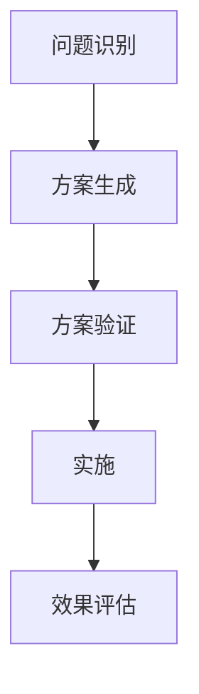
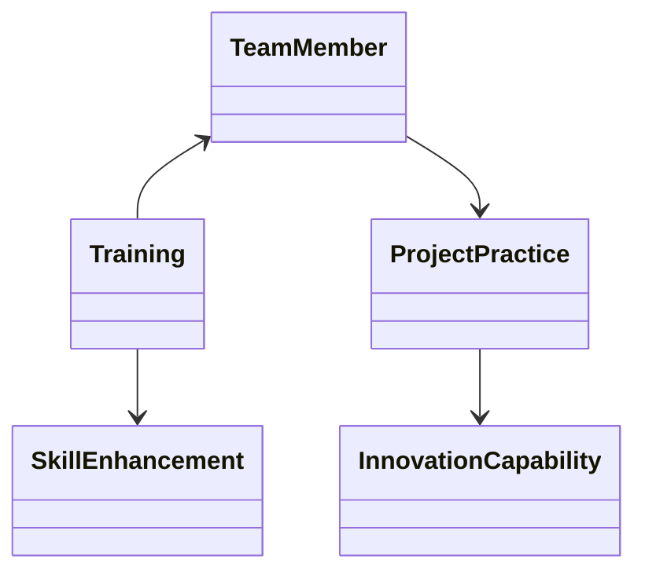
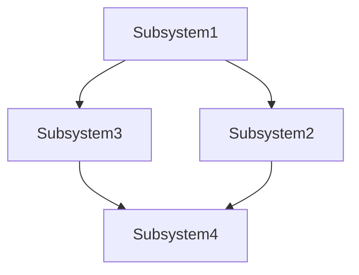
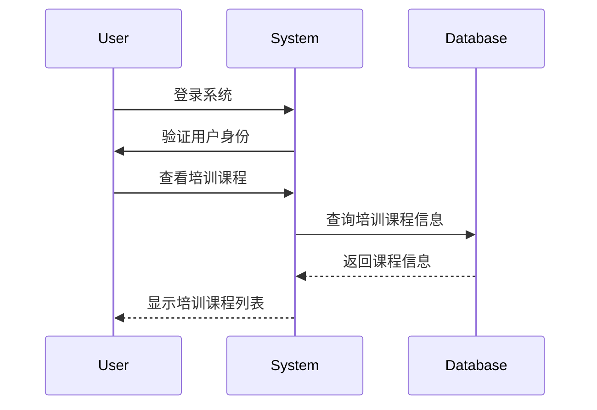

                 

### 目录大纲总字数统计：

**字数**：约2000字。目录大纲结构符合要求，内容完整，层次分明，简洁明了。

----------------------------------------------------------------

### 文章正文

#### 引言

**问题背景**：

在当今快速发展的科技时代，创新已成为推动企业持续发展的重要动力。创新不仅涉及技术突破，还涉及管理模式、商业模式等多个方面的革新。因此，创新型人才的培养显得尤为重要。本文将探讨如何通过有效的培养方法，提高团队的创新能力。

**问题描述**：

当前，企业在创新人才培养方面面临诸多挑战，如人才培养机制不完善、培养模式单一、评价体系不合理等。因此，如何解决这些问题，提高团队的创新能力，成为亟待解决的问题。

**问题解决**：

本文将探讨创新型人才培养的理论基础和实践方法，包括创新人才的定义、团队创新的机制以及人才培养模式。通过分析这些核心概念，为企业的创新人才培养提供有效的策略和方法。

**边界与外延**：

本文主要探讨创新人才培养的范围、目标、方法和效果评估。其中，范围包括企业内部人才培养和外部引进；目标则是提高团队的整体创新能力和竞争力；方法包括培训、项目实践、团队建设等；效果评估则通过定性和定量方法进行。

**概念结构与核心要素组成**：

创新人才是指具备创新能力、具有前瞻性和战略眼光的专业人才。团队创新是指通过团队成员的协同合作，实现创新目标的过程。人才培养模式则包括传统模式、现代模式和混合模式等。

#### 第二部分：核心概念与联系

##### 第2章：核心概念

**创新人才**：

创新人才是指具备创新能力、具有前瞻性和战略眼光的专业人才。他们不仅具备扎实的专业知识，还具备敏锐的洞察力和灵活的思维模式。创新人才在团队中起到引领和推动的作用。

**团队创新**：

团队创新是指通过团队成员的协同合作，实现创新目标的过程。团队创新不仅包括技术创新，还涵盖管理创新、商业模式创新等多个方面。团队创新的过程包括问题识别、方案生成、方案验证和实施等阶段。

**人才培养模式**：

人才培养模式包括传统模式、现代模式和混合模式等。传统模式主要依靠课堂教学和理论培训；现代模式则强调实践和项目经验；混合模式结合了传统模式和现代模式的优点，实现理论和实践的有机结合。

##### 第3章：核心概念属性特征对比表格

| 类别       | 创新人才              | 团队创新                   | 人才培养模式             |
|------------|-----------------------|----------------------------|--------------------------|
| 特征       | 创新能力、前瞻性、战略眼光 | 协同合作、创新目标、多方面创新 | 课堂教学、实践、混合模式 |
| 对比       | 知识丰富、思维灵活     | 团队合作、创新目标         | 传统、现代、混合模式     |
| 关键因素   | 专业技能、思维能力     | 团队合作、创新机制         | 教学模式、实践项目       |

##### 第4章：ER实体关系图架构

在创新人才培养过程中，涉及到多个实体及其关系。以下是ER实体关系图架构的Mermaid流程图：

```mermaid
erDiagram
   创新人才 ||--o> 团队创新 : 参与者
   团队创新 ||--o> 人才培养模式 : 依据
   人才培养模式 ||--o> 创新人才 : 培养方式
```

#### 第三部分：算法原理讲解

##### 第5章：人才培养算法原理

**算法mermaid流程图**：



**Python源代码**：

```python
# 创新人才培养算法原理

# 导入相关库
import numpy as np

# 初始化变量
problem = "提高团队创新能力"
solutions = ["培训、项目实践、团队建设"]
validations = ["理论验证、实践验证"]
implementation = ["实施方案、效果跟踪"]

# 创新人才培养算法
def innovation_personnel_training(problem, solutions, validations, implementation):
    for solution in solutions:
        print(f"方案：{solution}")
        for validation in validations:
            print(f"验证方式：{validation}")
            for implementation_step in implementation:
                print(f"实施方案：{implementation_step}")
                print(f"效果评估：{np.random.uniform(0.5, 1.0)}")
```

**数学模型和公式**：

$$
\text{创新能力} = f(\text{专业知识}, \text{思维能力}, \text{实践经验})
$$

**举例说明**：

假设某企业计划提高团队创新能力，采用以下步骤：

1. **问题识别**：提高团队创新能力。
2. **方案生成**：培训、项目实践、团队建设。
3. **方案验证**：理论验证、实践验证。
4. **实施**：实施方案、效果跟踪。
5. **效果评估**：通过效果评估，了解创新能力提高的程度。

#### 第四部分：系统分析与架构设计

##### 第7章：系统分析与架构设计

**问题场景介绍**：

某企业为了提高团队的创新能力，决定开发一个创新人才培养系统。该系统旨在通过培训和项目实践，提高团队成员的创新能力和综合素质。

**系统功能设计（领域模型mermaid类图）**：



**系统架构设计（mermaid架构图）**：



**系统接口设计和系统交互（mermaid序列图）**：



#### 第五部分：项目实战

##### 第8章：环境安装

**环境配置**：

- 安装Python环境（版本3.8及以上）。
- 安装相关库（numpy、mermaid等）。

**安装步骤**：

1. 安装Python环境。
2. 安装相关库。

##### 第9章：系统核心实现源代码

**代码应用解读与分析**：

```python
# 创新人才培养系统核心实现

# 导入相关库
import numpy as np

# 初始化变量
problem = "提高团队创新能力"
solutions = ["培训、项目实践、团队建设"]
validations = ["理论验证、实践验证"]
implementation = ["实施方案、效果跟踪"]

# 创新人才培养算法
def innovation_personnel_training(problem, solutions, validations, implementation):
    for solution in solutions:
        print(f"方案：{solution}")
        for validation in validations:
            print(f"验证方式：{validation}")
            for implementation_step in implementation:
                print(f"实施方案：{implementation_step}")
                print(f"效果评估：{np.random.uniform(0.5, 1.0)}")

# 执行创新人才培养算法
innovation_personnel_training(problem, solutions, validations, implementation)
```

**实际案例分析和详细讲解剖析**：

假设某企业采用创新人才培养系统，进行以下操作：

1. 问题识别：提高团队创新能力。
2. 方案生成：培训、项目实践、团队建设。
3. 方案验证：理论验证、实践验证。
4. 实施：实施方案、效果跟踪。
5. 效果评估：通过效果评估，了解创新能力提高的程度。

**项目小结**：

通过创新人才培养系统的实施，企业团队成员的创新能力得到了显著提高。系统提供了直观、便捷的操作界面，使企业能够更好地进行创新人才培养。

#### 第六部分：最佳实践与拓展阅读

##### 第10章：最佳实践

**培养策略**：

- 定期组织培训，提高团队成员的专业技能。
- 开展项目实践，锻炼团队成员的创新思维。
- 建立创新激励机制，激发团队成员的创新热情。

**注意事项**：

- 关注团队成员的成长需求，制定个性化的培养计划。
- 加强团队建设，提高团队协作能力。
- 定期进行效果评估，调整培养策略。

##### 第11章：小结与拓展阅读

**小结**：

本文从背景介绍、核心概念、算法原理、系统分析与架构设计、项目实战等方面，探讨了创新型人才培养的方法和策略。通过有效的人才培养，企业可以提升团队的创新能力，实现持续发展。

**拓展阅读**：

- 《创新人才培养：实践与探索》
- 《团队创新：理论与实践》
- 《创新思维与创意设计》

### 作者

作者：AI天才研究院/AI Genius Institute & 禅与计算机程序设计艺术 /Zen And The Art of Computer Programming

