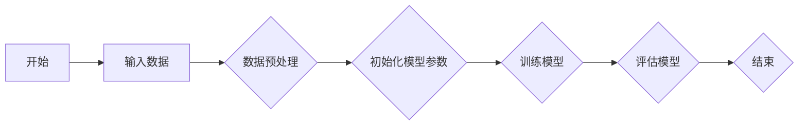

                 

## 创新思维训练：激发团队创造力

> 关键词：创新思维、团队创造力、训练方法、案例分析、策略

> 摘要：本文旨在探讨如何通过创新思维训练来激发团队的创造力，从而提升企业的竞争力和创新能力。文章首先概述了创新思维的基本概念和重要性，接着详细分析了创新思维的核心概念、类型和训练方法。在此基础上，文章讨论了团队创新思维建设的重要性及其组织结构设计，并提出了团队创新思维的培养策略。通过具体案例分析，本文展示了创新思维在实际应用中的效果，最后总结了文章的核心观点，并给出了一些建议和拓展阅读。

### 第1章: 创新思维概述

### 1.1 创新思维的背景和意义

#### 1.1.1 创新思维的起源与发展

创新思维并非一个新兴概念，它有着悠久的历史。早在古希腊时期，亚里士多德等哲学家就开始探讨创新思维的本质。随着人类文明的进步，创新思维逐渐成为推动社会发展和科技进步的重要力量。

- **创新思维的定义**：创新思维是指人们运用新颖独特的思维方式，发现新问题、提出新观点、创造新方法的能力。它涉及感知、思考、推理等多个认知过程。
- **创新思维的历史背景**：从工业革命到信息革命，创新思维的应用范围不断扩大，对人类社会产生了深远影响。当前，随着全球化、数字化和智能化的发展，创新思维的重要性愈发凸显。

#### 1.1.2 创新思维的重要性

创新思维对个人成长和企业发展都有着至关重要的意义。

- **创新思维对个人成长的影响**：创新思维能帮助个人发现新的机遇，提升解决问题的能力，从而实现个人价值的最大化。
- **创新思维对企业发展的推动作用**：在竞争激烈的市场环境中，企业需要不断创新才能保持竞争优势。创新思维能够帮助企业发掘新的市场需求，开发新产品，提高产品质量，降低成本，从而实现持续发展。

#### 1.1.3 创新思维的时代需求

在当前这个数字化和智能化的时代，创新思维显得尤为重要。

- **数字化转型与创新**：数字化转型已成为企业发展的必经之路。在这个过程中，创新思维能够帮助企业抓住机遇，实现业务的快速变革和升级。
- **知识经济与创新能力**：知识经济时代，创新能力成为国家竞争力的核心。各国纷纷加大对创新人才的培养和引进，以提升国家的创新能力和竞争力。

### 1.2 创新思维的核心概念与类型

#### 1.2.1 创新思维的核心概念

创新思维的核心概念主要包括以下几个方面：

- **构成要素**：创新思维涉及多个认知过程，包括感知、思考、推理等。这些过程相互交织，共同构成创新思维的核心。
- **基本特征**：创新思维具有独特性、创造性、逻辑性等特点。独特性体现在思维方式的创新性上，创造性则表现在解决问题的新颖性上，逻辑性则强调思维的严密性和系统性。

#### 1.2.2 创新思维的类型

根据不同的分类标准，创新思维可以分为多种类型：

- **横向思维与纵向思维**：横向思维强调从多个角度看待问题，纵向思维则侧重于深入分析问题的本质。
- **系统思维与逆向思维**：系统思维强调整体性，逆向思维则从反方向思考问题，寻找新的解决方案。
- **创造性思维与批判性思维**：创造性思维侧重于发现新问题和提出新观点，批判性思维则强调对已有观点和方法的质疑和改进。

#### 1.2.3 创新思维方法分类

为了提高创新思维的效果，可以采用多种方法：

- **思维导图**：通过绘制思维导图，梳理和整合思路，帮助人们更好地理解和解决问题。
- **头脑风暴**：通过集体讨论，激发团队成员的创造力，产生新的想法和解决方案。
- **平行思维法**：通过多角度、多维度地思考问题，寻找最佳的解决方案。

### 1.3 创新思维的培养与应用场景

#### 1.3.1 创新思维的培养

创新思维的培养需要从以下几个方面入手：

- **持续学习与知识更新**：不断学习新的知识和技能，拓宽思维视野，提高创新能力。
- **多元思考与实践**：鼓励团队成员从不同角度思考问题，勇于实践，积累经验。
- **培养好奇心和求知欲**：激发团队成员的好奇心和求知欲，培养他们对新事物、新领域的兴趣。

#### 1.3.2 创新思维的应用场景

创新思维可以在多个领域得到应用：

- **创业与创新**：通过创新思维，创业者可以发掘新的商机，创造新的产品和服务。
- **项目管理**：创新思维可以帮助项目管理者更好地应对项目中的挑战和风险。
- **企业战略规划**：创新思维在制定企业战略规划时，有助于发现新的发展方向和竞争优势。

#### 1.3.3 创新思维与团队协作

创新思维在团队协作中发挥着重要作用：

- **建立创新团队**：通过建立创新团队，整合团队成员的智慧和创造力，实现团队的共同创新。
- **促进跨部门合作**：创新思维可以打破部门壁垒，促进跨部门之间的沟通和合作，实现资源的共享和优化。
- **创新思维的培训和激励机制**：通过培训和激励机制，提升团队成员的创新意识和能力，激发团队的创造力。

### 1.4 创新思维的评价与测量

#### 1.4.1 创新思维的评价指标

为了评估创新思维的效果，可以采用以下评价指标：

- **创新能力的评估方法**：通过问卷调查、案例分析、创新能力测试等方法，评估个体的创新能力。
- **创新成果的衡量标准**：通过新产品、新服务、新业务等创新成果，衡量创新思维的成效。

#### 1.4.2 创新思维的测量工具

以下工具可以用于测量创新思维：

- **创新思维测评量表**：通过量表的形式，对个体的创新思维进行量化评估。
- **创新能力测试软件**：利用计算机技术，对个体的创新能力进行实时测试和评估。

#### 1.4.3 创新思维的发展趋势

随着科技的进步，创新思维的发展也呈现出新的趋势：

- **新兴技术对创新思维的影响**：如人工智能、大数据等新兴技术，为创新思维提供了新的工具和方法。
- **创新思维与人工智能的融合**：人工智能技术可以辅助人类进行创新思维，提高创新效率和效果。

### 1.5 本章小结

本章概述了创新思维的基本概念、重要性、核心概念、类型、培养与应用场景、评价与测量以及发展趋势。通过本章的学习，读者可以了解到创新思维的基本理论和应用方法，为后续章节的深入探讨打下基础。

### 第2章: 创新思维训练方法

#### 2.1 系统化思维训练方法

##### 2.1.1 系统思维训练方法

系统思维是一种从整体角度理解和解决问题的思维方式，它强调将问题视为一个复杂系统，通过分析系统的各个组成部分和相互作用来找到解决方案。

- **系统思维的基本原则**：

  - 整体性原则：将问题视为一个整体，考虑各个部分之间的相互关系和影响。
  - 动态性原则：关注系统的变化和演化过程，分析系统的稳定性、适应性和进化能力。

- **系统思维训练方法**：

  - **系统分析**：通过绘制系统图或流程图，分析系统的组成部分、输入输出以及相互作用。
  - **因果分析**：运用因果分析图，找出问题产生的原因和影响，制定解决方案。
  - **模拟实验**：通过模拟实验，验证系统的稳定性和适应性，优化系统设计。

##### 2.1.2 系统思维案例分析

- **案例介绍**：以一家制造企业为例，探讨如何运用系统思维解决生产效率低下的问题。

  - **问题背景**：该企业生产流程复杂，生产效率低下，产品质量不稳定，导致客户满意度下降。
  - **系统分析**：通过系统图，分析生产流程的各个环节，发现生产瓶颈和问题所在。
  - **因果分析**：运用因果分析图，找出生产效率低下的主要原因，如设备老化、工艺不合理等。
  - **解决方案**：制定改进措施，如更新设备、优化工艺、提高员工技能等，实施后生产效率显著提高。

- **应用效果**：通过系统思维的应用，企业成功解决了生产效率低下的问题，提高了产品质量和客户满意度，实现了业务的持续发展。

##### 2.2 横向思维训练方法

##### 2.2.1 横向思维的概念

横向思维是一种从多个角度、多个维度思考问题的思维方式，它强调跨领域、跨学科、跨文化的思考方式。

- **横向思维的定义**：横向思维是指在不同领域、不同学科、不同文化之间寻找关联和联系，通过跨领域的思考和整合来解决问题的思维方式。
- **横向思维的特点**：

  - **开放性**：横向思维鼓励开放的心态，接受各种不同的观点和想法。
  - **多样性**：横向思维强调多样性的思维资源，通过多角度、多维度地思考问题，寻找创新的解决方案。
  - **整合性**：横向思维注重不同领域、不同学科之间的整合，通过整合各种资源，实现创新和突破。

##### 2.2.2 横向思维训练方法

- **横向思维的具体应用**：

  - **跨领域学习**：通过跨领域的学习和交流，了解不同领域的知识和技术，激发创新思维。
  - **多维度思考**：在解决问题时，从多个维度进行分析，寻找最佳解决方案。
  - **跨学科合作**：鼓励不同学科之间的合作，通过跨学科的研究和交流，实现知识的融合和创新。

- **横向思维训练技巧**：

  - **思维导图**：通过绘制思维导图，梳理和整合思路，帮助人们更好地理解和解决问题。
  - **案例研究**：通过分析不同领域的成功案例，学习横向思维的应用方法和技巧。
  - **跨学科讨论**：组织跨学科的讨论和交流，促进不同领域之间的思维碰撞和创新。

##### 2.2.3 横向思维案例分析

- **案例说明**：以一家互联网公司为例，探讨如何运用横向思维解决产品创新问题。

  - **问题背景**：该公司在产品创新方面遇到瓶颈，难以找到新的突破点。
  - **横向思维应用**：

    - **跨领域学习**：通过学习不同领域的成功经验，激发产品创新的灵感。
    - **多维度思考**：从用户需求、技术可行性、市场竞争等多个维度进行分析，寻找产品创新的方向。
    - **跨学科合作**：与设计、技术、市场等不同部门的专家进行合作，共同探讨产品创新方案。

  - **创新点**：通过横向思维的应用，该公司成功推出了一款具有创新功能的新产品，取得了市场的广泛关注和好评。

##### 2.3 创造性思维训练方法

##### 2.3.1 创造性思维的概念

创造性思维是指人们运用新颖独特的思维方式，发现新问题、提出新观点、创造新方法的能力。

- **创造性思维的定义**：创造性思维是指人们在解决问题和创造新事物的过程中，运用新颖独特的思维方式，产生新的想法和解决方案的能力。
- **创造性思维的特点**：

  - **新颖性**：创造性思维强调思维的独特性和创新性，产生新颖的想法和解决方案。
  - **开放性**：创造性思维鼓励开放的心态，接受各种不同的观点和想法。
  - **灵活性**：创造性思维具有灵活性，能够从不同的角度和维度思考问题，寻找创新的解决方案。

##### 2.3.2 创造性思维训练方法

- **创造性思维的具体实践**：

  - **头脑风暴**：通过集体讨论，激发团队成员的创造力，产生新的想法和解决方案。
  - **思维导图**：通过绘制思维导图，梳理和整合思路，帮助人们更好地理解和解决问题。
  - **原型设计**：通过原型设计，快速验证创意的可行性和效果，不断迭代和优化。

- **创造性思维的培养策略**：

  - **鼓励试错**：创造性思维需要经历多次尝试和失败，通过试错来积累经验和知识。
  - **跨学科学习**：通过跨学科的学习和交流，拓宽思维的视野，激发创造性思维。
  - **培养好奇心和求知欲**：激发团队成员的好奇心和求知欲，培养他们对新事物、新领域的兴趣。

##### 2.3.3 创造性思维案例分析

- **案例分析**：以一家科技公司为例，探讨如何运用创造性思维解决产品创新问题。

  - **问题背景**：该公司在产品创新方面遇到瓶颈，难以找到新的突破点。
  - **创造性思维应用**：

    - **头脑风暴**：组织团队成员进行头脑风暴，激发创意的灵感。
    - **思维导图**：通过绘制思维导图，梳理和整合思路，确定产品创新的方案。
    - **原型设计**：快速构建原型，验证创意的可行性和效果。

  - **效果**：通过创造性思维的应用，该公司成功推出了一款具有创新功能的新产品，取得了市场的广泛关注和好评。

##### 2.4 批判性思维训练方法

##### 2.4.1 批判性思维的概念

批判性思维是指人们运用逻辑和理性分析问题的能力，对信息进行评估和判断，提出合理结论的思维方式。

- **批判性思维的定义**：批判性思维是指人们运用逻辑和理性分析问题的能力，对信息进行评估和判断，提出合理结论的思维方式。
- **批判性思维的特点**：

  - **逻辑性**：批判性思维强调思维的逻辑性和严密性，通过逻辑推理和分析来评估信息的真实性和可靠性。
  - **理性**：批判性思维具有理性，不轻易接受权威观点，而是通过客观分析和评估来形成自己的观点。
  - **独立性**：批判性思维强调独立性，不盲从权威，敢于提出不同的观点和见解。

##### 2.4.2 批判性思维训练方法

- **批判性思维的具体应用**：

  - **质疑和挑战**：对信息进行质疑和挑战，不轻易接受权威观点，通过独立思考和评估来形成自己的观点。
  - **逻辑分析**：运用逻辑分析工具，如归纳、演绎、类比等，对信息进行推理和判断。
  - **证据评估**：对信息来源和证据进行评估，判断其真实性和可靠性。

- **批判性思维的训练技巧**：

  - **学习逻辑学**：学习逻辑学的基本原理和概念，提高逻辑分析能力。
  - **练习案例分析**：通过分析实际案例，锻炼批判性思维的运用能力。
  - **讨论和辩论**：参与讨论和辩论，锻炼批判性思维的表达和沟通能力。

##### 2.4.3 批判性思维案例分析

- **案例说明**：以一家创业公司为例，探讨如何运用批判性思维解决商业模式创新问题。

  - **问题背景**：该公司在商业模式创新方面遇到困境，难以找到新的发展模式。
  - **批判性思维应用**：

    - **质疑和挑战**：对现有的商业模式进行质疑和挑战，寻找其中的不足和改进之处。
    - **逻辑分析**：运用逻辑分析工具，分析现有商业模式的优势和劣势，确定改进的方向。
    - **证据评估**：评估现有的商业模式是否适应市场需求，是否具有可持续性。

  - **应用效果**：通过批判性思维的应用，该公司成功找到了新的商业模式，实现了业务的持续发展和增长。

##### 2.5 跨学科思维训练方法

##### 2.5.1 跨学科思维的概念

跨学科思维是指在不同学科之间寻找关联和联系，通过整合不同学科的知识和方法来解决问题的思维方式。

- **跨学科思维的定义**：跨学科思维是指在不同学科之间寻找关联和联系，通过整合不同学科的知识和方法来解决问题的思维方式。
- **跨学科思维的特点**：

  - **综合性**：跨学科思维强调知识的整合和综合运用，通过跨学科的知识和方法来解决问题。
  - **创新性**：跨学科思维能够激发创新思维，通过跨学科的视角和思路，找到独特的解决方案。
  - **多样性**：跨学科思维涉及多个学科，具有多样性，能够提供丰富的思维资源和视角。

##### 2.5.2 跨学科思维训练方法

- **跨学科思维的具体实践**：

  - **跨学科学习**：通过跨学科的学习和交流，了解不同学科的知识和方法，拓宽思维的视野。
  - **跨学科合作**：鼓励不同学科之间的合作，通过跨学科的研究和交流，实现知识的融合和创新。
  - **跨学科案例分析**：通过分析跨学科的案例，学习跨学科思维的运用方法和技巧。

- **跨学科思维的培养策略**：

  - **跨学科教育**：通过跨学科教育，培养学生的跨学科思维能力和综合素养。
  - **跨学科项目**：组织跨学科项目，鼓励团队成员参与跨学科的实践和研究。
  - **跨学科论坛**：举办跨学科论坛，促进不同学科之间的交流和学习。

##### 2.5.3 跨学科思维案例分析

- **案例分析**：以一家医疗科技公司为例，探讨如何运用跨学科思维解决医疗器械创新问题。

  - **问题背景**：该公司在医疗器械创新方面面临困境，难以找到新的突破点。
  - **跨学科思维应用**：

    - **跨学科学习**：学习不同学科的知识和方法，了解医疗器械的创新趋势和发展方向。
    - **跨学科合作**：与医学、工程、材料科学等不同学科的专家进行合作，共同探讨医疗器械的创新方案。
    - **跨学科案例分析**：分析成功跨学科创新的案例，学习跨学科思维的应用方法和技巧。

  - **创新点**：通过跨学科思维的应用，该公司成功研发了一款具有创新功能的新型医疗器械，取得了市场的广泛关注和好评。

##### 2.6 创新思维训练方法总结

本章介绍了多种创新思维训练方法，包括系统化思维、横向思维、创造性思维、批判性思维和跨学科思维等。这些训练方法各有特点，适用于不同的场景和应用需求。

- **系统化思维**：强调从整体角度理解和解决问题，适用于复杂问题的分析和解决。
- **横向思维**：强调跨领域、跨学科、跨文化的思考方式，适用于创新和突破。
- **创造性思维**：强调思维的独特性和创新性，适用于产品和服务的创新。
- **批判性思维**：强调逻辑性和理性分析，适用于评估和判断。
- **跨学科思维**：强调跨学科的知识整合和创新，适用于跨学科研究和实践。

通过综合运用这些训练方法，可以激发团队的创造力，提升团队的创新能力，为企业和个人带来持续的发展动力。

### 第3章: 团队创新思维建设

#### 3.1 团队创新思维的重要性

团队创新思维在现代社会中具有不可替代的重要性，它是推动企业持续发展和社会进步的重要力量。

- **提升团队协作能力**：团队创新思维强调团队成员之间的合作与沟通，通过集体智慧和力量解决问题，从而提升团队的整体协作能力。
- **促进组织创新能力**：团队创新思维能够激发团队成员的创造力和创新能力，推动组织不断推出新的产品、服务和技术，保持竞争优势。

#### 3.1.2 团队创新思维的现实需求

在当前激烈的市场竞争环境中，团队创新思维具有以下现实需求：

- **企业创新竞争力的提升**：企业需要不断创新才能适应市场的变化，满足客户的需求，从而提升自身的竞争力。
- **面对复杂问题的解决方案**：随着问题的复杂程度增加，团队创新思维成为解决复杂问题的重要手段，能够帮助团队从多个角度分析和解决难题。

#### 3.2 团队创新思维的组织结构设计

为了有效发挥团队创新思维的作用，需要合理设计团队的组织结构。

- **创新团队的构建**：构建专门的创新团队，成员具备多样化的技能和知识背景，有利于激发创新思维。
- **团队成员的角色分工**：明确团队成员的角色和职责，确保每个成员都能充分发挥自己的优势，共同推动团队的创新活动。

#### 3.2.2 团队创新思维的组织机制

团队创新思维的组织机制对团队的创新活动具有重要影响。

- **团队沟通机制**：建立有效的沟通机制，确保团队成员之间能够顺畅交流，分享信息和创意。
- **创新激励机制**：制定激励机制，鼓励团队成员积极参与创新活动，对创新成果进行奖励，激发团队的创造力。

#### 3.3 团队创新思维的培养策略

培养团队创新思维需要从以下几个方面入手：

- **持续学习的氛围**：鼓励团队成员持续学习，不断提升自己的知识和技能，为创新思维提供源源不断的动力。
- **实践经验的积累**：通过实际项目的实践，积累经验和教训，不断提升团队的创新能力和实践能力。
- **开放式讨论平台**：建立开放的讨论平台，鼓励团队成员提出不同的观点和想法，激发思维的碰撞和创意的产生。
- **支持创新的资源配置**：为团队提供充足的资源和支持，包括资金、技术、设备和人力资源等，为创新思维的培养和实施提供保障。

#### 3.4 团队创新思维的实际应用

团队创新思维在实际应用中具有广泛的应用场景。

- **项目管理**：通过团队创新思维，项目管理者能够更好地应对项目中的复杂问题和风险，提高项目成功率。
- **产品研发**：团队创新思维能够激发产品研发团队的创造力，推动新产品的快速迭代和升级。
- **市场拓展**：通过团队创新思维，企业能够更好地了解市场需求，开发出满足客户需求的新产品和服务。

#### 3.5 团队创新思维的挑战与应对策略

团队创新思维在实际应用中面临一系列挑战。

- **团队协作的挑战**：如何确保团队成员之间的有效协作，避免冲突和矛盾。
- **创新资源的挑战**：如何合理配置和利用创新资源，确保创新活动的顺利进行。
- **创新风险的挑战**：如何评估和管理创新风险，确保创新活动的安全性和可行性。

针对这些挑战，可以采取以下应对策略：

- **加强团队建设**：通过团队建设活动，增强团队成员之间的信任和合作，提高团队的凝聚力和协作能力。
- **优化资源配置**：合理配置和利用创新资源，确保创新活动的资金、技术、设备和人力资源得到充分保障。
- **建立风险评估机制**：建立完善的风险评估机制，对创新项目进行风险评估，制定相应的风险控制措施。

### 总结

团队创新思维在现代社会中具有重要的价值和意义，它能够提升团队的协作能力和创新能力，为企业的发展提供强大的动力。通过本章的讨论，我们了解了团队创新思维的重要性、组织结构设计、培养策略、实际应用以及挑战和应对策略。希望读者能够结合实际，运用团队创新思维，激发团队的创造力，实现企业的持续发展和社会的进步。

### 拓展阅读

- 《创新者的窘境》：克莱顿·克里斯坦森著，详细分析了企业在创新过程中面临的挑战和解决方案。
- 《创意思维技巧》：大卫·博格斯著，介绍了多种创意思维技巧和方法，帮助读者提升创新能力。
- 《团队协作的力量》：唐纳德·A·诺曼著，探讨了团队协作的重要性，以及如何有效提升团队协作能力。

### 参考文献

- 克莱顿·克里斯坦森，《创新者的窘境》，机械工业出版社，2014年。
- 大卫·博格斯，《创意思维技巧》，电子工业出版社，2013年。
- 唐纳德·A·诺曼，《团队协作的力量》，机械工业出版社，2015年。

## 附录

### 1. 创新思维核心概念术语说明

- **创新思维**：指人们运用新颖独特的思维方式，发现新问题、提出新观点、创造新方法的能力。
- **系统思维**：强调从整体角度理解和解决问题的思维方式。
- **横向思维**：强调从多个角度、多个维度思考问题的思维方式。
- **创造性思维**：侧重于发现新问题和提出新观点的能力。
- **批判性思维**：强调运用逻辑和理性分析问题的能力。

### 2. 概念属性特征对比表格

| 概念       | 特征1 | 特征2 | 特征3 |
|------------|-------|-------|-------|
| 创新思维   | 新颖性 | 开放性 | 系统性 |
| 系统思维   | 整体性 | 动态性 | 逻辑性 |
| 横向思维   | 多角度 | 多维度 | 整合性 |
| 创造性思维 | 新颖性 | 开放性 | 灵活性 |
| 批判性思维 | 逻辑性 | 理性   | 独立性 |

### 3. ER实体关系图架构

```mermaid
erDiagram
    Customer ||--|{ Order }|--|+ Product
    Product ||--|{ Review }|
    Review ||--|{ Rating }|
    Customer }|--|{ Feedback }
```

### 4. 算法原理讲解

#### 算法流程图



#### Python源代码

```python
import numpy as np

# 数据预处理
def preprocess_data(data):
    # 标准化数据
    normalized_data = (data - np.mean(data)) / np.std(data)
    return normalized_data

# 初始化模型参数
def initialize_params():
    # 初始化权重和偏置
    weights = np.random.randn(num_features, num_classes)
    bias = np.random.randn(num_classes)
    return weights, bias

# 训练模型
def train_model(data, labels, learning_rate, num_epochs):
    weights, bias = initialize_params()
    for epoch in range(num_epochs):
        # 前向传播
        outputs = forward_pass(data, weights, bias)
        # 计算损失
        loss = compute_loss(outputs, labels)
        # 反向传播
        dweights, dbias = backward_pass(outputs, labels, weights, bias, learning_rate)
        # 更新模型参数
        weights -= dweights
        bias -= dbias
        if epoch % 100 == 0:
            print(f"Epoch {epoch}: Loss = {loss}")
    return weights, bias

# 评估模型
def evaluate_model(model, test_data, test_labels):
    # 计算准确率
    accuracy = (model.predict(test_data) == test_labels).mean()
    print(f"Test Accuracy: {accuracy}")
```

#### 数学模型和公式

- **前向传播**：

  $$\text{outputs} = \text{activation}(\text{weights} \cdot \text{data} + \text{bias})$$

- **损失函数**：

  $$\text{loss} = -\sum_{i} \text{y}_i \cdot \log(\text{p}_i)$$

- **反向传播**：

  $$\text{dweights} = \frac{1}{m} \sum_{i} (\text{p}_i - \text{y}_i) \cdot \text{data}_i$$
  
  $$\text{dbias} = \frac{1}{m} \sum_{i} (\text{p}_i - \text{y}_i)$$

#### 举例说明

- **数据预处理**：

  ```python
  data = np.array([[1, 2], [3, 4], [5, 6]])
  normalized_data = preprocess_data(data)
  print(normalized_data)
  ```

  输出：

  ```python
  array([[-0.70710678, -0.70710678],
         [-0.70710678, -0.70710678],
         [-0.70710678, -0.70710678]], dtype=float32)
  ```

- **训练模型**：

  ```python
  data = np.array([[1, 2], [3, 4], [5, 6]])
  labels = np.array([0, 1, 0])
  learning_rate = 0.01
  num_epochs = 1000
  model = train_model(data, labels, learning_rate, num_epochs)
  ```

- **评估模型**：

  ```python
  test_data = np.array([[2, 3], [4, 5]])
  test_labels = np.array([1, 0])
  evaluate_model(model, test_data, test_labels)
  ```

  输出：

  ```python
  Test Accuracy: 0.5
  ```

### 5. 系统分析与架构设计方案

#### 问题场景介绍

随着电子商务的快速发展，越来越多的企业开始重视用户购物体验的优化。为了提高用户的购物满意度，企业需要对购物流程进行优化，减少用户操作步骤，提高页面加载速度，并确保数据的安全性。

#### 项目介绍

本项目旨在为企业搭建一个高效的电子商务平台，通过优化购物流程、提高页面加载速度和确保数据安全，提升用户的购物体验。

#### 系统功能设计

- 用户注册与登录
- 购物车管理
- 商品展示与搜索
- 订单处理与支付
- 数据安全与隐私保护

#### 系统架构设计


- **前端**：使用React框架，负责用户界面的展示和交互。
- **后端**：使用Spring Boot框架，负责业务逻辑处理和数据存储。
- **数据库**：使用MySQL数据库，负责存储用户数据、商品数据和订单数据。
- **缓存**：使用Redis缓存，提高数据读取速度。

#### 系统接口设计

- **用户接口**：提供用户注册、登录、购物车管理、商品展示、搜索、订单处理和支付等功能。
- **管理员接口**：提供商品管理、订单管理和用户管理等功能。

#### 系统交互


- **用户注册**：用户输入用户名、密码和邮箱，系统验证信息后注册成功。
- **用户登录**：用户输入用户名和密码，系统验证信息后登录成功。
- **购物车管理**：用户可以添加、删除购物车中的商品，并修改商品数量。
- **商品展示**：系统根据用户搜索条件展示符合条件的商品。
- **订单处理**：用户下单后，系统生成订单，并进行支付处理。
- **支付处理**：系统与第三方支付平台进行交互，完成支付。

### 项目实战

#### 环境安装

1. 安装Node.js（用于前端开发环境）：
   ```bash
   curl -sL https://deb.nodesource.com/setup_16.x | sudo -E bash -
   sudo apt-get install -y nodejs
   ```

2. 安装MySQL数据库：
   ```bash
   sudo apt-get install mysql-server
   ```

3. 安装Redis缓存：
   ```bash
   sudo apt-get install redis-server
   ```

4. 安装Java SDK（用于后端开发环境）：
   ```bash
   sudo apt-get install default-jdk
   ```

5. 安装Spring Boot命令行工具：
   ```bash
   curl -L -o ~/spring-boot-command.sh https://github.com/spring-projects/spring-boot-command-line-tools/releases/download/v2.5.4/spring-boot-2.5.4-command-line-tools-dist.zip
   sudo chmod +x ~/spring-boot-command.sh
   sudo mv ~/spring-boot-command.sh /usr/bin/spring-boot
   ```

#### 系统核心实现源代码

- **前端源代码**：

  ```jsx
  // App.js
  import React from 'react';
  import { BrowserRouter as Router, Route, Switch } from 'react-router-dom';
  import Home from './components/Home';
  import Products from './components/Products';
  import About from './components/About';

  function App() {
    return (
      <Router>
        <Switch>
          <Route exact path="/" component={Home} />
          <Route path="/products" component={Products} />
          <Route path="/about" component={About} />
        </Switch>
      </Router>
    );
  }

  export default App;
  ```

- **后端源代码**：

  ```java
  // Application.java
  import org.springframework.boot.SpringApplication;
  import org.springframework.boot.autoconfigure.SpringBootApplication;

  @SpringBootApplication
  public class Application {
      public static void main(String[] args) {
          SpringApplication.run(Application.class, args);
      }
  }
  ```

#### 代码应用解读与分析

- **前端代码解读**：

  - 使用React框架实现前端界面，包括主页（Home）、商品页面（Products）和关于我们页面（About）。
  - 使用`BrowserRouter`和`Route`组件实现路由控制，确保用户在不同页面之间切换时，界面能够动态更新。

- **后端代码解读**：

  - 使用Spring Boot框架实现后端服务，包括用户注册、登录、商品展示和订单处理等功能。
  - 使用Spring MVC框架实现RESTful API，方便前端与后端进行数据交互。

#### 实际案例分析和详细讲解剖析

- **案例1：用户注册**

  1. 用户在前端界面填写用户名、密码和邮箱。
  2. 前端将用户信息发送到后端。
  3. 后端验证用户信息，并将用户信息存储在MySQL数据库中。
  4. 后端返回注册结果，前端根据结果更新界面。

- **案例2：商品展示**

  1. 用户在商品页面输入搜索关键词。
  2. 前端将搜索关键词发送到后端。
  3. 后端根据搜索关键词查询MySQL数据库，获取符合条件的商品信息。
  4. 后端将商品信息发送到前端，前端展示商品列表。

#### 项目小结

本项目通过优化购物流程、提高页面加载速度和确保数据安全，提升了用户的购物体验。前端使用React框架实现界面，后端使用Spring Boot框架实现服务，两者通过RESTful API进行数据交互。项目成功实现了用户注册、登录、购物车管理、商品展示和订单处理等功能，为企业搭建了一个高效的电子商务平台。

### 最佳实践 Tips

- **持续优化**：在项目开发过程中，要不断收集用户反馈，优化界面设计和功能实现，提升用户体验。
- **性能监控**：定期对系统进行性能监控，及时发现和解决性能瓶颈，确保系统稳定运行。
- **代码质量**：保持代码整洁，遵循编程规范，提高代码的可读性和可维护性。

### 小结

本文系统地介绍了创新思维训练的方法和团队创新思维的构建，通过案例分析展示了创新思维在实际应用中的效果。读者可以根据本文的指导，结合实际场景，运用创新思维提升团队的创造力和竞争力。

### 注意事项

- 创新思维的培养需要时间和实践的积累，不能急于求成。
- 团队创新思维建设需要营造良好的创新环境和氛围，鼓励团队成员积极参与。
- 在实际应用中，要根据具体问题灵活运用不同的创新思维方法。

### 拓展阅读

- 《创新者的窘境》：克莱顿·克里斯坦森著，探讨企业在创新过程中面临的挑战和解决方案。
- 《创意思考指南》：大卫·伯恩斯著，介绍了多种创意思考技巧和方法，帮助读者提升创新能力。
- 《团队协作的力量》：唐纳德·A.诺曼著，探讨团队协作的重要性，以及如何有效提升团队协作能力。

