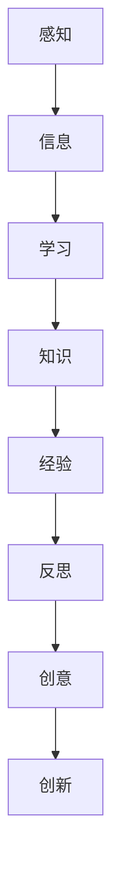
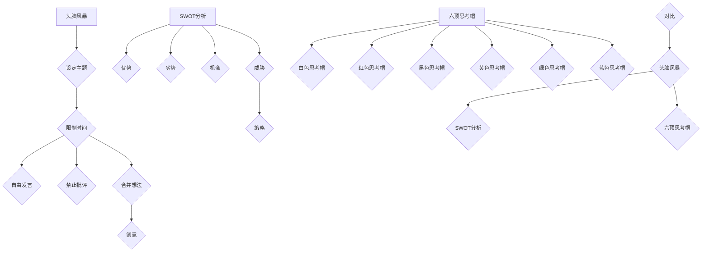

                 

### 引言

创新思维，作为现代社会发展的核心动力，正日益受到各类组织和个人重视。在这个充满变化与不确定性的时代，创新不仅是一种能力，更是一种生存和发展的必要策略。无论是在企业、科研机构，还是教育领域，创新思维的应用都显得尤为重要。

#### 创新思维的重要性

首先，创新思维是推动科技进步的关键因素。在计算机科学和人工智能领域，每一次技术的突破和创新都离不开创新思维的引导。例如，深度学习算法的提出和广泛应用，极大地推动了人工智能领域的发展，从而引发了诸如自动驾驶、智能语音助手等一系列革命性的技术进步。

其次，创新思维在商业领域同样至关重要。企业通过创新思维可以开拓新的市场、创造新的商业模式，从而在激烈的市场竞争中保持领先地位。以苹果公司为例，其通过创新思维不断推出革命性的产品，如iPhone、iPad等，成功地重塑了手机和电脑市场的格局。

#### 创新思维的现状与挑战

尽管创新思维的重要性显而易见，但在实际应用中，我们仍然面临诸多挑战。首先，传统思维模式的束缚。许多企业和团队习惯于按照既定的流程和方法进行工作，缺乏灵活性和创新性。其次，创新环境的缺失。一个鼓励创新、支持失败和不断试错的文化环境是创新思维得以有效发挥的重要保障。然而，在很多组织中，这种环境尚未完全形成。

#### 书籍结构安排

为了帮助读者全面理解创新思维，本书将分为以下几个部分：

- **第1章 引言**：介绍创新思维的重要性、现状与挑战以及书籍的结构安排。
- **第2章 创新思维的基本概念**：阐述创新思维的定义、核心要素和基本模式。
- **第3章 创新思维的源泉**：探讨感知、学习、经验和创意如何激发创新思维。
- **第4章 创新思维的方法论**：介绍头脑风暴、SWOT分析和六顶思考帽等创新方法。
- **第5章 团队创新思维**：分析团队创新思维的原理、培养方法和实践策略。
- **第6章 创新思维在问题解决中的应用**：探讨创新思维在问题识别、策略制定和实际案例中的应用。
- **第7章 创新思维的实践与评估**：详细讲解创新思维实践的过程、挑战与评估方法。
- **第8章 高效创新思维环境建设**：分析创新文化的重要性、设计原则和团队建设策略。
- **第9章 总结与展望**：总结创新思维的要点，展望其未来发展，并提出对团队的启示和建议。

通过这本书，我们希望读者能够全面掌握创新思维的方法论，并在实际工作中灵活应用，从而引领团队突破瓶颈，实现创新目标。

### 第1章 引言

#### 创新思维的重要性

在当今快速变化的世界，创新思维已经成为推动个人和组织发展的核心动力。无论是在科技领域、商业世界，还是在社会创新中，创新思维都发挥着至关重要的作用。首先，从科技领域的角度来看，创新思维是科技进步的重要驱动力。每一次科技的突破和进步，都离不开创新思维的引导。例如，深度学习算法的诞生和广泛应用，极大地推动了人工智能领域的发展，从而引发了诸如自动驾驶、智能语音助手等一系列革命性的技术进步。这些创新不仅改变了人们的生活方式，也创造了巨大的商业价值。

其次，在商业领域，创新思维是企业在激烈竞争中保持领先地位的关键。通过创新思维，企业可以开拓新的市场、创造新的商业模式，从而在竞争中获得优势。以苹果公司为例，其通过持续的创新思维，不断推出革命性的产品，如iPhone、iPad等，成功地重塑了手机和电脑市场的格局。苹果的成功不仅证明了创新思维的商业价值，也展示了创新思维在企业战略中的重要性。

最后，在社会创新领域，创新思维也是推动社会进步的重要力量。通过创新思维，我们可以解决各种复杂的社会问题，如环境污染、教育公平、医疗资源分配等。例如，共享经济的兴起，通过创新思维重新定义了出行、住宿等服务模式，不仅提高了资源利用效率，也改善了人们的生活质量。

#### 创新思维的现状与挑战

尽管创新思维的重要性不言而喻，但在实际应用中，我们仍然面临诸多挑战。首先，传统思维模式的束缚。许多企业和团队习惯于按照既定的流程和方法进行工作，缺乏灵活性和创新性。这种固化的思维模式限制了创新思维的发展，使得许多机会被忽视。其次，创新环境的缺失。一个鼓励创新、支持失败和不断试错的文化环境是创新思维得以有效发挥的重要保障。然而，在很多组织中，这种环境尚未完全形成。缺乏创新文化，导致员工不敢冒险，不敢尝试新的想法，从而阻碍了创新思维的实践。

此外，创新思维能力的培养也是一个长期且系统的过程。不仅需要个人不断学习和积累知识，还需要团队之间的协作和互动。然而，当前很多组织缺乏有效的创新思维培养机制，导致创新思维能力的提升困难。

#### 创新思维的应用领域

创新思维的应用领域非常广泛，几乎涵盖了所有行业和领域。以下是一些典型应用领域：

1. **科技领域**：创新思维在科技领域的应用尤为突出。通过创新思维，科学家和工程师可以提出新的理论、开发新的技术，从而推动科技进步。例如，量子计算、基因编辑等技术的前沿突破，都离不开创新思维的引导。

2. **商业领域**：商业领域是创新思维应用最为广泛和显著的领域之一。企业通过创新思维，可以开拓新的市场、创造新的商业模式，从而在竞争中脱颖而出。例如，亚马逊的物流创新、阿里巴巴的电子商务模式，都是通过创新思维实现的商业成功。

3. **教育领域**：在教育领域，创新思维可以帮助教师和学生突破传统教学模式，提高学习效果。例如，翻转课堂、在线学习等新型教育模式，都是创新思维的体现。

4. **医疗领域**：创新思维在医疗领域同样具有重要意义。通过创新思维，医疗专业人士可以开发新的治疗方法、改善医疗服务流程，从而提高医疗质量和效率。例如，精准医疗、远程医疗等都是创新思维的产物。

5. **社会创新领域**：在社会创新领域，创新思维可以解决各种复杂的社会问题，如环境污染、教育公平、医疗资源分配等。通过创新思维，我们可以设计出更加有效和可持续的解决方案，推动社会进步。

#### 创新思维的未来趋势

随着科技的发展和人类认知的深化，创新思维的应用前景将更加广阔。未来，创新思维将朝着以下几个方向发展趋势：

1. **跨学科融合**：随着不同学科之间的交叉和融合，创新思维将更加综合和多元化。跨学科的合作将激发新的创新火花，推动科学技术的进步。

2. **智能化**：人工智能和大数据技术的发展，将为创新思维提供强大的支持。通过智能化工具和方法，创新思维可以更加高效和精准地生成和筛选创意。

3. **全球化**：全球化趋势将进一步促进创新思维的交流与合作。不同文化和背景的人们通过创新思维，可以共同解决全球性的问题，推动全球发展。

4. **可持续发展**：创新思维将在可持续发展领域发挥重要作用。通过创新思维，我们可以设计出更加环保、节能和可持续的解决方案，实现经济、社会和环境的协调发展。

#### 总结与展望

总之，创新思维在现代社会的发展中具有重要意义。无论是在科技、商业，还是社会创新领域，创新思维都是推动进步和发展的关键因素。通过创新思维，我们可以开拓新的领域、解决复杂问题，实现个人和组织的突破。本书将深入探讨创新思维的核心概念、基本原理和实践方法，帮助读者全面掌握创新思维，并在实际工作中灵活应用，从而引领团队突破瓶颈，实现创新目标。

### 第2章 创新思维的基本概念

#### 创新思维的定义

创新思维，顾名思义，是指运用创造性思考能力，产生新颖、独特且有价值的思想、产品或解决方案的过程。它是一种高度复杂的思维活动，涉及多个认知和创造性的层面。创新思维不仅仅是简单地提出新的想法，更重要的是将这些想法转化为现实，并产生实际的效益。

创新思维的关键在于“创新”，即创造新的价值。这种价值可以是技术上的突破、商业模式的创新，也可以是解决社会问题的新方法。在计算机科学和人工智能领域，创新思维尤为重要。例如，在人工智能领域，深度学习算法的提出和应用，就是一个典型的创新思维实例。它不仅改变了人工智能的发展路径，也为各行各业带来了革命性的变革。

#### 创新思维的核心要素

1. **创造性**：创造性是创新思维的核心要素。它指的是产生新颖、独特且有实际应用价值的思想或解决方案。创造性思维需要突破传统思维模式的限制，寻找新的解决方案。例如，在编程领域，创造性思维可以帮助开发者找到更高效、更简洁的算法，从而提升系统的性能。

2. **灵活性**：灵活性是指能够适应变化，灵活运用不同的思维方式和策略。在创新思维中，灵活性非常重要，因为面对复杂的问题和不确定的环境，灵活的思维方式可以帮助我们快速调整策略，找到最佳的解决方案。例如，在项目管理和团队协作中，灵活的思维方式可以帮助团队成员迅速适应变化，提高项目的成功率。

3. **开放性**：开放性是指对新的想法、观点和解决方案持开放态度，勇于尝试和探索。开放性思维鼓励我们接受不同的观点和意见，从多个角度思考问题，从而产生更多的创意。例如，在科研和产品开发中，开放性思维可以帮助我们借鉴其他领域的成功经验，从而实现创新。

4. **持久性**：持久性是指在面对困难和挑战时，能够坚持不懈，持续努力。创新思维往往需要长时间的投入和努力，才能取得成功。持久性思维可以帮助我们克服挫折和困难，坚持到底。例如，在创业和创新项目中，持久性思维是非常重要的，它可以帮助创业者不断尝试、不断改进，最终实现目标。

#### 创新思维的基本模式

1. **发散思维**：发散思维是指从一个中心点出发，向多个方向延伸，产生大量不同的想法和解决方案。发散思维强调数量的优势，通过大量的想法碰撞，寻找潜在的解决方案。例如，在头脑风暴会议中，参与者可以自由提出各种想法，从而激发更多的创意。

2. **收敛思维**：收敛思维是指从多个发散的想法中筛选和整合，找出最有价值、最可行的解决方案。收敛思维强调质量的优势，通过对想法的深入分析和评估，找到最佳的解决方案。例如，在项目决策过程中，团队可以通过收敛思维，从多个备选方案中选出最优方案。

3. **系统思维**：系统思维是指从整体和系统的角度进行思考，考虑各部分之间的相互关系和影响。系统思维强调系统的整体性，通过理解系统内部的相互作用，找到创新的切入点。例如，在复杂系统的设计和优化中，系统思维可以帮助我们理解系统的各个组成部分，从而找到优化方案。

#### 概念属性特征对比表格

| 概念 | 定义 | 特征 |
| ---- | ---- | ---- |
| 创新 | 产生新颖、独特且有价值的思想、产品或解决方案 | 新颖、独特、有价值 |
| 思维 | 大脑对信息进行加工和处理的过程 | 创造性、灵活性、开放性、持久性 |
| 创新思维 | 运用创造性思考能力，产生新颖、独特且有价值的思想、产品或解决方案的过程 | 创造性、灵活性、开放性、持久性 |

#### ER实体关系图架构

在创新思维的研究中，我们可以使用实体关系图（ER图）来描述不同概念之间的关系。以下是一个简化的ER图示例，展示了创新思维与相关概念之间的关系。

```
[创新思维]
│
├───[创造性]
│     └───[新颖、独特、有价值]
│
├───[灵活性]
│
├───[开放性]
│
└───[持久性]
```

通过这个ER图，我们可以清晰地看到创新思维与创造性、灵活性、开放性和持久性之间的关系，这些核心要素共同构成了创新思维的基础。

### 第3章 创新思维的源泉

创新思维并非无源之水，它来源于多个方面，包括感知、学习、经验和创意。理解这些源泉是如何激发创新思维，对于我们在实际工作中培养和运用创新思维至关重要。

#### 感知与创新思维

感知是创新思维的基础，它是指个体对周围环境和信息的接收和处理过程。敏锐的感知能力可以帮助我们捕捉到潜在的机遇和问题，从而激发创新思维。例如，在产品设计中，设计师通过观察用户的使用习惯和需求，可以发现现有产品存在的问题，从而提出改进方案。

感知能力的培养需要我们具备开放的心态，保持对环境的敏感度。以下是一些提升感知能力的方法：

1. **多感官参与**：通过视觉、听觉、触觉等多种感官体验，提高对信息的综合处理能力。
2. **环境扫描**：定期观察和分析环境变化，了解行业动态和市场需求。
3. **反思与总结**：定期回顾自己的感知经验，从中总结规律和启示。

#### 学习与创新思维

学习是创新思维的另一个重要源泉。通过学习，我们可以获取新的知识、技能和思维方式，从而为创新提供丰富的素材和灵感。学习不仅包括正式的教育和学习，还包括日常生活中的学习和积累。

以下是一些促进学习，从而激发创新思维的方法：

1. **跨学科学习**：通过学习不同领域的知识，拓宽视野，发现跨学科之间的联系和交叉点，从而激发创新思维。
2. **实践学习**：通过实际操作和项目实践，将理论知识应用到实际中，从而加深理解和掌握。
3. **持续学习**：保持对新知识的好奇心和求知欲，不断学习和更新自己的知识体系。

#### 经验与创新思维

经验是创新思维的重要基石。通过积累和反思经验，我们可以发现问题的本质，提出新的解决方案。经验不仅来自个人的实践，还包括团队和组织的集体经验。

以下是一些利用经验激发创新思维的方法：

1. **经验分享**：通过团队内部的交流分享，将不同成员的经验和见解结合起来，产生新的创意。
2. **反思与总结**：定期对项目或工作的过程和结果进行反思和总结，从经验中提炼出有价值的见解和教训。
3. **案例分析**：通过分析成功或失败的创新案例，从中学习经验和教训，指导实际工作。

#### 创意与创新思维

创意是创新思维的直接体现，它是通过创造性思维活动产生的新的想法、概念或解决方案。创意可以来自感知、学习和经验，但最终需要通过创造性思维将其转化为实际的应用。

以下是一些激发创意的方法：

1. **头脑风暴**：通过集体讨论和思维碰撞，快速产生大量创意。
2. **思维导图**：通过图形化的方式，将创意和想法进行可视化，帮助梳理和扩展思维。
3. **跨界融合**：将不同领域或行业的知识和方法进行融合，产生新的创意。

#### 创新思维的源泉联系

感知、学习、经验和创意是创新思维的四大源泉，它们相互联系、相互影响。感知为我们提供了丰富的信息和灵感，学习为我们提供了知识和技能，经验为我们提供了实践的基础，而创意则是将这些元素整合并创新的结果。

以下是一个简化的Mermaid流程图，展示了创新思维源泉之间的联系：



通过这个流程图，我们可以清晰地看到从感知到创新的整个过程。感知获取信息，学习获取知识，经验积累反思，最终通过创意形成创新。这一过程不仅展示了创新思维的源泉，也揭示了如何通过这些源泉来培养和提升创新思维能力。

### 第4章 创新思维的方法论

在掌握了创新思维的基本概念之后，我们需要了解一些具体的方法论，这些方法论能够帮助我们更有效地应用创新思维，解决实际问题。在本章中，我们将介绍几种常用的创新思维方法：头脑风暴、SWOT分析和六顶思考帽。

#### 头脑风暴

头脑风暴是一种集体创造性思维的方法，旨在通过快速产生大量想法，激发团队的创意潜力。以下是一个典型的头脑风暴步骤：

1. **设定主题**：明确讨论的主题，确保所有参与者围绕同一主题进行思考。
2. **限制时间**：设定一定的时间限制，通常为20-30分钟，以激发快速思考。
3. **自由发言**：鼓励所有参与者自由发言，无论想法是否可行，都应记录下来。
4. **禁止批评**：在头脑风暴过程中，禁止对任何想法进行批评或评价，确保每个人都有发言的自由。
5. **合并想法**：在头脑风暴结束后，对记录的想法进行筛选和合并，形成有价值的创意。

#### SWOT分析

SWOT分析是一种战略规划工具，用于评估一个项目的优势、劣势、机会和威胁。以下是SWOT分析的步骤：

1. **优势（Strengths）**：识别项目或团队在资源、技能、市场等方面的优势。
2. **劣势（Weaknesses）**：识别项目或团队在资源、技能、市场等方面的劣势。
3. **机会（Opportunities）**：分析外部环境中的机会，如市场趋势、技术进步等。
4. **威胁（Threats）**：分析外部环境中的威胁，如竞争对手、市场变化等。

通过SWOT分析，我们可以全面了解项目的现状，为制定策略提供依据。

#### 六顶思考帽

六顶思考帽是一种结构化的创造性思维工具，由心理学家爱德华·德·波诺提出。六顶思考帽分别代表不同的思考角度：

1. **白色思考帽**：客观分析事实和数据。
2. **红色思考帽**：表达情感和直觉。
3. **黑色思考帽**：识别问题和风险。
4. **黄色思考帽**：寻找优点和利益。
5. **绿色思考帽**：探索创新和可能性。
6. **蓝色思考帽**：控制思考和流程。

使用六顶思考帽时，首先确定要解决的问题或创意，然后依次使用不同颜色的帽子进行思考。这种方法有助于我们全面、系统地分析问题，避免思维定势。

#### 方法对比

以下是一个简化的Mermaid流程图，对比了头脑风暴、SWOT分析和六顶思考帽这三种创新思维方法的步骤和特点：



通过这个流程图，我们可以清晰地看到三种方法的步骤和特点。头脑风暴强调快速产生大量创意，SWOT分析侧重于战略规划和问题分析，而六顶思考帽提供了一种结构化的思考方式，帮助我们全面、系统地分析问题。

#### 选择与应用

在实际应用中，应根据问题的性质和需求选择合适的方法。例如，在项目初期，可以使用头脑风暴快速产生创意；在项目规划阶段，可以使用SWOT分析评估项目的优势和劣势；在决策过程中，可以使用六顶思考帽确保全面、客观地考虑各种因素。

总之，创新思维的方法论为我们在实际工作中应用创新思维提供了具体指导。通过灵活运用这些方法，我们可以更有效地激发创意，解决复杂问题，推动个人和团队的进步。

### 第5章 团队创新思维

团队创新思维是组织中推动创新的重要力量。一个高效的团队可以通过创新思维，突破瓶颈，实现持续的发展。在本章中，我们将探讨团队创新思维的原理、培养方法和实践策略。

#### 团队创新思维的原理

团队创新思维的核心在于团队协作和知识共享。通过集体智慧和多元化思维，团队可以产生更多的创意和解决方案。以下是一些关键原理：

1. **多样性**：团队的多样性是创新思维的重要来源。不同背景、经验和技能的成员可以提供多样化的视角和解决方案。
2. **协同作用**：团队中的成员通过协作和互动，可以激发彼此的创意，形成协同效应，从而产生超越个体智慧的解决方案。
3. **开放性**：一个开放的团队文化鼓励成员分享想法，接受不同的观点，从而激发更多的创新思维。
4. **共同目标**：明确的共同目标是团队创新思维的重要驱动力。团队成员共同追求的目标可以凝聚团队力量，激发创新动力。

#### 团队创新思维的培养方法

要培养团队创新思维，可以从以下几个方面入手：

1. **强化培训**：定期组织创新思维培训，帮助团队成员掌握创新思维的基本原理和方法。例如，可以邀请专家进行讲座，或开展内部研讨会。
2. **激励机制**：建立激励机制，鼓励团队成员提出创新想法和解决方案。例如，可以设立创新奖，对贡献突出的成员进行奖励。
3. **开放沟通**：建立开放的沟通机制，鼓励成员之间坦诚交流，分享知识和经验。这可以通过定期团队会议、匿名反馈等方式实现。
4. **跨部门合作**：促进跨部门合作，打破部门壁垒，促进知识共享和经验交流。这可以增强团队的协作能力，提高创新效率。

#### 团队创新思维的有效实践

以下是一些团队创新思维的有效实践策略：

1. **头脑风暴**：定期组织头脑风暴会议，鼓励团队成员自由发言，提出各种创意。在头脑风暴过程中，确保禁止批评，保护每个成员的想法。
2. **创意孵化**：设立创意孵化项目，为团队成员提供实践创新想法的机会。这可以激发团队成员的创新热情，培养实践能力。
3. **敏捷开发**：采用敏捷开发方法，鼓励团队成员快速迭代，不断优化和改进项目。这有助于团队在实践中发现问题，及时调整策略。
4. **学习与反思**：鼓励团队成员不断学习和反思，从成功和失败中总结经验。这可以帮助团队不断成长，提高创新思维的能力。

#### 团队创新思维案例

以下是一个团队创新思维的案例：

某科技公司面临市场竞争压力，决定通过创新思维来提升竞争力。团队首先进行了SWOT分析，识别了自身的优势和劣势，以及市场中的机会和威胁。然后，团队采用头脑风暴方法，提出了多个创新项目方案，包括开发新产品、优化现有产品和开拓新市场等。在项目实施过程中，团队通过敏捷开发方法，快速迭代和优化，最终成功推出了一款市场反响热烈的新产品，显著提升了公司的市场份额。

总之，团队创新思维是组织创新的重要保障。通过理解和运用团队创新思维的原理，培养团队创新思维的方法，以及实施有效的实践策略，团队可以更好地应对挑战，实现持续的创新和发展。

### 第6章 创新思维在问题解决中的应用

#### 问题的识别与定义

在问题解决过程中，识别和定义问题是至关重要的第一步。只有准确识别和定义问题，我们才能有针对性地寻找解决方案。以下是一些识别和定义问题的方法：

1. **明确问题**：首先，我们需要明确问题是什么，而不是问题的表象。例如，如果客户投诉产品功能不完善，我们需要进一步了解具体是哪个功能存在问题，以及客户希望如何改进。

2. **分解问题**：将复杂的问题分解为更小、更具体的问题，有助于我们更好地理解和解决。例如，如果产品上线后用户体验差，我们可以将其分解为界面设计、功能交互、性能优化等多个子问题。

3. **收集数据**：通过收集和分析相关数据，我们可以更准确地识别问题。例如，通过用户反馈、日志分析和市场调研，我们可以了解用户的具体需求和问题。

4. **咨询专家**：在识别和定义问题过程中，咨询相关领域的专家或同行，可以帮助我们获得更深入的见解和解决方案。

#### 创新思维在问题解决中的策略

1. **头脑风暴**：通过头脑风暴，我们可以快速产生大量的创意和解决方案。这种方法鼓励团队成员自由发言，不限制任何想法，从而激发更多创新的火花。例如，在面对产品功能不完善的问题时，团队可以通过头脑风暴，提出各种可能的改进方案。

2. **SWOT分析**：通过SWOT分析，我们可以全面评估问题的各个方面，包括优势、劣势、机会和威胁。这有助于我们更清晰地了解问题的本质，从而制定更有效的解决方案。例如，在改进产品功能时，通过SWOT分析，团队可以识别出产品的优势，以及改进的机会和威胁。

3. **六顶思考帽**：六顶思考帽提供了一种结构化的思考方法，可以帮助我们从不同的角度审视问题，避免思维定势。例如，在解决用户投诉产品功能不完善的问题时，我们可以依次使用红色、黄色、蓝色等不同的思考帽，进行情感分析、优点分析、流程控制等，找到最佳的解决方案。

4. **模拟和实验**：通过模拟和实验，我们可以验证不同的解决方案，从而找到最有效的解决方案。例如，在优化产品功能时，团队可以通过模拟用户使用场景，测试不同的改进方案，从而找到最优解。

#### 创新思维在问题解决中的实际案例

以下是一个创新思维在问题解决中的实际案例：

某电商公司在产品上线后，发现用户购物车 abandonment 率较高，即用户在添加商品到购物车后没有完成购买。通过数据分析和用户反馈，团队确定了以下问题：

- 用户对购物车中的商品数量和价格有疑虑。
- 购物车界面设计复杂，影响用户体验。

为了解决这些问题，团队采用了以下策略：

1. **头脑风暴**：团队通过头脑风暴，提出了多种可能的解决方案，包括简化购物车界面、提供价格保障、增加购物车商品详情展示等。

2. **SWOT分析**：通过SWOT分析，团队评估了每种方案的优点和劣势，以及可能的机会和威胁。最终，团队决定优先实施简化购物车界面和提供价格保障的方案。

3. **六顶思考帽**：在实施过程中，团队使用六顶思考帽，从不同角度审视问题，确保每个方案都经过了全面的思考。

4. **模拟和实验**：团队在上线前进行了模拟测试，确保新方案能够有效解决用户问题。上线后，购物车 abandonment 率显著下降，用户满意度大幅提升。

通过这个案例，我们可以看到，创新思维在问题解决中的应用，可以帮助团队更高效地识别和解决问题，从而实现业务目标。

### 第7章 创新思维的实践与评估

#### 创新思维实践的步骤

1. **问题识别**：首先，明确需要解决的问题或需要改进的领域。这一步骤是整个创新思维实践的基础，只有准确识别问题，才能有针对性地进行创新。

2. **收集信息**：在明确问题后，收集与问题相关的信息，包括市场趋势、用户需求、技术进展等。这些信息将为创新思维提供丰富的素材和灵感。

3. **头脑风暴**：通过头脑风暴，快速产生大量创意和解决方案。在这一步骤中，鼓励团队成员自由发言，不限制任何想法，从而激发更多创新的火花。

4. **筛选和评估**：对产生的创意进行筛选和评估，识别出最有价值、最可行的解决方案。这一步骤可以通过SWOT分析、六顶思考帽等方法进行。

5. **实施和验证**：选择最佳方案进行实施，并在实际环境中进行验证。这一步骤可以通过模拟、实验等方法，确保解决方案的有效性。

6. **反馈和调整**：在实施过程中，收集用户反馈和实际数据，对解决方案进行评估和调整，以确保其持续优化。

#### 创新思维实践中的挑战与解决

1. **挑战**：在创新思维实践中，我们可能会面临各种挑战，如资源不足、时间紧迫、团队成员缺乏创新意识等。

   - **资源不足**：解决方法是通过优先级排序，确保有限资源用于最关键的创新项目。此外，可以寻求外部合作和资源支持。
   - **时间紧迫**：解决方法是采用敏捷开发方法，快速迭代和优化解决方案，从而在有限时间内实现创新。
   - **团队缺乏创新意识**：解决方法是加强团队培训，提高成员的创新意识和能力。此外，建立激励机制，鼓励成员积极参与创新。

2. **挑战**：创新思维实践可能产生意想不到的结果，如方案失败、用户抵触等。

   - **方案失败**：解决方法是及时调整和改进方案，避免重复失败。此外，可以借助专家意见和外部评估，确保方案的可行性和有效性。
   - **用户抵触**：解决方法是深入了解用户需求，调整产品设计和功能，确保解决方案符合用户期望。此外，可以通过用户反馈和测试，持续优化用户体验。

#### 创新思维评估的标准与方法

1. **评估标准**：

   - **创新性**：评估方案的新颖性和独特性，是否解决了现有问题或创造了新的价值。
   - **可行性**：评估方案的实际操作性和实施难度，是否能够在预算和时间范围内实现。
   - **效益**：评估方案的经济效益和社会效益，是否能够带来显著的价值提升。
   - **可持续性**：评估方案的长期可持续性和可扩展性，是否能够在未来持续发挥作用。

2. **评估方法**：

   - **定量评估**：通过数据分析和量化指标，对方案的创新性、可行性、效益和可持续性进行评估。例如，可以使用ROI（投资回报率）和CPM（每千次展示成本）等指标。
   - **定性评估**：通过专家评审、用户反馈和案例分析，对方案的创新性、可行性、效益和可持续性进行评估。这种方法更加主观，但能够提供深刻的洞见。
   - **实验验证**：通过实际实验和模拟测试，验证方案的有效性和可行性。这种方法能够提供直接的证据，但成本较高。

总之，创新思维的实践和评估是一个系统、持续的过程。通过科学的方法和标准，我们可以有效地评估创新成果，确保创新活动的有效性和可持续性。

### 第8章 高效创新思维环境建设

#### 创新文化的重要性

创新文化是推动组织创新思维环境建设的关键因素。它不仅影响员工的态度和行为，还直接影响组织的整体创新能力和竞争力。一个积极、开放和创新的文化环境，能够激发员工的创造力和创新动力，从而推动组织实现持续创新。

首先，创新文化能够营造一个鼓励尝试和失败的氛围。在这种文化下，员工敢于提出新的想法和解决方案，即使失败也不会受到指责。这种包容失败的文化有助于培养员工的创新精神，提高他们的自信心和创造力。

其次，创新文化强调合作和知识共享。在一个创新文化中，团队成员之间相互支持，共同探讨和解决问题。这种合作精神不仅有助于激发创意，还能通过集体智慧和多元化思维，产生更高质量的解决方案。

最后，创新文化能够为员工提供持续的学习和成长机会。通过培训、研讨会和工作坊等形式的持续学习，员工能够不断提升自己的知识和技能，从而为组织的创新活动提供更丰富的资源和动力。

#### 创新环境的设计原则

为了建设一个高效创新思维环境，以下是一些关键的设计原则：

1. **鼓励尝试和失败**：建立一个包容失败的文化，鼓励员工敢于尝试新想法。这可以通过设置实验预算、允许失败项目重新启动等方式实现。

2. **提供资源和工具**：确保员工能够获得必要的资源和工具，如时间、资金、技术和培训等。这些资源有助于员工专注于创新活动，提高创新效率。

3. **促进知识共享**：建立有效的知识共享机制，如内部交流平台、经验分享会议等，促进团队成员之间的交流与合作。

4. **灵活的工作安排**：提供灵活的工作安排，如远程办公、弹性工作时间等，以适应员工的个性化需求，提高工作满意度和创新能力。

5. **奖励创新成果**：建立激励机制，对创新的成果进行奖励，以激励员工持续创新。

6. **支持跨界合作**：鼓励不同部门、不同团队之间的合作，打破组织壁垒，促进知识融合和创新。

#### 创新团队的建设策略

1. **多元化招聘**：招聘具有不同背景、技能和经验的员工，以促进多元化思维和协作。

2. **培训与发展**：提供定期的创新思维培训，帮助团队成员掌握创新方法和工具，提高创新能力。

3. **建立跨职能团队**：通过组建跨职能团队，促进不同部门之间的合作和知识共享，提高团队的整体创新能力。

4. **提供挑战性任务**：为团队成员分配具有挑战性的任务，激发他们的创新潜力，并提供实践创新的机会。

5. **鼓励自主探索**：鼓励员工自主探索新的项目或领域，提供支持和资源，帮助他们实现创新目标。

6. **持续反馈与改进**：建立持续的反馈机制，对团队成员的创新活动进行评估和改进，确保创新成果的不断优化。

总之，高效创新思维环境建设是一个系统性工程，需要从文化、资源、团队等多方面进行综合考虑和设计。通过实施这些策略，组织可以建立一个鼓励创新、支持创新的氛围，从而推动团队和组织的持续发展。

### 第9章 总结与展望

#### 创新思维总结

通过本书的深入探讨，我们系统地了解了创新思维的定义、核心要素、基本模式、源泉、方法论及其在问题解决和团队中的应用。创新思维不仅仅是一种能力，更是一种态度和习惯。它要求我们在面对问题和挑战时，保持开放、灵活和持久的心态，不断寻求新颖、独特且可行的解决方案。

核心概念方面，创新思维强调了创造性、灵活性、开放性和持久性的重要性。发散思维和收敛思维帮助我们从多个角度思考问题，系统思维则让我们能够从整体和系统的视角进行决策。感知、学习、经验和创意是创新思维的重要源泉，它们为我们提供了丰富的素材和灵感。

在实践方面，头脑风暴、SWOT分析和六顶思考帽等方法是我们在实际工作中应用创新思维的有效工具。团队创新思维强调了团队协作和知识共享的重要性，通过多样化的视角和协同作用，团队可以产生更多创新的解决方案。在问题解决中，创新思维的方法论帮助我们更有效地识别问题、制定策略和验证方案。

#### 创新思维的未来趋势

未来，创新思维的发展将继续受到科技进步、全球化和社会变革的推动。以下是一些未来创新思维的发展趋势：

1. **智能化**：随着人工智能和大数据技术的发展，智能化工具将更好地支持创新思维。例如，智能助手可以帮助我们更高效地处理信息、生成创意和优化方案。

2. **跨学科融合**：随着不同学科之间的交叉和融合，创新思维将更加综合和多元化。跨学科的合作将激发新的创新火花，推动科学技术的进步。

3. **可持续性**：创新思维将在可持续发展领域发挥重要作用。通过创新思维，我们可以设计出更加环保、节能和可持续的解决方案，实现经济、社会和环境的协调发展。

4. **全球化**：全球化趋势将进一步促进创新思维的交流与合作。不同文化和背景的人们通过创新思维，可以共同解决全球性的问题，推动全球发展。

#### 对团队的启示与建议

对于团队而言，培养和运用创新思维是实现持续发展和竞争优势的关键。以下是一些建议：

1. **建立创新文化**：鼓励团队内部建立积极、开放和创新的文化，支持尝试和失败，培养团队成员的创新意识。

2. **加强培训与学习**：定期组织创新思维培训，帮助团队成员掌握创新方法和工具，提升创新能力。

3. **促进知识共享**：建立有效的知识共享机制，鼓励团队成员分享经验和见解，促进知识融合和创新。

4. **提供资源和支持**：确保团队获得必要的资源和工具，如时间、资金、技术和培训等，以支持创新活动的开展。

5. **鼓励跨界合作**：打破部门壁垒，促进不同部门之间的合作和知识共享，提高团队的整体创新能力。

6. **设立激励机制**：建立激励机制，对创新的成果进行奖励，以激励团队成员持续创新。

总之，创新思维是团队和组织的核心竞争力。通过理解、培养和运用创新思维，团队可以更好地应对挑战，实现持续的创新和发展。未来，随着科技和社会的进步，创新思维的应用前景将更加广阔，为团队和组织的未来发展提供强大动力。

### 附录：拓展阅读与资源推荐

为了帮助读者进一步深入学习和实践创新思维，我们特别推荐以下拓展阅读和资源：

#### 书籍推荐

1. **《创新者的思考方式》（The Innovator's Mindset）》- George题目
   - 内容简介：本书详细阐述了创新思维的基本原理和实践方法，适合所有希望提升创新能力的读者。
   - 推荐理由：作者以其独特的视角，深入解析了创新思维的各个层面，提供了实用的方法和技巧。

2. **《思考，快与慢》（Thinking, Fast and Slow）》- 丹尼尔·卡尼曼
   - 内容简介：本书从心理学角度探讨了人类思维的两种模式，即快速直觉思维和缓慢逻辑思维，对理解创新思维有很大帮助。
   - 推荐理由：作者通过丰富的案例和实证研究，揭示了思维模式对决策和创新的影响。

#### 视频课程推荐

1. **《创新思维实战课》**：Coursera上的课程
   - 内容简介：该课程由世界顶级创新思维专家讲授，包含多个实际案例和练习，帮助学员掌握创新思维的方法和应用。
   - 推荐理由：课程内容丰富，结合理论和实践，适合初学者和有经验的创新者。

2. **《TED演讲：创新思维》**：TED官方频道
   - 内容简介：TED演讲中有很多关于创新思维的精彩分享，涵盖科技、商业、教育等多个领域，具有很高的启发性和参考价值。
   - 推荐理由：TED演讲内容多样，演讲者都是领域内的专家，能够提供丰富的创新思维案例和见解。

#### 在线平台推荐

1. **InnovationX**：这是一个专门关于创新思维和方法的在线平台，提供丰富的文章、案例和工具，适合希望系统学习创新思维的读者。
   - 网址：[InnovationX](https://www.innovationx.com/)

2. **IDEO**：IDEO是一家著名的创新咨询公司，其官方网站上有很多关于创新思维的实际案例和工具，是学习和实践创新思维的好资源。
   - 网址：[IDEO](https://www.ideo.com/)

通过阅读这些书籍、观看视频课程和使用在线平台，读者可以进一步拓宽视野，提升自己的创新思维能力，并在实际工作中更好地应用创新思维，实现个人和组织的突破。希望这些建议能够对您的学习和发展有所帮助。作者：AI天才研究院/AI Genius Institute & 禅与计算机程序设计艺术 /Zen And The Art of Computer Programming。

