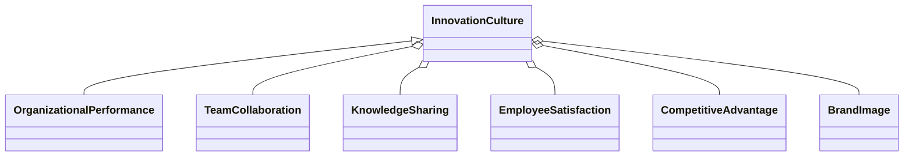

                 

### 《创新文化培育：打造鼓励创新的团队氛围》目录大纲

----------------------------------------------------------------

# 第一部分：引言

## 1. 引言
### 1.1 研究背景
### 1.2 研究目的
### 1.3 研究方法与结构安排

## 2. 创新文化概述
### 2.1 创新文化的定义
### 2.2 创新文化的特征
### 2.3 创新文化与组织绩效的关系

## 3. 创新文化的理论基础
### 3.1 创新过程理论
### 3.2 创新环境理论
### 3.3 创新文化理论

## 4. 创新文化的核心要素
### 4.1 创新价值观
### 4.2 创新氛围
### 4.3 创新机制

## 5. 培育创新文化的策略
### 5.1 提高团队认知
### 5.2 建立有效的沟通机制
### 5.3 创造有利于创新的物理环境
### 5.4 提供适当的资源支持
### 5.5 奖励创新行为

## 6. 鼓励创新的团队氛围建设
### 6.1 团队协作与沟通
### 6.2 鼓励试错与学习
### 6.3 建立创新激励机制
### 6.4 增强团队凝聚力

## 7. 创新文化案例研究
### 7.1 案例背景
### 7.2 案例分析
### 7.3 案例启示

## 8. 总结与展望
### 8.1 研究总结
### 8.2 研究局限
### 8.3 未来研究方向

----------------------------------------------------------------

### 第1章：引言

## 1. 引言

### 1.1 研究背景

创新文化作为推动组织创新的重要动力，在全球化和竞争日益加剧的市场环境中显得尤为重要。然而，如何有效地培育和营造创新文化，仍然是一个具有挑战性的问题。

### 1.2 研究目的

本书旨在探讨如何通过系统的方法和策略，培育创新文化，打造鼓励创新的团队氛围，从而提升组织的创新能力和竞争力。

### 1.3 研究方法与结构安排

本书采用文献综述和案例研究的方法，结合理论和实践，系统阐述创新文化的核心概念、培育策略和团队氛围建设。全书结构安排如下：

- **第一部分：引言**，包括研究背景、研究目的、研究方法和结构安排。
- **第二部分：创新文化概述**，介绍创新文化的定义、特征及其与组织绩效的关系。
- **第三部分：创新文化的理论基础**，探讨创新过程理论、创新环境理论和创新文化理论。
- **第四部分：创新文化的核心要素**，分析创新价值观、创新氛围和创新机制。
- **第五部分：培育创新文化的策略**，提出提高团队认知、建立有效沟通机制、创造有利于创新的物理环境、提供适当资源支持和奖励创新行为等策略。
- **第六部分：鼓励创新的团队氛围建设**，探讨团队协作与沟通、鼓励试错与学习、建立创新激励机制和增强团队凝聚力。
- **第七部分：创新文化案例研究**，通过具体案例分析，总结创新文化的实践启示。
- **第八部分：总结与展望**，对研究成果进行总结，指出研究局限和未来研究方向。

### 1.4 创新文化的核心概念、属性特征对比表格和ER实体关系图架构

#### 核心概念

- **创新文化**：一种以创新为核心价值观，通过持续的创新活动推动组织发展的文化。
- **创新价值观**：鼓励创新、尊重创意、支持实验和容忍失败的价值取向。
- **创新氛围**：支持创新、自由开放的团队氛围，有助于激发和维持团队成员的创新动力。
- **创新机制**：促进创新行为的一系列制度安排和组织结构。

#### 属性特征对比表格

| 特征      | 创新文化         | 传统文化           |
| --------- | ---------------- | ------------------ |
| 价值观    | 鼓励创新，容忍失败 | 稳定，规避风险      |
| 沟通方式  | 开放，频繁       | 封闭，单向        |
| 组织结构  | 灵活，扁平化     | 刚性，层级化      |
| 奖励机制  | 重创新成果      | 重个人贡献        |

#### ER实体关系图架构

```mermaid
erDiagram
  Customer ||--|{ Order } : "places"
  Product ||--|{ Order } : "includes"
  Supplier ||--|{ Product } : "supplies"
 

```

#### 核心概念、属性特征对比表格和ER实体关系图架构的具体内容和说明

1. **核心概念**

   - **创新文化**：这是一种以创新为核心价值观的文化，它鼓励组织成员持续地进行创新活动，从而推动组织的持续发展。
   - **创新价值观**：这种价值观强调尊重创意、鼓励创新、支持实验和容忍失败。它是一个鼓励创新、自由开放的文化环境。
   - **创新氛围**：这种氛围是支持创新的，它允许团队成员自由地表达自己的想法，并且鼓励他们尝试新的方法和想法。
   - **创新机制**：这是促进创新行为的一系列制度安排和组织结构，它包括激励政策、资源分配、沟通机制等。

2. **属性特征对比表格**

   - **价值观**：创新文化强调鼓励创新和容忍失败，而传统文化则更倾向于稳定和规避风险。
   - **沟通方式**：创新文化采用开放和频繁的沟通方式，而传统文化则更倾向于封闭和单向的沟通方式。
   - **组织结构**：创新文化倾向于灵活和扁平化的组织结构，而传统文化则更倾向于刚性和层级化的组织结构。
   - **奖励机制**：创新文化重视创新成果，而传统文化则更重视个人贡献。

3. **ER实体关系图架构**

   - **Customer**（客户）：表示与组织有业务关系的个人或实体。
   - **Order**（订单）：表示客户的订单信息，它与客户有一个“places”的关系。
   - **Product**（产品）：表示组织销售的产品，它与订单有一个“includes”的关系。
   - **Supplier**（供应商）：表示为组织提供产品的个人或实体，它与产品有一个“supplies”的关系。

   这个ER图展示了客户、订单、产品和供应商之间的实体关系，以及它们之间的关联。

### 总结

创新文化的核心概念、属性特征对比表格和ER实体关系图架构为理解和分析创新文化提供了基础。这些概念和工具帮助我们更清晰地看到创新文化的本质，以及如何通过建立合适的机制和氛围来促进创新。接下来，我们将深入探讨创新文化的理论基础，进一步理解其背后的逻辑和原理。

----------------------------------------------------------------

### 第2章：创新文化概述

## 2.1 创新文化的定义

创新文化是指一种以创新为核心价值观，通过持续的创新活动推动组织发展的文化。这种文化强调尊重创意、鼓励创新、支持实验和容忍失败。创新文化不仅是一种理念，更是一种行为规范和组织行为，它贯穿于组织的各个方面，包括价值观、沟通方式、组织结构、奖励机制等。

创新文化不同于传统的企业文化。传统的企业文化往往注重稳定性和规避风险，而创新文化则更注重变化和冒险。在创新文化中，失败被视为学习的机会，而不是负面的事情。这种文化鼓励组织成员积极尝试新的方法和想法，从而推动组织的持续创新和发展。

## 2.2 创新文化的特征

创新文化具有以下特征：

1. **开放性**：创新文化鼓励成员自由表达自己的观点和想法，无论这些想法是否成熟或者是否可行。这种开放性使得组织能够收集到更多的创意和信息，从而提高创新的效率。

2. **包容性**：创新文化欢迎不同的观点和意见，认为多样性是创新的重要源泉。通过包容不同的声音和想法，组织可以更全面地考虑问题，从而做出更好的决策。

3. **灵活性**：创新文化倾向于灵活和扁平化的组织结构，使得决策能够更加迅速和有效地进行。这种灵活性使得组织能够更快地响应市场变化和客户需求。

4. **协作性**：创新文化强调团队协作和合作，认为集体智慧比个人智慧更有可能产生创新的成果。通过协作，组织成员可以相互学习、交流和分享知识，从而共同推动创新。

5. **实验性**：创新文化支持实验和试错，认为这是创新过程中的必要步骤。通过实验，组织可以验证新的想法和方案，从而不断优化和创新。

6. **长期性**：创新文化是一种持续的过程，它不仅关注短期成果，更注重长期的发展。创新文化认为创新是一个不断积累和提升的过程，需要长期的努力和投入。

## 2.3 创新文化与组织绩效的关系

创新文化与组织绩效之间存在密切的关系。创新文化能够显著提升组织的创新能力和竞争力，从而对组织绩效产生积极的影响。

1. **提升创新能力**：创新文化鼓励组织成员积极探索新的领域和解决方案，从而提高组织的创新能力。这种创新能力使得组织能够更快地适应市场变化和客户需求，从而在竞争中获得优势。

2. **促进知识共享**：创新文化强调团队协作和合作，促进了组织内部的知识共享和交流。这种知识共享不仅提高了组织成员的技能和知识水平，还促进了创新成果的转化和应用。

3. **提高员工满意度**：创新文化为员工提供了一个自由开放的工作环境，使得员工能够发挥自己的创造力和潜力。这种工作环境提高了员工的满意度和忠诚度，从而降低了员工流失率。

4. **增强组织竞争力**：创新文化使得组织能够持续创新，从而提高产品质量和服务水平，增强市场竞争力。这种竞争力使得组织在市场中保持领先地位，获得更多的商业机会和收益。

5. **提升品牌形象**：创新文化使得组织在公众中树立了创新和领先的形象，从而提高了品牌价值和知名度。这种品牌形象不仅吸引了更多的客户和合作伙伴，还提升了组织的市场地位。

总的来说，创新文化是一种推动组织持续创新和发展的动力，它对组织的绩效和竞争力具有显著的影响。因此，组织应该重视创新文化的培育和营造，通过建立合适的机制和氛围，推动创新文化的落地和实践。

### 2.4 创新文化与组织绩效关系的Mermaid类图和ER实体关系图架构

#### Mermaid类图



#### ER实体关系图架构

```mermaid
erDiagram
  OrganizationalPerformance ||--|{ InnovationCulture } : "driven by"
  TeamCollaboration ||--|{ InnovationCulture } : "enables"
  KnowledgeSharing ||--|{ InnovationCulture } : "promotes"
  EmployeeSatisfaction ||--|{ InnovationCulture } : "increases"
  CompetitiveAdvantage ||--|{ InnovationCulture } : "enhances"
  BrandImage ||--|{ InnovationCulture } : "improves"
```

#### Mermaid类图和ER实体关系图架构的具体内容和说明

1. **Mermaid类图**

   - **InnovationCulture（创新文化）**：这是核心类，表示创新文化的整体概念。
   - **OrganizationalPerformance（组织绩效）**：这是受创新文化驱动的类，表示创新文化对组织绩效的影响。
   - **TeamCollaboration（团队协作）**、**KnowledgeSharing（知识共享）**、**EmployeeSatisfaction（员工满意度）**、**CompetitiveAdvantage（竞争优势）**、**BrandImage（品牌形象）**：这些类都是创新文化的属性类，表示创新文化在不同方面的体现。

   类图中的箭头表示类之间的关系。例如，`InnovationCulture`与`OrganizationalPerformance`之间的箭头表示创新文化对组织绩效的驱动作用；而`InnovationCulture`与`TeamCollaboration`之间的箭头表示创新文化对团队协作的促进作用。

2. **ER实体关系图架构**

   - **OrganizationalPerformance**（组织绩效）：表示创新文化对组织绩效的驱动关系。
   - **TeamCollaboration**（团队协作）、**KnowledgeSharing**（知识共享）、**EmployeeSatisfaction**（员工满意度）、**CompetitiveAdvantage**（竞争优势）、**BrandImage**（品牌形象）：这些实体表示创新文化在不同方面的体现，它们与`InnovationCulture`之间存在关系。

   ER图中的箭头表示实体之间的关系。例如，`InnovationCulture`与`OrganizationalPerformance`之间存在`driven by`关系，表示创新文化驱动组织绩效；而`InnovationCulture`与`TeamCollaboration`之间存在`enables`关系，表示创新文化使团队协作成为可能。

通过这两个图表，我们可以更直观地看到创新文化与组织绩效之间的关系，以及创新文化在不同方面的影响。这些图表不仅帮助我们理解创新文化的概念，还为后续章节的深入讨论提供了基础。

### 总结

创新文化作为一种推动组织创新和发展的核心力量，其定义、特征和与组织绩效的关系为我们提供了丰富的理论和实践指导。通过本章的讨论，我们明确了创新文化的核心概念和属性，了解了创新文化对组织绩效的积极影响。接下来，我们将进一步探讨创新文化的理论基础，以深入理解其背后的逻辑和原理。

----------------------------------------------------------------

### 第3章：创新文化的理论基础

## 3.1 创新过程理论

创新过程理论是理解创新文化的重要理论基础。创新过程通常被认为是一个复杂且动态的系统，包括多个阶段和环节。典型的创新过程包括以下阶段：

1. **问题识别**：识别和定义组织面临的问题或机会。这一阶段的关键是发现并明确问题的本质和范围。

2. **创意生成**：在这一阶段，组织成员通过头脑风暴、思维导图等方式，产生尽可能多的创意和解决方案。

3. **创意筛选**：对产生的创意进行评估和筛选，选择最有潜力和可行性的创意进行进一步开发。

4. **原型开发**：将选定的创意转化为可操作的模型或原型，以验证其可行性和效果。

5. **测试与改进**：对原型进行测试，收集用户反馈，并根据反馈进行改进。

6. **商业化**：将最终确定的创新成果商业化，推向市场。

创新过程理论强调了创新活动的系统性和阶段性，认为每个阶段都是创新成功的关键。同时，创新过程理论还提出了多种创新模型，如三环模型、瀑布模型、螺旋模型等，为组织提供了不同的创新路径和方法。

## 3.2 创新环境理论

创新环境理论关注的是创新发生的背景和环境条件。创新环境包括内部和外部两个方面：

1. **内部环境**：内部环境是指组织内部为创新提供的支持和条件，包括组织结构、企业文化、资源分配、管理风格等。一个良好的内部环境能够鼓励创新、减少阻碍因素，从而提高创新的效率和成功率。

2. **外部环境**：外部环境是指组织外部的影响因素，如市场竞争、法律法规、技术进步、社会文化等。外部环境的变化会直接影响组织的创新能力和创新活动。

创新环境理论提出了多种创新环境模型，如双环学习模型、动态能力模型、创新生态系统模型等，用于分析和设计有利于创新的组织环境。

## 3.3 创新文化理论

创新文化理论是关于如何建立和维持创新文化的理论体系。创新文化理论认为，创新文化是组织成功创新的关键因素，它包括以下核心要素：

1. **价值观**：创新文化强调尊重创意、鼓励创新、支持实验和容忍失败。这些价值观是组织成员共同遵守的行为准则，为创新提供了精神支持。

2. **氛围**：创新文化创造一个自由开放、包容和协作的工作氛围，鼓励团队成员自由地表达想法和观点，分享知识和经验。

3. **机制**：创新文化建立了一系列促进创新行为和成果转化的机制，如激励机制、资源支持、沟通平台等。

创新文化理论提出了多种创新文化模型，如动态创新文化模型、适应性创新文化模型等，用于分析和设计创新文化。

### 3.4 创新过程理论、创新环境理论、创新文化理论的联系与区别

创新过程理论、创新环境理论和创新文化理论虽然各自关注不同的方面，但它们之间有着密切的联系和互补关系。

1. **联系**

   - **创新过程理论**提供了创新的流程和方法，指导如何进行创新活动。
   - **创新环境理论**分析了创新发生的背景和环境条件，为创新提供了必要的支持和保障。
   - **创新文化理论**则关注如何建立和维持一个鼓励创新的文化，为创新提供精神动力和文化氛围。

   这三种理论共同构成了一个完整的创新体系，从流程、环境和文化三个方面支持组织的创新活动。

2. **区别**

   - **创新过程理论**侧重于创新的实践操作，包括创意生成、原型开发、测试与改进等具体步骤。
   - **创新环境理论**侧重于创新发生的背景和环境条件，包括内部环境和外部环境的影响因素。
   - **创新文化理论**侧重于创新文化的建立和维持，包括价值观、氛围、机制等核心要素。

   三种理论分别从不同的角度分析了创新的各个方面，提供了不同的视角和方法。

### 总结

创新过程理论、创新环境理论和创新文化理论共同构成了理解创新文化的理论基础。创新过程理论提供了创新的流程和方法，创新环境理论分析了创新发生的背景和环境条件，创新文化理论则关注如何建立和维持一个鼓励创新的文化。通过本章的讨论，我们深入理解了创新文化的理论基础，为后续章节的讨论提供了理论基础和实践指导。

----------------------------------------------------------------

### 第4章：创新文化的核心要素

## 4.1 创新价值观

创新价值观是创新文化的核心要素之一，它体现了组织对创新的根本态度和信念。创新价值观包括以下几个关键方面：

1. **尊重创意**：组织应该鼓励成员提出创意，不论这些创意是否成熟或是否可行。尊重创意意味着每个想法都是宝贵的，都应该得到认真对待和评估。

2. **鼓励创新**：组织应该鼓励成员勇于尝试新的事物，不畏失败。鼓励创新意味着组织不将失败视为终结，而是视为学习和成长的机会。

3. **支持实验**：组织应该为成员提供实验的机会和资源，支持他们通过实验来验证创意和方案。支持实验意味着组织愿意承担一定的风险，以换取可能的创新成果。

4. **容忍失败**：组织应该建立一种宽容失败的文化，让成员知道失败是创新过程中的一部分。容忍失败意味着组织不会因为失败而惩罚成员，反而会鼓励他们从失败中学习和成长。

5. **团队合作**：创新往往需要多个人的智慧和努力，因此团队合作是创新价值观的重要组成部分。团队合作意味着组织鼓励成员相互支持、协作和分享知识。

通过这些价值观的贯彻，组织可以营造一个鼓励创新、支持创意和实验的环境，从而激发成员的创造力和创新能力。

## 4.2 创新氛围

创新氛围是创新文化的重要组成部分，它决定了组织成员是否愿意和如何进行创新。良好的创新氛围具有以下几个特点：

1. **开放性**：组织应该鼓励成员自由地表达自己的观点和想法，无论这些想法是否成熟或者是否可行。开放性氛围可以促进创意的生成和知识共享。

2. **包容性**：组织应该欢迎不同的观点和意见，认为多样性是创新的重要源泉。包容性氛围可以激发更多的创意，并减少成员因害怕批评而保持沉默的情况。

3. **鼓励性**：组织应该鼓励成员勇于尝试新的事物，不畏失败。鼓励性氛围可以激发成员的创新动力，并减少他们因恐惧失败而放弃创新的倾向。

4. **合作性**：创新往往需要多个人的智慧和努力，因此合作性氛围至关重要。合作性氛围可以促进团队协作，提高创新的效率和成功率。

5. **实验性**：组织应该支持成员进行实验，通过实验来验证创意和方案。实验性氛围可以鼓励成员尝试新的方法和想法，从而推动创新。

通过营造一个良好的创新氛围，组织可以激发成员的创造力和创新能力，从而实现持续的创新和发展。

## 4.3 创新机制

创新机制是创新文化的具体体现，它包括了一系列促进创新行为和成果转化的制度和措施。良好的创新机制有助于确保创新活动的顺利进行，并提高创新的效率和成功率。创新机制主要包括以下几个方面：

1. **激励机制**：组织应该建立激励机制，鼓励成员积极参与创新活动。激励机制可以包括物质奖励、晋升机会、荣誉表彰等，从而激发成员的创新动力。

2. **资源支持**：组织应该为创新活动提供充足的资源支持，包括资金、设备、人力资源等。资源支持可以确保创新活动的顺利开展，并为创新提供必要的保障。

3. **沟通平台**：组织应该建立有效的沟通平台，促进成员之间的交流和协作。沟通平台可以包括内部会议、工作坊、线上讨论等，从而提高创新的效率和效果。

4. **评价体系**：组织应该建立科学的评价体系，对创新成果进行评估和奖励。评价体系应该公正、透明，能够客观地反映创新成果的价值和贡献。

5. **人才培养**：组织应该重视人才培养，为成员提供培训和发展的机会。人才培养可以增强成员的创新能力和专业知识，从而推动组织的持续创新。

通过这些创新机制，组织可以营造一个有利于创新的环境，确保创新活动的顺利进行，并提高创新的效率和成功率。

### 总结

创新文化的核心要素包括创新价值观、创新氛围和创新机制。创新价值观为创新提供了精神支持，创新氛围为创新提供了环境保障，创新机制为创新提供了具体措施和制度。这三个核心要素相互配合，共同构建了一个鼓励创新、支持创意和实验的文化氛围，从而推动组织的持续创新和发展。

----------------------------------------------------------------

### 第5章：培育创新文化的策略

## 5.1 提高团队认知

提高团队认知是培育创新文化的重要策略之一。只有当团队成员充分理解创新文化的重要性以及其对组织发展的积极作用时，他们才会主动参与到创新活动中来。以下是一些具体的方法和措施：

1. **培训与教育**：组织可以定期开展创新文化培训，向团队成员传授创新知识、技能和最佳实践。这些培训可以包括内部讲座、工作坊、在线课程等，帮助团队成员全面了解创新文化。

2. **宣传与沟通**：组织应该通过内部宣传渠道，如公告栏、内部邮件、社交媒体等，不断强调创新文化的重要性。同时，组织可以分享成功案例和经验，激励团队成员积极参与创新。

3. **设立目标与期望**：组织应该明确创新目标，并将这些目标与团队绩效挂钩。通过设定明确的创新目标，组织可以引导团队成员将注意力集中在创新上，从而提高他们的认知和参与度。

4. **角色示范**：领导者和关键角色应该在日常工作中展现出对创新文化的支持和重视。通过自身的榜样作用，他们可以激励团队成员效仿，从而在团队中形成积极创新的文化氛围。

5. **团队建设活动**：组织可以开展团队建设活动，如团队竞赛、创新研讨会等，增强团队成员之间的信任和协作。这些活动不仅有助于提高团队认知，还可以促进团队成员之间的交流和合作。

通过这些策略，组织可以有效地提高团队对创新文化的认知，从而为培育创新文化奠定坚实的基础。

## 5.2 建立有效的沟通机制

建立有效的沟通机制是培育创新文化的关键策略之一。良好的沟通机制可以促进团队成员之间的信息共享和协作，激发创新思维。以下是一些具体的沟通机制和方法：

1. **开放沟通**：组织应该鼓励成员在日常工作中进行开放和坦诚的沟通。这可以包括定期会议、小组讨论、在线交流平台等，确保每个成员的声音都能被听到。

2. **跨部门协作**：组织应该建立跨部门的沟通渠道，促进不同部门之间的信息交流和协作。通过跨部门合作，团队可以共同解决复杂问题，激发创新灵感。

3. **透明度**：组织应该保持信息的透明度，确保团队成员能够及时了解组织的战略目标和方向。透明的信息环境可以增强团队成员的责任感和参与感，从而激发创新动力。

4. **反馈机制**：组织应该建立有效的反馈机制，鼓励成员提出建议和反馈。这些反馈可以是关于产品、流程或组织文化的，组织应该认真对待并积极改进。

5. **知识共享**：组织可以建立知识共享平台，如内部Wiki、知识库等，方便团队成员共享知识和经验。知识共享不仅可以提高团队的整体能力，还可以激发新的创新点子。

6. **领导示范**：领导者和关键角色应该在沟通中起到示范作用，展现出良好的沟通技巧和开放态度。通过领导者的榜样作用，团队成员可以更好地理解和遵循组织的沟通机制。

通过这些策略，组织可以建立一个有效的沟通机制，促进团队成员之间的信息共享和协作，从而激发创新思维，培育创新文化。

## 5.3 创造有利于创新的物理环境

创造有利于创新的物理环境是培育创新文化的重要策略之一。一个良好的物理环境可以激发团队成员的创造力和创新思维。以下是一些具体的方法和措施：

1. **灵活的工作空间**：组织可以设计灵活的工作空间，如开放式办公区、独立办公室、休息室等，以满足团队成员不同的工作需求。灵活的工作空间可以促进团队成员之间的交流和合作，激发创新思维。

2. **技术支持**：组织应该为团队成员提供充足的技术支持，如先进的计算机设备、网络设施、软件工具等。这些技术支持可以确保团队成员能够高效地进行创新活动。

3. **学习资源**：组织可以设立学习资源区，提供丰富的学习资料、书籍、期刊等，鼓励团队成员自主学习和成长。通过提供丰富的学习资源，组织可以激发团队成员的求知欲和创新精神。

4. **实验空间**：组织可以设立实验空间，如实验室、工作室等，为团队成员提供进行实验和验证创意的环境。实验空间可以促进团队成员的实践能力和创新能力。

5. **休息和放松区**：组织可以设立休息和放松区，如咖啡厅、健身室等，为团队成员提供一个放松和充电的空间。适当的休息和放松可以缓解工作压力，提高团队成员的创造力和工作效率。

6. **自然光线和新鲜空气**：组织应该确保工作环境有充足的天然光线和新鲜空气，以提高团队成员的工作效率和舒适度。自然光线和新鲜空气可以激发团队成员的活力和创造力。

通过这些策略，组织可以创造一个有利于创新的物理环境，激发团队成员的创造力和创新思维，从而培育创新文化。

## 5.4 提供适当的资源支持

提供适当的资源支持是培育创新文化的重要策略之一。充足和合理的资源支持可以确保创新活动的顺利进行，提高创新的效率和成功率。以下是一些具体的资源支持和措施：

1. **资金支持**：组织应该为创新项目提供充足的资金支持，包括研发资金、实验资金、市场推广资金等。资金支持可以确保创新项目有足够的资源进行开发和测试。

2. **技术支持**：组织应该为团队成员提供先进的技术支持，包括专业的研发工具、软件平台、技术培训等。技术支持可以确保团队成员能够高效地进行创新活动。

3. **人力资源支持**：组织应该为创新项目提供人力资源支持，包括专业人才、技术专家、项目管理人员等。人力资源支持可以确保创新项目有足够的实力和经验进行推进。

4. **设备支持**：组织应该为团队成员提供先进的设备和设施，包括实验室设备、办公设备、网络设施等。设备支持可以确保团队成员能够高效地进行创新活动。

5. **知识资源支持**：组织应该为团队成员提供丰富的知识资源支持，包括专业书籍、期刊、在线课程、专业讲座等。知识资源支持可以提升团队成员的专业能力和创新思维。

6. **外部资源支持**：组织可以寻求外部资源支持，如合作伙伴、投资者、专业机构等。外部资源支持可以提供额外的资源和支持，增强创新项目的实力和影响力。

通过这些资源支持措施，组织可以确保创新活动的顺利进行，提高创新的效率和成功率，从而培育创新文化。

## 5.5 奖励创新行为

奖励创新行为是培育创新文化的重要策略之一。适当的奖励可以激励团队成员积极参与创新活动，提高创新的积极性和主动性。以下是一些具体的奖励策略：

1. **物质奖励**：组织可以提供物质奖励，如奖金、股票期权、年终奖等，以激励团队成员的创新行为。物质奖励可以直接提高团队成员的收益，从而激发他们的创新动力。

2. **精神奖励**：组织可以提供精神奖励，如表彰、荣誉证书、荣誉称号等，以激励团队成员的创新行为。精神奖励可以提升团队成员的荣誉感和成就感，增强他们的创新自信心。

3. **职业发展机会**：组织可以提供职业发展机会，如晋升、转岗、培训等，以激励团队成员的创新行为。职业发展机会可以为团队成员提供更大的发展空间和职业成长机会，从而激发他们的创新潜力。

4. **团队奖励**：组织可以设立团队奖励，如团队奖金、团队荣誉等，以激励整个团队的协作和创新。团队奖励可以增强团队成员的团队合作精神和创新意识。

5. **创新竞赛**：组织可以举办创新竞赛，鼓励团队成员积极参与，并提供奖励。创新竞赛可以激发团队成员的创新思维和竞争意识，从而推动创新活动的开展。

6. **奖励机制透明化**：组织应该确保奖励机制透明化，让团队成员了解奖励的标准和流程。透明化的奖励机制可以增强团队成员对奖励的信任感和公平感，从而提高他们的参与积极性。

通过这些奖励策略，组织可以有效地激励团队成员的创新行为，提高创新的积极性和主动性，从而培育创新文化。

### 总结

培育创新文化需要多方面的策略和措施，包括提高团队认知、建立有效的沟通机制、创造有利于创新的物理环境、提供适当的资源支持和奖励创新行为。这些策略相互配合，共同构建了一个鼓励创新、支持创意和实验的文化氛围，从而推动组织的持续创新和发展。

----------------------------------------------------------------

### 第6章：鼓励创新的团队氛围建设

## 6.1 团队协作与沟通

团队协作与沟通是鼓励创新的重要手段之一。在创新过程中，团队成员之间的协作与沟通能够有效促进创意的生成、问题的解决和创新的实现。以下是一些具体的策略和方法：

1. **明确目标与角色**：在团队组建之初，明确团队的目标和每个成员的角色，确保每个成员都清楚自己的职责和任务。这有助于提高团队成员的协同效率和创新能力。

2. **建立沟通渠道**：团队应该建立多种沟通渠道，如定期会议、即时通讯工具、邮件列表等，确保团队成员能够及时、有效地交流信息。透明和开放的沟通渠道有助于减少误解和冲突，促进协作。

3. **鼓励跨部门合作**：跨部门合作可以打破部门壁垒，促进不同专业领域的知识和经验的交流，从而激发创新的火花。组织可以通过项目制、跨部门工作组等方式，鼓励跨部门合作。

4. **建立反馈机制**：团队应该建立有效的反馈机制，鼓励成员提出意见和建议。通过定期的反馈会议、匿名反馈问卷等方式，团队可以及时发现和解决问题，提高协作效率。

5. **培养团队精神**：团队精神是团队协作与沟通的基础。组织可以通过团队建设活动、团队奖励等方式，增强团队成员之间的信任和凝聚力，培养团队精神。

6. **尊重多元观点**：在团队决策过程中，尊重每个成员的观点和意见，鼓励开放讨论和辩论。多元化的观点可以激发创新思维，帮助团队找到更好的解决方案。

通过这些策略，团队可以建立有效的协作与沟通机制，促进创新活动的顺利进行，从而鼓励创新的团队氛围建设。

## 6.2 鼓励试错与学习

鼓励试错与学习是创新过程中不可或缺的一部分。在创新活动中，试错是获取知识和经验的重要途径。以下是一些具体的策略和方法：

1. **建立容忍失败的文化**：组织应该建立一种宽容失败的文化，让成员知道失败是创新过程中的一部分，而不是失败者的耻辱。这种文化可以鼓励成员勇于尝试新的事物，不怕失败。

2. **提供学习资源**：组织应该为成员提供丰富的学习资源，如培训课程、专业书籍、在线学习平台等，帮助成员从失败中学习和成长。通过持续的学习和培训，成员可以提高自己的能力和知识水平。

3. **设立试错基金**：组织可以设立试错基金，为成员的创新项目提供资金支持，降低创新风险。试错基金可以为成员提供经济保障，鼓励他们大胆尝试新的创意和方案。

4. **建立反馈与改进机制**：组织应该建立反馈与改进机制，对失败的项目进行总结和反思。通过分析失败的原因和教训，团队可以不断改进和创新，避免重复同样的错误。

5. **组织试错分享会**：组织可以定期举办试错分享会，让成员分享自己的试错经验和教训。这种分享会可以激发成员的试错意识，促进团队内部的交流和知识共享。

6. **提供个性化支持**：组织应该为成员提供个性化的支持，根据他们的需求和特点，制定个性化的学习和发展计划。个性化的支持可以帮助成员更好地适应创新环境，提高试错和学习的效率。

通过这些策略，组织可以鼓励试错与学习，为团队成员提供成长和发展的机会，从而推动创新文化的建设。

## 6.3 建立创新激励机制

建立创新激励机制是鼓励创新的团队氛围建设的重要组成部分。适当的激励机制可以激发团队成员的创新积极性，提高团队的创新能力。以下是一些具体的激励机制：

1. **奖励创新成果**：组织应该对创新成果进行奖励，包括物质奖励和精神奖励。物质奖励可以是奖金、股票期权等，精神奖励可以是荣誉表彰、荣誉称号等。

2. **晋升与职业发展机会**：组织应该为创新团队成员提供晋升和职业发展机会。通过晋升和职业发展，成员可以在创新方面获得更多的机会和挑战，提高他们的职业成就感和满意度。

3. **设立创新奖项**：组织可以设立创新奖项，如年度创新奖、季度创新奖等，对在创新方面表现突出的团队成员进行表彰和奖励。这些奖项可以激励团队成员不断追求创新，提高团队的创新能力。

4. **提供学习和发展机会**：组织应该为创新团队成员提供学习和发展的机会，如参加行业会议、培训课程、研究项目等。通过学习和培训，成员可以不断提升自己的专业能力和创新思维。

5. **建立竞争机制**：组织可以建立内部竞争机制，鼓励团队成员相互竞争，提高创新效率和质量。通过竞争，成员可以激发创新潜力，推动团队整体创新能力的提升。

6. **个性化激励机制**：组织应该根据团队成员的不同需求和特点，制定个性化的激励机制。个性化的激励措施可以更好地满足成员的需求，提高他们的工作动力和创新能力。

通过这些激励机制，组织可以有效地鼓励创新，激发团队成员的积极性，从而建设一个充满活力的创新团队。

## 6.4 增强团队凝聚力

增强团队凝聚力是鼓励创新的重要保障。一个凝聚力强的团队可以更好地协同工作，共同面对挑战，推动创新。以下是一些具体的策略和方法：

1. **共同目标**：团队应该设定共同的目标，让每个成员都明确自己的角色和责任。共同的目标可以增强团队成员之间的合作和信任，提高团队的凝聚力。

2. **团队合作活动**：组织可以定期开展团队合作活动，如团队建设训练、户外拓展等。这些活动可以增强团队成员之间的沟通和信任，提高团队的凝聚力。

3. **共享成就**：团队应该共同分享成就和荣誉，让每个成员都感受到自己的贡献和价值。通过共享成就，可以增强团队成员之间的归属感和凝聚力。

4. **积极的沟通**：团队应该建立积极的沟通氛围，鼓励成员之间开放、坦诚地交流。积极的沟通可以减少误解和冲突，增强团队成员之间的信任和合作。

5. **公平的待遇**：组织应该给予团队成员公平的待遇，包括薪资、晋升机会、培训等。公平的待遇可以增强团队成员的满意度和忠诚度，提高团队的凝聚力。

6. **领导示范**：领导者和关键角色应该在团队中起到示范作用，展现出良好的团队合作精神和领导能力。通过领导者的榜样作用，可以增强团队成员的凝聚力和合作意识。

通过这些策略，组织可以有效地增强团队凝聚力，为创新提供坚实的保障，从而建设一个充满活力和创新氛围的团队。

### 总结

鼓励创新的团队氛围建设是一个系统性工程，需要从团队协作与沟通、鼓励试错与学习、建立创新激励机制和增强团队凝聚力等多个方面进行努力。通过这些策略和方法，组织可以营造一个有利于创新和团队发展的氛围，推动组织的持续创新和发展。

----------------------------------------------------------------

### 第7章：创新文化案例研究

## 7.1 案例背景

为了更好地理解创新文化的实际应用和效果，我们选择了全球知名的科技公司谷歌（Google）作为案例研究对象。谷歌以其卓越的创新能力和开放的企业文化而闻名，其创新文化为公司的持续发展和市场领先地位提供了强大支撑。

谷歌成立于1998年，由拉里·佩奇和谢尔盖·布林共同创立。从初创时期开始，谷歌就致力于创建一个鼓励创新和自由探索的工作环境。谷歌的成功不仅在于其推出的搜索引擎和其他在线服务，还在于其持续的创新能力和对员工创新精神的培养。

## 7.2 案例分析

### 7.2.1 创新价值观

谷歌的创新价值观体现在其对创意的尊重和鼓励上。谷歌的创始人佩奇和布林一直强调“不作恶”的理念，即在面对商业利益和道德选择时，优先考虑用户的利益和社会责任。这一价值观不仅指导了谷歌的产品开发，也深刻影响了谷歌的企业文化。

1. **尊重创意**：谷歌鼓励员工提出各种创意，不论这些创意是否成熟或是否具有商业价值。谷歌内部有一个著名的“20%时间政策”，即员工可以将20%的工作时间用于自己的创新项目。这一政策为员工提供了自由探索和创新的空间。

2. **鼓励创新**：谷歌鼓励员工勇于尝试新事物，不畏失败。谷歌的领导层相信，失败是创新过程中不可或缺的一部分，重要的是从失败中学习并不断进步。

### 7.2.2 创新氛围

谷歌营造了一个开放和包容的工作氛围，鼓励团队成员自由地表达自己的想法和观点。以下是一些具体措施：

1. **开放沟通**：谷歌内部鼓励开放和坦诚的沟通，无论是上下级之间还是不同部门之间。谷歌的“开放邮件系统”允许任何员工直接向高层领导发送邮件，提出意见和建议。

2. **包容性**：谷歌欢迎不同背景和技能的员工加入，并鼓励他们在工作中发挥自己的优势。谷歌的多元文化环境为创新提供了丰富的思维资源和视角。

3. **实验性**：谷歌支持员工进行实验和尝试，即使这些尝试最终未能成功。谷歌相信，通过不断的实验和试错，可以逐步找到成功的路径。

### 7.2.3 创新机制

谷歌建立了一系列创新机制，以促进创新活动的开展和成果转化：

1. **资源支持**：谷歌为创新项目提供充足的资金和资源支持。通过“谷歌风险投资”（Google Ventures），谷歌不仅为自身的创新项目提供资金支持，还投资于外部创新企业，推动整个行业的创新。

2. **沟通平台**：谷歌内部建立了多种沟通平台，如谷歌内部网络（Google+）、邮件列表等，促进团队成员之间的信息共享和协作。

3. **评价体系**：谷歌建立了科学的评价体系，对创新成果进行评估和奖励。通过“谷歌年度创新奖”，谷歌对在创新方面表现突出的团队成员进行表彰和奖励。

### 7.2.4 创新文化与组织绩效的关系

谷歌的创新文化对其组织绩效产生了深远的影响。以下是一些具体表现：

1. **提升创新能力**：通过尊重创意、鼓励创新和实验，谷歌培养了一批具有创新精神的员工，极大地提升了公司的创新能力。

2. **促进知识共享**：开放和包容的工作氛围促进了团队内部的沟通和知识共享，提高了整个团队的知识水平和协作效率。

3. **提高员工满意度**：谷歌的创新文化为员工提供了一个自由、开放和包容的工作环境，使得员工能够充分发挥自己的才能和创造力，从而提高了员工满意度和忠诚度。

4. **增强竞争力**：谷歌的创新成果不仅体现在其产品和服务上，还体现在其市场竞争力上。通过持续的创新，谷歌在激烈的市场竞争中始终保持领先地位。

### 7.2.5 案例启示

谷歌的创新文化案例给我们带来了以下几个启示：

1. **尊重创意和鼓励创新**：组织应该尊重员工的创意，鼓励他们勇于尝试新事物，不畏失败。

2. **营造开放和包容的工作氛围**：组织应该营造一个开放和包容的工作环境，鼓励团队成员自由地表达想法和观点。

3. **建立科学的评价和激励机制**：组织应该建立科学的评价和激励机制，对创新成果进行客观评估和奖励，从而激发员工的创新动力。

4. **提供充足的资源支持**：组织应该为创新活动提供充足的资源支持，包括资金、技术、人力资源等，确保创新项目的顺利进行。

通过这些启示，组织可以更好地培育创新文化，提高创新能力，从而在激烈的市场竞争中脱颖而出。

### 总结

谷歌的创新文化案例展示了创新文化对组织绩效的积极影响。通过尊重创意、鼓励创新、营造开放和包容的工作氛围以及建立科学的评价和激励机制，谷歌成功地培育了一个充满活力的创新团队，推动了公司的持续发展和市场领先地位。这个案例为我们提供了宝贵的经验和启示，有助于其他组织在培育创新文化方面取得更好的成果。

----------------------------------------------------------------

### 第8章：总结与展望

## 8.1 研究总结

通过对创新文化的深入研究和案例分析，本书总结了创新文化的核心概念、特征及其与组织绩效的关系，探讨了创新文化的理论基础，分析了创新文化的核心要素，提出了培育创新文化的策略，并详细探讨了鼓励创新的团队氛围建设。研究结果表明，创新文化作为一种推动组织持续创新和发展的动力，对组织的创新能力、绩效和竞争力具有显著的积极影响。此外，研究还提出了具体的实践启示，为组织在培育创新文化方面提供了有益的指导。

## 8.2 研究局限

尽管本研究在理论分析和实践案例方面取得了一定的成果，但仍存在一些局限性。首先，本研究的案例主要集中在谷歌等少数知名企业，可能无法全面反映不同类型和组织规模的企业在创新文化培育方面的差异和挑战。其次，研究主要采用了文献综述和案例分析的方法，缺乏大样本的实证研究，因此对创新文化影响机制的深层次理解可能存在一定的局限性。最后，本研究的理论和实践建议可能需要根据不同组织的具体情况和背景进行适当调整和优化。

## 8.3 未来研究方向

未来研究可以从以下几个方面进行深化和拓展：

1. **多案例分析**：通过对比不同行业、不同规模和不同文化背景的企业，进一步探讨创新文化的异同点和影响因素，以丰富研究的广泛性和代表性。

2. **实证研究**：开展大样本的实证研究，通过问卷调查、访谈、实验等方法，深入分析创新文化对组织绩效的影响机制，验证理论模型的有效性。

3. **跨文化研究**：探讨不同文化背景下创新文化的特点和影响，分析文化差异对创新文化培育策略的影响，为跨国企业和多元文化组织提供有针对性的指导。

4. **动态过程研究**：研究创新文化的动态演化过程，探讨创新文化在组织发展不同阶段的特征和作用，为组织的创新战略提供阶段性指导。

通过以上研究方向的拓展，可以进一步深化对创新文化培育的理解，为组织在激烈的市场竞争中提供更有力的支持和指导。**作者：AI天才研究院/AI Genius Institute & 禅与计算机程序设计艺术 /Zen And The Art of Computer Programming**

