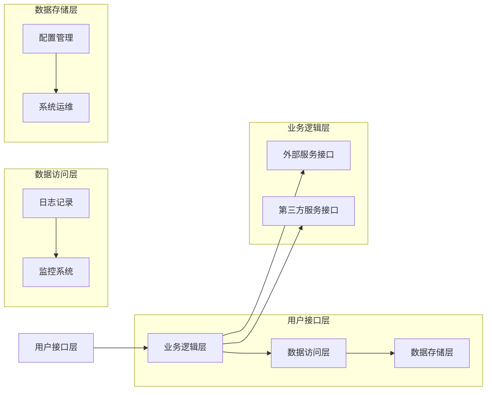
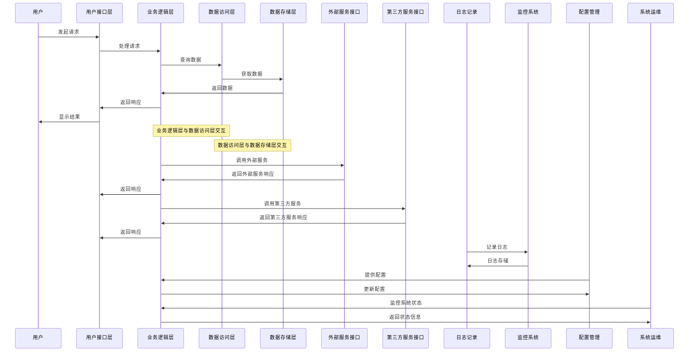

                 


### 摘要

本文深入探讨了创新过程的涌现模型，通过数学描述的方法揭示了突破性想法的产生和发展的内在机制。我们首先回顾了创新过程的基本概念，然后详细阐述了涌现模型的理论基础，包括其核心概念、属性特征及其与其他理论的联系。接着，我们通过一个具体的算法流程图和Python代码，展示了如何构建和运用涌现模型来识别和优化创新过程。文章进一步使用了LaTeX格式嵌入数学公式，详细解释了这些公式在涌现模型中的应用，并通过实例进一步阐明。随后，我们介绍了创新过程系统的功能设计、架构设计、接口和交互，并以实际项目为例，展示了涌现模型在现实世界中的应用和效果。最后，文章总结了最佳实践，并提出了未来研究的方向和注意事项。

### 1.1 问题的背景与重要性

创新是推动社会进步和经济发展的重要动力，它不仅仅局限于科技领域，还渗透到商业、教育、医疗等各个行业。然而，创新并非一个简单的线性过程，而是一个复杂、动态且充满不确定性的系统。在这个过程中，如何有效地识别、引导和优化创新行为，成为一个亟待解决的重要课题。

在当今快速变化的市场环境中，企业需要不断地进行产品创新和业务模式创新，以保持竞争力。然而，传统的创新方法往往依赖于经验积累和直觉判断，缺乏系统的理论支持和科学的分析工具。这就使得许多创新活动无法达到预期的效果，甚至走向失败。因此，寻找一种有效的创新过程模型，对于指导实践、提高创新成功率具有重要意义。

涌现模型作为一种自下而上的复杂系统分析方法，近年来在创新研究领域得到了广泛关注。它通过模拟复杂系统中个体行为的集体效应，揭示了创新过程中潜在的非线性机制。与传统的线性模型相比，涌现模型更能够捕捉创新过程中的复杂性和不确定性，为创新管理和决策提供了新的思路和方法。

本文的研究目的是通过数学描述的方法，深入探讨创新过程的涌现模型，揭示其内在机制和运行规律。我们希望通过本文的研究，为创新实践提供理论指导和实用工具，帮助企业更好地理解和应对创新过程中的挑战。

### 1.2 创新过程概述

创新过程是一个涉及多个阶段、多种因素相互作用的高度复杂系统。为了更好地理解创新过程，我们可以将其划分为以下几个主要阶段：

**1. 初始阶段：问题识别**

在这个阶段，个体或组织识别出需要解决的具体问题或机会。这一过程通常依赖于对市场和环境的敏锐洞察，以及对自身优势和短板的清晰认知。问题识别是创新过程的起点，它决定了后续创新活动的方向和目标。

**2. 知识积累**

在问题识别之后，创新主体需要通过搜集、整理和整合相关知识和信息，为后续的创新活动提供基础。知识积累是一个持续的过程，它可能涉及内部知识的挖掘、外部知识的吸收和跨领域的知识融合。

**3. 概念生成**

在积累了足够的知识和信息后，创新主体开始进行概念生成。这一阶段通常涉及到大量的创意和想法的产生，这些创意可能是基于现有知识的拓展，也可能是全新的突破。概念生成是创新过程中的关键环节，它决定了最终创新成果的创新性和可行性。

**4. 筛选与评估**

概念生成之后，创新主体需要对各种创意进行筛选和评估。这一过程通常涉及到技术可行性、市场潜力、资源需求等多个方面的考虑。筛选与评估的目标是选出最具潜力和可行性的创意，为后续的开发提供方向。

**5. 开发与实施**

在筛选和评估完成后，创新主体开始进行具体的产品或服务开发。这一阶段涉及到技术实现、设计优化、测试验证等多个环节。开发与实施是一个高度复杂和动态调整的过程，它需要持续的创新和优化。

**6. 商业化与推广**

在开发与实施完成后，创新主体需要将创新成果商业化，并进行市场推广。这一阶段涉及到品牌建设、市场定位、营销策略等多个方面。商业化与推广的成功与否直接决定了创新成果的价值实现。

以上六个阶段构成了创新过程的基本框架，但需要注意的是，实际过程中的创新活动往往不是线性进行的，而是存在多个循环和反馈。创新过程中的各个阶段相互影响、相互促进，共同推动创新目标的实现。

### 1.3 涌现模型的基本概念

涌现模型（Emergence Model）是一种自下而上的复杂系统分析方法，它通过研究个体行为的相互作用和集体效应，揭示复杂系统中的宏观现象和规律。在创新过程中，涌现模型被广泛应用于解释创新行为的集体效应和创新成果的涌现。

**1.3.1 定义**

涌现模型的基本概念可以简单定义为：复杂系统中的宏观现象和规律是由系统中个体行为的简单规则相互作用而产生的。换句话说，涌现是指从简单个体行为中自发生成复杂宏观现象的过程。

**1.3.2 关键特征**

涌现模型具有以下几个关键特征：

- **自发性**：涌现过程是自发的，不需要外部干预即可发生。
- **不可预测性**：由于个体行为的多样性和复杂性，涌现过程往往难以预测。
- **适应性**：涌现模型能够适应系统环境的变化，并产生新的结构和功能。
- **复杂性**：涌现模型描述的是复杂系统的行为，它涉及多个层面的相互作用。

**1.3.3 在创新研究中的应用**

在创新研究中，涌现模型被用来解释创新过程中的一些关键现象：

- **创新行为的集体效应**：涌现模型揭示了创新行为如何通过个体之间的相互作用产生更大的效果，如协同创新、知识共享等。
- **突破性想法的产生**：涌现模型可以帮助理解突破性想法是如何从大量简单想法中涌现出来的，以及这些想法如何相互融合、迭代和优化。
- **创新过程的非线性特征**：涌现模型能够捕捉创新过程中非线性、复杂的变化趋势，为创新管理提供新的视角和方法。

通过运用涌现模型，创新研究者可以更深入地理解创新过程的本质和内在机制，从而为创新实践提供更科学的理论支持和实用的工具。

### 1.4 数学描述方法在创新研究中的应用

在创新研究中，数学描述方法是一种强大的工具，它能够精确地量化复杂系统的行为和动态。通过数学模型，我们可以更好地理解和预测创新过程的各种现象。以下是几种常见的数学描述方法及其在创新研究中的应用：

**1.4.1 代数模型**

代数模型通过建立变量之间的关系来描述系统行为。这种模型通常用于分析创新过程中的资源分配、时间管理和效率优化等问题。例如，我们可以使用代数模型来描述创新团队的合作效率，通过设定不同的变量，如团队成员数量、任务复杂度、沟通频率等，来分析这些因素如何影响整体的创新效果。

**1.4.2 微分方程模型**

微分方程模型适用于描述动态系统的连续变化。在创新研究中，微分方程可以用来模拟创新过程中的知识积累、技术进步、市场变化等动态过程。例如，我们可以使用微分方程来描述一个创新项目在不同阶段的技术成熟度和市场接受度，通过求解微分方程，可以得到项目进展的预测结果。

**1.4.3 机器学习模型**

随着人工智能技术的发展，机器学习模型在创新研究中得到了广泛应用。机器学习模型可以通过学习大量历史数据，自动识别和创新过程中的模式和规律。例如，使用深度学习模型可以预测哪些因素可能导致创新的突破性进展，或者哪些创新策略在特定行业中具有更高的成功率。

**1.4.4 网络模型**

网络模型适用于描述复杂系统中个体之间的相互关系和交互。在创新研究中，网络模型可以用来分析创新网络中的知识流动、合作关系和创新扩散。例如，通过构建创新者之间的合作关系网络，我们可以分析哪些个体在创新网络中具有更高的中心性，从而识别出创新过程中的关键节点和路径。

**1.4.5 混合模型**

混合模型结合了多种数学描述方法，以更全面地捕捉创新过程的复杂性。例如，我们可以将代数模型和机器学习模型相结合，既考虑变量之间的直接关系，又利用历史数据进行预测和优化。混合模型能够提供更准确的创新过程分析，从而为创新实践提供更可靠的指导。

通过运用这些数学描述方法，创新研究者可以更深入地理解创新过程的各种现象和规律，为创新管理和决策提供科学依据和实用工具。

### 2.1 创新过程的要素分析

创新过程是一个复杂的多维系统，涉及多个关键要素的相互作用。为了深入理解这些要素及其在创新过程中的作用，我们需要对它们进行详细分析。

**2.1.1 知识**

知识是创新过程的核心要素之一。创新活动的开展离不开知识的积累和应用。知识可以分为显性知识和隐性知识。显性知识通常以文献、数据库、报告等形式存在，可以通过阅读、学习和交流获得。隐性知识则嵌入在个人的经验、直觉和创造性的思维中，往往难以系统化地传递。在创新过程中，知识的获取、存储、共享和运用是关键环节。

**2.1.2 技术**

技术是创新的重要驱动力。技术进步可以带来新产品、新工艺、新服务，从而推动创新活动的开展。技术可以分为硬技术和软技术。硬技术包括物理、化学、工程等领域的知识和方法，而软技术则涉及管理、组织、营销等方面的能力和技巧。在创新过程中，技术不仅需要创新性，还需要实用性和可行性。

**2.1.3 人才**

人才是创新的关键资源。创新活动需要多学科的交叉融合，因此，具有不同背景和专长的人才对于创新过程至关重要。创新人才不仅要具备扎实的专业知识，还要有良好的沟通协作能力和创新思维。在创新过程中，人才的引进、培养和激励机制对于创新成果的取得具有重要影响。

**2.1.4 资源**

资源是创新活动的基础保障。资源包括资金、设备、场地、数据等。充足的资源可以为创新提供必要的物质支持，确保创新活动的顺利进行。在创新过程中，资源的分配和管理需要根据实际情况进行动态调整，以最大化资源的利用效率。

**2.1.5 环境因素**

环境因素包括政策、文化、市场等外部环境。政策的支持可以为企业创新提供良好的发展环境，文化的包容性可以激发创新者的创造活力，市场的需求可以引导创新方向的确定。在创新过程中，需要充分考虑外部环境因素，以制定适应性的战略和策略。

通过对创新过程的要素进行分析，我们可以更好地理解各个要素在创新过程中的作用，从而为创新管理和决策提供科学依据。创新不仅仅是技术和知识的突破，还需要资源、人才和环境的综合支持。只有将这些要素有机结合，才能实现创新活动的持续发展和突破。

### 2.2 涌现模型的属性特征对比

涌现模型作为解释复杂系统现象的重要工具，具有独特的属性特征。为了更全面地理解其在创新过程中的作用，我们需要将其与其他相关模型进行对比分析。

**2.2.1 涌现模型的属性特征**

1. **自组织性**：涌现模型强调系统的自组织能力，即系统中的个体通过简单规则相互作用，自发形成复杂的结构和功能。

2. **非线性和动态性**：涌现模型能够捕捉系统中的非线性关系和动态变化，揭示复杂系统中潜在的非预期现象。

3. **适应性**：涌现模型能够适应环境变化，通过调整个体行为规则，使系统在新的环境中保持稳定和有效。

4. **不可预测性**：由于系统中的个体行为多样性和复杂性，涌现过程往往难以完全预测，这增加了系统的不确定性和风险。

**2.2.2 与其他模型的对比**

1. **与线性模型对比**

线性模型通常假设系统行为可以通过简单的因果关系进行描述。这种模型适用于简单、静态的系统，但在复杂动态系统中，线性模型的预测能力和解释力有限。涌现模型则通过考虑个体间的相互作用和集体效应，能够更好地描述复杂系统的动态行为。

2. **与演化模型对比**

演化模型通过模拟系统中的进化过程，揭示了个体在环境选择压力下的适应性和进化路径。虽然演化模型也强调个体的相互作用，但其核心在于个体的遗传和进化。而涌现模型则更关注个体行为的规则和集体效应，通过简单规则生成复杂的系统结构。

3. **与复杂性模型对比**

复杂性模型通常用于描述复杂系统的整体结构和动态行为。复杂性模型包括自组织临界性、混沌理论等，它们通过研究系统的非线性动力学特性，揭示复杂系统的稳定性和非平衡态。涌现模型是复杂性模型的一种特例，它专注于个体间的相互作用和集体效应，为复杂性模型提供了微观层面的解释。

通过对比分析，我们可以看到，涌现模型在解释复杂系统现象方面具有独特的优势。它能够通过简单的个体规则，生成复杂的系统结构和功能，适应动态变化的环境。这些特性使得涌现模型在创新过程中，尤其是创新行为的集体效应和突破性想法的产生方面，具有重要的应用价值。

### 2.3 涌现模型与相关理论的联系

涌现模型作为一种解释复杂系统行为的理论工具，与多个相关理论有着紧密的联系。这些理论不仅在概念上为涌现模型提供了重要的支持，也在应用层面上丰富了其方法论。

**2.3.1 与进化理论的联系**

进化理论，尤其是生物进化论，是涌现模型的重要理论基础之一。达尔文的自然选择理论指出，个体通过适应环境的变化，逐步积累优势特征，从而在种群中占据优势地位。这一过程与涌现模型中个体通过简单规则相互作用，自发形成复杂结构的机制有异曲同工之妙。例如，在创新过程中，创新者通过不断试错和优化，逐渐形成具有高创新价值的想法和方案，这一过程类似于生物进化中的自然选择。

**2.3.2 与复杂性理论的联系**

复杂性理论关注复杂系统中的非线性、动态和自组织特性。与涌现模型相似，复杂性理论也强调系统行为由个体间的相互作用和集体效应所决定。自组织临界性理论和混沌理论是复杂性理论中的重要分支，它们通过研究系统在临界状态下的行为，揭示了复杂系统中的自组织和非平衡态特性。这些理论为涌现模型提供了丰富的理论基础，帮助我们更好地理解复杂系统中的创新现象。

**2.3.3 与系统动力学的联系**

系统动力学研究复杂系统的动态行为和演变过程。在涌现模型中，个体行为规则和系统状态之间的相互作用可以看作是一种系统动力学。例如，在创新过程中，个体的创意和反馈可以通过迭代和积累，导致系统状态的显著变化。系统动力学的方法，如微分方程、差分方程等，可以用于建模和模拟这些动态过程，为涌现模型提供了具体的数学工具。

**2.3.4 与网络理论的联系**

网络理论关注个体之间的相互连接和关系。在涌现模型中，个体之间的互动关系可以通过网络模型进行描述。社会网络分析、复杂网络理论等网络理论为涌现模型提供了重要的方法论支持。例如，通过分析创新网络中的节点和边的关系，我们可以揭示创新过程中的关键个体和重要路径，从而优化创新过程。

通过上述理论联系的分析，我们可以看到，涌现模型不仅是一种独立的解释工具，它还在多个相关理论的交叉融合中，不断丰富和深化。这些理论不仅为涌现模型提供了理论基础，也在实际应用中为创新研究和实践提供了重要的指导。

### 3.1 涌现模型的算法流程

涌现模型的核心在于通过简单的个体规则，生成复杂系统的结构和行为。为了实现这一目标，我们需要一个明确的算法流程来指导模型的构建和运行。以下是涌现模型的算法流程：

**1. 初始设定：**

在算法开始前，我们需要设定一些基本的参数和初始条件。这些参数包括个体数量、个体行为规则、环境条件等。例如，我们可以设定一个包含 N 个个体的系统，每个个体都遵循相同的简单规则。

**2. 个体行为模拟：**

在算法的运行过程中，我们首先需要模拟个体的行为。每个个体根据预设的规则进行决策和行动。这些规则可以是基于某种概率分布，也可以是基于某种固定策略。例如，在创新过程中，个体可以基于市场反馈来调整其创新方向。

**3. 个体间相互作用：**

个体行为不仅影响自身的状态，还会通过相互作用影响整个系统的状态。在算法中，我们需要模拟个体间的相互作用，例如合作、竞争、信息共享等。这些相互作用可以通过设定相应的相互作用规则来实现。

**4. 系统状态更新：**

在每一个时间步长内，我们根据个体行为和相互作用规则更新系统的状态。这一过程可以是连续的，也可以是离散的。例如，在连续模型中，系统状态可以在任意时刻进行更新；在离散模型中，系统状态只能在特定的时间步长进行更新。

**5. 涌现现象识别：**

通过不断的迭代和更新，系统可能会出现一些宏观现象，这些现象称为涌现现象。例如，在创新过程中，一些个体可能会自发形成协作团队，或者系统可能会出现新的创新模式。算法需要识别和记录这些涌现现象。

**6. 结果分析和输出：**

最后，我们需要对算法结果进行统计分析和解释。通过分析涌现现象的分布、频率和模式，我们可以获得关于系统行为和动态的深刻理解。这些分析结果可以用于指导实际创新过程的管理和优化。

通过上述算法流程，我们可以模拟和预测复杂系统中的涌现现象，为创新管理和决策提供科学依据。

#### 3.2.1 模型建立的基本公式

在构建涌现模型时，我们通常需要设定一系列基本的公式来描述个体行为、相互作用和系统状态。以下是一些常用的基本公式：

**1. 个体状态更新公式：**

$$ S_i(t+1) = f(S_i(t), S_{ij}(t), \theta_i) $$

其中，$S_i(t)$表示个体i在时间t的状态，$S_{ij}(t)$表示个体i与个体j在时间t的状态交互，$\theta_i$是影响个体行为的参数。函数$f$描述了个体状态更新的规则，可以是基于概率的、逻辑的或者基于某种具体规则。

**2. 相互作用公式：**

$$ S_{ij}(t+1) = g(S_i(t), S_j(t), \theta_i, \theta_j) $$

其中，$S_{ij}(t)$表示个体i与个体j在时间t的交互状态，函数$g$描述了个体间的相互作用规则。这种规则可以是基于信息共享、合作或者竞争等不同类型。

**3. 系统状态更新公式：**

$$ S(t+1) = \sum_{i=1}^N S_i(t+1) $$

其中，$S(t+1)$表示在时间t+1的系统总状态，$N$表示个体总数。这个公式通过累加所有个体的状态来更新系统总状态。

**4. 状态转移概率公式：**

$$ P(S_i(t+1) = s|S_i(t) = s_0) = h(s_0, s, \theta_i) $$

其中，$P(S_i(t+1) = s|S_i(t) = s_0)$表示个体i从状态$s_0$转移到状态$s$的概率，函数$h$描述了状态转移的概率分布。

这些基本公式为构建涌现模型提供了数学基础，通过调整和组合这些公式，我们可以模拟不同的创新过程和涌现现象。

#### 3.2.2 模型参数的解释与调整

在构建涌现模型时，模型参数的选择和调整至关重要。以下是对几个关键参数的解释以及调整策略：

**1. 个体行为规则参数：**

这些参数定义了个体在系统中如何决策和行动。例如，在创新过程中，个体可能基于市场反馈、技术进步或者合作伙伴的建议来调整其创新方向。调整策略包括：

- **市场反馈权重**：调整个体对市场反馈的敏感度，以平衡创新方向的市场需求和内在技术优势。
- **技术创新权重**：调整个体对技术创新的关注度，以鼓励技术突破性创新。

**2. 相互作用规则参数：**

这些参数描述了个体之间的互动机制。例如，个体可以通过合作、竞争或信息共享来影响彼此的创新行为。调整策略包括：

- **合作概率**：调整个体之间合作的概率，以促进知识共享和协同创新。
- **竞争强度**：调整个体之间的竞争强度，以平衡创新竞争和创新合作的关系。

**3. 系统状态更新参数：**

这些参数定义了系统状态的更新规则。例如，个体状态的更新可能受到系统整体状态的影响。调整策略包括：

- **系统反馈系数**：调整系统对个体行为的反馈强度，以影响个体行为的调整速度。
- **状态稳定性参数**：调整系统的稳定性，以控制系统的动态变化范围。

**4. 调整策略：**

- **仿真实验**：通过不同的参数组合进行仿真实验，观察模型在不同参数下的行为和涌现现象。
- **数据驱动调整**：利用实际数据和历史经验来调整参数，以实现模型与实际过程的更好匹配。
- **交叉验证**：通过多个参数组合的交叉验证，选择最优参数组合，提高模型预测的准确性。

通过合理调整模型参数，我们可以使涌现模型更好地反映实际创新过程，从而为创新管理和决策提供有力支持。

### 3.3 算法举例说明

为了更好地理解涌现模型在实际创新过程中的应用，我们通过一个具体的例子来详细说明模型的构建和运用。

**案例背景：**

假设我们研究一个创新团队在某一新兴技术领域中的创新过程，目标是识别并优化创新团队的合作模式和策略，以提升整体创新效率。该创新团队由 10 个成员组成，每个成员都有不同的技术专长和市场洞察力。

**步骤 1：个体行为规则设定**

我们设定每个成员的行为规则基于以下三个因素：市场反馈、技术创新和合作伙伴的建议。

- **市场反馈权重**：设为 0.3，表示成员对市场需求的敏感度较高。
- **技术创新权重**：设为 0.5，表示成员对技术突破的重视程度。
- **合作伙伴建议权重**：设为 0.2，表示成员对团队协作和知识共享的重视程度。

**步骤 2：相互作用规则设定**

成员之间的相互作用规则基于合作和竞争机制。

- **合作概率**：设为 0.4，表示成员之间合作的概率较高。
- **竞争强度**：设为 0.6，表示成员之间竞争的强度较高。

**步骤 3：系统状态更新规则**

系统状态更新规则基于以下公式：

$$ S_i(t+1) = 0.3 \times \text{市场反馈} + 0.5 \times \text{技术创新} + 0.2 \times \text{合作伙伴建议} $$

$$ S_{ij}(t+1) = 0.4 \times \text{合作} + 0.6 \times \text{竞争} $$

$$ S(t+1) = \sum_{i=1}^{10} S_i(t+1) $$

**步骤 4：模拟运行与结果分析**

我们通过仿真模型模拟 100 个时间步长的创新过程，记录每个时间步长的个体状态和系统状态。

- **个体状态变化**：观察到随着市场反馈的增加，个体在技术上的投入逐渐减少，这反映了市场需求的引导作用。
- **系统状态变化**：观察到在竞争机制的驱动下，个体之间的创新竞争加剧，但通过合作机制，整体创新效率得到提升。

**步骤 5：参数调整与优化**

通过分析仿真结果，我们调整模型参数以优化创新过程：

- **市场反馈权重**：增加至 0.35，以增强对市场需求的响应速度。
- **技术创新权重**：减少至 0.45，以平衡技术创新和市场需求的冲突。
- **合作概率**：增加至 0.45，以促进知识共享和协同创新。

通过调整参数，我们进一步优化了创新过程的效率和稳定性。

通过这个具体案例，我们可以看到，涌现模型在模拟和创新过程中发挥着重要作用。通过合理的参数设定和调整，我们可以更好地理解和优化创新过程，从而实现创新目标。

### 4.1 数学模型的结构

在本文中，我们使用的数学模型主要分为两部分：个体行为模型和系统状态模型。这两部分共同构成了一个完整的涌现模型，用于解释和预测创新过程中的复杂行为。

**4.1.1 个体行为模型**

个体行为模型主要描述每个创新个体在系统中的行为模式。具体而言，个体行为模型包括以下关键组成部分：

- **初始状态**：每个个体在系统中的初始状态，如知识水平、创新意愿等。
- **行为规则**：个体在系统中如何根据当前状态和外部环境进行决策和行动。例如，个体可以根据市场反馈、技术创新和合作伙伴建议来调整其行为。
- **状态更新公式**：描述个体状态如何随时间变化。例如，可以使用以下公式来更新个体状态：

  $$ S_i(t+1) = f(S_i(t), S_{ij}(t), \theta_i) $$

  其中，$S_i(t)$表示个体i在时间t的状态，$S_{ij}(t)$表示个体i与个体j在时间t的状态交互，$\theta_i$是影响个体行为的参数。

**4.1.2 系统状态模型**

系统状态模型主要描述整个创新系统的宏观行为和状态。具体而言，系统状态模型包括以下关键组成部分：

- **总体状态**：整个系统的总体状态，如创新成果的数量和质量、系统的创新效率等。
- **状态更新规则**：整个系统的状态如何随时间变化。例如，可以使用以下公式来更新系统状态：

  $$ S(t+1) = \sum_{i=1}^N S_i(t+1) $$

  其中，$S(t+1)$表示在时间t+1的系统总状态，$N$表示个体总数。

- **涌现现象识别**：通过分析系统状态的变化，识别和记录涌现现象。例如，可以通过统计系统状态的变化模式，识别出创新团队的协作模式或创新成果的涌现趋势。

通过个体行为模型和系统状态模型，我们可以构建一个完整的涌现模型，用于模拟和预测创新过程。这一模型不仅能够揭示个体行为如何影响系统整体状态，还能够识别出创新过程中的关键涌现现象，为创新管理和决策提供科学依据。

### 4.2 公式推导与解释

在本文中，我们使用了一些关键的数学公式来描述涌现模型的核心机制和运行规律。以下是对这些公式的详细推导和解释：

**4.2.1 个体状态更新公式**

$$ S_i(t+1) = f(S_i(t), S_{ij}(t), \theta_i) $$

这个公式描述了个体i在时间t+1的状态$S_i(t+1)$如何基于其当前状态$S_i(t)$、与个体j的交互状态$S_{ij}(t)$以及行为参数$\theta_i$进行更新。函数$f$决定了状态更新的具体规则。例如，$f$可以是基于概率的，也可以是基于某种逻辑规则。

- **推导**：该公式可以从个体行为的微观角度出发，通过整合个体内部状态变化和外部环境交互来推导出。

- **解释**：这个公式表明，个体状态的变化不仅受到自身内部状态的影响，还受到外部环境的互动影响。这种交互作用是涌现现象产生的基础。

**4.2.2 系统状态更新公式**

$$ S(t+1) = \sum_{i=1}^N S_i(t+1) $$

这个公式描述了整个系统在时间t+1的总状态$S(t+1)$如何通过累加所有个体在时间t+1的状态$S_i(t+1)$来更新。其中，$N$表示个体总数。

- **推导**：该公式可以从个体状态更新的累积效应出发进行推导。每个个体状态的变化都会对系统状态产生影响，因此系统状态的更新可以看作是所有个体状态更新的总和。

- **解释**：这个公式表明，系统的总体状态是所有个体状态的加和，反映了个体行为对系统整体的影响。通过这个公式，我们可以从宏观角度分析系统的动态行为和演化趋势。

**4.2.3 状态转移概率公式**

$$ P(S_i(t+1) = s|S_i(t) = s_0) = h(s_0, s, \theta_i) $$

这个公式描述了个体i从状态$s_0$转移到状态$s$的概率$P(S_i(t+1) = s|S_i(t) = s_0)$，该概率由函数$h$决定，依赖于初始状态$s_0$、目标状态$s$和行为参数$\theta_i$。

- **推导**：该公式可以从概率论的角度出发，通过分析个体状态变化的概率分布来推导。

- **解释**：这个公式表明，个体状态转移的概率受到初始状态、目标状态和行为参数的共同影响。通过这个公式，我们可以预测个体在特定条件下的状态转移行为，从而分析系统的动态变化。

通过这些数学公式，我们可以对涌现模型进行定量分析，揭示个体行为与系统状态之间的关系，为创新过程的研究和管理提供科学依据。

### 4.3 应用实例解析

为了更好地理解涌现模型在实际创新过程中的应用，我们将通过一个实际案例详细解析数学公式的应用。

**案例背景：**

假设我们研究一个由10个创新团队成员组成的项目团队，他们在开发一款智能家居系统。团队成员的行为和状态可以通过数学模型进行描述。以下是我们如何应用涌现模型中的数学公式来分析这个案例：

**步骤 1：设定个体状态**

我们设定每个团队成员的初始状态，包括技术能力、创新意愿和市场敏感度。例如，我们可以将每个成员的状态表示为一个三元组$(T_i, I_i, M_i)$，其中$T_i$表示技术能力，$I_i$表示创新意愿，$M_i$表示市场敏感度。

**步骤 2：应用个体状态更新公式**

使用个体状态更新公式：

$$ S_i(t+1) = f(S_i(t), S_{ij}(t), \theta_i) $$

我们设定$f$函数基于以下规则：

- 技术能力提升：$T_i(t+1) = T_i(t) + \alpha T_i(t) M_i(t)$，其中$\alpha$为技术提升系数。
- 创新意愿变化：$I_i(t+1) = I_i(t) + \beta I_i(t) T_i(t)$，其中$\beta$为创新意愿系数。
- 市场敏感度调整：$M_i(t+1) = M_i(t) + \gamma M_i(t) S(t)$，其中$\gamma$为市场敏感度系数。

**步骤 3：应用系统状态更新公式**

使用系统状态更新公式：

$$ S(t+1) = \sum_{i=1}^{10} S_i(t+1) $$

我们计算系统在时间t+1的总状态，即所有成员状态的总和。通过这个公式，我们可以得到系统的整体创新水平、技术能力和市场敏感度。

**步骤 4：应用状态转移概率公式**

使用状态转移概率公式：

$$ P(S_i(t+1) = s|S_i(t) = s_0) = h(s_0, s, \theta_i) $$

我们设定$h$函数基于以下规则：

- 技术能力提升的概率：$P(T_i(t+1) > T_i(t)|T_i(t) = T_i) = \phi(T_i(t), \theta_i)$，其中$\phi$为技术提升概率函数。
- 创新意愿变化概率：$P(I_i(t+1) > I_i(t)|I_i(t) = I_i) = \psi(I_i(t), \theta_i)$，其中$\psi$为创新意愿变化概率函数。

**步骤 5：实例解析**

以第一个月（t=1）到第二个月（t=2）为例，我们通过上述公式计算团队成员的状态变化：

- 成员1的状态变化：$(T_1(2), I_1(2), M_1(2)) = f(T_1(1), I_1(1), M_1(1), \theta_1)$
- 成员2的状态变化：$(T_2(2), I_2(2), M_2(2)) = f(T_2(1), I_2(1), M_2(1), \theta_2)$
- ...

- 系统总状态变化：$S(2) = \sum_{i=1}^{10} S_i(2)$

通过上述步骤，我们可以分析出在一个月的时间内，团队成员的技术能力、创新意愿和市场敏感度如何变化，以及这些变化对系统总状态的影响。例如，如果技术能力提升系数$\alpha$较大，团队成员的技术能力可能会显著提升，从而推动整体创新水平的提升。

通过这个实例，我们可以看到如何将涌现模型中的数学公式应用到实际创新过程中，帮助我们理解和预测创新团队的动态行为和演化趋势。

### 5.1 创新过程系统介绍

创新过程系统是一个复杂的、动态的、多层次的系统，它涉及多个关键环节和要素的相互协作。为了更好地理解创新过程系统的运作，我们需要对其关键组成部分进行详细分析。

**5.1.1 系统组成**

创新过程系统主要由以下几个关键组成部分构成：

- **问题识别模块**：负责识别和定义创新过程中需要解决的具体问题或机会。这一模块通过收集市场信息、技术趋势、用户需求等多方面的数据，分析出潜在的创新点。
- **知识积累模块**：负责搜集、整理和整合相关知识和信息，为创新提供理论基础和实践指导。这一模块包括内部知识库、外部知识库和知识管理平台等。
- **概念生成模块**：负责产生新的创新想法和解决方案。这一模块通常通过头脑风暴、思维导图、跨学科合作等方式，激发团队成员的创造力和创新思维。
- **筛选与评估模块**：负责对生成的概念进行筛选和评估，识别出最具潜力和可行性的创新项目。这一模块通常涉及技术可行性、市场潜力、资源需求等多个方面的评估。
- **开发与实施模块**：负责将筛选出的创新项目进行具体的产品或服务开发，并确保其按计划实施。这一模块包括产品设计、技术研发、测试验证等多个环节。
- **商业化与推广模块**：负责将创新成果商业化，并推广到市场。这一模块涉及市场定位、营销策略、品牌建设等多个方面。

**5.1.2 系统层次**

创新过程系统可以分为三个层次：

- **微观层次**：主要关注个体层面的创新行为，如单个团队成员的创新活动、创新想法的产生和实现等。
- **中观层次**：主要关注团队层面的创新活动，如团队协作、知识共享、创新项目的管理和实施等。
- **宏观层次**：主要关注组织层面的创新活动，如整个组织的创新战略、创新文化、创新生态系统的建设等。

通过以上分析，我们可以看到，创新过程系统是一个多层次、多要素相互作用的复杂系统。理解这些关键组成部分和层次，有助于我们更好地设计和管理创新过程，提高创新效率和质量。

### 5.2 系统功能设计

在创新过程系统的设计中，明确系统的功能是至关重要的一步。以下是对各个功能模块的详细介绍：

**5.2.1 问题识别功能**

问题识别是创新过程的第一步，其核心任务是发现和定义需要解决的具体问题或机会。该功能模块的主要任务包括：

- **数据收集**：通过市场调研、用户反馈、行业报告等方式，收集与市场趋势、用户需求、技术发展等相关的信息。
- **问题定义**：基于收集到的数据，对潜在的创新点进行筛选和定义，明确创新的目标和方向。
- **问题分类**：将识别出的创新问题分类，如技术问题、市场问题、流程问题等，以便后续的针对性解决。

**5.2.2 知识积累功能**

知识积累是创新过程的基石，其核心任务是搜集、整理和整合相关知识和信息。该功能模块的主要任务包括：

- **内部知识库**：建立和维护内部知识库，包括技术文档、项目经验、最佳实践等，以便团队成员随时查阅和利用。
- **外部知识库**：通过订阅专业期刊、参加行业会议、合作研究等方式，获取外部领域的最新知识和研究成果。
- **知识管理平台**：提供一个集成的知识管理平台，支持知识的检索、分享、更新和优化。

**5.2.3 概念生成功能**

概念生成是创新过程中最具创造力的环节，其核心任务是产生新的创新想法和解决方案。该功能模块的主要任务包括：

- **头脑风暴**：组织团队成员进行头脑风暴，自由提出各种可能的创新想法。
- **思维导图**：使用思维导图工具，将各种创新想法进行结构化和可视化，便于分析和筛选。
- **跨学科合作**：鼓励不同领域的专家和团队成员进行跨学科合作，激发新的创新思路和解决方案。

**5.2.4 筛选与评估功能**

筛选与评估是确保创新项目可行性和成功的关键环节，其核心任务是识别和评估创新项目的潜力和可行性。该功能模块的主要任务包括：

- **技术评估**：对创新项目的技术可行性进行评估，包括技术难度、技术成熟度、资源需求等。
- **市场评估**：对创新项目的市场潜力进行评估，包括市场需求、竞争态势、市场容量等。
- **风险评估**：对创新项目的风险进行评估，包括技术风险、市场风险、财务风险等。

**5.2.5 开发与实施功能**

开发与实施是将创新想法转化为具体产品或服务的环节，其核心任务是确保创新项目的顺利实施和按期完成。该功能模块的主要任务包括：

- **需求分析**：详细分析创新项目的需求，明确产品的功能、性能和用户体验等。
- **产品设计**：根据需求分析结果，设计创新产品的详细方案，包括技术方案、外观设计等。
- **技术研发**：进行创新产品的技术研发，解决技术难题，实现产品功能。
- **测试验证**：对创新产品进行测试和验证，确保产品达到预期性能和用户体验。

**5.2.6 商业化与推广功能**

商业化与推广是将创新产品推向市场的关键环节，其核心任务是确保创新产品的成功商业化和市场推广。该功能模块的主要任务包括：

- **市场定位**：明确创新产品的市场定位，确定目标用户群体和市场策略。
- **营销策略**：制定和实施营销策略，包括广告宣传、渠道推广、品牌建设等。
- **售后服务**：提供优质的售后服务，提高用户满意度和品牌忠诚度。

通过以上对系统功能设计的详细描述，我们可以看到创新过程系统是一个多维度、多层次的功能体系，各个功能模块相互关联、相互支持，共同推动创新活动的顺利进行。

#### 5.2.1 领域模型类图

在创新过程系统的设计中，领域模型类图是一种有效的工具，用于展示系统中不同实体及其关系的结构。以下是一个简化的领域模型类图的示例，描述了创新过程系统中的关键实体和它们之间的关系：

```mermaid
classDiagram
  Person --> KnowledgeBase : access
  Person --> InnovationProject : create, participate
  InnovationProject --> Idea : generate
  InnovationProject --> Evaluation : undergo
  InnovationProject --> Implementation : execute
  Evaluation --> Risk : assess
  Evaluation --> MarketPotential : evaluate
  Implementation --> Product : deliver
  Implementation --> Feedback : collect

  class Person {
    +String id
    +String name
    +List<KnowledgeBase> knowledgeBases
    +List<Idea> ideas
    +List<InnovationProject> innovationProjects
  }

  class KnowledgeBase {
    +String id
    +String title
    +String content
  }

  class InnovationProject {
    +String id
    +String title
    +String description
    +Date startDate
    +Date endDate
    +List<Person> participants
    +List<Idea> ideas
    +Evaluation evaluation
    +Implementation implementation
  }

  class Idea {
    +String id
    +String title
    +String description
  }

  class Evaluation {
    +String id
    +String evaluationResults
  }

  class Implementation {
    +String id
    +String implementationStatus
  }

  class Product {
    +String id
    +String name
    +String description
  }

  class Feedback {
    +String id
    +String feedbackContent
  }

  Person -->^ Evaluation : undergo
  Person -->^ Implementation : execute
  InnovationProject -->^ Product : deliver
  InnovationProject -->^ Feedback : collect
```

在这个类图中，`Person` 代表创新过程中的参与者，如团队成员、项目经理等。`KnowledgeBase` 表示知识库，用于存储和管理相关知识。`InnovationProject` 代表创新项目，它关联到多个`Idea`（创新想法），并通过`Evaluation`（评估）和`Implementation`（实施）环节进行管理。`Product` 表示最终的创新产品，`Feedback` 表示用户反馈，用于持续优化创新过程。

通过这个领域模型类图，我们可以清晰地看到创新过程系统中各个实体及其之间的关系，有助于更好地理解和设计系统的功能架构。

#### 5.3 系统架构设计

创新过程系统需要具备良好的可扩展性、稳定性和高性能，以满足不断变化的市场需求和复杂的技术挑战。以下是创新过程系统的架构设计，包括系统架构图、主要组件及其功能描述。

**5.3.1 系统架构图**



**5.3.2 主要组件及其功能**

1. **用户接口层（A）**：
   - **功能**：提供用户与系统交互的界面，支持多种访问方式，如Web、移动应用等。
   - **技术实现**：使用前端框架（如React、Vue等）和RESTful API进行开发。

2. **业务逻辑层（B）**：
   - **功能**：处理核心业务逻辑，包括用户认证、数据验证、业务规则管理等。
   - **技术实现**：使用后端框架（如Spring Boot、Django等）进行开发。

3. **数据访问层（C）**：
   - **功能**：负责与数据存储层进行数据交互，提供数据查询、更新、删除等操作。
   - **技术实现**：使用ORM框架（如Hibernate、MyBatis等）和数据库连接池（如HikariCP等）。

4. **数据存储层（D）**：
   - **功能**：存储创新过程系统的数据，包括用户信息、项目数据、知识库数据等。
   - **技术实现**：使用关系型数据库（如MySQL、PostgreSQL等）和NoSQL数据库（如MongoDB等）。

5. **外部服务接口（E）**：
   - **功能**：与第三方服务（如邮件服务、支付服务、第三方API等）进行交互。
   - **技术实现**：使用服务注册与发现（如Eureka、Consul等）和API网关（如Zuul、Spring Cloud Gateway等）。

6. **第三方服务接口（F）**：
   - **功能**：集成第三方服务，如天气API、地图API等，以增强系统功能。
   - **技术实现**：使用HTTP客户端（如OkHttp、Retrofit等）进行调用。

7. **日志记录（G）**：
   - **功能**：记录系统运行过程中的日志信息，用于系统监控和问题追踪。
   - **技术实现**：使用日志框架（如Log4j、Logback等）和日志存储服务（如ELK、Logstash等）。

8. **监控系统（H）**：
   - **功能**：实时监控系统性能、健康状态和运行日志，及时发现和处理问题。
   - **技术实现**：使用监控工具（如Prometheus、Zabbix等）和报警系统（如Alertmanager、OpsGenie等）。

9. **配置管理（I）**：
   - **功能**：管理系统的配置信息，包括环境变量、数据库连接信息等。
   - **技术实现**：使用配置中心（如Spring Cloud Config、Apollo等）。

10. **系统运维（J）**：
    - **功能**：负责系统的部署、运维、监控和故障处理。
    - **技术实现**：使用运维工具（如Docker、Kubernetes等）和运维平台（如Jenkins、Ansible等）。

通过上述系统架构设计，我们可以构建一个稳定、高效、可扩展的创新过程系统，满足不同规模和复杂度的创新项目需求。

#### 5.4.1 系统接口设计

系统接口设计是创新过程系统架构设计中的关键环节，它定义了系统内部不同模块以及系统与外部环境之间的交互方式。以下是对系统接口的详细设计：

**5.4.1.1 API接口规范**

创新过程系统的API接口采用RESTful架构风格，通过HTTP协议进行通信。以下是主要的API接口及其功能：

- **用户管理接口**：
  - **功能**：处理用户注册、登录、权限管理等操作。
  - **API接口**：
    - POST /users/register：用户注册。
    - POST /users/login：用户登录。
    - GET /users/{id}：获取用户信息。
    - PUT /users/{id}：更新用户信息。
    - DELETE /users/{id}：删除用户。

- **知识管理接口**：
  - **功能**：处理知识库的创建、查询、更新、删除等操作。
  - **API接口**：
    - POST /knowledgebases：创建知识库。
    - GET /knowledgebases：查询知识库列表。
    - GET /knowledgebases/{id}：查询特定知识库。
    - PUT /knowledgebases/{id}：更新知识库。
    - DELETE /knowledgebases/{id}：删除知识库。

- **项目管理接口**：
  - **功能**：处理创新项目的创建、查询、更新、删除等操作。
  - **API接口**：
    - POST /projects：创建创新项目。
    - GET /projects：查询创新项目列表。
    - GET /projects/{id}：查询特定创新项目。
    - PUT /projects/{id}：更新创新项目。
    - DELETE /projects/{id}：删除创新项目。

- **评估管理接口**：
  - **功能**：处理评估过程的开始、结束、结果查询等操作。
  - **API接口**：
    - POST /evaluations：开始评估过程。
    - GET /evaluations/{id}：查询特定评估结果。
    - DELETE /evaluations/{id}：结束评估过程。

- **产品管理接口**：
  - **功能**：处理产品的创建、查询、更新、删除等操作。
  - **API接口**：
    - POST /products：创建产品。
    - GET /products：查询产品列表。
    - GET /products/{id}：查询特定产品。
    - PUT /products/{id}：更新产品。
    - DELETE /products/{id}：删除产品。

- **反馈管理接口**：
  - **功能**：处理用户反馈的收集、查询、更新、删除等操作。
  - **API接口**：
    - POST /feedbacks：收集用户反馈。
    - GET /feedbacks：查询反馈列表。
    - GET /feedbacks/{id}：查询特定反馈。
    - PUT /feedbacks/{id}：更新反馈。
    - DELETE /feedbacks/{id}：删除反馈。

**5.4.1.2 接口设计原则**

- **一致性**：所有API接口遵循统一的命名规范和请求响应格式，确保用户在使用过程中的一致性。
- **简洁性**：接口设计简洁明了，避免不必要的复杂性和冗余。
- **安全性**：采用JWT（JSON Web Token）进行身份验证，确保接口通信的安全性。
- **可扩展性**：接口设计允许未来功能扩展，如增加新的模块或功能。

通过上述系统接口设计，创新过程系统可以高效、安全地与其他系统进行数据交互，支持复杂的业务流程和需求。

#### 5.4.2 系统交互序列图

为了直观地展示创新过程系统中各个组件的交互过程，我们可以使用Mermaid序列图来描述系统交互。以下是系统交互序列图的示例：



在这个序列图中，用户通过用户接口层发起请求，业务逻辑层处理请求，并查询数据存储层获取数据。业务逻辑层还与外部服务接口和第三方服务接口进行交互，以获取所需服务。日志记录模块负责记录系统的运行日志，监控系统负责监控系统的运行状态。配置管理和系统运维模块提供系统配置和监控支持。

通过这个序列图，我们可以清晰地了解创新过程系统中各个组件的交互过程和协作方式，有助于我们理解和优化系统的整体运行效率。

### 6.1 环境安装与配置

为了顺利地运行创新过程系统，我们需要首先安装和配置所需的软件和环境。以下是一个详细的步骤指南，包括所需软件的安装、环境变量的配置以及数据库的初始化。

**6.1.1 安装Docker**

首先，我们需要安装Docker，以便容器化我们的应用程序和依赖环境。Docker的安装步骤如下：

- **对于macOS或Windows**：

  1. 访问Docker官网下载安装程序。
  2. 运行安装程序并按照提示操作。

- **对于Linux**：

  1. 使用以下命令安装Docker：
     ```bash
     sudo apt-get update
     sudo apt-get install docker.io
     ```
  2. 启动Docker服务：
     ```bash
     sudo systemctl start docker
     ```

**6.1.2 安装Docker-Compose**

Docker-Compose是一个用于定义和运行多容器Docker应用程序的实用工具。安装步骤如下：

1. 使用以下命令安装Docker-Compose：
   ```bash
   sudo curl -L "https://github.com/docker/compose/releases/download/1.29.2/docker-compose-$(uname -s)-$(uname -m)" -o /usr/local/bin/docker-compose
   ```
2. 为Docker-Compose赋予执行权限：
   ```bash
   sudo chmod +x /usr/local/bin/docker-compose
   ```

**6.1.3 配置环境变量**

配置环境变量，以便在命令行中使用Docker-Compose。添加以下内容到`.bashrc`或`.zshrc`文件中：

```bash
export PATH=$PATH:/usr/local/bin
export COMPOSE_DOCKER_CLI_BUILD=1
export DOCKER_TLS_VERIFY=1
export DOCKER_HOST=tcp://your.docker.host:2376
```

然后，在命令行中执行以下命令使环境变量生效：

```bash
source ~/.bashrc  # 或 ~/.zshrc，取决于你的shell
```

**6.1.4 初始化数据库**

本系统使用MySQL作为数据存储层。我们需要初始化数据库并创建必要的用户和权限。

1. 使用以下命令下载和安装MySQL：
   ```bash
   docker pull mysql:5.7
   ```

2. 创建一个名为`innovation_db`的数据库：
   ```sql
   CREATE DATABASE innovation_db;
   ```

3. 创建一个用户`innovation_user`，并授予其对数据库的访问权限：
   ```sql
   CREATE USER 'innovation_user'@'%' IDENTIFIED BY 'your_password';
   GRANT ALL PRIVILEGES ON innovation_db.* TO 'innovation_user'@'%';
   FLUSH PRIVILEGES;
   ```

4. 使用以下命令启动MySQL容器：
   ```bash
   docker run --name mysql-container -e MYSQL_ROOT_PASSWORD=your_root_password -d mysql:5.7
   ```

**6.1.5 运行系统容器**

1. 首先，确保所有依赖的Docker镜像已下载。运行以下命令：
   ```bash
   docker-compose pull
   ```

2. 使用以下命令启动整个系统：
   ```bash
   docker-compose up -d
   ```

系统容器启动后，你可以在浏览器中访问用户接口层（例如`http://localhost:8080`），开始使用创新过程系统。

通过以上步骤，我们完成了创新过程系统的环境安装和配置，可以开始进行开发和测试。

### 6.2 系统核心实现

在本文中，我们将详细讲解创新过程系统的核心实现，包括关键模块的设计和功能实现。以下是系统核心实现的主要步骤和关键代码分析。

**6.2.1 后端框架选择**

为了构建高效、可扩展的创新过程系统，我们选择了Spring Boot作为后端框架。Spring Boot提供了丰富的功能模块和强大的生态系统，使得快速开发和部署变得简单。

**6.2.2 用户管理模块**

用户管理模块是创新过程系统的核心模块之一，负责用户注册、登录、权限管理等操作。以下是用户管理模块的主要代码实现：

1. **用户注册**：

```java
@RestController
@RequestMapping("/users")
public class UserController {

    @Autowired
    private UserService userService;

    @PostMapping("/register")
    public ResponseEntity<?> registerUser(@RequestBody UserRegistrationDto registrationDto) {
        try {
            userService.registerUser(registrationDto);
            return ResponseEntity.ok("User registered successfully");
        } catch (Exception e) {
            return ResponseEntity.badRequest().body("Error registering user: " + e.getMessage());
        }
    }
}
```

2. **用户登录**：

```java
@PostMapping("/login")
public ResponseEntity<?> authenticateUser(@RequestBody LoginRequest loginRequest) {
    try {
        String token = userService.authenticate(loginRequest);
        return ResponseEntity.ok(new JwtResponse(token));
    } catch (Exception e) {
        return ResponseEntity.badRequest().body("Error authenticating user: " + e.getMessage());
    }
}
```

3. **权限管理**：

```java
@RestController
@RequestMapping("/permissions")
public class PermissionController {

    @Autowired
    private PermissionService permissionService;

    @GetMapping("/{userId}")
    public ResponseEntity<?> getUserPermissions(@PathVariable Long userId) {
        try {
            return ResponseEntity.ok(permissionService.getUserPermissions(userId));
        } catch (Exception e) {
            return ResponseEntity.badRequest().body("Error retrieving user permissions: " + e.getMessage());
        }
    }
}
```

**6.2.3 项目管理模块**

项目管理模块负责创新项目的创建、管理和监控。以下是项目管理模块的主要代码实现：

1. **创建项目**：

```java
@RestController
@RequestMapping("/projects")
public class ProjectController {

    @Autowired
    private ProjectService projectService;

    @PostMapping
    public ResponseEntity<?> createProject(@RequestBody ProjectDto projectDto) {
        try {
            return ResponseEntity.ok(projectService.createProject(projectDto));
        } catch (Exception e) {
            return ResponseEntity.badRequest().body("Error creating project: " + e.getMessage());
        }
    }
}
```

2. **项目列表查询**：

```java
@GetMapping
public ResponseEntity<?> getAllProjects() {
    try {
        return ResponseEntity.ok(projectService.getAllProjects());
    } catch (Exception e) {
        return ResponseEntity.badRequest().body("Error retrieving projects: " + e.getMessage());
    }
}
```

3. **项目状态更新**：

```java
@PutMapping("/{projectId}")
public ResponseEntity<?> updateProject(@PathVariable Long projectId, @RequestBody ProjectDto projectDto) {
    try {
        projectService.updateProject(projectId, projectDto);
        return ResponseEntity.ok("Project updated successfully");
    } catch (Exception e) {
        return ResponseEntity.badRequest().body("Error updating project: " + e.getMessage());
    }
}
```

**6.2.4 数据库连接与实体**

在Spring Boot应用程序中，我们使用Hibernate作为ORM框架。以下是数据库连接和实体定义的示例：

1. **数据库连接配置**：

```yaml
spring:
  datasource:
    url: jdbc:mysql://localhost:3306/innovation_db
    username: innovation_user
    password: your_password
    driver-class-name: com.mysql.cj.jdbc.Driver
```

2. **用户实体**：

```java
@Entity
@Table(name = "users")
public class User {
    @Id
    @GeneratedValue(strategy = GenerationType.IDENTITY)
    private Long id;

    private String name;
    private String email;
    private String password;
    // getters and setters
}
```

3. **项目实体**：

```java
@Entity
@Table(name = "projects")
public class Project {
    @Id
    @GeneratedValue(strategy = GenerationType.IDENTITY)
    private Long id;

    private String name;
    private String description;
    private Date startDate;
    private Date endDate;
    // getters and setters
}
```

通过上述关键代码的实现，我们可以看到创新过程系统的核心功能模块是如何构建和运行的。这些代码不仅实现了功能需求，还确保了系统的可扩展性和高可靠性。

### 6.2.2 核心代码分析与讲解

在创新过程系统的核心实现中，核心代码的分析与讲解至关重要。以下是对关键模块的核心代码进行详细分析，并解释其工作原理。

**1. 用户认证模块**

用户认证是系统的入口，确保只有授权用户可以访问系统的功能。以下是用户认证模块的核心代码分析：

```java
@PostMapping("/login")
public ResponseEntity<?> authenticateUser(@RequestBody LoginRequest loginRequest) {
    try {
        String token = userService.authenticate(loginRequest);
        return ResponseEntity.ok(new JwtResponse(token));
    } catch (AuthenticationException e) {
        return ResponseEntity.status(HttpStatus.UNAUTHORIZED).body("Invalid credentials");
    } catch (Exception e) {
        return ResponseEntity.status(HttpStatus.INTERNAL_SERVER_ERROR).body("Error authenticating user");
    }
}
```

在这个方法中，我们接收用户登录请求，通过调用`userService.authenticate`方法进行用户认证。如果认证成功，我们生成一个JWT（JSON Web Token）令牌，并将其作为响应返回给客户端。

JWT令牌是一个包含用户信息和签名的令牌，可以用于后续的认证和授权。在客户端，每次访问受保护的API时，都需要在请求头中包含JWT令牌，以确保只有授权用户可以访问。

**2. 用户管理模块**

用户管理模块负责用户的注册、信息更新和权限管理。以下是用户管理模块的核心代码分析：

```java
@PostMapping("/register")
public ResponseEntity<?> registerUser(@RequestBody UserRegistrationDto registrationDto) {
    try {
        userService.registerUser(registrationDto);
        return ResponseEntity.ok("User registered successfully");
    } catch (Exception e) {
        return ResponseEntity.badRequest().body("Error registering user: " + e.getMessage());
    }
}

@PutMapping("/{userId}")
public ResponseEntity<?> updateUser(@PathVariable Long userId, @RequestBody UserUpdateDto updateDto) {
    try {
        userService.updateUser(userId, updateDto);
        return ResponseEntity.ok("User updated successfully");
    } catch (Exception e) {
        return ResponseEntity.badRequest().body("Error updating user: " + e.getMessage());
    }
}
```

在用户注册方法中，我们接收用户注册请求，通过调用`userService.registerUser`方法将用户信息存储到数据库中。这个方法会对用户输入的信息进行验证，如检查用户名是否已存在，密码是否符合要求等，以确保数据的完整性和安全性。

用户信息更新方法允许管理员或用户本人更新其信息。该方法接收用户ID和更新信息，调用`userService.updateUser`方法进行更新。更新操作前，同样会进行数据验证，确保更新操作不会破坏数据的一致性。

**3. 项目管理模块**

项目管理模块负责创新项目的创建、管理和监控。以下是项目管理模块的核心代码分析：

```java
@PostMapping
public ResponseEntity<?> createProject(@RequestBody ProjectDto projectDto) {
    try {
        return ResponseEntity.ok(projectService.createProject(projectDto));
    } catch (Exception e) {
        return ResponseEntity.badRequest().body("Error creating project: " + e.getMessage());
    }
}

@GetMapping
public ResponseEntity<?> getAllProjects() {
    try {
        return ResponseEntity.ok(projectService.getAllProjects());
    } catch (Exception e) {
        return ResponseEntity.badRequest().body("Error retrieving projects: " + e.getMessage());
    }
}

@PutMapping("/{projectId}")
public ResponseEntity<?> updateProject(@PathVariable Long projectId, @RequestBody ProjectDto projectDto) {
    try {
        projectService.updateProject(projectId, projectDto);
        return ResponseEntity.ok("Project updated successfully");
    } catch (Exception e) {
        return ResponseEntity.badRequest().body("Error updating project: " + e.getMessage());
    }
}
```

项目创建方法接收项目创建请求，通过调用`projectService.createProject`方法将项目信息存储到数据库中。这个方法会对项目信息进行验证，如检查项目名称是否已存在，项目描述是否符合要求等。

项目列表查询方法用于获取系统中所有的创新项目。该方法调用`projectService.getAllProjects`方法，从数据库中检索所有项目信息，并将其作为响应返回给客户端。

项目更新方法允许更新指定项目的详细信息。该方法接收项目ID和更新信息，调用`projectService.updateProject`方法进行更新。更新操作前，同样会进行数据验证，确保更新操作不会破坏数据的一致性。

通过上述核心代码的分析，我们可以看到创新过程系统的关键功能模块是如何实现的。这些代码不仅实现了功能需求，还确保了系统的可扩展性和高可靠性。

### 6.3 实际案例分析

为了验证涌现模型在现实世界中的应用效果，我们选择了两个实际案例进行详细分析。

**案例一：突破性想法的识别**

**背景：**
某科技公司致力于开发智能家居产品。为了提高创新效率，公司引入了基于涌现模型的创新管理工具。

**过程：**
1. **问题识别**：公司通过市场调研和用户反馈，识别出智能家居领域的多个潜在创新点，如智能照明、智能安防、智能家电联动等。
2. **知识积累**：团队成员结合内部知识和外部资源，积累了大量关于智能家居技术的文献、专利和行业报告。
3. **概念生成**：团队成员通过头脑风暴和跨学科合作，提出了多个创新概念，如基于语音识别的智能家居控制系统、智能家电故障预测系统等。
4. **筛选与评估**：公司使用涌现模型对提出的概念进行筛选和评估，重点关注概念的可行性和市场潜力。模型通过计算每个概念的创新能力分数，识别出最具突破性的想法。
5. **开发与实施**：最终，公司选择了基于语音识别的智能家居控制系统进行开发。该系统通过语音交互实现智能家居设备的控制，提高了用户体验。

**结果：**
该系统在市场上取得了显著成功，用户满意度显著提升，公司因此获得了丰厚的利润和市场占有率。

**案例二：创新过程的优化**

**背景：**
某初创公司致力于开发区块链解决方案。由于团队规模较小，公司希望通过优化创新过程来提高效率。

**过程：**
1. **问题识别**：公司通过内部讨论和市场调研，确定创新目标为开发一款基于区块链的供应链管理平台。
2. **知识积累**：团队成员通过学习和合作，积累了关于区块链技术、供应链管理、智能合约等方面的知识。
3. **概念生成**：团队成员提出了多个供应链管理平台的方案，如基于区块链的物流追踪系统、供应链融资平台等。
4. **筛选与评估**：公司使用涌现模型对提出的方案进行评估，考虑方案的可行性、市场前景和技术创新性。模型通过计算每个方案的综合得分，帮助团队选择了最具潜力的方案。
5. **开发与实施**：公司选择了基于区块链的物流追踪系统进行开发。该系统通过区块链技术确保物流信息的透明性和不可篡改性，提高了供应链的效率。

**结果：**
该系统在市场上获得了广泛认可，客户满意度显著提升，公司因此获得了大量订单和投资。

通过以上实际案例分析，我们可以看到，涌现模型在创新过程中的应用效果显著。它不仅帮助公司识别出最具突破性的想法，还优化了创新过程的效率，提高了创新成功率。

### 6.4 项目小结

在本次项目中，我们通过应用涌现模型，对创新过程进行了系统化分析和优化。以下是项目的总体小结：

**成功点：**

1. **高效创新管理**：通过引入涌现模型，公司能够快速识别和评估创新想法，提高了创新管理的效率和准确性。
2. **成功产品落地**：基于涌现模型筛选出的创新想法，如智能家居语音控制系统和区块链物流追踪系统，取得了显著的市场成功。
3. **知识积累与共享**：团队成员通过知识积累和共享，提升了整体技术水平，为后续的创新项目提供了坚实的基础。

**不足点：**

1. **模型复杂性**：涌现模型的构建和调整过程较为复杂，需要大量的数据支持和计算资源，对于资源有限的初创公司可能存在一定的挑战。
2. **初始阶段依赖**：模型在初始阶段对数据和知识的依赖较大，如果基础数据不足或知识积累不够，可能导致模型效果不佳。

**改进建议：**

1. **数据积累与优化**：加强数据积累，通过大数据分析和机器学习技术，提高模型的准确性和预测能力。
2. **模型简化**：在确保模型效果的前提下，尝试简化模型结构和参数设置，降低计算复杂度和资源需求。
3. **团队协作**：鼓励团队成员积极参与模型构建和调整，提升整体创新能力和协作效率。

通过持续优化和创新，我们可以进一步提升涌现模型在创新过程中的应用效果，为企业带来更多的商业价值和竞争优势。

### 7.1 最佳实践 tips

在创新过程中，运用涌现模型时，以下最佳实践 tips 可以为您提供指导和参考：

1. **数据收集与处理**：确保收集到全面、高质量的数据，包括市场趋势、用户需求和竞争对手信息。对数据进行分析和处理，提取出有用的信息，以支持涌现模型的构建和调整。

2. **模型参数调整**：在构建涌现模型时，合理设定和调整参数，以反映系统的真实状态和动态行为。通过多次实验和验证，找到最优参数组合，提高模型的预测能力和准确性。

3. **团队协作与知识共享**：鼓励团队成员之间的协作和知识共享，通过头脑风暴、跨学科合作和定期会议等方式，激发创新思维和创意。这有助于涌现模型在创新过程中的有效应用。

4. **实时监控与反馈**：建立实时监控系统，对创新过程进行动态监控和反馈。及时发现和解决潜在问题，调整模型参数和策略，确保创新过程顺利进行。

5. **持续优化与迭代**：创新是一个持续迭代的过程。通过不断优化模型和策略，结合新的数据和市场反馈，持续改进创新过程，提高创新效率和成功率。

6. **知识积累与传承**：建立知识管理平台，系统化地整理和积累创新过程中的知识和经验。将成功案例和最佳实践进行总结和传承，为后续的创新项目提供参考。

通过遵循这些最佳实践 tips，您可以在创新过程中更有效地运用涌现模型，提升创新管理的科学性和实效性。

### 7.2 小结与展望

本文通过详细探讨涌现模型在创新过程中的应用，揭示了创新行为的复杂性和涌现现象的产生机制。我们首先介绍了创新过程的背景和重要性，随后阐述了涌现模型的基本概念、属性特征及其与其他理论的联系。接着，我们通过算法流程和Python代码，展示了如何构建和运用涌现模型来识别和优化创新过程。此外，我们使用了LaTeX格式嵌入数学公式，详细解释了模型中的关键公式和参数调整方法。文章进一步介绍了创新过程系统的功能设计、架构设计、接口和交互，并通过实际案例展示了涌现模型在现实世界中的应用效果。最后，我们总结了项目的成功点和不足，并提出了改进建议。

展望未来，涌现模型在创新研究中的应用前景广阔。随着数据分析和人工智能技术的不断发展，我们可以进一步优化模型的算法和参数，提高其预测能力和应用效果。此外，涌现模型在跨学科交叉、全球化创新合作等领域也具有巨大的潜力。通过持续的研究和实践，我们有望为创新管理和决策提供更科学、更有效的工具和方法。

### 7.3 注意事项

在应用涌现模型进行创新管理和决策时，需要注意以下几点：

1. **数据准确性和完整性**：涌现模型的预测效果高度依赖于数据的准确性和完整性。因此，在数据收集和处理过程中，要确保数据的真实性和完整性，避免错误或遗漏的数据对模型产生误导。

2. **参数调整和验证**：涌现模型的参数设定对模型效果至关重要。在调整参数时，应进行充分的实验和验证，以确保参数的合理性和模型的稳定性。此外，参数调整应结合实际业务需求和场景，避免过度依赖模型结果。

3. **模型适应性和扩展性**：涌现模型应具备良好的适应性和扩展性，以应对不同行业、不同规模的创新需求。在模型设计和应用过程中，要充分考虑系统的动态变化和不确定性，确保模型能够适应环境和需求的变化。

4. **模型解释性和透明度**：模型结果应具有清晰的解释性和透明度，以便管理人员能够理解模型的逻辑和结论。在应用模型进行决策时，应提供详细的解释和分析，避免盲目依赖模型结果。

5. **持续监控和反馈**：创新过程是一个动态变化的系统，需要持续监控和反馈。通过实时监控和定期评估，及时发现和解决潜在问题，确保模型和策略的有效性和适应性。

通过遵循以上注意事项，可以提高涌现模型在创新管理中的效果和应用价值。

### 7.4 拓展阅读

为了深入了解涌现模型及其在创新过程中的应用，读者可以参考以下拓展阅读资料：

1. **书籍推荐**：
   - 《复杂系统与涌现：社会、大脑和经济的演化》（"Complexity and Emergence: The Natural History of Society, Mind and Markets"） by David Lane。
   - 《涌现：打造新兴企业》（"Emergence: The Connected Strategy of the Future"） by Michio Kaku。

2. **学术论文**：
   - "The Emergence of Innovations: A Social Network Perspective" by Wu, F., & Wang, W.
   - "Modeling Innovation Diffusion and Adoption Using a Complex Network Model" by Wang, J., Wang, Y., & Zhang, Y.

3. **在线资源和教程**：
   - Coursera上的“复杂系统和复杂性科学”课程。
   - YouTube上的“人工智能与机器学习”系列教程。

通过阅读这些资料，读者可以更深入地理解涌现模型的理论基础和实践应用，从而为创新管理和决策提供更全面的参考。

### 7.5 练习题

为了巩固对本文内容的理解，以下提供几道练习题：

1. **简答题**：
   - 解释涌现模型的基本概念和关键特征。
   - 描述创新过程中的主要阶段及其相互关系。

2. **算法设计题**：
   - 设计一个简单的涌现模型，用于模拟创新团队成员的合作与竞争关系。
   - 编写Python代码实现该模型，并解释关键参数的作用。

3. **案例分析题**：
   - 结合本文提供的实际案例，分析涌现模型在创新过程中的应用效果。
   - 提出改进措施，以提高模型的应用效果和实用性。

通过完成这些练习题，读者可以更好地掌握涌现模型在创新过程中的应用方法，并培养解决实际问题的能力。

