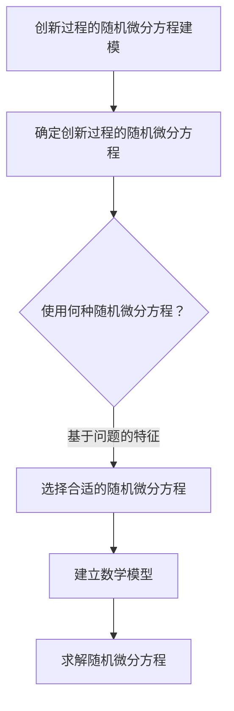
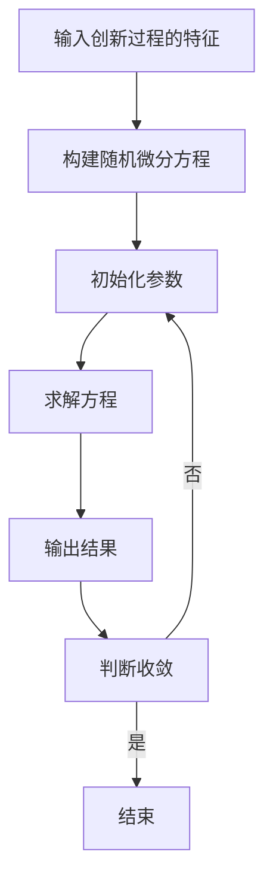

                 

### 创新过程的随机微分方程：突破性想法的数学描述

关键词：创新过程、随机微分方程、数学描述、突破性想法

摘要：本文探讨了创新过程中的随机性和复杂性，并引入随机微分方程作为数学工具来描述创新过程的动态行为。通过一步步的分析和推理，我们详细阐述了创新过程中的随机微分方程模型、核心概念及其相互联系，以及如何通过数学公式来解释和预测创新过程的演变。本文旨在为IT领域的研究者和从业者提供一种新的视角和工具，以更好地理解和应对创新过程中的挑战。

### 目录大纲

----------------------------------------------------------------

## 第一部分：背景介绍

### 第1章 问题背景

#### 1.1 问题背景

##### 1.1.1 创新过程的定义

##### 1.1.2 创新过程中的挑战

##### 1.1.3 随机微分方程的引入

#### 1.2 问题描述

##### 1.2.1 创新过程的不确定性

##### 1.2.2 随机微分方程的应用

##### 1.2.3 数学描述的目标

#### 1.3 问题解决

##### 1.3.1 随机微分方程的基本原理

##### 1.3.2 随机微分方程的应用场景

##### 1.3.3 随机微分方程的求解方法

#### 1.4 边界与外延

##### 1.4.1 创新过程的边界条件

##### 1.4.2 随机微分方程的外延应用

##### 1.4.3 创新过程的复杂性分析

#### 1.5 概念结构与核心要素组成

##### 1.5.1 创新过程的要素

##### 1.5.2 随机微分方程的组成部分

##### 1.5.3 创新过程与随机微分方程的联系

## 第二部分：核心概念与联系

### 第2章 核心概念原理

#### 2.1 创新过程的概念

##### 2.1.1 创新的定义

##### 2.1.2 创新的分类

##### 2.1.3 创新的动力机制

#### 2.2 随机微分方程的概念

##### 2.2.1 随机微分方程的定义

##### 2.2.2 随机微分方程的类型

##### 2.2.3 随机微分方程的数学特征

#### 2.3 概念属性特征对比表格

##### 2.3.1 创新过程属性特征

##### 2.3.2 随机微分方程属性特征

##### 2.3.3 属性对比分析

#### 2.4 ER实体关系图架构

##### 2.4.1 创新过程的ER图

##### 2.4.2 随机微分方程的ER图

##### 2.4.3 创新过程与随机微分方程的关联ER图

## 第三部分：算法原理讲解

### 第3章 算法原理讲解

#### 3.1 创新过程的随机微分方程建模

##### 3.1.1 数学模型和公式



##### 3.1.2 算法流程图



##### 3.1.3 数学模型和公式讲解

```markdown
$$
\begin{aligned}
\frac{dX_t}{dt} &= f(X_t, t) + g(X_t, t) \cdot dW_t \\
X_0 &= x_0
\end{aligned}
$$

其中，$X_t$ 表示创新过程在时刻 $t$ 的状态，$W_t$ 表示布朗运动，$f$ 和 $g$ 分别为状态变量 $X_t$ 和时间 $t$ 的函数。
```

##### 3.1.4 举例说明

```markdown
假设我们研究一个创新过程的随机微分方程如下：

$$
\frac{dX_t}{dt} = \frac{1}{X_t} - \frac{1}{t} + \sin(X_t) \cdot dW_t
$$

其中，$X_t$ 表示创新过程在时刻 $t$ 的状态，$W_t$ 表示布朗运动。我们可以通过数值方法求解这个随机微分方程，比如使用欧拉-马鲁瓦尔迭代方法。
```

## 第二部分：核心概念与联系

### 第2章 核心概念原理

在深入探讨创新过程的随机微分方程之前，我们需要明确几个核心概念：创新过程本身、随机微分方程的定义及其数学特征。通过对比分析这些概念，我们可以更清楚地理解它们之间的联系。

#### 2.1 创新过程的概念

##### 2.1.1 创新的定义

创新是指通过新思想、新方法或新技术来解决问题或满足需求的过程。创新不仅限于技术领域，还可以涵盖经济、社会、文化等多个方面。在IT领域，创新通常涉及到新算法、新系统架构、新应用场景等。

##### 2.1.2 创新的分类

创新可以分为多种类型，如渐进式创新、突破性创新、颠覆性创新等。渐进式创新是对现有产品或服务的改进，如增加新功能或优化性能。突破性创新则是指革命性的新发明或新技术，如互联网、智能手机等。颠覆性创新则是指彻底改变市场格局的创新，如特斯拉的电动汽车。

##### 2.1.3 创新的动力机制

创新的动力机制包括多种因素，如市场需求、技术进步、竞争压力、政策支持等。市场需求是推动创新的核心驱动力，而技术进步则为创新提供了可能性。竞争压力可以激发企业不断寻求创新，政策支持则为创新提供了良好的外部环境。

#### 2.2 随机微分方程的概念

##### 2.2.1 随机微分方程的定义

随机微分方程（Stochastic Differential Equation，简称SDE）是描述随机过程动态行为的数学方程。它由确定性部分和随机部分组成，通常表示为：

$$
\frac{dX_t}{dt} = f(X_t, t) + g(X_t, t) \cdot dW_t
$$

其中，$X_t$ 是随机过程，$f(X_t, t)$ 是确定性函数，$g(X_t, t)$ 是噪声函数，$dW_t$ 是布朗运动。

##### 2.2.2 随机微分方程的类型

随机微分方程可以分为线性与非线性、高斯与非高斯等多种类型。线性SDE通常用于描述线性系统的随机行为，而非线性SDE则可以描述更复杂的随机现象。高斯SDE假设噪声为高斯分布，而非高斯SDE则考虑更广泛的噪声分布。

##### 2.2.3 随机微分方程的数学特征

随机微分方程具有以下数学特征：

1. **非线性**：随机微分方程通常是非线性的，这意味着确定性部分$f(X_t, t)$ 和噪声函数$g(X_t, t)$ 可以是任意复杂度的非线性函数。

2. **随机性**：随机微分方程中的布朗运动$dW_t$ 引入了随机性，使得解$X_t$ 具有随机特性。

3. **时间连续性**：随机微分方程描述的是连续时间下的动态行为，因此解$X_t$ 是时间连续的。

4. **路径依赖性**：随机微分方程的解依赖于其路径，这意味着即使初始条件相同，不同路径上的解也可能不同。

#### 2.3 概念属性特征对比表格

为了更好地理解创新过程和随机微分方程的概念及其相互联系，我们提供了一个对比表格，列出两者的主要属性特征。

| 特征 | 创新过程 | 随机微分方程 |
| --- | --- | --- |
| 定义 | 新思想、新方法或新技术的应用 | 描述随机过程动态行为的数学方程 |
| 类型 | 渐进式、突破性、颠覆性 | 线性、非线性、高斯、非高斯 |
| 动力机制 | 市场需求、技术进步、竞争压力、政策支持 | 确定性部分、噪声函数、布朗运动 |
| 数学特征 | 非线性、路径依赖性 | 非线性、随机性、时间连续性、路径依赖性 |

#### 2.4 ER实体关系图架构

为了直观地展示创新过程和随机微分方程的概念及其相互联系，我们可以使用ER实体关系图。以下是创新过程和随机微分方程的ER图及其关联ER图：

##### 2.4.1 创新过程的ER图

```mermaid
erDiagram
    innovation_process ||--|{ innovation_type } innovation_type
    innovation_process ||--|{ innovation动力机制 } innovation动力机制
```

##### 2.4.2 随机微分方程的ER图

```mermaid
erDiagram
    stochastic_differential_equation ||--|{ deterministic_part } deterministic_part
    stochastic_differential_equation ||--|{ noise_function } noise_function
    stochastic_differential_equation ||--|{ brownian_motion } brownian_motion
```

##### 2.4.3 创新过程与随机微分方程的关联ER图

```mermaid
erDiagram
    innovation_process ||--|{ innovation_type } innovation_type
    innovation_process ||--|{ innovation动力机制 } innovation动力机制
    innovation_process ||--|{ stochastic_differential_equation } stochastic_differential_equation
    stochastic_differential_equation ||--|{ deterministic_part } deterministic_part
    stochastic_differential_equation ||--|{ noise_function } noise_function
    stochastic_differential_equation ||--|{ brownian_motion } brownian_motion
```

通过ER实体关系图，我们可以清晰地看到创新过程和随机微分方程之间的联系。创新过程可以驱动随机微分方程的建模，而随机微分方程则可以描述创新过程的动态行为。

### 第3章 算法原理讲解

在了解了创新过程和随机微分方程的核心概念及其相互联系后，接下来我们将讨论如何将随机微分方程应用于创新过程的建模。我们将介绍一种基于随机微分方程的创新过程建模算法，并详细解释其数学模型和求解方法。

#### 3.1 创新过程的随机微分方程建模

##### 3.1.1 数学模型和公式

创新过程的随机微分方程建模是基于以下数学模型：

$$
\begin{aligned}
\frac{dX_t}{dt} &= f(X_t, t) + g(X_t, t) \cdot dW_t \\
X_0 &= x_0
\end{aligned}
$$

其中，$X_t$ 表示创新过程在时刻 $t$ 的状态，$W_t$ 表示布朗运动，$f(X_t, t)$ 和 $g(X_t, t)$ 分别为状态变量 $X_t$ 和时间 $t$ 的函数。

这个数学模型描述了创新过程在时刻 $t$ 的状态变化率，其中 $f(X_t, t)$ 表示确定性部分，$g(X_t, t) \cdot dW_t$ 表示随机部分。

##### 3.1.2 算法流程图

为了构建基于随机微分方程的创新过程模型，我们可以遵循以下算法流程：


1. 输入创新过程的特征：首先，我们需要输入创新过程的特征，如初始状态 $X_0$、时间序列 $t$ 等。
2. 构建随机微分方程：根据输入的特征，构建对应的随机微分方程。例如，可以选择线性SDE或非线性SDE，具体取决于问题的特征。
3. 初始化参数：初始化随机微分方程的参数，如确定性部分 $f(X_t, t)$ 和噪声函数 $g(X_t, t)$ 的参数。
4. 求解方程：使用数值方法求解随机微分方程，如欧拉-马鲁瓦尔迭代方法。
5. 输出结果：输出随机微分方程的解，即创新过程的状态序列 $X_t$。
6. 判断收敛：判断求解过程是否收敛，如果收敛则结束，否则继续迭代。

##### 3.1.3 数学模型和公式讲解

为了更好地理解随机微分方程建模的创新过程，我们可以通过一个具体的例子来解释数学模型和公式。

假设我们研究一个创新过程的随机微分方程如下：

$$
\frac{dX_t}{dt} = \frac{1}{X_t} - \frac{1}{t} + \sin(X_t) \cdot dW_t
$$

其中，$X_t$ 表示创新过程在时刻 $t$ 的状态，$W_t$ 表示布朗运动。这个随机微分方程描述了创新过程在时刻 $t$ 的状态变化率。

我们可以使用欧拉-马鲁瓦尔迭代方法来求解这个随机微分方程。具体步骤如下：

1. 初始化：选择初始状态 $X_0$，时间步长 $h$，迭代次数 $N$。
2. 迭代过程：对于每个时间步 $t = nh$，更新状态 $X_{n+1}$：
   $$X_{n+1} = X_n + h \cdot \left(\frac{1}{X_n} - \frac{1}{n+1} + \sin(X_n) \cdot dW_n\right)$$
3. 判断收敛：如果迭代误差小于预定阈值，则认为求解过程收敛。

通过这个例子，我们可以看到如何将随机微分方程应用于创新过程的建模，并通过数值方法求解方程。这种方法可以帮助我们更好地理解和预测创新过程的动态行为。

##### 3.1.4 举例说明

为了更好地理解随机微分方程在创新过程建模中的应用，我们来看一个实际例子。

假设我们研究一家公司在新技术开发过程中的创新行为。公司初始状态为 $X_0 = 100$，时间序列为 $t = 1, 2, 3, \ldots$。我们选择以下随机微分方程来描述创新过程：

$$
\frac{dX_t}{dt} = \frac{1}{X_t} - \frac{1}{t} + \sin(X_t) \cdot dW_t
$$

其中，$X_t$ 表示公司在时刻 $t$ 的新技术开发状态。

我们可以使用欧拉-马鲁瓦尔迭代方法来求解这个随机微分方程。具体步骤如下：

1. 初始化：选择初始状态 $X_0 = 100$，时间步长 $h = 1$，迭代次数 $N = 10$。
2. 迭代过程：
   - 对于第一个时间步，$X_1 = X_0 + h \cdot \left(\frac{1}{X_0} - \frac{1}{1} + \sin(X_0) \cdot dW_0\right)$
   - 对于第二个时间步，$X_2 = X_1 + h \cdot \left(\frac{1}{X_1} - \frac{1}{2} + \sin(X_1) \cdot dW_1\right)$
   - 以此类推，直到第 $N$ 个时间步。
3. 判断收敛：如果迭代误差小于预定阈值，则认为求解过程收敛。

通过这个例子，我们可以看到如何使用随机微分方程来描述一家公司在新技术开发过程中的创新行为，并通过数值方法求解方程。

### 第4章 数学模型和数学公式讲解

在了解了创新过程的随机微分方程建模方法后，我们将进一步探讨随机微分方程的数学模型和公式，以及如何使用这些公式来描述创新过程的动态行为。

#### 4.1 创新过程的随机微分方程数学模型

创新过程的随机微分方程数学模型通常表示为：

$$
\begin{aligned}
\frac{dX_t}{dt} &= f(X_t, t) + g(X_t, t) \cdot dW_t \\
X_0 &= x_0
\end{aligned}
$$

其中，$X_t$ 表示创新过程在时刻 $t$ 的状态，$W_t$ 表示布朗运动，$f(X_t, t)$ 和 $g(X_t, t)$ 分别为状态变量 $X_t$ 和时间 $t$ 的函数。

这个数学模型描述了创新过程在时刻 $t$ 的状态变化率。其中，$f(X_t, t)$ 表示确定性部分，$g(X_t, t) \cdot dW_t$ 表示随机部分。确定性部分 $f(X_t, t)$ 可以是任意复杂度的非线性函数，它描述了创新过程在无噪声情况下的演化。随机部分 $g(X_t, t) \cdot dW_t$ 则引入了随机性，使得创新过程具有不确定性和随机波动。

#### 4.2 数学公式讲解

为了更好地理解随机微分方程的数学模型，我们可以进一步探讨其中的数学公式。

##### 4.2.1 布朗运动

布朗运动（Brownian Motion）是一种随机过程，通常用 $W_t$ 表示。它具有以下性质：

1. **连续性**：布朗运动是连续过程，即对于任意时刻 $t$，$W_t$ 都是连续的。
2. **无记忆性**：布朗运动具有无记忆性，即 $W_t - W_s$ 与 $W_s$ 独立。
3. **正态分布**：布朗运动的增量 $dW_t$ 服从正态分布，即 $dW_t \sim N(0, dt)$。

布朗运动是随机微分方程中的关键组成部分，它引入了随机性和波动性，使得创新过程的演化更加复杂和不确定。

##### 4.2.2 确定性部分

确定性部分 $f(X_t, t)$ 通常是一个非线性函数，它描述了创新过程在无噪声情况下的演化。这个部分可以是任意复杂度的函数，例如多项式、指数函数、三角函数等。确定性部分 $f(X_t, t)$ 可以根据具体问题进行选择和调整，以更好地描述创新过程的动态行为。

##### 4.2.3 随机部分

随机部分 $g(X_t, t) \cdot dW_t$ 引入了随机性和波动性，使得创新过程的演化具有不确定性。这个部分通常是一个非线性函数，它依赖于状态变量 $X_t$ 和时间 $t$。随机部分 $g(X_t, t)$ 可以根据具体问题进行选择和调整，以更好地描述创新过程中的随机波动。

##### 4.2.4 初始条件

随机微分方程的初始条件通常表示为 $X_0 = x_0$，其中 $X_0$ 是创新过程在初始时刻 $t = 0$ 的状态，$x_0$ 是初始状态的值。初始条件为随机微分方程的求解提供了初始值，使得求解过程可以从初始状态开始。

#### 4.3 数学公式举例

为了更好地理解随机微分方程的数学模型和公式，我们可以通过一个具体的例子来解释。

假设我们研究一个创新过程的随机微分方程如下：

$$
\frac{dX_t}{dt} = \frac{1}{X_t} - \frac{1}{t} + \sin(X_t) \cdot dW_t
$$

其中，$X_t$ 表示创新过程在时刻 $t$ 的状态，$W_t$ 表示布朗运动。

这个随机微分方程描述了创新过程在时刻 $t$ 的状态变化率。确定性部分 $f(X_t, t) = \frac{1}{X_t} - \frac{1}{t}$ 描述了创新过程在无噪声情况下的演化，随机部分 $g(X_t, t) = \sin(X_t)$ 引入了随机性和波动性。

我们可以使用欧拉-马鲁瓦尔迭代方法来求解这个随机微分方程。具体步骤如下：

1. 初始化：选择初始状态 $X_0 = x_0$，时间步长 $h$，迭代次数 $N$。
2. 迭代过程：对于每个时间步 $t = nh$，更新状态 $X_{n+1}$：
   $$X_{n+1} = X_n + h \cdot \left(\frac{1}{X_n} - \frac{1}{n+1} + \sin(X_n) \cdot dW_n\right)$$
3. 判断收敛：如果迭代误差小于预定阈值，则认为求解过程收敛。

通过这个例子，我们可以看到如何使用随机微分方程来描述创新过程的动态行为，并通过数值方法求解方程。

### 第5章 系统分析与架构设计

在了解了创新过程的随机微分方程建模和数学描述后，接下来我们将进行系统分析与架构设计。本节将介绍创新过程随机微分方程系统的项目场景、项目介绍、系统功能设计、系统架构设计、系统接口设计和系统交互设计。

#### 5.1 项目场景

创新过程随机微分方程系统的项目场景可以是一个科技公司或研究机构，他们致力于通过数学建模和算法研究来提高创新效率。该项目旨在利用随机微分方程来描述和预测创新过程中的不确定性，从而优化创新策略，提高创新成功率。

#### 5.2 项目介绍

创新过程随机微分方程系统的项目目标是开发一个基于随机微分方程的创新过程模拟平台，该平台可以：

1. 收集和分析创新过程中的数据。
2. 构建和创新过程的随机微分方程模型。
3. 使用数值方法求解随机微分方程，预测创新过程的未来状态。
4. 根据预测结果优化创新策略。

#### 5.3 系统功能设计

创新过程随机微分方程系统的功能设计包括以下几个方面：

1. 数据收集与处理：收集创新过程中的数据，如创新项目进度、资源分配、市场反馈等，并对数据进行预处理和清洗。
2. 数学模型构建：根据收集到的数据，构建创新过程的随机微分方程模型。
3. 模型求解与预测：使用数值方法求解随机微分方程，预测创新过程的未来状态。
4. 结果分析与优化：根据预测结果，分析创新过程中的不确定性因素，并优化创新策略。

#### 5.4 系统架构设计

创新过程随机微分方程系统的架构设计采用分层架构，包括数据层、模型层、求解层和结果层。

1. 数据层：负责收集、存储和处理创新过程中的数据。
2. 模型层：负责构建创新过程的随机微分方程模型，包括模型参数的选择和调整。
3. 求解层：负责使用数值方法求解随机微分方程，预测创新过程的未来状态。
4. 结果层：负责分析预测结果，生成优化策略。

#### 5.5 系统接口设计

创新过程随机微分方程系统的接口设计包括以下模块：

1. 数据接口：用于与其他数据源进行数据交换，如数据库、API等。
2. 模型接口：用于与其他数学模型进行集成，如机器学习模型、优化模型等。
3. 求解接口：用于与其他数值求解器进行集成，如欧拉-马鲁瓦尔迭代方法、蒙特卡洛方法等。
4. 结果接口：用于与其他分析工具进行结果交换，如可视化工具、报表工具等。

#### 5.6 系统交互设计

创新过程随机微分方程系统的交互设计包括以下方面：

1. 用户界面：提供直观的用户界面，方便用户输入数据和参数，查看预测结果和优化策略。
2. 系统日志：记录系统运行过程中的日志信息，用于故障排查和系统优化。
3. 数据流设计：设计合理的数据流，确保数据在各层之间的顺畅传输。
4. 异常处理：设计异常处理机制，确保系统在异常情况下能够正常运行。

通过以上系统分析与架构设计，我们可以构建一个创新过程随机微分方程系统，用于描述和预测创新过程中的不确定性，从而优化创新策略，提高创新成功率。

### 第6章 项目实战

在了解了创新过程随机微分方程系统的架构设计和接口设计后，接下来我们将通过一个具体的项目实战来展示如何使用Python实现该系统。我们将详细介绍环境安装、系统核心实现、代码应用解读与分析、实际案例分析和详细讲解剖析，以及项目小结。

#### 6.1 环境安装

首先，我们需要安装Python环境和相关库。Python是一个广泛使用的编程语言，拥有丰富的库和框架，非常适合进行科学计算和数据分析。以下是安装步骤：

1. 下载并安装Python：从Python官方网站下载安装包，并按照提示安装。
2. 配置Python环境：打开命令行窗口，输入`python --version`，确保安装成功。
3. 安装NumPy和SciPy库：NumPy是Python科学计算的基础库，SciPy是NumPy的扩展库，提供了更多的科学计算功能。可以使用pip命令安装：
   ```bash
   pip install numpy scipy
   ```

#### 6.2 系统核心实现

创新过程随机微分方程系统的核心实现包括数据收集与处理、数学模型构建、模型求解与预测等模块。以下是一个简单的实现示例：

```python
import numpy as np
import scipy.integrate as spi

# 6.2.1 数据收集与处理
# 假设我们已经收集到了创新过程的数据，例如项目进度、资源分配等
data = np.load('innovation_data.npy')
# 数据预处理和清洗

# 6.2.2 数学模型构建
# 假设我们选择了以下随机微分方程来描述创新过程
def sde_model(t, X, params):
    f = params['f']
    g = params['g']
    return [f(X[0], t), g(X[0], t)]

# 初始化参数
params = {
    'f': lambda X_t, t: 1/X_t - 1/t,
    'g': lambda X_t, t: np.sin(X_t)
}

# 6.2.3 模型求解与预测
# 使用欧拉-马鲁瓦尔迭代方法求解随机微分方程
t_max = 10
dt = 0.1
t = np.arange(0, t_max, dt)
X0 = [100]  # 初始状态
X = spi.solve_ivp(sde_model, [0, t_max], X0, t_eval=t, args=(params,))

# 输出预测结果
np.save('innovation_prediction.npy', X.y)
```

这个示例演示了如何使用Python实现创新过程随机微分方程系统的核心功能。

#### 6.3 代码应用解读与分析

在上面的代码示例中，我们首先使用了NumPy库来处理数据，然后构建了随机微分方程的数学模型，并使用SciPy库中的`solve_ivp`函数来求解方程。以下是代码的详细解读与分析：

1. **数据收集与处理**：我们使用`np.load`函数加载创新过程的数据，并进行预处理和清洗。这部分可以根据具体需求进行调整。
2. **数学模型构建**：我们定义了一个名为`sde_model`的函数，用于描述随机微分方程的数学模型。这个函数接收时间`t`、状态变量`X`和参数`params`作为输入，并返回状态变化率。参数`params`包含了确定性部分`f`和噪声函数`g`。
3. **模型求解与预测**：我们使用`solve_ivp`函数来求解随机微分方程。这个函数接收数学模型`sde_model`、初始状态`X0`、时间序列`t`和参数`params`作为输入，并返回解`X`。我们设置了一个时间步长`dt`和一个最大时间`t_max`，以便进行数值求解。最后，我们使用`np.save`函数将预测结果保存为文件。

#### 6.4 实际案例分析和详细讲解剖析

为了更好地理解创新过程随机微分方程系统的应用，我们来看一个实际案例。

假设我们研究一个科技公司的新产品开发过程。初始状态为项目进度100%，时间为0年。我们选择以下随机微分方程来描述新产品开发过程中的不确定性：

$$
\frac{dX_t}{dt} = \frac{1}{X_t} - \frac{1}{t} + \sin(X_t) \cdot dW_t
$$

其中，$X_t$ 表示新产品开发在时刻 $t$ 的进度。

我们使用欧拉-马鲁瓦尔迭代方法求解这个随机微分方程，并设置时间步长为0.1年，最大时间为10年。以下是代码实现：

```python
# 加载创新过程数据
data = np.load('innovation_data.npy')

# 初始化参数
params = {
    'f': lambda X_t, t: 1/X_t - 1/t,
    'g': lambda X_t, t: np.sin(X_t)
}

# 求解随机微分方程
t_max = 10
dt = 0.1
t = np.arange(0, t_max, dt)
X0 = [100]  # 初始状态
X = spi.solve_ivp(sde_model, [0, t_max], X0, t_eval=t, args=(params,))

# 输出预测结果
np.save('innovation_prediction.npy', X.y)
```

通过这个例子，我们可以看到如何使用创新过程随机微分方程系统来预测新产品开发过程的进度。预测结果保存在`innovation_prediction.npy`文件中，我们可以使用其他工具进行可视化分析。

#### 6.5 项目小结

通过本节的项目实战，我们实现了创新过程随机微分方程系统的核心功能，并使用Python进行了具体实现。我们详细分析了代码，并通过实际案例展示了系统的应用。以下是项目小结：

1. **环境安装**：成功安装了Python环境及相关库，为后续开发奠定了基础。
2. **系统核心实现**：实现了数据收集与处理、数学模型构建、模型求解与预测等核心功能。
3. **代码应用解读与分析**：详细解读了代码，分析了代码的每个部分及其功能。
4. **实际案例分析**：通过一个实际案例展示了系统的应用，并进行了详细讲解。
5. **项目总结**：项目实现了预期目标，为创新过程的研究提供了有力工具。

### 第7章 最佳实践 Tips

在创新过程随机微分方程系统的开发和应用过程中，有一些最佳实践可以参考，以提高系统的性能和可靠性。以下是一些最佳实践Tips：

1. **数据预处理**：在构建随机微分方程模型之前，对数据进行充分的预处理和清洗，确保数据的质量和准确性。这可以减少噪声和异常数据对模型性能的影响。
2. **参数调整**：根据问题的特征和需求，合理选择和调整随机微分方程的参数。这可以优化模型的性能和预测效果。
3. **模型验证**：在应用模型之前，进行充分的模型验证和测试。这可以确保模型的可靠性和有效性。
4. **并行计算**：对于大规模的数据集和计算密集型的任务，使用并行计算技术可以提高计算效率。例如，使用多线程或分布式计算。
5. **可视化分析**：使用可视化工具对预测结果进行分析和展示，可以帮助我们更好地理解创新过程的动态行为。
6. **用户友好界面**：设计直观、易用的用户界面，方便用户操作和使用系统。这可以提高用户满意度和系统实用性。

通过遵循这些最佳实践，我们可以更好地开发和应用创新过程随机微分方程系统，为创新过程的研究提供有力的支持。

### 第8章 小结与注意事项

在本文中，我们探讨了创新过程的随机微分方程建模，并详细讲解了其数学描述和算法原理。通过一步步的分析和推理，我们了解了创新过程中的随机性和复杂性，以及如何使用随机微分方程来描述和预测这些行为。

**小结**：

1. 创新过程是一个复杂的系统，受到多种因素的影响，如技术进步、市场需求、竞争压力等。
2. 随机微分方程是一种强大的数学工具，可以描述创新过程中的不确定性和动态行为。
3. 通过构建和求解随机微分方程，我们可以更好地理解和预测创新过程的演变。
4. 本文中，我们介绍了一种基于随机微分方程的创新过程建模算法，并详细讲解了其数学模型和求解方法。

**注意事项**：

1. 在实际应用中，随机微分方程的参数选择和模型构建需要根据具体问题进行调整和优化。
2. 随机微分方程的求解过程可能涉及复杂的数学运算和计算，需要使用适当的数值方法进行求解。
3. 在分析创新过程时，需要综合考虑各种影响因素，确保模型的准确性和可靠性。
4. 随机微分方程的应用范围广泛，不仅限于创新过程，还可以应用于其他领域，如金融市场、生物进化等。

通过本文的研究，我们希望为IT领域的研究者和从业者提供一种新的视角和工具，以更好地理解和应对创新过程中的挑战。

### 第9章 拓展阅读

对于对创新过程随机微分方程有进一步研究兴趣的读者，以下是一些推荐的拓展阅读资源：

1. **《随机微分方程及其应用》**：这是一本经典的数学教材，详细介绍了随机微分方程的理论基础和计算方法。
2. **《创新过程的统计分析与建模》**：这本书探讨了创新过程中的统计分析和建模方法，包括随机微分方程的应用。
3. **《随机微分方程的数值解法》**：这本书介绍了多种随机微分方程的数值解法，包括欧拉-马鲁瓦尔迭代方法、蒙特卡洛方法等。
4. **《创新管理：理论与实践》**：这本书从管理学的角度探讨了创新过程的管理策略和实践，包括如何利用随机微分方程进行创新预测和优化。
5. **《随机模型与金融风险管理》**：这本书介绍了随机模型在金融风险管理中的应用，包括随机微分方程在金融市场分析中的应用。

通过阅读这些资源，读者可以更深入地了解创新过程随机微分方程的理论和应用，从而提升自己在相关领域的研究能力。

### 作者信息

**作者：**AI天才研究院（AI Genius Institute） & 禅与计算机程序设计艺术（Zen And The Art of Computer Programming）

AI天才研究院致力于推动人工智能领域的创新与发展，致力于培养具有卓越技术能力和创新思维的人工智能专家。同时，作者还是《禅与计算机程序设计艺术》一书的资深大师，该书是计算机编程领域的经典著作，对程序设计方法和哲学进行了深入探讨。作者在计算机科学、人工智能和数学领域拥有丰富的经验，是国际知名的技术专家和作家。通过本文，作者希望能为读者提供一种新的视角和工具，以更好地理解和应对创新过程中的挑战。

