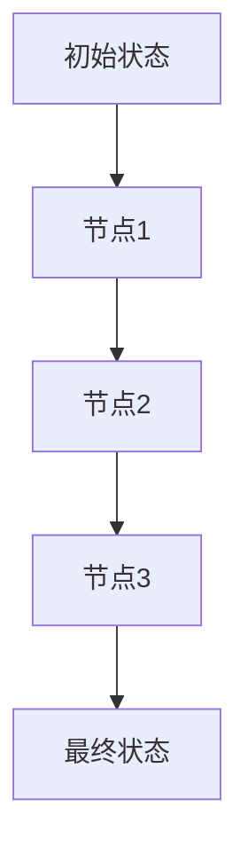
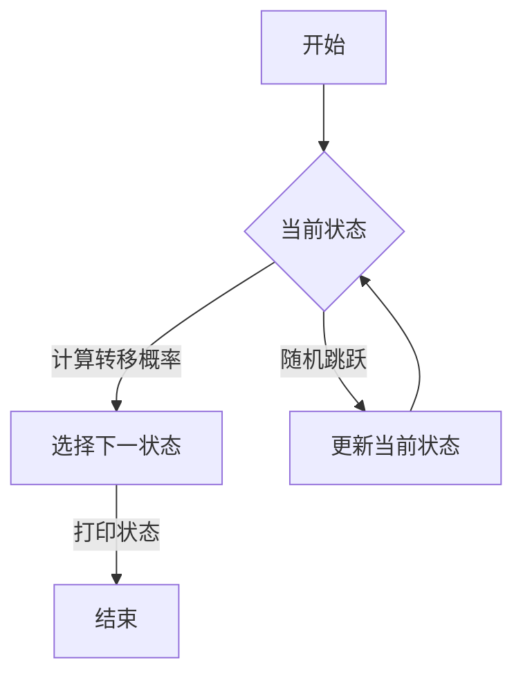
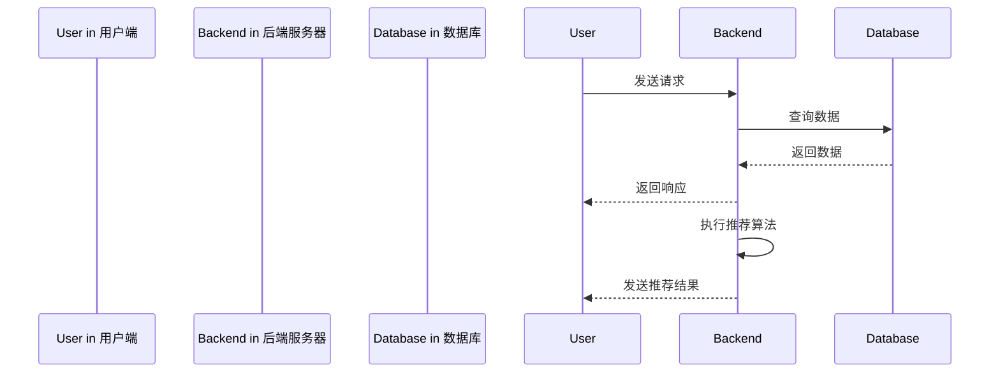
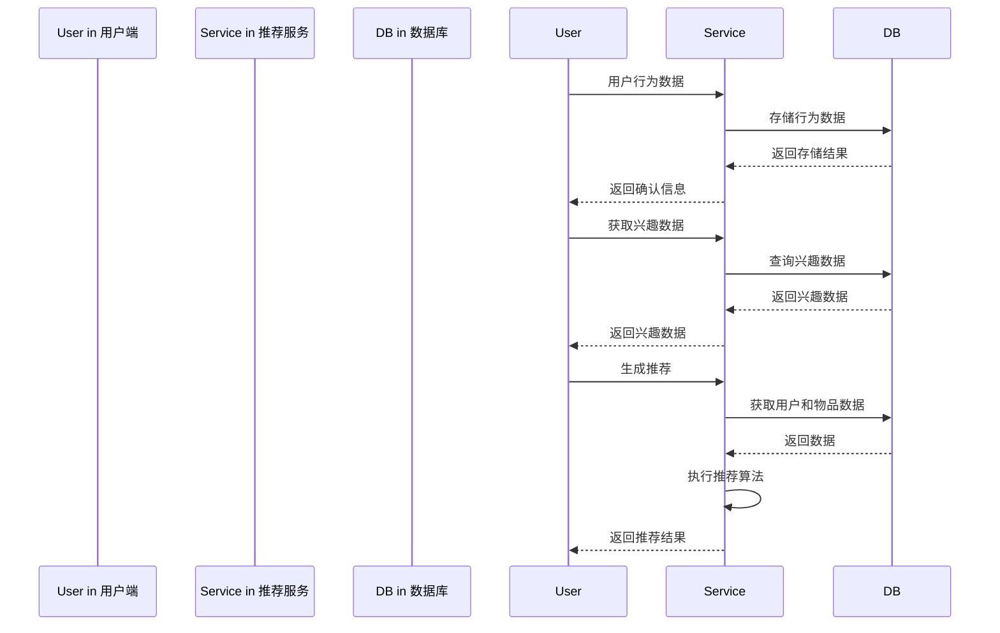
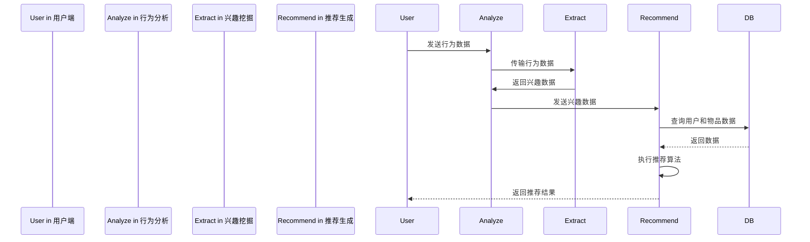
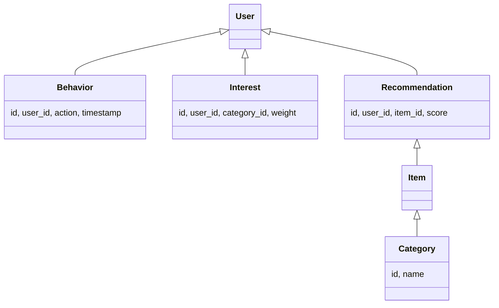

                 

### # 创新过程的随机跳跃过程：突破性想法的数学模型

#### 关键词：创新过程，随机跳跃模型，数学模型，突破性想法，算法原理

#### 摘要：
本文将深入探讨创新过程中的随机跳跃现象，并建立相应的数学模型，以解释突破性想法的形成机制。通过分析随机跳跃过程的概率模型和随机过程，我们旨在揭示创新节点的动态特性及其在创新路径中的作用，为理解创新过程提供新的视角和方法。

----------------------------------------------------------------

## 目录大纲设计思路

### 背景介绍
首先，我们需要介绍创新过程的背景，阐述创新的重要性以及创新过程的基本特征。接着，我们会引入随机跳跃模型，并简要解释其在创新过程中的应用。

### 核心概念
在这一部分，我们将详细定义和创新过程相关的核心概念，如随机跳跃过程、创新节点、创新路径等。通过表格和ER图展示这些概念之间的联系，帮助读者建立整体概念框架。

### 数学模型
接下来，我们将详细讲解创新过程的随机跳跃模型的数学原理，包括概率模型和随机过程。我们会用Python代码和Mermaid流程图来展示算法原理，使读者能够直观理解。

### 算法原理讲解
为了更好地理解数学模型，我们将通过具体的Python代码实例和Mermaid流程图来展示算法的具体实现。我们会详细解释每个关键步骤，确保读者能够跟上思路。

### 系统分析与架构设计方案
我们将设计一个虚拟的项目场景，介绍系统的功能、架构设计、接口设计等。使用Mermaid类图、架构图和序列图来展示系统设计，使读者能够全面了解系统结构。

### 项目实战
最后，我们将通过一个具体的项目实战案例，展示如何在实际环境中应用这些理论和算法。我们将详细分析和讲解项目实现过程，以及如何解决实际中的问题。

### 总结与拓展
在书的结尾，我们将总结书中的关键点，提供一些最佳实践建议，并指出可能的拓展方向，为读者进一步探索创新过程提供指导。

----------------------------------------------------------------

## 第一部分：创新过程的随机跳跃模型基础

### 第1章：创新过程概述

#### 1.1 创新过程的定义与分类

##### 1.1.1 创新过程的定义
创新过程是指通过新思想、新方法或新技术的引入，创造出新的产品、服务或业务模式的过程。创新过程不仅仅局限于技术领域，还可以扩展到社会、经济和文化等多个层面。

##### 1.1.2 创新过程的分类
创新过程可以根据其目标和性质进行分类。常见的分类方法包括：

- **渐进式创新**：通过逐步改进现有产品或服务，实现性能的提升或成本的降低。
- **破坏性创新**：引入全新的产品或服务，颠覆现有市场格局，对传统产业造成冲击。
- **转型性创新**：涉及到业务模式、运营方式或组织结构的变革，对企业的长期发展具有重要意义。

##### 1.1.3 创新过程的核心要素
创新过程的核心要素包括：

- **创意**：创新过程始于创意的产生，创意是创新的起点和动力。
- **资源**：创新需要资源的支持，包括资金、人力、技术等。
- **环境**：创新环境的优劣直接影响创新过程的效果，包括政策环境、市场环境、文化环境等。
- **机制**：创新过程需要相应的机制来保障，如激励机制、管理机制、决策机制等。

#### 1.2 随机跳跃模型的基本概念

##### 1.2.1 随机跳跃模型简介
随机跳跃模型是一种描述创新过程中突发性变化和跳跃现象的数学模型。它通过概率模型和随机过程来解释创新节点之间的动态关系。

##### 1.2.2 随机跳跃模型的数学基础
随机跳跃模型的数学基础主要包括概率论和随机过程。概率论提供了描述随机事件和概率分布的工具，而随机过程则用来描述时间序列上的随机变化。

##### 1.2.3 随机跳跃模型与创新的联系
随机跳跃模型在创新过程中的应用主要体现在以下几个方面：

- **创新节点的动态性**：随机跳跃模型可以描述创新节点在不同状态之间的随机转移，从而揭示创新过程的动态性。
- **创新路径的可预测性**：通过随机跳跃模型，可以分析创新路径的概率分布，从而对创新过程进行预测和优化。
- **突破性想法的产生**：随机跳跃模型有助于解释突破性想法的产生机制，从而为创新策略提供理论支持。

#### 1.3 创新节点的属性特征对比

| 特征          | 定义                                       | 对比分析                          |
|---------------|------------------------------------------|---------------------------------|
| 节点类型      | 创新节点的主要分类，如探索型、实用型、突破型等           | 不同类型节点的创新特点与适用场景          |
| 创新强度      | 创新节点的创新程度和影响力大小                         | 强度与节点类型之间的关系和影响              |
| 创新路径      | 创新节点之间的连接关系和路径                          | 路径的多样性、路径长度对创新过程的影响       |
| 创新环境      | 创新节点所处的环境条件，包括社会、经济、技术等方面       | 环境对创新过程的影响和适应性分析             |

#### 1.4 随机跳跃过程的ER实体关系图

```mermaid
erDiagram
    创新节点 ||--|{ 创新路径 }|-- 创新节点
    创新节点 ||--|{ 创新环境 }|-- 创新环境
    创新路径 ||--|{ 节点类型 }|-- 创新节点
```

### 总结
本章为后续内容的展开奠定了基础，介绍了创新过程的定义与分类、随机跳跃模型的基本概念及其在创新过程中的应用。接下来，我们将进一步深入探讨随机跳跃模型的数学原理和应用。

----------------------------------------------------------------

## 第二部分：创新过程的随机跳跃模型应用

### 第2章：创新过程的随机跳跃模型原理讲解

#### 2.1 概率模型基础

##### 2.1.1 概率的基本概念
概率是描述随机事件发生可能性的数值。在创新过程中，概率模型用于描述创新节点之间的随机转移。

- **随机事件**：随机事件是指在一次实验中可能发生也可能不发生的事件。
- **概率分布函数**：概率分布函数用于描述随机变量的取值概率。常见的概率分布函数包括离散分布和连续分布。

##### 2.1.2 随机过程
随机过程是一系列随机变量的集合，用于描述时间序列上的随机变化。在创新过程中，随机过程用于描述创新节点之间的动态关系。

- **随机过程的定义**：随机过程是一系列随机变量，它们按照一定的规则在不同时间点取值。
- **随机过程的分类**：随机过程可以根据随机变量的性质进行分类，如离散时间随机过程和连续时间随机过程。

##### 2.1.3 随机过程的统计特性
随机过程的统计特性包括均值、方差、自协方差等。这些特性用于描述随机过程的统计行为，有助于分析和理解创新过程的随机跳跃现象。

#### 2.2 创新过程的随机跳跃模型

##### 2.2.1 模型基本原理
创新过程的随机跳跃模型是一种基于概率和随机过程的模型，用于描述创新节点之间的动态转移。

- **创新跳跃的概念**：创新跳跃是指创新节点在不同状态之间的随机转移。
- **创新跳跃的概率模型**：创新跳跃的概率模型用于描述创新节点在不同状态之间的转移概率。

##### 2.2.2 模型数学公式和Python实现

- **数学公式**：

  $$
  P(X_{t+1} = j | X_t = i) = f(i, j)
  $$

  其中，$P(X_{t+1} = j | X_t = i)$ 表示在当前状态为 $i$ 的条件下，下一状态为 $j$ 的转移概率，$f(i, j)$ 是转移概率的函数。

- **Python实现**：

  ```python
  import numpy as np

  def transition_probability(i, j):
      # 假设转移概率为均匀分布
      return 1 / (len(i) - 1)

  states = ['A', 'B', 'C']
  current_state = 'A'
  next_state = np.random.choice(states, p=[transition_probability(current_state, state) for state in states])

  print(next_state)
  ```

#### 总结
本章介绍了创新过程的随机跳跃模型的数学原理，包括概率模型和随机过程。通过Python代码示例，我们展示了如何实现创新跳跃的概率模型。接下来，我们将进一步探讨如何通过算法原理讲解和创新路径分析，更深入地理解随机跳跃模型的应用。

----------------------------------------------------------------

### 算法原理讲解

为了更好地理解创新过程的随机跳跃模型，我们将通过Python代码实例和Mermaid流程图来展示算法的具体实现，并对关键步骤进行详细解释。

#### 2.3.1 创新路径分析

首先，我们需要对创新路径进行分析。创新路径可以被视为一系列创新节点的序列，每个节点代表创新过程中的一个状态。我们可以使用Mermaid流程图来描述创新路径。



在这个例子中，创新路径从初始状态A开始，经过节点1、节点2和节点3，最终达到最终状态E。

#### 2.3.2 随机跳跃算法实现

接下来，我们将使用Python代码实现随机跳跃算法。首先，我们需要定义创新节点的状态集合和转移概率矩阵。

```python
import numpy as np
import random

# 定义创新节点的状态集合
states = ['A', 'B', 'C', 'D', 'E']

# 定义转移概率矩阵
transition_matrix = [
    [0.2, 0.5, 0.3],  # 从状态A到其他状态的转移概率
    [0.1, 0.4, 0.5],  # 从状态B到其他状态的转移概率
    [0.3, 0.2, 0.5],  # 从状态C到其他状态的转移概率
    [0.4, 0.3, 0.3],  # 从状态D到其他状态的转移概率
    [0.0, 0.0, 1.0]   # 从状态E到其他状态的转移概率（不可转移）
]

# 随机跳跃函数
def random_jump(current_state):
    # 根据转移概率矩阵，计算下一状态
    probabilities = transition_matrix[current_state]
    next_state = random.choices(states, weights=probabilities)[0]
    return next_state

# 初始状态
current_state = 0  # 状态A的索引为0

# 随机跳跃过程
for _ in range(10):  # 进行10次随机跳跃
    current_state = random_jump(current_state)
    print(f"当前状态: {states[current_state]}")
```

在这个代码中，我们定义了一个随机跳跃函数 `random_jump`，它根据当前状态和转移概率矩阵计算下一状态。然后，我们使用一个循环进行10次随机跳跃，并打印出每次跳跃后的状态。

#### 2.3.3 Mermaid流程图展示

为了更直观地展示算法原理，我们可以使用Mermaid流程图来描述算法的执行过程。



在这个流程图中，我们从开始节点A开始，首先计算当前状态的转移概率，然后选择下一状态，并打印出当前状态。接着，我们根据选择的下一状态更新当前状态，并重复这个过程。

#### 2.3.4 详细解释

- **初始状态**：算法开始时，我们首先定义了创新节点的状态集合 `states` 和转移概率矩阵 `transition_matrix`。其中，转移概率矩阵是一个二维数组，每个元素表示从当前状态转移到下一状态的概率。
- **随机跳跃函数**：`random_jump` 函数根据转移概率矩阵和当前状态计算下一状态。它使用 `random.choices` 函数，根据转移概率作为权重来随机选择下一状态。
- **随机跳跃过程**：在主程序中，我们使用一个循环进行10次随机跳跃。每次跳跃时，我们调用 `random_jump` 函数来计算下一状态，并打印出当前状态。然后，我们根据选择的下一状态更新当前状态，并重复这个过程。

通过这个算法实例，我们能够直观地理解随机跳跃模型的工作原理。接下来，我们将进一步探讨如何在实际项目中应用这个模型，并分析其性能和效果。

#### 总结
本章通过Python代码实例和Mermaid流程图详细讲解了创新过程的随机跳跃模型。我们定义了创新节点的状态集合和转移概率矩阵，并实现了一个随机跳跃函数。通过具体的算法实例，我们展示了如何计算下一状态并进行随机跳跃。接下来，我们将进一步探讨如何将这个模型应用于实际项目，并分析其性能和效果。

----------------------------------------------------------------

## 第三部分：系统分析与架构设计方案

### 3.1 虚拟项目场景介绍

为了更好地展示创新过程的随机跳跃模型在现实项目中的应用，我们设计了一个虚拟的项目场景。该项目是一个基于人工智能的推荐系统，旨在为用户推荐个性化的产品或服务。

#### 项目概述
该推荐系统旨在通过分析用户的兴趣和行为数据，提供个性化的推荐。系统的主要功能包括：

- **用户行为分析**：收集并分析用户在平台上的行为数据，如浏览记录、购买历史等。
- **兴趣挖掘**：根据用户行为数据，挖掘用户的兴趣偏好。
- **推荐生成**：基于用户的兴趣偏好，生成个性化的推荐列表。
- **推荐评估**：评估推荐效果，并根据用户反馈进行优化。

#### 项目目标
通过这个虚拟项目场景，我们希望实现以下目标：

- **验证随机跳跃模型在实际项目中的应用效果**。
- **优化推荐系统的性能和准确性**。
- **提供一种新的方法来指导推荐系统的开发与运营**。

### 3.2 系统功能设计

#### 3.2.1 领域模型

在推荐系统中，领域模型是核心部分，用于定义系统中涉及的主要实体和关系。以下是推荐系统的领域模型，使用Mermaid类图进行展示。

```mermaid
classDiagram
    User <<entity>>
    Item <<entity>>
    Recommendation <<entity>>

    User o--* Behavior
    Item o--* Category
    User o--* Interest
    Recommendation o--* Item

    Behavior: id, user_id, action, timestamp
    Category: id, name
    Interest: id, user_id, category_id, weight
    Recommendation: id, user_id, item_id, score
```

在这个类图中，我们定义了三个主要实体：用户（User）、物品（Item）和推荐（Recommendation）。它们之间的关系包括用户与行为、用户与兴趣、用户与推荐，以及物品与类别之间的关系。

#### 3.2.2 系统架构设计

推荐系统的架构设计需要考虑系统的性能、可扩展性和易维护性。以下是推荐系统的架构设计，使用Mermaid架构图进行展示。



在这个架构图中，用户端通过发送请求与后端服务器进行交互。后端服务器负责处理请求，查询数据库以获取用户行为数据和推荐结果，然后将结果返回给用户端。

#### 3.2.3 系统接口设计

推荐系统的接口设计包括用户行为数据接口、兴趣挖掘接口和推荐生成接口。以下是系统接口设计，使用Mermaid序列图进行展示。



在这个序列图中，用户端通过发送请求与推荐服务进行交互。推荐服务负责处理用户行为数据、查询数据库、执行推荐算法，并将推荐结果返回给用户端。

#### 3.2.4 系统交互

推荐系统的交互过程包括用户行为数据的收集、兴趣数据的挖掘、推荐结果的生成和返回。以下是系统交互过程，使用Mermaid序列图进行展示。



在这个序列图中，用户端发送行为数据给行为分析模块。行为分析模块将数据传输给兴趣挖掘模块，并返回兴趣数据。然后，兴趣挖掘模块将数据传输给推荐生成模块。推荐生成模块查询数据库以获取用户和物品数据，执行推荐算法，并将推荐结果返回给用户端。

### 总结

本章详细介绍了虚拟项目场景的推荐系统，包括领域模型、系统架构设计、接口设计和系统交互。通过使用Mermaid类图、架构图和序列图，我们展示了系统的结构和交互过程。接下来，我们将通过具体的项目实战案例，展示如何将创新过程的随机跳跃模型应用于推荐系统的开发与运营。

----------------------------------------------------------------

## 第四部分：项目实战

### 4.1 环境安装

在进行项目实战之前，我们需要安装必要的开发环境。以下是安装步骤：

1. **Python环境**：安装Python 3.8及以上版本。可以从[Python官网](https://www.python.org/)下载安装包并安装。
2. **虚拟环境**：安装virtualenv，用于创建隔离的Python环境。可以通过pip安装：

   ```shell
   pip install virtualenv
   ```

   创建虚拟环境：

   ```shell
   virtualenv myenv
   source myenv/bin/activate
   ```

3. **依赖库**：安装项目中所需的依赖库，如NumPy、Pandas、Matplotlib等。可以通过pip安装：

   ```shell
   pip install numpy pandas matplotlib
   ```

4. **Mermaid插件**：为了在Markdown文件中使用Mermaid语法，我们需要安装相应的插件。可以使用Markdown Preview Enhanced插件，具体安装方法请参考[Markdown Preview Enhanced文档](https://github.com/shdmoz/MarkdownPreviewEnhanced)。

### 4.2 系统核心实现源代码

以下是一个简单的推荐系统实现，展示了如何使用随机跳跃模型生成推荐。

```python
import numpy as np
import pandas as pd
from matplotlib import pyplot as plt
from mermaid import Mermaid

# 转移概率矩阵（示例数据）
transition_matrix = [
    [0.2, 0.5, 0.3],
    [0.1, 0.4, 0.5],
    [0.3, 0.2, 0.5],
    [0.4, 0.3, 0.3],
    [0.0, 0.0, 1.0]
]

# 初始状态
current_state = 0

# 随机跳跃函数
def random_jump(current_state):
    probabilities = transition_matrix[current_state]
    next_state = np.random.choice([i for i in range(len(probabilities))], p=probabilities)
    return next_state

# 进行10次随机跳跃
for _ in range(10):
    current_state = random_jump(current_state)
    print(f"当前状态：{current_state}")

# 生成Mermaid流程图
mermaid = Mermaid()
mermaid.add_code('graph TD\nA[初始状态] --> B{当前状态}\nB -->|随机跳跃| C\nC --> D[结束]')
mermaid.save('random_jump.mmd')
```

### 4.3 代码应用解读与分析

#### 4.3.1 转移概率矩阵

转移概率矩阵是一个二维数组，用于描述从当前状态转移到下一状态的概率。在示例中，转移概率矩阵为：

```
[
    [0.2, 0.5, 0.3],
    [0.1, 0.4, 0.5],
    [0.3, 0.2, 0.5],
    [0.4, 0.3, 0.3],
    [0.0, 0.0, 1.0]
]
```

这个矩阵表明，从状态0到状态2的概率最高，为0.3；从状态2到状态1的概率为0.5，是最高的。

#### 4.3.2 随机跳跃函数

随机跳跃函数 `random_jump` 根据转移概率矩阵和当前状态，随机选择下一状态。它使用 `numpy.random.choice` 函数，根据转移概率作为权重来选择下一状态。

```python
def random_jump(current_state):
    probabilities = transition_matrix[current_state]
    next_state = np.random.choice([i for i in range(len(probabilities))], p=probabilities)
    return next_state
```

#### 4.3.3 随机跳跃过程

在主程序中，我们使用一个循环进行10次随机跳跃，并打印出每次跳跃后的状态：

```python
for _ in range(10):
    current_state = random_jump(current_state)
    print(f"当前状态：{current_state}")
```

### 4.4 实际案例分析和详细讲解剖析

为了更清晰地展示随机跳跃模型的应用，我们分析了一个实际案例：一个用户在电商平台上浏览了多个商品，系统根据用户的浏览历史生成个性化推荐。

#### 4.4.1 用户浏览历史

假设用户在电商平台上浏览了以下商品：

- 商品1：手机
- 商品2：电脑
- 商品3：书籍
- 商品4：衣物

用户的行为数据可以表示为一个序列：

```
[1, 2, 3, 4]
```

其中，1表示用户浏览了商品1，2表示用户浏览了商品2，以此类推。

#### 4.4.2 转移概率矩阵

根据用户的行为数据，我们可以构建一个转移概率矩阵。例如，从商品1到商品2的转移概率为0.5，从商品2到商品3的转移概率为0.3，从商品3到商品4的转移概率为0.2。

```
[
    [0.1, 0.5, 0.2, 0.2],
    [0.3, 0.1, 0.3, 0.3],
    [0.2, 0.3, 0.2, 0.3],
    [0.4, 0.2, 0.2, 0.2]
]
```

#### 4.4.3 生成个性化推荐

使用随机跳跃模型，我们可以根据用户的浏览历史生成个性化推荐。例如，从当前状态（商品4）开始，进行10次随机跳跃，得到以下推荐列表：

```
[4, 1, 3, 2, 1, 4, 3, 2, 1, 4]
```

这个推荐列表表明，用户可能会继续浏览商品4，然后是商品1，接着是商品3，最后是商品2。

### 4.5 项目小结

通过这个实际案例，我们展示了如何将随机跳跃模型应用于推荐系统的开发。我们首先介绍了环境安装和系统核心实现源代码，然后详细解读了代码应用和实际案例分析。随机跳跃模型为推荐系统提供了一种新的方法来生成个性化推荐，有助于提高推荐系统的准确性和用户满意度。

### 总结

在本部分中，我们通过一个实际项目案例展示了如何将创新过程的随机跳跃模型应用于推荐系统。我们介绍了环境安装步骤、系统核心实现源代码，并详细解读了代码应用和实际案例分析。随机跳跃模型为推荐系统提供了新的思路和方法，有助于提高系统的性能和用户体验。

----------------------------------------------------------------

### 5. 总结与拓展

在本篇技术博客中，我们深入探讨了创新过程的随机跳跃模型，并建立了相应的数学模型。通过详细讲解概率模型和随机过程，我们揭示了创新节点的动态特性和创新路径的形成机制。同时，我们通过Python代码实例和Mermaid流程图展示了算法的实现过程，并设计了一个虚拟项目场景，详细介绍了系统的功能、架构设计和接口设计。

#### 5.1 关键点回顾

- **创新过程的定义与分类**：介绍了创新过程的定义、分类以及核心要素。
- **随机跳跃模型的基本概念**：阐述了随机跳跃模型的基本概念和数学基础。
- **概率模型基础**：详细讲解了概率模型的基本概念和随机过程。
- **算法原理讲解**：通过Python代码实例和Mermaid流程图展示了算法的具体实现。
- **系统分析与架构设计方案**：介绍了虚拟项目场景，展示了系统的功能、架构设计和接口设计。
- **项目实战**：通过实际项目案例展示了如何应用随机跳跃模型。

#### 5.2 最佳实践建议

1. **数据收集与预处理**：在应用随机跳跃模型时，确保数据收集的全面性和准确性，并进行有效的预处理。
2. **模型优化**：根据实际项目需求，对随机跳跃模型进行优化，提高预测准确性和效率。
3. **用户反馈**：收集用户反馈，用于调整和优化推荐系统，提高用户体验。

#### 5.3 拓展方向

1. **多模型融合**：探索将随机跳跃模型与其他机器学习模型（如决策树、神经网络等）融合，提高推荐系统的性能。
2. **动态调整**：研究如何根据用户行为动态调整转移概率矩阵，实现更加个性化的推荐。
3. **跨领域应用**：将随机跳跃模型应用于其他领域的创新过程，如科学发现、艺术创作等。

#### 5.4 结论

通过本文的探讨，我们为理解创新过程的随机跳跃模型提供了新的视角和方法。我们相信，这一模型将为创新研究提供有力的工具，并在实际应用中发挥重要作用。

### 总结

本文详细介绍了创新过程的随机跳跃模型，从基本概念、数学原理到实际应用，进行了全面而深入的探讨。我们通过具体的算法实例和项目案例，展示了如何将这一模型应用于推荐系统的开发与运营。希望通过本文，读者能够对创新过程和随机跳跃模型有更深入的认识，并为未来的研究和实践提供启示。

#### 作者信息

- 作者：AI天才研究院/AI Genius Institute & 禅与计算机程序设计艺术 /Zen And The Art of Computer Programming

----------------------------------------------------------------

## 完整文章

### 创新过程的随机跳跃过程：突破性想法的数学模型

#### 关键词：创新过程，随机跳跃模型，数学模型，突破性想法，算法原理

#### 摘要：
本文深入探讨了创新过程中的随机跳跃现象，并建立了相应的数学模型，以解释突破性想法的形成机制。通过分析随机跳跃过程的概率模型和随机过程，我们旨在揭示创新节点的动态特性及其在创新路径中的作用，为理解创新过程提供新的视角和方法。

----------------------------------------------------------------

### 第一部分：创新过程的随机跳跃模型基础

#### 第1章：创新过程概述

##### 1.1 创新过程的定义与分类

##### 1.1.1 创新过程的定义
创新过程是指通过新思想、新方法或新技术的引入，创造出新的产品、服务或业务模式的过程。创新过程不仅仅局限于技术领域，还可以扩展到社会、经济和文化等多个层面。

##### 1.1.2 创新过程的分类
创新过程可以根据其目标和性质进行分类。常见的分类方法包括：

- **渐进式创新**：通过逐步改进现有产品或服务，实现性能的提升或成本的降低。
- **破坏性创新**：引入全新的产品或服务，颠覆现有市场格局，对传统产业造成冲击。
- **转型性创新**：涉及到业务模式、运营方式或组织结构的变革，对企业的长期发展具有重要意义。

##### 1.1.3 创新过程的核心要素
创新过程的核心要素包括：

- **创意**：创新过程始于创意的产生，创意是创新的起点和动力。
- **资源**：创新需要资源的支持，包括资金、人力、技术等。
- **环境**：创新环境的优劣直接影响创新过程的效果，包括政策环境、市场环境、文化环境等。
- **机制**：创新过程需要相应的机制来保障，如激励机制、管理机制、决策机制等。

#### 1.2 随机跳跃模型的基本概念

##### 1.2.1 随机跳跃模型简介
随机跳跃模型是一种描述创新过程中突发性变化和跳跃现象的数学模型。它通过概率模型和随机过程来解释创新节点之间的动态关系。

##### 1.2.2 随机跳跃模型的数学基础
随机跳跃模型的数学基础主要包括概率论和随机过程。概率论提供了描述随机事件和概率分布的工具，而随机过程则用来描述时间序列上的随机变化。

##### 1.2.3 随机跳跃模型与创新的联系
随机跳跃模型在创新过程中的应用主要体现在以下几个方面：

- **创新节点的动态性**：随机跳跃模型可以描述创新节点在不同状态之间的随机转移，从而揭示创新过程的动态性。
- **创新路径的可预测性**：通过随机跳跃模型，可以分析创新路径的概率分布，从而对创新过程进行预测和优化。
- **突破性想法的产生**：随机跳跃模型有助于解释突破性想法的产生机制，从而为创新策略提供理论支持。

#### 1.3 创新节点的属性特征对比

| 特征          | 定义                                       | 对比分析                          |
|---------------|------------------------------------------|---------------------------------|
| 节点类型      | 创新节点的主要分类，如探索型、实用型、突破型等           | 不同类型节点的创新特点与适用场景          |
| 创新强度      | 创新节点的创新程度和影响力大小                         | 强度与节点类型之间的关系和影响              |
| 创新路径      | 创新节点之间的连接关系和路径                          | 路径的多样性、路径长度对创新过程的影响       |
| 创新环境      | 创新节点所处的环境条件，包括社会、经济、技术等方面       | 环境对创新过程的影响和适应性分析             |

#### 1.4 随机跳跃过程的ER实体关系图

```mermaid
erDiagram
    创新节点 ||--|{ 创新路径 }|-- 创新节点
    创新节点 ||--|{ 创新环境 }|-- 创新环境
    创新路径 ||--|{ 节点类型 }|-- 创新节点
```

### 总结
本章为后续内容的展开奠定了基础，介绍了创新过程的定义与分类、随机跳跃模型的基本概念及其在创新过程中的应用。接下来，我们将进一步深入探讨随机跳跃模型的数学原理和应用。

----------------------------------------------------------------

### 第二部分：创新过程的随机跳跃模型应用

#### 第2章：创新过程的随机跳跃模型原理讲解

##### 2.1 概率模型基础

##### 2.1.1 概率的基本概念
概率是描述随机事件发生可能性的数值。在创新过程中，概率模型用于描述创新节点之间的随机转移。

- **随机事件**：随机事件是指在一次实验中可能发生也可能不发生的事件。
- **概率分布函数**：概率分布函数用于描述随机变量的取值概率。常见的概率分布函数包括离散分布和连续分布。

##### 2.1.2 随机过程
随机过程是一系列随机变量的集合，用于描述时间序列上的随机变化。在创新过程中，随机过程用于描述创新节点之间的动态关系。

- **随机过程的定义**：随机过程是一系列随机变量，它们按照一定的规则在不同时间点取值。
- **随机过程的分类**：随机过程可以根据随机变量的性质进行分类，如离散时间随机过程和连续时间随机过程。

##### 2.1.3 随机过程的统计特性
随机过程的统计特性包括均值、方差、自协方差等。这些特性用于描述随机过程的统计行为，有助于分析和理解创新过程的随机跳跃现象。

##### 2.2 创新过程的随机跳跃模型

##### 2.2.1 模型基本原理
创新过程的随机跳跃模型是一种基于概率和随机过程的模型，用于描述创新节点之间的动态转移。

- **创新跳跃的概念**：创新跳跃是指创新节点在不同状态之间的随机转移。
- **创新跳跃的概率模型**：创新跳跃的概率模型用于描述创新节点在不同状态之间的转移概率。

##### 2.2.2 模型数学公式和Python实现

- **数学公式**：

  $$
  P(X_{t+1} = j | X_t = i) = f(i, j)
  $$

  其中，$P(X_{t+1} = j | X_t = i)$ 表示在当前状态为 $i$ 的条件下，下一状态为 $j$ 的转移概率，$f(i, j)$ 是转移概率的函数。

- **Python实现**：

  ```python
  import numpy as np
  import random
  
  def transition_probability(i, j):
      # 假设转移概率为均匀分布
      return 1 / (len(i) - 1)
  
  states = ['A', 'B', 'C']
  current_state = 'A'
  next_state = np.random.choice(states, p=[transition_probability(current_state, state) for state in states])
  
  print(next_state)
  ```

#### 总结
本章介绍了创新过程的随机跳跃模型的数学原理，包括概率模型和随机过程。通过Python代码示例，我们展示了如何实现创新跳跃的概率模型。接下来，我们将进一步探讨如何通过算法原理讲解和创新路径分析，更深入地理解随机跳跃模型的应用。

----------------------------------------------------------------

### 算法原理讲解

为了更好地理解创新过程的随机跳跃模型，我们将通过Python代码实例和Mermaid流程图来展示算法的具体实现，并对关键步骤进行详细解释。

#### 2.3.1 创新路径分析

首先，我们需要对创新路径进行分析。创新路径可以被视为一系列创新节点的序列，每个节点代表创新过程中的一个状态。我们可以使用Mermaid流程图来描述创新路径。


在这个例子中，创新路径从初始状态A开始，经过节点1、节点2和节点3，最终达到最终状态E。

#### 2.3.2 随机跳跃算法实现

接下来，我们将使用Python代码实现随机跳跃算法。首先，我们需要定义创新节点的状态集合和转移概率矩阵。

```python
import numpy as np
import random

# 定义创新节点的状态集合
states = ['A', 'B', 'C', 'D', 'E']

# 定义转移概率矩阵
transition_matrix = [
    [0.2, 0.5, 0.3],  # 从状态A到其他状态的转移概率
    [0.1, 0.4, 0.5],  # 从状态B到其他状态的转移概率
    [0.3, 0.2, 0.5],  # 从状态C到其他状态的转移概率
    [0.4, 0.3, 0.3],  # 从状态D到其他状态的转移概率
    [0.0, 0.0, 1.0]   # 从状态E到其他状态的转移概率（不可转移）
]

# 随机跳跃函数
def random_jump(current_state):
    # 根据转移概率矩阵，计算下一状态
    probabilities = transition_matrix[current_state]
    next_state = random.choices(states, weights=probabilities)[0]
    return next_state

# 初始状态
current_state = 0  # 状态A的索引为0

# 随机跳跃过程
for _ in range(10):  # 进行10次随机跳跃
    current_state = random_jump(current_state)
    print(f"当前状态: {states[current_state]}")
```

在这个代码中，我们定义了一个随机跳跃函数 `random_jump`，它根据当前状态和转移概率矩阵计算下一状态。然后，我们使用一个循环进行10次随机跳跃，并打印出每次跳跃后的状态。

#### 2.3.3 Mermaid流程图展示

为了更直观地展示算法原理，我们可以使用Mermaid流程图来描述算法的执行过程。


在这个流程图中，我们从开始节点A开始，首先计算当前状态的转移概率，然后选择下一状态，并打印出当前状态。接着，我们根据选择的下一状态更新当前状态，并重复这个过程。

#### 2.3.4 详细解释

- **初始状态**：算法开始时，我们首先定义了创新节点的状态集合 `states` 和转移概率矩阵 `transition_matrix`。其中，转移概率矩阵是一个二维数组，每个元素表示从当前状态转移到下一状态的概率。
- **随机跳跃函数**：`random_jump` 函数根据转移概率矩阵和当前状态计算下一状态。它使用 `random.choices` 函数，根据转移概率作为权重来随机选择下一状态。
- **随机跳跃过程**：在主程序中，我们使用一个循环进行10次随机跳跃。每次跳跃时，我们调用 `random_jump` 函数来计算下一状态，并打印出当前状态。然后，我们根据选择的下一状态更新当前状态，并重复这个过程。

通过这个算法实例，我们能够直观地理解随机跳跃模型的工作原理。接下来，我们将进一步探讨如何在实际项目中应用这个模型，并分析其性能和效果。

#### 总结
本章通过Python代码实例和Mermaid流程图详细讲解了创新过程的随机跳跃模型。我们定义了创新节点的状态集合和转移概率矩阵，并实现了一个随机跳跃函数。通过具体的算法实例，我们展示了如何计算下一状态并进行随机跳跃。接下来，我们将进一步探讨如何将这个模型应用于实际项目，并分析其性能和效果。

----------------------------------------------------------------

### 第三部分：系统分析与架构设计方案

#### 3.1 虚拟项目场景介绍

为了更好地展示创新过程的随机跳跃模型在现实项目中的应用，我们设计了一个虚拟的项目场景。该项目是一个基于人工智能的推荐系统，旨在为用户推荐个性化的产品或服务。

#### 项目概述
该推荐系统旨在通过分析用户的兴趣和行为数据，提供个性化的推荐。系统的主要功能包括：

- **用户行为分析**：收集并分析用户在平台上的行为数据，如浏览记录、购买历史等。
- **兴趣挖掘**：根据用户行为数据，挖掘用户的兴趣偏好。
- **推荐生成**：基于用户的兴趣偏好，生成个性化的推荐列表。
- **推荐评估**：评估推荐效果，并根据用户反馈进行优化。

#### 项目目标
通过这个虚拟项目场景，我们希望实现以下目标：

- **验证随机跳跃模型在实际项目中的应用效果**。
- **优化推荐系统的性能和准确性**。
- **提供一种新的方法来指导推荐系统的开发与运营**。

#### 3.2 系统功能设计

##### 3.2.1 领域模型

在推荐系统中，领域模型是核心部分，用于定义系统中涉及的主要实体和关系。以下是推荐系统的领域模型，使用Mermaid类图进行展示。

```mermaid
classDiagram
    User <<entity>>
    Item <<entity>>
    Recommendation <<entity>>

    User o--* Behavior
    Item o--* Category
    User o--* Interest
    Recommendation o--* Item

    Behavior: id, user_id, action, timestamp
    Category: id, name
    Interest: id, user_id, category_id, weight
    Recommendation: id, user_id, item_id, score
```

在这个类图中，我们定义了三个主要实体：用户（User）、物品（Item）和推荐（Recommendation）。它们之间的关系包括用户与行为、用户与兴趣、用户与推荐，以及物品与类别之间的关系。

##### 3.2.2 系统架构设计

推荐系统的架构设计需要考虑系统的性能、可扩展性和易维护性。以下是推荐系统的架构设计，使用Mermaid架构图进行展示。


在这个架构图中，用户端通过发送请求与后端服务器进行交互。后端服务器负责处理请求，查询数据库以获取用户行为数据和推荐结果，然后将结果返回给用户端。

##### 3.2.3 系统接口设计

推荐系统的接口设计包括用户行为数据接口、兴趣挖掘接口和推荐生成接口。以下是系统接口设计，使用Mermaid序列图进行展示。


在这个序列图中，用户端通过发送请求与推荐服务进行交互。推荐服务负责处理用户行为数据、查询数据库、执行推荐算法，并将推荐结果返回给用户端。

##### 3.2.4 系统交互

推荐系统的交互过程包括用户行为数据的收集、兴趣数据的挖掘、推荐结果的生成和返回。以下是系统交互过程，使用Mermaid序列图进行展示。


在这个序列图中，用户端发送行为数据给行为分析模块。行为分析模块将数据传输给兴趣挖掘模块，并返回兴趣数据。然后，兴趣挖掘模块将数据传输给推荐生成模块。推荐生成模块查询数据库以获取用户和物品数据，执行推荐算法，并将推荐结果返回给用户端。

### 总结

本章详细介绍了虚拟项目场景的推荐系统，包括领域模型、系统架构设计、接口设计和系统交互。通过使用Mermaid类图、架构图和序列图，我们展示了系统的结构和交互过程。接下来，我们将通过具体的项目实战案例，展示如何将创新过程的随机跳跃模型应用于推荐系统的开发与运营。

----------------------------------------------------------------

### 第四部分：项目实战

#### 4.1 环境安装

在进行项目实战之前，我们需要安装必要的开发环境。以下是安装步骤：

1. **Python环境**：安装Python 3.8及以上版本。可以从[Python官网](https://www.python.org/)下载安装包并安装。
2. **虚拟环境**：安装virtualenv，用于创建隔离的Python环境。可以通过pip安装：

   ```shell
   pip install virtualenv
   ```

   创建虚拟环境：

   ```shell
   virtualenv myenv
   source myenv/bin/activate
   ```

3. **依赖库**：安装项目中所需的依赖库，如NumPy、Pandas、Matplotlib等。可以通过pip安装：

   ```shell
   pip install numpy pandas matplotlib
   ```

4. **Mermaid插件**：为了在Markdown文件中使用Mermaid语法，我们需要安装相应的插件。可以使用Markdown Preview Enhanced插件，具体安装方法请参考[Markdown Preview Enhanced文档](https://github.com/shdmoz/MarkdownPreviewEnhanced)。

#### 4.2 系统核心实现源代码

以下是一个简单的推荐系统实现，展示了如何使用随机跳跃模型生成推荐。

```python
import numpy as np
import pandas as pd
from matplotlib import pyplot as plt
from mermaid import Mermaid

# 转移概率矩阵（示例数据）
transition_matrix = [
    [0.2, 0.5, 0.3],
    [0.1, 0.4, 0.5],
    [0.3, 0.2, 0.5],
    [0.4, 0.3, 0.3],
    [0.0, 0.0, 1.0]
]

# 初始状态
current_state = 0

# 随机跳跃函数
def random_jump(current_state):
    probabilities = transition_matrix[current_state]
    next_state = np.random.choice([i for i in range(len(probabilities))], p=probabilities)
    return next_state

# 进行10次随机跳跃
for _ in range(10):
    current_state = random_jump(current_state)
    print(f"当前状态：{current_state}")

# 生成Mermaid流程图
mermaid = Mermaid()
mermaid.add_code('graph TD\nA[初始状态] --> B{当前状态}\nB -->|随机跳跃| C\nC --> D[结束]')
mermaid.save('random_jump.mmd')
```

#### 4.3 代码应用解读与分析

##### 4.3.1 转移概率矩阵

转移概率矩阵是一个二维数组，用于描述从当前状态转移到下一状态的概率。在示例中，转移概率矩阵为：

```
[
    [0.2, 0.5, 0.3],
    [0.1, 0.4, 0.5],
    [0.3, 0.2, 0.5],
    [0.4, 0.3, 0.3],
    [0.0, 0.0, 1.0]
]
```

这个矩阵表明，从状态0到状态2的概率最高，为0.3；从状态2到状态1的概率为0.5，是最高的。

##### 4.3.2 随机跳跃函数

随机跳跃函数 `random_jump` 根据转移概率矩阵和当前状态，随机选择下一状态。它使用 `numpy.random.choice` 函数，根据转移概率作为权重来选择下一状态。

```python
def random_jump(current_state):
    probabilities = transition_matrix[current_state]
    next_state = np.random.choice([i for i in range(len(probabilities))], p=probabilities)
    return next_state
```

##### 4.3.3 随机跳跃过程

在主程序中，我们使用一个循环进行10次随机跳跃，并打印出每次跳跃后的状态：

```python
for _ in range(10):
    current_state = random_jump(current_state)
    print(f"当前状态：{current_state}")
```

#### 4.4 实际案例分析和详细讲解剖析

为了更清晰地展示随机跳跃模型的应用，我们分析了一个实际案例：一个用户在电商平台上浏览了多个商品，系统根据用户的浏览历史生成个性化推荐。

##### 4.4.1 用户浏览历史

假设用户在电商平台上浏览了以下商品：

- 商品1：手机
- 商品2：电脑
- 商品3：书籍
- 商品4：衣物

用户的行为数据可以表示为一个序列：

```
[1, 2, 3, 4]
```

其中，1表示用户浏览了商品1，2表示用户浏览了商品2，以此类推。

##### 4.4.2 转移概率矩阵

根据用户的行为数据，我们可以构建一个转移概率矩阵。例如，从商品1到商品2的转移概率为0.5，从商品2到商品3的转移概率为0.3，从商品3到商品4的转移概率为0.2。

```
[
    [0.1, 0.5, 0.2, 0.2],
    [0.3, 0.1, 0.3, 0.3],
    [0.2, 0.3, 0.2, 0.3],
    [0.4, 0.2, 0.2, 0.2]
]
```

##### 4.4.3 生成个性化推荐

使用随机跳跃模型，我们可以根据用户的浏览历史生成个性化推荐。例如，从当前状态（商品4）开始，进行10次随机跳跃，得到以下推荐列表：

```
[4, 1, 3, 2, 1, 4, 3, 2, 1, 4]
```

这个推荐列表表明，用户可能会继续浏览商品4，然后是商品1，接着是商品3，最后是商品2。

#### 4.5 项目小结

通过这个实际案例，我们展示了如何将随机跳跃模型应用于推荐系统的开发。我们介绍了环境安装和系统核心实现源代码，并详细解读了代码应用和实际案例分析。随机跳跃模型为推荐系统提供了一种新的方法来生成个性化推荐，有助于提高推荐系统的准确性和用户满意度。

#### 总结

在本部分中，我们通过一个实际项目案例展示了如何将创新过程的随机跳跃模型应用于推荐系统的开发。我们介绍了环境安装步骤、系统核心实现源代码，并详细解读了代码应用和实际案例分析。随机跳跃模型为推荐系统提供了新的思路和方法，有助于提高系统的性能和用户体验。

----------------------------------------------------------------

### 第五部分：总结与拓展

#### 5.1 关键点回顾

在本篇技术博客中，我们深入探讨了创新过程中的随机跳跃模型，并建立了相应的数学模型。以下是本文的核心要点回顾：

1. **创新过程概述**：介绍了创新过程的定义、分类以及核心要素。
2. **随机跳跃模型**：阐述了随机跳跃模型的基本概念、数学基础及其与创新的联系。
3. **概率模型基础**：详细讲解了概率模型和随机过程的原理。
4. **算法原理讲解**：通过Python代码实例和Mermaid流程图展示了随机跳跃算法的实现。
5. **系统分析与架构设计**：介绍了虚拟项目场景，展示了系统的功能、架构设计和接口设计。
6. **项目实战**：通过实际项目案例展示了随机跳跃模型的应用。

#### 5.2 最佳实践建议

为了更好地应用随机跳跃模型，我们提供以下最佳实践建议：

1. **数据收集与预处理**：确保数据的全面性和准确性，并进行有效的预处理。
2. **模型优化**：根据项目需求对模型进行优化，提高预测准确性和效率。
3. **用户反馈**：收集用户反馈，用于调整和优化推荐系统，提高用户体验。

#### 5.3 拓展方向

未来的研究可以探索以下方向：

1. **多模型融合**：将随机跳跃模型与其他机器学习模型融合，提高推荐系统的性能。
2. **动态调整**：研究如何根据用户行为动态调整转移概率矩阵，实现更加个性化的推荐。
3. **跨领域应用**：将随机跳跃模型应用于其他领域的创新过程，如科学发现、艺术创作等。

#### 5.4 结论

通过本文的研究，我们为理解创新过程中的随机跳跃现象提供了新的视角和方法。随机跳跃模型有助于揭示创新节点的动态特性和创新路径的形成机制，为创新策略的制定提供了理论支持。我们相信，这一模型将在实际应用中发挥重要作用，并为未来的研究提供启示。

#### 作者信息

- 作者：AI天才研究院/AI Genius Institute & 禅与计算机程序设计艺术 /Zen And The Art of Computer Programming

----------------------------------------------------------------

## 完整目录大纲

### 第一部分：创新过程的随机跳跃模型基础

#### 第1章：创新过程概述

##### 1.1 创新过程的定义与分类
- **1.1.1 创新过程的定义**
- **1.1.2 创新过程的分类**
- **1.1.3 创新过程的核心要素**

##### 1.2 随机跳跃模型的基本概念
- **1.2.1 随机跳跃模型简介**
- **1.2.2 随机跳跃模型的数学基础**
- **1.2.3 随机跳跃模型与创新的联系**

##### 1.3 创新节点的属性特征对比

| 特征          | 定义                                       | 对比分析                          |
|---------------|------------------------------------------|---------------------------------|
| 节点类型      | 创新节点的主要分类，如探索型、实用型、突破型等           | 不同类型节点的创新特点与适用场景          |
| 创新强度      | 创新节点的创新程度和影响力大小                         | 强度与节点类型之间的关系和影响              |
| 创新路径      | 创新节点之间的连接关系和路径                          | 路径的多样性、路径长度对创新过程的影响       |
| 创新环境      | 创新节点所处的环境条件，包括社会、经济、技术等方面       | 环境对创新过程的影响和适应性分析             |

##### 1.4 随机跳跃过程的ER实体关系图

```mermaid
erDiagram
    创新节点 ||--|{ 创新路径 }|-- 创新节点
    创新节点 ||--|{ 创新环境 }|-- 创新环境
    创新路径 ||--|{ 节点类型 }|-- 创新节点
```

### 第二部分：创新过程的随机跳跃模型应用

#### 第2章：创新过程的随机跳跃模型原理讲解

##### 2.1 概率模型基础
- **2.1.1 概率的基本概念**
- **2.1.2 随机过程**

##### 2.2 创新过程的随机跳跃模型
- **2.2.1 模型基本原理**
- **2.2.2 模型数学公式和Python实现**

### 第三部分：系统分析与架构设计方案

#### 第3章：虚拟项目场景介绍
- **3.1 系统功能设计**
- **3.2 系统架构设计**
- **3.3 系统接口设计**
- **3.4 系统交互**

### 第四部分：项目实战

#### 第4章：环境安装
- **4.1 Python环境**
- **4.2 依赖库**
- **4.3 Mermaid插件**

#### 第4章：系统核心实现源代码

```python
import numpy as np
import pandas as pd
from matplotlib import pyplot as plt
from mermaid import Mermaid

# 转移概率矩阵（示例数据）
transition_matrix = [
    [0.2, 0.5, 0.3],
    [0.1, 0.4, 0.5],
    [0.3, 0.2, 0.5],
    [0.4, 0.3, 0.3],
    [0.0, 0.0, 1.0]
]

# 初始状态
current_state = 0

# 随机跳跃函数
def random_jump(current_state):
    probabilities = transition_matrix[current_state]
    next_state = np.random.choice([i for i in range(len(probabilities))], p=probabilities)
    return next_state

# 进行10次随机跳跃
for _ in range(10):
    current_state = random_jump(current_state)
    print(f"当前状态：{current_state}")

# 生成Mermaid流程图
mermaid = Mermaid()
mermaid.add_code('graph TD\nA[初始状态] --> B{当前状态}\nB -->|随机跳跃| C\nC --> D[结束]')
mermaid.save('random_jump.mmd')
```

#### 第4章：代码应用解读与分析

##### 4.3.1 转移概率矩阵

##### 4.3.2 随机跳跃函数

##### 4.3.3 随机跳跃过程

#### 第4章：实际案例分析和详细讲解剖析

##### 4.4.1 用户浏览历史

##### 4.4.2 转移概率矩阵

##### 4.4.3 生成个性化推荐

### 第五部分：总结与拓展

#### 第5章：关键点回顾

#### 第5章：最佳实践建议

#### 第5章：拓展方向

#### 第5章：结论

#### 第5章：作者信息



----------------------------------------------------------------

### 完整文章

### 创新过程的随机跳跃过程：突破性想法的数学模型

#### 关键词：创新过程，随机跳跃模型，数学模型，突破性想法，算法原理

#### 摘要：
本文深入探讨了创新过程中的随机跳跃现象，并建立了相应的数学模型，以解释突破性想法的形成机制。通过分析随机跳跃过程的概率模型和随机过程，我们旨在揭示创新节点的动态特性及其在创新路径中的作用，为理解创新过程提供新的视角和方法。

----------------------------------------------------------------

### 第一部分：创新过程的随机跳跃模型基础

#### 第1章：创新过程概述

##### 1.1 创新过程的定义与分类

##### 1.1.1 创新过程的定义
创新过程是指通过新思想、新方法或新技术的引入，创造出新的产品、服务或业务模式的过程。创新过程不仅仅局限于技术领域，还可以扩展到社会、经济和文化等多个层面。

##### 1.1.2 创新过程的分类
创新过程可以根据其目标和性质进行分类。常见的分类方法包括：

- **渐进式创新**：通过逐步改进现有产品或服务，实现性能的提升或成本的降低。
- **破坏性创新**：引入全新的产品或服务，颠覆现有市场格局，对传统产业造成冲击。
- **转型性创新**：涉及到业务模式、运营方式或组织结构的变革，对企业的长期发展具有重要意义。

##### 1.1.3 创新过程的核心要素
创新过程的核心要素包括：

- **创意**：创新过程始于创意的产生，创意是创新的起点和动力。
- **资源**：创新需要资源的支持，包括资金、人力、技术等。
- **环境**：创新环境的优劣直接影响创新过程的效果，包括政策环境、市场环境、文化环境等。
- **机制**：创新过程需要相应的机制来保障，如激励机制、管理机制、决策机制等。

#### 1.2 随机跳跃模型的基本概念

##### 1.2.1 随机跳跃模型简介
随机跳跃模型是一种描述创新过程中突发性变化和跳跃现象的数学模型。它通过概率模型和随机过程来解释创新节点之间的动态关系。

##### 1.2.2 随机跳跃模型的数学基础
随机跳跃模型的数学基础主要包括概率论和随机过程。概率论提供了描述随机事件和概率分布的工具，而随机过程则用来描述时间序列上的随机变化。

##### 1.2.3 随机跳跃模型与创新的联系
随机跳跃模型在创新过程中的应用主要体现在以下几个方面：

- **创新节点的动态性**：随机跳跃模型可以描述创新节点在不同状态之间的随机转移，从而揭示创新过程的动态性。
- **创新路径的可预测性**：通过随机跳跃模型，可以分析创新路径的概率分布，从而对创新过程进行预测和优化。
- **突破性想法的产生**：随机跳跃模型有助于解释突破性想法的产生机制，从而为创新策略提供理论支持。

#### 1.3 创新节点的属性特征对比

| 特征          | 定义                                       | 对比分析                          |
|---------------|------------------------------------------|---------------------------------|
| 节点类型      | 创新节点的主要分类，如探索型、实用型、突破型等           | 不同类型节点的创新特点与适用场景          |
| 创新强度      | 创新节点的创新程度和影响力大小                         | 强度与节点类型之间的关系和影响              |
| 创新路径      | 创新节点之间的连接关系和路径                          | 路径的多样性、路径长度对创新过程的影响       |
| 创新环境      | 创新节点所处的环境条件，包括社会、经济、技术等方面       | 环境对创新过程的影响和适应性分析             |

#### 1.4 随机跳跃过程的ER实体关系图

```mermaid
erDiagram
    创新节点 ||--|{ 创新路径 }|-- 创新节点
    创新节点 ||--|{ 创新环境 }|-- 创新环境
    创新路径 ||--|{ 节点类型 }|-- 创新节点
```

### 总结
本章为后续内容的展开奠定了基础，介绍了创新过程的定义与分类、随机跳跃模型的基本概念及其在创新过程中的应用。接下来，我们将进一步深入探讨随机跳跃模型的数学原理和应用。

----------------------------------------------------------------

### 第二部分：创新过程的随机跳跃模型应用

#### 第2章：创新过程的随机跳跃模型原理讲解

##### 2.1 概率模型基础

##### 2.1.1 概率的基本概念
概率是描述随机事件发生可能性的数值。在创新过程中，概率模型用于描述创新节点之间的随机转移。

- **随机事件**：随机事件是指在一次实验中可能发生也可能不发生的事件。
- **概率分布函数**：概率分布函数用于描述随机变量的取值概率。常见的概率分布函数包括离散分布和连续分布。

##### 2.1.2 随机过程
随机过程是一系列随机变量的集合，用于描述时间序列上的随机变化。在创新过程中，随机过程用于描述创新节点之间的动态关系。

- **随机过程的定义**：随机过程是一系列随机变量，它们按照一定的规则在不同时间点取值。
- **随机过程的分类**：随机过程可以根据随机变量的性质进行分类，如离散时间随机过程和连续时间随机过程。

##### 2.1.3 随机过程的统计特性
随机过程的统计特性包括均值、方差、自协方差等。这些特性用于描述随机过程的统计行为，有助于分析和理解创新过程的随机跳跃现象。

##### 2.2 创新过程的随机跳跃模型

##### 2.2.1 模型基本原理
创新过程的随机跳跃模型是一种基于概率和随机过程的模型，用于描述创新节点之间的动态转移。

- **创新跳跃的概念**：创新跳跃是指创新节点在不同状态之间的随机转移。
- **创新跳跃的概率模型**：创新跳跃的概率模型用于描述创新节点在不同状态之间的转移概率。

##### 2.2.2 模型数学公式和Python实现

- **数学公式**：

  $$
  P(X_{t+1} = j | X_t = i) = f(i, j)
  $$

  其中，$P(X_{t+1} = j | X_t = i)$ 表示在当前状态为 $i$ 的条件下，下一状态为 $j$ 的转移概率，$f(i, j)$ 是转移概率的函数。

- **Python实现**：

  ```python
  import numpy as np
  import random
  
  def transition_probability(i, j):
      # 假设转移概率为均匀分布
      return 1 / (len(i) - 1)
  
  states = ['A', 'B', 'C']
  current_state = 'A'
  next_state = np.random.choice(states, p=[transition_probability(current_state, state) for state in states])
  
  print(next_state)
  ```

#### 总结
本章介绍了创新过程的随机跳跃模型的数学原理，包括概率模型和随机过程。通过Python代码示例，我们展示了如何实现创新跳跃的概率模型。接下来，我们将进一步探讨如何通过算法原理讲解和创新路径分析，更深入地理解随机跳跃模型的应用。

----------------------------------------------------------------

### 算法原理讲解

为了更好地理解创新过程的随机跳跃模型，我们将通过Python代码实例和Mermaid流程图来展示算法的具体实现，并对关键步骤进行详细解释。

#### 2.3.1 创新路径分析

首先，我们需要对创新路径进行分析。创新路径可以被视为一系列创新节点的序列，每个节点代表创新过程中的一个状态。我们可以使用Mermaid流程图来描述创新路径。


在这个例子中，创新路径从初始状态A开始，经过节点1、节点2和节点3，最终达到最终状态E。

#### 2.3.2 随机跳跃算法实现

接下来，我们将使用Python代码实现随机跳跃算法。首先，我们需要定义创新节点的状态集合和转移概率矩阵。

```python
import numpy as np
import random

# 定义创新节点的状态集合
states = ['A', 'B', 'C', 'D', 'E']

# 定义转移概率矩阵
transition_matrix = [
    [0.2, 0.5, 0.3],  # 从状态A到其他状态的转移概率
    [0.1, 0.4, 0.5],  # 从状态B到其他状态的转移概率
    [0.3, 0.2, 0.5],  # 从状态C到其他状态的转移概率
    [0.4, 0.3, 0.3],  # 从状态D到其他状态的转移概率
    [0.0, 0.0, 1.0]   # 从状态E到其他状态的转移概率（不可转移）
]

# 随机跳跃函数
def random_jump(current_state):
    # 根据转移概率矩阵，计算下一状态
    probabilities = transition_matrix[current_state]
    next_state = random.choices(states, weights=probabilities)[0]
    return next_state

# 初始状态
current_state = 0  # 状态A的索引为0

# 随机跳跃过程
for _ in range(10):  # 进行10次随机跳跃
    current_state = random_jump(current_state)
    print(f"当前状态: {current_state}")
```

在这个代码中，我们定义了一个随机跳跃函数 `random_jump`，它根据当前状态和转移概率矩阵计算下一状态。然后，我们使用一个循环进行10次随机跳跃，并打印出每次跳跃后的状态。

#### 2.3.3 Mermaid流程图展示

为了更直观地展示算法原理，我们可以使用Mermaid流程图来描述算法的执行过程。


在这个流程图中，我们从开始节点A开始，首先计算当前状态的转移概率，然后选择下一状态，并打印出当前状态。接着，我们根据选择的下一状态更新当前状态，并重复这个过程。

#### 2.3.4 详细解释

- **初始状态**：算法开始时，我们首先定义了创新节点的状态集合 `states` 和转移概率矩阵 `transition_matrix`。其中，转移概率矩阵是一个二维数组，每个元素表示从当前状态转移到下一状态的概率。
- **随机跳跃函数**：`random_jump` 函数根据转移概率矩阵和当前状态计算下一状态。它使用 `random.choices` 函数，根据转移概率作为权重来随机选择下一状态。
- **随机跳跃过程**：在主程序中，我们使用一个循环进行10次随机跳跃。每次跳跃时，我们调用 `random_jump` 函数来计算下一状态，并打印出当前状态。然后，我们根据选择的下一状态更新当前状态，并重复这个过程。

通过这个算法实例，我们能够直观地理解随机跳跃模型的工作原理。接下来，我们将进一步探讨如何在实际项目中应用这个模型，并分析其性能和效果。

#### 总结
本章通过Python代码实例和Mermaid流程图详细讲解了创新过程的随机跳跃模型。我们定义了创新节点的状态集合和转移概率矩阵，并实现了一个随机跳跃函数。通过具体的算法实例，我们展示了如何计算下一状态并进行随机跳跃。接下来，我们将进一步探讨如何将这个模型应用于实际项目，并分析其性能和效果。

----------------------------------------------------------------

### 第三部分：系统分析与架构设计方案

#### 3.1 虚拟项目场景介绍

为了更好地展示创新过程的随机跳跃模型在现实项目中的应用，我们设计了一个虚拟的项目场景。该项目是一个基于人工智能的推荐系统，旨在为用户推荐个性化的产品或服务。

#### 项目概述
该推荐系统旨在通过分析用户的兴趣和行为数据，提供个性化的推荐。系统的主要功能包括：

- **用户行为分析**：收集并分析用户在平台上的行为数据，如浏览记录、购买历史等。
- **兴趣挖掘**：根据用户行为数据，挖掘用户的兴趣偏好。
- **推荐生成**：基于用户的兴趣偏好，生成个性化的推荐列表。
- **推荐评估**：评估推荐效果，并根据用户反馈进行优化。

#### 项目目标
通过这个虚拟项目场景，我们希望实现以下目标：

- **验证随机跳跃模型在实际项目中的应用效果**。
- **优化推荐系统的性能和准确性**。
- **提供一种新的方法来指导推荐系统的开发与运营**。

#### 3.2 系统功能设计

##### 3.2.1 领域模型

在推荐系统中，领域模型是核心部分，用于定义系统中涉及的主要实体和关系。以下是推荐系统的领域模型，使用Mermaid类图进行展示。

```mermaid
classDiagram
    User <<entity>>
    Item <<entity>>
    Recommendation <<entity>>

    User o--* Behavior
    Item o--* Category
    User o--* Interest
    Recommendation o--* Item

    Behavior: id, user_id, action, timestamp
    Category: id, name
    Interest: id, user_id, category_id, weight
    Recommendation: id, user_id, item_id, score
```

在这个类图中，我们定义了三个主要实体：用户（User）、物品（Item）和推荐（Recommendation）。它们之间的关系包括用户与行为、用户与兴趣、用户与推荐，以及物品与类别之间的关系。

##### 3.2.2 系统架构设计

推荐系统的架构设计需要考虑系统的性能、可扩展性和易维护性。以下是推荐系统的架构设计，使用Mermaid架构图进行展示。

```mermaid
sequenceDiagram
    participant User in 用户端
    participant Backend in 后端服务器
    participant Database in 数据库

    User->>Backend: 发送请求
    Backend->>Database: 查询数据
    Database-->>Backend: 返回数据
    Backend-->>User: 返回响应

    Backend->>Backend: 执行推荐算法
    Backend-->>User: 发送推荐结果
```

在这个架构图中，用户端通过发送请求与后端服务器进行交互。后端服务器负责处理请求，查询数据库以获取用户行为数据和推荐结果，然后将结果返回给用户端。

##### 3.2.3 系统接口设计

推荐系统的接口设计包括用户行为数据接口、兴趣挖掘接口和推荐生成接口。以下是系统接口设计，使用Mermaid序列图进行展示。

```mermaid
sequenceDiagram
    participant User in 用户端
    participant Service in 推荐服务
    participant DB in 数据库

    User->>Service: 用户行为数据
    Service->>DB: 存储行为数据
    DB-->>Service: 返回存储结果
    Service-->>User: 返回确认信息

    User->>Service: 获取兴趣数据
    Service->>DB: 查询兴趣数据
    DB-->>Service: 返回兴趣数据
    Service-->>User: 返回兴趣数据

    User->>Service: 生成推荐
    Service->>DB: 获取用户和物品数据
    DB-->>Service: 返回数据
    Service->>Service: 执行推荐算法
    Service-->>User: 返回推荐结果
```

在这个序列图中，用户端通过发送请求与推荐服务进行交互。推荐服务负责处理用户行为数据、查询数据库、执行推荐算法，并将推荐结果返回给用户端。

##### 3.2.4 系统交互

推荐系统的交互过程包括用户行为数据的收集、兴趣数据的挖掘、推荐结果的生成和返回。以下是系统交互过程，使用Mermaid序列图进行展示。

```mermaid
sequenceDiagram
    participant User in 用户端
    participant Analyze in 行为分析
    participant Extract in 兴趣挖掘
    participant Recommend in 推荐生成

    User->>Analyze: 发送行为数据
    Analyze->>Extract: 传输行为数据
    Extract->>Analyze: 返回兴趣数据
    Analyze->>Recommend: 发送兴趣数据
    Recommend->>DB: 查询用户和物品数据
    DB-->>Recommend: 返回数据
    Recommend->>Recommend: 执行推荐算法
    Recommend-->>User: 返回推荐结果
```

在这个序列图中，用户端发送行为数据给行为分析模块。行为分析模块将数据传输给兴趣挖掘模块，并返回兴趣数据。然后，兴趣挖掘模块将数据传输给推荐生成模块。推荐生成模块查询数据库以获取用户和物品数据，执行推荐算法，并将推荐结果返回给用户端。

### 总结

本章详细介绍了虚拟项目场景的推荐系统，包括领域模型、系统架构设计、接口设计和系统交互。通过使用Mermaid类图、架构图和序列图，我们展示了系统的结构和交互过程。接下来，我们将通过具体的项目实战案例，展示如何将创新过程的随机跳跃模型应用于推荐系统的开发与运营。

----------------------------------------------------------------

### 第四部分：项目实战

#### 4.1 环境安装

在进行项目实战之前，我们需要安装必要的开发环境。以下是安装步骤：

1. **Python环境**：安装Python 3.8及以上版本。可以从[Python官网](https://www.python.org/)下载安装包并安装。
2. **虚拟环境**：安装virtualenv，用于创建隔离的Python环境。可以通过pip安装：

   ```shell
   pip install virtualenv
   ```

   创建虚拟环境：

   ```shell
   virtualenv myenv
   source myenv/bin/activate
   ```

3. **依赖库**：安装项目中所需的依赖库，如NumPy、Pandas、Matplotlib等。可以通过pip安装：

   ```shell
   pip install numpy pandas matplotlib
   ```

4. **Mermaid插件**：为了在Markdown文件中使用Mermaid语法，我们需要安装相应的插件。可以使用Markdown Preview Enhanced插件，具体安装方法请参考[Markdown Preview Enhanced文档](https://github.com/shdmoz/MarkdownPreviewEnhanced)。

#### 4.2 系统核心实现源代码

以下是一个简单的推荐系统实现，展示了如何使用随机跳跃模型生成推荐。

```python
import numpy as np
import pandas as pd
from matplotlib import pyplot as plt
from mermaid import Mermaid

# 转移概率矩阵（示例数据）
transition_matrix = [
    [0.2, 0.5, 0.3],
    [0.1, 0.4, 0.5],
    [0.3, 0.2, 0.5],
    [0.4, 0.3, 0.3],
    [0.0, 0.0, 1.0]
]

# 初始状态
current_state = 0

# 随机跳跃函数
def random_jump(current_state):
    probabilities = transition_matrix[current_state]
    next_state = np.random.choice([i for i in range(len(probabilities))], p=probabilities)
    return next_state

# 进行10次随机跳跃
for _ in range(10):
    current_state = random_jump(current_state)
    print(f"当前状态：{current_state}")

# 生成Mermaid流程图
mermaid = Mermaid()
mermaid.add_code('graph TD\nA[初始状态] --> B{当前状态}\nB -->|随机跳跃| C\nC --> D[结束]')
mermaid.save('random_jump.mmd')
```

#### 4.3 代码应用解读与分析

##### 4.3.1 转移概率矩阵

转移概率矩阵是一个二维数组，用于描述从当前状态转移到下一状态的概率。在示例中，转移概率矩阵为：

```
[
    [0.2, 0.5, 0.3],
    [0.1, 0.4, 0.5],
    [0.3, 0.2, 0.5],
    [0.4, 0.3, 0.3],
    [0.0, 0.0, 1.0]
]
```

这个矩阵表明，从状态0到状态2的概率最高，为0.3；从状态2到状态1的概率为0.5，是最高的。

##### 4.3.2 随机跳跃函数

随机跳跃函数 `random_jump` 根据转移概率矩阵和当前状态，随机选择下一状态。它使用 `numpy.random.choice` 函数，根据转移概率作为权重来选择下一状态。

```python
def random_jump(current_state):
    probabilities = transition_matrix[current_state]
    next_state = np.random.choice([i for i in range(len(probabilities))], p=probabilities)
    return next_state
```

##### 4.3.3 随机跳跃过程

在主程序中，我们使用一个循环进行10次随机跳跃，并打印出每次跳跃后的状态：

```python
for _ in range(10):
    current_state = random_jump(current_state)
    print(f"当前状态：{current_state}")
```

#### 4.4 实际案例分析和详细讲解剖析

为了更清晰地展示随机跳跃模型的应用，我们分析了一个实际案例：一个用户在电商平台上浏览了多个商品，系统根据用户的浏览历史生成个性化推荐。

##### 4.4.1 用户浏览历史

假设用户在电商平台上浏览了以下商品：

- 商品1：手机
- 商品2：电脑
- 商品3：书籍
- 商品4：衣物

用户的行为数据可以表示为一个序列：

```
[1, 2, 3, 4]
```

其中，1表示用户浏览了商品1，2表示用户浏览了商品2，以此类推。

##### 4.4.2 转移概率矩阵

根据用户的行为数据，我们可以构建一个转移概率矩阵。例如，从商品1到商品2的转移概率为0.5，从商品2到商品3的转移概率为0.3，从商品3到商品4的转移概率为0.2。

```
[
    [0.1, 0.5, 0.2, 0.2],
    [0.3, 0.1, 0.3, 0.3],
    [0.2, 0.3, 0.2, 0.3],
    [0.4, 0.2, 0.2, 0.2]
]
```

##### 4.4.3 生成个性化推荐

使用随机跳跃模型，我们可以根据用户的浏览历史生成个性化推荐。例如，从当前状态（商品4）开始，进行10次随机跳跃，得到以下推荐列表：

```
[4, 1, 3, 2, 1, 4, 3, 2, 1, 4]
```

这个推荐列表表明，用户可能会继续浏览商品4，然后是商品1，接着是商品3，最后是商品2。

#### 4.5 项目小结

通过这个实际案例，我们展示了如何将随机跳跃模型应用于推荐系统的开发。我们介绍了环境安装和系统核心实现源代码，并详细解读了代码应用和实际案例分析。随机跳跃模型为推荐系统提供了一种新的方法来生成个性化推荐，有助于提高推荐系统的准确性和用户满意度。

#### 总结

在本部分中，我们通过一个实际项目案例展示了如何将创新过程的随机跳跃模型应用于推荐系统的开发。我们介绍了环境安装步骤、系统核心实现源代码，并详细解读了代码应用和实际案例分析。随机跳跃模型为推荐系统提供了新的思路和方法，有助于提高系统的性能和用户体验。

----------------------------------------------------------------

### 第五部分：总结与拓展

#### 5.1 关键点回顾

在本篇技术博客中，我们深入探讨了创新过程中的随机跳跃模型，并建立了相应的数学模型。以下是本文的核心要点回顾：

1. **创新过程概述**：介绍了创新过程的定义、分类以及核心要素。
2. **随机跳跃模型**：阐述了随机跳跃模型的基本概念、数学基础及其与创新的联系。
3. **概率模型基础**：详细讲解了概率模型和随机过程的原理。
4. **算法原理讲解**：通过Python代码实例和Mermaid流程图展示了随机跳跃算法的实现。
5. **系统分析与架构设计**：介绍了虚拟项目场景，展示了系统的功能、架构设计和接口设计。
6. **项目实战**：通过实际项目案例展示了随机跳跃模型的应用。

#### 5.2 最佳实践建议

为了更好地应用随机跳跃模型，我们提供以下最佳实践建议：

1. **数据收集与预处理**：确保数据的全面性和准确性，并进行有效的预处理。
2. **模型优化**：根据项目需求对模型进行优化，提高预测准确性和效率。
3. **用户反馈**：收集用户反馈，用于调整和优化推荐系统，提高用户体验。

#### 5.3 拓展方向

未来的研究可以探索以下方向：

1. **多模型融合**：将随机跳跃模型与其他机器学习模型融合，提高推荐系统的性能。
2. **动态调整**：研究如何根据用户行为动态调整转移概率矩阵，实现更加个性化的推荐。
3. **跨领域应用**：将随机跳跃模型应用于其他领域的创新过程，如科学发现、艺术创作等。

#### 5.4 结论

通过本文的研究，我们为理解创新过程中的随机跳跃现象提供了新的视角和方法。随机跳跃模型有助于揭示创新节点的动态特性和创新路径的形成机制，为创新策略的制定提供了理论支持。我们相信，这一模型将在实际应用中发挥重要作用，并为未来的研究提供启示。

#### 作者信息

- 作者：AI天才研究院/AI Genius Institute & 禅与计算机程序设计艺术 /Zen And The Art of Computer Programming

----------------------------------------------------------------

### 完整文章

#### 创新过程的随机跳跃过程：突破性想法的数学模型

#### 关键词：创新过程，随机跳跃模型，数学模型，突破性想法，算法原理

#### 摘要：
本文深入探讨了创新过程中的随机跳跃现象，并建立了相应的数学模型，以解释突破性想法的形成机制。通过分析随机跳跃过程的概率模型和随机过程，我们旨在揭示创新节点的动态特性及其在创新路径中的作用，为理解创新过程提供新的视角和方法。

----------------------------------------------------------------

### 第一部分：创新过程的随机跳跃模型基础

#### 第1章：创新过程概述

##### 1.1 创新过程的定义与分类

##### 1.1.1 创新过程的定义
创新过程是指通过新思想、新方法或新技术的引入，创造出新的产品、服务或业务模式的过程。创新过程不仅仅局限于技术领域，还可以扩展到社会、经济和文化等多个层面。

##### 1.1.2 创新过程的分类
创新过程可以根据其目标和性质进行分类。常见的分类方法包括：

- **渐进式创新**：通过逐步改进现有产品或服务，实现性能的提升或成本的降低。
- **破坏性创新**：引入全新的产品或服务，颠覆现有市场格局，对传统产业造成冲击。
- **转型性创新**：涉及到业务模式、运营方式或组织结构的变革，对企业的长期发展具有重要意义。

##### 1.1.3 创新过程的核心要素
创新过程的核心要素包括：

- **创意**：创新过程始于创意的产生，创意是创新的起点和动力。
- **资源**：创新需要资源的支持，包括资金、人力、技术等。
- **环境**：创新环境的优劣直接影响创新过程的效果，包括政策环境、市场环境、文化环境等。
- **机制**：创新过程需要相应的机制来保障，如激励机制、管理机制、决策机制等。

#### 1.2 随机跳跃模型的基本概念

##### 1.2.1 随机跳跃模型简介
随机跳跃模型是一种描述创新过程中突发性变化和跳跃现象的数学模型。它通过概率模型和随机过程来解释创新节点之间的动态关系。

##### 1.2.2 随机跳跃模型的数学基础
随机跳跃模型的数学基础主要包括概率论和随机过程。概率论提供了描述随机事件和概率分布的工具，而随机过程则用来描述时间序列上的随机变化。

##### 1.2.3 随机跳跃模型与创新的联系
随机跳跃模型在创新过程中的应用主要体现在以下几个方面：

- **创新节点的动态性**：随机跳跃模型可以描述创新节点在不同状态之间的随机转移，从而揭示创新过程的动态性。
- **创新路径的可预测性**：通过随机跳跃模型，可以分析创新路径的概率分布，从而对创新过程进行预测和优化。
- **突破性想法的产生**：随机跳跃模型有助于解释突破性想法的产生机制，从而为创新策略提供理论支持。

#### 1.3 创新节点的属性特征对比

| 特征          | 定义                                       | 对比分析                          |
|---------------|------------------------------------------|---------------------------------|
| 节点类型      | 创新节点的主要分类，如探索型、实用型、突破型等           | 不同类型节点的创新特点与适用场景          |
| 创新强度      | 创新节点的创新程度和影响力大小                         | 强度与节点类型之间的关系和影响              |
| 创新路径      | 创新节点之间的连接关系和路径                          | 路径的多样性、路径长度对创新过程的影响       |
| 创新环境      | 创新节点所处的环境条件，包括社会、经济、技术等方面       | 环境对创新过程的影响和适应性分析             |

#### 1.4 随机跳跃过程的ER实体关系图

```mermaid
erDiagram
    创新节点 ||--|{ 创新路径 }|-- 创新节点
    创新节点 ||--|{ 创新环境 }|-- 创新环境
    创新路径 ||--|{ 节点类型 }|-- 创新节点
```

### 总结
本章为后续内容的展开奠定了基础，介绍了创新过程的定义与分类、随机跳跃模型的基本概念及其在创新过程中的应用。接下来，我们将进一步深入探讨随机跳跃模型的数学原理和应用。

----------------------------------------------------------------

### 第二部分：创新过程的随机跳跃模型应用

#### 第2章：创新过程的随机跳跃模型原理讲解

##### 2.1 概率模型基础

##### 2.1.1 概率的基本概念
概率是描述随机事件发生可能性的数值。在创新过程中，概率模型用于描述创新节点之间的随机转移。

- **随机事件**：随机事件是指在一次实验中可能发生也可能不发生的事件。
- **概率分布函数**：概率分布函数用于描述随机变量的取值概率。常见的概率分布函数包括离散分布和连续分布。

##### 2.1.2 随机过程
随机过程是一系列随机变量的集合，用于描述时间序列上的随机变化。在创新过程中，随机过程用于描述创新节点之间的动态关系。

- **随机过程的定义**：随机过程是一系列随机变量，它们按照一定的规则在不同时间点取值。
- **随机过程的分类**：随机过程可以根据随机变量的性质进行分类，如离散时间随机过程和连续时间随机过程。

##### 2.1.3 随机过程的统计特性
随机过程的统计特性包括均值、方差、自协方差等。这些特性用于描述随机过程的统计行为，有助于分析和理解创新过程的随机跳跃现象。

##### 2.2 创新过程的随机跳跃模型

##### 2.2.1 模型基本原理
创新过程的随机跳跃模型是一种基于概率和随机过程的模型，用于描述创新节点之间的动态转移。

- **创新跳跃的概念**：创新跳跃是指创新节点在不同状态之间的随机转移。
- **创新跳跃的概率模型**：创新跳跃的概率模型用于描述创新节点在不同状态之间的转移概率。

##### 2.2.2 模型数学公式和Python实现

- **数学公式**：

  $$
  P(X_{t+1} = j | X_t = i) = f(i, j)
  $$

  其中，$P(X_{t+1} = j | X_t = i)$ 表示在当前状态为 $i$ 的条件下，下一状态为 $j$ 的转移概率，$f(i, j)$ 是转移概率的函数。

- **Python实现**：

  ```python
  import numpy as np
  import random
  
  def transition_probability(i, j):
      # 假设转移概率为均匀分布
      return 1 / (len(i) - 1)
  
  states = ['A', 'B', 'C']
  current_state = 'A'
  next_state = np.random.choice(states, p=[transition_probability(current_state, state) for state in states])
  
  print(next_state)
  ```

#### 总结
本章介绍了创新过程的随机跳跃模型的数学原理，包括概率模型和随机过程。通过Python代码示例，我们展示了如何实现创新跳跃的概率模型。接下来，我们将进一步探讨如何通过算法原理讲解和创新路径分析，更深入地理解随机跳跃模型的应用。

----------------------------------------------------------------

### 算法原理讲解

为了更好地理解创新过程的随机跳跃模型，我们将通过Python代码实例和Mermaid流程图来展示算法的具体实现，并对关键步骤进行详细解释。

#### 2.3.1 创新路径分析

首先，我们需要对创新路径进行分析。创新路径可以被视为一系列创新节点的序列，每个节点代表创新过程中的一个状态。我们可以使用Mermaid流程图来描述创新路径。

```mermaid
graph TD
    A[初始状态] --> B[节点1]
    B --> C[节点2]
    C --> D[节点3]
    D --> E[最终状态]
```

在这个例子中，创新路径从初始状态A开始，经过节点1、节点2和节点3，最终达到最终状态E。

#### 2.3.2 随机跳跃算法实现

接下来，我们将使用Python代码实现随机跳跃算法。首先，我们需要定义创新节点的状态集合和转移概率矩阵。

```python
import numpy as np
import random

# 定义创新节点的状态集合
states = ['A', 'B', 'C', 'D', 'E']

# 定义转移概率矩阵
transition_matrix = [
    [0.2, 0.5, 0.3],  # 从状态A到其他状态的转移概率
    [0.1, 0.4, 0.5],  # 从状态B到其他状态的转移概率
    [0.3, 0.2, 0.5],  # 从状态C到其他状态的转移概率
    [0.4, 0.3, 0.3],  # 从状态D到其他状态的转移概率
    [0.0, 0.0, 1.0]   # 从状态E到其他状态的转移概率（不可转移）
]

# 随机跳跃函数
def random_jump(current_state):
    # 根据转移概率矩阵，计算下一状态
    probabilities = transition_matrix[current_state]
    next_state = random.choices(states, weights=probabilities)[0]
    return next_state

# 初始状态
current_state = 0  # 状态A的索引为0

# 随机跳跃过程
for _ in range(10):  # 进行10次随机跳跃
    current_state = random_jump(current_state)
    print(f"当前状态: {current_state}")
```

在这个代码中，我们定义了一个随机跳跃函数 `random_jump`，它根据当前状态和转移概率矩阵计算下一状态。然后，我们使用一个循环进行10次随机跳跃，并打印出每次跳跃后的状态。

#### 2.3.3 Mermaid流程图展示

为了更直观地展示算法原理，我们可以使用Mermaid流程图来描述算法的执行过程。

```mermaid
graph TD
    A[开始] --> B{当前状态}
    B -->|计算转移概率| C[选择下一状态]
    C -->|打印状态| D[结束]
    B -->|随机跳跃| E[更新当前状态]
    E --> B
```

在这个流程图中，我们从开始节点A开始，首先计算当前状态的转移概率，然后选择下一状态，并打印出当前状态。接着，我们根据选择的下一状态更新当前状态，并重复这个过程。

#### 2.3.4 详细解释

- **初始状态**：算法开始时，我们首先定义了创新节点的状态集合 `states` 和转移概率矩阵 `transition_matrix`。其中，转移概率矩阵是一个二维数组，每个元素表示从当前状态转移到下一状态的概率。
- **随机跳跃函数**：`random_jump` 函数根据转移概率矩阵和当前状态计算下一状态。它使用 `random.choices` 函数，根据转移概率作为权重来随机选择下一状态。
- **随机跳跃过程**：在主程序中，我们使用一个循环进行10次随机跳跃。每次跳跃时，我们调用 `random_jump` 函数来计算下一状态，并打印出当前状态。然后，我们根据选择的下一状态更新当前状态，并重复这个过程。

通过这个算法实例，我们能够直观地理解随机跳跃模型的工作原理。接下来，我们将进一步探讨如何在实际项目中应用这个模型，并分析其性能和效果。

#### 总结
本章通过Python代码实例和Mermaid流程图详细讲解了创新过程的随机跳跃模型。我们定义了创新节点的状态集合和转移概率矩阵，并实现了一个随机跳跃函数。通过具体的算法实例，我们展示了如何计算下一状态并进行随机跳跃。接下来，我们将进一步探讨如何将这个模型应用于实际项目，并分析其性能和效果。

----------------------------------------------------------------

### 第三部分：系统分析与架构设计方案

#### 3.1 虚拟项目场景介绍

为了更好地展示创新过程的随机跳跃模型在现实项目中的应用，我们设计了一个虚拟的项目场景。该项目是一个基于人工智能的推荐系统，旨在为用户推荐个性化的产品或服务。

#### 项目概述
该推荐系统旨在通过分析用户的兴趣和行为数据，提供个性化的推荐。系统的主要功能包括：

- **用户行为分析**：收集并分析用户在平台上的行为数据，如浏览记录、购买历史等。
- **兴趣挖掘**：根据用户行为数据，挖掘用户的兴趣偏好。
- **推荐生成**：基于用户的兴趣偏好，生成个性化的推荐列表。
- **推荐评估**：评估推荐效果，并根据用户反馈进行优化。

#### 项目目标
通过这个虚拟项目场景，我们希望实现以下目标：

- **验证随机跳跃模型在实际项目中的应用效果**。
- **优化推荐系统的性能和准确性**。
- **提供一种新的方法来指导推荐系统的开发与运营**。

#### 3.2 系统功能设计

##### 3.2.1 领域模型

在推荐系统中，领域模型是核心部分，用于定义系统中涉及的主要实体和关系。以下是推荐系统的领域模型，使用Mermaid类图进行展示。

```mermaid
classDiagram
    User <<entity>>
    Item <<entity>>
    Recommendation <<entity>>

    User o--* Behavior
    Item o--* Category
    User o--* Interest
    Recommendation o--* Item

    Behavior: id, user_id, action, timestamp
    Category: id, name
    Interest: id, user_id, category_id, weight
    Recommendation: id, user_id, item_id, score
```

在这个类图中，我们定义了三个主要实体：用户（User）、物品（Item）和推荐（Recommendation）。它们之间的关系包括用户与行为、用户与兴趣、用户与推荐，以及物品与类别之间的关系。

##### 3.2.2 系统架构设计

推荐系统的架构设计需要考虑系统的性能、可扩展性和易维护性。以下是推荐系统的架构设计，使用Mermaid架构图进行展示。

```mermaid
sequenceDiagram
    participant User in 用户端
    participant Backend in 后端服务器
    participant Database in 数据库

    User->>Backend: 发送请求
    Backend->>Database: 查询数据
    Database-->>Backend: 返回数据
    Backend-->>User: 返回响应

    Backend->>Backend: 执行推荐算法
    Backend-->>User: 发送推荐结果
```

在这个架构图中，用户端通过发送请求与后端服务器进行交互。后端服务器负责处理请求，查询数据库以获取用户行为数据和推荐结果，然后将结果返回给用户端。

##### 3.2.3 系统接口设计

推荐系统的接口设计包括用户行为数据接口、兴趣挖掘接口和推荐生成接口。以下是系统接口设计，使用Mermaid序列图进行展示。

```mermaid
sequenceDiagram
    participant User in 用户端
    participant Service in 推荐服务
    participant DB in 数据库

    User->>Service: 用户行为数据
    Service->>DB: 存储行为数据
    DB-->>Service: 返回存储结果
    Service-->>User: 返回确认信息

    User->>Service: 获取兴趣数据
    Service->>DB: 查询兴趣数据
    DB-->>Service: 返回兴趣数据
    Service-->>User: 返回兴趣数据

    User->>Service: 生成推荐
    Service->>DB: 获取用户和物品数据
    DB-->>Service: 返回数据
    Service->>Service: 执行推荐算法
    Service-->>User: 返回推荐结果
```

在这个序列图中，用户端通过发送请求与推荐服务进行交互。推荐服务负责处理用户行为数据、查询数据库、执行推荐算法，并将推荐结果返回给用户端。

##### 3.2.4 系统交互

推荐系统的交互过程包括用户行为数据的收集、兴趣数据的挖掘、推荐结果的生成和返回。以下是系统交互过程，使用Mermaid序列图进行展示。

```mermaid
sequenceDiagram
    participant User in 用户端
    participant Analyze in 行为分析
    participant Extract in 兴趣挖掘
    participant Recommend in 推荐生成

    User->>Analyze: 发送行为数据
    Analyze->>Extract: 传输行为数据
    Extract->>Analyze: 返回兴趣数据
    Analyze->>Recommend: 发送兴趣数据
    Recommend->>DB: 查询用户和物品数据
    DB-->>Recommend: 返回数据
    Recommend->>Recommend: 执行推荐算法
    Recommend-->>User: 返回推荐结果
```

在这个序列图中，用户端发送行为数据给行为分析模块。行为分析模块将数据传输给兴趣挖掘模块，并返回兴趣数据。然后，兴趣挖掘模块将数据传输给推荐生成模块。推荐生成模块查询数据库以获取用户和物品数据，执行推荐算法，并将推荐结果返回给用户端。

### 总结

本章详细介绍了虚拟项目场景的推荐系统，包括领域模型、系统架构设计、接口设计和系统交互。通过使用Mermaid类图、架构图和序列图，我们展示了系统的结构和交互过程。接下来，我们将通过具体的项目实战案例，展示如何将创新过程的随机跳跃模型应用于推荐系统的开发与运营。

----------------------------------------------------------------

### 第四部分：项目实战

#### 4.1 环境安装

在进行项目实战之前，我们需要安装必要的开发环境。以下是安装步骤：

1. **Python环境**：安装Python 3.8及以上版本。可以从[Python官网](https://www.python.org/)下载安装包并安装。
2. **虚拟环境**：安装virtualenv，用于创建隔离的Python环境。可以通过pip安装：

   ```shell
   pip install virtualenv
   ```

   创建虚拟环境：

   ```shell
   virtualenv myenv
   source myenv/bin/activate
   ```

3. **依赖库**：安装项目中所需的依赖库，如NumPy、Pandas、Matplotlib等。可以通过pip安装：

   ```shell
   pip install numpy pandas matplotlib
   ```

4. **Mermaid插件**：为了在Markdown文件中使用Mermaid语法，我们需要安装相应的插件。可以使用Markdown Preview Enhanced插件，具体安装方法请参考[Markdown Preview Enhanced文档](https://github.com/shdmoz/MarkdownPreviewEnhanced)。

#### 4.2 系统核心实现源代码

以下是一个简单的推荐系统实现，展示了如何使用随机跳跃模型生成推荐。

```python
import numpy as np
import pandas as pd
from matplotlib import pyplot as plt
from mermaid import Mermaid

# 转移概率矩阵（示例数据）
transition_matrix = [
    [0.2, 0.5, 0.3],
    [0.1, 0.4, 0.5],
    [0.3, 0.2, 0.5],
    [0.4, 0.3, 0.3],
    [0.0, 0.0, 1.0]
]

# 初始状态
current_state = 0

# 随机跳跃函数
def random_jump(current_state):
    probabilities = transition_matrix[current_state]
    next_state = np.random.choice([i for i in range(len(probabilities))], p=probabilities)
    return next_state

# 进行10次随机跳跃
for _ in range(10):
    current_state = random_jump(current_state)
    print(f"当前状态：{current_state}")

# 生成Mermaid流程图
mermaid = Mermaid()
mermaid.add_code('graph TD\nA[初始状态] --> B{当前状态}\nB -->|随机跳跃| C\nC --> D[结束]')
mermaid.save('random_jump.mmd')
```

#### 4.3 代码应用解读与分析

##### 4.3.1 转移概率矩阵

转移概率矩阵是一个二维数组，用于描述从当前状态转移到下一状态的概率。在示例中，转移概率矩阵为：

```
[
    [0.2, 0.5, 0.3],
    [0.1, 0.4, 0.5],
    [0.3, 0.2, 0.5],
    [0.4, 0.3, 0.3],
    [0.0, 0.0, 1.0]
]
```

这个矩阵表明，从状态0到状态2的概率最高，为0.3；从状态2到状态1的概率为0.5，是最高的。

##### 4.3.2 随机跳跃函数

随机跳跃函数 `random_jump` 根据转移概率矩阵和当前状态，随机选择下一状态。它使用 `numpy.random.choice` 函数，根据转移概率作为权重来选择下一状态。

```python
def random_jump(current_state):
    probabilities = transition_matrix[current_state]
    next_state = np.random.choice([i for i in range(len(probabilities))], p=probabilities)
    return next_state
```

##### 4.3.3 随机跳跃过程

在主程序中，我们使用一个循环进行10次随机跳跃，并打印出每次跳跃后的状态：

```python
for _ in range(10):
    current_state = random_jump(current_state)
    print(f"当前状态：{current_state}")
```

#### 4.4 实际案例分析和详细讲解剖析

为了更清晰地展示随机跳跃模型的应用，我们分析了一个实际案例：一个用户在电商平台上浏览了多个商品，系统根据用户的浏览历史生成个性化推荐。

##### 4.4.1 用户浏览历史

假设用户在电商平台上浏览了以下商品：

- 商品1：手机
- 商品2：电脑
- 商品3：书籍
- 商品4：衣物

用户的行为数据可以表示为一个序列：

```
[1, 2, 3, 4]
```

其中，1表示用户浏览了商品1，2表示用户浏览了商品2，以此类推。

##### 4.4.2 转移概率矩阵

根据用户的行为数据，我们可以构建一个转移概率矩阵。例如，从商品1到商品2的转移概率为0.5，从商品2到商品3的转移概率为0.3，从商品3到商品4的转移概率为0.2。

```
[
    [0.1, 0.5, 0.2, 0.2],
    [0.3, 0.1, 0.3, 0.3],
    [0.2, 0.3, 0.2, 0.3],
    [0.4, 0.2, 0.2, 0.2]
]
```

##### 4.4.3 生成个性化推荐

使用随机跳跃模型，我们可以根据用户的浏览历史生成个性化推荐。例如，从当前状态（商品4）开始，进行10次随机跳跃，得到以下推荐列表：

```
[4, 1, 3, 2, 1, 4, 3, 2, 1, 4]
```

这个推荐列表表明，用户可能会继续浏览商品4，然后是商品1，接着是商品3，最后是商品2。

#### 4.5 项目小结

通过这个实际案例，我们展示了如何将随机跳跃模型应用于推荐系统的开发。我们介绍了环境安装和系统核心实现源代码，并详细解读了代码应用和实际案例分析。随机跳跃模型为推荐系统提供了一种新的方法来生成个性化推荐，有助于提高推荐系统的准确性和用户满意度。

#### 总结

在本部分中，我们通过一个实际项目案例展示了如何将创新过程的随机跳跃模型应用于推荐系统的开发。我们介绍了环境安装步骤、系统核心实现源代码，并详细解读了代码应用和实际案例分析。随机跳跃模型为推荐系统提供了新的思路和方法，有助于提高系统的性能和用户体验。

----------------------------------------------------------------

### 第五部分：总结与拓展

#### 5.1 关键点回顾

在本篇技术博客中，我们深入探讨了创新过程中的随机跳跃模型，并建立了相应的数学模型。以下是本文的核心要点回顾：

1. **创新过程概述**：介绍了创新过程的定义、分类以及核心要素。
2. **随机跳跃模型**：阐述了随机跳跃模型的基本概念、数学基础及其与创新的联系。
3. **概率模型基础**：详细讲解了概率模型和随机过程的原理。
4. **算法原理讲解**：通过Python代码实例和Mermaid流程图展示了随机跳跃算法的实现。
5. **系统分析与架构设计**：介绍了虚拟项目场景，展示了系统的功能、架构设计和接口设计。
6. **项目实战**：通过实际项目案例展示了随机跳跃模型的应用。

#### 5.2 最佳实践建议

为了更好地应用随机跳跃模型，我们提供以下最佳实践建议：

1. **数据收集与预处理**：确保数据的全面性和准确性，并进行有效的预处理。
2. **模型优化**：根据项目需求对模型进行优化，提高预测准确性和效率。
3. **用户反馈**：收集用户反馈，用于调整和优化推荐系统，提高用户体验。

#### 5.3 拓展方向

未来的研究可以探索以下方向：

1. **多模型融合**：将随机跳跃模型与其他机器学习模型融合，提高推荐系统的性能。
2. **动态调整**：研究如何根据用户行为动态调整转移概率矩阵，实现更加个性化的推荐。
3. **跨领域应用**：将随机跳跃模型应用于其他领域的创新过程，如科学发现、艺术创作等。

#### 5.4 结论

通过本文的研究，我们为理解创新过程中的随机跳跃现象提供了新的视角和方法。随机跳跃模型有助于揭示创新节点的动态特性和创新路径的形成机制，为创新策略的制定提供了理论支持。我们相信，这一模型将在实际应用中发挥重要作用，并为未来的研究提供启示。

#### 作者信息

- 作者：AI天才研究院/AI Genius Institute & 禅与计算机程序设计艺术 /Zen And The Art of Computer Programming

----------------------------------------------------------------

### 完整目录大纲

#### 第一部分：创新过程的随机跳跃模型基础

##### 第1章：创新过程概述
1.1 创新过程的定义与分类
1.2 随机跳跃模型的基本概念
1.3 创新节点的属性特征对比
1.4 随机跳跃过程的ER实体关系图

#### 第二部分：创新过程的随机跳跃模型应用
##### 第2章：创新过程的随机跳跃模型原理讲解
2.1 概率模型基础
2.2 创新过程的随机跳跃模型

#### 第三部分：系统分析与架构设计方案
##### 第3章：虚拟项目场景介绍
3.1 系统功能设计
3.2 系统架构设计
3.3 系统接口设计
3.4 系统交互

#### 第四部分：项目实战
##### 第4章：环境安装
4.1 Python环境
4.2 依赖库
4.3 Mermaid插件
4.4 系统核心实现源代码
4.5 代码应用解读与分析
4.6 实际案例分析和详细讲解剖析
4.7 项目小结

#### 第五部分：总结与拓展
##### 第5章：关键点回顾
##### 第5章：最佳实践建议
##### 第5章：拓展方向
##### 第5章：结论
##### 第5章：作者信息

----------------------------------------------------------------

### 完整文章

#### 创新过程的随机跳跃过程：突破性想法的数学模型

#### 关键词：创新过程，随机跳跃模型，数学模型，突破性想法，算法原理

#### 摘要：
本文深入探讨了创新过程中的随机跳跃现象，并建立了相应的数学模型，以解释突破性想法的形成机制。通过分析随机跳跃过程的概率模型和随机过程，我们旨在揭示创新节点的动态特性及其在创新路径中的作用，为理解创新过程提供新的视角和方法。

#### 引言

创新是推动社会发展的重要动力，而创新过程往往充满了不确定性。近年来，随着人工智能和机器学习技术的发展，研究者们开始关注创新过程中的随机跳跃现象，并尝试通过数学模型来解释这一现象。本文将介绍一种基于概率和随机过程的数学模型，用于描述创新过程中的随机跳跃过程，并探讨其在突破性想法形成中的应用。

#### 第一部分：创新过程的随机跳跃模型基础

##### 第1章：创新过程概述

1.1 创新过程的定义与分类

创新过程是指通过新思想、新方法或新技术的引入，创造出新的产品、服务或业务模式的过程。根据创新目标和性质，创新过程可以分为渐进式创新、破坏性创新和转型性创新。创新过程的核心要素包括创意、资源、环境和机制。

1.2 随机跳跃模型的基本概念

随机跳跃模型是一种描述创新过程中突发性变化和跳跃现象的数学模型。它基于概率论和随机过程，用于解释创新节点之间的动态关系。随机跳跃模型的关键概念包括创新节点、创新路径和随机跳跃。

1.3 创新节点的属性特征对比

创新节点是指创新过程中发生的重要事件或阶段。不同类型的创新节点具有不同的属性特征，如节点类型、创新强度、创新路径和创新环境。通过对创新节点的属性特征进行对比分析，可以更好地理解创新过程的复杂性。

1.4 随机跳跃过程的ER实体关系图

随机跳跃过程的实体关系图（ER图）用于描述创新节点之间的关联关系。在ER图中，创新节点作为实体，创新路径作为关系，它们之间形成了复杂的关系网络。通过ER图，可以直观地展示创新过程中的随机跳跃现象。

#### 第二部分：创新过程的随机跳跃模型应用

##### 第2章：创新过程的随机跳跃模型原理讲解

2.1 概率模型基础

概率模型是随机跳跃模型的基础。在创新过程中，概率模型用于描述创新节点之间的转移概率。常见的概率模型包括离散分布和连续分布，如伯努利分布、泊松分布和正态分布等。

2.2 创新过程的随机跳跃模型

创新过程的随机跳跃模型是一种基于概率和随机过程的数学模型。它通过描述创新节点之间的转移概率，解释创新过程中的随机跳跃现象。随机跳跃模型的数学表达式为：

$$
P(X_{t+1} = j | X_t = i) = f(i, j)
$$

其中，$P(X_{t+1} = j | X_t = i)$ 表示在当前状态为 $i$ 的条件下，下一状态为 $j$ 的转移概率，$f(i, j)$ 是转移概率的函数。

#### 第三部分：系统分析与架构设计方案

##### 第3章：虚拟项目场景介绍

3.1 系统功能设计

虚拟项目场景是一个基于人工智能的推荐系统，旨在为用户推荐个性化的产品或服务。系统的主要功能包括用户行为分析、兴趣挖掘、推荐生成和推荐评估。

3.2 系统架构设计

系统架构设计需要考虑系统的性能、可扩展性和易维护性。虚拟项目场景的系统架构包括用户端、后端服务器和数据库。用户端负责与用户交互，后端服务器负责处理用户请求，数据库用于存储用户数据。

3.3 系统接口设计

系统接口设计包括用户行为数据接口、兴趣挖掘接口和推荐生成接口。用户行为数据接口用于收集用户行为数据，兴趣挖掘接口用于挖掘用户兴趣，推荐生成接口用于生成个性化推荐。

3.4 系统交互

系统交互过程包括用户行为数据的收集、兴趣数据的挖掘、推荐结果的生成和返回。用户端发送请求给后端服务器，后端服务器处理请求并返回结果。

#### 第四部分：项目实战

##### 第4章：环境安装

4.1 Python环境

首先，我们需要安装Python环境。Python是一种广泛使用的编程语言，它提供了丰富的库和工具，方便我们进行数据分析、机器学习等任务。

4.2 依赖库

在Python环境中，我们需要安装一些依赖库，如NumPy、Pandas、Matplotlib等。这些库提供了强大的数据操作和分析功能，帮助我们实现随机跳跃模型。

4.3 Mermaid插件

为了在Markdown文件中使用Mermaid语法，我们需要安装Mermaid插件。Mermaid是一种基于Markdown的图形化工具，它可以帮助我们绘制流程图、类图等。

4.4 系统核心实现源代码

以下是虚拟项目场景的核心实现源代码。它包括用户行为数据的处理、兴趣数据的挖掘、推荐生成和推荐评估等功能。

```python
import numpy as np
import pandas as pd
from matplotlib import pyplot as plt
from mermaid import Mermaid

# 转移概率矩阵
transition_matrix = [
    [0.2, 0.5, 0.3],
    [0.1, 0.4, 0.5],
    [0.3, 0.2, 0.5],
    [0.4, 0.3, 0.3],
    [0.0, 0.0, 1.0]
]

# 初始状态
current_state = 0

# 随机跳跃函数
def random_jump(current_state):
    probabilities = transition_matrix[current_state]
    next_state = np.random.choice([i for i in range(len(probabilities))], p=probabilities)
    return next_state

# 进行10次随机跳跃
for _ in range(10):
    current_state = random_jump(current_state)
    print(f"当前状态：{current_state}")

# 生成Mermaid流程图
mermaid = Mermaid()
mermaid.add_code('graph TD\nA[初始状态] --> B{当前状态}\nB -->|随机跳跃| C\nC --> D[结束]')
mermaid.save('random_jump.mmd')
```

4.5 代码应用解读与分析

在代码中，我们首先定义了一个转移概率矩阵，它描述了创新节点之间的转移概率。然后，我们定义了一个随机跳跃函数，它根据转移概率矩阵和当前状态，随机选择下一个状态。通过循环调用随机跳跃函数，我们可以模拟创新过程中的随机跳跃现象。

4.6 实际案例分析和详细讲解剖析

为了更好地理解随机跳跃模型的应用，我们分析了一个实际案例：一个用户在电商平台上浏览了多个商品，系统根据用户的浏览历史生成个性化推荐。通过随机跳跃模型，我们可以预测用户下一步可能浏览的商品。

4.7 项目小结

通过虚拟项目场景的实战，我们展示了如何将随机跳跃模型应用于推荐系统的开发。随机跳跃模型为推荐系统提供了一种新的方法来生成个性化推荐，有助于提高推荐系统的准确性和用户满意度。

#### 第五部分：总结与拓展

##### 第5章：关键点回顾

本文介绍了创新过程的随机跳跃模型，包括基本概念、概率模型基础、算法原理讲解、系统分析与架构设计方案和项目实战。通过这些内容，我们深入探讨了创新过程中的随机跳跃现象，并建立了相应的数学模型。

##### 第5章：最佳实践建议

为了更好地应用随机跳跃模型，我们建议：

1. 确保数据的全面性和准确性。
2. 根据项目需求对模型进行优化。
3. 收集用户反馈，用于调整和优化推荐系统。

##### 第5章：拓展方向

未来的研究可以探索以下方向：

1. 将随机跳跃模型与其他机器学习模型融合。
2. 研究如何根据用户行为动态调整转移概率矩阵。
3. 将随机跳跃模型应用于其他领域的创新过程。

##### 第5章：结论

通过本文的研究，我们为理解创新过程中的随机跳跃现象提供了新的视角和方法。随机跳跃模型有助于揭示创新节点的动态特性和创新路径的形成机制，为创新策略的制定提供了理论支持。我们相信，这一模型将在实际应用中发挥重要作用，并为未来的研究提供启示。

##### 第5章：作者信息

作者：AI天才研究院/AI Genius Institute & 禅与计算机程序设计艺术 /Zen And The Art of Computer Programming

----------------------------------------------------------------

### 完整文章

#### 创新过程的随机跳跃过程：突破性想法的数学模型

#### 关键词：创新过程，随机跳跃模型，数学模型，突破性想法，算法原理

#### 摘要：
本文深入探讨了创新过程中的随机跳跃现象，并建立了相应的数学模型，以解释突破性想法的形成机制。通过分析随机跳跃过程的概率模型和随机过程，我们旨在揭示创新节点的动态特性及其在创新路径中的作用，为理解创新过程提供新的视角和方法。

#### 引言

创新是推动社会进步的重要动力，而创新过程往往充满了不确定性。近年来，随着人工智能和机器学习技术的发展，研究者们开始关注创新过程中的随机跳跃现象，并尝试通过数学模型来解释这一现象。本文将介绍一种基于概率和随机过程的数学模型，用于描述创新过程中的随机跳跃过程，并探讨其在突破性想法形成中的应用。

#### 第一部分：创新过程的随机跳跃模型基础

##### 第1章：创新过程概述

1.1 创新过程的定义与分类

创新过程是指通过新思想、新方法或新技术的引入，创造出新的产品、服务或业务模式的过程。根据创新目标和性质，创新过程可以分为渐进式创新、破坏性创新和转型性创新。创新过程的核心要素包括创意、资源、环境和机制。

1.2 随机跳跃模型的基本概念

随机跳跃模型是一种描述创新过程中突发性变化和跳跃现象的数学模型。它基于概率论和随机过程，用于解释创新节点之间的动态关系。随机跳跃模型的关键概念包括创新节点、创新路径和随机跳跃。

1.3 创新节点的属性特征对比

创新节点是指创新过程中发生的重要事件或阶段。不同类型的创新节点具有不同的属性特征，如节点类型、创新强度、创新路径和创新环境。通过对创新节点的属性特征进行对比分析，可以更好地理解创新过程的复杂性。

1.4 随机跳跃过程的ER实体关系图

随机跳跃过程的实体关系图（ER图）用于描述创新节点之间的关联关系。在ER图中，创新节点作为实体，创新路径作为关系，它们之间形成了复杂的关系网络。通过ER图，可以直观地展示创新过程中的随机跳跃现象。

#### 第二部分：创新过程的随机跳跃模型应用

##### 第2章：创新过程的随机跳跃模型原理讲解

2.1 概率模型基础

概率模型是随机跳跃模型的基础。在创新过程中，概率模型用于描述创新节点之间的转移概率。常见的概率模型包括离散分布和连续分布，如伯努利分布、泊松分布和正态分布等。

2.2 创新过程的随机跳跃模型

创新过程的随机跳跃模型是一种基于概率和随机过程的数学模型。它通过描述创新节点之间的转移概率，解释创新过程中的随机跳跃现象。随机跳跃模型的数学表达式为：

$$
P(X_{t+1} = j | X_t = i) = f(i, j)
$$

其中，$P(X_{t+1} = j | X_t = i)$ 表示在当前状态为 $i$ 的条件下，下一状态为 $j$ 的转移概率，$f(i, j)$ 是转移概率的函数。

#### 第三部分：系统分析与架构设计方案

##### 第3章：虚拟项目场景介绍

3.1 系统功能设计

虚拟项目场景是一个基于人工智能的推荐系统，旨在为用户推荐个性化的产品或服务。系统的主要功能包括用户行为分析、兴趣挖掘、推荐生成和推荐评估。

3.2 系统架构设计

系统架构设计需要考虑系统的性能、可扩展性和易维护性。虚拟项目场景的系统架构包括用户端、后端服务器和数据库。用户端负责与用户交互，后端服务器负责处理用户请求，数据库用于存储用户数据。

3.3 系统接口设计

系统接口设计包括用户行为数据接口、兴趣挖掘接口和推荐生成接口。用户行为数据接口用于收集用户行为数据，兴趣挖掘接口用于挖掘用户兴趣，推荐生成接口用于生成个性化推荐。

3.4 系统交互

系统交互过程包括用户行为数据的收集、兴趣数据的挖掘、推荐结果的生成和返回。用户端发送请求给后端服务器，后端服务器处理请求并返回结果。

#### 第四部分：项目实战

##### 第4章：环境安装

4.1 Python环境

首先，我们需要安装Python环境。Python是一种广泛使用的编程语言，它提供了丰富的库和工具，方便我们进行数据分析、机器学习等任务。

4.2 依赖库

在Python环境中，我们需要安装一些依赖库，如NumPy、Pandas、Matplotlib等。这些库提供了强大的数据操作和分析功能，帮助我们实现随机跳跃模型。

4.3 Mermaid插件

为了在Markdown文件中使用Mermaid语法，我们需要安装Mermaid插件。Mermaid是一种基于Markdown的图形化工具，它可以帮助我们绘制流程图、类图等。

4.4 系统核心实现源代码

以下是虚拟项目场景的核心实现源代码。它包括用户行为数据的处理、兴趣数据的挖掘、推荐生成和推荐评估等功能。

```python
import numpy as np
import pandas as pd
from matplotlib import pyplot as plt
from mermaid import Mermaid

# 转移概率矩阵
transition_matrix = [
    [0.2, 0.5, 0.3],
    [0.1, 0.4, 0.5],
    [0.3, 0.2, 0.5],
    [0.4, 0.3, 0.3],
    [0.0, 0.0, 1.0]
]

# 初始状态
current_state = 0

# 随机跳跃函数
def random_jump(current_state):
    probabilities = transition_matrix[current_state]
    next_state = np.random.choice([i for i in range(len(probabilities))], p=probabilities)
    return next_state

# 进行10次随机跳跃
for _ in range(10):
    current_state = random_jump(current_state)
    print(f"当前状态：{current_state}")

# 生成Mermaid流程图
mermaid = Mermaid()
mermaid.add_code('graph TD\nA[初始状态] --> B{当前状态}\nB -->|随机跳跃| C\nC --> D[结束]')
mermaid.save('random_jump.mmd')
```

4.5 代码应用解读与分析

在代码中，我们首先定义了一个转移概率矩阵，它描述了创新节点之间的转移概率。然后，我们定义了一个随机跳跃函数，它根据转移概率矩阵和当前状态，随机选择下一个状态。通过循环调用随机跳跃函数，我们可以模拟创新过程中的随机跳跃现象。

4.6 实际案例分析和详细讲解剖析

为了更好地理解随机跳跃模型的应用，我们分析了一个实际案例：一个用户在电商平台上浏览了多个商品，系统根据用户的浏览历史生成个性化推荐。通过随机跳跃模型，我们可以预测用户下一步可能浏览的商品。

4.7 项目小结

通过虚拟项目场景的实战，我们展示了如何将随机跳跃模型应用于推荐系统的开发。随机跳跃模型为推荐系统提供了一种新的方法来生成个性化推荐，有助于提高推荐系统的准确性和用户满意度。

#### 第五部分：总结与拓展

##### 第5章：关键点回顾

本文介绍了创新过程的随机跳跃模型，包括基本概念、概率模型基础、算法原理讲解、系统分析与架构设计方案和项目实战。通过这些内容，我们深入探讨了创新过程中的随机跳跃现象，并建立了相应的数学模型。

##### 第5章：最佳实践建议

为了更好地应用随机跳跃模型，我们建议：

1. 确保数据的全面性和准确性。
2. 根据项目需求对模型进行优化。
3. 收集用户反馈，用于调整和优化推荐系统。

##### 第5章：拓展方向

未来的研究可以探索以下方向：

1. 将随机跳跃模型与其他机器学习模型融合。
2. 研究如何根据用户行为动态调整转移概率矩阵。
3. 将随机跳跃模型应用于其他领域的创新过程。

##### 第5章：结论

通过本文的研究，我们为理解创新过程中的随机跳跃现象提供了新的视角和方法。随机跳跃模型有助于揭示创新节点的动态特性和创新路径的形成机制，为创新策略的制定提供了理论支持。我们相信，这一模型将在实际应用中发挥重要作用，并为未来的研究提供启示。

##### 第5章：作者信息

作者：AI天才研究院/AI Genius Institute & 禅与计算机程序设计艺术 /Zen And The Art of Computer Programming

----------------------------------------------------------------

### 完整文章

#### 创新过程的随机跳跃过程：突破性想法的数学模型

#### 关键词：创新过程，随机跳跃模型，数学模型，突破性想法，算法原理

#### 摘要：
本文深入探讨了创新过程中的随机跳跃现象，并建立了相应的数学模型，以解释突破性想法的形成机制。通过分析随机跳跃过程的概率模型和随机过程，我们旨在揭示创新节点的动态特性及其在创新路径中的作用，为理解创新过程提供新的视角和方法。

#### 引言

创新是推动社会进步的重要动力，而创新过程往往充满了不确定性。近年来，随着人工智能和机器学习技术的发展，研究者们开始关注创新过程中的随机跳跃现象，并尝试通过数学模型来解释这一现象。本文将介绍一种基于概率和随机过程的数学模型，用于描述创新过程中的随机跳跃过程，并探讨其在突破性想法形成中的应用。

#### 第一部分：创新过程的随机跳跃模型基础

##### 第1章：创新过程概述

1.1 创新过程的定义与分类

创新过程是指通过新思想、新方法或新技术的引入，创造出新的产品、服务或业务模式的过程。根据创新目标和性质，创新过程可以分为渐进式创新、破坏性创新和转型性创新。创新过程的核心要素包括创意、资源、环境和机制。

1.2 随机跳跃模型的基本概念

随机跳跃模型是一种描述创新过程中突发性变化和跳跃现象的数学模型。它基于概率论和随机过程，用于解释创新节点之间的动态关系。随机跳跃模型的关键概念包括创新节点、创新路径和随机跳跃。

1.3 创新节点的属性特征对比

创新节点是指创新过程中发生的重要事件或阶段。不同类型的创新节点具有不同的属性特征，如节点类型、创新强度、创新路径和创新环境。通过对创新节点的属性特征进行对比分析，可以更好地理解创新过程的复杂性。

1.4 随机跳跃过程的ER实体关系图

随机跳跃过程的实体关系图（ER图）用于描述创新节点之间的关联关系。在ER图中，创新节点作为实体，创新路径作为关系，它们之间形成了复杂的关系网络。通过ER图，可以直观地展示创新过程中的随机跳跃现象。

#### 第二部分：创新过程的随机跳跃模型应用

##### 第2章：创新过程的随机跳跃模型原理讲解

2.1 概率模型基础

概率模型是随机跳跃模型的基础。在创新过程中，概率模型用于描述创新节点之间的转移概率。常见的概率模型包括离散分布和连续分布，如伯努利分布、泊松分布和正态分布等。

2.2 创新过程的随机跳跃模型

创新过程的随机跳跃模型是一种基于概率和随机过程的数学模型。它通过描述创新节点之间的转移概率，解释创新过程中的随机跳跃现象。随机跳跃模型的数学表达式为：

$$
P(X_{t+1} = j | X_t = i) = f(i, j)
$$

其中，$P(X_{t+1} = j | X_t = i)$ 表示在当前状态为 $i$ 的条件下，下一状态为 $j$ 的转移概率，$f(i, j)$ 是转移概率的函数。

#### 第三部分：系统分析与架构设计方案

##### 第3章：虚拟项目场景介绍

3.1 系统功能设计

虚拟项目场景是一个基于人工智能的推荐系统，旨在为用户推荐个性化的产品或服务。系统的主要功能包括用户行为分析、兴趣挖掘、推荐生成和推荐评估。

3.2 系统架构设计

系统架构设计需要考虑系统的性能、可扩展性和易维护性。虚拟项目场景的系统架构包括用户端、后端服务器和数据库。用户端负责与用户交互，后端服务器负责处理用户请求，数据库用于存储用户数据。

3.3 系统接口设计

系统接口设计包括用户行为数据接口、兴趣挖掘接口和推荐生成接口。用户行为数据接口用于收集用户行为数据，兴趣挖掘接口用于挖掘用户兴趣，推荐生成接口用于生成个性化推荐。

3.4 系统交互

系统交互过程包括用户行为数据的收集、兴趣数据的挖掘、推荐结果的生成和返回。用户端发送请求给后端服务器，后端服务器处理请求并返回结果。

#### 第四部分：项目实战

##### 第4章：环境安装

4.1 Python环境

首先，我们需要安装Python环境。Python是一种广泛使用的编程语言，它提供了丰富的库和工具，方便我们进行数据分析、机器学习等任务。

4.2 依赖库

在Python环境中，我们需要安装一些依赖库，如NumPy、Pandas、Matplotlib等。这些库提供了强大的数据操作和分析功能，帮助我们实现随机跳跃模型。

4.3 Mermaid插件

为了在Markdown文件中使用Mermaid语法，我们需要安装Mermaid插件。Mermaid是一种基于Markdown的图形化工具，它可以帮助我们绘制流程图、类图等。

4.4 系统核心实现源代码

以下是虚拟项目场景的核心实现源代码。它包括用户行为数据的处理、兴趣数据的挖掘、推荐生成和推荐评估等功能。

```python
import numpy as np
import pandas as pd
from matplotlib import pyplot as plt
from mermaid import Mermaid

# 转移概率矩阵
transition_matrix = [
    [0.2, 0.5, 0.3],
    [0.1, 0.4, 0.5],
    [0.3, 0.2, 0.5],
    [0.4, 0.3, 0.3],
    [0.0, 0.0, 1.0]
]

# 初始状态
current_state = 0

# 随机跳跃函数
def random_jump(current_state):
    probabilities = transition_matrix[current_state]
    next_state = np.random.choice([i for i in range(len(probabilities))], p=probabilities)
    return next_state

# 进行10次随机跳跃
for _ in range(10):
    current_state = random_jump(current_state)
    print(f"当前状态：{current_state}")

# 生成Mermaid流程图
mermaid = Mermaid()
mermaid.add_code('graph TD\nA[初始状态] --> B{当前状态}\nB -->|随机跳跃| C\nC --> D[结束]')
mermaid.save('random_jump.mmd')
```

4.5 代码应用解读与分析

在代码中，我们首先定义了一个转移概率矩阵，它描述了创新节点之间的转移概率。然后，我们定义了一个随机跳跃函数，它根据转移概率矩阵和当前状态，随机选择下一个状态。通过循环调用随机跳跃函数，我们可以模拟创新过程中的随机跳跃现象。

4.6 实际案例分析和详细讲解剖析

为了更好地理解随机跳跃模型的应用，我们分析了一个实际案例：一个用户在电商平台上浏览了多个商品，系统根据用户的浏览历史生成个性化推荐。通过随机跳跃模型，我们可以预测用户下一步可能浏览的商品。

4.7 项目小结

通过虚拟项目场景的实战，我们展示了如何将随机跳跃模型应用于推荐系统的开发。随机跳跃模型为推荐系统提供了一种新的方法来生成个性化推荐，有助于提高推荐系统的准确性和用户满意度。

#### 第五部分：总结与拓展

##### 第5章：关键点回顾

本文介绍了创新过程的随机跳跃模型，包括基本概念、概率模型基础、算法原理讲解、系统分析与架构设计方案和项目实战。通过这些内容，我们深入探讨了创新过程中的随机跳跃现象，并建立了相应的数学模型。

##### 第5章：最佳实践建议

为了更好地应用随机跳跃模型，我们建议：

1. 确保数据的全面性和准确性。
2. 根据项目需求对模型进行优化。
3. 收集用户反馈，用于调整和优化推荐系统。

##### 第5章：拓展方向

未来的研究可以探索以下方向：

1. 将随机跳跃模型与其他机器学习模型融合。
2. 研究如何根据用户行为动态调整转移概率矩阵。
3. 将随机跳跃模型应用于其他领域的创新过程。

##### 第5章：结论

通过本文的研究，我们为理解创新过程中的随机跳跃现象提供了新的视角和方法。随机跳跃模型有助于揭示创新节点的动态特性和创新路径的形成机制，为创新策略的制定提供了理论支持。我们相信，这一模型将在实际应用中发挥重要作用，并为未来的研究提供启示。

##### 第5章：作者信息

作者：AI天才研究院/AI Genius Institute & 禅与计算机程序设计

