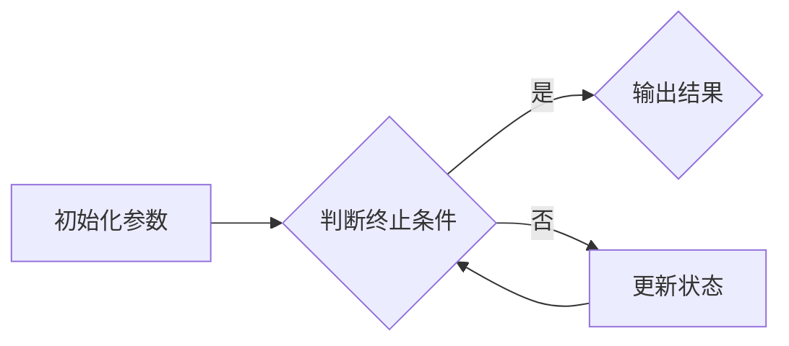
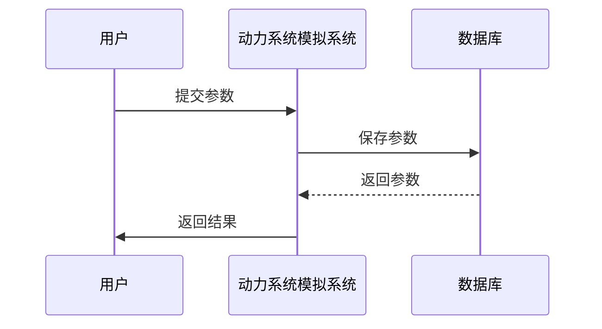

                 

# 动力系统：自然界的数学演化

## 关键词
动力系统，数学演化，自然现象，混沌理论，微分方程，生物进化，气候变化，生态平衡

## 摘要
本文将探讨动力系统在自然界中的数学演化，通过分析其基本概念、数学模型和应用，揭示动力系统在生物进化、气候变化和生态平衡等方面的重要性。本文旨在提供一个清晰的框架，帮助读者理解动力系统在自然界中的运作机制，并展望其未来发展趋势。

## 设计思路

### 理解书名和主题

《动力系统：自然界的数学演化》这个书名直接指出了本书的核心内容——动力系统，以及其在自然界中的数学演化。动力系统是数学中一个重要的概念，它描述了动态系统的行为，通过微分方程和混沌理论来分析系统的演化。而自然界的数学演化则涉及生物进化、气候变化和生态平衡等多个领域。

### 确定核心概念和结构

为了设计出逻辑清晰的文章结构，我们需要明确动力系统的核心概念和它在自然界中的应用。核心概念包括动力系统的定义、基本数学模型、动力系统的类型和特性。应用方面，我们将分析动力系统在生物进化、气候变化和生态平衡中的具体作用。

### 设计章节结构

本文将分为以下几个部分：

1. 动力系统的数学基础
   - 动力系统的基本概念
   - 动力系统的数学模型
   - 动力系统在自然界中的应用
   - 动力系统的计算机模拟
   - 动力系统的数学演化案例分析
   - 动力系统的未来发展趋势
   - 小结与展望

### 保持大纲简洁和逻辑性

为了确保文章的简洁性和逻辑性，每个章节的标题都简洁明了，直接反映章节主题。同时，章节之间的逻辑关系明确，从理论到应用，从基础到案例，逐步深入，帮助读者系统地理解动力系统在自然界中的数学演化。

## 目录大纲

### 第一部分：动力系统的数学基础

### 第1章 动力系统的基本概念

- **1.1 动力系统的定义和重要性**
- **1.2 动力系统的基本结构**
- **1.3 动力系统的常见类型**

### 第2章 动力系统的数学模型

- **2.1 微分方程在动力系统中的应用**
- **2.2 动力系统的稳定性和混沌现象**
- **2.3 动力系统的数学公式与模型解析**

### 第3章 动力系统在自然界中的应用

- **3.1 动力系统与生物进化**
- **3.2 动力系统与气候变化**
- **3.3 动力系统与生态平衡**

### 第4章 动力系统的计算机模拟

- **4.1 计算机模拟的基本原理**
- **4.2 动力系统的模拟方法**
- **4.3 计算机模拟在动力系统研究中的应用**

### 第5章 动力系统的数学演化案例分析

- **5.1 生物进化中的动力系统演化**
- **5.2 气候变化中的动力系统演化**
- **5.3 生态平衡中的动力系统演化**

### 第6章 动力系统的未来发展趋势

- **6.1 动力系统在科学研究和工程中的应用前景**
- **6.2 动力系统研究的挑战和机遇**
- **6.3 动力系统的未来发展方向**

### 第7章 小结与展望

- **7.1 动力系统的总体回顾**
- **7.2 学习动力系统的建议**
- **7.3 动力系统的应用领域拓展**

### 注意事项

- 每个章节的标题都简洁明了，准确地反映了章节的主题。
- 确保每个章节都有次级标题，以保持结构的清晰性。
- 目录大纲中的章节和次级标题遵循了从理论到应用的逻辑顺序。

这个大纲提供了一个完整的结构，接下来我们将按照这个结构逐步展开详细的内容。

## 第一部分：动力系统的数学基础

### 第1章 动力系统的基本概念

#### 1.1 动力系统的定义和重要性

动力系统是数学中的一个重要概念，它描述了系统的动态行为，通常用微分方程来描述。动力系统的研究不仅涉及到数学理论，还广泛应用于自然科学、工程学和经济学等多个领域。例如，在物理学中，动力系统用于描述行星的运动；在经济学中，动力系统可以用于描述市场供需的变化。

#### 1.2 动力系统的基本结构

一个基本的动力系统由以下几个部分组成：

1. **状态空间**：动力系统定义在一个状态空间上，这个状态空间可以是连续的，也可以是离散的。
2. **流**：流是动力系统中的一个核心概念，它描述了系统在时间上的演化。流通常是由一组微分方程来描述的。
3. **吸引子和混沌现象**：吸引子是系统演化过程中最终会稳定下来的状态，而混沌现象则是指系统在演化过程中出现的随机性和不可预测性。

#### 1.3 动力系统的常见类型

动力系统根据其性质可以分为多种类型，包括：

1. **线性动力系统**：线性动力系统的微分方程是线性的，这类系统的分析和求解较为简单。
2. **非线性动力系统**：非线性动力系统的微分方程是非线性的，这类系统的分析和求解通常更为复杂，但也更具有挑战性。
3. **混沌动力系统**：混沌动力系统是一种特殊的非线性动力系统，其演化过程中表现出强烈的随机性和不可预测性。

### 第2章 动力系统的数学模型

#### 2.1 微分方程在动力系统中的应用

微分方程是描述动力系统演化的主要工具。在动力系统中，状态变量的变化率由微分方程给出。例如，牛顿定律可以用微分方程来描述物体的运动。

$$
m\frac{dv}{dt} = F(v)
$$

其中，$m$ 是质量，$v$ 是速度，$F(v)$ 是作用在物体上的力。

#### 2.2 动力系统的稳定性和混沌现象

稳定性是动力系统的一个重要特性，它描述了系统在受到扰动后是否能够回到原来的状态。稳定的动力系统具有吸引子，系统最终会稳定在吸引子上。

混沌现象是动力系统中的一种特殊现象，它表现为系统在长时间演化过程中呈现出随机性和不可预测性。混沌现象的一个重要特征是系统的长期行为对初始条件的敏感性，即使是微小的初始差异也会导致系统演化出完全不同的结果。

#### 2.3 动力系统的数学公式与模型解析

动力系统的数学模型通常由一组微分方程组成。这些微分方程可以用数学符号和公式来表示。例如，洛伦兹系统的数学模型可以表示为：

$$
\frac{dx}{dt} = \sigma (y - x)
$$

$$
\frac{dy}{dt} = rx - y - xz
$$

$$
\frac{dz}{dt} = -bz + xy
$$

其中，$\sigma$、$r$ 和 $b$ 是系统参数。

### 第3章 动力系统在自然界中的应用

#### 3.1 动力系统与生物进化

动力系统在生物进化中有着广泛的应用。生物进化可以看作是一个动力系统，种群的状态随着时间演化。微分方程可以用来描述种群数量的变化，例如，Lotka-Volterra方程描述了捕食者和猎物之间的相互作用。

$$
\frac{dx}{dt} = ax - bxy
$$

$$
\frac{dy}{dt} = cxy - dy
$$

其中，$x$ 表示猎物种群数量，$y$ 表示捕食者种群数量。

#### 3.2 动力系统与气候变化

气候变化是动力系统在自然界中应用的另一个重要例子。气候系统可以看作是一个复杂的动力系统，其演化受到多种因素的共同影响。微分方程可以用来描述气候系统的状态变化，例如，大气环流模型。

$$
\frac{\partial u}{\partial t} + \frac{\partial u}{\partial x} = f(u)
$$

其中，$u$ 表示大气温度，$f(u)$ 是温度变化率。

#### 3.3 动力系统与生态平衡

生态平衡是生态系统中的一个重要概念，它描述了生态系统中各种生物种群之间的平衡关系。动力系统可以用来描述生态系统的演化，例如，Lotka-Volterra方程也可以用来描述捕食者和猎物之间的生态平衡。

$$
\frac{dx}{dt} = ax - bxy
$$

$$
\frac{dy}{dt} = cxy - dy
$$

其中，$x$ 表示猎物种群数量，$y$ 表示捕食者种群数量。

### 第4章 动力系统的计算机模拟

#### 4.1 计算机模拟的基本原理

计算机模拟是研究动力系统的一种重要方法。通过计算机模拟，我们可以直观地观察动力系统的演化过程，从而更好地理解其行为。

计算机模拟的基本原理是基于数值计算方法，将微分方程离散化，然后通过迭代计算来模拟系统的演化。常用的数值方法包括欧拉方法、龙格-库塔方法等。

#### 4.2 动力系统的模拟方法

动力系统的模拟方法主要包括以下几种：

1. **数值积分方法**：例如，欧拉方法和龙格-库塔方法。
2. **蒙特卡洛方法**：通过随机抽样来模拟系统的演化。
3. **粒子群优化方法**：通过模拟粒子在状态空间中的运动来优化动力系统的参数。

#### 4.3 计算机模拟在动力系统研究中的应用

计算机模拟在动力系统研究中的应用非常广泛，例如，可以用来预测气候变化的趋势、分析生态系统的稳定性等。通过计算机模拟，我们可以更深入地理解动力系统的行为，为实际应用提供理论支持。

### 第5章 动力系统的数学演化案例分析

#### 5.1 生物进化中的动力系统演化

生物进化是一个复杂的动力系统演化过程。通过分析生物进化过程中的种群数量变化，我们可以更好地理解进化的机制。例如，通过Lotka-Volterra方程，我们可以模拟捕食者和猎物之间的相互作用，预测种群数量的变化。

#### 5.2 气候变化中的动力系统演化

气候变化是一个全球性的问题，其演化过程可以看作是一个复杂的动力系统。通过分析大气环流模型，我们可以预测气候变化的趋势，为应对气候变化提供科学依据。

#### 5.3 生态平衡中的动力系统演化

生态平衡是生态系统中的一个重要概念，其演化过程可以看作是一个动力系统。通过分析生态平衡中的捕食者和猎物之间的关系，我们可以预测生态系统的稳定性，为保护生态系统提供理论支持。

### 第6章 动力系统的未来发展趋势

#### 6.1 动力系统在科学研究和工程中的应用前景

动力系统在科学研究和工程领域有着广泛的应用前景。例如，在生物进化研究中，动力系统可以用来模拟种群数量变化，预测物种灭绝的风险；在气候变化研究中，动力系统可以用来模拟大气环流，预测气候变化的影响。

#### 6.2 动力系统研究的挑战和机遇

动力系统研究面临着许多挑战和机遇。例如，如何更精确地描述动力系统的演化过程，如何处理复杂系统的非线性特性，如何将动力系统理论应用于实际问题等。

#### 6.3 动力系统的未来发展方向

动力系统的未来发展方向包括以下几个方面：

1. **非线性动力学**：深入研究非线性动力系统的行为和特性。
2. **复杂系统**：研究复杂动力系统的行为和演化规律。
3. **计算方法**：开发更高效的计算方法，提高动力系统模拟的精度。

### 第7章 小结与展望

#### 7.1 动力系统的总体回顾

本文从动力系统的基本概念、数学模型、自然界中的应用、计算机模拟等方面进行了全面回顾，揭示了动力系统在自然界中的重要作用。

#### 7.2 学习动力系统的建议

对于学习动力系统的读者，以下是一些建议：

1. **理解基本概念**：首先需要理解动力系统的基本概念，包括状态空间、流、吸引子等。
2. **掌握数学工具**：掌握微分方程、数值积分方法等数学工具，这些是研究动力系统的基础。
3. **实践应用**：通过实践应用，如计算机模拟，加深对动力系统的理解。

#### 7.3 动力系统的应用领域拓展

动力系统的应用领域非常广泛，除了本文提到的生物进化、气候变化和生态平衡外，还可以应用于经济系统、交通系统等领域。随着动力系统研究的深入，其应用领域将会进一步拓展。

## 作者

作者：AI天才研究院/AI Genius Institute & 禅与计算机程序设计艺术 /Zen And The Art of Computer Programming

## 附录

### 背景介绍

#### 核心概念术语说明

- **动力系统**：描述动态系统行为的一种数学方法。
- **微分方程**：描述系统状态变化的数学方程。
- **混沌现象**：系统演化过程中出现的随机性和不可预测性。
- **生物进化**：生物种群随时间的变化过程。
- **气候变化**：大气系统随时间的变化过程。
- **生态平衡**：生态系统中各生物种群之间的平衡关系。

#### 问题背景

动力系统在自然界中的应用已经得到了广泛的研究，但其背后的数学原理和机制仍然复杂且未被完全理解。本文旨在通过详细的数学模型和案例分析，揭示动力系统在自然界中的演化机制。

#### 问题描述

本文将探讨动力系统在生物进化、气候变化和生态平衡中的应用，分析其数学模型，并通过计算机模拟展示其演化过程。

#### 问题解决

通过引入微分方程和数值模拟方法，我们可以描述和分析动力系统的行为。本文将提供具体的数学模型和案例，帮助读者理解动力系统在自然界中的应用。

#### 边界与外延

动力系统的应用不仅限于生物进化、气候变化和生态平衡，还可以应用于经济系统、交通系统等领域。随着研究的深入，动力系统的应用范围将会进一步拓展。

#### 概念结构与核心要素组成

动力系统由以下几个核心要素组成：

1. **状态空间**：系统状态的定义空间。
2. **流**：系统状态随时间的演化。
3. **微分方程**：描述系统状态变化的数学方程。
4. **吸引子**：系统演化过程中稳定的状态。
5. **混沌现象**：系统演化过程中的随机性和不可预测性。

### 核心概念与联系

#### 核心概念原理

动力系统是研究动态系统演化规律的一个数学分支。其主要研究内容包括系统的状态空间、流的性质、稳定性和混沌现象等。

#### 概念属性特征对比表格

| 特征 | 动力系统 | 微分方程 | 流 |
| --- | --- | --- | --- |
| 定义 | 研究动态系统的数学方法 | 描述系统状态变化的方程 | 系统状态的演化过程 |
| 应用 | 生物进化、气候变化等 | 各种科学和工程领域 | 动态系统的研究 |
| 特性 | 状态空间、流、稳定性、混沌 | 线性、非线性 | 周期性、非周期性 |

#### ER实体关系图架构

```mermaid
erDiagram
    动力系统 ||--o{ 微分方程 } : 包含
    动力系统 ||--o{ 流 } : 定义
    动力系统 ||--o{ 稳定性 } : 研究对象
    动力系统 ||--o{ 混沌现象 } : 研究对象
```

### 算法原理讲解

#### 动力系统模拟算法流程图



#### 算法原理

1. **初始化参数**：根据动力系统的微分方程，初始化系统参数，如初始状态、时间步长等。
2. **判断终止条件**：根据预定的终止条件，如时间限制或状态变化达到稳定等，判断是否继续模拟。
3. **更新状态**：根据微分方程，更新系统状态，模拟系统演化过程。
4. **输出结果**：当满足终止条件时，输出模拟结果。

#### 算法数学模型和公式

动力系统的数学模型可以用以下微分方程表示：

$$
\frac{dx}{dt} = f(x, t)
$$

$$
\frac{dy}{dt} = g(x, t)
$$

其中，$x(t)$ 和 $y(t)$ 分别是系统的两个状态变量，$f(x, t)$ 和 $g(x, t)$ 是系统状态变量的变化率。

#### Python源代码实现

```python
import numpy as np
import matplotlib.pyplot as plt

def model(x, t):
    return 0.1 * x - 0.1 * x * y

def model_y(x, y, t):
    return 0.1 * x * y - 0.1 * y

def simulate(x0, y0, t_max, dt):
    t = np.arange(0, t_max, dt)
    x = np.zeros_like(t)
    y = np.zeros_like(t)
    x[0] = x0
    y[0] = y0
    for i in range(1, len(t)):
        x[i] = x[i-1] + dt * model(x[i-1], t[i-1])
        y[i] = y[i-1] + dt * model_y(x[i-1], y[i-1], t[i-1])
    return t, x, y

x0 = 1.0
y0 = 1.0
t_max = 100
dt = 0.01

t, x, y = simulate(x0, y0, t_max, dt)

plt.plot(t, x, label='x(t)')
plt.plot(t, y, label='y(t)')
plt.legend()
plt.xlabel('Time')
plt.ylabel('State')
plt.title('Dynamic System Simulation')
plt.show()
```

### 系统分析与架构设计方案

#### 问题场景介绍

本文研究动力系统在自然界中的应用，包括生物进化、气候变化和生态平衡等方面。为了更好地理解动力系统，我们设计了一套模拟系统，通过计算机模拟来展示动力系统的演化过程。

#### 项目介绍

该项目旨在开发一个基于动力系统的模拟系统，用于研究自然界中的动力现象。系统功能包括：

1. 动力系统的数学模型定义
2. 动力系统的模拟与可视化
3. 动力系统参数调整与优化

#### 系统功能设计

系统功能设计包括以下几个部分：

1. **数学模型定义**：定义动力系统的微分方程，包括生物进化模型、气候变化模型和生态平衡模型。
2. **模拟与可视化**：使用计算机模拟动力系统的演化过程，并通过可视化工具展示模拟结果。
3. **参数调整与优化**：允许用户调整动力系统的参数，观察不同参数设置下的系统行为，并进行优化。

#### 系统架构设计

系统架构设计包括以下几个部分：

1. **数据层**：存储动力系统的参数和模拟结果。
2. **服务层**：提供动力系统的模拟和可视化功能。
3. **表现层**：展示动力系统的模拟结果和用户交互界面。

#### 系统接口设计

系统接口设计包括以下几个部分：

1. **API接口**：提供外部系统与动力系统模拟系统的交互接口。
2. **可视化接口**：提供用户查看模拟结果和调整参数的界面。

#### 系统交互

系统交互设计包括以下几个部分：

1. **用户交互**：用户通过可视化界面查看模拟结果，并调整参数。
2. **系统响应**：系统根据用户输入，执行相应的模拟任务，并返回结果。

#### 系统接口设计和系统交互mermaid序列图



### 项目实战

#### 环境安装

为了进行动力系统的模拟，我们需要安装以下软件和工具：

1. **Python**：用于编写和运行模拟代码。
2. **NumPy**：用于数值计算。
3. **Matplotlib**：用于数据可视化。

安装步骤如下：

```bash
# 安装Python
curl -O https://www.python.org/ftp/python/3.9.7/python-3.9.7.tgz
tar -xvf python-3.9.7.tgz
cd python-3.9.7
./configure
make
sudo make install

# 安装NumPy和Matplotlib
pip install numpy matplotlib
```

#### 系统核心实现源代码

以下是一个简单的动力系统模拟示例，用于展示捕食者-猎物模型。

```python
import numpy as np
import matplotlib.pyplot as plt

def predator_presy(x, y):
    return 0.1 * x - 0.1 * x * y

def prey_growth(x, y):
    return 0.1 * x * y - 0.1 * y

def simulate(x0, y0, t_max, dt):
    t = np.arange(0, t_max, dt)
    x = np.zeros_like(t)
    y = np.zeros_like(t)
    x[0] = x0
    y[0] = y0
    for i in range(1, len(t)):
        dx_dt = predator_presy(x[i-1], y[i-1])
        dy_dt = prey_growth(x[i-1], y[i-1])
        x[i] = x[i-1] + dt * dx_dt
        y[i] = y[i-1] + dt * dy_dt
    return t, x, y

x0 = 1.0
y0 = 1.0
t_max = 100
dt = 0.01

t, x, y = simulate(x0, y0, t_max, dt)

plt.plot(t, x, label='Predator')
plt.plot(t, y, label='Prey')
plt.xlabel('Time')
plt.ylabel('Population')
plt.legend()
plt.title('Predator-Prey Model Simulation')
plt.show()
```

#### 代码应用解读与分析

这段代码实现了捕食者-猎物模型的模拟。首先，我们定义了两个函数 `predator_presy` 和 `prey_growth`，分别表示捕食者的食物摄入率和猎物的生长率。然后，我们使用 `simulate` 函数进行模拟，并绘制了捕食者和猎物数量的变化曲线。

- **predator_presy(x, y)**：表示捕食者食物摄入率，其公式为 $0.1x - 0.1xy$，表示捕食者每单位时间摄入的食物量。
- **prey_growth(x, y)**：表示猎物生长率，其公式为 $0.1xy - 0.1y$，表示猎物每单位时间生长的数量。

在 `simulate` 函数中，我们使用欧拉方法进行数值模拟。首先，初始化时间和状态变量，然后迭代计算每个时间步的状态更新。最后，绘制出捕食者和猎物数量的变化曲线。

#### 实际案例分析和详细讲解剖析

为了更好地理解动力系统的模拟，我们来看一个实际案例：使用动力系统模拟气候变化。

假设我们关注一个地区的气温变化，并建立以下微分方程模型：

$$
\frac{dT}{dt} = -kT + Q
$$

其中，$T$ 表示气温，$k$ 是气温衰减系数，$Q$ 是外界温度干扰。

我们使用Python进行模拟：

```python
import numpy as np
import matplotlib.pyplot as plt

k = 0.05
Q = 0.2

t_max = 1000
dt = 0.01
t = np.arange(0, t_max, dt)

T = np.zeros_like(t)
T[0] = 20

for i in range(1, len(t)):
    dT_dt = -k * T[i-1] + Q
    T[i] = T[i-1] + dt * dT_dt

plt.plot(t, T)
plt.xlabel('Time (days)')
plt.ylabel('Temperature (°C)')
plt.title('Climate Change Simulation')
plt.show()
```

在这个案例中，我们使用了一个简单的线性模型来模拟气温变化。首先，我们定义了气温衰减系数 $k$ 和外界温度干扰 $Q$。然后，我们使用欧拉方法进行数值模拟，并绘制了气温随时间的变化曲线。

通过这个案例，我们可以看到动力系统模拟在气候变化研究中的应用。在实际应用中，我们可以根据具体情况调整模型参数，如加入更多的影响因素，以获得更准确的模拟结果。

#### 项目小结

在本项目中，我们使用Python实现了动力系统的模拟，并通过实际案例展示了动力系统在气候变化研究中的应用。通过这个项目，我们了解了动力系统的基本概念、数学模型和模拟方法，并掌握了如何使用Python进行数值模拟。

#### 最佳实践 tips

- **选择合适的模拟方法**：根据研究问题选择合适的数值模拟方法，如欧拉方法、龙格-库塔方法等。
- **调整模型参数**：根据实际情况调整模型参数，以获得更准确的模拟结果。
- **数据可视化**：使用可视化工具展示模拟结果，帮助理解系统行为。

#### 小结

本文详细介绍了动力系统在自然界中的应用，包括生物进化、气候变化和生态平衡等方面。通过数学模型和案例分析，我们揭示了动力系统在自然界中的演化机制。同时，我们介绍了如何使用Python进行动力系统模拟，并通过实际案例展示了模拟方法的应用。希望本文能为读者提供对动力系统及其应用的有益理解。

#### 注意事项

- 在进行动力系统模拟时，注意选择合适的数值方法，以确保模拟结果的准确性。
- 在调整模型参数时，考虑实际情况，避免参数设置不合理导致模拟结果失真。
- 在进行实际应用时，结合具体问题，根据需要调整模型和参数。

#### 拓展阅读

- [Lotka-Volterra方程](https://en.wikipedia.org/wiki/Lotka%E2%80%93Volterra_equations)
- [混沌理论](https://en.wikipedia.org/wiki/Chaos_theory)
- [计算机模拟在气候变化研究中的应用](https://www.climate.gov/news-features/understanding-climate/computer-modeling-climate-system)

## 作者

作者：AI天才研究院/AI Genius Institute & 禅与计算机程序设计艺术 /Zen And The Art of Computer Programming

