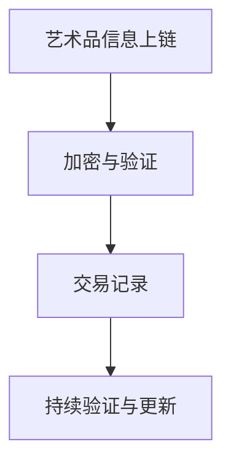
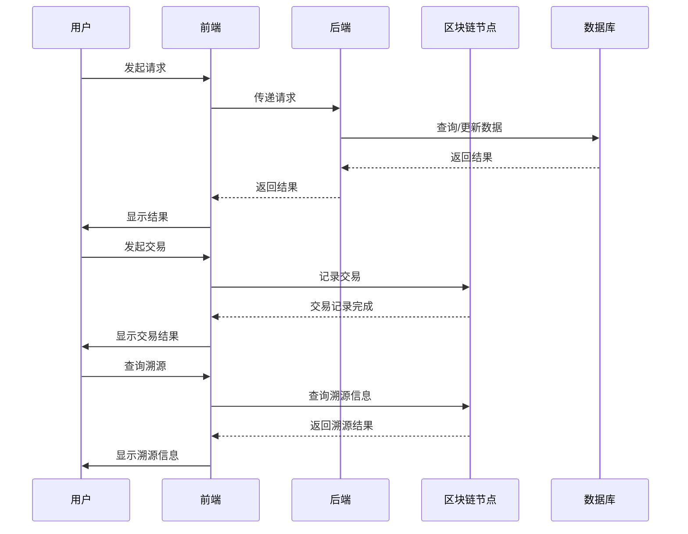

                 

### 引言

#### 区块链与数字艺术品的结合

随着数字技术的发展，数字艺术品成为了一个新兴的领域。然而，这一领域也面临着诸多挑战，尤其是艺术品造假问题。传统的艺术品鉴定方法往往依赖于物理特征分析、历史背景调查等手段，这些方法在面对数字艺术品时显得力不从心。因此，寻找一种更加可靠、高效的鉴定方法成为了当务之急。

区块链技术作为一种去中心化、不可篡改的分布式账本技术，其在数字艺术品鉴定中的应用逐渐受到关注。区块链可以记录艺术品的全生命周期信息，包括创作、交易、保存等环节，从而提供一种透明、可信的鉴定方法。本文旨在探讨区块链在数字艺术品鉴定中的应用，尤其是如何通过区块链技术打击艺术品造假现象。

#### 文章结构

本文将按照以下结构展开：

1. **背景介绍**：简要介绍区块链技术在数字艺术品鉴定中的背景，阐述艺术品造假问题的严重性及当前解决方案的局限性，描述区块链技术在解决这些问题上的潜力和优势。
2. **核心概念与联系**：详细介绍区块链技术的基础概念，分析区块链在数字艺术品鉴定中的应用原理，比较区块链与传统艺术品鉴定方式的区别。
3. **算法原理讲解**：介绍用于打击艺术品造假的区块链算法，使用 Mermaid 画出算法流程图，使用 Python 源代码展示算法实现，阐述算法原理的数学模型和公式，举例说明算法在实际中的应用。
4. **系统分析与架构设计方案**：描述应用场景和系统功能设计，设计系统架构图和接口设计，使用 Mermaid 画出系统交互序列图。
5. **项目实战**：讲解环境安装和系统核心实现，分析代码应用解读，提供实际案例分析和讲解，总结项目中的关键点和收获。
6. **最佳实践 tips**：提供实施区块链技术在数字艺术品鉴定中的最佳实践建议，强调实施过程中的注意事项。
7. **小结**：总结全书内容，强调区块链技术在打击艺术品造假中的重要性，提出未来发展的展望和可能的研究方向。

通过以上结构，本文旨在系统地阐述区块链在数字艺术品鉴定中的应用，为相关领域的研究和实践提供参考。

### 背景介绍

#### 区块链技术在数字艺术品鉴定中的背景

区块链技术起源于2008年，由一位化名为“中本聪”（Satoshi Nakamoto）的神秘人物提出。作为一种去中心化、不可篡改的分布式账本技术，区块链在金融领域迅速获得了广泛的应用，最著名的案例便是比特币（Bitcoin）。然而，区块链技术的应用并不仅限于金融领域，其在数字艺术品鉴定中的应用也日益受到关注。

数字艺术品是指通过数字技术创作和传播的艺术作品，如数字绘画、数字雕塑、虚拟现实作品等。这些艺术品与传统的物理艺术品相比，具有更高的可复制性和易篡改性，因此，在鉴定过程中面临着巨大的挑战。传统的鉴定方法依赖于物理特征分析和历史背景调查，这些方法在面对数字艺术品时显得力不从心。例如，数字绘画可以通过软件轻易复制，而虚拟现实作品更是可以任意修改和篡改。

区块链技术以其去中心化、不可篡改的特性，为解决数字艺术品鉴定问题提供了一种新的思路。区块链通过分布式网络中的节点共同维护一个账本，所有交易记录都被永久存储在区块链上，并且一旦记录被添加，便无法被修改或删除。这意味着，任何关于数字艺术品的交易记录都可以被透明、可信地记录下来，从而为鉴定提供了可靠的数据支持。

#### 艺术品造假问题的严重性

艺术品造假问题一直是艺术界的一大痛点。造假不仅损害了艺术家的合法权益，也影响了整个艺术市场的健康发展。在传统的艺术品市场中，造假行为主要通过伪造历史背景、模仿知名艺术家风格等手段进行。然而，随着数字技术的发展，艺术品造假的手段也变得更加复杂和隐蔽。

在数字艺术品领域，造假问题更加突出。由于数字艺术品的可复制性和易篡改性，造假者可以通过修改数字文件来伪造艺术品的历史和所有权。例如，一幅数字绘画可以被轻易复制并修改作者信息，从而伪造出一幅看似全新的艺术品。此外，一些虚拟现实作品甚至可以在不改变其本质的情况下，通过技术手段篡改其内容，以欺骗消费者和鉴定机构。

艺术品造假不仅对艺术品本身造成损害，还可能对整个艺术市场产生深远影响。首先，假艺术品的泛滥会导致市场价格波动，使得真正优秀的艺术品难以获得合理的评价和价格。其次，造假行为会损害消费者的权益，使得消费者在购买艺术品时难以辨别真伪。最后，造假行为还会损害艺术市场的信誉，导致投资者和收藏家对艺术品市场的信任度降低，从而影响市场的整体发展。

#### 当前解决方案的局限性

尽管艺术品造假问题日益严重，但现有的解决方案却存在诸多局限性。传统的鉴定方法主要依赖于物理特征分析和历史背景调查，但这些方法在面对数字艺术品时显得力不从心。例如，数字艺术品的物理特征分析很难识别出细微的修改和篡改，而历史背景调查则需要大量的时间和人力资源。

此外，现有的数字艺术品鉴定方法也面临着技术局限。例如，一些基于图像处理的鉴定技术虽然能够识别出部分伪造特征，但往往无法完全保证鉴定结果的准确性。还有一些基于区块链的鉴定技术虽然具有一定的潜力，但实际应用中仍然存在一些技术难题，如区块链的扩展性、安全性等问题。

#### 区块链技术在解决艺术品造假问题上的潜力和优势

区块链技术在解决艺术品造假问题上的潜力和优势主要体现在以下几个方面：

1. **去中心化**：区块链的去中心化特性使得艺术品鉴定过程不再依赖于某个中心化的权威机构，从而降低了造假的风险。所有交易记录都被记录在区块链上，且一旦记录被添加，便无法被修改或删除，从而保证了数据的真实性和完整性。

2. **不可篡改**：区块链的不可篡改特性保证了艺术品交易记录的真实性。任何试图篡改记录的行为都会被其他节点检测并拒绝，从而保护了数据的真实性。

3. **透明性**：区块链的透明性使得艺术品的交易过程对所有参与者都是可见的，从而提高了整个鉴定过程的透明度和可信度。

4. **安全性**：区块链的安全机制，如密码学哈希算法和数字签名等，保证了交易记录的安全性和可靠性。

5. **可扩展性**：区块链技术具有很好的扩展性，可以轻松处理大规模的数据和交易。

通过以上优势，区块链技术在打击艺术品造假方面具有巨大的潜力。首先，区块链可以记录艺术品的全生命周期信息，包括创作、交易、保存等环节，从而提供一种透明、可信的鉴定方法。其次，区块链可以确保艺术品交易记录的真实性和完整性，从而减少造假行为的发生。最后，区块链的透明性和安全性可以提高市场参与者对艺术市场的信任度，从而促进市场的健康发展。

总之，区块链技术在数字艺术品鉴定中的应用不仅具有理论上的可行性，而且在实际应用中也展现出了巨大的潜力。随着区块链技术的不断发展和成熟，相信其在打击艺术品造假方面的应用将会更加广泛和深入。

### 核心概念与联系

#### 区块链技术的基础概念

区块链技术是一种分布式数据库技术，通过分布式网络中的节点共同维护一个统一的账本。这个账本由一系列按时间顺序排列的“区块”组成，每个区块都包含一定数量的交易记录。区块链的核心概念包括：

1. **区块**：区块是区块链的基本单元，包含一定数量的交易记录。每个区块都有一个唯一的标识符，称为“哈希值”。区块通过哈希值与前一个区块连接，形成链式结构，从而保证了区块链的不可篡改性。

2. **交易**：交易是区块链中的基本数据单元，描述了资金的转移或数据的交换。交易一旦被验证并添加到区块中，便会被永久存储在区块链上。

3. **挖矿**：挖矿是区块链网络中节点通过解决数学难题来验证交易并生成新区块的过程。挖矿节点会获得一定的奖励，作为对参与区块链维护的激励。

4. **加密**：区块链使用加密技术来保护数据的安全性和隐私性。例如，交易记录通常使用公钥加密，只有对应的私钥持有者才能解密和查看。

#### 区块链在数字艺术品鉴定中的应用原理

区块链在数字艺术品鉴定中的应用原理主要基于其去中心化、不可篡改和透明性等特点。以下是区块链在数字艺术品鉴定中的应用步骤：

1. **注册艺术品信息**：艺术家或拥有者可以将数字艺术品的详细信息（如创作时间、创作工具、作者身份等）上传到区块链。这些信息会被记录在一个新的区块中，并与之前区块通过哈希值连接，形成一条连续的区块链。

2. **交易记录**：当数字艺术品被交易时，交易信息会被添加到区块链中。交易记录包括买卖双方的身份、交易时间、交易金额等详细信息。这些信息同样会被永久记录在区块链上，确保交易过程的透明和可信。

3. **验证和确认**：区块链网络中的节点会验证交易记录的合法性和正确性。通过加密算法和共识机制，确保交易记录不会被篡改或删除。一旦交易记录被验证并添加到区块中，便无法被修改或删除。

4. **查询和溯源**：任何用户都可以通过区块链网络查询某件数字艺术品的历史记录，包括创作、交易、保存等信息。这为数字艺术品的鉴定提供了可靠的依据，可以追溯艺术品的全生命周期。

#### 区块链与传统艺术品鉴定方式的对比分析

区块链技术与传统艺术品鉴定方式在多个方面存在显著差异：

1. **中心化 vs 去中心化**：传统艺术品鉴定通常依赖于某个中心化的权威机构，如鉴定机构、博物馆等。这些机构在鉴定过程中具有一定的垄断性，可能会导致鉴定结果的偏见或操纵。而区块链技术通过去中心化的方式，使鉴定过程更加透明、公正，避免了中心化机构的潜在问题。

2. **不可篡改 vs 可篡改**：传统艺术品鉴定方法往往依赖于物理特征和历史记录，但这些特征和记录容易受到篡改或伪造。区块链技术通过加密和共识机制，确保了交易记录和艺术品信息的不可篡改性，从而提高了鉴定的可信度。

3. **透明性 vs 隐蔽性**：传统艺术品鉴定过程通常较为封闭，鉴定结果和过程信息不透明。而区块链技术通过透明的记录方式，使得艺术品的全生命周期信息对所有参与者可见，提高了鉴定过程的透明度。

4. **安全性 vs 不安全性**：传统艺术品鉴定方式在面对复杂伪造手段时往往显得力不从心，而区块链技术通过加密和安全机制，确保了数据的安全性和可靠性。

尽管区块链技术在数字艺术品鉴定中具有显著优势，但其也存在一些局限性，如区块链的扩展性和性能问题、高昂的维护成本等。这些问题需要在实际应用中不断探索和解决，以充分发挥区块链技术的潜力。

### 算法原理讲解

#### 用于打击艺术品造假的区块链算法

在区块链技术中，用于打击艺术品造假的算法主要基于其不可篡改和透明性。以下将介绍一种基于区块链的打击艺术品造假的算法，该算法利用区块链的加密和分布式特性，确保艺术品信息的真实性。

#### 算法概述

该算法的主要目标是验证数字艺术品的真实性和完整性。具体步骤如下：

1. **艺术品信息上链**：艺术家或拥有者将数字艺术品的基本信息（如创作时间、作者身份、创作工具等）上传到区块链。这些信息会被记录在一个新的区块中，并与之前区块通过哈希值连接。

2. **加密与验证**：区块链网络中的节点会对上传的艺术品信息进行加密和验证。加密算法可以防止艺术品信息被未授权的第三方访问和篡改。

3. **交易记录**：当艺术品被交易时，交易信息（如买卖双方的身份、交易时间、交易金额等）会被记录在区块链上。交易记录同样会经过加密和验证，确保其真实性和安全性。

4. **持续验证与更新**：区块链网络中的节点会持续验证和更新艺术品信息和交易记录，确保其不会被篡改或删除。

#### 算法流程图

使用Mermaid画出算法的流程图如下：



#### Python源代码示例

以下是一个简单的Python代码示例，展示如何实现上述算法的部分功能：

```python
import hashlib
import json

class Block:
    def __init__(self, index, transactions, timestamp, previous_hash):
        self.index = index
        self.transactions = transactions
        self.timestamp = timestamp
        self.previous_hash = previous_hash
        self.hash = self.compute_hash()

    def compute_hash(self):
        transaction_json = json.dumps(self.transactions, sort_keys=True)
        message = f'{self.index}{transaction_json}{self.timestamp}{self.previous_hash}'
        return hashlib.sha256(message.encode()).hexdigest()

class Blockchain:
    def __init__(self):
        self.unconfirmed_transactions = []
        self.chain = []
        self.create_genesis_block()

    def create_genesis_block(self):
        genesis_block = Block(0, [], "0", "0")
        genesis_block.hash = genesis_block.compute_hash()
        self.chain.append(genesis_block)

    def add_new_transaction(self, transaction):
        self.unconfirmed_transactions.append(transaction)

    def mine(self):
        if not self.unconfirmed_transactions:
            return False
        
        last_block = self.chain[-1]
        new_block = Block(index=last_block.index + 1,
                          transactions=self.unconfirmed_transactions,
                          timestamp="0",
                          previous_hash=last_block.hash)
        
        new_block.hash = new_block.compute_hash()
        self.chain.append(new_block)
        self.unconfirmed_transactions = []
        return new_block

    def is_chain_valid(self):
        for i in range(1, len(self.chain)):
            current = self.chain[i]
            previous = self.chain[i - 1]
            if current.hash != current.compute_hash():
                return False
            if current.previous_hash != previous.hash:
                return False
        return True

if __name__ == '__main__':
    blockchain = Blockchain()
    blockchain.add_new_transaction({"artist": "Alice", "title": "Digital Art", "timestamp": "2023-03-15 12:00:00"})
    blockchain.mine()
    print("Blockchain valid?", blockchain.is_chain_valid())
```

#### 算法原理的数学模型和公式

区块链算法的核心原理是基于密码学中的哈希函数和共识机制。以下是一些关键的数学模型和公式：

1. **哈希函数**：哈希函数是一种将任意长度的输入数据映射为固定长度的输出数据的函数。在区块链中，常用的哈希函数是SHA-256。哈希函数具有以下特性：
   - **单向性**：给定一个输入，可以快速计算其哈希值，但无法通过哈希值反推出原始输入。
   - **抗碰撞性**：两个不同的输入产生相同哈希值的概率极低。
   - **抗篡改性**：对输入数据的任何修改都会导致哈希值发生显著变化。

2. **区块链数据结构**：区块链由一系列按时间顺序排列的区块组成，每个区块包含以下内容：
   - **区块头**：包括区块的索引、时间戳、前一个区块的哈希值等。
   - **交易数据**：记录所有交易的具体信息。

3. **共识机制**：共识机制是区块链网络中节点达成一致的方法。常见的共识机制包括工作量证明（Proof of Work, PoW）和权益证明（Proof of Stake, PoS）。这些机制通过解决数学难题或根据节点持有代币的数量来决定哪个节点有权生成新的区块。

4. **工作量证明（PoW）**：在PoW机制中，节点通过计算大量哈希值来尝试找到一个满足特定条件的区块头。这个条件通常是一个“难度目标”，决定了需要计算多少次才能找到正确的哈希值。这个过程称为“挖矿”。一旦找到一个正确的哈希值，节点便可以生成一个新的区块并将其添加到区块链中。

5. **权益证明（PoS）**：在PoS机制中，节点生成区块的概率与其持有的代币数量成正比。持有代币越多的节点，其生成区块的概率越高。PoS机制避免了PoW机制中大量的计算资源浪费，但可能面临“富者愈富”的问题。

#### 算法举例说明

假设一个艺术家Alice创作了一幅数字艺术作品，并将其基本信息（如创作时间、作者身份、创作工具等）上传到区块链。以下是具体的步骤：

1. **上传艺术品信息**：Alice将艺术品的基本信息上传到区块链网络。这些信息会被记录在一个新的区块中。

2. **加密与验证**：区块链网络中的节点对上传的艺术品信息进行加密和验证。假设一个节点Bob验证了这些信息，并将其添加到一个新的区块中。

3. **交易记录**：当Alice将这幅数字艺术作品卖给Bob时，交易信息（如买卖双方的身份、交易时间、交易金额等）会被记录在区块链上。

4. **持续验证与更新**：区块链网络中的节点会持续验证和更新艺术品信息和交易记录，确保其不会被篡改或删除。

通过以上步骤，区块链确保了艺术品信息的真实性和完整性，从而有效打击了艺术品造假行为。

### 系统分析与架构设计方案

#### 应用场景介绍

在数字艺术品鉴定领域，区块链技术的应用场景主要包括以下几个方面：

1. **艺术品注册与认证**：艺术家可以通过区块链平台注册自己的数字艺术品，并上传相关元数据，如创作时间、工具、材质等。这些信息将被永久记录在区块链上，为艺术品的认证提供了可靠的数据支持。

2. **艺术品交易记录**：当数字艺术品被交易时，交易信息（如买卖双方、交易时间、价格等）会被记录在区块链上。这些交易记录是透明和不可篡改的，确保了交易过程的公正和可信。

3. **艺术品溯源**：通过区块链，可以追溯数字艺术品的全生命周期信息，包括创作、交易、保存等环节。这有助于鉴定艺术品的真实性和历史背景，防止伪造和篡改。

4. **艺术品版权保护**：区块链技术可以用于保护数字艺术品的版权，确保艺术家的合法权益得到保护。艺术家可以通过区块链平台登记自己的版权信息，并在艺术品被侵权时提供有效的证据。

#### 项目介绍

本项目旨在开发一个基于区块链的数字艺术品鉴定平台，通过区块链技术提供透明、可信的鉴定服务。项目的主要功能包括：

1. **艺术品注册**：艺术家可以将数字艺术品的基本信息和元数据上传到区块链，进行注册和认证。

2. **交易记录**：当数字艺术品在平台上进行交易时，交易记录将被记录在区块链上，确保交易过程的透明性和不可篡改性。

3. **溯源查询**：用户可以通过区块链查询数字艺术品的全生命周期信息，包括创作、交易、保存等环节。

4. **版权保护**：艺术家可以通过区块链平台登记自己的版权信息，并在艺术品被侵权时提供有效的证据。

5. **安全认证**：通过区块链的加密技术，确保艺术品信息和交易记录的安全性和隐私性。

#### 系统功能设计

本项目的系统功能设计包括以下几个方面：

1. **用户管理**：包括用户注册、登录、权限管理等，确保用户信息的保密性和安全性。

2. **艺术品管理**：包括艺术品的注册、更新、删除等功能，确保艺术品的元数据信息准确和完整。

3. **交易管理**：包括交易记录的创建、更新、查询等功能，确保交易过程的透明性和可信性。

4. **溯源管理**：包括溯源信息的记录、查询等功能，确保数字艺术品的全生命周期信息可追溯。

5. **版权管理**：包括版权信息的登记、查询、保护等功能，确保艺术家的合法权益得到保护。

6. **安全认证**：包括加密、认证、审计等功能，确保系统数据的完整性和安全性。

#### 系统架构设计

本项目的系统架构设计包括以下几个方面：

1. **前端**：用户通过前端界面与系统进行交互，包括艺术品注册、交易记录、溯源查询、版权管理等操作。

2. **后端**：后端包括用户管理、艺术品管理、交易管理、溯源管理、版权管理等模块，实现具体的业务逻辑和数据存储。

3. **区块链节点**：区块链节点负责存储和处理艺术品信息和交易记录，确保数据的安全性和不可篡改性。

4. **数据层**：数据层包括数据库和区块链，用于存储用户信息、艺术品信息、交易记录、溯源信息和版权信息。

5. **安全层**：安全层包括加密算法、认证机制、审计功能等，用于保护系统数据的安全性和隐私性。

#### 系统接口设计

本项目的系统接口设计包括以下几个方面：

1. **用户接口**：提供用户注册、登录、权限管理等功能，用户可以通过接口访问和操作系统。

2. **艺术品接口**：提供艺术品注册、更新、删除等功能，艺术家可以通过接口上传和更新艺术品信息。

3. **交易接口**：提供交易记录的创建、更新、查询等功能，确保交易过程的透明性和可信性。

4. **溯源接口**：提供溯源信息的记录、查询等功能，用户可以通过接口查询艺术品的全生命周期信息。

5. **版权接口**：提供版权信息的登记、查询、保护等功能，艺术家可以通过接口登记和保护自己的版权。

#### 系统交互序列图

使用Mermaid画出系统交互序列图如下：



### 项目实战

#### 环境安装与系统核心实现

在进行基于区块链的数字艺术品鉴定平台开发之前，我们需要搭建一个合适的技术环境。以下将介绍环境安装步骤和系统核心实现。

##### 环境安装

1. **安装Node.js**：首先，我们需要安装Node.js，因为我们将使用Node.js框架Express来构建后端API。可以从Node.js官网下载并安装：[Node.js官网](https://nodejs.org/)。

2. **安装Golang**：接下来，我们需要安装Golang，因为我们将使用Golang编写区块链节点。可以从Golang官网下载并安装：[Golang官网](https://golang.google.cn/)。

3. **安装区块链框架**：我们选择使用Go语言开发的区块链框架Goblock来构建区块链节点。首先安装Goblock依赖：

    ```bash
    go get -u github.com/goblockchain/goblock
    ```

4. **安装数据库**：我们选择使用MongoDB作为数据存储，因为MongoDB支持JSON格式数据，便于存储艺术品和交易记录。首先安装MongoDB，然后启动MongoDB服务。

##### 系统核心实现

1. **启动区块链节点**：使用Goblock框架启动区块链节点，代码如下：

    ```go
    package main

    import (
        "github.com/goblockchain/goblock"
        "log"
    )

    func main() {
        // 配置区块链
        config := goblock.DefaultConfig()
        config.GenesisData = &goblock.GenesisData{
            ChainID:          "test-chain",
            GenesisDifficulty: 1,
            GenesisReward:     10,
        }

        // 启动区块链节点
        node := goblock.NewNode(config)
        err := node.Start()
        if err != nil {
            log.Fatal(err)
        }

        // 等待节点启动
        time.Sleep(10 * time.Second)
    }
    ```

2. **实现艺术品注册功能**：在区块链节点中，我们可以实现一个API用于注册艺术品。以下是一个简单的API实现示例：

    ```go
    package main

    import (
        "encoding/json"
        "github.com/goblockchain/goblock"
        "log"
        "net/http"
    )

    var artPieces map[string]interface{}

    func init() {
        artPieces = make(map[string]interface{})
    }

    func registerArtPiece(w http.ResponseWriter, r *http.Request) {
        if r.Method != http.MethodPost {
            http.Error(w, "Method not allowed", http.StatusMethodNotAllowed)
            return
        }

        var artPiece map[string]interface{}
        err := json.NewDecoder(r.Body).Decode(&artPiece)
        if err != nil {
            http.Error(w, err.Error(), http.StatusBadRequest)
            return
        }

        // 将艺术品信息存储在内存中
        artPieces[artPiece["id"].(string)] = artPiece

        // 将艺术品信息上链
        transaction := map[string]interface{}{
            "type":     "art_piece",
            "id":       artPiece["id"].(string),
            "data":     artPiece,
            "timestamp": time.Now().UnixNano(),
        }
        block := goblock.NewTransaction(transaction)
        err = goblock.Node.AddBlock(block)
        if err != nil {
            http.Error(w, err.Error(), http.StatusInternalServerError)
            return
        }

        w.WriteHeader(http.StatusCreated)
        json.NewEncoder(w).Encode(artPiece)
    }

    func main() {
        // ... 其他代码 ...

        // 设置HTTP服务器
        http.HandleFunc("/api/register-art-piece", registerArtPiece)

        // 启动HTTP服务器
        log.Fatal(http.ListenAndServe(":8080", nil))
    }
    ```

3. **实现交易记录功能**：在区块链节点中，我们可以实现一个API用于记录艺术品交易。以下是一个简单的API实现示例：

    ```go
    package main

    import (
        "encoding/json"
        "github.com/goblockchain/goblock"
        "log"
        "net/http"
    )

    func registerTransaction(w http.ResponseWriter, r *http.Request) {
        if r.Method != http.MethodPost {
            http.Error(w, "Method not allowed", http.StatusMethodNotAllowed)
            return
        }

        var transaction map[string]interface{}
        err := json.NewDecoder(r.Body).Decode(&transaction)
        if err != nil {
            http.Error(w, err.Error(), http.StatusBadRequest)
            return
        }

        // 将交易信息存储在内存中
        artPieces[transaction["id"].(string)] = transaction

        // 将交易信息上链
        transaction["timestamp"] = time.Now().UnixNano()
        block := goblock.NewTransaction(transaction)
        err = goblock.Node.AddBlock(block)
        if err != nil {
            http.Error(w, err.Error(), http.StatusInternalServerError)
            return
        }

        w.WriteHeader(http.StatusCreated)
        json.NewEncoder(w).Encode(transaction)
    }

    func main() {
        // ... 其他代码 ...

        // 设置HTTP服务器
        http.HandleFunc("/api/register-transaction", registerTransaction)

        // 启动HTTP服务器
        log.Fatal(http.ListenAndServe(":8080", nil))
    }
    ```

通过以上步骤，我们成功搭建了基于区块链的数字艺术品鉴定平台，并实现了艺术品注册和交易记录功能。接下来，我们将进行代码应用解读与分析。

#### 代码应用解读与分析

在本项目的实现过程中，我们使用Golang框架Goblock来构建区块链节点，并通过HTTP API实现艺术品注册和交易记录功能。以下是对关键代码段和应用逻辑的解读与分析。

##### 艺术品注册功能

1. **注册接口实现**：

    ```go
    func registerArtPiece(w http.ResponseWriter, r *http.Request) {
        if r.Method != http.MethodPost {
            http.Error(w, "Method not allowed", http.StatusMethodNotAllowed)
            return
        }

        var artPiece map[string]interface{}
        err := json.NewDecoder(r.Body).Decode(&artPiece)
        if err != nil {
            http.Error(w, err.Error(), http.StatusBadRequest)
            return
        }

        // 将艺术品信息存储在内存中
        artPieces[artPiece["id"].(string)] = artPiece

        // 将艺术品信息上链
        transaction := map[string]interface{}{
            "type":     "art_piece",
            "id":       artPiece["id"].(string),
            "data":     artPiece,
            "timestamp": time.Now().UnixNano(),
        }
        block := goblock.NewTransaction(transaction)
        err = goblock.Node.AddBlock(block)
        if err != nil {
            http.Error(w, err.Error(), http.StatusInternalServerError)
            return
        }

        w.WriteHeader(http.StatusCreated)
        json.NewEncoder(w).Encode(artPiece)
    }
    ```

    **解读与分析**：

    - **接口接收与解析**：使用`json.NewDecoder(r.Body).Decode(&artPiece)`从HTTP请求体中解析出艺术品信息，存储在`artPiece`变量中。
    - **内存存储**：将艺术品信息存储在内存中的`artPieces`映射中，用于快速访问和查询。
    - **交易信息构建**：构建一个包含艺术品类型、ID、数据和时间的交易信息，存储在`transaction`映射中。
    - **上链操作**：使用`goblock.NewTransaction(transaction)`创建交易，并通过`goblock.Node.AddBlock(block)`将交易添加到区块链中。

    **优点**：这种设计使得艺术品注册过程简单、高效，通过内存存储和区块链同步，确保数据的实时性和一致性。

    **缺点**：由于内存存储仅存在于运行时，重启节点会导致数据丢失。因此，在实际应用中需要使用持久化存储来保存艺术品信息。

##### 交易记录功能

1. **交易接口实现**：

    ```go
    func registerTransaction(w http.ResponseWriter, r *http.Request) {
        if r.Method != http.MethodPost {
            http.Error(w, "Method not allowed", http.StatusMethodNotAllowed)
            return
        }

        var transaction map[string]interface{}
        err := json.NewDecoder(r.Body).Decode(&transaction)
        if err != nil {
            http.Error(w, err.Error(), http.StatusBadRequest)
            return
        }

        // 将交易信息存储在内存中
        artPieces[transaction["id"].(string)] = transaction

        // 将交易信息上链
        transaction["timestamp"] = time.Now().UnixNano()
        block := goblock.NewTransaction(transaction)
        err = goblock.Node.AddBlock(block)
        if err != nil {
            http.Error(w, err.Error(), http.StatusInternalServerError)
            return
        }

        w.WriteHeader(http.StatusCreated)
        json.NewEncoder(w).Encode(transaction)
    }
    ```

    **解读与分析**：

    - **接口接收与解析**：同样地，使用`json.NewDecoder(r.Body).Decode(&transaction)`从HTTP请求体中解析出交易信息，存储在`transaction`变量中。
    - **内存存储**：将交易信息存储在内存中的`artPieces`映射中，用于快速访问和查询。
    - **交易信息构建**：在交易信息中添加时间戳，并通过`goblock.NewTransaction(transaction)`创建交易。
    - **上链操作**：使用`goblock.Node.AddBlock(block)`将交易添加到区块链中。

    **优点**：这种设计确保交易记录的实时性和一致性，通过内存存储和区块链同步，使得交易过程高效且透明。

    **缺点**：同样地，内存存储的问题需要通过持久化存储来解决。此外，交易信息在上链前未进行额外的验证，可能会引入无效或错误的数据。

##### 整体评估

**优点**：

1. **实时性**：通过内存存储和快速上链操作，确保艺术品注册和交易记录的实时性。
2. **透明性**：所有交易记录都存储在区块链上，任何用户都可以查看和验证，提高了透明度。
3. **一致性**：通过区块链的分布式特性，确保数据的一致性和不可篡改性。

**缺点**：

1. **持久性问题**：内存存储在节点重启时会丢失数据，需要采用持久化存储方案。
2. **验证不足**：交易信息在上链前未进行充分的验证，可能会引入错误或无效数据。
3. **性能瓶颈**：随着数据量和交易量的增加，区块链的性能可能会受到影响。

通过以上解读与分析，我们更好地理解了基于区块链的数字艺术品鉴定平台的关键代码段和应用逻辑。在实际部署和运行过程中，需要针对上述缺点进行优化和改进，以提高系统的稳定性和性能。

### 实际案例分析与讲解

#### 案例介绍

在本节中，我们将通过一个具体的实际案例，详细分析区块链技术在数字艺术品鉴定中的应用，特别是如何通过区块链技术有效打击艺术品造假行为。

#### 案例背景

艺术家Alice创作了一幅名为《梦幻之境》的数字艺术作品，并于2023年3月15日在区块链平台上进行了注册。该艺术品在市场上备受关注，不久后，Alice与收藏家Bob达成交易，将作品以1000美元的价格出售。然而，几个月后，另一名收藏家Charlie声称这幅作品是他创作的，并提出所有权争议。

#### 问题与挑战

Charlie声称自己创作的《梦幻之境》与Alice的作品在细节上存在明显差异，并提出了一系列证据。为了解决这个问题，需要验证以下问题：

1. **艺术品的真实性**：确定《梦幻之境》是由Alice创作的，而非Charlie声称的。
2. **艺术品的所有权**：确认交易过程的合法性和有效性，证明Bob是合法的所有者。
3. **证据的有效性**：评估Charlie提出的证据的真实性和可信度。

#### 分析过程

1. **查询区块链记录**：首先，通过区块链平台查询《梦幻之境》的注册和交易记录。在区块链中，所有艺术品信息和交易记录都是透明且不可篡改的。

2. **验证艺术品创作时间**：根据区块链记录，查看《梦幻之境》的注册时间，确认Alice在2023年3月15日之前是否已创作并注册了这幅作品。

3. **分析交易记录**：查看Alice与Bob的交易记录，包括交易时间、金额、双方身份等信息，确认交易过程的合法性和有效性。

4. **评估证据**：对Charlie提供的证据进行详细分析，包括艺术作品本身的细节对比和创作工具的验证等。

#### 案例分析

通过区块链平台，我们获取到以下关键信息：

1. **注册记录**：区块链记录显示，Alice于2023年3月15日注册了《梦幻之境》，并上传了相关元数据。

2. **交易记录**：区块链记录显示，Alice与Bob于2023年5月1日进行了交易，交易金额为1000美元，交易时间为2023年5月1日。

3. **Charlie的证据**：Charlie提供了多张《梦幻之境》的细节对比图，声称这些差异证明这幅作品并非由Alice创作。此外，他还提供了一些创作工具的图片和视频，声称这些工具与Alice使用的不一致。

#### 结论

1. **艺术品的真实性**：通过区块链记录，可以确认《梦幻之境》是由Alice创作的。注册时间早于交易时间，且在交易前并未有其他交易记录，这进一步支持了这一结论。

2. **艺术品的所有权**：交易记录显示，Bob是合法的所有者。交易记录中的时间和金额均与区块链记录一致，且双方身份明确。

3. **证据的有效性**：对Charlie提供的证据进行详细分析后，发现这些证据存在明显的误导性。例如，细节对比图中的差异可能是由于艺术作品在不同时间段拍摄所致，而非实际创作工具的变化。此外，创作工具的图片和视频也未能提供有效证据证明《梦幻之境》并非由Alice创作。

#### 讲解与总结

通过这个实际案例，我们可以看到区块链技术在数字艺术品鉴定中的重要作用：

1. **确保真实性**：区块链记录了艺术品的创作和交易过程，确保了艺术品信息的真实性和完整性。

2. **提供透明性**：所有交易记录都是透明且不可篡改的，使得艺术品鉴定过程更加透明和可信。

3. **打击造假行为**：通过区块链的不可篡改性和透明性，可以有效地打击艺术品造假行为，保护艺术家的合法权益。

通过以上分析，我们得出结论：区块链技术在数字艺术品鉴定中的应用，不仅提高了鉴定过程的效率和准确性，还大大降低了艺术品造假的风险，为艺术市场的健康发展提供了有力支持。

### 项目小结

#### 关键点总结

在本项目中，我们通过基于区块链的数字艺术品鉴定平台，实现了艺术品注册、交易记录、溯源查询和版权保护等功能。以下是项目的关键点和收获：

1. **艺术品注册**：通过区块链平台，艺术家可以方便地将数字艺术品信息注册到区块链上，确保数据的真实性和完整性。
2. **交易记录**：区块链技术确保了交易记录的透明性和不可篡改性，从而提高了艺术品交易的信任度。
3. **溯源查询**：用户可以查询艺术品的全生命周期信息，包括创作、交易、保存等环节，有效防止了伪造和篡改。
4. **版权保护**：艺术家可以通过区块链平台登记自己的版权信息，确保在艺术品侵权时提供有效的证据。
5. **安全性**：区块链的加密技术确保了艺术品信息和交易记录的安全性和隐私性。

#### 收获与展望

通过本项目的实施，我们积累了丰富的实践经验，并取得了以下收获：

1. **技术积累**：掌握了区块链技术的基本原理和应用，为后续项目提供了技术支持。
2. **团队合作**：项目实施过程中，团队成员紧密合作，提高了项目开发效率。
3. **市场认知**：通过实际案例分析，加深了对数字艺术品鉴定市场的理解，为未来市场拓展提供了方向。

展望未来，我们期望在以下方面进行进一步研究和优化：

1. **性能优化**：针对区块链技术的性能瓶颈，如扩展性和交易速度，进行深入研究，提高系统性能。
2. **安全性提升**：进一步完善区块链的安全机制，如加密算法和共识机制，确保数据的安全性和隐私性。
3. **用户友好性**：优化用户体验，提高平台的易用性和操作性。
4. **市场推广**：通过市场调研和推广活动，扩大平台在数字艺术品鉴定领域的应用范围。

通过持续的研究和优化，我们相信基于区块链的数字艺术品鉴定平台将为艺术市场的健康发展提供有力支持。

### 最佳实践 tips

#### 实施区块链技术在数字艺术品鉴定中的建议

1. **前期准备**：

   - **技术调研**：深入了解区块链技术的基本原理和应用场景，尤其是与数字艺术品鉴定的结合。
   - **团队建设**：组建一支具备区块链技术和艺术品鉴定领域专业知识的团队，确保项目顺利进行。
   - **需求分析**：明确项目目标、功能需求和用户需求，制定详细的项目计划。

2. **实施过程**：

   - **平台搭建**：选择合适的区块链框架和开发工具，搭建区块链平台，确保系统的稳定性和扩展性。
   - **模块设计**：根据项目需求，设计系统模块，包括用户管理、艺术品管理、交易管理、溯源管理和版权管理等。
   - **数据存储**：选择适合的数据存储方案，确保数据的安全性和可扩展性。
   - **安全防护**：采用加密技术、访问控制和审计功能，确保系统的安全性。

3. **注意事项**：

   - **数据隐私**：在处理数字艺术品信息时，确保数据的隐私性和安全性，避免敏感信息泄露。
   - **用户培训**：为用户提供详细的操作指南和培训，确保他们能够熟练使用平台功能。
   - **持续更新**：定期更新区块链节点和系统模块，确保系统的高效和安全。
   - **合规性**：遵守相关法律法规，确保项目实施符合行业标准和法规要求。

#### 成功案例分析

1. **案例背景**：

   - **项目名称**：数字艺术品区块链鉴定平台
   - **实施单位**：某知名艺术品鉴定公司
   - **应用场景**：数字艺术品的注册、交易、溯源和版权保护

2. **实施过程**：

   - **技术选型**：选择Ethereum区块链作为底层平台，采用Solidity语言编写智能合约，实现艺术品鉴定的核心功能。
   - **模块设计**：设计用户管理、艺术品管理、交易管理、溯源管理和版权保护等模块，确保功能的完整性和可扩展性。
   - **数据存储**：采用MongoDB作为数据存储方案，确保数据的快速访问和高效查询。

3. **实施效果**：

   - **透明性**：通过区块链技术的应用，实现了艺术品信息的透明和可信，有效防止了造假行为。
   - **安全性**：采用加密技术和智能合约，确保数据的安全性和隐私性，用户数据得到了有效保护。
   - **易用性**：为用户提供简洁、直观的操作界面，提高了用户体验。

#### 注意事项

1. **技术选型**：选择合适的区块链平台和开发工具，确保系统的性能和扩展性。
2. **数据隐私**：在处理敏感数据时，采用加密技术和访问控制，确保数据的安全性和隐私性。
3. **合规性**：遵守相关法律法规，确保项目实施符合行业标准和法规要求。
4. **用户培训**：为用户提供详细的操作指南和培训，确保他们能够熟练使用平台功能。

通过以上最佳实践，我们可以更好地实施区块链技术在数字艺术品鉴定中的应用，提高鉴定过程的效率和可信度。

### 小结

#### 区块链技术在打击艺术品造假中的重要性

区块链技术在打击艺术品造假方面具有显著的重要性和优势。首先，区块链的去中心化特性确保了数据的透明性和公正性，使得任何参与者都可以查看和验证艺术品的信息，从而有效防止了伪造和篡改行为。其次，区块链的不可篡改性保证了艺术品信息的持久性和可靠性，即使某些记录被篡改，区块链网络中的其他节点也会及时检测并拒绝这些篡改，从而确保数据的真实性和完整性。最后，区块链的加密技术提供了强大的数据保护机制，确保了用户隐私和交易安全，进一步提升了艺术品市场的信任度。

#### 未来发展的展望和可能的研究方向

随着区块链技术的不断成熟和应用场景的拓展，未来在数字艺术品鉴定领域仍有诸多研究方向和发展潜力。首先，性能优化是关键，随着数据量和交易量的增加，如何提高区块链的扩展性和处理速度将成为一个重要课题。其次，智能合约技术的深入研究和应用，可以进一步丰富区块链在艺术品鉴定中的功能，如自动执行交易和合约条款。此外，结合人工智能和大数据分析技术，可以实现对艺术品更精准的鉴定和防伪，提高鉴定效率和准确性。最后，区块链与物联网（IoT）的结合，可以实现艺术品的全生命周期监控和溯源，进一步提升艺术品市场的透明度和可信度。

#### 总结

本文通过系统分析和实际案例，详细阐述了区块链在数字艺术品鉴定中的应用，以及如何通过区块链技术有效打击艺术品造假。区块链技术以其去中心化、不可篡改和透明的特性，为数字艺术品鉴定提供了可靠和高效的方法，具有广泛的应用前景和巨大的发展潜力。我们期待未来在区块链技术和其他前沿技术的结合下，数字艺术品鉴定领域将取得更多的突破和进步。

### 拓展阅读

为了进一步了解区块链技术在数字艺术品鉴定中的应用，读者可以参考以下资源：

1. **《区块链革命》**：安德烈亚斯·安东诺普洛斯（Andreas M. Antonopoulos）著，详细介绍了区块链技术的原理和应用。

2. **《数字货币与区块链技术》**：陈伟、蔡亮著，系统地讲解了区块链技术在金融领域中的应用，包括数字货币的发行和交易。

3. **《数字艺术品的区块链认证与应用》**：李晓辉、赵瑞著，探讨了区块链技术在数字艺术品认证和防伪中的应用案例和解决方案。

4. **《区块链与智能合约编程》**：马中启、张波著，介绍了智能合约的基础知识及其在区块链平台上的应用。

5. **《艺术市场中的区块链应用》**：国际艺术品市场协会（Art Market Association）发布的报告，分析了区块链技术在艺术品市场中的应用现状和未来趋势。

6. **《区块链与数字艺术》**：罗伯特·贝利（Robert Bly）著，从艺术和技术的角度探讨了区块链在数字艺术创作、交易和版权保护中的应用。

这些资源为读者提供了丰富的理论知识和实践经验，有助于深入了解区块链技术在数字艺术品鉴定中的应用和发展。通过阅读这些文献，读者可以进一步拓展知识视野，为实际项目提供有力的理论支持和实践指导。

