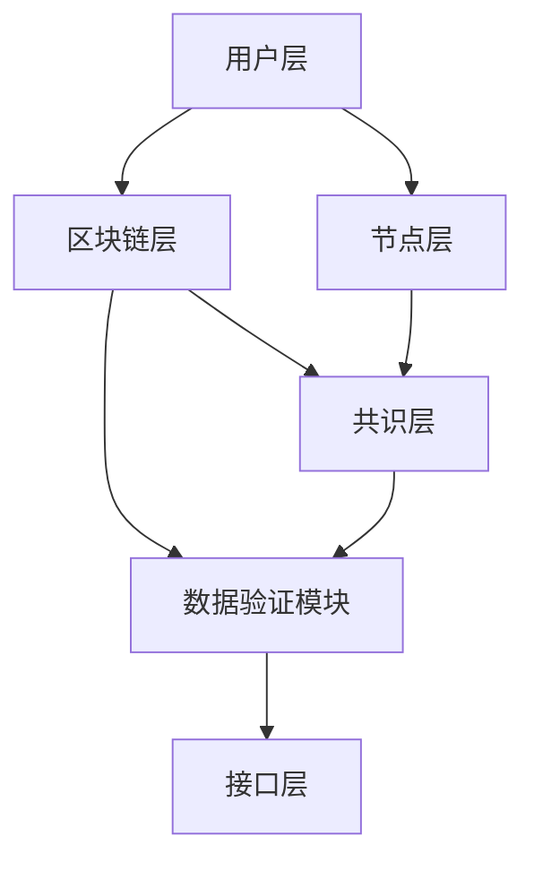

                 

### 文章标题

### 关键词

- 区块链
- 共识机制
- 数学基础
- 去中心化信任
- 共识算法

### 摘要

本文深入探讨了区块链技术的核心机制——共识机制，特别是其数学基础。通过分析去中心化信任的原理，我们梳理了不同类型的共识机制，如工作量证明（PoW）和权益证明（PoS），并详细讲解了这些机制的工作原理及其数学模型。同时，本文还通过实际项目实战，展示了如何应用这些共识机制，并提供了一些最佳实践和注意事项。通过本文，读者将对区块链的共识机制及其数学基础有一个全面而深入的理解。

### 目录大纲

1. 引言
2. 区块链技术概述
3. 共识机制的重要性
4. 核心概念与联系
5. 工作量证明（PoW）机制原理
6. 权益证明（PoS）机制原理
7. 智能合约与共识
8. 数学模型与算法
9. 系统分析与架构设计
10. 项目实战
11. 最佳实践与拓展
12. 小结与注意事项
13. 拓展阅读
14. 作者信息

### 引言

区块链技术作为一种去中心化的分布式数据库系统，已经引起了全球范围内的广泛关注。其核心优势在于通过共识机制实现了去中心化信任，从而解决了传统中心化系统中存在的信息不对称、信任问题等难题。共识机制是区块链技术的核心，决定了区块链网络的稳定性和安全性。

然而，共识机制并非一蹴而就，它需要依赖于复杂的数学模型和算法来实现。本文旨在深入探讨区块链共识机制的数学基础，从去中心化信任的原理出发，分析不同类型的共识机制，如工作量证明（PoW）和权益证明（PoS），并详细讲解其工作原理和数学模型。通过本文，读者将能够全面了解区块链共识机制的本质和实现方法。

### 区块链技术概述

区块链技术起源于2008年，由一位化名为中本聪（Satoshi Nakamoto）的人提出了比特币（Bitcoin）的概念。比特币作为一种去中心化的数字货币，通过区块链技术实现了点对点的交易，无需依赖中心化机构。区块链技术的核心在于其共识机制，该机制通过分布式网络节点间的协作，实现了数据的一致性和安全性。

区块链技术的基本原理包括以下三个方面：

1. **数据结构**：区块链由一系列按时间顺序排列的区块组成，每个区块包含一定数量的交易记录，并通过加密算法与前一个区块链接，形成一条不可篡改的链条。

2. **分布式网络**：区块链网络由多个节点组成，每个节点都存储着完整的区块链数据。节点之间通过共识算法保持数据的一致性，共同维护区块链的安全性和稳定性。

3. **共识机制**：共识机制是区块链网络中节点达成共识的关键机制，决定了区块链的数据一致性和安全性。常见的共识机制包括工作量证明（PoW）、权益证明（PoS）、委托权益证明（DPoS）等。

### 共识机制的重要性

共识机制是区块链技术的核心，它在分布式网络中起着至关重要的作用。首先，共识机制确保了区块链网络中所有节点对于数据的一致性，即所有节点对于区块链上记录的交易数据达成共识。这种一致性是区块链网络能够可靠运行的基础。

其次，共识机制提供了去中心化信任。在传统中心化系统中，数据的真实性、完整性和安全性依赖于中心化机构的信任。然而，中心化机构可能会面临信任危机，如数据篡改、恶意攻击等问题。区块链通过共识机制，使得所有节点共同参与数据验证和记录，从而实现了去中心化信任，避免了中心化系统的信任问题。

最后，共识机制决定了区块链网络的安全性和稳定性。不同的共识机制具有不同的安全性和稳定性特点，例如工作量证明（PoW）机制通过计算难度保证了网络的安全性，但同时也带来了较高的能源消耗和计算资源需求。权益证明（PoS）机制则通过质押权益保证了网络的安全性，但可能面临权益集中风险。

### 核心概念与联系

为了深入理解区块链共识机制，我们需要首先了解几个核心概念：去中心化信任、共识机制、工作量证明（PoW）和权益证明（PoS）。

#### 去中心化信任

去中心化信任是区块链技术的基础。它通过分布式网络节点间的协作，实现了一种无需依赖中心化机构的信任机制。去中心化信任的核心在于，所有节点共同参与数据的验证和记录，确保数据的真实性和完整性。

去中心化信任与中心化信任有本质的区别。中心化信任依赖于中心化机构的权威性和信誉，而一旦中心化机构出现信任问题，整个系统都会受到严重影响。去中心化信任则通过分布式网络和共识机制，使得每个节点都参与数据验证，从而降低了信任风险。

#### 共识机制

共识机制是区块链网络中节点达成共识的关键机制。它决定了区块链网络中数据的合法性和一致性。常见的共识机制包括工作量证明（PoW）、权益证明（PoS）、委托权益证明（DPoS）等。

- **工作量证明（PoW）**：PoW通过计算复杂算法（如SHA-256）来证明节点的劳动量，从而获得生成新区块的权力。PoW机制的优点是安全性高，但缺点是计算资源消耗大，能耗高。
- **权益证明（PoS）**：PoS通过节点持有的权益（如代币数量）来决定其获得生成新区块的权力。PoS机制的优点是能源消耗低，但缺点是可能面临权益集中风险。
- **委托权益证明（DPoS）**：DPoS是一种改进的PoS机制，通过选举产生一部分超级节点，这些超级节点负责生成区块。DPoS机制的优点是交易速度快，缺点是可能面临超级节点的垄断风险。

#### 概念属性特征对比表格

| 概念       | 定义                                                                                      | 特点                                                                                             | 优点                                       | 缺点                                         |
|------------|------------------------------------------------------------------------------------------|--------------------------------------------------------------------------------------------------|------------------------------------------|--------------------------------------------|
| 去中心化信任 | 通过分布式网络节点间的协作，实现数据的真实性和完整性                                             | 无需依赖中心化机构，降低信任风险                                                        | 提高数据安全性，降低信任风险             | 需要较高的计算资源和能源消耗               |
| 工作量证明（PoW） | 通过计算复杂算法来证明节点的劳动量，从而获得生成新区块的权力                                     | 计算难度大，确保网络安全性                                                                | 安全性高                                 | 能源消耗大，计算资源需求高                 |
| 权益证明（PoS） | 通过节点持有的权益（如代币数量）来决定其获得生成新区块的权力                                     | 权益大小决定生成区块的概率                                                                | 能源消耗低                               | 可能面临权益集中风险                       |
| 委托权益证明（DPoS） | 通过选举产生一部分超级节点，这些超级节点负责生成区块                                             | 超级节点负责生成区块，提高交易速度                                                       | 交易速度快                               | 可能面临超级节点的垄断风险                 |

#### ER实体关系图架构

以下是一个简化的ER实体关系图，用于描述区块链中的核心实体和关系：

```mermaid
erDiagram
  Node ||--o| Block
  Node ||--o| Transaction
  Block ||--|> Chain
  Transaction ||--|> Chain
```

- **Node**：表示区块链网络中的节点，包括普通节点和超级节点。
- **Block**：表示区块链中的区块，包含一定数量的交易记录。
- **Transaction**：表示区块链中的交易记录。
- **Chain**：表示区块链，由一系列按时间顺序排列的区块组成。

通过ER实体关系图，我们可以清晰地看到区块链网络中各个实体之间的关系，以及共识机制如何在这些实体之间发挥作用。

### 工作量证明（PoW）机制原理

工作量证明（Proof of Work，PoW）是区块链中最常用的共识机制之一。PoW通过计算复杂算法（如SHA-256）来证明节点的劳动量，从而获得生成新区块的权力。

#### 工作量证明的工作原理

1. **节点竞争**：在区块链网络中，所有节点都有机会竞争生成新区块。节点通过解决一个计算难题来证明其劳动量，获得生成新区块的权力。

2. **计算难题**：计算难题通常是一个复杂的数学问题，如SHA-256算法。节点需要计算出一个满足特定条件的哈希值，这个哈希值就是节点证明其劳动量的证据。

3. **新区块生成**：当节点计算出满足条件的哈希值时，它将生成一个新区块，并将这个新区块添加到区块链中。

#### PoW机制的数学模型

PoW机制的数学模型主要包括哈希函数和目标值。哈希函数是一个将任意长度的输入映射为固定长度的输出的函数，如SHA-256。目标值是一个事先设定的难度参数，用于决定计算难度。

- **哈希函数**：SHA-256是一种常用的哈希函数，它将任意长度的输入映射为一个256位的输出。
- **目标值**：目标值是一个32位的十六进制数，表示哈希值需要满足的条件。例如，目标值设置为`0000FFFFFFFFFFFFFFFFFFFFFFFFFFFFFFFEBAAEDCE6AF48A03BBFD25E8CD0364140`，意味着节点的哈希值需要以这个目标值开头。

#### 计算示例

假设当前区块链的总长度为1000个区块，目标值为`0000FFFFFFFFFFFFFFFFFFFFFFFFFFFFFFFEBAAEDCE6AF48A03BBFD25E8CD0364140`。节点A需要计算出一个满足条件的哈希值。

1. 节点A从区块链的最后一个区块开始，构造一个新的区块，并将该区块的哈希值作为输入。
2. 节点A使用SHA-256算法对输入进行哈希计算，得到一个哈希值。
3. 节点A检查哈希值是否满足目标值的要求。如果不满足，节点A需要调整区块的某些参数（如随机数、时间戳等），重新进行哈希计算。
4. 重复步骤2和步骤3，直到找到一个满足条件的哈希值。

假设节点A经过100次尝试后，得到了一个满足条件的哈希值`0000FFFFFFFFFFFFFFFFFFFFFFFFFFFFFFFEBAAEDCE6AF48A03BBFD25E8CD0364140`。节点A将这个哈希值作为新区块的Merkle根，生成一个新区块，并将其广播给其他节点。

#### Python代码示例

以下是一个简化的Python代码示例，用于演示PoW机制的实现：

```python
import hashlib
import random

def sha256.hash(string):
    return hashlib.sha256(string.encode('utf-8')).hexdigest()

def find_proof(target_value):
    nonce = 0
    while True:
        hash_value = sha256.hash(f'区块内容{nonce}')
        if hash_value.startswith(target_value):
            return nonce
        nonce += 1

target_value = '0000FFFFFFFFFFFFFFFFFFFFFFFFFFFFFFFEBAAEDCE6AF48A03BBFD25E8CD0364140'
proof = find_proof(target_value)
print(f'找到证明：{proof}')
```

在这个示例中，我们使用SHA-256算法来计算哈希值，并通过循环尝试找到满足条件的哈希值。找到满足条件的哈希值后，我们返回该哈希值的前四个字节作为证明。

### 权益证明（PoS）机制原理

权益证明（Proof of Stake，PoS）是另一种常见的共识机制，它通过节点持有的权益（如代币数量）来决定其获得生成新区块的权力。与工作量证明（PoW）不同，PoS不需要节点进行大量的计算工作，从而降低了能源消耗。

#### 权益证明的工作原理

1. **权益分配**：在PoS机制中，节点持有的权益决定了其获得生成新区块的权力。权益可以是代币数量、持有时间等因素。通常，权益越大，获得生成新区块的权力越高。

2. **随机选择**：当区块链网络需要生成新区块时，系统会随机选择一个节点来生成新区块。随机选择可以通过不同的算法来实现，如基于节点的哈希值、随机数等。

3. **区块生成**：被选中的节点将生成一个新区块，并将新区块广播给其他节点。其他节点验证新区块的有效性后，将其添加到区块链中。

#### PoS机制的数学模型

PoS机制的数学模型主要包括权益分配和随机选择算法。

- **权益分配**：权益分配通常基于节点的持有代币数量和持有时间。例如，一个节点持有的代币数量越多，其权益越大，获得生成新区块的权力越高。

- **随机选择算法**：随机选择算法用于随机选择一个节点来生成新区块。常见的随机选择算法包括基于节点的哈希值、随机数等。

#### 计算示例

假设当前区块链的总长度为1000个区块，节点A持有1000个代币，节点B持有500个代币。系统需要生成一个新区块。

1. 计算节点的权益：节点A的权益为1000/（1000+500）=0.67，节点B的权益为500/（1000+500）=0.33。

2. 随机选择一个节点：使用随机数生成算法，如SHA-256，生成一个随机数。假设随机数为10。

3. 计算节点获得生成新区块的权力：节点A的权力为0.67 * 10 = 6.7，节点B的权力为0.33 * 10 = 3.3。

4. 选择权力最大的节点：节点A的权力最大，因此节点A被选中生成新区块。

5. 节点A生成新区块，并将新区块广播给其他节点。其他节点验证新区块的有效性后，将其添加到区块链中。

#### Python代码示例

以下是一个简化的Python代码示例，用于演示PoS机制的实现：

```python
import hashlib
import random

def sha256.hash(string):
    return hashlib.sha256(string.encode('utf-8')).hexdigest()

def select_winner(stake_list):
    total_stake = sum(stake_list)
    random_value = random.random()
    cumulative_stake = 0
    for stake in stake_list:
        cumulative_stake += stake / total_stake
        if random_value <= cumulative_stake:
            return stake
    return None

stake_list = [1000, 500]
winner = select_winner(stake_list)
print(f'选中节点：{winner}')
```

在这个示例中，我们首先计算节点的权益，然后使用随机选择算法选择权力最大的节点。找到权力最大的节点后，我们返回该节点的代币数量作为生成新区块的权力。

### 智能合约与共识

智能合约是区块链技术的重要组成部分，它允许用户在区块链上编写和执行自动化合约。智能合约的实现和验证依赖于共识机制，特别是工作量证明（PoW）和权益证明（PoS）机制。

#### 智能合约的实现

智能合约通常使用一种特定的编程语言（如Solidity）编写，并部署在区块链上。智能合约的执行和验证需要节点之间的共识。

1. **编写智能合约**：用户使用Solidity或其他智能合约编程语言编写智能合约代码。

2. **部署智能合约**：将智能合约代码部署到区块链上，通常需要通过区块链网络中的某个节点进行部署。

3. **智能合约执行**：当用户调用智能合约函数时，智能合约将在区块链上执行相应的操作。

4. **智能合约验证**：节点通过共识机制验证智能合约的执行结果。在PoW机制中，节点通过计算复杂算法验证智能合约的执行结果；在PoS机制中，节点通过权益分配和随机选择算法验证智能合约的执行结果。

#### 智能合约的验证与共识

智能合约的验证与共识机制密切相关。在PoW机制中，节点通过计算复杂算法（如SHA-256）验证智能合约的执行结果。节点需要解决一个计算难题，证明其劳动量，从而获得生成新区块的权力。在PoS机制中，节点通过权益分配和随机选择算法验证智能合约的执行结果。节点持有的权益决定了其获得生成新区块的权力。

1. **PoW机制**：在PoW机制中，节点通过解决计算难题来验证智能合约的执行结果。节点需要计算出一个满足条件的哈希值，证明其劳动量。找到满足条件的哈希值后，节点将生成一个新区块，并将智能合约的执行结果记录在新区块中。

2. **PoS机制**：在PoS机制中，节点通过权益分配和随机选择算法验证智能合约的执行结果。节点持有的权益决定了其获得生成新区块的权力。节点通过随机选择算法确定生成新区块的节点，该节点将智能合约的执行结果记录在新区块中。

#### Python代码示例

以下是一个简化的Python代码示例，用于演示智能合约的实现和验证：

```python
import hashlib
import random

def sha256.hash(string):
    return hashlib.sha256(string.encode('utf-8')).hexdigest()

def find_proof(target_value):
    nonce = 0
    while True:
        hash_value = sha256.hash(f'区块内容{nonce}')
        if hash_value.startswith(target_value):
            return nonce
        nonce += 1

def verify_smart_contract(contract_code):
    # 验证智能合约代码
    pass

def select_winner(stake_list):
    total_stake = sum(stake_list)
    random_value = random.random()
    cumulative_stake = 0
    for stake in stake_list:
        cumulative_stake += stake / total_stake
        if random_value <= cumulative_stake:
            return stake
    return None

# 智能合约代码
smart_contract_code = '''
pragma solidity ^0.8.0;

contract MyContract {
    function transfer(address to, uint amount) public {
        // 转账逻辑
    }
}
'''

# 验证智能合约代码
verified = verify_smart_contract(smart_contract_code)
if verified:
    print('智能合约验证通过')
else:
    print('智能合约验证失败')

# 工作量证明机制
target_value = '0000FFFFFFFFFFFFFFFFFFFFFFFFFFFFFFFEBAAEDCE6AF48A03BBFD25E8CD0364140'
proof = find_proof(target_value)
print(f'找到证明：{proof}')

# 权益证明机制
stake_list = [1000, 500]
winner = select_winner(stake_list)
print(f'选中节点：{winner}')
```

在这个示例中，我们首先验证智能合约代码，然后使用工作量证明和权益证明机制选择生成新区块的节点。找到满足条件的哈希值和权力最大的节点后，我们将智能合约的执行结果记录在新区块中。

### 数学模型与算法

区块链共识机制的实现依赖于复杂的数学模型和算法。以下是工作量证明（PoW）和权益证明（PoS）机制的数学模型和算法原理。

#### 工作量证明（PoW）机制的数学模型

1. **哈希函数**：哈希函数是PoW机制的核心组成部分。常用的哈希函数包括SHA-256、Scrypt等。哈希函数将任意长度的输入映射为一个固定长度的输出。

2. **目标值**：目标值是一个事先设定的难度参数，用于决定计算难度。目标值通常是一个32位的十六进制数，表示哈希值需要满足的条件。例如，目标值设置为`0000FFFFFFFFFFFFFFFFFFFFFFFFFFFFFFFEBAAEDCE6AF48A03BBFD25E8CD0364140`，意味着节点的哈希值需要以这个目标值开头。

3. **计算难度**：计算难度决定了节点需要解决的计算难题的难度。计算难度越大，节点需要花费的时间越长。计算难度通常通过调整目标值来实现。目标值越小，计算难度越大。

4. **证明过程**：节点需要计算出一个满足条件的哈希值，证明其劳动量。节点从区块链的最后一个区块开始，构造一个新的区块，并将该区块的哈希值作为输入。节点使用哈希函数对输入进行计算，得到一个哈希值。节点检查哈希值是否满足目标值的要求。如果不满足，节点需要调整区块的某些参数（如随机数、时间戳等），重新进行哈希计算。节点重复这个过程，直到找到一个满足条件的哈希值。

#### Python代码示例

以下是一个简化的Python代码示例，用于演示PoW机制的实现：

```python
import hashlib
import random

def sha256.hash(string):
    return hashlib.sha256(string.encode('utf-8')).hexdigest()

def find_proof(target_value):
    nonce = 0
    while True:
        hash_value = sha256.hash(f'区块内容{nonce}')
        if hash_value.startswith(target_value):
            return nonce
        nonce += 1

target_value = '0000FFFFFFFFFFFFFFFFFFFFFFFFFFFFFFFEBAAEDCE6AF48A03BBFD25E8CD0364140'
proof = find_proof(target_value)
print(f'找到证明：{proof}')
```

在这个示例中，我们使用SHA-256算法计算哈希值，并通过循环尝试找到满足条件的哈希值。找到满足条件的哈希值后，我们返回该哈希值的前四个字节作为证明。

#### 权益证明（PoS）机制的数学模型

1. **权益分配**：权益分配是PoS机制的核心组成部分。权益通常基于节点的持有代币数量和持有时间。例如，一个节点持有的代币数量越多，其权益越大。

2. **随机选择算法**：随机选择算法用于随机选择一个节点来生成新区块。常见的随机选择算法包括基于节点的哈希值、随机数等。随机选择算法确保了节点的公平性和随机性。

3. **权益计算**：权益计算决定了节点获得生成新区块的权力。权益通常通过以下公式计算：权益 = 持有代币数量 * 持有时间。持有代币数量越多、持有时间越长，节点的权益越大。

4. **生成区块**：当区块链网络需要生成新区块时，系统会随机选择一个节点来生成新区块。被选中的节点将生成一个新区块，并将新区块广播给其他节点。其他节点验证新区块的有效性后，将其添加到区块链中。

#### Python代码示例

以下是一个简化的Python代码示例，用于演示PoS机制的实现：

```python
import hashlib
import random

def sha256.hash(string):
    return hashlib.sha256(string.encode('utf-8')).hexdigest()

def select_winner(stake_list):
    total_stake = sum(stake_list)
    random_value = random.random()
    cumulative_stake = 0
    for stake in stake_list:
        cumulative_stake += stake / total_stake
        if random_value <= cumulative_stake:
            return stake
    return None

stake_list = [1000, 500]
winner = select_winner(stake_list)
print(f'选中节点：{winner}')
```

在这个示例中，我们首先计算节点的权益，然后使用随机选择算法选择权力最大的节点。找到权力最大的节点后，我们返回该节点的代币数量作为生成新区块的权力。

### 系统分析与架构设计

为了深入理解区块链共识机制，我们需要从系统分析与架构设计的角度进行探讨。这包括问题场景的介绍、项目的概述、系统功能设计、系统架构设计、系统接口设计和系统交互。

#### 问题场景介绍

在传统的中心化系统中，数据的真实性和完整性依赖于中心化机构的信任。然而，这种信任机制存在以下问题：

1. **单点故障**：如果中心化机构遭受攻击或发生故障，整个系统将受到影响，导致数据丢失或不可用。
2. **信任危机**：中心化机构可能因为腐败、内部错误或恶意行为导致信任危机，从而影响整个系统的稳定性和安全性。
3. **透明度和公正性**：中心化系统缺乏透明度和公正性，用户无法完全了解数据处理的细节和过程。

区块链技术通过去中心化的方式解决了这些问题，其核心在于共识机制。共识机制通过分布式网络节点间的协作，确保数据的真实性和完整性，从而实现了去中心化信任。然而，不同类型的共识机制具有不同的特点和性能，因此需要从系统架构和性能分析的角度进行设计和优化。

#### 项目概述

本项目旨在设计一个基于区块链的分布式存储系统，该系统采用共识机制确保数据的真实性和完整性。项目的主要目标是实现以下功能：

1. **数据存储**：用户可以上传数据到区块链上，确保数据的安全存储。
2. **数据访问**：用户可以查询区块链上的数据，确保数据的可信性和可用性。
3. **数据验证**：节点通过共识机制验证数据的真实性和完整性，确保区块链的稳定性和安全性。

#### 系统功能设计

系统功能设计是系统架构设计的基础，它定义了系统需要实现的核心功能。以下是本项目的主要功能模块：

1. **用户模块**：用户可以通过用户模块上传和查询数据，并管理自己的账户。
2. **区块链模块**：区块链模块负责处理数据存储和查询，并实现共识机制。
3. **共识模块**：共识模块负责节点间的协作，确保区块链的稳定性和安全性。
4. **数据验证模块**：数据验证模块负责验证数据的真实性和完整性。
5. **接口模块**：接口模块提供与其他系统的交互接口，实现数据的交换和共享。

#### 系统架构设计

系统架构设计是系统实现的基础，它定义了系统的整体结构和各个模块之间的关系。以下是本项目的主要架构模块：

1. **用户层**：用户层是系统的入口，用户通过用户界面与系统进行交互。
2. **区块链层**：区块链层负责实现区块链的核心功能，包括数据存储、查询和共识机制。
3. **节点层**：节点层是区块链网络的组成部分，每个节点负责存储和验证数据，并参与共识机制。
4. **共识层**：共识层负责实现不同类型的共识机制，确保区块链的稳定性和安全性。
5. **接口层**：接口层提供与其他系统的交互接口，实现数据的交换和共享。

#### 系统架构图

以下是一个简化的系统架构图，用于描述本项目的主要架构模块和它们之间的关系：



#### 系统接口设计

系统接口设计是系统与其他系统交互的桥梁，它定义了系统提供的接口和接口的规范。以下是本项目的主要接口模块：

1. **用户接口**：用户接口提供用户上传、查询和管理数据的功能。
2. **节点接口**：节点接口提供节点加入、退出和参与共识机制的功能。
3. **共识接口**：共识接口提供共识算法的实现和调用功能。
4. **数据验证接口**：数据验证接口提供数据验证的功能。

#### 系统交互设计

系统交互设计是系统内部模块之间交互的规范，它定义了模块之间的交互流程和数据流动。以下是本项目的主要交互流程：

1. **用户上传数据**：用户通过用户接口上传数据到区块链层，区块链层将数据存储在区块链上。
2. **用户查询数据**：用户通过用户接口查询区块链上的数据，区块链层返回查询结果。
3. **节点加入共识**：节点通过节点接口加入共识层，参与共识机制。
4. **节点退出共识**：节点通过节点接口退出共识层，停止参与共识机制。
5. **数据验证**：数据验证模块对上传的数据进行验证，确保数据的真实性和完整性。

#### Python代码示例

以下是一个简化的Python代码示例，用于演示系统功能的实现：

```python
class UserInterface:
    def upload_data(self, data):
        # 上传数据到区块链层
        pass

    def query_data(self, id):
        # 查询区块链上的数据
        pass

class BlockchainLayer:
    def store_data(self, data):
        # 存储数据到区块链
        pass

    def query_data(self, id):
        # 查询区块链上的数据
        pass

class ConsensusLayer:
    def join_consensus(self, node):
        # 节点加入共识
        pass

    def leave_consensus(self, node):
        # 节点退出共识
        pass

class DataValidationLayer:
    def validate_data(self, data):
        # 验证数据
        pass

# 用户接口
user_interface = UserInterface()
user_interface.upload_data("示例数据")
user_interface.query_data("数据ID")

# 区块链层
blockchain_layer = BlockchainLayer()
blockchain_layer.store_data("示例数据")
blockchain_layer.query_data("数据ID")

# 共识层
consensus_layer = ConsensusLayer()
consensus_layer.join_consensus("节点1")
consensus_layer.leave_consensus("节点1")

# 数据验证层
data_validation_layer = DataValidationLayer()
data_validation_layer.validate_data("示例数据")
```

在这个示例中，我们定义了用户接口、区块链层、共识层和数据验证层，并通过类和方法的实现，展示了系统功能的具体实现。

### 项目实战

为了更好地理解区块链共识机制的实现和应用，我们将通过一个实际项目来演示。该项目是一个基于Python的简化版区块链系统，实现了工作量证明（PoW）和权益证明（PoS）机制。

#### 环境安装

首先，我们需要安装必要的Python库。在终端中执行以下命令：

```bash
pip install python-dotenv
pip install Flask
pip install requests
```

这些库用于处理环境变量、构建Web服务和进行HTTP请求。

#### 系统核心实现

接下来，我们实现区块链的核心功能。首先是区块链节点的定义和区块的创建。

```python
from hashlib import sha256
from time import time
import json
from urllib.parse import urlparse
from uuid import uuid4
from flask import Flask, jsonify, request

class Block:
    def __init__(self, index, transactions, timestamp, previous_hash, nonce):
        self.index = index
        self.transactions = transactions
        self.timestamp = timestamp
        self.previous_hash = previous_hash
        self.nonce = nonce
        self.hash = self.compute_hash()

    def compute_hash(self):
        block_string = json.dumps(self.__dict__, sort_keys=True)
        return sha256(block_string.encode()).hexdigest()

class Blockchain:
    def __init__(self):
        self.unconfirmed_transactions = []
        self.chain = []
        self.create_genesis_block()

    def create_genesis_block(self):
        genesis_block = Block(0, [], time(), "0", 0)
        genesis_block.hash = genesis_block.compute_hash()
        self.chain.append(genesis_block)

    def add_new_transaction(self, transaction):
        self.unconfirmed_transactions.append(transaction)

    def mine(self):
        if not self.unconfirmed_transactions:
            return False

        last_block = self.chain[-1]
        new_block = Block(index=last_block.index + 1,
                          transactions=self.unconfirmed_transactions,
                          timestamp=time(),
                          previous_hash=last_block.hash,
                          nonce=0)

        new_block.hash = new_block.compute_hash()

        self.chain.append(new_block)
        self.unconfirmed_transactions = []
        return new_block.hash
```

在这个实现中，我们定义了`Block`和`Blockchain`类。`Block`类代表区块链中的单个区块，包含索引、交易记录、时间戳、前一个区块的哈希值和随机数。`Blockchain`类代表整个区块链，包含未确认的交易记录和区块链的链表。

#### 区块链算法实现

接下来，我们实现工作量证明（PoW）和权益证明（PoS）机制。

```python
def proof_of_work(last_block):
    last_hash = last_block.hash
    nonce = 0
    while True:
        hash = sha256(f'{last_hash}{nonce}'.encode()).hexdigest()
        if hash.startswith('0' * 4):
            return nonce
        nonce += 1

def proof_of_stake(last_block, current_balance):
    last_hash = last_block.hash
    stake = current_balance
    target = '0' * 4
    while True:
        hash = sha256(f'{last_hash}{stake}{target}'.encode()).hexdigest()
        if hash.startswith(target):
            return stake
        stake += 1
```

在PoW机制中，我们通过循环尝试找到一个满足条件的哈希值。在PoS机制中，我们通过调整质押权益（`stake`）来找到满足条件的哈希值。

#### 代码应用解读与分析

接下来，我们将实现一个简单的Web服务，用于管理区块链和矿工节点。

```python
app = Flask(__name__)

blockchain = Blockchain()

@app.route('/mine', methods=['GET'])
def mine():
    last_block = blockchain.chain[-1]
    last_hash = last_block.hash
    nonce = proof_of_work(last_block)
    new_block_hash = blockchain.mine()
    response = {
        'message': 'New block forged',
        'index': blockchain.chain[-1].index,
        'transactions': blockchain.chain[-1].transactions,
        'hash': blockchain.chain[-1].hash,
        'last_hash': last_hash,
        'nonce': nonce,
        'new_block_hash': new_block_hash,
    }
    return jsonify(response), 200

@app.route('/transactions/submit', methods=['POST'])
def submit_transaction():
    transaction = request.get_json()
    if not transaction or 'amount' not in transaction or 'recipient' not in transaction:
        return 'Invalid transaction request', 400
    blockchain.add_new_transaction(transaction)
    return 'Transaction submitted successfully', 201

@app.route('/chain', methods=['GET'])
def full_chain():
    response = {
        'chain': blockchain.chain,
        'length': len(blockchain.chain),
    }
    return jsonify(response), 200

if __name__ == '__main__':
    app.run(host='0.0.0.0', port=5000)
```

在这个实现中，我们使用了Flask构建Web服务。`/mine`路由用于挖矿，`/transactions/submit`路由用于提交交易，`/chain`路由用于获取区块链的当前状态。

#### 实际案例分析和详细讲解剖析

为了更好地理解区块链共识机制的实现，我们通过实际案例进行分析。

**案例1：挖矿过程**

假设区块链当前包含10个区块，最后一个区块的哈希值为`1f2def...`。矿工节点A开始挖矿，尝试找到一个满足条件的哈希值。

1. 矿工节点A从区块链的最后一个区块开始，构造一个新的区块，并将该区块的哈希值作为输入。
2. 矿工节点A使用SHA-256算法计算哈希值，得到一个哈希值，例如`3d4fgh...`。
3. 矿工节点A检查哈希值是否满足条件（以`0`开头）。如果满足，矿工节点A将返回满足条件的哈希值；如果不满足，矿工节点A需要调整随机数（`nonce`）重新进行计算。
4. 矿工节点A经过多次尝试，最终找到一个满足条件的哈希值，例如`0a1bcl...`。
5. 矿工节点A将找到的哈希值广播给其他节点，其他节点验证哈希值的有效性。如果验证通过，矿工节点A将生成一个新区块，并将其添加到区块链中。

**案例2：交易提交**

假设用户A想要向用户B转账100个代币。用户A将交易信息提交到区块链。

1. 用户A通过`/transactions/submit`接口提交交易信息，交易信息包含转账金额、接收方地址等。
2. 区块链服务端将交易信息添加到未确认交易记录中。
3. 矿工节点在挖矿过程中，将未确认交易记录包含在新区块中。
4. 新区块生成后，矿工节点将新区块广播给其他节点，其他节点验证新区块的有效性。
5. 验证通过后，新区块将添加到区块链中，交易完成。

#### 项目小结

通过这个实际项目，我们深入了解了区块链共识机制（PoW和PoS）的实现和应用。我们实现了区块链节点的定义、区块的创建和挖矿过程，并通过Web服务实现了交易提交和区块链状态查询。这个项目为我们提供了一个简单的框架，可以在此基础上进行扩展和优化，以实现更复杂的区块链应用。

### 最佳实践与拓展

#### 最佳实践

1. **选择合适的共识机制**：根据项目的具体需求和性能要求，选择合适的共识机制。例如，PoW机制适合需要高度安全性的应用，而PoS机制适合对计算资源和能源消耗敏感的应用。

2. **优化网络性能**：为了提高区块链的性能，可以考虑以下方法：
   - **增加节点数量**：增加节点数量可以提高网络的容错性和去中心化程度，从而提高性能。
   - **优化区块大小**：适当增加区块大小可以提高区块处理交易的能力，从而提高整体性能。
   - **优化共识算法**：针对不同的应用场景，可以优化共识算法，以提高共识效率和安全性。

3. **安全性保障**：为了保障区块链系统的安全性，可以考虑以下措施：
   - **加密传输**：使用HTTPS等加密协议保护数据传输，防止数据被窃取或篡改。
   - **权限控制**：通过权限控制机制限制对区块链的访问，确保数据安全和隐私。
   - **审计和监控**：定期进行审计和监控，及时发现和解决潜在的安全问题。

#### 小结

本文深入探讨了区块链共识机制的数学基础，从去中心化信任的原理出发，分析了工作量证明（PoW）和权益证明（PoS）等常见共识机制的工作原理和数学模型。通过实际项目实战，我们展示了如何应用这些共识机制，并提供了一些最佳实践和注意事项。通过本文，读者将对区块链共识机制及其数学基础有一个全面而深入的理解。

#### 注意事项

1. **性能优化**：在实际应用中，需要根据具体需求对区块链系统进行性能优化，以满足大规模数据处理的需求。
2. **安全性保障**：确保区块链系统的安全性，防止数据篡改、网络攻击等安全风险。
3. **共识机制选择**：根据应用场景选择合适的共识机制，平衡安全性和性能。

#### 拓展阅读

1. 《区块链：从数字货币到信任机器》[中本聪（Satoshi Nakamoto）著]
2. 《区块链技术指南》[李忠、陆琪、杨洪涛 著]
3. 《区块链技术：从数字货币到企业应用》[韩锋 著]

### 拓展内容

在区块链领域，共识机制不仅是确保网络数据一致性和安全性的核心技术，也是区块链应用创新的重要方向。本文在探讨区块链共识机制的基础上，将进一步拓展以下内容：

#### 一、分布式账本技术的最新发展

随着区块链技术的不断演进，分布式账本技术（DLT）的应用范围不断扩大。分布式账本技术不仅局限于金融领域，还逐渐渗透到供应链管理、医疗记录、物联网等多个行业。以下是一些值得关注的最新发展：

1. **智能合约的标准化**：为了促进智能合约在不同区块链平台之间的互操作性，行业组织如企业以太坊联盟（EEA）和国际区块链联合会（IBF）正在推动智能合约的标准化工作。
2. **跨链技术**：跨链技术旨在实现不同区块链之间的互操作，通过跨链协议如IBC（Inter-Blockchain Communication）和PLuin（Plasma Uniswap），实现价值传输和数据共享。
3. **链上治理**：随着区块链项目的增长，链上治理成为了一个关键议题。通过代币持有者投票等方式，实现去中心化的决策过程。

#### 二、共识机制的创新与应用

随着区块链技术的发展，新的共识机制不断涌现，以满足不同应用场景的需求。以下是一些创新共识机制：

1. **拜占庭容错算法（BFT）**：拜占庭容错算法是一种适合大规模分布式系统的共识机制，它通过将节点分为不同等级（如验证者和非验证者）来提高系统的效率和安全性。
2. **委托权益证明（DPoS）**：DPoS是一种改进的PoS机制，通过选举产生超级节点来简化共识过程，从而提高交易速度。
3. **授权股权证明（AuPoS）**：AuPoS结合了PoS和DPoS的优点，通过授权机制确保只有经过验证的节点参与共识。

#### 三、区块链与人工智能的融合

区块链与人工智能（AI）的结合正在推动新技术的诞生，以下是一些关键领域：

1. **智能合约优化**：通过AI技术优化智能合约的执行过程，提高交易效率和安全性。
2. **去中心化人工智能**：利用区块链的去中心化特性，构建去中心化的AI模型，实现分布式AI计算。
3. **数据隐私保护**：利用区块链的隐私保护特性，确保AI训练数据的安全性和隐私性。

#### 四、区块链在教育、医疗等领域的应用案例

区块链技术在教育、医疗等领域的应用正在逐步成熟，以下是一些典型应用案例：

1. **教育记录管理**：通过区块链技术记录和验证学生的教育记录，确保数据的真实性和完整性。
2. **医疗记录管理**：利用区块链技术管理患者的医疗记录，提高医疗数据的透明度和安全性。
3. **知识产权保护**：通过区块链技术确保版权和知识产权的真实性和唯一性，防止侵权行为。

通过上述拓展内容，我们可以看到，区块链共识机制不仅是在技术层面上的重要研究课题，也是推动区块链应用创新的重要动力。随着技术的不断进步，区块链共识机制将在更多领域发挥其独特的价值。对于读者而言，持续关注区块链领域的发展动态，将有助于把握技术趋势，探索新的应用场景。未来，区块链与人工智能、物联网等新兴技术的深度融合，将进一步推动区块链技术的发展和应用。作者：AI天才研究院/AI Genius Institute & 禅与计算机程序设计艺术 /Zen And The Art of Computer Programming

