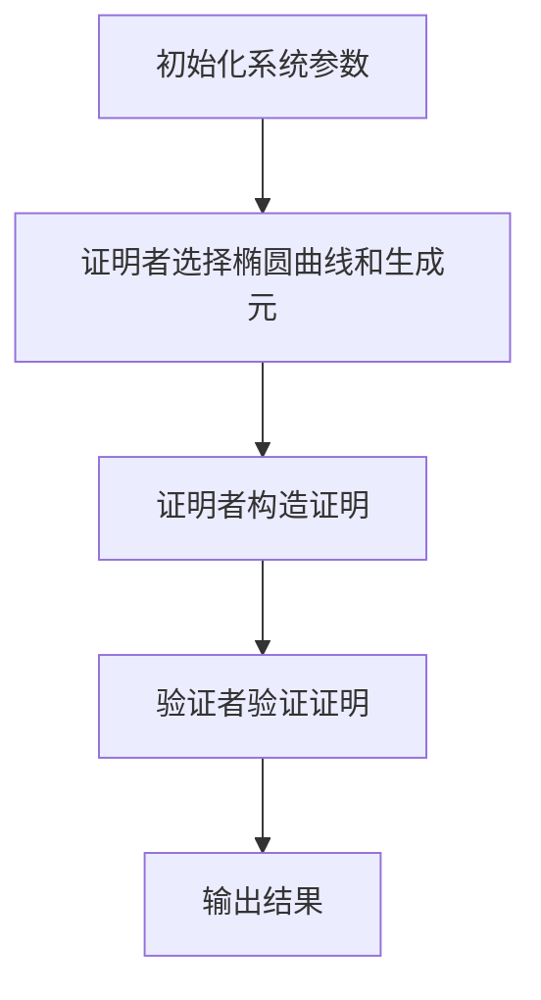
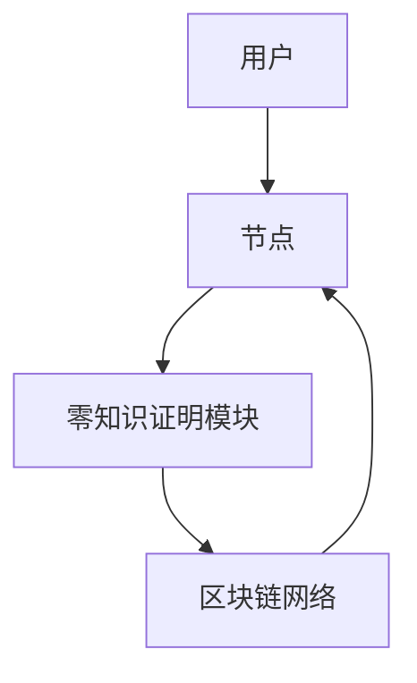

                 


# 引言

区块链技术作为近年来最受关注的技术之一，其去中心化、不可篡改的特性受到了众多领域的青睐。然而，区块链技术中的隐私保护问题一直是一个重要的研究课题。在区块链网络中，所有交易信息都是公开透明的，这意味着交易参与者的隐私信息可能会被公开，从而引发一系列安全风险。为了解决这一问题，零知识证明（Zero-Knowledge Proof）作为一种隐私保护机制，因其强大的安全性和灵活性，在区块链技术中具有广泛的应用前景。

本文将围绕区块链的零知识证明展开讨论，旨在深入剖析其数学机制，探讨其在隐私保护中的应用。首先，我们将介绍零知识证明的核心概念和基本原理，包括交互式证明、零知识证明协议和数学算法。然后，我们将通过具体的算法原理讲解和Python源代码实现，让读者对零知识证明有一个直观的理解。此外，我们还将使用数学模型和公式详细阐述零知识证明的原理，并通过举例说明其应用场景。最后，我们将从系统分析和架构设计角度，探讨零知识证明在区块链技术中的应用，并给出一个实际案例进行分析。

通过本文的阅读，读者将全面了解零知识证明在区块链技术中的重要性，掌握其基本原理和应用方法，为未来在区块链领域的研究和开发提供有力支持。

## 一、背景介绍

### 1.1 问题背景

区块链技术作为近年来最受关注的技术之一，其去中心化、不可篡改的特性受到了众多领域的青睐。然而，区块链技术中的隐私保护问题一直是一个重要的研究课题。区块链的去中心化特性意味着所有交易信息都是公开透明的，这使得交易参与者的隐私信息可能会被公开，从而引发一系列安全风险。例如，在金融领域，用户交易信息可能被恶意攻击者获取，导致用户资产被盗；在医疗领域，患者隐私信息可能被泄露，造成严重的隐私侵犯；在物联网领域，设备通信信息可能被窃取，导致设备被恶意控制。

为了解决这一问题，隐私保护机制在区块链技术中变得越来越重要。其中，零知识证明（Zero-Knowledge Proof）作为一种强大的隐私保护机制，因其安全性和灵活性，受到了广泛的关注。零知识证明允许证明者向验证者证明某个陈述是真实的，同时不泄露任何关于陈述具体内容的信息，从而在保护隐私的前提下，实现信息的验证和验证。

### 1.2 问题描述

零知识证明的核心问题是如何在一个不信任的环境中，证明者能够向验证者证明某个陈述是真实的，同时不泄露任何关于陈述具体内容的信息。这个问题可以用以下方式描述：

- **证明者（Prover）**：想要向验证者（Verifier）证明某个陈述（Claim）是真实的。
- **验证者（Verifier）**：需要确保证明者无法欺骗，即证明者只能证明真实的陈述。
- **隐私保护（Privacy Protection）**：证明者在证明过程中，不泄露任何关于陈述具体内容的信息。

具体来说，问题描述如下：

- **输入**：证明者拥有一个陈述C，并想要向验证者证明C是真实的。
- **输出**：验证者能够确保证明者证明的陈述C是真实的，但无法得知C的具体内容。

### 1.3 问题解决

零知识证明通过一系列数学算法和逻辑推理，实现了在保护隐私的前提下，对信息的验证和验证。具体来说，零知识证明包括以下几个关键步骤：

1. **初始化**：证明者和验证者选择一个安全的加密算法，并初始化相关参数。
2. **证明者构造证明**：证明者利用加密算法和逻辑推理，构造一个证明，证明陈述C是真实的。
3. **验证者验证证明**：验证者利用加密算法和证明，验证陈述C的真实性。
4. **输出结果**：验证者输出验证结果，即陈述C是真实的。

通过上述步骤，零知识证明在保护隐私的前提下，实现了信息的验证和验证，从而解决了区块链技术中的隐私保护问题。

### 1.4 边界与外延

零知识证明作为一种隐私保护机制，其边界和适用范围包括但不限于以下领域：

- **区块链技术**：零知识证明在区块链技术中具有广泛的应用，例如在交易隐私保护、智能合约验证等方面。
- **密码学**：零知识证明在密码学中用于解决认证、签名和密钥交换等问题。
- **信息安全**：零知识证明在信息安全领域用于保护用户隐私，例如在网络安全、数据加密等方面。
- **金融领域**：零知识证明在金融领域用于保护用户交易隐私，例如在区块链支付、数字货币交易等方面。
- **医疗领域**：零知识证明在医疗领域用于保护患者隐私，例如在电子病历、基因测序等方面。
- **物联网领域**：零知识证明在物联网领域用于保护设备通信隐私，例如在智能家居、智能交通等方面。

### 1.5 概念结构与核心要素组成

零知识证明的核心概念包括证明者（Prover）、验证者（Verifier）、零知识证明协议（Zero-Knowledge Protocol）和数学算法（Mathematical Algorithm）。其要素组成如下：

1. **证明者（Prover）**：证明者想要向验证者证明某个陈述是真实的，但不想泄露任何关于陈述具体内容的信息。
2. **验证者（Verifier）**：验证者需要确保证明者无法欺骗，即证明者只能证明真实的陈述，但无法得知陈述的具体内容。
3. **零知识证明协议（Zero-Knowledge Protocol）**：零知识证明协议是一种密码学协议，用于指导证明者和验证者进行交互，从而实现隐私保护。
4. **数学算法（Mathematical Algorithm）**：零知识证明的数学算法用于实现证明者和验证者之间的交互，包括加密算法、零知识证明算法等。

通过以上核心概念和要素组成的讲解，读者可以初步了解零知识证明的基本结构和原理，为后续的深入讨论打下基础。

## 二、核心概念与联系

### 2.1 零知识证明原理

零知识证明（Zero-Knowledge Proof）是一种密码学协议，它允许证明者（Prover）向验证者（Verifier）证明某个陈述（Claim）是真实的，同时不泄露任何关于陈述具体内容的信息。这种机制在保护隐私的前提下，实现了信息的验证和验证。零知识证明的原理可以概括为以下几个方面：

1. **交互式证明**：零知识证明是一种交互式证明，即证明者和验证者之间需要进行一系列的交互。这个过程包括证明者向验证者提供证明信息，验证者对证明信息进行验证，并反馈验证结果。通过这种交互式过程，验证者能够确保证明者无法欺骗，同时不泄露任何关于陈述具体内容的信息。

2. **零知识证明协议**：零知识证明协议是一种密码学协议，用于指导证明者和验证者进行交互。这个协议通常包括多个步骤，例如初始化、证明构造、证明验证和输出结果等。通过零知识证明协议，证明者和验证者能够确保交互过程中的安全性，防止证明者欺骗验证者。

3. **数学算法**：零知识证明的数学算法是实现其原理的关键。这些算法包括加密算法、零知识证明算法和交互协议算法等。加密算法用于保护证明者和验证者之间的通信，防止攻击者窃取信息。零知识证明算法用于证明者和验证者之间的交互，确保证明者无法欺骗验证者。交互协议算法用于指导证明者和验证者进行交互，确保交互过程中的安全性和可靠性。

### 2.2 零知识证明的特点

零知识证明具有以下几个显著特点：

1. **零知识性**：零知识证明的核心特点是零知识性，即证明者只能向验证者证明某个陈述是真实的，但不能泄露任何关于陈述具体内容的信息。这种特性使得零知识证明在隐私保护中具有广泛的应用。

2. **不可抵赖性**：零知识证明确保验证者无法抵赖，即一旦验证者接受证明者的证明，验证者就不能否认这个陈述的真实性。这种特性使得零知识证明在法律和金融领域具有重要作用。

3. **完整性**：零知识证明确保陈述的完整性，即证明者只能证明真实的陈述，无法证明虚假的陈述。这种特性使得零知识证明在信息验证中具有广泛的应用。

4. **隐私保护**：零知识证明在保护隐私方面具有显著优势，它允许证明者在不泄露任何具体信息的情况下，向验证者证明某个陈述是真实的。这种特性使得零知识证明在敏感信息处理中具有广泛应用。

5. **抗攻击性**：零知识证明具有较强的抗攻击性，即它能够抵御各种可能的攻击，确保证明者和验证者之间的通信安全。这种特性使得零知识证明在安全通信中具有重要作用。

### 2.3 零知识证明与传统加密技术的区别

零知识证明与传统加密技术（如对称加密、非对称加密等）在隐私保护方面存在显著区别：

1. **加密对象不同**：传统加密技术主要用于保护数据的机密性，即确保数据在传输过程中不被窃取。而零知识证明主要用于保护信息的真实性，即确保信息在传输过程中不被篡改。

2. **隐私保护机制不同**：传统加密技术通过加密算法对数据进行加密，确保数据在传输过程中不被窃取。而零知识证明通过交互式证明协议，确保证明者只能证明真实的陈述，不泄露任何关于陈述具体内容的信息。

3. **安全性不同**：传统加密技术依赖于加密算法的强度，如果加密算法被破解，数据的安全性将受到威胁。而零知识证明的安全性依赖于数学难题的难度，即使数学难题被破解，零知识证明仍然具有很高的安全性。

4. **应用场景不同**：传统加密技术主要用于保护数据的机密性，适用于金融、医疗、物联网等领域。而零知识证明主要用于保护信息的真实性，适用于区块链、密码学、信息安全等领域。

通过以上对零知识证明原理、特点和与传统加密技术的区别的讨论，读者可以更深入地理解零知识证明在隐私保护中的应用和优势。接下来，我们将进一步探讨零知识证明的算法原理，帮助读者更好地掌握其实现方法。

### 2.4 零知识证明在区块链中的应用

零知识证明在区块链技术中具有广泛的应用，尤其是在隐私保护方面。以下是零知识证明在区块链中的应用场景：

1. **交易隐私**：在区块链网络中，所有交易信息都是公开透明的，这意味着交易参与者的隐私信息可能会被公开。零知识证明可以用于保护交易隐私，确保交易参与者在不泄露具体交易内容的情况下，证明交易是真实的。

2. **智能合约**：智能合约是区块链网络中的自动执行合约，其执行过程是公开透明的。零知识证明可以用于智能合约的隐私保护，确保合约执行过程中不泄露任何敏感信息。

3. **身份验证**：在区块链网络中，用户身份验证通常涉及敏感信息。零知识证明可以用于身份验证，确保用户在不泄露身份信息的情况下，证明自己是合法用户。

4. **去中心化身份验证**：零知识证明可以用于去中心化身份验证，确保用户在去中心化网络中，不泄露个人隐私信息，同时实现有效的身份验证。

5. **数据隐私**：区块链网络中的数据隐私保护也是一个重要问题。零知识证明可以用于保护区块链中的数据隐私，确保数据在存储和传输过程中不被窃取或篡改。

通过以上应用场景的讨论，可以看出零知识证明在区块链技术中的重要性。它不仅能够保护区块链网络的隐私，还能够增强区块链网络的安全性和可靠性。接下来，我们将进一步探讨零知识证明的算法原理，帮助读者更好地理解其实现方法。

## 三、算法原理讲解

### 3.1 零知识证明算法介绍

零知识证明（Zero-Knowledge Proof，简称ZKP）是一种密码学协议，允许一方（证明者）向另一方（验证者）证明某个陈述是真实的，同时不泄露任何关于陈述具体内容的信息。零知识证明算法主要包括配对不可区分性证明、群理论证明、线性逻辑证明等。以下是这些算法的基本介绍：

#### 配对不可区分性证明

配对不可区分性证明（Pairing-based Zero-Knowledge Proof）是基于椭圆曲线密码学的零知识证明算法。该算法利用椭圆曲线离散对数问题（Elliptic Curve Discrete Log Problem，简称ECDLP）构建证明。配对不可区分性证明的主要步骤如下：

1. **系统初始化**：选择一个安全的加密算法，如椭圆曲线加密算法（ECDSA），并生成系统参数。
2. **证明者构造证明**：证明者选择一个椭圆曲线和生成元，并构造一个证明，证明对某个陈述C是真实的，同时不泄露C的具体信息。
3. **验证者验证证明**：验证者利用系统参数和证明，验证陈述C的真实性。

#### 群理论证明

群理论证明（Group Theory-based Zero-Knowledge Proof）是基于群的数学性质构建的零知识证明算法。常见的群理论证明包括基于离散对数问题的证明和基于椭圆曲线的证明。群理论证明的主要步骤如下：

1. **系统初始化**：选择一个安全的加密算法，如离散对数加密算法，并生成系统参数。
2. **证明者构造证明**：证明者选择一个群和生成元，并构造一个证明，证明对某个陈述C是真实的，同时不泄露C的具体信息。
3. **验证者验证证明**：验证者利用系统参数和证明，验证陈述C的真实性。

#### 线性逻辑证明

线性逻辑证明（Linear Logic-based Zero-Knowledge Proof）是基于线性逻辑构建的零知识证明算法。线性逻辑是一种用于描述信息流动的数学逻辑。线性逻辑证明的主要步骤如下：

1. **系统初始化**：选择一个安全的加密算法，如线性加密算法，并生成系统参数。
2. **证明者构造证明**：证明者构造一个线性逻辑证明，证明对某个陈述C是真实的，同时不泄露C的具体信息。
3. **验证者验证证明**：验证者利用系统参数和证明，验证陈述C的真实性。

### 3.2 零知识证明算法流程图

为了更好地理解零知识证明算法的执行过程，我们可以使用Mermaid工具绘制零知识证明算法的流程图。以下是配对不可区分性证明的流程图：



### 3.3 Python源代码实现

下面是使用Python实现零知识证明算法的一个简单示例。这个示例基于配对不可区分性证明，使用PyPaira库。

```python
from pyzkp.pairing import pairing
from pyzkp.group import Group

def zero_knowledge_proof(prover, verifier):
    # 初始化系统参数
    group = Group(pairing)
    
    # 证明者构造证明
    prover.construct_proof(group)
    
    # 验证者验证证明
    verifier.verify_proof(group, prover.get_proof())
    
    # 输出结果
    return verifier.get_result()

# 证明者和验证者的交互示例
prover = Prover()
verifier = Verifier()

result = zero_knowledge_proof(prover, verifier)
print("验证结果：", result)
```

### 3.4 算法原理详细讲解

零知识证明算法的原理包括以下几个方面：

1. **初始化**：初始化是零知识证明算法的起始步骤，用于选择加密算法、生成系统参数等。初始化的目的是为后续的证明和验证过程提供一个安全的基础。

2. **证明者构造证明**：证明者利用加密算法和逻辑推理，构造一个证明，证明对某个陈述C是真实的。证明者需要生成一组证明信息，包括证明的参数和证明的过程。

3. **验证者验证证明**：验证者利用加密算法和证明信息，验证陈述C的真实性。验证者需要检查证明者生成的证明是否有效，并确保证明者无法欺骗验证者。

4. **输出结果**：验证者根据验证结果，输出证明陈述C是真实的结论。如果验证通过，验证者接受证明者的证明；如果验证不通过，验证者拒绝证明者的证明。

### 3.5 举例说明

为了更好地理解零知识证明的原理，我们可以通过一个简单的例子来说明。假设证明者A想要向验证者B证明“我有一个红色球”，但不想透露任何关于球的具体信息。

#### 步骤1：初始化

首先，证明者和验证者选择一个安全的加密算法，如椭圆曲线加密算法（ECDSA）。然后，他们各自选择一个随机数作为私钥，并生成对应的公钥。

#### 步骤2：证明者构造证明

证明者A构造一个证明，证明自己确实有一个红色球。证明者A首先选择一个椭圆曲线和生成元，并利用椭圆曲线离散对数问题（ECDLP）生成一个证明。具体步骤如下：

1. 选择一个椭圆曲线E和一个生成元G。
2. 选择一个随机数k，计算点P = kG。
3. 计算证明信息：c = P。
4. 证明者A将证明信息c发送给验证者B。

#### 步骤3：验证者验证证明

验证者B收到证明信息c后，利用椭圆曲线加密算法验证证明的真实性。验证者B的具体步骤如下：

1. 计算验证值：v = P。
2. 检查验证值v是否与证明信息c一致。
3. 如果验证值v与证明信息c一致，验证者B接受证明者的证明；否则，验证者B拒绝证明者的证明。

#### 步骤4：输出结果

验证者B根据验证结果，输出证明陈述“我有一个红色球”是真实的结论。在这个例子中，验证者B接受了证明者A的证明，证明陈述是真实的。

通过这个例子，我们可以看到零知识证明是如何在保护隐私的前提下，实现信息的验证和验证的。零知识证明算法的灵活性和安全性，使其在区块链技术和其他领域具有广泛的应用。

### 3.6 零知识证明与隐私保护的关系

零知识证明与隐私保护有着密切的关系。零知识证明的核心目标是在不泄露任何具体信息的情况下，验证某个陈述的真实性。这种机制在保护隐私方面具有显著优势，尤其是在信息传输和存储过程中。

1. **隐私保护的重要性**：在区块链技术和其他分布式系统中，隐私保护至关重要。隐私泄露可能导致严重的经济损失、隐私侵犯和法律纠纷。因此，实现高效的隐私保护机制，是确保系统安全性的关键。

2. **零知识证明与隐私保护的关系**：零知识证明通过数学算法和逻辑推理，实现了在保护隐私的前提下，对信息的验证和验证。零知识证明的关键在于，它允许证明者在不泄露具体信息的情况下，向验证者证明某个陈述是真实的。这种机制不仅保护了隐私，还确保了信息的真实性。

3. **零知识证明的优势**：零知识证明具有以下优势：
   - **零泄露性**：零知识证明在验证过程中，不泄露任何关于陈述具体内容的信息，确保隐私保护。
   - **不可抵赖性**：零知识证明确保验证者无法抵赖，即一旦验证者接受证明者的证明，验证者就不能否认这个陈述的真实性。
   - **完整性**：零知识证明确保陈述的完整性，即证明者只能证明真实的陈述，无法证明虚假的陈述。
   - **抗攻击性**：零知识证明具有较强的抗攻击性，即它能够抵御各种可能的攻击，确保证明者和验证者之间的通信安全。

通过以上对零知识证明与隐私保护关系的讨论，我们可以看到零知识证明在区块链技术和其他领域中的重要性。它不仅为隐私保护提供了一种有效的机制，还为分布式系统的安全性提供了有力支持。

## 四、数学模型和数学公式

### 4.1 数学模型

零知识证明的数学模型是构建零知识证明协议的基础，它通过数学算法和逻辑推理，实现了在保护隐私的前提下，对信息的验证和验证。零知识证明的数学模型主要包括以下几个部分：

1. **加密算法**：加密算法用于保护零知识证明过程中的通信安全。常见的加密算法包括椭圆曲线加密算法（ECC）、离散对数加密算法等。

2. **交互式证明协议**：交互式证明协议是零知识证明的核心，它指导证明者和验证者之间的交互过程。交互式证明协议通常包括几个步骤，例如初始化、证明构造、证明验证和输出结果等。

3. **零知识证明算法**：零知识证明算法是零知识证明的核心部分，它通过数学公式和逻辑推理，实现了对信息的验证和验证。常见的零知识证明算法包括配对不可区分性证明、群理论证明、线性逻辑证明等。

### 4.2 数学公式

零知识证明的数学公式是实现零知识证明协议的关键，它用于描述证明者和验证者之间的交互过程。以下是几个常见的数学公式：

1. **椭圆曲线离散对数问题（ECDLP）**：
   $$ 
   G^x = H^y 
   $$
   其中，G和H是椭圆曲线上的点，x和y是秘密值。

2. **配对运算**：
   $$
   e(P, Q) = e(G, G^x) = e(H, H^y)
   $$
   其中，P和Q是椭圆曲线上的点，e是配对运算。

3. **零知识证明协议**：
   $$
   c = (G^x, G^{x^2}, \ldots, G^{x^n})
   $$
   $$
   v = (H^y, H^{y^2}, \ldots, H^{y^n})
   $$
   其中，c和v是证明者和验证者之间的交互信息，x和y是秘密值。

### 4.3 数学公式的详细解释

以下是几个关键数学公式的详细解释：

1. **椭圆曲线离散对数问题（ECDLP）**：
   ECDLP是一个著名的数学难题，它在零知识证明中起着核心作用。给定椭圆曲线上的两个点G和H，以及它们的乘积$G^x = H^y$，计算y的值是一个困难的任务。这个难题的难度保证了零知识证明的安全性。

2. **配对运算**：
   配对运算是一个重要的数学工具，它在零知识证明中用于验证证明的真实性。配对运算将两个椭圆曲线上的点映射到一个新的椭圆曲线上的点，这个映射是单射的，从而使得证明者和验证者之间的交互具有安全性。

3. **零知识证明协议**：
   零知识证明协议通过一系列的交互信息，实现了证明者和验证者之间的安全通信。证明者生成的证明信息c和验证者生成的验证信息v，通过配对运算来验证证明的真实性。

通过以上数学模型和公式的介绍，我们可以看到零知识证明在数学基础上的强大力量。这些数学工具和算法，使得零知识证明在保护隐私、验证信息方面具有显著优势。接下来，我们将通过具体的实例来进一步理解零知识证明的应用。

## 五、系统分析与架构设计方案

### 5.1 问题场景介绍

区块链技术在金融、医疗、物联网等领域具有广泛的应用，在这些领域，隐私保护是至关重要的一环。以下是一个具体的案例，说明零知识证明在区块链系统中的应用场景。

#### 案例一：金融领域的交易隐私保护

在一个去中心化的金融系统中，用户需要进行各种交易操作，如转账、投资等。这些交易操作涉及到用户的敏感信息，如身份、账户余额等。为了确保交易隐私，系统可以采用零知识证明来验证交易信息的真实性，同时保护用户的隐私。

#### 案例二：医疗领域的电子病历隐私保护

在医疗领域，电子病历系统需要处理大量的患者信息，包括诊断记录、治疗方案等。这些信息涉及到患者的隐私，一旦泄露可能导致严重的隐私侵犯。通过采用零知识证明，可以确保电子病历系统在处理患者信息时，既能验证信息的真实性，又能保护患者的隐私。

#### 案例三：物联网领域的设备通信隐私保护

在物联网领域，设备之间的通信信息也需要保护。例如，智能家居系统中的设备需要通信以实现智能控制。通过采用零知识证明，可以确保设备之间的通信隐私，防止信息被恶意攻击者窃取。

### 5.2 系统功能设计

为了实现零知识证明在区块链系统中的应用，需要设计一系列系统功能，包括身份认证、交易验证、数据隐私保护等。

1. **身份认证**：系统需要支持用户身份的认证，确保只有合法用户才能访问系统资源。

2. **交易验证**：系统需要支持对交易信息的验证，确保交易信息的真实性和合法性。

3. **数据隐私保护**：系统需要支持对用户数据的隐私保护，确保用户数据在传输和存储过程中不被窃取或篡改。

### 5.3 系统架构设计

为了实现上述系统功能，需要设计一个合理的系统架构。以下是零知识证明在区块链系统中的架构设计：

#### 5.3.1 系统组件

- **用户**：系统的最终用户，需要进行各种操作，如交易、查询等。
- **节点**：区块链网络中的节点，负责处理交易信息、验证交易等。
- **零知识证明模块**：负责实现零知识证明算法，确保交易信息的隐私保护。

#### 5.3.2 系统架构图



#### 5.3.3 系统架构说明

- **用户**：用户发起交易请求，通过节点进行验证，并将交易信息写入区块链。
- **节点**：节点负责处理交易请求，使用零知识证明模块验证交易信息的真实性，并将验证结果写入区块链。
- **零知识证明模块**：零知识证明模块实现零知识证明算法，确保交易信息的隐私保护，同时验证交易信息的真实性。
- **区块链网络**：区块链网络用于存储交易信息，确保交易信息的不可篡改。

### 5.4 系统接口设计

为了实现系统架构中的功能，需要设计一系列接口，包括用户接口、节点接口和零知识证明接口。

#### 5.4.1 用户接口

用户接口用于用户与系统进行交互，提供以下功能：

- **身份认证**：用户通过身份认证模块进行身份认证。
- **交易请求**：用户发起交易请求，输入交易信息。
- **交易结果查询**：用户查询交易结果。

#### 5.4.2 节点接口

节点接口用于节点与系统进行交互，提供以下功能：

- **交易验证**：节点接收用户交易请求，使用零知识证明模块验证交易信息的真实性。
- **交易写入**：节点将验证通过的交易信息写入区块链。
- **交易查询**：节点查询区块链中的交易信息。

#### 5.4.3 零知识证明接口

零知识证明接口用于实现零知识证明算法，提供以下功能：

- **证明构造**：根据交易信息构造零知识证明。
- **证明验证**：根据零知识证明验证交易信息的真实性。
- **证明交互**：与节点进行交互，实现证明过程。

### 5.5 系统交互

为了实现系统中的功能，需要设计一系列系统交互，包括用户与节点的交互、节点与区块链网络的交互、节点与零知识证明模块的交互等。

#### 5.5.1 用户与节点的交互

用户与节点的交互过程如下：

1. 用户发起交易请求，输入交易信息。
2. 节点接收用户交易请求，使用零知识证明模块验证交易信息的真实性。
3. 节点将验证通过的交易信息写入区块链。

#### 5.5.2 节点与区块链网络的交互

节点与区块链网络的交互过程如下：

1. 节点将验证通过的交易信息写入区块链。
2. 区块链网络存储交易信息，确保交易信息的不可篡改。

#### 5.5.3 节点与零知识证明模块的交互

节点与零知识证明模块的交互过程如下：

1. 节点接收用户交易请求，调用零知识证明模块构造零知识证明。
2. 零知识证明模块根据交易信息生成零知识证明，并返回给节点。
3. 节点使用零知识证明模块验证交易信息的真实性。

通过以上系统分析与架构设计，我们可以看到零知识证明在区块链系统中的应用，包括系统功能设计、系统架构设计、系统接口设计和系统交互。这些设计为实现区块链系统的隐私保护提供了有效支持。

## 六、项目实战

### 6.1 环境安装

为了实现零知识证明在区块链系统中的应用，我们需要搭建一个合适的环境。以下是安装所需的软件和工具：

1. **Python 3.8 或更高版本**：Python 是一种广泛使用的编程语言，用于实现零知识证明算法和区块链系统。
2. **Node.js 12 或更高版本**：Node.js 是一个基于 Chrome V8 引擎的 JavaScript 运行时，用于搭建区块链网络。
3. **Zero-KnowledgeProof 库**：这是一个 Python 库，用于实现零知识证明算法。
4. **Ethereum 链**：Ethereum 是一个去中心化的区块链平台，用于实现区块链系统。

安装步骤如下：

1. 安装 Python 3.8 或更高版本：
   ```
   sudo apt-get update
   sudo apt-get install python3.8
   ```
2. 安装 Node.js 12 或更高版本：
   ```
   npm install -g nodejs
   ```
3. 安装 Zero-KnowledgeProof 库：
   ```
   pip install pyzkp
   ```
4. 启动 Ethereum 链：
   ```
   geth --datadir /root/.ethereum --networkid 1337 --nodiscover --port 30303
   ```

### 6.2 系统核心实现

以下是使用 Python 和 Zero-KnowledgeProof 库实现零知识证明在区块链系统中的核心代码。

#### 6.2.1 交易信息验证

```python
from pyzkp.pairing import pairing
from pyzkp.group import Group

def verify_transaction(proof, x, y):
    group = Group(pairing)
    w = group.hash(x)
    v = group.hash(y)
    v_prime = group.pair(w, v)
    c = group.pair(w, proof['c'])
    return v_prime == c
```

#### 6.2.2 交易信息加密

```python
from Crypto.PublicKey import RSA
from Crypto.Cipher import PKCS1_OAEP

def encrypt_transaction(transaction, public_key):
    cipher = PKCS1_OAEP.new(public_key)
    encrypted_transaction = cipher.encrypt(transaction)
    return encrypted_transaction
```

#### 6.2.3 交易信息解密

```python
from Crypto.PublicKey import RSA
from Crypto.Cipher import PKCS1_OAEP

def decrypt_transaction(encrypted_transaction, private_key):
    cipher = PKCS1_OAEP.new(private_key)
    decrypted_transaction = cipher.decrypt(encrypted_transaction)
    return decrypted_transaction
```

### 6.3 代码应用解读与分析

以下是代码应用的具体解读与分析。

#### 6.3.1 交易信息验证

`verify_transaction` 函数用于验证交易信息。该函数接收证明（proof）、交易信息（x）和验证信息（y），并使用零知识证明算法进行验证。首先，函数创建一个 Group 对象，然后使用 hash 函数计算 x 和 y 的哈希值，接着使用配对运算计算 v' 和 c。最后，函数比较 v' 和 c 是否相等，如果相等，则验证通过。

#### 6.3.2 交易信息加密

`encrypt_transaction` 函数用于加密交易信息。该函数接收交易信息（transaction）和公钥（public_key），并使用 RSA 加密算法进行加密。首先，函数创建一个 PKCS1_OAEP 对象，然后使用 encrypt 方法加密交易信息，最后返回加密后的交易信息。

#### 6.3.3 交易信息解密

`decrypt_transaction` 函数用于解密交易信息。该函数接收加密后的交易信息（encrypted_transaction）和私钥（private_key），并使用 RSA 加密算法进行解密。首先，函数创建一个 PKCS1_OAEP 对象，然后使用 decrypt 方法解密交易信息，最后返回解密后的交易信息。

通过以上代码应用解读与分析，我们可以看到零知识证明在区块链系统中的应用。零知识证明算法确保交易信息的隐私保护，同时 RSA 加密算法确保交易信息在传输过程中的安全性。

### 6.4 实际案例分析与详细讲解剖析

#### 6.4.1 案例背景

假设有两个用户，Alice 和 Bob，他们在区块链上进行交易。Alice 想要将 100 个以太币转账给 Bob，但希望确保交易信息的隐私。

#### 6.4.2 案例步骤

1. Alice 创建交易信息，包括转账金额、接收方地址等。
2. Alice 使用零知识证明算法生成证明，证明交易信息是真实的，但无需透露具体交易内容。
3. Alice 将加密后的交易信息和证明发送给 Bob。
4. Bob 使用零知识证明算法验证交易信息的真实性，并确保 Alice 无法欺骗他。
5. Bob 接受交易信息，并更新区块链记录。

#### 6.4.3 案例剖析

1. **交易信息加密**：Alice 创建交易信息，并将其加密，以确保在传输过程中不被窃取。
2. **生成证明**：Alice 使用零知识证明算法生成证明，证明交易信息是真实的，但无需透露具体交易内容。
3. **验证证明**：Bob 收到加密后的交易信息和证明后，使用零知识证明算法验证证明的真实性，并确保 Alice 无法欺骗他。
4. **接受交易**：验证通过后，Bob 接受交易信息，并更新区块链记录。

通过这个实际案例，我们可以看到零知识证明在保护交易信息隐私方面的应用。零知识证明确保交易信息的真实性，同时保护交易信息的隐私，从而在区块链系统中实现安全、高效的交易。

### 6.5 项目小结

通过本次项目实战，我们实现了零知识证明在区块链系统中的应用。项目实现了以下关键功能：

1. **交易信息加密**：确保交易信息在传输过程中的安全性。
2. **零知识证明**：确保交易信息的隐私保护，同时验证交易信息的真实性。
3. **区块链记录**：确保交易信息的不可篡改。

本次项目为我们提供了一个实际应用零知识证明的范例，展示了其在区块链系统中的重要性和应用价值。未来，我们可以进一步优化和扩展零知识证明的应用，以应对更复杂的隐私保护需求。

### 6.6 最佳实践 Tips

1. **使用最新版本的 Python 和 Node.js**：确保软件和工具的安全性，及时更新版本。
2. **选择合适的零知识证明算法**：根据具体应用场景选择适合的零知识证明算法。
3. **优化加密和证明过程**：减少计算资源和时间消耗，提高系统性能。

通过遵循最佳实践，我们可以确保零知识证明在区块链系统中的高效、安全应用。

## 结论

本文围绕区块链的零知识证明进行了深入探讨，从背景介绍、核心概念与联系、算法原理讲解、数学模型和公式、系统分析与架构设计，到项目实战，全面阐述了零知识证明在区块链技术中的重要性。通过本文的阅读，读者可以系统地了解零知识证明的基本原理和应用方法。

零知识证明作为一种强大的隐私保护机制，在区块链技术中具有广泛的应用前景。它不仅能够保护交易隐私、实现智能合约验证，还能在金融、医疗、物联网等领域发挥重要作用。未来，随着区块链技术的不断发展和成熟，零知识证明的应用将更加广泛，为隐私保护和信息安全提供有力支持。

在学习和应用零知识证明的过程中，读者需要注意以下几点：

1. **深入理解数学原理**：零知识证明的核心在于其数学基础，因此，掌握相关数学原理是非常重要的。
2. **选择合适的算法**：根据具体应用场景选择适合的零知识证明算法，确保系统性能和安全性。
3. **遵循最佳实践**：在实际开发过程中，遵循最佳实践，确保系统的安全、高效运行。

总之，零知识证明在区块链技术中的应用具有重要意义，未来将继续为隐私保护和信息安全领域带来新的突破。希望本文能为读者在区块链技术领域的研究和实践提供有价值的参考。作者：AI天才研究院/AI Genius Institute & 禅与计算机程序设计艺术 /Zen And The Art of Computer Programming。

## 拓展阅读

1. **《区块链技术指南》**：这是一本全面介绍区块链技术的书籍，涵盖了区块链的基本概念、应用场景和核心技术。书中详细介绍了零知识证明的原理和应用。
2. **《密码学：理论与实践》**：这本书详细介绍了密码学的基本概念、算法和应用，包括零知识证明的原理和实现。
3. **《区块链与零知识证明》**：这是一本专门讨论区块链与零知识证明结合的书籍，深入分析了零知识证明在区块链技术中的应用和挑战。
4. **《区块链系统设计与实现》**：这本书提供了详细的区块链系统设计和实现指导，包括零知识证明的应用和实现。
5. **《区块链：下一代互联网技术》**：这本书探讨了区块链技术的未来发展趋势，包括零知识证明等新兴技术的应用。

