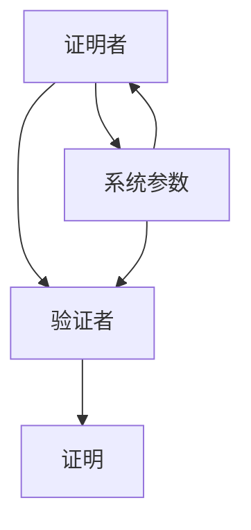

                 

### 引言与背景介绍

区块链技术作为当今信息技术领域的前沿突破，正迅速改变着金融、物流、医疗等多个行业的运作模式。然而，随着区块链技术的广泛应用，如何确保交易的安全性和用户隐私保护成为亟待解决的问题。传统的区块链技术虽然实现了去中心化和不可篡改的特性，但在隐私保护方面仍存在一定的局限性。零知识证明（Zero-Knowledge Proof，简称ZKP）作为一种数学上的隐私保护机制，能够在不泄露任何信息的前提下，证明某个陈述是真实的。这一机制为区块链技术的隐私保护提供了一种全新的思路。

零知识证明的基本思想可以追溯到1970年代，由Shafi Goldwasser、Silvio Micali和Charles Rackoff首次提出。此后，零知识证明在密码学领域得到了广泛的研究和应用。在区块链技术中，零知识证明的应用主要涉及以下几个方面：首先，它可以用于匿名交易，保护交易参与者的隐私；其次，零知识证明可以增强智能合约的安全性，确保合约执行过程中不泄露任何敏感信息；最后，零知识证明还可以用于身份验证和权限管理，实现用户的匿名身份认证。

本文将围绕区块链的零知识证明展开讨论，旨在深入剖析零知识证明的数学机制，探讨其在区块链中的应用，分析其安全性和隐私保护优势，并通过具体案例展示其实际应用价值。本文将分为八个部分：

1. 引言与背景介绍
2. 零知识证明基础理论
3. 零知识证明在区块链中的应用
4. 零知识证明的数学原理和算法
5. 零知识证明系统设计与实现
6. 零知识证明的安全性和隐私保护
7. 零知识证明的实际应用案例
8. 总结与展望

通过这篇文章，我们将一步步探讨零知识证明在区块链领域的应用，理解其核心概念和实现机制，以及如何利用这一技术提高区块链系统的隐私保护能力。

### 关键词

- 区块链
- 零知识证明
- 隐私保护
- 数学机制
- 安全性
- 智能合约
- 匿名交易
- 身份验证
- 权限管理

### 摘要

本文深入探讨了区块链技术中的零知识证明（Zero-Knowledge Proof，简称ZKP）机制，分析了其在隐私保护中的关键作用。首先，介绍了区块链技术和零知识证明的基本概念，以及区块链中隐私保护的需求。随后，详细阐述了零知识证明的理论基础，包括定义、核心要素和工作原理。通过具体案例，展示了零知识证明在区块链中的应用，如匿名交易、智能合约和身份验证。文章进一步分析了零知识证明的数学原理和算法，包括数学模型、算法分析和实例说明。最后，讨论了零知识证明系统的设计、实现、安全性和隐私保护机制，并列举了实际应用案例。本文旨在为读者提供一个全面、系统的关于零知识证明在区块链中应用的指南。

### 第1章：区块链与隐私保护

#### 1.1 区块链技术概述

区块链技术是一种分布式账本技术，它通过加密算法和数据结构来确保数据的完整性和安全性。区块链的基本构成包括区块、链和节点。每个区块包含一定数量的交易记录，区块通过哈希算法与前一个区块链接，形成一个不可篡改的链结构。节点则是区块链网络中的参与方，负责验证和传播交易信息。

区块链技术具有以下核心特点：

1. **去中心化**：区块链没有中央机构，所有节点共同维护和验证数据，确保系统的透明性和去中心化。
2. **不可篡改**：一旦数据被记录在区块链上，就难以篡改，保证了数据的持久性和可靠性。
3. **匿名性**：区块链中的交易通常使用加密货币或匿名技术，保护了交易参与者的隐私。
4. **透明性**：所有交易记录都是公开的，任何节点都可以验证交易的有效性。

#### 1.2 区块链中的隐私问题

尽管区块链技术提供了去中心化和不可篡改的特性，但在隐私保护方面仍存在一定的局限性。主要问题包括：

1. **交易透明性**：区块链中的所有交易记录都是公开的，任何人都可以查询和追踪。这可能导致用户的隐私泄露。
2. **地址关联性**：区块链地址可以追踪用户的交易历史，通过分析交易模式，攻击者可能推断出用户的真实身份。
3. **智能合约漏洞**：智能合约中的代码公开且不可篡改，但可能存在漏洞，攻击者可以通过漏洞窃取资产或泄露隐私信息。

#### 1.3 零知识证明的引入

为了解决区块链中的隐私保护问题，零知识证明（Zero-Knowledge Proof，简称ZKP）提供了一种有效的解决方案。零知识证明是一种数学上的隐私保护机制，它允许一个证明者向验证者证明某个陈述是真实的，而无需泄露任何其他信息。

零知识证明的核心思想可以概括为三个部分：

1. **证明性**：证明者能够证明某个陈述是真实的，而不需要提供任何具体的证据。
2. **有效性**：验证者能够验证证明者提供的证明是真实的，并确认所证明的陈述为真。
3. **零知识**：验证者无法从证明过程中获取任何关于证明者具体信息的知识。

通过零知识证明，区块链中的交易参与方可以在不泄露隐私信息的情况下，证明交易的合法性和真实性。这极大地增强了区块链系统的隐私保护能力，解决了交易透明性和地址关联性问题，同时也提升了智能合约的安全性。

总之，零知识证明的引入为区块链技术的隐私保护提供了新的思路和方法，有助于构建更加安全和隐私的区块链生态系统。

### 第2章：零知识证明基础理论

#### 2.1 零知识证明定义

零知识证明（Zero-Knowledge Proof，简称ZKP）是一种数学上的隐私保护机制，它允许证明者向验证者证明某个陈述是真实的，而无需透露任何具体信息。这一机制由Shafi Goldwasser、Silvio Micali和Charles Rackoff于1985年首次提出。零知识证明的核心概念是“零知识”，即验证者无法从证明过程中获取任何关于证明者具体信息的知识。

零知识证明的定义可以形式化为以下三个要素：

1. **证明性**：证明者能够构造出一个证明，使得验证者能够确认某个陈述为真。
2. **有效性**：任何不知道陈述为真的验证者，无法伪造出一个有效的证明。
3. **零知识性**：任何知道陈述为真的验证者，无法从证明过程中获得关于证明者具体信息的知识。

这三个要素共同构成了零知识证明的基本框架。证明性保证了证明者可以证明陈述的真实性；有效性确保了验证者无法伪造证明；零知识性则保护了证明者的隐私，使其无需透露具体信息。

#### 2.2 零知识证明的核心要素

零知识证明机制的核心要素包括证明者、验证者和系统参数。以下是对每个要素的详细解释：

1. **证明者**：证明者（Prover）是指需要向验证者证明某个陈述为真的一方。证明者的任务是构造出一个零知识证明，使得验证者能够确认所证明的陈述为真，同时不泄露任何具体信息。
2. **验证者**：验证者（Verifier）是指需要验证某个陈述是否为真的一方。验证者的任务是接受证明者的证明，并确认所证明的陈述为真，同时无法获取任何关于证明者的具体信息。
3. **系统参数**：系统参数包括公钥、私钥、系统随机数等。这些参数用于构造零知识证明和验证证明，确保证明过程的安全性和有效性。

#### 2.3 零知识证明的工作原理

零知识证明的工作原理可以分为以下几个步骤：

1. **系统初始化**：系统初始化阶段，证明者和验证者共同选择系统参数，包括公钥、私钥和随机数。这些参数用于后续的证明和验证过程。
2. **证明构建**：证明者构建一个证明，证明某个陈述为真。证明者需要利用系统参数和特定的算法，构造出一个满足证明性、有效性和零知识性的证明。
3. **证明验证**：验证者接受证明者的证明，并验证所证明的陈述是否为真。验证者需要利用系统参数和特定的算法，检查证明的有效性和零知识性。
4. **交互结束**：在完成证明验证后，证明过程结束。由于零知识证明的零知识性，验证者无法获取任何关于证明者的具体信息。

通过以上步骤，零知识证明实现了在不泄露具体信息的前提下，验证某个陈述是否为真的目标。这一机制在密码学、区块链、隐私计算等领域具有广泛的应用。

#### 2.4 零知识证明的分类

零知识证明可以根据其实现方式和应用场景的不同，分为多种类型。以下是对几种常见零知识证明类型的介绍：

1. **线性型零知识证明**：线性型零知识证明（Linear Zero-Knowledge Proof）是最早提出的一种零知识证明类型。它适用于证明线性关系的存在，例如，证明一个数是否在某个区间内。线性型零知识证明的核心思想是通过线性方程组来实现证明。
2. **交互型零知识证明**：交互型零知识证明（Interactive Zero-Knowledge Proof）是另一种常见的零知识证明类型，它通过多个交互步骤来完成证明。交互型零知识证明可以分为两类：交互性证明和异步交互性证明。
   - **交互性证明**：交互性证明要求证明者和验证者之间的交互是同步的。例如，证明者需要发送证明到验证者，验证者接收证明后进行验证，然后向证明者发送反馈。这个过程需要多个交互步骤来完成证明。
   - **异步交互性证明**：异步交互性证明则允许证明者和验证者之间的交互是异步的，即证明者和验证者可以在不同时间发送消息。这种证明方式适用于需要高延迟容忍的场景。
3. **非交互型零知识证明**：非交互型零知识证明（Non-Interactive Zero-Knowledge Proof）是一种无需交互即可完成的零知识证明类型。它通常通过一系列计算步骤来实现，例如，通过递归构造证明。非交互型零知识证明适用于需要高效计算的场景。

#### 2.4.1 变量型的零知识证明

变量型零知识证明（Variable Zero-Knowledge Proof）是一种特殊的零知识证明类型，它适用于证明多个变量之间的关系。变量型零知识证明通常基于公钥加密和同态加密技术，通过将变量映射到加密值，来实现零知识证明。

变量型零知识证明的基本原理如下：

1. **公钥加密**：证明者和验证者选择一个公钥加密系统，生成公钥和私钥。
2. **变量映射**：证明者将需要证明的变量映射到加密值，并生成相应的证明。
3. **证明验证**：验证者使用公钥和加密算法，验证证明者生成的证明。

变量型零知识证明具有以下特点：

- **灵活性**：变量型零知识证明可以证明多个变量之间的关系，具有较强的灵活性。
- **高效性**：变量型零知识证明通常基于公钥加密和同态加密技术，具有较高的计算效率。
- **安全性**：变量型零知识证明通过加密算法和零知识证明机制，确保了证明过程的安全性和隐私性。

#### 2.4.2 基于关系的零知识证明

基于关系的零知识证明（Relation-Based Zero-Knowledge Proof）是一种针对特定关系的零知识证明类型，它适用于证明两个实体之间存在某种关系。这种证明类型通常用于身份验证、访问控制和隐私保护等领域。

基于关系的零知识证明的基本原理如下：

1. **关系定义**：首先定义需要证明的关系，例如，用户身份和密码之间的对应关系。
2. **关系证明**：证明者生成一个证明，证明两个实体之间存在所定义的关系。
3. **关系验证**：验证者接受证明者的证明，并验证所证明的关系是否成立。

基于关系的零知识证明具有以下特点：

- **适应性**：基于关系的零知识证明可以适应不同类型的关系，具有较强的适应性。
- **安全性**：基于关系的零知识证明通过关系定义和证明机制，确保了证明过程的安全性和隐私性。
- **高效性**：基于关系的零知识证明通常采用高效的算法和协议，具有较高的计算效率。

通过以上对变量型和基于关系的零知识证明的介绍，我们可以看到，这些不同的零知识证明类型在实现方式和应用场景上各有特色，为隐私保护和数据安全提供了丰富的技术手段。

### 2.5 零知识证明与数学基础

零知识证明（Zero-Knowledge Proof，简称ZKP）的强大功能依赖于其背后的数学基础。以下是几种核心数学概念和工具，它们在零知识证明中扮演着关键角色。

#### 2.5.1 同态加密

同态加密（Homomorphic Encryption）是一种加密技术，它允许对加密数据执行数学运算，而不需要解密数据。同态加密是零知识证明的基础之一，因为它使得在加密的状态下进行计算成为可能。

同态加密的基本原理如下：

1. **加密函数**：对于任意的明文\(m_1\)和\(m_2\)，以及加密密钥，存在一个加密函数\(E\)，使得：
   $$
   E(m_1 + m_2) = E(m_1) \oplus E(m_2)
   $$
   其中，\(\oplus\) 表示加密数据的位运算。

2. **解密函数**：对于加密数据\(c\)和加密密钥，存在一个解密函数\(D\)，使得：
   $$
   D(E(m)) = m
   $$

同态加密的主要挑战是找到合适的加密方案，使得加密计算在加密态下保持正确性。例如，RSA加密和基于椭圆曲线的加密方案都可以实现同态加密。

#### 2.5.2 伪随机函数

伪随机函数（Pseudo-Random Function，简称PRF）是一种可以被加密算法生成的函数，它具有伪随机的性质。PRF在零知识证明中用于生成证明和验证过程中所需的随机数。

伪随机函数的基本属性如下：

1. **不可预测性**：对于任意输入，伪随机函数的输出是不可预测的，即对于任意的\(x_1\)和\(x_2\)，如果\(x_1 \neq x_2\)，则\(F(x_1) \neq F(x_2)\)。

2. **抗碰撞性**：对于任意的输入，伪随机函数的输出是唯一的，即对于任意的\(x_1\)和\(x_2\)，如果\(F(x_1) = F(x_2)\)，则\(x_1 = x_2\)。

伪随机函数的实现通常依赖于哈希函数和对称加密算法。

#### 2.5.3 双线性对

双线性对（Bilinear Pairing）是零知识证明中一种重要的数学工具。双线性对允许将两个元素映射到另一个元素，同时保持乘法性质。

双线性对的定义如下：

设\(G_1\)和\(G_2\)是两个循环群，\(e: G_1 \times G_2 \rightarrow G_T\)是一个双线性映射，满足以下性质：

1. **双线性性**：
   $$
   e(g_1^a, g_2^b) = e(g_1, g_2)^{ab}
   $$

2. **非退化性**：
   $$
   e(g_1, g_2) \neq 1
   $$

3. **可计算性**：
   存在高效的算法计算\(e(g_1, g_2)\)。

双线性对在构造零知识证明时起着核心作用，特别是在基于椭圆曲线的零知识证明系统中。

#### 2.5.4 椭圆曲线加密

椭圆曲线加密（Elliptic Curve Cryptography，简称ECC）是一种基于椭圆曲线数学的密码学技术。ECC在零知识证明中用于生成密钥对和实现加密与解密。

椭圆曲线加密的基本原理如下：

1. **椭圆曲线**：椭圆曲线是一个满足特定数学性质的曲线，可以用方程\(y^2 = x^3 + ax + b\)表示。

2. **点加法**：椭圆曲线上的点可以通过点加法进行操作。点加法满足以下性质：
   - \(O\) 是加法的单位元素，即对于任一点\(P\)，有\(P + O = P\)。
   - 对于任意两点\(P_1\)和\(P_2\)，它们的和是一个新的点\(P_3\)，满足\(P_1 + P_2 = P_3\)。
   - 加法是交换的，即对于任意两点\(P_1\)和\(P_2\)，有\(P_1 + P_2 = P_2 + P_1\)。

3. **椭圆曲线离散对数**：椭圆曲线离散对数问题是一个数学难题，它在密码学中用于生成密钥对。

通过上述数学基础，我们可以更好地理解和实现零知识证明。同态加密、伪随机函数、双线性对和椭圆曲线加密等技术为构造零知识证明提供了强有力的工具，使得零知识证明在密码学和区块链领域得到了广泛应用。

### 第3章：零知识证明在区块链中的应用

#### 3.1 区块链中的隐私需求

在区块链系统中，隐私需求尤为突出，这是由于区块链的透明性和不可篡改性所决定的。区块链网络中的所有交易记录都是公开可查的，这意味着用户的交易行为和资金流动可以被任何人查看。这种公开性虽然保障了系统的透明度和安全性，但也带来了隐私泄露的风险。

区块链中的隐私需求主要包括以下几个方面：

1. **匿名性**：用户在进行交易时，希望能够隐藏自己的身份信息，避免个人信息被滥用。
2. **交易隐私**：用户之间的交易内容应保持私密，防止交易信息被恶意第三方获取。
3. **隐私保护**：区块链中的数据隐私保护不仅包括交易信息，还包括用户的身份信息、余额信息等敏感数据。

#### 3.2 零知识证明在区块链中的应用场景

零知识证明在区块链中的应用场景非常广泛，以下是一些主要的应用：

1. **匿名交易**：零知识证明可以用于实现匿名交易，使得交易参与者的身份信息不被公开。例如，Zcash和Monero等加密货币利用零知识证明实现隐私保护，使得交易记录无法被外部观察者追踪。

2. **智能合约**：零知识证明可以增强智能合约的安全性，确保合约执行过程中的信息不被泄露。例如，Zcash的智能合约平台允许在无需披露具体交易信息的情况下，验证和执行智能合约。

3. **身份验证**：零知识证明可用于实现匿名身份验证，使得用户在进行身份验证时无需透露真实身份。这在防止身份盗窃和保障用户隐私方面具有重要意义。

4. **权限管理**：零知识证明可以用于实现权限管理，验证用户是否具备执行某项操作的能力，同时无需透露用户的真实信息。

#### 3.3 零知识证明在智能合约中的应用

在智能合约中，零知识证明的应用主要体现在以下几个方面：

1. **隐私保护**：智能合约的执行过程中，涉及的数据和计算结果往往包含敏感信息。零知识证明允许在不需要泄露具体数据的情况下，验证合约的执行结果。例如，在Zcash的智能合约平台上，合约执行过程中的交易信息是加密的，只有验证者能够验证其正确性。

2. **防篡改**：零知识证明可以用于确保智能合约的执行过程不被篡改。通过零知识证明，验证者可以确认合约的执行结果是否与预期一致，而无需访问合约的具体内容。

3. **可信计算**：零知识证明可以用于实现可信计算环境，使得计算过程在分布式节点上进行，同时保证计算结果的真实性和隐私性。

#### 具体案例

以下是一个关于零知识证明在匿名交易中的具体案例：

假设Alice和Bob要进行一笔交易，他们希望确保交易信息不被公开。使用零知识证明，可以设计如下流程：

1. **交易初始化**：Alice生成一个零知识证明，证明她确实拥有一定数量的加密货币，并将其发送给Bob。
2. **证明验证**：Bob接收Alice的证明，并利用零知识证明验证她确实拥有相应的加密货币，而无需知道Alice的具体身份信息。
3. **交易完成**：一旦Bob验证了Alice的零知识证明，他就可以将加密货币发送给Alice，同时保持交易的隐私性。

通过上述案例，我们可以看到零知识证明在保护交易隐私方面的重要作用。这不仅提升了用户的隐私保护水平，也增强了区块链系统的安全性和可靠性。

### 第4章：零知识证明的数学原理

#### 4.1 零知识证明的数学模型

零知识证明（Zero-Knowledge Proof，简称ZKP）的数学模型是构建零知识证明系统的基础。一个零知识证明系统通常由三个参与者组成：证明者（Prover）、验证者（Verifier）和挑战者（Challenger）。以下是零知识证明的基本数学模型：

$$
ZKP = \langle P, V, Z \rangle
$$

其中，\(P\) 表示证明者，\(V\) 表示验证者，\(Z\) 表示挑战者。零知识证明系统的工作流程如下：

1. **系统初始化**：系统初始化阶段，证明者和验证者共同选择一组系统参数，包括安全参数和算法参数。
2. **证明构建**：证明者构建一个证明，证明某个陈述为真。
3. **证明验证**：验证者接受证明者的证明，并验证所证明的陈述是否为真。
4. **交互结束**：证明过程结束后，验证者能够确认所证明的陈述为真，但无法获取任何关于证明者的具体信息。

#### 4.2 零知识证明的算法分析

零知识证明的算法分析主要涉及证明构建和证明验证两个阶段。以下是零知识证明的基本算法步骤：

1. **证明构建算法**：
   - **系统初始化**：证明者和验证者共同选择系统参数，包括公钥和私钥。
   - **知识提取**：证明者选择一个陈述，并生成与该陈述相关的知识。
   - **证明生成**：证明者利用知识提取阶段生成的知识，构造出一个满足零知识性的证明。

2. **证明验证算法**：
   - **接收证明**：验证者接收证明者的证明。
   - **验证证明**：验证者利用系统参数和特定的算法，验证证明的有效性和零知识性。
   - **确认结果**：验证者确认所证明的陈述为真。

#### 4.3 零知识证明的数学性质

零知识证明具有以下三个关键数学性质：

1. **完整性**（Completeness）：如果陈述为真，证明者能够构造出一个有效的证明，使得验证者能够确认陈述为真。
2. **可靠性**（Soundness）：如果陈述为假，任何证明者都无法构造出一个有效的证明，使得验证者误认为陈述为真。
3. **零知识性**（Zero-Knowledge）：如果陈述为真，验证者无法从证明过程中获取任何关于证明者的具体信息。

这些性质共同确保了零知识证明的安全性和有效性。以下是这些性质的具体说明：

- **完整性**：零知识证明必须保证，如果陈述为真，证明者能够构造出一个有效的证明。这意味着证明者不能伪造一个真实的证明。
- **可靠性**：零知识证明必须保证，如果陈述为假，验证者不能接受一个伪造的证明。这确保了验证者的判断准确性。
- **零知识性**：零知识证明必须保证，即使验证者成功验证了一个真实的证明，他也无法获取任何关于证明者的具体信息。这保护了证明者的隐私。

通过上述数学性质，零知识证明在隐私保护和数据安全领域发挥了重要作用。

#### 4.4 零知识证明的实例分析

为了更好地理解零知识证明的数学原理，以下通过一个简单的实例进行分析。

假设有一个证明者Alice想要向验证者Bob证明她知道密码“password”，但不想泄露具体的密码内容。使用零知识证明，可以设计如下步骤：

1. **系统初始化**：Alice和Bob选择一个安全的系统参数，例如一个哈希函数\(H\)。
2. **知识提取**：Alice选择一个密码“password”，并计算\(H(password)\)。
3. **证明生成**：
   - Alice选择一个随机数\(r\)，并计算：
     $$
     P = H(r)
     $$
   - Alice将\(P\)发送给Bob。
4. **证明验证**：
   - Bob随机选择一个挑战数\(c\)，并计算：
     $$
     T = H(P \oplus c)
     $$
   - Bob将\(T\)发送给Alice。
5. **最终验证**：
   - Alice计算：
     $$
     S = H(r \oplus c)
     $$
   - Alice将\(S\)发送给Bob。
   - Bob验证：
     $$
     T = S
     $$
     如果\(T = S\)，则Bob确认Alice知道密码“password”。

通过上述实例，我们可以看到零知识证明如何在不泄露具体信息的情况下，验证某个陈述的真实性。这个实例展示了零知识证明的基本原理和算法步骤，同时也体现了其零知识性的特点。

### 第5章：零知识证明系统设计

#### 5.1 零知识证明系统架构

零知识证明系统的设计目标是确保证明者和验证者之间的交互能够实现隐私保护，同时保证验证过程的正确性和效率。以下是零知识证明系统的一种基本架构，通过流程图来展示其组件和交互过程。

在这个架构中，系统参数（C）是证明者和验证者共同选择和使用的，包括加密算法、哈希函数和其他必要的数学工具。以下是各个组件的详细描述：

- **证明者（A）**：证明者的任务是生成零知识证明，证明某个陈述为真，同时不泄露任何具体信息。
- **验证者（B）**：验证者的任务是接受证明者的证明，并验证所证明的陈述是否为真，同时确保隐私保护。
- **系统参数（C）**：系统参数包括加密算法、哈希函数、随机数生成器等，这些参数用于构造和验证零知识证明。

#### 5.2 零知识证明系统实现

零知识证明系统的实现涉及到多个环节，包括算法选择、协议设计、性能优化等。以下是一个零知识证明系统实现的简要步骤：

1. **算法选择**：根据应用场景，选择合适的零知识证明算法。例如，基于椭圆曲线加密（ECC）的算法或基于线性代数的算法。
2. **协议设计**：设计零知识证明的交互协议，确保证明者和验证者之间的通信是安全且高效的。常见的交互协议包括两方交互和多方交互。
3. **性能优化**：针对系统的性能需求，进行优化。例如，通过优化算法实现、减少通信次数、提升计算效率等。
4. **安全性验证**：对实现的零知识证明系统进行安全性验证，确保其满足完整性、可靠性和零知识性等要求。

#### 5.3 零知识证明系统的性能优化

零知识证明系统的性能优化是确保系统在实际应用中高效运行的关键。以下是一些常见的性能优化策略：

1. **算法优化**：针对零知识证明算法的具体实现，进行优化。例如，通过优化椭圆曲线点乘操作、减少计算复杂度等。
2. **并行计算**：利用并行计算技术，将零知识证明的各个计算步骤并行执行，提升整体计算效率。
3. **缓存机制**：通过缓存机制，减少重复计算，提升系统的响应速度。
4. **协议优化**：优化零知识证明的交互协议，减少通信次数和带宽占用。例如，采用分片传输、批量验证等技术。
5. **硬件加速**：利用专用硬件（如GPU、FPGA等），加速零知识证明的计算过程，提升系统性能。

通过上述优化策略，可以显著提升零知识证明系统的性能，满足实际应用的需求。

### 第6章：零知识证明的安全性和隐私保护

#### 6.1 零知识证明的安全性挑战

尽管零知识证明（Zero-Knowledge Proof，简称ZKP）在隐私保护和数据安全方面具有显著优势，但在实际应用中仍面临一系列安全性挑战。以下是零知识证明在安全性方面面临的几个主要问题：

1. **证明伪造**：证明伪造是指攻击者能够伪造一个有效的零知识证明，使得验证者错误地认为某个陈述为真。这种攻击可能源于算法漏洞、系统参数设置不当或随机数生成缺陷。为了防范证明伪造，需要确保零知识证明算法的完整性和可靠性。
2. **中间人攻击**：在零知识证明系统中，攻击者可能通过中间人攻击（Man-in-the-Middle Attack，简称MITM）拦截和篡改证明者和验证者之间的通信。为了防范中间人攻击，需要使用安全的通信协议，如TLS（Transport Layer Security）或量子密钥分发（Quantum Key Distribution，简称QKD）。
3. **重放攻击**：重放攻击是指攻击者重复发送之前已经成功验证的证明，从而欺骗验证者。为了防止重放攻击，可以采用时间戳或一次性证明等技术，确保证明的唯一性和时效性。
4. **侧信道攻击**：侧信道攻击利用系统中的物理或电磁信息泄露，获取额外的关于证明者的信息。为了防范侧信道攻击，需要采用侧信道抵抗技术，如屏蔽、延迟填充等。
5. **量子计算威胁**：随着量子计算的发展，现有的基于经典密码学的零知识证明系统可能面临被量子计算破解的威胁。为了应对量子计算威胁，需要开发量子计算安全的零知识证明算法，如基于格理论的量子计算安全加密算法。

#### 6.2 零知识证明的隐私保护机制

零知识证明的隐私保护机制是其核心优势之一，通过以下几种机制实现隐私保护：

1. **零知识证明协议**：零知识证明协议设计了一套严格的证明和验证步骤，确保证明者和验证者之间的交互是隐私保护的。例如，在零知识证明协议中，证明者生成证明，验证者通过挑战和响应过程验证证明的有效性，整个过程不泄露具体信息。
2. **加密技术**：零知识证明系统通常使用加密技术，如同态加密和椭圆曲线加密，确保数据在传输和存储过程中的安全性。加密技术不仅提供了数据完整性保护，还确保了数据隐私。
3. **随机性**：零知识证明系统依赖于随机数生成，通过随机数确保证明过程的不可预测性和安全性。随机数的使用可以防止攻击者通过模式分析破解证明。
4. **同态计算**：同态计算允许在加密态下执行计算操作，确保计算过程不泄露具体数据。同态计算在零知识证明中用于实现复杂计算，同时保持数据隐私。

#### 6.3 零知识证明的安全性和隐私权衡

在零知识证明系统中，安全性和隐私之间存在一定的权衡关系。以下是一些关键点：

1. **证明长度**：零知识证明的证明长度通常与系统的安全性成比例增加。较长的证明通常更安全，但会增加计算和通信成本。因此，在设计和实现零知识证明系统时，需要权衡证明长度与安全性之间的关系。
2. **计算复杂度**：零知识证明的计算复杂度直接影响系统的性能。高效的零知识证明算法可以提高系统性能，但可能降低安全性。因此，在算法选择和优化过程中，需要权衡计算复杂度与安全性。
3. **隐私保护范围**：零知识证明的隐私保护范围通常取决于证明的类型和实现方式。更广泛的隐私保护可能需要更复杂的证明结构和算法，从而增加计算和通信成本。

通过上述权衡，可以设计出满足特定需求的零知识证明系统，确保在提供高效隐私保护的同时，保持系统的安全性。

### 第7章：零知识证明的实际应用案例

#### 7.1 案例一：零知识证明在比特币中的使用

比特币（Bitcoin）作为第一个成功的加密货币，其隐私保护特性受到了广泛关注。比特币使用了零知识证明来实现交易隐私保护，特别是通过零知识证明证明交易输入的合法性，而不泄露具体的输入信息。

比特币中的零知识证明应用主要包括以下两个阶段：

1. **交易输入证明**：在比特币交易中，用户需要验证输入地址的合法性。零知识证明允许用户通过零知识证明机制证明拥有对应私钥，而不需要公开私钥。这通过构造零知识证明来验证交易输入的合法性，确保隐私保护。
2. **交易输出证明**：在比特币中，用户需要证明输出地址的合法性。同样，通过零知识证明，用户可以证明输出地址确实属于交易参与方，而不泄露具体信息。

具体步骤如下：

1. **初始化**：用户生成一对密钥（公钥和私钥）。
2. **证明构建**：用户构建一个零知识证明，证明拥有与输入地址对应的私钥。
3. **验证**：验证者接收零知识证明，并验证其合法性。
4. **交易确认**：一旦验证通过，交易即可确认，同时确保隐私保护。

通过上述步骤，比特币实现了交易隐私保护，有效防止了交易信息的泄露。

#### 7.2 案例二：零知识证明在隐私支付系统中的应用

隐私支付系统如Monero和Zcash，广泛使用了零知识证明来实现交易隐私保护。这些系统通过零知识证明机制确保交易参与方的隐私信息不被泄露，同时确保交易的有效性和合法性。

具体应用场景如下：

1. **匿名交易**：用户在进行交易时，使用零知识证明机制证明拥有交易所需的资金，而不泄露具体资金数额和交易方信息。
2. **混合交易**：隐私支付系统通过混合交易机制，将多个交易进行混合，使得交易追踪更加困难。零知识证明在混合交易中用于验证每个交易的合法性，同时保护交易隐私。

具体步骤如下：

1. **初始化**：系统生成一组零知识证明参数。
2. **构建证明**：用户构建零知识证明，证明交易合法性和资金来源。
3. **验证证明**：验证者验证零知识证明的有效性。
4. **交易确认**：交易一旦验证通过，即可确认，同时确保隐私保护。

通过上述步骤，隐私支付系统实现了高效、安全的匿名交易，提高了用户的隐私保护水平。

#### 7.3 案例三：零知识证明在身份验证中的应用

零知识证明在身份验证中也得到了广泛应用，特别是在需要保护用户隐私的场景中。以下是一个关于零知识证明在身份验证中的应用案例：

1. **身份验证场景**：假设有一个在线服务，用户需要进行身份验证才能访问。服务提供商希望确保用户隐私，同时验证用户的身份。
2. **零知识证明应用**：用户可以使用零知识证明机制，证明其拥有特定的身份信息（如用户名和密码），而不泄露具体信息。
3. **具体步骤**：

   - **初始化**：系统生成一组零知识证明参数。
   - **知识提取**：用户提取身份信息，如用户名和密码。
   - **证明构建**：用户构建零知识证明，证明其确实拥有对应的身份信息。
   - **验证**：服务提供商验证零知识证明的有效性。
   - **身份确认**：一旦验证通过，用户即可确认身份，同时确保隐私保护。

通过上述步骤，零知识证明实现了用户身份的隐私保护，同时也保证了身份验证的准确性。

### 总结与展望

零知识证明（Zero-Knowledge Proof，简称ZKP）作为一种重要的隐私保护机制，在区块链、加密货币和身份验证等领域发挥了关键作用。本文详细介绍了零知识证明的基础理论、数学原理、应用场景和安全挑战，并通过实际案例展示了其在不同领域的应用价值。

零知识证明的核心优势在于其能够在不泄露具体信息的情况下，验证某个陈述的真实性，从而实现隐私保护和数据安全。这使得零知识证明成为解决区块链隐私问题的一种有效手段。

展望未来，零知识证明的发展将集中在以下几个方面：

1. **性能优化**：随着计算需求的增长，如何优化零知识证明的性能，提高其处理速度和效率，是未来研究的重要方向。
2. **量子计算安全**：随着量子计算的发展，现有的零知识证明算法可能面临被量子计算破解的风险。开发量子计算安全的零知识证明算法，确保数据安全性，是未来研究的重点。
3. **多应用集成**：将零知识证明与其他区块链技术和应用场景相结合，如智能合约、分布式身份验证等，实现更广泛的应用。
4. **标准化与规范化**：制定统一的零知识证明标准和规范，确保其在不同系统和应用中的兼容性和互操作性。

总之，零知识证明在隐私保护和数据安全领域具有巨大的潜力和应用价值，未来将继续在区块链和其他技术领域中发挥重要作用。

### 8.1 本书内容总结

《区块链的零知识证明：隐私保护的数学机制》系统地介绍了零知识证明这一关键隐私保护机制，其在区块链技术中的应用和重要性。本书首先概述了区块链和隐私保护的基本概念，解释了零知识证明的定义和核心要素。接着，详细探讨了零知识证明的数学原理和算法，包括同态加密、伪随机函数和双线性对等数学工具。随后，本书分析了零知识证明在区块链中的实际应用，如匿名交易、隐私支付系统和身份验证。此外，书中还讨论了零知识证明系统的设计、实现和性能优化，以及其在安全性方面的挑战和隐私保护机制。通过具体案例，本书展示了零知识证明在现实世界中的应用价值。总的来说，本书为读者提供了一个全面、系统的关于零知识证明在区块链中应用的指南。

### 8.2 零知识证明的未来发展方向

随着区块链技术的不断发展和应用场景的多样化，零知识证明（Zero-Knowledge Proof，简称ZKP）在未来将面临新的发展机遇和挑战。以下是零知识证明未来可能的发展方向：

1. **性能优化**：当前，零知识证明的计算复杂度和通信开销较高，这限制了其在某些应用场景中的实用性。未来，研究将重点放在优化零知识证明算法上，包括减少计算步骤、提高证明效率等，以实现更高效、更便捷的零知识证明系统。

2. **量子计算安全**：量子计算的发展对现有的加密算法构成了严重威胁，因此开发量子计算安全的零知识证明算法成为一项重要任务。研究将集中在设计基于格理论、同态加密等量子计算安全的数学模型，确保零知识证明在未来能够抵御量子计算攻击。

3. **跨链互操作性**：随着多个区块链平台的兴起，如何实现不同区块链之间的互操作性是一个重要问题。零知识证明可以通过跨链协议，实现不同区块链之间的隐私保护和数据交换，促进区块链生态系统的整合与发展。

4. **多应用集成**：零知识证明在区块链技术中的应用不仅限于隐私保护，还可以扩展到智能合约、分布式身份验证、数据共享等领域。未来，将零知识证明与其他技术如分布式身份、联邦学习等结合，可以创造更多创新应用场景。

5. **标准化与规范化**：目前，零知识证明在不同区块链平台和系统中存在差异，缺乏统一的规范和标准。制定统一的零知识证明标准和协议，将有助于提高系统的兼容性和互操作性，推动零知识证明在区块链技术中的广泛应用。

6. **隐私保护与透明度平衡**：如何在确保隐私保护的同时，提高系统透明度和可追溯性，是一个重要的研究课题。未来，研究将探索如何在零知识证明机制中实现隐私保护与透明度的平衡，以满足不同应用场景的需求。

总之，零知识证明在区块链和其他技术领域具有广阔的发展前景。通过不断的研究和优化，零知识证明将为构建更加安全、高效和隐私的数字生态系统提供强有力的技术支持。

### 8.3 阅读指南与建议

为了更好地理解和掌握零知识证明在区块链中的应用，以下是一些建议的阅读指南：

1. **基础知识**：首先，确保具备一定的密码学和数学基础，包括同态加密、伪随机函数和双线性对等概念。这将为深入理解零知识证明提供必要的背景知识。

2. **系统架构**：熟悉区块链和零知识证明的基本架构，理解系统参数、证明者、验证者和挑战者的角色和互动。可以通过阅读相关书籍或文档，如《区块链技术指南》和《零知识证明基础教程》。

3. **实际应用**：通过学习具体案例，如比特币、Monero和身份验证中的零知识证明应用，了解零知识证明在实际场景中的实现和效果。可以参考相关白皮书和论文，如比特币的白皮书和Zcash的设计文档。

4. **算法原理**：深入学习零知识证明的算法原理，包括证明构建和证明验证的过程，理解不同类型的零知识证明算法，如线性型零知识证明和基于关系的零知识证明。

5. **安全性分析**：了解零知识证明的安全性挑战和隐私保护机制，包括证明伪造、中间人攻击、重放攻击和侧信道攻击等。通过阅读相关安全分析和攻防研究论文，加深对零知识证明安全性的理解。

6. **动手实践**：尝试实现零知识证明的简单示例，通过编写代码和模拟验证过程，加深对零知识证明原理的理解和应用。可以使用现有的开源工具和库，如Zcash的ZK-SNARKs库和Cryptography库。

7. **扩展阅读**：阅读最新的研究论文和技术报告，了解零知识证明的最新发展动态和前沿应用。可以关注顶级学术会议如Crypto、EUROCRYPT和IEEE S&P等，以及相关技术社区和论坛。

通过上述指南，读者可以逐步深入理解零知识证明的原理和应用，掌握其在区块链技术中的关键作用，并能够在实践中有效运用这一技术。

