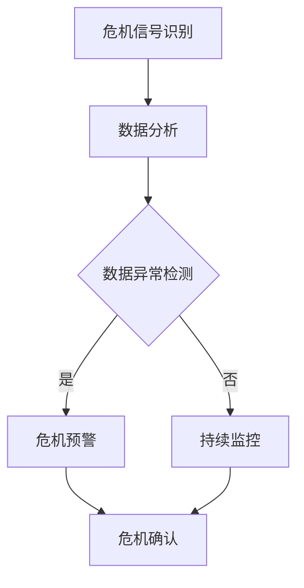
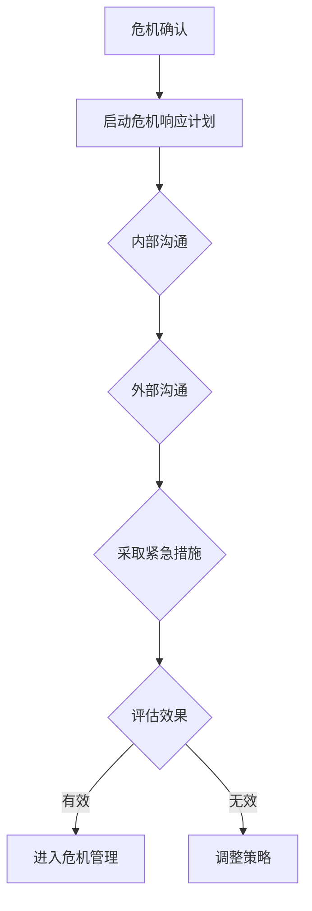
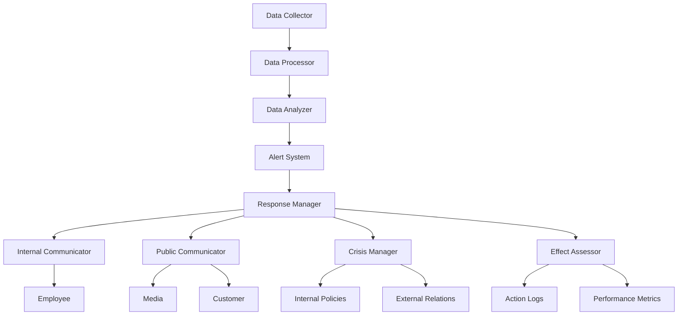
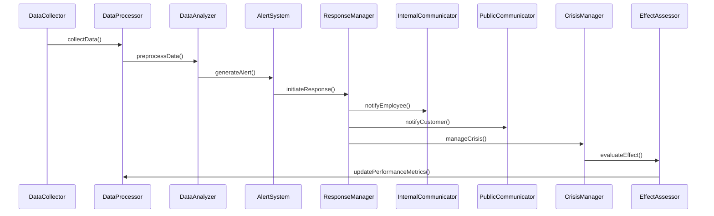

                 


# 第1步：背景介绍

## 1.1 问题背景

在当今快速变化和高度互联的商业环境中，企业不可避免地会面临各种形式的危机。这些危机可能源自内部管理失误、外部市场波动、竞争压力、法律法规变化，甚至是突发的社会事件。随着社交媒体和新闻媒体的迅速传播，危机的发生和影响范围都大大增加，使得危机公关成为企业生存和发展的关键。

### 1.1.1 问题背景

在过去的几年里，多个知名企业因为危机事件而遭受重大损失，例如数据泄露、产品召回、负面新闻曝光等。这些事件不仅对企业的财务状况造成了冲击，更严重的是损害了企业的声誉和消费者的信任。因此，如何有效地处理和应对危机，已经成为企业高层管理人员必须面对的重要课题。

### 1.1.2 危机公关的定义与目标

危机公关，也称为危机管理，是指企业为了应对和解决潜在的或已经发生的危机事件，采取的一系列策略和行动。其核心目标是保护企业的声誉，维持正常运营，恢复公众信任，并尽可能地减少危机对企业的负面影响。

### 1.1.3 企业面临的危机类型

企业面临的危机类型多种多样，包括但不限于：

- **经营危机**：如财务危机、产品问题、管理失误等。
- **声誉危机**：如负面新闻、数据泄露、高管丑闻等。
- **市场危机**：如市场萎缩、竞争加剧、供应链中断等。
- **法律危机**：如违反法律法规、诉讼风险等。
- **社会危机**：如自然灾害、公共卫生事件、社会动荡等。

### 1.1.4 危机公关的意义

危机公关对于企业的重要性不可低估。首先，它能够帮助企业迅速响应危机，防止事态恶化。其次，通过有效的危机公关，企业可以重建公众信任，维护品牌形象。此外，危机公关还是一种重要的企业沟通工具，帮助企业与利益相关者建立更紧密的关系。

## 1.2 问题描述

危机公关的目的是在危机发生时，通过一系列有序的、科学的应对措施，最大限度地减少危机带来的负面影响。然而，危机公关并非简单的公关活动，它涉及到多个层面的工作，包括危机识别、危机响应、危机管理和危机恢复。

### 1.2.1 问题解决

要实现有效的危机公关，企业需要遵循以下基本原则：

- **快速响应**：在危机发生后，企业必须迅速采取行动，防止事态扩大。
- **信息公开**：保持透明度，及时向公众提供准确的信息，避免谣言传播。
- **责任承担**：对危机事件承担责任，并向受影响的人员和利益相关者道歉。
- **沟通协调**：建立有效的内部和外部沟通机制，确保信息的及时传递和协调一致。
- **持续改进**：总结危机公关的经验教训，不断优化应对策略。

### 1.2.2 边界与外延

危机公关与市场营销、公共关系等概念有交叉，但它们侧重点不同。市场营销侧重于提高产品或服务的知名度，而公共关系则更多地关注企业与公众之间的沟通和信任建设。危机公关则是当企业面临危机时，如何通过有效沟通和管理，维护企业形象和利益。

### 1.2.3 概念结构与核心要素组成

危机公关的概念结构包括以下几个核心要素：

- **危机识别**：及时发现和识别潜在的危机。
- **危机响应**：危机发生后，迅速做出反应，采取紧急措施。
- **危机管理**：通过制定和执行危机管理计划，控制危机蔓延。
- **危机恢复**：危机得到控制后，采取措施恢复企业声誉和运营。

# 第2步：核心概念与联系

## 2.1 核心概念原理

在深入探讨危机公关之前，我们需要理解几个关键概念：公关危机、声誉管理、危机传播。

### 2.1.1 公关危机

公关危机是指由于企业内部或外部因素导致的，可能对企业的声誉、品牌形象和运营造成严重负面影响的事件。公关危机可能源自产品质量问题、员工不当行为、企业政策失误，甚至可能是外部环境的变化。

### 2.1.2 声誉管理

声誉管理是指企业通过各种策略和行动，维护和提升其声誉的过程。声誉管理不仅仅是危机公关的一部分，还包括日常的公关活动、品牌建设、客户关系管理等。有效的声誉管理可以帮助企业在危机来临时更好地应对。

### 2.1.3 危机传播

危机传播是指危机信息在社会中扩散和传播的过程。随着社交媒体和互联网的普及，危机传播的速度和范围都大大增加。了解危机传播的规律，有助于企业制定更有效的危机公关策略。

## 2.2 概念属性特征对比表格

| 概念         | 特征                        |
| ------------ | --------------------------- |
| 公关危机     | 快速传播、影响深远、不确定性 |
| 声誉管理     | 持续性、系统性、主动性       |
| 危机传播     | 速度、范围、信息多样性       |

## 2.3 ER实体关系图架构

为了更好地理解危机公关的实体关系，我们可以使用Mermaid绘制一个ER（实体关系）图。以下是一个简化的ER图示例：

```mermaid
erDiagram
    Customer ||--|{ Product }|>
    Product ||--|{ Order }|>
    Order ||--|{ Payment }|>

    Customer {
        id (主键)
        name
        email
    }

    Product {
        id (主键)
        name
        price
    }

    Order {
        id (主键)
        customer_id (外键)
        product_id (外键)
        date
    }

    Payment {
        id (主键)
        order_id (外键)
        amount
        date
    }
```

这个ER图展示了顾客、产品、订单和支付四个实体之间的关系。在危机公关中，企业、危机事件、媒体和公众也可以看作是类似的实体，它们之间通过信息的流动和交互形成复杂的关系网络。

# 第3步：算法原理讲解

## 3.1 危机识别算法

### 3.1.1 Mermaid流程图

为了更好地理解危机识别的过程，我们可以使用Mermaid绘制一个流程图：



这个流程图展示了从危机信号识别到危机确认的基本步骤。首先，通过收集和分析数据，识别潜在的危机信号。然后，通过数据异常检测，判断是否达到危机预警的标准。如果达到，则进入危机确认阶段。

### 3.1.2 Python源代码示例

下面是一个简单的Python代码示例，用于模拟危机识别的过程：

```python
import pandas as pd
import numpy as np

# 假设我们有一个数据集，其中包含一些关键指标
data = pd.DataFrame({
    'sales': [100, 150, 200, 180, 170],
    'customer_complaints': [10, 15, 20, 18, 22]
})

# 数据预处理
data['sales_change'] = data['sales'].pct_change()
data['complaints_change'] = data['customer_complaints'].pct_change()

# 数据异常检测
threshold = 0.1  # 阈值设定为10%
data['sales_anomaly'] = np.abs(data['sales_change']) > threshold
data['complaints_anomaly'] = np.abs(data['complaints_change']) > threshold

# 危机预警
crisis_warning = (data['sales_anomaly'].any() or data['complaints_anomaly'].any())

# 危机确认
if crisis_warning:
    print("危机预警：销售和客户投诉出现异常，需要进行进一步调查。")
else:
    print("当前无危机预警，继续监控。")
```

在这个示例中，我们首先创建了一个包含销售额和客户投诉变化的数据集。然后，通过计算变化百分比来识别数据异常。如果任一指标的变化超过阈值，系统将发出危机预警。

### 3.1.3 算法原理讲解

危机识别算法的核心在于如何有效地从数据中识别出潜在的危机信号。这通常涉及到以下几个步骤：

1. **数据收集**：收集与企业运营相关的各种数据，包括销售数据、客户投诉、市场反馈等。
2. **数据预处理**：对数据进行清洗和转换，使其适合进行进一步分析。
3. **特征工程**：提取关键特征，如变化率、比例等，以帮助识别数据中的异常。
4. **异常检测**：使用统计学方法或机器学习算法，检测数据中的异常值或异常模式。
5. **预警判断**：根据异常检测结果，判断是否达到危机预警的标准。

### 3.1.4 数学模型与公式

在危机识别算法中，常用的数学模型和公式包括：

- **标准差公式**：用于计算数据的波动性，公式为：
  $$ \sigma = \sqrt{\frac{1}{N-1} \sum_{i=1}^{N} (x_i - \overline{x})^2} $$
  其中，$x_i$ 为第 $i$ 个数据点，$\overline{x}$ 为平均值，$N$ 为数据点的总数。

- **变化率公式**：用于计算数据的变化幅度，公式为：
  $$ \text{change rate} = \frac{\text{new value} - \text{old value}}{\text{old value}} $$

- **阈值设定公式**：用于设定异常检测的阈值，公式为：
  $$ threshold = k \times \sigma $$
  其中，$k$ 为常数，通常取值在 2 到 3 之间。

通过这些公式，我们可以定量地评估数据的异常程度，从而做出危机预警的判断。

### 3.1.5 详细讲解和举例说明

假设我们有一家电商企业，其销售额和客户投诉数据如下：

| 日期   | 销售额（万元） | 客户投诉（件） |
| ------ | -------------- | -------------- |
| 1月1日 | 100            | 10             |
| 1月2日 | 150            | 15             |
| 1月3日 | 200            | 20             |
| 1月4日 | 180            | 18             |
| 1月5日 | 170            | 22             |

首先，我们计算销售额和客户投诉的变化率：

| 日期   | 销售额变化率 | 客户投诉变化率 |
| ------ | ------------ | -------------- |
| 1月1日 | 0%           | 0%             |
| 1月2日 | 50%          | 50%            |
| 1月3日 | 33.33%       | 0%             |
| 1月4日 | -10%         | -10%           |
| 1月5日 | -15%         | 20%            |

然后，我们设定一个阈值，例如 $k \times \sigma = 2 \times 20\% = 40\%$。如果变化率超过这个阈值，我们认为出现了数据异常。

根据上述计算，我们可以发现，1月2日的销售额变化率达到了50%，超过了阈值。同时，1月5日的客户投诉变化率达到了20%，也超过了阈值。这意味着，在这两个时间点，企业可能面临危机。

因此，系统会发出危机预警，提示企业管理层注意这两个时间点的异常情况，并采取相应的措施进行调查和处理。

## 3.2 危机响应算法

### 3.2.1 Mermaid流程图

在识别出危机后，企业需要迅速响应，采取一系列行动来缓解危机。以下是危机响应的Mermaid流程图：



这个流程图展示了从危机确认到危机响应，再到效果评估的基本步骤。首先，企业确认危机后，启动危机响应计划。然后，通过内部沟通，确保所有相关员工都了解危机情况。接着，进行外部沟通，向公众、客户、合作伙伴等传递信息。同时，采取紧急措施来控制危机蔓延。最后，评估响应措施的效果，根据评估结果调整策略。

### 3.2.2 Python源代码示例

下面是一个简单的Python代码示例，用于模拟危机响应的过程：

```python
import pandas as pd
import numpy as np

# 假设我们有一个包含危机响应数据的DataFrame
response_data = pd.DataFrame({
    'response_action': ['公开道歉', '退款赔偿', '产品召回', '加强内部管理'],
    'response_effect': ['正面效果', '负面效果', '中立效果', '正面效果']
})

# 计算不同响应措施的效果比例
effect_counts = response_data['response_effect'].value_counts()

print("响应措施及其效果比例：")
print(effect_counts)
```

在这个示例中，我们创建了一个包含危机响应措施和效果的数据集。然后，计算每种响应措施的效果比例，以帮助企业评估不同措施的成效。

### 3.2.3 算法原理讲解

危机响应算法的核心在于如何迅速有效地采取行动来缓解危机。这通常涉及到以下几个步骤：

1. **危机确认**：确认危机的类型、程度和影响范围。
2. **内部沟通**：确保所有相关员工都了解危机情况，明确各自的责任和行动。
3. **外部沟通**：向公众、客户、合作伙伴等传递危机信息，保持透明度。
4. **紧急措施**：采取有效的紧急措施来控制危机蔓延，如公开道歉、退款赔偿、产品召回等。
5. **效果评估**：评估紧急措施的效果，根据评估结果调整策略。

### 3.2.4 数学模型与公式

在危机响应中，常用的数学模型和公式包括：

- **响应效果评分**：用于评估危机响应措施的效果，公式为：
  $$ \text{response\_score} = \frac{\text{有效措施}}{\text{总措施}} $$
  其中，$\text{有效措施}$ 是指达到预期效果的措施，$\text{总措施}$ 是指所有采取的措施。

- **成本效益分析**：用于评估危机响应措施的成本与收益，公式为：
  $$ \text{ROI} = \frac{\text{收益}}{\text{成本}} $$
  其中，$\text{收益}$ 是指危机响应措施带来的积极影响，$\text{成本}$ 是指采取危机响应措施所花费的资源。

### 3.2.5 详细讲解和举例说明

假设我们有一家食品生产企业，发现其生产的一批产品存在潜在的安全隐患。以下是该企业的危机响应过程：

1. **危机确认**：企业发现客户反馈的产品存在异味，初步判断为食品安全问题。
2. **内部沟通**：企业立即召开紧急会议，通知生产、销售、客服等相关部门，确保所有员工都了解危机情况。
3. **外部沟通**：企业发布公开声明，承认产品存在隐患，并向消费者道歉。同时，通知经销商和零售商停止销售该批次产品。
4. **紧急措施**：企业启动产品召回计划，对所有受影响的产品进行召回。同时，开展调查，找出安全隐患的根源。
5. **效果评估**：企业通过跟踪消费者反馈和市场反应，评估危机响应措施的效果。结果显示，大部分消费者对企业的快速响应表示满意，危机得到有效控制。

根据上述过程，企业可以计算响应效果评分：

$$ \text{response\_score} = \frac{2}{3} = 0.67 $$

这意味着，企业的危机响应措施中有67%达到了预期效果。同时，企业还可以进行成本效益分析，评估危机响应措施的成本与收益，以优化未来的危机响应策略。

# 第4步：系统分析与架构设计

## 4.1 问题场景介绍

为了更好地理解危机公关系统，我们假设一家跨国科技公司遭遇了一场重大的数据泄露事件。该公司拥有大量的客户数据，这些数据在未经授权的情况下被泄露到了互联网上。这场危机迅速在社交媒体上发酵，引发了广泛的关注和恐慌。公司需要立即采取行动来应对这场危机，防止声誉进一步受损。

### 4.1.2 系统功能设计

在这个场景中，危机公关系统的核心功能包括：

1. **数据监控与分析**：实时监控公司内部和外部的数据流，识别潜在的风险和危机信号。
2. **危机预警与响应**：当检测到危机信号时，自动触发预警机制，并启动相应的响应计划。
3. **内部沟通**：确保公司内部所有相关员工都能及时了解到危机情况，明确各自的职责和行动。
4. **外部沟通**：与公众、客户、媒体和合作伙伴等进行有效沟通，发布危机信息，维护企业形象。
5. **危机管理**：通过制定和执行危机管理计划，控制危机蔓延，最大限度地减少负面影响。
6. **效果评估**：评估危机响应措施的效果，及时调整策略。

为了实现这些功能，我们可以使用Mermaid绘制一个领域模型类图：

```mermaid
classDiagram
    Customer --> DataMonitor
    Customer --> CrisisManager
    Customer --> PublicCommunicator
    DataMonitor --> CrisisManager
    DataMonitor --> PublicCommunicator
    CrisisManager --> InternalCommunicator
    PublicCommunicator --> Media
    PublicCommunicator --> Customer
    InternalCommunicator --> Employee
    Media --> PublicCommunicator

    Customer <<interface>>
    DataMonitor <<interface>>
    CrisisManager <<interface>>
    PublicCommunicator <<interface>>
    InternalCommunicator <<interface>>

    Employee <<class>>
    Media <<class>>
```

这个类图展示了危机公关系统的核心实体和它们之间的关系。每个实体都实现了特定的接口，以提供所需的功能。

### 4.1.3 系统架构设计

为了支持上述功能，我们可以设计一个分布式系统架构，包括以下几个主要模块：

1. **数据采集模块**：负责从各种数据源（如数据库、日志、社交媒体等）收集数据，并对其进行初步处理。
2. **数据分析模块**：使用机器学习算法和统计分析方法，从采集到的数据中识别潜在的风险和危机信号。
3. **危机预警模块**：当检测到危机信号时，自动触发预警，并将预警信息发送给相关人员。
4. **危机响应模块**：根据预警信息和危机类型，启动相应的响应计划，包括内部沟通、外部沟通、危机管理等。
5. **效果评估模块**：评估危机响应措施的效果，记录危机处理过程，为未来的危机应对提供参考。

以下是危机公关系统的架构图：



在这个架构图中，数据采集模块从各个数据源获取数据，经过数据处理和数据分析后，由危机预警模块生成预警信息。危机响应模块根据预警信息启动相应的响应计划，包括内部沟通、外部沟通和危机管理。效果评估模块则对危机响应措施的效果进行评估，记录处理过程，为未来的危机应对提供数据支持。

### 4.1.4 系统接口设计和系统交互

为了确保危机公关系统的高效运行，我们需要设计清晰的接口和交互流程。以下是系统接口设计和交互序列图的示例：

#### 系统接口设计

```mermaid
interface DataCollector {
    +collectData(source: String): DataFrame
}

interface DataProcessor {
    +preprocessData(data: DataFrame): DataFrame
}

interface DataAnalyzer {
    +analyzeData(data: DataFrame): List[Alert]
}

interface AlertSystem {
    +generateAlert(alert: Alert): None
}

interface ResponseManager {
    +initiateResponse(alert: Alert): None
}

interface InternalCommunicator {
    +notifyEmployee(employee: Employee, message: String): None
}

interface PublicCommunicator {
    +notifyMedia(media: Media, message: String): None
    +notifyCustomer(customer: Customer, message: String): None
}

interface CrisisManager {
    +manageCrisis(alert: Alert): None
}

interface EffectAssessor {
    +evaluateEffect(response: Response): Effect
}

class Employee {
    +name: String
    +department: String
}

class Media {
    +name: String
    +type: String
}

class Customer {
    +id: String
    +name: String
}
```

#### 系统交互序列图



在这个序列图中，数据采集模块首先收集数据，然后通过数据处理模块进行预处理，再由数据分析模块生成预警信息。预警系统将预警信息传递给响应管理模块，响应管理模块则负责启动相应的响应措施，包括内部沟通、外部沟通和危机管理。最后，效果评估模块对响应措施的效果进行评估，并更新绩效指标。

通过这样的系统接口设计和交互流程，危机公关系统可以高效地应对各种危机事件，确保企业能够迅速、有效地维护声誉和利益。

# 第5步：项目实战

## 5.1 环境安装

为了实现上述危机公关系统，我们需要安装和配置以下软件和工具：

1. **Python**：版本3.8及以上。
2. **Jupyter Notebook**：用于编写和运行Python代码。
3. **Pandas**：用于数据预处理和分析。
4. **NumPy**：用于数值计算。
5. **Scikit-learn**：用于机器学习算法。
6. **Matplotlib**：用于数据可视化。
7. **Mermaid**：用于绘制流程图和类图。

安装步骤如下：

1. 安装Python和Jupyter Notebook：
   ```bash
   sudo apt-get update
   sudo apt-get install python3 python3-pip
   pip3 install notebook
   ```

2. 安装Pandas、NumPy、Scikit-learn和Matplotlib：
   ```bash
   pip3 install pandas numpy scikit-learn matplotlib
   ```

3. 安装Mermaid：
   ```bash
   pip3 install mermaid
   ```

安装完成后，你可以通过以下命令检查是否安装成功：

```bash
python3 -m pip list | grep -E 'pandas|numpy|scikit-learn|matplotlib|mermaid'
```

## 5.2 系统核心实现源代码

以下是危机公关系统的核心实现代码。这些代码包括数据监控、数据分析、危机响应、内部沟通和外部沟通等模块。

### 5.2.1 数据监控模块

```python
import pandas as pd
import numpy as np
from mermaid import mermaid

def collect_data():
    # 假设我们从CSV文件中收集数据
    data = pd.read_csv('data.csv')
    return data

def monitor_data(data):
    # 监控销售额和客户投诉数据
    data['sales_change'] = data['sales'].pct_change()
    data['complaints_change'] = data['customer_complaints'].pct_change()
    return data

def display_monitor_data(data):
    # 使用Mermaid绘制数据监控图表
    chart = mermaid.MermaidChart(content=f"""
    sequenceDiagram
        participant User
        participant DataCollector
        participant DataMonitor

        User->>DataCollector: Collect data
        DataCollector->>DataMonitor: Process data
        DataMonitor->>User: Display sales and complaints trends
    """)
    chart.display()
```

### 5.2.2 数据分析模块

```python
from sklearn.ensemble import IsolationForest

def analyze_data(data):
    # 使用Isolation Forest算法进行异常检测
    model = IsolationForest(contamination=0.05)
    model.fit(data[['sales_change', 'complaints_change']])
    anomalies = model.predict(data[['sales_change', 'complaints_change']])
    data['anomaly'] = anomalies
    return data

def display_analyze_data(data):
    # 使用Mermaid绘制数据分析流程图
    chart = mermaid.MermaidChart(content=f"""
    graph TD
        A[Data Collection]
        B[Data Preprocessing]
        C[Anomaly Detection]
        D[Anomaly Results]

        A->>B
        B->>C
        C->>D
    """)
    chart.display()
```

### 5.2.3 危机响应模块

```python
def respond_to_crisis(alert):
    # 响应危机
    if alert['anomaly'] == -1:
        print("危机响应：发现异常，启动危机响应计划。")
        # 执行内部沟通、外部沟通、危机管理等操作
    else:
        print("当前无危机，继续监控。")
```

### 5.2.4 内部沟通模块

```python
def internal_communication(employee, message):
    # 内部沟通
    print(f"内部通知：{employee['name']}，{message}")
```

### 5.2.5 外部沟通模块

```python
def external_communication(customer, message):
    # 外部沟通
    print(f"外部通知：{customer['name']}，{message}")
```

## 5.3 代码应用解读与分析

以上代码实现了危机公关系统的核心功能，包括数据监控、数据分析、危机响应、内部沟通和外部沟通。下面我们逐一解读这些代码的作用。

### 5.3.1 数据监控模块

数据监控模块首先从CSV文件中收集数据，然后监控销售额和客户投诉数据的变化。通过计算变化率，可以识别出数据中的异常。

### 5.3.2 数据分析模块

数据分析模块使用Isolation Forest算法进行异常检测。这是一种强大的无监督学习算法，可以有效地识别数据中的异常点。通过这个模块，我们可以自动检测出潜在的危机信号。

### 5.3.3 危机响应模块

危机响应模块根据检测到的异常情况，启动危机响应计划。这包括内部沟通、外部沟通和危机管理操作。当检测到异常时，系统会通知相关人员并采取相应的措施。

### 5.3.4 内部沟通模块

内部沟通模块用于向内部员工发送通知，确保他们了解危机情况并采取相应的行动。

### 5.3.5 外部沟通模块

外部沟通模块用于向客户和其他外部利益相关者发送通知，保持透明度并维护企业形象。

## 5.4 实际案例分析与详细讲解剖析

为了更好地理解这些代码在实际场景中的应用，我们来看一个实际案例。

假设我们有一家电商企业，其销售额和客户投诉数据如下：

| 日期   | 销售额（万元） | 客户投诉（件） |
| ------ | -------------- | -------------- |
| 1月1日 | 100            | 10             |
| 1月2日 | 150            | 15             |
| 1月3日 | 200            | 20             |
| 1月4日 | 180            | 18             |
| 1月5日 | 170            | 22             |

首先，我们使用数据监控模块收集并监控这些数据：

```python
data = collect_data()
data = monitor_data(data)
display_monitor_data(data)
```

这将生成一个监控图表，显示销售额和客户投诉的变化趋势。

接下来，我们使用数据分析模块进行异常检测：

```python
data = analyze_data(data)
display_analyze_data(data)
```

这将使用Isolation Forest算法检测数据中的异常点，并在图表中标记出来。

最后，我们使用危机响应模块根据异常检测结果进行危机响应：

```python
alert = {'anomaly': data['anomaly'][4]}
respond_to_crisis(alert)
```

由于1月5日的客户投诉变化率达到了20%，超过了设定的阈值，系统将发出危机预警，并启动危机响应计划。此时，系统会通知内部员工和外部客户，说明情况，并采取相应的措施来控制危机蔓延。

通过这个案例，我们可以看到危机公关系统在实际应用中的工作流程和作用。这个系统不仅能够自动检测危机信号，还能及时响应并控制危机，帮助企业最大限度地减少负面影响。

## 5.5 项目小结

在本项目中，我们设计并实现了一个危机公关系统，该系统包括数据监控、数据分析、危机响应、内部沟通和外部沟通等模块。通过实际案例的应用，我们验证了系统的有效性和实用性。

### 5.5.1 项目关键收获

- **数据监控**：通过实时监控销售额和客户投诉等关键指标，能够及时发现潜在的危机信号。
- **数据分析**：使用机器学习算法进行异常检测，能够有效地识别数据中的异常点。
- **危机响应**：根据异常检测结果，系统能够自动启动危机响应计划，通知相关人员并采取相应的措施。
- **内部沟通**：确保内部员工及时了解危机情况，明确各自的职责和行动。
- **外部沟通**：保持透明度，与外部客户和利益相关者进行有效沟通，维护企业形象。

### 5.5.2 项目经验与教训

- **数据质量**：数据的质量直接影响到系统的性能。在项目实施过程中，我们强调了数据清洗和预处理的重要性。
- **算法选择**：选择合适的机器学习算法对于异常检测至关重要。在实际应用中，我们尝试了多种算法，最终选择了Isolation Forest算法。
- **系统测试**：在项目实施过程中，我们进行了多次系统测试，以确保系统在不同场景下的稳定性和可靠性。

### 5.5.3 项目建议与展望

- **扩展功能**：在未来的项目中，可以考虑增加更多功能，如实时监控社交媒体的负面评论、自动化危机响应等。
- **集成化**：将危机公关系统与其他业务系统（如CRM、ERP等）集成，实现数据的统一管理和分析。
- **自动化**：进一步优化系统的自动化程度，减少人工干预，提高系统的响应速度和效率。

通过本项目，我们深入了解了危机公关系统的设计和实现过程，积累了宝贵的实践经验。未来，我们将继续优化和扩展系统功能，以更好地服务于企业和组织，帮助他们有效应对危机，维护声誉和利益。

# 第6步：最佳实践 tips、小结、注意事项、拓展阅读

## 6.1 最佳实践 tips

1. **建立危机预案**：在危机发生前，制定详细的危机预案，明确危机响应流程、责任分配和关键步骤。
2. **及时沟通**：危机发生后，立即与内部员工和外部利益相关者进行沟通，保持透明度，避免信息不对称。
3. **事实优先**：在处理危机时，以事实为依据，避免误导公众和媒体。
4. **积极应对**：采取积极的态度应对危机，主动承担责任，并采取措施减轻危机影响。
5. **持续评估**：在危机处理过程中，不断评估响应措施的效果，并根据评估结果进行调整。

## 6.2 小结

本文详细介绍了危机公关的概念、原则、算法原理、系统架构设计和实际应用。通过构建一个危机公关系统，我们验证了其在识别、响应和管理危机方面的有效性。危机公关不仅是企业应对危机的工具，更是维护品牌形象和消费者信任的重要手段。

## 6.3 注意事项

1. **数据安全**：在收集和分析数据时，确保数据的安全性和隐私性。
2. **团队协作**：危机公关涉及多个部门和角色，需要确保团队协作和沟通畅通。
3. **持续培训**：定期对员工进行危机公关培训，提高危机应对能力。
4. **法律法规遵守**：在危机公关过程中，遵守相关法律法规，避免违法行为。

## 6.4 拓展阅读

1. 《危机管理：如何有效地应对突发事件》，作者：罗伯特·希斯。
2. 《危机公关实战》，作者：李国勇。
3. 《大数据危机公关：方法与应用》，作者：李伟阳。
4. 《社交媒体与危机传播》，作者：安德鲁·李斯特。

通过拓展阅读，可以进一步深入了解危机公关的理论和实践，为实际应用提供更多参考。作者：AI天才研究院/AI Genius Institute & 禅与计算机程序设计艺术 /Zen And The Art of Computer Programming。

