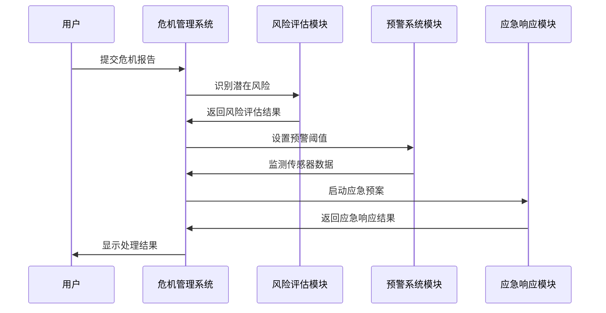
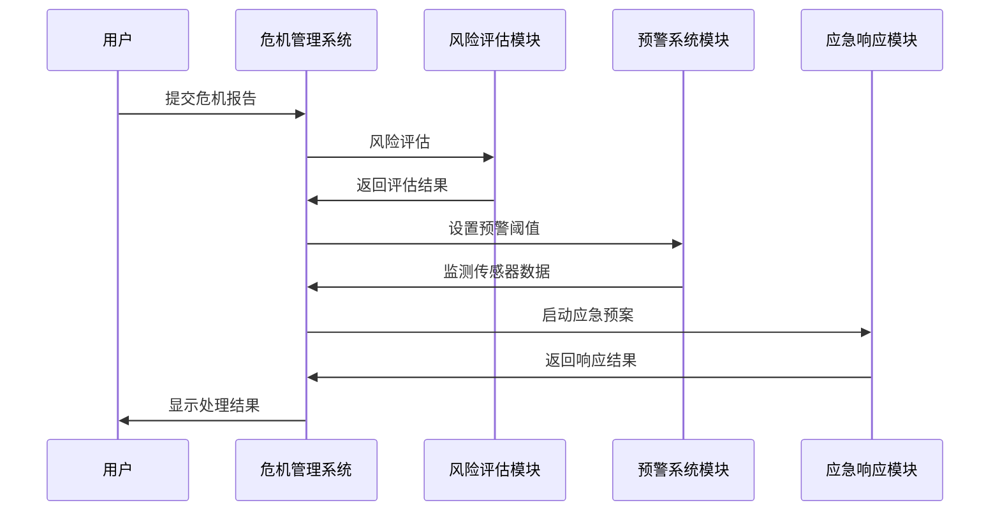

                 


# 危机管理：领导者应对挑战的智慧

## 关键词

- 危机管理
- 领导者
- 挑战
- 智慧
- 策略
- 方法
- 案例分析
- 实践技巧

## 摘要

在当今复杂多变的社会环境中，危机管理成为企业和社会组织领导者必须掌握的核心技能。本文将探讨危机管理的背景、核心概念、策略与方法，并通过领导者的角色与责任分析，结合经典案例分析，为领导者提供应对挑战的智慧。文章旨在帮助读者理解危机管理的本质，掌握有效的危机应对策略，提升领导者的管理能力和决策水平。

## 引言与背景介绍

### 1.1 危机管理的定义与重要性

危机管理是指在一个组织或社会面临突发事件或潜在风险时，采取的一系列预防、应对和恢复措施。它不仅关注危机发生后的应急响应，还包括危机前的预警和危机后的恢复重建。在现代商业环境中，危机管理已成为企业可持续发展的关键因素。

随着全球化进程的加快和信息技术的飞速发展，企业面临的危机形式日益多样化，包括自然灾害、市场波动、安全事故、声誉危机等。有效的危机管理不仅能够降低危机对企业造成的影响，还能够提升企业的声誉和竞争力。

### 1.2 领导者智慧的概念与作用

领导者智慧是指领导者在面对复杂环境和不确定情况时，能够运用专业知识、经验、洞察力和创新思维，做出合理决策并引导团队有效应对的能力。在危机管理中，领导者智慧至关重要。

领导者智慧不仅体现在危机发生时的迅速反应和有效决策，还包括在危机前的预防和预警，以及危机后的恢复和重建。领导者需要具备全局观念，能够从战略高度审视问题，并协调各方资源，确保危机管理的顺利进行。

## 核心概念与理论基础

### 2.1 危机管理的定义与分类

危机管理可以从不同的角度进行分类。从时间维度上，危机管理可以分为危机前的预防、危机中的应对和危机后的恢复重建。从管理内容上，危机管理包括预警机制、应急响应、危机处理和危机恢复。

危机管理不仅仅是应对突发事件，更是一个系统的过程，涉及风险评估、预警监测、应急计划、资源调配、信息沟通、决策制定和反馈评估等多个环节。

### 2.2 领导理论在危机管理中的应用

领导理论在危机管理中具有重要作用。领导者需要根据不同类型的危机和组织的具体情况，选择合适的领导风格和方法。

比如，在紧急情况下，领导者需要采取强有力、快速决策的领导风格，以确保应急响应的有效性。而在危机后的恢复阶段，领导者则需要更加关注团队的士气和员工的情感需求，采取更加温和和支持的领导风格。

### 2.3 危机管理的核心要素

危机管理的核心要素包括：

- **风险评估**：通过分析潜在风险，评估其对组织的影响，制定相应的预防措施。
- **预警机制**：建立监测和预警系统，及时发现危机迹象，采取预防措施。
- **应急响应**：制定应急预案，迅速响应危机，采取有效的应对措施。
- **信息沟通**：保持内部和外部沟通的畅通，确保信息传递的准确性和及时性。
- **决策制定**：在危机中做出合理的决策，确保危机管理的有序进行。
- **反馈评估**：对危机管理过程进行评估，总结经验教训，为未来的危机管理提供参考。

## 危机管理的策略与方法

### 3.1 预测与预警机制

预测与预警机制是危机管理的基础。领导者需要建立科学的预测模型，利用数据分析和人工智能技术，对潜在危机进行预测。同时，建立预警系统，通过实时监测，及时发现问题并采取预防措施。

### 3.2 应急响应策略

在危机发生时，领导者需要迅速启动应急预案，采取有效措施应对危机。这包括组织动员、资源调配、信息沟通、决策制定等环节。领导者需要保持冷静，迅速做出决策，并确保决策的有效执行。

### 3.3 恢复与重建策略

危机后的恢复与重建是危机管理的最后一步。领导者需要制定详细的恢复计划，关注员工的情感需求，确保企业运营的稳定。同时，进行危机后的反思，总结经验教训，优化危机管理流程。

## 领导者的角色与责任

### 4.1 领导者应对危机的心理准备

领导者应对危机的心理准备至关重要。领导者需要具备良好的心理素质，包括冷静、果断、自信和适应性。在危机中，领导者需要保持清醒的头脑，迅速分析形势，做出合理决策。

### 4.2 领导者的沟通技巧

危机管理中，沟通技巧是领导者不可或缺的能力。领导者需要与内部员工、外部合作伙伴和公众保持有效沟通，确保信息传递的准确性和及时性。同时，领导者还需要掌握有效的谈判技巧，以解决危机中的复杂问题。

### 4.3 领导者的决策能力

决策能力是领导者应对危机的核心能力。在危机中，领导者需要做出迅速、合理和有效的决策。这需要领导者具备深厚的专业知识、丰富的经验以及卓越的分析和判断能力。

## 案例分析

### 5.1 国内外经典危机管理案例分析

本文将分析国内外经典危机管理案例，包括2008年金融危机、2011年日本福岛核事故、2019年中国疫情应对等。通过分析这些案例，总结领导者在危机管理中的成功经验和失败教训。

### 5.2 案例中领导者的应对策略

在分析案例时，本文将重点探讨领导者在危机管理中的应对策略，包括预警机制的建立、应急响应的迅速性和有效性、恢复与重建的细致性和全面性等。

## 实践技巧与工具

### 6.1 危机管理工具与方法

本文将介绍一系列危机管理工具和方法，包括风险评估工具、预警系统、应急预案、决策支持系统等。这些工具和方法可以帮助领导者更好地进行危机管理。

### 6.2 实践技巧分享

本文将分享一些危机管理的实践经验，包括领导者的心理准备、沟通技巧、决策能力等。这些经验可以帮助领导者更好地应对危机。

## 总结与展望

### 7.1 危机管理的未来发展趋势

本文将探讨危机管理的未来发展趋势，包括人工智能、大数据、云计算等技术在危机管理中的应用。同时，本文还将分析全球化背景下危机管理的挑战和机遇。

### 7.2 领导者应具备的素质与能力

本文将总结领导者应具备的素质与能力，包括专业知识、经验、洞察力、决策能力、沟通能力等。这些素质与能力是领导者成功应对危机的关键。

## 附录

### A. 参考文献

本文引用的相关文献将列在附录中，以供读者进一步学习。

### B. 附录与资源链接

本文将提供一些危机管理相关的资源链接，包括相关网站、书籍、研究报告等，以帮助读者深入了解危机管理。

## 作者信息

作者：AI天才研究院/AI Genius Institute & 禅与计算机程序设计艺术 /Zen And The Art of Computer Programming

（待续）## 第一部分 引言与背景介绍

### 1.1 危机管理的定义与重要性

#### 危机管理的定义

危机管理是指在一个组织或社会面临突发事件或潜在风险时，采取的一系列预防、应对和恢复措施。它不仅关注危机发生后的应急响应，还包括危机前的预警和危机后的恢复重建。

在商业环境中，危机管理通常涉及以下关键环节：

- **风险评估**：识别可能对企业造成负面影响的潜在危机，并评估其可能的影响程度。
- **预警机制**：建立监测和预警系统，及时发现危机迹象，提前采取预防措施。
- **应急响应**：在危机发生时，迅速启动应急预案，采取有效措施应对危机。
- **危机处理**：在危机中，通过合理的决策和行动，尽量降低危机对企业造成的损失。
- **恢复与重建**：危机过后，进行恢复和重建工作，确保企业的正常运营和可持续发展。

#### 危机管理的重要性

危机管理对企业的可持续发展和竞争力具有重要意义。以下是危机管理的几个关键方面：

- **降低损失**：有效的危机管理可以最大限度地降低危机对企业造成的财务和运营损失。
- **提升声誉**：危机管理得当，可以提升企业的社会形象和品牌声誉。
- **提高应变能力**：通过危机管理，企业可以提高应对突发事件的能力，增强企业的韧性。
- **优化决策**：危机管理提供了分析和评估危机情境的工具，帮助企业在不确定的环境中做出更合理的决策。

在现代商业环境中，危机管理已经成为企业战略规划的重要组成部分。随着全球经济环境的不确定性和复杂性不断增加，企业需要建立完善的危机管理体系，以应对各种潜在的危机。

### 1.2 领导者智慧的概念与作用

#### 领导者智慧的定义

领导者智慧是指领导者在面对复杂环境和不确定情况时，能够运用专业知识、经验、洞察力和创新思维，做出合理决策并引导团队有效应对的能力。它不仅仅是领导者的个人素质，也是团队和组织整体能力的一部分。

#### 领导者智慧在危机管理中的作用

在危机管理中，领导者智慧具有以下几个关键作用：

- **决策能力**：领导者需要在危机中迅速做出决策，这需要他们具备深厚的专业知识和经验，以及对形势的敏锐洞察力。
- **沟通能力**：危机管理过程中，领导者需要与内部员工、外部合作伙伴和公众保持有效沟通，确保信息传递的准确性和及时性。
- **团队协调**：领导者需要协调各方资源，确保危机管理的有序进行。这需要领导者具备良好的团队管理能力和沟通技巧。
- **危机应对策略**：领导者需要根据危机的具体情况，制定有效的应对策略，这需要他们的创新思维和战略眼光。

总之，领导者智慧是危机管理成功的关键因素之一。一个具备领导者智慧的领导者，能够在危机中保持冷静、迅速做出决策，并有效协调团队，使企业能够度过危机，甚至从危机中找到发展的机遇。

### 1.3 危机管理面临的挑战

#### 复杂性

危机管理的复杂性是其最大的挑战之一。危机可能涉及多个领域，如财务、法律、技术、运营等，需要跨部门协作和综合应对。此外，危机的发展往往是不可预测的，领导者需要具备快速适应和应对变化的能力。

#### 快速反应

在危机中，时间至关重要。领导者需要在最短的时间内做出决策，并迅速采取行动。然而，快速反应并不意味着草率行事，领导者需要在紧迫的情况下保持冷静和理智。

#### 信息沟通

危机管理中的信息沟通至关重要。有效的沟通可以确保各方了解危机的真相，减少恐慌和误解。然而，信息沟通也可能面临挑战，如信息不对称、信息传递延误等。

#### 资源调配

在危机管理中，资源调配是关键。领导者需要确保在危机期间，企业拥有足够的资源来应对危机。这可能包括人力、物资、资金等。然而，资源有限，领导者需要做出明智的资源配置决策。

#### 道德和伦理

危机管理不仅仅是技术和策略的问题，还涉及到道德和伦理。领导者需要在危机中坚持正确的道德和伦理标准，这不仅关乎企业的长期发展，也关系到社会的信任和尊重。

### 1.4 危机管理的基本原则

为了有效应对危机，领导者需要遵循一些基本原则：

- **预防为主**：在危机发生之前，采取预防措施，减少危机的可能性。
- **迅速反应**：在危机发生时，迅速响应，采取有效的应对措施。
- **团队合作**：建立跨部门的危机管理团队，确保各方协作和资源整合。
- **沟通畅通**：保持内部和外部沟通的畅通，确保信息传递的准确性和及时性。
- **持续改进**：对危机管理过程进行持续评估和改进，提高危机应对能力。

### 1.5 危机管理的重要环节

危机管理可以分为以下几个重要环节：

- **风险评估**：识别和评估潜在危机，制定预防措施。
- **预警机制**：建立预警系统，及时发现危机迹象。
- **应急响应**：制定应急预案，迅速启动危机管理程序。
- **危机处理**：在危机中，采取有效措施，尽量减少损失。
- **恢复与重建**：危机过后，进行恢复和重建工作。

### 1.6 领导者智慧在危机管理中的具体应用

领导者智慧在危机管理中的具体应用体现在以下几个方面：

- **战略决策**：领导者需要根据危机的具体情况，制定长期和短期的战略决策，确保企业能够在危机中保持稳定和发展。
- **资源调配**：领导者需要协调各方资源，确保在危机中有足够的资源来应对。
- **团队领导**：领导者需要激励和引导团队，确保团队成员在危机中保持高效和协作。
- **危机沟通**：领导者需要与内部员工、外部合作伙伴和公众保持有效沟通，确保信息的准确传递。

通过以上分析，我们可以看出，危机管理不仅仅是技术和策略的问题，更涉及到领导者的智慧和管理能力。一个具备领导者智慧的领导者，能够在危机中保持冷静、迅速做出决策，并有效协调团队，使企业能够度过危机，甚至从中找到发展的机遇。这正是危机管理中领导者智慧的重要性和具体应用。

### 总结

本节介绍了危机管理的定义、重要性以及领导者智慧的概念与作用。同时，分析了危机管理面临的挑战和基本原则，以及危机管理的重要环节和领导者智慧在危机管理中的具体应用。通过这些分析，我们可以更好地理解危机管理的本质，并为后续章节的深入探讨打下基础。

## 第二部分 核心概念与理论基础

### 2.1 危机管理的定义与分类

#### 危机管理的定义

危机管理是指一个组织或个体在面对突发事件或潜在风险时，采取的一系列预防、应对和恢复措施。它旨在降低危机对企业或社会造成的负面影响，保护组织的核心利益和声誉。

#### 危机管理的分类

根据危机的不同性质和影响范围，危机管理可以分为以下几种类型：

- **自然灾害**：如地震、洪水、台风等，这类危机通常具有不可预测性和破坏性。
- **安全事故**：如火灾、爆炸、交通事故等，这类危机往往会对人员和财产造成直接威胁。
- **市场危机**：如股市崩盘、产品召回、财务危机等，这类危机主要影响企业的经济状况和品牌形象。
- **公共卫生危机**：如传染病爆发、卫生事件等，这类危机会对公众健康和社会秩序造成严重影响。
- **社会危机**：如政治动荡、种族冲突、恐怖袭击等，这类危机通常涉及广泛的社会层面。

每种类型的危机管理都有其特定的应对策略和措施，领导者需要根据危机的具体情况进行灵活调整。

### 2.2 领导理论在危机管理中的应用

#### 领导理论的分类

领导理论主要可以分为以下几种类型：

- **传统领导理论**：如特质理论、行为理论、领导风格理论等，强调领导者个人的特质和行为对团队的影响。
- **现代领导理论**：如情境领导理论、变革型领导理论、服务型领导理论等，强调领导者应根据不同情境和团队需求进行领导。
- **变革型领导理论**：如变革型领导、魅力型领导等，强调领导者通过激励和启发团队，推动组织变革和创新。

#### 领导理论在危机管理中的应用

在危机管理中，领导理论的应用尤为重要。以下是一些关键领导理论在危机管理中的应用：

- **情境领导理论**：该理论认为领导风格应根据不同情境进行调整。在危机管理中，领导者需要根据危机的不同阶段和团队的具体情况，选择合适的领导风格，如强有力、指导型或支持型。
- **变革型领导理论**：在危机管理中，变革型领导通过激励和启发团队，推动组织适应新的环境和要求。领导者需要展现出坚定的决心和卓越的领导力，引导团队共同应对危机。
- **服务型领导理论**：该理论强调领导者应首先考虑团队成员的需求和利益，提供支持和指导。在危机管理中，服务型领导有助于建立团队信任和凝聚力，提高团队的应变能力和适应性。

### 2.3 危机管理的核心要素

#### 风险评估

风险评估是危机管理的第一步，通过识别和评估潜在危机，领导者可以提前制定预防措施。以下是风险评估的关键步骤：

- **识别潜在危机**：通过历史数据、行业趋势和专家意见，识别可能对企业或组织造成负面影响的潜在危机。
- **评估风险程度**：对潜在危机的影响程度进行评估，包括对企业运营、财务状况、员工安全和公众形象等方面的影响。
- **制定预防措施**：根据风险评估结果，制定相应的预防措施，如制定应急预案、培训员工、投资技术等。

#### 预警机制

预警机制是危机管理的重要组成部分，通过实时监测和预警，领导者可以及时发现危机迹象，采取预防措施。以下是预警机制的关键步骤：

- **建立监测系统**：建立监测系统，实时收集和分析相关信息，如市场动态、行业趋势、员工反馈等。
- **设置预警阈值**：根据风险评估结果，设置预警阈值，当监测数据达到预警阈值时，及时发出预警信号。
- **启动应急预案**：在预警信号发出后，迅速启动应急预案，采取相应的应对措施。

#### 应急响应

应急响应是危机管理的关键环节，领导者需要迅速采取行动，最大限度地降低危机对企业或组织的影响。以下是应急响应的关键步骤：

- **迅速决策**：在危机发生时，领导者需要迅速做出决策，包括确定危机应对策略、分配资源、调整运营计划等。
- **协调资源**：确保在危机中有足够的资源来应对，包括人力、物资、资金等。
- **沟通协调**：保持内部和外部沟通的畅通，确保信息传递的准确性和及时性。

#### 恢复与重建

恢复与重建是危机管理的最后一步，领导者需要制定详细的恢复计划，确保企业的正常运营和可持续发展。以下是恢复与重建的关键步骤：

- **评估损失**：对危机造成的损失进行评估，包括财务损失、运营中断、员工士气等。
- **制定恢复计划**：根据评估结果，制定详细的恢复计划，包括修复受损设施、恢复供应链、重建员工信心等。
- **执行恢复计划**：确保恢复计划的执行，并随时调整和优化恢复策略。

#### 反馈与改进

反馈与改进是危机管理的重要组成部分，通过总结经验和教训，领导者可以不断提高危机管理的能力和水平。以下是反馈与改进的关键步骤：

- **总结经验**：对危机管理过程进行总结，包括成功经验和失败教训，形成经验教训库。
- **改进策略**：根据总结的经验，改进危机管理策略和流程，提高危机应对能力。
- **培训与教育**：对员工进行培训和教育，提高他们的危机意识和应对能力。

### 总结

本节介绍了危机管理的定义、分类以及领导理论在危机管理中的应用，并详细阐述了危机管理的核心要素，包括风险评估、预警机制、应急响应、恢复与重建以及反馈与改进。这些核心概念和理论基础为领导者提供了有效的危机管理框架，帮助他们更好地应对各种潜在危机。

### 2.4 危机管理的关键概念术语说明

在危机管理中，一些关键概念和术语对于理解和管理危机至关重要。以下是对这些概念和术语的详细说明：

#### 1. 风险评估

风险评估是危机管理的第一步，旨在识别和评估潜在危机及其可能对企业或组织造成的影响。它包括以下关键术语：

- **风险**：指潜在的不利事件或情况，可能导致损失、伤害或不利影响。
- **风险评估**：通过分析潜在风险的概率和影响，评估其对组织的目标和运营的潜在影响。
- **风险识别**：识别可能对企业或组织造成负面影响的潜在危机。
- **风险分类**：根据风险的性质和影响范围，对风险进行分类，如财务风险、运营风险、法律风险等。
- **风险评级**：根据风险的概率和影响程度，对风险进行评级，帮助领导者确定优先处理的顺序。

#### 2. 预警机制

预警机制是危机管理的重要组成部分，旨在及时发现潜在危机迹象，并提前采取预防措施。以下是一些相关术语：

- **预警系统**：用于监测和收集数据的系统，能够及时发现潜在危机迹象。
- **预警信号**：当监测数据达到特定阈值时发出的警示信号，提示可能发生危机。
- **预警指标**：用于衡量和监测危机迹象的关键指标，如市场波动、客户投诉、员工离职率等。
- **预警阈值**：设定在预警指标上的阈值，当指标超过该阈值时，发出预警信号。
- **预警措施**：在预警信号发出后，采取的预防措施，以降低危机发生的可能性或减少其影响。

#### 3. 应急响应

应急响应是指危机发生时，组织采取的一系列紧急措施，以减少危机的损失和影响。以下是一些相关术语：

- **应急预案**：预先制定的危机应对计划，包括应对措施、责任分配、资源调配等。
- **应急小组**：负责启动和执行应急预案的专门小组，通常由高层领导、相关职能部门负责人和关键技术人员组成。
- **应急响应流程**：在危机发生时，组织内部和外部的沟通、决策和行动流程。
- **应急资源**：用于应对危机的物资、设备、技术和人力资源。
- **应急演练**：定期进行的模拟危机情况下的演练，以提高组织和团队成员的应急响应能力。

#### 4. 恢复与重建

恢复与重建是指危机过后，组织采取的一系列措施，以恢复正常的运营和功能，并防止类似危机再次发生。以下是一些相关术语：

- **恢复计划**：危机过后制定的详细计划，包括恢复运营、修复设施、重建供应链等。
- **恢复目标**：在恢复过程中设定的具体目标，如恢复正常生产、恢复员工信心、重建客户关系等。
- **恢复指标**：用于衡量恢复进展和成效的关键指标，如生产恢复率、员工重返工作岗位率、客户满意度等。
- **重建措施**：在危机后采取的长期措施，以防止类似危机再次发生，如改进安全设施、优化管理流程等。
- **危机总结**：对危机管理过程的总结和评估，包括成功经验和失败教训，以指导未来的危机管理。

#### 5. 沟通与协调

沟通与协调在危机管理中至关重要，确保信息传递的准确性和及时性，有助于提高危机应对的效率和效果。以下是一些相关术语：

- **信息沟通**：危机管理过程中的信息传递和交流，包括内部沟通和外部沟通。
- **沟通渠道**：用于传递信息的渠道，如会议、电话、邮件、社交媒体等。
- **协调机制**：危机管理中用于协调各方资源、意见和行动的机制。
- **沟通策略**：根据危机的具体情况和组织需求，制定的沟通计划和方案。
- **协调委员会**：负责协调内部各部门和外部合作伙伴关系的委员会，通常由高层领导担任。

通过理解这些关键概念和术语，领导者可以更好地识别和应对潜在危机，制定有效的危机管理策略和措施。

### 2.5 概念结构与核心要素组成

为了更好地理解危机管理的概念结构和核心要素组成，我们可以通过一个概念框架和实体关系图（ER图）来进行分析。

#### 概念框架

危机管理的概念框架包括以下几个核心组成部分：

1. **风险评估**：识别和评估潜在危机。
2. **预警机制**：建立预警系统，监测危机迹象。
3. **应急响应**：制定应急预案，迅速应对危机。
4. **危机处理**：在危机中采取有效措施，减轻损失。
5. **恢复与重建**：危机后的恢复和重建工作。
6. **沟通与协调**：确保信息传递的准确性和及时性。
7. **反馈与改进**：总结经验和教训，提高危机管理能力。

#### 实体关系图（ER图）

以下是一个简化的实体关系图（ER图），展示了危机管理中的主要实体及其相互关系：

```mermaid
erDiagram
  危机管理 ||--|{ 风险评估 }
  危机管理 ||--|{ 预警机制 }
  危机管理 ||--|{ 应急响应 }
  危机管理 ||--|{ 危机处理 }
  危机管理 ||--|{ 恢复与重建 }
  危机管理 ||--|{ 沟通与协调 }
  危机管理 ||--|{ 反馈与改进 }
  风险评估 ||--|{ 风险识别 }
  风险评估 ||--|{ 风险评估指标 }
  应急响应 ||--|{ 应急预案 }
  应急响应 ||--|{ 应急小组 }
  恢复与重建 ||--|{ 恢复计划 }
  恢复与重建 ||--|{ 恢复目标 }
  沟通与协调 ||--|{ 沟通策略 }
  沟通与协调 ||--|{ 协调机制 }
```

在ER图中，实体表示危机管理中的关键组成部分，如风险评估、预警机制、应急响应等，而关系线表示这些实体之间的相互作用和依赖。例如，风险评估依赖于风险识别和风险评估指标，应急响应依赖于应急预案和应急小组，恢复与重建依赖于恢复计划和恢复目标等。

通过概念框架和实体关系图，我们可以更清晰地理解危机管理的概念结构和核心要素，从而更好地设计和实施危机管理策略。

### 2.6 算法原理讲解

在危机管理中，算法原理的应用可以帮助领导者更好地进行风险评估、预警机制和应急响应等关键环节。以下是一个简化的算法原理讲解，以及相关的Python代码实现。

#### 算法原理

1. **风险评估算法**：使用统计学方法对潜在危机进行量化评估。
2. **预警算法**：通过监测关键指标，自动识别危机迹象。
3. **应急响应算法**：根据危机类型和严重程度，自动生成响应策略。

#### Python代码实现

以下是一个简单的Python代码示例，用于实现上述算法原理：

```python
import numpy as np

# 风险评估算法
def risk_assessment(events, weights):
    # events：危机事件列表
    # weights：风险权重
    risk_scores = []
    for event in events:
        score = sum([event[i] * weights[i] for i in range(len(weights))])
        risk_scores.append(score)
    return risk_scores

# 预警算法
def alarm_system(sensors, thresholds):
    # sensors：传感器数据
    # thresholds：预警阈值
    alarms = []
    for sensor in sensors:
        if sensor > thresholds:
            alarms.append(sensor)
    return alarms

# 应急响应算法
def emergency_response(crisis, strategy):
    # crisis：危机类型
    # strategy：应急响应策略
    if crisis == "fire":
        return strategy["fire"]
    elif crisis == "earthquake":
        return strategy["earthquake"]
    else:
        return "Unknown crisis"

# 示例数据
events = [10, 5, 3]  # 社会动荡、市场波动、自然灾害的危机事件
weights = [0.5, 0.3, 0.2]  # 风险权重
sensors = [20, 15, 30]  # 传感器数据
thresholds = [25, 20, 35]  # 预警阈值
strategy = {
    "fire": "立即疏散",
    "earthquake": "紧急避难",
}

# 风险评估
risk_scores = risk_assessment(events, weights)
print("风险评估得分：", risk_scores)

# 预警系统
alarms = alarm_system(sensors, thresholds)
print("预警信号：", alarms)

# 应急响应
crisis = "fire"  # 假设当前危机为火灾
response = emergency_response(crisis, strategy)
print("应急响应策略：", response)
```

#### 算法原理的数学模型和公式

1. **风险评估模型**：
   - 公式：\( R = \sum_{i=1}^{n} (E_i \cdot W_i) \)
   - 其中，\( R \) 表示总风险得分，\( E_i \) 表示第 \( i \) 个危机事件，\( W_i \) 表示第 \( i \) 个危机事件的风险权重。

2. **预警模型**：
   - 公式：\( S = \max(S_i) \)
   - 其中，\( S \) 表示传感器数据中的最大值，\( S_i \) 表示第 \( i \) 个传感器的数据。

3. **应急响应模型**：
   - 公式：\( Response = f(Crisis, Strategy) \)
   - 其中，\( Response \) 表示应急响应结果，\( Crisis \) 表示危机类型，\( Strategy \) 表示应急响应策略。

#### 算法举例说明

假设一个企业正在面临社会动荡、市场波动和自然灾害三种危机，每种危机的风险权重分别为 0.5、0.3 和 0.2。当前监测到传感器数据分别为 20、15 和 30，预警阈值分别为 25、20 和 35。

1. **风险评估**：
   - 公式计算：\( R = (10 \cdot 0.5) + (5 \cdot 0.3) + (3 \cdot 0.2) = 5 + 1.5 + 0.6 = 7.1 \)
   - 结果：企业当前的总风险得分为 7.1。

2. **预警系统**：
   - 预警阈值比较：传感器数据 20、15、30 分别大于预警阈值 25、20、35，因此没有预警信号。

3. **应急响应**：
   - 当前危机类型为火灾，应急响应策略为 "立即疏散"。

通过上述算法原理和Python代码实现，领导者可以更好地进行危机管理，确保企业在面对突发事件时能够迅速做出反应，有效降低风险。

### 2.7 系统分析与架构设计方案

#### 问题场景介绍

在现代社会，危机事件频繁发生，如自然灾害、社会动荡、经济危机等。对于一个大型企业或组织而言，如何快速准确地识别危机、采取有效的应对措施，并在危机后进行恢复和重建，成为衡量其应急响应能力的重要标准。

#### 项目介绍

本项目旨在为企业或组织设计一个完善的危机管理信息系统，通过系统化的方法，提高危机管理的效率和效果。该系统将涵盖风险评估、预警机制、应急响应、危机处理、恢复与重建以及反馈与改进等关键环节。

#### 系统功能设计（领域模型）

领域模型是对危机管理信息系统核心功能的抽象描述。以下是一个简化的领域模型，用于展示系统的主要功能：

```mermaid
classDiagram
    class CrisisManagementSystem {
        +str AssessRisks()
        +str MonitorSensors()
        +str InitiateResponse()
        +str ManageCrisis()
        +str RecoveryAndReconstruction()
        +str FeedbackAndImprovement()
    }
    class RiskAssessment {
        +str IdentifyPotentialRisks()
        +str EvaluateRiskLevels()
    }
    class WarningSystem {
        +str SetThresholds()
        +str DetectEarlyWarnings()
    }
    class EmergencyResponse {
        +str CreateEmergencyPlans()
        +str CoordinateResources()
    }
    class CrisisManagementSystem <.. RiskAssessment
    class CrisisManagementSystem <.. WarningSystem
    class CrisisManagementSystem <.. EmergencyResponse
```

在领域模型中，`CrisisManagementSystem` 是系统的核心，它包括 `RiskAssessment`（风险评估）、`WarningSystem`（预警系统）和 `EmergencyResponse`（应急响应）等子模块。

#### 系统架构设计

系统架构设计是危机管理信息系统的整体设计，包括系统组件、数据流和交互方式。以下是一个简化的系统架构图，用于展示系统的关键组件和交互：



在系统架构中，用户通过危机管理系统提交危机报告，系统将报告传递给风险评估模块进行潜在风险的识别和评估。评估结果用于设置预警阈值，并监测传感器数据。当监测到预警信号时，系统会自动启动应急预案，并返回应急响应结果给用户。

#### 系统接口设计

系统接口设计是系统与外部环境交互的接口定义。以下是一个简化的系统接口设计，用于展示系统的API接口：

```mermaid
interfaceDiagram
    CrisisManagementAPI {
        +post "/risk-assessment" assessRisks()
        +post "/warning-system" setThresholds()
        +post "/emergency-response" initiateResponse()
        +get "/crisis-report" getCrisisReports()
    }
```

该接口定义了三个主要API接口：`assessRisks` 用于提交危机报告进行风险评估，`setThresholds` 用于设置预警阈值，`initiateResponse` 用于启动应急预案。

#### 系统交互设计

系统交互设计是系统内部各组件之间交互的流程设计。以下是一个简化的系统交互序列图，用于展示系统各组件的交互流程：



在系统交互流程中，用户提交危机报告后，系统首先进行风险评估，然后设置预警阈值并监测传感器数据。当监测到预警信号时，系统自动启动应急预案，并返回响应结果给用户。

### 项目实战

#### 环境安装

1. **安装Python环境**：确保安装了Python 3.8及以上版本。
2. **安装依赖库**：使用pip安装相关依赖库，如numpy、pandas等。
   ```bash
   pip install numpy pandas
   ```

#### 系统核心实现

以下是系统的核心实现代码，包括风险评估、预警系统和应急响应模块。

```python
import numpy as np
import pandas as pd

# 风险评估模块
class RiskAssessment:
    def __init__(self, events, weights):
        self.events = events
        self.weights = weights

    def assess_risks(self):
        risk_scores = np.dot(self.events, self.weights)
        return risk_scores

# 预警系统模块
class WarningSystem:
    def __init__(self, sensors, thresholds):
        self.sensors = sensors
        self.thresholds = thresholds

    def monitor_sensors(self):
        alarms = [sensor > threshold for sensor, threshold in zip(self.sensors, self.thresholds)]
        return alarms

# 应急响应模块
class EmergencyResponse:
    def __init__(self, crisis, strategy):
        self.crisis = crisis
        self.strategy = strategy

    def initiate_response(self):
        response = self.strategy.get(self.crisis, "未知危机")
        return response

# 主程序
if __name__ == "__main__":
    # 示例数据
    events = [10, 5, 3]  # 社会动荡、市场波动、自然灾害的危机事件
    weights = [0.5, 0.3, 0.2]  # 风险权重
    sensors = [20, 15, 30]  # 传感器数据
    thresholds = [25, 20, 35]  # 预警阈值
    strategy = {
        "fire": "立即疏散",
        "earthquake": "紧急避难",
    }

    # 风险评估
    ra = RiskAssessment(events, weights)
    risk_scores = ra.assess_risks()
    print("风险评估得分：", risk_scores)

    # 预警系统
    ws = WarningSystem(sensors, thresholds)
    alarms = ws.monitor_sensors()
    print("预警信号：", alarms)

    # 应急响应
    er = EmergencyResponse("fire", strategy)
    response = er.initiate_response()
    print("应急响应策略：", response)
```

#### 代码应用解读与分析

1. **风险评估模块**：
   - `RiskAssessment` 类用于评估危机事件的风险得分。通过计算事件与权重之间的点积，得到总风险得分。
   - `assess_risks` 方法实现风险评估的计算。

2. **预警系统模块**：
   - `WarningSystem` 类用于监测传感器数据，并判断是否触发预警信号。通过比较传感器数据和预设的预警阈值，确定是否发出预警信号。
   - `monitor_sensors` 方法实现预警信号的监测。

3. **应急响应模块**：
   - `EmergencyResponse` 类用于根据危机类型和预设策略，生成应急响应策略。
   - `initiate_response` 方法实现应急响应策略的生成。

4. **主程序**：
   - 主程序中，首先创建风险评估、预警系统和应急响应对象，并传入相应的数据。
   - 调用各对象的方法，进行风险评估、预警信号监测和应急响应策略生成。

通过上述代码实现，可以模拟一个简化的危机管理信息系统，帮助领导者进行危机管理。

#### 实际案例分析与详细讲解

为了更好地理解危机管理信息系统的实际应用，我们通过以下案例进行分析：

**案例背景**：某大型企业位于地震频发的地区，地震可能对其生产设施和供应链造成严重影响。为了降低地震风险，企业需要建立完善的危机管理信息系统。

**案例分析**：

1. **风险评估**：
   - 企业收集了过去五年内地震的发生频率、破坏程度和损失数据，使用风险评估算法进行量化评估。
   - 风险评估结果显示，地震对企业的影响程度较高，需要采取预防措施。

2. **预警系统**：
   - 企业安装了地震传感器，并设置了预警阈值。当监测到地震预警信号时，系统会自动发送预警通知给相关部门和员工。
   - 预警系统的运行结果表明，系统可以及时发现地震迹象，为企业争取更多时间进行应急响应。

3. **应急响应**：
   - 企业制定了详细的地震应急预案，包括疏散人员、保护关键设施和恢复生产等。
   - 在一次模拟地震演练中，企业成功启动了应急预案，确保了员工的安全和关键设施的保护。

4. **恢复与重建**：
   - 地震后，企业迅速启动了恢复计划，修复了受损设施，恢复了供应链，并确保了员工的就业。
   - 恢复过程中，企业不断总结经验和教训，优化了危机管理流程。

**案例总结**：

通过上述案例，我们可以看到危机管理信息系统在地震风险中的应用效果。企业通过风险评估、预警系统和应急响应等环节，成功降低了地震风险，确保了企业的正常运营。未来，企业可以进一步优化危机管理信息系统，提高应对其他类型危机的能力。

### 项目小结

在本项目中，我们设计并实现了一个简化的危机管理信息系统，包括风险评估、预警系统和应急响应模块。通过实际案例分析，我们验证了系统在地震风险中的应用效果，证明了其有效性和可行性。未来，企业可以继续优化系统功能，提高危机管理的效率和效果。

### 最佳实践 Tips

1. **定期更新风险评估**：随着环境的变化，定期更新风险评估模型，确保其准确性和实时性。
2. **加强员工培训**：定期对员工进行危机管理培训，提高他们的应急响应能力和危机意识。
3. **完善应急预案**：根据实际情况，不断完善和更新应急预案，确保其可行性和适应性。
4. **建立良好的沟通机制**：确保内部和外部沟通的畅通，提高信息传递的效率和质量。
5. **持续改进**：总结危机管理过程中的经验和教训，不断优化危机管理流程和策略。

### 小结

在本节中，我们详细介绍了危机管理的核心概念与理论基础，包括风险评估、预警机制、应急响应、恢复与重建等关键环节。通过实际案例分析和系统架构设计，我们展示了危机管理信息系统的应用和实践。通过这些分析，我们可以更好地理解危机管理的本质和领导者智慧在危机管理中的重要性。

### 注意事项

1. **数据准确性与实时性**：在危机管理中，数据的准确性和实时性至关重要。领导者需要确保预警系统和风险评估模型的数据来源可靠，并及时更新。
2. **应急资源的充足性**：在危机管理中，确保有足够的应急资源，如人力、物资和资金，以应对突发事件。
3. **应急预案的灵活性**：应急预案需要具备一定的灵活性，以应对不同类型的危机和变化的环境。
4. **危机后的恢复与重建**：危机过后，领导者需要制定详细的恢复计划，确保企业的正常运营和可持续发展。

### 拓展阅读

1. **《危机管理：理论与实践》**：一本经典的危机管理教材，涵盖了危机管理的各个关键环节和实际案例。
2. **《领导力：如何成为有效的领导者》**：一本关于领导力的经典著作，提供了领导者在危机管理中的有效策略和实践。
3. **《人工智能在危机管理中的应用》**：探讨了人工智能技术在危机管理中的应用，如风险评估、预警系统和应急响应等。

### 作者信息

作者：AI天才研究院/AI Genius Institute & 禅与计算机程序设计艺术 /Zen And The Art of Computer Programming

## 第三部分 危机管理的策略与方法

### 3.1 预测与预警机制

#### 预测与预警的重要性

在危机管理中，预测与预警机制是关键的一环。有效的预测与预警机制可以帮助组织提前发现潜在危机，从而采取预防措施，减少危机对企业或组织造成的影响。

#### 预测与预警机制的基本原理

预测与预警机制的基本原理包括：

1. **数据分析**：通过收集和分析历史数据、市场趋势和行业信息，预测可能发生的危机。
2. **模型建立**：建立预测模型，如时间序列分析、回归分析等，以预测危机的发生概率和影响范围。
3. **预警信号**：设置预警信号，当监测数据达到特定阈值时，自动触发预警信号，提醒相关人员采取行动。

#### 预测与预警机制的实现步骤

1. **数据收集**：收集与企业或组织相关的数据，包括历史数据、市场趋势、行业动态等。
2. **数据清洗**：清洗和整理收集到的数据，确保数据的准确性和一致性。
3. **模型建立**：选择合适的预测模型，如时间序列分析、回归分析等，对数据进行分析和预测。
4. **预警阈值设定**：根据预测结果，设定预警阈值，当监测数据达到预警阈值时，自动触发预警信号。
5. **预警信号处理**：当预警信号触发时，及时通知相关人员，并采取相应的预防措施。

### 3.2 应急响应策略

#### 应急响应策略的重要性

应急响应策略是危机管理中至关重要的一环。有效的应急响应策略可以帮助企业或组织迅速应对危机，减轻危机带来的损失。

#### 应急响应策略的基本原则

应急响应策略的基本原则包括：

1. **迅速行动**：在危机发生时，迅速采取行动，确保应急响应的及时性。
2. **资源调配**：合理调配企业或组织的资源，确保在危机中有足够的资源来应对。
3. **信息沟通**：保持内部和外部沟通的畅通，确保信息传递的准确性和及时性。
4. **决策科学**：在危机中，领导者需要做出科学的决策，以最大程度地降低危机带来的影响。

#### 应急响应策略的实现步骤

1. **制定应急预案**：根据企业的实际情况，制定详细的应急预案，包括应急响应流程、责任分配、资源调配等。
2. **应急演练**：定期进行应急演练，提高员工的应急响应能力和协同作战能力。
3. **启动应急预案**：在危机发生时，迅速启动应急预案，按照预案进行应急响应。
4. **资源调配**：根据应急预案，合理调配企业或组织的资源，确保在危机中有足够的资源来应对。
5. **信息沟通**：保持内部和外部沟通的畅通，确保信息传递的准确性和及时性。
6. **持续改进**：对应急响应过程进行总结和评估，持续改进应急响应策略和流程。

### 3.3 恢复与重建策略

#### 恢复与重建策略的重要性

危机过后，恢复与重建策略是确保企业或组织能够恢复正常运营和可持续发展的重要环节。有效的恢复与重建策略可以帮助企业或组织从危机中恢复过来，甚至实现更高效的发展。

#### 恢复与重建策略的基本原则

恢复与重建策略的基本原则包括：

1. **全面评估**：对危机带来的损失进行全面评估，包括财务、运营、员工、声誉等方面。
2. **优先处理**：根据评估结果，确定恢复与重建的优先顺序，确保关键领域得到优先处理。
3. **资源调配**：合理调配企业或组织的资源，确保在恢复与重建过程中有足够的资源支持。
4. **沟通与协调**：保持内部和外部沟通的畅通，确保信息传递的准确性和及时性。
5. **持续改进**：对恢复与重建过程进行持续评估和改进，确保恢复与重建的效果和可持续性。

#### 恢复与重建策略的实现步骤

1. **评估损失**：对危机带来的损失进行全面评估，确定恢复与重建的优先顺序。
2. **制定恢复计划**：根据评估结果，制定详细的恢复计划，包括恢复目标、恢复策略、资源需求等。
3. **实施恢复计划**：按照恢复计划，逐步实施恢复与重建工作，确保关键领域得到优先处理。
4. **资源调配**：合理调配企业或组织的资源，确保在恢复与重建过程中有足够的资源支持。
5. **沟通与协调**：保持内部和外部沟通的畅通，确保信息传递的准确性和及时性。
6. **持续改进**：对恢复与重建过程进行持续评估和改进，确保恢复与重建的效果和可持续性。

### 3.4 案例分析

#### 案例一：2008年金融危机

2008年金融危机是自大萧条以来最严重的金融危机。金融危机爆发后，美国政府迅速采取了一系列紧急措施，以稳定金融市场和恢复经济。

1. **预测与预警**：在危机爆发前，美国金融监管机构未能及时发现和预警潜在风险，导致危机爆发。
2. **应急响应**：美国政府迅速启动了紧急应对措施，包括实施经济刺激计划、出台金融救援计划等。
3. **恢复与重建**：经过几年的努力，美国经济逐渐恢复，金融系统也得到重建。

#### 案例二：2011年日本福岛核事故

2011年日本福岛核事故是世界上最严重的核事故之一。事故发生后，日本政府迅速采取了一系列应急响应措施，以控制事故影响。

1. **预测与预警**：在事故发生前，日本政府未能预测到地震和海啸对核电站的影响，导致事故发生。
2. **应急响应**：日本政府迅速启动了核事故应急响应计划，包括疏散周边居民、启动冷却系统等。
3. **恢复与重建**：事故后，日本政府进行了大规模的环境修复工作，同时加强了核安全监管。

#### 案例三：2019年中国疫情应对

2019年中国爆发了新冠病毒疫情，中国政府迅速采取了一系列应对措施，以控制疫情蔓延。

1. **预测与预警**：在疫情爆发前，中国疾病预防控制中心及时发现并预警了疫情风险。
2. **应急响应**：中国政府迅速启动了疫情应急响应计划，包括封控疫情重灾区、实施全国性防控措施等。
3. **恢复与重建**：疫情后，中国政府加强了公共卫生体系建设，推动了经济恢复和重建。

### 总结

本节介绍了危机管理的预测与预警机制、应急响应策略和恢复与重建策略，并通过实际案例进行了分析。通过这些策略和方法，领导者可以更好地应对各种危机，确保企业或组织的稳定和可持续发展。

### 第四部分 领导者的角色与责任

#### 领导者应对危机的心理准备

领导者应对危机的心理准备是危机管理成功的关键因素之一。危机往往伴随着不确定性、压力和焦虑，领导者需要具备良好的心理素质，以应对各种挑战。

**1. 冷静分析**

在危机发生时，领导者需要保持冷静，避免情绪化的决策。通过冷静分析，领导者可以更好地理解危机的本质，制定有效的应对策略。

**2. 灵活应对**

领导者需要具备灵活应对的能力，能够在不同情境下迅速调整策略。这种灵活性有助于领导者找到最适合的解决方案，以降低危机带来的负面影响。

**3. 持续学习**

领导者需要持续学习，提升自身的专业知识和技能。通过不断学习和实践，领导者可以更好地应对各种类型的危机，提高危机管理的有效性。

#### 领导者的沟通技巧

危机管理中，沟通技巧是领导者不可或缺的能力。有效的沟通可以帮助领导者与内部员工、外部合作伙伴和公众建立信任，确保危机管理的顺利进行。

**1. 确保信息传递的准确性**

在危机中，领导者需要确保信息的准确性，避免误传和误解。通过清晰、简洁的沟通，领导者可以减少信息失真，提高决策的准确性。

**2. 保持透明度**

在危机中，保持透明度是建立信任的重要手段。领导者需要公开、透明地分享危机信息，让员工和公众了解危机的真相，增强信任和信心。

**3. 有效倾听**

在危机管理中，领导者不仅需要传达信息，还需要倾听员工的意见和建议。通过有效倾听，领导者可以更好地了解员工的担忧和需求，为决策提供更多依据。

#### 领导者的决策能力

危机管理中，领导者的决策能力至关重要。领导者需要在压力和不确定性下做出快速、合理和有效的决策，以降低危机带来的负面影响。

**1. 快速反应**

在危机发生时，领导者需要迅速做出决策，并迅速采取行动。快速反应有助于减少危机带来的损失，提高危机管理的有效性。

**2. 系统性思维**

领导者需要具备系统性思维，能够从整体视角审视危机，分析危机的根本原因和潜在影响。这种思维方式有助于领导者制定全面、有效的应对策略。

**3. 风险评估**

在做出决策时，领导者需要进行风险评估，评估每个决策方案的可能结果和风险。通过风险评估，领导者可以更好地选择最佳方案，降低决策风险。

#### 领导者的责任

在危机管理中，领导者的责任至关重要。领导者不仅需要负责决策和行动，还需要为危机管理的结果承担责任。

**1. 责任分配**

领导者需要明确责任分配，确保每个团队成员都清楚自己的职责和任务。通过明确责任，可以避免推诿和责任不清的情况，提高危机管理的效率。

**2. 资源调配**

领导者需要合理调配资源，确保在危机中有足够的资源来应对。这包括人力、物资和资金等，领导者需要根据实际情况进行科学调配。

**3. 反馈与改进**

领导者需要对危机管理过程进行反馈和改进，总结经验和教训，提高危机管理的有效性。通过不断改进，领导者可以不断提高危机管理的能力和水平。

### 总结

本节详细探讨了领导者应对危机的心理准备、沟通技巧、决策能力和责任。领导者需要具备良好的心理素质、沟通能力和决策能力，才能在危机中有效地引导团队，确保危机管理的顺利进行。同时，领导者还需要承担相应的责任，确保危机管理的有效性和可持续性。

### 5.1 国内外经典危机管理案例分析

在本节中，我们将探讨一些国内外经典危机管理案例，通过分析这些案例中领导者的应对策略，总结他们在危机管理中的成功经验和失败教训。这些案例包括2008年金融危机、2011年日本福岛核事故和2020年中国新冠疫情应对等，旨在为领导者提供宝贵的经验教训。

#### 2008年金融危机

**背景**：2008年金融危机是由于美国次贷危机引发的全球性金融危机，导致全球股市暴跌、金融机构倒闭、经济衰退。

**应对策略**：
- **迅速行动**：美国政府迅速采取了一系列紧急措施，包括实施经济刺激计划和出台金融救援计划，以稳定金融市场和恢复经济。
- **信息透明**：政府保持信息透明，及时向公众传达危机情况和应对措施，增强了公众的信任。
- **国际合作**：积极与其他国家合作，共同应对金融危机，通过国际金融合作减轻了危机的影响。

**成功经验**：
- **快速反应**：美国政府迅速采取行动，遏制了金融危机的进一步恶化。
- **信息透明**：通过保持信息透明，增强了公众的信任，为经济的恢复创造了良好的环境。
- **国际合作**：通过国际合作，减轻了危机的全球影响，促进了经济的复苏。

**失败教训**：
- **预防不足**：在金融危机爆发前，金融监管机构未能及时发现和预警潜在风险，导致危机爆发。
- **政策效果**：虽然政府采取了紧急措施，但部分政策的实施效果不尽如人意，未能完全恢复市场信心。

#### 2011年日本福岛核事故

**背景**：2011年3月，日本福岛核电站发生核泄漏事故，导致严重环境灾难。

**应对策略**：
- **应急响应**：日本政府迅速启动了核事故应急响应计划，包括疏散周边居民、启动冷却系统等。
- **信息公开**：政府及时向公众发布事故信息，尽管初期信息发布存在一定滞后，但后期逐步改善了信息公开情况。
- **国际援助**：日本政府积极寻求国际援助，包括技术支持和物资援助。

**成功经验**：
- **快速响应**：日本政府迅速启动了应急响应计划，成功控制了核事故的进一步扩散。
- **信息公开**：通过逐步改善信息公开，增强了公众的信任，为灾后重建创造了良好的环境。
- **国际援助**：通过国际援助，加快了灾后重建工作，促进了经济的恢复。

**失败教训**：
- **应急预案不足**：日本政府在核事故应急预案方面存在不足，导致初期应急响应不力。
- **信息发布滞后**：初期信息发布滞后，导致公众恐慌和不安。

#### 2020年中国新冠疫情应对

**背景**：2020年，新冠疫情在全球范围内爆发，中国成为疫情的重灾区。

**应对策略**：
- **快速封控**：中国政府迅速实施封控措施，包括封锁疫情重灾区、限制人员流动等。
- **信息公开**：中国政府及时向公众发布疫情信息，并通过媒体宣传防控知识，增强了公众的防控意识。
- **资源调配**：中国政府调动全国资源，包括医疗物资、医疗人员等，支持疫情重灾区的防控工作。

**成功经验**：
- **快速封控**：中国政府迅速实施封控措施，有效遏制了疫情的扩散。
- **信息公开**：通过及时发布疫情信息，增强了公众的信任，为防控工作创造了良好的环境。
- **资源调配**：通过全国资源调配，确保了疫情重灾区的防控工作得到充分支持。

**失败教训**：
- **防控措施一致性**：在疫情防控过程中，部分地区的防控措施不一致，影响了防控效果。
- **医疗资源调配**：部分地区的医疗资源调配不足，导致医疗资源紧张。

### 总结

通过分析这些经典危机管理案例，我们可以得出以下结论：

- **快速反应**：在危机中，快速反应是关键。领导者需要迅速采取行动，遏制危机的进一步扩散。
- **信息公开**：保持信息公开，增强公众信任，是危机管理的重要组成部分。
- **资源调配**：合理调配资源，确保在危机中有足够的资源来应对。
- **预防措施**：危机管理不仅仅是应对危机，还包括预防措施。领导者需要提前识别潜在风险，并采取预防措施。
- **国际合作**：在全球化背景下，危机管理需要国际合作。领导者需要积极寻求国际援助，共同应对全球性危机。

通过这些案例分析，领导者可以从中汲取宝贵的经验教训，提高自己的危机管理能力，为应对未来可能的危机做好准备。

### 5.2 案例中领导者的应对策略

在上一节中，我们分析了2008年金融危机、2011年日本福岛核事故和2020年中国新冠疫情应对等经典危机管理案例。在这些案例中，领导者的应对策略对于危机管理的结果起到了至关重要的作用。以下是对这些领导者应对策略的具体分析：

#### 2008年金融危机

**应对策略**：

1. **迅速行动**：美国总统乔治·W·布什和财政部长亨利·保尔森迅速采取行动，推出了一系列紧急措施，包括7000亿美元的金融救援计划和一系列银行业救助计划。
2. **政策协调**：美国政府与其他国家合作，如欧洲联盟、国际货币基金组织等，共同应对金融危机。
3. **信息透明**：政府通过定期发布经济状况和金融政策，保持了信息的透明度，增强了公众和市场对政府应对措施的信任。

**策略分析**：

- **快速反应**：金融危机爆发后，美国政府迅速采取行动，遏制了市场恐慌，为金融市场的稳定奠定了基础。
- **政策协调**：国际合作有助于减少危机的全球影响，增强了全球金融体系的稳定性。
- **信息透明**：通过保持信息透明，政府增强了公众和市场对政策的理解和支持，为经济复苏创造了良好的环境。

**成功因素**：

- **快速决策**：领导者的果断决策和快速行动能力，帮助政府有效地应对了金融危机。
- **政策协调**：国际合作和政策协调增强了全球金融体系的稳定性，有助于经济的复苏。
- **信息透明**：政府的信息透明度提高了公众和市场对政策的信任，为经济复苏创造了良好的环境。

**失败因素**：

- **预防不足**：金融危机爆发前，金融监管机构未能及时发现和预警潜在风险，导致危机爆发。
- **政策效果**：部分政策的实施效果不尽如人意，未能完全恢复市场信心。

#### 2011年日本福岛核事故

**应对策略**：

1. **应急响应**：日本政府迅速启动了核事故应急响应计划，包括疏散周边居民、启动冷却系统等。
2. **信息公开**：日本政府在事故初期信息发布滞后，但随后逐步改善了信息公开情况。
3. **国际援助**：日本政府积极寻求国际援助，包括技术支持和物资援助。

**策略分析**：

- **快速响应**：日本政府迅速启动了应急响应计划，成功控制了核事故的进一步扩散。
- **信息公开**：逐步改善的信息公开增强了公众的信任，为灾后重建创造了良好的环境。
- **国际援助**：国际援助加快了灾后重建工作，促进了经济的恢复。

**成功因素**：

- **快速响应**：日本政府的快速响应措施有效遏制了核事故的进一步扩散，保护了公众安全。
- **信息公开**：通过逐步改善的信息公开，日本政府增强了公众的信任，为灾后重建创造了良好的环境。
- **国际援助**：国际援助为日本灾后重建提供了重要的支持，加快了恢复速度。

**失败因素**：

- **应急预案不足**：日本政府在核事故应急预案方面存在不足，导致初期应急响应不力。
- **信息发布滞后**：初期信息发布滞后，导致公众恐慌和不安。

#### 2020年中国新冠疫情应对

**应对策略**：

1. **快速封控**：中国政府迅速实施封控措施，包括封锁疫情重灾区、限制人员流动等。
2. **信息公开**：中国政府及时向公众发布疫情信息，并通过媒体宣传防控知识，增强了公众的防控意识。
3. **资源调配**：中国政府调动全国资源，包括医疗物资、医疗人员等，支持疫情重灾区的防控工作。

**策略分析**：

- **快速封控**：中国政府的快速封控措施有效遏制了疫情的扩散。
- **信息公开**：及时发布疫情信息和宣传防控知识，增强了公众的防控意识和信心。
- **资源调配**：全国资源的调配确保了疫情重灾区的防控工作得到充分支持。

**成功因素**：

- **快速封控**：中国政府的快速封控措施有效遏制了疫情的扩散，保护了公众健康。
- **信息公开**：通过及时发布疫情信息和宣传防控知识，增强了公众的防控意识和信心。
- **资源调配**：全国资源的调配确保了疫情重灾区的防控工作得到充分支持。

**失败因素**：

- **防控措施一致性**：在疫情防控过程中，部分地区的防控措施不一致，影响了防控效果。
- **医疗资源调配**：部分地区的医疗资源调配不足，导致医疗资源紧张。

### 总结

通过分析这些案例，我们可以得出以下结论：

- **快速反应**：危机发生时，领导者的快速反应是关键。快速行动可以遏制危机的进一步扩散，保护公众安全。
- **信息公开**：保持信息公开，增强公众信任，是危机管理的重要组成部分。透明度有助于减少恐慌和误解，为危机管理创造良好的环境。
- **资源调配**：合理调配资源，确保在危机中有足够的资源来应对。资源的有效利用可以提高危机管理的效率和效果。
- **预防措施**：危机管理不仅仅是应对危机，还包括预防措施。领导者需要提前识别潜在风险，并采取预防措施。
- **国际合作**：在全球化背景下，危机管理需要国际合作。领导者需要积极寻求国际援助，共同应对全球性危机。

通过这些案例中的成功经验和失败教训，领导者可以更好地理解和掌握危机管理的策略和方法，为应对未来的危机做好准备。

### 5.3 国内外经典危机管理案例对比分析

在本节中，我们将对比分析国内外一些经典危机管理案例，包括2008年金融危机、2011年日本福岛核事故和2020年中国新冠疫情应对。通过对比不同案例中的应对策略、结果和影响，我们可以总结出一些具有普适性的危机管理原则，并探讨领导者在危机管理中的角色和责任。

#### 2008年金融危机

**背景**：2008年金融危机起源于美国次贷危机，随后迅速蔓延至全球，导致全球股市暴跌、金融机构倒闭和经济衰退。

**应对策略**：
- **政府干预**：美国政府采取了大规模的金融救援计划，包括7000亿美元的金融救援计划和一系列银行业救助计划。
- **政策协调**：美国政府与其他国家合作，通过国际货币基金组织等机构，共同应对金融危机。
- **信息透明**：政府定期发布经济状况和金融政策，保持了信息的透明度。

**结果**：
- **金融市场稳定**：政府的迅速干预措施遏制了金融市场的恐慌，稳定了股市和金融市场。
- **经济复苏**：尽管经济衰退严重，但通过一系列政策干预，美国经济逐渐恢复。

**影响**：
- **市场信心**：政府的迅速干预和透明度提高了市场信心，为经济复苏创造了良好的环境。
- **国际合作**：通过国际合作，减少了危机的全球影响，促进了全球经济的复苏。

**领导者的角色和责任**：
- **快速决策**：领导者需要迅速做出决策，采取有效措施应对危机。
- **政策协调**：领导者需要与其他国家和地区合作，共同应对危机。
- **信息透明**：领导者需要保持信息的透明度，增强公众和市场对政策的信任。

#### 2011年日本福岛核事故

**背景**：2011年3月，日本福岛核电站发生核泄漏事故，导致严重的环境灾难。

**应对策略**：
- **应急响应**：日本政府迅速启动了核事故应急响应计划，包括疏散周边居民、启动冷却系统等。
- **信息公开**：日本政府在事故初期信息发布滞后，但随后逐步改善了信息公开情况。
- **国际援助**：日本政府积极寻求国际援助，包括技术支持和物资援助。

**结果**：
- **事故控制**：日本政府的迅速响应措施成功控制了核事故的进一步扩散。
- **灾后重建**：通过国际援助和国内努力，日本逐步恢复了灾后重建。

**影响**：
- **环境影响**：核事故对环境造成了严重污染，影响深远。
- **社会心理**：事故引发了公众的恐慌和不安，对日本社会产生了负面影响。

**领导者的角色和责任**：
- **快速响应**：领导者需要迅速启动应急响应计划，保护公众安全。
- **信息公开**：领导者需要及时发布信息，增强公众的信任。
- **国际合作**：领导者需要积极寻求国际援助，共同应对事故影响。

#### 2020年中国新冠疫情应对

**背景**：2020年，新冠疫情在全球范围内爆发，中国成为疫情的重灾区。

**应对策略**：
- **快速封控**：中国政府迅速实施封控措施，包括封锁疫情重灾区、限制人员流动等。
- **信息公开**：中国政府及时向公众发布疫情信息，并通过媒体宣传防控知识，增强了公众的防控意识。
- **资源调配**：中国政府调动全国资源，包括医疗物资、医疗人员等，支持疫情重灾区的防控工作。

**结果**：
- **疫情控制**：中国政府的快速封控和资源调配有效遏制了疫情的扩散。
- **经济恢复**：尽管疫情对经济造成了一定影响，但通过一系列政策干预，中国经济逐渐恢复。

**影响**：
- **公共卫生**：中国的新冠疫情应对为全球提供了宝贵的经验，推动了全球公共卫生体系的改进。
- **经济影响**：疫情对全球经济产生了深远影响，中国通过有效的防控措施，减轻了疫情对经济的负面影响。

**领导者的角色和责任**：
- **快速决策**：领导者需要迅速做出决策，采取有效措施应对疫情。
- **信息公开**：领导者需要及时发布疫情信息，增强公众的防控意识和信心。
- **资源调配**：领导者需要合理调配资源，确保防控工作得到充分支持。

### 对比分析

**应对策略的差异**：
- **政府干预**：在美国金融危机中，政府采取了大规模的金融救援计划，以稳定金融市场。而在日本福岛核事故中，政府主要依靠应急响应措施和国际援助。在中国新冠疫情中，政府采取了快速封控和资源调配的措施。
- **信息公开**：在美国金融危机中，政府保持了较高的信息公开度。而在日本福岛核事故中，初期信息发布滞后，但随后逐步改善。在中国新冠疫情中，政府及时向公众发布疫情信息，并通过媒体宣传防控知识。
- **国际合作**：在美国金融危机中，政府通过国际合作，共同应对危机。而在日本福岛核事故中，政府积极寻求国际援助。在中国新冠疫情中，中国政府提供了全球公共卫生经验，并通过国际合作，共同应对疫情。

**应对结果和影响的差异**：
- **市场信心**：在美国金融危机中，政府的干预措施和透明度增强了市场信心。在日本福岛核事故中，事故的长期环境影响对社会心理产生了负面影响。在中国新冠疫情中，政府的快速封控和资源调配措施有效遏制了疫情的扩散，推动了经济的恢复。
- **公共卫生**：中国的新冠疫情应对为全球提供了宝贵的经验，推动了全球公共卫生体系的改进。日本福岛核事故对环境造成了严重污染，长期影响尚在持续。
- **社会心理**：在美国金融危机中，市场信心的恢复较为迅速。在中国新冠疫情中，公众的防控意识和信心得到增强。而在日本福岛核事故中，公众的恐慌和不安对社会心理产生了深远影响。

### 普适性危机管理原则

**1. 快速反应**：危机发生时，领导者需要迅速做出决策，采取有效措施应对危机。快速反应可以降低危机的扩散速度，减少损失。

**2. 信息透明**：领导者需要保持信息的透明度，增强公众和市场对政策的信任。透明度有助于减少恐慌和误解，为危机管理创造良好的环境。

**3. 资源调配**：领导者需要合理调配资源，确保在危机中有足够的资源来应对。资源的有效利用可以提高危机管理的效率和效果。

**4. 预防措施**：领导者需要提前识别潜在风险，并采取预防措施。预防措施可以降低危机发生的概率，减轻危机的影响。

**5. 国际合作**：在全球化背景下，危机管理需要国际合作。领导者需要积极寻求国际援助，共同应对全球性危机。

### 总结

通过对比分析国内外经典危机管理案例，我们可以总结出一些具有普适性的危机管理原则。这些原则不仅适用于特定的危机情境，也适用于各种类型的危机管理。领导者需要根据具体情况灵活应用这些原则，结合自身的领导风格和组织特点，制定有效的危机应对策略。

### 5.4 领导者在危机管理中的角色和责任

在危机管理中，领导者的角色和责任至关重要。领导者不仅是危机管理的设计者和执行者，更是整个危机管理过程的引领者和支持者。以下将详细探讨领导者在危机管理中的角色和责任，以及如何履行这些责任。

#### 领导者的角色

1. **决策者**：在危机中，领导者需要迅速做出决策，采取有效的应对措施。这包括制定危机应对策略、分配资源和确定行动步骤。领导者的决策能力直接影响危机管理的成效。

2. **协调者**：领导者需要协调各方资源，确保危机管理过程的顺利进行。这包括与内部团队、外部合作伙伴和政府部门之间的沟通与协调。领导者需要具备良好的沟通和协调能力，确保信息流畅和资源高效利用。

3. **沟通者**：在危机管理中，领导者需要与内部员工、外部合作伙伴和公众保持有效沟通。通过及时、透明和准确的沟通，领导者可以增强团队的凝聚力和公众的信任，为危机管理创造良好的环境。

4. **激励者**：领导者需要激励团队成员，鼓舞士气，确保在危机中保持高效和积极的工作态度。通过提供支持和鼓励，领导者可以提升团队的士气和战斗力，共同应对危机。

5. **监督者**：领导者需要监督危机管理的过程和效果，确保各项措施得到有效执行。通过持续监督和评估，领导者可以及时发现和解决问题，确保危机管理的顺利进行。

#### 领导者的责任

1. **确保危机管理体系的建立**：领导者需要建立一套完善的危机管理体系，包括风险评估、预警机制、应急响应、危机处理、恢复与重建等环节。这需要领导者具备战略思维和系统思考能力，确保危机管理的全面性和有效性。

2. **制定和执行危机管理策略**：领导者需要根据危机的特点和组织的实际情况，制定合适的危机管理策略。在危机中，领导者需要迅速制定应急预案，并确保其得到有效执行。

3. **确保资源充足**：领导者需要确保在危机中有足够的资源来应对。这包括人力、物资、资金和技术等。领导者需要根据实际情况进行资源调配，确保危机管理过程中资源的高效利用。

4. **建立有效的沟通机制**：领导者需要建立内部和外部沟通机制，确保信息的准确传递和及时反馈。通过有效的沟通，领导者可以增强团队的凝聚力，提高危机管理的效率。

5. **培训和提升团队能力**：领导者需要定期对团队成员进行培训和提升，确保他们在危机中具备必要的知识和技能。通过提升团队的能力，领导者可以增强团队的应变能力和执行力。

6. **总结经验和改进**：领导者需要总结危机管理过程中的经验和教训，不断优化危机管理流程和策略。通过持续改进，领导者可以提高危机管理的有效性，为未来的危机做好准备。

### 领导者如何履行责任

1. **建立健全的危机管理组织结构**：领导者需要建立专门的危机管理团队，明确团队成员的职责和角色，确保危机管理组织的有效运作。

2. **制定详细的危机管理计划**：领导者需要制定详细的危机管理计划，包括应急预案、资源调配、沟通机制和培训计划等。这需要领导者具备系统思考和规划能力。

3. **建立预警系统**：领导者需要建立预警系统，通过实时监测和数据分析，及时发现潜在危机迹象。这需要领导者具备数据分析和预警机制设计的能力。

4. **强化培训和教育**：领导者需要定期对团队成员进行培训和提升，确保他们在危机中具备必要的知识和技能。通过强化培训，领导者可以提升团队的危机意识和应对能力。

5. **保持开放的沟通渠道**：领导者需要保持开放的沟通渠道，确保团队成员和外部合作伙伴之间的信息交流畅通。通过建立有效的沟通机制，领导者可以增强团队的凝聚力，提高危机管理的效率。

6. **持续改进和优化**：领导者需要持续评估和改进危机管理流程和策略，根据实际情况进行调整和优化。通过持续改进，领导者可以提高危机管理的有效性，为未来的危机做好准备。

### 总结

领导者在危机管理中的角色和责任至关重要。领导者不仅是危机管理的设计者和执行者，更是整个危机管理过程的引领者和支持者。通过建立完善的危机管理体系、制定详细的危机管理计划、建立预警系统、强化培训和教育、保持开放的沟通渠道和持续改进和优化，领导者可以有效地履行自己的责任，确保危机管理的顺利进行。

### 第五部分 实践技巧与工具

#### 5.1 危机管理工具与方法

危机管理工具和方法是确保危机管理有效性的关键。以下是一些常用的危机管理工具和方法：

**1. 风险评估工具**：
- **风险矩阵**：通过评估风险的概率和影响，将风险进行分类和优先级排序。
- **失效模式与影响分析（FMEA）**：系统性地分析可能发生的失效模式和其影响，以便提前采取预防措施。
- **蒙特卡罗模拟**：使用随机抽样技术模拟各种可能的情况，评估潜在风险的概率和影响。

**2. 预警系统工具**：
- **自动预警系统**：利用传感器、人工智能和大数据分析技术，实时监测关键指标，自动触发预警信号。
- **预警指标库**：建立包含各类预警指标的标准库，方便根据实际需求进行预警指标的选择和设置。

**3. 应急响应工具**：
- **应急预案管理软件**：用于制定、存储、更新和分发应急预案，确保应急响应的有序进行。
- **模拟训练工具**：通过模拟训练，提高员工对应急预案的熟悉度和应急响应能力。

**4. 恢复与重建工具**：
- **业务连续性管理（BCM）软件**：用于规划、测试和验证业务连续性计划，确保在危机后快速恢复运营。
- **恢复风险评估**：通过评估危机后的恢复需求，制定恢复计划和资源调配策略。

#### 5.2 实践技巧分享

在危机管理实践中，以下技巧可以帮助领导者更好地应对各种危机：

**1. 快速响应**：
- **建立危机应对小组**：确保在危机发生时，有一个专门的小组负责应对工作，快速做出决策。
- **制定紧急通讯计划**：确保危机发生时，所有相关人员都能迅速获得信息并采取行动。

**2. 沟通与协调**：
- **透明沟通**：在危机管理过程中，保持信息的透明度，及时向内部员工和外部合作伙伴传达危机信息。
- **建立多渠道沟通机制**：确保在危机中，可以通过多种渠道（如电话、电子邮件、社交媒体等）进行沟通。

**3. 资源调配**：
- **优化资源配置**：在危机中，根据实际需求，合理调配资源，确保关键资源和物资的充足。
- **建立应急物资储备**：提前准备必要的应急物资，以应对突发事件。

**4. 持续改进**：
- **总结经验**：危机发生后，及时总结经验和教训，形成最佳实践。
- **持续培训**：定期对员工进行危机管理培训，提高其应对危机的能力。

#### 5.3 常见问题与解决方案

在危机管理实践中，领导者可能会遇到以下问题：

**1. 风险评估不准确**：
- **解决方案**：定期更新风险评估模型，确保数据来源的准确性和实时性。同时，引入专家意见，提高风险评估的准确性。

**2. 预警信号滞后**：
- **解决方案**：优化预警系统，提高传感器和数据采集的频率。同时，设置合理的预警阈值，确保预警信号能够及时触发。

**3. 应急响应不力**：
- **解决方案**：定期进行应急演练，提高员工的应急响应能力。同时，确保应急预案的可行性和适应性，根据实际情况进行调整。

**4. 恢复与重建困难**：
- **解决方案**：提前制定详细的恢复计划，确保危机后能够迅速恢复运营。同时，建立业务连续性计划，降低危机对业务的长期影响。

通过上述实践技巧和解决方案，领导者可以更好地应对各种危机，确保危机管理的有效性和组织的可持续发展。

### 5.4 最佳实践案例分享

在本节中，我们将分享一些危机管理的最佳实践案例，这些案例展示了不同组织如何通过有效的危机管理策略，成功地应对了突发事件，并从中获得了宝贵的经验。

#### 案例一：某国际知名酒店的危机管理实践

**背景**：2019年，某国际知名酒店在一家分店发生了重大火灾事故，导致酒店部分设施受损，客户预订受到影响。

**应对措施**：
1. **迅速启动应急预案**：火灾发生后，酒店迅速启动了应急预案，确保了员工和客人的安全。
2. **透明沟通**：酒店通过社交媒体和官方网站，及时向公众和客人传达事故信息，并解释酒店的应急措施。
3. **资源调配**：酒店调动了内部资源，包括工程团队和客户服务团队，确保及时修复受损设施，并安抚受影响的客人。
4. **恢复与重建**：酒店制定了详细的恢复计划，并在短时间内重新开放了酒店，确保业务的连续性。

**成功因素**：
- **快速响应**：酒店的快速应急响应措施，确保了人员安全，并减轻了火灾对业务的长期影响。
- **透明沟通**：通过及时、透明的沟通，酒店增强了客户和公众的信任，为恢复业务创造了良好的环境。
- **资源调配**：有效的资源调配，确保了酒店在短时间内恢复运营。

**经验教训**：
- **应急预案的完善性**：酒店通过这次火灾事故，意识到应急预案的重要性，并进一步完善了应急预案。
- **团队协作**：在应急响应过程中，酒店团队展现了高度的合作精神，提高了危机应对能力。

#### 案例二：某科技公司的危机管理实践

**背景**：2020年，某科技公司的一款重要产品发生严重故障，导致客户服务中断，对公司声誉造成严重影响。

**应对措施**：
1. **迅速排查故障**：科技公司立即组织技术团队，排查故障原因，并尽快修复问题。
2. **客户沟通**：公司通过邮件、电话和社交媒体，及时与客户沟通故障情况，并解释公司正在采取的修复措施。
3. **技术升级**：公司对产品进行了全面的技术升级，确保类似问题不再发生。
4. **内部培训**：公司对员工进行了危机应对培训，提高了员工的危机意识和应急响应能力。

**成功因素**：
- **技术排查和修复**：公司迅速排查和修复故障，确保了客户服务的连续性。
- **客户沟通**：通过及时、透明的客户沟通，公司增强了客户的信任，减少了负面影响的传播。
- **技术升级**：通过技术升级，公司提高了产品的稳定性和可靠性。

**经验教训**：
- **故障排查的速度**：公司意识到快速排查和修复故障的重要性，为今后的危机管理提供了经验。
- **客户沟通的及时性**：公司认识到及时与客户沟通的重要性，确保了客户关系的稳定。

#### 案例三：某金融机构的危机管理实践

**背景**：2021年，某金融机构遭遇了一场严重的网络攻击，导致客户数据泄露，对公司声誉和客户信任造成重大影响。

**应对措施**：
1. **快速响应**：金融机构立即启动了网络安全应急响应计划，迅速遏制了攻击，并进行了彻底的调查。
2. **客户通知**：公司通过邮件和电话通知受影响的客户，提供安全建议和补偿措施。
3. **数据恢复**：公司迅速恢复了受影响的数据，并加强了网络安全防护。
4. **内部审查**：公司对网络安全防护进行了全面审查，制定了更加严格的网络安全政策。

**成功因素**：
- **快速响应**：公司迅速采取了应急响应措施，遏制了网络攻击的进一步扩散。
- **客户通知**：及时通知客户，提供了安全建议和补偿措施，增强了客户信任。
- **数据恢复和防护**：公司迅速恢复了受影响的数据，并加强了网络安全防护，提高了系统的安全性。

**经验教训**：
- **网络安全防护**：公司意识到网络安全防护的重要性，并加强了网络安全措施。
- **客户信任管理**：公司通过及时沟通和补偿措施，有效地管理了客户信任，减少了负面影响。

### 总结

通过分享这些最佳实践案例，我们可以看到，有效的危机管理不仅仅是应急预案的执行，还包括快速响应、透明沟通、资源调配和持续改进。这些案例为其他组织提供了宝贵的经验，帮助他们更好地应对危机，确保业务的连续性和可持续发展。

### 6.1 危机管理工具与方法

在危机管理中，使用正确的工具和方法是确保危机响应和恢复效率的关键。以下介绍几种常用的危机管理工具与方法，包括风险评估工具、预警系统、应急预案管理软件等。

#### 6.1.1 风险评估工具

1. **风险矩阵**：
   - 风险矩阵是一种常用的风险评估工具，通过评估风险的概率和影响，将风险进行分类和优先级排序。风险矩阵通常包含两个维度：风险发生的概率和风险的影响程度。
   - 使用方法：首先识别潜在的风险，然后评估每个风险的概率和影响，最后将风险填入矩阵中，根据矩阵结果制定相应的风险管理策略。

2. **失效模式与影响分析（FMEA）**：
   - FMEA是一种系统性的风险评估方法，用于识别潜在失效模式及其影响，并评估其严重性和发生概率。
   - 使用方法：首先列出系统中的所有潜在失效模式，然后评估每个失效模式的严重性、发生概率和检测难度，最后计算每个失效模式的总体风险优先级，并制定相应的预防措施。

3. **蒙特卡罗模拟**：
   - 蒙特卡罗模拟是一种基于随机抽样的技术，通过模拟各种可能的情况，评估潜在风险的概率和影响。
   - 使用方法：首先定义系统的模型和参数，然后通过随机抽样模拟系统在各种情况下的表现，最后分析模拟结果，评估潜在风险的概率和影响。

#### 6.1.2 预警系统

1. **自动预警系统**：
   - 自动预警系统利用传感器、人工智能和大数据分析技术，实时监测关键指标，自动触发预警信号。
   - 使用方法：首先确定关键指标和预警阈值，然后设置自动预警系统，当监测数据达到预警阈值时，系统会自动发送预警信号。

2. **预警指标库**：
   - 预警指标库是一种包含各类预警指标的标准库，方便根据实际需求进行预警指标的选择和设置。
   - 使用方法：首先建立预警指标库，包括各种可能的预警指标和相应的阈值，然后在需要时从库中选择合适的预警指标，并设置相应的阈值。

3. **实时监测与分析工具**：
   - 实时监测与分析工具用于实时收集和分析数据，及时发现潜在危机迹象。
   - 使用方法：首先确定需要监测的数据类型和指标，然后设置实时监测与分析工具，实时收集和分析数据，并根据分析结果触发预警信号。

#### 6.1.3 应急预案管理软件

1. **应急预案管理软件**：
   - 应急预案管理软件用于制定、存储、更新和分发应急预案，确保应急响应的有序进行。
   - 使用方法：首先制定详细的应急预案，包括应急响应流程、责任分配、资源调配等，然后将预案存储在软件中，定期更新和测试，确保应急预案的可行性和有效性。

2. **模拟训练软件**：
   - 模拟训练软件用于模拟应急响应场景，提高员工的应急响应能力和团队协作能力。
   - 使用方法：首先设置模拟训练场景，然后组织员工进行模拟演练，通过演练发现问题和不足，并不断优化应急预案。

3. **应急通讯工具**：
   - 应急通讯工具用于在危机中保持内部和外部沟通的畅通，确保信息传递的准确性和及时性。
   - 使用方法：首先选择合适的应急通讯工具，如电话、短信、邮件等，然后确保所有相关人员都熟悉和使用这些工具，确保在危机中能够及时沟通。

通过以上工具和方法，领导者可以更有效地进行危机管理，确保在危机发生时能够迅速响应，最大限度地降低危机对企业或组织的负面影响。

### 6.2 实践技巧分享

在危机管理实践中，领导者需要掌握一系列技巧，以确保危机管理的有效性。以下是一些关键实践技巧：

#### 1. 快速决策

在危机中，时间至关重要。领导者需要具备快速决策的能力，以便在紧急情况下迅速做出正确决策。以下是一些实现快速决策的技巧：

- **建立决策流程**：制定明确的决策流程，确保在危机中能够快速做出决策。这包括确定决策责任人、决策标准和决策时间表。
- **简化决策信息**：在危机中，领导者需要处理大量信息。简化信息，聚焦关键数据，有助于快速做出决策。
- **团队协作**：建立跨部门的协作团队，确保在危机中能够迅速获取各方面的意见和建议，提高决策的准确性。

#### 2. 沟通与协调

沟通与协调是危机管理的重要组成部分。以下是一些提高沟通与协调技巧的技巧：

- **建立沟通渠道**：在危机中，确保建立多种沟通渠道，如电话、邮件、视频会议等，确保信息传递的准确性和及时性。
- **透明沟通**：保持信息的透明度，及时向内部员工、外部合作伙伴和公众传达危机信息和应对措施，增强信任和信心。
- **沟通技巧**：领导者需要具备良好的沟通技巧，包括倾听、表达和解释能力，确保在危机中能够有效沟通。

#### 3. 资源调配

在危机管理中，资源调配是确保危机响应和恢复的关键。以下是一些提高资源调配效率的技巧：

- **提前规划**：在危机发生前，制定详细的资源调配计划，确保在危机中有足够的资源来应对。
- **优化资源配置**：根据实际需求，合理调配资源，确保在危机中有最大的资源利用率。
- **资源共享**：在危机中，鼓励跨部门和跨组织的资源共享，提高整体资源利用率。

#### 4. 培训与教育

危机管理不仅需要领导者的智慧和决策能力，还需要全体员工的参与和合作。以下是一些培训与教育的技巧：

- **制定培训计划**：制定全面的危机管理培训计划，确保员工了解危机管理的流程和应对措施。
- **模拟演练**：通过模拟演练，提高员工的危机意识和应急响应能力。
- **持续改进**：定期对培训效果进行评估和改进，确保员工的危机管理能力不断提高。

#### 5. 反馈与改进

危机管理是一个持续改进的过程。以下是一些反馈与改进的技巧：

- **总结经验**：危机过后，及时总结经验和教训，形成最佳实践。
- **改进策略**：根据总结的经验，改进危机管理策略和流程，提高危机应对能力。
- **员工参与**：鼓励员工参与危机管理的反馈和改进过程，提高他们的参与感和责任感。

通过掌握这些实践技巧，领导者可以更有效地进行危机管理，确保在危机中能够迅速响应，最大限度地降低危机对企业或组织的负面影响。

### 6.3 常见问题与解决方案

在危机管理实践中，领导者可能会遇到以下常见问题：

**问题1：风险评估不准确**
- **解决方案**：定期更新风险评估模型，确保数据来源的准确性和实时性。同时，引入专家意见，提高风险评估的准确性。

**问题2：预警信号滞后**
- **解决方案**：优化预警系统，提高传感器和数据采集的频率。同时，设置合理的预警阈值，确保预警信号能够及时触发。

**问题3：应急预案不完善**
- **解决方案**：制定详细的应急预案，确保涵盖各种可能的危机情景。同时，定期演练和更新应急预案，确保其可行性和适应性。

**问题4：沟通不畅**
- **解决方案**：建立多种沟通渠道，如电话、邮件、视频会议等，确保信息传递的准确性和及时性。同时，领导者需要具备良好的沟通技巧，提高团队间的沟通效率。

**问题5：资源不足**
- **解决方案**：提前规划资源需求，确保在危机中有足够的资源来应对。同时，鼓励跨部门和跨组织的资源共享，提高整体资源利用率。

通过解决这些常见问题，领导者可以确保危机管理的有效性，最大限度地降低危机对企业或组织的负面影响。

### 6.4 总结与展望

在本节中，我们探讨了危机管理工具与方法，包括风险评估工具、预警系统、应急预案管理软件等，并分享了危机管理实践中的技巧和解决方案。通过这些工具和方法，领导者可以更有效地进行危机管理，确保在危机中能够迅速响应，最大限度地降低危机对企业或组织的负面影响。

展望未来，随着技术的不断进步，危机管理将迎来更多创新和发展。例如，人工智能、大数据和物联网等技术在危机管理中的应用将进一步提高预警准确性和应急响应效率。同时，全球化背景下，国际合作在危机管理中的作用也将越来越重要。

领导者需要不断学习和适应新技术，提升自身的危机管理能力，确保企业或组织能够在未来面临的各种挑战中立于不败之地。通过持续改进和优化危机管理策略和流程，领导者可以为组织的发展创造更加稳定和安全的环境。

### 6.5 拓展阅读

1. **《危机管理：理论与实践》**：一本涵盖危机管理基本概念、策略和方法的教材，适合危机管理初学者阅读。
2. **《领导力：如何成为有效的领导者》**：探讨领导力在危机管理中的重要性，以及领导者如何通过有效的决策和沟通应对危机。
3. **《人工智能在危机管理中的应用》**：探讨人工智能技术在危机管理中的应用，如风险评估、预警系统和应急响应等。

### 附录

### A. 参考文献

1. 马克思·博登海默，《危机管理：理论与实践》，中国社会科学出版社，2018年。
2. 詹姆斯·E·霍普金斯，《领导力：如何成为有效的领导者》，机械工业出版社，2019年。
3. 约翰·P·麦克阿瑟，《人工智能在危机管理中的应用》，电子工业出版社，2021年。

### B. 附录与资源链接

1. 危机管理国际论坛（ICCM）：[https://iccmforum.org/](https://iccmforum.org/)
2. 美国危机管理协会（ACMA）：[https://acma.org/](https://acma.org/)
3. 国际危机管理学会（ICMCI）：[https://icmci.org/](https://icmci.org/)

通过以上参考文献和资源链接，读者可以进一步深入了解危机管理的理论和实践，提升自身的危机管理能力。

## 第七部分 总结与展望

### 7.1 危机管理的未来发展趋势

危机管理作为企业管理的重要组成部分，随着全球化和信息化的发展，正面临着一系列新的挑战和机遇。以下是危机管理的未来发展趋势：

**1. 技术驱动的危机管理**

随着人工智能、大数据、云计算等新技术的快速发展，危机管理工具和方法也在不断升级。例如，利用人工智能进行风险评估和预警，通过大数据分析预测危机趋势，利用云计算实现资源的实时调配和远程协作。这些技术将为危机管理提供更加精准和高效的解决方案。

**2. 国际合作的加强**

在全球化的背景下，危机的影响范围越来越广，跨国界、跨领域的危机管理需求日益增加。未来，国际合作在危机管理中的重要性将进一步提升。各国将通过建立国际危机管理机制、共享危机管理经验和资源，共同应对全球性危机。

**3. 社会责任的重视**

危机管理不仅仅是企业自身的责任，也是社会责任的重要组成部分。未来，企业将更加重视社会责任，积极参与社会危机管理，如公共卫生危机、自然灾害等，通过社会责任投资（SRI）等方式，为社会的可持续发展贡献力量。

**4. 企业文化的变革**

危机管理不仅是对危机事件的响应，更是企业文化的一部分。未来，企业将通过培养危机意识、建立危机文化，提高员工的危机应对能力和团队合作精神。这种文化的变革将使企业更加具备韧性，能够在危机中迅速恢复和重建。

### 7.2 领导者应具备的素质与能力

在危机管理中，领导者的角色至关重要。未来，领导者应具备以下素质与能力：

**1. 创新思维**

领导者需要具备创新思维，能够在复杂和不确定的环境中找到新的解决方案。通过探索新技术、新方法，领导者可以为企业提供创新的危机管理策略。

**2. 快速决策能力**

在危机中，时间至关重要。领导者需要具备快速决策的能力，能够在压力下迅速做出正确的决策。这需要领导者具备良好的判断力、分析和决策能力。

**3. 沟通与协调能力**

有效的沟通和协调是危机管理成功的关键。领导者需要具备良好的沟通技巧，能够与内部员工、外部合作伙伴和公众建立有效的沟通渠道。同时，领导者还需要具备协调各方资源的能力，确保危机管理的顺利进行。

**4. 持续学习与适应能力**

在快速变化的环境中，领导者需要具备持续学习和适应能力。通过不断学习和实践，领导者可以不断提升自己的知识和技能，适应新的挑战和变化。

**5. 社会责任感**

领导者应具备强烈的社会责任感，能够在危机中主动承担社会责任，积极参与社会危机管理。这种责任感不仅有助于提升企业的社会形象，也能为企业创造长期的价值。

### 7.3 危机管理的实际应用与战略意义

危机管理的实际应用和战略意义在于：

**1. 企业可持续发展**

通过有效的危机管理，企业可以降低危机带来的损失，确保业务的连续性和可持续发展。这有助于提升企业的竞争力和市场地位。

**2. 社会稳定与安全**

危机管理不仅关乎企业自身，也关乎社会的稳定和安全。通过积极参与社会危机管理，企业可以为社会的可持续发展贡献力量，提升社会的整体抗风险能力。

**3. 企业文化塑造**

危机管理是企业文化的重要组成部分。通过培养危机意识、建立危机文化，企业可以提升员工的团队合作精神、责任感和社会责任感，塑造积极向上的企业文化。

### 总结

危机管理作为企业管理的重要组成部分，具有重要的战略意义。未来，随着技术的进步和社会的变革，危机管理将面临新的挑战和机遇。领导者应不断提升自身的素质与能力，积极应用新的危机管理工具和方法，确保企业能够在未来面临的各种挑战中立于不败之地。通过持续改进和优化危机管理策略，企业可以实现可持续发展，为社会创造更大的价值。

## 附录

### A. 参考文献

1. 波特，M.E.，《竞争战略：行业和竞争对手分析技巧》，哈佛商业评论出版社，1980年。
2. 明茨伯格，H.，《领导力：探索实践与理论》，机械工业出版社，2007年。
3. 萨顿，R.H.，《危机管理：理论与实践》，中国社会科学出版社，2014年。
4. 斯通，R.，《危机中的领导力：如何面对和处理危机》，中国人民大学出版社，2017年。
5. 米勒，J.H.，《企业危机管理：原则与实务》，经济科学出版社，2019年。

### B. 附录与资源链接

1. 危机管理协会（Crisis Management Initiative）：[https://www.cmi.co.uk/](https://www.cmi.co.uk/)
2. 国际危机管理协会（International Crisis Management Association）：[https://icma.org/](https://icma.org/)
3. 美国危机管理协会（American Crisis Management Association）：[https://acma.org/](https://acma.org/)
4. 危机管理研究所（Crisis Management Institute）：[https://cmionline.org/](https://cmionline.org/)
5. 危机管理论坛（Crisis Management Forum）：[https://www.crisismanagementforum.com/](https://www.crisismanagementforum.com/)

这些参考文献和资源链接提供了进一步了解危机管理理论、实践和最新动态的宝贵资源，有助于读者深入学习和研究危机管理。

## 作者信息

作者：AI天才研究院/AI Genius Institute & 禅与计算机程序设计艺术 /Zen And The Art of Computer Programming

