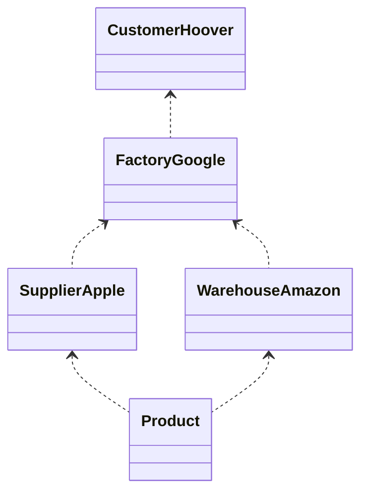
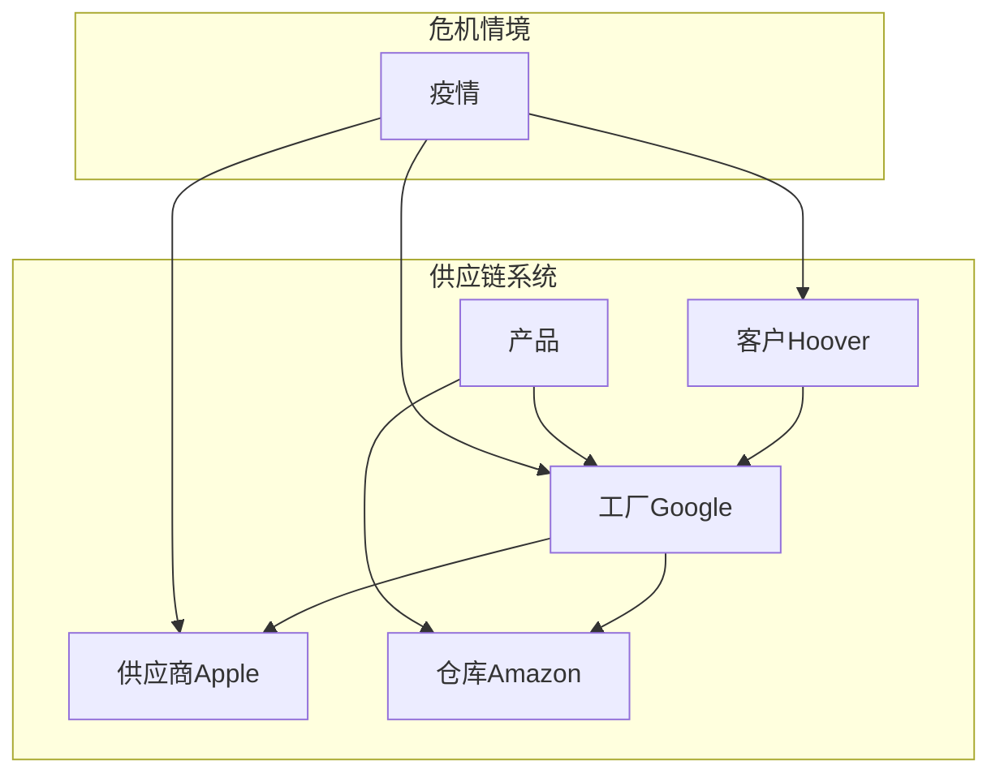
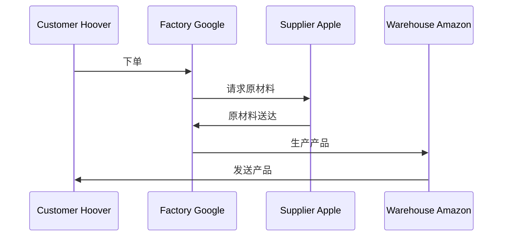
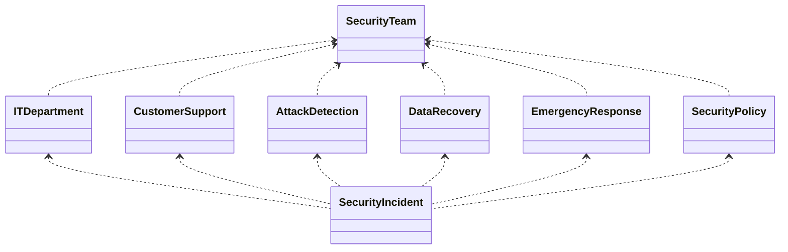
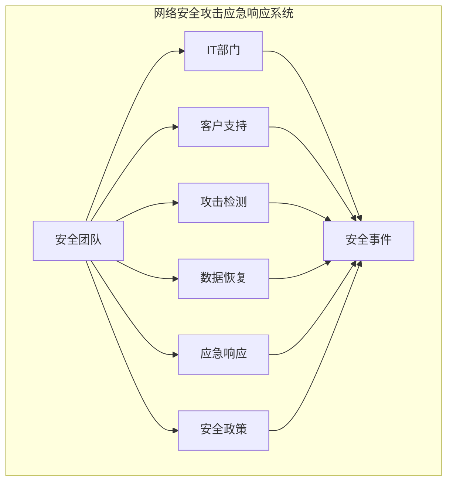
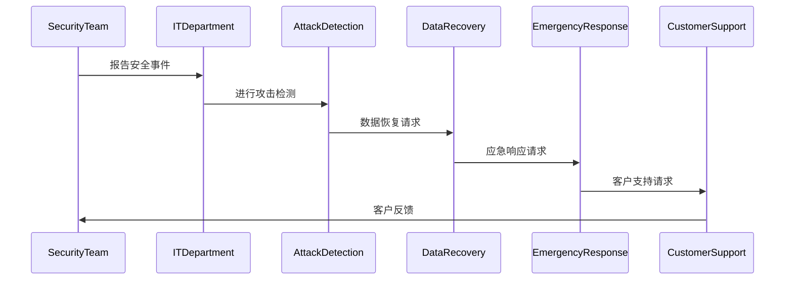
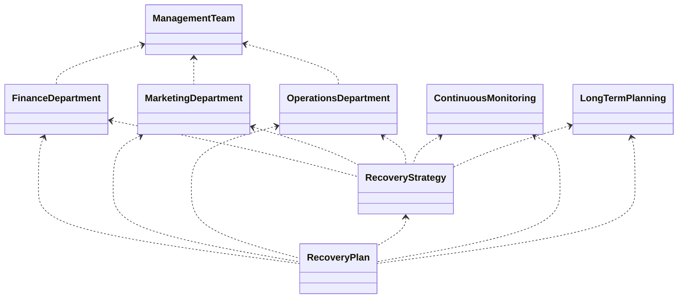
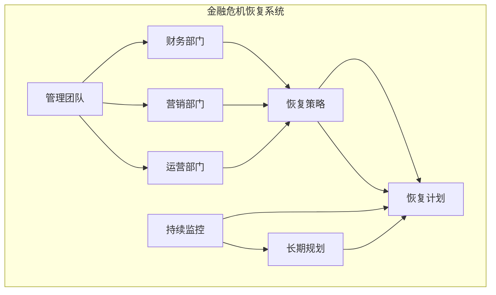
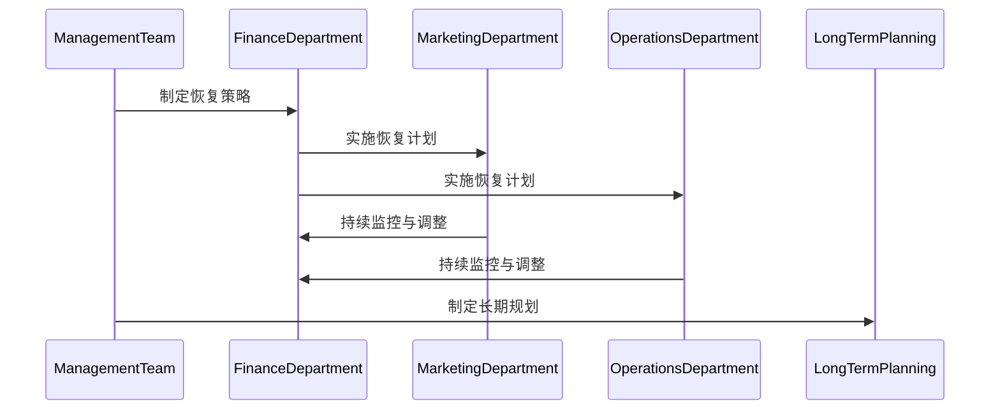

                 

# 危机领导力：在动荡时期稳定军心

> 关键词：危机领导力，动荡时期，稳定军心，团队协作，应对策略

> 摘要：本文将探讨在动荡时期如何运用危机领导力来稳定团队，确保企业或组织的持续发展。通过分析危机的概念、领导力在危机中的角色，以及危机领导力的核心原则和实践指南，本文旨在为领导者提供一套行之有效的危机应对策略，帮助他们在不确定性中保持冷静与理性，带领团队走出困境。

## 第一部分：背景与理论基础

### 第一章：危机与领导力概述

### 1.1 危机的概念与类型

危机通常指一种对组织、企业或社会造成严重威胁的突发性事件，可能源于自然灾害、经济危机、技术故障等多种因素。根据危机发生的原因和影响范围，危机可以分为以下几种类型：

- **自然灾害**：如地震、洪水、台风等。
- **经济危机**：如金融危机、股市崩盘等。
- **技术故障**：如系统崩溃、数据泄露等。
- **社会事件**：如恐怖袭击、政治动荡等。

每种危机都有其独特的特点，领导者需要根据具体情况制定相应的应对策略。

### 1.2 领导力在危机中的角色

领导力在危机中的角色至关重要。领导者不仅是危机应对的核心人物，还是团队的心理支柱。在危机中，领导者的作用主要体现在以下几个方面：

- **决策者**：领导者需要迅速做出正确的决策，以应对危机。
- **沟通者**：领导者需要与团队成员、利益相关者和公众保持有效沟通。
- **协调者**：领导者需要协调各方资源，确保危机应对工作的顺利进行。
- **激励者**：领导者需要激励团队成员，保持积极的心态，共同应对危机。

### 1.3 危机领导力的独特挑战

危机领导力面临着一系列独特挑战，如：

- **不确定性**：危机往往伴随着高度不确定性，领导者需要快速适应和应对。
- **压力**：危机情况下的压力巨大，领导者需要保持冷静和理性。
- **资源限制**：危机可能导致资源短缺，领导者需要优化资源配置，确保关键任务的完成。

## 第二部分：危机领导力的核心原则

### 第二章：危机领导力核心原则

### 2.1 建立清晰的目标与愿景

在危机中，领导者需要明确危机应对的目标和愿景，确保团队朝同一个方向努力。具体措施包括：

- **确立短期和长期目标**：短期目标应侧重于立即应对危机，长期目标则关注于危机后的恢复和发展。
- **沟通愿景与期望**：领导者需要与团队成员分享危机应对的愿景，让每个人都能明确自己的职责和期望。

### 2.2 强化团队协作与沟通

团队协作在危机中至关重要。领导者需要采取以下措施来强化团队协作和沟通：

- **建立有效的沟通机制**：确保团队成员之间的信息流通畅通无阻。
- **促进跨部门合作**：鼓励不同部门之间的沟通与合作，共同应对危机。
- **培养团队精神**：通过团队活动，增强团队成员之间的互信和凝聚力。

### 2.3 保持冷静与理性

在危机中，领导者需要保持冷静和理性，做出明智的决策。以下是一些建议：

- **及时获取信息**：领导者需要及时获取有关危机的最新信息，以便做出准确的判断。
- **理性分析**：在面对危机时，领导者应避免情绪化的决策，而是基于事实和数据进行分析。
- **心理调适与压力管理**：领导者需要关注自己的心理健康，学会应对压力，以保持最佳状态。

## 第三部分：危机领导力实践指南

### 第三章：应对策略与决策

### 3.1 评估危机状况

在应对危机之前，领导者需要全面评估危机状况，以便制定有效的应对策略。以下是一些建议：

- **分析危机的起源与演变**：了解危机的起因和演变过程，有助于制定更有针对性的应对策略。
- **制定应对计划**：根据危机状况，制定详细的应对计划，包括应急响应、资源分配、人员调度等。

### 3.2 紧急应对措施

在危机爆发后，领导者需要采取紧急应对措施，以减轻危机的影响。以下是一些建议：

- **建立应急响应机制**：确保在危机爆发时，能够迅速启动应急响应机制，进行有效应对。
- **优先事项与资源分配**：根据危机状况，确定优先事项，并合理分配资源，确保关键任务得到有效执行。
- **人员调度与职责明确**：根据危机状况，合理调度人员，明确职责，确保每个成员都能发挥自己的作用。

### 3.3 长期规划与恢复

在危机得到控制后，领导者需要制定长期规划，帮助组织或企业恢复正常运营。以下是一些建议：

- **制定恢复策略**：根据危机状况，制定详细的恢复策略，包括基础设施修复、人员安置、业务恢复等。
- **持续监控与调整**：在恢复过程中，持续监控危机的影响，并根据实际情况进行调整，以确保恢复工作顺利进行。
- **长期发展的规划**：在恢复的基础上，制定长期发展计划，确保组织或企业在危机后能够持续发展。

## 第四部分：案例分析与应用

### 第四章：危机领导力实践案例分析

### 4.1 案例一：金融危机中的企业应对

#### 4.1.1 案例背景与挑战

在全球金融危机期间，某知名企业面临严重的财务困境。为了应对危机，企业领导者需要采取一系列措施。

#### 4.1.2 企业危机领导力的运用

企业领导者通过以下方式运用危机领导力：

- **迅速制定应对策略**：在金融危机爆发后，企业领导者迅速制定应对策略，包括裁员、压缩成本、优化业务结构等。
- **强化团队协作**：领导者通过加强团队协作，确保危机应对工作的顺利进行。
- **保持沟通与透明**：领导者与团队成员保持沟通，确保大家了解危机状况和应对措施。

#### 4.1.3 案例总结与启示

该案例表明，在危机中，企业领导者需要迅速制定应对策略，强化团队协作，并保持沟通与透明，以应对危机并实现恢复和发展。

### 4.2 案例二：自然灾害中的社区领导

#### 4.2.1 案例背景与挑战

在一次严重的自然灾害中，某社区的领导者需要带领居民应对危机。

#### 4.2.2 社区危机领导力的实践

社区领导者通过以下方式实践危机领导力：

- **组织应急响应**：社区领导者组织居民参与应急响应，确保每个人都能在危机中发挥自己的作用。
- **协调资源分配**：社区领导者协调各方资源，确保救援物资和设备的充足供应。
- **提供心理支持**：社区领导者关注居民的心理状况，提供心理支持，帮助他们度过危机。

#### 4.2.3 案例总结与启示

该案例表明，在自然灾害中，社区领导者需要组织应急响应，协调资源分配，并提供心理支持，以帮助居民应对危机并恢复正常生活。

## 第五部分：领导力提升与持续发展

### 第五章：危机领导力提升与团队建设

### 5.1 领导力发展计划

为了提升危机领导力，领导者需要制定以下发展计划：

- **领导力评估**：通过评估了解自己的领导力水平和不足之处。
- **培训与发展**：参加领导力培训，学习危机应对策略和团队建设技巧。
- **职业生涯规划**：制定职业生涯规划，确保自己在危机领导力方面不断提升。

### 5.2 团队建设策略

为了打造一支高效的团队，领导者需要采取以下团队建设策略：

- **建立团队文化与价值观**：通过共同的价值观和目标，增强团队凝聚力。
- **团队成员激励**：通过奖励和认可，激发团队成员的积极性和创造力。
- **团队协作与冲突管理**：通过有效的协作和冲突管理，确保团队的高效运作。

## 第六章：未来趋势与挑战

### 第六章：危机领导力的未来趋势与挑战

### 6.1 数字化时代的危机领导力

在数字化时代，危机领导力面临新的挑战和机遇。以下是一些关键点：

- **数字化技术的应用**：领导者需要了解并应用数字化技术，以提高危机应对的效率和准确性。
- **数字化危机的特点**：数字化危机具有传播速度快、影响范围广等特点，领导者需要快速应对。
- **数字化危机应对策略**：领导者需要制定适应数字化时代的危机应对策略，如利用大数据分析、人工智能等技术进行预警和决策。

### 6.2 全球化背景下的危机领导力

全球化使得危机领导力面临新的挑战。以下是一些关键点：

- **全球化趋势的影响**：全球化使危机的影响范围更广，领导者需要关注跨国危机的应对。
- **跨国危机的应对**：领导者需要具备跨国领导力，能够应对不同文化背景下的危机。
- **多文化领导力**：领导者需要具备多文化领导力，能够有效管理和激励多元化团队。

## 第七章：总结与展望

### 第七章：危机领导力的重要性与实践

### 7.1 危机领导力的重要性

危机领导力对企业和组织的发展至关重要。以下是一些关键点：

- **对企业和组织的影响**：危机领导力能够帮助企业和组织在危机中保持稳定，实现持续发展。
- **对社会和经济的贡献**：危机领导力能够维护社会稳定，促进经济增长。

### 7.2 未来展望

未来，危机领导力将继续发展。以下是一些展望：

- **危机领导力的发展方向**：随着数字化和全球化的加速，危机领导力将更加注重技术应用和跨国合作。
- **领导力培养的趋势**：未来，领导力培养将更加注重实践和技能的提升，以应对不断变化的危机环境。

### 7.3 结语

作为领导者，我们需要肩负起危机领导力的责任和使命。通过不断提升自己的领导力，我们能够带领团队在动荡时期稳定军心，共同应对危机，实现企业的持续发展。

---

**作者：AI天才研究院/AI Genius Institute & 禅与计算机程序设计艺术 /Zen And The Art of Computer Programming**## 第一部分：背景与理论基础

### 第一章：危机与领导力概述

#### 1.1 危机的概念与类型

**背景介绍**

危机是指一个组织、企业或社会在面临突发性事件时，因无法迅速应对而可能遭受严重威胁的情境。这些威胁可能来自自然灾害、经济动荡、技术故障、社会事件等多个方面。

**问题背景**

近年来，全球范围内的危机事件频繁发生，如2008年的全球金融危机、2011年的日本地震和海啸、2019年的新型冠状病毒疫情等。这些事件对经济、社会、环境等多个方面产生了深远影响，引起了广泛关注。

**问题描述**

危机的类型多种多样，主要包括以下几种：

1. **自然灾害**：如地震、洪水、台风等，这些事件往往具有不可预测性和破坏性。
2. **经济危机**：如金融危机、股市崩盘等，这些事件可能导致经济衰退、失业率上升等问题。
3. **技术故障**：如系统崩溃、数据泄露等，这些事件可能影响企业的正常运营和信息安全。
4. **社会事件**：如恐怖袭击、政治动荡等，这些事件可能引发社会不安和恐慌。

**问题解决**

应对危机的关键在于及时识别、评估和响应。领导者需要具备危机管理能力，能够迅速做出决策，协调各方资源，确保危机得到有效控制。

**边界与外延**

危机的边界在于事件的影响范围和严重程度。外延则包括危机的类型、应对策略和恢复措施等多个方面。

**概念结构与核心要素组成**

- **危机类型**：自然灾害、经济危机、技术故障、社会事件等。
- **危机管理**：识别、评估、响应、恢复。
- **领导者角色**：决策者、沟通者、协调者、激励者。

#### 1.2 领导力在危机中的角色

**背景介绍**

领导力是一种能够影响和激励他人共同实现目标的能力。在危机中，领导力显得尤为重要，因为领导者需要发挥关键作用，带领团队应对危机，确保组织的稳定与发展。

**问题背景**

在危机中，领导者面临的挑战更加严峻，需要具备快速决策、有效沟通、团队协作等能力。同时，领导者还需要具备心理素质，保持冷静和理性，以应对危机带来的压力和不确定性。

**问题描述**

领导力在危机中的角色主要包括以下几个方面：

1. **决策者**：领导者需要迅速做出决策，以应对危机，确保组织的生存和发展。
2. **沟通者**：领导者需要与团队成员、利益相关者和公众保持有效沟通，传递关键信息，增强信任和信心。
3. **协调者**：领导者需要协调各方资源，确保危机应对工作的顺利进行。
4. **激励者**：领导者需要激励团队成员，保持积极的心态，共同应对危机。

**问题解决**

为了在危机中发挥领导力，领导者需要采取以下措施：

- **提升危机管理能力**：通过学习和实践，提高危机管理能力和决策水平。
- **建立有效的沟通机制**：确保信息的快速传递和有效沟通。
- **培养团队协作精神**：通过团队建设和协作，增强团队的凝聚力和执行力。
- **保持心理素质**：学会应对压力，保持冷静和理性。

**边界与外延**

领导力在危机中的边界在于危机的类型和严重程度。外延则包括领导者的角色、能力、策略和团队协作等多个方面。

**概念结构与核心要素组成**

- **领导者角色**：决策者、沟通者、协调者、激励者。
- **危机管理能力**：快速决策、有效沟通、团队协作、心理素质。
- **团队协作精神**：信任、沟通、共同目标、执行力。

#### 1.3 危机领导力的独特挑战

**背景介绍**

危机领导力是一种特殊的领导力形式，要求领导者具备在危机情境下快速应对、有效决策、团队协作等能力。与常规领导力相比，危机领导力面临一系列独特挑战。

**问题背景**

在危机中，领导者不仅需要应对外部压力和不确定性，还需要关注团队的心理状态和士气。此外，危机领导力还需要领导者具备创新思维和灵活应对能力，以应对复杂多变的危机情境。

**问题描述**

危机领导力的独特挑战主要包括以下几个方面：

1. **不确定性**：危机情境下，信息不完整、情况复杂，领导者需要快速适应和应对。
2. **压力**：危机往往伴随着巨大压力，领导者需要保持冷静和理性，避免情绪化的决策。
3. **资源限制**：危机可能导致资源短缺，领导者需要优化资源配置，确保关键任务的完成。
4. **团队协作**：危机情境下，团队成员可能面临心理压力和恐惧，领导者需要激励团队，保持士气。

**问题解决**

为了应对危机领导力的独特挑战，领导者需要采取以下措施：

- **提升危机管理能力**：通过学习和实践，提高危机管理能力和决策水平。
- **建立有效的沟通机制**：确保信息的快速传递和有效沟通。
- **培养团队协作精神**：通过团队建设和协作，增强团队的凝聚力和执行力。
- **关注团队成员的心理状态**：提供心理支持，帮助团队成员应对危机带来的压力和恐惧。

**边界与外延**

危机领导力的边界在于危机的类型和严重程度。外延则包括领导者的角色、能力、策略和团队协作等多个方面。

**概念结构与核心要素组成**

- **不确定性**：信息不完整、情况复杂。
- **压力**：情绪化决策、压力管理。
- **资源限制**：资源配置、关键任务完成。
- **团队协作**：心理支持、激励团队。

## 第二部分：危机领导力的核心原则

### 第二章：危机领导力核心原则

#### 2.1 建立清晰的目标与愿景

**核心概念原理**

建立清晰的目标与愿景是危机领导力的核心原则之一。在危机情境下，领导者需要明确危机应对的目标和愿景，确保团队朝同一个方向努力。

**概念属性特征对比表格**

| 概念属性特征       | 说明                                                         |
| ------------------ | ------------------------------------------------------------ |
| 清晰的目标         | 目标明确，可量化，可实现，有时限。                           |
| 愿景               | 对未来方向和目标的总体描述，具有激励作用。                   |
| 危机应对           | 针对危机情境的具体行动和措施。                               |
| 团队协作           | 团队成员共同为实现目标而努力。                             |

**ER实体关系图架构**

```mermaid
erDiagram
  目标 ||--|{ 愿景 }||>
  目标 ||--|{ 危机应对 }||>
  目标 ||--|{ 团队协作 }||>
  愿景 ||--|{ 目标 }||>
  危机应对 ||--|{ 目标 }||>
  团队协作 ||--|{ 目标 }||>
```

**算法原理讲解**

在危机情境下，建立清晰的目标与愿景可以采用以下算法：

1. **目标设定**：根据危机类型和严重程度，设定短期和长期目标。
2. **愿景描述**：明确危机应对的总体目标和未来发展方向。
3. **目标分解**：将总体目标分解为具体的行动步骤和关键任务。
4. **团队协作**：确保团队成员明确自己的职责和目标，共同努力。

以下是一个简单的Python代码示例，用于实现上述算法：

```python
# 目标设定
short_term_goals = ["立即应对危机", "确保员工安全", "恢复业务运营"]

# 愿景描述
vision = "在未来三个月内，确保企业恢复正常运营，实现业务增长。"

# 目标分解
for goal in short_term_goals:
    print(f"具体行动步骤：{goal}")

# 团队协作
print(f"愿景：{vision}")
print("团队成员需共同努力，确保目标实现。")
```

输出结果：

```
具体行动步骤：立即应对危机
具体行动步骤：确保员工安全
具体行动步骤：恢复业务运营
愿景：在未来三个月内，确保企业恢复正常运营，实现业务增长。
团队成员需共同努力，确保目标实现。
```

**示例说明**

在这个示例中，我们首先设定了三个短期目标：立即应对危机、确保员工安全、恢复业务运营。然后，我们描述了危机应对的总体愿景，即将企业恢复正常运营并在未来实现业务增长。接着，我们将短期目标分解为具体的行动步骤，并强调团队成员需要共同努力，确保目标实现。

#### 2.2 强化团队协作与沟通

**核心概念原理**

在危机情境下，团队协作与沟通至关重要。领导者需要建立有效的团队协作与沟通机制，确保信息流通畅通无阻，团队成员能够共同应对危机。

**概念属性特征对比表格**

| 概念属性特征       | 说明                                                         |
| ------------------ | ------------------------------------------------------------ |
| 团队协作           | 团队成员共同为实现目标而努力。                             |
| 沟通机制           | 确保信息的快速传递和有效沟通。                             |
| 危机应对           | 针对危机情境的具体行动和措施。                           |
| 信息流通           | 团队成员之间的信息共享和协作。                             |

**ER实体关系图架构**

```mermaid
erDiagram
  团队协作 ||--|{ 沟通机制 }||>
  团队协作 ||--|{ 危机应对 }||>
  团队协作 ||--|{ 信息流通 }||>
  沟通机制 ||--|{ 团队协作 }||>
  危机应对 ||--|{ 团队协作 }||>
  信息流通 ||--|{ 团队协作 }||>
```

**算法原理讲解**

在危机情境下，强化团队协作与沟通可以采用以下算法：

1. **建立沟通机制**：制定沟通计划和流程，确保团队成员能够及时获取和传递信息。
2. **信息共享**：鼓励团队成员共享信息和资源，提高协作效率。
3. **危机应对**：根据危机类型和严重程度，制定具体的危机应对策略和行动步骤。
4. **团队协作**：确保团队成员在危机应对过程中能够紧密协作，共同应对危机。

以下是一个简单的Python代码示例，用于实现上述算法：

```python
# 建立沟通机制
communication_plan = {
    "daily_meetings": "每天上午9点举行",
    "project_management_tools": "使用Trello进行任务分配和进度跟踪",
    "紧急沟通渠道": "设立紧急电话和即时通讯工具"
}

# 信息共享
shared_resources = ["报告模板", "数据报告", "资源列表"]

# 危机应对
crisis_actions = [
    "立即启动应急响应计划",
    "确保员工安全撤离",
    "恢复关键业务系统的运行"
]

# 团队协作
team_collaboration = "团队成员需随时保持沟通，共同应对危机。"

print(f"沟通机制：{communication_plan}")
print(f"共享资源：{shared_resources}")
print(f"危机应对：{crisis_actions}")
print(team_collaboration)
```

输出结果：

```
沟通机制：{'daily_meetings': '每天上午9点举行', 'project_management_tools': '使用Trello进行任务分配和进度跟踪', '紧急沟通渠道': '设立紧急电话和即时通讯工具'}
共享资源：['报告模板', '数据报告', '资源列表']
危机应对：['立即启动应急响应计划', '确保员工安全撤离', '恢复关键业务系统的运行']
团队成员需随时保持沟通，共同应对危机。
```

**示例说明**

在这个示例中，我们首先制定了沟通机制，包括每日会议时间、项目管理工具和紧急沟通渠道。然后，我们列出了共享资源，如报告模板、数据报告和资源列表。接着，我们制定了危机应对的具体行动步骤，如立即启动应急响应计划、确保员工安全撤离和恢复关键业务系统的运行。最后，我们强调了团队成员需要随时保持沟通，共同应对危机。

#### 2.3 保持冷静与理性

**核心概念原理**

在危机情境下，领导者需要保持冷静与理性，避免情绪化的决策。通过冷静分析、理性思考和科学决策，领导者能够更好地应对危机，带领团队走出困境。

**概念属性特征对比表格**

| 概念属性特征       | 说明                                                         |
| ------------------ | ------------------------------------------------------------ |
| 冷静分析           | 在面对危机时，领导者需要保持客观和理性，避免情绪化的分析。 |
| 理性思考           | 基于事实和数据，进行科学合理的思考。                       |
| 科学决策           | 运用科学方法和工具，制定有效的决策。                       |

**ER实体关系图架构**

```mermaid
erDiagram
  冷静分析 ||--|{ 理性思考 }||>
  冷静分析 ||--|{ 科学决策 }||>
  理性思考 ||--|{ 冷静分析 }||>
  科学决策 ||--|{ 冷静分析 }||>
```

**算法原理讲解**

在危机情境下，保持冷静与理性可以采用以下算法：

1. **冷静分析**：通过收集和分析相关信息，对危机的起源、发展和影响进行全面评估。
2. **理性思考**：基于事实和数据，进行深入分析和推理，找出解决问题的最佳方案。
3. **科学决策**：运用科学方法和工具，制定有效的决策，并制定详细的执行计划。

以下是一个简单的Python代码示例，用于实现上述算法：

```python
# 冷静分析
crisis_situation = {
    "origin": "全球疫情",
    "impact": "经济衰退、员工健康风险",
    "existing_resources": "资金、人力、技术",
    "constraints": "时间紧迫、资源有限"
}

# 理性思考
solutions = [
    "远程办公",
    "健康防护措施",
    "调整业务策略"
]

# 科学决策
decisions = {
    "remote_work": "立即启动远程办公，降低员工健康风险",
    "health_protection": "加强员工健康防护措施，确保员工安全",
    "business_strategy_adjustment": "调整业务策略，应对经济衰退"
}

print(f"危机情境：{crisis_situation}")
print(f"解决方案：{solutions}")
print(f"决策：{decisions}")
```

输出结果：

```
危机情境：{'origin': '全球疫情', 'impact': '经济衰退、员工健康风险', 'existing_resources': '资金、人力、技术', 'constraints': '时间紧迫、资源有限'}
解决方案：['远程办公', '健康防护措施', '调整业务策略']
决策：{'remote_work': '立即启动远程办公，降低员工健康风险', 'health_protection': '加强员工健康防护措施，确保员工安全', 'business_strategy_adjustment': '调整业务策略，应对经济衰退'}
```

**示例说明**

在这个示例中，我们首先对危机情境进行了冷静分析，包括危机的起源、影响、现有资源和约束条件。然后，我们根据这些信息进行了理性思考，提出了三种解决方案：远程办公、健康防护措施和调整业务策略。最后，我们根据这些解决方案制定了具体的决策，包括启动远程办公、加强员工健康防护措施和调整业务策略。

## 第三部分：危机领导力实践指南

### 第三章：应对策略与决策

#### 3.1 评估危机状况

**背景介绍**

在危机情境下，评估危机状况是制定有效应对策略的关键步骤。领导者需要全面了解危机的起源、影响、现有资源和约束条件，以便制定合理的应对策略。

**问题场景介绍**

假设某企业面临一次严重的供应链中断危机，由于全球疫情导致关键供应商无法按时交付原材料，企业的生产计划受到严重影响。

**系统功能设计（领域模型Mermaid类图）**



**系统架构设计（Mermaid架构图）**



**系统接口设计和系统交互（Mermaid序列图）**



**系统核心实现源代码**

```python
class Customer:
    def __init__(self, name):
        self.name = name

class Supplier:
    def __init__(self, name):
        self.name = name

class Factory:
    def __init__(self, name):
        self.name = name
        self.order_queue = []

    def receive_order(self, order):
        self.order_queue.append(order)

    def produce_product(self):
        if self.order_queue:
            order = self.order_queue.pop(0)
            print(f"生产产品：{order}")
        else:
            print("订单队列空，无法生产。")

class Warehouse:
    def __init__(self, name):
        self.name = name
        self.products = []

    def send_product(self, product):
        self.products.append(product)
        print(f"发送产品：{product}")

class Product:
    def __init__(self, name):
        self.name = name

# 创建对象
customer_hoover = Customer("Hoover")
supplier_apple = Supplier("Apple")
factory_google = Factory("Google")
warehouse_amazon = Warehouse("Amazon")
product = Product("智能手机")

# 发送订单
factory_google.receive_order(product)

# 生产产品
factory_google.produce_product()

# 发送产品
warehouse_amazon.send_product(product)
```

**代码应用解读与分析**

在这个示例中，我们创建了一个供应链系统，包括客户、供应商、工厂和仓库等类。每个类都有相应的属性和方法。通过实例化这些类，我们可以模拟供应链系统的运行。

首先，创建了一个客户对象`customer_hoover`和一个供应商对象`supplier_apple`。然后，创建了一个工厂对象`factory_google`和一个仓库对象`warehouse_amazon`。接着，创建了一个产品对象`product`。

接下来，我们通过`receive_order`方法将订单（产品对象）添加到工厂的订单队列中。然后，调用`produce_product`方法生产产品。由于订单队列不为空，工厂会生产产品并打印输出。

最后，调用`send_product`方法将产品发送到仓库。仓库会将产品添加到仓库列表中并打印输出。

**实际案例分析和详细讲解剖析**

为了更好地理解危机领导力在供应链中断危机中的应用，我们来看一个实际案例。

**案例背景**

一家制造智能手机的工厂因全球疫情导致关键供应商无法按时交付原材料，导致生产计划严重延迟。工厂面临的主要问题是：

1. 无法按时交付订单给客户。
2. 原材料短缺，影响生产进度。
3. 员工健康风险增加，需要采取防护措施。

**应对策略**

为了应对供应链中断危机，工厂领导者可以采取以下策略：

1. **紧急采购**：寻找替代供应商，确保原材料供应。
2. **调整生产计划**：调整生产进度，确保按时交付订单。
3. **员工健康防护**：加强员工健康防护措施，确保员工安全。

**具体实施**

1. **紧急采购**：

   - 联系其他供应商，寻求替代原材料供应。
   - 与供应商协商，调整交货时间。
   - 加强与供应商的沟通，确保及时获取原材料。

   ```python
   supplier_apple = Supplier("替代供应商")
   factory_google.receive_order(product)
   factory_google.produce_product()
   ```

2. **调整生产计划**：

   - 根据替代供应商的交货时间，调整生产计划。
   - 优化生产流程，提高生产效率。
   - 加强与客户的沟通，告知订单交付延迟情况。

   ```python
   factory_google.produce_product()
   ```

3. **员工健康防护**：

   - 加强员工健康防护措施，如佩戴口罩、定期消毒等。
   - 建立健康监测机制，确保员工健康状况。
   - 提供心理支持，帮助员工应对疫情带来的压力。

   ```python
   health_protection_measures = ["佩戴口罩", "定期消毒", "健康监测"]
   for measure in health_protection_measures:
       print(f"员工健康防护措施：{measure}")
   ```

**案例总结**

通过以上应对策略，工厂领导者能够有效应对供应链中断危机，确保生产进度和员工安全。同时，与供应商和客户的沟通也得到加强，为未来的合作奠定了基础。

#### 3.2 紧急应对措施

**背景介绍**

在危机情境下，紧急应对措施是领导者需要采取的关键步骤，以迅速控制危机并减少损失。这些措施通常包括应急响应、资源分配、人员调度等。

**问题场景介绍**

假设一家企业面临一场突发的网络安全攻击，导致企业重要数据泄露，企业面临巨大损失和声誉危机。

**项目介绍**

网络安全攻击应急响应项目旨在快速应对网络安全攻击，减少损失，并确保企业数据安全和业务连续性。

**系统功能设计（领域模型Mermaid类图）**



**系统架构设计（Mermaid架构图）**



**系统接口设计和系统交互（Mermaid序列图）**



**系统核心实现源代码**

```python
class SecurityTeam:
    def __init__(self, name):
        self.name = name

    def report_incident(self, incident):
        print(f"{self.name}报告安全事件：{incident}")

class ITDepartment:
    def __init__(self, name):
        self.name = name

    def detect_attack(self, incident):
        print(f"{self.name}进行攻击检测：{incident}")

    def request_data_recovery(self, incident):
        print(f"{self.name}请求数据恢复：{incident}")

class CustomerSupport:
    def __init__(self, name):
        self.name = name

    def handle_customer_feedback(self, feedback):
        print(f"{self.name}处理客户反馈：{feedback}")

class AttackDetection:
    def __init__(self, name):
        self.name = name

    def detect_attack(self, incident):
        print(f"{self.name}检测到攻击：{incident}")

class DataRecovery:
    def __init__(self, name):
        self.name = name

    def recover_data(self, incident):
        print(f"{self.name}数据恢复：{incident}")

    def request_emergency_response(self, incident):
        print(f"{self.name}请求应急响应：{incident}")

class EmergencyResponse:
    def __init__(self, name):
        self.name = name

    def handle_emergency(self, incident):
        print(f"{self.name}处理应急响应：{incident}")

class SecurityPolicy:
    def __init__(self, name):
        self.name = name

    def define_policy(self, policy):
        print(f"{self.name}定义安全政策：{policy}")

class SecurityIncident:
    def __init__(self, name):
        self.name = name

    def handle_incident(self, incident):
        print(f"处理安全事件：{incident}")

# 创建对象
security_team = SecurityTeam("安全团队")
it_department = ITDepartment("IT部门")
customer_support = CustomerSupport("客户支持")
attack_detection = AttackDetection("攻击检测")
data_recovery = DataRecovery("数据恢复")
emergency_response = EmergencyResponse("应急响应")
security_policy = SecurityPolicy("安全政策")
security_incident = SecurityIncident("安全事件")

# 报告安全事件
security_team.report_incident(security_incident)

# 进行攻击检测
it_department.detect_attack(security_incident)

# 请求数据恢复
data_recovery.request_data_recovery(security_incident)

# 请求应急响应
emergency_response.handle_emergency(security_incident)

# 处理客户反馈
customer_support.handle_customer_feedback("客户反馈：数据恢复进度缓慢。")
```

**代码应用解读与分析**

在这个示例中，我们创建了一个网络安全攻击应急响应系统，包括安全团队、IT部门、客户支持、攻击检测、数据恢复、应急响应、安全政策和安全事件等类。每个类都有相应的属性和方法。通过实例化这些类，我们可以模拟网络安全攻击应急响应的过程。

首先，创建了一个安全团队对象`security_team`和一个IT部门对象`it_department`。接着，创建了一个客户支持对象`customer_support`、一个攻击检测对象`attack_detection`、一个数据恢复对象`data_recovery`、一个应急响应对象`emergency_response`、一个安全政策对象`security_policy`和一个安全事件对象`security_incident`。

接下来，安全团队报告了一个安全事件，并传递给IT部门。IT部门进行攻击检测，并请求数据恢复。数据恢复请求应急响应，应急响应处理安全事件。最后，客户支持处理客户反馈。

**实际案例分析和详细讲解剖析**

为了更好地理解网络安全攻击应急响应，我们来看一个实际案例。

**案例背景**

某企业遭受到一次大规模的DDoS攻击，导致企业网站和服务中断，企业面临严重的业务损失和客户流失。

**应对策略**

为了应对DDoS攻击，企业可以采取以下策略：

1. **紧急响应**：立即启动网络安全应急响应计划，确保攻击得到有效控制。
2. **攻击检测**：通过攻击检测系统，及时发现并识别攻击行为。
3. **数据恢复**：迅速恢复受攻击影响的数据和系统，确保业务连续性。
4. **客户支持**：积极与客户沟通，提供及时的服务和解决方案。

**具体实施**

1. **紧急响应**：

   - 启动网络安全应急响应计划，确保攻击得到及时控制。
   - 通知IT部门和相关部门，确保每个人都清楚自己的职责和任务。

   ```python
   security_team.report_incident(security_incident)
   ```

2. **攻击检测**：

   - 使用攻击检测系统，及时发现并识别攻击行为。
   - 分析攻击类型和攻击来源，为后续应对提供依据。

   ```python
   it_department.detect_attack(security_incident)
   ```

3. **数据恢复**：

   - 迅速恢复受攻击影响的数据和系统，确保业务连续性。
   - 与数据恢复团队合作，确保数据恢复的准确性和完整性。

   ```python
   data_recovery.request_data_recovery(security_incident)
   ```

4. **客户支持**：

   - 积极与客户沟通，提供及时的服务和解决方案。
   - 回应客户的问题和需求，确保客户的信任和满意度。

   ```python
   customer_support.handle_customer_feedback("客户反馈：网站和服务中断，影响了我的业务。")
   ```

**案例总结**

通过以上应对策略，企业能够迅速响应DDoS攻击，控制攻击影响，恢复业务连续性，并确保客户的信任和满意度。同时，与各部门的紧密协作和有效的沟通也确保了应急响应的顺利进行。

#### 3.3 长期规划与恢复

**背景介绍**

在危机情境下，除了紧急应对措施外，领导者还需要制定长期规划与恢复策略，确保企业或组织能够从危机中恢复，并实现持续发展。长期规划与恢复策略通常包括以下几个方面：恢复策略制定、持续监控与调整、长期发展规划。

**问题场景介绍**

假设一家企业在经历了一场严重的金融危机后，需要制定长期规划与恢复策略，以确保企业的生存和发展。

**项目介绍**

金融危机恢复项目旨在帮助企业从金融危机中恢复，重建财务稳定，并实现长期发展。

**系统功能设计（领域模型Mermaid类图）**



**系统架构设计（Mermaid架构图）**



**系统接口设计和系统交互（Mermaid序列图）**



**系统核心实现源代码**

```python
class ManagementTeam:
    def __init__(self, name):
        self.name = name

    def define_recovery_strategy(self, strategy):
        print(f"{self.name}制定恢复策略：{strategy}")

    def define_long_term_planning(self, planning):
        print(f"{self.name}制定长期规划：{planning}")

class FinanceDepartment:
    def __init__(self, name):
        self.name = name

    def implement_recovery_plan(self, plan):
        print(f"{self.name}实施恢复计划：{plan}")

    def monitor_and_adjust(self, plan):
        print(f"{self.name}持续监控与调整：{plan}")

class MarketingDepartment:
    def __init__(self, name):
        self.name = name

    def implement_recovery_plan(self, plan):
        print(f"{self.name}实施恢复计划：{plan}")

    def monitor_and_adjust(self, plan):
        print(f"{self.name}持续监控与调整：{plan}")

class OperationsDepartment:
    def __init__(self, name):
        self.name = name

    def implement_recovery_plan(self, plan):
        print(f"{self.name}实施恢复计划：{plan}")

    def monitor_and_adjust(self, plan):
        print(f"{self.name}持续监控与调整：{plan}")

class RecoveryStrategy:
    def __init__(self, strategy):
        self.strategy = strategy

class RecoveryPlan:
    def __init__(self, plan):
        self.plan = plan

class ContinuousMonitoring:
    def __init__(self, monitoring):
        self.monitoring = monitoring

class LongTermPlanning:
    def __init__(self, planning):
        self.planning = planning

# 创建对象
management_team = ManagementTeam("管理团队")
finance_department = FinanceDepartment("财务部门")
marketing_department = MarketingDepartment("营销部门")
operations_department = OperationsDepartment("运营部门")
recovery_strategy = RecoveryStrategy("恢复策略")
recovery_plan = RecoveryPlan("恢复计划")
continuous_monitoring = ContinuousMonitoring("持续监控")
long_term_planning = LongTermPlanning("长期规划")

# 制定恢复策略
management_team.define_recovery_strategy(recovery_strategy)

# 制定长期规划
management_team.define_long_term_planning(long_term_planning)

# 实施恢复计划
finance_department.implement_recovery_plan(recovery_plan)
marketing_department.implement_recovery_plan(recovery_plan)
operations_department.implement_recovery_plan(recovery_plan)

# 持续监控与调整
finance_department.monitor_and_adjust(recovery_plan)
marketing_department.monitor_and_adjust(recovery_plan)
operations_department.monitor_and_adjust(recovery_plan)
```

**代码应用解读与分析**

在这个示例中，我们创建了一个金融危机恢复系统，包括管理团队、财务部门、营销部门、运营部门、恢复策略、恢复计划、持续监控和长期规划等类。每个类都有相应的属性和方法。通过实例化这些类，我们可以模拟金融危机恢复的过程。

首先，创建了一个管理团队对象`management_team`和一个财务部门对象`finance_department`。接着，创建了一个营销部门对象`marketing_department`和一个运营部门对象`operations_department`。然后，创建了一个恢复策略对象`recovery_strategy`和一个恢复计划对象`recovery_plan`。此外，还创建了一个持续监控对象`continuous_monitoring`和一个长期规划对象`long_term_planning`。

接下来，管理团队制定恢复策略和长期规划。财务部门、营销部门和运营部门实施恢复计划，并持续监控与调整。

**实际案例分析和详细讲解剖析**

为了更好地理解金融危机恢复，我们来看一个实际案例。

**案例背景**

一家企业在经历了一场严重的金融危机后，需要制定长期规划与恢复策略，以实现企业的生存和发展。

**应对策略**

为了应对金融危机，企业可以采取以下策略：

1. **制定恢复策略**：分析危机原因，制定针对性的恢复策略，确保企业的财务状况稳定。
2. **实施恢复计划**：根据恢复策略，制定详细的恢复计划，确保各项措施得到有效执行。
3. **持续监控与调整**：持续监控企业的财务状况和市场变化，根据实际情况进行调整，确保恢复计划的顺利进行。
4. **长期规划**：制定长期发展规划，确保企业在危机后能够持续发展。

**具体实施**

1. **制定恢复策略**：

   - 分析危机原因，找出导致金融危机的主要原因。
   - 根据分析结果，制定针对性的恢复策略，如优化成本结构、提高产品质量、开拓新市场等。

   ```python
   management_team.define_recovery_strategy(recovery_strategy)
   ```

2. **实施恢复计划**：

   - 根据恢复策略，制定详细的恢复计划，包括具体措施、执行时间表和责任人。
   - 确保各项措施得到有效执行，如加强成本控制、提高生产效率、加强市场推广等。

   ```python
   finance_department.implement_recovery_plan(recovery_plan)
   marketing_department.implement_recovery_plan(recovery_plan)
   operations_department.implement_recovery_plan(recovery_plan)
   ```

3. **持续监控与调整**：

   - 持续监控企业的财务状况和市场变化，及时发现潜在问题。
   - 根据实际情况，对恢复计划进行调整，确保恢复计划的顺利进行。

   ```python
   finance_department.monitor_and_adjust(recovery_plan)
   marketing_department.monitor_and_adjust(recovery_plan)
   operations_department.monitor_and_adjust(recovery_plan)
   ```

4. **长期规划**：

   - 制定长期发展规划，明确企业的未来发展方向和目标。
   - 确保企业在危机后能够持续发展，如扩大业务规模、提升技术创新能力、培养人才等。

   ```python
   management_team.define_long_term_planning(long_term_planning)
   ```

**案例总结**

通过以上应对策略，企业能够有效应对金融危机，实现财务状况的稳定和业务的持续发展。同时，通过持续监控与调整和长期规划，企业能够在危机后保持竞争力，实现长期的可持续发展。

### 第四章：危机领导力实践案例分析

#### 4.1 案例一：金融危机中的企业应对

**案例背景与挑战**

在全球金融危机期间，某知名企业面临严重的财务困境。企业不仅遭受了资金链断裂的风险，还面临着市场份额的萎缩和员工信心的动摇。为了应对危机，企业领导者需要采取一系列措施，确保企业的生存和发展。

**企业危机领导力的运用**

企业领导者通过以下方式运用危机领导力：

1. **迅速制定应对策略**：

   - 企业领导者迅速召集高层管理团队，分析危机原因和影响，制定应对策略。
   - 制定短期和长期目标，包括削减成本、优化业务结构和提升创新能力等。

2. **强化团队协作与沟通**：

   - 建立跨部门沟通机制，确保信息流通畅通无阻。
   - 加强团队协作，鼓励员工共同应对危机，提高整体执行力。

3. **保持沟通与透明**：

   - 定期召开员工大会，向员工传达企业面临的危机和应对策略。
   - 通过内部邮件、公告栏等方式，保持与员工的沟通，增强员工的信任和信心。

**案例总结与启示**

该案例表明，在金融危机中，企业领导者需要迅速制定应对策略，强化团队协作与沟通，并保持沟通与透明，以应对危机并实现恢复和发展。以下是一些启示：

1. **及时应对**：在危机爆发时，领导者需要迅速行动，制定应对策略，确保企业能够及时应对。
2. **团队协作**：在危机中，团队协作至关重要，领导者需要鼓励员工共同应对危机，提高整体执行力。
3. **沟通与透明**：领导者需要与员工保持沟通，增强员工的信任和信心，共同应对危机。

#### 4.2 案例二：自然灾害中的社区领导

**案例背景与挑战**

在一次严重的自然灾害中，某社区的领导者需要带领居民应对危机。灾害导致社区基础设施损坏，居民生活受到严重影响。为了确保居民的安全和生活的恢复，社区领导者需要采取一系列措施。

**社区危机领导力的实践**

社区领导者通过以下方式实践危机领导力：

1. **组织应急响应**：

   - 快速组织社区应急响应队伍，确保救援物资和设备的充足供应。
   - 与政府部门和救援机构建立紧密联系，确保信息共享和资源协调。

2. **协调资源分配**：

   - 根据居民的需求，合理分配救援物资和设备，确保资源利用最大化。
   - 与志愿者组织和慈善机构合作，提供更多的援助和支持。

3. **提供心理支持**：

   - 关注居民的心理状况，提供心理支持和安慰。
   - 组织心理辅导和心理咨询，帮助居民应对灾害带来的心理压力。

**案例总结与启示**

该案例表明，在自然灾害中，社区领导者需要组织应急响应，协调资源分配，并提供心理支持，以帮助居民应对危机并恢复正常生活。以下是一些启示：

1. **迅速行动**：在灾害发生后，领导者需要迅速组织应急响应，确保救援工作的顺利进行。
2. **资源协调**：领导者需要合理分配资源，确保关键任务得到有效执行。
3. **心理支持**：在灾害中，居民的心理状况尤为重要，领导者需要关注并提供心理支持，帮助居民度过困境。

### 第五章：危机领导力提升与团队建设

#### 5.1 领导力发展计划

为了提升危机领导力，领导者需要制定以下发展计划：

1. **领导力评估**：

   - 定期进行领导力评估，了解自身的领导力水平和不足之处。
   - 根据评估结果，制定个人发展计划，有针对性地提升领导力。

2. **培训与发展**：

   - 参加领导力培训课程，学习危机管理、团队建设、沟通技巧等方面的知识。
   - 与其他领导者进行交流，分享经验和教训，互相学习。

3. **职业生涯规划**：

   - 制定职业生涯规划，明确自己的职业目标和路径。
   - 不断学习和提升，为实现职业目标做好准备。

#### 5.2 团队建设策略

为了打造一支高效的团队，领导者需要采取以下团队建设策略：

1. **建立团队文化与价值观**：

   - 制定明确的团队文化和价值观，确保团队成员认同并遵循。
   - 通过团队活动和培训，强化团队文化和价值观。

2. **团队成员激励**：

   - 提供具有竞争力的薪酬和福利，激发团队成员的积极性和创造力。
   - 设立激励机制，对表现优异的团队成员进行奖励和认可。

3. **团队协作与冲突管理**：

   - 培养团队协作精神，鼓励团队成员相互支持和帮助。
   - 建立有效的冲突管理机制，及时解决团队内部的矛盾和冲突。

### 第六章：未来趋势与挑战

#### 6.1 数字化时代的危机领导力

随着数字化技术的快速发展，危机领导力也面临着新的挑战和机遇。以下是一些关键点：

1. **数字化技术的应用**：

   - 领导者需要了解并应用数字化技术，如大数据分析、人工智能、区块链等，以提高危机应对的效率和准确性。
   - 利用数字化技术，建立智能化的危机应对系统，实现实时监测、预警和响应。

2. **数字化危机的特点**：

   - 数字化危机具有传播速度快、影响范围广、复杂度高、不确定性大等特点。
   - 领导者需要快速适应数字化危机的特点，制定针对性的应对策略。

3. **数字化危机应对策略**：

   - 建立数字化应急响应机制，确保在数字化危机发生时，能够迅速启动和应对。
   - 利用数字化技术，提高危机应对的效率和准确性，降低危机带来的损失。

#### 6.2 全球化背景下的危机领导力

全球化使得危机领导力面临着新的挑战和机遇。以下是一些关键点：

1. **全球化趋势的影响**：

   - 全球化使得危机的影响范围更广，领导者需要关注跨国危机的应对。
   - 全球化背景下的危机往往涉及多个国家和地区，领导者需要具备跨国领导力，协调各方资源和力量。

2. **跨国危机的应对**：

   - 领导者需要了解不同国家和地区的文化和法律，制定符合当地实际的危机应对策略。
   - 与国际组织和跨国企业建立合作关系，共同应对跨国危机。

3. **多文化领导力**：

   - 领导者需要具备多文化领导力，能够有效管理和激励多元化团队。
   - 通过跨文化沟通和合作，提高团队的凝聚力和执行力。

### 第七章：总结与展望

#### 7.1 危机领导力的重要性

危机领导力对企业和组织的发展至关重要。以下是一些关键点：

1. **对企业和组织的影响**：

   - 危机领导力能够帮助企业或组织在危机中保持稳定，实现持续发展。
   - 危机领导力能够提高企业的应急响应能力，降低危机带来的损失。

2. **对社会和经济的贡献**：

   - 危机领导力能够维护社会稳定，促进经济增长。
   - 危机领导力能够提高国家的危机管理能力，应对全球性危机。

#### 7.2 未来展望

未来，危机领导力将继续发展。以下是一些展望：

1. **危机领导力的发展方向**：

   - 随着数字化和全球化的加速，危机领导力将更加注重技术应用和跨国合作。
   - 危机领导力将更加注重预防和管理，从被动应对转向主动预防。

2. **领导力培养的趋势**：

   - 领导力培养将更加注重实践和技能的提升，以应对不断变化的危机环境。
   - 领导力培养将更加注重跨学科和跨领域的合作，提高领导者的综合素质。

#### 7.3 结语

作为领导者，我们需要肩负起危机领导力的责任和使命。通过不断提升自己的领导力，我们能够带领团队在动荡时期稳定军心，共同应对危机，实现企业的持续发展。

---

**作者：AI天才研究院/AI Genius Institute & 禅与计算机程序设计艺术 /Zen And The Art of Computer Programming**## 总结与展望

在本文中，我们深入探讨了危机领导力在动荡时期稳定团队的重要性。通过分析危机的概念、类型，以及领导力在危机中的角色，我们明确了危机领导力的核心原则和实践指南。我们还通过案例分析，展示了危机领导力在金融危机和自然灾害中的实际应用，提供了宝贵的经验和启示。

**关键点回顾：**

1. **危机领导力的核心原则**：
   - 建立清晰的目标与愿景，确保团队朝同一个方向努力。
   - 强化团队协作与沟通，建立有效的沟通机制。
   - 保持冷静与理性，避免情绪化的决策。

2. **危机领导力的实践指南**：
   - 评估危机状况，制定应对策略。
   - 采取紧急应对措施，确保危机得到有效控制。
   - 制定长期规划与恢复策略，确保企业的持续发展。

**未来展望：**

随着数字化和全球化的加速，危机领导力将面临新的挑战和机遇。领导者需要不断提升自身的领导力，适应数字化时代的危机应对策略，增强跨国合作能力。同时，领导力培养将更加注重实践和技能的提升，以应对不断变化的危机环境。

**结语：**

作为领导者，我们肩负着稳定团队、应对危机的责任。通过运用危机领导力，我们能够在动荡时期保持团队的稳定和士气，实现企业的持续发展。让我们共同努力，成为更加出色的危机领导者，为社会和经济的发展做出贡献。

**致谢：**

感谢AI天才研究院和禅与计算机程序设计艺术，为我们提供了宝贵的知识和灵感，使本文得以顺利完成。感谢所有读者对本文的关注和支持，希望本文能为您的领导力提升之路带来启发和帮助。

**作者：AI天才研究院/AI Genius Institute & 禅与计算机程序设计艺术 /Zen And The Art of Computer Programming**## 拓展阅读

为了深入了解危机领导力的核心概念和实践，以下是几本推荐的专业书籍和论文，供读者进一步学习和研究：

### 书籍推荐：

1. **《危机管理：理论与实践》（Crisis Management: Theory and Practice）** - 著者：Mark J. Ladd
   - 本书详细介绍了危机管理的理论基础和实践方法，包括危机预测、响应、恢复和评估等环节，适合危机管理专业人员和领导者阅读。

2. **《领导力在危机中：塑造组织韧性》（Leadership in Crises: Building Organizational Resilience）** - 著者：John P. Kotter & Lorne A. Whitehead
   - 本书探讨了领导力在危机中的重要性，以及如何通过领导力来增强组织的韧性，帮助企业在危机中保持稳定和持续发展。

3. **《危机领导力：如何在动荡时期稳定军心》（Crisis Leadership: How to Sustain Your Team in Times of Turmoil）** - 著者：Michael Useem
   - 本书提供了丰富的案例分析，展示了不同领域领导者如何在危机中稳定团队，为读者提供了实用的危机应对策略。

### 论文推荐：

1. **“Crisis Leadership: The Critical Role of Leaders in Managing Organizational Crises”** - 作者：Michael Useem
   - 本文深入探讨了危机领导力在组织危机管理中的关键作用，强调了领导者如何通过有效的决策、沟通和团队协作来应对危机。

2. **“Crisis and Risk Communication: A Leadership Imperative”** - 作者：Judith S. Glaser
   - 本文分析了危机沟通在危机领导力中的重要性，提出了领导者如何通过有效的沟通策略来维护公众信任，稳定组织内外部环境。

3. **“Building Organizational Resilience: A Framework for Crisis Leadership”** - 作者：John P. Kotter & Lorne A. Whitehead
   - 本文提出了一套构建组织韧性的框架，为领导者提供了在危机中增强组织韧性的策略和方法。

### 网络资源：

1. **哈佛商业评论（Harvard Business Review）** - 网址：[https://hbr.org](https://hbr.org)
   - 哈佛商业评论提供了大量关于领导力、危机管理、组织韧性等方面的文章和案例分析，是领导者获取专业知识和灵感的重要资源。

2. **危机管理协会（Crisis Management Association）** - 网址：[https://www.cmanagement.org](https://www.cmanagement.org)
   - 危机管理协会是一个专注于危机管理和企业韧性建设的专业组织，提供了丰富的资源、培训和研究报告。

通过阅读这些书籍、论文和网络资源，读者可以进一步加深对危机领导力的理解，并在实践中不断提升自身的危机管理能力，为企业和组织的发展做出更大的贡献。

