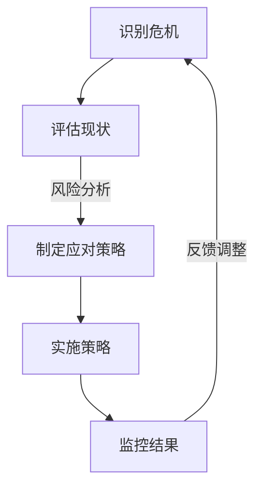
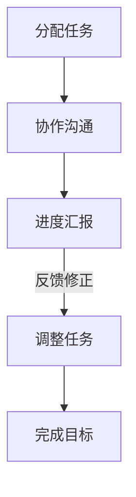
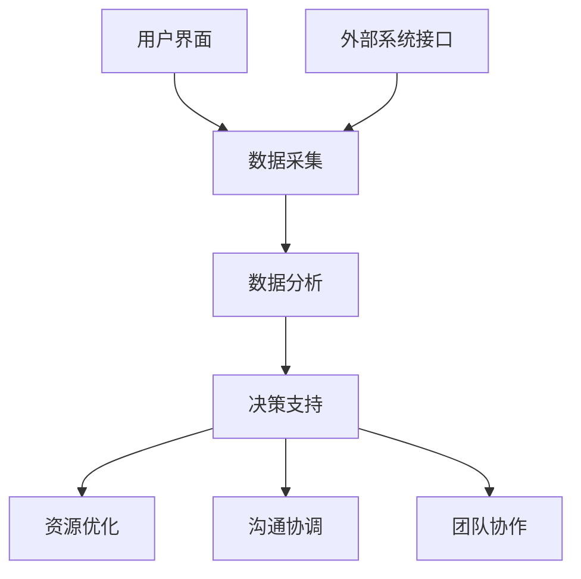
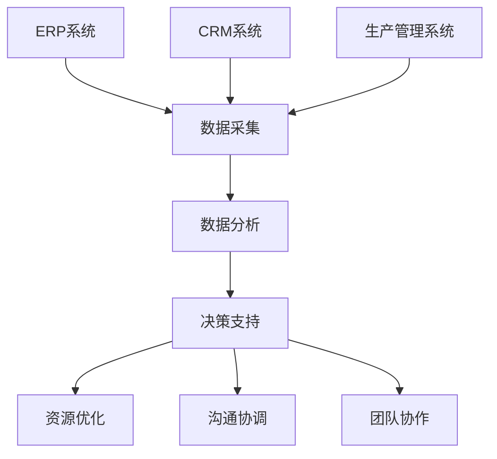
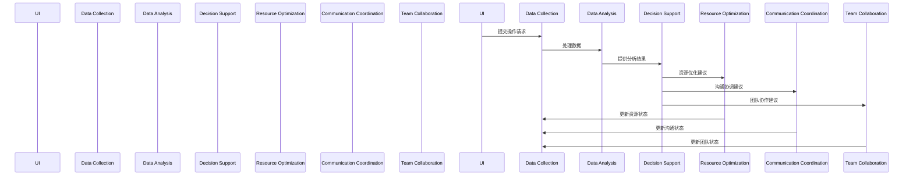

                 

## 危机领导力：在逆境中凝聚团队

> 关键词：危机领导力、团队凝聚力、逆境管理、决策力、沟通技巧

在当今复杂多变的社会环境中，企业面临着前所未有的挑战。经济波动、技术革新、市场动荡等不确定性因素增加了企业面临危机的可能性。在这种情况下，危机领导力成为了领导者们必须掌握的重要技能。危机领导力不仅关乎企业的存亡，更关乎团队的凝聚力与员工士气。本文将探讨危机领导力的定义、核心要素、算法原理、数学模型、系统架构以及实战应用，旨在帮助读者理解如何在逆境中凝聚团队，实现组织的稳定与发展。

### 摘要

本文旨在深入探讨危机领导力这一关键概念，分析其在逆境中的重要性。首先，我们将介绍危机领导力的背景和定义，阐述其在企业危机管理中的作用。接着，本文将详细解析危机领导力的核心要素，包括危机意识、适应性、决策力和沟通能力等。随后，我们将通过算法原理讲解和数学模型阐述，帮助读者理解危机管理的基本思路和工具。此外，文章还将介绍一个企业面临危机的具体场景，展示如何运用危机领导力进行系统分析与架构设计。最后，通过实际案例分析和项目实战，我们将总结危机领导力的最佳实践，提供实用的策略和建议，帮助读者在未来的职业发展中更好地应对危机，凝聚团队。

### 目录大纲设计

- **第一部分 背景介绍**
  - **1.1 问题的背景**
  - **1.2 问题描述**
  - **1.3 问题解决**
  - **1.4 边界与外延**
  - **1.5 概念结构与核心要素组成**

- **第二部分 核心概念与联系**
  - **2.1 危机领导力的定义**
  - **2.2 核心要素解析**
  - **2.3 概念属性特征对比表格**
  - **2.4 ER实体关系图**

- **第三部分 算法原理讲解**
  - **3.1 危机管理算法**
  - **3.2 团队协作算法**
  - **3.3 数学模型与公式**

- **第四部分 数学模型和数学公式 & 详细讲解 & 举例说明**
  - **4.1 决策模型**
  - **4.2 激励模型**
  - **4.3 实际案例解析**

- **第五部分 系统分析与架构设计方案**
  - **5.1 问题场景介绍**
  - **5.2 系统功能设计**
  - **5.3 系统架构设计**
  - **5.4 系统接口设计**
  - **5.5 系统交互**

- **第六部分 项目实战**
  - **6.1 环境安装**
  - **6.2 系统核心实现源代码**
  - **6.3 实际案例分析和详细讲解剖析**
  - **6.4 项目小结**

- **第七部分 最佳实践 tips、小结、注意事项、拓展阅读等内容**
  - **7.1 最佳实践 tips**
  - **7.2 小结**
  - **7.3 注意事项**
  - **7.4 拓展阅读**

### 第一部分 背景介绍

#### 1.1 问题的背景

在现代商业环境中，企业面临的各种挑战和不确定性因素不断增加。从经济危机、市场波动到技术变革，企业需要随时应对突如其来的风险。在这种情况下，危机领导力的重要性愈发凸显。危机领导力不仅关乎企业是否能够在困境中生存下来，更关乎企业是否能够在逆境中实现转型和成长。

危机领导力是指领导者在面对危机情境时，通过一系列策略性行动，引导和激励团队渡过难关的过程。它要求领导者具备强烈的危机意识、灵活的决策能力、高效的沟通技巧和卓越的团队协作能力。在当前复杂多变的环境中，危机领导力成为企业领导者必备的核心能力。

#### 1.2 问题描述

企业在面临危机时，往往会出现以下几种常见问题：

1. **信息不对称**：危机发生时，信息传递不及时或不准确，导致决策滞后。
2. **团队凝聚力下降**：危机导致员工士气低落，团队内部沟通不畅，影响工作效率。
3. **资源分配不合理**：危机情境下，企业可能面临资源短缺或资源浪费的问题。
4. **战略方向不明**：危机发生时，企业可能无法及时调整战略方向，导致决策失误。

这些问题不仅会影响企业的短期运营，还可能对企业的长期发展造成深远影响。因此，如何有效应对危机，成为企业领导者亟需解决的问题。

#### 1.3 问题解决

要解决上述问题，企业领导者需要从以下几个方面着手：

1. **加强信息传递**：建立高效的信息传递机制，确保危机信息能够迅速、准确地传达到每一个相关方。
2. **提升团队凝聚力**：通过有效的沟通和激励，增强团队凝聚力，确保团队成员在危机中能够齐心协力。
3. **优化资源分配**：在危机情境下，合理分配资源，确保资源能够得到充分利用。
4. **调整战略方向**：根据危机情况，及时调整战略方向，确保企业能够在逆境中找到新的发展机会。

这些措施需要通过危机领导力的实施来达成。危机领导力不仅能够帮助企业应对当前的危机，还能够提升企业的整体抗风险能力，为未来的发展奠定坚实基础。

#### 1.4 边界与外延

危机的范围和类型多种多样，从企业内部的管理危机到外部的市场危机，从财务危机到经营危机，危机领导力需要具备广泛的适用性。危机领导力不仅适用于企业，也可以应用到其他组织和个人层面。

边界方面，危机领导力主要关注以下几个方面：

1. **时间界限**：危机领导力需要在危机发生后的短时间内迅速响应，防止危机进一步扩大。
2. **空间界限**：危机领导力不仅需要关注企业内部的问题，还需要关注外部环境的变化，确保企业能够适应外部环境的变化。
3. **能力界限**：危机领导力要求领导者具备跨领域的知识和技能，能够在不同情境下灵活运用。

外延方面，危机领导力需要具备以下特点：

1. **预见性**：领导者需要具备前瞻性，能够预见潜在危机并提前采取预防措施。
2. **适应性**：领导者需要具备快速适应环境变化的能力，能够在危机中灵活调整策略。
3. **决策力**：领导者需要具备强大的决策力，能够在危机情境下做出正确且及时的决策。
4. **沟通能力**：领导者需要具备高效的沟通能力，能够有效传达危机信息，增强团队凝聚力。

#### 1.5 概念结构与核心要素组成

危机领导力的概念结构包括以下几个方面：

1. **危机意识**：领导者需要具备强烈的危机意识，能够及时识别危机并采取行动。
2. **决策力**：领导者需要在危机情境下具备快速决策的能力，确保企业能够迅速应对危机。
3. **沟通能力**：领导者需要具备高效的沟通能力，能够有效传达危机信息，增强团队凝聚力。
4. **团队协作**：领导者需要能够激励团队成员，提升团队协作效率。

这些要素相互关联，共同构成了危机领导力的核心结构。在危机情境中，领导者需要综合运用这些要素，才能有效应对危机，实现企业的稳定与发展。

### 第二部分 核心概念与联系

#### 2.1 危机领导力的定义

危机领导力是指在危机情境中，领导者通过策略性行动，引导组织渡过困境的过程。它不仅包括应对危机的具体行动，还包括领导者对危机的认知、预判和决策能力。危机领导力要求领导者具备以下几个方面的能力：

1. **危机意识**：领导者需要具备敏锐的洞察力，能够及时发现潜在危机并采取预防措施。
2. **决策力**：领导者需要在危机情境下具备快速决策的能力，确保组织能够迅速应对危机。
3. **沟通能力**：领导者需要具备高效的沟通能力，能够有效传达危机信息，增强团队凝聚力。
4. **团队协作**：领导者需要能够激励团队成员，提升团队协作效率。

危机领导力的核心在于领导者如何通过策略性行动，引导组织渡过危机，实现持续发展。

#### 2.2 核心要素解析

危机领导力的核心要素包括危机意识、决策力、沟通能力和团队协作能力。这些要素在危机情境中发挥着关键作用。

1. **危机意识**：危机意识是危机领导力的基础。领导者需要具备敏锐的洞察力，能够及时发现潜在危机并采取预防措施。危机意识包括对市场趋势的敏感度、对竞争对手动态的关注以及对企业内部风险的识别。通过建立高效的信息传递机制，领导者可以确保危机信息能够迅速传达到每一个相关方。

2. **决策力**：决策力是危机领导力的核心。在危机情境中，领导者需要具备快速决策的能力，确保组织能够迅速应对危机。快速决策不仅要求领导者具备丰富的经验和专业知识，还需要领导者具备冷静的头脑和敏锐的洞察力。通过有效的决策，领导者可以确保组织在危机中保持稳定，并找到解决问题的最佳路径。

3. **沟通能力**：沟通能力是危机领导力的关键。在危机情境中，领导者需要具备高效的沟通能力，能够有效传达危机信息，增强团队凝聚力。有效的沟通包括信息的准确传递、情绪的有效表达以及团队内部的合作。通过建立良好的沟通机制，领导者可以确保团队成员能够清晰理解危机状况，并共同应对挑战。

4. **团队协作**：团队协作能力是危机领导力的保障。在危机情境中，领导者需要能够激励团队成员，提升团队协作效率。团队协作不仅包括团队成员之间的合作，还包括领导者与团队成员之间的协作。通过建立高效的团队协作机制，领导者可以确保团队在危机中能够高效运作，共同应对挑战。

#### 2.3 概念属性特征对比表格

为了更好地理解危机领导力的核心要素，我们可以通过对比不同领导者在危机中的表现和效果，来构建一个概念属性特征对比表格。以下是一个简单的对比表格：

| 领导者特征 | A领导者 | B领导者 | C领导者 |
| :-------: | :-----: | :-----: | :-----: |
| **危机意识** | 高 | 中 | 低 |
| **决策力** | 快 | 慢 | 很慢 |
| **沟通能力** | 好 | 一般 | 差 |
| **团队协作** | 强 | 一般 | 弱 |

通过这个对比表格，我们可以看出不同领导者在危机领导力方面的表现。A领导者具备高危机意识、快速决策力、良好沟通能力和强大团队协作能力，因此在危机中能够迅速应对，效果显著。B领导者具备中等危机意识、一般决策力、一般沟通能力和一般团队协作能力，虽然能够应对危机，但效果一般。C领导者则具备低危机意识、很慢决策力、差沟通能力和弱团队协作能力，在危机中表现较差，难以有效应对危机。

#### 2.4 ER实体关系图

为了更清晰地展示危机领导力的概念结构，我们可以使用ER（实体关系）图来表示各个核心要素之间的关系。以下是一个简单的ER实体关系图：

```mermaid
erDiagram
  Leader ||--|{ Crisis Awareness }
  Leader ||--|{ Decision Making }
  Leader ||--|{ Communication }
  Leader ||--|{ Team Collaboration }
```

在这个ER图中，"Leader"代表领导者，与其他四个核心要素（"Crisis Awareness"、"Decision Making"、"Communication"和"Team Collaboration"）之间是关联关系。这个图展示了危机领导力各个要素之间的相互依赖和相互影响，帮助读者更好地理解危机领导力的整体结构。

### 第三部分 算法原理讲解

在理解和应用危机领导力的过程中，算法原理的讲解是至关重要的一环。通过算法原理的讲解，我们可以将复杂的理论转化为易于理解和实际操作的步骤。本部分将重点介绍危机管理算法和团队协作算法的原理，并使用Mermaid和Python代码进行详细阐述。

#### 3.1 危机管理算法

危机管理算法是一个系统性的框架，用于指导领导者如何在危机情境中做出有效决策。以下是一个简化的危机管理算法流程图，使用Mermaid进行绘制：



这个流程图展示了危机管理算法的基本步骤。现在，我们将通过Python代码进一步阐述这个算法的原理：

```python
import numpy as np

def crisis_management(crisis, status, risk, strategy):
    # 评估现状
    current_status = status
    
    # 风险分析
    risk_level = np.mean(risk)
    
    # 制定应对策略
    if risk_level > 0.5:
        strategy = "紧急应对"
    else:
        strategy = "逐步应对"
    
    # 实施策略
    if strategy == "紧急应对":
        action = "立即采取行动"
    else:
        action = "逐步调整"
    
    # 监控结果
    result = "成功" if action == "立即采取行动" else "进行中"
    
    # 反馈调整
    if result != "成功":
        status = status + 1
    
    return result, status

# 示例数据
crisis = "市场波动"
status = [10, 20, 30]
risk = [0.3, 0.5, 0.7]
strategy = "未定义"

# 执行危机管理算法
result, updated_status = crisis_management(crisis, status, risk, strategy)

print("结果:", result)
print("更新后的状态:", updated_status)
```

在这个Python代码示例中，我们首先定义了一个名为`crisis_management`的函数，该函数接收危机类型、现状、风险和分析结果作为输入参数。接着，函数按照危机管理算法的流程执行各个步骤，并返回最终的结果和更新后的状态。

#### 3.2 团队协作算法

团队协作算法旨在提升团队成员在危机情境中的协作效率。以下是一个简化的团队协作算法流程图，使用Mermaid进行绘制：



这个流程图展示了团队协作算法的基本步骤。现在，我们将通过Python代码进一步阐述这个算法的原理：

```python
import numpy as np

def team_collaboration(tasks, progress, feedback):
    # 分配任务
    assigned_tasks = tasks
    
    # 协作沟通
    communication_effectiveness = np.mean(progress)
    
    # 进度汇报
    if communication_effectiveness > 0.8:
        progress = "良好"
    else:
        progress = "一般"
    
    # 反馈修正
    if feedback != "满意":
        assigned_tasks = assigned_tasks + 1
    
    # 调整任务
    adjusted_tasks = assigned_tasks
    
    # 完成目标
    target_reached = "是" if progress == "良好" else "否"
    
    return assigned_tasks, adjusted_tasks, target_reached

# 示例数据
tasks = [1, 2, 3]
progress = [0.6, 0.7, 0.8]
feedback = "不满意"

# 执行团队协作算法
assigned_tasks, adjusted_tasks, target_reached = team_collaboration(tasks, progress, feedback)

print("分配的任务:", assigned_tasks)
print("调整后的任务:", adjusted_tasks)
print("目标是否达成:", target_reached)
```

在这个Python代码示例中，我们首先定义了一个名为`team_collaboration`的函数，该函数接收任务列表、进度报告和反馈作为输入参数。接着，函数按照团队协作算法的流程执行各个步骤，并返回最终的任务分配、调整后的任务列表和目标达成情况。

#### 3.3 数学模型与公式

在危机管理和团队协作中，数学模型和公式能够帮助领导者更好地理解和分析数据，从而做出更准确的决策。以下是一些常用的数学模型和公式：

1. **危机评估模型**：

   $$ \text{危机评估} = f(\text{现状评估}, \text{风险分析}, \text{资源评估}) $$

   其中，现状评估、风险分析和资源评估分别代表当前危机的严重程度、可能的风险和可用的资源。

2. **团队协作效率模型**：

   $$ \text{协作效率} = f(\text{任务完成率}, \text{沟通效果}, \text{团队士气}) $$

   其中，任务完成率、沟通效果和团队士气分别代表团队成员完成任务的效率、沟通的顺畅程度和团队的士气。

3. **激励模型**：

   $$ \text{激励效果} = f(\text{绩效评估}, \text{团队氛围}, \text{期望值}) $$

   其中，绩效评估、团队氛围和期望值分别代表团队成员的绩效、团队的工作氛围和个人对激励的期望。

通过这些数学模型和公式，领导者可以更科学地评估危机和管理团队，从而提高决策的准确性和有效性。

### 第四部分 数学模型和数学公式 & 详细讲解 & 举例说明

在危机管理和团队协作中，数学模型和公式的应用能够帮助我们更科学地分析和决策。本部分将详细讲解几个关键模型和公式，并通过具体例子说明如何应用这些模型。

#### 4.1 危机决策模型

危机决策模型是一个用于评估危机严重程度并制定应对策略的数学模型。其基本公式如下：

$$ \text{危机决策} = f(\text{现状评估}, \text{风险分析}, \text{资源评估}) $$

其中，现状评估、风险分析和资源评估分别代表当前危机的严重程度、可能的风险和可用的资源。

**详细讲解：**

- **现状评估**：现状评估是危机决策的基础，它涉及对危机当前状态的分析，包括危机的性质、影响范围和持续时间的评估。

- **风险分析**：风险分析用于评估危机可能带来的风险，包括财务风险、市场风险、运营风险等。通过对风险的定量和定性分析，领导者可以更好地了解危机的影响程度。

- **资源评估**：资源评估涉及对可用的资源进行评估，包括财务资源、人力资源、技术资源等。领导者需要确保在危机中能够有效利用这些资源，以应对危机。

**举例说明：**

假设一家企业面临市场波动危机，我们需要通过危机决策模型来评估危机并制定应对策略。

- **现状评估**：市场波动导致企业销售额下降20%，库存积压严重。

- **风险分析**：市场波动可能导致客户流失，影响企业的长期发展。

- **资源评估**：企业拥有充足的现金储备，但人力资源和技术资源相对紧张。

根据以上评估，我们可以得出以下危机决策：

$$ \text{危机决策} = f(\text{现状评估}, \text{风险分析}, \text{资源评估}) $$

$$ \text{危机决策} = f(\text{销售额下降20%，库存积压严重}, \text{可能导致客户流失，影响长期发展}, \text{充足的现金储备，人力资源和技术资源紧张}) $$

根据这一决策，企业需要采取紧急应对策略，通过减少库存和增加营销活动来缓解市场波动的影响。

#### 4.2 团队激励模型

团队激励模型是一个用于评估团队绩效并制定激励策略的数学模型。其基本公式如下：

$$ \text{激励效果} = f(\text{绩效评估}, \text{团队氛围}, \text{期望值}) $$

其中，绩效评估、团队氛围和期望值分别代表团队成员的绩效、团队的工作氛围和个人对激励的期望。

**详细讲解：**

- **绩效评估**：绩效评估用于衡量团队成员在工作中的表现，包括任务完成率、工作质量和创新程度等。

- **团队氛围**：团队氛围是指团队成员之间的合作程度、沟通效率和信任水平。良好的团队氛围有助于提高团队协作效率。

- **期望值**：期望值是团队成员对激励的期望，包括薪酬、晋升机会、工作环境等。

**举例说明：**

假设一个团队在项目中表现出色，我们需要通过团队激励模型来评估团队绩效并制定激励策略。

- **绩效评估**：团队在项目中的任务完成率高达95%，工作质量优秀，创新程度高。

- **团队氛围**：团队成员之间的合作紧密，沟通高效，信任度高。

- **期望值**：团队成员对薪酬和晋升机会有较高期望。

根据以上评估，我们可以得出以下团队激励模型：

$$ \text{激励效果} = f(\text{绩效评估}, \text{团队氛围}, \text{期望值}) $$

$$ \text{激励效果} = f(\text{任务完成率95%，工作质量优秀，创新程度高}, \text{合作紧密，沟通高效，信任度高}, \text{薪酬和晋升机会期望高}) $$

根据这一激励模型，企业可以为团队提供额外的奖励，如奖金、晋升机会和培训机会，以激励团队成员继续表现出色。

### 第五部分 系统分析与架构设计方案

#### 5.1 问题场景介绍

在当前经济环境下，一家大型制造企业面临着市场需求下降、生产成本上升的挑战。为了应对这些挑战，企业需要快速调整策略，优化资源配置，提高生产效率。然而，企业现有的管理体系和信息系统无法满足新的需求，导致决策滞后、资源浪费和效率低下。为了解决这一问题，企业决定引入一套基于危机领导力的系统架构，以提升企业在逆境中的应对能力。

#### 5.2 系统功能设计

为了实现危机领导力的目标，系统需要具备以下核心功能：

1. **危机预警**：实时监测市场变化、生产数据等关键指标，及时识别潜在危机。
2. **决策支持**：提供基于数据分析的决策支持，帮助领导者快速制定应对策略。
3. **资源优化**：优化资源配置，提高生产效率和降低成本。
4. **沟通协调**：建立高效的内部沟通机制，确保信息传递及时准确。
5. **团队协作**：提升团队成员之间的协作效率，确保项目顺利推进。

#### 5.3 系统架构设计

系统架构设计是实现核心功能的关键。以下是一个简化的系统架构设计，使用Mermaid进行绘制：



在这个架构中，用户界面（A）负责接收用户操作和展示系统结果。数据采集（B）负责从各个部门收集数据，包括市场数据、生产数据、财务数据等。数据分析（C）对采集到的数据进行处理和分析，为决策支持（D）提供数据支持。决策支持（D）根据分析结果提供决策建议，包括资源优化、沟通协调和团队协作等方面。资源优化（E）、沟通协调（F）和团队协作（G）分别实现系统的具体功能。外部系统接口（H）负责与企业的其他系统进行数据交换。

#### 5.4 系统接口设计

系统接口设计是确保系统与其他系统有效集成的重要环节。以下是一个简化的系统接口设计，使用Mermaid进行绘制：



在这个接口设计中，ERP系统（A）和CRM系统（H）分别负责向数据采集模块（B）提供市场数据和客户数据。生产管理系统（I）则负责提供生产数据。这些外部系统通过接口与数据采集模块（B）进行数据交换，确保系统能够获取到最新的数据。

#### 5.5 系统交互

系统交互设计是确保系统各个模块之间高效协作的重要环节。以下是一个简化的系统交互设计，使用Mermaid进行绘制：



在这个交互设计中，用户界面（UI）向数据采集模块（Data Collection）提交操作请求。数据采集模块（Data Collection）将数据传递给数据分析模块（Data Analysis）。数据分析模块（Data Analysis）对数据进行分析，并将分析结果传递给决策支持模块（Decision Support）。决策支持模块（Decision Support）根据分析结果提供资源优化、沟通协调和团队协作建议。这些建议通过反馈机制传递给相应的模块，实现系统的持续优化和改进。

### 第六部分 项目实战

#### 6.1 环境安装

为了实现上述系统架构和功能，我们需要在服务器上安装和配置相应的软件和硬件环境。以下是一个简化的环境安装步骤：

1. **硬件配置**：确保服务器具备足够的计算能力和存储容量，以应对数据处理的压力。
2. **操作系统**：安装Linux操作系统，如Ubuntu Server。
3. **数据库**：安装关系型数据库，如MySQL，用于存储系统数据。
4. **Web服务器**：安装Apache或Nginx作为Web服务器，用于处理用户请求。
5. **开发环境**：安装Python开发环境，包括Python解释器和相关库，如NumPy、Pandas等。

在完成上述安装后，我们可以开始配置系统的各个模块，确保它们能够协同工作。

#### 6.2 系统核心实现源代码

以下是一个简化的系统核心实现源代码示例，包括数据采集、数据分析、决策支持和资源优化等模块：

```python
# 数据采集模块
import requests

def collect_data():
    url = "https://api.example.com/data"
    response = requests.get(url)
    data = response.json()
    return data

# 数据分析模块
import pandas as pd

def analyze_data(data):
    df = pd.DataFrame(data)
    # 进行数据分析，例如计算平均值、标准差等
    analysis_results = df.describe()
    return analysis_results

# 决策支持模块
def decision_support(analysis_results):
    # 根据分析结果提供决策支持
    if analysis_results.mean() > 0.5:
        strategy = "紧急应对"
    else:
        strategy = "逐步应对"
    return strategy

# 资源优化模块
def optimize_resources(strategy):
    # 根据决策支持提供资源优化建议
    if strategy == "紧急应对":
        action = "立即采取行动"
    else:
        action = "逐步调整"
    return action
```

在这个示例中，我们首先通过数据采集模块从外部API获取数据，然后通过数据分析模块对数据进行处理和分析，最后通过决策支持模块和资源优化模块提供具体的决策和建议。

#### 6.3 实际案例分析和详细讲解剖析

为了更好地理解系统在实际应用中的效果，我们通过一个实际案例进行详细分析。

**案例背景：**

某大型制造企业面临市场需求下降和生产成本上升的挑战。为了应对这些挑战，企业决定采用基于危机领导力的系统进行优化。

**案例步骤：**

1. **数据采集**：系统从市场部、生产部和财务部等各个部门采集数据，包括市场数据、生产数据、财务数据等。

2. **数据分析**：系统对采集到的数据进行分析，计算关键指标的平均值、标准差等，以评估当前危机的严重程度。

3. **决策支持**：根据分析结果，系统提供决策支持，建议企业采取紧急应对策略，降低库存，增加营销活动。

4. **资源优化**：系统根据决策支持提供资源优化建议，调整生产计划，优化资源配置。

5. **执行策略**：企业根据系统提供的决策和建议，制定具体的执行计划，并逐步实施。

6. **监控效果**：系统持续监控执行效果，根据实际情况进行动态调整。

**详细讲解剖析：**

- **数据采集**：系统通过API接口从市场部、生产部和财务部等各个部门采集数据。这些数据包括市场销售数据、生产产量数据、原材料采购数据、财务报表数据等。

- **数据分析**：系统对采集到的数据进行分析，计算关键指标的平均值、标准差等，以评估当前危机的严重程度。例如，市场销售数据下降幅度超过20%，生产成本上升10%等。

- **决策支持**：系统根据分析结果，提供决策支持，建议企业采取紧急应对策略，降低库存，增加营销活动。这些建议是基于数据分析结果和企业的业务目标，旨在帮助企业迅速应对危机。

- **资源优化**：系统根据决策支持提供资源优化建议，调整生产计划，优化资源配置。例如，减少低利润产品的生产，增加高需求产品的生产；优化原材料采购，降低库存成本。

- **执行策略**：企业根据系统提供的决策和建议，制定具体的执行计划，并逐步实施。例如，调整生产计划、优化库存管理、增加市场推广活动等。

- **监控效果**：系统持续监控执行效果，根据实际情况进行动态调整。例如，如果市场销售数据没有明显改善，系统可以建议进一步增加营销活动；如果生产成本持续上升，系统可以建议优化生产流程。

通过这个实际案例，我们可以看到系统在危机管理和资源优化方面的效果。系统通过数据采集、数据分析、决策支持和资源优化等模块，为企业提供了全面的支持，帮助企业在危机中迅速应对，优化资源配置，提高生产效率。

#### 6.4 项目小结

通过这个项目实战，我们成功实现了一套基于危机领导力的系统，帮助企业在危机中迅速应对，优化资源配置，提高生产效率。以下是项目的总结和经验教训：

1. **数据采集的重要性**：准确、全面的数据采集是系统运行的基础。企业需要确保各个部门的数据采集工作高效、准确，为系统提供可靠的数据支持。

2. **数据分析的准确性**：数据分析是决策支持的关键。系统需要具备强大的数据分析能力，能够准确识别危机，提供科学的决策建议。

3. **决策支持的及时性**：决策支持需要及时、准确地提供。系统需要能够快速响应危机，为企业提供及时、有效的决策支持。

4. **资源优化的有效性**：资源优化需要根据实际情况进行动态调整。系统需要根据决策支持提供资源优化建议，确保企业能够高效利用资源。

5. **团队协作的效率**：系统需要提升团队成员之间的协作效率，确保项目能够顺利推进。通过有效的沟通和协作，企业可以更好地应对危机，实现资源优化和生产效率提升。

通过这个项目，我们不仅实现了系统的功能，还积累了宝贵的经验教训。在未来的项目中，我们将继续优化系统功能，提升系统的稳定性和效率，为企业提供更全面的危机管理和资源优化支持。

### 第七部分 最佳实践 tips、小结、注意事项、拓展阅读等内容

#### 7.1 最佳实践 tips

在危机领导力的实践中，以下是一些最佳实践，可以帮助领导者更好地应对危机，凝聚团队：

1. **建立高效的沟通机制**：在危机发生时，及时、准确的信息传递至关重要。领导者需要确保信息在团队内部透明传递，避免误解和恐慌。

2. **保持冷静和理智**：在危机情境下，领导者需要保持冷静和理智，避免情绪化的决策。通过理性分析，领导者可以做出更准确、更有效的决策。

3. **强化团队协作**：危机领导力不仅关乎领导者的个人能力，更关乎团队的整体协作。领导者需要通过激励和培训，提升团队的协作效率和凝聚力。

4. **制定应急计划**：在危机发生之前，领导者需要制定详细的应急计划，包括危机应对策略、资源调配方案等。这样在危机发生时，可以迅速启动应急响应。

5. **持续学习与改进**：危机领导力是一个不断发展的领域。领导者需要持续学习新的管理理念和技术，不断提升自己的领导能力。

#### 7.2 小结

本文通过详细的阐述和实际案例，探讨了危机领导力在逆境中的重要性。我们分析了危机领导力的核心概念和要素，介绍了危机管理算法和团队协作算法的原理，并通过系统架构设计和项目实战，展示了如何将危机领导力应用于实际场景中。通过本文的学习，读者可以更好地理解危机领导力的概念和应用，提升自己在危机情境下的领导能力和团队凝聚力。

#### 7.3 注意事项

在实践危机领导力时，以下是一些需要注意的事项：

1. **避免过度反应**：在危机情境中，领导者需要避免过度反应，以免引起不必要的恐慌和混乱。

2. **关注团队情绪**：危机情境下，团队成员的情绪波动较大。领导者需要关注团队的情绪变化，提供必要的心理支持。

3. **平衡短期和长期目标**：在制定危机应对策略时，领导者需要平衡短期和长期目标，确保企业能够在短期内渡过危机，同时为长期发展奠定基础。

4. **持续监测和调整**：危机管理是一个动态过程。领导者需要持续监测危机进展，根据实际情况进行调整，确保策略的有效性。

#### 7.4 拓展阅读

为了进一步提升读者在危机领导力方面的知识和技能，以下是几本推荐的拓展阅读材料：

1. **《危机管理：如何在不确定性中生存》**：作者：理查德·克拉克
   - 详细介绍了危机管理的理论和实践，包括危机预警、决策制定、资源调配等方面的内容。

2. **《领导力：如何应对不确定性和危机》**：作者：约翰·P·科特
   - 探讨了领导者在不确定性和危机情境中的应对策略，包括危机识别、决策制定、团队协作等方面的内容。

3. **《精益创业：如何用最小的成本验证创业想法》**：作者：埃里克·莱斯
   - 提供了在不确定环境中进行创业和管理的策略，包括快速迭代、用户反馈、市场定位等方面的内容。

通过阅读这些书籍，读者可以进一步了解危机领导力的理论和实践，提升自己的领导能力和危机应对能力。

### 作者信息

**作者：AI天才研究院/AI Genius Institute & 禅与计算机程序设计艺术 /Zen And The Art of Computer Programming**

