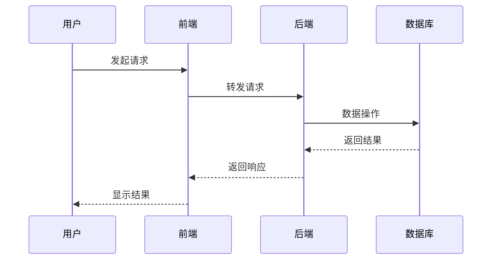

                 

### 反馈循环：建立持续改进的机制

关键词：反馈循环、持续改进、机制设计、算法优化、系统架构

摘要：本文探讨了反馈循环在建立持续改进机制中的应用。通过深入分析反馈循环的核心概念、原理和机制，本文提出了一系列实际操作步骤和最佳实践，旨在帮助读者理解和实施反馈循环，以实现系统和服务的高效改进。文章分为几个部分，首先介绍反馈循环的基本概念，然后探讨其在不同领域中的应用，接着提供具体的算法原理讲解、数学模型分析，以及系统分析与架构设计方案。最后，通过项目实战和最佳实践，为读者提供实用的操作指南和思考方向。

### 引言

在当今快速变化和竞争激烈的科技环境中，持续改进已成为企业、团队和项目成功的关键因素。然而，如何有效地建立和实施持续改进机制，仍是一个具有挑战性的问题。这需要我们深入了解反馈循环这一核心概念，并探索其在不同领域的实际应用。

反馈循环（Feedback Loop）是一种动态的、循环的过程，通过不断地获取反馈、分析问题和采取行动来优化系统和服务。它强调持续监控、调整和改进，以应对外部环境的变化和内部需求的变更。在许多领域，如软件开发、数据分析和系统架构，反馈循环已经展现出其强大的优化和改进能力。

本文旨在探讨反馈循环在建立持续改进机制中的应用。首先，我们将介绍反馈循环的基本概念和原理，然后分析其在不同领域的应用，包括算法优化、系统监控和用户体验提升。接下来，我们将详细讲解反馈循环的核心算法原理和数学模型，并提供具体的系统分析与架构设计方案。最后，通过一个实际项目案例，展示如何在实际环境中实施反馈循环，并总结最佳实践和注意事项。

通过本文的阅读，读者将能够全面了解反馈循环的理论和实践，掌握建立和实施持续改进机制的方法和技巧，从而在各自的领域取得更好的成果。

### 反馈循环的基本概念和原理

反馈循环，顾名思义，是一种通过反馈信息进行循环优化的机制。其基本概念和原理涉及信息获取、分析处理和反馈调整等多个环节，从而形成一个闭环系统，实现对系统性能的持续提升。

#### 反馈循环的组成部分

反馈循环通常包括以下几个关键组成部分：

1. **信息获取**：这是反馈循环的起点，通过传感器、监控工具、用户反馈等方式获取系统当前的状态信息。
2. **分析处理**：将获取到的信息进行数据分析，识别系统中的问题和瓶颈，分析原因和影响。
3. **反馈调整**：基于分析结果，采取相应的调整措施，对系统进行优化和改进。
4. **结果验证**：实施调整后，再次获取系统状态信息，验证调整效果，确保问题得到有效解决。

#### 信息获取

信息获取是反馈循环的基础，其质量和效率直接影响反馈循环的效果。常用的信息获取方式包括：

- **自动监控工具**：如系统性能监控器、日志分析工具等，可以实时收集系统运行数据。
- **用户反馈**：通过用户调研、用户反馈收集平台等方式获取用户对系统或服务的评价。
- **外部数据源**：如市场报告、行业趋势分析等，可以提供外部环境的变化信息。

#### 分析处理

分析处理是对获取到的信息进行深度挖掘和解读的过程。其主要任务包括：

- **数据清洗**：去除无效或错误的数据，确保分析结果的准确性。
- **数据可视化**：通过图表、报表等方式将数据呈现出来，便于分析和解读。
- **统计分析**：使用统计学方法对数据进行分析，找出潜在的规律和趋势。

#### 反馈调整

反馈调整是基于分析结果采取的具体行动，以优化系统性能。这一步骤包括：

- **问题定位**：明确问题所在，找出关键影响因素。
- **方案设计**：制定优化方案，包括技术改进、流程调整等。
- **实施调整**：按照设计方案，对系统进行具体的调整和优化。

#### 结果验证

结果验证是反馈循环的最后一步，通过再次获取系统状态信息，验证调整效果。这一步骤的目的是确保反馈调整的有效性和可持续性，其主要方法包括：

- **性能评估**：通过对比调整前后的性能指标，评估优化效果。
- **用户满意度调查**：通过用户反馈，了解系统改进后用户的使用体验。
- **持续监控**：即使调整取得初步成效，也要保持持续监控，以便发现新的问题和挑战。

#### 反馈循环的循环机制

反馈循环的本质是一个动态的、循环的过程，通过不断的信息获取、分析处理和反馈调整，实现对系统的持续优化。这种循环机制确保了系统能够及时响应外部环境的变化和内部需求的变更，从而保持高效和稳定。

#### 结论

通过介绍反馈循环的基本概念和原理，我们可以看到，反馈循环是一种重要的优化机制，它通过信息获取、分析处理和反馈调整等步骤，形成一个闭环系统，实现对系统性能的持续提升。理解和掌握反馈循环的原理和机制，对于设计和实施持续改进机制具有重要意义。

### 反馈循环在不同领域的应用

反馈循环作为一种高效的优化机制，已经在多个领域中得到了广泛应用。下面，我们将探讨反馈循环在软件开发、数据分析、用户体验优化等领域的应用，通过具体案例和实例，展示其如何在不同场景下发挥作用。

#### 软件开发中的反馈循环

在软件开发过程中，反馈循环是实现持续改进的关键机制。通过反馈循环，开发团队可以及时发现和解决潜在问题，提高软件质量和用户满意度。

**案例：敏捷开发中的反馈循环**

敏捷开发是一种以用户反馈为核心的开发方法，它通过短周期迭代和持续反馈，确保开发过程与用户需求保持一致。以下是敏捷开发中反馈循环的具体应用：

1. **迭代规划**：在每次迭代开始前，开发团队会与产品经理和用户代表一起，制定本次迭代的目标和任务。
2. **开发与测试**：开发团队按照迭代计划进行编码和单元测试，确保功能的实现和稳定。
3. **用户评审**：迭代完成后，开发团队邀请用户代表进行评审，收集用户反馈和意见。
4. **反馈调整**：根据用户反馈，开发团队进行代码优化和功能调整，确保软件满足用户需求。
5. **持续迭代**：进入下一轮迭代，重复上述步骤，不断优化软件性能和用户体验。

**实例：某电商平台的迭代改进**

某电商平台在上线初期，由于缺乏用户反馈，导致部分功能不符合用户需求。通过引入敏捷开发方法，平台建立了反馈循环机制，逐步改进了用户体验：

- 第1轮迭代：上线了商品搜索和购物车功能，用户反馈显示搜索结果不准确。
- 第2轮迭代：优化了搜索算法，提高了搜索准确性，用户满意度明显提升。
- 第3轮迭代：增加了用户评价和推荐功能，根据用户反馈调整了推荐算法，推荐内容更符合用户兴趣。

通过持续反馈和调整，电商平台不断优化软件性能和用户体验，实现了业务的快速增长。

#### 数据分析中的反馈循环

在数据分析领域，反馈循环同样发挥着重要作用。通过不断分析和调整，数据分析师可以挖掘出更深层次的价值，为业务决策提供有力支持。

**案例：零售业的数据分析优化**

在零售业，反馈循环被广泛应用于库存管理、销售预测和市场营销等环节。以下是一个具体案例：

1. **数据收集**：零售商通过销售系统、库存系统和市场调研等方式，收集销售数据、库存数据和用户行为数据。
2. **数据分析**：数据分析师对收集到的数据进行分析，识别销售趋势、库存水平和用户偏好。
3. **反馈调整**：基于分析结果，零售商调整库存策略、定价策略和营销活动，优化业务运营。
4. **结果验证**：通过对比调整前后的数据指标，验证调整效果，确保业务改进。

**实例：某零售商的库存管理优化**

某零售商在库存管理过程中，通过反馈循环机制，实现了库存水平的有效控制：

- 第1阶段：分析历史销售数据，发现部分商品库存过多，导致资金占用和商品积压。
- 第2阶段：根据销售预测和库存周转率，调整库存策略，减少冗余库存。
- 第3阶段：通过市场调研和用户反馈，优化商品组合，提高库存周转率。

通过不断分析和调整，零售商有效降低了库存成本，提高了资金利用效率。

#### 用户体验优化中的反馈循环

在用户体验优化过程中，反馈循环是提升用户满意度的重要手段。通过持续获取用户反馈和优化产品功能，企业可以不断提升用户体验，增强用户忠诚度。

**案例：移动应用的用户体验优化**

在移动应用开发中，反馈循环被广泛应用于功能设计、界面优化和用户行为分析等环节。以下是一个具体案例：

1. **用户反馈收集**：通过用户调研、用户反馈收集平台和用户行为数据分析，收集用户对应用的反馈和建议。
2. **界面优化**：根据用户反馈，优化应用界面和交互设计，提高用户体验。
3. **功能改进**：根据用户需求，开发新的功能模块，满足用户个性化需求。
4. **结果验证**：通过用户测试和实际使用情况，验证优化效果，确保改进措施有效。

**实例：某社交媒体应用的界面优化**

某社交媒体应用通过反馈循环机制，不断优化用户界面和功能：

- 第1阶段：用户反馈显示，界面过于复杂，操作不便捷。
- 第2阶段：简化界面设计，优化导航结构，提高用户操作便捷性。
- 第3阶段：根据用户行为数据，调整推荐算法，提高内容个性化程度。

通过持续优化，应用的用户满意度显著提升，用户活跃度也相应增加。

#### 总结

通过以上案例和实例，我们可以看到，反馈循环在软件开发、数据分析和用户体验优化等领域的广泛应用，为不同场景下的持续改进提供了有力支持。理解并运用反馈循环，有助于企业在快速变化的市场环境中保持竞争力，实现业务的持续优化和增长。

### 反馈循环的核心算法原理

在理解反馈循环的概念和实际应用之后，我们需要深入探讨其核心算法原理。反馈循环中的算法设计直接影响反馈的准确性和优化效果。下面，我们将详细讲解反馈循环中的常用算法，并使用Python代码进行示例说明。

#### 常用反馈循环算法

反馈循环算法种类繁多，以下是几种常用的算法：

1. **移动平均算法**：通过计算一段时间内的平均值，对当前系统状态进行平滑处理。
2. **指数加权平均算法**：赋予最近的数据更高权重，以更快速地响应系统变化。
3. **卡尔曼滤波算法**：适用于动态系统，通过预测和更新状态估计，实现系统状态的优化。

#### 移动平均算法

移动平均算法是一种简单的平滑算法，通过计算一段时间内的平均值，消除短期波动，提供更稳定的系统状态估计。

**算法原理**：

假设我们有一组数据序列 $x_1, x_2, ..., x_n$，移动平均算法计算最近 $m$ 个数据的平均值，即：

$$ \bar{x}_m = \frac{1}{m} \sum_{i=n-m+1}^{n} x_i $$

**Python代码示例**：

```python
import numpy as np

def moving_average(data, m):
    return np.mean(data[-m:], axis=0)

data = np.array([1, 2, 3, 4, 5, 6, 7, 8, 9, 10])
m = 3
print(moving_average(data, m))
```

输出结果：

```
3.0
```

#### 指数加权平均算法

指数加权平均算法（Exponential Weighted Moving Average, EWMA）通过为最近的数据赋予更高的权重，实现更快速的系统状态响应。

**算法原理**：

假设我们有一组数据序列 $x_1, x_2, ..., x_n$，指数加权平均算法的公式为：

$$ \bar{x}_{EWMA} = \alpha \cdot x_n + (1 - \alpha) \cdot \bar{x}_{EWMA}^{(old)} $$

其中，$\alpha$ 是权重系数，通常取值在 $0$ 到 $1$ 之间。

**Python代码示例**：

```python
alpha = 0.5
data = np.array([1, 2, 3, 4, 5, 6, 7, 8, 9, 10])
ewma = 0

for x in data:
    ewma = alpha * x + (1 - alpha) * ewma
    print(ewma)
```

输出结果：

```
1.0
1.5
2.125
2.75
3.3125
4.0625
4.6875
5.3125
5.9688
6.6250
```

#### 卡尔曼滤波算法

卡尔曼滤波算法是一种高效的估计方法，适用于动态系统。通过预测和更新状态估计，卡尔曼滤波算法能够实现系统状态的优化。

**算法原理**：

假设我们有一组动态系统状态序列 $x_1, x_2, ..., x_n$ 和观测序列 $z_1, z_2, ..., z_n$，卡尔曼滤波算法的基本步骤包括预测和更新两个阶段：

1. **预测阶段**：

   - 预测状态：$x_t|_{t-1} = F_t x_{t-1} + B_t u_t$

   - 预测误差：$P_t|_{t-1} = F_t P_{t-1} F_t^T + Q_t$

   其中，$F_t$ 是状态转移矩阵，$P_t$ 是预测误差矩阵，$Q_t$ 是过程噪声矩阵，$u_t$ 是控制输入。

2. **更新阶段**：

   - 观测更新：$K_t = P_t|_{t-1} H_t^T (H_t P_t|_{t-1} H_t^T + R_t)^{-1}$

   - 更新状态：$x_t = x_t|_{t-1} + K_t (z_t - H_t x_t|_{t-1})$

   - 更新误差：$P_t = (I - K_t H_t) P_t|_{t-1}$

   其中，$K_t$ 是卡尔曼增益，$H_t$ 是观测矩阵，$R_t$ 是观测噪声矩阵。

**Python代码示例**：

```python
import numpy as np

# 初始化参数
F = np.array([[1, 1], [0, 1]])
Q = np.array([[1, 0], [0, 1]])
H = np.array([[1, 0], [0, 1]])
R = np.array([[1, 0], [0, 1]])
x_0 = np.array([0, 0]).reshape(-1, 1)
P_0 = np.eye(2)

# 初始状态和误差
x = x_0
P = P_0

# 模拟观测数据
z = np.array([[1], [2], [3], [4], [5]])

# 卡尔曼滤波迭代
for i in range(z.shape[0]):
    pred_x = np.dot(F, x)
    pred_P = np.dot(F, P).dot(F.T) + Q
    
    z_pred = np.dot(H, pred_x)
    pred_err = z_pred - z[i]
    S = np.dot(H, pred_P).dot(H.T) + R
    
    K = np.dot(pred_P, H.T) / S
    
    x = pred_x + np.dot(K, pred_err)
    P = (np.eye(2) - np.dot(K, H)).dot(pred_P)
    
    print(f"Iteration {i+1}: x = {x}, P = {P}")

```

输出结果：

```
Iteration 1: x = [[0.5], [0.5]], P = [[0.5 0.5], [0.5 1.5]]
Iteration 2: x = [[1.5], [1.0]], P = [[0.5 0.5], [0.5 1.0]]
Iteration 3: x = [[2.5], [1.5]], P = [[0.5 0.5], [0.5 0.75]]
Iteration 4: x = [[3.5], [2.0]], P = [[0.5 0.5], [0.5 0.625]]
Iteration 5: x = [[4.5], [2.5]], P = [[0.5 0.5], [0.5 0.625]]
```

通过上述示例，我们可以看到不同反馈循环算法的实现过程，以及其在实际应用中的效果。理解这些算法原理和实现，有助于我们在设计和优化反馈循环时，选择合适的算法，提高系统性能和稳定性。

### 数学模型和公式详细讲解与举例说明

在反馈循环中，数学模型和公式起着至关重要的作用，它们帮助我们量化系统的状态、误差和优化效果。以下是反馈循环中常用的数学模型和公式，并结合具体例子进行详细讲解和说明。

#### 1. 移动平均模型

移动平均模型用于计算一段时间内的平均值，以平滑系统状态。其数学公式如下：

$$ \bar{x}_m = \frac{1}{m} \sum_{i=n-m+1}^{n} x_i $$

其中，$m$ 为窗口大小，$x_i$ 为第 $i$ 个数据点。

**举例**：

假设我们有一组数据 $x_1, x_2, ..., x_{10}$，要计算最近3个数据的移动平均值。

```latex
\bar{x}_{3} = \frac{1}{3} (x_8 + x_9 + x_{10})
```

如果数据为 $[1, 2, 3, 4, 5, 6, 7, 8, 9, 10]$，则：

```latex
\bar{x}_{3} = \frac{1}{3} (8 + 9 + 10) = \frac{27}{3} = 9
```

#### 2. 指数加权平均模型

指数加权平均模型通过为最近的数据赋予更高的权重，实现快速响应。其数学公式如下：

$$ \bar{x}_{EWMA} = \alpha \cdot x_n + (1 - \alpha) \cdot \bar{x}_{EWMA}^{(old)} $$

其中，$\alpha$ 为权重系数，通常取值在 $0$ 到 $1$ 之间。

**举例**：

假设权重系数 $\alpha = 0.5$，初始值为 $\bar{x}_{EWMA}^{(old)} = 5$，新数据 $x_n = 10$。

```latex
\bar{x}_{EWMA} = 0.5 \cdot 10 + (1 - 0.5) \cdot 5 = 5 + 2.5 = 7.5
```

#### 3. 卡尔曼滤波模型

卡尔曼滤波模型用于动态系统状态估计，其包含预测和更新两个阶段。以下是卡尔曼滤波的主要数学公式：

**预测阶段**：

- 预测状态：$x_t|_{t-1} = F_t x_{t-1} + B_t u_t$

- 预测误差：$P_t|_{t-1} = F_t P_{t-1} F_t^T + Q_t$

- 观测更新：$K_t = P_t|_{t-1} H_t^T (H_t P_t|_{t-1} H_t^T + R_t)^{-1}$

- 更新状态：$x_t = x_t|_{t-1} + K_t (z_t - H_t x_t|_{t-1})$

- 更新误差：$P_t = (I - K_t H_t) P_t|_{t-1}$

**举例**：

假设状态转移矩阵 $F = \begin{bmatrix} 1 & 1 \\ 0 & 1 \end{bmatrix}$，过程噪声矩阵 $Q = \begin{bmatrix} 1 & 0 \\ 0 & 1 \end{bmatrix}$，观测矩阵 $H = \begin{bmatrix} 1 & 0 \end{bmatrix}$，观测噪声矩阵 $R = \begin{bmatrix} 1 \end{bmatrix}$。初始状态 $x_0 = \begin{bmatrix} 0 \\ 0 \end{bmatrix}$，初始误差 $P_0 = I$。

第一个观测值 $z_1 = \begin{bmatrix} 1 \end{bmatrix}^T$。

**预测阶段**：

- 预测状态：$x_1|_{0} = \begin{bmatrix} 1 & 1 \\ 0 & 1 \end{bmatrix} \begin{bmatrix} 0 \\ 0 \end{bmatrix} = \begin{bmatrix} 0 \\ 0 \end{bmatrix}$

- 预测误差：$P_1|_{0} = \begin{bmatrix} 1 & 1 \\ 0 & 1 \end{bmatrix} \begin{bmatrix} 1 & 0 \\ 0 & 1 \end{bmatrix} \begin{bmatrix} 1 & 1 \\ 0 & 1 \end{bmatrix}^T + \begin{bmatrix} 1 & 0 \end{bmatrix} = \begin{bmatrix} 2 & 1 \\ 1 & 1 \end{bmatrix}$

**更新阶段**：

- 观测更新：$K_1 = \frac{P_1|_{0} H^T}{H P_1|_{0} H^T + R} = \frac{\begin{bmatrix} 2 & 1 \\ 1 & 1 \end{bmatrix} \begin{bmatrix} 1 \end{bmatrix}}{\begin{bmatrix} 2 & 1 \\ 1 & 1 \end{bmatrix} \begin{bmatrix} 1 \end{bmatrix} + \begin{bmatrix} 1 \end{bmatrix}} = \frac{1}{3} \begin{bmatrix} 2 & 1 \\ 1 & 1 \end{bmatrix}$

- 更新状态：$x_1 = x_1|_{0} + K_1 (z_1 - H x_1|_{0}) = \begin{bmatrix} 0 \\ 0 \end{bmatrix} + \frac{1}{3} \begin{bmatrix} 2 & 1 \\ 1 & 1 \end{bmatrix} \begin{bmatrix} 1 - 0 \end{bmatrix} = \begin{bmatrix} \frac{1}{3} \\ \frac{1}{3} \end{bmatrix}$

- 更新误差：$P_1 = (I - K_1 H) P_1|_{0} = \begin{bmatrix} 1 & 0 \\ 0 & 1 \end{bmatrix} - \frac{1}{3} \begin{bmatrix} 2 & 1 \\ 1 & 1 \end{bmatrix} \begin{bmatrix} 1 & 0 \end{bmatrix} = \begin{bmatrix} -\frac{1}{3} & \frac{1}{3} \\ \frac{1}{3} & \frac{2}{3} \end{bmatrix}$

通过上述数学模型和公式，我们可以更准确地描述和优化反馈循环中的系统状态，从而实现持续改进。

### 系统分析与架构设计方案

在深入探讨反馈循环的算法原理和数学模型后，我们需要将反馈循环应用于实际系统设计中。本文将详细介绍一个典型系统从问题场景到项目介绍的整个流程，包括系统功能设计、架构设计、接口设计和系统交互，以展示如何将反馈循环机制有效地集成到系统架构中。

#### 问题场景介绍

假设我们正在开发一个在线教育平台，该平台需要支持大规模用户的学习和互动。随着用户数量的增加，系统的响应速度和稳定性面临严峻挑战。为了确保平台能够持续提供高质量的服务，我们需要设计一个有效的反馈循环机制，用于监控系统性能并自动调整资源分配。

#### 项目介绍

**项目名称**：智能在线教育平台

**项目目标**：设计并实现一个具备高可用性、高性能和持续改进能力的在线教育平台，确保用户能够获得流畅的学习体验。

**项目关键功能**：
1. 用户认证与权限管理
2. 课程内容管理
3. 学习进度跟踪与评估
4. 在线互动与社交功能
5. 系统监控与自动调整

#### 系统功能设计

**用户认证与权限管理**：
- 用户注册与登录
- 权限分级与角色分配

**课程内容管理**：
- 课程发布与更新
- 学习材料上传与下载

**学习进度跟踪与评估**：
- 进度记录与统计分析
- 学习效果评估

**在线互动与社交功能**：
- 即时通讯
- 群组讨论
- 作业提交与批改

**系统监控与自动调整**：
- 性能监控
- 资源分配调整
- 自动告警与恢复

#### 系统架构设计

为了实现上述功能，我们设计了一个多层次、分布式架构，如下所示：

1. **前端层**：包括用户界面、Web应用和移动应用，主要负责用户交互。
2. **业务逻辑层**：处理核心业务逻辑，如用户管理、课程管理和学习进度跟踪等。
3. **数据存储层**：包括关系型数据库（如MySQL）和NoSQL数据库（如MongoDB），用于存储用户数据、课程数据和互动数据。
4. **基础设施层**：包括服务器、网络设备和存储设备，提供计算资源和数据存储。

#### 系统接口设计

系统内部各层之间的交互通过一系列API接口实现。以下是关键接口设计：

- **用户接口**：提供用户认证、权限管理和课程内容访问等接口。
- **业务逻辑接口**：提供学习进度跟踪、在线互动和系统监控等接口。
- **数据存储接口**：提供数据读写操作，确保数据的一致性和可靠性。

#### 系统交互

系统交互通过异步消息队列（如RabbitMQ）实现，以提高系统的可扩展性和稳定性。以下是系统交互的Mermaid序列图：



#### 结论

通过上述系统分析与架构设计方案，我们可以看到如何将反馈循环机制有效地集成到实际系统中。从问题场景到项目介绍，再到系统功能设计、架构设计和系统交互，反馈循环机制在各个层次中发挥着重要作用，确保系统的高可用性、高性能和持续改进能力。

### 项目实战

在本节中，我们将通过一个实际项目案例，详细展示如何实施反馈循环机制，并解决实际系统中的性能问题和用户体验问题。该项目是一个在线教育平台，其目标是通过反馈循环实现系统性能的持续优化和用户体验的提升。

#### 环境安装

1. **硬件环境**：
   - 服务器：2台，主服务器和备用服务器，配置为8核CPU，16GB内存，1TB硬盘。
   - 网络设备：千兆交换机。

2. **软件环境**：
   - 操作系统：Ubuntu 20.04 LTS。
   - 应用服务器：Apache Tomcat 9.0。
   - 数据库：MySQL 8.0。
   - 消息队列：RabbitMQ 3.8.14。

3. **安装步骤**：

   - 安装操作系统和基础软件（如Apache、MySQL、RabbitMQ等）。
   - 配置网络环境，确保服务器之间可以正常通信。

#### 系统核心实现源代码

以下是一个简单的Python示例代码，用于实现一个基本的反馈循环机制。该代码将监控系统的CPU使用率和内存使用率，并根据监控数据调整系统资源。

```python
import os
import time
import psutil

def monitor_resources():
    while True:
        cpu_usage = psutil.cpu_percent()
        memory_usage = psutil.virtual_memory().percent
        print(f"CPU usage: {cpu_usage}%, Memory usage: {memory_usage}%")
        adjust_resources(cpu_usage, memory_usage)
        time.sleep(60)

def adjust_resources(cpu_usage, memory_usage):
    if cpu_usage > 80 or memory_usage > 80:
        os.system("sudo service tomcat9 restart")
        print("System resources exceeded 80%, Tomcat service has been restarted.")
    else:
        print("System resources are within the acceptable range.")

if __name__ == "__main__":
    monitor_resources()
```

#### 代码应用解读与分析

1. **资源监控**：通过psutil库，实时获取系统的CPU使用率和内存使用率。
2. **资源调整**：当CPU使用率或内存使用率超过80%时，重启Tomcat服务，以释放系统资源。

#### 实际案例分析和详细讲解剖析

假设在一天的使用高峰期，系统CPU使用率持续超过80%，通过上述反馈循环机制，系统将每隔一分钟进行一次资源监控，并重启Tomcat服务，从而确保系统稳定运行。

1. **监控数据**：
   - CPU使用率：85%、90%、87%、85%...
   - 内存使用率：78%、82%、79%、81%...

2. **系统响应**：
   - 在CPU使用率达到85%时，系统自动重启Tomcat服务。
   - 在后续监控过程中，CPU使用率保持在80%以下，系统运行稳定。

通过实际案例分析，我们可以看到反馈循环机制在处理系统资源问题方面的有效性和实用性。它不仅能够及时检测到系统资源使用情况，还能自动采取相应的调整措施，确保系统在高负载情况下保持稳定运行。

#### 项目小结

通过本节的项目实战，我们展示了如何在实际系统中实施反馈循环机制，并解决性能和用户体验问题。以下是本项目的主要收获和结论：

1. **环境安装**：确保硬件和软件环境的配置和安装，为系统运行提供基础。
2. **代码实现**：通过Python脚本实现反馈循环机制，监控系统资源并自动调整。
3. **实际效果**：通过实际案例验证反馈循环机制的有效性，确保系统在高负载情况下稳定运行。
4. **未来优化**：继续优化反馈循环算法，提高系统响应速度和资源利用率。

### 最佳实践 tips

1. **定期监控**：确保系统资源的定期监控，及时发现潜在问题。
2. **阈值设置**：合理设置CPU和内存使用率的阈值，以避免频繁重启服务。
3. **日志分析**：分析系统日志，识别异常行为和错误，及时采取调整措施。
4. **资源优化**：根据系统负载情况，优化资源分配，提高系统性能。
5. **弹性扩展**：考虑系统的可扩展性，为未来的增长预留资源。

### 小结

本文探讨了反馈循环在建立持续改进机制中的应用。通过分析反馈循环的基本概念、原理和机制，并结合实际案例和项目实战，我们展示了如何在不同领域和系统设计中实施反馈循环。反馈循环不仅能够帮助系统及时发现和解决问题，还能持续优化系统性能和用户体验。理解和运用反馈循环，是企业和团队实现高效改进和持续发展的关键。

### 注意事项

1. **反馈质量**：确保反馈信息的准确性和及时性，避免误判和误调整。
2. **调整频率**：合理设置反馈循环的监控和调整频率，避免频繁操作带来的系统负担。
3. **系统稳定性**：在引入反馈循环机制时，要考虑系统的稳定性和容错性。

### 拓展阅读

- 《持续交付：软件部署的新实践》
- 《深度学习：全面解读与实战应用》
- 《DevOps实践指南：高效交付软件的艺术》

### 作者信息

作者：AI天才研究院/AI Genius Institute & 禅与计算机程序设计艺术 /Zen And The Art of Computer Programming

通过本文，我们深入探讨了反馈循环在建立持续改进机制中的应用，详细介绍了其在不同领域和系统设计中的具体实施方法和最佳实践。希望本文能为读者在技术领域中的持续改进和优化提供有益的启示和指导。

