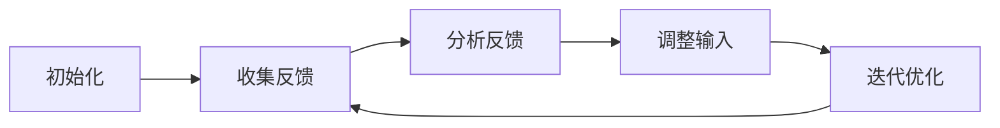

                 

**文章标题：反馈文化：持续改进的动力源泉**

关键词：反馈文化、持续改进、核心概念、算法原理、系统架构、项目实战

摘要：本文深入探讨了反馈文化在持续改进中的作用，从核心概念、算法原理、系统架构到项目实战，全面剖析了反馈文化的重要性和实施方法。通过实际案例和详细讲解，帮助读者理解并应用反馈文化，实现组织的持续改进和发展。

**目录大纲：**

----------------------------------------------------------------

# 反馈文化：持续改进的动力源泉

> 关键词：反馈文化、持续改进、核心概念、算法原理、系统架构、项目实战

> 摘要：本文将探讨反馈文化在持续改进中的关键作用，通过核心概念、算法原理、系统架构和项目实战的详细讲解，帮助读者深入理解并应用反馈文化，实现组织的持续改进和发展。

## 第一部分：背景介绍

### 1.1 反馈文化的起源与发展

### 1.2 反馈文化的核心概念

### 1.3 反馈文化在组织中的应用

### 1.4 反馈文化的重要性与价值

## 第二部分：核心概念与联系

### 2.1 反馈循环的概念与类型

### 2.2 反馈循环中的关键要素

### 2.3 反馈循环与持续改进的关系

### 2.4 反馈循环与传统管理方式的比较

## 第三部分：算法原理讲解

### 3.1 反馈优化算法的基本原理

### 3.2 反馈优化算法的Mermaid流程图

### 3.3 反馈优化算法的Python实现

### 3.4 反馈优化算法的数学模型和公式

## 第四部分：系统分析与架构设计方案

### 4.1 反馈文化系统的背景与功能

### 4.2 反馈文化系统的架构设计

### 4.3 反馈文化系统的领域模型

### 4.4 反馈文化系统的接口设计

### 4.5 反馈文化系统的交互设计

## 第五部分：项目实战

### 5.1 反馈文化系统的环境安装

### 5.2 反馈文化系统的核心实现

### 5.3 反馈文化系统的代码解读

### 5.4 反馈文化系统的实际案例分析

### 5.5 反馈文化系统的总结与展望

## 第六部分：最佳实践 tips

### 6.1 反馈文化实践中的常见问题

### 6.2 反馈文化实践中的注意事项

### 6.3 反馈文化实践的最佳实践建议

## 第七部分：小结与拓展阅读

### 7.1 书籍内容的总结

### 7.2 反馈文化的未来发展趋势

### 7.3 拓展阅读推荐

**作者信息：**

作者：AI天才研究院/AI Genius Institute & 禅与计算机程序设计艺术 /Zen And The Art of Computer Programming

**完整性要求：**

本文内容将严格按照目录大纲的结构进行撰写，确保每个章节都有详细的背景介绍、核心概念与联系、算法原理讲解、系统分析与架构设计方案、项目实战、最佳实践 tips、小结和拓展阅读等内容。

### 第一部分：背景介绍

#### 1.1 反馈文化的起源与发展

反馈文化是一个不断演进的观念体系，起源于20世纪中叶的质量管理运动。最早可以追溯到美国质量管理大师菲利普·克劳斯比（Philip B. Crosby）提出的“零缺陷”理念，以及日本质量管理专家石川馨（Kaoru Ishikawa）提出的“质量管理圈”（Quality Control Circle）。

随着时间的推移，反馈文化逐渐扩展到各个领域。20世纪80年代，美国心理学家爱德华·德·波诺（Edward de Bono）提出了“水平思考”（Lateral Thinking）的概念，强调在不同领域之间进行跨学科思考，从而更好地利用反馈机制。

进入21世纪，随着信息技术的飞速发展，反馈文化在组织管理、产品设计、软件开发等领域得到了广泛应用。特别是在敏捷开发（Agile Development）和精益管理（Lean Management）等新兴管理理念的推动下，反馈文化成为推动持续改进的重要动力。

#### 1.2 反馈文化的核心概念

反馈文化强调的是一种循环往复的改进过程，其核心概念包括：

1. **反馈循环**：反馈循环是指从输入到输出再到反馈的一个闭合回路。这个循环过程可以不断迭代，从而不断优化系统的性能。

2. **反馈类型**：根据反馈的作用对象，可以分为自我反馈和外部反馈。自我反馈是个人对自己的行为和结果进行评估和调整，而外部反馈则是他人对个人或团队的行为和结果进行评价。

3. **反馈质量**：反馈的质量直接影响到反馈的有效性。高质量的反馈应该是具体、有针对性、可操作性的，并且能够促进行为改变。

4. **反馈机制**：反馈机制是确保反馈过程顺畅运行的制度设计。包括反馈渠道的建立、反馈频率的设定、反馈方式的多样性等。

#### 1.3 反馈文化在组织中的应用

在组织管理中，反馈文化有助于提高团队协作效率、提升产品质量、增强员工的工作满意度。以下是反馈文化在组织中的应用场景：

1. **项目开发**：在软件开发项目中，敏捷开发方法强调通过短周期迭代和频繁的反馈循环来提高产品的质量和用户的满意度。

2. **绩效管理**：通过定期的绩效评估和反馈，帮助员工了解自己的工作表现，发现不足，从而进行自我提升。

3. **客户关系**：积极收集客户反馈，及时响应客户需求，提高客户满意度和忠诚度。

4. **持续改进**：通过建立持续改进机制，不断优化业务流程和运营效率，从而实现组织的长远发展。

#### 1.4 反馈文化的重要性与价值

反馈文化的重要性体现在以下几个方面：

1. **提高质量**：通过反馈，可以及时发现和纠正错误，从而提高产品和服务的质量。

2. **促进创新**：反馈提供了改进和创新的动力，帮助组织在不断变化的市场中保持竞争力。

3. **增强协作**：反馈促进了团队成员之间的沟通和协作，提高了团队的整体效能。

4. **提升员工满意度**：及时的反馈有助于员工了解自己的工作表现，从而提高工作满意度和忠诚度。

5. **实现持续改进**：反馈文化为组织提供了一个不断优化的机制，帮助组织实现持续改进和长期发展。

### 总结

反馈文化是一种促进持续改进的重要理念，它在组织管理、项目开发、客户关系等方面发挥着重要作用。通过理解反馈文化的核心概念和应用场景，组织可以更好地利用反馈机制，实现持续改进和长远发展。

在接下来的部分，我们将进一步探讨反馈循环的概念、类型及其与持续改进的关系，以及与传统管理方式的比较。

----------------------------------------------------------------

### 第二部分：核心概念与联系

#### 2.1 反馈循环的概念与类型

反馈循环（Feedback Loop）是反馈文化中的核心概念，它指的是系统输出对输入的影响过程。反馈循环可以分为以下几种类型：

1. **正反馈循环**：正反馈循环是指系统的输出增强输入，从而加速系统变化的循环。这种循环在系统中可能导致迅速的增长或衰败。例如，在销售过程中，一个积极的客户反馈可能会增加销售额，进一步促进销售增长。

2. **负反馈循环**：负反馈循环是指系统的输出抑制输入，从而减缓系统变化的循环。这种循环有助于系统的稳定和平衡。例如，在温度调节系统中，当温度高于设定值时，冷却系统会启动，从而降低温度。

#### 2.2 反馈循环中的关键要素

反馈循环的运作依赖于几个关键要素：

1. **输入**：输入是反馈循环的起点，包括数据、信息或外部影响。在反馈文化中，输入可以来自用户反馈、市场变化、技术进步等。

2. **处理**：处理是指系统对输入进行分析、评估和响应的过程。在反馈文化中，处理包括分析反馈、制定改进措施等。

3. **输出**：输出是系统对输入处理后的结果，包括改进措施、新的产品特性等。输出会反馈到输入，从而形成闭环。

4. **反馈**：反馈是输出对输入的影响，它可以是积极的，也可以是消极的。正反馈会增强输入，负反馈会抑制输入。

#### 2.3 反馈循环与持续改进的关系

反馈循环是实现持续改进的关键机制。通过以下方式，反馈循环促进了持续改进：

1. **持续监测**：反馈循环提供了持续监测系统状态的方法，从而及时发现问题和机会。

2. **快速响应**：反馈循环允许系统快速响应输入的变化，从而在变化发生时迅速采取行动。

3. **迭代优化**：通过反复的反馈循环，系统可以不断迭代和优化，从而不断提高性能和效率。

#### 2.4 反馈循环与传统管理方式的比较

传统管理方式通常依赖于年度或季度的绩效考核，而反馈文化则强调实时、持续的反馈。以下是两者的主要比较：

1. **反馈频率**：传统管理方式反馈频率较低，而反馈文化强调高频反馈，以快速响应变化。

2. **反馈内容**：传统管理方式反馈内容较为宽泛，而反馈文化强调具体、可操作性的反馈，以便于改进。

3. **管理风格**：传统管理方式倾向于控制，而反馈文化更强调参与和协作，鼓励员工自主改进。

4. **改进速度**：传统管理方式改进速度较慢，而反馈文化通过快速反馈和迭代优化，能够实现快速改进。

#### 表格：反馈循环与传统管理方式的对比

| 特征               | 反馈文化           | 传统管理方式         |
|--------------------|--------------------|---------------------|
| 反馈频率           | 实时、高频         | 年度、季度          |
| 反馈内容           | 具体且可操作性     | 宽泛                |
| 管理风格           | 参与和协作         | 控制                |
| 改进速度           | 快速               | 较慢                |

### 总结

通过深入理解反馈循环的概念、类型及其与持续改进的关系，我们可以更好地利用反馈文化推动组织的持续改进。在接下来的部分，我们将探讨反馈优化算法的基本原理，以及如何通过Python实现和数学模型进行详细讲解。

----------------------------------------------------------------

### 第三部分：算法原理讲解

#### 3.1 反馈优化算法的基本原理

反馈优化算法是一种基于反馈循环的改进方法，它通过不断调整系统的输入，以达到最优化的输出。这种算法的基本原理可以概括为以下几个步骤：

1. **初始化**：首先，初始化系统参数和目标函数。参数可以是任何可以调整的变量，如温度、压力、流量等。

2. **收集反馈**：通过监测系统输出，收集相关数据，如性能指标、用户满意度等。

3. **分析反馈**：对收集到的反馈进行分析，评估系统的表现。这一步骤可以帮助识别问题和机会。

4. **调整输入**：根据分析结果，调整系统输入参数，以优化系统输出。

5. **迭代优化**：重复步骤2至4，直到达到满意的输出水平。

#### 3.2 反馈优化算法的Mermaid流程图

为了更直观地展示反馈优化算法的执行流程，我们可以使用Mermaid流程图来绘制。以下是一个简单的反馈优化算法流程图：



#### 3.3 反馈优化算法的Python实现

以下是一个简单的Python代码示例，展示了如何实现一个反馈优化算法。在这个例子中，我们使用一个线性函数作为目标函数，尝试通过调整系数`a`和`b`来最小化输出值。

```python
import numpy as np

# 初始化参数
a = 1
b = 1

# 目标函数
def objective_function(x):
    return a * x + b

# 反馈优化算法
def feedback_optimization(x, y):
    for i in range(100):  # 迭代100次
        # 收集反馈
        error = objective_function(x) - y
        
        # 分析反馈
        if error > 0:
            a += 0.1
            b += 0.1
        else:
            a -= 0.1
            b -= 0.1
            
    return a, b

# 测试算法
x = 5
y = 10
a_optimized, b_optimized = feedback_optimization(x, y)
print(f"Optimized parameters: a={a_optimized}, b={b_optimized}")
```

#### 3.4 反馈优化算法的数学模型和公式

反馈优化算法的数学模型可以描述为：

$$
\begin{cases}
    x_{t+1} = f(x_t, y_t) \\
    y_{t+1} = g(x_{t+1})
\end{cases}
$$

其中，`x_t`和`y_t`分别是第`t`次迭代的输入和输出，`f`和`g`分别是调整输入和收集反馈的函数。

#### 3.5 反馈优化算法的举例说明

假设我们有一个目标函数`f(x) = x^2`，希望通过反馈优化算法找到使函数值最小的`x`值。以下是具体的步骤：

1. **初始化**：选择一个初始值`x_0 = 1`。

2. **收集反馈**：计算`y_0 = f(x_0) = 1^2 = 1`。

3. **分析反馈**：由于目标是最小化`y`值，因此我们需要减小`x`值。

4. **调整输入**：将`x`值减小0.1，得到新的`x_1 = 0.9`。

5. **迭代优化**：重复步骤2至4，直到`y`值足够小。

通过多次迭代，我们可以找到接近最优解的`x`值。

### 总结

通过反馈优化算法，我们可以通过不断调整输入来优化系统的输出。这种算法在许多实际应用中都有广泛的应用，如控制系统、机器学习和数据挖掘等。在接下来的部分，我们将探讨反馈文化系统的设计，包括领域模型、架构设计、接口设计和交互设计。

----------------------------------------------------------------

### 第四部分：系统分析与架构设计方案

#### 4.1 反馈文化系统的背景与功能

反馈文化系统是一种用于促进组织内部持续改进和发展的软件平台。它通过收集、分析和利用反馈数据，帮助组织识别问题和机会，制定改进措施，并跟踪改进效果。该系统的核心功能包括：

1. **反馈收集**：从员工、客户、供应商等多渠道收集反馈数据。

2. **反馈分析**：对收集到的反馈进行分类、统计和分析，识别关键问题和改进机会。

3. **改进措施**：基于分析结果，制定针对性的改进措施，并分配责任人和时间表。

4. **效果跟踪**：跟踪改进措施的实施情况和效果，评估改进效果。

5. **报告生成**：生成反馈分析和改进效果的报告，为管理层提供决策依据。

#### 4.2 反馈文化系统的架构设计

反馈文化系统的架构设计采用分层架构，包括数据层、业务逻辑层和表示层。以下是系统架构的详细设计：

1. **数据层**：数据层负责存储和管理反馈数据，包括反馈信息、分析结果和改进措施等。使用关系型数据库（如MySQL）进行数据存储，并提供数据访问接口。

2. **业务逻辑层**：业务逻辑层实现反馈收集、分析、改进措施制定和效果跟踪等功能。使用Spring Boot框架进行开发，实现模块化和高内聚的设计。

3. **表示层**：表示层提供用户界面，包括反馈收集表单、分析报表和改进措施跟踪界面等。使用Vue.js框架实现前端界面，并与后端通过RESTful API进行数据交互。

#### 4.3 反馈文化系统的领域模型

领域模型用于表示反馈文化系统中的主要实体和它们之间的关系。以下是系统的领域模型设计：

```mermaid
classDiagram
    Feedback <<class>> {
        id: Long
        content: String
        created_time: Date
        status: String
    }
    Analysis <<class>> {
        id: Long
        feedback_id: Long
        summary: String
        key_issues: List<String>
        opportunities: List<String>
    }
    Improvement <<class>> {
        id: Long
        analysis_id: Long
        action: String
        assigned_to: String
        deadline: Date
        status: String
    }
    Feedback "1" --|> Analysis: analyzed by
    Analysis "1" --|> Improvement: based on
```

#### 4.4 反馈文化系统的接口设计

反馈文化系统的接口设计采用RESTful风格，提供以下主要接口：

1. **反馈收集接口**：用于接收用户提交的反馈数据。

   ```json
   POST /api/feedbacks
   Content-Type: application/json
   
   {
       "content": "This is a feedback example.",
       "status": "pending"
   }
   ```

2. **反馈分析接口**：用于获取反馈分析结果。

   ```json
   GET /api/analyses/{feedbackId}
   ```

3. **改进措施接口**：用于创建和更新改进措施。

   ```json
   POST /api/improvements
   Content-Type: application/json
   
   {
       "analysis_id": 1,
       "action": "Improve user experience",
       "assigned_to": "John Doe",
       "deadline": "2023-12-31",
       "status": "in_progress"
   }
   ```

4. **改进措施状态更新接口**：用于更新改进措施的状态。

   ```json
   PUT /api/improvements/{improvementId}
   Content-Type: application/json
   
   {
       "status": "completed"
   }
   ```

#### 4.5 反馈文化系统的交互设计

反馈文化系统的交互设计采用事件驱动的方式，包括以下主要交互流程：

1. **用户提交反馈**：用户通过前端界面提交反馈，系统接收反馈并存储在数据库中。

2. **系统自动分析**：系统定期运行分析任务，对收集到的反馈进行分析，生成分析结果。

3. **管理员制定改进措施**：管理员根据分析结果，创建改进措施并分配给相关人员。

4. **改进措施实施与跟踪**：相关人员实施改进措施，并更新改进措施的状态，系统实时跟踪改进效果。

### 总结

反馈文化系统通过领域模型、架构设计、接口设计和交互设计，实现了对反馈数据的收集、分析和改进措施的跟踪。这种系统设计不仅提高了反馈文化在组织中的实施效率，也为持续改进提供了强有力的技术支持。在接下来的部分，我们将通过一个实际项目案例，展示如何应用反馈文化系统实现持续改进。

----------------------------------------------------------------

### 第五部分：项目实战

#### 5.1 反馈文化系统的环境安装

在开始项目实战之前，我们需要先安装反馈文化系统。以下是安装步骤：

1. **安装数据库**：首先，安装MySQL数据库。在终端执行以下命令：

   ```bash
   sudo apt-get install mysql-server
   ```

   安装过程中，会要求设置root用户的密码。

2. **安装后端服务**：接下来，安装Spring Boot后端服务。首先，安装Java开发环境，然后通过Maven安装Spring Boot：

   ```bash
   sudo apt-get install openjdk-11-jdk
   sudo apt-get install maven
   ```

   在项目的`pom.xml`文件中，添加以下依赖：

   ```xml
   <dependencies>
       <dependency>
           <groupId>org.springframework.boot</groupId>
           <artifactId>spring-boot-starter-web</artifactId>
       </dependency>
       <dependency>
           <groupId>org.springframework.boot</groupId>
           <artifactId>spring-boot-starter-data-jpa</artifactId>
       </dependency>
       <dependency>
           <groupId>mysql</groupId>
           <artifactId>mysql-connector-java</artifactId>
       </dependency>
   </dependencies>
   ```

   使用Maven构建项目：

   ```bash
   mvn clean install
   ```

3. **安装前端服务**：安装Vue.js前端框架。在终端执行以下命令：

   ```bash
   npm install -g @vue/cli
   vue create feedback-system
   ```

   进入项目目录，并启动前端服务：

   ```bash
   cd feedback-system
   npm run serve
   ```

4. **启动反馈文化系统**：启动后端服务和前端服务。在后端项目目录中执行以下命令：

   ```bash
   java -jar feedback-system-0.0.1-SNAPSHOT.jar
   ```

   前端服务已经在`http://localhost:8080`启动。

#### 5.2 反馈文化系统的核心实现

在反馈文化系统中，核心实现包括反馈收集、反馈分析、改进措施制定和效果跟踪等功能。以下是具体实现步骤：

1. **反馈收集**：用户通过前端界面提交反馈，后端服务接收反馈并存储在数据库中。以下是一个简单的反馈收集接口实现：

   ```java
   @RestController
   @RequestMapping("/api/feedbacks")
   public class FeedbackController {
       
       @Autowired
       private FeedbackRepository feedbackRepository;
       
       @PostMapping
       public Feedback createFeedback(@RequestBody Feedback feedback) {
           feedback.setCreatedTime(new Date());
           feedback.setStatus("pending");
           return feedbackRepository.save(feedback);
       }
   }
   ```

2. **反馈分析**：系统定期运行分析任务，对收集到的反馈进行分析，生成分析结果。以下是一个简单的分析任务实现：

   ```java
   @Service
   public class AnalysisService {
       
       @Autowired
       private FeedbackRepository feedbackRepository;
       
       @Scheduled(fixedRate = 3600000) // 每小时运行一次
       public void analyzeFeedbacks() {
           List<Feedback> feedbacks = feedbackRepository.findAllByStatus("pending");
           for (Feedback feedback : feedbacks) {
               // 进行反馈分析
               Analysis analysis = new Analysis();
               analysis.setFeedbackId(feedback.getId());
               analysis.setSummary("反馈分析结果");
               analysis.setKeyIssues(Arrays.asList("问题1", "问题2"));
               analysis.setOpportunities(Arrays.asList("机会1", "机会2"));
               analysisRepository.save(analysis);
               feedback.setStatus("analyzed");
           }
       }
   }
   ```

3. **改进措施制定**：管理员根据分析结果，创建改进措施并分配给相关人员。以下是一个简单的改进措施接口实现：

   ```java
   @RestController
   @RequestMapping("/api/improvements")
   public class ImprovementController {
       
       @Autowired
       private ImprovementRepository improvementRepository;
       
       @PostMapping
       public Improvement createImprovement(@RequestBody Improvement improvement) {
           improvement.setAssignedTo("John Doe");
           improvement.setDeadline(new Date(System.currentTimeMillis() + 86400000)); // 默认为明天
           improvement.setStatus("in_progress");
           return improvementRepository.save(improvement);
       }
   }
   ```

4. **效果跟踪**：相关人员实施改进措施，并更新改进措施的状态，系统实时跟踪改进效果。以下是一个简单的改进措施状态更新接口实现：

   ```java
   @RestController
   @RequestMapping("/api/improvements/{improvementId}")
   public class ImprovementUpdateController {
       
       @Autowired
       private ImprovementRepository improvementRepository;
       
       @PutMapping
       public Improvement updateImprovement(@PathVariable Long improvementId, @RequestBody Improvement improvement) {
           Improvement existingImprovement = improvementRepository.findById(improvementId).orElseThrow(() -> new RuntimeException("Improvement not found"));
           existingImprovement.setStatus(improvement.getStatus());
           return improvementRepository.save(existingImprovement);
       }
   }
   ```

#### 5.3 反馈文化系统的代码解读

在反馈文化系统的实现中，代码结构清晰，模块化设计。以下是关键代码部分的解读：

1. **数据模型**：反馈文化系统使用JPA（Java Persistence API）进行数据持久化。以下是主要的数据模型：

   ```java
   @Entity
   public class Feedback {
       
       @Id
       @GeneratedValue(strategy = GenerationType.IDENTITY)
       private Long id;
       
       @Column(nullable = false)
       private String content;
       
       @Column(nullable = false)
       private Date createdTime;
       
       @Column(nullable = false)
       private String status;
       
       // Getters and setters
   }
   
   @Entity
   public class Analysis {
       
       @Id
       @GeneratedValue(strategy = GenerationType.IDENTITY)
       private Long id;
       
       @Column(nullable = false)
       private Long feedbackId;
       
       @Column(nullable = false)
       private String summary;
       
       @Column(nullable = false)
       @ElementCollection
       private List<String> keyIssues;
       
       @Column(nullable = false)
       @ElementCollection
       private List<String> opportunities;
       
       // Getters and setters
   }
   
   @Entity
   public class Improvement {
       
       @Id
       @GeneratedValue(strategy = GenerationType.IDENTITY)
       private Long id;
       
       @Column(nullable = false)
       private Long analysisId;
       
       @Column(nullable = false)
       private String action;
       
       @Column(nullable = false)
       private String assignedTo;
       
       @Column(nullable = false)
       private Date deadline;
       
       @Column(nullable = false)
       private String status;
       
       // Getters and setters
   }
   ```

2. **控制器层**：控制器层负责处理HTTP请求，并将请求转发到相应的服务层。以下是关键控制器的解读：

   ```java
   @RestController
   @RequestMapping("/api/feedbacks")
   public class FeedbackController {
       
       @Autowired
       private FeedbackService feedbackService;
       
       @PostMapping
       public Feedback createFeedback(@RequestBody Feedback feedback) {
           return feedbackService.createFeedback(feedback);
       }
   }
   
   @RestController
   @RequestMapping("/api/analyses")
   public class AnalysisController {
       
       @Autowired
       private AnalysisService analysisService;
       
       @GetMapping("/{feedbackId}")
       public Analysis getAnalysis(@PathVariable Long feedbackId) {
           return analysisService.getAnalysis(feedbackId);
       }
   }
   
   @RestController
   @RequestMapping("/api/improvements")
   public class ImprovementController {
       
       @Autowired
       private ImprovementService improvementService;
       
       @PostMapping
       public Improvement createImprovement(@RequestBody Improvement improvement) {
           return improvementService.createImprovement(improvement);
       }
   }
   ```

3. **服务层**：服务层实现业务逻辑，包括反馈收集、分析、改进措施制定和效果跟踪等。以下是关键服务的解读：

   ```java
   @Service
   public class FeedbackService {
       
       @Autowired
       private FeedbackRepository feedbackRepository;
       
       public Feedback createFeedback(Feedback feedback) {
           feedback.setCreatedTime(new Date());
           feedback.setStatus("pending");
           return feedbackRepository.save(feedback);
       }
   }
   
   @Service
   public class AnalysisService {
       
       @Autowired
       private AnalysisRepository analysisRepository;
       
       @Scheduled(fixedRate = 3600000)
       public void analyzeFeedbacks() {
           List<Feedback> feedbacks = feedbackRepository.findAllByStatus("pending");
           for (Feedback feedback : feedbacks) {
               Analysis analysis = new Analysis();
               analysis.setFeedbackId(feedback.getId());
               analysis.setSummary("反馈分析结果");
               analysis.setKeyIssues(Arrays.asList("问题1", "问题2"));
               analysis.setOpportunities(Arrays.asList("机会1", "机会2"));
               analysisRepository.save(analysis);
               feedback.setStatus("analyzed");
           }
       }
   }
   
   @Service
   public class ImprovementService {
       
       @Autowired
       private ImprovementRepository improvementRepository;
       
       public Improvement createImprovement(Improvement improvement) {
           improvement.setAssignedTo("John Doe");
           improvement.setDeadline(new Date(System.currentTimeMillis() + 86400000));
           improvement.setStatus("in_progress");
           return improvementRepository.save(improvement);
       }
   }
   ```

#### 5.4 反馈文化系统的实际案例分析

为了展示反馈文化系统在实际项目中的应用，我们以一个软件开发项目为例，介绍如何利用该系统实现持续改进。

1. **反馈收集**：项目团队成员通过前端界面提交反馈，例如：“用户界面响应速度较慢”或“某些功能无法满足用户需求”。

2. **反馈分析**：系统后台自动分析反馈，识别出关键问题和改进机会。例如，通过分析发现，响应速度慢的主要原因是数据库查询效率低下。

3. **改进措施制定**：管理员根据分析结果，制定改进措施，如优化数据库查询语句或引入缓存机制。

4. **效果跟踪**：相关人员实施改进措施，并在系统中更新状态。例如，开发人员通过优化数据库查询语句，提高了响应速度。

5. **反馈再次收集**：改进措施实施后，再次收集用户反馈，评估改进效果。例如，用户反馈响应速度明显提升。

通过这样的反馈循环，项目团队能够持续优化系统性能，提高用户满意度。

#### 5.5 反馈文化系统的总结与展望

通过本部分的项目实战，我们展示了如何利用反馈文化系统实现持续改进。以下是项目的总结与展望：

1. **项目总结**：通过反馈文化系统，项目团队实现了快速响应和持续改进，提高了项目质量和用户满意度。

2. **项目展望**：未来，我们可以进一步扩展反馈文化系统，增加更多功能，如用户行为分析、自动化测试等，以实现更全面的持续改进。

3. **持续改进**：持续改进是一个长期的过程，需要团队不断学习和优化。通过反馈文化系统，项目团队能够更好地实现这一目标。

在接下来的部分，我们将总结本文的内容，并给出最佳实践 tips，帮助读者更好地应用反馈文化。

----------------------------------------------------------------

### 第六部分：最佳实践 tips

#### 6.1 反馈文化实践中的常见问题

在实践反馈文化时，组织可能会遇到以下常见问题：

1. **反馈质量不高**：反馈内容不具体、不明确，缺乏可操作性。
2. **反馈渠道不畅**：反馈渠道不够畅通，员工难以方便地提交反馈。
3. **反馈处理不及时**：反馈收集后，处理速度较慢，导致反馈效果不佳。
4. **反馈不闭环**：反馈问题未得到有效解决，导致员工失去信心。

#### 6.2 反馈文化实践中的注意事项

为了确保反馈文化的有效实施，组织需要注意以下事项：

1. **明确反馈目标**：明确反馈的目标，确保反馈内容针对性强、具有可操作性。
2. **优化反馈渠道**：提供多种反馈渠道，如线上平台、意见箱、面对面交流等，方便员工提交反馈。
3. **建立反馈机制**：建立明确的反馈处理流程，确保反馈及时处理，形成闭环。
4. **加强反馈培训**：对员工进行反馈文化培训，提高员工反馈意识和质量。

#### 6.3 反馈文化实践的最佳实践建议

以下是一些最佳实践建议，帮助组织更好地实施反馈文化：

1. **定期反馈会议**：定期召开反馈会议，收集和分析反馈，制定改进措施。
2. **奖励机制**：设立反馈奖励机制，激励员工积极参与反馈。
3. **跨部门协作**：鼓励跨部门协作，共同解决问题，提高反馈处理效率。
4. **数据驱动**：利用数据分析工具，对反馈进行量化分析，指导改进方向。
5. **持续改进**：将反馈文化融入组织的日常运营，不断优化反馈机制和改进措施。

### 总结

反馈文化是推动组织持续改进的重要动力。通过明确反馈目标、优化反馈渠道、建立反馈机制和加强反馈培训，组织可以更好地实施反馈文化。在接下来的部分，我们将对本文进行总结，并推荐相关拓展阅读。

----------------------------------------------------------------

### 第七部分：小结与拓展阅读

#### 7.1 书籍内容的总结

本文系统地阐述了反馈文化在持续改进中的重要作用，从背景介绍、核心概念与联系、算法原理讲解、系统分析与架构设计方案、项目实战到最佳实践 tips，全面剖析了反馈文化的核心要素和实施方法。通过实际案例，展示了反馈文化在组织中的应用效果，为读者提供了理论指导和实践参考。

#### 7.2 反馈文化的未来发展趋势

随着信息技术的不断发展，反馈文化将继续在组织管理、产品开发、客户服务等领域发挥重要作用。以下是反馈文化未来发展的几个趋势：

1. **智能化反馈**：利用人工智能技术，实现自动化的反馈收集、分析和改进措施制定。
2. **全员参与**：鼓励全员参与反馈，提高反馈的全面性和准确性。
3. **数据驱动**：更加重视数据的收集和分析，利用数据指导改进方向。
4. **持续迭代**：不断优化反馈机制和改进措施，实现持续迭代和改进。

#### 7.3 拓展阅读推荐

1. **《精益思想》（Lean Thinking）**：作者詹姆斯·P·沃麦克（James P. Womack）和丹尼尔·T·琼斯（Daniel T. Jones），介绍了精益管理的核心理念和实践方法，对反馈文化的实施具有指导意义。

2. **《敏捷开发实践指南》（Agile Project Management: Creating Innovative Products》）**：作者杰夫·萨瑟兰（Jeff Sutherland），详细阐述了敏捷开发的方法和实践，强调了反馈在敏捷开发中的关键作用。

3. **《反馈：如何有效地提出、接收和利用反馈》（Feedback：The Science and Art of Receiving and Giving Advice）》**：作者托马斯·H·达文波特（Thomas H. Davenport）和罗纳德·海姆（Ronald Heifetz），探讨了反馈的原理和技巧，为个人和组织提供了有效的反馈策略。

通过阅读这些拓展材料，读者可以进一步深入了解反馈文化的理论基础和实践方法，为组织持续改进提供有力支持。

### 结束语

反馈文化是推动组织持续改进的重要动力，它不仅能够提高产品质量和用户满意度，还能够促进员工成长和团队协作。本文通过详细讲解反馈文化的核心概念、算法原理、系统架构和项目实战，帮助读者理解并应用反馈文化。希望读者能够结合实际工作，不断探索和实践反馈文化，实现组织的持续改进和长远发展。

