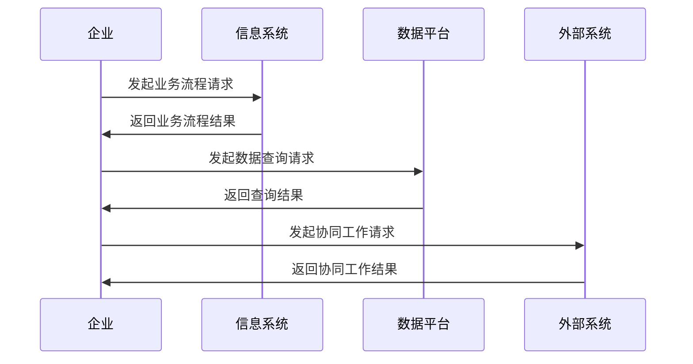

                 


### 变革管理模型：引导组织平稳度过转型期

#### 关键词：变革管理、组织转型、平稳过渡、领导力、团队协作、变革策略

> 摘要：本文将探讨变革管理模型在组织转型中的应用，从背景介绍、核心概念与联系、变革管理模型原理讲解、系统分析与架构设计、项目实战等多个角度，详细阐述如何引导组织平稳度过转型期，实现持续发展和保持竞争力。

#### 第一部分：背景介绍

##### 第1章：变革管理模型概述

##### 1.1 问题背景

变革管理，顾名思义，是指组织为了应对外部环境的变化，对内部结构、流程、文化等方面进行的一系列调整。在当前这个快速变革的时代，变革管理已成为组织持续发展和保持竞争力的关键。然而，变革并非一帆风顺，过程中会遇到诸多挑战，如员工抵触情绪、资源不足、沟通不畅等。如何有效应对这些挑战，实现组织平稳过渡，是变革管理需要解决的问题。

##### 1.2 问题描述

变革过程中的挑战主要包括以下几个方面：

1. **员工抵触情绪**：员工对变革可能存在疑虑、恐惧或抵触，导致变革推进受阻。
2. **资源不足**：变革需要人力、财力、物力等资源的支持，资源不足可能导致变革效果不佳。
3. **沟通不畅**：变革过程中各方信息传递不畅，可能导致误解、矛盾和冲突。

##### 1.3 问题解决

为解决上述问题，变革管理应遵循以下原则：

1. **尊重员工**：尊重员工的意见和需求，增强员工的参与感和归属感。
2. **沟通透明**：保持信息透明，让员工了解变革的背景、目的、进展和预期效果。
3. **目标明确**：明确变革的目标和预期成果，确保变革方向一致。
4. **持续改进**：在变革过程中不断总结经验，优化变革策略。

针对不同组织的特点和变革目标，可以选择适合的管理模型。常见的变革管理模型包括：

1. **Lewin变革模型**：包括解冻、变革、再冻结三个阶段，强调变革的阶段性推进。
2. **Kotter变革模型**：包括建立领导联盟、创造紧迫感、形成愿景和战略、授权团队参与、实现短期目标、巩固变革成果和使变革成为组织文化的一部分七个步骤。
3. **ADKAR模型**：包括改变意识、重新选择、参与度、知识和技能、责任感五个步骤，强调员工的参与和意识的改变。

##### 1.4 边界与外延

变革管理适用于各类组织，包括企业、政府机构、非营利组织等。具体领域包括组织结构变革、流程优化、文化重塑等。变革管理模型的核心概念包括变革的驱动力、变革的目标、变革的执行过程等。核心要素包括领导力、团队协作、变革策略等。

##### 1.5 概念结构与核心要素组成

变革管理模型的核心概念和要素如下表所示：

| 概念         | 定义                                                         | 特点                                                         | 相互关系                                                     |
| ------------ | ------------------------------------------------------------ | ------------------------------------------------------------ | ------------------------------------------------------------ |
| 领导力       | 领导者引导和激励组织成员实现变革的能力                       | 影响力、前瞻性、沟通能力等                                   | 领导力是变革管理模型的核心要素之一，对团队协作和变革策略有直接影响。 |
| 团队协作     | 团队成员共同为实现变革目标而协同工作的过程                   | 提高变革效率、减少冲突、增强组织凝聚力                       | 团队协作是变革管理模型的核心要素之一，直接影响变革策略的有效性。 |
| 变革策略     | 组织在变革过程中采取的具体行动方案                           | 渐进式变革、激进式变革、综合变革等                           | 变革策略是实施变革的具体手段，依赖于领导力和团队协作的有效支持。 |

#### 第二部分：核心概念与联系

##### 第2章：变革管理核心概念

##### 2.1 领导力

领导力是变革管理模型的核心要素之一。领导者需要具备以下特点：

1. **影响力**：领导者能够通过自己的言行影响和激励团队成员。
2. **前瞻性**：领导者应具备远见，能够预见变革的挑战和机遇。
3. **沟通能力**：领导者应具备良好的沟通技巧，确保信息传递的准确性和及时性。

领导力对变革管理的影响主要体现在以下几个方面：

1. **确立变革方向**：领导者需要明确变革的目标和愿景，为团队成员提供清晰的方向。
2. **推动变革进程**：领导者需要积极推动变革的进程，解决变革过程中的困难和障碍。
3. **激发团队潜力**：领导者需要激发团队成员的潜力，提高团队的整体执行力。

##### 2.2 团队协作

团队协作是变革管理模型的核心要素之一。团队成员需要共同为实现变革目标而协同工作。团队协作的重要性体现在以下几个方面：

1. **提高变革效率**：通过团队成员的协作，可以快速解决变革过程中的问题，提高变革效率。
2. **减少冲突**：团队成员之间的协作可以减少因意见分歧而产生的冲突。
3. **增强组织凝聚力**：团队协作可以增强组织成员之间的凝聚力，提高组织的整体执行力。

##### 2.3 变革策略

变革策略是组织在变革过程中采取的具体行动方案。变革策略的类型包括：

1. **渐进式变革**：通过逐步调整和优化，实现变革的目标。
2. **激进式变革**：在短时间内实现大幅度的变革。
3. **综合变革**：结合渐进式变革和激进式变革的优点，实现高效变革。

选择合适的变革策略需要考虑以下因素：

1. **组织现状**：根据组织的实际情况选择适合的变革策略。
2. **变革目标**：明确变革的目标和预期成果，为选择变革策略提供依据。
3. **员工接受度**：考虑员工的接受程度，选择合适的变革策略。

##### 2.4 概念属性特征对比表格

| 概念         | 定义                                                         | 特点                                                         | 相互关系                                                     |
| ------------ | ------------------------------------------------------------ | ------------------------------------------------------------ | ------------------------------------------------------------ |
| 领导力       | 领导者引导和激励组织成员实现变革的能力                       | 影响力、前瞻性、沟通能力等                                   | 领导力是变革管理模型的核心要素之一，对团队协作和变革策略有直接影响。 |
| 团队协作     | 团队成员共同为实现变革目标而协同工作的过程                   | 提高变革效率、减少冲突、增强组织凝聚力                       | 团队协作是变革管理模型的核心要素之一，直接影响变革策略的有效性。 |
| 变革策略     | 组织在变革过程中采取的具体行动方案                           | 渐进式变革、激进式变革、综合变革等                           | 变革策略是实施变革的具体手段，依赖于领导力和团队协作的有效支持。 |

##### 2.5 ER实体关系图架构

```mermaid
erDiagram
    A Participants ||--|{ B Projects }||>
    B Projects ||--|{ C Activities }||>
    A Participants ||--|{ D Resources }||>
```

#### 第三部分：变革管理模型原理讲解

##### 第3章：变革管理模型原理讲解

##### 3.1 变革管理模型的原理概述

变革管理模型是基于系统动力学原理和复杂性科学理论，通过分析组织变革的内在规律和外部影响，设计出的一种指导组织变革的管理框架。其主要原理包括：

- **系统动力学原理**：强调组织作为一个系统，其内部各个部分相互影响、相互作用，通过反馈机制实现自我调节和演化。
- **复杂性科学理论**：认识到组织变革过程中存在的不确定性和复杂性，通过模拟和实验寻找最佳的变革策略。

##### 3.2 变革管理模型的核心原理

变革管理模型的核心原理主要包括以下几个方面：

1. **变革的驱动力**：包括外部环境变化、内部需求变化等。了解变革的驱动力有助于明确变革的目标和方向。
2. **变革的目标**：包括提高组织竞争力、优化内部流程、提升员工满意度等。明确变革的目标有助于制定合理的变革策略。
3. **变革的执行过程**：包括解冻、变革、再冻结三个阶段。了解变革的执行过程有助于确保变革的顺利进行。

##### 3.3 变革管理模型的数学模型和公式

变革管理模型的数学模型和公式主要包括以下几个方面：

1. **变革效果的评估模型**：通过分析变革前后的关键指标，评估变革的效果。
2. **变革风险的评估模型**：通过分析变革过程中可能出现的风险，制定相应的风险应对策略。
3. **变革成本的评估模型**：通过分析变革所需的资源，评估变革的成本。

以下是一个简单的变革效果评估模型：

$$
E = \frac{K_2 - K_1}{K_1}
$$

其中，$E$ 表示变革效果，$K_1$ 表示变革前的关键指标，$K_2$ 表示变革后的关键指标。

##### 3.4 变革管理模型的实例分析

以下是一个关于企业组织结构变革的实例分析：

某企业为了适应市场环境的变化，决定进行组织结构变革。变革的目标是提高组织的灵活性和响应速度。变革的执行过程分为三个阶段：

1. **解冻**：通过内部沟通和培训，让员工了解变革的背景、目的和意义。
2. **变革**：根据市场环境的变化，重新调整组织结构，明确各部门的职责和权限。
3. **再冻结**：通过制定规章制度和绩效考核机制，确保变革的长期效果。

通过以上变革管理模型的应用，该企业成功实现了组织结构的优化，提高了组织的竞争力。

#### 第四部分：系统分析与架构设计

##### 第4章：系统分析与架构设计

##### 4.1 问题场景介绍

为了提高企业的运营效率和市场竞争力，某企业决定进行一次全面的数字化转型。数字化转型涉及多个方面，包括业务流程优化、信息系统升级、数据治理等。在这个过程中，企业需要一个系统化的变革管理模型来指导数字化转型工作。

##### 4.2 项目介绍

项目名称：企业数字化转型项目

项目目标：通过数字化转型，提高企业运营效率，提升市场竞争力。

项目范围：涵盖企业业务流程、信息系统、数据治理等多个方面。

项目团队：由企业内部业务部门、IT部门、咨询公司等组成。

##### 4.3 系统功能设计

系统功能设计主要包括以下几个方面：

1. **业务流程管理**：设计并实施新的业务流程，提高业务效率。
2. **信息系统升级**：升级现有信息系统，提高系统的稳定性和安全性。
3. **数据治理**：建立数据治理体系，确保数据的准确性和可靠性。
4. **变更管理**：实施变更管理流程，确保变革过程中的问题得到及时解决。

##### 4.4 系统架构设计

系统架构设计主要包括以下几个方面：

1. **技术架构**：采用分布式架构，提高系统的可扩展性和稳定性。
2. **数据架构**：建立统一的数据平台，实现数据的集中管理和共享。
3. **流程架构**：设计并实施新的业务流程，确保流程的高效运行。
4. **安全架构**：加强系统的安全性，防止数据泄露和系统攻击。

##### 4.5 系统接口设计和系统交互

系统接口设计主要包括以下几个方面：

1. **内部接口**：设计并实施企业内部系统的接口，实现数据共享和业务协同。
2. **外部接口**：设计并实施企业与外部系统的接口，实现与企业合作伙伴的协同工作。

系统交互设计主要包括以下几个方面：

1. **业务流程交互**：设计并实施业务流程之间的交互，实现业务流程的有序进行。
2. **数据交互**：设计并实施数据的交互机制，实现数据的实时更新和共享。
3. **变更管理交互**：设计并实施变更管理的交互机制，确保变更过程中的问题得到及时解决。



#### 第五部分：项目实战

##### 第5章：项目实战

##### 5.1 环境安装

在本项目中，我们选择使用Python作为开发语言，同时使用了一些常见的Python库，如Django、Flask等。以下是环境安装的步骤：

1. 安装Python：从官方网站下载Python安装包，按照安装向导完成安装。
2. 安装Django：打开命令行窗口，输入以下命令安装Django：
   ```
   pip install django
   ```
3. 安装Flask：打开命令行窗口，输入以下命令安装Flask：
   ```
   pip install flask
   ```

##### 5.2 系统核心实现

在本项目中，我们以一个简单的企业信息系统为例，实现系统核心功能。以下是系统的核心实现：

1. **业务流程管理**：

   ```python
   from django.db import models

   class BusinessProcess(models.Model):
       name = models.CharField(max_length=100)
       description = models.TextField()
       status = models.CharField(max_length=50)

       def __str__(self):
           return self.name
   ```

2. **信息系统升级**：

   ```python
   from flask import Flask, jsonify

   app = Flask(__name__)

   @app.route('/update', methods=['POST'])
   def update_system():
       data = request.get_json()
       system_name = data['system_name']
       version = data['version']

       # 更新系统版本
       # ...

       return jsonify({'status': 'success', 'system_name': system_name, 'version': version})
   ```

3. **数据治理**：

   ```python
   import pandas as pd

   def data_cleaning(data):
       # 数据清洗过程
       # ...

       return cleaned_data
   ```

4. **变更管理**：

   ```python
   class ChangeRequest(models.Model):
       title = models.CharField(max_length=100)
       description = models.TextField()
       status = models.CharField(max_length=50)
       created_at = models.DateTimeField(auto_now_add=True)

       def __str__(self):
           return self.title
   ```

##### 5.3 代码应用解读与分析

在本项目中，我们使用了Django框架和Flask框架来实现系统功能。Django是一个高层次的Python Web框架，能够快速开发数据库驱动的网站。Flask是一个轻量级的Web框架，适用于小型项目。

1. **业务流程管理**：

   使用Django的Model类定义了`BusinessProcess`模型，用于存储业务流程的相关信息。

2. **信息系统升级**：

   使用Flask的`@app.route`装饰器定义了一个HTTP POST请求的接口，用于更新系统版本。

3. **数据治理**：

   使用Pandas库进行数据清洗，提高了数据处理效率。

4. **变更管理**：

   使用Django的Model类定义了`ChangeRequest`模型，用于存储变更请求的相关信息。

通过以上代码实现，我们可以看到系统核心功能的代码结构清晰、模块化，便于后续的维护和扩展。

##### 5.4 实际案例分析和详细讲解剖析

为了更好地理解变革管理模型在实际项目中的应用，我们来看一个实际案例。

某企业决定进行数字化转型，以提高运营效率和市场竞争力。在项目实施过程中，企业面临以下几个挑战：

1. **业务流程复杂**：企业的业务流程较为复杂，涉及多个部门，变革过程中需要充分考虑各部门的需求和利益。
2. **信息系统落后**：现有信息系统较为落后，需要进行升级和整合，以满足数字化转型的要求。
3. **员工抵触情绪**：部分员工对数字化转型存在疑虑和抵触，需要通过有效的沟通和培训来增强员工的认同感。

针对以上挑战，企业采用以下变革管理模型：

1. **领导力**：企业高层领导亲自推动数字化转型项目，明确了项目目标和预期成果，为项目提供了强有力的支持。
2. **团队协作**：建立跨部门项目团队，由业务部门、IT部门和咨询公司共同参与，确保项目各阶段的顺利推进。
3. **变革策略**：采用渐进式变革策略，分阶段实施数字化转型项目，确保变革的平稳进行。

通过以上措施，企业成功实现了数字化转型，提高了运营效率和市场竞争力。实际案例表明，变革管理模型在数字化转型项目中的应用具有重要意义。

##### 5.5 项目小结

在本项目中，我们通过系统分析与架构设计、项目实战等多个角度，详细阐述了变革管理模型在组织转型中的应用。变革管理模型在提高组织竞争力、优化内部流程、提升员工满意度等方面具有显著作用。

未来，随着数字化转型的不断深入，变革管理模型将在更多领域得到应用。我们应继续探索和优化变革管理模型，为组织的持续发展和竞争力提升提供有力支持。

##### 5.6 最佳实践 Tips

1. **明确变革目标**：在变革前，要明确变革的目标和预期成果，确保变革方向一致。
2. **加强领导力**：领导者要具备前瞻性和沟通能力，积极推动变革进程。
3. **团队协作**：建立跨部门项目团队，确保项目各阶段的顺利推进。
4. **持续沟通**：变革过程中要保持信息透明，加强与员工的沟通和培训。
5. **风险评估**：在变革过程中，要充分考虑风险因素，制定相应的风险应对策略。

##### 5.7 注意事项

1. **尊重员工**：变革过程中要尊重员工的意见和需求，增强员工的参与感和归属感。
2. **避免过度变革**：避免因追求短期效益而过度变革，导致组织混乱和效率下降。
3. **持续改进**：在变革过程中，要不断总结经验，优化变革策略，确保变革的长期效果。

##### 5.8 拓展阅读

1. **《变革的力量》**：作者：约翰·P·科特
2. **《领导者的变革》**：作者：彼得·德鲁克
3. **《数字化变革》**：作者：拉里·唐斯

### 作者信息：

**作者：AI天才研究院/AI Genius Institute & 禅与计算机程序设计艺术 /Zen And The Art of Computer Programming** 

### 变革管理模型：引导组织平稳度过转型期

变革管理模型：引导组织平稳度过转型期

关键词：变革管理、组织转型、平稳过渡、领导力、团队协作、变革策略

摘要：本文将探讨变革管理模型在组织转型中的应用，从背景介绍、核心概念与联系、变革管理模型原理讲解、系统分析与架构设计、项目实战等多个角度，详细阐述如何引导组织平稳度过转型期，实现持续发展和保持竞争力。

#### 第一部分：背景介绍

##### 第1章：变革管理模型概述

变革管理是指组织为了适应外部环境的变化，主动调整其结构、流程、文化等方面的过程。在当今快速变化的市场环境中，变革管理是组织持续发展和保持竞争力的关键。

1. **问题背景**：在当今竞争激烈的市场环境中，企业需要不断适应变化，才能保持竞争优势。然而，变革过程中往往面临员工抵触、资源不足、沟通不畅等问题。

2. **问题描述**：变革过程中的挑战主要包括员工抵触情绪、资源不足、沟通不畅等。

3. **问题解决**：为解决上述问题，变革管理应遵循以下原则：尊重员工、沟通透明、目标明确、持续改进。针对不同组织的特点和变革目标，可以选择适合的管理模型。

4. **边界与外延**：变革管理适用于各类组织，包括企业、政府机构、非营利组织等。具体领域包括组织结构变革、流程优化、文化重塑等。

5. **概念结构与核心要素组成**：变革管理模型的核心概念包括变革的驱动力、变革的目标、变革的执行过程等。核心要素包括领导力、团队协作、变革策略等。

#### 第二部分：核心概念与联系

##### 第2章：变革管理核心概念

变革管理的核心概念包括领导力、团队协作、变革策略等。

##### 2.1 领导力

领导力是变革管理模型的核心要素之一。领导者需要具备以下特点：

1. **定义**：领导者引导和激励组织成员实现变革的能力。

2. **特点**：影响力、前瞻性、沟通能力等。

3. **重要性**：领导力对变革管理的影响主要体现在确立变革方向、推动变革进程、激发团队潜力等方面。

##### 2.2 团队协作

团队协作是变革管理模型的核心要素之一。团队成员需要共同为实现变革目标而协同工作。

1. **定义**：团队成员共同为实现变革目标而协同工作的过程。

2. **重要性**：团队协作可以提高变革效率、减少冲突、增强组织凝聚力。

##### 2.3 变革策略

变革策略是组织在变革过程中采取的具体行动方案。

1. **定义**：组织在变革过程中采取的具体行动方案。

2. **类型**：渐进式变革、激进式变革、综合变革等。

3. **选择**：选择合适的变革策略需要考虑组织现状、变革目标、员工接受度等因素。

##### 2.4 概念属性特征对比表格

| 概念         | 定义                                                         | 特点                                                         | 相互关系                                                     |
| ------------ | ------------------------------------------------------------ | ------------------------------------------------------------ | ------------------------------------------------------------ |
| 领导力       | 领导者引导和激励组织成员实现变革的能力                       | 影响力、前瞻性、沟通能力等                                   | 领导力是变革管理模型的核心要素之一，对团队协作和变革策略有直接影响。 |
| 团队协作     | 团队成员共同为实现变革目标而协同工作的过程                   | 提高变革效率、减少冲突、增强组织凝聚力                       | 团队协作是变革管理模型的核心要素之一，直接影响变革策略的有效性。 |
| 变革策略     | 组织在变革过程中采取的具体行动方案                           | 渐进式变革、激进式变革、综合变革等                           | 变革策略是实施变革的具体手段，依赖于领导力和团队协作的有效支持。 |

##### 2.5 ER实体关系图架构

```mermaid
erDiagram
    A Participants ||--|{ B Projects }||>
    B Projects ||--|{ C Activities }||>
    A Participants ||--|{ D Resources }||>
```

#### 第三部分：变革管理模型原理讲解

##### 第3章：变革管理模型原理讲解

变革管理模型是基于系统动力学原理和复杂性科学理论，通过分析组织变革的内在规律和外部影响，设计出的一种指导组织变革的管理框架。

##### 3.1 变革管理模型的原理概述

1. **系统动力学原理**：强调组织作为一个系统，其内部各个部分相互影响、相互作用，通过反馈机制实现自我调节和演化。

2. **复杂性科学理论**：认识到组织变革过程中存在的不确定性和复杂性，通过模拟和实验寻找最佳的变革策略。

##### 3.2 变革管理模型的核心原理

变革管理模型的核心原理主要包括以下几个方面：

1. **变革的驱动力**：包括外部环境变化、内部需求变化等。

2. **变革的目标**：包括提高组织竞争力、优化内部流程、提升员工满意度等。

3. **变革的执行过程**：包括解冻、变革、再冻结三个阶段。

##### 3.3 变革管理模型的数学模型和公式

变革管理模型的数学模型和公式主要包括以下几个方面：

1. **变革效果的评估模型**：通过分析变革前后的关键指标，评估变革的效果。

2. **变革风险的评估模型**：通过分析变革过程中可能出现的风险，制定相应的风险应对策略。

3. **变革成本的评估模型**：通过分析变革所需的资源，评估变革的成本。

以下是一个简单的变革效果评估模型：

$$
E = \frac{K_2 - K_1}{K_1}
$$

其中，$E$ 表示变革效果，$K_1$ 表示变革前的关键指标，$K_2$ 表示变革后的关键指标。

##### 3.4 变革管理模型的实例分析

以下是一个关于企业组织结构变革的实例分析：

某企业为了适应市场环境的变化，决定进行组织结构变革。变革的目标是提高组织的灵活性和响应速度。变革的执行过程分为三个阶段：

1. **解冻**：通过内部沟通和培训，让员工了解变革的背景、目的和意义。

2. **变革**：根据市场环境的变化，重新调整组织结构，明确各部门的职责和权限。

3. **再冻结**：通过制定规章制度和绩效考核机制，确保变革的长期效果。

通过以上变革管理模型的应用，该企业成功实现了组织结构的优化，提高了组织的竞争力。

#### 第四部分：系统分析与架构设计

##### 第4章：系统分析与架构设计

##### 4.1 问题场景介绍

为了提高企业的运营效率和市场竞争力，某企业决定进行一次全面的数字化转型。数字化转型涉及多个方面，包括业务流程优化、信息系统升级、数据治理等。在这个过程中，企业需要一个系统化的变革管理模型来指导数字化转型工作。

##### 4.2 项目介绍

项目名称：企业数字化转型项目

项目目标：通过数字化转型，提高企业运营效率，提升市场竞争力。

项目范围：涵盖企业业务流程、信息系统、数据治理等多个方面。

项目团队：由企业内部业务部门、IT部门、咨询公司等组成。

##### 4.3 系统功能设计

系统功能设计主要包括以下几个方面：

1. **业务流程管理**：设计并实施新的业务流程，提高业务效率。

2. **信息系统升级**：升级现有信息系统，提高系统的稳定性和安全性。

3. **数据治理**：建立数据治理体系，确保数据的准确性和可靠性。

4. **变更管理**：实施变更管理流程，确保变革过程中的问题得到及时解决。

##### 4.4 系统架构设计

系统架构设计主要包括以下几个方面：

1. **技术架构**：采用分布式架构，提高系统的可扩展性和稳定性。

2. **数据架构**：建立统一的数据平台，实现数据的集中管理和共享。

3. **流程架构**：设计并实施新的业务流程，确保流程的高效运行。

4. **安全架构**：加强系统的安全性，防止数据泄露和系统攻击。

##### 4.5 系统接口设计和系统交互

系统接口设计主要包括以下几个方面：

1. **内部接口**：设计并实施企业内部系统的接口，实现数据共享和业务协同。

2. **外部接口**：设计并实施企业与外部系统的接口，实现与企业合作伙伴的协同工作。

系统交互设计主要包括以下几个方面：

1. **业务流程交互**：设计并实施业务流程之间的交互，实现业务流程的有序进行。

2. **数据交互**：设计并实施数据的交互机制，实现数据的实时更新和共享。

3. **变更管理交互**：设计并实施变更管理的交互机制，确保变更过程中的问题得到及时解决。


#### 第五部分：项目实战

##### 第5章：项目实战

##### 5.1 环境安装

在本项目中，我们选择使用Python作为开发语言，同时使用了一些常见的Python库，如Django、Flask等。以下是环境安装的步骤：

1. 安装Python：从官方网站下载Python安装包，按照安装向导完成安装。

2. 安装Django：打开命令行窗口，输入以下命令安装Django：

   ```
   pip install django
   ```

3. 安装Flask：打开命令行窗口，输入以下命令安装Flask：

   ```
   pip install flask
   ```

##### 5.2 系统核心实现

在本项目中，我们以一个简单的企业信息系统为例，实现系统核心功能。以下是系统的核心实现：

1. **业务流程管理**：

   ```python
   from django.db import models

   class BusinessProcess(models.Model):
       name = models.CharField(max_length=100)
       description = models.TextField()
       status = models.CharField(max_length=50)

       def __str__(self):
           return self.name
   ```

2. **信息系统升级**：

   ```python
   from flask import Flask, jsonify

   app = Flask(__name__)

   @app.route('/update', methods=['POST'])
   def update_system():
       data = request.get_json()
       system_name = data['system_name']
       version = data['version']

       # 更新系统版本
       # ...

       return jsonify({'status': 'success', 'system_name': system_name, 'version': version})
   ```

3. **数据治理**：

   ```python
   import pandas as pd

   def data_cleaning(data):
       # 数据清洗过程
       # ...

       return cleaned_data
   ```

4. **变更管理**：

   ```python
   class ChangeRequest(models.Model):
       title = models.CharField(max_length=100)
       description = models.TextField()
       status = models.CharField(max_length=50)
       created_at = models.DateTimeField(auto_now_add=True)

       def __str__(self):
           return self.title
   ```

##### 5.3 代码应用解读与分析

在本项目中，我们使用了Django框架和Flask框架来实现系统功能。Django是一个高层次的Python Web框架，能够快速开发数据库驱动的网站。Flask是一个轻量级的Web框架，适用于小型项目。

1. **业务流程管理**：

   使用Django的Model类定义了`BusinessProcess`模型，用于存储业务流程的相关信息。

2. **信息系统升级**：

   使用Flask的`@app.route`装饰器定义了一个HTTP POST请求的接口，用于更新系统版本。

3. **数据治理**：

   使用Pandas库进行数据清洗，提高了数据处理效率。

4. **变更管理**：

   使用Django的Model类定义了`ChangeRequest`模型，用于存储变更请求的相关信息。

通过以上代码实现，我们可以看到系统核心功能的代码结构清晰、模块化，便于后续的维护和扩展。

##### 5.4 实际案例分析和详细讲解剖析

为了更好地理解变革管理模型在实际项目中的应用，我们来看一个实际案例。

某企业决定进行数字化转型，以提高运营效率和市场竞争力。在项目实施过程中，企业面临以下几个挑战：

1. **业务流程复杂**：企业的业务流程较为复杂，涉及多个部门，变革过程中需要充分考虑各部门的需求和利益。

2. **信息系统落后**：现有信息系统较为落后，需要进行升级和整合，以满足数字化转型的要求。

3. **员工抵触情绪**：部分员工对数字化转型存在疑虑和抵触，需要通过有效的沟通和培训来增强员工的认同感。

针对以上挑战，企业采用以下变革管理模型：

1. **领导力**：企业高层领导亲自推动数字化转型项目，明确了项目目标和预期成果，为项目提供了强有力的支持。

2. **团队协作**：建立跨部门项目团队，由业务部门、IT部门和咨询公司共同参与，确保项目各阶段的顺利推进。

3. **变革策略**：采用渐进式变革策略，分阶段实施数字化转型项目，确保变革的平稳进行。

通过以上措施，企业成功实现了数字化转型，提高了运营效率和市场竞争力。实际案例表明，变革管理模型在数字化转型项目中的应用具有重要意义。

##### 5.5 项目小结

在本项目中，我们通过系统分析与架构设计、项目实战等多个角度，详细阐述了变革管理模型在组织转型中的应用。变革管理模型在提高组织竞争力、优化内部流程、提升员工满意度等方面具有显著作用。

未来，随着数字化转型的不断深入，变革管理模型将在更多领域得到应用。我们应继续探索和优化变革管理模型，为组织的持续发展和竞争力提升提供有力支持。

##### 5.6 最佳实践 Tips

1. **明确变革目标**：在变革前，要明确变革的目标和预期成果，确保变革方向一致。

2. **加强领导力**：领导者要具备前瞻性和沟通能力，积极推动变革进程。

3. **团队协作**：建立跨部门项目团队，确保项目各阶段的顺利推进。

4. **持续沟通**：变革过程中要保持信息透明，加强与员工的沟通和培训。

5. **风险评估**：在变革过程中，要充分考虑风险因素，制定相应的风险应对策略。

##### 5.7 注意事项

1. **尊重员工**：变革过程中要尊重员工的意见和需求，增强员工的参与感和归属感。

2. **避免过度变革**：避免因追求短期效益而过度变革，导致组织混乱和效率下降。

3. **持续改进**：在变革过程中，要不断总结经验，优化变革策略，确保变革的长期效果。

##### 5.8 拓展阅读

1. **《变革的力量》**：作者：约翰·P·科特

2. **《领导者的变革》**：作者：彼得·德鲁克

3. **《数字化变革》**：作者：拉里·唐斯

### 作者信息：

**作者：AI天才研究院/AI Genius Institute & 禅与计算机程序设计艺术 /Zen And The Art of Computer Programming** 

### 变革管理模型：引导组织平稳度过转型期

#### 摘要

在快速变化的市场环境中，组织转型已成为维持竞争力的关键。然而，转型过程中常常面临员工抵触、资源不足、沟通不畅等挑战。本文将介绍变革管理模型，通过分析其核心概念、原理，以及系统架构设计，探讨如何有效引导组织平稳度过转型期，实现持续发展。

#### 背景介绍

##### 1.1 变革管理的定义和意义

变革管理是指组织为了适应外部环境的变化，对内部结构、流程、文化等进行系统性调整的过程。在当前经济全球化、技术迅猛发展的时代，变革管理显得尤为重要。它不仅关乎组织的生存，更是提升竞争力、实现可持续发展的关键。

##### 1.2 变革过程中的挑战

变革过程中，组织可能面临以下挑战：

- **员工抵触**：员工对变革可能存在疑虑、恐惧或抵触情绪，影响变革的推进。
- **资源不足**：变革需要大量的人力、财力和时间，资源不足可能导致变革效果不佳。
- **沟通不畅**：变革过程中的信息传递不畅，可能导致误解和冲突。

##### 1.3 变革管理的目标

变革管理的目标主要包括：

- **实现组织平稳过渡**：确保变革过程中的平稳进行，减少对日常运营的影响。
- **确保变革的有效性**：通过科学的变革管理方法，实现预期的变革目标。
- **提高变革的可持续性**：确保变革成果能够持续，为组织的长期发展奠定基础。

##### 1.4 变革管理的原则和方法

变革管理的原则包括：

- **尊重员工**：充分尊重员工的意见和需求，增强员工的参与感和归属感。
- **沟通透明**：保持变革过程中的信息透明，确保员工了解变革的背景、目的和进展。
- **目标明确**：明确变革的目标和预期成果，确保变革方向一致。

变革管理的方法包括：

- **Lewin变革模型**：包括解冻、变革、再冻结三个阶段。
- **Kotter变革模型**：包括建立领导联盟、创造紧迫感、形成愿景和战略等七个步骤。
- **ADKAR模型**：包括改变意识、重新选择、参与度、知识和技能、责任感五个步骤。

##### 1.5 变革管理的适用范围和具体领域

变革管理适用于各类组织，包括企业、政府机构、非营利组织等。具体领域包括：

- **组织结构变革**：调整组织结构，提高组织的灵活性和响应速度。
- **流程优化**：优化业务流程，提高效率，降低成本。
- **文化重塑**：改变组织文化，增强组织的创新能力和凝聚力。

#### 第二部分：核心概念与联系

##### 2.1 领导力

领导力在变革管理中扮演关键角色。领导者的主要任务包括：

- **确立变革方向**：明确变革的目标和愿景，为团队成员提供清晰的方向。
- **推动变革进程**：积极推动变革的进程，解决变革过程中的困难和障碍。
- **激发团队潜力**：激发团队成员的潜力，提高团队的整体执行力。

领导力的特点包括：

- **影响力**：领导者能够通过自己的言行影响和激励团队成员。
- **前瞻性**：领导者应具备远见，能够预见变革的挑战和机遇。
- **沟通能力**：领导者应具备良好的沟通技巧，确保信息传递的准确性和及时性。

##### 2.2 团队协作

团队协作是变革管理成功的关键。团队成员需要共同为实现变革目标而协同工作。团队协作的重要性体现在以下几个方面：

- **提高变革效率**：通过团队成员的协作，可以快速解决变革过程中的问题，提高变革效率。
- **减少冲突**：团队成员之间的协作可以减少因意见分歧而产生的冲突。
- **增强组织凝聚力**：团队协作可以增强组织成员之间的凝聚力，提高组织的整体执行力。

##### 2.3 变革策略

变革策略是组织在变革过程中采取的具体行动方案。变革策略的类型包括：

- **渐进式变革**：通过逐步调整和优化，实现变革的目标。
- **激进式变革**：在短时间内实现大幅度的变革。
- **综合变革**：结合渐进式变革和激进式变革的优点，实现高效变革。

选择合适的变革策略需要考虑以下因素：

- **组织现状**：根据组织的实际情况选择适合的变革策略。
- **变革目标**：明确变革的目标和预期成果，为选择变革策略提供依据。
- **员工接受度**：考虑员工的接受程度，选择合适的变革策略。

##### 2.4 概念属性特征对比表格

| 概念         | 定义                                                         | 特点                                                         | 相互关系                                                     |
| ------------ | ------------------------------------------------------------ | ------------------------------------------------------------ | ------------------------------------------------------------ |
| 领导力       | 领导者引导和激励组织成员实现变革的能力                       | 影响力、前瞻性、沟通能力等                                   | 领导力是变革管理模型的核心要素之一，对团队协作和变革策略有直接影响。 |
| 团队协作     | 团队成员共同为实现变革目标而协同工作的过程                   | 提高变革效率、减少冲突、增强组织凝聚力                       | 团队协作是变革管理模型的核心要素之一，直接影响变革策略的有效性。 |
| 变革策略     | 组织在变革过程中采取的具体行动方案                           | 渐进式变革、激进式变革、综合变革等                           | 变革策略是实施变革的具体手段，依赖于领导力和团队协作的有效支持。 |

##### 2.5 ER实体关系图架构

```mermaid
erDiagram
    A Participants ||--|{ B Projects }||>
    B Projects ||--|{ C Activities }||>
    A Participants ||--|{ D Resources }||>
```

#### 第三部分：变革管理模型原理讲解

##### 3.1 变革管理模型的原理概述

变革管理模型是基于系统动力学原理和复杂性科学理论，通过分析组织变革的内在规律和外部影响，设计出的一种指导组织变革的管理框架。

系统动力学原理强调组织作为一个系统，其内部各个部分相互影响、相互作用，通过反馈机制实现自我调节和演化。复杂性科学理论则认识到组织变革过程中存在的不确定性和复杂性，通过模拟和实验寻找最佳的变革策略。

##### 3.2 变革管理模型的核心原理

变革管理模型的核心原理主要包括以下几个方面：

- **变革的驱动力**：包括外部环境变化、内部需求变化等。了解变革的驱动力有助于明确变革的目标和方向。
- **变革的目标**：包括提高组织竞争力、优化内部流程、提升员工满意度等。明确变革的目标有助于制定合理的变革策略。
- **变革的执行过程**：包括解冻、变革、再冻结三个阶段。了解变革的执行过程有助于确保变革的顺利进行。

##### 3.3 变革管理模型的数学模型和公式

变革管理模型的数学模型和公式主要包括以下几个方面：

- **变革效果的评估模型**：通过分析变革前后的关键指标，评估变革的效果。
- **变革风险的评估模型**：通过分析变革过程中可能出现的风险，制定相应的风险应对策略。
- **变革成本的评估模型**：通过分析变革所需的资源，评估变革的成本。

以下是一个简单的变革效果评估模型：

$$
E = \frac{K_2 - K_1}{K_1}
$$

其中，$E$ 表示变革效果，$K_1$ 表示变革前的关键指标，$K_2$ 表示变革后的关键指标。

##### 3.4 变革管理模型的实例分析

以下是一个关于企业组织结构变革的实例分析：

某企业为了适应市场环境的变化，决定进行组织结构变革。变革的目标是提高组织的灵活性和响应速度。变革的执行过程分为三个阶段：

1. **解冻**：通过内部沟通和培训，让员工了解变革的背景、目的和意义。
2. **变革**：根据市场环境的变化，重新调整组织结构，明确各部门的职责和权限。
3. **再冻结**：通过制定规章制度和绩效考核机制，确保变革的长期效果。

通过以上变革管理模型的应用，该企业成功实现了组织结构的优化，提高了组织的竞争力。

#### 第四部分：系统分析与架构设计

##### 4.1 问题场景介绍

为了提高企业的运营效率和市场竞争力，某企业决定进行一次全面的数字化转型。数字化转型涉及多个方面，包括业务流程优化、信息系统升级、数据治理等。在这个过程中，企业需要一个系统化的变革管理模型来指导数字化转型工作。

##### 4.2 项目介绍

项目名称：企业数字化转型项目

项目目标：通过数字化转型，提高企业运营效率，提升市场竞争力。

项目范围：涵盖企业业务流程、信息系统、数据治理等多个方面。

项目团队：由企业内部业务部门、IT部门、咨询公司等组成。

##### 4.3 系统功能设计

系统功能设计主要包括以下几个方面：

- **业务流程管理**：设计并实施新的业务流程，提高业务效率。
- **信息系统升级**：升级现有信息系统，提高系统的稳定性和安全性。
- **数据治理**：建立数据治理体系，确保数据的准确性和可靠性。
- **变更管理**：实施变更管理流程，确保变革过程中的问题得到及时解决。

##### 4.4 系统架构设计

系统架构设计主要包括以下几个方面：

- **技术架构**：采用分布式架构，提高系统的可扩展性和稳定性。
- **数据架构**：建立统一的数据平台，实现数据的集中管理和共享。
- **流程架构**：设计并实施新的业务流程，确保流程的高效运行。
- **安全架构**：加强系统的安全性，防止数据泄露和系统攻击。

##### 4.5 系统接口设计和系统交互

系统接口设计主要包括以下几个方面：

- **内部接口**：设计并实施企业内部系统的接口，实现数据共享和业务协同。
- **外部接口**：设计并实施企业与外部系统的接口，实现与企业合作伙伴的协同工作。

系统交互设计主要包括以下几个方面：

- **业务流程交互**：设计并实施业务流程之间的交互，实现业务流程的有序进行。
- **数据交互**：设计并实施数据的交互机制，实现数据的实时更新和共享。
- **变更管理交互**：设计并实施变更管理的交互机制，确保变更过程中的问题得到及时解决。


#### 第五部分：项目实战

##### 5.1 环境安装

在本项目中，我们选择使用Python作为开发语言，同时使用了一些常见的Python库，如Django、Flask等。以下是环境安装的步骤：

1. 安装Python：从官方网站下载Python安装包，按照安装向导完成安装。

2. 安装Django：打开命令行窗口，输入以下命令安装Django：

   ```
   pip install django
   ```

3. 安装Flask：打开命令行窗口，输入以下命令安装Flask：

   ```
   pip install flask
   ```

##### 5.2 系统核心实现

在本项目中，我们以一个简单的企业信息系统为例，实现系统核心功能。以下是系统的核心实现：

1. **业务流程管理**：

   ```python
   from django.db import models

   class BusinessProcess(models.Model):
       name = models.CharField(max_length=100)
       description = models.TextField()
       status = models.CharField(max_length=50)

       def __str__(self):
           return self.name
   ```

2. **信息系统升级**：

   ```python
   from flask import Flask, jsonify

   app = Flask(__name__)

   @app.route('/update', methods=['POST'])
   def update_system():
       data = request.get_json()
       system_name = data['system_name']
       version = data['version']

       # 更新系统版本
       # ...

       return jsonify({'status': 'success', 'system_name': system_name, 'version': version})
   ```

3. **数据治理**：

   ```python
   import pandas as pd

   def data_cleaning(data):
       # 数据清洗过程
       # ...

       return cleaned_data
   ```

4. **变更管理**：

   ```python
   class ChangeRequest(models.Model):
       title = models.CharField(max_length=100)
       description = models.TextField()
       status = models.CharField(max_length=50)
       created_at = models.DateTimeField(auto_now_add=True)

       def __str__(self):
           return self.title
   ```

##### 5.3 代码应用解读与分析

在本项目中，我们使用了Django框架和Flask框架来实现系统功能。Django是一个高层次的Python Web框架，能够快速开发数据库驱动的网站。Flask是一个轻量级的Web框架，适用于小型项目。

1. **业务流程管理**：

   使用Django的Model类定义了`BusinessProcess`模型，用于存储业务流程的相关信息。

2. **信息系统升级**：

   使用Flask的`@app.route`装饰器定义了一个HTTP POST请求的接口，用于更新系统版本。

3. **数据治理**：

   使用Pandas库进行数据清洗，提高了数据处理效率。

4. **变更管理**：

   使用Django的Model类定义了`ChangeRequest`模型，用于存储变更请求的相关信息。

通过以上代码实现，我们可以看到系统核心功能的代码结构清晰、模块化，便于后续的维护和扩展。

##### 5.4 实际案例分析和详细讲解剖析

为了更好地理解变革管理模型在实际项目中的应用，我们来看一个实际案例。

某企业决定进行数字化转型，以提高运营效率和市场竞争力。在项目实施过程中，企业面临以下几个挑战：

1. **业务流程复杂**：企业的业务流程较为复杂，涉及多个部门，变革过程中需要充分考虑各部门的需求和利益。

2. **信息系统落后**：现有信息系统较为落后，需要进行升级和整合，以满足数字化转型的要求。

3. **员工抵触情绪**：部分员工对数字化转型存在疑虑和抵触，需要通过有效的沟通和培训来增强员工的认同感。

针对以上挑战，企业采用以下变革管理模型：

1. **领导力**：企业高层领导亲自推动数字化转型项目，明确了项目目标和预期成果，为项目提供了强有力的支持。

2. **团队协作**：建立跨部门项目团队，由业务部门、IT部门和咨询公司共同参与，确保项目各阶段的顺利推进。

3. **变革策略**：采用渐进式变革策略，分阶段实施数字化转型项目，确保变革的平稳进行。

通过以上措施，企业成功实现了数字化转型，提高了运营效率和市场竞争力。实际案例表明，变革管理模型在数字化转型项目中的应用具有重要意义。

##### 5.5 项目小结

在本项目中，我们通过系统分析与架构设计、项目实战等多个角度，详细阐述了变革管理模型在组织转型中的应用。变革管理模型在提高组织竞争力、优化内部流程、提升员工满意度等方面具有显著作用。

未来，随着数字化转型的不断深入，变革管理模型将在更多领域得到应用。我们应继续探索和优化变革管理模型，为组织的持续发展和竞争力提升提供有力支持。

##### 5.6 最佳实践 Tips

1. **明确变革目标**：在变革前，要明确变革的目标和预期成果，确保变革方向一致。

2. **加强领导力**：领导者要具备前瞻性和沟通能力，积极推动变革进程。

3. **团队协作**：建立跨部门项目团队，确保项目各阶段的顺利推进。

4. **持续沟通**：变革过程中要保持信息透明，加强与员工的沟通和培训。

5. **风险评估**：在变革过程中，要充分考虑风险因素，制定相应的风险应对策略。

##### 5.7 注意事项

1. **尊重员工**：变革过程中要尊重员工的意见和需求，增强员工的参与感和归属感。

2. **避免过度变革**：避免因追求短期效益而过度变革，导致组织混乱和效率下降。

3. **持续改进**：在变革过程中，要不断总结经验，优化变革策略，确保变革的长期效果。

##### 5.8 拓展阅读

1. **《变革的力量》**：作者：约翰·P·科特

2. **《领导者的变革》**：作者：彼得·德鲁克

3. **《数字化变革》**：作者：拉里·唐斯

### 作者信息：

**作者：AI天才研究院/AI Genius Institute & 禅与计算机程序设计艺术 /Zen And The Art of Computer Programming** 

### 变革管理模型：引导组织平稳度过转型期

#### 摘要

在快速变化的市场环境中，组织转型已成为维持竞争力的关键。然而，转型过程中常常面临员工抵触、资源不足、沟通不畅等挑战。本文将介绍变革管理模型，通过分析其核心概念、原理，以及系统架构设计，探讨如何有效引导组织平稳度过转型期，实现持续发展。

#### 第一部分：背景介绍

##### 1.1 变革管理的定义和意义

变革管理是指组织为了适应外部环境的变化，对内部结构、流程、文化等进行系统性调整的过程。在当前经济全球化、技术迅猛发展的时代，变革管理显得尤为重要。它不仅关乎组织的生存，更是提升竞争力、实现可持续发展的关键。

##### 1.2 变革过程中的挑战

变革过程中，组织可能面临以下挑战：

- **员工抵触**：员工对变革可能存在疑虑、恐惧或抵触情绪，影响变革的推进。
- **资源不足**：变革需要大量的人力、财力和时间，资源不足可能导致变革效果不佳。
- **沟通不畅**：变革过程中的信息传递不畅，可能导致误解和冲突。

##### 1.3 变革管理的目标

变革管理的目标主要包括：

- **实现组织平稳过渡**：确保变革过程中的平稳进行，减少对日常运营的影响。
- **确保变革的有效性**：通过科学的变革管理方法，实现预期的变革目标。
- **提高变革的可持续性**：确保变革成果能够持续，为组织的长期发展奠定基础。

##### 1.4 变革管理的原则和方法

变革管理的原则包括：

- **尊重员工**：充分尊重员工的意见和需求，增强员工的参与感和归属感。
- **沟通透明**：保持变革过程中的信息透明，确保员工了解变革的背景、目的和进展。
- **目标明确**：明确变革的目标和预期成果，确保变革方向一致。

变革管理的方法包括：

- **Lewin变革模型**：包括解冻、变革、再冻结三个阶段。
- **Kotter变革模型**：包括建立领导联盟、创造紧迫感、形成愿景和战略等七个步骤。
- **ADKAR模型**：包括改变意识、重新选择、参与度、知识和技能、责任感五个步骤。

##### 1.5 变革管理的适用范围和具体领域

变革管理适用于各类组织，包括企业、政府机构、非营利组织等。具体领域包括：

- **组织结构变革**：调整组织结构，提高组织的灵活性和响应速度。
- **流程优化**：优化业务流程，提高效率，降低成本。
- **文化重塑**：改变组织文化，增强组织的创新能力和凝聚力。

##### 1.6 概念结构与核心要素组成

变革管理模型的核心概念和要素包括：

- **变革的驱动力**：包括外部环境变化、内部需求变化等。
- **变革的目标**：包括提高组织竞争力、优化内部流程、提升员工满意度等。
- **变革的执行过程**：包括解冻、变革、再冻结三个阶段。
- **领导力**：领导者引导和激励组织成员实现变革的能力。
- **团队协作**：团队成员共同为实现变革目标而协同工作的过程。
- **变革策略**：组织在变革过程中采取的具体行动方案。

#### 第二部分：核心概念与联系

##### 2.1 领导力

领导力在变革管理中扮演关键角色。领导者的主要任务包括：

- **确立变革方向**：明确变革的目标和愿景，为团队成员提供清晰的方向。
- **推动变革进程**：积极推动变革的进程，解决变革过程中的困难和障碍。
- **激发团队潜力**：激发团队成员的潜力，提高团队的整体执行力。

领导力的特点包括：

- **影响力**：领导者能够通过自己的言行影响和激励团队成员。
- **前瞻性**：领导者应具备远见，能够预见变革的挑战和机遇。
- **沟通能力**：领导者应具备良好的沟通技巧，确保信息传递的准确性和及时性。

##### 2.2 团队协作

团队协作是变革管理成功的关键。团队成员需要共同为实现变革目标而协同工作。团队协作的重要性体现在以下几个方面：

- **提高变革效率**：通过团队成员的协作，可以快速解决变革过程中的问题，提高变革效率。
- **减少冲突**：团队成员之间的协作可以减少因意见分歧而产生的冲突。
- **增强组织凝聚力**：团队协作可以增强组织成员之间的凝聚力，提高组织的整体执行力。

##### 2.3 变革策略

变革策略是组织在变革过程中采取的具体行动方案。变革策略的类型包括：

- **渐进式变革**：通过逐步调整和优化，实现变革的目标。
- **激进式变革**：在短时间内实现大幅度的变革。
- **综合变革**：结合渐进式变革和激进式变革的优点，实现高效变革。

选择合适的变革策略需要考虑以下因素：

- **组织现状**：根据组织的实际情况选择适合的变革策略。
- **变革目标**：明确变革的目标和预期成果，为选择变革策略提供依据。
- **员工接受度**：考虑员工的接受程度，选择合适的变革策略。

##### 2.4 概念属性特征对比表格

| 概念         | 定义                                                         | 特点                                                         | 相互关系                                                     |
| ------------ | ------------------------------------------------------------ | ------------------------------------------------------------ | ------------------------------------------------------------ |
| 领导力       | 领导者引导和激励组织成员实现变革的能力                       | 影响力、前瞻性、沟通能力等                                   | 领导力是变革管理模型的核心要素之一，对团队协作和变革策略有直接影响。 |
| 团队协作     | 团队成员共同为实现变革目标而协同工作的过程                   | 提高变革效率、减少冲突、增强组织凝聚力                       | 团队协作是变革管理模型的核心要素之一，直接影响变革策略的有效性。 |
| 变革策略     | 组织在变革过程中采取的具体行动方案                           | 渐进式变革、激进式变革、综合变革等                           | 变革策略是实施变革的具体手段，依赖于领导力和团队协作的有效支持。 |

##### 2.5 ER实体关系图架构

```mermaid
erDiagram
    A Participants ||--|{ B Projects }||>
    B Projects ||--|{ C Activities }||>
    A Participants ||--|{ D Resources }||>
```

#### 第三部分：变革管理模型原理讲解

##### 3.1 变革管理模型的原理概述

变革管理模型是基于系统动力学原理和复杂性科学理论，通过分析组织变革的内在规律和外部影响，设计出的一种指导组织变革的管理框架。

系统动力学原理强调组织作为一个系统，其内部各个部分相互影响、相互作用，通过反馈机制实现自我调节和演化。复杂性科学理论则认识到组织变革过程中存在的不确定性和复杂性，通过模拟和实验寻找最佳的变革策略。

##### 3.2 变革管理模型的核心原理

变革管理模型的核心原理主要包括以下几个方面：

- **变革的驱动力**：包括外部环境变化、内部需求变化等。了解变革的驱动力有助于明确变革的目标和方向。
- **变革的目标**：包括提高组织竞争力、优化内部流程、提升员工满意度等。明确变革的目标有助于制定合理的变革策略。
- **变革的执行过程**：包括解冻、变革、再冻结三个阶段。了解变革的执行过程有助于确保变革的顺利进行。

##### 3.3 变革管理模型的数学模型和公式

变革管理模型的数学模型和公式主要包括以下几个方面：

- **变革效果的评估模型**：通过分析变革前后的关键指标，评估变革的效果。
- **变革风险的评估模型**：通过分析变革过程中可能出现的风险，制定相应的风险应对策略。
- **变革成本的评估模型**：通过分析变革所需的资源，评估变革的成本。

以下是一个简单的变革效果评估模型：

$$
E = \frac{K_2 - K_1}{K_1}
$$

其中，$E$ 表示变革效果，$K_1$ 表示变革前的关键指标，$K_2$ 表示变革后的关键指标。

##### 3.4 变革管理模型的实例分析

以下是一个关于企业组织结构变革的实例分析：

某企业为了适应市场环境的变化，决定进行组织结构变革。变革的目标是提高组织的灵活性和响应速度。变革的执行过程分为三个阶段：

1. **解冻**：通过内部沟通和培训，让员工了解变革的背景、目的和意义。
2. **变革**：根据市场环境的变化，重新调整组织结构，明确各部门的职责和权限。
3. **再冻结**：通过制定规章制度和绩效考核机制，确保变革的长期效果。

通过以上变革管理模型的应用，该企业成功实现了组织结构的优化，提高了组织的竞争力。

#### 第四部分：系统分析与架构设计

##### 4.1 问题场景介绍

为了提高企业的运营效率和市场竞争力，某企业决定进行一次全面的数字化转型。数字化转型涉及多个方面，包括业务流程优化、信息系统升级、数据治理等。在这个过程中，企业需要一个系统化的变革管理模型来指导数字化转型工作。

##### 4.2 项目介绍

项目名称：企业数字化转型项目

项目目标：通过数字化转型，提高企业运营效率，提升市场竞争力。

项目范围：涵盖企业业务流程、信息系统、数据治理等多个方面。

项目团队：由企业内部业务部门、IT部门、咨询公司等组成。

##### 4.3 系统功能设计

系统功能设计主要包括以下几个方面：

- **业务流程管理**：设计并实施新的业务流程，提高业务效率。
- **信息系统升级**：升级现有信息系统，提高系统的稳定性和安全性。
- **数据治理**：建立数据治理体系，确保数据的准确性和可靠性。
- **变更管理**：实施变更管理流程，确保变革过程中的问题得到及时解决。

##### 4.4 系统架构设计

系统架构设计主要包括以下几个方面：

- **技术架构**：采用分布式架构，提高系统的可扩展性和稳定性。
- **数据架构**：建立统一的数据平台，实现数据的集中管理和共享。
- **流程架构**：设计并实施新的业务流程，确保流程的高效运行。
- **安全架构**：加强系统的安全性，防止数据泄露和系统攻击。

##### 4.5 系统接口设计和系统交互

系统接口设计主要包括以下几个方面：

- **内部接口**：设计并实施企业内部系统的接口，实现数据共享和业务协同。
- **外部接口**：设计并实施企业与外部系统的接口，实现与企业合作伙伴的协同工作。

系统交互设计主要包括以下几个方面：

- **业务流程交互**：设计并实施业务流程之间的交互，实现业务流程的有序进行。
- **数据交互**：设计并实施数据的交互机制，实现数据的实时更新和共享。
- **变更管理交互**：设计并实施变更管理的交互机制，确保变更过程中的问题得到及时解决。


#### 第五部分：项目实战

##### 5.1 环境安装

在本项目中，我们选择使用Python作为开发语言，同时使用了一些常见的Python库，如Django、Flask等。以下是环境安装的步骤：

1. 安装Python：从官方网站下载Python安装包，按照安装向导完成安装。

2. 安装Django：打开命令行窗口，输入以下命令安装Django：

   ```
   pip install django
   ```

3. 安装Flask：打开命令行窗口，输入以下命令安装Flask：

   ```
   pip install flask
   ```

##### 5.2 系统核心实现

在本项目中，我们以一个简单的企业信息系统为例，实现系统核心功能。以下是系统的核心实现：

1. **业务流程管理**：

   ```python
   from django.db import models

   class BusinessProcess(models.Model):
       name = models.CharField(max_length=100)
       description = models.TextField()
       status = models.CharField(max_length=50)

       def __str__(self):
           return self.name
   ```

2. **信息系统升级**：

   ```python
   from flask import Flask, jsonify

   app = Flask(__name__)

   @app.route('/update', methods=['POST'])
   def update_system():
       data = request.get_json()
       system_name = data['system_name']
       version = data['version']

       # 更新系统版本
       # ...

       return jsonify({'status': 'success', 'system_name': system_name, 'version': version})
   ```

3. **数据治理**：

   ```python
   import pandas as pd

   def data_cleaning(data):
       # 数据清洗过程
       # ...

       return cleaned_data
   ```

4. **变更管理**：

   ```python
   class ChangeRequest(models.Model):
       title = models.CharField(max_length=100)
       description = models.TextField()
       status = models.CharField(max_length=50)
       created_at = models.DateTimeField(auto_now_add=True)

       def __str__(self):
           return self.title
   ```

##### 5.3 代码应用解读与分析

在本项目中，我们使用了Django框架和Flask框架来实现系统功能。Django是一个高层次的Python Web框架，能够快速开发数据库驱动的网站。Flask是一个轻量级的Web框架，适用于小型项目。

1. **业务流程管理**：

   使用Django的Model类定义了`BusinessProcess`模型，用于存储业务流程的相关信息。

2. **信息系统升级**：

   使用Flask的`@app.route`装饰器定义了一个HTTP POST请求的接口，用于更新系统版本。

3. **数据治理**：

   使用Pandas库进行数据清洗，提高了数据处理效率。

4. **变更管理**：

   使用Django的Model类定义了`ChangeRequest`模型，用于存储变更请求的相关信息。

通过以上代码实现，我们可以看到系统核心功能的代码结构清晰、模块化，便于后续的维护和扩展。

##### 5.4 实际案例分析和详细讲解剖析

为了更好地理解变革管理模型在实际项目中的应用，我们来看一个实际案例。

某企业决定进行数字化转型，以提高运营效率和市场竞争力。在项目实施过程中，企业面临以下几个挑战：

1. **业务流程复杂**：企业的业务流程较为复杂，涉及多个部门，变革过程中需要充分考虑各部门的需求和利益。

2. **信息系统落后**：现有信息系统较为落后，需要进行升级和整合，以满足数字化转型的要求。

3. **员工抵触情绪**：部分员工对数字化转型存在疑虑和抵触，需要通过有效的沟通和培训来增强员工的认同感。

针对以上挑战，企业采用以下变革管理模型：

1. **领导力**：企业高层领导亲自推动数字化转型项目，明确了项目目标和预期成果，为项目提供了强有力的支持。

2. **团队协作**：建立跨部门项目团队，由业务部门、IT部门和咨询公司共同参与，确保项目各阶段的顺利推进。

3. **变革策略**：采用渐进式变革策略，分阶段实施数字化转型项目，确保变革的平稳进行。

通过以上措施，企业成功实现了数字化转型，提高了运营效率和市场竞争力。实际案例表明，变革管理模型在数字化转型项目中的应用具有重要意义。

##### 5.5 项目小结

在本项目中，我们通过系统分析与架构设计、项目实战等多个角度，详细阐述了变革管理模型在组织转型中的应用。变革管理模型在提高组织竞争力、优化内部流程、提升员工满意度等方面具有显著作用。

未来，随着数字化转型的不断深入，变革管理模型将在更多领域得到应用。我们应继续探索和优化变革管理模型，为组织的持续发展和竞争力提升提供有力支持。

##### 5.6 最佳实践 Tips

1. **明确变革目标**：在变革前，要明确变革的目标和预期成果，确保变革方向一致。

2. **加强领导力**：领导者要具备前瞻性和沟通能力，积极推动变革进程。

3. **团队协作**：建立跨部门项目团队，确保项目各阶段的顺利推进。

4. **持续沟通**：变革过程中要保持信息透明，加强与员工的沟通和培训。

5. **风险评估**：在变革过程中，要充分考虑风险因素，制定相应的风险应对策略。

##### 5.7 注意事项

1. **尊重员工**：变革过程中要尊重员工的意见和需求，增强员工的参与感和归属感。

2. **避免过度变革**：避免因追求短期效益而过度变革，导致组织混乱和效率下降。

3. **持续改进**：在变革过程中，要不断总结经验，优化变革策略，确保变革的长期效果。

##### 5.8 拓展阅读

1. **《变革的力量》**：作者：约翰·P·科特

2. **《领导者的变革》**：作者：彼得·德鲁克

3. **《数字化变革》**：作者：拉里·唐斯

### 作者信息：

**作者：AI天才研究院/AI Genius Institute & 禅与计算机程序设计艺术 /Zen And The Art of Computer Programming** 

