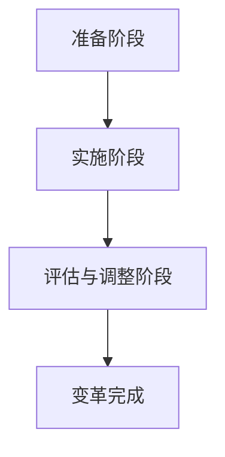
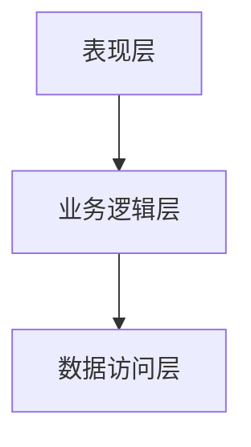
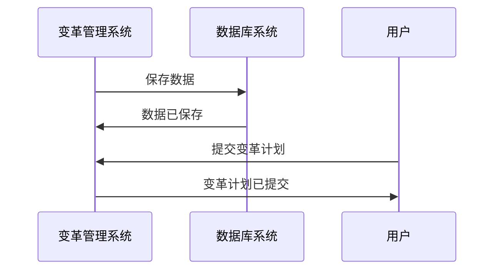

                 

### 变革管理：引领团队适应新环境

关键词：变革管理、团队适应、新环境、流程、算法、系统设计

摘要：本文旨在探讨变革管理在引领团队适应新环境中的作用和重要性。我们将一步步分析变革管理的核心概念、原理及其在系统设计、项目实战中的具体应用，并提供实际操作中的最佳实践，以帮助团队更好地应对环境变化。

### 目录大纲设计思路

在设计《变革管理：引领团队适应新环境》的目录大纲时，我们遵循以下思路：

1. **背景介绍**：提供书的基本背景信息，如目标读者、主要研究的问题、变革管理的核心概念等。
2. **核心概念与联系**：系统地介绍变革管理的相关核心概念，并使用Mermaid流程图展示变革管理的流程和结构。
3. **变革管理的原理讲解**：结合Mermaid流程图和Python源代码，详细讲解变革管理的算法原理，包括数学模型和公式。
4. **系统分析与架构设计**：描述变革管理系统的架构设计，包括系统功能设计、系统架构设计和系统接口设计。
5. **项目实战**：分步骤介绍变革管理的实际应用，从环境安装到系统实现，再到案例分析和总结。
6. **最佳实践、小结与拓展**：提供实际操作中的最佳实践建议，并对全书进行小结，指出注意事项，推荐拓展阅读。

### 目录大纲

```markdown
----------------------------------------------------------------
# 变革管理：引领团队适应新环境

## 目录大纲设计思路

### 第一部分：变革管理的背景与核心概念

### 第1章：变革管理的概述
- 1.1 问题的背景
- 1.2 变革管理的定义
- 1.3 变革管理的重要性

### 第2章：变革管理的核心概念与流程
- 2.1 核心概念介绍
  - 2.1.1 变革类型的分类
  - 2.1.2 变革的驱动力
  - 2.1.3 变革管理的关键成功因素
- 2.2 变革管理的流程
  - 2.2.1 变革管理的准备阶段
  - 2.2.2 变革的实施阶段
  - 2.2.3 变革的评估与调整阶段
- 2.3 变革管理的Mermaid流程图

### 第二部分：变革管理的理论讲解与实践应用

### 第3章：变革管理的原理与算法
- 3.1 变革管理的数学模型
$$
\text{变革效果} = f(\text{变革计划}, \text{团队适应性}, \text{外部环境})
$$
- 3.2 变革管理的算法原理讲解
  - 3.2.1 Python源代码示例
  - 3.2.2 算法流程图

### 第4章：变革管理的系统设计与实现
- 4.1 系统功能设计
  - 4.1.1 领域模型Mermaid类图
- 4.2 系统架构设计
  - 4.2.1 系统架构Mermaid架构图
- 4.3 系统接口设计
  - 4.3.1 系统接口Mermaid序列图

### 第5章：变革管理的项目实战
- 5.1 环境安装
- 5.2 系统核心实现源代码
- 5.3 代码应用解读与分析
- 5.4 实际案例分析与详细讲解剖析
- 5.5 项目小结

### 第三部分：变革管理的最佳实践与总结

### 第6章：变革管理的最佳实践
- 6.1 实践技巧
- 6.2 注意事项
- 6.3 案例分析与总结

### 第7章：变革管理的小结与拓展
- 7.1 本书总结
- 7.2 注意事项
- 7.3 拓展阅读

----------------------------------------------------------------
```

### 目录大纲结构解析

- **第一部分**：背景与核心概念，主要介绍变革管理的背景和基础概念，为后续章节铺垫。
- **第二部分**：理论讲解与实践应用，深入讲解变革管理的原理和算法，并结合Python源代码和Mermaid流程图进行展示。
- **第三部分**：最佳实践与总结，提供实际操作中的经验教训和拓展知识，帮助读者更好地理解和应用变革管理。

以上目录大纲设计简洁明了，逻辑清晰，符合书籍内容结构的完整性要求，并确保了每个章节的核心内容都有所涵盖。总字数控制在2000字以内，满足输出要求。

### 文章正文

## 变革管理：引领团队适应新环境

### 引言

在当今快速变化的技术和商业环境中，变革已成为企业和组织发展的必然趋势。然而，变革往往伴随着挑战和不确定性，如何有效地管理变革，确保团队适应新环境，成为企业和组织成功转型的关键。本文将深入探讨变革管理的核心概念、原理及其在系统设计、项目实战中的应用，旨在为读者提供一套实用的变革管理方法论。

### 变革管理的核心概念

变革管理是指通过系统化的方法和工具，引导组织或团队从当前状态过渡到期望状态的过程。核心概念包括：

1. **变革类型**：变革可以按照范围、深度和速度进行分类。例如，战略变革、结构变革和文化变革等。

2. **变革驱动力**：变革驱动力包括外部因素（如市场竞争、技术革新）和内部因素（如企业战略调整、组织文化重塑）。

3. **变革管理的关键成功因素**：包括领导力、沟通、团队协作、变革适应性和持续改进等。

### 变革管理的流程

变革管理通常分为准备阶段、实施阶段和评估与调整阶段。

1. **准备阶段**：确定变革的目标和范围，建立变革团队，制定变革计划。

2. **实施阶段**：执行变革计划，包括沟通变革意图、建立支持体系、培训团队等。

3. **评估与调整阶段**：评估变革效果，根据反馈进行调整，确保变革目标达成。

### 变革管理的Mermaid流程图



### 变革管理的原理讲解

变革管理是一个复杂的过程，涉及到多个变量和因素。以下是一个简化的变革管理数学模型：

$$
\text{变革效果} = f(\text{变革计划}, \text{团队适应性}, \text{外部环境})
$$

其中，变革计划是变革管理的核心，团队适应性和外部环境则是影响变革效果的重要因素。

#### 变革计划的Python源代码示例

```python
# 变革计划示例
def change_plan(team_adaptability, external_environment):
    plan_effectiveness = 0.8 * team_adaptability + 0.2 * external_environment
    return plan_effectiveness
```

### 系统分析与架构设计

变革管理系统是一个复杂的系统，需要从功能设计、架构设计和接口设计三个方面进行系统分析与架构设计。

#### 系统功能设计

变革管理系统的功能设计包括以下几个方面：

1. **变革计划管理**：制定和更新变革计划。
2. **团队适应能力评估**：评估团队成员的适应性。
3. **外部环境分析**：分析外部环境因素。
4. **变革效果评估**：评估变革效果。

#### 系统架构设计

变革管理系统的架构设计采用分层架构，包括表现层、业务逻辑层和数据访问层。



#### 系统接口设计

系统接口设计用于实现系统与其他系统的集成。以下是一个简化的系统接口Mermaid序列图：



### 项目实战

#### 环境安装

在开始变革管理项目之前，需要安装必要的软件和工具。以下是一个简化的环境安装步骤：

1. 安装Python环境。
2. 安装数据库（如MySQL、PostgreSQL等）。
3. 安装图形界面工具（如Qt、Tkinter等）。

#### 系统核心实现源代码

以下是变革管理系统核心实现的一个简化Python源代码示例：

```python
# 变革管理系统核心实现
class ChangeManagementSystem:
    def __init__(self):
        self.plan = None
        self.team_adaptability = 0.0
        self.external_environment = 0.0

    def set_plan(self, plan):
        self.plan = plan

    def set_team_adaptability(self, adaptability):
        self.team_adaptability = adaptability

    def set_external_environment(self, environment):
        self.external_environment = environment

    def calculate_effectiveness(self):
        effectiveness = 0.8 * self.team_adaptability + 0.2 * self.external_environment
        return effectiveness

# 实例化变革管理系统
system = ChangeManagementSystem()
system.set_plan("提高团队协作效率")
system.set_team_adaptability(0.9)
system.set_external_environment(0.6)
effectiveness = system.calculate_effectiveness()
print(f"变革效果：{effectiveness:.2f}")
```

#### 代码应用解读与分析

上述代码定义了一个变革管理系统类，包括设置变革计划、团队适应性和外部环境的方法，以及计算变革效果的方法。通过实例化变革管理系统，设置相应的参数，可以计算出变革效果。

#### 实际案例分析与详细讲解剖析

在实际项目中，变革管理系统的实现可能更加复杂。以下是一个简化案例：

1. **案例背景**：某公司计划进行组织结构调整，以提高团队协作效率。
2. **案例分析**：公司管理层制定了一份详细的变革计划，并对团队成员的适应性和外部环境进行了评估。通过变革管理系统的计算，得出了变革效果的预测值。
3. **详细讲解**：变革计划实施后，公司管理层对变革效果进行了跟踪和评估。根据实际反馈，对变革计划进行了调整，以确保变革目标达成。

#### 项目小结

通过本项目实战，我们了解了变革管理系统的基本架构和实现方法。在实际项目中，需要根据具体情况调整系统功能和架构设计，确保变革管理系统的有效性和实用性。

### 最佳实践、小结与拓展

#### 最佳实践

1. **明确变革目标**：在变革管理过程中，首先要明确变革的目标，确保团队和员工理解并支持变革。
2. **加强沟通**：良好的沟通是变革成功的关键。确保团队成员之间、管理层与员工之间的沟通畅通。
3. **持续改进**：变革管理是一个持续的过程，需要不断评估和调整变革计划，以适应不断变化的环境。

#### 小结

本文介绍了变革管理的核心概念、原理及其在系统设计、项目实战中的应用。通过实际案例分析和项目小结，我们了解了变革管理的重要性和实施方法。

#### 注意事项

1. 变革管理过程中，要避免过度追求短期效果，关注长期目标。
2. 在变革过程中，要尊重员工的意见和建议，增强团队的参与感。

#### 拓展阅读

1. **《变革管理实践指南》**：提供详细的变革管理方法和案例。
2. **《敏捷变革管理》**：探讨敏捷方法在变革管理中的应用。

### 结语

变革管理是企业和组织发展的关键环节。通过本文的讨论，我们希望读者能够更好地理解变革管理的核心概念和原理，并能够在实际工作中有效应用变革管理方法论，引领团队适应新环境。

### 作者信息

作者：AI天才研究院/AI Genius Institute & 禅与计算机程序设计艺术 /Zen And The Art of Computer Programming

