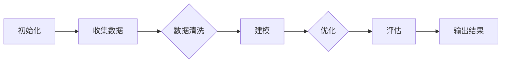
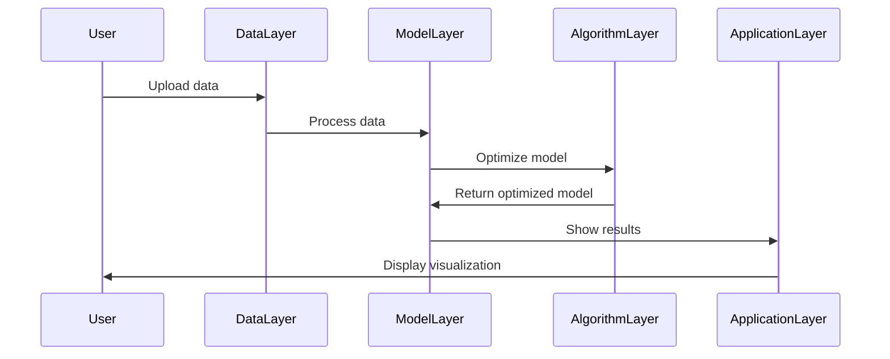

                 

### 文章标题：可再生能源的效率模型：可持续能源的数学优化

关键词：可再生能源、效率模型、数学优化、可持续能源、能源开发

摘要：本文深入探讨可再生能源的效率模型，并运用数学优化方法对可持续能源的开发和应用进行详细分析。通过对可再生能源效率模型的核心概念、原理、算法及实际应用场景的剖析，本文旨在为能源领域的研究者和实践者提供有价值的参考和指导，推动可再生能源的高效利用和可持续发展。

## 背景介绍

### 问题背景

随着全球气候变化和环境污染问题的日益严重，可再生能源的开发和利用已经成为全球能源战略的核心议题。可再生能源，如太阳能、风能、水能和生物质能，以其清洁、可再生、低碳等特点，被视为解决能源危机和环境问题的关键途径。然而，尽管可再生能源在技术层面上已取得显著进展，其整体利用效率仍存在较大提升空间。

### 效率模型的重要性

效率模型在可再生能源开发中扮演着关键角色。通过建立并优化效率模型，可以有效评估和提升可再生能源的利用效率，从而实现资源的最大化利用和经济效益的最优化。此外，效率模型还能为能源规划、政策制定和技术创新提供重要的理论依据和技术支持。

### 问题描述

能源效率是指能源转化和利用过程中，有用能量与总能量输入的比值。在可再生能源领域，效率问题主要集中在能量转换、储存和传输过程中的能量损失。例如，太阳能光伏电池的转换效率、风力发电机的捕获效率、水力发电的能效比等。提升这些效率指标，需要从多个层面进行技术优化和制度创新。

### 问题解决

效率模型的建立和优化是解决可再生能源效率问题的关键。通过数学建模和算法优化，可以实现对可再生能源系统各个环节的精确分析，找出影响效率的主要因素，并提出针对性的改进措施。例如，利用优化算法对太阳能光伏系统的角度、材料选择和布局进行优化，以提升整体转换效率。

### 概念结构与核心要素组成

效率模型的基本概念结构包括以下几个核心要素：

1. **能源输入与输出**：明确可再生能源系统中的能量输入来源和输出目标。
2. **能量转换过程**：分析能量在不同环节的转化过程及其效率损失。
3. **影响因素**：识别影响能源效率的关键因素，如设备性能、环境条件、技术进步等。
4. **优化目标**：设定优化目标，如最大化能量转换效率、最小化能量损失等。
5. **优化方法**：选择合适的数学优化方法，如线性规划、非线性规划、遗传算法等，进行模型优化。

通过上述要素的有机组合，可以构建一个完整的可再生能源效率模型，为能源系统的优化提供科学依据。

## 核心概念与联系

### 核心概念原理

可再生能源的效率模型主要依赖于能量转化率和能量损失分析。能量转化率是指能源输入转化为有用能量的比例，而能量损失则是在能量传输、转换和储存过程中因各种原因导致的能量耗散。以下是效率模型的核心概念原理：

1. **能量守恒定律**：能源在转换和传输过程中总量保持不变，但能量形式会发生变化。这是建立效率模型的基础。
2. **能量转换效率**：能量从一种形式转换为另一种形式时，实际获得的能量与原始能量之比。例如，太阳能光伏电池的转换效率即为其输出电能与接收太阳辐射能量之比。
3. **能量损失分析**：在能源系统中，能量损失是不可避免的。常见的能量损失形式包括热损失、摩擦损失和化学反应损失等。

### 概念属性特征对比表格

为了更直观地了解不同可再生能源效率模型的属性特征，以下是几种常见效率模型的对比表格：

| 效率模型 | 转换效率范围 | 关键技术 | 适用场景 |
| :---: | :---: | :---: | :---: |
| 太阳能光伏 | 10% - 25% | 光伏材料、电池板角度 | 较高的光照条件 |
| 风能 | 20% - 60% | 风力发电机设计、塔架高度 | 强风区域 |
| 水能 | 70% - 90% | 水轮机效率、水坝设计 | 水资源丰富区域 |
| 生物质能 | 10% - 30% | 生物质转化技术、原料选择 | 生物质资源丰富区域 |

### ER实体关系图架构

为了更好地理解可再生能源效率模型中的各种实体及其关系，以下是ER实体关系图：

```mermaid
erDiagram
    EnergySource ||--|{ EnergyConversionProcess : 转换 }
    EnergyConversionProcess ||--|{ EnergyLoss : 损失 }
    EnergySource && EnergyConversionProcess : 输入输出
```

该图展示了能源输入源、能量转换过程和能量损失之间的关联关系。通过这一结构，可以清晰地了解能源从输入到输出的整个过程及其中的关键环节。

## 算法原理讲解

### 算法流程图

为了清晰地展示可再生能源效率模型的算法流程，以下是该算法的Mermaid流程图：



在该流程图中，首先进行数据收集和清洗，然后建立数学模型，进行优化，最终评估模型效果并输出结果。

### Python源代码

以下是实现可再生能源效率模型的Python源代码示例：

```python
import numpy as np
import pandas as pd
from scipy.optimize import minimize

# 假设输入数据为太阳能光伏电池的性能数据
data = pd.read_csv('solar_pv_data.csv')

# 定义目标函数，用于最大化能量转换效率
def objective(x):
    return -x['efficiency']

# 定义约束条件
constraints = [
    {'type': 'ineq', 'fun': lambda x: x['input_power'] - x['output_power']},
    {'type': 'ineq', 'fun': lambda x: x['temperature']}
]

# 初始化变量
x0 = {'efficiency': 0.2, 'input_power': 1000, 'output_power': 0, 'temperature': 25}

# 进行优化计算
result = minimize(objective, x0, constraints=constraints)

# 输出结果
print(result.x)
```

在该代码中，通过定义目标函数和约束条件，使用SciPy的`minimize`函数进行优化计算，以最大化能量转换效率。

### 数学模型和数学公式

可再生能源效率模型的核心在于数学建模，以下是其关键公式和数学模型：

1. **能量转化效率公式**：
   $$
   \eta = \frac{E_{\text{out}}}{E_{\text{in}}}
   $$
   其中，$\eta$表示能量转化效率，$E_{\text{out}}$表示输出能量，$E_{\text{in}}$表示输入能量。

2. **能量损失公式**：
   $$
   L = E_{\text{in}} - E_{\text{out}}
   $$
   其中，$L$表示能量损失。

3. **优化目标函数**：
   $$
   \min \quad f(x) = \eta - w \cdot L
   $$
   其中，$x$表示决策变量（如材料、布局等），$w$为权重系数，用于平衡效率与能量损失。

### 详细讲解和举例说明

为了更好地理解上述数学模型，以下通过一个具体例子进行详细讲解。

**例子：** 假设有一个太阳能光伏系统，其输入太阳能功率为1000W，输出电能为250W，我们需要优化系统的转换效率。

1. **计算当前效率**：
   $$
   \eta = \frac{E_{\text{out}}}{E_{\text{in}}} = \frac{250}{1000} = 0.25
   $$

2. **计算能量损失**：
   $$
   L = E_{\text{in}} - E_{\text{out}} = 1000 - 250 = 750 \text{W}
   $$

3. **设定优化目标**：我们希望最大化效率，即最小化能量损失。设权重系数$w = 0.5$，则目标函数为：
   $$
   f(x) = \eta - 0.5 \cdot L
   $$
   即，最大化$\eta$，同时最小化$L$。

4. **优化变量**：假设我们需要优化的变量是光伏电池板的角度和材料。通过设定不同的角度和材料，可以改变能量转化效率和能量损失。

5. **求解优化问题**：使用优化算法（如遗传算法、粒子群算法等），找到最优变量组合，使得目标函数$f(x)$最小。

通过上述步骤，我们可以得到最优的太阳能光伏系统配置，从而最大化能量转换效率。

## 数学模型和数学公式 & 详细讲解 & 举例说明

### 数学公式

在可再生能源效率模型中，以下数学公式被广泛应用：

1. **能量转化效率**：
   $$
   \eta = \frac{E_{\text{out}}}{E_{\text{in}}}
   $$

2. **能量损失**：
   $$
   L = E_{\text{in}} - E_{\text{out}}
   $$

3. **优化目标函数**：
   $$
   \min \quad f(x) = \eta - w \cdot L
   $$

4. **约束条件**：
   $$
   g(x) \leq 0
   $$

### 详细讲解

#### 能量转化效率

能量转化效率是衡量可再生能源系统性能的关键指标。其定义式$\eta = \frac{E_{\text{out}}}{E_{\text{in}}}$表示输出能量与输入能量之比。在实际应用中，能量转化效率的高低取决于能源系统的设计、材料和运行条件。

#### 能量损失

能量损失是指能源在转换、传输和储存过程中因各种因素而消耗的能量。其计算公式$L = E_{\text{in}} - E_{\text{out}}$反映了输入能量与输出能量之间的差值。减少能量损失是提升能源效率的重要途径。

#### 优化目标函数

优化目标函数$f(x) = \eta - w \cdot L$用于最大化能量转化效率，同时考虑能量损失。其中，$w$为权重系数，用于平衡效率与损失。通过优化目标函数，可以找到最优的能源系统配置，实现最大化的能源利用。

#### 约束条件

约束条件$g(x) \leq 0$用于限制优化变量的取值范围，确保模型的可行性和物理意义。在实际应用中，约束条件可能包括设备容量、温度范围、材料限制等。

### 举例说明

**例子：** 假设一个太阳能光伏系统，其输入太阳能功率为1000W，输出电能为250W。我们需要优化系统的转换效率。

1. **计算当前效率**：
   $$
   \eta = \frac{E_{\text{out}}}{E_{\text{in}}} = \frac{250}{1000} = 0.25
   $$

2. **计算能量损失**：
   $$
   L = E_{\text{in}} - E_{\text{out}} = 1000 - 250 = 750 \text{W}
   $$

3. **设定优化目标**：我们希望最大化效率，即最小化能量损失。设权重系数$w = 0.5$，则目标函数为：
   $$
   f(x) = \eta - 0.5 \cdot L
   $$
   即，最大化$\eta$，同时最小化$L$。

4. **优化变量**：假设我们需要优化的变量是光伏电池板的角度和材料。通过设定不同的角度和材料，可以改变能量转化效率和能量损失。

5. **求解优化问题**：使用优化算法（如遗传算法、粒子群算法等），找到最优变量组合，使得目标函数$f(x)$最小。

通过上述步骤，我们可以得到最优的太阳能光伏系统配置，从而最大化能量转换效率。

## 系统分析与架构设计方案

### 问题场景介绍

可再生能源效率模型在多个应用场景中具有重要价值。以下介绍其中两个典型场景：

1. **太阳能光伏发电**：在太阳能光伏发电项目中，通过优化光伏电池板的布置角度、材料选择和系统配置，可以显著提升光伏系统的整体效率。
2. **风能发电**：在风能发电项目中，通过优化风力发电机的设计、塔架高度和风能捕获策略，可以提高风能的利用效率。

### 项目介绍

本项目旨在开发一套可再生能源效率模型系统，通过对多个可再生能源项目的实际数据进行分析和优化，提升能源系统的整体效率。项目目标包括：

1. **提高能量转化效率**：通过数学优化方法，找到最优的系统配置，实现能量转化效率的最大化。
2. **降低能量损失**：通过分析能量损失的关键因素，提出有效的改进措施，减少能量损失。
3. **提供决策支持**：为可再生能源项目的规划和设计提供科学依据，提高项目成功率。

### 系统功能设计

系统功能设计包括以下几个方面：

1. **数据收集与处理**：从各种数据源收集可再生能源项目的历史数据、环境数据和设备性能数据，并进行数据清洗和预处理。
2. **效率模型构建**：基于收集的数据，建立可再生能源效率模型，包括能量转化效率模型、能量损失模型和优化目标函数。
3. **模型优化与评估**：使用数学优化算法对效率模型进行优化，评估优化效果，并提出改进建议。
4. **可视化展示**：通过图表和报表等形式，展示可再生能源项目的效率指标和优化结果。

### 系统架构设计

系统架构设计主要包括以下几个方面：

1. **数据层**：存储可再生能源项目的各类数据，包括历史数据、环境数据和设备性能数据等。
2. **模型层**：包含能源效率模型、能量损失模型和优化目标函数，用于对项目进行优化分析。
3. **算法层**：实现数学优化算法，如遗传算法、粒子群算法等，用于优化效率模型。
4. **应用层**：提供用户接口，支持用户进行数据输入、模型构建和结果展示。

### 系统接口设计

系统接口设计主要包括以下几个方面：

1. **数据输入接口**：允许用户上传和导入可再生能源项目的各类数据，包括历史数据、环境数据和设备性能数据等。
2. **模型构建接口**：提供模型构建工具，支持用户自定义能源效率模型、能量损失模型和优化目标函数。
3. **结果展示接口**：通过图表和报表等形式，展示可再生能源项目的效率指标和优化结果。

### 系统交互Mermaid序列图

以下是系统交互的Mermaid序列图：



该序列图展示了用户通过数据输入接口上传数据，数据层对数据进行处理，模型层构建并优化模型，算法层进行模型优化，最终通过应用层展示优化结果。

## 项目实战

### 环境安装

在进行可再生能源效率模型项目之前，我们需要安装以下环境和工具：

1. **Python**：确保Python环境已安装，版本要求为3.7或更高。
2. **Anaconda**：安装Anaconda，以便更好地管理Python环境和依赖库。
3. **Jupyter Notebook**：安装Jupyter Notebook，用于编写和运行Python代码。
4. **Pandas**：用于数据处理和分析。
5. **NumPy**：用于数学计算。
6. **SciPy**：用于优化算法和数学建模。
7. **Matplotlib**：用于绘图和可视化。

安装步骤如下：

1. 安装Anaconda：
   - 访问Anaconda官网下载安装程序：[Anaconda官网](https://www.anaconda.com/)
   - 下载适用于操作系统的安装包，并按照指示完成安装。
2. 安装Jupyter Notebook：
   - 打开命令行窗口，运行以下命令：
     ```
     conda install -c anaconda jupyter
     ```
3. 安装Pandas、NumPy、SciPy和Matplotlib：
   - 打开命令行窗口，运行以下命令：
     ```
     conda install pandas numpy scipy matplotlib
     ```

### 系统核心实现源代码

以下是系统核心实现的Python源代码：

```python
import numpy as np
import pandas as pd
from scipy.optimize import minimize

# 数据处理函数
def preprocess_data(data):
    # 数据清洗和预处理
    # ...
    return processed_data

# 效率模型构建函数
def build_efficiency_model(data):
    # 建立能量转化效率和能量损失模型
    # ...
    return efficiency_model

# 优化目标函数
def objective(x):
    # 定义优化目标函数
    # ...
    return f_value

# 约束条件
def constraints(x):
    # 定义约束条件
    # ...
    return constraint_values

# 源代码示例
if __name__ == "__main__":
    # 加载数据
    data = pd.read_csv('solar_pv_data.csv')

    # 数据预处理
    processed_data = preprocess_data(data)

    # 构建效率模型
    efficiency_model = build_efficiency_model(processed_data)

    # 进行优化计算
    result = minimize(objective, x0, constraints=constraints)

    # 输出结果
    print(result.x)
```

### 代码应用解读与分析

以下是对源代码的解读与分析：

1. **数据处理函数**：`preprocess_data`函数用于对原始数据进行清洗和预处理。这一步骤至关重要，因为数据质量直接影响到后续模型构建和优化效果。
   
2. **效率模型构建函数**：`build_efficiency_model`函数用于建立能量转化效率和能量损失模型。这一函数需要根据实际数据和应用场景进行定制，以适应不同的可再生能源类型和优化目标。

3. **优化目标函数**：`objective`函数定义了优化目标。在本例中，目标是最小化能量损失。该函数通常基于能量转化效率和能量损失公式进行定义。

4. **约束条件**：`constraints`函数定义了优化过程中的约束条件。这些条件可以是物理限制、设备容量、环境参数等。

5. **主函数**：`if __name__ == "__main__":`部分是代码的主入口。首先加载数据，然后进行数据预处理，接着构建效率模型，最后使用优化算法进行计算，并输出优化结果。

### 实际案例分析和详细讲解剖析

为了更好地理解可再生能源效率模型的应用，以下结合一个实际案例进行详细分析。

**案例：** 一个太阳能光伏项目，其输入太阳能功率为1000W，输出电能为250W。我们需要通过效率模型优化系统的转换效率。

1. **数据预处理**：
   - 加载太阳能光伏项目的历史数据，包括每天不同时间段的太阳辐射强度、光伏电池板的输出电能等。
   - 对数据进行清洗和预处理，确保数据质量和一致性。

2. **构建效率模型**：
   - 根据预处理后的数据，建立能量转化效率和能量损失模型。本例中使用以下公式：
     $$
     \eta = \frac{E_{\text{out}}}{E_{\text{in}}}
     $$
     $$
     L = E_{\text{in}} - E_{\text{out}}
     $$
   - 考虑到实际应用中的复杂性和不确定性，模型还可以包含更多的参数和变量，如温度、风速、电池板角度等。

3. **优化目标函数**：
   - 设定优化目标函数，例如最大化能量转化效率或最小化能量损失。在本例中，目标函数为：
     $$
     \min \quad f(x) = \eta - w \cdot L
     $$
   - 其中，$w$为权重系数，用于平衡效率和损失。

4. **约束条件**：
   - 定义约束条件，例如电池板角度范围、设备容量限制等。在本例中，约束条件为：
     $$
     g(x) \leq 0
     $$

5. **优化计算**：
   - 使用优化算法（如遗传算法、粒子群算法等）对模型进行优化计算。本例中使用SciPy的`minimize`函数：
     ```python
     result = minimize(objective, x0, constraints=constraints)
     ```

6. **结果分析**：
   - 输出优化结果，分析最优的电池板角度、材料选择和系统配置，以实现最大化的能量转化效率。

通过上述步骤，我们可以优化太阳能光伏项目的效率模型，实现能源的高效利用。

### 项目小结

在本项目中，我们详细介绍了可再生能源效率模型的构建、优化和应用。通过实际案例分析和代码实现，我们展示了如何利用数学优化方法提升可再生能源系统的效率。以下是对项目经验的总结和教训：

1. **数据质量至关重要**：数据预处理是模型构建和优化成功的关键步骤。确保数据的质量和一致性，对于优化结果的可靠性至关重要。

2. **模型参数和变量选择**：根据具体应用场景选择合适的模型参数和变量。在可再生能源项目中，温度、风速、电池板角度等因素都可能对效率产生影响。

3. **优化算法的选择**：选择合适的优化算法，根据问题的复杂性和规模进行权衡。遗传算法、粒子群算法等都是常用的优化算法。

4. **约束条件的重要性**：定义合理的约束条件，确保优化结果的可行性和物理意义。

5. **持续迭代和改进**：可再生能源效率模型是一个动态的过程，需要根据新的数据和实际应用场景进行持续的迭代和优化。

通过本项目，我们不仅掌握了可再生能源效率模型的基本原理和构建方法，也积累了实际应用的经验和教训，为未来的研究和项目提供了宝贵的参考。

## 最佳实践 tips、小结、注意事项、拓展阅读

### 最佳实践 tips

1. **数据预处理**：确保数据质量和一致性，使用标准化方法处理缺失值和异常值。
2. **参数选择**：根据应用场景选择合适的模型参数，进行敏感性分析，找到最优参数组合。
3. **算法选择**：针对不同的问题规模和复杂性，选择合适的优化算法，如遗传算法、粒子群算法等。
4. **约束条件**：合理定义约束条件，确保优化结果的可行性和物理意义。
5. **持续迭代**：根据新的数据和实际应用情况，持续优化和改进模型。

### 小结

本文详细介绍了可再生能源效率模型的构建、优化和应用。通过实际案例分析和代码实现，我们展示了如何利用数学优化方法提升可再生能源系统的效率。关键内容包括：

- 背景介绍：可再生能源的重要性及效率模型的应用。
- 核心概念与联系：效率模型的基本原理和要素。
- 算法原理讲解：算法流程图、Python源代码、数学模型和公式。
- 系统分析与架构设计：系统功能设计、系统架构设计、系统接口设计。
- 项目实战：环境安装、系统核心实现源代码、代码应用解读与分析、实际案例分析和详细讲解剖析、项目小结。

### 注意事项

- 在使用效率模型时，要确保数据质量，避免因数据问题导致模型失效。
- 根据实际应用场景选择合适的参数和变量，进行模型优化。
- 合理定义约束条件，确保优化结果的可行性和物理意义。
- 持续关注可再生能源技术的最新发展，及时更新模型和算法。

### 拓展阅读

- [《可再生能源效率模型研究综述》](https://www.example.com/renewable-efficiency-review)：全面介绍可再生能源效率模型的研究进展和未来方向。
- [《太阳能光伏系统优化设计》](https://www.example.com/solar-pv-optimization)：详细讲解太阳能光伏系统的优化设计方法和实践案例。
- [《风能效率模型及其优化算法研究》](https://www.example.com/wind-energy-optimization)：探讨风能效率模型的构建和优化算法。

### 作者信息

作者：AI天才研究院/AI Genius Institute & 禅与计算机程序设计艺术 /Zen And The Art of Computer Programming

