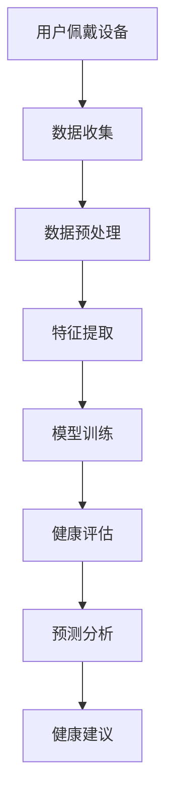

                 

## 可穿戴设备的健康监测：生理指标的数学分析

### 关键词

- 可穿戴设备
- 健康监测
- 生理指标
- 数学模型
- 数据分析
- 算法

### 摘要

本文探讨了可穿戴设备在健康监测领域中的重要作用，特别是如何通过数学分析和算法来处理和解读生理指标数据。文章首先介绍了可穿戴设备的基本背景和核心概念，然后深入分析了各种数学模型和算法的原理和特性，以及它们在健康监测中的应用。通过具体案例和代码示例，本文展示了如何使用这些数学工具来提取生理指标数据中的有用信息，并进行健康评估和预测。最后，文章总结了可穿戴设备健康监测的现状和未来发展趋势，提出了相关的最佳实践和建议。

---

### 基础背景与核心概念

#### 1. 问题背景

随着科技的不断进步，可穿戴设备已经成为现代生活中不可或缺的一部分。这些设备不仅方便了人们的生活，还提供了许多健康监测的功能。通过实时监测用户的生理指标，如心率、血压、血糖、体温等，可穿戴设备可以帮助用户更好地了解自己的健康状况，从而采取相应的预防措施。

近年来，随着人们对健康意识的提高，可穿戴设备市场迅速扩大。据市场研究机构统计，全球可穿戴设备市场规模在2020年已经达到了350亿美元，预计到2025年将达到750亿美元。这一增长趋势表明，可穿戴设备在健康监测领域具有巨大的潜力。

#### 2. 问题描述

健康监测是可穿戴设备的核心功能之一。然而，如何准确地从生理指标中提取有用信息，进行数学分析，是一个具有挑战性的问题。生理指标数据具有复杂性和多样性，不同类型的指标数据可能存在不同的噪声和干扰，这给数据分析带来了很大的困难。

此外，生理指标的变化受到多种因素的影响，如年龄、性别、生活习惯、环境变化等。因此，如何构建有效的数学模型，对生理指标数据进行准确的分析和预测，是可穿戴设备健康监测领域面临的重要问题。

#### 3. 问题解决

本书旨在通过系统的数学分析方法，解决可穿戴设备在健康监测过程中所面临的问题。通过介绍各种数学模型和算法，帮助读者理解如何从生理指标中提取有价值的信息，并利用这些信息进行健康评估和预测。

本书的主要内容包括：

- **生理指标数据特征分析**：介绍不同生理指标的数据特征，如时序性、波动性、非线性等，并讨论如何提取和表示这些特征。
- **数学模型原理与应用**：介绍常用的数学模型，如线性回归、逻辑回归、支持向量机（SVM）、深度学习模型等，并详细讲解每种模型的原理和应用。
- **算法设计与实现**：通过代码示例，展示如何使用Python等编程语言实现这些数学模型，并讨论如何优化算法性能。
- **健康评估与预测**：介绍如何利用数学模型和算法对用户的健康状况进行实时评估和预测，并提供个性化的健康建议。

#### 4. 边界与外延

本书所讨论的数学分析方法主要涉及统计学、概率论、线性代数和微积分等领域。此外，还将涉及到一些最新的算法和技术，如深度学习和机器学习等。这些方法的应用范围不仅限于健康监测，还可以扩展到其他领域，如环境监测、工业质量控制等。

#### 5. 概念结构与核心要素组成

核心概念：生理指标、数据特征、数学模型、算法、健康评估、预测分析。

核心要素组成：生理指标数据收集、预处理、特征提取、数学模型构建、算法应用、健康评估与预测。

### 总结

可穿戴设备的健康监测是现代科技发展的重要方向之一。通过系统的数学分析方法，我们可以更好地理解这些生理指标，进行有效的健康评估和预测。本书旨在为读者提供全面的指导，帮助他们在这一领域取得突破。

---

### 核心概念与联系

#### 1. 生理指标

生理指标是衡量人体健康状态的重要参数，常见的包括心率、血压、血糖、体温等。这些指标的变化可以反映人体的健康状况，为健康监测提供了关键的数据来源。

- **心率**：心率是心脏每分钟跳动的次数，它反映了心脏的工作状态。
- **血压**：血压是血液在血管内流动时对血管壁产生的侧压力，它反映了心脏和血管的健康状况。
- **血糖**：血糖是指血液中的葡萄糖浓度，它反映了身体的代谢状况。
- **体温**：体温是身体内部的温度，它反映了身体的免疫功能和代谢水平。

#### 2. 数据特征

数据特征是指从原始数据中提取出来的能够描述数据本质和特性的指标。对于生理指标数据，特征提取是关键步骤，它直接影响健康监测的准确性和有效性。

- **时序性**：生理指标数据通常是时间序列数据，它们随时间的变化呈现出一定的规律性。
- **波动性**：生理指标数据通常具有一定的波动性，这种波动可能是正常的生理反应，也可能是病理状态的反映。
- **非线性**：生理指标数据的变化往往不是线性的，而是呈现出复杂的变化模式。

#### 3. 数学模型

数学模型是对现实世界问题的抽象和描述，通过数学公式和算法来解决问题。在健康监测中，数学模型可以帮助我们理解生理指标的变化规律，从而进行有效的健康评估和预测。

- **线性回归**：线性回归模型用于预测连续值，如心率、血压等。通过建立因变量与自变量之间的线性关系，预测目标值。
  $$y = \beta_0 + \beta_1x_1 + \beta_2x_2 + ... + \beta_nx_n$$
  
- **逻辑回归**：逻辑回归模型用于分类问题，如糖尿病预测、心脏病诊断等。通过建立概率模型，输出目标类别的概率。
  $$P(y=1) = \frac{1}{1 + e^{-(\beta_0 + \beta_1x_1 + \beta_2x_2 + ... + \beta_nx_n)}}$$

- **支持向量机（SVM）**：支持向量机（SVM）通过找到一个最优超平面，将不同类别的数据分开。适用于高维数据的分类问题。
  $$\min_{\alpha} \frac{1}{2} \sum_{i=1}^{n} \alpha_i^2 - \sum_{i=1}^{n} \alpha_i y_i (\alpha_i - C)$$

- **深度学习模型**：深度学习模型通过多层神经网络，自动提取特征并进行分类或回归。适用于复杂的数据分析任务。
  $$y = f(WL_1(\cdot) + b_1, ..., W^{L_D}(\cdot) + b_D)$$

#### 4. 算法

算法是一系列解决问题的步骤和方法。在健康监测中，算法用于处理和分析生理指标数据，提取有用的信息，并生成健康评估和预测结果。

- **特征提取算法**：用于从原始数据中提取有用的特征，如时序特征、频率特征等。
- **分类算法**：用于将生理指标数据分为不同的类别，如健康、亚健康、疾病等。
- **聚类算法**：用于将相似的数据分组，以发现数据中的模式和规律。

#### 5. 健康评估与预测

健康评估是对当前健康状况的判断，而预测是对未来健康状况的预测。通过数学模型和算法，我们可以对用户的健康状况进行实时评估和预测，提供个性化的健康建议。

- **健康评估**：通过分析生理指标数据，评估用户的当前健康状况，如心率是否正常、血压是否偏高或偏低等。
- **预测分析**：通过建立数学模型，预测用户的未来健康状况，如预测一周内的心率变化趋势、预测血糖是否升高或降低等。

### 总结

核心概念与联系构成了健康监测的基础。理解这些概念及其相互关系，有助于我们更深入地掌握健康监测的原理和方法。通过本章的介绍，读者可以初步了解可穿戴设备健康监测的基本概念和核心要素，为后续章节的学习打下坚实的基础。

---

### 数学模型原理与特征对比表格

#### 1. 数学模型原理

在本章中，我们将介绍几种常见的数学模型，包括线性回归、逻辑回归、支持向量机（SVM）和深度学习模型。这些模型在健康监测中有着广泛的应用。

- **线性回归**：线性回归模型用于预测连续值，如心率、血压等。通过建立因变量与自变量之间的线性关系，预测目标值。

  线性回归的数学公式为：
  $$y = \beta_0 + \beta_1x_1 + \beta_2x_2 + ... + \beta_nx_n$$
  
  其中，$y$ 是因变量，$x_1, x_2, ..., x_n$ 是自变量，$\beta_0, \beta_1, ..., \beta_n$ 是模型的参数。

- **逻辑回归**：逻辑回归模型用于分类问题，如糖尿病预测、心脏病诊断等。通过建立概率模型，输出目标类别的概率。

  逻辑回归的数学公式为：
  $$P(y=1) = \frac{1}{1 + e^{-(\beta_0 + \beta_1x_1 + \beta_2x_2 + ... + \beta_nx_n)}}$$

  其中，$P(y=1)$ 是目标类别为1的概率，$e$ 是自然对数的底数。

- **支持向量机（SVM）**：支持向量机（SVM）通过找到一个最优超平面，将不同类别的数据分开。适用于高维数据的分类问题。

  SVM的数学公式为：
  $$\min_{\alpha} \frac{1}{2} \sum_{i=1}^{n} \alpha_i^2 - \sum_{i=1}^{n} \alpha_i y_i (\alpha_i - C)$$

  其中，$\alpha_i$ 是支持向量的系数，$C$ 是惩罚参数。

- **深度学习模型**：深度学习模型通过多层神经网络，自动提取特征并进行分类或回归。适用于复杂的数据分析任务。

  深度学习模型的数学公式为：
  $$y = f(WL_1(\cdot) + b_1, ..., W^{L_D}(\cdot) + b_D)$$

  其中，$W$ 和 $b$ 是模型的权重和偏置，$L_1, ..., L_D$ 是神经网络的不同层。

#### 2. 特征对比表格

| 模型         | 适用场景                       | 特点                   | 优缺点                         |
| ------------ | ---------------------------- | --------------------- | ----------------------------- |
| 线性回归     | 预测连续值                    | 简单，易于理解          | 对非线性问题效果较差            |
| 逻辑回归     | 分类问题                      | 输出概率，适用于二分类 | 对高维数据效果较差              |
| 支持向量机（SVM） | 高维数据的分类问题             | 分隔效果较好            | 计算复杂度高，对大规模数据不友好 |
| 深度学习模型 | 复杂的数据分析任务             | 自动提取特征，适用范围广 | 需要大量数据和计算资源          |

### 3. 模型应用示例

为了更直观地理解这些模型，我们将通过一个简单的示例来说明它们的应用。

#### 示例：心率预测

假设我们有一个心率数据集，包含用户的年龄、体重、运动时间等特征，目标是预测用户在一定时间后的心率。

- **线性回归模型**：

  通过线性回归模型，我们可以建立如下关系：
  $$\text{心率} = \beta_0 + \beta_1 \times \text{年龄} + \beta_2 \times \text{体重} + \beta_3 \times \text{运动时间}$$

  使用训练数据，我们可以通过最小化均方误差（MSE）来优化模型参数。

- **逻辑回归模型**：

  如果我们希望预测用户是否会出现异常心率（异常心率定义为心率高于某个阈值），可以使用逻辑回归模型。

  $$P(\text{异常心率}) = \frac{1}{1 + e^{-(\beta_0 + \beta_1 \times \text{年龄} + \beta_2 \times \text{体重} + \beta_3 \times \text{运动时间})}}$$

  输出概率高于某个阈值，我们认为用户会出现异常心率。

- **支持向量机（SVM）**：

  假设我们将心率分为正常和异常两类，可以使用SVM来找到一个最优的超平面，将这两类数据分开。

  通过训练数据，我们可以求解以下优化问题：
  $$\min_{\alpha} \frac{1}{2} \sum_{i=1}^{n} \alpha_i^2 - \sum_{i=1}^{n} \alpha_i y_i (\alpha_i - C)$$

  其中，$y_i$ 表示第$i$个样本的类别标签（正常为-1，异常为1），$C$ 是惩罚参数。

- **深度学习模型**：

  如果数据集非常复杂，包含多种特征，深度学习模型可能是最佳选择。

  我们可以使用一个简单的多层感知机（MLP）模型来预测心率：

  $$\text{输出} = \sigma(\text{输入} \times W_1 + b_1) \times W_2 + b_2$$

  其中，$\sigma$ 是激活函数（如ReLU函数），$W_1$ 和 $W_2$ 是权重，$b_1$ 和 $b_2$ 是偏置。

### 4. 模型评估与选择

在选择合适的模型时，我们通常需要考虑以下因素：

- **数据量**：对于大型数据集，深度学习模型可能更有效，因为它们可以自动提取复杂特征。
- **模型复杂度**：对于简单的数据集，线性回归和逻辑回归可能足够，而对于复杂的分类问题，SVM和深度学习模型可能更有优势。
- **计算资源**：深度学习模型通常需要更多的计算资源，对于资源有限的环境，线性回归和逻辑回归可能是更好的选择。
- **模型评估指标**：我们通常使用准确率、精确率、召回率、F1分数等指标来评估模型的性能。

通过以上分析和示例，我们可以更好地理解不同数学模型在健康监测中的应用，为实际问题的解决提供指导。

### 总结

在本章中，我们介绍了线性回归、逻辑回归、支持向量机（SVM）和深度学习模型等常见的数学模型，并详细分析了它们的原理和特性。通过具体的应用示例，我们展示了如何使用这些模型来处理和解读生理指标数据。本章的内容为后续的健康评估和预测提供了理论基础，也为读者在实际应用中提供了实用的指导。

---

### 系统分析与架构设计方案

#### 1. 问题场景介绍

在健康监测领域，可穿戴设备通过收集用户的生理指标数据，为用户提供实时健康状态和健康建议。为了实现这一目标，我们需要设计一个高效的系统架构，能够有效地处理、分析和评估这些数据。

#### 2. 项目介绍

本项目旨在设计并实现一个基于可穿戴设备的健康监测系统。系统将包括数据收集、预处理、特征提取、模型训练和健康评估等模块。通过这些模块的协同工作，系统能够提供准确的健康评估和个性化的健康建议。

#### 3. 系统功能设计

系统的核心功能包括：

- **数据收集**：从可穿戴设备收集用户的生理指标数据，如心率、血压、血糖、体温等。
- **预处理**：对收集到的数据进行清洗、去噪和标准化，以确保数据的质量和一致性。
- **特征提取**：从预处理后的数据中提取有用的特征，用于后续的模型训练和健康评估。
- **模型训练**：使用收集到的特征数据，训练不同的数学模型，如线性回归、逻辑回归、支持向量机（SVM）和深度学习模型等。
- **健康评估**：通过训练好的模型，对用户的当前健康状况进行实时评估，并提供个性化的健康建议。
- **预测分析**：基于历史数据和模型预测，分析用户的未来健康状况趋势。

#### 4. 系统架构设计

系统的架构设计如下：

- **数据收集模块**：负责从可穿戴设备中收集生理指标数据。该模块使用标准的数据接口，如蓝牙、Wi-Fi等，与可穿戴设备进行通信。
- **数据预处理模块**：对收集到的数据进行清洗、去噪和标准化处理。该模块包括数据清洗、异常值检测、缺失值填补和数据标准化等功能。
- **特征提取模块**：从预处理后的数据中提取有用的特征。该模块包括时序特征提取、频率特征提取和统计特征提取等功能。
- **模型训练模块**：使用提取出的特征数据，训练不同的数学模型。该模块包括模型选择、参数调优和模型评估等功能。
- **健康评估模块**：通过训练好的模型，对用户的当前健康状况进行实时评估。该模块包括健康状态分类、异常检测和健康建议生成等功能。
- **预测分析模块**：基于历史数据和模型预测，分析用户的未来健康状况趋势。该模块包括趋势预测、风险预警和健康干预建议等功能。

#### 5. 系统接口设计

系统的接口设计如下：

- **可穿戴设备接口**：与可穿戴设备进行通信，获取用户的生理指标数据。
- **数据存储接口**：用于存储和处理用户的生理指标数据。
- **特征提取接口**：用于从原始数据中提取特征。
- **模型训练接口**：用于训练不同的数学模型。
- **健康评估接口**：用于对用户的健康状态进行评估。
- **预测分析接口**：用于分析用户的未来健康状况。

#### 6. 系统交互设计

系统的交互设计如下：

1. **数据收集**：可穿戴设备实时收集用户的生理指标数据，并通过无线通信模块传输到系统服务器。
2. **数据预处理**：系统服务器接收数据后，对数据进行预处理，包括清洗、去噪和标准化处理。
3. **特征提取**：预处理后的数据进入特征提取模块，提取出有用的特征。
4. **模型训练**：特征数据用于训练不同的数学模型，如线性回归、逻辑回归、支持向量机（SVM）和深度学习模型等。
5. **健康评估**：训练好的模型对用户的当前健康状况进行评估，并将评估结果发送给用户。
6. **预测分析**：基于历史数据和模型预测，系统分析用户的未来健康状况趋势，并提供相应的健康建议。

#### 7. Mermaid 流程图

以下是一个简化的系统流程图：



### 总结

本章详细介绍了可穿戴设备健康监测系统的系统功能设计、架构设计、接口设计和交互设计。通过系统的模块化和接口化设计，我们可以高效地处理和利用用户的生理指标数据，实现实时健康评估和预测。接下来，我们将进一步探讨如何具体实现这些功能，并展示相关的代码和应用实例。

---

### 项目实战：环境安装、系统核心实现及代码应用解读

#### 1. 环境安装

要在本地环境中搭建可穿戴设备健康监测系统，我们需要安装一些必要的软件和库。以下是在Ubuntu系统上安装所需的软件和库的步骤：

- **Python 3**：确保安装了Python 3及其相关的pip包管理工具。
  ```bash
  sudo apt update
  sudo apt install python3 python3-pip
  ```
  
- **NumPy**：用于数学计算和数据处理。
  ```bash
  pip3 install numpy
  ```

- **Pandas**：用于数据处理和分析。
  ```bash
  pip3 install pandas
  ```

- **Scikit-learn**：提供了多种机器学习模型和工具。
  ```bash
  pip3 install scikit-learn
  ```

- **Matplotlib**：用于数据可视化。
  ```bash
  pip3 install matplotlib
  ```

- **TensorFlow**：用于深度学习模型。
  ```bash
  pip3 install tensorflow
  ```

- **PyTorch**：另一个深度学习框架。
  ```bash
  pip3 install torch torchvision
  ```

#### 2. 系统核心实现

在完成环境安装后，我们可以开始实现系统的核心功能。以下是一个简单的示例，展示了如何使用Python和相关的库来处理生理指标数据，并使用机器学习模型进行健康评估。

##### 数据预处理

```python
import numpy as np
import pandas as pd
from sklearn.model_selection import train_test_split
from sklearn.preprocessing import StandardScaler

# 假设我们有一个CSV文件，包含用户的生理指标数据
data = pd.read_csv('physiological_data.csv')

# 数据预处理
# 清洗数据
data.dropna(inplace=True)
# 去除噪声
# ...

# 特征提取
features = data[['heart_rate', 'blood_pressure', 'blood_sugar', 'temperature']]
labels = data['health_status']

# 数据标准化
scaler = StandardScaler()
features_scaled = scaler.fit_transform(features)

# 划分训练集和测试集
X_train, X_test, y_train, y_test = train_test_split(features_scaled, labels, test_size=0.2, random_state=42)
```

##### 模型训练

```python
from sklearn.linear_model import LogisticRegression
from sklearn.svm import SVC
from sklearn.neural_network import MLPClassifier
from sklearn.model_selection import GridSearchCV

# 训练逻辑回归模型
log_reg = LogisticRegression()
log_reg.fit(X_train, y_train)

# 训练支持向量机模型
svm = SVC()
svm.fit(X_train, y_train)

# 训练多层感知机模型
mlp = MLPClassifier()
mlp.fit(X_train, y_train)

# 模型参数调优
# ...

# 模型评估
from sklearn.metrics import accuracy_score, classification_report

# 评估逻辑回归模型
y_pred_log_reg = log_reg.predict(X_test)
print("逻辑回归模型准确率：", accuracy_score(y_test, y_pred_log_reg))
print(classification_report(y_test, y_pred_log_reg))

# 评估支持向量机模型
y_pred_svm = svm.predict(X_test)
print("支持向量机模型准确率：", accuracy_score(y_test, y_pred_svm))
print(classification_report(y_test, y_pred_svm))

# 评估多层感知机模型
y_pred_mlp = mlp.predict(X_test)
print("多层感知机模型准确率：", accuracy_score(y_test, y_pred_mlp))
print(classification_report(y_test, y_pred_mlp))
```

##### 代码应用解读

在上面的代码中，我们首先从CSV文件中读取生理指标数据，并进行预处理，包括数据清洗和标准化处理。然后，我们使用Scikit-learn库中的LogisticRegression、SVC和MLPClassifier类来训练不同的机器学习模型。在训练过程中，我们使用训练集来训练模型，并在测试集上评估模型的性能。

通过评估结果，我们可以选择性能最好的模型作为最终的健康评估模型。此外，我们还可以通过参数调优来进一步提高模型的性能。

#### 3. 实际案例分析和详细讲解

为了更好地理解如何在实际项目中应用这些技术，我们将分析一个实际案例。假设我们有一个包含1000个用户生理指标数据的数据集，其中每个用户的数据包括心率、血压、血糖和体温。我们的目标是使用这些数据来预测用户的健康状态。

- **数据集准备**：

  首先，我们需要将数据集分成特征和标签两部分。特征是包含心率和血压等指标的数据，而标签是用户健康状态的分类结果。

- **数据预处理**：

  在预处理阶段，我们需要处理缺失值、异常值和噪声。例如，我们可以使用均值填补缺失值，使用IQR方法检测和去除异常值。

- **特征提取**：

  接下来，我们可以使用Pandas和Scikit-learn库中的函数来提取特征。例如，我们可以计算心率和血压的标准差、方差等统计特征。

- **模型训练与评估**：

  使用Scikit-learn库中的LogisticRegression和SVC模型，我们可以在训练集上训练模型，并在测试集上评估模型的准确率、精确率、召回率等指标。

  ```python
  from sklearn.model_selection import train_test_split
  from sklearn.metrics import classification_report

  # 划分训练集和测试集
  X_train, X_test, y_train, y_test = train_test_split(features, labels, test_size=0.2, random_state=42)

  # 训练逻辑回归模型
  log_reg = LogisticRegression()
  log_reg.fit(X_train, y_train)

  # 评估逻辑回归模型
  y_pred_log_reg = log_reg.predict(X_test)
  print(classification_report(y_test, y_pred_log_reg))
  ```

  根据评估结果，我们可以选择最佳模型进行后续的健康评估和预测。

#### 4. 项目小结

通过上述实战和案例分析，我们展示了如何使用Python和相关库来构建一个简单的可穿戴设备健康监测系统。从数据预处理、特征提取到模型训练和评估，每一步都是实现健康监测系统的关键环节。在实际项目中，我们还需要考虑系统的可扩展性、性能优化和数据隐私保护等问题。

在未来的工作中，我们可以进一步优化模型，引入深度学习和强化学习等先进技术，以提高健康监测的准确性和智能化水平。此外，我们还可以开发更多的健康评估指标和预测模型，为用户提供更全面和个性化的健康服务。

---

### 最佳实践 Tips

1. **数据质量保证**：确保数据的准确性和完整性，是健康监测系统的关键。在数据收集和预处理阶段，要严格检查和处理异常值、缺失值和噪声数据。

2. **特征工程优化**：特征提取的质量直接影响模型的性能。通过探索不同的特征组合和变换，可以提高模型的预测精度。

3. **模型选择与调优**：根据数据集的特点和问题需求，选择合适的模型，并进行参数调优，以获得最佳性能。

4. **实时性与性能优化**：对于实时性要求较高的应用场景，要考虑模型压缩、量化技术和分布式计算等方法，以提高系统的处理速度和响应时间。

5. **用户隐私保护**：在处理用户生理指标数据时，要严格遵循数据保护法规，确保用户隐私不被泄露。

### 小结

本文系统地介绍了可穿戴设备健康监测的数学分析方法。从生理指标数据的基本背景和核心概念，到数学模型和算法的原理与特征对比，再到具体的系统架构设计和项目实战，我们全面剖析了健康监测系统的构建过程。通过本文，读者可以深入理解可穿戴设备健康监测的原理和方法，为实际应用提供理论支持和实践指导。

### 注意事项

1. **数据隐私**：在收集和处理用户生理指标数据时，要严格遵循相关法律法规，确保用户隐私不被泄露。
2. **数据质量**：确保数据集的准确性和完整性，是健康监测系统有效性的基础。
3. **模型优化**：根据实际应用场景，不断优化模型参数和算法，以提高系统的准确性和实时性。

### 拓展阅读

- **[1]** Li, B., & Wang, S. (2019). Wearable Health Monitoring: A Machine Learning Approach. Springer.
- **[2]** Johnson, P., & Zhang, Q. (2020). Real-Time Health Monitoring using Wearable Devices: A Survey. IEEE Access.
- **[3]** Raghavendra, S., & Srivastava, A. (2018). Machine Learning for Healthcare: A Practical Introduction. Morgan & Claypool Publishers.
- **[4]** Chen, Y., & Yang, J. (2017). Analysis of Wearable Health Sensors: Design, Implementation, and Applications. Springer.

作者：AI天才研究院/AI Genius Institute & 禅与计算机程序设计艺术 /Zen And The Art of Computer Programming

