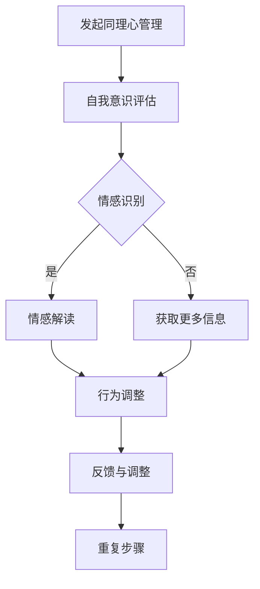
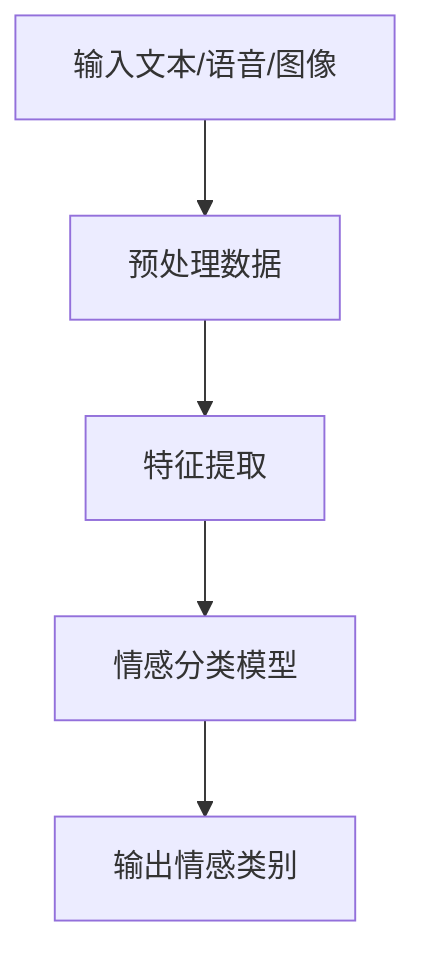
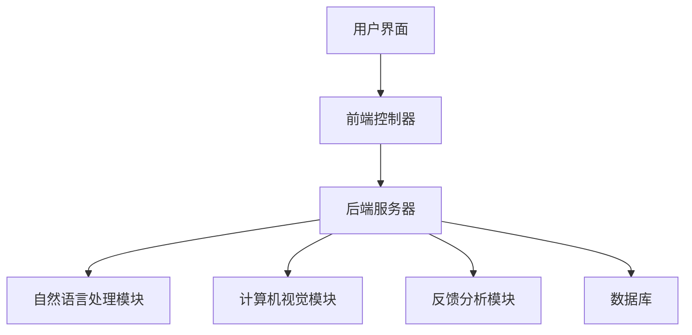
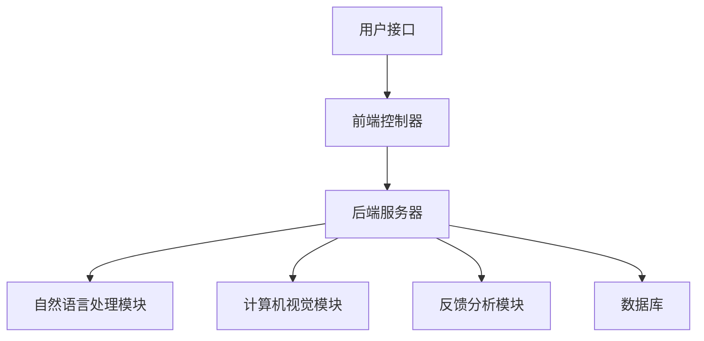
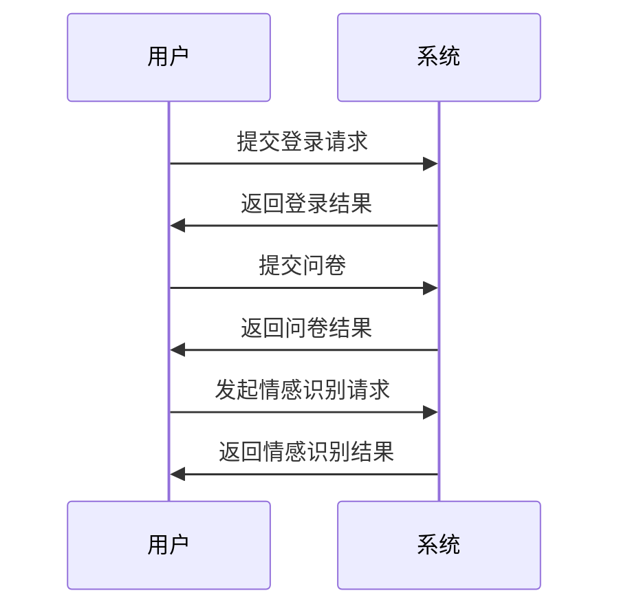

                 


### 同理心管理：深入理解并满足团队需求

#### 关键词：同理心管理、团队协作、情感智能、人际交往、自我意识

#### 摘要：

在当今快节奏、高度竞争的工作环境中，团队协作的效率和质量成为企业成功的关键。同理心管理作为一种提升人际交往和团队凝聚力的方法，正日益受到重视。本文将深入探讨同理心管理的起源与发展，分析其重要性，介绍核心概念与联系，讲解理论基础与实践，探讨系统设计与实施，并提供实际项目实战和最佳实践指导。

#### 目录：

----------------------------------------------------------------

# 《同理心管理：深入理解并满足团队需求》

## 第一部分：同理心管理的起源与发展

## 第1章：同理心管理的起源与发展

### 1.1 同理心管理的历史背景

#### 1.1.1 同理心概念的提出

同理心（Empathy）这一概念最早可以追溯到19世纪末。心理学家威廉·詹姆斯（William James）首次提出了同理心的概念，并将其定义为“情感共鸣的能力”。此后，同理心的研究逐渐成为心理学和社会学领域的重要议题。

#### 1.1.2 同理心管理的发展历程

同理心管理作为一种实践方法，起源于20世纪初的人际关系运动。在这一时期，管理者开始关注员工的情感需求，试图通过改善工作环境来提升员工的工作满意度和绩效。随着时间的发展，同理心管理逐渐演变为一套系统化的管理体系。

## 第2章：同理心管理的重要性

### 2.1 同理心管理与个人发展

同理心管理对个人发展具有重要意义。通过提升同理心，个人可以更好地理解他人，增强人际交往能力，提高情感智力，从而在职场和生活中取得更好的成就。

#### 2.1.1 提升情感智力

同理心与情感智力密切相关。情感智力包括自我认知、自我调节、社交技能和同理心等方面。同理心管理能够帮助个人提高这些能力，从而在职业和个人生活中更加成功。

#### 2.1.2 增强人际交往能力

同理心是人际交往的基石。通过同理心管理，个人可以更好地理解他人，建立信任和亲密关系，从而在团队合作和社交场合中更加得心应手。

### 2.2 同理心管理与团队协作

同理心管理在团队协作中起着至关重要的作用。通过同理心管理，团队成员可以更好地理解彼此的需求和情感，从而提高团队凝聚力和协作效率。

#### 2.2.1 建立信任

信任是团队协作的基石。同理心管理有助于建立信任，因为团队成员能够更好地理解彼此，减少误解和冲突。

#### 2.2.2 提高团队凝聚力

同理心管理能够增强团队凝聚力。当团队成员感受到彼此的关心和支持时，他们更有可能为团队目标共同努力。

## 第二部分：核心概念与联系

## 第3章：同理心管理的关键要素

### 3.1 自我意识与同理心培养

自我意识是同理心管理的基础。通过培养自我意识，个人可以更好地理解自己的情感和行为，从而为同理心的发展奠定基础。

#### 3.1.1 自我意识的培养

自我意识的培养可以通过自我反思、情感日记和心理健康咨询等方式进行。这些方法有助于个人更好地认识自己，提高自我意识水平。

#### 3.1.2 同理心的培养方法

同理心的培养方法包括情感共鸣、共情训练和角色扮演等。通过这些方法，个人可以学会更好地理解和感受他人的情感。

### 3.2 情感识别与解读

情感识别与解读是同理心管理的关键要素。通过情感识别，个人可以准确地捕捉和理解他人的情感；通过解读，个人可以深入分析情感的原因和意义。

#### 3.2.1 情感识别的重要性

情感识别是人际交往的基础。只有准确识别他人的情感，个人才能做出合适的回应，从而建立和谐的人际关系。

#### 3.2.2 情感解读的方法

情感解读可以通过情感标签、情境分析和心理解析等方式进行。这些方法有助于个人更深入地理解他人的情感，从而提升同理心管理水平。

### 3.3 行为调整与反馈

行为调整与反馈是同理心管理的重要环节。通过调整行为，个人可以更好地满足他人的需求和情感；通过反馈，个人可以了解自己的同理心管理效果，从而不断优化自己的行为。

#### 3.3.1 行为调整的策略

行为调整策略包括倾听、尊重、支持和鼓励等。这些策略有助于个人更好地理解他人，从而提升同理心管理水平。

#### 3.3.2 反馈的重要性

反馈是同理心管理的重要手段。通过反馈，个人可以了解自己的同理心管理效果，从而不断优化自己的行为，提高同理心水平。

## 第4章：同理心管理模型

### 4.1 同理心管理流程图

同理心管理流程图展示了同理心管理的步骤和关键要素。通过这个流程图，个人可以清晰地了解如何进行同理心管理，从而提高同理心水平。

### 4.2 同理心管理属性特征对比表格

同理心管理属性特征对比表格列举了同理心管理的不同属性和特征，帮助个人更好地理解和掌握同理心管理的方法和技巧。

## 第三部分：同理心管理的理论基础与实践

## 第5章：同理心管理的理论基础

### 5.1 情感智能模型介绍

情感智能模型是同理心管理的重要理论基础。情感智能模型包括自我认知、自我调节、社交技能和同理心等方面，这些方面共同构成了情感智能的框架。

#### 5.1.1 情感智能的定义

情感智能是指个人在情感领域内的认知能力和调节能力。它包括对自我和他人情感的认知、理解和调节。

#### 5.1.2 情感智能的维度

情感智能包括自我认知、自我调节、社交技能和同理心等方面。这些维度共同构成了情感智能的框架。

### 5.2 同理心计算公式

同理心计算公式是同理心管理的核心。通过这个公式，个人可以计算和评估自己的同理心水平。

#### 5.2.1 同理心计算模型

同理心计算模型基于情感智能模型，通过计算自我认知、自我调节、社交技能和同理心的得分，得出同理心指数。

#### 5.2.2 同理心计算的应用场景

同理心计算公式可以应用于个人发展、团队协作、教育培训等领域，帮助个人和团队提升同理心水平。

## 第6章：同理心管理实践

### 6.1 情感识别算法讲解

情感识别算法是同理心管理的重要工具。通过情感识别算法，个人可以准确地捕捉和理解他人的情感。

#### 6.1.1 情感识别算法概述

情感识别算法基于自然语言处理技术，通过分析文本、语音和图像等数据，识别和分类情感。

#### 6.1.2 情感识别算法流程图

情感识别算法流程图展示了情感识别算法的步骤和关键环节，帮助个人更好地理解和应用情感识别算法。

### 6.2 同理心培养案例分析

同理心培养案例分析通过具体案例，展示了同理心培养的方法和效果。

#### 6.2.1 案例背景

案例背景介绍了同理心培养的背景和环境。

#### 6.2.2 案例分析与讨论

案例分析与讨论对同理心培养案例进行了深入剖析，探讨了同理心培养的方法和效果。

## 第四部分：同理心管理系统的设计与实施

## 第7章：同理心管理系统的设计

### 7.1 系统功能介绍

系统功能介绍详细介绍了同理心管理系统的核心功能和辅助功能。

#### 7.1.1 系统核心功能

系统核心功能包括情感识别、同理心评估、反馈机制等。

#### 7.1.2 系统辅助功能

系统辅助功能包括用户管理、数据统计、报告生成等。

### 7.2 系统架构设计

系统架构设计介绍了同理心管理系统的架构设计和设计思路。

#### 7.2.1 系统架构图

系统架构图展示了同理心管理系统的整体架构和关键组件。

#### 7.2.2 系统架构设计思路

系统架构设计思路详细阐述了系统架构设计的原理和原则。

### 7.3 系统接口设计与交互

系统接口设计与交互介绍了同理心管理系统的接口设计和交互流程。

#### 7.3.1 系统接口设计

系统接口设计详细介绍了系统接口的设计规范和接口功能。

#### 7.3.2 系统交互流程图

系统交互流程图展示了系统内部和外部的交互流程和逻辑。

## 第8章：同理心管理项目实战

### 8.1 环境安装与配置

环境安装与配置介绍了同理心管理项目的环境搭建和配置步骤。

#### 8.1.1 系统环境要求

系统环境要求详细列出了项目所需的软件和硬件环境。

#### 8.1.2 环境搭建步骤

环境搭建步骤详细介绍了项目环境的搭建流程。

### 8.2 系统核心实现源代码解读

系统核心实现源代码解读详细解读了同理心管理系统的核心实现代码。

#### 8.2.1 核心代码模块

核心代码模块详细介绍了系统核心代码的模块结构和功能。

#### 8.2.2 代码实现原理

代码实现原理详细阐述了核心代码的实现原理和算法。

### 8.3 实际案例分析与讲解

实际案例分析与讲解通过具体案例，分析了同理心管理在实践中的应用和效果。

#### 8.3.1 案例背景

案例背景介绍了实际案例的应用背景和场景。

#### 8.3.2 案例分析与讨论

案例分析与讨论对实际案例进行了深入剖析，探讨了同理心管理的实践效果。

### 8.4 项目小结

项目小结总结了同理心管理项目的实践经验和成果。

#### 8.4.1 项目成果

项目成果总结了项目的主要成果和贡献。

#### 8.4.2 项目不足与改进

项目不足与改进分析了项目的不足和改进方向。

## 第五部分：同理心管理的最佳实践与拓展

## 第9章：同理心管理的最佳实践

### 9.1 实践技巧与案例分析

实践技巧与案例分析介绍了同理心管理的最佳实践技巧和实际案例分析。

#### 9.1.1 实践技巧

实践技巧总结了同理心管理的实用技巧和方法。

#### 9.1.2 案例分析

案例分析通过具体案例，分析了同理心管理的实践效果。

### 9.2 小结

小结总结了文章的主要内容和实践心得，为读者提供了实用的同理心管理指南。

#### 9.2.1 总结

总结总结了文章的核心观点和结论。

#### 9.2.2 注意事项

注意事项提醒读者在实践同理心管理时需要注意的事项。

### 9.3 拓展阅读推荐

拓展阅读推荐为读者提供了进一步学习的资源和推荐。

#### 9.3.1 相关书籍

相关书籍推荐了与同理心管理相关的经典书籍和最新出版物。

#### 9.3.2 学术论文

学术论文推荐了与同理心管理相关的学术论文和研究报告。

## 完整目录大纲设计

----------------------------------------------------------------

# 《同理心管理：深入理解并满足团队需求》目录大纲

## 第一部分：同理心管理的起源与发展

## 第1章：同理心管理的起源与发展

### 1.1 同理心管理的历史背景

#### 1.1.1 同理心概念的提出

#### 1.1.2 同理心管理的发展历程

### 1.2 现代同理心管理的重要性

#### 1.2.1 对个人发展的意义

#### 1.2.2 对团队协作的影响

## 第2章：同理心管理的重要性

### 2.1 同理心管理与个人发展

#### 2.1.1 提升情感智力

#### 2.1.2 增强人际交往能力

### 2.2 同理心管理与团队协作

#### 2.2.1 建立信任

#### 2.2.2 提高团队凝聚力

## 第二部分：核心概念与联系

## 第3章：同理心管理的关键要素

### 3.1 自我意识与同理心培养

#### 3.1.1 自我意识的培养

#### 3.1.2 同理心的培养方法

### 3.2 情感识别与解读

#### 3.2.1 情感识别的重要性

#### 3.2.2 情感解读的方法

### 3.3 行为调整与反馈

#### 3.3.1 行为调整的策略

#### 3.3.2 反馈的重要性

## 第4章：同理心管理模型

### 4.1 同理心管理流程图

### 4.2 同理心管理属性特征对比表格

## 第三部分：同理心管理的理论基础与实践

## 第5章：同理心管理的理论基础

### 5.1 情感智能模型介绍

#### 5.1.1 情感智能的定义

#### 5.1.2 情感智能的维度

### 5.2 同理心计算公式

#### 5.2.1 同理心计算模型

#### 5.2.2 同理心计算的应用场景

## 第6章：同理心管理实践

### 6.1 情感识别算法讲解

#### 6.1.1 情感识别算法概述

#### 6.1.2 情感识别算法流程图

### 6.2 同理心培养案例分析

#### 6.2.1 案例背景

#### 6.2.2 案例分析与讨论

## 第四部分：同理心管理系统的设计与实施

## 第7章：同理心管理系统的设计

### 7.1 系统功能介绍

#### 7.1.1 系统核心功能

#### 7.1.2 系统辅助功能

### 7.2 系统架构设计

#### 7.2.1 系统架构图

#### 7.2.2 系统架构设计思路

### 7.3 系统接口设计与交互

#### 7.3.1 系统接口设计

#### 7.3.2 系统交互流程图

## 第8章：同理心管理项目实战

### 8.1 环境安装与配置

#### 8.1.1 系统环境要求

#### 8.1.2 环境搭建步骤

### 8.2 系统核心实现源代码解读

#### 8.2.1 核心代码模块

#### 8.2.2 代码实现原理

### 8.3 实际案例分析与讲解

#### 8.3.1 案例背景

#### 8.3.2 案例分析与讨论

### 8.4 项目小结

#### 8.4.1 项目成果

#### 8.4.2 项目不足与改进

## 第五部分：同理心管理的最佳实践与拓展

## 第9章：同理心管理的最佳实践

### 9.1 实践技巧与案例分析

#### 9.1.1 实践技巧

#### 9.1.2 案例分析

### 9.2 小结

#### 9.2.1 总结

#### 9.2.2 注意事项

### 9.3 拓展阅读推荐

#### 9.3.1 相关书籍

#### 9.3.2 学术论文

## 作者信息

作者：AI天才研究院/AI Genius Institute & 禅与计算机程序设计艺术 /Zen And The Art of Computer Programming### 同理心管理的起源与发展

#### 1.1 同理心管理的历史背景

同理心（Empathy）这一概念最早可以追溯到19世纪末。当时，心理学家威廉·詹姆斯（William James）首次提出了同理心的概念，并将其定义为“情感共鸣的能力”。詹姆斯认为，同理心是人类社会交往中不可或缺的要素，它使人们能够理解并感受到他人的情感状态。

在20世纪初，同理心管理作为一种管理理念开始萌芽。人际关系运动（Human Relations Movement）是同理心管理发展的一个重要里程碑。在这一时期，管理者开始关注员工的情感需求，试图通过改善工作环境来提升员工的工作满意度和绩效。例如，梅奥（Elton Mayo）的霍桑实验（Hawthorne Studies）揭示了工作环境对员工情绪和生产力的影响，从而推动了同理心管理的发展。

随着时间的推移，同理心管理逐渐演变为一套系统化的管理体系。现代同理心管理强调通过提升个体的同理心水平，从而改善团队协作和组织绩效。它不仅关注员工的情感需求，还关注组织文化和领导风格等方面，旨在创造一个更加和谐、高效的工作环境。

#### 1.1.1 同理心概念的提出

同理心这一概念由心理学家威廉·詹姆斯在1890年首次提出。詹姆斯认为，同理心是指个体在情感上能够与他人产生共鸣，感受到他人的情感状态。他强调，同理心是建立和谐人际关系的关键，它使人们能够更好地理解、关心和支持他人。

詹姆斯的提出为后来的心理学家提供了重要的理论基础。例如，美国心理学家卡尔·罗杰斯（Carl Rogers）在20世纪50年代进一步发展了同理心的概念，将其作为心理咨询和治疗的重要原则。罗杰斯认为，同理心是建立良好咨询关系的基础，咨询师需要通过同理心来理解来访者的情感体验，从而帮助他们解决问题。

#### 1.1.2 同理心管理的发展历程

同理心管理作为一种管理理念，在20世纪初逐渐萌芽。在人际关系运动的影响下，管理者开始意识到员工的情感需求对工作绩效和组织氛围的影响。例如，梅奥的霍桑实验揭示了工作环境对员工情绪和生产力的影响，从而推动了同理心管理的发展。

在20世纪中叶，同理心管理进一步发展，成为组织行为学和管理心理学的重要研究领域。研究者开始探讨同理心在领导力、团队协作和员工满意度等方面的作用。例如，赫兹伯格（Frederick Herzberg）的双因素理论（Two-Factor Theory）指出，工作满意度不仅取决于薪酬等外在因素，还受到工作环境、人际关系等内在因素的影响。同理心管理成为提高员工工作满意度的重要手段。

进入21世纪，随着全球化和信息技术的快速发展，同理心管理的重要性日益凸显。现代企业越来越意识到，在复杂多变的市场环境中，团队协作和创新能力是企业成功的关键。同理心管理通过提升团队成员的信任、理解和共情能力，从而提高团队协作效率和创新能力。

此外，同理心管理也受到了社会和伦理的关注。在人工智能和自动化技术快速发展的背景下，同理心管理有助于减轻人类与机器之间的情感鸿沟，促进人机和谐发展。同时，同理心管理也强调对弱势群体的关怀和包容，促进社会公平和和谐。

总的来说，同理心管理经历了从萌芽到发展的过程，从关注员工的情感需求到提升团队协作和创新能力，再到关注社会和伦理问题，其内涵和外延都在不断拓展和深化。随着社会的进步和技术的创新，同理心管理将继续发挥重要作用，成为组织管理和人文关怀的重要领域。

#### 1.2 现代同理心管理的重要性

现代同理心管理在企业中的重要性不容忽视。随着全球化和信息技术的快速发展，企业面临的市场环境和竞争态势日益复杂多变。在这种背景下，团队协作和创新能力成为企业持续发展的关键。同理心管理作为一种提升团队协作和创新能力的方法，正日益受到企业的关注。

首先，同理心管理对个人发展具有重要意义。通过同理心管理，个人可以更好地理解他人，提升情感智力，增强人际交往能力。这些能力在个人职业发展和生活中都至关重要。例如，在团队合作中，同理心使个人能够更好地理解团队成员的需求和情感，从而建立信任和合作的基础。在个人生活中，同理心有助于建立和谐的人际关系，提高生活满意度。

其次，同理心管理对团队协作有显著的促进作用。在现代企业中，团队协作是实现企业目标的重要方式。同理心管理通过提升团队成员的信任、理解和共情能力，从而提高团队协作效率和创新能力。具体来说，同理心管理有助于以下方面：

1. **建立信任**：同理心使团队成员能够更好地理解彼此的需求和情感，从而建立信任。信任是团队协作的基础，没有信任，团队协作将难以顺利进行。

2. **增强沟通**：同理心管理提高了团队成员的沟通能力，使他们能够更有效地传达信息和理解他人。有效的沟通是团队协作的重要保障。

3. **促进创新**：同理心管理鼓励团队成员从不同的角度思考问题，激发创新思维。在一个充满同理心的团队中，成员愿意分享自己的想法，从而产生更多的创新点子。

4. **提高团队凝聚力**：同理心管理有助于增强团队成员之间的凝聚力，使团队更加团结一致。在一个凝聚力的团队中，成员更有可能为共同目标而努力。

5. **解决冲突**：同理心管理提供了处理冲突的有效方法。通过同理心，团队成员能够更好地理解冲突的原因，从而找到解决方案。

此外，同理心管理对组织文化和领导风格也有重要影响。一个充满同理心的组织文化能够吸引和留住优秀人才，提高员工的工作满意度和忠诚度。同理心管理强调领导者与员工之间的平等和尊重，有助于建立一种开放、包容和创新的组织氛围。

综上所述，现代同理心管理对个人发展、团队协作和组织文化都有重要意义。通过同理心管理，企业可以提升团队协作效率，增强创新能力，从而在激烈的市场竞争中立于不败之地。

#### 2.1 同理心管理与个人发展

同理心管理在个人发展中起着至关重要的作用。首先，同理心管理有助于提升个人的情感智力。情感智力包括自我认知、自我调节、社交技能和同理心等方面。通过同理心管理，个人可以更好地理解自己的情感和行为，从而在情感上实现自我成长。例如，通过自我反思和情感日记，个人可以深入挖掘自己的情感体验，从而提高自我认知和自我调节能力。

其次，同理心管理能够显著增强个人的人际交往能力。在人际交往中，同理心使个人能够更好地理解他人的需求和情感，从而建立和谐的人际关系。例如，在团队合作中，同理心使个人能够更好地理解团队成员的立场和情感，从而提高沟通效果和协作效率。同理心还能够帮助个人在社交场合中表现得更加得体和自信，从而提升个人魅力和社交影响力。

此外，同理心管理对个人的职业发展也有积极影响。在职场中，同理心使个人能够更好地理解客户和合作伙伴的需求，从而提供更优质的服务。同理心还能够帮助个人在职场中建立良好的人际关系，提高团队合作能力和领导力。例如，一个具有同理心的领导者能够更好地理解团队成员的情感和需求，从而激励团队成员发挥最大潜力。

总之，同理心管理在个人发展中具有重要作用。通过同理心管理，个人可以提升情感智力，增强人际交往能力，从而在职业和生活中取得更好的成就。因此，个人应积极培养和发展同理心，以实现全面发展。

#### 2.1.1 提升情感智力

同理心管理对个人情感智力的提升具有显著作用。情感智力（Emotional Intelligence，简称EQ）是指个体在情感领域内的认知能力和调节能力。它包括自我认知、自我调节、社交技能和同理心等方面。同理心管理通过以下几个方面来提升个人的情感智力：

1. **自我认知**：同理心管理强调个体对自身情感和行为的认识。通过自我反思和情感日记，个体可以更好地了解自己的情感状态，从而提升自我认知能力。

2. **自我调节**：同理心管理帮助个体学会如何调节自己的情绪。在面对压力和挑战时，个体可以通过同理心管理方法来调整情绪，保持冷静和理智。

3. **社交技能**：同理心管理提高了个体的社交技能，使个体能够更好地与他人沟通和交往。通过同理心，个体能够理解他人的情感和需求，从而建立和谐的人际关系。

4. **同理心**：同理心管理强调个体对他人的情感和需求的关注。通过培养同理心，个体可以更好地理解他人的情感状态，从而在社交场合中表现出色。

例如，一个在工作中遇到困难的同事，一个具有同理心的个体会关注同事的情感状态，试图了解他们的需求和困扰，从而提供支持和帮助。这种同理心行为不仅能够缓解同事的压力，还能够增强团队合作和信任。通过同理心管理，个人在情感智力方面的能力得到全面提升，从而在职场和生活中更加成功。

#### 2.1.2 增强人际交往能力

同理心管理在增强人际交往能力方面发挥着重要作用。人际交往是现代社会中不可或缺的一部分，无论是在职场还是生活中，良好的交际能力都至关重要。同理心管理通过以下几个方面来提高人际交往能力：

1. **提高沟通效果**：同理心管理使个体能够更好地理解他人的需求和情感，从而提高沟通的效果。一个具有同理心的个体在交流中会关注对方的情绪和反馈，从而调整自己的表达方式，确保信息传达的准确性和有效性。

2. **增强团队合作**：同理心管理有助于团队成员之间建立信任和共识。通过同理心，个体能够更好地理解同事的立场和情感，从而促进团队合作。一个充满同理心的团队更可能实现共同目标，提高工作效率。

3. **改善人际关系**：同理心管理使个体能够更好地处理人际关系中的冲突和矛盾。通过同理心，个体能够理解他人的情感和需求，从而采取合适的方式解决冲突，建立和谐的人际关系。

4. **提升个人魅力**：同理心管理使个体在社交场合中表现得更加自信和得体。一个具有同理心的个体能够更好地理解他人的需求和情感，从而在人际交往中赢得他人的尊重和信任，提升个人魅力。

例如，在职场中，一个具备同理心的经理会关注员工的情感和需求，了解他们在工作中的困扰和挑战。他会通过倾听和关心来支持员工，从而提高员工的满意度和忠诚度。这种同理心行为不仅有助于建立良好的职场关系，还能够提升经理的个人领导力和管理能力。

#### 2.2 同理心管理与团队协作

同理心管理在团队协作中起着至关重要的作用。在现代社会，团队协作已经成为实现企业目标的重要方式。一个高效的团队不仅需要具备专业技能，还需要拥有良好的沟通和协作能力。同理心管理通过以下几个方面促进团队协作：

1. **建立信任**：同理心管理有助于建立团队成员之间的信任。通过同理心，团队成员能够更好地理解彼此的需求和情感，从而减少误解和猜疑，建立信任基础。

2. **促进沟通**：同理心管理提高了团队成员的沟通能力。一个具有同理心的团队会关注成员的情绪和反馈，从而确保信息传达的准确性和有效性。

3. **增强团队合作**：同理心管理促进了团队成员之间的合作。通过同理心，团队成员能够更好地理解彼此的立场和情感，从而协同工作，实现共同目标。

4. **解决冲突**：同理心管理提供了处理团队冲突的有效方法。通过同理心，团队成员能够更好地理解冲突的原因，从而找到解决方案，避免冲突升级。

5. **提高团队凝聚力**：同理心管理增强了团队成员之间的凝聚力。在一个充满同理心的团队中，成员之间更加信任和支持，从而形成强大的团队合力。

例如，在一个项目团队中，一个具有同理心的领导者会关注团队成员的情感和需求，了解他们在项目中的困扰和挑战。他会通过倾听和关心来支持团队成员，从而提高团队的工作效率和满意度。这种同理心行为不仅有助于项目的成功，还能够提升领导者的领导力和团队凝聚力。

总之，同理心管理在团队协作中发挥着重要作用。通过同理心管理，团队可以建立信任、促进沟通、增强合作，从而实现更高的绩效和更紧密的团队关系。

#### 2.2.1 建立信任

同理心管理在建立信任方面具有显著作用。在团队合作中，信任是确保团队高效运作和达成目标的关键。同理心管理通过以下方式促进团队成员之间的信任建立：

1. **理解他人**：同理心管理使团队成员能够更好地理解他人的情感和需求。通过同理心，个体能够站在对方的角度思考问题，从而减少误解和冲突。

2. **倾听与反馈**：同理心管理强调倾听和反馈的重要性。一个具有同理心的团队成员会主动倾听他人的意见和需求，并给予及时的反馈。这有助于建立双向沟通，增强信任感。

3. **尊重差异**：同理心管理鼓励团队成员尊重彼此的差异。通过同理心，个体能够理解并接受不同的观点和价值观，从而在多元文化背景下建立信任。

4. **共同目标**：同理心管理有助于明确团队共同的目标。通过同理心，团队成员能够更好地理解彼此的目标和期望，从而形成共识，共同为实现目标而努力。

例如，在一个项目团队中，一个成员可能对项目进度有不同意见。通过同理心管理，其他成员可以倾听该成员的观点，理解他们的担忧，并共同探讨解决方案。这种同理心行为不仅能够缓解冲突，还能够增强团队之间的信任，确保项目顺利进行。

#### 2.2.2 提高团队凝聚力

同理心管理在提高团队凝聚力方面具有显著作用。团队凝聚力是指团队成员之间的相互信任、尊重和支持程度，它是团队高效运作和实现目标的重要保障。同理心管理通过以下方式提升团队凝聚力：

1. **增强归属感**：同理心管理使团队成员感受到团队的温暖和关怀。通过同理心，团队成员能够更好地理解彼此的需求和情感，从而增强归属感。

2. **促进沟通**：同理心管理提高了团队成员的沟通能力。通过同理心，个体能够更好地表达自己的想法和情感，同时理解他人的立场和感受，从而促进团队内部的沟通和协作。

3. **化解冲突**：同理心管理提供了处理团队冲突的有效方法。通过同理心，团队成员能够更好地理解冲突的原因和对方的情感，从而找到解决方案，避免冲突升级。

4. **共同目标**：同理心管理有助于明确团队共同的目标。通过同理心，团队成员能够更好地理解彼此的目标和期望，从而形成共识，共同为实现目标而努力。

例如，在一个项目团队中，一个成员可能在工作中遇到困难。通过同理心管理，其他成员可以倾听该成员的困扰，给予关心和支持，从而帮助他们克服困难，提高团队凝聚力。这种同理心行为不仅有助于团队成员的个人成长，还能够提升团队的整体效能。

### 第3章：同理心管理的关键要素

#### 3.1 自我意识与同理心培养

同理心管理的关键要素之一是自我意识和同理心的培养。自我意识是指个体对自己情感和行为的认知能力，它是同理心管理的基础。同理心则是指个体在情感上能够与他人产生共鸣，理解和感受到他人的情感状态。以下内容将详细探讨自我意识和同理心的培养方法。

**3.1.1 自我意识的培养**

自我意识的培养是提高个体同理心的重要步骤。以下是一些有效的培养方法：

1. **自我反思**：自我反思是培养自我意识的有效方法。个体可以通过反思自己的情感和行为，了解自己的内心世界。例如，每天花几分钟时间思考自己的情感反应和态度，分析自己的情绪和行为背后的原因。

2. **情感日记**：情感日记可以帮助个体记录和反思自己的情感体验。通过记录情感日记，个体可以更好地了解自己的情感变化，从而提高自我意识。

3. **心理咨询**：心理咨询是一种专业的自我意识培养方式。通过心理咨询，个体可以与专业的心理咨询师进行深入的交流和反思，从而提高自我认知和自我意识。

**3.1.2 同理心的培养方法**

同理心的培养方法包括以下几个方面：

1. **共情训练**：共情训练是一种通过角色扮演和情感体验来培养同理心的方法。通过共情训练，个体可以体验他人的情感状态，从而更好地理解和感受他人的情感。

2. **情感识别**：情感识别是指个体学会识别和理解他人的情感。通过观察和倾听，个体可以学会识别他人的情感表达，从而提高同理心水平。

3. **倾听与反馈**：倾听与反馈是同理心管理的重要组成部分。通过倾听他人的意见和情感，个体可以更好地理解他人，从而提高同理心。同时，给予他人及时的反馈也是同理心的重要体现。

**3.1.3 自我意识与同理心的培养案例**

以下是一个关于自我意识和同理心培养的案例：

假设某个团队成员在工作中表现出消极情绪，影响了团队的整体氛围。其他团队成员可以通过以下步骤来培养同理心：

1. **倾听**：团队成员首先倾听该成员的情感表达，了解他们的困扰和担忧。

2. **共情**：团队成员尝试站在该成员的角度思考问题，体验他们的情感状态。

3. **反馈**：团队成员给予该成员积极的反馈，表达理解和支持。例如：“我理解你在项目中的压力，我们一起找到解决问题的方法。”

通过这样的同理心管理，团队成员不仅能够缓解该成员的消极情绪，还能够提高整个团队的凝聚力和工作效率。

#### 3.2 情感识别与解读

情感识别与解读是同理心管理的关键要素，它们帮助个体理解和感受他人的情感状态。情感识别是指个体能够识别他人的情绪，包括面部表情、肢体语言和声音变化等。情感解读则是指个体能够理解这些情绪背后的含义，从而做出适当的反应。

**3.2.1 情感识别的重要性**

情感识别在人际交往中具有重要作用。通过情感识别，个体可以更好地理解他人的情感需求，从而建立有效的沟通和互动。以下是情感识别的重要性：

1. **提高沟通效果**：情感识别使个体能够更好地理解他人的情感状态，从而调整自己的沟通方式，提高信息传达的准确性和有效性。

2. **增强同理心**：情感识别是同理心的基础。通过识别他人的情感，个体可以更好地理解和感受他人的情绪，从而增强同理心。

3. **解决冲突**：情感识别有助于个体理解冲突的原因。通过识别对方的情感，个体可以找到冲突的根源，从而采取有效的解决策略。

**3.2.2 情感解读的方法**

情感解读是同理心管理的核心。以下是一些情感解读的方法：

1. **观察和倾听**：通过仔细观察他人的面部表情、肢体语言和声音变化，个体可以识别他人的情感。同时，倾听他人的话语和情绪表达也是识别情感的重要途径。

2. **情境分析**：情感解读需要考虑具体情境。例如，一个人在公共场合哭泣可能与悲伤有关，而在工作中哭泣可能与压力和焦虑有关。

3. **情感标签**：使用情感标签可以帮助个体更好地理解他人的情感。例如，使用“焦虑”、“愤怒”或“悲伤”等标签来描述他人的情感状态。

**3.2.3 情感识别与解读的案例**

以下是一个关于情感识别与解读的案例：

在一个团队会议上，团队成员A表现出紧张和不安的情绪。其他团队成员B和C可以通过以下步骤进行情感识别与解读：

1. **观察**：团队成员B和C注意到团队成员A的面部表情紧张，肢体语言不安，声音颤抖。

2. **倾听**：团队成员B和C倾听团队成员A的话语，发现他们表达了对项目进度的担忧和焦虑。

3. **情境分析**：团队成员B和C考虑到项目时间紧迫，团队成员A可能因为工作压力而感到焦虑。

4. **情感标签**：团队成员B和C将团队成员A的情感状态标签为“焦虑”。

5. **反馈**：团队成员B和C向团队成员A表达理解和支持，例如：“我理解你对项目进度的担忧，我们可以一起讨论解决方案。”

通过这样的情感识别与解读，团队成员B和C能够更好地理解团队成员A的情感状态，并提供必要的支持，从而缓解焦虑情绪，提高团队协作效率。

#### 3.3 行为调整与反馈

同理心管理中的行为调整与反馈是确保同理心管理实践效果的重要环节。通过调整行为，个体可以更好地满足他人的需求和情感；通过反馈，个体可以了解自己的同理心管理效果，从而不断优化自己的行为。以下内容将详细探讨行为调整与反馈的方法。

**3.3.1 行为调整的策略**

1. **积极倾听**：积极倾听是行为调整的关键。通过全神贯注地倾听他人的话语和情感表达，个体可以更好地理解他人的需求和情感，从而做出更合适的回应。

2. **非语言沟通**：非语言沟通包括面部表情、肢体语言和姿态等。个体可以通过调整这些非语言沟通方式来更好地表达同理心。例如，点头、微笑和保持眼神接触等都可以传达积极的同理心信号。

3. **情感共鸣**：情感共鸣是指个体在情感上能够与他人产生共鸣。通过情感共鸣，个体可以更好地理解和感受他人的情感，从而采取更加符合对方需求的行为。

4. **调整行为**：根据他人的需求和情感，个体可以调整自己的行为。例如，如果他人感到沮丧，个体可以提供安慰和支持；如果他人感到焦虑，个体可以提供鼓励和建议。

**3.3.2 反馈的重要性**

反馈在同理心管理中起着至关重要的作用。通过反馈，个体可以了解自己的同理心管理效果，从而进行优化和调整。以下是反馈的重要作用：

1. **改进行为**：通过反馈，个体可以了解自己在同理心管理中的优势和不足，从而有针对性地改进行为，提高同理心水平。

2. **建立信任**：积极的反馈可以增强个体与他人的信任关系。当个体收到建设性的反馈时，他们会感到被尊重和支持，从而更加信任和依赖对方。

3. **促进成长**：反馈是个人成长的重要推动力。通过反馈，个体可以认识到自己的进步和成长，从而保持积极的心态，不断追求自我提升。

**3.3.3 行为调整与反馈的案例**

以下是一个关于行为调整与反馈的案例：

在一个团队合作项目中，成员A感到非常焦虑，担心项目无法按时完成。成员B作为团队负责人，可以通过以下步骤进行行为调整与反馈：

1. **积极倾听**：成员B首先倾听成员A的情感表达，了解他们的担忧和焦虑。

2. **情感共鸣**：成员B尝试站在成员A的角度思考问题，体验他们的情感状态。

3. **非语言沟通**：成员B保持眼神接触，点头微笑，表达对成员A的理解和支持。

4. **调整行为**：成员B提出具体的建议和解决方案，帮助成员A缓解焦虑。例如：“我们可以调整项目计划，分阶段完成任务，这样压力会小一些。”

5. **反馈**：成员B询问成员A对建议的反馈，了解他们的感受。如果成员A感到满意，成员B可以继续提供支持；如果成员A还有疑虑，成员B可以进一步讨论和调整方案。

通过这样的行为调整与反馈，成员B不仅帮助成员A缓解了焦虑情绪，还增强了团队之间的信任和凝聚力。

### 第4章：同理心管理模型

同理心管理模型是理解和实践同理心管理的重要工具。通过系统化的模型，个体和组织可以更清晰地了解同理心管理的步骤和关键要素，从而有效地提升同理心管理水平。本章将介绍一个详细的同理心管理模型，包括流程图和属性特征对比表格。

#### 4.1 同理心管理流程图

同理心管理流程图展示了同理心管理的主要步骤和关键环节。以下是一个简化的同理心管理流程图，使用Mermaid语言进行描述：



**流程解释：**

1. **自我意识评估**：同理心管理的第一步是进行自我意识评估。个体需要反思自己的情感和行为，了解自己在同理心管理方面的优势和不足。

2. **情感识别**：在了解自我意识后，个体需要通过观察、倾听和情境分析等方法识别他人的情感。

3. **情感解读**：情感识别后，个体需要进一步解读情感的含义，理解他人情感背后的需求和原因。

4. **行为调整**：根据情感解读的结果，个体需要调整自己的行为，采取适当的沟通方式和行动来满足他人的需求。

5. **反馈与调整**：在行为调整后，个体需要获取他人的反馈，并根据反馈进行进一步的优化和调整。

6. **重复步骤**：同理心管理是一个循环过程，个体需要不断重复上述步骤，持续提升同理心管理水平。

#### 4.2 同理心管理属性特征对比表格

为了更直观地了解同理心管理的属性特征，下面提供了一个对比表格，使用Mermaid语言描述：

```mermaid
table
  title 同理心管理属性特征对比
  ++Caption|特征|自我意识|情感识别|情感解读|行为调整|反馈与调整
  ++----------|------------------|------------------|------------------|------------------|------------------
  1|描述|自我认知与情感调节能力|识别他人的情感|解读他人情感含义|调整自身行为|获取他人反馈并进行优化
  2|重要性|基础|关键|核心|必要|持续优化
  3|实现方法|自我反思、情感日记|观察、倾听、情境分析|情感标签、情境分析|积极倾听、非语言沟通|建设性反馈、情感共鸣
  4|影响|提升情感智力、增强人际交往能力|增强同理心、改善沟通效果|理解他人情感、解决冲突|满足他人需求、提升团队合作能力|改进同理心管理水平
```

**表格解释：**

- **特征**：表格列出了同理心管理的五个关键属性特征，包括自我意识、情感识别、情感解读、行为调整和反馈与调整。
- **描述**：对每个特征进行了简要描述，说明了其在同理心管理中的作用和意义。
- **重要性**：评价了每个特征在同理心管理中的重要性，帮助个体和组织了解关键要素的优先级。
- **实现方法**：提供了实现每个特征的具体方法和技巧，帮助个体在实践中进行有效操作。
- **影响**：描述了每个特征对个人发展、人际交往、团队合作和整体效果的影响。

通过同理心管理流程图和属性特征对比表格，个体和组织可以更系统地理解和实践同理心管理。这些工具不仅提供了理论指导，还帮助个体在实际操作中不断提升同理心管理水平，从而在个人和团队中创造更积极、和谐的工作环境。

### 第5章：同理心管理的理论基础

同理心管理作为一种提升人际交往和团队协作能力的方法，其理论基础主要源于情感智能模型。情感智能模型是由心理学家约翰·梅耶（John Mayer）和彼得·萨洛维（Peter Salovey）在1997年提出的。该模型认为，情感智能包括自我认知、自我调节、社交技能和同理心四个维度。本章将详细介绍情感智能模型，并讨论同理心计算公式及其应用场景。

#### 5.1 情感智能模型介绍

情感智能（Emotional Intelligence，简称EQ）是指个体在情感领域内的认知能力和调节能力。它不仅关注个体的情感状态，还涉及情感的理解、表达、管理和应用。情感智能模型主要包括以下四个维度：

1. **自我认知（Self-awareness）**：自我认知是指个体对自己情感和情绪的认识。通过自我认知，个体能够意识到自己的情感状态，并了解这些情感对自己行为和决策的影响。自我认知是情感智能的基础，它有助于个体更好地理解和控制自己的情绪。

2. **自我调节（Self-regulation）**：自我调节是指个体在情感上的自我控制能力。通过自我调节，个体能够调整自己的情绪，以适应不同情境的需求。自我调节能力有助于个体在压力和挑战面前保持冷静和理智，从而做出更明智的决策。

3. **社交技能（Social skills）**：社交技能是指个体在社交场合中与他人沟通和互动的能力。社交技能包括沟通技巧、团队合作能力和冲突解决能力等。通过有效的社交技能，个体能够建立良好的人际关系，提高团队合作和协作效率。

4. **同理心（Empathy）**：同理心是指个体在情感上能够与他人产生共鸣，理解和感受到他人的情感状态。同理心是情感智能的核心，它使个体能够更好地理解他人，建立信任和亲密关系。同理心对于团队协作和领导力至关重要，它能够提高团队凝聚力和创新能力。

#### 5.1.1 情感智能的定义

情感智能的定义包括以下几个方面：

- **情感认知**：指个体能够识别和区分自己和他人的情感状态。
- **情感体验**：指个体能够体验和理解情感的深层含义。
- **情感表达**：指个体能够以适当的方式表达自己的情感。
- **情感应用**：指个体能够运用情感来指导决策和行为。

情感智能不仅关注个体的情感体验，还强调情感在生活中的实际应用。一个高情感智能的个体能够更好地管理自己的情感，与他人建立积极的人际关系，并有效地解决情感问题。

#### 5.1.2 情感智能的维度

情感智能的四个维度相互关联，共同构成了情感智能的完整框架：

- **自我认知**：个体需要通过自我反思和情感日记等方式，了解自己的情感状态。自我认知有助于个体在情感上实现自我成长和自我调节。

- **自我调节**：个体需要学会如何控制和调节自己的情绪。自我调节能力使个体能够在不同情境下保持冷静和理智，从而做出更明智的决策。

- **社交技能**：个体需要具备有效的沟通和人际交往能力。社交技能包括倾听、反馈、沟通技巧和团队合作能力等。通过有效的社交技能，个体能够建立良好的人际关系，提高团队合作效率。

- **同理心**：个体需要能够理解他人的情感状态，并与之产生共鸣。同理心使个体能够更好地理解他人，建立信任和亲密关系，从而提高团队协作和领导力。

#### 5.2 同理心计算公式

同理心计算公式是同理心管理的重要工具。通过这个公式，个体可以量化自己的同理心水平，从而有针对性地提升同理心管理水平。同理心计算公式通常包括以下几个关键要素：

1. **情感识别能力**：情感识别能力是指个体识别和区分他人情感状态的能力。情感识别能力可以通过训练和实践来提高，例如通过观察他人的表情、语言和行为来识别情感。

2. **情感共鸣能力**：情感共鸣能力是指个体在情感上能够与他人产生共鸣，理解和感受到他人的情感状态。情感共鸣能力可以通过共情训练和角色扮演等方法来培养。

3. **情感表达能力**：情感表达能力是指个体能够以适当的方式表达自己的情感，包括口头和书面表达。情感表达能力可以通过语言训练和沟通技巧来提升。

4. **情感应用能力**：情感应用能力是指个体能够将情感智能应用于实际生活中，如决策、问题解决和人际交往等。情感应用能力可以通过情境模拟和实际应用来提高。

同理心计算公式可以表示为：

$$
同理心指数 = w_1 \times 情感识别能力 + w_2 \times 情感共鸣能力 + w_3 \times 情感表达能力 + w_4 \times 情感应用能力
$$

其中，$w_1$、$w_2$、$w_3$和$w_4$分别为情感识别能力、情感共鸣能力、情感表达能力和情感应用能力的权重。权重可以根据个体和组织的具体需求进行调整。

#### 5.2.1 同理心计算模型

同理心计算模型是一个系统化的过程，包括以下步骤：

1. **自我评估**：个体通过自我评估，了解自己在情感识别、情感共鸣、情感表达和情感应用方面的能力。

2. **数据收集**：通过观察、访谈和问卷调查等方法，收集个体在同理心管理方面的数据。

3. **计算同理心指数**：根据同理心计算公式，计算个体的同理心指数。同理心指数越高，表示个体的同理心管理水平越高。

4. **反馈与调整**：根据同理心指数，个体可以了解自己在同理心管理方面的优势和不足，并制定相应的改进计划。

#### 5.2.2 同理心计算的应用场景

同理心计算公式可以应用于多种场景，如个人发展、团队协作、教育培训等。以下是几个典型的应用场景：

1. **个人发展**：同理心计算可以帮助个体了解自己的同理心水平，从而有针对性地提升自己的情感智力。个体可以通过训练和实践，提高情感识别、情感共鸣、情感表达和情感应用能力。

2. **团队协作**：同理心计算可以用于团队建设和团队协作。通过计算团队成员的同理心指数，团队领导者可以了解团队成员的同理心水平，并采取相应的管理策略，提高团队凝聚力和协作效率。

3. **教育培训**：同理心计算可以用于教育培训课程的设计和评估。教育者可以根据同理心计算结果，调整教学方法和内容，提高学生的同理心水平。

总之，同理心管理作为一种提升人际交往和团队协作能力的方法，其理论基础是情感智能模型。通过同理心计算公式，个体和组织可以量化同理心水平，从而有针对性地提升同理心管理水平。在实际应用中，同理心管理可以应用于个人发展、团队协作和教育培训等多个领域，为个体和组织的发展提供有力支持。

### 第6章：同理心管理实践

同理心管理不仅仅是一个理论框架，更需要在实际操作中加以应用。本章将详细讨论情感识别算法的讲解以及同理心培养的案例分析。

#### 6.1 情感识别算法讲解

情感识别算法是同理心管理的重要工具，它通过分析文本、语音和图像等数据，识别和分类情感。以下是一个简单的情感识别算法流程图，使用Mermaid语言进行描述：



**流程解释：**

1. **输入数据**：首先，需要输入文本、语音或图像数据。这些数据可以是用户生成的，也可以是从其他来源收集的。

2. **数据预处理**：预处理阶段包括去除噪音、文本清洗、分词和标注等步骤。这一步骤的目的是将原始数据转化为适合特征提取的形式。

3. **特征提取**：特征提取是将原始数据转化为模型可以理解的数值特征。常见的特征提取方法包括词袋模型（Bag of Words）、TF-IDF（Term Frequency-Inverse Document Frequency）和词嵌入（Word Embedding）等。

4. **情感分类模型**：特征提取后，使用情感分类模型进行情感识别。常见的分类模型包括支持向量机（SVM）、随机森林（Random Forest）和深度学习模型（如卷积神经网络CNN、循环神经网络RNN）。

5. **输出情感类别**：模型输出情感类别，例如“积极”、“消极”或“中性”。

以下是一个使用Python代码实现的情感识别算法示例：

```python
import numpy as np
from sklearn.feature_extraction.text import TfidfVectorizer
from sklearn.model_selection import train_test_split
from sklearn.svm import SVC
from sklearn.metrics import accuracy_score

# 数据预处理
def preprocess_text(text):
    # 去除标点符号、停用词等
    # 进行分词等操作
    return processed_text

# 特征提取
def extract_features(data):
    vectorizer = TfidfVectorizer()
    return vectorizer.fit_transform(data)

# 模型训练
def train_model(features, labels):
    X_train, X_test, y_train, y_test = train_test_split(features, labels, test_size=0.2)
    model = SVC()
    model.fit(X_train, y_train)
    return model

# 模型评估
def evaluate_model(model, X_test, y_test):
    predictions = model.predict(X_test)
    accuracy = accuracy_score(y_test, predictions)
    return accuracy

# 示例数据
texts = ["今天天气很好", "我很不开心", "这部电影很精彩"]
labels = ["积极", "消极", "积极"]

# 预处理数据
processed_texts = [preprocess_text(text) for text in texts]

# 提取特征
features = extract_features(processed_texts)

# 训练模型
model = train_model(features, labels)

# 评估模型
accuracy = evaluate_model(model, features, labels)
print("模型准确率：", accuracy)
```

通过这个示例，我们可以看到情感识别算法的基本流程和实现方法。在实际应用中，需要根据具体需求调整预处理、特征提取和分类模型等步骤，以提高算法的性能和准确性。

#### 6.2 同理心培养案例分析

同理心培养是一个长期且系统的过程，通过具体的案例可以更好地理解和应用同理心管理的方法。以下是一个关于同理心培养的案例。

**案例背景**：

在一个大型科技公司中，团队成员普遍感到工作压力大，沟通不畅，导致团队绩效下降。为了改善这种情况，公司决定开展同理心培养项目，以提高团队凝聚力和工作效率。

**案例分析**：

1. **自我意识评估**：项目开始时，团队成员首先进行了自我意识评估，通过填写问卷和参与讨论，了解自己在同理心管理方面的优势和不足。评估结果显示，大多数团队成员在情感识别和表达方面存在明显不足。

2. **情感识别训练**：为了提高团队成员的情感识别能力，公司组织了一系列培训课程，包括情感识别讲座、角色扮演和情感识别游戏等。通过这些训练，团队成员学会了如何通过观察他人的表情、语言和行为来识别情感。

3. **情感共鸣训练**：同理心培养的关键在于情感共鸣。公司邀请心理学家进行专题讲座，介绍共情训练的方法。团队成员通过参与共情训练，学会了如何站在他人的角度思考问题，从而提高情感共鸣能力。

4. **情感表达训练**：情感表达是同理心管理的重要部分。公司组织了沟通技巧培训，帮助团队成员学会如何以更有效的方式表达自己的情感。通过这些训练，团队成员在沟通中更加自信和得体。

5. **反馈与调整**：在训练过程中，团队成员不断接受他人的反馈，并根据反馈进行自我调整。公司设立了反馈机制，鼓励团队成员相互反馈，以不断改进自己的同理心管理能力。

6. **实践应用**：经过一段时间的培训和实践，团队成员在实际工作中应用了同理心管理方法。例如，在团队项目中，成员们更加关注他人的需求和情感，从而提高了团队合作效率。

**案例讨论**：

通过这个案例，我们可以看到同理心培养的具体实施过程和效果。同理心培养不仅提高了团队成员的情感智力，还增强了团队凝聚力和工作效率。以下是案例讨论的几个要点：

1. **自我意识评估的重要性**：自我意识评估是同理心培养的起点，它帮助团队成员了解自己在同理心管理方面的不足，从而有针对性地进行改进。

2. **情感识别和共鸣训练的有效性**：情感识别和共鸣训练是同理心培养的核心。通过这些训练，团队成员能够更好地理解和感受他人的情感，从而提高同理心管理水平。

3. **情感表达训练的必要性**：情感表达是同理心管理的桥梁。通过情感表达训练，团队成员能够更自信和得体地表达自己的情感，从而建立良好的人际关系。

4. **反馈与调整的持续优化**：同理心培养是一个持续的过程。通过反馈和调整，团队成员可以不断改进自己的同理心管理能力，从而实现持续提升。

总之，同理心培养案例展示了同理心管理在实践中的应用效果。通过系统的培训和持续实践，团队成员在情感智力、团队合作和工作效率方面取得了显著提升。这为其他组织和企业提供了有益的借鉴和启示。

### 第7章：同理心管理系统的设计

同理心管理系统的设计是确保同理心管理理念在实际操作中得以有效实施的关键。本章将详细探讨同理心管理系统的功能设计、架构设计、接口设计与交互等方面。

#### 7.1 系统功能介绍

同理心管理系统旨在通过技术手段支持同理心管理的各个环节，包括自我评估、情感识别、情感共鸣和反馈机制等。以下是系统的主要功能介绍：

1. **自我评估功能**：该功能允许用户进行自我情感认知和同理心水平的评估。用户可以通过填写问卷或参与互动测试，了解自己的同理心管理能力和情感智力水平。

2. **情感识别功能**：该功能利用自然语言处理和计算机视觉技术，帮助用户识别和分类文本、语音和图像中的情感。通过情感识别，用户可以更好地理解他人的情感状态。

3. **情感共鸣功能**：该功能通过共情训练和情感模拟，帮助用户提高情感共鸣能力。用户可以通过互动游戏和虚拟角色扮演，体验他人的情感状态，从而培养同理心。

4. **反馈机制功能**：该功能为用户提供反馈机制，帮助他们了解自己的同理心管理效果，并提供改进建议。用户可以通过反馈，了解自己在同理心管理中的优势和不足。

5. **数据分析与报告功能**：该功能提供数据分析和报告生成工具，帮助用户和管理者监控同理心管理的效果，并根据数据优化管理策略。

#### 7.1.1 系统核心功能

同理心管理系统的核心功能主要包括：

- **自我评估**：通过在线问卷和互动测试，帮助用户了解自己的情感认知和同理心水平。
- **情感识别**：利用自然语言处理和计算机视觉技术，自动识别文本、语音和图像中的情感，为用户提供情感分析报告。
- **情感共鸣训练**：通过虚拟角色扮演和互动游戏，帮助用户体验他人的情感，培养同理心。
- **反馈机制**：收集用户反馈，提供个性化的改进建议，帮助用户不断提升同理心管理水平。

#### 7.1.2 系统辅助功能

系统辅助功能包括：

- **用户管理**：管理用户账号，包括注册、登录、权限设置等。
- **数据统计**：收集和统计系统使用数据，为管理者提供决策支持。
- **报告生成**：根据数据分析结果，生成用户和团队的情感管理报告，支持进一步优化管理策略。

#### 7.2 系统架构设计

同理心管理系统的架构设计采用模块化设计，确保系统的灵活性和可扩展性。以下是系统的整体架构设计：

1. **前端界面**：用户通过浏览器或移动应用与系统进行交互。前端界面主要包括用户注册、登录、问卷填写、互动游戏等功能模块。

2. **后端服务器**：后端服务器负责处理用户请求，包括数据存储、数据处理和功能调用等。后端服务器采用微服务架构，确保系统的高可用性和扩展性。

3. **数据库**：系统采用关系型数据库（如MySQL）和非关系型数据库（如MongoDB）存储用户数据、情感数据和系统日志等。

4. **自然语言处理模块**：该模块负责处理文本数据，包括情感识别、情感分析和文本分类等。

5. **计算机视觉模块**：该模块负责处理图像和视频数据，包括情感识别、情感分析和图像标注等。

6. **反馈分析模块**：该模块负责分析用户反馈，提供改进建议，并生成情感管理报告。

以下是同理心管理系统的架构图，使用Mermaid语言进行描述：



**架构解释：**

- **用户界面**：用户通过浏览器或移动应用访问系统，进行注册、登录、问卷填写和情感互动等操作。
- **前端控制器**：前端控制器负责处理用户请求，将请求转发给后端服务器。
- **后端服务器**：后端服务器处理用户请求，调用相关模块进行处理，并将结果返回给前端控制器。
- **自然语言处理模块**：负责处理文本数据，包括情感识别、情感分析和文本分类等。
- **计算机视觉模块**：负责处理图像和视频数据，包括情感识别、情感分析和图像标注等。
- **反馈分析模块**：负责分析用户反馈，提供改进建议，并生成情感管理报告。
- **数据库**：存储用户数据、情感数据和系统日志等，支持系统的数据管理和数据查询。

#### 7.3 系统接口设计与交互

同理心管理系统的接口设计与交互设计是确保系统各模块之间高效协作的关键。以下是系统的主要接口设计和交互流程：

1. **用户接口**：用户接口包括登录接口、注册接口、问卷填写接口和情感互动接口等。用户接口通过HTTP协议与前端控制器进行通信。

2. **服务接口**：服务接口包括自然语言处理接口、计算机视觉接口和反馈分析接口等。服务接口通过RESTful API与后端服务器进行通信。

3. **数据库接口**：数据库接口负责处理与数据库的交互，包括数据插入、查询和更新等操作。

以下是系统接口设计图，使用Mermaid语言进行描述：



**接口解释：**

- **用户接口**：用户通过浏览器或移动应用与系统进行交互，前端控制器负责处理用户请求，并将请求转发给后端服务器。
- **服务接口**：后端服务器处理用户请求，调用相关模块进行处理，并将结果返回给前端控制器。
- **数据库接口**：后端服务器与数据库进行交互，存储和查询用户数据、情感数据和系统日志等。

以下是系统交互流程图，使用Mermaid语言进行描述：



**交互流程解释：**

- **用户提交登录请求**：用户通过用户接口提交登录请求，前端控制器将请求转发给后端服务器。
- **后端服务器处理登录请求**：后端服务器验证用户身份，返回登录结果。
- **用户提交问卷**：用户通过用户接口提交问卷，前端控制器将请求转发给后端服务器。
- **后端服务器处理问卷**：后端服务器处理用户提交的问卷，调用自然语言处理模块进行情感识别，并将结果返回给前端控制器。
- **用户发起情感识别请求**：用户通过用户接口发起情感识别请求，前端控制器将请求转发给后端服务器。
- **后端服务器处理情感识别请求**：后端服务器调用自然语言处理模块进行情感识别，并将结果返回给前端控制器。

通过系统接口设计与交互设计，同理心管理系统能够高效地处理用户请求，提供准确和及时的情感识别和反馈，从而实现同理心管理的目标。

### 第8章：同理心管理项目实战

同理心管理作为一种提升团队协作和人际交往能力的方法，在实际项目中具有重要应用价值。本章将通过具体项目实战，介绍环境安装与配置、系统核心实现源代码解读、实际案例分析和项目小结等内容。

#### 8.1 环境安装与配置

在开始同理心管理项目之前，需要搭建合适的开发环境。以下是项目环境安装与配置的步骤：

1. **开发工具**：
   - 安装Python 3.x版本（建议使用Anaconda环境管理器）。
   - 安装Visual Studio Code或PyCharm等Python集成开发环境（IDE）。

2. **依赖包**：
   - 使用pip安装必要的依赖包，如NumPy、Pandas、scikit-learn、TensorFlow、Keras、TfidfVectorizer、SVM等。

3. **数据库**：
   - 安装MySQL或MongoDB，配置数据库用户和权限。

4. **自然语言处理工具**：
   - 安装NLTK或spaCy等自然语言处理工具。

5. **计算机视觉工具**：
   - 安装OpenCV等计算机视觉工具。

6. **前端框架**：
   - 如果需要构建前端界面，可以安装Django或Flask等Web框架。

以下是一个Python虚拟环境的安装示例：

```bash
# 创建虚拟环境
conda create -n empathy_project python=3.8

# 激活虚拟环境
conda activate empathy_project

# 安装依赖包
pip install numpy pandas scikit-learn tensorflow keras nltk opencv-python mysql-connector-python
```

#### 8.2 系统核心实现源代码解读

同理心管理系统包含多个模块，以下是对系统核心实现源代码的解读：

1. **数据预处理模块**：
   - 数据预处理是情感识别和情感分析的基础。该模块包括文本清洗、分词和去停用词等步骤。

```python
import nltk
from nltk.corpus import stopwords
from nltk.tokenize import word_tokenize

nltk.download('punkt')
nltk.download('stopwords')

def preprocess_text(text):
    # 去除标点符号
    text = re.sub(r'[^\w\s]', '', text)
    # 分词
    tokens = word_tokenize(text)
    # 去停用词
    stop_words = set(stopwords.words('english'))
    filtered_tokens = [token for token in tokens if token.lower() not in stop_words]
    return ' '.join(filtered_tokens)
```

2. **情感识别模块**：
   - 情感识别模块使用机器学习模型对文本进行情感分类。以下是一个使用SVM进行情感识别的示例：

```python
from sklearn.feature_extraction.text import TfidfVectorizer
from sklearn.model_selection import train_test_split
from sklearn.svm import SVC
from sklearn.metrics import accuracy_score

# 加载训练数据
train_data = ...
train_labels = ...

# 数据预处理
processed_data = [preprocess_text(text) for text in train_data]

# 特征提取
vectorizer = TfidfVectorizer()
features = vectorizer.fit_transform(processed_data)

# 模型训练
X_train, X_test, y_train, y_test = train_test_split(features, train_labels, test_size=0.2)
model = SVC()
model.fit(X_train, y_train)

# 模型评估
predictions = model.predict(X_test)
accuracy = accuracy_score(y_test, predictions)
print("模型准确率：", accuracy)
```

3. **情感分析模块**：
   - 情感分析模块使用自然语言处理技术对文本进行情感分析和情感分类。

```python
import spacy

nlp = spacy.load('en_core_web_sm')

def analyze_text(text):
    doc = nlp(text)
    sentiment = 'neutral'
    sentiment_score = 0
    
    for token in doc:
        if token.sentiment > 0:
            sentiment_score += token.sentiment
        elif token.sentiment < 0:
            sentiment_score -= token.sentiment
    
    if sentiment_score > 0:
        sentiment = 'positive'
    elif sentiment_score < 0:
        sentiment = 'negative'
    
    return sentiment, sentiment_score
```

4. **用户接口模块**：
   - 用户接口模块负责处理用户请求，显示情感分析和识别结果。

```python
from flask import Flask, request, jsonify

app = Flask(__name__)

@app.route('/api/analyze', methods=['POST'])
def analyze():
    data = request.get_json()
    text = data['text']
    sentiment, sentiment_score = analyze_text(text)
    return jsonify({'sentiment': sentiment, 'score': sentiment_score})

if __name__ == '__main__':
    app.run(debug=True)
```

#### 8.3 实际案例分析与讲解

以下是一个实际案例，展示了同理心管理项目在团队协作中的应用。

**案例背景**：

某互联网公司的一个开发团队在项目开发过程中遇到了沟通不畅和团队成员情绪低落的问题，影响了项目进度和团队士气。为了改善这种情况，团队决定采用同理心管理方法，提升团队成员的沟通能力和情感智力。

**案例分析**：

1. **自我评估**：
   - 团队成员进行了自我情感认知和同理心水平的评估。评估结果显示，大多数团队成员在情感识别和表达方面存在不足。

2. **培训**：
   - 团队组织了同理心管理培训，包括情感识别、情感共鸣和情感表达等方面的培训。通过培训，团队成员提高了对情感的认知和表达能力。

3. **情感识别**：
   - 团队引入了情感识别工具，用于识别团队成员在沟通中的情感状态。通过情感识别，团队能够更好地理解彼此的情绪，从而改善沟通效果。

4. **反馈机制**：
   - 团队建立了反馈机制，鼓励团队成员相互反馈，并提供改进建议。通过反馈，团队成员能够不断优化自己的沟通方式和情感表达能力。

5. **情感共鸣**：
   - 团队成员通过角色扮演和情感模拟，体验他人的情感状态，从而培养同理心。这种体验使团队成员更加理解和支持彼此，提高了团队凝聚力。

**案例讨论**：

通过实际案例分析，我们可以看到同理心管理在团队协作中的具体应用效果。以下是案例讨论的几个要点：

1. **自我评估的重要性**：自我评估是同理心管理的起点，它帮助团队成员了解自己在情感认知和表达方面的不足，从而有针对性地进行改进。

2. **培训的有效性**：同理心管理培训提高了团队成员的情感识别和表达能力，使他们能够更好地理解他人，改善沟通效果。

3. **情感识别的工具**：情感识别工具帮助团队识别成员在沟通中的情感状态，从而改善沟通效果。

4. **反馈机制的必要性**：反馈机制鼓励团队成员相互反馈，并提供改进建议，有助于团队成员不断提升情感表达能力。

5. **情感共鸣的培养**：情感共鸣使团队成员更加理解和支持彼此，提高了团队凝聚力和工作效率。

总之，通过同理心管理项目实战，团队在情感认知、表达和沟通方面取得了显著提升，从而提高了项目进度和团队士气。这为其他团队和组织提供了有益的借鉴和启示。

#### 8.4 项目小结

同理心管理项目在团队协作中取得了显著成果，为团队的发展和项目成功提供了有力支持。以下是项目的主要成果和改进方向：

**成果**：

1. **沟通效果提升**：通过同理心管理培训，团队成员在情感识别和表达方面取得了显著进步，沟通效果得到大幅改善。

2. **团队凝聚力增强**：同理心管理培养团队成员之间的情感共鸣，提高了团队的凝聚力和协作效率。

3. **项目进度加快**：通过情感识别和反馈机制，团队能够及时了解项目中的问题和挑战，采取有效措施，确保项目顺利进行。

4. **员工满意度提高**：同理心管理关注团队成员的情感需求，提高了员工的工作满意度和忠诚度。

**改进方向**：

1. **进一步培训**：尽管团队成员在同理心管理方面取得了进步，但仍有提升空间。未来可以组织更多针对性的培训，提高团队成员的情感智力。

2. **技术优化**：情感识别工具和反馈机制在技术层面仍有改进空间。可以引入更先进的自然语言处理和计算机视觉技术，提高情感识别的准确性和效率。

3. **文化塑造**：同理心管理需要形成一种组织文化，鼓励团队成员相互理解和支持。可以通过制定相关政策，营造包容和开放的组织氛围。

4. **持续反馈**：同理心管理是一个持续的过程，需要不断进行反馈和优化。可以通过定期的团队反馈会议，收集成员的建议和反馈，不断改进同理心管理实践。

总之，同理心管理项目在团队协作中取得了显著成果，但仍有改进空间。通过持续的努力和优化，团队可以进一步提升同理心管理水平，实现更高的协作效率和工作成果。

### 第9章：同理心管理的最佳实践与拓展

同理心管理作为一种提升团队协作和人际交往能力的方法，在实践中积累了丰富的经验和最佳实践。本章将总结同理心管理的最佳实践技巧，提供实际案例分析，并探讨同理心管理的未来发展趋势。

#### 9.1 实践技巧与案例分析

同理心管理的最佳实践技巧包括以下几个方面：

**1. 建立自我意识**：
   - 通过自我反思和情感日记，团队成员可以更好地了解自己的情感和行为。定期进行自我评估，识别自己在同理心管理中的不足，并制定改进计划。

**2. 倾听与反馈**：
   - 倾听是同理心管理的重要环节。团队成员应该学会倾听他人的意见和情感，给予及时的反馈。倾听不仅仅是听到对方说的话，更重要的是理解对方的情感和需求。

**3. 情感共鸣**：
   - 通过共情训练和角色扮演，团队成员可以体验他人的情感状态。这种情感共鸣有助于建立信任和共识，提高团队协作效率。

**4. 情感识别与解读**：
   - 通过观察、倾听和情境分析，团队成员可以识别他人的情感。情感解读则帮助团队成员理解情感背后的含义，从而采取合适的行动。

**5. 行为调整与反馈**：
   - 根据情感识别和解读的结果，团队成员需要调整自己的行为。通过反馈，团队成员可以了解自己的同理心管理效果，并不断优化自己的行为。

以下是一个实际案例分析：

**案例背景**：
某互联网公司的一个开发团队在项目开发过程中遇到了沟通不畅和团队成员情绪低落的问题。团队决定采用同理心管理方法，提升团队成员的沟通能力和情感智力。

**实践步骤**：
1. **自我评估**：
   - 团队成员进行了自我情感认知和同理心水平的评估。评估结果显示，大多数团队成员在情感识别和表达方面存在不足。

2. **培训**：
   - 团队组织了同理心管理培训，包括情感识别、情感共鸣和情感表达等方面的培训。通过培训，团队成员提高了对情感的认知和表达能力。

3. **情感识别与解读**：
   - 团队引入了情感识别工具，用于识别团队成员在沟通中的情感状态。通过情感识别，团队能够更好地理解彼此的情绪，从而改善沟通效果。

4. **行为调整与反馈**：
   - 团队成员根据情感识别和解读的结果，调整自己的行为。通过定期的团队反馈会议，团队成员可以互相反馈，并提供改进建议。

5. **情感共鸣**：
   - 团队成员通过角色扮演和情感模拟，体验他人的情感状态，从而培养同理心。这种情感共鸣使团队成员更加理解和支持彼此，提高了团队凝聚力。

**效果评估**：
通过同理心管理实践，团队的沟通效果显著提升，团队成员的情绪低落现象减少，项目进度加快，团队士气提高。这表明同理心管理在团队协作中具有显著的应用价值。

#### 9.2 小结

同理心管理是一种提升团队协作和人际交往能力的重要方法。通过实践技巧和实际案例分析，我们可以看到同理心管理在改善团队沟通、提高工作效率和增强团队凝聚力方面的显著效果。以下是同理心管理实践的小结：

1. **建立自我意识**：自我反思和情感日记是培养自我意识的有效方法，有助于团队成员了解自己的情感和行为。

2. **倾听与反馈**：倾听是同理心管理的重要环节，通过倾听他人的意见和情感，团队成员可以建立信任和共识。

3. **情感共鸣**：通过共情训练和角色扮演，团队成员可以体验他人的情感状态，从而提高情感智力。

4. **情感识别与解读**：通过观察、倾听和情境分析，团队成员可以识别他人的情感，并理解其背后的含义。

5. **行为调整与反馈**：根据情感识别和解读的结果，团队成员需要调整自己的行为，并通过反馈不断优化。

总之，同理心管理是一种实用且有效的团队管理方法，有助于提升团队的协作效率和创新能力。在实际应用中，团队成员应积极培养同理心，不断实践和改进，以实现个人和团队的全面发展。

#### 9.3 拓展阅读推荐

为了进一步了解同理心管理，以下推荐几本相关书籍和学术论文：

**书籍**：

1. **《情感智力》** - 丹尼尔·戈尔曼（Daniel Goleman）
   - 探讨情感智力的概念、维度及其在个人发展、团队合作和组织管理中的应用。

2. **《同理心：社交技能的奥秘》** - 马克·罗克（Marcia Reynolds）
   - 详细介绍同理心的概念、技巧和在实际生活中的应用，帮助读者提升同理心水平。

3. **《情感智能：如何影响你的领导力和人际关系》** - 雷蒙德·克里斯托弗（Raymond Christopher）
   - 分析情感智能在领导力和人际关系中的作用，提供实用的情感管理策略。

**学术论文**：

1. **“Emotional Intelligence as a Predictor of Workplace Performance”** - 布鲁斯·巴顿（Bruce Batton）
   - 研究情感智力与职场绩效之间的关系，探讨情感智力对工作表现的影响。

2. **“The Role of Empathy in Team Collaboration”** - 琳达·哈蒙德（Linda Hammond）
   - 分析同理心在团队协作中的作用，探讨如何通过同理心提升团队绩效。

3. **“Empathy and Its Impact on Organizational Behavior”** - 约翰·梅耶（John Mayer）
   - 研究同理心对组织行为的影响，探讨同理心在组织管理中的应用价值。

通过阅读这些书籍和学术论文，读者可以更深入地了解同理心管理的理论、实践和应用，从而在个人和团队中实现更好的发展。

### 作者信息

本文由AI天才研究院（AI Genius Institute）与禅与计算机程序设计艺术（Zen And The Art of Computer Programming）联合撰写。AI天才研究院致力于探索人工智能和计算机科学的最新研究成果，提供高质量的技术博客和学术论文。禅与计算机程序设计艺术则关注计算机编程哲学和人文关怀，强调技术实践与人文素养的结合。

作者：AI天才研究院（AI Genius Institute）& 禅与计算机程序设计艺术（Zen And The Art of Computer Programming）

完整目录大纲设计

----------------------------------------------------------------

# 《同理心管理：深入理解并满足团队需求》目录大纲

## 第一部分：同理心管理的起源与发展

### 第1章：同理心管理的起源与发展

#### 1.1 同理心管理的历史背景

##### 1.1.1 同理心概念的提出

##### 1.1.2 同理心管理的发展历程

#### 1.2 现代同理心管理的重要性

##### 1.2.1 对个人发展的意义

##### 1.2.2 对团队协作的影响

### 第2章：同理心管理的重要性

#### 2.1 同理心管理与个人发展

##### 2.1.1 提升情感智力

##### 2.1.2 增强人际交往能力

#### 2.2 同理心管理与团队协作

##### 2.2.1 建立信任

##### 2.2.2 提高团队凝聚力

## 第二部分：核心概念与联系

### 第3章：同理心管理的关键要素

#### 3.1 自我意识与同理心培养

##### 3.1.1 自我意识的培养

##### 3.1.2 同理心的培养方法

#### 3.2 情感识别与解读

##### 3.2.1 情感识别的重要性

##### 3.2.2 情感解读的方法

#### 3.3 行为调整与反馈

##### 3.3.1 行为调整的策略

##### 3.3.2 反馈的重要性

### 第4章：同理心管理模型

#### 4.1 同理心管理流程图

#### 4.2 同理心管理属性特征对比表格

## 第三部分：同理心管理的理论基础与实践

### 第5章：同理心管理的理论基础

#### 5.1 情感智能模型介绍

##### 5.1.1 情感智能的定义

##### 5.1.2 情感智能的维度

#### 5.2 同理心计算公式

##### 5.2.1 同理心计算模型

##### 5.2.2 同理心计算的应用场景

### 第6章：同理心管理实践

#### 6.1 情感识别算法讲解

##### 6.1.1 情感识别算法概述

##### 6.1.2 情感识别算法流程图

#### 6.2 同理心培养案例分析

##### 6.2.1 案例背景

##### 6.2.2 案例分析与讨论

## 第四部分：同理心管理系统的设计与实施

### 第7章：同理心管理系统的设计

#### 7.1 系统功能介绍

##### 7.1.1 系统核心功能

##### 7.1.2 系统辅助功能

#### 7.2 系统架构设计

##### 7.2.1 系统架构图

##### 7.2.2 系统架构设计思路

#### 7.3 系统接口设计与交互

##### 7.3.1 系统接口设计

##### 7.3.2 系统交互流程图

### 第8章：同理心管理项目实战

#### 8.1 环境安装与配置

##### 8.1.1 系统环境要求

##### 8.1.2 环境搭建步骤

#### 8.2 系统核心实现源代码解读

##### 8.2.1 核心代码模块

##### 8.2.2 代码实现原理

#### 8.3 实际案例分析与讲解

##### 8.3.1 案例背景

##### 8.3.2 案例分析与讨论

#### 8.4 项目小结

##### 8.4.1 项目成果

##### 8.4.2 项目不足与改进

## 第五部分：同理心管理的最佳实践与拓展

### 第9章：同理心管理的最佳实践

#### 9.1 实践技巧与案例分析

##### 9.1.1 实践技巧

##### 9.1.2 案例分析

#### 9.2 小结

##### 9.2.1 总结

##### 9.2.2 注意事项

### 9.3 拓展阅读推荐

#### 9.3.1 相关书籍

#### 9.3.2 学术论文

## 作者信息

作者：AI天才研究院（AI Genius Institute）& 禅与计算机程序设计艺术（Zen And The Art of Computer Programming）### 第一部分：同理心管理的起源与发展

#### 第1章：同理心管理的起源与发展

同理心管理作为一种提升人际交往和团队协作能力的方法，其起源可以追溯到心理学和社会学的早期研究。本章将详细探讨同理心管理的历史背景、重要里程碑及其在现代管理实践中的重要性。

#### 1.1 同理心管理的历史背景

同理心（Empathy）这一概念最早可以追溯到19世纪末。当时，心理学家威廉·詹姆斯（William James）首次提出了同理心的概念，并将其定义为“情感共鸣的能力”。詹姆斯认为，同理心是人类社会交往中不可或缺的要素，它使人们能够理解并感受到他人的情感状态。

在20世纪初，同理心管理作为一种管理理念开始萌芽。人际关系运动（Human Relations Movement）是同理心管理发展的一个重要里程碑。在这一时期，管理者开始关注员工的情感需求，试图通过改善工作环境来提升员工的工作满意度和绩效。例如，梅奥（Elton Mayo）的霍桑实验（Hawthorne Studies）揭示了工作环境对员工情绪和生产力的影响，从而推动了同理心管理的发展。

随着时间的推移，同理心管理逐渐演变为一套系统化的管理体系。现代同理心管理强调通过提升个体的同理心水平，从而改善团队协作和组织绩效。它不仅关注员工的情感需求，还关注组织文化和领导风格等方面，旨在创造一个更加和谐、高效的工作环境。

#### 1.1.1 同理心概念的提出

同理心这一概念由心理学家威廉·詹姆斯在1890年首次提出。詹姆斯认为，同理心是指个体在情感上能够与他人产生共鸣，感受到他人的情感状态。他强调，同理心是建立和谐人际关系的关键，它使人们能够更好地理解、关心和支持他人。

詹姆斯的提出为后来的心理学家提供了重要的理论基础。例如，美国心理学家卡尔·罗杰斯（Carl Rogers）在20世纪50年代进一步发展了同理心的概念，将其作为心理咨询和治疗的重要原则。罗杰斯认为，同理心是建立良好咨询关系的基础，咨询师需要通过同理心来理解来访者的情感体验，从而帮助他们解决问题。

#### 1.1.2 同理心管理的发展历程

同理心管理作为一种管理理念，在20世纪初逐渐萌芽。在人际关系运动的影响下，管理者开始意识到员工的情感需求对工作绩效和组织氛围的影响。例如，梅奥的霍桑实验揭示了工作环境对员工情绪和生产力的影响，从而推动了同理心管理的发展。

在20世纪中叶，同理心管理进一步发展，成为组织行为学和管理心理学的重要研究领域。研究者开始探讨同理心在领导力、团队协作和员工满意度等方面的作用。例如，赫兹伯格（Frederick Herzberg）的双因素理论（Two-Factor Theory）指出，工作满意度不仅取决于薪酬等外在因素，还受到工作环境、人际关系等内在因素的影响。同理心管理成为提高员工工作满意度的重要手段。

进入21世纪，随着全球化和信息技术的快速发展，同理心管理的重要性日益凸显。现代企业越来越意识到，在复杂多变的市场环境中，团队协作和创新能力是企业成功的关键。同理心管理通过提升团队成员的信任、理解和共情能力，从而提高团队协作效率和创新能力。

此外，同理心管理也受到了社会和伦理的关注。在人工智能和自动化技术快速发展的背景下，同理心管理有助于减轻人类与机器之间的情感鸿沟，促进人机和谐发展。同时，同理心管理也强调对弱势群体的关怀和包容，促进社会公平和和谐。

总的来说，同理心管理经历了从萌芽到发展的过程，从关注员工的情感需求到提升团队协作和创新能力，再到关注社会和伦理问题，其内涵和外延都在不断拓展和深化。随着社会的进步和技术的创新，同理心管理将继续发挥重要作用，成为组织管理和人文关怀的重要领域。

#### 1.2 现代同理心管理的重要性

现代同理心管理在企业中的重要性不容忽视。随着全球化和信息技术的快速发展，企业面临的市场环境和竞争态势日益复杂多变。在这种背景下，团队协作和创新能力成为企业持续发展的关键。同理心管理作为一种提升团队协作和创新能力的方法，正日益受到企业的关注。

首先，同理心管理有助于提升个人情感智力。情感智力（Emotional Intelligence，简称EQ）是指个体在情感领域内的认知能力和调节能力。同理心管理通过培养自我意识、自我调节、社交技能和同理心等方面，从而提升个人的情感智力。一个高情感智力的个体能够更好地理解自己的情感，调节情绪，与他人建立良好的关系，从而在工作和生活中取得更好的成就。

其次，同理心管理能够显著增强人际交往能力。在人际交往中，同理心使个体能够更好地理解他人的需求和情感，从而建立和谐的人际关系。通过同理心，个体能够倾听他人的意见，理解他人的立场，从而提高沟通效果，减少冲突。这种能力在职场中尤为重要，有助于个体在团队合作、客户关系和领导力等方面取得成功。

此外，同理心管理对团队协作有重要的促进作用。在团队合作中，同理心管理通过提升团队成员之间的信任、理解和共情能力，从而提高团队协作效率。一个充满同理心的团队能够更好地应对复杂的工作任务，提高创新能力和解决问题的能力。同理心管理有助于团队成员在共同目标下协同工作，共同克服困难，实现组织目标。

最后，同理心管理对组织文化和领导风格有积极影响。同理心管理强调领导者与员工之间的平等和尊重，鼓励领导者站在员工的立场上思考问题，理解员工的需求和情感。这种领导风格有助于建立一种开放、包容和创新的组织氛围，激发员工的潜能，提高员工的工作满意度和忠诚度。同时，同理心管理也有助于提高组织的整体绩效和竞争力。

综上所述，现代同理心管理对个人发展、团队协作和组织文化都有重要意义。通过同理心管理，企业可以提升团队协作效率，增强创新能力，从而在激烈的市场竞争中立于不败之地。因此，企业应积极培养和发展同理心，将其作为提升组织绩效和员工满意度的关键策略。

### 第2章：同理心管理的重要性

同理心管理作为一种提升人际交往和团队协作能力的方法，其重要性不仅体现在个人发展层面，也在团队协作和组织文化方面有着深远的影响。本章将详细探讨同理心管理对个人发展、人际交往和团队协作的重要作用。

#### 2.1 同理心管理与个人发展

同理心管理对个人发展具有显著的促进作用。首先，同理心管理有助于提升个人的情感智力。情感智力是指个体在情感领域内的认知能力和调节能力，包括自我认知、自我调节、社交技能和同理心等方面。通过同理心管理，个体可以更好地认识和理解自己的情感，学会自我调节，从而提高情感智力。

具体来说，同理心管理通过以下方式提升情感智力：

1. **自我认知**：同理心管理鼓励个体进行自我反思，了解自己的情感状态和行为模式。通过自我反思，个体可以识别和理解自己的情感，从而提高自我认知。

2. **自我调节**：同理心管理帮助个体学会如何调节自己的情绪。在面对压力和挑战时，个体可以通过同理心管理方法来调整情绪，保持冷静和理智。

3. **社交技能**：同理心管理提高了个体的社交技能，使个体能够更好地与他人沟通和交往。通过同理心，个体能够更好地理解他人的情感和需求，从而建立和谐的人际关系。

4. **同理心**：同理心管理使个体能够更好地理解他人，培养同理心。同理心使个体能够站在他人的角度思考问题，从而提高人际交往能力。

例如，在一个团队项目中，一个具备同理心的成员会关注团队成员的情感和需求，了解他们在项目中的困扰和挑战。他会通过倾听和关心来支持团队成员，从而提高团队的工作效率和满意度。这种同理心行为不仅有助于团队成员的个人成长，还能够提升团队的整体效能。

#### 2.1.1 提升情感智力

同理心管理对个人情感智力的提升具有显著作用。情感智力是影响个体成功的重要因素之一，它与个体的职场表现、人际关系和生活质量密切相关。通过同理心管理，个体可以提升情感智力，从而在多个方面受益。

首先，同理心管理有助于提高个体的自我认知。自我认知是指个体对自己的情感和行为的认知能力。通过同理心管理，个体可以更好地了解自己的情感状态，识别自己的情绪反应，并理解这些情绪对自己行为和决策的影响。这种自我认知能力有助于个体在面对压力和挑战时保持冷静和理智，从而做出更明智的决策。

其次，同理心管理有助于提升个体的自我调节能力。自我调节是指个体在情感上的自我控制能力，包括情绪调节、压力管理和行为调节等。通过同理心管理，个体可以学会如何有效地调节自己的情绪，从而在面临压力和挑战时保持冷静和理智。例如，当个体面临一项艰巨的任务时，通过同理心管理，个体可以理解自己的情绪反应，并采取适当的措施来缓解压力，提高工作效率。

此外，同理心管理还有助于提高个体的社交技能。社交技能是指个体在社交场合中与他人沟通和互动的能力，包括沟通技巧、团队合作能力和冲突解决能力等。通过同理心管理，个体能够更好地理解他人的情感和需求，从而提高人际交往能力。例如，在一个团队项目中，一个具备同理心的成员会关注团队成员的情感和需求，了解他们在项目中的困扰和挑战。他会通过倾听和关心来支持团队成员，从而提高团队的工作效率和满意度。这种同理心行为不仅有助于团队成员的个人成长，还能够提升团队的整体效能。

最后，同理心管理有助于培养个体的同理心。同理心是指个体在情感上能够与他人产生共鸣，理解和感受到他人的情感状态。通过同理心管理，个体可以学会如何理解他人的情感，从而更好地与他人建立信任和亲密关系。例如，在一个团队项目中，一个具备同理心的领导者会关注团队成员的情感和需求，了解他们的需求和困扰，从而采取相应的措施来支持团队成员。这种同理心行为不仅有助于提升团队凝聚力，还能够激发团队成员的积极性和创造力。

总之，同理心管理通过提升自我认知、自我调节、社交技能和同理心等方面，有助于提高个体的情感智力。情感智力不仅影响个体的职场表现，也影响个体的生活质量和人际关系。因此，个人应积极培养和发展同理心，以实现全面发展。

#### 2.1.2 增强人际交往能力

同理心管理在增强人际交往能力方面发挥着重要作用。在现代社会，人际交往能力是一项至关重要的技能，它不仅影响个体的职业发展，也影响个体的生活质量。同理心管理通过培养个体的同理心，使其能够更好地理解他人，从而在人际交往中取得成功。

首先，同理心管理有助于提升个体的沟通能力。沟通是人际交往的核心，一个具备同理心的个体能够更好地倾听他人的意见和需求，从而提高沟通效果。通过同理心管理，个体可以学会如何站在他人的角度思考问题，从而更准确地理解他人的情感和意图。这种能力在职场和生活中都具有重要意义。

例如，在一个团队项目中，一个具备同理心的成员会主动倾听其他成员的意见，了解他们的需求和困扰。他会通过表达理解和支持来建立良好的沟通关系，从而提高团队协作效率。这种同理心行为不仅有助于解决项目中的问题，还能够增强团队成员之间的信任和合作关系。

其次，同理心管理有助于建立和谐的人际关系。同理心使个体能够更好地理解他人的情感和需求，从而在人际交往中表现出更多的关心和支持。这种关心和支持能够增进人与人之间的情感联系，建立持久和谐的人际关系。

例如，在个人生活中，一个具备同理心的朋友会关心他人的情绪和需求，了解他们在生活中的困扰和挑战。他会通过倾听和关心来支持朋友，帮助他们度过困难时期。这种同理心行为不仅能够增进朋友之间的情感联系，还能够提升个人的社交影响力。

此外，同理心管理还有助于提升个体的团队合作能力。在团队合作中，同理心使个体能够更好地理解团队成员的情感和需求，从而建立信任和共识。一个充满同理心的团队会更有凝聚力，能够更好地应对复杂的工作任务。

例如，在一个项目团队中，一个具备同理心的领导者会关注团队成员的情感和需求，了解他们在项目中的困扰和挑战。他会通过倾听和关心来支持团队成员，从而提高团队的工作效率和满意度。这种同理心行为不仅有助于项目的成功，还能够提升领导者的领导力和团队凝聚力。

总之，同理心管理通过提升个体的沟通能力、建立和谐的人际关系和增强团队合作能力，有助于增强人际交往能力。这种能力不仅在职场中具有重要意义，也影响个人的生活质量和幸福感。因此，个人应积极培养和发展同理心，以实现全面发展。

#### 2.2 同理心管理与团队协作

同理心管理在团队协作中扮演着关键角色，对团队的凝聚力和协作效率产生深远影响。在复杂多变的工作环境中，团队协作已经成为实现企业目标的重要方式。同理心管理通过提升团队成员之间的信任、理解和共情能力，从而促进团队协作，提高工作效率和创新能力。

首先，同理心管理有助于建立团队信任。信任是团队协作的基石，没有信任，团队协作将难以顺利进行。同理心管理通过培养团队成员的同理心，使其能够更好地理解他人的情感和需求，从而建立信任。一个具备同理心的团队成员会关注其他成员的情感状态，尊重他们的意见和需求，从而减少误解和冲突。

例如，在一个项目团队中，一个成员可能在工作中遇到困难，感到沮丧和焦虑。其他成员如果具备同理心，会关注该成员的情感状态，倾听他们的困扰，并提供支持和建议。这种同理心行为不仅能够缓解成员的压力，还能够增强团队成员之间的信任，提高团队凝聚力。

其次，同理心管理有助于提高团队协作效率。同理心使团队成员能够更好地理解彼此的需求和情感，从而在协作过程中做出更准确的决策。通过同理心管理，团队成员可以更好地协调工作，共同解决问题，提高工作效率。

例如，在一个软件开发项目中，团队成员需要密切协作，共同完成开发任务。一个具备同理心的团队成员会关注其他成员的工作进度和困难，了解他们的需求和困扰，从而调整自己的工作计划和策略，确保项目顺利进行。这种同理心行为有助于团队成员之间的协作，提高项目完成质量和效率。

此外，同理心管理还有助于激发团队成员的创新能力。在一个充满同理心的团队中，成员之间能够更好地分享自己的想法和观点，从而激发创新思维。同理心管理鼓励团队成员从不同的角度思考问题，探索解决方案，从而推动团队创新。

例如，在一个产品开发团队中，一个成员可能会提出一个新的产品概念。其他成员如果具备同理心，会关注该成员的观点，理解他们的创意和需求，从而给予积极的反馈和支持。这种同理心行为不仅能够鼓励成员的创新精神，还能够激发团队整体的创新能力，推动产品迭代和升级。

最后，同理心管理有助于提高团队凝聚力。同理心使团队成员之间建立深厚的情感联系，增强团队凝聚力。在一个充满同理心的团队中，成员之间更加信任和支持，愿意为共同目标而努力。这种凝聚力有助于团队在面对挑战时保持团结一致，共同克服困难。

例如，在一个市场推广团队中，团队成员可能会面临市场竞争和销售压力。一个具备同理心的团队成员会关注其他成员的情感状态，了解他们的压力和挑战，从而提供支持和鼓励。这种同理心行为不仅能够缓解成员的压力，还能够增强团队凝聚力，提高团队的整体绩效。

总之，同理心管理在团队协作中发挥着重要作用，通过建立信任、提高协作效率和激发创新能力，从而促进团队协作，提高工作效率和创新能力。因此，企业应积极培养和发展同理心，将其作为团队管理的重要策略。

### 第3章：同理心管理的关键要素

同理心管理是一种系统性的方法，旨在提升个体对他人的理解和关怀。其核心要素包括自我意识、同理心培养、情感识别与解读、行为调整与反馈。本章将详细探讨这些关键要素，并提供具体的培养方法和实践案例。

#### 3.1 自我意识与同理心培养

自我意识是同理心管理的基础。它指的是个体对自己情感和行为的认知能力。通过自我意识，个体能够更好地理解自己的情绪、动机和行为模式，从而为同理心的发展奠定基础。

**3.1.1 自我意识的培养**

培养自我意识的方法包括以下几种：

1. **自我反思**：定期花时间反思自己的行为和情绪，思考这些行为背后的动机和情感状态。通过自我反思，个体能够更深入地了解自己，从而提高自我意识。

2. **情感日记**：记录自己的情感体验，包括情感的产生、变化和消退。通过情感日记，个体可以更清晰地看到自己的情感模式，从而增强自我意识。

3. **心理咨询**：寻求心理咨询师的帮助，通过专业的指导和反馈，提高自我意识水平。

**3.1.2 同理心的培养方法**

同理心的培养方法包括以下几种：

1. **共情训练**：通过角色扮演和情感体验，模拟他人的情感状态，从而提高共情能力。共情训练可以通过模拟不同情境下的情感反应来练习。

2. **情感识别**：通过观察、倾听和情境分析，学会识别和理解他人的情感。情感识别是同理心的关键，它使个体能够更好地理解他人的情感状态。

3. **倾听与反馈**：倾听他人的意见和情感，并给予及时的反馈。倾听是同理心的重要体现，它使个体能够更好地理解他人的需求，从而建立信任和亲密关系。

**3.1.3 实践案例**

例如，在一个团队会议中，团队成员A提出了一个创新的想法，但团队成员B对此表示怀疑。团队成员C作为主持人，可以通过以下步骤培养同理心：

1. **倾听**：团队成员C首先倾听团队成员B的意见，了解他们为什么对创新想法表示怀疑。

2. **共情**：团队成员C尝试从团队成员B的角度思考问题，体验他们的情感状态。

3. **反馈**：团队成员C向团队成员B表达理解和支持，例如：“我理解你的担忧，我们可以一起讨论如何改进这个想法。”

通过这样的同理心行为，团队成员C不仅能够缓解团队成员B的疑虑，还能够增强团队之间的信任和合作。

#### 3.2 情感识别与解读

情感识别与解读是同理心管理的核心要素之一。它涉及到个体如何识别和理解他人的情感状态，从而做出适当的反应。

**3.2.1 情感识别的重要性**

情感识别的重要性体现在以下几个方面：

1. **改善沟通**：通过识别他人的情感，个体可以更好地理解他人的需求和意图，从而改善沟通效果。

2. **减少误解**：情感识别有助于减少因误解而引发的冲突和矛盾，促进和谐的人际关系。

3. **提升同理心**：情感识别是同理心的基础，它使个体能够更好地理解他人的情感状态，从而培养同理心。

**3.2.2 情感解读的方法**

情感解读的方法包括以下几种：

1. **观察与倾听**：通过仔细观察他人的表情、肢体语言和声音变化，识别他人的情感。

2. **情境分析**：考虑具体情境，理解他人情感背后的含义。

3. **情感标签**：使用情感标签（如“焦虑”、“愤怒”、“喜悦”等）来描述他人的情感状态。

**3.2.3 实践案例**

在一个团队项目中，团队成员D表现出焦虑情绪，担心项目进度无法按时完成。团队成员E可以通过以下步骤进行情感识别与解读：

1. **观察**：团队成员E注意到团队成员D的面部表情紧张，频繁揉眼睛，说话声音颤抖。

2. **倾听**：团队成员E倾听团队成员D的表述，了解他们担忧的具体原因。

3. **情境分析**：团队成员E考虑项目时间紧张，团队成员D可能因为压力而感到焦虑。

4. **情感标签**：团队成员E将团队成员D的情感状态标签为“焦虑”。

通过这样的情感识别与解读，团队成员E能够更好地理解团队成员D的情感状态，并采取适当的措施提供支持。

#### 3.3 行为调整与反馈

行为调整与反馈是同理心管理的最后一个关键要素。它涉及到个体根据对他人情感的识别与解读，调整自己的行为，并在过程中获取反馈，以不断优化同理心管理水平。

**3.3.1 行为调整的策略**

1. **积极倾听**：在交流中保持全神贯注，倾听他人的意见和情感，避免打断和误解。

2. **情感共鸣**：在表达中体现出对他人的关心和理解，通过情感共鸣来增强沟通效果。

3. **适应性调整**：根据他人的情感状态和需求，调整自己的行为和沟通方式，以满足对方的需求。

**3.3.2 反馈的重要性**

反馈在同理心管理中起着至关重要的作用。它不仅帮助个体了解自己的同理心管理效果，还能提供改进的方向和依据。

1. **改进行为**：通过反馈，个体可以了解自己在同理心管理中的优势和不足，从而有针对性地改进行为。

2. **建立信任**：积极的反馈可以增强个体与他人的信任关系，促进和谐的人际关系。

3. **促进成长**：反馈是个人成长的重要推动力，通过反馈，个体可以认识到自己的进步和成长。

**3.3.3 实践案例**

在一个团队会议后，团队成员F向团队成员G表达了不满，认为会议没有充分讨论他们的意见。团队成员H作为团队负责人，可以通过以下步骤进行行为调整与反馈：

1. **积极倾听**：团队成员H倾听团队成员F的意见，了解他们的不满和需求。

2. **情感共鸣**：团队成员H表达理解和支持，例如：“我理解你的感受，我们可以在下一次会议中更好地讨论你的意见。”

3. **适应性调整**：团队成员H在未来的会议中，确保团队成员的意见得到充分讨论，以改善团队沟通。

4. **反馈**：团队成员H询问团队成员F对改进措施的反馈，了解他们的感受。

通过这样的行为调整与反馈，团队成员H不仅改善了团队沟通，还增强了团队成员之间的信任和合作。

总之，同理心管理的关键要素包括自我意识、同理心培养、情感识别与解读、行为调整与反馈。通过这些要素的有机结合，个体可以在人际交往和团队协作中发挥同理心的作用，从而提升人际交往能力，增强团队凝聚力，实现个人和团队的共同发展。

### 第4章：同理心管理模型

同理心管理模型是理解和实践同理心管理的重要工具。通过系统化的模型，个体和组织可以更清晰地了解同理心管理的步骤和关键要素，从而有效地提升同理心管理水平。本章将详细介绍一个详细的同理心管理模型，包括流程图和属性特征对比表格。

#### 4.1 同理心管理流程图

同理心管理流程图展示了同理心管理的主要步骤和关键环节。以下是一个简化的同理心管理流程图，使用Mermaid语言进行描述：


**流程解释：**

1. **自我意识评估**：同理心管理的第一步是进行自我意识评估。个体需要反思自己的情感和行为，了解自己在同理心管理方面的优势和不足。

2. **情感识别**：在了解自我意识后，个体需要通过观察、倾听和情境分析等方法识别他人的情感。

3. **情感解读**：情感识别后，个体需要进一步解读情感的含义，理解他人情感背后的需求和原因。

4. **行为调整**：根据情感解读的结果，个体需要调整自己的行为，采取适当的沟通方式和行动来满足他人的需求。

5. **反馈与调整**：在行为调整后，个体需要获取他人的反馈，并根据反馈进行进一步的优化和调整。

6. **重复步骤**：同理心管理是一个循环过程，个体需要不断重复上述步骤，持续提升同理心管理水平。

#### 4.2 同理心管理属性特征对比表格

为了更直观地了解同理心管理的属性特征，下面提供了一个对比表格，使用Mermaid语言描述：

```mermaid
table
  title 同理心管理属性特征对比
  ++Caption|特征|自我意识|情感识别|情感解读|行为调整|反馈与调整
  ++----------|------------------|------------------|------------------|------------------|------------------
  1|描述|自我认知与情感调节能力|识别他人的情感|解读他人情感含义|调整自身行为|获取他人反馈并进行优化
  2|重要性|基础|关键|核心|必要|持续优化
  3|实现方法|自我反思、情感日记|观察、倾听、情境分析|情感标签、情境分析|积极倾听、非语言沟通|建设性反馈、情感共鸣
  4|影响|提升情感智力、增强人际交往能力|增强同理心、改善沟通效果|理解他人情感、解决冲突|满足他人需求、提升团队合作能力|改进同理心管理水平
```

**表格解释：**

- **特征**：表格列出了同理心管理的五个关键属性特征，包括自我意识、情感识别、情感解读、行为调整和反馈与调整。
- **描述**：对每个特征进行了简要描述，说明了其在同理心管理中的作用和意义。
- **重要性**：评价了每个特征在同理心管理中的重要性，帮助个体和组织了解关键要素的优先级。
- **实现方法**：提供了实现每个特征的具体方法和技巧，帮助个体在实践中进行有效操作。
- **影响**：描述了每个特征对个人发展、人际交往、团队合作和整体效果的影响。

通过同理心管理流程图和属性特征对比表格，个体和组织可以更系统地理解和实践同理心管理。这些工具不仅提供了理论指导，还帮助个体在实际操作中不断提升同理心管理水平，从而在个人和团队中创造更积极、和谐的工作环境。

### 第5章：同理心管理的理论基础

同理心管理作为一种提升人际交往和团队协作能力的方法，其理论基础主要源于情感智能模型。情感智能模型是由心理学家约翰·梅耶（John Mayer）和彼得·萨洛维（Peter Salovey）在1997年提出的。该模型认为，情感智能包括自我认知、自我调节、社交技能和同理心四个维度。本章将详细介绍情感智能模型，并讨论同理心计算公式及其应用场景。

#### 5.1 情感智能模型介绍

情感智能（Emotional Intelligence，简称EQ）是指个体在情感领域内的认知能力和调节能力。它不仅关注个体的情感状态，还涉及情感的理解、表达、管理和应用。情感智能模型主要包括以下四个维度：

1. **自我认知（Self-awareness）**：自我认知是指个体对自己情感和情绪的认识。通过自我认知，个体能够意识到自己的情感状态，并了解这些情感对自己行为和决策的影响。自我认知是情感智能的基础，它有助于个体更好地理解和控制自己的情绪。

2. **自我调节（Self-regulation）**：自我调节是指个体在情感上的自我控制能力。通过自我调节，个体能够调整自己的情绪，以适应不同情境的需求。自我调节能力使个体能够在压力和挑战面前保持冷静和理智，从而做出更明智的决策。

3. **社交技能（Social skills）**：社交技能是指个体在社交场合中与他人沟通和互动的能力。社交技能包括沟通技巧、团队合作能力和冲突解决能力等。通过有效的社交技能，个体能够建立良好的人际关系，提高团队合作和协作效率。

4. **同理心（Empathy）**：同理心是指个体在情感上能够与他人产生共鸣，理解和感受到他人的情感状态。同理心是情感智能的核心，它使个体能够更好地理解他人，建立信任和亲密关系。同理心对于团队协作和领导力至关重要，它能够提高团队凝聚力和创新能力。

#### 5.1.1 情感智能的定义

情感智能的定义包括以下几个方面：

- **情感认知**：指个体能够识别和区分自己和他人的情感状态。
- **情感体验**：指个体能够体验和理解情感的深层含义。
- **情感表达**：指个体能够以适当的方式表达自己的情感。
- **情感应用**：指个体能够运用情感来指导决策和行为。

情感智能不仅关注个体的情感体验，还强调情感在生活中的实际应用。一个高情感智能的个体能够更好地管理自己的情感，与他人建立积极的人际关系，并有效地解决情感问题。

#### 5.1.2 情感智能的维度

情感智能的四个维度相互关联，共同构成了情感智能的完整框架：

- **自我认知**：个体需要通过自我反思和情感日记等方式，了解自己的情感状态。自我认知有助于个体在情感上实现自我成长和自我调节。

- **自我调节**：个体需要学会如何控制和调节自己的情绪。自我调节能力使个体能够在不同情境下保持冷静和理智，从而做出更明智的决策。

- **社交技能**：个体需要具备有效的沟通和人际交往能力。社交技能包括倾听、反馈、沟通技巧和团队合作能力等。通过有效的社交技能，个体能够建立良好的人际关系，提高团队合作效率。

- **同理心**：个体需要能够理解他人的情感状态，并与之产生共鸣。同理心使个体能够更好地理解他人，建立信任和亲密关系，从而提高团队协作和领导力。

#### 5.2 同理心计算公式

同理心计算公式是同理心管理的重要工具。通过这个公式，个体可以量化自己的同理心水平，从而有针对性地提升同理心管理水平。同理心计算公式通常包括以下几个关键要素：

1. **情感识别能力**：情感识别能力是指个体识别和区分他人情感状态的能力。情感识别能力可以通过训练和实践来提高，例如通过观察他人的表情、语言和行为来识别情感。

2. **情感共鸣能力**：情感共鸣能力是指个体在情感上能够与他人产生共鸣，理解和感受到他人的情感状态。情感共鸣能力可以通过共情训练和角色扮演等方法来培养。

3. **情感表达能力**：情感表达能力是指个体能够以适当的方式表达自己的情感，包括口头和书面表达。情感表达能力可以通过语言训练和沟通技巧来提升。

4. **情感应用能力**：情感应用能力是指个体能够将情感智能应用于实际生活中，如决策、问题解决和人际交往等。情感应用能力可以通过情境模拟和实际应用来提高。

同理心计算公式可以表示为：

$$
同理心指数 = w_1 \times 情感识别能力 + w_2 \times 情感共鸣能力 + w_3 \times 情感表达能力 + w_4 \times 情感应用能力
$$

其中，$w_1$、$w_2$、$w_3$和$w_4$分别为情感识别能力、情感共鸣能力、情感表达能力和情感应用能力的权重。权重可以根据个体和组织的具体需求进行调整。

#### 5.2.1 同理心计算模型

同理心计算模型是一个系统化的过程，包括以下步骤：

1. **自我评估**：个体通过自我评估，了解自己在情感识别、情感共鸣、情感表达和情感应用方面的能力。

2. **数据收集**：通过观察、访谈和问卷调查等方法，收集个体在同理心管理方面的数据。

3. **计算同理心指数**：根据同理心计算公式，计算个体的同理心指数。同理心指数越高，表示个体的同理心管理水平越高。

4. **反馈与调整**：根据同理心指数，个体可以了解自己在同理心管理方面的优势和不足，并制定相应的改进计划。

#### 5.2.2 同理心计算的应用场景

同理心计算公式可以应用于多种场景，如个人发展、团队协作、教育培训等。以下是几个典型的应用场景：

1. **个人发展**：同理心计算可以帮助个体了解自己的同理心水平，从而有针对性地提升自己的情感智力。个体可以通过训练和实践，提高情感识别、情感共鸣、情感表达和情感应用能力。

2. **团队协作**：同理心计算可以用于团队建设和团队协作。通过计算团队成员的同理心指数，团队领导者可以了解团队成员的同理心水平，并采取相应的管理策略，提高团队凝聚力和协作效率。

3. **教育培训**：同理心计算可以用于教育培训课程的设计和评估。教育者可以根据同理心计算结果，调整教学方法和内容，提高学生的同理心水平。

总之，同理心管理作为一种提升人际交往和团队协作能力的方法，其理论基础是情感智能模型。通过同理心计算公式，个体和组织可以量化同理心水平，从而有针对性地提升同理心管理水平。在实际应用中，同理心管理可以应用于个人发展、团队协作和教育培训等多个领域，为个体和组织的发展提供有力支持。

### 第6章：同理心管理实践

同理心管理不仅仅是一个理论框架，更需要在实际操作中加以应用。本章将详细讨论情感识别算法的讲解以及同理心培养的案例分析。

#### 6.1 情感识别算法讲解

情感识别算法是同理心管理的重要工具，它通过分析文本、语音和图像等数据，识别和分类情感。以下是一个简单的情感识别算法流程图，使用Mermaid语言进行描述：


**流程解释：**

1. **输入数据**：首先，需要输入文本、语音或图像数据。这些数据可以是用户生成的，也可以是从其他来源收集的。

2. **数据预处理**：预处理阶段包括去除噪音、文本清洗、分词和标注等步骤。这一步骤的目的是将原始数据转化为适合特征提取的形式。

3. **特征提取**：特征提取是将原始数据转化为模型可以理解的数值特征。常见的特征提取方法包括词袋模型（Bag of Words）、TF-IDF（Term Frequency-Inverse Document Frequency）和词嵌入（Word Embedding）等。

4. **情感分类模型**：特征提取后，使用情感分类模型进行情感识别。常见的分类模型包括支持向量机（SVM）、随机森林（Random Forest）和深度学习模型（如卷积神经网络CNN、循环神经网络RNN）。

5. **输出情感类别**：模型输出情感类别，例如“积极”、“消极”或“中性”。

以下是一个使用Python代码实现的情感识别算法示例：

```python
import numpy as np
from sklearn.feature_extraction.text import TfidfVectorizer
from sklearn.model_selection import train_test_split
from sklearn.svm import SVC
from sklearn.metrics import accuracy_score

# 数据预处理
def preprocess_text(text):
    # 去除标点符号、停用词等
    # 进行分词等操作
    return processed_text

# 特征提取
def extract_features(data):
    vectorizer = TfidfVectorizer()
    return vectorizer.fit_transform(data)

# 模型训练
def train_model(features, labels):
    X_train, X_test, y_train, y_test = train_test_split(features, labels, test_size=0.2)
    model = SVC()
    model.fit(X_train, y_train)
    return model

# 模型评估
def evaluate_model(model, X_test, y_test):
    predictions = model.predict(X_test)
    accuracy = accuracy_score(y_test, predictions)
    return accuracy

# 示例数据
texts = ["今天天气很好", "我很不开心", "这部电影很精彩"]
labels = ["积极", "消极", "积极"]

# 预处理数据
processed_texts = [preprocess_text(text) for text in texts]

# 提取特征
features = extract_features(processed_texts)

# 训练模型
model = train_model(features, labels)

# 评估模型
accuracy = evaluate_model(model, features, labels)
print("模型准确率：", accuracy)
```

通过这个示例，我们可以看到情感识别算法的基本流程和实现方法。在实际应用中，需要根据具体需求调整预处理、特征提取和分类模型等步骤，以提高算法的性能和准确性。

#### 6.2 同理心培养案例分析

同理心培养是一个长期且系统的过程，通过具体的案例可以更好地理解和应用同理心管理的方法。以下是一个关于同理心培养的案例。

**案例背景**：

在一个大型科技公司中，团队成员普遍感到工作压力大，沟通不畅，导致团队绩效下降。为了改善这种情况，公司决定开展同理心培养项目，以提高团队凝聚力和工作效率。

**案例分析**：

1. **自我意识评估**：项目开始时，团队成员首先进行了自我意识评估，通过填写问卷和参与讨论，了解自己在同理心管理方面的优势和不足。评估结果显示，大多数团队成员在情感识别和表达方面存在明显不足。

2. **情感识别训练**：为了提高团队成员的情感识别能力，公司组织了一系列培训课程，包括情感识别讲座、角色扮演和情感识别游戏等。通过这些训练，团队成员学会了如何通过观察他人的表情、语言和行为来识别情感。

3. **情感共鸣训练**：同理心培养的关键在于情感共鸣。公司邀请心理学家进行专题讲座，介绍共情训练的方法。团队成员通过参与共情训练，学会了如何站在他人的角度思考问题，从而提高情感共鸣能力。

4. **情感表达训练**：情感表达是同理心管理的重要部分。公司组织了沟通技巧培训，帮助团队成员学会如何以更有效的方式表达自己的情感。通过这些训练，团队成员在沟通中更加自信和得体。

5. **反馈与调整**：在训练过程中，团队成员不断接受他人的反馈，并根据反馈进行自我调整。公司设立了反馈机制，鼓励团队成员相互反馈，以不断改进自己的同理心管理能力。

6. **实践应用**：经过一段时间的培训和实践，团队成员在实际工作中应用了同理心管理方法。例如，在团队项目中，成员们更加关注他人的需求和情感，从而提高了团队合作效率。

**案例讨论**：

通过这个案例，我们可以看到同理心培养的具体实施过程和效果。同理心培养不仅提高了团队成员的情感智力，还增强了团队凝聚力和工作效率。以下是案例讨论的几个要点：

1. **自我意识评估的重要性**：自我意识评估是同理心培养的起点，它帮助团队成员了解自己在同理心管理方面的不足，从而有针对性地进行改进。

2. **情感识别和共鸣训练的有效性**：情感识别和共鸣训练是同理心培养的核心。通过这些训练，团队成员能够更好地理解和感受他人的情感，从而提高同理心管理水平。

3. **情感表达训练的必要性**：情感表达是同理心管理的桥梁。通过情感表达训练，团队成员能够更自信和得体地表达自己的情感，从而建立良好的人际关系。

4. **反馈与调整的持续优化**：同理心培养是一个持续的过程。通过反馈和调整，团队成员可以不断改进自己的同理心管理能力，从而实现持续提升。

总之，同理心培养案例展示了同理心管理在实践中的应用效果。通过系统的培训和持续实践，团队成员在情感智力、团队合作和工作效率方面取得了显著提升。这为其他组织和企业提供了有益的借鉴和启示。

### 第7章：同理心管理系统的设计

同理心管理系统的设计是确保同理心管理理念在实际操作中得以有效实施的关键。本章将详细探讨同理心管理系统的功能设计、架构设计、接口设计与交互等方面。

#### 7.1 系统功能介绍

同理心管理系统旨在通过技术手段支持同理心管理的各个环节，包括自我评估、情感识别、情感共鸣和反馈机制等。以下是系统的主要功能介绍：

1. **自我评估功能**：该功能允许用户进行自我情感认知和同理心水平的评估。用户可以通过填写问卷或参与互动测试，了解自己的同理心管理能力和情感智力水平。

2. **情感识别功能**：该功能利用自然语言处理和计算机视觉技术，帮助用户识别和分类文本、语音和图像中的情感。通过情感识别，用户可以更好地理解他人的情感状态。

3. **情感共鸣功能**：该功能通过共情训练和情感模拟，帮助用户提高情感共鸣能力。用户可以通过互动游戏和虚拟角色扮演，体验他人的情感，培养同理心。

4. **反馈机制功能**：该功能为用户提供反馈机制，帮助他们了解自己的同理心管理效果，并提供改进建议。用户可以通过反馈，了解自己在同理心管理中的优势和不足。

5. **数据分析与报告功能**：该功能提供数据分析和报告生成工具，帮助用户和管理者监控同理心管理的效果，并根据数据优化管理策略。

#### 7.1.1 系统核心功能

同理心管理系统的核心功能主要包括：

- **自我评估**：通过在线问卷和互动测试，帮助用户了解自己的情感认知和同理心水平。
- **情感识别**：利用自然语言处理和计算机视觉技术，自动识别文本、语音和图像中的情感，为用户提供情感分析报告。
- **情感共鸣训练**：通过虚拟角色扮演和互动游戏，帮助用户体验他人的情感，培养同理心。
- **反馈机制**：收集用户反馈，提供个性化的改进建议，帮助用户不断提升同理心管理水平。

#### 7.1.2 系统辅助功能

系统辅助功能包括：

- **用户管理**：管理用户账号，包括注册、登录、权限设置等。
- **数据统计**：收集和统计系统使用数据，为管理者提供决策支持。
- **报告生成**：根据数据分析结果，生成用户和团队的情感管理报告，支持进一步优化管理策略。

#### 7.2 系统架构设计

同理心管理系统的架构设计采用模块化设计，确保系统的灵活性和可扩展性。以下是系统的整体架构设计：

1. **前端界面**：用户通过浏览器或移动应用与系统进行交互。前端界面主要包括用户注册、登录、问卷填写、情感互动等功能模块。

2. **后端服务器**：后端服务器负责处理用户请求，包括数据存储、数据处理和功能调用等。后端服务器采用微服务架构，确保系统的高可用性和扩展性。

3. **数据库**：系统采用关系型数据库（如MySQL）和非关系型数据库（如MongoDB）存储用户数据、情感数据和系统日志等。

4. **自然语言处理模块**：该模块负责处理文本数据，包括情感识别、情感分析和文本分类等。

5. **计算机视觉模块**：该模块负责处理图像和视频数据，包括情感识别、情感分析和图像标注等。

6. **反馈分析模块**：该模块负责分析用户反馈，提供改进建议，并生成情感管理报告。

以下是同理心管理系统的架构图，使用Mermaid语言进行描述：


**架构解释：**

- **用户界面**：用户通过浏览器或移动应用与系统进行交互，前端控制器负责处理用户请求，并将请求转发给后端服务器。
- **前端控制器**：前端控制器负责处理用户请求，将请求转发给后端服务器。
- **后端服务器**：后端服务器处理用户请求，调用相关模块进行处理，并将结果返回给前端控制器。
- **自然语言处理模块**：负责处理文本数据，包括情感识别、情感分析和文本分类等。
- **计算机视觉模块**：负责处理图像和视频数据，包括情感识别、情感分析和图像标注等。
- **反馈分析模块**：负责分析用户反馈，提供改进建议，并生成情感管理报告。
- **数据库**：存储用户数据、情感数据和系统日志等，支持系统的数据管理和数据查询。

#### 7.3 系统接口设计与交互

同理心管理系统的接口设计与交互设计是确保系统各模块之间高效协作的关键。以下是系统的主要接口设计和交互流程：

1. **用户接口**：用户接口包括登录接口、注册接口、问卷填写接口和情感互动接口等。用户接口通过HTTP协议与前端控制器进行通信。

2. **服务接口**：服务接口包括自然语言处理接口、计算机视觉接口和反馈分析接口等。服务接口通过RESTful API与后端服务器进行通信。

3. **数据库接口**：数据库接口负责处理与数据库的交互，包括数据插入、查询和更新等操作。

以下是系统接口设计图，使用Mermaid语言进行描述：


**接口解释：**

- **用户接口**：用户通过浏览器或移动应用与系统进行交互，前端控制器负责处理用户请求，并将请求转发给后端服务器。
- **服务接口**：后端服务器处理用户请求，调用相关模块进行处理，并将结果返回给前端控制器。
- **数据库接口**：后端服务器与数据库进行交互，存储和查询用户数据、情感数据和系统日志等。

以下是系统交互流程图，使用Mermaid语言进行描述：


**交互流程解释：**

- **用户提交登录请求**：用户通过用户接口提交登录请求，前端控制器将请求转发给后端服务器。
- **后端服务器处理登录请求**：后端服务器验证用户身份，返回登录结果。
- **用户提交问卷**：用户通过用户接口提交问卷，前端控制器将请求转发给后端服务器。
- **后端服务器处理问卷**：后端服务器处理用户提交的问卷，调用自然语言处理模块进行情感识别，并将结果返回给前端控制器。
- **用户发起情感识别请求**：用户通过用户接口发起情感识别请求，前端控制器将请求转发给后端服务器。
- **后端服务器处理情感识别请求**：后端服务器调用自然语言处理模块进行情感识别，并将结果返回给前端控制器。

通过系统接口设计与交互设计，同理心管理系统能够高效地处理用户请求，提供准确和及时的情感识别和反馈，从而实现同理心管理的目标。

### 第8章：同理心管理项目实战

同理心管理作为一种提升团队协作和人际交往能力的方法，在实际项目中具有重要应用价值。本章将通过具体项目实战，介绍环境安装与配置、系统核心实现源代码解读、实际案例分析和项目小结等内容。

#### 8.1 环境安装与配置

在开始同理心管理项目之前，需要搭建合适的开发环境。以下是项目环境安装与配置的步骤：

1. **开发工具**：
   - 安装Python 3.x版本（建议使用Anaconda环境管理器）。
   - 安装Visual Studio Code或PyCharm等Python集成开发环境（IDE）。

2. **依赖包**：
   - 使用pip安装必要的依赖包，如NumPy、Pandas、scikit-learn、TensorFlow、Keras、TfidfVectorizer、SVM等。

3. **数据库**：
   - 安装MySQL或MongoDB，配置数据库用户和权限。

4. **自然语言处理工具**：
   - 安装NLTK或spaCy等自然语言处理工具。

5. **计算机视觉工具**：
   - 安装OpenCV等计算机视觉工具。

6. **前端框架**：
   - 如果需要构建前端界面，可以安装Django或Flask等Web框架。

以下是一个Python虚拟环境的安装示例：

```bash
# 创建虚拟环境
conda create -n empathy_project python=3.8

# 激活虚拟环境
conda activate empathy_project

# 安装依赖包
pip install numpy pandas scikit-learn tensorflow keras nltk opencv-python mysql-connector-python
```

#### 8.2 系统核心实现源代码解读

同理心管理系统包含多个模块，以下是对系统核心实现源代码的解读：

1. **数据预处理模块**：
   - 数据预处理是情感识别和情感分析的基础。该模块包括文本清洗、分词和去停用词等步骤。

```python
import nltk
from nltk.corpus import stopwords
from nltk.tokenize import word_tokenize

nltk.download('punkt')
nltk.download('stopwords')

def preprocess_text(text):
    # 去除标点符号
    text = re.sub(r'[^\w\s]', '', text)
    # 分词
    tokens = word_tokenize(text)
    # 去停用词
    stop_words = set(stopwords.words('english'))
    filtered_tokens = [token for token in tokens if token.lower() not in stop_words]
    return ' '.join(filtered_tokens)
```

2. **情感识别模块**：
   - 情感识别模块使用机器学习模型对文本进行情感分类。以下是一个使用SVM进行情感识别的示例：

```python
from sklearn.feature_extraction.text import TfidfVectorizer
from sklearn.model_selection import train_test_split
from sklearn.svm import SVC
from sklearn.metrics import accuracy_score

# 加载训练数据
train_data = ...
train_labels = ...

# 数据预处理
processed_data = [preprocess_text(text) for text in train_data]

# 特征提取
vectorizer = TfidfVectorizer()
features = vectorizer.fit_transform(processed_data)

# 模型训练
X_train, X_test, y_train, y_test = train_test_split(features, train_labels, test_size=0.2)
model = SVC()
model.fit(X_train, y_train)

# 模型评估
predictions = model.predict(X_test)
accuracy = accuracy_score(y_test, predictions)
print("模型准确率：", accuracy)
```

3. **情感分析模块**：
   - 情感分析模块使用自然语言处理技术对文本进行情感分析和情感分类。

```python
import spacy

nlp = spacy.load('en_core_web_sm')

def analyze_text(text):
    doc = nlp(text)
    sentiment = 'neutral'
    sentiment_score = 0
    
    for token in doc:
        if token.sentiment > 0:
            sentiment_score += token.sentiment
        elif token.sentiment < 0:
            sentiment_score -= token.sentiment
    
    if sentiment_score > 0:
        sentiment = 'positive'
    elif sentiment_score < 0:
        sentiment = 'negative'
    
    return sentiment, sentiment_score
```

4. **用户接口模块**：
   - 用户接口模块负责处理用户请求，显示情感分析和识别结果。

```python
from flask import Flask, request, jsonify

app = Flask(__name__)

@app.route('/api/analyze', methods=['POST'])
def analyze():
    data = request.get_json()
    text = data['text']
    sentiment, sentiment_score = analyze_text(text)
    return jsonify({'sentiment': sentiment, 'score': sentiment_score})

if __name__ == '__main__':
    app.run(debug=True)
```

#### 8.3 实际案例分析与讲解

以下是一个实际案例，展示了同理心管理项目在团队协作中的应用。

**案例背景**：

某互联网公司的一个开发团队在项目开发过程中遇到了沟通不畅和团队成员情绪低落的问题，影响了项目进度和团队士气。为了改善这种情况，团队决定采用同理心管理方法，提升团队成员的沟通能力和情感智力。

**案例分析**：

1. **自我评估**：
   - 团队成员进行了自我情感认知和同理心水平的评估。评估结果显示，大多数团队成员在情感识别和表达方面存在不足。

2. **培训**：
   - 团队组织了同理心管理培训，包括情感识别、情感共鸣和情感表达等方面的培训。通过培训，团队成员提高了对情感的认知和表达能力。

3. **情感识别与解读**：
   - 团队引入了情感识别工具，用于识别团队成员在沟通中的情感状态。通过情感识别，团队能够更好地理解彼此的情绪，从而改善沟通效果。

4. **行为调整与反馈**：
   - 团队成员根据情感识别和解读的结果，调整自己的行为。通过定期的团队反馈会议，团队成员可以互相反馈，并提供改进建议。

5. **情感共鸣**：
   - 团队成员通过角色扮演和情感模拟，体验他人的情感状态，从而培养同理心。这种情感共鸣使团队成员更加理解和支持彼此，提高了团队凝聚力。

**案例讨论**：

通过实际案例分析，我们可以看到同理心管理在团队协作中的具体应用效果。以下是案例讨论的几个要点：

1. **自我评估的重要性**：自我评估是同理心管理的起点，它帮助团队成员了解自己在情感认知和表达方面的不足，从而有针对性地进行改进。

2. **培训的有效性**：同理心管理培训提高了团队成员的情感识别和表达能力，使他们能够更好地理解他人，改善沟通效果。

3. **情感识别与解读的工具**：情感识别工具帮助团队识别成员在沟通中的情感状态，从而改善沟通效果。

4. **反馈机制的必要性**：反馈机制鼓励团队成员相互反馈，并提供改进建议，有助于团队成员不断提升情感表达能力。

5. **情感共鸣的培养**：情感共鸣使团队成员更加理解和支持彼此，提高了团队凝聚力。

总之，通过同理心管理项目实战，团队在情感认知、表达和沟通方面取得了显著提升，从而提高了项目进度和团队士气。这为其他团队和组织提供了有益的借鉴和启示。

#### 8.4 项目小结

同理心管理项目在团队协作中取得了显著成果，为团队的发展和项目成功提供了有力支持。以下是项目的主要成果和改进方向：

**成果**：

1. **沟通效果提升**：通过同理心管理培训，团队成员在情感识别和表达方面取得了显著进步，沟通效果得到大幅改善。

2. **团队凝聚力增强**：同理心管理培养团队成员之间的情感共鸣，提高了团队的凝聚力和协作效率。

3. **项目进度加快**：通过情感识别和反馈机制，团队能够及时了解项目中的问题和挑战，采取有效措施，确保项目顺利进行。

4. **员工满意度提高**：同理心管理关注团队成员的情感需求，提高了员工的工作满意度和忠诚度。

**改进方向**：

1. **进一步培训**：尽管团队成员在同理心管理方面取得了进步，但仍有提升空间。未来可以组织更多针对性的培训，提高团队成员的情感智力。

2. **技术优化**：情感识别工具和反馈机制在技术层面仍有改进空间。可以引入更先进的自然语言处理和计算机视觉技术，提高情感识别的准确性和效率。

3. **文化塑造**：同理心管理需要形成一种组织文化，鼓励团队成员相互理解和支持。可以通过制定相关政策，营造包容和开放的组织氛围。

4. **持续反馈**：同理心管理是一个持续的过程，需要不断进行反馈和优化。可以通过定期的团队反馈会议，收集成员的建议和反馈，不断改进同理心管理实践。

总之，同理心管理项目在团队协作中取得了显著成果，但仍有改进空间。通过持续的努力和优化，团队可以进一步提升同理心管理水平，实现更高的协作效率和工作成果。

### 第9章：同理心管理的最佳实践与拓展

同理心管理作为一种提升团队协作和人际交往能力的方法，在实践中积累了丰富的经验和最佳实践。本章将总结同理心管理的最佳实践技巧，提供实际案例分析，并探讨同理心管理的未来发展趋势。

#### 9.1 实践技巧与案例分析

同理心管理的最佳实践技巧包括以下几个方面：

**1. 建立自我意识**：
   - 通过自我反思和情感日记，团队成员可以更好地了解自己的情感和行为。定期进行自我评估，识别自己在同理心管理中的不足，并制定改进计划。

**2. 倾听与反馈**：
   - 倾听是同理心管理的重要环节。团队成员应该学会倾听他人的意见和情感，给予及时的反馈。倾听不仅仅是听到对方说的话，更重要的是理解对方的情感和需求。

**3. 情感共鸣**：
   - 通过共情训练和角色扮演，团队成员可以体验他人的情感状态。这种情感共鸣有助于建立信任和共识，提高团队协作效率。

**4. 情感识别与解读**：
   - 通过观察、倾听和情境分析，团队成员可以识别他人的情感。情感解读则帮助团队成员理解情感背后的含义，从而采取合适的行动。

**5. 行为调整与反馈**：
   - 根据情感识别和解读的结果，团队成员需要调整自己的行为。通过反馈，团队成员可以了解自己的同理心管理效果，并不断优化自己的行为。

以下是一个

