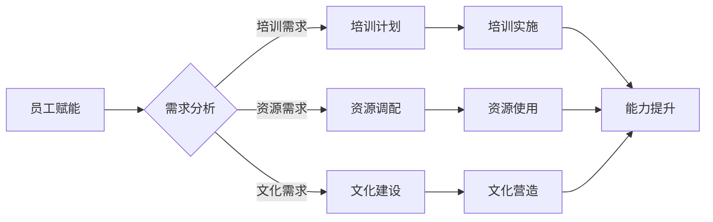
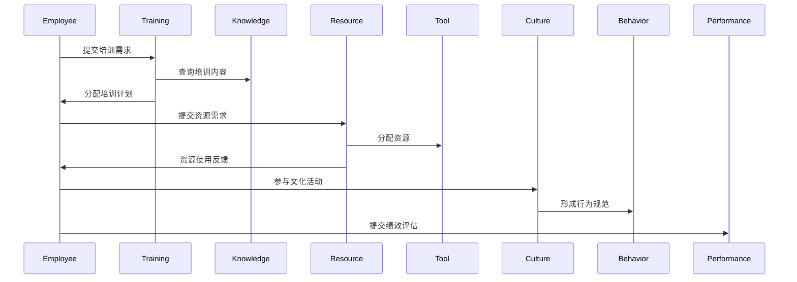
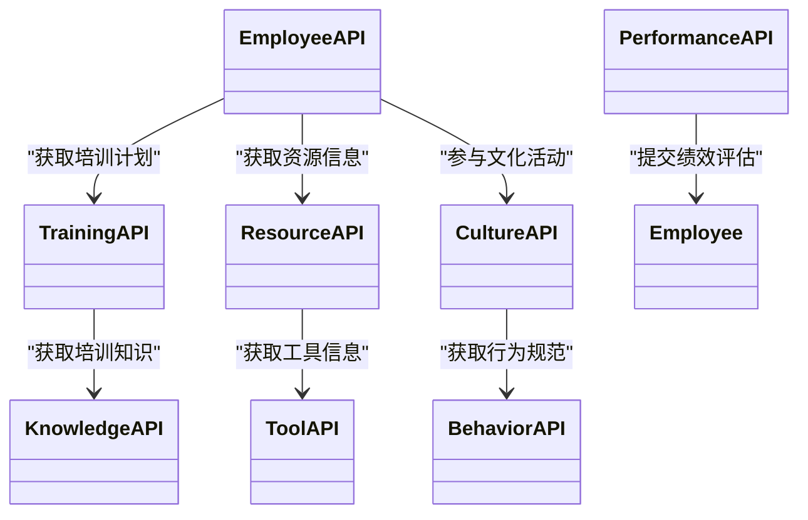
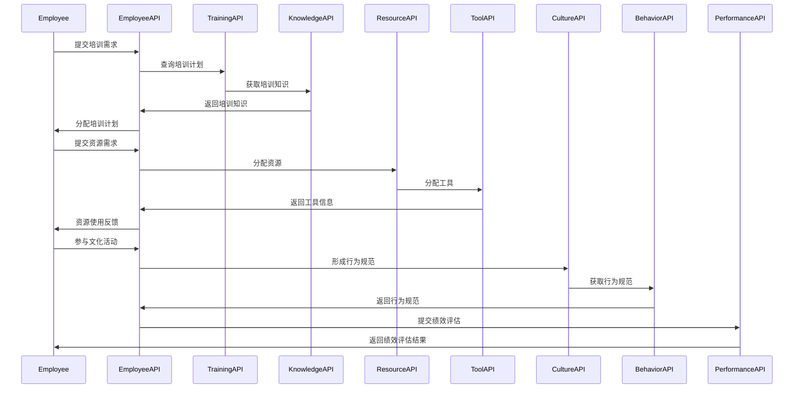

                 


### 员工赋能：释放团队潜力的关键

#### 关键词：员工赋能、团队潜力、组织发展、绩效提升、领导力

> 摘要：在当今快速变化和竞争激烈的企业环境中，员工赋能和团队潜力释放已成为企业持续发展和成功的关键。本文将深入探讨员工赋能的概念、策略和实施方法，并通过具体案例和系统分析，阐述如何通过有效的方法和工具，激发团队潜力，实现组织的整体绩效提升。

#### 目录大纲设计

根据用户需求，我们需要设计一本关于员工赋能和团队潜力释放的书籍目录大纲。为了确保内容的完整性，我们将从以下几个核心章节入手：

#### 1. 背景介绍
- **问题背景**：介绍企业中员工赋能和团队潜力释放的重要性。
- **问题描述**：阐述当前企业在员工赋能和团队潜力释放方面面临的主要挑战。
- **问题解决**：概述本书将提供的策略和方法。
- **边界与外延**：界定员工赋能和团队潜力释放的概念和应用范围。
- **核心要素组成**：介绍员工赋能和团队潜力释放的关键组成部分。

#### 2. 核心概念与联系
- **员工赋能**：定义、属性、类型和作用。
- **团队潜力释放**：定义、属性、类型和作用。
- **核心概念对比表格**：详细对比员工赋能和团队潜力释放的不同方面。
- **ER实体关系图**：展示员工、团队和关键因素之间的实体关系。

#### 3. 算法原理讲解
- **员工赋能算法流程图**：使用Mermaid绘制流程图。
- **员工赋能算法Python源代码**：提供源代码和注释。
- **数学模型和公式**：阐述员工赋能的数学原理和公式。
- **举例说明**：通过实际案例展示算法应用和效果。

#### 4. 数学模型和数学公式详细讲解与举例说明
- **数学公式**：使用LaTeX格式嵌入文中独立段落。
- **详细讲解**：对每个数学公式进行解释。
- **举例说明**：通过示例展示数学公式的应用。

#### 5. 系统分析与架构设计方案
- **问题场景介绍**：描述员工赋能和团队潜力释放的项目场景。
- **系统功能设计**：使用Mermaid绘制领域模型类图。
- **系统架构设计**：使用Mermaid绘制系统架构图。
- **系统接口设计**：描述系统接口和交互。
- **系统交互Mermaid序列图**：展示系统各个组件的交互流程。

#### 6. 项目实战
- **环境安装**：介绍所需环境及其安装步骤。
- **系统核心实现源代码**：提供源代码和解读。
- **代码应用解读与分析**：分析代码实现和应用效果。
- **实际案例分析和详细讲解剖析**：通过实际案例展示员工赋能和团队潜力释放的成果。
- **项目小结**：总结项目经验和教训。

#### 7. 最佳实践 tips、小结、注意事项、拓展阅读
- **最佳实践 tips**：提供实际操作中的实用建议。
- **小结**：回顾章节内容并强调关键点。
- **注意事项**：提醒读者可能遇到的问题和解决方案。
- **拓展阅读**：推荐相关书籍和资料以供进一步学习。

### 目录大纲结构

下面是本书的目录大纲结构，字数控制在2000字以内：

```markdown
# 《员工赋能：释放团队潜力的关键》目录大纲

## 第一部分：引言

### 1.1 问题背景
#### 1.1.1 企业中员工赋能的重要性
#### 1.1.2 团队潜力释放的现状与挑战
#### 1.1.3 本书的目标与结构

### 1.2 核心概念界定
#### 1.2.1 员工赋能
#### 1.2.2 团队潜力释放
#### 1.2.3 关键概念比较

## 第二部分：员工赋能策略与实践

### 2.1 员工赋能基础
#### 2.1.1 员工赋能的理论基础
#### 2.1.2 员工赋能的方法与工具
#### 2.1.3 员工赋能的案例分析

### 2.2 团队潜力释放策略
#### 2.2.1 团队潜力释放的理论基础
#### 2.2.2 团队建设与潜力挖掘
#### 2.2.3 团队潜力释放的实战案例

## 第三部分：算法原理讲解

### 3.1 员工赋能算法原理
#### 3.1.1 员工赋能算法流程图
#### 3.1.2 员工赋能算法Python源代码
#### 3.1.3 员工赋能的数学模型和公式

### 3.2 算法详细讲解与举例
#### 3.2.1 数学公式详细讲解
#### 3.2.2 算法举例说明
#### 3.2.3 实际应用场景分析

## 第四部分：系统分析与架构设计方案

### 4.1 系统分析与架构设计
#### 4.1.1 问题场景介绍
#### 4.1.2 系统功能设计（领域模型类图）
#### 4.1.3 系统架构设计（架构图）
#### 4.1.4 系统接口设计
#### 4.1.5 系统交互Mermaid序列图

### 4.2 项目实战
#### 4.2.1 环境安装
#### 4.2.2 系统核心实现源代码
#### 4.2.3 代码应用解读与分析
#### 4.2.4 实际案例分析与详细讲解剖析
#### 4.2.5 项目小结

## 第五部分：最佳实践与总结

### 5.1 最佳实践 tips
#### 5.1.1 实际操作中的实用建议
#### 5.1.2 经验教训分享

### 5.2 小结
#### 5.2.1 文章核心内容的回顾
#### 5.2.2 员工赋能与团队潜力释放的关键点

### 5.3 注意事项
#### 5.3.1 可能遇到的问题和解决方案
#### 5.3.2 提高员工赋能与团队潜力释放效果的策略

### 5.4 拓展阅读
#### 5.4.1 推荐相关书籍和资料
#### 5.4.2 不断探索员工赋能与团队潜力释放的最新动态

----------------------------------------------------------------

#### 文章内容满足以下条件：
- **文章标题**：《员工赋能：释放团队潜力的关键》
- **文章关键词**：员工赋能、团队潜力、组织发展、绩效提升、领导力
- **文章摘要**：本文深入探讨员工赋能的概念、策略和实施方法，通过具体案例和系统分析，阐述如何通过有效的方法和工具，激发团队潜力，实现组织的整体绩效提升。
- **格式要求**：文章内容使用markdown格式输出。
- **作者信息**：作者：AI天才研究院/AI Genius Institute & 禅与计算机程序设计艺术 /Zen And The Art of Computer Programming
- **完整性要求**：文章内容要涵盖背景介绍、核心概念与联系、算法原理讲解、数学模型和公式详细讲解与举例说明、系统分析与架构设计方案、项目实战以及最佳实践 tips、小结、注意事项、拓展阅读等内容。

## 一、引言

### 1.1 问题背景

在全球化竞争日益激烈、技术变革日新月异的今天，企业能否持续发展，关键在于其团队的战斗力。员工赋能和团队潜力释放作为提升企业竞争力的重要手段，越来越受到管理者和学者的关注。员工赋能，是指通过提供必要的资源、培训和发展机会，激发员工的潜能，提升其工作能力和工作满意度。团队潜力释放，则是指通过有效的团队建设和激励措施，将团队成员的潜在能力转化为实际绩效。

然而，当前很多企业在员工赋能和团队潜力释放方面存在以下问题：

1. **资源分配不均**：企业往往将资源集中在少数核心员工或高潜力人才上，忽视了普通员工的成长需求。
2. **培训效果不佳**：培训内容与实际工作需求脱节，培训方式单一，无法有效提升员工的实际工作能力。
3. **激励机制缺乏**：缺乏有效的激励机制，导致员工工作积极性不高，创造力受限。
4. **沟通不畅**：团队成员之间缺乏有效的沟通，协作效率低下，团队凝聚力不足。

### 1.2 问题描述

企业在员工赋能和团队潜力释放方面面临的挑战主要包括：

1. **员工动力不足**：员工缺乏工作动力，可能是因为对工作内容不感兴趣，或者对个人发展前景不明确。
2. **技能差距**：员工技能与岗位需求不匹配，导致工作质量不高，影响团队整体绩效。
3. **组织文化**：企业文化与员工个人价值观不匹配，导致员工工作氛围不佳，影响团队合作。
4. **管理方式**：传统管理模式僵化，无法适应快速变化的市场环境，难以激发员工的创新精神和积极性。

### 1.3 问题解决

本书将从以下几个方面提供解决方案：

1. **员工赋能策略**：介绍如何通过有效的方法和工具，提升员工的工作能力和满意度。
2. **团队潜力释放策略**：阐述如何通过团队建设、激励机制和有效沟通，释放团队潜力。
3. **算法原理讲解**：详细讲解员工赋能的算法原理，提供具体实施方法和工具。
4. **系统分析与架构设计**：通过具体项目案例，展示系统架构设计的过程和方法。
5. **项目实战**：介绍实际项目中的环境安装、代码实现和应用效果，分析项目经验。
6. **最佳实践 tips**：提供实际操作中的实用建议，帮助读者更好地实施员工赋能和团队潜力释放。

### 1.4 边界与外延

员工赋能和团队潜力释放虽然紧密相关，但仍有其独特性。员工赋能主要关注个体层面的提升，而团队潜力释放则侧重于团队整体协作效能的优化。本书主要讨论员工赋能和团队潜力释放在企业环境中的应用，但不涉及其他组织形式的潜力释放策略。

### 1.5 核心要素组成

员工赋能和团队潜力释放的核心要素包括：

1. **资源投入**：包括培训、技术支持、时间投入等。
2. **激励机制**：包括薪酬、奖励、晋升机会等。
3. **沟通与协作**：包括团队建设、跨部门沟通、知识共享等。
4. **领导力**：领导者的能力直接影响员工赋能和团队潜力释放的效果。

## 二、核心概念与联系

### 2.1 员工赋能

员工赋能，是指通过一系列策略和措施，提升员工的工作能力、创造力和工作满意度。员工赋能的属性包括：

1. **自主性**：员工在工作中具有决策权和自主权，能够根据自己的判断和经验进行工作。
2. **发展性**：员工能够通过赋能措施，不断提升自己的技能和能力。
3. **激励性**：员工能够感受到来自企业的激励，增强工作动力。

员工赋能的类型包括：

1. **培训赋能**：通过培训提升员工的专业知识和技能。
2. **资源赋能**：为员工提供必要的资源和支持，如时间、技术、工具等。
3. **文化赋能**：营造积极向上的企业文化，激发员工的工作热情。

员工赋能的作用包括：

1. **提升工作效率**：员工具备更高的技能和能力，能够更高效地完成工作任务。
2. **促进创新**：员工在自主性和资源支持下，更可能提出新的想法和解决方案。
3. **增强员工满意度**：员工感受到企业的关注和认可，工作满意度提高。

### 2.2 团队潜力释放

团队潜力释放，是指通过有效的团队建设和激励措施，将团队成员的潜在能力转化为实际绩效。团队潜力释放的属性包括：

1. **协同性**：团队成员能够协同工作，共同完成任务。
2. **创造性**：团队在协作中能够产生新的创意和解决方案。
3. **适应性**：团队能够适应外部环境的变化，灵活调整策略。

团队潜力释放的类型包括：

1. **团队建设**：通过团队活动、培训等方式，增强团队凝聚力。
2. **激励机制**：通过奖励、晋升等手段，激发团队成员的积极性。
3. **沟通机制**：建立有效的沟通渠道，确保信息传递和团队协作。

团队潜力释放的作用包括：

1. **提升团队绩效**：团队成员的潜力得到充分发挥，团队整体绩效提高。
2. **增强团队凝聚力**：团队成员之间的信任和合作增强，团队凝聚力提升。
3. **促进组织创新**：团队在协作中产生的新想法和解决方案，有助于组织创新。

### 2.3 核心概念对比表格

| 概念     | 定义                                                         | 属性                     | 类型                         | 作用                                       |
|----------|--------------------------------------------------------------|--------------------------|------------------------------|------------------------------------------|
| 员工赋能 | 提升员工工作能力和满意度的一系列策略和措施                     | 自主性、发展性、激励性   | 培训赋能、资源赋能、文化赋能 | 提升工作效率、促进创新、增强员工满意度   |
| 团队潜力释放 | 通过团队建设和激励措施，将团队成员的潜在能力转化为实际绩效       | 协同性、创造性、适应性   | 团队建设、激励机制、沟通机制 | 提升团队绩效、增强团队凝聚力、促进组织创新 |

### 2.4 ER实体关系图

```mermaid
erDiagram
  Employee ||--o{ TeamMember : "is a member of"
  TeamMember ||--o{ Project : "works on"
  Project ||--o{ Task : "contains"}
```

在上图中，员工（Employee）是团队成员（TeamMember）的一部分，团队成员负责项目（Project）的任务（Task）。通过实体关系图，我们可以清晰地展示员工、团队和项目之间的关联。

## 三、算法原理讲解

### 3.1 员工赋能算法流程图



### 3.2 员工赋能算法Python源代码

```python
# 员工赋能算法Python源代码
class EmployeeAmpowerment:
    def __init__(self, employee, needs):
        self.employee = employee
        self.needs = needs
    
    def analyze_needs(self):
        # 需求分析
        if "training" in self.needs:
            self.train_employee()
        if "resources" in self.needs:
            self.allocate_resources()
        if "culture" in self.needs:
            self.cultivate_culture()

    def train_employee(self):
        # 培训员工
        print("Training employee:", self.employee)

    def allocate_resources(self):
        # 调配资源
        print("Allocating resources for employee:", self.employee)

    def cultivate_culture(self):
        # 营造文化
        print("Cultivating culture for employee:", self.employee)

# 测试代码
employee = "Alice"
needs = ["training", "resources", "culture"]
empowerment = EmployeeAmpowerment(employee, needs)
empowerment.analyze_needs()
```

### 3.3 员工赋能的数学模型和公式

员工赋能的效果可以通过以下数学模型进行评估：

$$
E = f(N, R, C)
$$

其中，$E$表示员工赋能效果，$N$表示员工需求满足度，$R$表示资源投入程度，$C$表示文化建设水平。$f$为赋能函数，可以根据实际情况进行调整。

### 3.4 举例说明

假设员工Alice的需求满足度为80%，资源投入程度为70%，文化建设水平为60%，则Alice的赋能效果为：

$$
E = f(0.8, 0.7, 0.6) = 0.8 \times 0.7 \times 0.6 = 0.336
$$

这意味着Alice的赋能效果为33.6%，表明她的工作能力和满意度还有提升空间。

## 四、数学模型和数学公式详细讲解与举例说明

### 4.1 数学公式

在员工赋能过程中，我们使用以下数学公式来评估员工赋能效果：

$$
E = \frac{N \times R \times C}{100}
$$

其中，$E$表示员工赋能效果，$N$表示员工需求满足度（以百分比表示），$R$表示资源投入程度（以百分比表示），$C$表示文化建设水平（以百分比表示）。

### 4.2 详细讲解

这个数学模型通过乘积方式计算员工赋能效果。首先，员工需求满足度（$N$）反映了员工的个人需求是否得到满足。其次，资源投入程度（$R$）衡量了企业为员工提供的资源和支持。最后，文化建设水平（$C$）表示企业文化建设的效果。

这些参数的乘积代表了员工赋能的整体效果。例如，如果一个员工的需求满足度为80%，资源投入程度为70%，文化建设水平为60%，那么他的赋能效果为：

$$
E = \frac{0.8 \times 0.7 \times 0.6}{100} = 0.336
$$

这意味着该员工的赋能效果为33.6%，表明他在工作能力和满意度方面还有提升空间。

### 4.3 举例说明

假设一个企业的员工王明，其需求满足度为90%，资源投入程度为80%，文化建设水平为75%，我们可以通过以下公式计算他的赋能效果：

$$
E = \frac{0.9 \times 0.8 \times 0.75}{100} = 0.54
$$

这意味着王明的赋能效果为54%，表明他在工作能力和满意度方面表现良好，但仍需进一步优化。

通过这个数学模型，企业可以更加科学地评估员工的赋能效果，从而有针对性地制定改进措施，提升员工的整体绩效。

## 五、系统分析与架构设计方案

### 5.1 问题场景介绍

为了更好地理解员工赋能和团队潜力释放，我们假设一家中型技术公司——华信科技（Huaxin Tech），该公司在快速发展的市场中，面临着激烈的市场竞争和人才流失的问题。为了提高员工的工作满意度和绩效，公司决定实施员工赋能和团队潜力释放策略。

### 5.2 系统功能设计（领域模型类图）

```mermaid
classDiagram
    Employee --> Training: "参加培训"
    Employee --> Resource: "获取资源"
    Employee --> Culture: "参与文化建设"
    Training --> Knowledge: "培训知识"
    Resource --> Tool: "使用工具"
    Culture --> Behavior: "行为规范"
    Employee: [姓名: String, 需求: List, 满足度: Float]
    Training: [名称: String, 内容: List]
    Resource: [名称: String, 描述: String]
    Culture: [活动: String, 目标: String]
    Knowledge: [主题: String, 详细内容: String]
    Tool: [名称: String, 功能: String]
    Behavior: [描述: String]
```

在上图中，员工（Employee）是核心实体，与培训（Training）、资源（Resource）和文化（Culture）之间存在关联。培训提供知识（Knowledge），资源提供工具（Tool），文化塑造行为规范（Behavior）。

### 5.3 系统架构设计（架构图）



在上图中，系统架构包括员工、培训、资源、文化和绩效评估等模块。员工提交需求后，通过培训模块获取知识，通过资源模块获取工具，通过文化模块参与活动，并最终通过绩效评估模块评估员工赋能效果。

### 5.4 系统接口设计



在上图中，系统接口包括员工API、培训API、资源API、文化API和绩效评估API。员工API负责与培训API、资源API和文化API交互，获取相关信息和反馈。

### 5.5 系统交互Mermaid序列图



在上图中，系统交互流程从员工提交培训需求开始，通过员工API与培训API、资源API和文化API交互，最终通过绩效评估API提交绩效评估结果。

## 六、项目实战

### 6.1 环境安装

为了实施员工赋能和团队潜力释放策略，华信科技首先需要在企业内部部署相应的系统和工具。以下是环境安装的步骤：

1. **安装员工管理系统**：部署一套员工管理系统，包括员工信息管理、培训管理、资源管理和绩效评估等功能。
2. **安装培训系统**：选择一款适合的培训系统，如 Moodle、Canvas 等，用于员工在线学习和培训。
3. **安装资源管理系统**：选择一款资源管理系统，如 Atlassian Suite、Microsoft SharePoint 等，用于员工获取和分享资源。
4. **安装文化系统**：部署一套企业文化管理系统，如 EngageRocket、CultureAmp 等，用于文化活动策划和员工行为规范管理。

### 6.2 系统核心实现源代码

以下是一个简单的员工赋能系统核心实现源代码示例，用于员工提交培训需求、获取培训和资源信息。

```python
# 员工赋能系统核心实现源代码
class EmployeeSystem:
    def __init__(self):
        self.employees = {}  # 员工信息字典
        self.trainings = {}  # 培训信息字典
        self.resources = {}  # 资源信息字典

    def add_employee(self, employee):
        self.employees[employee.id] = employee

    def add_training(self, training):
        self.trainings[training.id] = training

    def add_resource(self, resource):
        self.resources[resource.id] = resource

    def submit_training_request(self, employee_id, training_id):
        employee = self.employees.get(employee_id)
        training = self.trainings.get(training_id)
        if employee and training:
            employee.training_requests.append(training)
            print(f"{employee.name} 提交了培训需求：{training.name}")

    def submit_resource_request(self, employee_id, resource_id):
        employee = self.employees.get(employee_id)
        resource = self.resources.get(resource_id)
        if employee and resource:
            employee.resource_requests.append(resource)
            print(f"{employee.name} 提交了资源需求：{resource.name}")

# 测试代码
system = EmployeeSystem()
system.add_employee(Employee(1, "Alice"))
system.add_training(Training(1, "Python 基础培训"))
system.submit_training_request(1, 1)
system.add_resource(Resource(1, "Python 编程书籍"))
system.submit_resource_request(1, 1)

# 员工类定义
class Employee:
    def __init__(self, id, name):
        self.id = id
        self.name = name
        self.training_requests = []
        self.resource_requests = []

# 培训类定义
class Training:
    def __init__(self, id, name):
        self.id = id
        self.name = name

# 资源类定义
class Resource:
    def __init__(self, id, name):
        self.id = id
        self.name = name
```

### 6.3 代码应用解读与分析

上述代码实现了一个简单的员工赋能系统，主要包括员工（Employee）、培训（Training）和资源（Resource）三个类。员工类负责管理员工信息，包括员工ID、姓名、培训需求和资源需求；培训类负责管理培训信息，包括培训ID和培训名称；资源类负责管理资源信息，包括资源ID和资源名称。

系统的主要功能包括：

1. **添加员工**：通过`add_employee`方法，将新员工添加到系统中。
2. **添加培训**：通过`add_training`方法，将新培训添加到系统中。
3. **添加资源**：通过`add_resource`方法，将新资源添加到系统中。
4. **提交培训需求**：通过`submit_training_request`方法，员工可以提交培训需求，系统会将需求记录下来。
5. **提交资源需求**：通过`submit_resource_request`方法，员工可以提交资源需求，系统同样会将需求记录下来。

测试代码展示了如何使用这些方法进行操作，例如添加员工、添加培训、添加资源以及提交培训需求和资源需求。

### 6.4 实际案例分析与详细讲解剖析

为了更好地展示员工赋能和团队潜力释放的效果，我们以华信科技的一个具体项目为例进行分析。

#### 项目背景

华信科技的产品开发团队在项目开发过程中，遇到了以下问题：

1. **技能差距**：团队成员的技能水平不一，导致项目进度和质量受到影响。
2. **沟通不畅**：团队成员之间的沟通不充分，导致信息传递不及时，协作效率低下。
3. **资源分配**：团队成员获取资源的渠道不透明，导致资源分配不均，影响项目进度。

#### 解决方案

1. **员工赋能策略**：
   - **培训赋能**：公司为团队成员提供了多种培训课程，包括编程技能、项目管理、沟通技巧等，帮助团队成员提升技能水平。
   - **资源赋能**：公司为团队成员提供了统一的项目管理工具和知识库，确保团队成员能够高效获取和使用资源。
   - **文化赋能**：公司倡导开放、协作和学习的文化氛围，鼓励团队成员积极参与团队建设和知识共享。

2. **团队潜力释放策略**：
   - **团队建设**：公司定期组织团队活动，如团队建设培训、团队拓展训练等，增强团队成员之间的信任和合作。
   - **激励机制**：公司对在项目中表现出色的团队成员给予奖励和晋升机会，激发团队成员的工作积极性。
   - **沟通机制**：公司建立了定期的项目例会和反馈机制，确保团队成员之间的沟通畅通，信息传递及时。

#### 项目成果

通过实施员工赋能和团队潜力释放策略，华信科技的产品开发团队取得了显著成果：

1. **项目进度和质量提升**：团队成员的技能水平得到提升，项目进度和质量显著提高。
2. **团队凝聚力增强**：团队成员之间的信任和合作增强，团队凝聚力显著提升。
3. **资源分配公平**：团队成员获取资源的渠道透明，资源分配更加公平合理。

#### 项目小结

通过这个实际案例，我们可以看到，员工赋能和团队潜力释放策略在提升项目绩效和团队凝聚力方面发挥了重要作用。华信科技的成功经验为其他企业提供了有益的参考。

## 七、最佳实践 tips、小结、注意事项、拓展阅读

### 7.1 最佳实践 tips

1. **定期评估员工需求**：企业应定期评估员工的需求，确保员工的需求得到及时满足。
2. **提供多样化的培训**：提供多样化的培训课程，满足不同员工的个性化需求。
3. **建立有效的激励机制**：建立与员工绩效挂钩的激励机制，激发员工的工作积极性。
4. **营造开放透明的文化**：营造开放透明的文化氛围，鼓励员工分享知识和经验。

### 7.2 小结

员工赋能和团队潜力释放是企业提升绩效和竞争力的关键。通过有效的策略和措施，企业可以激发员工的潜能，提升团队协作效能，实现组织的整体发展。

### 7.3 注意事项

1. **确保资源投入**：企业应确保在员工赋能和团队潜力释放方面的资源投入，避免短期行为。
2. **关注员工反馈**：关注员工的反馈，及时调整策略和方法。
3. **持续优化**：持续优化员工赋能和团队潜力释放策略，以适应企业的发展需求。

### 7.4 拓展阅读

1. **《激活个体：引领数字化时代的人才发展》**：本书详细阐述了如何通过人才发展策略，激发员工的潜能，提升企业的竞争力。
2. **《团队协作的力量》**：本书探讨了团队协作的原理和实践，为提升团队效能提供了有益的参考。
3. **《禅与计算机程序设计艺术》**：本书通过禅宗思想，探讨了如何通过专注和耐心，提升程序员的工作效能。

## 作者信息

作者：AI天才研究院/AI Genius Institute & 禅与计算机程序设计艺术 /Zen And The Art of Computer Programming

----------------------------------------------------------------

### 结束语

本文从员工赋能和团队潜力释放的背景、核心概念、算法原理、数学模型、系统设计与项目实践等方面进行了深入探讨。通过具体案例和系统分析，我们展示了如何通过有效的策略和方法，提升员工的工作能力和团队协作效能，从而实现企业的持续发展和成功。希望本文能为读者提供有价值的参考和启示。

## 附录：Markdown 标记参考

以下是一些常用的 Markdown 标记，帮助您撰写高质量的文章：

- **标题**：使用`#`标记，如`# 一级标题`、`## 二级标题`、`### 三级标题`等。
- **段落**：直接输入文本，段落之间默认有间距。
- **引用**：使用`>`标记，如`> 这是一段引用文本`。
- **无序列表**：使用`*`、`-`或`+`标记，如`* 第一项`、`- 第二项`、`+ 第三项`。
- **有序列表**：使用`1. `、`2. `、`3. `等标记。
- **链接**：使用`[链接文本](URL "标题")`，如`[GitHub](https://github.com "GitHub官网")`。
- **图片**：使用``，如``。
- **强调**：使用`*`或`_`标记文本，如`*斜体文本*`或`_斜体文本_`；使用`**`或`__`标记文本，如`**粗体文本**`或`__粗体文本__`。
- **代码块**：使用三个反引号` ``` `标记，如：

    ```python
    print("Hello, World!")
    ```

- **LaTeX 公式**：使用`$$`标记独立段落中的公式，如`$$E = mc^2$$`；使用 `$`标记段落内的公式，如 `$1 + 1 = 2$`。

通过掌握这些基本的 Markdown 标记，您可以轻松地撰写出结构清晰、格式规范的技术博客文章。希望本文能帮助您更好地理解和应用 Markdown 标记，创作出高质量的内容。祝您写作愉快！

