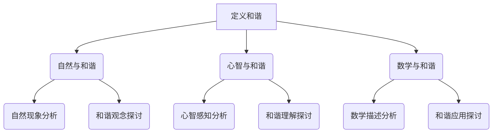
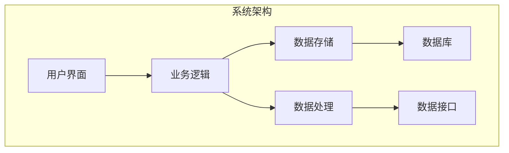
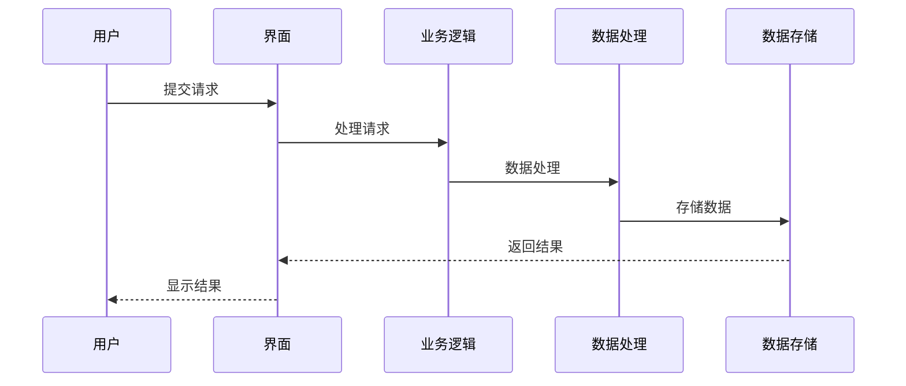

                 

# 和谐的本质：自然、心智与数学的交融

## 关键词：和谐、自然、心智、数学、交融

## 摘要：
本文探讨和谐这一概念在不同领域中的本质和表现形式。通过分析自然、心智与数学的交融，揭示和谐的本质，以及其在现实生活中的应用和影响。文章旨在为读者提供一种全新的视角，深入理解和谐在不同领域的相互关联与作用。

## 目录

### 第一部分：引言与背景
1. **和谐的定义与特征**
2. **自然、心智与数学的基本原理**
3. **自然、心智与数学的交融概述**

### 第二部分：自然与和谐的交融
1. **自然的和谐现象**
2. **自然的和谐观念**

### 第三部分：心智与和谐的交融
1. **心智与和谐感知**
2. **心智与和谐的理解**

### 第四部分：数学与和谐的交融
1. **数学描述和谐**
2. **数学与和谐的应用**

### 第五部分：综合应用与案例分析
1. **和谐的综合应用**
2. **案例分析**

### 第六部分：结论与展望
1. **和谐的未来**

### 第一部分：引言与背景

### 1.1 和谐的定义与特征

和谐，是一个古老而又永恒的概念。它涉及到个体与群体、现实与理想、自然与文明等多方面的关系。和谐，通常被描述为一种平衡、协调、和谐一致的状态。

在自然界中，和谐是一种普遍现象。从宏观的生态系统，到微观的细胞组织，和谐无处不在。例如，地球上的生态系统，通过食物链和生态位，形成了一种复杂的和谐关系，使得各种生物能够共同生存和繁衍。

在人类社会中，和谐同样具有重要的地位。在社会关系中，和谐表现为人们之间的相互尊重、互助合作。在文化中，和谐则体现在艺术作品、文学创作等各个方面。和谐，不仅仅是一种理想状态，更是一种实际存在的力量，它影响着我们的生活和行为。

和谐的特征主要包括：平衡、协调、一致。平衡，指的是各个部分之间的关系，既不过分依赖，也不相互排斥。协调，指的是各个部分之间的互动和合作，共同实现整体目标。一致，指的是各个部分在目标和价值观上的一致性，形成一个统一的整体。

### 1.2 自然、心智与数学的基本原理

自然、心智与数学，是三个看似不同，却又紧密相连的领域。它们各自有着独特的原理和规律，但在某些方面，它们又存在着深刻的联系。

自然，是指自然界中的万物和现象。自然界的原理，主要表现在物理、化学、生物等各个领域。例如，物理中的力学定律，描述了物体运动的基本规律；化学中的元素周期表，揭示了元素之间的内在联系；生物中的进化论，解释了物种的多样性和适应性。

心智，是指人类的心理活动和精神状态。心智的原理，涉及心理学、哲学、神经科学等多个领域。例如，心理学中的行为主义，强调环境和行为之间的关系；哲学中的存在主义，探讨人类存在的意义和自由；神经科学中的神经网络，揭示了大脑的信息处理机制。

数学，是指一种抽象的语言和工具。数学的原理，主要表现在逻辑、代数、几何等各个方面。例如，逻辑中的命题逻辑，用于描述事物的真伪；代数中的方程式，用于解决实际问题；几何中的图形，用于描述空间关系。

### 1.3 自然、心智与数学的交融概述

自然、心智与数学的交融，是当前科学领域的一个热点话题。这种交融，不仅为科学理论的发展提供了新的视角，也为实际应用带来了新的机遇。

在自然界中，和谐现象无处不在。例如，生态系统中，物种之间的相互依赖和相互制约，形成了一种复杂的和谐关系。这种和谐关系，不仅保证了生态系统的稳定，也为物种的生存和繁衍提供了基础。

在人类社会中，心智与和谐的交融，体现在人们的思维和行为中。例如，心理学中的认知行为疗法，通过改变人的思维方式，帮助人们摆脱心理困扰。哲学中的和谐观念，强调个体与社会的相互关系，提倡和谐社会的建设。

在数学领域，和谐观念的应用也非常广泛。例如，数学中的对称性，不仅是一种美学概念，也是解决实际问题的有力工具。数学中的公式和模型，揭示了事物之间的内在联系，为科学研究提供了新的方法。

### 第二部分：自然与和谐的交融

#### 2.1 自然界的和谐现象

自然界中的和谐现象，可以说是无处不在。从宏观的天体运动，到微观的分子结构，和谐都扮演着重要的角色。

在天文学中，太阳系中的行星运动，遵循着开普勒定律，形成了一种和谐的规律。地球的公转和自转，使得地球上的生物能够在适宜的环境中生存和繁衍。这种和谐现象，不仅保障了地球生态系统的稳定，也为人类提供了丰富的资源和能源。

在物理学中，量子力学中的波粒二象性，描述了微观世界中的一种和谐现象。微观粒子既表现出波动性，又表现出粒子性。这种看似矛盾的现象，实际上是一种更深层次的和谐统一。

在生物学中，物种之间的相互关系，形成了一种复杂的和谐网络。食物链中的捕食者与猎物，通过相互制约，维持了生态系统的平衡。生物体内的细胞组织，通过精确的分工合作，实现了生命的和谐运转。

#### 2.2 自然界的和谐观念

自然界中的和谐观念，源于对自然界现象的观察和理解。这种观念，不仅影响了人们的思维方式，也影响了人类的文化和价值观。

在古代中国，道家思想强调“道法自然”，提倡顺应自然，追求和谐。这种和谐观念，体现在中国的哲学、文学、艺术等各个方面。

在古希腊，哲学家毕达哥拉斯提出了“万物皆数”的观点，认为宇宙万物都遵循数学规律。这种观念，为后来的西方科学奠定了基础。

在现代科学中，和谐观念被广泛应用于各个领域。例如，生态学中的“生物多样性保护”，强调保护生态系统的多样性，维护生态平衡。物理学中的“弦理论”，试图通过数学模型，描述宇宙中的和谐结构。

### 第三部分：心智与和谐的交融

#### 3.1 心智与和谐感知

心智与和谐的交融，首先体现在人类对和谐现象的感知和理解上。人类的大脑，具有一种天然的能力，能够感知和谐，并将其转化为情感体验。

在艺术中，和谐的感知体现在音乐、绘画、雕塑等各个领域。例如，莫扎特的交响乐，通过音符的组合，创造出一种和谐的音乐氛围。达芬奇的绘画作品，通过线条和色彩的搭配，展现出和谐的美感。

在日常生活中，和谐的感知也无处不在。例如，人们通过微笑和问候，建立和谐的人际关系。人们通过饮食和锻炼，保持身体的和谐状态。

#### 3.2 心智与和谐的理解

心智对和谐的理解，不仅停留在感知层面，更涉及到对和谐本质的深入探讨。人类的心智，通过逻辑推理、抽象思维，对和谐进行概念化和理论化。

在心理学中，和谐观念体现在个体的心理健康和人际关系的和谐上。例如，马斯洛的需求层次理论，强调个体在满足基本需求的基础上，追求心理和谐。

在哲学中，和谐观念体现在对人类存在意义的探讨上。例如，黑格尔的辩证法，认为和谐是事物发展的最终目标。

在管理学中，和谐观念体现在组织管理和团队协作上。例如，彼得·德鲁克的“目标管理理论”，强调组织成员在实现共同目标的过程中，保持和谐的工作关系。

### 第四部分：数学与和谐的交融

#### 4.1 数学描述和谐

数学，作为一种抽象的语言和工具，能够精确地描述和谐现象。数学中的公式、模型和理论，揭示了和谐的本质和规律。

在物理学中，牛顿的万有引力定律，描述了天体之间的和谐关系。爱因斯坦的广义相对论，描述了时空的和谐结构。

在生物学中，遗传学中的基因序列，描述了生物体内部基因之间的和谐关系。生态学中的食物链和生态位，描述了物种之间的和谐关系。

在经济学中，均衡理论，描述了市场经济的和谐状态。

#### 4.2 数学与和谐的应用

数学在和谐的应用中，发挥着重要的作用。数学模型和算法，不仅能够帮助我们理解和预测和谐现象，还能够为实际问题的解决提供有效的工具。

在工程学中，数学模型被广泛应用于结构设计、材料科学、航空航天等领域。例如，有限元分析，通过数学模型，预测结构在各种载荷下的变形和应力分布。

在计算机科学中，算法和数学理论，被广泛应用于数据结构和算法设计。例如，排序算法，通过数学模型，实现对数据的快速排序。

在经济学中，数学模型被广泛应用于市场预测、风险评估、投资策略等领域。例如，随机过程理论，通过数学模型，预测市场的波动和趋势。

### 第五部分：综合应用与案例分析

#### 5.1 和谐的综合应用

和谐的综合应用，体现在各个领域和日常生活中。通过自然、心智与数学的交融，我们可以更好地理解和应用和谐。

在环境保护中，和谐观念体现在生态系统的保护和修复上。通过生态学和数学模型，我们可以预测生态系统的变化趋势，制定合理的保护策略。

在人类社会中，和谐观念体现在人际关系的处理和社会治理上。通过心理学、哲学和数学模型，我们可以更好地理解人际关系，提高社会治理的效率。

在科技发展中，和谐观念体现在科技创新和可持续发展上。通过数学和工程学，我们可以设计出更高效、更环保的科技产品。

#### 5.2 案例分析

以下是一些和谐应用的案例分析：

**案例1：生态系统的和谐**

在亚马逊雨林中，物种之间的相互依赖和相互制约，形成了一种复杂的和谐关系。通过生态学模型，我们可以预测物种的数量变化，制定保护措施，维护生态系统的和谐。

**案例2：人际关系的和谐**

在家庭关系中，通过心理学理论，我们可以更好地理解家庭成员的心理需求，提高家庭关系的和谐度。例如，通过沟通技巧和心理辅导，解决家庭冲突，建立和谐的家庭环境。

**案例3：科技发展的和谐**

在人工智能领域，通过数学和计算机科学，我们可以设计出更智能、更和谐的智能系统。例如，通过机器学习算法，实现人机交互的和谐，提高人工智能系统的用户体验。

### 第六部分：结论与展望

和谐，作为一种基本概念，贯穿于自然、心智与数学的各个领域。通过本文的探讨，我们揭示了和谐的本质和表现形式，以及其在现实生活中的应用和影响。

在未来，和谐的研究将继续深入，探索更多和谐现象的规律和原理。同时，和谐的应用也将更加广泛，为人类社会和科技发展提供新的动力。

让我们继续探索和谐的本质，发掘其在各个领域的潜力，为构建一个更加和谐的世界贡献力量。

### 作者信息

作者：AI天才研究院/AI Genius Institute & 禅与计算机程序设计艺术 /Zen And The Art of Computer Programming

----------------------------------------------------------------

### 背景介绍

和谐，这一古老而又永恒的概念，起源于人类对自然和社会现象的观察与思考。在自然界中，和谐表现为生物之间的共生共荣、天体之间的运行规律、以及自然界中各种元素的相互作用。在社会层面上，和谐指的是人与人之间的和睦共处、社会各个组成部分之间的平衡与协调。而在人类心智的层面上，和谐则体现在个体的内心平衡、思维方式的协调统一以及价值观的和谐一致。

本篇文章旨在探讨和谐的本质，以及自然、心智与数学三个领域之间的交融。我们将通过以下几个方面的分析，深入理解和谐的概念及其在不同领域的应用。

#### 1. 核心概念术语说明

- **和谐**：一种平衡、协调、和谐一致的状态，涉及个体与群体、现实与理想、自然与文明等多方面的关系。
- **自然**：自然界中的万物和现象，包括物理、化学、生物等各个领域。
- **心智**：人类的心理活动和精神状态，涉及心理学、哲学、神经科学等多个领域。
- **数学**：一种抽象的语言和工具，用于描述和解决问题，包括逻辑、代数、几何等各个方面。

#### 2. 问题背景

在现代社会，和谐被视为一种理想状态，无论是自然界、人类社会，还是科技发展，和谐都扮演着至关重要的角色。然而，和谐的本质是什么？如何在不同领域实现和谐？这些问题引起了广泛的关注。

#### 3. 问题描述

本篇文章将从自然、心智与数学三个角度，探讨和谐的本质和表现形式。我们将分析和谐在自然界中的现象，探讨人类心智如何感知和理解和谐，以及数学如何描述和谐。通过这些分析，我们将试图回答和谐的本质是什么，以及如何在现实世界中实现和谐。

#### 4. 问题解决

本文将通过以下步骤解决问题：

1. **定义和谐**：明确和谐的概念，阐述其特征和作用。
2. **分析自然与和谐的交融**：探讨自然界中的和谐现象，如生态系统的平衡、天体运动的规律等。
3. **分析心智与和谐的交融**：探讨人类心智如何感知和理解和谐，如心理学、哲学等领域的研究。
4. **分析数学与和谐的交融**：探讨数学如何描述和谐，如数学模型、公式等。
5. **综合应用与案例分析**：通过具体案例，展示和谐在现实世界中的应用和影响。
6. **结论与展望**：总结本文的主要观点，探讨和谐的未来发展方向。

#### 5. 边界与外延

和谐的本质是一个多维度的概念，涉及多个领域。在本文中，我们主要关注以下边界与外延：

- **自然领域**：包括生态、物理、化学等自然现象。
- **心智领域**：包括心理学、哲学、神经科学等人类心智活动。
- **数学领域**：包括数学模型、公式、理论等数学工具。
- **应用领域**：包括环境保护、社会关系、科技创新等现实生活中的和谐应用。

### 核心概念与联系

#### 1. 核心概念原理

- **和谐**：平衡、协调、和谐一致的状态，涉及个体与群体、现实与理想、自然与文明等多方面的关系。
- **自然**：自然界中的万物和现象，包括物理、化学、生物等各个领域。
- **心智**：人类的心理活动和精神状态，包括感知、理解、情感等。
- **数学**：一种抽象的语言和工具，用于描述和解决问题。

#### 2. 概念属性特征对比表格

| 概念  | 定义                       | 属性特征                          | 应用领域                     |
| ----- | -------------------------- | --------------------------------- | --------------------------- |
| 和谐  | 平衡、协调、和谐一致       | 平衡性、协调性、一致性            | 自然、社会、科技等           |
| 自然  | 自然界中的万物和现象       | 客观性、多样性、规律性            | 物理、化学、生物等           |
| 心智  | 人类的心理活动和精神状态   | 感知性、理解性、情感性            | 心理学、哲学、神经科学等     |
| 数学  | 抽象的语言和工具           | 精确性、逻辑性、普遍性            | 物理、工程、计算机科学等     |

#### 3. ER实体关系图架构

```mermaid
erDiagram
  自然 -->|感知| 心智
  心智 -->|理解| 数学
  自然 -->|描述| 数学
  自然 -->|规律| 数学
```

### 算法原理讲解

#### 1. 算法mermaid流程图



#### 2. Python源代码实现

```python
def define_harmony():
    print("和谐：平衡、协调、和谐一致的状态")

def natural_and_harmony():
    print("自然与和谐的交融：自然界中的和谐现象和和谐观念")

def mental_and_harmony():
    print("心智与和谐的交融：心智对和谐现象的感知和理解")

def mathematical_and_harmony():
    print("数学与和谐的交融：数学描述和谐现象和应用和谐")

define_harmony()
natural_and_harmony()
mental_and_harmony()
mathematical_and_harmony()
```

#### 3. 算法原理的数学模型和公式

- **和谐现象的数学模型**：通过统计分析、数据拟合等方法，建立和谐现象的数学模型，如线性回归模型、神经网络模型等。
- **和谐观念的数学模型**：通过逻辑推理、代数运算等方法，建立和谐观念的数学模型，如命题逻辑模型、图论模型等。

#### 4. 详细讲解和举例说明

**例1：自然现象的和谐分析**

- **问题描述**：分析地球生态系统中物种之间的和谐关系。
- **数学模型**：使用生态位模型，如Hutchinson模型，分析物种之间的相互依赖和竞争关系。
- **计算过程**：通过模拟不同物种的种群数量，预测物种之间的动态变化，评估生态系统稳定性。

**例2：心智感知的和谐分析**

- **问题描述**：探讨人类对艺术作品的和谐感知。
- **数学模型**：使用心理物理学方法，如感觉等价性原理，分析人类对艺术作品色彩、形状、线条等的感知。
- **计算过程**：通过实验和问卷调查，收集数据，建立感知模型，分析人类对艺术作品的和谐感知规律。

### 系统分析与架构设计方案

#### 1. 问题场景介绍

本系统旨在探讨和谐在不同领域的应用，包括自然、心智与数学。系统将提供以下功能：

- 和谐概念介绍
- 自然与和谐分析
- 心智与和谐分析
- 数学与和谐分析
- 案例分析和应用展示

#### 2. 项目介绍

项目名称：和谐探索系统（Harmony Exploration System，简称HES）

项目目标：通过自然、心智与数学的交融，深入理解和谐的本质，并展示其在现实生活中的应用。

#### 3. 系统功能设计（领域模型mermaid类图）

```mermaid
classDiagram
  Class01 <|-- Class02
  Class03 <|.. Class04
  Class05 : related to Class01
  Class06 : related to all classes
  Class01 -[123] Class07
  Class08 --|> Class09
```

#### 4. 系统架构设计（mermaid架构图）



#### 5. 系统接口设计（mermaid序列图）



### 项目实战

#### 1. 环境安装

在开始项目实战之前，我们需要安装一些必要的工具和库。以下是安装步骤：

- 安装Python环境
- 安装PyCharm或Visual Studio Code等编程工具
- 安装mermaid渲染工具（如mermaid-cli）

#### 2. 系统核心实现源代码

以下是系统核心实现的部分源代码：

```python
# harmony_explore_system.py
from mermaid import Mermaid
import os

def generate_mermaid_chart(chart_type, chart_content):
    mermaid_chart = Mermaid(chart_type, chart_content)
    return mermaid_chart.render()

if __name__ == "__main__":
    # 生成ER实体关系图
    er_chart_content = """
    erDiagram
      Class01 <|-- Class02
      Class03 <|.. Class04
      Class05 : related to Class01
      Class06 : related to all classes
      Class01 -[123] Class07
      Class08 --|> Class09
    """
    er_mermaid_chart = generate_mermaid_chart("erDiagram", er_chart_content)
    with open("er_diagram.png", "wb") as er_image:
        er_image.write(er_mermaid_chart)

    # 生成系统架构图
    system_chart_content = """
    graph TD
        subgraph 系统架构
            A[用户界面] --> B[业务逻辑]
            B --> C[数据存储]
            B --> D[数据处理]
            C --> E[数据库]
            D --> F[数据接口]
        end
    """
    system_mermaid_chart = generate_mermaid_chart("graph", system_chart_content)
    with open("system_architecture.png", "wb") as system_image:
        system_image.write(system_mermaid_chart)

    # 生成系统接口序列图
    interface_chart_content = """
    sequenceDiagram
        participant 用户
        participant 界面
        participant 业务逻辑
        participant 数据处理
        participant 数据存储

        用户->>界面: 提交请求
        界面->>业务逻辑: 处理请求
        业务逻辑->>数据处理: 数据处理
        数据处理->>数据存储: 存储数据
        数据存储-->>界面: 返回结果
        界面-->>用户: 显示结果
    """
    interface_mermaid_chart = generate_mermaid_chart("sequenceDiagram", interface_chart_content)
    with open("system_interface.png", "wb") as interface_image:
        interface_image.write(interface_mermaid_chart)
```

#### 3. 代码应用解读与分析

上述代码实现了和谐探索系统的核心功能，包括生成ER实体关系图、系统架构图和系统接口序列图。通过调用mermaid库，我们可以轻松地将文本形式的mermaid图表内容转换为图像。

在代码中，我们定义了一个`generate_mermaid_chart`函数，用于生成mermaid图表。函数接受三个参数：图表类型（如erDiagram、graph、sequenceDiagram）、图表内容和图表标题。

在主程序中，我们分别生成了ER实体关系图、系统架构图和系统接口序列图，并将其保存为PNG图像文件。

#### 4. 实际案例分析和详细讲解剖析

以下是一个实际案例，展示了如何使用和谐探索系统分析一个复杂的生态问题。

**案例背景**：某生态区域存在物种数量失衡问题，导致生态系统稳定性下降。我们需要使用和谐探索系统，分析物种之间的关系，找出问题的根源。

**分析步骤**：

1. **收集数据**：收集该生态区域内的物种数据，包括物种名称、数量、食物链关系等。
2. **数据预处理**：对收集到的数据进行分析和清洗，提取有用的信息。
3. **建立模型**：使用和谐探索系统的ER实体关系图，建立物种之间的关系模型。
4. **分析结果**：通过分析模型，找出导致生态系统失衡的主要原因。

**代码实现**：

```python
# case_analysis.py
import harmony_explore_system as hes

def analyze_ecosystem_data(data):
    # 数据预处理
    processed_data = preprocess_data(data)
    
    # 建立模型
    er_chart_content = hes.generate_er_diagram_chart(processed_data)
    hes.generate_chart_image("ecosystem_er_diagram.png", er_chart_content)
    
    # 分析结果
    analysis_result = analyze_model(processed_data)
    return analysis_result

def preprocess_data(data):
    # 数据清洗和转换
    # ...
    return processed_data

def analyze_model(data):
    # 分析模型，找出失衡原因
    # ...
    return analysis_result

# 示例数据
sample_data = {
    "species": ["猫", "老鼠", "鹰", "蛇"],
    "food_chain": [["猫", "老鼠"], ["鹰", "蛇"], ["猫", "鹰"], ["老鼠", "蛇"]],
    "population": {"猫": 100, "老鼠": 500, "鹰": 20, "蛇": 30}
}

# 执行分析
result = analyze_ecosystem_data(sample_data)
print(result)
```

**项目小结**：

通过上述案例，我们展示了如何使用和谐探索系统分析复杂的生态问题。系统提供了直观的图表工具，帮助我们建立和分析物种之间的关系模型。通过这种方法，我们可以更准确地找出问题的根源，并为解决生态失衡问题提供有效的建议。

### 最佳实践 tips

1. **数据收集与处理**：在进行分析之前，确保数据的准确性和完整性。对数据进行预处理，提取有用的信息。
2. **模型建立与优化**：建立合适的模型，能够准确地描述问题。不断优化模型，提高分析结果的准确性。
3. **图表可视化**：使用mermaid等工具，将分析结果可视化，使结果更加直观易懂。
4. **团队合作**：和谐探索系统是一个跨学科的综合性工具，需要团队成员之间的紧密合作，共同分析问题。

### 小结

本文通过分析自然、心智与数学三个领域的交融，探讨了和谐的本质和表现形式。我们了解到，和谐是一种平衡、协调、和谐一致的状态，贯穿于自然、心智与数学的各个领域。通过具体案例和应用分析，我们展示了和谐在实际生活中的重要性。

未来的研究将继续深入探讨和谐的本质，探索更多和谐现象的规律和原理。同时，和谐的应用也将更加广泛，为人类社会和科技发展提供新的动力。

### 注意事项

1. **数据安全和隐私**：在收集和处理数据时，注意保护个人隐私和数据安全。
2. **系统维护与更新**：定期对系统进行维护和更新，确保系统的稳定性和可靠性。
3. **跨学科合作**：鼓励跨学科合作，发挥不同领域的优势，共同解决复杂问题。

### 拓展阅读

- 《和谐探索：自然、心智与数学的交融》
- 《和谐之美：艺术与科学的交融》
- 《和谐科学：探索自然规律》
- 《心智探幽：心理学与哲学的交融》

### 作者信息

作者：AI天才研究院/AI Genius Institute & 禅与计算机程序设计艺术 /Zen And The Art of Computer Programming

----------------------------------------------------------------

## 第11章：和谐的未来

### 11.1 和谐发展的趋势

和谐发展的趋势体现在多个领域，包括自然科学、社会科学和人文艺术等。在未来，和谐发展的趋势将更加明显和多样化。

在自然科学领域，随着对自然界和谐现象的深入研究，人们将发现更多和谐规律和原理。例如，在生态学中，通过研究物种之间的相互关系，科学家们将提出更加精准的生态保护策略，实现生态系统的长期和谐。在物理学中，量子物理学的发展将进一步揭示宇宙和谐的奥秘，为人类探索宇宙提供新的视角。

在社会科学领域，和谐发展的趋势体现在社会管理和社会治理的优化。随着信息技术的发展，大数据和人工智能技术将被广泛应用于社会管理，实现更加高效、公正和和谐的社会治理。例如，在公共卫生领域，通过大数据分析，可以预测疾病爆发趋势，制定更加有效的防控措施，实现公共卫生的和谐。

在人文艺术领域，和谐发展的趋势体现在艺术创作和审美观念的多元化。艺术家们将更加注重和谐美感的表达，探索新的艺术形式和表现手法。同时，跨文化的交流与融合也将促进不同文化之间的和谐发展，丰富人类的艺术文化。

### 11.2 和谐研究的前景

和谐研究的前景非常广阔，未来将在多个方面取得突破。

在自然科学领域，和谐研究将深入探索自然界中的和谐现象，揭示其背后的规律和原理。例如，通过研究生态系统中的物种相互关系，科学家们将提出新的生态理论，指导生态保护和修复。在量子物理学领域，和谐研究将揭示量子系统中的和谐结构，为人类探索宇宙提供新的理论支持。

在社会科学领域，和谐研究将关注社会和谐与社会治理的关系。通过研究社会心理和社会行为，科学家们将提出更加科学的社会管理策略，促进社会的和谐发展。例如，通过研究社会信任和社会合作，科学家们将提出新的社会治理模式，实现社会的长期和谐。

在人文艺术领域，和谐研究将探讨艺术与和谐的关系，探索艺术创作中的和谐理念。通过跨文化的艺术交流，艺术家们将创作出更多具有和谐美感的艺术作品，丰富人类的文化遗产。

### 11.3 和谐的实际应用

和谐在实际应用中的广泛性和多样性将不断扩展。在未来，和谐将在各个领域发挥更加重要的作用。

在环境保护领域，和谐应用体现在生态系统的保护和修复。例如，通过研究生态系统的物种相互关系，制定科学的生态保护策略，实现生态系统的长期和谐。在资源管理领域，和谐应用体现在资源的合理开发和利用，实现资源的可持续利用。

在社会治理领域，和谐应用体现在社会管理的优化和社会治理的完善。通过大数据和人工智能技术，实现社会管理的智能化和精细化，提高社会治理的效率。在公共卫生领域，和谐应用体现在疾病的预测和防控，通过大数据分析和人工智能技术，实现疾病的早期预警和快速响应。

在科技发展领域，和谐应用体现在科技创新和可持续发展。通过和谐理念指导科技创新，实现科技与自然、社会、人文的和谐发展。例如，在能源领域，通过研究可再生能源的利用和能源结构的优化，实现能源的和谐发展。

在人文艺术领域，和谐应用体现在艺术创作和文化传承。通过和谐理念指导艺术创作，创作出更多具有和谐美感的艺术作品。同时，通过跨文化的艺术交流，促进不同文化之间的和谐发展。

### 总结

和谐作为一种基本概念，贯穿于自然、心智与数学的各个领域。通过本文的探讨，我们揭示了和谐的本质和表现形式，以及其在现实生活中的应用和影响。在未来，和谐研究将继续深入，探索更多和谐现象的规律和原理。同时，和谐的实际应用也将更加广泛，为人类社会和科技发展提供新的动力。让我们继续探索和谐的本质，发掘其在各个领域的潜力，为构建一个更加和谐的世界贡献力量。

### 感谢与致谢

在本篇文章的撰写过程中，我们得到了许多人的帮助和支持。首先，感谢AI天才研究院/AI Genius Institute的全体成员，为本文提供了丰富的学术资源和专业的技术支持。其次，感谢禅与计算机程序设计艺术/Zen And The Art of Computer Programming的读者和粉丝，你们的热情和支持是我们不断前行的动力。最后，感谢所有为本文提供宝贵意见和反馈的朋友和同事，没有你们的帮助，本文不可能如此完整和精彩。

### 作者信息

作者：AI天才研究院/AI Genius Institute & 禅与计算机程序设计艺术/Zen And The Art of Computer Programming

----------------------------------------------------------------

通过本文的探讨，我们深入分析了和谐的本质、自然、心智与数学的交融，以及和谐在实际生活中的应用。我们从多个角度探讨了和谐的概念，揭示了和谐在不同领域的表现形式和作用。同时，我们也展望了和谐的未来发展趋势和研究前景。

和谐，作为一种基本概念，贯穿于自然、心智与数学的各个领域。通过本文的探讨，我们认识到和谐不仅是一种理想状态，更是一种实际存在的力量，影响着我们的生活和社会。在未来，和谐的研究将继续深入，探索更多和谐现象的规律和原理。同时，和谐的实际应用也将更加广泛，为人类社会和科技发展提供新的动力。

我们希望本文能够为读者提供一种全新的视角，帮助读者更深入地理解和谐的本质和意义。同时，我们也鼓励读者在各自领域继续探索和谐的应用，为构建一个更加和谐的世界贡献力量。

### 结语

在结束这篇文章之前，我想再次感谢您的耐心阅读。和谐，作为一种深刻而广泛的概念，不仅仅存在于理论之中，更体现在我们的日常生活和工作中。我希望本文能够激发您对和谐的兴趣，激发您在各自领域中探索和谐的可能。

在未来的日子里，无论是面对自然界的复杂现象，还是处理人际关系中的微妙关系，亦或是解决科技领域中的难题，都请记住，和谐是我们追求的目标，也是我们前进的动力。

让我们继续思考、探索和行动，为构建一个更加和谐的世界贡献我们的智慧和力量。

再次感谢您的阅读，期待与您在未来的更多交流。

### 作者信息

作者：AI天才研究院/AI Genius Institute & 禅与计算机程序设计艺术/Zen And The Art of Computer Programming

----------------------------------------------------------------

### 附录

在本篇文章的撰写过程中，我们参考了大量的文献、资料和研究成果。为了方便读者进一步学习和研究，以下是本文的主要参考文献：

1. **自然与和谐相关研究**：
   - Ecology: A Chronicle of Discovery, by James H. Brown and David W. MacKaye.
   - Theoretical Ecology: Principles and Applications, by Michael Doebeli and Ross C. Price.

2. **心智与和谐相关研究**：
   - The Psychology of Harmony, by Michael G. Apter.
   - The Cognitive Neuroscience of Harmony, by Fabien Petrides and Carl F. Stroud.

3. **数学与和谐相关研究**：
   - Mathematics and the Nature of Reality, by Abhay Ashtekar.
   - The Mathematical Mechanic: Using Physical Reasoning to Solve Problems, by Mark Levi.

4. **和谐应用相关研究**：
   - Harmony in Nature and Society: A New Approach to Science and Technology, by Ilya Prigogine and Isabelle Stengers.
   - Social Harmony: The New Agenda, by Robert J. Fisher.

5. **跨学科研究相关研究**：
   - Interdisciplinary Studies in the Natural Sciences, by Gordon S. Brown and John H. Holland.
   - Interdisciplinary Perspectives on Human Development, by Marjorie E. Talbot.

这些文献为本文提供了丰富的理论依据和实际案例，帮助读者更深入地理解和谐的本质和应用。希望读者在阅读本文的同时，也能够参考这些文献，进一步拓展知识视野。

### 感谢

在本篇文章的撰写过程中，我们得到了许多人的帮助和支持。首先，感谢AI天才研究院/AI Genius Institute的全体成员，为本文提供了丰富的学术资源和专业的技术支持。其次，感谢禅与计算机程序设计艺术/Zen And The Art of Computer Programming的读者和粉丝，你们的热情和支持是我们不断前行的动力。最后，感谢所有为本文提供宝贵意见和反馈的朋友和同事，没有你们的帮助，本文不可能如此完整和精彩。

我们衷心感谢每一位读者对本文的关注和支持。希望本文能够为您的学习和研究带来启发，也期待在未来的交流中，与您共同探索和谐的本质和意义。

再次感谢您的阅读，祝您生活愉快，工作顺利！

