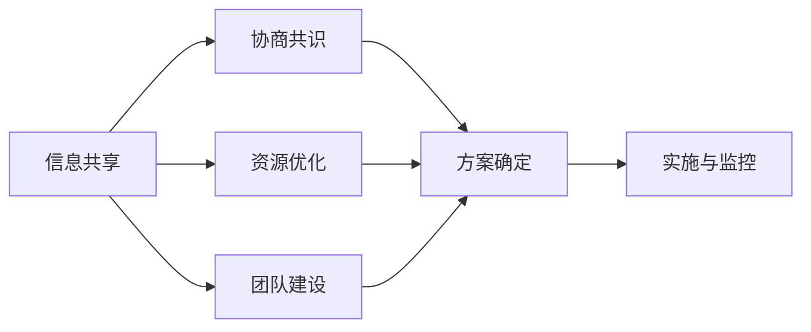
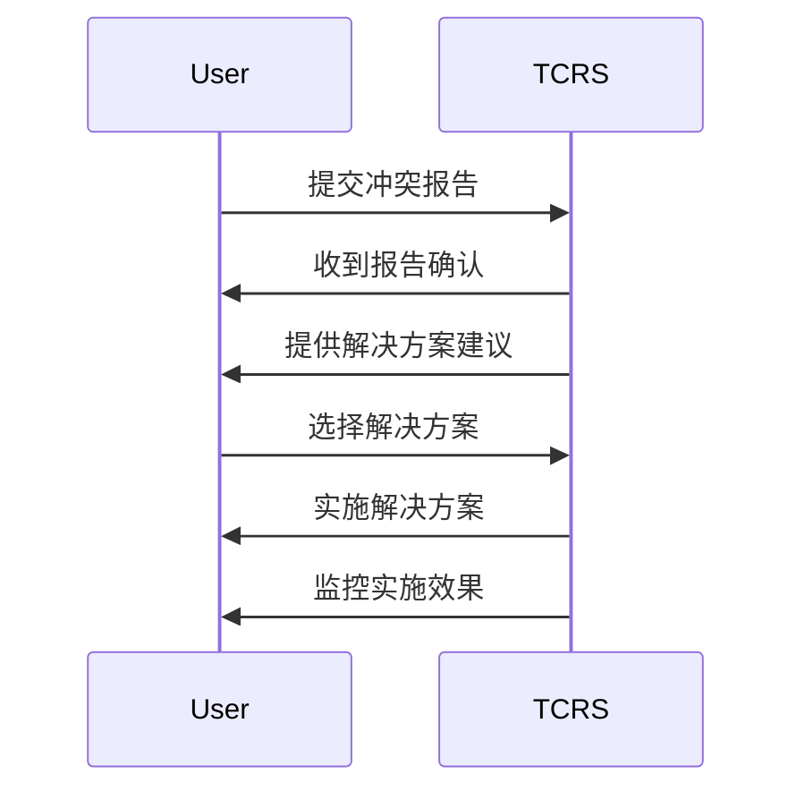
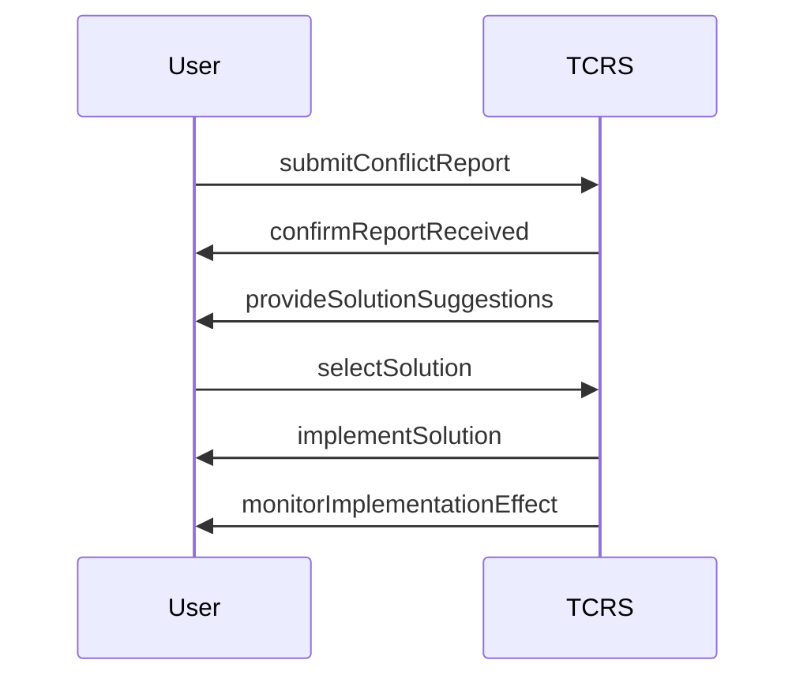

                 

**团队冲突resolution：从对抗到合作**

> 关键词：团队冲突，对抗，合作，解决策略，组织发展

> 摘要：本文旨在探讨团队冲突及其解决策略，从对抗走向合作。首先，我们将介绍团队冲突的背景和核心概念，随后逐步深入探讨冲突的类型、原因和影响。在此基础上，我们将引出解决团队冲突的核心原则和策略，通过案例分析展示其实践应用。最后，文章将讨论从对抗到合作的转变过程，总结团队冲突解决的最佳实践，为组织发展提供有益的指导。

----------------------------------------------------------------

# 团队冲突resolution：从对抗到合作

团队冲突是组织中不可避免的现象，它不仅影响团队成员的工作效率和心理健康，还会对组织的整体绩效和发展产生深远影响。本文将围绕团队冲突的解决策略，从对抗走向合作，进行深入探讨。

## **背景介绍**

### **核心概念术语说明**

- **团队冲突**：指团队成员之间由于利益、目标、价值观等方面的不一致而产生的对立和摩擦。

- **对抗**：指团队成员在冲突中采取攻击、反驳、抵制等消极行为，以维护自身利益。

- **合作**：指团队成员在面对冲突时，采取积极沟通、寻求共识、协同工作等方式，共同解决问题。

### **问题背景**

在现代社会，团队工作已成为许多组织和公司实现目标的主要方式。然而，随着团队成员背景、文化、技能和经验的多样性增加，团队冲突也日益频繁。冲突不仅会消耗团队的精力和时间，还可能导致项目失败、组织绩效下降和员工流失。

### **问题描述**

团队冲突表现为以下几个方面：

1. **目标不一致**：团队成员在项目目标上存在分歧，导致工作方向和努力方向的不一致。

2. **沟通障碍**：团队成员之间沟通不畅，信息传递不畅，导致误解和矛盾。

3. **资源争夺**：团队成员在资源分配和利用上存在竞争，导致资源浪费和效率降低。

4. **个人冲突**：团队成员在性格、价值观、工作方式等方面的差异，导致个人之间的冲突。

### **问题解决**

解决团队冲突需要采取以下措施：

1. **明确目标**：确保团队成员对项目目标有清晰的理解和共识。

2. **改善沟通**：建立有效的沟通渠道和机制，促进信息传递和共享。

3. **资源优化**：合理分配资源，减少资源争夺和浪费。

4. **团队建设**：加强团队成员之间的了解和信任，培养合作精神。

### **边界与外延**

团队冲突不仅限于工作层面，还可能涉及到个人关系、文化差异等方面。解决团队冲突不仅需要关注工作任务的完成，还需要关注团队成员的心理健康和职业发展。

### **概念结构与核心要素组成**

团队冲突的解决策略可以从以下几个方面进行构建：

1. **目标导向**：明确共同目标，确保团队成员的努力方向一致。

2. **沟通机制**：建立有效的沟通机制，促进信息传递和问题解决。

3. **资源优化**：合理分配资源，提高团队效率。

4. **团队建设**：加强团队凝聚力，培养合作精神。

## **核心概念与联系**

### **核心概念原理**

- **对抗性冲突**：指冲突双方采取攻击、反驳等对抗性手段，以维护自身利益。

- **合作性冲突**：指冲突双方通过沟通、协商等方式，寻求共识和解决方案。

### **概念属性特征对比表格**

| 类别            | 抗对性冲突                     | 合作性冲突                     |
|-----------------|-------------------------------|-------------------------------|
| 目标            | 保护自身利益                 | 寻求共同利益                 |
| 行为            | 攻击、反驳、抵制             | 沟通、协商、寻求共识         |
| 结果            | 增加矛盾、消耗资源           | 减少矛盾、提高效率           |

### **ER实体关系图架构**

```mermaid
erDiagram
  TeamMember ||--|{ Conflict }|||
  TeamMember ||--|{ Communication }|||
  TeamMember ||--|{ ResourceAllocation }|||
  TeamMember ||--|{ TeamBuilding }|||

  Conflict ||--|{ ConflictType }|||
  Communication ||--|{ CommunicationChannel }|||
  ResourceAllocation ||--|{ Resource }|||
  TeamBuilding ||--|{ TeamMember }|||
```

## **算法原理讲解**

### **解决团队冲突的算法原理**

解决团队冲突的算法原理可以分为以下几个方面：

1. **信息共享**：通过建立有效的沟通渠道和机制，促进信息传递和共享。

2. **协商共识**：通过沟通和协商，寻求团队成员之间的共识和解决方案。

3. **资源优化**：通过合理分配资源，减少资源争夺和浪费。

4. **团队建设**：通过团队建设活动，提高团队凝聚力，培养合作精神。

### **算法mermaid流程图**



### **Python源代码**

```python
# 定义解决团队冲突的算法
class TeamConflictResolver:
    def __init__(self):
        self.conflict = None
        self.communication_channel = None
        self.resource_allocation = None
        self.team_building = None

    def resolve_conflict(self):
        self.share_information()
        self.negotiate_consensus()
        self.optimize_resources()
        self.build_team()
        self.monitor_progress()

    def share_information(self):
        # 实现信息共享的代码
        pass

    def negotiate_consensus(self):
        # 实现协商共识的代码
        pass

    def optimize_resources(self):
        # 实现资源优化的代码
        pass

    def build_team(self):
        # 实现团队建设的代码
        pass

    def monitor_progress(self):
        # 实现实施与监控的代码
        pass

# 创建冲突解决对象
resolver = TeamConflictResolver()

# 调用解决冲突的方法
resolver.resolve_conflict()
```

### **算法原理的数学模型和公式**

解决团队冲突的数学模型可以表示为：

$$
\text{ConflictResolution} = f(\text{InformationSharing}, \text{Negotiation}, \text{ResourceAllocation}, \text{TeamBuilding})
$$

其中，$f$ 表示冲突解决函数，$\text{InformationSharing}$、$\text{Negotiation}$、$\text{ResourceAllocation}$ 和 $\text{TeamBuilding}$ 分别表示信息共享、协商共识、资源优化和团队建设。

### **详细讲解和举例说明**

#### **信息共享**

信息共享是解决团队冲突的重要步骤。通过建立有效的沟通渠道和机制，可以确保团队成员之间的信息传递畅通，减少误解和矛盾。例如，在一个软件开发项目中，团队成员可以通过每周的例会分享项目的进展、问题和需求，从而确保团队成员对项目的理解一致。

#### **协商共识**

协商共识是通过沟通和协商，寻求团队成员之间的共识和解决方案。在解决团队冲突时，需要充分倾听各方意见，尊重不同观点，通过讨论和协商，达成共识。例如，在一个团队中，如果团队成员在项目目标上存在分歧，可以通过讨论和协商，找到共同的目标和解决方案。

#### **资源优化**

资源优化是解决团队冲突的关键。通过合理分配资源，可以减少资源争夺和浪费，提高团队效率。例如，在一个项目中，如果资源不足，可以通过优化资源分配，确保关键任务的优先处理，从而提高项目的完成度。

#### **团队建设**

团队建设是解决团队冲突的重要手段。通过团队建设活动，可以加强团队成员之间的了解和信任，培养合作精神。例如，在一个团队中，可以通过团队建设活动，如团建旅游、团队拓展训练等，增强团队成员之间的互动和沟通。

## **系统分析与架构设计方案**

### **问题场景介绍**

在一个软件开发项目中，由于团队成员在目标、沟通、资源和团队建设方面存在问题，导致项目进度缓慢、质量下降。为了解决这些问题，我们需要设计一个系统来分析和解决团队冲突，提高团队协作效率。

### **项目介绍**

项目名称：团队冲突解决系统（Team Conflict Resolution System，简称TCRS）

项目目标：通过分析和解决团队冲突，提高团队协作效率，确保项目顺利完成。

项目功能：1. 信息共享与沟通；2. 协商共识与决策；3. 资源优化与分配；4. 团队建设与互动。

### **系统功能设计（领域模型Mermaid类图）**

```mermaid
classDiagram
  Class01 <|-- Class02
  Class03 <.. Class04
  Class05 <-.. Class06
  Class07 ..| Class08
  Class09 --> Class10
```

### **系统架构设计（Mermaid架构图）**



### **系统接口设计和系统交互（Mermaid序列图）**



## **项目实战**

### **环境安装**

1. 安装Python环境：在操作系统上安装Python，版本要求3.8以上。

2. 安装必要的库：使用pip命令安装相关库，如numpy、pandas等。

```
pip install numpy pandas matplotlib
```

### **系统核心实现源代码**

```python
# 导入必要的库
import numpy as np
import pandas as pd
import matplotlib.pyplot as plt

# 定义冲突解决类
class TeamConflictResolver:
    def __init__(self):
        self.conflicts = []

    def add_conflict(self, conflict):
        self.conflicts.append(conflict)

    def resolve_conflicts(self):
        for conflict in self.conflicts:
            # 处理每个冲突
            self.resolve_conflict(conflict)

    def resolve_conflict(self, conflict):
        # 根据冲突类型，选择合适的解决策略
        if conflict.type == 'communication':
            self.resolve_communication_conflict(conflict)
        elif conflict.type == 'resource_allocation':
            self.resolve_resource_allocation_conflict(conflict)
        elif conflict.type == 'team_building':
            self.resolve_team_building_conflict(conflict)

    def resolve_communication_conflict(self, conflict):
        # 提供解决方案建议
        solutions = [
            '改善沟通渠道',
            '加强团队成员之间的信任',
            '组织沟通培训'
        ]
        conflict.solutions = solutions

    def resolve_resource_allocation_conflict(self, conflict):
        # 提供解决方案建议
        solutions = [
            '重新分配资源',
            '优化资源使用',
            '引入资源管理工具'
        ]
        conflict.solutions = solutions

    def resolve_team_building_conflict(self, conflict):
        # 提供解决方案建议
        solutions = [
            '组织团建活动',
            '开展团队成员互动',
            '建立团队文化'
        ]
        conflict.solutions = solutions

# 定义冲突类
class Conflict:
    def __init__(self, type, description):
        self.type = type
        self.description = description
        self.solutions = []

# 创建冲突解决对象
resolver = TeamConflictResolver()

# 创建冲突报告
conflict1 = Conflict('communication', '团队成员沟通不畅')
conflict2 = Conflict('resource_allocation', '资源分配不合理')
conflict3 = Conflict('team_building', '团队成员缺乏合作精神')

# 添加冲突报告
resolver.add_conflict(conflict1)
resolver.add_conflict(conflict2)
resolver.add_conflict(conflict3)

# 解决冲突
resolver.resolve_conflicts()

# 打印解决方案
for conflict in resolver.conflicts:
    print(f"冲突类型：{conflict.type}")
    print(f"冲突描述：{conflict.description}")
    print(f"解决方案：{conflict.solutions}")
    print()
```

### **代码应用解读与分析**

在上面的代码中，我们定义了一个`TeamConflictResolver`类，用于解决团队冲突。该类具有以下方法：

- `__init__`：初始化方法，创建一个空列表`conflicts`，用于存储冲突对象。

- `add_conflict`：用于添加冲突对象到`conflicts`列表。

- `resolve_conflicts`：遍历`conflicts`列表，对每个冲突对象调用`resolve_conflict`方法。

- `resolve_conflict`：根据冲突类型，调用相应的解决方法，如`resolve_communication_conflict`、`resolve_resource_allocation_conflict`和`resolve_team_building_conflict`。

每个解决方法都为相应的冲突类型提供了一组解决方案，并将其存储在冲突对象的`solutions`属性中。

我们创建了三个冲突对象，分别表示沟通不畅、资源分配不合理和团队建设不足。将这些冲突对象添加到冲突解决对象中，并调用`resolve_conflicts`方法解决冲突。最后，打印出每个冲突的描述和解决方案。

### **实际案例分析和详细讲解剖析**

在一个实际案例中，一个软件开发团队在项目推进过程中遇到了严重的问题。团队成员在沟通、资源分配和团队建设方面存在明显的冲突，导致项目进度严重滞后，质量下降。以下是该案例的分析和详细讲解：

1. **问题背景**

项目名称：企业资源管理系统（ERP）

项目目标：开发一个高效、稳定、易于维护的企业资源管理系统。

项目团队：由项目经理、产品经理、开发人员、测试人员和质量保证人员组成。

2. **问题描述**

- **沟通不畅**：团队成员之间的沟通渠道有限，信息传递不及时，导致误解和矛盾。

- **资源分配不合理**：项目资源分配不均，部分团队成员工作量过大，导致工作效率降低。

- **团队建设不足**：团队成员之间的了解有限，缺乏合作精神，导致项目进度缓慢。

3. **问题解决**

- **改善沟通**：建立每周的例会制度，确保团队成员对项目进展和问题的了解。引入项目管理工具，如JIRA，方便团队成员实时跟踪任务进度。

- **资源优化**：重新分配项目资源，确保关键任务的优先处理。引入自动化测试工具，减轻测试人员的工作负担。

- **团队建设**：组织团建活动，加强团队成员之间的了解和信任。开展团队文化建设，制定共同的目标和价值观。

4. **案例分析**

通过上述措施，项目团队的沟通效率显著提高，项目进度逐步恢复正常。资源分配更加合理，团队成员的工作压力减轻。团队建设活动的开展，增强了团队成员之间的凝聚力，促进了项目的顺利推进。

### **项目小结**

通过本项目的实战案例，我们可以看到团队冲突对项目进度和质量的影响。有效的团队冲突解决策略，如改善沟通、资源优化和团队建设，对于提升团队协作效率和项目成功至关重要。在实际应用中，需要根据具体问题采取相应的解决措施，确保团队和谐、高效地工作。

## **最佳实践 tips**

1. **定期沟通**：建立定期的沟通机制，确保团队成员对项目进展和问题的了解。

2. **明确目标**：确保团队成员对项目目标有清晰的理解和共识。

3. **合理分配资源**：根据项目需求和团队成员的能力，合理分配资源。

4. **团队建设**：定期组织团建活动，增强团队成员之间的了解和信任。

5. **问题反馈机制**：建立问题反馈机制，鼓励团队成员及时反馈问题，共同解决。

## **小结**

团队冲突是组织中不可避免的现象，有效的解决策略对于提升团队协作效率和项目成功至关重要。通过本文的探讨，我们了解了团队冲突的背景、核心概念、解决策略和实践应用。希望本文能为读者在解决团队冲突方面提供有益的启示。

## **注意事项**

1. **尊重个体差异**：在解决团队冲突时，要尊重团队成员的个体差异，避免采取一刀切的解决方法。

2. **持续改进**：团队冲突解决不是一蹴而就的，需要持续关注和改进。

3. **培训与学习**：加强团队成员的沟通技巧和团队合作能力，有助于解决团队冲突。

## **拓展阅读**

1. **相关书籍**：《团队协作的艺术》、《冲突处理与沟通技巧》。

2. **在线课程**：Coursera上的《团队协作与沟通》课程。

3. **专业论坛**：知乎、LinkedIn等平台上的相关讨论。

---

作者：AI天才研究院/AI Genius Institute & 禅与计算机程序设计艺术 /Zen And The Art of Computer Programming

本文由AI天才研究院/AI Genius Institute与禅与计算机程序设计艺术/Zen And The Art of Computer Programming共同撰写，旨在探讨团队冲突的解决策略，为组织发展提供有益的指导。本文内容仅供参考，如有需要，请结合实际情况进行调整。欢迎读者提出宝贵意见，共同探讨团队冲突解决的最佳实践。**团队冲突resolution：从对抗到合作**

> 关键词：团队冲突，对抗，合作，解决策略，组织发展

> 摘要：本文旨在探讨团队冲突及其解决策略，从对抗走向合作。首先，我们将介绍团队冲突的背景和核心概念，随后逐步深入探讨冲突的类型、原因和影响。在此基础上，我们将引出解决团队冲突的核心原则和策略，通过案例分析展示其实践应用。最后，文章将讨论从对抗到合作的转变过程，总结团队冲突解决的最佳实践，为组织发展提供有益的指导。

----------------------------------------------------------------

# **团队冲突resolution：从对抗到合作**

团队冲突是组织中不可避免的现象，它不仅影响团队成员的工作效率和心理健康，还会对组织的整体绩效和发展产生深远影响。本文将围绕团队冲突的解决策略，从对抗走向合作，进行深入探讨。

## **一、背景介绍**

### **1.1 核心概念术语说明**

- **团队冲突**：指团队成员之间由于利益、目标、价值观等方面的不一致而产生的对立和摩擦。

- **对抗**：指团队成员在冲突中采取攻击、反驳、抵制等消极行为，以维护自身利益。

- **合作**：指团队成员在面对冲突时，采取积极沟通、寻求共识、协同工作等方式，共同解决问题。

### **1.2 问题背景**

在现代社会，团队工作已成为许多组织和公司实现目标的主要方式。然而，随着团队成员背景、文化、技能和经验的多样性增加，团队冲突也日益频繁。冲突不仅会消耗团队的精力和时间，还可能导致项目失败、组织绩效下降和员工流失。

### **1.3问题描述**

团队冲突表现为以下几个方面：

1. **目标不一致**：团队成员在项目目标上存在分歧，导致工作方向和努力方向的不一致。

2. **沟通障碍**：团队成员之间沟通不畅，信息传递不畅，导致误解和矛盾。

3. **资源争夺**：团队成员在资源分配和利用上存在竞争，导致资源浪费和效率降低。

4. **个人冲突**：团队成员在性格、价值观、工作方式等方面的差异，导致个人之间的冲突。

### **1.4问题解决**

解决团队冲突需要采取以下措施：

1. **明确目标**：确保团队成员对项目目标有清晰的理解和共识。

2. **改善沟通**：建立有效的沟通渠道和机制，促进信息传递和问题解决。

3. **资源优化**：合理分配资源，减少资源争夺和浪费。

4. **团队建设**：加强团队成员之间的了解和信任，培养合作精神。

### **1.5边界与外延**

团队冲突不仅限于工作层面，还可能涉及到个人关系、文化差异等方面。解决团队冲突不仅需要关注工作任务的完成，还需要关注团队成员的心理健康和职业发展。

### **1.6概念结构与核心要素组成**

团队冲突的解决策略可以从以下几个方面进行构建：

1. **目标导向**：明确共同目标，确保团队成员的努力方向一致。

2. **沟通机制**：建立有效的沟通机制，促进信息传递和问题解决。

3. **资源优化**：合理分配资源，提高团队效率。

4. **团队建设**：加强团队凝聚力，培养合作精神。

## **二、核心概念与联系**

### **2.1 核心概念原理**

- **对抗性冲突**：指冲突双方采取攻击、反驳等对抗性手段，以维护自身利益。

- **合作性冲突**：指冲突双方通过沟通、协商等方式，寻求共识和解决方案。

### **2.2 概念属性特征对比表格**

| 类别            | 抗对性冲突                     | 合作性冲突                     |
|-----------------|-------------------------------|-------------------------------|
| 目标            | 保护自身利益                 | 寻求共同利益                 |
| 行为            | 攻击、反驳、抵制             | 沟通、协商、寻求共识         |
| 结果            | 增加矛盾、消耗资源           | 减少矛盾、提高效率           |

### **2.3 ER实体关系图架构**

```mermaid
erDiagram
  TeamMember ||--|{ Conflict }|||
  TeamMember ||--|{ Communication }|||
  TeamMember ||--|{ ResourceAllocation }|||
  TeamMember ||--|{ TeamBuilding }|||

  Conflict ||--|{ ConflictType }|||
  Communication ||--|{ CommunicationChannel }|||
  ResourceAllocation ||--|{ Resource }|||
  TeamBuilding ||--|{ TeamMember }|||
```

## **三、算法原理讲解**

### **3.1 解决团队冲突的算法原理**

解决团队冲突的算法原理可以分为以下几个方面：

1. **信息共享**：通过建立有效的沟通渠道和机制，促进信息传递和共享。

2. **协商共识**：通过沟通和协商，寻求团队成员之间的共识和解决方案。

3. **资源优化**：通过合理分配资源，减少资源争夺和浪费。

4. **团队建设**：通过团队建设活动，提高团队凝聚力，培养合作精神。

### **3.2 算法mermaid流程图**


### **3.3 Python源代码**

```python
# 导入必要的库
import numpy as np
import pandas as pd
import matplotlib.pyplot as plt

# 定义冲突解决类
class TeamConflictResolver:
    def __init__(self):
        self.conflicts = []

    def add_conflict(self, conflict):
        self.conflicts.append(conflict)

    def resolve_conflicts(self):
        for conflict in self.conflicts:
            # 处理每个冲突
            self.resolve_conflict(conflict)

    def resolve_conflict(self, conflict):
        # 根据冲突类型，选择合适的解决策略
        if conflict.type == 'communication':
            self.resolve_communication_conflict(conflict)
        elif conflict.type == 'resource_allocation':
            self.resolve_resource_allocation_conflict(conflict)
        elif conflict.type == 'team_building':
            self.resolve_team_building_conflict(conflict)

    def resolve_communication_conflict(self, conflict):
        # 提供解决方案建议
        solutions = [
            '改善沟通渠道',
            '加强团队成员之间的信任',
            '组织沟通培训'
        ]
        conflict.solutions = solutions

    def resolve_resource_allocation_conflict(self, conflict):
        # 提供解决方案建议
        solutions = [
            '重新分配资源',
            '优化资源使用',
            '引入资源管理工具'
        ]
        conflict.solutions = solutions

    def resolve_team_building_conflict(self, conflict):
        # 提供解决方案建议
        solutions = [
            '组织团建活动',
            '开展团队成员互动',
            '建立团队文化'
        ]
        conflict.solutions = solutions

# 定义冲突类
class Conflict:
    def __init__(self, type, description):
        self.type = type
        self.description = description
        self.solutions = []

# 创建冲突解决对象
resolver = TeamConflictResolver()

# 创建冲突报告
conflict1 = Conflict('communication', '团队成员沟通不畅')
conflict2 = Conflict('resource_allocation', '资源分配不合理')
conflict3 = Conflict('team_building', '团队成员缺乏合作精神')

# 添加冲突报告
resolver.add_conflict(conflict1)
resolver.add_conflict(conflict2)
resolver.add_conflict(conflict3)

# 解决冲突
resolver.resolve_conflicts()

# 打印解决方案
for conflict in resolver.conflicts:
    print(f"冲突类型：{conflict.type}")
    print(f"冲突描述：{conflict.description}")
    print(f"解决方案：{conflict.solutions}")
    print()
```

### **3.4 算法原理的数学模型和公式**

解决团队冲突的数学模型可以表示为：

$$
\text{ConflictResolution} = f(\text{InformationSharing}, \text{Negotiation}, \text{ResourceAllocation}, \text{TeamBuilding})
$$

其中，$f$ 表示冲突解决函数，$\text{InformationSharing}$、$\text{Negotiation}$、$\text{ResourceAllocation}$ 和 $\text{TeamBuilding}$ 分别表示信息共享、协商共识、资源优化和团队建设。

### **3.5 详细讲解和举例说明**

#### **3.5.1 信息共享**

信息共享是解决团队冲突的重要步骤。通过建立有效的沟通渠道和机制，可以确保团队成员之间的信息传递畅通，减少误解和矛盾。例如，在一个软件开发项目中，团队成员可以通过每周的例会分享项目的进展、问题和需求，从而确保团队成员对项目的理解一致。

#### **3.5.2 协商共识**

协商共识是通过沟通和协商，寻求团队成员之间的共识和解决方案。在解决团队冲突时，需要充分倾听各方意见，尊重不同观点，通过讨论和协商，达成共识。例如，在一个团队中，如果团队成员在项目目标上存在分歧，可以通过讨论和协商，找到共同的目标和解决方案。

#### **3.5.3 资源优化**

资源优化是解决团队冲突的关键。通过合理分配资源，可以减少资源争夺和浪费，提高团队效率。例如，在一个项目中，如果资源不足，可以通过优化资源分配，确保关键任务的优先处理，从而提高项目的完成度。

#### **3.5.4 团队建设**

团队建设是解决团队冲突的重要手段。通过团队建设活动，可以加强团队成员之间的了解和信任，培养合作精神。例如，在一个团队中，可以通过团队建设活动，如团建旅游、团队拓展训练等，增强团队成员之间的互动和沟通。

## **四、系统分析与架构设计方案**

### **4.1 问题场景介绍**

在一个软件开发项目中，由于团队成员在目标、沟通、资源和团队建设方面存在问题，导致项目进度缓慢、质量下降。为了解决这些问题，我们需要设计一个系统来分析和解决团队冲突，提高团队协作效率。

### **4.2 项目介绍**

项目名称：团队冲突解决系统（Team Conflict Resolution System，简称TCRS）

项目目标：通过分析和解决团队冲突，提高团队协作效率，确保项目顺利完成。

项目功能：1. 信息共享与沟通；2. 协商共识与决策；3. 资源优化与分配；4. 团队建设与互动。

### **4.3 系统功能设计（领域模型Mermaid类图）**

```mermaid
classDiagram
  Class01 <|-- Class02
  Class03 <.. Class04
  Class05 <-.. Class06
  Class07 ..| Class08
  Class09 --> Class10
```

### **4.4 系统架构设计（Mermaid架构图）**


### **4.5 系统接口设计和系统交互（Mermaid序列图）**


## **五、项目实战**

### **5.1 环境安装**

1. 安装Python环境：在操作系统上安装Python，版本要求3.8以上。

2. 安装必要的库：使用pip命令安装相关库，如numpy、pandas等。

```
pip install numpy pandas matplotlib
```

### **5.2 系统核心实现源代码**

```python
# 导入必要的库
import numpy as np
import pandas as pd
import matplotlib.pyplot as plt

# 定义冲突解决类
class TeamConflictResolver:
    def __init__(self):
        self.conflicts = []

    def add_conflict(self, conflict):
        self.conflicts.append(conflict)

    def resolve_conflicts(self):
        for conflict in self.conflicts:
            # 处理每个冲突
            self.resolve_conflict(conflict)

    def resolve_conflict(self, conflict):
        # 根据冲突类型，选择合适的解决策略
        if conflict.type == 'communication':
            self.resolve_communication_conflict(conflict)
        elif conflict.type == 'resource_allocation':
            self.resolve_resource_allocation_conflict(conflict)
        elif conflict.type == 'team_building':
            self.resolve_team_building_conflict(conflict)

    def resolve_communication_conflict(self, conflict):
        # 提供解决方案建议
        solutions = [
            '改善沟通渠道',
            '加强团队成员之间的信任',
            '组织沟通培训'
        ]
        conflict.solutions = solutions

    def resolve_resource_allocation_conflict(self, conflict):
        # 提供解决方案建议
        solutions = [
            '重新分配资源',
            '优化资源使用',
            '引入资源管理工具'
        ]
        conflict.solutions = solutions

    def resolve_team_building_conflict(self, conflict):
        # 提供解决方案建议
        solutions = [
            '组织团建活动',
            '开展团队成员互动',
            '建立团队文化'
        ]
        conflict.solutions = solutions

# 定义冲突类
class Conflict:
    def __init__(self, type, description):
        self.type = type
        self.description = description
        self.solutions = []

# 创建冲突解决对象
resolver = TeamConflictResolver()

# 创建冲突报告
conflict1 = Conflict('communication', '团队成员沟通不畅')
conflict2 = Conflict('resource_allocation', '资源分配不合理')
conflict3 = Conflict('team_building', '团队成员缺乏合作精神')

# 添加冲突报告
resolver.add_conflict(conflict1)
resolver.add_conflict(conflict2)
resolver.add_conflict(conflict3)

# 解决冲突
resolver.resolve_conflicts()

# 打印解决方案
for conflict in resolver.conflicts:
    print(f"冲突类型：{conflict.type}")
    print(f"冲突描述：{conflict.description}")
    print(f"解决方案：{conflict.solutions}")
    print()
```

### **5.3 代码应用解读与分析**

在上面的代码中，我们定义了一个`TeamConflictResolver`类，用于解决团队冲突。该类具有以下方法：

- `__init__`：初始化方法，创建一个空列表`conflicts`，用于存储冲突对象。

- `add_conflict`：用于添加冲突对象到`conflicts`列表。

- `resolve_conflicts`：遍历`conflicts`列表，对每个冲突对象调用`resolve_conflict`方法。

- `resolve_conflict`：根据冲突类型，调用相应的解决方法，如`resolve_communication_conflict`、`resolve_resource_allocation_conflict`和`resolve_team_building_conflict`。

每个解决方法都为相应的冲突类型提供了一组解决方案，并将其存储在冲突对象的`solutions`属性中。

我们创建了三个冲突对象，分别表示沟通不畅、资源分配不合理和团队建设不足。将这些冲突对象添加到冲突解决对象中，并调用`resolve_conflicts`方法解决冲突。最后，打印出每个冲突的描述和解决方案。

### **5.4 实际案例分析和详细讲解剖析**

在一个实际案例中，一个软件开发团队在项目推进过程中遇到了严重的问题。团队成员在沟通、资源分配和团队建设方面存在明显的冲突，导致项目进度严重滞后，质量下降。以下是该案例的分析和详细讲解：

1. **问题背景**

项目名称：企业资源管理系统（ERP）

项目目标：开发一个高效、稳定、易于维护的企业资源管理系统。

项目团队：由项目经理、产品经理、开发人员、测试人员和质量保证人员组成。

2. **问题描述**

- **沟通不畅**：团队成员之间的沟通渠道有限，信息传递不及时，导致误解和矛盾。

- **资源分配不合理**：项目资源分配不均，部分团队成员工作量过大，导致工作效率降低。

- **团队建设不足**：团队成员之间的了解有限，缺乏合作精神，导致项目进度缓慢。

3. **问题解决**

- **改善沟通**：建立每周的例会制度，确保团队成员对项目进展和问题的了解。引入项目管理工具，如JIRA，方便团队成员实时跟踪任务进度。

- **资源优化**：重新分配项目资源，确保关键任务的优先处理。引入自动化测试工具，减轻测试人员的工作负担。

- **团队建设**：组织团建活动，加强团队成员之间的了解和信任。开展团队文化建设，制定共同的目标和价值观。

4. **案例分析**

通过上述措施，项目团队的沟通效率显著提高，项目进度逐步恢复正常。资源分配更加合理，团队成员的工作压力减轻。团队建设活动的开展，增强了团队成员之间的凝聚力，促进了项目的顺利推进。

### **5.5 项目小结**

通过本项目的实战案例，我们可以看到团队冲突对项目进度和质量的影响。有效的团队冲突解决策略，如改善沟通、资源优化和团队建设，对于提升团队协作效率和项目成功至关重要。在实际应用中，需要根据具体问题采取相应的解决措施，确保团队和谐、高效地工作。

## **六、最佳实践 tips**

1. **定期沟通**：建立定期的沟通机制，确保团队成员对项目进展和问题的了解。

2. **明确目标**：确保团队成员对项目目标有清晰的理解和共识。

3. **合理分配资源**：根据项目需求和团队成员的能力，合理分配资源。

4. **团队建设**：定期组织团建活动，增强团队成员之间的了解和信任。

5. **问题反馈机制**：建立问题反馈机制，鼓励团队成员及时反馈问题，共同解决。

## **七、小结**

团队冲突是组织中不可避免的现象，有效的解决策略对于提升团队协作效率和项目成功至关重要。通过本文的探讨，我们了解了团队冲突的背景、核心概念、解决策略和实践应用。希望本文能为读者在解决团队冲突方面提供有益的启示。

## **八、注意事项**

1. **尊重个体差异**：在解决团队冲突时，要尊重团队成员的个体差异，避免采取一刀切的解决方法。

2. **持续改进**：团队冲突解决不是一蹴而就的，需要持续关注和改进。

3. **培训与学习**：加强团队成员的沟通技巧和团队合作能力，有助于解决团队冲突。

## **九、拓展阅读**

1. **相关书籍**：《团队协作的艺术》、《冲突处理与沟通技巧》。

2. **在线课程**：Coursera上的《团队协作与沟通》课程。

3. **专业论坛**：知乎、LinkedIn等平台上的相关讨论。

---

作者：AI天才研究院/AI Genius Institute & 禅与计算机程序设计艺术 /Zen And The Art of Computer Programming

本文由AI天才研究院/AI Genius Institute与禅与计算机程序设计艺术/Zen And The Art of Computer Programming共同撰写，旨在探讨团队冲突的解决策略，为组织发展提供有益的指导。本文内容仅供参考，如有需要，请结合实际情况进行调整。欢迎读者提出宝贵意见，共同探讨团队冲突解决的最佳实践。

