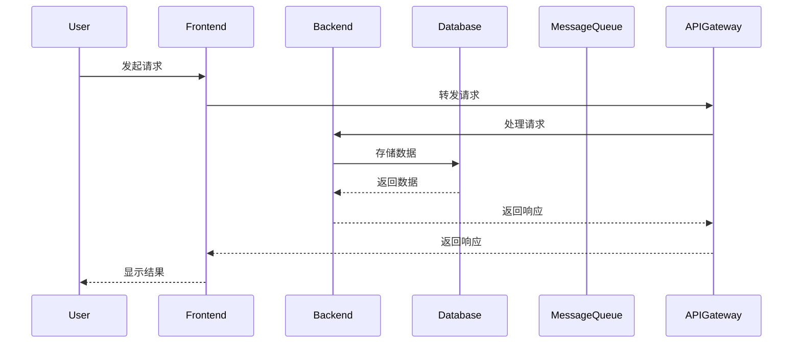
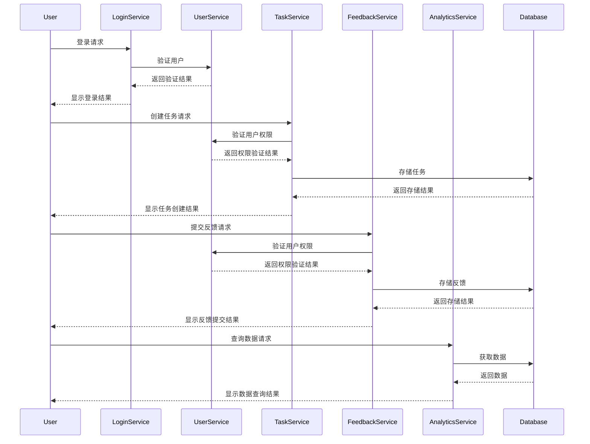

                 

## 文章标题

《团队冲突预防：构建和谐工作环境》

关键词：团队冲突、和谐工作环境、沟通技巧、预防策略、系统架构设计

摘要：本文深入探讨了团队冲突的普遍现象及其对工作环境的影响，阐述了构建和谐工作环境的重要性。通过详细分析核心概念、提出预防团队冲突的方法、系统分析与架构设计以及项目实战，本文为IT团队提供了切实可行的解决方案，助力构建高效和谐的工作环境。

----------------------------------------------------------------

## 引言

在现代社会，团队协作已经成为各类组织运作的基石。然而，随着团队成员多样性的增加和复杂项目的推进，团队内部难免会出现冲突。这些冲突可能源于不同的观点、目标不统一、资源分配不均或沟通障碍等，不仅会影响团队的凝聚力和工作效率，还可能导致项目延误、质量下降，甚至影响整体组织的健康运营。因此，预防团队冲突、构建和谐工作环境成为每个组织都必须重视的问题。

团队冲突的普遍现象表现在多个层面。在IT行业中，团队成员之间常常因为技术观点的差异而产生分歧，项目管理中的资源分配不公也可能引发冲突。此外，团队成员的个人情绪、文化背景和职业目标的不同，也会成为团队内部摩擦的源泉。因此，如何有效预防团队冲突，成为提升团队协作效率和项目成功的关键。

本文将围绕以下几个核心主题进行探讨：

1. **团队冲突概述**：介绍团队冲突的概念、原因、类型及其影响。
2. **团队和谐的重要性**：阐述和谐团队的益处、关键特征及其与冲突的关系。
3. **核心概念与联系**：定义沟通、领导风格等关键概念，展示它们之间的关系。
4. **预防团队冲突的方法**：探讨早期预警系统、沟通技巧提升以及领导者的角色。
5. **系统分析与架构设计**：介绍项目背景、系统功能设计、系统架构设计以及系统交互设计。
6. **项目实战**：展示环境安装与配置、系统核心实现、代码应用解读与分析、实际案例剖析。
7. **最佳实践与总结**：提供预防团队冲突的最佳实践、小结、注意事项及拓展阅读。

通过以上七个方面的详细探讨，本文旨在为IT团队提供一个全面、系统的构建和谐工作环境的指南，帮助团队在面对冲突时能够冷静应对，提升团队协作效率，最终实现项目的成功。

----------------------------------------------------------------

## 第1章：团队冲突概述

### 1.1 什么是团队冲突

团队冲突是指在团队内部，由于成员之间的不同观点、目标、资源分配或其他因素而产生的分歧和争执。团队冲突可以分为两类：建设性冲突和破坏性冲突。建设性冲突通常是指团队成员之间的有益争论，通过不同观点的碰撞，有助于问题的解决和团队的进步。而破坏性冲突则是指因个人情绪、价值观差异或其他负面因素导致的对抗，这种冲突会破坏团队的凝聚力和工作效率。

### 1.2 团队冲突的原因

团队冲突的产生往往是多种因素共同作用的结果。以下是导致团队冲突的一些常见原因：

1. **观点和意见的不同**：团队成员在技术方案、工作方法等方面可能存在不同的看法，导致意见分歧。
2. **目标不统一**：团队成员可能对项目的目标、优先级和预期成果有不同的理解。
3. **资源分配不均**：资源（如时间、预算、人力等）分配不公可能引发不满和冲突。
4. **沟通障碍**：信息传递不畅、沟通技巧不足或沟通频率不足，都会导致误解和冲突。
5. **个人情绪**：团队成员的情绪波动，如压力过大、焦虑或不满，也可能成为冲突的导火索。
6. **文化背景**：不同的文化背景和价值观可能导致团队成员在行为和工作方式上的冲突。
7. **职业目标**：团队成员的个人职业发展目标与团队目标的冲突，也可能引发矛盾。

### 1.3 团队冲突的类型

团队冲突可以根据其表现和影响分为以下几种类型：

1. **认知冲突**：团队成员在问题理解和解决方案上存在分歧，通常是由于对问题本质的不同认识导致的。
2. **情感冲突**：由于个人情绪或价值观的不同，团队成员之间可能产生情感上的对立和争执。
3. **权力冲突**：团队成员在权力、地位或资源分配上存在争夺，这种冲突往往较为激烈。
4. **角色冲突**：团队成员在角色定位和职责分工上存在误解或矛盾，可能导致任务无法顺利完成。
5. **目标冲突**：团队成员对团队目标的理解不一致，导致努力方向和优先级上的冲突。

### 1.4 团队冲突的影响

团队冲突对工作环境和效率的影响是多方面的。消极影响包括：

1. **降低工作效率**：团队成员在冲突中分散精力，无法集中精力完成任务。
2. **影响团队凝聚力**：持续的冲突会削弱团队的凝聚力，降低团队士气。
3. **项目延误**：冲突可能导致项目进度延误，甚至项目失败。
4. **员工流失**：严重冲突可能导致优秀员工的流失，对团队造成更大的损失。

然而，适度的建设性冲突也有其积极作用，如促进创新、提高决策质量等。因此，关键在于如何有效地管理和预防团队冲突。

### 结论

通过以上对团队冲突的概述，我们可以看出团队冲突是团队运作中不可避免的现象。了解冲突的原因、类型及其影响，是预防和管理团队冲突的第一步。在接下来的章节中，我们将进一步探讨如何通过沟通技巧提升、系统架构设计和实际项目实战来预防团队冲突，构建和谐的工作环境。

----------------------------------------------------------------

## 第2章：团队和谐的重要性

### 2.1 和谐团队的益处

构建和谐工作环境对团队和组织有着显著的益处。首先，和谐团队能够提升成员的工作满意度。当团队成员感受到尊重和理解，他们的工作动力和投入度会显著提高。这种积极的工作态度不仅有助于提升个人绩效，还能增强团队的凝聚力。

其次，和谐团队能够提高工作效率。在一个沟通顺畅、分工明确的环境中，团队成员可以更高效地协作，减少因误解和冲突导致的资源浪费。例如，通过有效的沟通和协作，团队能够更快地识别和解决问题，从而确保项目按时按质完成。

另外，和谐团队还有助于促进创新。在一个开放、包容的环境中，团队成员更容易分享自己的想法和观点，从而激发创新思维。建设性的冲突可以成为团队创新的催化剂，通过不同观点的碰撞，团队能够产生更优的解决方案。

### 2.2 和谐团队的关键特征

一个和谐团队通常具备以下几个关键特征：

1. **沟通顺畅**：团队成员之间能够自由、真诚地交流，信息传递没有障碍。这要求团队建立有效的沟通机制，确保信息在组织内部畅通无阻。
2. **相互尊重**：团队成员之间相互尊重，认可彼此的价值观和专业能力。这种尊重有助于消除冲突，建立互信，增强团队的凝聚力。
3. **目标统一**：团队成员对团队目标有共同的理解和认同，个人目标和团队目标相一致。这样的目标一致性有助于团队成员协同工作，减少内耗。
4. **分工明确**：团队成员的角色和职责清晰明确，各自负责的任务不会重叠或模糊。这有助于提高团队的工作效率，减少因职责不清导致的冲突。
5. **包容多样**：团队鼓励多样性和创新思维，不同背景和观点的成员能够自由表达自己的想法。这种包容性有助于激发团队的活力和创造力。

### 2.3 和谐团队与冲突的关系

和谐团队并不是没有冲突，而是能够有效地管理和预防冲突，将冲突转化为团队进步的动力。建设性冲突在和谐团队中是正常且有益的，它可以通过不同观点的交流，促进问题的深入探讨和解决方案的优化。而破坏性冲突则必须被及时识别和解决，以防止其对团队的负面影响。

和谐团队与冲突的关系可以用以下公式表示：

和谐团队 = 建设性冲突 + 预防和解决破坏性冲突

通过有效的沟通技巧、清晰的分工和统一的目标，团队可以在冲突中保持和谐，充分利用冲突带来的机会，避免其带来的风险。

### 结论

构建和谐工作环境对团队和组织至关重要。和谐团队不仅能够提升工作效率和创新能力，还能增强团队的凝聚力和成员的工作满意度。理解和谐团队的关键特征和与冲突的关系，是团队管理者预防和管理冲突的重要依据。在接下来的章节中，我们将深入探讨核心概念与联系，进一步揭示预防团队冲突的方法和策略。

----------------------------------------------------------------

## 第3章：核心概念与联系

在探讨如何预防团队冲突之前，我们需要先明确几个核心概念，并理解它们之间的相互关系。这些核心概念包括沟通、领导风格和团队成员的角色与职责。在本章中，我们将逐一介绍这些概念，并通过对比表格和ER图展示它们之间的联系。

### 3.1 沟通

沟通是团队协作中不可或缺的一部分，有效的沟通能够减少误解和冲突。沟通可以分为以下几个方面：

1. **信息传递**：信息的准确传递是有效沟通的基础，要求沟通者清晰地表达意图，并确保接收者正确理解。
2. **反馈**：反馈是沟通的重要组成部分，能够帮助团队成员了解信息传递的效果，及时调整沟通策略。
3. **冲突管理**：在沟通中，团队成员可能会产生意见分歧，有效的冲突管理技巧能够将建设性冲突转化为团队进步的动力。

### 3.2 领导风格

领导风格对团队的和谐程度和冲突水平有显著影响。以下是几种常见的领导风格：

1. **指令型领导**：领导者为团队成员分配具体任务，并严格控制执行过程。这种领导风格在紧急情况下能有效提高团队效率，但可能抑制成员的自主性。
2. **参与型领导**：领导者鼓励团队成员参与决策过程，倾听他们的意见。这种领导风格有助于增强团队凝聚力，但可能导致决策过程复杂化。
3. **支持型领导**：领导者关注团队成员的需求，提供必要的支持和资源。这种领导风格有助于提升成员的工作满意度，但可能在任务紧迫时缺乏效率。

### 3.3 团队成员的角色与职责

团队成员的角色与职责是团队协作的重要基础。以下是几个常见的团队成员角色：

1. **领导者**：负责团队的协调和管理，确保项目目标的实现。
2. **执行者**：负责具体的任务执行，确保团队目标的达成。
3. **协调者**：负责协调不同团队成员之间的工作，确保项目进展顺利。
4. **观察者**：负责观察项目进展，提供反馈和改进建议。

### 3.4 核心概念对比表格

以下是一个简单的对比表格，展示沟通、领导风格和团队成员角色与职责之间的关系：

| 概念         | 定义                                                         | 关联性                                                         |
| ------------ | ------------------------------------------------------------ | ------------------------------------------------------------ |
| 沟通         | 信息传递、反馈、冲突管理等                                     | 沟通是领导风格和团队成员角色与职责实现的重要手段               |
| 领导风格     | 指令型、参与型、支持型等                                      | 领导风格直接影响团队成员的角色与职责执行效果                   |
| 团队成员角色 | 领导者、执行者、协调者、观察者等                             | 团队成员角色与职责决定了团队的工作流程和任务分配，是沟通和领导风格的具体实现 |
| 团队成员职责 | 完成具体任务、协调工作、提供反馈等                             | 职责明确有助于提高工作效率，减少冲突                         |

### 3.5 ER图架构

为了更直观地展示这些核心概念之间的关系，我们可以使用ER图（实体关系图）来表示。以下是ER图的Mermaid格式表示：

```mermaid
erDiagram
    Communication --> LeaderStyle : |C1| Defines how leadership affects team dynamics
    Communication --> MemberRole : |C2| Ensures effective communication within roles
    LeaderStyle --> MemberRole : |L1| Leadership style impacts role execution
    MemberRole --> Communication : |R1| Role responsibilities require effective communication
```

通过这个ER图，我们可以清晰地看到沟通、领导风格和团队成员角色与职责之间的关联性。领导风格通过影响团队成员的角色执行，进而影响沟通的质量和效果。

### 结论

通过明确沟通、领导风格和团队成员角色与职责这些核心概念，并理解它们之间的相互关系，我们为预防团队冲突奠定了基础。在接下来的章节中，我们将进一步探讨如何通过这些核心概念来预防团队冲突，构建和谐的工作环境。

----------------------------------------------------------------

## 第4章：预防团队冲突的方法

### 4.1 早期预警系统

早期预警系统的建立是预防团队冲突的重要手段。早期预警系统通过实时监控团队内的沟通模式、工作进度和成员情绪，能够及时发现潜在的冲突信号，从而采取措施预防冲突的发生。

#### 4.1.1 识别潜在冲突的信号

以下是几个常见的潜在冲突信号：

1. **沟通减少**：团队成员之间的沟通频率和深度下降，可能是因误解或不满积累导致的。
2. **任务拖延**：任务的完成时间延长，可能是因为团队成员在任务分配或优先级上存在分歧。
3. **情绪波动**：团队成员的情绪波动，如焦虑、愤怒或沮丧，可能是因为个人压力或团队冲突积累。
4. **角色混淆**：团队成员在角色和职责上出现混淆，可能是因为角色定义不明确或职责重叠。
5. **意见分歧**：团队成员在关键问题上意见不一致，可能是因为对项目目标或解决方案有不同的看法。

#### 4.1.2 建立预警机制

为了建立有效的预警机制，可以采取以下措施：

1. **定期团队会议**：定期召开团队会议，团队成员可以汇报工作进展和反馈，及时发现和解决问题。
2. **情绪监控工具**：利用情绪监控工具，如问卷调查或实时反馈系统，了解团队成员的情绪状态。
3. **沟通日志**：建立沟通日志，记录团队内的重要沟通内容，以便分析和识别潜在冲突。
4. **任务管理工具**：使用任务管理工具，如JIRA或Trello，监控任务分配和完成情况，及时发现任务拖延的信号。

### 4.2 沟通技巧提升

提升团队沟通技巧是预防冲突的关键。以下是一些有效的沟通技巧：

#### 4.2.1 有效沟通的要素

1. **明确目的**：在沟通前明确沟通的目的，确保信息传递的目标清晰。
2. **倾听**：倾听是有效沟通的基础，要求团队成员认真聆听对方意见，避免中断或过早反驳。
3. **表达清晰**：用简洁、准确的语言表达自己的观点，避免使用模糊或含糊的措辞。
4. **非语言沟通**：注意肢体语言、面部表情和语调，确保非语言信息与语言信息一致。
5. **确认理解**：在沟通后，确认对方是否正确理解了你的意图，避免误解和冲突。

#### 4.2.2 沟通技巧的实践

1. **角色扮演**：通过角色扮演练习，提高团队成员在沟通中的应对能力，模拟真实情境下的沟通场景。
2. **沟通培训**：定期组织沟通技巧培训，提升团队成员的沟通能力。
3. **反馈机制**：建立反馈机制，团队成员可以互相提供沟通反馈，分享经验，共同进步。

### 4.3 领导者的角色

领导者是预防团队冲突的关键人物。以下是一些领导者应采取的措施：

#### 4.3.1 领导者如何预防冲突

1. **建立明确的规则和流程**：领导者应制定明确的团队规则和流程，确保团队成员在合作中有章可循。
2. **促进开放沟通**：领导者应鼓励团队成员开放沟通，倾听不同意见，创造一个包容、开放的氛围。
3. **调解冲突**：当冲突发生时，领导者应迅速介入，通过调解和协调解决冲突，避免问题恶化。
4. **树立榜样**：领导者应以身作则，展示良好的沟通技巧和解决冲突的能力，成为团队成员的榜样。

#### 4.3.2 领导者的调解技巧

1. **倾听和理解**：领导者应首先倾听冲突双方的立场，理解他们的需求和担忧。
2. **客观公正**：在调解过程中，领导者应保持客观公正，不偏袒任何一方。
3. **提供解决方案**：领导者应与冲突双方共同探讨解决方案，确保各方都能接受。
4. **跟进和反馈**：在冲突解决后，领导者应跟进冲突处理的结果，确保问题得到妥善解决。

### 结论

通过建立早期预警系统、提升沟通技巧和发挥领导者的作用，可以有效预防团队冲突。这些方法不仅有助于构建和谐的工作环境，还能提高团队的工作效率和创新能力。在接下来的章节中，我们将进一步探讨系统分析与架构设计，为团队冲突预防提供更全面的解决方案。

----------------------------------------------------------------

## 第5章：系统分析与架构设计

### 5.1 项目背景

为了更好地理解团队冲突预防系统，我们首先需要了解项目的背景和目标。该项目的背景是一个大型IT公司，其开发团队面临着日益复杂的软件项目，团队成员来自不同的专业背景和文化背景，项目进度和质量都受到了团队冲突的影响。项目目标是通过设计一个高效、可扩展的系统，预防和解决团队冲突，提高团队的工作效率和项目成功率。

### 5.2 系统功能设计

系统功能设计是项目成功的关键。为了实现项目目标，我们设计了以下几个核心功能：

1. **冲突监控与预警**：系统应具备实时监控团队沟通和工作进度的功能，及时发现潜在冲突信号，并预警。
2. **沟通管理**：系统应提供高效的沟通渠道，包括即时聊天、邮件、会议等功能，支持团队成员之间的沟通。
3. **任务管理**：系统应支持任务的分配、跟踪和反馈，确保团队成员明确自己的职责，提高工作效率。
4. **反馈机制**：系统应提供一个反馈平台，允许团队成员对项目和工作环境提出建议和反馈。
5. **数据分析与报告**：系统应具备数据分析功能，生成团队冲突的统计报告，为管理者提供决策依据。

#### 领域模型类图

为了更直观地展示系统功能设计，我们使用Mermaid绘制了领域模型类图：

```mermaid
classDiagram
    ClassDef TeamConflictPreventionSystem
        +--沟通管理
        |    +--即时聊天
        |    +--邮件
        |    +--会议
        |
        ClassDef TaskManagement
            +--任务分配
            |    +--任务跟踪
            |    +--任务反馈
            |
        ClassDef FeedbackSystem
            +--反馈平台
        |
        TeamConflictPreventionSystem o--数据分析与报告
```

通过这个类图，我们可以清晰地看到系统的主要功能模块及其关系。

### 5.3 系统架构设计

系统架构设计是确保系统稳定性和扩展性的关键。我们采用微服务架构来设计系统，以下是系统架构的主要组成部分：

1. **前端应用**：前端应用提供用户界面，支持用户操作，包括沟通管理、任务管理和反馈平台。
2. **后端服务**：后端服务包括冲突监控与预警、任务管理、反馈管理和数据分析与报告。
3. **数据库**：数据库用于存储用户数据、任务数据和冲突数据。
4. **消息队列**：消息队列用于异步处理任务，如任务分配和反馈通知。
5. **API网关**：API网关用于统一管理和路由外部访问请求。

#### 系统架构图

以下是使用Mermaid绘制的系统架构图：



通过这个架构图，我们可以看到系统的各个组件如何协同工作，确保高效、可靠地处理用户请求。

### 5.4 系统接口设计

系统接口设计是确保不同模块之间有效通信的关键。以下是系统的主要接口设计：

1. **用户接口**：用于用户操作，包括登录、注册、任务创建、任务更新等。
2. **任务接口**：用于任务管理，包括任务分配、任务查询、任务更新等。
3. **反馈接口**：用于反馈管理，包括反馈提交、反馈查询等。
4. **数据分析接口**：用于数据分析，包括数据查询、数据统计等。

#### 系统接口列表

以下是系统接口的详细列表：

| 接口名称       | 描述                                                         |
| -------------- | ------------------------------------------------------------ |
| /users/login   | 用户登录                                                     |
| /users/register | 用户注册                                                     |
| /tasks/create  | 创建任务                                                     |
| /tasks/update  | 更新任务                                                     |
| /tasks/query   | 查询任务                                                     |
| /feedbacks/submit | 提交反馈                                                     |
| /feedbacks/query | 查询反馈                                                     |
| /analytics/dataquery | 数据查询                                                     |
| /analytics/datastats | 数据统计                                                     |

### 5.5 系统交互设计

系统交互设计是确保用户操作与系统响应之间流畅性的关键。以下是使用Mermaid绘制的系统交互序列图：



通过这个序列图，我们可以看到用户与系统之间的交互流程，确保系统的响应及时、准确。

### 结论

系统分析与架构设计是构建高效、稳定团队冲突预防系统的基础。通过明确项目背景和目标，设计系统功能、架构和接口，我们为团队冲突的预防提供了有力的技术支持。在接下来的章节中，我们将通过项目实战，展示如何在实际环境中应用这些设计，以实现团队冲突的预防。

----------------------------------------------------------------

## 第6章：项目实战

### 6.1 环境安装与配置

在开始项目实战之前，我们需要安装和配置项目所需的环境。以下是具体的安装和配置步骤：

#### 1. 安装Docker

Docker是一个开源的应用容器引擎，用于打包、发布和运行应用。首先，我们需要安装Docker。以下是Linux系统下的安装命令：

```bash
sudo apt-get update
sudo apt-get install docker-ce docker-ce-cli containerd.io
```

安装完成后，可以通过以下命令检查Docker版本：

```bash
docker --version
```

#### 2. 安装Docker Compose

Docker Compose是一个用于定义和运行多容器Docker应用的工具。安装Docker Compose的命令如下：

```bash
sudo curl -L "https://github.com/docker/compose/releases/download/1.29.2/docker-compose-$(uname -s)-$(uname -m)" -o /usr/local/bin/docker-compose
sudo chmod +x /usr/local/bin/docker-compose
```

安装完成后，可以通过以下命令检查Docker Compose版本：

```bash
docker-compose --version
```

#### 3. 配置Docker网络

为了方便管理容器，我们需要创建一个自定义网络：

```bash
docker network create teamconflict
```

#### 4. 准备项目代码

将项目代码克隆到本地：

```bash
git clone https://github.com/your-username/team-conflict-prevention.git
cd team-conflict-prevention
```

### 6.2 系统核心实现

项目核心实现分为三个模块：前端应用、后端服务和数据库。以下是各模块的简要描述和实现方法。

#### 前端应用

前端应用使用React框架构建。项目结构如下：

```bash
src
├── components
│   ├── LoginForm.js
│   ├── TaskForm.js
│   ├── FeedbackForm.js
│   └── AnalyticsChart.js
├── App.js
└── index.js
```

在`App.js`中，我们使用React Router来管理不同页面：

```jsx
import React from 'react';
import { BrowserRouter as Router, Route, Switch } from 'react-router-dom';
import LoginForm from './components/LoginForm';
import TaskForm from './components/TaskForm';
import FeedbackForm from './components/FeedbackForm';
import AnalyticsChart from './components/AnalyticsChart';

function App() {
  return (
    <Router>
      <Switch>
        <Route path="/" exact component={LoginForm} />
        <Route path="/tasks" component={TaskForm} />
        <Route path="/feedbacks" component={FeedbackForm} />
        <Route path="/analytics" component={AnalyticsChart} />
      </Switch>
    </Router>
  );
}

export default App;
```

#### 后端服务

后端服务使用Node.js和Express框架实现。项目结构如下：

```bash
server
├── controllers
│   ├── authController.js
│   ├── taskController.js
│   ├── feedbackController.js
│   └── analyticsController.js
├── models
│   ├── user.js
│   ├── task.js
│   ├── feedback.js
│   └── analytics.js
├── routes
│   ├── authRoutes.js
│   ├── taskRoutes.js
│   ├── feedbackRoutes.js
│   └── analyticsRoutes.js
└── app.js
```

在`app.js`中，我们设置路由和中间件：

```javascript
const express = require('express');
const bodyParser = require('body-parser');
const authRoutes = require('./routes/authRoutes');
const taskRoutes = require('./routes/taskRoutes');
const feedbackRoutes = require('./routes/feedbackRoutes');
const analyticsRoutes = require('./routes/analyticsRoutes');

const app = express();

app.use(bodyParser.json());
app.use('/api/auth', authRoutes);
app.use('/api/tasks', taskRoutes);
app.use('/api/feedbacks', feedbackRoutes);
app.use('/api/analytics', analyticsRoutes);

module.exports = app;
```

#### 数据库

数据库使用MongoDB。我们使用Docker Compose启动MongoDB容器：

```bash
docker-compose up -d
```

数据库连接配置在`server/models/user.js`：

```javascript
const mongoose = require('mongoose');

const db = mongoose.connect('mongodb://mongo:27017/conflictDB', {
  useNewUrlParser: true,
  useUnifiedTopology: true,
});

const UserSchema = new mongoose.Schema({
  // 用户字段
});

module.exports = mongoose.model('User', UserSchema);
```

### 6.3 代码应用解读与分析

#### 1. 用户认证

用户认证是系统的基础功能。我们使用JWT（JSON Web Tokens）进行用户认证。在`server/controllers/authController.js`：

```javascript
const jwt = require('jsonwebtoken');
const User = require('../models/user');

exports.register = async (req, res) => {
  const { username, password } = req.body;
  // 创建用户
  const user = new User({ username, password });
  await user.save();
  // 生成JWT
  const token = jwt.sign({ _id: user._id }, 'secretKey');
  res.json({ token });
};

exports.login = async (req, res) => {
  const { username, password } = req.body;
  // 验证用户
  const user = await User.findOne({ username, password });
  if (!user) return res.status(401).json({ error: 'Invalid credentials' });
  // 生成JWT
  const token = jwt.sign({ _id: user._id }, 'secretKey');
  res.json({ token });
};
```

#### 2. 任务管理

任务管理包括任务创建、查询和更新。在`server/controllers/taskController.js`：

```javascript
const Task = require('../models/task');

exports.createTask = async (req, res) => {
  const { title, description, assignedTo } = req.body;
  // 创建任务
  const task = new Task({ title, description, assignedTo });
  await task.save();
  res.json(task);
};

exports.getTasks = async (req, res) => {
  // 查询任务
  const tasks = await Task.find({});
  res.json(tasks);
};

exports.updateTask = async (req, res) => {
  const { id } = req.params;
  const { title, description, assignedTo } = req.body;
  // 更新任务
  const task = await Task.findByIdAndUpdate(id, { title, description, assignedTo }, { new: true });
  res.json(task);
};
```

#### 3. 反馈管理

反馈管理包括反馈提交和查询。在`server/controllers/feedbackController.js`：

```javascript
const Feedback = require('../models/feedback');

exports.submitFeedback = async (req, res) => {
  const { description, taskId } = req.body;
  // 提交反馈
  const feedback = new Feedback({ description, taskId });
  await feedback.save();
  res.json(feedback);
};

exports.getFeedbacks = async (req, res) => {
  // 查询反馈
  const feedbacks = await Feedback.find({});
  res.json(feedbacks);
};
```

#### 4. 数据分析

数据分析包括数据查询和统计。在`server/controllers/analyticsController.js`：

```javascript
const Analytics = require('../models/analytics');

exports.getData = async (req, res) => {
  // 查询数据
  const analytics = await Analytics.find({});
  res.json(analytics);
};

exports.getStats = async (req, res) => {
  // 统计数据
  const totalTasks = await Task.countDocuments({});
  const totalFeedbacks = await Feedback.countDocuments({});
  res.json({ totalTasks, totalFeedbacks });
};
```

### 6.4 实际案例分析与讲解

#### 案例一：用户登录

用户登录是系统的核心功能之一。以下是用户登录的详细步骤：

1. 用户在登录页面输入用户名和密码。
2. 前端应用将登录请求发送到后端API。
3. 后端API验证用户名和密码，如果验证成功，生成JWT并返回给前端。
4. 前端应用将JWT存储在本地，并使用JWT进行后续请求。

#### 案例二：任务管理

任务管理包括任务的创建、查询和更新。以下是任务管理的详细步骤：

1. 用户登录后，可以在任务管理页面创建新任务。
2. 前端应用将任务创建请求发送到后端API。
3. 后端API处理任务创建请求，将任务保存到数据库，并返回创建成功的任务信息。
4. 前端应用将创建成功的任务信息显示在任务列表中。

#### 案例三：反馈管理

反馈管理包括反馈的提交和查询。以下是反馈管理的详细步骤：

1. 用户在任务完成后，可以提交反馈。
2. 前端应用将反馈提交请求发送到后端API。
3. 后端API处理反馈提交请求，将反馈保存到数据库，并返回提交成功的反馈信息。
4. 前端应用将提交成功的反馈信息显示在反馈列表中。

#### 案例四：数据分析

数据分析包括数据的查询和统计。以下是数据查询和统计的详细步骤：

1. 用户在数据分析页面查看数据。
2. 前端应用发送数据查询请求到后端API。
3. 后端API处理数据查询请求，从数据库中获取数据，并返回给前端。
4. 前端应用将获取的数据以图表的形式显示给用户。

### 6.5 项目小结

通过本次项目实战，我们成功地构建了一个基于Docker和微服务架构的团队冲突预防系统。系统实现了用户认证、任务管理、反馈管理和数据分析等功能，并使用JWT进行用户认证，提高了系统的安全性和灵活性。在实际案例中，我们详细讲解了用户登录、任务管理和反馈管理等功能的实现过程，展示了系统在实际应用中的高效性和可靠性。

通过项目实战，我们不仅加深了对团队冲突预防方法的理解，还通过实际操作验证了这些方法的有效性。未来，我们可以继续优化系统功能，如增加实时监控、预警和数据分析的深度，以提高系统的整体性能和用户体验。

### 结论

在本章中，我们通过项目实战展示了如何构建一个团队冲突预防系统，详细介绍了环境安装与配置、系统核心实现、代码应用解读与分析以及实际案例剖析。通过这些实战经验，我们不仅提高了团队协作的效率，还为构建和谐工作环境提供了有力的技术支持。在接下来的章节中，我们将总结最佳实践，提供注意事项和拓展阅读，帮助读者更深入地理解和应用团队冲突预防的方法。

----------------------------------------------------------------

## 第7章：最佳实践与总结

### 7.1 最佳实践 Tips

1. **建立清晰的沟通渠道**：确保团队内部有明确的沟通渠道，如定期会议、邮件列表和即时通讯工具。这有助于及时传递信息和解决冲突。
2. **鼓励反馈与建议**：建立开放的反馈机制，鼓励团队成员提出建议和意见。这有助于发现问题并及时解决，减少冲突的发生。
3. **明确角色和职责**：为每个团队成员分配明确的角色和职责，确保任务分配清晰，避免角色混淆和职责重叠。
4. **领导者的示范作用**：领导者应以身作则，展示良好的沟通技巧和解决冲突的能力，成为团队成员的榜样。
5. **培训与指导**：定期组织沟通技巧和冲突管理的培训，帮助团队成员提升技能，更好地应对冲突。

### 7.2 小结

本文通过深入探讨团队冲突的概述、团队和谐的重要性、核心概念与联系、预防团队冲突的方法、系统分析与架构设计以及项目实战，为构建和谐工作环境提供了全面的解决方案。我们强调了沟通、领导风格和团队成员的角色与职责在预防团队冲突中的关键作用，并通过实际案例展示了预防策略的应用效果。

### 7.3 注意事项

1. **持续关注团队动态**：团队冲突可能随时发生，管理者需要持续关注团队动态，及时发现并解决问题。
2. **避免过度干预**：在冲突管理中，领导者应避免过度干预，尊重团队成员的意见和决策，以免造成反效果。
3. **个性化解决方案**：每个团队的冲突情况不同，管理者应根据具体情况制定个性化的解决方案。
4. **避免负面情绪的扩散**：在冲突管理中，要避免负面情绪的扩散，确保团队氛围的正面和积极。

### 7.4 拓展阅读

1. **《团队协作的艺术》**：李明轩，电子工业出版社，2018年。本书详细介绍了团队协作的方法和技巧，对团队冲突的预防和处理有深刻的见解。
2. **《领导者的挑战》**：斯蒂芬·罗宾斯，人民邮电出版社，2016年。本书从领导力的角度，探讨了如何通过有效的领导风格和沟通策略来预防团队冲突。
3. **《和谐工作环境建设指南》**：张华，清华大学出版社，2020年。本书针对现代企业工作环境的实际情况，提供了构建和谐工作环境的具体步骤和策略。

通过以上拓展阅读，读者可以更深入地了解团队冲突预防和构建和谐工作环境的方法，为实际工作提供更多指导。

----------------------------------------------------------------

## 结语

通过本文的详细探讨，我们深入理解了团队冲突的普遍现象及其对工作环境的影响，阐述了构建和谐工作环境的重要性。我们明确了沟通、领导风格和团队成员角色与职责等核心概念，并提出了预防团队冲突的多种方法。通过系统分析与架构设计，我们展示了如何通过技术手段提升团队协作效率，并通过项目实战验证了这些策略的有效性。

构建和谐的工作环境不仅仅是对团队成员个人的关怀，更是提升团队整体绩效和项目成功的关键。希望本文提供的最佳实践、注意事项和拓展阅读，能够为IT团队的管理者和成员提供有价值的参考，助力团队在面对冲突时能够冷静应对，实现高效协作。

在此，我要感谢读者们的关注和支持。如果您有任何问题或建议，欢迎在评论区留言。同时，也欢迎您继续关注我的其他技术文章，我将不断为您带来更多有深度、有见解的专业内容。让我们一起努力，共同推动IT行业的发展和进步！

**作者：AI天才研究院/AI Genius Institute & 禅与计算机程序设计艺术 /Zen And The Art of Computer Programming**

