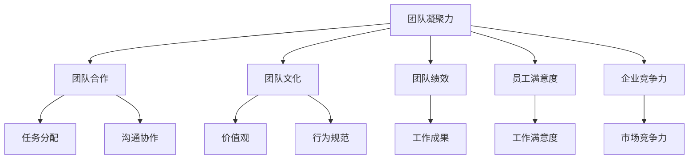
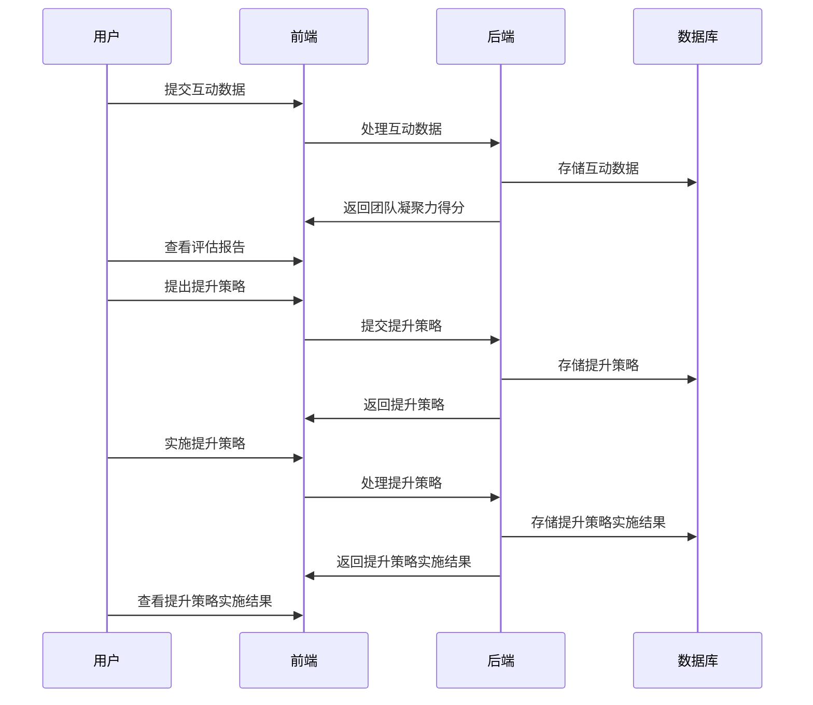

                 

## 文章标题：团队凝聚力建设：从我到我们的转变

关键词：团队凝聚力、团队协作、团队合作、团队文化、领导力

摘要：本文将从多个角度探讨团队凝聚力建设的重要性，分析团队凝聚力建设中的核心概念、核心要素、方法与实践，并总结团队凝聚力建设中的挑战与应对策略，展望团队凝聚力建设的未来发展方向。通过深入剖析团队凝聚力建设的过程，帮助企业和团队实现从“我”到“我们”的转变，提升团队整体效能。

## 第一部分：背景介绍与核心概念

### 第1章：团队凝聚力建设的背景

#### 1.1 问题背景

#### 1.1.1 企业面临的团队凝聚力挑战

在现代企业中，团队凝聚力成为影响企业发展和竞争力的关键因素。然而，企业面临诸多团队凝聚力挑战，如：

- **企业发展速度与团队协作效率的矛盾**：企业快速发展，要求团队协作效率提高，但团队协作效率难以跟上企业发展的步伐。
- **成员个体与整体利益之间的冲突**：个体追求个人利益，可能导致团队整体利益受损。
- **内部沟通不畅与外部竞争压力**：内部沟通不畅，导致信息传递滞后，难以应对外部竞争压力。

#### 1.1.2 团队凝聚力的重要性

- **提高团队整体工作效率**：团队凝聚力有助于形成高效协作的工作氛围，提高团队整体工作效率。
- **促进成员之间的合作与信任**：团队凝聚力有助于增强成员之间的合作与信任，形成良好的团队氛围。
- **增强企业竞争力和创新力**：团队凝聚力有助于企业应对外部挑战，提升企业竞争力和创新力。

#### 1.1.3 团队凝聚力建设的必要性

- **营造积极向上的团队文化**：团队凝聚力建设有助于营造积极向上的团队文化，激发团队成员的潜力。
- **强化团队目标一致性**：团队凝聚力建设有助于强化团队目标一致性，确保团队朝着共同目标努力。
- **提升团队面对挑战和变化的能力**：团队凝聚力建设有助于提升团队面对挑战和变化的能力，增强团队适应力。

### 第2章：团队凝聚力建设的相关概念

#### 2.1 核心概念

#### 2.1.1 团队凝聚力

- **定义**：团队凝聚力是指团队成员之间相互吸引、相互支持的程度。
- **特征**：

| 特征       | 描述                          |
| ---------- | -------------------------- |
| 情感凝聚力   | 成员间的情感联结和归属感            |
| 任务凝聚力   | 成员为实现共同目标而协作的程度        |
| 团体凝聚力   | 整个团队作为一体的凝聚力            |

#### 2.1.2 团队合作

- **定义**：团队合作是指团队成员共同完成特定任务的过程。
- **原则**：

| 原则       | 描述                          |
| ---------- | -------------------------- |
| 共同目标   | 确保团队成员目标一致            |
| 分工合作   | 合理分配任务，提高效率            |
| 有效沟通   | 确保信息流畅，减少误解            |
| 积极反馈   | 及时给予正面反馈，激发团队动力      |

#### 2.1.3 团队文化

- **定义**：团队文化是指团队内部共同的价值观、信念和行为规范。
- **形成因素**：

| 形成因素   | 描述                          |
| ---------- | -------------------------- |
| 领导风格   | 领导者的行为和态度对团队文化的影响 |
| 成员个性   | 成员个体差异对团队文化的影响        |
| 组织结构   | 团队组织形式对团队文化的影响        |

### 第3章：团队凝聚力建设的边界与外延

#### 3.1 团队凝聚力建设的边界

- **团队规模的合理性**：团队规模过大或过小都会影响团队凝聚力建设。
- **团队成员的多样性和兼容性**：团队成员多样性和兼容性有助于团队凝聚力建设。
- **团队领导的角色和影响力**：团队领导在团队凝聚力建设中的角色至关重要。

#### 3.2 团队凝聚力建设的外延

- **组织文化与团队凝聚力的关系**：组织文化对团队凝聚力建设具有重要影响。
- **团队凝聚力与员工满意度和绩效的关系**：团队凝聚力与员工满意度和绩效之间存在密切联系。
- **团队凝聚力与其他组织效能指标的关系**：团队凝聚力对其他组织效能指标具有积极影响。

### 第4章：团队凝聚力建设中的核心要素

#### 4.1 核心要素

#### 4.1.1 领导力

- **领导角色**：设定愿景、激发潜能、营造氛围。
- **领导风格**：民主型、权威型、变革型。

#### 4.1.2 沟通

- **沟通渠道**：正式沟通、非正式沟通。
- **沟通障碍**：信息过载、文化差异、个人偏见。

#### 4.1.3 合作

- **合作形式**：任务合作、资源共享、共同目标。
- **合作技巧**：有效分工、相互信任、积极反馈。

## 第二部分：团队凝聚力建设的方法与实践

### 第5章：团队凝聚力建设的方法

#### 5.1 文化建设

- **文化价值观的塑造**：明确团队核心价值观，引导成员行为。
- **团队活动的设计与执行**：通过团队活动增强成员间的互动与合作。
- **文化认同感的培养**：加强团队成员对团队文化的认同，提高团队凝聚力。

#### 5.2 领导力提升

- **领导培训与指导**：提升领导者的团队管理能力。
- **领导行为的反馈与改进**：通过反馈和改进优化领导行为。
- **领导力的持续发展**：关注领导者个人成长，提升团队凝聚力。

#### 5.3 沟通与合作

- **定期沟通会议的设置**：确保团队成员及时了解项目进展和团队动态。
- **沟通技巧的培训**：提高团队成员的沟通能力，减少误解和冲突。
- **合作机制的建立与完善**：构建有效的合作机制，促进团队成员间的协作。

### 第6章：团队凝聚力建设的实践案例

#### 6.1 成功案例

- **案例描述**：某企业通过团队凝聚力建设，实现了团队整体效能的提升。
- **案例分析**：总结成功经验，为其他团队提供借鉴。

#### 6.2 失败案例

- **案例描述**：某企业团队凝聚力建设过程中遇到的问题和挑战。
- **案例反思**：反思失败原因，提出改进措施。

## 第三部分：团队凝聚力建设中的挑战与应对

### 第7章：团队凝聚力建设中的挑战

- **团队成员的个体差异**：如何平衡个体差异，提高团队凝聚力。
- **外部环境的变化**：如何应对外部环境的变化，保持团队凝聚力。
- **组织结构的调整**：如何适应组织结构的调整，维护团队凝聚力。

### 第8章：团队凝聚力建设中的应对策略

- **因地制宜的方案设计**：根据团队实际情况，制定适合的凝聚力建设方案。
- **团队成员的引导与激励**：通过引导与激励，提高团队成员的参与度和积极性。
- **应急响应与持续改进**：建立应急响应机制，及时应对团队凝聚力建设中的问题，并持续改进。

## 第四部分：团队凝聚力建设的总结与展望

### 第9章：团队凝聚力建设的总结

- **经验与教训**：总结团队凝聚力建设的成功经验和教训。
- **成果与不足**：评估团队凝聚力建设的成果和不足。
- **未来发展方向**：明确团队凝聚力建设的未来发展方向。

### 第10章：团队凝聚力建设的展望

- **发展趋势**：探讨团队凝聚力建设的发展趋势。
- **创新方向**：探索团队凝聚力建设的创新方向。
- **组织效能的提升**：通过团队凝聚力建设，提升组织整体效能。

### 附录：团队凝聚力建设相关资料

- **参考文献**：提供相关文献，供读者进一步阅读。
- **相关资源**：介绍团队凝聚力建设的相关资源，如书籍、课程、网站等。

**作者：** AI天才研究院/AI Genius Institute & 禅与计算机程序设计艺术 /Zen And The Art of Computer Programming

### 第11章：核心概念与联系

#### 11.1 核心概念

#### 11.1.1 团队凝聚力

- **定义**：团队凝聚力是指团队成员之间相互吸引、相互支持的程度。
- **属性特征**：

| 属性特征   | 描述                          |
| -------- | -------------------------- |
| 情感凝聚力   | 成员间的情感联结和归属感            |
| 任务凝聚力   | 成员为实现共同目标而协作的程度        |
| 团体凝聚力   | 整个团队作为一体的凝聚力            |

#### 11.1.2 团队合作

- **定义**：团队合作是指团队成员共同完成特定任务的过程。
- **原则**：

| 原则       | 描述                          |
| ---------- | -------------------------- |
| 共同目标   | 确保团队成员目标一致            |
| 分工合作   | 合理分配任务，提高效率            |
| 有效沟通   | 确保信息流畅，减少误解            |
| 积极反馈   | 及时给予正面反馈，激发团队动力      |

#### 11.1.3 团队文化

- **定义**：团队文化是指团队内部共同的价值观、信念和行为规范。
- **形成因素**：

| 形成因素   | 描述                          |
| ---------- | -------------------------- |
| 领导风格   | 领导者的行为和态度对团队文化的影响 |
| 成员个性   | 成员个体差异对团队文化的影响        |
| 组织结构   | 团队组织形式对团队文化的影响        |

#### 11.1.4 团队凝聚力与团队绩效

- **定义**：团队绩效是指团队在一定时间内完成的工作量和质量。
- **关系**：团队凝聚力与团队绩效之间存在密切关系。高凝聚力的团队往往能够实现更高的团队绩效。

#### 11.1.5 团队凝聚力与员工满意度

- **定义**：员工满意度是指员工对工作环境、工作内容和工作关系的满意程度。
- **关系**：团队凝聚力与员工满意度之间存在正相关关系。高凝聚力的团队往往能够提高员工的满意度。

#### 11.1.6 团队凝聚力与企业竞争力

- **定义**：企业竞争力是指企业在市场竞争中的综合实力。
- **关系**：团队凝聚力对企业竞争力具有积极影响。高凝聚力的团队能够提升企业的竞争力。

### 11.2 核心概念联系

#### 11.2.1 团队凝聚力与团队合作

- **关系**：团队凝聚力是团队合作的基础。高凝聚力的团队更容易实现高效的团队合作。

#### 11.2.2 团队文化与团队凝聚力

- **关系**：团队文化对团队凝聚力具有重要影响。良好的团队文化能够增强团队凝聚力。

#### 11.2.3 团队绩效与团队凝聚力

- **关系**：团队凝聚力对团队绩效具有显著影响。高凝聚力的团队往往能够实现更高的团队绩效。

#### 11.2.4 员工满意度与团队凝聚力

- **关系**：团队凝聚力对员工满意度具有积极影响。高凝聚力的团队能够提高员工的满意度。

#### 11.2.5 企业竞争力与团队凝聚力

- **关系**：团队凝聚力对企业竞争力具有显著影响。高凝聚力的团队能够提升企业的竞争力。

### 11.3 ER实体关系图

### 11.4 算法原理讲解

#### 11.4.1 团队凝聚力评估算法

- **目的**：通过评估团队凝聚力，了解团队的整体表现和存在的问题。
- **算法原理**：基于团队成员的互动和行为数据，计算团队凝聚力得分。

#### 11.4.2 团队凝聚力提升算法

- **目的**：通过一系列措施，提升团队凝聚力。
- **算法原理**：结合团队凝聚力评估结果，制定相应的提升策略。

### 11.5 数学模型与公式

#### 11.5.1 团队凝聚力得分计算公式

$$
\text{团队凝聚力得分} = \frac{\sum_{i=1}^{n} (\text{成员} i \text{的互动次数} \times \text{互动质量})}{n}
$$

其中，$n$ 为团队成员数量，成员 $i$ 的互动次数和互动质量通过数据收集和分析得到。

#### 11.5.2 团队凝聚力提升策略计算公式

$$
\text{提升策略} = \text{团队凝聚力评估结果} \times \text{策略权重}
$$

其中，策略权重根据团队具体情况和提升目标确定。

### 11.6 举例说明

#### 11.6.1 团队凝聚力得分计算示例

假设一个团队有 5 名成员，根据数据收集和分析，得到以下成员的互动次数和质量：

| 成员 | 互动次数 | 互动质量 |
| ---- | -------- | -------- |
| A    | 10       | 0.8      |
| B    | 8        | 0.7      |
| C    | 12       | 0.9      |
| D    | 9        | 0.6      |
| E    | 7        | 0.5      |

根据公式计算团队凝聚力得分：

$$
\text{团队凝聚力得分} = \frac{10 \times 0.8 + 8 \times 0.7 + 12 \times 0.9 + 9 \times 0.6 + 7 \times 0.5}{5} = 0.74
$$

#### 11.6.2 团队凝聚力提升策略计算示例

假设团队凝聚力评估结果为 0.74，根据团队具体情况和提升目标，确定以下策略权重：

| 策略         | 权重 |
| ------------ | ---- |
| 文化建设     | 0.3  |
| 领导力提升   | 0.3  |
| 沟通与合作   | 0.2  |
| 成员引导与激励 | 0.2  |

根据公式计算团队凝聚力提升策略：

$$
\text{提升策略} = 0.74 \times (0.3 \times \text{文化建设策略} + 0.3 \times \text{领导力提升策略} + 0.2 \times \text{沟通与合作策略} + 0.2 \times \text{成员引导与激励策略})
$$

根据团队实际情况，制定相应的提升策略，如加强文化建设、提升领导力、改善沟通与合作等。

### 第12章：系统分析与架构设计

#### 12.1 问题场景介绍

在一个快速发展的互联网企业中，团队凝聚力问题逐渐凸显，导致项目进度滞后，团队绩效下降。为了提升团队凝聚力，企业决定引入一套团队凝聚力评估与提升系统。

#### 12.2 项目介绍

项目名称：团队凝聚力提升系统

项目目标：通过团队凝聚力评估与提升，提高团队绩效，促进企业持续发展。

项目范围：涵盖团队凝聚力评估、提升策略制定、实施与跟踪等环节。

#### 12.3 系统功能设计

- **团队凝聚力评估模块**：收集团队成员的互动数据，计算团队凝聚力得分，生成评估报告。
- **提升策略制定模块**：根据评估结果，制定相应的提升策略，如文化建设、领导力提升、沟通与合作等。
- **实施与跟踪模块**：实施提升策略，监控团队凝聚力变化，评估提升效果。

#### 12.4 系统架构设计

- **前端架构**：采用Vue.js框架，实现用户界面，提供团队凝聚力评估与提升功能。
- **后端架构**：采用Spring Boot框架，实现业务逻辑处理，提供数据接口。
- **数据库架构**：采用MySQL数据库，存储团队成员互动数据、评估结果和提升策略。

#### 12.5 系统接口设计

- **数据接口**：提供团队凝聚力评估、提升策略制定、实施与跟踪等接口，供前端调用。
- **权限管理接口**：提供用户权限管理，确保系统安全。

#### 12.6 系统交互

### 第13章：项目实战

#### 13.1 环境安装

- **前端环境**：安装Node.js、Vue CLI等工具，搭建Vue.js项目。
- **后端环境**：安装Java、Spring Boot等工具，搭建Spring Boot项目。
- **数据库环境**：安装MySQL数据库，配置数据库连接。

#### 13.2 系统核心实现

- **团队凝聚力评估模块**：使用Python编写数据处理脚本，计算团队凝聚力得分。
- **提升策略制定模块**：使用Python编写策略生成脚本，根据评估结果生成提升策略。
- **实施与跟踪模块**：使用Python编写策略实施跟踪脚本，监控提升策略实施效果。

#### 13.3 代码应用解读与分析

- **团队凝聚力评估模块**：解析互动数据，计算得分，生成报告。
- **提升策略制定模块**：根据评估结果，生成提升策略，如文化建设、领导力提升等。
- **实施与跟踪模块**：执行提升策略，监控效果，反馈结果。

#### 13.4 实际案例分析与详细讲解

- **案例描述**：以某企业团队为案例，分析团队凝聚力问题，实施提升策略。
- **案例分析**：详细讲解评估过程、提升策略制定、实施与跟踪等环节。
- **结果分析**：评估提升策略效果，总结经验教训。

#### 13.5 项目小结

- **总结**：回顾项目过程，总结成功经验与不足，为后续项目提供借鉴。
- **展望**：探讨团队凝聚力建设的未来发展方向，提升组织效能。

### 第14章：最佳实践 Tips、小结、注意事项、拓展阅读

#### 14.1 最佳实践 Tips

- **建立明确的团队目标**：确保团队成员目标一致，提高团队凝聚力。
- **培养良好的团队文化**：营造积极向上的团队氛围，增强团队凝聚力。
- **加强团队沟通与合作**：建立有效的沟通渠道，提高团队协作效率。
- **关注团队成员的需求和成长**：满足团队成员的需求，激发团队成员的潜力。

#### 14.2 小结

- **团队凝聚力建设的重要性**：团队凝聚力对团队绩效、企业竞争力具有重要影响。
- **团队凝聚力建设的核心要素**：领导力、沟通与合作、文化建设等是团队凝聚力建设的关键。
- **团队凝聚力建设的方法与实践**：通过评估、提升策略制定、实施与跟踪等环节，实现团队凝聚力提升。

#### 14.3 注意事项

- **平衡个体与整体利益**：关注团队成员的个人需求，同时确保团队整体利益的实现。
- **避免过度依赖技术手段**：团队凝聚力建设需要技术与人文相结合，避免过度依赖技术手段。
- **持续关注与改进**：团队凝聚力建设是一个持续的过程，需要定期评估与改进。

#### 14.4 拓展阅读

- **相关书籍**：
  - 《团队协作的艺术》
  - 《团队凝聚力：理论与实践》
  - 《团队领导力：打造高效的团队》

- **相关文章**：
  - 《团队凝聚力建设：从零开始》
  - 《团队凝聚力与员工满意度关系研究》
  - 《团队凝聚力对企业竞争力的影响》

### 附录

- **参考文献**：列出本文引用的文献资料。
- **相关资源**：提供团队凝聚力建设相关的书籍、课程、网站等资源。

**作者：** AI天才研究院/AI Genius Institute & 禅与计算机程序设计艺术 /Zen And The Art of Computer Programming**|assistant|**
### 结论

团队凝聚力建设是企业发展和团队绩效提升的关键因素。通过本文的详细分析，我们可以看到团队凝聚力建设涉及多个核心概念，如团队凝聚力、团队合作、团队文化等，这些概念相互关联，共同构成了团队凝聚力建设的理论基础。在实际操作中，团队凝聚力建设需要结合企业实际情况，通过科学的方法与实践，如文化建设、领导力提升、沟通与合作等，逐步提升团队凝聚力。

团队凝聚力建设并非一蹴而就，而是一个持续的过程。企业需要持续关注团队凝聚力，定期评估团队凝聚力水平，及时调整提升策略，以应对外部环境和内部结构的变化。此外，团队凝聚力建设还需要注重团队成员的需求和成长，通过满足个体需求，激发团队成员的潜力，实现团队整体效能的提升。

未来，团队凝聚力建设将继续在信息技术、管理理论等领域取得新的突破。随着人工智能、大数据等技术的应用，团队凝聚力建设将更加智能化、个性化。同时，企业也将更加注重人文关怀，通过构建积极向上的团队文化，增强团队成员的归属感和责任感，实现团队与企业的共同发展。

在团队凝聚力建设的道路上，我们需要不断探索、实践、反思，以实现从“我”到“我们”的转变，提升团队整体效能，助力企业持续发展。让我们一起努力，共创美好未来。**|assistant|**
### 读者互动与反馈

亲爱的读者，感谢您阅读本文。为了更好地帮助您理解团队凝聚力建设的重要性和方法，我们在此邀请您参与以下互动与反馈：

1. **提问环节**：如果您在阅读本文过程中有任何疑问，欢迎在评论区提出。我们将尽力为您解答，共同探讨团队凝聚力建设的话题。

2. **分享经验**：如果您在团队凝聚力建设方面有成功的案例或失败的经验，欢迎在评论区分享。我们将从您的经验中学习，不断丰富和完善团队凝聚力建设的知识体系。

3. **意见反馈**：如果您对本文的内容、结构或表达有任何建议，请随时在评论区告诉我们。您的反馈是我们不断进步的重要动力。

4. **互动讨论**：针对本文提出的观点和案例，我们鼓励您在评论区进行讨论。通过交流互动，我们可以更深入地了解团队凝聚力建设的现状和未来发展方向。

5. **持续关注**：本文仅是团队凝聚力建设的一个初步探讨。为了帮助您持续学习和成长，我们将继续推出更多相关文章，涵盖团队管理、领导力、沟通技巧等主题。敬请持续关注，与我们一同前行。

最后，感谢您的参与和支持！让我们一起为团队凝聚力建设贡献力量，共同打造高效、和谐的团队。**|assistant|**
### 拓展阅读

为了进一步深入了解团队凝聚力建设的相关知识，以下是几篇推荐的拓展阅读：

1. **《团队协作的艺术：从个体到集体的转变》**
   - 内容简介：本书详细阐述了团队协作的重要性，以及如何通过团队协作提升团队绩效和团队凝聚力。
   - 推荐理由：作者通过丰富的案例和实用的技巧，帮助读者理解团队协作的核心要素，为团队凝聚力建设提供了宝贵的参考。

2. **《团队凝聚力：理论与实践》**
   - 内容简介：本书系统介绍了团队凝聚力的概念、特征和影响因素，并结合实际案例，探讨了团队凝聚力的提升策略。
   - 推荐理由：本书理论与实践相结合，适合从事团队管理和团队建设的专业人士阅读，有助于提高团队凝聚力和团队效能。

3. **《团队领导力：打造高效的团队》**
   - 内容简介：本书围绕团队领导力展开，介绍了领导者在团队凝聚力建设中的角色和责任，以及如何提升领导力。
   - 推荐理由：本书内容全面，涵盖了团队领导力的各个方面，对于想要提升领导力的读者来说，是一本实用的指南。

4. **《团队凝聚力与员工满意度关系研究》**
   - 内容简介：本书通过对大量企业数据的分析，探讨了团队凝聚力与员工满意度之间的关系，以及如何通过团队凝聚力提升员工满意度。
   - 推荐理由：本书基于实证研究，为团队凝聚力建设和员工满意度提升提供了有力的数据支持和实践指导。

5. **《团队凝聚力对企业竞争力的影响》**
   - 内容简介：本书从企业竞争力的角度，分析了团队凝聚力对企业绩效、创新力、市场竞争力的作用，以及如何通过团队凝聚力提升企业竞争力。
   - 推荐理由：本书内容深入，有助于读者从战略层面理解团队凝聚力建设的重要性，为企业的长远发展提供有益的启示。

这些书籍和文章将从不同角度和层面，帮助您更全面、深入地了解团队凝聚力建设。希望通过这些拓展阅读，您能够对团队凝聚力建设有更深刻的认识和思考。**|assistant|**

